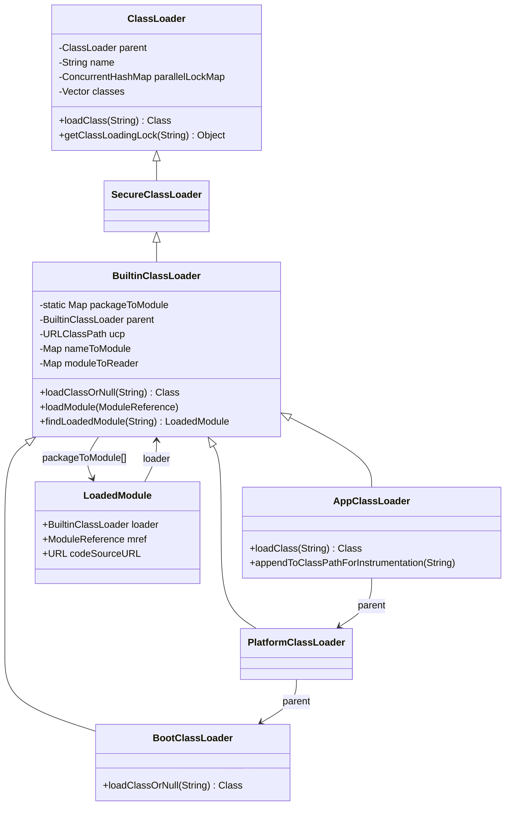

# 三级类加载器体系 — Java 层 ClassLoader 继承结构与初始化时序

> **目标**: 从源码角度完整分析 JDK 11 的三级内建类加载器（BootClassLoader / PlatformClassLoader / AppClassLoader）的创建过程、继承关系、委派模型与模块系统集成
> **源码**: `ClassLoaders.java`, `BuiltinClassLoader.java`, `ClassLoader.java`, `BootLoader.java`
> **标准环境**: `-Xms8g -Xmx8g -XX:+UseG1GC`
> **前置知识**: [system_dictionary_deep_dive.md](system_dictionary_deep_dive.md) (C++ 层 SystemDictionary)
> **本篇定位**: 类加载系统 4 篇系列的第 1 篇——聚焦"谁来加载"

---

## 第 0 部分：核心原理

### 0.1 本质是什么？

JDK 11 的三级类加载器是一个"模块感知的双亲委派体系"——在传统双亲委派的基础上，增加了模块感知能力：先通过包名查表直接定位目标模块的 ClassLoader，可以跨越层级委派，不再受限于单向的 parent 链。

### 0.2 为什么需要？

JDK 8 的纯层级双亲委派在模块化场景下有一个根本缺陷：**委派是单向的**。PlatformClassLoader 是 AppClassLoader 的 parent，永远不能向下委托给 AppClassLoader。但在模块化场景下，升级模块（属于 PlatformClassLoader）可能需要引用应用模块（属于 AppClassLoader）的类——传统双亲委派做不到这一点。

### 0.3 怎么解决？

引入全局共享的 `packageToModule` 静态映射表，包名直接映射到拥有该模块的 ClassLoader。加载类时先查表，找到就直接委托，不再依赖层级结构。只有不在任何模块中的类（classpath 上的类）才走传统的双亲委派链。

### 0.4 为什么这样设计？

- **为什么 `packageToModule` 是静态的？** 三个 loader 共享同一张表，任何一个 loader 都能直接定位到其他 loader 的模块，实现跨层级委派
- **为什么 BootClassLoader 要装成 null？** 大量已有代码依赖 `getParent()==null` 判断是否到达 Bootstrap Loader，如果返回 Java 对象会全部坏掉
- **为什么不继承 URLClassLoader？** URLClassLoader 只支持 URL 路径，不支持模块资源读取；BuiltinClassLoader 支持模块路径（ModuleReader）+ classpath 路径（URLClassPath）双模式

---

## 第 1 部分：数据结构全景

### 数据结构清单

| 结构名 | 源码位置 | 核心作用 |
|--------|----------|----------|
| `ClassLoader` | `java/lang/ClassLoader.java:228` | 所有 ClassLoader 的抽象基类，定义双亲委派骨架 |
| `BuiltinClassLoader` | `jdk/internal/loader/BuiltinClassLoader.java:99` | 三个内建 loader 的公共基类，实现模块感知委派 |
| `LoadedModule` | `BuiltinClassLoader.java:内部类` | 记录模块归属（哪个 loader 拥有哪个模块） |
| `ClassLoaders.BootClassLoader` | `ClassLoaders.java:112` | Bootstrap 加载器，穿透到 C++ 层 |
| `ClassLoaders.PlatformClassLoader` | `ClassLoaders.java:130` | 平台模块加载器 |
| `ClassLoaders.AppClassLoader` | `ClassLoaders.java:155` | 应用类加载器，加载 classpath |

### ClassLoader 核心字段分析

**问题推导**：ClassLoader 需要支持双亲委派（需要 parent 引用）、并行加载（需要 per-class-name 锁）、防止 Class 被 GC（需要持有 Class 引用）、包管理（需要包注册表）。

```java
// ClassLoader.java:228
private final ClassLoader parent;          // ★ VM 硬编码了此字段偏移量！必须是第一个实例字段
                                           //   C++ 层通过固定偏移直接读取，不走 getter
private final String name;                 // JDK 9+ 新增，如 "app", "platform"（可为 null）
private final Module unnamedModule;        // 此 loader 的未命名模块
// ★ VM 也直接读取此字段判断是否 parallel capable
private final ConcurrentHashMap<String, Object> parallelLockMap;  // null=非并行, 非null=并行
private final Vector<Class<?>> classes;    // 防止 Class 被 GC（弱引用保护）
private final ConcurrentHashMap<String, NamedPackage> packages;   // 已定义包注册表
```

**关键字段生命周期**：

| 字段 | 谁设置 | 何时设置 | 设置什么值 | 谁读取 |
|------|--------|----------|-----------|--------|
| ★ `parent` | 构造器 | ClassLoader 创建时 | 父 loader 引用（Boot 传 null） | `loadClass()` 委派时；VM C++ 层直接读 |
| ★ `parallelLockMap` | `registerAsParallelCapable()` | static 块中 | `new ConcurrentHashMap<>()` | `getClassLoadingLock()` 判断锁粒度；VM 直接读 |
| `classes` | `addClass()` | `defineClass()` 成功后 | 新定义的 Class 对象 | GC 根扫描（防止 Class 被回收） |
| `packages` | `definePackage()` | 首次加载某包的类时 | `NamedPackage` 实例 | `getPackage()` / `getPackages()` |

### BuiltinClassLoader 核心字段分析

**问题推导**：BuiltinClassLoader 需要在 ClassLoader 基础上增加：模块感知（需要包→模块映射）、模块资源读取（需要 ModuleReader）、classpath 搜索（需要 URLClassPath）。

```java
// BuiltinClassLoader.java:140
// ★ 静态！所有三个 loader 共享同一张表
private static final Map<String, LoadedModule> packageToModule
    = new ConcurrentHashMap<>(1024);       // 包名 → LoadedModule{loader, mref}

// 实例字段（每个 loader 独有）
private final BuiltinClassLoader parent;   // 真实 parent（可以是 BootClassLoader）
                                           // 注意：ClassLoader.parent 对外暴露的是 null
private final URLClassPath ucp;            // classpath 搜索路径（AppClassLoader 有值）
private final Map<String, ModuleReference> nameToModule;  // 模块名 → ModuleReference
private final Map<ModuleReference, ModuleReader> moduleToReader; // 模块 → 资源读取器
```

**关键字段生命周期**：

| 字段 | 谁设置 | 何时设置 | 设置什么值 | 谁读取 |
|------|--------|----------|-----------|--------|
| ★ `packageToModule` | `loadModule()` | `initPhase2` 时 `ModuleBootstrap.boot()` 调用 | 包名 → `LoadedModule` | `findLoadedModule()` 在每次 `loadClassOrNull()` 时查询 |
| `nameToModule` | `loadModule()` | 同上 | 模块名 → `ModuleReference` | `findModule()` |
| `ucp` | 构造器 | ClassLoader 创建时 | `AppClassLoader` 传入 classpath 的 `URLClassPath`；其他传 null | `findClassOnClassPathOrNull()` |
| `moduleToReader` | `moduleReaderFor()` | 首次读取模块资源时 lazy 创建 | `ModuleReader` 实例 | `findClassInModuleOrNull()` |

### LoadedModule 字段分析

```java
// BuiltinClassLoader.java 内部类
private static class LoadedModule {
    private final BuiltinClassLoader loader;  // ★ 拥有此模块的 ClassLoader
    private final ModuleReference mref;       // 模块引用（含模块描述符和资源定位器）
    private final URL codeSourceURL;          // 代码源 URL（安全管理器用）
}
```

**sizeof 估算**：3 个引用字段 = 3 × 8 = 24 字节（64 位 JVM，不含对象头 16 字节）= 约 40 字节

**创建位置**：`BuiltinClassLoader.loadModule()` 中，每个模块创建一个 `LoadedModule` 实例，然后将模块的所有包名注册到 `packageToModule` 表中。

---

## 一句话总结

JDK 11 的三级内建类加载器是在 `ClassLoaders.java` 的 **static 初始化块** 中一次性创建的：`BootClassLoader`(null parent) → `PlatformClassLoader`(parent=Boot) → `AppClassLoader`(parent=Platform)。它们共享 `BuiltinClassLoader` 基类，该基类重写了 `loadClass()` 方法实现了一种**模块感知的委派模型**——先按包名查模块（`packageToModule` 映射表），再走传统双亲委派，与 JDK 8 的纯层级委派有本质区别。

---

## 1. 设计哲学：为什么需要三级类加载器？

### 1.1 核心问题

JVM 需要加载不同来源的类：

| 来源 | 示例 | 安全级别 | 加载者 |
|------|------|---------|--------|
| JVM 核心库 | `java.lang.Object`, `java.util.HashMap` | 最高（不可被替换） | BootClassLoader |
| 平台模块 | `java.sql.*`, `java.xml.*`, `javax.crypto.*` | 高（可被升级模块替换） | PlatformClassLoader |
| 应用代码 | `com.example.MyApp`, 第三方 JAR | 普通 | AppClassLoader |

### 1.2 JDK 8 → JDK 9+ 的演进

```
JDK 8 体系:                          JDK 9+ 体系:
┌─────────────────────────┐          ┌─────────────────────────┐
│ Bootstrap ClassLoader   │          │ BootClassLoader         │
│ (C++ 实现, Java 中为 null)│         │ (Java 实现!)            │
│ 加载: rt.jar            │          │ 加载: java.base 模块等   │
├─────────────────────────┤          ├─────────────────────────┤
│ Extension ClassLoader   │          │ PlatformClassLoader     │
│ (URLClassLoader 子类)    │  ──→    │ (BuiltinClassLoader 子类)│
│ 加载: lib/ext/*.jar     │          │ 加载: java.sql 等平台模块│
├─────────────────────────┤          ├─────────────────────────┤
│ App ClassLoader         │          │ AppClassLoader          │
│ (URLClassLoader 子类)    │          │ (BuiltinClassLoader 子类)│
│ 加载: -classpath        │          │ 加载: -classpath + 模块  │
└─────────────────────────┘          └─────────────────────────┘
```

**关键变化**：
1. **BootClassLoader 从 C++ 变成 Java**：JDK 9 引入了 Java 层的 `BootClassLoader`，但它在 `getParent()` 时仍返回 `null`（兼容性设计）
2. **ExtClassLoader → PlatformClassLoader**：名字变了，职责也变了——不再是 `lib/ext` 目录，而是平台模块
3. **不再继承 URLClassLoader**：三个都继承 `BuiltinClassLoader`，支持模块化加载
4. **包 → 模块映射**：新增 `packageToModule` 静态映射表，类加载先查模块

### 1.3 为什么 BootClassLoader 要装成 null？

```java
// BuiltinClassLoader 构造器（第 158 行）
BuiltinClassLoader(String name, BuiltinClassLoader parent, URLClassPath ucp) {
    // ★ 关键：如果 parent 是 BootClassLoader，传 null 给 java.lang.ClassLoader
    super(name, parent == null || parent == ClassLoaders.bootLoader() ? null : parent);
    this.parent = parent;
    // ...
}
```

**兼容性！** 大量已有代码依赖 `classLoader.getParent() == null` 来判断是否到达了 Bootstrap Loader。如果 `getParent()` 返回一个 Java 对象，这些代码全会坏。因此 `BuiltinClassLoader` 内部有**两个 parent 引用**：
- `this.parent`（`BuiltinClassLoader` 字段）：真实的 Java 层 parent，可以是 `BootClassLoader`
- `super.parent`（`ClassLoader` 字段）：对外暴露的 parent，`BootClassLoader` 被映射为 `null`

---

## 2. 完整继承关系

```
java.lang.ClassLoader (抽象类)
  │
  ├── 核心字段:
  │   ├── parent: ClassLoader       // 双亲委派的 parent（VM 硬编码了偏移量！）
  │   ├── name: String              // JDK 9+ 新增，如 "app", "platform"
  │   ├── unnamedModule: Module     // 未命名模块
  │   ├── parallelLockMap: ConcurrentHashMap<String, Object>  // 并行加载锁
  │   ├── classes: Vector<Class>    // 防止 Class 被 GC（弱引用保护）
  │   └── packages: ConcurrentHashMap<String, NamedPackage>   // 已定义包
  │
  └── java.security.SecureClassLoader
        │
        └── jdk.internal.loader.BuiltinClassLoader  ★ 三级加载器的公共基类
              │
              ├── 核心字段:
              │   ├── parent: BuiltinClassLoader    // 真实 parent（可以是 BootClassLoader）
              │   ├── ucp: URLClassPath             // classpath 搜索路径
              │   ├── nameToModule: ConcurrentHashMap<String, ModuleReference>
              │   └── moduleToReader: ConcurrentHashMap<ModuleReference, ModuleReader>
              │
              ├── 静态字段:
              │   └── packageToModule: ConcurrentHashMap<String, LoadedModule>
              │       // ★ 全局共享！所有 BuiltinClassLoader 共用一个 package→module 映射
              │
              ├── ClassLoaders.BootClassLoader   (private static inner class)
              │   ├── parent = null
              │   ├── name = null (getParent() 返回 null)
              │   ├── ucp = -Xbootclasspath/a 路径（通常为 null）
              │   └── 重写 loadClassOrNull → JLA.findBootstrapClassOrNull()
              │       // ★ 委托给 JVM C++ 层的 SystemDictionary::resolve_or_null
              │
              ├── ClassLoaders.PlatformClassLoader   (private static inner class)
              │   ├── parent = BootClassLoader
              │   ├── name = "platform"
              │   ├── ucp = null (无 classpath)
              │   └── 注册为 parallelCapable
              │
              └── ClassLoaders.AppClassLoader   (private static inner class)
                  ├── parent = PlatformClassLoader
                  ├── name = "app"
                  ├── ucp = java.class.path 的 URLClassPath
                  ├── 注册为 parallelCapable
                  └── 重写 loadClass → 增加 SecurityManager.checkPackageAccess
```

### 2.1 关键设计点

**1) `packageToModule` 是静态的（类级别共享）**

```java
// BuiltinClassLoader.java:140
private static final Map<String, LoadedModule> packageToModule
    = new ConcurrentHashMap<>(1024);
```

所有三个 BuiltinClassLoader **共享同一个映射表**。当任何一个 loader 调用 `loadModule(mref)` 时，模块的所有包都会被注册到这个全局表中。这意味着 `AppClassLoader.loadClassOrNull("java.lang.String")` 可以通过 `packageToModule` 直接找到 `java.lang` 包属于 `java.base` 模块，然后委托给 `BootClassLoader` 加载——**不需要沿 parent 链逐级查询**。

**2) `LoadedModule` 内部类**

```java
private static class LoadedModule {
    private final BuiltinClassLoader loader;  // 定义这个模块的 ClassLoader
    private final ModuleReference mref;       // 模块引用
    private final URL codeSourceURL;          // 代码源 URL
}
```

每个 `LoadedModule` 记录了"哪个 ClassLoader 拥有这个模块"。这样在查找类时，可以直接定位到正确的 ClassLoader，而不是依赖双亲链。

**3) BootClassLoader 的特殊性**

```java
// ClassLoaders.java:112
private static class BootClassLoader extends BuiltinClassLoader {
    BootClassLoader(URLClassPath bcp) {
        super(null, null, bcp);   // name=null, parent=null
    }

    @Override
    protected Class<?> loadClassOrNull(String cn) {
        return JLA.findBootstrapClassOrNull(this, cn);
        // ★ 直接调用 C++ 层！不走 Java 层的 loadClass 流程
    }
}
```

`BootClassLoader` 完全不走 `BuiltinClassLoader.loadClassOrNull()` 的默认实现——它直接通过 `JavaLangAccess` 桥接到 C++ 层的 `SystemDictionary::resolve_or_null()`。

---

## 3. 创建时序：ClassLoaders 的 static 初始化

### 3.1 触发时机

```
JVM 启动序列:
  create_vm()
    → Threads::create_vm_init_agents()
    → init_globals()
    → call_initPhase1()           // System.initPhase1: 初始化基本属性
    → call_initPhase2()           // 模块系统初始化：创建 boot layer
                                  //   → 此时触发 ClassLoaders 类初始化！
                                  //   → ClassLoaders.<clinit> 创建三个 loader
    → call_initPhase3()           // System.initPhase3:
                                  //   → VM.initLevel(3)
                                  //   → ClassLoader.initSystemClassLoader()
                                  //   → 设置 TCCL
                                  //   → VM.initLevel(4)
```

### 3.2 ClassLoaders 静态初始化块

```java
// ClassLoaders.java:58 — static 块
static {
    // 步骤1: 处理 -Xbootclasspath/a 参数
    String append = VM.getSavedProperty("jdk.boot.class.path.append");
    BOOT_LOADER =
        new BootClassLoader((append != null && !append.isEmpty())
            ? new URLClassPath(append, true)    // 有追加路径
            : null);                             // 通常为 null

    // 步骤2: 创建 PlatformClassLoader，parent = BootClassLoader
    PLATFORM_LOADER = new PlatformClassLoader(BOOT_LOADER);

    // 步骤3: 解析 java.class.path 系统属性
    String cp = System.getProperty("java.class.path");
    if (cp == null || cp.isEmpty()) {
        String initialModuleName = System.getProperty("jdk.module.main");
        cp = (initialModuleName == null) ? "" : null;
    }
    URLClassPath ucp = new URLClassPath(cp, false);

    // 步骤4: 创建 AppClassLoader，parent = PlatformClassLoader
    APP_LOADER = new AppClassLoader(PLATFORM_LOADER, ucp);
}
```

### 3.3 创建时序图

```
时间 ──────────────────────────────────────────────────────────────────
T0   ClassLoaders.<clinit> 开始执行

T1   创建 BootClassLoader
     ├── name = null
     ├── parent = null
     ├── ucp = null (无 -Xbootclasspath/a)
     └── super(null, null, null)
         └── java.lang.ClassLoader(Void, null, null)
             ├── this.parent = null
             ├── this.unnamedModule = new Module(this)
             ├── parallelLockMap = new ConcurrentHashMap()  // parallel capable
             └── this.nameAndId = "jdk.internal.loader.ClassLoaders$BootClassLoader"

T2   创建 PlatformClassLoader
     ├── name = "platform"
     ├── parent = BOOT_LOADER
     ├── ucp = null
     └── super("platform", BOOT_LOADER, null)
         └── java.lang.ClassLoader(Void, "platform", null)
             ├── this.parent = null ← ★ 传给 ClassLoader 的是 null!
             └── this.nameAndId = "'platform'"
                 // 但 BuiltinClassLoader.parent = BOOT_LOADER（真实引用）

T3   解析 java.class.path → URLClassPath

T4   创建 AppClassLoader
     ├── name = "app"
     ├── parent = PLATFORM_LOADER
     ├── ucp = URLClassPath(classpath)
     └── super("app", PLATFORM_LOADER, ucp)
         └── java.lang.ClassLoader(Void, "app", PLATFORM_LOADER)
             ├── this.parent = PLATFORM_LOADER ← ★ ClassLoader 层面 parent = Platform
             └── this.nameAndId = "'app'"

T5   ClassLoaders.<clinit> 完成
```

### 3.4 initSystemClassLoader() — 系统类加载器确定

```java
// ClassLoader.java:1958
static synchronized ClassLoader initSystemClassLoader() {
    // 必须在 initLevel == 3 时调用
    if (VM.initLevel() != 3) throw new InternalError(...);

    ClassLoader builtinLoader = getBuiltinAppClassLoader();  // → ClassLoaders.appClassLoader()

    // 检查是否配置了自定义系统类加载器
    String cn = System.getProperty("java.system.class.loader");
    if (cn != null) {
        // 自定义加载器必须有 ClassLoader(ClassLoader parent) 构造器
        Constructor<?> ctor = Class.forName(cn, false, builtinLoader)
                                   .getDeclaredConstructor(ClassLoader.class);
        scl = (ClassLoader) ctor.newInstance(builtinLoader);
        // ★ 自定义加载器的 parent = AppClassLoader
    } else {
        scl = builtinLoader;  // 默认 = AppClassLoader
    }
    return scl;
}
```

**`getSystemClassLoader()` 的分阶段行为**：

```java
public static ClassLoader getSystemClassLoader() {
    switch (VM.initLevel()) {
        case 0: case 1: case 2:
            return getBuiltinAppClassLoader();  // 初始化期间直接返回 AppClassLoader
        case 3:
            throw new IllegalStateException(...);  // 正在初始化中，不可调用
        default:
            return scl;  // 完全初始化后返回 scl（可能是自定义 loader）
    }
}
```

---

## 4. BuiltinClassLoader.loadClassOrNull() — 模块感知的委派模型

### 4.1 核心算法

这是 JDK 9+ 最核心的变化——`loadClass` 不再是简单的"先问 parent，parent 找不到再自己找"，而是**先按模块定位，找不到再走 parent 链**：

```java
// BuiltinClassLoader.java:553
protected Class<?> loadClassOrNull(String cn, boolean resolve) {
    synchronized (getClassLoadingLock(cn)) {
        // ① 检查是否已加载
        Class<?> c = findLoadedClass(cn);

        if (c == null) {
            // ② 查 packageToModule：这个类的包属于哪个模块？
            LoadedModule loadedModule = findLoadedModule(cn);

            if (loadedModule != null) {
                // ★ 模块路径：直接委托给拥有该模块的 ClassLoader
                BuiltinClassLoader loader = loadedModule.loader();
                if (loader == this) {
                    // 就是我自己的模块 → 从模块中加载
                    if (VM.isModuleSystemInited()) {
                        c = findClassInModuleOrNull(loadedModule, cn);
                    }
                } else {
                    // 委托给另一个 ClassLoader（可能是 BootLoader 或 PlatformLoader）
                    c = loader.loadClassOrNull(cn);
                }

            } else {
                // ★ 非模块路径（unnamed module / classpath）：走传统双亲委派
                // ③ 委托给 parent
                if (parent != null) {
                    c = parent.loadClassOrNull(cn);
                }

                // ④ parent 找不到 → 搜索自己的 classpath
                if (c == null && hasClassPath() && VM.isModuleSystemInited()) {
                    c = findClassOnClassPathOrNull(cn);
                }
            }
        }

        if (resolve && c != null)
            resolveClass(c);
        return c;
    }
}
```

### 4.2 两条路径对比

```
路径 A: 模块感知路径（JDK 9+ 新增）
════════════════════════════════════════════════════
AppClassLoader.loadClassOrNull("java.lang.String")
  │
  ├── findLoadedClass("java.lang.String") → null (首次)
  │
  ├── findLoadedModule("java.lang.String")
  │   └── packageToModule.get("java.lang")
  │       → LoadedModule{loader=BootClassLoader, mref=java.base}
  │
  ├── loader != this → 委托给 BootClassLoader
  │   └── BootClassLoader.loadClassOrNull("java.lang.String")
  │       └── JLA.findBootstrapClassOrNull(this, "java.lang.String")
  │           └── ClassLoader.findBootstrapClass("java.lang.String")
  │               └── [native] JVM_FindClassFromBootLoader
  │                   └── SystemDictionary::resolve_or_null(...)
  │                       → 返回 java.lang.String 的 InstanceKlass
  │
  └── 返回 java.lang.String

路径 B: 传统双亲委派路径
════════════════════════════════════════════════════
AppClassLoader.loadClassOrNull("com.example.MyApp")
  │
  ├── findLoadedClass("com.example.MyApp") → null
  │
  ├── findLoadedModule("com.example.MyApp")
  │   └── packageToModule.get("com.example") → null
  │       // com.example 不属于任何已知模块
  │
  ├── 走传统双亲委派:
  │   └── parent.loadClassOrNull("com.example.MyApp")
  │       = PlatformClassLoader.loadClassOrNull(...)
  │         ├── findLoadedModule → null
  │         └── parent.loadClassOrNull(...)
  │             = BootClassLoader.loadClassOrNull(...)
  │               └── JVM_FindClassFromBootLoader → null
  │
  ├── parent 找不到 → 搜索自己的 classpath
  │   └── findClassOnClassPathOrNull("com.example.MyApp")
  │       └── ucp.getResource("com/example/MyApp.class")
  │           → 找到 → defineClass(...)
  │
  └── 返回 com.example.MyApp
```

### 4.3 与 ClassLoader.loadClass() 的对比

```java
// ClassLoader.java:573 — 传统双亲委派（给自定义 ClassLoader 用）
protected Class<?> loadClass(String name, boolean resolve)
    throws ClassNotFoundException
{
    synchronized (getClassLoadingLock(name)) {
        Class<?> c = findLoadedClass(name);
        if (c == null) {
            try {
                if (parent != null) {
                    c = parent.loadClass(name, false);  // 委托 parent
                } else {
                    c = findBootstrapClassOrNull(name);  // 到达 bootstrap
                }
            } catch (ClassNotFoundException e) { }

            if (c == null) {
                c = findClass(name);  // 自己加载
            }
        }
        if (resolve) resolveClass(c);
        return c;
    }
}
```

| 对比维度 | `ClassLoader.loadClass()` | `BuiltinClassLoader.loadClassOrNull()` |
|---------|--------------------------|---------------------------------------|
| 委派策略 | 固定：parent → self | 模块优先：module → parent → self |
| 模块感知 | ❌ 不感知 | ✅ 先查 `packageToModule` |
| 锁粒度 | `getClassLoadingLock()` | `getClassLoadingLock()` |
| 异常 | 抛 `ClassNotFoundException` | 返回 `null` |
| 使用者 | 自定义 ClassLoader | 三个内建 ClassLoader |

### 4.4 模块感知委派的关键优势

**问题场景**：PlatformClassLoader 定义的升级模块需要引用 AppClassLoader 的类。

在传统双亲委派中，PlatformClassLoader 是 AppClassLoader 的 parent，**不可能**向下委托给 AppClassLoader。但模块感知委派通过 `packageToModule` 映射表可以**跨越层级直接定位**——如果某个包被映射到 AppClassLoader 的模块中，PlatformClassLoader 也能直接委托过去。

```
传统双亲委派（单向）:      模块感知委派（可跨级）:
Boot ← Platform ← App     Boot ←──→ Platform ←──→ App
                                    ↑              │
                                    └──────────────┘
                                    通过 packageToModule 直接定位
```

---

## 5. BootClassLoader 的 JVM 穿越

### 5.1 完整调用链

```
BootClassLoader.loadClassOrNull(cn)
  │
  └── JLA.findBootstrapClassOrNull(this, cn)
      │
      └── ClassLoader.findBootstrapClassOrNull(name)
          │ // ClassLoader.java:1255
          ├── checkName(name)  // 检查类名合法性
          └── findBootstrapClass(name)  [native]
              │
              └── Java_java_lang_ClassLoader_findBootstrapClass()  [JNI]
                  │
                  └── JVM_FindClassFromBootLoader(env, name)
                      │ // jvm.cpp:770
                      ├── SymbolTable::new_symbol(name)  // 类名 → Symbol*
                      ├── SystemDictionary::resolve_or_null(h_name)
                      │   // ★ 核心：在 SystemDictionary 中查找/加载类
                      │   // loader=NULL → Bootstrap 加载
                      │   // 如果没加载过 → ClassFileParser 解析 .class 文件
                      ├── if (k == NULL) return NULL
                      └── return k->java_mirror()  // 返回 Class 镜像对象
```

### 5.2 GDB 验证

```
【GDB 验证】标准条件：-Xms8g -Xmx8g -XX:+UseG1GC
┌──────────────────────────────────────────────────────────────────┐
│ resolve_or_null 被调用的类（启动阶段部分样本）:                    │
│                                                                   │
│ resolve_or_null: java/lang/reflect/AnnotatedElement              │
│ resolve_or_null: java/lang/RuntimeException                      │
│ resolve_or_null: java/security/AccessControlContext               │
│ resolve_or_null: java/lang/OutOfMemoryError                      │
│ resolve_or_null: java/lang/reflect/AccessibleObject              │
│ resolve_or_null: jdk/internal/reflect/DelegatingClassLoader      │
│ resolve_or_null: java/lang/invoke/VarHandle                      │
│ resolve_or_null: java/util/concurrent/ConcurrentHashMap$CounterCell│
│ resolve_or_null: [Z  (boolean 数组)                               │
│ resolve_or_null: [B  (byte 数组)                                  │
│ resolve_or_null: [C  (char 数组)                                  │
│ ...                                                               │
│                                                                   │
│ ★ 启动期间大量类通过 BootClassLoader → JVM_FindClassFromBootLoader│
│   → SystemDictionary::resolve_or_null 加载（loader=NULL 即 Boot） │
└──────────────────────────────────────────────────────────────────┘
```

---

## 6. Parallel Capable — 并行类加载

### 6.1 问题

在 JDK 7 之前，`ClassLoader.loadClass()` 用 `synchronized(this)` 锁住整个 ClassLoader 实例。在多线程应用中，这是一个严重的性能瓶颈——**所有线程加载不同的类时也要串行等待**。

### 6.2 解决方案

JDK 7 引入 `registerAsParallelCapable()`：每个类名一把锁，而不是整个 ClassLoader 一把锁。

```java
// ClassLoader.java:509
protected Object getClassLoadingLock(String className) {
    Object lock = this;
    if (parallelLockMap != null) {
        // parallel capable → 每个类名一把独立的锁
        Object newLock = new Object();
        lock = parallelLockMap.putIfAbsent(className, newLock);
        if (lock == null) {
            lock = newLock;
        }
    }
    return lock;
    // 非 parallel capable → 锁 this（整个 ClassLoader）
}
```

### 6.3 三个内建 ClassLoader 的注册

```java
// BuiltinClassLoader.java:99
public class BuiltinClassLoader extends SecureClassLoader {
    static {
        if (!ClassLoader.registerAsParallelCapable())
            throw new InternalError("Unable to register as parallel capable");
    }
    // ...
}

// ClassLoaders.java — PlatformClassLoader
private static class PlatformClassLoader extends BuiltinClassLoader {
    static {
        if (!ClassLoader.registerAsParallelCapable())
            throw new InternalError();
    }
    // ...
}

// ClassLoaders.java — AppClassLoader
private static class AppClassLoader extends BuiltinClassLoader {
    static {
        if (!ClassLoader.registerAsParallelCapable())
            throw new InternalError();
    }
    // ...
}
```

**注册规则**（`ParallelLoaders.register()`）：
```java
static boolean register(Class<? extends ClassLoader> c) {
    synchronized (loaderTypes) {
        if (loaderTypes.contains(c.getSuperclass())) {
            // 只有父类也是 parallel capable，才能注册
            loaderTypes.add(c);
            return true;
        }
        return false;
    }
}
```

注册链：`ClassLoader`(默认注册) → `SecureClassLoader` → `BuiltinClassLoader` → `PlatformClassLoader` / `AppClassLoader`。**每一级都必须显式注册**，否则子类也不能是 parallel capable。

---

## 7. 模块系统集成

### 7.1 模块注册流程

```
call_initPhase2()
  → ModuleBootstrap.boot()    // Java 代码
    → 创建 boot layer
    → 为每个 ClassLoader 注册其负责的模块:
      │
      ├── BootClassLoader.loadModule(java.base)
      │   → packageToModule.put("java.lang", LoadedModule{Boot, java.base})
      │   → packageToModule.put("java.util", LoadedModule{Boot, java.base})
      │   → packageToModule.put("java.io", LoadedModule{Boot, java.base})
      │   → ... (java.base 的所有包)
      │
      ├── PlatformClassLoader.loadModule(java.sql)
      │   → packageToModule.put("java.sql", LoadedModule{Platform, java.sql})
      │   → packageToModule.put("javax.sql", LoadedModule{Platform, java.sql})
      │
      ├── PlatformClassLoader.loadModule(java.xml)
      │   → packageToModule.put("javax.xml", LoadedModule{Platform, java.xml})
      │   → ...
      │
      └── AppClassLoader.loadModule(jdk.compiler)  (如果在模块路径上)
          → packageToModule.put("com.sun.tools.javac", LoadedModule{App, jdk.compiler})
```

### 7.2 loadModule() 源码

```java
// BuiltinClassLoader.java:175
public void loadModule(ModuleReference mref) {
    String mn = mref.descriptor().name();
    if (nameToModule.putIfAbsent(mn, mref) != null) {
        throw new InternalError(mn + " already defined to this loader");
    }

    // ★ 将模块的每个包注册到 packageToModule 映射表
    LoadedModule loadedModule = new LoadedModule(this, mref);
    for (String pn : mref.descriptor().packages()) {
        LoadedModule other = packageToModule.putIfAbsent(pn, loadedModule);
        if (other != null) {
            throw new InternalError(pn + " in modules " + mn + " and "
                                    + other.mref().descriptor().name());
        }
    }

    // 清除资源缓存
    if (VM.isModuleSystemInited() && resourceCache != null) {
        resourceCache = null;
    }
}
```

### 7.3 包 → 模块映射表的查找

```java
// BuiltinClassLoader.java:651
private LoadedModule findLoadedModule(String cn) {
    int pos = cn.lastIndexOf('.');
    if (pos < 0)
        return null; // 默认包（unnamed package）→ 不在任何模块中

    String pn = cn.substring(0, pos);   // 提取包名
    return packageToModule.get(pn);     // O(1) 查找
}
```

---

## 8. AppClassLoader 的特殊行为

### 8.1 SecurityManager 检查

```java
// ClassLoaders.java:161
@Override
protected Class<?> loadClass(String cn, boolean resolve)
    throws ClassNotFoundException
{
    SecurityManager sm = System.getSecurityManager();
    if (sm != null) {
        int i = cn.lastIndexOf('.');
        if (i != -1) {
            sm.checkPackageAccess(cn.substring(0, i));
            // ★ 在加载前检查调用者是否有权限访问目标包
        }
    }
    return super.loadClass(cn, resolve);  // 委托给 BuiltinClassLoader
}
```

### 8.2 动态 classpath 扩展

```java
// ClassLoaders.java:192
void appendToClassPathForInstrumentation(String path) {
    ucp.addFile(path);
    // ★ 被 java.lang.instrument.Instrumentation#appendToSystemClassLoaderSearch 调用
    // 允许 Java Agent 在运行时向 AppClassLoader 的 classpath 添加新路径
}
```

### 8.3 AppCDS 支持

```java
// ClassLoaders.java:204
private Package definePackage(String pn, Module module) {
    return JLA.definePackage(this, pn, module);
}

protected Package defineOrCheckPackage(String pn, Manifest man, URL url) {
    return super.defineOrCheckPackage(pn, man, url);
}
// ★ 这两个方法被 VM 调用，支持 Application Class Data Sharing
// 共享类在 findLoadedClass 中直接返回，绕过 defineClass
```

---

## 9. ClassLoader 的核心字段详解

### 9.1 parent 字段的特殊地位

```java
// ClassLoader.java:228
// The parent class loader for delegation
// Note: VM hardcoded the offset of this field, thus all new fields
// must be added *after* it.
private final ClassLoader parent;
```

**VM 硬编码了 `parent` 的偏移量！** 这意味着：
1. `parent` 必须是 `ClassLoader` 的第一个实例字段
2. 在它之前不能添加新字段
3. JVM C++ 层通过固定偏移直接读取这个字段（不通过 getter）

### 9.2 parallelLockMap 字段

```java
// ClassLoader.java:242
// Note: VM also uses this field to decide if the current class loader
// is parallel capable and the appropriate lock object for class loading.
private final ConcurrentHashMap<String, Object> parallelLockMap;
```

**VM 也直接读取这个字段**来判断 ClassLoader 是否 parallel capable。如果 `parallelLockMap != null`，VM 用 per-class-name 锁；否则用 ClassLoader 实例锁。

---

## 10. 面试高频问题

### Q1: JDK 11 有几个内建类加载器？它们的关系是什么？

> 三个：BootClassLoader、PlatformClassLoader、AppClassLoader。
> 它们都继承 `BuiltinClassLoader`，在 `ClassLoaders.java` 的 static 块中一次性创建。
> 委派关系：App → Platform → Boot。
> 但 `BootClassLoader.getParent()` 返回 `null`（兼容性设计），实际上 `BuiltinClassLoader` 内部有真实的 parent 引用指向 `BootClassLoader`。

### Q2: JDK 9+ 的双亲委派和 JDK 8 有什么区别？

> JDK 9+ 是**模块感知的委派**：先通过 `packageToModule` 映射表查找类所属的模块，直接委托给拥有该模块的 ClassLoader——可以跨越层级。只有不在任何模块中的类（classpath 上的类）才走传统的双亲委派链。
>
> 核心区别：PlatformClassLoader 可以委托给 AppClassLoader（通过模块映射），传统双亲委派做不到这一点。

### Q3: BootClassLoader 是 Java 实现的还是 C++ 实现的？

> JDK 9+ 中，BootClassLoader 是 Java 实现的（`ClassLoaders.BootClassLoader`），但它的 `loadClassOrNull()` 直接通过 JNI 调用 C++ 层的 `SystemDictionary::resolve_or_null()`。本质上是"Java 壳 + C++ 核心"。`getParent()` 返回 null 是为了向后兼容。

### Q4: `packageToModule` 是什么时候建立的？

> 在 `System.initPhase2()` 中，`ModuleBootstrap.boot()` 创建 boot layer 时，会对每个模块调用 `BuiltinClassLoader.loadModule(mref)`。这个方法遍历模块的所有包名，注册到 `packageToModule` 静态映射表中。这个映射表被所有三个 BuiltinClassLoader 共享。

### Q5: 什么是 parallel capable？为什么重要？

> Parallel capable 意味着 ClassLoader 对每个类名用独立的锁（`parallelLockMap` 中的 per-name lock），而不是锁住整个 ClassLoader 实例。这样多线程可以同时加载不同的类，避免了 JDK 7 之前的性能瓶颈。三个内建 ClassLoader 都是 parallel capable。
>
> 注意：如果自定义 ClassLoader 要支持并行加载，必须在 static 块中调用 `registerAsParallelCapable()`，而且**父类也必须已注册**。

### Q6: `java.system.class.loader` 属性有什么用？

> 设置 `-Djava.system.class.loader=com.example.MyLoader` 后，JVM 在 `initPhase3` 中会用 `AppClassLoader` 加载这个类，然后用反射调用其 `MyLoader(ClassLoader parent)` 构造器创建实例，parent 就是 `AppClassLoader`。之后 `getSystemClassLoader()` 返回的就是这个自定义 loader。

---

## 11. 源码文件索引

| 文件 | 关键内容 | 行号范围 |
|------|---------|---------| 
| **Java 层** | | |
| `jdk/internal/loader/ClassLoaders.java` | 三个内建 ClassLoader 的定义和创建 | 全文 (233行) |
| `jdk/internal/loader/BuiltinClassLoader.java` | 公共基类：`loadClassOrNull()` 模块感知委派、`findClass()`、`defineClass()`、`loadModule()` | 全文 (1021行) |
| `jdk/internal/loader/BootLoader.java` | BootClassLoader 的静态工具类，委托给 `ClassLoaders.bootLoader()` | 全文 (319行) |
| `java/lang/ClassLoader.java` | 抽象基类：`loadClass()` 传统双亲委派、`getClassLoadingLock()` 并行锁、`getSystemClassLoader()` | 573-600, 509-520, 1923-1945, 1958-2000 |
| `java/lang/System.java` | `initPhase3()`: 初始化系统类加载器、设置 TCCL | 2042-2085 |
| **C++ 层** | | |
| `prims/jvm.cpp` | `JVM_FindClassFromBootLoader`: BootClassLoader 的 native 入口 | 770-795 |
| `classfile/systemDictionary.cpp` | `resolve_or_null()`: Bootstrap 类加载的核心实现 | 246-270 |

---

## 12. 与其他文档的关系

```
本篇 (ch06): 三级类加载器体系 — "谁来加载"
  │
  ├── → ch07 (下一篇): 双亲委派 loadClass 完整链路 — "怎么加载"
  │     (ClassLoader.loadClass 的完整代码分析 + 打破双亲委派的经典案例)
  │
  ├── → ch08: defineClass JNI 穿越 — "字节码怎么变成 Class"
  │     (defineClass → JVM_DefineClassWithSource → ClassFileParser)
  │
  └── 已有文档:
      ├── system_dictionary_deep_dive.md — C++ 层 SystemDictionary 查找/缓存
      ├── classfile_parser.md — C++ 层 .class 文件解析
      ├── class_linking_initialization.md — 类的链接和初始化
      └── klass_hierarchy.md — C++ 层 Klass 继承体系
```

---

## 数据结构关系图



**关系说明**：
- `packageToModule` 是静态字段，三个 loader 共享同一张表
- `LoadedModule.loader` 指向拥有该模块的 ClassLoader，是跨层级委派的核心
- `AppClassLoader.parent` 在 `BuiltinClassLoader` 层面指向 `PlatformClassLoader`，但在 `ClassLoader` 层面（对外暴露）`BootClassLoader` 被映射为 null

---

## 总结

### 数据结构层面

| 结构 | 核心特征 |
|------|----------|
| `ClassLoader.parent` | VM 硬编码偏移量，必须是第一个实例字段；C++ 层直接读取 |
| `ClassLoader.parallelLockMap` | null=非并行（锁 this），非null=并行（per-class-name 锁）；VM 直接读取 |
| `BuiltinClassLoader.packageToModule` | **静态全局共享**，包名→模块归属，O(1) 查询，`initPhase2` 时一次性填充 |
| `LoadedModule` | 三元组（loader + mref + codeSourceURL），是跨层级委派的核心数据 |
| `BuiltinClassLoader.ucp` | 只有 AppClassLoader 有值（classpath），Boot/Platform 为 null |

### 算法层面

| 算法 | 核心设计决策 |
|------|-------------|
| `BuiltinClassLoader.loadClassOrNull()` | 两条路径：模块路径（查表直接定位）优先于 classpath 路径（传统双亲委派）|
| `ClassLoaders.<clinit>` | 三个 loader 在 static 块中按 Boot→Platform→App 顺序一次性创建，JVM 启动后只读 |
| `BuiltinClassLoader.loadModule()` | 遍历模块所有包名注册到 `packageToModule`，一次注册全局可查 |
| `ClassLoader.getClassLoadingLock()` | 根据 `parallelLockMap` 是否为 null 决定锁粒度（实例锁 vs per-class-name 锁）|
| `BootClassLoader.loadClassOrNull()` | 直接穿透到 C++ 层 `SystemDictionary::resolve_or_null()`，不走 Java 层查找逻辑 |

---

*创建时间: 2026-02-09*
*GDB 验证环境: OpenJDK 11, -Xms8g -Xmx8g -XX:+UseG1GC*
