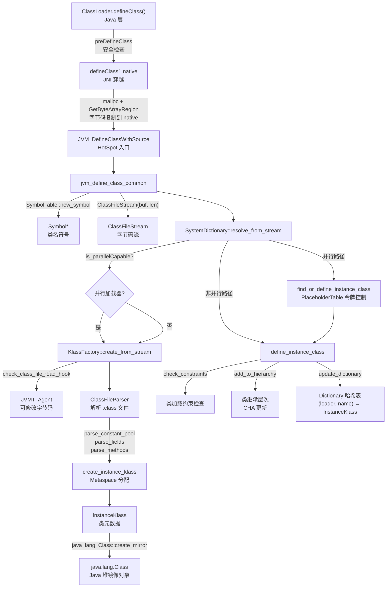

# defineClass JNI 穿越完整链路 — 从 Java 字节码到 C++ InstanceKlass

> **目标**: 完整追踪 defineClass 从 Java 层穿越 JNI 到 C++ 层的全链路：`ClassLoader.defineClass()` → `defineClass1` (JNI) → `JVM_DefineClassWithSource` → `jvm_define_class_common` → `SystemDictionary::resolve_from_stream` → `KlassFactory::create_from_stream` → `ClassFileParser` → `InstanceKlass::allocate_instance_klass` → `define_instance_class` → `update_dictionary`
> **源码**: `ClassLoader.java`, `ClassLoader.c`, `jvm.cpp`, `systemDictionary.cpp`, `klassFactory.cpp`, `classFileParser.cpp`
> **标准环境**: `-Xms8g -Xmx8g -XX:+UseG1GC`
> **前置知识**: [ch07_parent_delegation_loadclass.md](ch07_parent_delegation_loadclass.md) (loadClass 完整链路)
> **本篇定位**: 类加载系统 4 篇系列的第 3 篇——聚焦"字节码怎么变成 Class"

---

## 第 0 部分：核心原理

### 0.1 本质是什么？

`defineClass` 链路的本质是一个**三层转换管道**：Java 层做安全检查 → JNI 层做内存格式转换（Java 数组 → native 内存）→ C++ 层做语义解析（字节码 → InstanceKlass）并注册到全局字典。

### 0.2 为什么需要？

JVM 需要将 `.class` 文件的字节码转换为内部可执行的元数据结构（`InstanceKlass`），这个过程涉及多个安全边界：
- **Java 安全边界**：防止恶意代码伪装核心类（`java.*` 包保护）、注入未签名类（证书检查）
- **内存边界**：Java 堆中的 `byte[]` 可能被 GC 移动，C++ 层需要稳定的 native 内存指针
- **并发边界**：多线程同时加载同名类时，必须保证只有一个 `InstanceKlass` 被注册到字典

### 0.3 怎么解决？

- **安全检查**：Java 层 `preDefineClass` 做三重检查（类名合法性、包保护、证书），C++ 层 `ClassFileParser` 做字节码格式校验
- **内存转换**：JNI 层 `malloc` 将 Java `byte[]` 复制到 native 内存，创建稳定的 `ClassFileStream`
- **并发控制**：`PlaceholderTable` 令牌机制——第一个线程获得令牌开始定义，其他线程等待，完成后复用结果
- **可扩展性**：`KlassFactory` 在解析前触发 JVMTI `class_file_load_hook`，允许 Java Agent 修改字节码

### 0.4 为什么这样设计？

- **为什么 JNI 层要 malloc 复制字节码？** Java 数组在 GC 时可能被移动（relocate），ClassFileParser 需要稳定指针逐字节解析；`defineClass2` 接收 DirectByteBuffer（已是 native 内存）则不需要复制
- **为什么 JVMTI 钩子在 ClassFileParser 之前？** Agent 需要修改的是原始字节码，而不是已解析的结构；在解析前拦截才能让 Agent 看到完整的 `.class` 文件内容
- **为什么 `find_or_define_instance_class` 在锁外执行 `define_instance_class`？** 解析字节码是耗时操作，如果持锁执行会阻塞所有等待同名类的线程；只在检查/通知时持锁，实际定义在锁外执行

---

## 第 1 部分：数据结构全景

### 数据结构清单

| 结构名 | 源码位置 | 核心作用 |
|--------|----------|----------|
| `ClassFileStream` | `classfile/classFileStream.hpp` | 字节码流包装器，提供顺序读取接口 |
| `ClassLoaderData` | `classfile/classLoaderData.hpp` | 每个 ClassLoader 对应一个，管理其加载的所有类的生命周期 |
| `PlaceholderTable` | `classfile/placeholders.hpp` | 并发加载控制表，防止同名类被重复定义 |
| `TempNewSymbol` | `oops/symbol.hpp` | Symbol 的 RAII 包装器，自动管理引用计数 |
| `ClassFileParser` | `classfile/classFileParser.hpp` | `.class` 文件解析器，构造时完成大部分解析 |

### ClassFileStream 字段分析

**问题推导**：C++ 层需要顺序读取字节码的每个字节（magic、版本、常量池条目...），需要一个带位置指针的流式读取器，同时需要记录来源（用于错误信息）。

```cpp
// classFileStream.hpp
class ClassFileStream {
    const u1* const _buffer_start;  // ★ 字节码起始地址（native 内存，稳定指针）
    const u1* const _buffer_end;    // 字节码结束地址（用于边界检查）
    mutable const u1* _current;     // ★ 当前读取位置（随解析推进）
    const char* const _source;      // 来源描述（如 "file:/data/workspace/demo/src/"）
    bool _need_verify;              // 是否需要字节码校验
};
```

**sizeof 估算**：2 个 const 指针 + 1 个 mutable 指针 + 1 个 char 指针 + 1 个 bool = 4×8 + 1 = 33 字节（对齐后约 40 字节）

**创建位置**：`jvm_define_class_common` 中 `ClassFileStream st((u1*)buf, len, source, ClassFileStream::verify)`，`buf` 是 JNI 层 `malloc` 的 native 内存。

**关键字段生命周期**：

| 字段 | 谁设置 | 何时设置 | 设置什么值 | 谁读取 |
|------|--------|----------|-----------|--------|
| ★ `_buffer_start` | 构造器 | `jvm_define_class_common` 中 | JNI 层 `malloc` 的 native 内存地址 | `ClassFileParser` 各 `parse_*` 方法 |
| ★ `_current` | `get_u1/u2/u4_fast()` | 每次读取时推进 | 当前读取位置 | `ClassFileParser` 顺序解析时 |
| `_source` | 构造器 | 同上 | 代码源路径字符串 | 错误信息生成时 |

### PlaceholderTable 字段分析

**问题推导**：并行加载器（Boot/Platform/App）不锁 ClassLoader 对象，多线程可以同时加载不同类。但如果两个线程同时加载同名类，会产生两个 `InstanceKlass`，只能注册一个，另一个需要被丢弃。需要一个"令牌表"来协调：谁先到谁负责定义，后来者等待并复用结果。

```cpp
// classfile/placeholders.hpp
class PlaceholderEntry {
    Symbol* _klassname;           // ★ 类名（作为 key）
    ClassLoaderData* _loader_data;// 对应的 ClassLoaderData
    Thread* _definer;             // ★ 负责定义此类的线程（null=无人定义中）
    InstanceKlass* _instanceKlass;// ★ 定义完成后的结果（null=未完成）
    // 还有 LOAD_INSTANCE / DEFINE_CLASS 等状态标志
};
```

**关键字段生命周期**：

| 字段 | 谁设置 | 何时设置 | 设置什么值 | 谁读取 |
|------|--------|----------|-----------|--------|
| ★ `_definer` | `find_or_define_instance_class` | 获得令牌时 | 当前线程指针 | 其他线程检查是否有人在定义 |
| ★ `_instanceKlass` | `find_or_define_instance_class` | `define_instance_class` 完成后 | 新创建的 `InstanceKlass*` | 等待线程被唤醒后直接复用 |

---

## 一句话总结

`defineClass` 是 Java 类加载中将**字节码数组变成 Class 对象**的核心步骤。它从 Java 层经过 3 层安全检查后穿越 JNI 边界，进入 C++ 层的 `jvm_define_class_common`，在这里字节码被封装成 `ClassFileStream`，然后经 `SystemDictionary::resolve_from_stream` → `KlassFactory::create_from_stream` → `ClassFileParser` 三级调用链完成解析、创建 `InstanceKlass`，最终通过 `define_instance_class` 或 `find_or_define_instance_class`（并行加载器）注册到 SystemDictionary 的 `Dictionary` 哈希表中。GDB 验证显示：JVM 启动加载 ~816 个类，其中仅 1 个（`com/wjcoder/Main`）通过 `JVM_DefineClassWithSource` 入口（用户类），其余 815 个通过 `SystemDictionary::resolve_or_null`（Bootstrap 内部路径）。

---

## 1. 设计哲学：为什么 defineClass 这么复杂？

### 1.1 核心问题

将一段字节码（`byte[]`）变成一个可用的 `Class<?>` 对象，需要解决以下问题：

| 问题 | 解决方案 | 在链路中的位置 |
|------|---------|---------------|
| 字节码可能被篡改 | `preDefineClass` 安全检查 + `ClassFileParser` 格式校验 | Java 层 + C++ 层 |
| 恶意代码伪装核心类 | `java.*` 包保护 + 证书检查 | Java 层 `preDefineClass` |
| 同一个类被两个线程同时加载 | `find_or_define_instance_class` 并行控制 | C++ 层 SystemDictionary |
| 字节码格式错误 | `ClassFileParser` 严格的格式校验 | C++ 层 |
| 需要解析超类/接口依赖 | `post_process_parsed_stream` 递归加载超类 | C++ 层 ClassFileParser |
| Java Agent 需要修改字节码 | JVMTI `class_file_load_hook` 钩子 | C++ 层 KlassFactory |
| 需要在 JVM 中注册以供查找 | `update_dictionary` 注册到 Dictionary | C++ 层 SystemDictionary |

### 1.2 三层架构

```
┌─────────────────────────────────────────────────────────────────┐
│                        Java 层                                   │
│  ClassLoader.defineClass(name, byte[], offset, len, pd)          │
│    ├── preDefineClass: 安全检查（类名/包保护/证书）               │
│    ├── defineClass1 [native]: JNI 穿越                          │
│    └── postDefineClass: 定义包/设置签名者                        │
├─────────────────────────────────────────────────────────────────┤
│                        JNI 桥接层                                │
│  ClassLoader.c: Java_java_lang_ClassLoader_defineClass1          │
│    ├── malloc(length): 复制字节码到 native 内存                   │
│    ├── GetByteArrayRegion: 从 Java 数组复制数据                   │
│    ├── VerifyFixClassname: 修正类名格式（. → /）                  │
│    └── JVM_DefineClassWithSource: 进入 HotSpot 层                │
├─────────────────────────────────────────────────────────────────┤
│                        HotSpot C++ 层                            │
│  jvm_define_class_common (jvm.cpp)                               │
│    ├── SymbolTable::new_symbol: 类名 → Symbol*                   │
│    ├── ClassFileStream: 封装字节码流                              │
│    └── SystemDictionary::resolve_from_stream                     │
│        ├── 锁控制（parallel capable 不锁）                       │
│        ├── KlassFactory::create_from_stream                      │
│        │   ├── JVMTI class_file_load_hook                        │
│        │   ├── ClassFileParser: 解析 .class                      │
│        │   └── create_instance_klass → InstanceKlass             │
│        ├── find_or_define_instance_class (并行加载器)             │
│        │   ├── PlaceholderTable 令牌控制                          │
│        │   └── define_instance_class                             │
│        │       ├── check_constraints: 检查类加载约束             │
│        │       ├── loader_addClass: 注册到 ClassLoader 的列表    │
│        │       ├── add_to_hierarchy: 添加到类继承层次             │
│        │       └── update_dictionary: 注册到 Dictionary 哈希表   │
│        └── 返回 InstanceKlass* → java_mirror() → jclass          │
└─────────────────────────────────────────────────────────────────┘
```

---

## 2. Java 层：ClassLoader.defineClass()

### 2.1 完整调用链

```java
// ClassLoader.java — 标准 defineClass 入口
protected final Class<?> defineClass(String name, byte[] b, int off, int len,
                                     ProtectionDomain protectionDomain)
{
    // ① 安全前置检查
    protectionDomain = preDefineClass(name, protectionDomain);

    // ② 获取代码源位置（用于安全策略和调试）
    String source = defineClassSourceLocation(protectionDomain);

    // ③ 调用 native 方法 — JNI 穿越！
    Class<?> c = defineClass1(this, name, b, off, len, protectionDomain, source);

    // ④ 后置处理
    postDefineClass(c, protectionDomain);

    return c;
}
```

### 2.2 preDefineClass — 三重安全检查

```java
private ProtectionDomain preDefineClass(String name, ProtectionDomain pd) {
    // 检查 1: 类名合法性
    if (!checkName(name))
        throw new NoClassDefFoundError("IllegalName: " + name);

    // 检查 2: java.* 包保护（安全模型基石）
    if ((name != null) && name.startsWith("java.")
            && this != getBuiltinPlatformClassLoader()) {
        throw new SecurityException(
            "Prohibited package name: " + name.substring(0, name.lastIndexOf('.')));
    }
    // ★ 任何自定义 ClassLoader 都不能定义 java.* 包下的类
    // 只有 PlatformClassLoader 及其祖先（BootClassLoader）可以

    // 检查 3: 证书一致性
    if (name != null) {
        checkCerts(name, pd.getCodeSource());
        // 同一个包下的类必须用相同的证书签名
        // 防止攻击者向已签名包注入未签名类
    }

    return pd;
}
```

### 2.3 checkName — 类名校验规则

```java
private boolean checkName(String name) {
    if ((name == null) || (name.length() == 0))
        return true;
    // 不能包含 '/'（Java 用 '.' 分隔，C++ 用 '/'）
    if ((name.indexOf('/') != -1) || (name.charAt(0) == '['))
        return false;
    return true;
}
// ★ 注意: Java 层用 "com.example.Foo"，C++ 层用 "com/example/Foo"
// 转换在 JNI 桥接层的 VerifyFixClassname() 中完成
```

### 2.4 postDefineClass — 后置处理

```java
private void postDefineClass(Class<?> c, ProtectionDomain pd) {
    // 获取或创建命名包
    getNamedPackage(c.getPackageName(), c.getModule());
    // 设置签名者
    if (pd.getCodeSource() != null) {
        Certificate certs[] = pd.getCodeSource().getCertificates();
        if (certs != null)
            setSigners(c, certs);
    }
}
```

---

## 3. JNI 桥接层：ClassLoader.c

### 3.1 Java_java_lang_ClassLoader_defineClass1 — 完整源码解析

```c
// ClassLoader.c:79 — defineClass1 的 JNI 实现
JNIEXPORT jclass JNICALL
Java_java_lang_ClassLoader_defineClass1(JNIEnv *env,
                                        jclass cls,        // ClassLoader.class
                                        jobject loader,    // ClassLoader 实例
                                        jstring name,      // 类名 "com.example.Foo"
                                        jbyteArray data,   // .class 字节码
                                        jint offset,       // 起始偏移
                                        jint length,       // 长度
                                        jobject pd,        // ProtectionDomain
                                        jstring source)    // 代码源位置
{
    jbyte *body;
    char *utfName;
    jclass result = 0;
    char buf[128];          // 类名本地缓冲区（避免 malloc）
    char* utfSource;
    char sourceBuf[1024];   // 源路径本地缓冲区

    // 空指针检查
    if (data == NULL) {
        JNU_ThrowNullPointerException(env, 0);
        return 0;
    }
    if (length < 0) {
        JNU_ThrowArrayIndexOutOfBoundsException(env, 0);
        return 0;
    }

    // ★ 关键步骤 1: 将 Java byte[] 复制到 native 内存
    body = (jbyte *)malloc(length);
    if (body == 0) {
        JNU_ThrowOutOfMemoryError(env, 0);
        return 0;
    }
    (*env)->GetByteArrayRegion(env, data, offset, length, body);
    // 为什么要复制？因为 Java 数组可能被 GC 移动
    // native 代码需要稳定的指针来解析字节码

    // ★ 关键步骤 2: 修正类名格式
    if (name != NULL) {
        utfName = getUTF(env, name, buf, sizeof(buf));
        VerifyFixClassname(utfName);
        // "com.example.Foo" → "com/example/Foo"（. 替换为 /）
    }

    // ★ 关键步骤 3: 获取源路径（UTF-8）
    if (source != NULL) {
        utfSource = getUTF(env, source, sourceBuf, sizeof(sourceBuf));
    }

    // ★ 关键步骤 4: 进入 HotSpot 层
    result = JVM_DefineClassWithSource(env, utfName, loader, body, length, pd, utfSource);
    //        ↑ 返回 jclass（Class 对象的 JNI 句柄）

    // 清理 native 内存
    if (utfSource && utfSource != sourceBuf) free(utfSource);
    if (utfName && utfName != buf) free(utfName);
    free(body);

    return result;
}
```

### 3.2 defineClass1 vs defineClass2

```
defineClass1:                           defineClass2:
  输入: byte[] (Java heap 数组)            输入: ByteBuffer (直接内存)
  内存: malloc → GetByteArrayRegion        内存: GetDirectBufferAddress（零拷贝）
  拷贝: 需要拷贝到 native                  拷贝: 不需要拷贝
  
  适用: 从文件/流读取的字节码               适用: 从 mmap/DirectBuffer 获取的字节码
  调用者: BuiltinClassLoader                调用者: BuiltinClassLoader（模块路径）
```

### 3.3 内存生命周期

```
Java 层                  JNI 层                    HotSpot 层
─────────               ─────────                 ─────────
byte[] data ──→ malloc(length) ──→ ClassFileStream(buf, len)
  (GC 可移动)    ↑ GetByteArrayRegion    (直接引用 malloc 的内存)
                 │ 复制到 native          │
                 │                        │ ClassFileParser 解析
                 │                        │ 创建 InstanceKlass
                 │                        ↓
                 free(body) ←──── 解析完成后
                 (JNI 层负责释放)    (所需数据已拷贝到 Metaspace)
```

---

## 4. HotSpot 层第一站：jvm_define_class_common

### 4.1 完整源码解析

```cpp
// jvm.cpp:895
static jclass jvm_define_class_common(JNIEnv *env, const char *name,
                                      jobject loader, const jbyte *buf,
                                      jsize len, jobject pd,
                                      const char *source, TRAPS) {
    if (source == NULL) source = "__JVM_DefineClass__";

    // 性能计数
    PerfClassTraceTime vmtimer(ClassLoader::perf_define_appclass_time(), ...);
    if (UsePerfData) {
        ClassLoader::perf_app_classfile_bytes_read()->inc(len);
    }

    // ★ 步骤 1: 类名字符串 → Symbol*
    TempNewSymbol class_name = NULL;
    if (name != NULL) {
        const int str_len = (int) strlen(name);
        if (str_len > Symbol::max_length()) {
            // 类名太长，无法放入常量池
            Exceptions::fthrow(THREAD_AND_LOCATION,
                vmSymbols::java_lang_NoClassDefFoundError(),
                "Class name exceeds maximum length of %d: %s",
                Symbol::max_length(), name);
            return 0;
        }
        class_name = SymbolTable::new_symbol(name, str_len, CHECK_NULL);
        // ★ Symbol 存储在全局 SymbolTable 中，引用计数管理
    }

    // ★ 步骤 2: 封装字节码流
    ResourceMark rm(THREAD);
    ClassFileStream st((u1 *) buf, len, source, ClassFileStream::verify);
    //                  ↑字节码    ↑长度  ↑来源     ↑需要校验

    // ★ 步骤 3: 解包 JNI 句柄
    Handle class_loader(THREAD, JNIHandles::resolve(loader));
    Handle protection_domain(THREAD, JNIHandles::resolve(pd));

    // ★ 步骤 4: 核心调用 — 从字节码流解析并注册类
    Klass *k = SystemDictionary::resolve_from_stream(
        class_name, class_loader, protection_domain, &st, CHECK_NULL);

    // ★ 步骤 5: 返回 Class 镜像对象
    return (jclass) JNIHandles::make_local(env, k->java_mirror());
    // k->java_mirror() 返回 InstanceKlass 对应的 java.lang.Class 实例
}
```

### 4.2 TempNewSymbol 的生命周期

```cpp
TempNewSymbol class_name = SymbolTable::new_symbol(name, str_len, CHECK_NULL);
```

- `SymbolTable::new_symbol` 在全局符号表中查找/创建 Symbol
- `TempNewSymbol` 是一个 RAII 包装器：构造时 refcount++，析构时 refcount--
- 如果 Symbol 已存在（如 "java/lang/Object"），直接返回已有 Symbol，共享引用
- 如果 Symbol 不存在，创建新的并注册

---

## 5. HotSpot 层第二站：SystemDictionary::resolve_from_stream

### 5.1 完整流程

```cpp
// systemDictionary.cpp:1044
InstanceKlass* SystemDictionary::resolve_from_stream(
    Symbol* class_name,        // 类名 Symbol
    Handle class_loader,       // ClassLoader 的 oop
    Handle protection_domain,  // ProtectionDomain 的 oop
    ClassFileStream* st,       // 字节码流
    TRAPS)
{
    // ★ 步骤 1: 锁策略选择
    bool DoObjectLock = true;
    if (is_parallelCapable(class_loader)) {
        DoObjectLock = false;
        // 并行加载器不锁 ClassLoader 对象
        // 后续通过 find_or_define_instance_class 的 PlaceholderTable 控制
    }

    // ★ 步骤 2: 注册 ClassLoaderData
    ClassLoaderData* loader_data = register_loader(class_loader);
    // 每个 ClassLoader 对象对应一个 ClassLoaderData
    // 管理该 ClassLoader 加载的所有类的生命周期

    // ★ 步骤 3: 获取锁对象
    Handle lockObject = compute_loader_lock_object(class_loader, THREAD);
    ObjectLocker ol(lockObject, THREAD, DoObjectLock);
    // 如果 DoObjectLock=false，ObjectLocker 不实际加锁

    // ★ 步骤 4: CDS 快速路径（如果有共享存档）
    InstanceKlass* k = NULL;
    #if INCLUDE_CDS
    if (!DumpSharedSpaces) {
        k = SystemDictionaryShared::lookup_from_stream(
                class_name, class_loader, protection_domain, st, CHECK_NULL);
    }
    #endif

    // ★ 步骤 5: 正常路径 — 通过 KlassFactory 创建
    if (k == NULL) {
        k = KlassFactory::create_from_stream(
                st, class_name, loader_data, protection_domain,
                NULL,  // host_klass（非匿名类为 null）
                NULL,  // cp_patches（非匿名类为 null）
                CHECK_NULL);
    }

    // ★ 步骤 6: 注册到 SystemDictionary
    if (is_parallelCapable(class_loader)) {
        // 并行路径：可能有其他线程也在定义同名类
        InstanceKlass* defined_k = find_or_define_instance_class(
            h_name, class_loader, k, THREAD);
        if (!HAS_PENDING_EXCEPTION && defined_k != k) {
            // 另一个线程先定义了 → 丢弃本线程的 k
            loader_data->add_to_deallocate_list(k);
            k = defined_k;  // 使用先定义的那个
        }
    } else {
        // 非并行路径：直接注册（已持有 ClassLoader 锁）
        define_instance_class(k, THREAD);
    }

    return k;
}
```

### 5.2 锁策略对比

```
非并行加载器（自定义 ClassLoader，未注册 parallel capable）:
━━━━━━━━━━━━━━━━━━━━━━━━━━━━━━━━━━━━━━━━━━━━━━━━━
  锁: ClassLoader 对象（Java 监视器锁）
  粒度: 整个 ClassLoader → 串行加载所有类
  注册: define_instance_class（直接注册）
  并发: 同一时刻只有一个线程在加载

并行加载器（Boot/Platform/App ClassLoader）:
━━━━━━━━━━━━━━━━━━━━━━━━━━━━━━━━━━━━━━━━━━━━━━━━━
  锁: 不锁 ClassLoader 对象
  粒度: 通过 PlaceholderTable 的 per-class 令牌控制
  注册: find_or_define_instance_class → define_instance_class
  并发: 不同类可以并行加载，同名类串行（通过令牌等待）
```

---

## 6. HotSpot 层第三站：KlassFactory::create_from_stream

### 6.1 完整源码解析

```cpp
// klassFactory.cpp:166
InstanceKlass* KlassFactory::create_from_stream(
    ClassFileStream* stream,
    Symbol* name,
    ClassLoaderData* loader_data,
    Handle protection_domain,
    const InstanceKlass* host_klass,    // null（非匿名类）
    GrowableArray<Handle>* cp_patches,  // null（非匿名类）
    TRAPS)
{
    JvmtiCachedClassFileData* cached_class_file = NULL;
    ClassFileStream* old_stream = stream;

    // 统计计数
    THREAD->statistical_info().incr_define_class_count();

    // ★ 步骤 1: JVMTI 钩子 — Java Agent 可修改字节码
    if (host_klass == NULL) {  // 非匿名类才走 JVMTI
        stream = check_class_file_load_hook(
            stream, name, loader_data, protection_domain,
            &cached_class_file, CHECK_NULL);
        // 如果 Agent 修改了字节码，stream 会指向新的 ClassFileStream
    }

    // ★ 步骤 2: 创建 ClassFileParser — .class 文件解析器
    ClassFileParser parser(stream,
                           name,
                           loader_data,
                           protection_domain,
                           host_klass,
                           cp_patches,
                           ClassFileParser::BROADCAST,  // 公开级别
                           CHECK_NULL);
    // ClassFileParser 的构造函数中已经完成了大部分解析工作！
    // 包括: magic number 校验、版本检查、常量池解析、
    //       字段解析、方法解析、属性解析

    // ★ 步骤 3: 创建 InstanceKlass
    InstanceKlass* result = parser.create_instance_klass(
        old_stream != stream,  // changed_by_loadhook
        CHECK_NULL);

    // 缓存被 Agent 修改前的 class 文件（用于 retransform）
    if (cached_class_file != NULL) {
        result->set_cached_class_file(cached_class_file);
    }

    // AOT 指纹
    if (result->should_store_fingerprint()) {
        result->store_fingerprint(stream->compute_fingerprint());
    }

    return result;
}
```

### 6.2 JVMTI class_file_load_hook 钩子

```
Java Agent (premain/agentmain)
  │ 注册了 ClassFileTransformer
  │
  ▼
JvmtiExport::post_class_file_load_hook(name, loader, pd, &ptr, &end_ptr, &cached)
  │
  ├── 遍历所有注册的 Agent
  │   ├── Agent 1: 不关心此类 → 返回原始字节码
  │   ├── Agent 2: 修改字节码 → 返回新的 byte*
  │   └── Agent 3: 也修改 → 返回更新的 byte*
  │
  └── if (old_ptr != ptr)
      └── 创建新的 ClassFileStream(new_ptr, new_len, source)
          // ★ 后续解析使用 Agent 修改后的字节码
```

**典型场景**：
- APM 工具（SkyWalking/Arthas）: 注入监控探针
- 热修复框架：替换方法实现
- 代码覆盖率工具（JaCoCo）：注入覆盖率统计代码

---

## 7. HotSpot 层第四站：ClassFileParser — 字节码解析

### 7.1 构造函数中完成的工作

ClassFileParser 的构造函数**非常重量级**——它在构造时就完成了 `.class` 文件的大部分解析：

```cpp
// classFileParser.cpp — 构造函数（简化版）
ClassFileParser::ClassFileParser(ClassFileStream* stream, ...) {
    // 阶段 1: 魔数和版本
    _stream->guarantee_more(8, CHECK);      // CAFEBABE + minor + major
    u4 magic = _stream->get_u4_fast();
    guarantee_property(magic == JAVA_CLASSFILE_MAGIC, ...);
    _minor_version = _stream->get_u2_fast();
    _major_version = _stream->get_u2_fast();

    // 阶段 2: 常量池解析
    _cp = parse_constant_pool(stream, CHECK);

    // 阶段 3: 访问标志
    _access_flags.set_flags(stream->get_u2_fast());

    // 阶段 4: this_class / super_class
    _this_class_index = stream->get_u2_fast();
    _super_class_index = stream->get_u2_fast();

    // 阶段 5: 接口
    _local_interfaces = parse_interfaces(stream, CHECK);

    // 阶段 6: 字段
    _fields = parse_fields(stream, CHECK);

    // 阶段 7: 方法
    _methods = parse_methods(stream, CHECK);

    // 阶段 8: 属性（SourceFile, InnerClasses, BootstrapMethods 等）
    parse_classfile_attributes(stream, CHECK);

    // 阶段 9: 后处理 — 解析超类（可能触发递归类加载！）
    post_process_parsed_stream(stream, _cp, CHECK);
}
```

### 7.2 post_process_parsed_stream — 递归加载超类

```cpp
void ClassFileParser::post_process_parsed_stream(
    const ClassFileStream* const stream,
    ConstantPool* cp, TRAPS)
{
    // 解析超类（如果不是 java.lang.Object）
    if (_super_class_index > 0 && NULL == _super_klass) {
        Symbol* super_class_name = cp->klass_name_at(_super_class_index);

        _super_klass = (const InstanceKlass*)
            SystemDictionary::resolve_super_or_fail(
                _class_name, super_class_name,
                loader, _protection_domain, true, CHECK);
        // ★ 递归！加载超类可能再次进入 resolve_from_stream
        // 这就是为什么类加载可以触发深度递归
    }

    // 验证超类合法性
    if (_super_klass != NULL) {
        if (_super_klass->is_interface()) {
            // 接口不能作为超类
            throw IncompatibleClassChangeError
        }
        if (_super_klass->is_final()) {
            // final 类不能被继承
            throw VerifyError
        }
    }

    // 解析所有接口
    // ...（类似逻辑）
}
```

### 7.3 create_instance_klass — 分配 InstanceKlass

```cpp
// classFileParser.cpp:5567
InstanceKlass* ClassFileParser::create_instance_klass(bool changed_by_loadhook, TRAPS) {
    if (_klass != NULL) return _klass;  // 已创建则直接返回

    // ★ 在 Metaspace 中分配 InstanceKlass
    InstanceKlass* const ik = InstanceKlass::allocate_instance_klass(*this, CHECK_NULL);
    // 分配大小 = sizeof(InstanceKlass) + vtable + itable + static fields + ...
    // 内存来自 ClassLoaderData 管理的 Metaspace

    // ★ 填充 InstanceKlass 的所有字段
    fill_instance_klass(ik, changed_by_loadhook, CHECK_NULL);

    return ik;
}
```

### 7.4 fill_instance_klass — 设置所有元数据

```cpp
void ClassFileParser::fill_instance_klass(InstanceKlass* ik, ...) {
    // 基本信息
    ik->set_class_loader_data(_loader_data);
    ik->set_name(_class_name);
    _loader_data->add_class(ik, publicize);  // 添加到 ClassLoaderData 的类列表

    // 字段信息
    ik->set_nonstatic_field_size(_field_info->nonstatic_field_size);
    ik->set_has_nonstatic_fields(_field_info->has_nonstatic_fields);
    ik->set_static_oop_field_count(_fac->count[STATIC_OOP]);

    // ★ 转移解析数据的所有权（从 parser → InstanceKlass）
    apply_parsed_class_metadata(ik, _java_fields_count, CHECK);
    // 之后 parser 中的 _cp, _fields, _methods 等全部变为 NULL
    // InstanceKlass 成为这些数据的唯一持有者

    // 初始化 vtable/itable
    ik->set_vtable_length(_vtable_size);
    ik->set_itable_length(_itable_size);

    // 设置超类和接口
    ik->set_super((Klass*)_super_klass);
    ik->set_local_interfaces(_local_interfaces);

    // 内部类信息
    ik->set_inner_classes(_inner_classes);

    // 创建 java.lang.Class 镜像对象
    java_lang_Class::create_mirror(ik, class_loader, protection_domain, CHECK);
    // ★ 这一步在 Java 堆中创建 Class 对象
    // InstanceKlass._java_mirror 指向这个 Class 对象
    // Class._klass 指向 InstanceKlass（双向引用）
}
```

---

## 8. HotSpot 层第五站：注册到 SystemDictionary

### 8.1 define_instance_class — 非并行路径

```cpp
// systemDictionary.cpp:1555
void SystemDictionary::define_instance_class(InstanceKlass* k, TRAPS) {
    ClassLoaderData* loader_data = k->class_loader_data();
    Handle class_loader_h(THREAD, loader_data->class_loader());

    Symbol* name_h = k->name();
    Dictionary* dictionary = loader_data->dictionary();
    unsigned int d_hash = dictionary->compute_hash(name_h);

    // ★ 步骤 1: 检查类加载约束
    check_constraints(d_hash, k, class_loader_h, true, CHECK);
    // 验证这个 (name, loader) 对不违反任何已注册的约束

    // ★ 步骤 2: 注册到 ClassLoader 的 Vector<Class>
    if (k->class_loader() != NULL) {
        JavaCalls::call(Universe::loader_addClass_method(), class_loader_h,
                       Handle(THREAD, k->java_mirror()), CHECK);
        // 调用 ClassLoader.addClass(Class)
        // 防止 Class 对象在 ClassLoader 存活期间被 GC
    }

    {
        MutexLocker mu_r(Compile_lock, THREAD);

        // ★ 步骤 3: 添加到类继承层次
        add_to_hierarchy(k, CHECK);
        // 设置 k 的 subklass/next_sibling 指针
        // 更新 CHA（Class Hierarchy Analysis，JIT 优化依赖）

        // ★ 步骤 4: 添加到 Dictionary 哈希表
        update_dictionary(d_hash, p_index, p_hash, k, class_loader_h, THREAD);
    }

    // ★ 步骤 5: eager_initialize（如果可以立即初始化）
    k->eager_initialize(THREAD);

    // ★ 步骤 6: JVMTI 通知
    if (JvmtiExport::should_post_class_load()) {
        JvmtiExport::post_class_load((JavaThread *)THREAD, k);
    }
}
```

### 8.2 update_dictionary — 注册到哈希表

```cpp
// systemDictionary.cpp:2157
void SystemDictionary::update_dictionary(unsigned int d_hash, ...) {
    MutexLocker mu1(SystemDictionary_lock, THREAD);

    // ★ 设置偏向锁原型（如果启用）
    if (UseBiasedLocking && BiasedLocking::enabled()) {
        if (k->class_loader() == class_loader()) {
            k->set_prototype_header(markOopDesc::biased_locking_prototype());
        }
    }

    // ★ 添加到 Dictionary
    Dictionary* dictionary = loader_data->dictionary();
    InstanceKlass* sd_check = find_class(d_hash, name, dictionary);
    if (sd_check == NULL) {
        dictionary->add_klass(d_hash, name, k);
        // key = (d_hash, name)
        // value = InstanceKlass*
    }

    SystemDictionary_lock->notify_all();
    // 唤醒等待同名类加载完成的线程
}
```

### 8.3 find_or_define_instance_class — 并行路径

```cpp
// systemDictionary.cpp:1646
InstanceKlass* SystemDictionary::find_or_define_instance_class(
    Symbol* class_name, Handle class_loader, InstanceKlass* k, TRAPS)
{
    Dictionary* dictionary = loader_data->dictionary();
    unsigned int d_hash = dictionary->compute_hash(name_h);

    {
        MutexLocker mu(SystemDictionary_lock, THREAD);

        // ★ 检查 1: 是否已被其他线程定义？
        if (is_parallelDefine(class_loader)) {
            InstanceKlass* check = find_class(d_hash, name_h, dictionary);
            if (check != NULL) return check;  // 已定义 → 直接返回
        }

        // ★ 检查 2: 获取定义令牌
        probe = placeholders()->find_and_add(
            p_index, p_hash, name_h, loader_data,
            PlaceholderTable::DEFINE_CLASS, NULL, THREAD);

        // ★ 检查 3: 等待其他线程完成定义
        while (probe->definer() != NULL) {
            SystemDictionary_lock->wait();
            // 另一个线程正在定义同名类 → 等待
        }

        // ★ 检查 4: 使用其他线程的结果
        if (is_parallelDefine(class_loader) && probe->instance_klass() != NULL) {
            // 另一个线程已成功定义 → 返回它的 InstanceKlass
            return probe->instance_klass();
        }

        // ★ 本线程负责定义
        probe->set_definer(THREAD);
    }

    // ★ 在锁外执行实际的 define（避免长时间持锁）
    define_instance_class(k, THREAD);

    {
        MutexLocker mu(SystemDictionary_lock, THREAD);
        // 通知等待的线程
        if (!HAS_PENDING_EXCEPTION) {
            probe->set_instance_klass(k);  // 记录结果供等待线程使用
        }
        probe->set_definer(NULL);
        placeholders()->find_and_remove(...);
        SystemDictionary_lock->notify_all();
    }

    return k;
}
```

### 8.4 并行控制流程图

```
Thread A: defineClass("Foo")              Thread B: defineClass("Foo")
───────────────────────                   ───────────────────────
① 获取 SystemDictionary_lock
② find_class("Foo") → null
③ placeholders.add("Foo", DEFINE)
④ probe.definer = Thread_A
⑤ 释放 lock
                                          ① 获取 lock
                                          ② find_class("Foo") → null（还没注册）
                                          ③ placeholders.find("Foo")
                                          ④ probe.definer = Thread_A ≠ null
                                          ⑤ lock.wait() → ⏳ 等待
                                          
⑥ define_instance_class("Foo")
   └── check_constraints
   └── add_to_hierarchy
   └── update_dictionary  ← 注册到 Dictionary
⑦ 获取 lock
⑧ probe.set_instance_klass(Foo)
⑨ probe.set_definer(null)
⑩ lock.notify_all()
⑪ 释放 lock
                                          ⑥ 被唤醒
                                          ⑦ probe.instance_klass() = Foo ≠ null
                                          ⑧ 直接返回 Foo  ★ 不重复定义！
                                          ⑨ 释放 lock
```

---

## 9. GDB 验证

### 9.1 关键节点调用统计

```
【GDB 验证】标准条件：-Xms8g -Xmx8g -XX:+UseG1GC -Xint
加载程序：com.wjcoder.Main（简单 HelloWorld）
┌──────────────────────────────────────────────────────────────────────┐
│ 节点                                  调用次数    说明              │
│ ─────────────────────────────────────────────────────────────────── │
│ JVM_DefineClassWithSource              1         仅用户类走此入口   │
│ KlassFactory::create_from_stream       816       所有字节码解析入口 │
│ ClassFileParser::create_instance_klass 1632      816×2              │
│ find_or_define_instance_class          750       并行加载器路径     │
│ define_instance_class                  1500      注册到 Dictionary  │
│ update_dictionary (add_klass)          754       实际添加到哈希表   │
├──────────────────────────────────────────────────────────────────── │
│                                                                      │
│ ★ com/wjcoder/Main 的完整链路:                                      │
│   JVM_DefineClassWithSource                                          │
│     name = "com/wjcoder/Main"                                        │
│     source = "file:/data/workspace/demo/src/"                        │
│     len = 423 bytes                                                  │
│   → KlassFactory::create_from_stream                                 │
│   → ClassFileParser 构造 + create_instance_klass                     │
│   → find_or_define_instance_class（因为 AppClassLoader parallel）    │
│   → define_instance_class                                            │
│   → update_dictionary: add_klass                                     │
│                                                                      │
│ ★ 815 个核心类通过 SystemDictionary::resolve_or_null 路径           │
│   也最终走 KlassFactory::create_from_stream → ClassFileParser        │
│   但入口不同（不经过 JVM_DefineClassWithSource）                     │
└──────────────────────────────────────────────────────────────────────┘
```

### 9.2 GDB 调试命令（可复现）

```bash
# 验证脚本位置: jvm-md/ClassLoading/gdb_defineclass_jni.txt
gdb -batch -x jvm-md/ClassLoading/gdb_defineclass_jni.txt \
    --args ./build/linux-x86_64-normal-server-slowdebug/jdk/bin/java \
    -XX:+UseG1GC -Xms8g -Xmx8g -Xint -cp /data/workspace/demo/src com.wjcoder.Main
```

---

## 10. 两条类加载路径对比

```
路径 A: Bootstrap 内部加载（resolve_or_null 路径）
━━━━━━━━━━━━━━━━━━━━━━━━━━━━━━━━━━━━━━━━━━━━━━━━━━━━━━━
触发: JVM 内部常量池解析 / JVM_FindClassFromBootLoader
入口: SystemDictionary::resolve_or_null(name, NULL/*bootstrap*/)
  → resolve_instance_class_or_null
    → Dictionary::find → 未找到
    → ClassLoader::load_class(name, ...) → 搜索 boot module
    → KlassFactory::create_from_stream
    → find_or_define_instance_class → define_instance_class
    → update_dictionary

特点: 
  - loader=NULL（Bootstrap）
  - 不经过 Java 层的 ClassLoader.loadClass()
  - 直接在 C++ 层完成

路径 B: AppClassLoader defineClass（JVM_DefineClassWithSource 路径）
━━━━━━━━━━━━━━━━━━━━━━━━━━━━━━━━━━━━━━━━━━━━━━━━━━━━━━━
触发: Java 层 ClassLoader.defineClass() → defineClass1 [native]
入口: JVM_DefineClassWithSource
  → jvm_define_class_common
    → SymbolTable::new_symbol (类名 → Symbol*)
    → ClassFileStream (字节码流)
    → SystemDictionary::resolve_from_stream
      → KlassFactory::create_from_stream
      → find_or_define_instance_class → define_instance_class
      → update_dictionary

特点:
  - loader≠NULL（AppClassLoader 等）
  - 经过 Java 层的 ClassLoader.loadClass() → findClass() → defineClass()
  - 字节码来自 classpath/模块路径

汇合点: KlassFactory::create_from_stream
━━━━━━━━━━━━━━━━━━━━━━━━━━━━━━━━━━━━━━━━━━━━━━━━━━━━━━━
  两条路径在这里汇合:
  → ClassFileParser 解析
  → create_instance_klass 创建 InstanceKlass
  → define_instance_class 注册
```

---

## 11. 面试高频问题

### Q1: defineClass 从 Java 到 C++ 经过了哪些步骤？

> **Java 层**：`preDefineClass`（3 重安全检查：类名合法性、`java.*` 包保护、证书一致性）→ `defineClass1` native
>
> **JNI 桥接**：`ClassLoader.c` 中 `malloc` 复制字节码到 native 内存 → `VerifyFixClassname` 将 `.` 替换为 `/` → 调用 `JVM_DefineClassWithSource`
>
> **HotSpot**：`jvm_define_class_common` 将类名转 Symbol*、字节码封装为 ClassFileStream → `SystemDictionary::resolve_from_stream` → `KlassFactory::create_from_stream`（JVMTI 钩子 + ClassFileParser 解析 + create_instance_klass）→ `find_or_define_instance_class`（并行控制）→ `define_instance_class`（check_constraints + add_to_hierarchy + update_dictionary）

### Q2: defineClass1 为什么要 malloc 复制字节码，而不直接用 Java 数组？

> 因为 Java 数组在堆中可能被 GC 移动（relocate）。ClassFileParser 需要一个**稳定的指针**来逐字节解析 `.class` 文件结构——如果解析到一半数组被移动，指针就失效了。所以必须先复制到 native 内存（malloc）。
>
> `defineClass2` 接收 DirectByteBuffer，其底层已经是 native 内存，所以不需要复制——直接 `GetDirectBufferAddress` 获取指针。

### Q3: Java Agent 是在什么时候修改字节码的？

> 在 `KlassFactory::create_from_stream` 中，创建 ClassFileParser **之前**，会调用 `check_class_file_load_hook`。这个函数触发 JVMTI 的 `ClassFileLoadHook` 事件，所有注册了 `ClassFileTransformer` 的 Agent 会依次被调用，每个 Agent 可以返回修改后的字节码。如果有任何修改，会创建一个新的 `ClassFileStream`，后续解析使用修改后的字节码。

### Q4: 两个线程同时 defineClass 同名类会怎样？

> 取决于 ClassLoader 是否 parallel capable：
> - **并行加载器**（Boot/Platform/App）：走 `find_or_define_instance_class`，使用 `PlaceholderTable` 令牌机制。第一个线程获得令牌开始定义，第二个线程在 `SystemDictionary_lock` 上等待。第一个线程完成后通知，第二个线程发现已有定义结果，直接返回（自己解析的 InstanceKlass 被放入 deallocate_list 回收）。
> - **非并行加载器**：走 `define_instance_class`，但由于持有 ClassLoader 对象锁，实际上串行执行。如果第二次定义同名类，`check_constraints` 会检测到冲突抛出 `LinkageError`。

### Q5: InstanceKlass 的内存分配在哪里？

> 在 `ClassFileParser::create_instance_klass` 中调用 `InstanceKlass::allocate_instance_klass(*this)`，内存来自 `ClassLoaderData` 管理的 **Metaspace**。分配大小包括 `sizeof(InstanceKlass)` + vtable/itable 大小 + 静态字段区域等。详见 [klass_hierarchy.md](klass_hierarchy.md)。

### Q6: resolve_from_stream 中 CDS 快速路径是什么？

> CDS（Class Data Sharing）将常用类的 InstanceKlass 预先序列化到共享存档文件中。`resolve_from_stream` 先检查 `SystemDictionaryShared::lookup_from_stream`——如果共享存档中有这个类，直接反序列化为 InstanceKlass，**跳过 ClassFileParser 解析**。这可以显著加速 JVM 启动（减少 ~30% 类加载时间）。

---

## 12. 源码文件索引

| 文件 | 关键内容 | 行号 |
|------|---------|------|
| **Java 层** | | |
| `java/lang/ClassLoader.java` | `defineClass()` 4 个重载版本 | 800-1112 |
| 同上 | `preDefineClass()` 安全检查 | 894-916 |
| 同上 | `defineClass1` / `defineClass2` native 声明 | 1114-1118 |
| 同上 | `postDefineClass()` 后置处理 | 918-930 |
| **JNI 桥接层** | | |
| `libjava/ClassLoader.c` | `Java_java_lang_ClassLoader_defineClass1` | 79-145 |
| 同上 | `Java_java_lang_ClassLoader_defineClass2` | 148-204 |
| **HotSpot 层** | | |
| `prims/jvm.cpp` | `jvm_define_class_common` | 895-964 |
| 同上 | `JVM_DefineClassWithSource` 入口 | 966-970 |
| `classfile/systemDictionary.cpp` | `resolve_from_stream` | 1044-1143 |
| 同上 | `define_instance_class` | 1555-1641 |
| 同上 | `find_or_define_instance_class` | 1646-1734 |
| 同上 | `update_dictionary` | 2157-2212 |
| `classfile/klassFactory.cpp` | `create_from_stream` | 166-232 |
| `classfile/classFileParser.cpp` | `create_instance_klass` | 5567-5596 |
| 同上 | `fill_instance_klass` | 5598-5780 |
| 同上 | `post_process_parsed_stream` | 6318-6461 |

---

## 13. 与其他文档的关系

```
ch06: 三级类加载器体系 — "谁来加载"
  │
  └── ch07: loadClass 完整链路 — "怎么加载"
        │
        └── 本篇 ch08: defineClass JNI 穿越 — "字节码怎么变成 Class"
              │
              ├── 依赖已有文档:
              │   ├── classfile_parser.md — ClassFileParser 的详细解析（阶段1-9）
              │   ├── system_dictionary_deep_dive.md — Dictionary/PlaceholderTable 内部实现
              │   └── klass_hierarchy.md — InstanceKlass 的内存布局和继承体系
              │
              └── → ch09 (下一篇): GDB 验证 + 综合面试题
```

---

## 数据结构关系图



**关系说明**：
- `ClassFileStream` 是 JNI 层 `malloc` 内存的包装器，生命周期仅在解析期间
- `PlaceholderTable` 是并发控制的核心，`_definer` 和 `_instanceKlass` 字段协调多线程
- `InstanceKlass` 和 `java.lang.Class` 是双向引用：`InstanceKlass._java_mirror` → `Class`，`Class._klass` → `InstanceKlass`
- 两条路径（Bootstrap 内部 / AppClassLoader defineClass）在 `KlassFactory::create_from_stream` 汇合

---

## 总结

### 数据结构层面

| 结构 | 核心特征 |
|------|----------|
| `ClassFileStream` | native 内存包装器，`_current` 指针随解析推进；生命周期仅在 `ClassFileParser` 构造期间 |
| `PlaceholderTable` | 并发令牌表，`_definer` 标记谁在定义，`_instanceKlass` 存储结果供等待线程复用 |
| `ClassLoaderData` | 每个 ClassLoader 对应一个，管理 Metaspace 分配和类列表；ClassLoader 被 GC 时一起回收 |
| `TempNewSymbol` | RAII 包装器，自动管理 Symbol 引用计数；Symbol 在全局 SymbolTable 中共享 |
| `ClassFileParser` | 构造时完成大部分解析（常量池/字段/方法）；`create_instance_klass` 后将数据所有权转移给 InstanceKlass |

### 算法层面

| 算法 | 核心设计决策 |
|------|-------------|
| JNI 层字节码复制 | `malloc` + `GetByteArrayRegion` 将 Java `byte[]` 复制到 native 内存，避免 GC 移动导致指针失效 |
| JVMTI 钩子时机 | 在 `ClassFileParser` 之前触发，Agent 看到完整原始字节码，可以任意修改 |
| `ClassFileParser` 构造函数 | 构造时完成大部分解析（9 个阶段），`create_instance_klass` 只做内存分配和数据转移 |
| `post_process_parsed_stream` | 解析超类时递归触发类加载，这是类加载可以深度递归的根本原因 |
| `find_or_define_instance_class` | 锁外执行 `define_instance_class`（避免长时间持锁），只在检查/通知时持 `SystemDictionary_lock` |
| `update_dictionary` | 注册后 `notify_all` 唤醒所有等待线程，等待线程通过 `probe.instance_klass()` 获取结果 |

---

*创建时间: 2026-02-09*
*GDB 验证环境: OpenJDK 11, -Xms8g -Xmx8g -XX:+UseG1GC*
