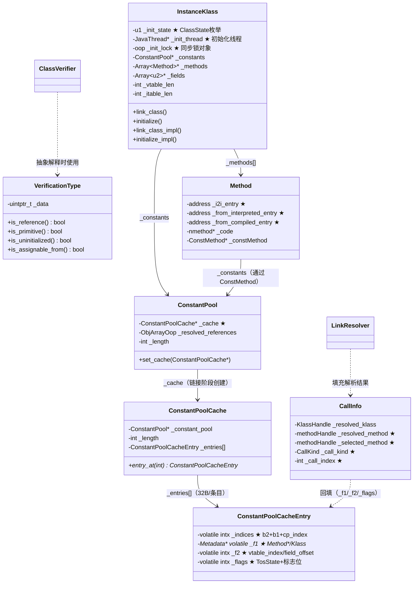

# 类链接与初始化：从 loaded 到 fully_initialized 的完整流程

> 源码基线：OpenJDK 11 (`src/hotspot/share/oops/instanceKlass.cpp` — 4019 行)
> 标准环境：`-Xms8g -Xmx8g -XX:+UseG1GC`
> 前置阅读：`ClassLoading/classfile_parser.md`（ClassFileParser 解析流程）、`ClassLoading/klass_hierarchy.md`（Klass 继承体系）

---

## 第 0 部分：核心原理 ⭐

### 0.1 本质是什么？

类链接（Linking）的本质是**把 InstanceKlass 从"数据结构"变成"可执行的类"**：验证字节码安全性、重写字节码为解释器友好格式、创建 CPCache 解析表、设置方法入口点、填充 vtable/itable 分派表。类初始化（Initialization）的本质是**执行 `<clinit>` 完成 Java 层面的类构造**，严格遵循 JVM 规范 §5.5 的 11 步并发协议。

### 0.2 为什么需要？

`ClassFileParser` 完成后，`InstanceKlass` 处于 `loaded` 状态，但还不能直接用：

- **字节码未验证**：恶意字节码可能绕过访问控制、造成类型混淆、导致栈溢出
- **字节码未重写**：原始字节码中的常量池索引（Java 大端 u2）需要替换为 CPCache 索引（本地字节序），解释器才能高效执行
- **vtable/itable 未填充**：`invokevirtual`/`invokeinterface` 的多态分派依赖这两张表，表中的 `Method*` 指针在链接阶段才填入
- **`<clinit>` 未执行**：静态变量的初始化值（`static int x = 42`）和静态初始化块（`static { ... }`）需要在首次主动使用时执行

### 0.3 怎么解决？

**链接阶段**（`link_class_impl()`）分 5 步：
1. 递归链接父类和接口（保证 vtable 初始化时父类 vtable 已就绪）
2. 字节码验证（Type-Checking Verifier，O(n) 线性扫描 + StackMapTable 类型检查）
3. 字节码重写（Rewriter：CP 索引 → CPCache 索引，创建 CPCache 和 resolved_references）
4. 方法链接（设置解释器入口点、生成 i2c/c2i 适配器）
5. vtable/itable 初始化（复制父类 vtable，处理覆盖/新增/Miranda 方法）

**初始化阶段**（`initialize_impl()`）严格遵循 JVM 规范 §5.5 的 11 步协议，核心是：获取 init_lock → 等待/重入检测 → 标记 `being_initialized` → 递归初始化父类 → 执行 `<clinit>` → 设置 `fully_initialized` + notify_all。

### 0.4 为什么这样设计？

- **为什么链接和初始化要分开？** 链接只修改 C++ 元数据（无副作用），可以安全递归；初始化执行 Java 代码（有副作用），需要精确的并发协议。如果合并，A 的 `<clinit>` 引用 B、B 的 `<clinit>` 引用 A 会死锁
- **为什么 `<clinit>` 执行期间不持有 init_lock？** `<clinit>` 可能执行任意 Java 代码（包括 `synchronized`），持有 init_lock 会导致死锁。Step 6 设置 `being_initialized` 后释放锁，其他线程在 Step 2 的 `waitUninterruptibly` 中等待
- **为什么用 `waitUninterruptibly` 而不是 `wait`？** `wait` 可能抛 `InterruptedException`，但符号解析/链接路径不期望这种异常，会导致意外的异常从类加载中抛出
- **为什么 `initialization_error` 是终态？** JVM 规范要求：一旦初始化失败，该类永远不可用（防止部分初始化的类被使用导致不一致状态）

---

## 目录

1. [问题引入：为什么链接和初始化要分开？](#1-问题引入)
2. [ClassState 状态机](#2-classstate-状态机)
3. [链接阶段总览：link_class_impl()](#3-链接阶段总览)
4. [字节码验证：Verifier](#4-字节码验证)
5. [字节码重写：Rewriter](#5-字节码重写)
6. [ConstantPoolCache：解释器的解析表](#6-constantpoolcache)
7. [方法链接：Method::link_method()](#7-方法链接)
8. [vtable 初始化：方法分派表](#8-vtable-初始化)
9. [itable 初始化：接口分派表](#9-itable-初始化)
10. [初始化阶段总览：initialize_impl()](#10-初始化阶段总览)
11. [LinkResolver：运行时符号解析](#11-linkresolver)
12. [JVM 参数与日志](#12-jvm-参数与日志)
13. [面试题精选](#13-面试题)
14. [源码文件索引](#14-源码索引)

---

## 1. 问题引入

**ClassFileParser 完成后发生了什么？**

ClassFileParser 把 `.class` 文件的字节流解析成了 `InstanceKlass` 对象，此时类的状态是 `loaded`（已加载）。但这个 InstanceKlass 还不能直接用——字节码没验证、方法没链接、vtable/itable 没填充、`<clinit>` 没执行。

**为什么链接（linking）和初始化（initialization）是两个阶段？**

这是一个关键的设计决策。假设它们是一个原子操作：

1. **循环依赖死锁**：类 A 的 `<clinit>` 引用类 B，类 B 的 `<clinit>` 引用类 A。如果链接和初始化绑定，无论先处理谁都会死锁
2. **延迟执行 `<clinit>`**：链接可以提前做（预热），但 `<clinit>` 应该延迟到第一次主动使用时才触发（JVM 规范 §5.5）
3. **并发安全**：链接只修改 C++ 元数据（无副作用），可以在任何线程安全地做；`<clinit>` 执行 Java 代码（有副作用），需要精确的同步协议

**一句话总结**：链接阶段把 InstanceKlass 从"数据结构"变成"可执行的类"（验证、重写字节码、创建 CPCache、设入口点、填 vtable/itable）；初始化阶段执行 `<clinit>` 完成 Java 层面的类构造。

---

## 2. ClassState 状态机

> 源码：`instanceKlass.hpp:133-140`

InstanceKlass 的生命周期由一个枚举状态驱动：

```cpp
// instanceKlass.hpp:133
enum ClassState {
  allocated,                          // 刚 allocate，字段全零
  loaded,                             // ClassFileParser 完成
  linked,                             // 验证+重写+链接方法+vtable/itable 完成
  being_initialized,                  // <clinit> 正在执行中
  fully_initialized,                  // <clinit> 成功完成
  initialization_error                // <clinit> 抛异常（终态）
};
```

**sizeof(ClassState)**：枚举底层是 `u1`（1 字节），存储在 `InstanceKlass::_init_state` 字段中。

**创建位置**：`InstanceKlass::allocate_instance_klass()` 中初始化为 `allocated`；`ClassFileParser::fill_instance_klass()` 完成后通过 `set_init_state(loaded)` 设置为 `loaded`。

**关键字段生命周期**（`_init_state` 字段）：

| 谁设置 | 何时设置 | 设置什么值 | 谁读取 |
|--------|----------|-----------|--------|
| `fill_instance_klass()` | ClassFileParser 完成后 | `loaded` | `link_class()` 中 `is_loaded()` 检查 |
| `link_class_impl()` Step 5f | 链接完成后 | `linked` | `initialize()` 中 `should_be_initialized()` 检查 |
| `initialize_impl()` Step 6 | 获取 init_lock 后 | `being_initialized` | Step 2 的 `is_being_initialized()` 检查 |
| `set_initialization_state_and_notify()` | `<clinit>` 成功后 | `fully_initialized` | `should_be_initialized()` 返回 false |
| `set_initialization_state_and_notify()` | `<clinit>` 失败后 | `initialization_error` | Step 5 的 `is_in_error_state()` 检查 |

**值域图**：

```
allocated(0) → loaded(1) → linked(2) → being_initialized(3) → fully_initialized(4)
                                                ↓
                                        initialization_error(5)  ← 终态，不可恢复
```

**状态迁移图：**

```
allocated → loaded → linked → being_initialized → fully_initialized
                                      ↓
                               initialization_error
```

关键语义：
- **loaded → linked**：由 `link_class_impl()` 完成，`set_init_state(linked)`
- **linked → being_initialized**：由 `initialize_impl()` Step 6 完成，`set_init_state(being_initialized)` + `set_init_thread(self)`
- **being_initialized → fully_initialized**：`<clinit>` 成功，`set_initialization_state_and_notify(fully_initialized, ...)`
- **being_initialized → initialization_error**：`<clinit>` 抛异常，`set_initialization_state_and_notify(initialization_error, ...)`

> **注意**：`initialization_error` 是终态，无法恢复。后续任何对该类的使用都会抛 `NoClassDefFoundError`。

---

## 3. 链接阶段总览：link_class_impl()

> 源码：`instanceKlass.cpp:711-843`

`link_class_impl()` 是链接阶段的核心方法，完成从 `loaded` 到 `linked` 的全部工作。

### 3.1 入口层

```cpp
// instanceKlass.cpp:694
void InstanceKlass::link_class(TRAPS) {
  assert(is_loaded(), "must be loaded");
  if (!is_linked()) {
    link_class_impl(true, CHECK);  // throw_verifyerror = true
  }
}
```

`link_class()` 是公开入口，带短路判断。核心逻辑在 `link_class_impl()`。

### 3.2 link_class_impl() 完整流程

剥离日志、断言和错误处理后，核心骨架是 **8 个步骤**：

```
link_class_impl(throw_verifyerror, TRAPS):
│
├── Step 1: 快速返回（已链接则直接返回 true）
│
├── Step 2: 递归链接父类
│     └── super_klass != NULL → ik_super->link_class_impl(...)
│     └── 验证父类不是接口（否则 IncompatibleClassChangeError）
│
├── Step 3: 递归链接所有本地接口
│     └── for each interface → interk->link_class_impl(...)
│
├── Step 4: 再次检查（递归过程中可能已被链接）
│
├── Step 5: 获取 init_lock，进入临界区
│     │
│     ├── Step 5a: 字节码验证
│     │     └── verify_code() → Verifier::verify()
│     │
│     ├── Step 5b: 字节码重写
│     │     └── rewrite_class() → Rewriter::rewrite()
│     │
│     ├── Step 5c: 方法链接
│     │     └── link_methods() → Method::link_method() for each method
│     │
│     ├── Step 5d: vtable 初始化
│     │     └── vtable().initialize_vtable()
│     │
│     ├── Step 5e: itable 初始化
│     │     └── itable().initialize_itable()
│     │
│     └── Step 5f: 设置状态 → set_init_state(linked)
│
└── Step 6: JVMTI post_class_prepare 通知
```

### 3.3 递归链接的顺序保证

代码中先链接父类，再链接接口，这确保了：
1. vtable 初始化时父类 vtable 已经准备好（可以直接复制）
2. itable 初始化时接口方法已经链接完成
3. 验证器在检查父类方法时不会遇到未链接的类

Step 2 还有一个关键检查：**父类不能是接口**。这在 ClassFileParser 阶段已经检查过一次（`post_process_parsed_stream`），但这里做了二次防御：

```cpp
if (super_klass->is_interface()) {
  Exceptions::fthrow(THREAD_AND_LOCATION,
    vmSymbols::java_lang_IncompatibleClassChangeError(),
    "class %s has interface %s as super class", ...);
  return false;
}
```

### 3.4 init_lock 临界区

Step 5 使用 `ObjectLocker(init_lock, ...)` 进入临界区。`init_lock` 是 InstanceKlass 上一个专门的 Java 对象（`java.lang.Object` 实例），用于同步链接和初始化操作。

为什么需要锁？因为多个线程可能同时触发同一个类的链接（例如：线程 A 通过 `new Foo()` 触发，线程 B 通过反射触发）。锁保证只有一个线程执行验证+重写+链接，其他线程等待后看到 `is_linked() == true` 直接返回。

---

## 4. 字节码验证：Verifier

> 源码：`verifier.cpp:140-241`（入口），`verifier.hpp`（声明），`verificationType.hpp`（类型系统）

### 4.1 验证的必要性

字节码验证是 JVM 安全模型的基石。没有验证，恶意构造的 `.class` 文件可以：
- 访问 `private` 字段/方法（绕过访问控制）
- 类型混淆（把 `int` 当 `Object` 用，导致内存越界）
- 栈溢出/下溢（操作数栈不平衡）
- 使用未初始化的对象（在 `<init>` 完成前使用 `this`）

### 4.2 Split Verifier 架构

OpenJDK 11 使用 **分裂验证器（Split Verifier）**：

```
Verifier::verify(klass, ...)
│
├── is_eligible_for_verification()?
│     ├── 豁免类: Object, Class, String, Throwable（引导阶段）
│     ├── CDS 共享类（已预验证）
│     └── MagicAccessorImpl 子类（反射内部类）
│
├── major_version >= 50 (Java 6+)?
│     ├── YES → Type-Checking Verifier (C++ 实现)
│     │     └── ClassVerifier::verify_class()
│     │           └── 遍历所有方法 → verify_method()
│     │                 └── 线性扫描字节码 + 抽象解释 + StackMapTable 类型检查
│     │
│     └── 如果失败 && FailOverToOldVerifier && version < 51:
│           └── Type-Inference Verifier (JNI 调用外部函数)
│               └── inference_verify() → VerifyClassForMajorVersion()
│
└── major_version < 50:
      └── 直接使用 Type-Inference Verifier
```

**两种验证器的核心区别：**

| 特性 | Type-Checking (新) | Type-Inference (旧) |
|------|-------------------|-------------------|
| 引入版本 | Java 6 (50) | Java 1.0 |
| StackMapTable | **必须提供** | 不需要 |
| 算法复杂度 | O(n) 线性扫描 | O(n²~n³) 数据流迭代 |
| 实现位置 | C++ (`ClassVerifier`) | 外部函数 (`inference_verify`, JNI) |
| 不动点迭代 | 不需要（有 StackMapTable 指导） | 需要（反复迭代直到收敛） |

### 4.3 Type-Checking 验证器工作流程

> 源码：`verifier.cpp:603-628`（`verify_class()`）

```cpp
void ClassVerifier::verify_class(TRAPS) {
  // 遍历所有方法
  Array<Method*>* methods = _klass->methods();
  int num_methods = methods->length();
  for (int index = 0; index < num_methods; index++) {
    // 跳过 native 和 abstract 方法（无字节码）
    if (m->is_native() || m->is_abstract()) continue;
    verify_method(methodHandle(THREAD, m), CHECK_VERIFY(this));
  }
  // 如果验证了 Object.<init>，做额外检查
  if (_klass == SystemDictionary::Object_klass()) {
    verify_oop_in_field(...);
  }
}
```

`verify_method()` 对单个方法执行**抽象解释（Abstract Interpretation）**：

1. 创建初始 `StackMapFrame`：local 变量表根据方法签名初始化，操作数栈为空
2. 解析 `StackMapTable` 属性：获取所有显式声明的栈映射帧
3. 线性扫描字节码：
   - 每条字节码模拟其对栈/locals 的影响
   - 在分支目标处，与 StackMapTable 中声明的帧做类型兼容性检查
   - 类型检查使用 `VerificationType::is_assignable_from()`

### 4.4 VerificationType 编码

> 源码：`verificationType.hpp`（345 行）

`VerificationType` 用一个 `uintptr_t` 联合编码所有验证类型，通过低 2 位区分：

```
低 2 位 = 0x0: 引用类型   → 高位是 Symbol* (类名)
低 2 位 = 0x1: 基本类型   → 高位是 type tag
低 2 位 = 0x2: 未初始化   → 高位是 BCI (字节码索引，new 指令的位置)
低 2 位 = 0x3: 类型查询   → 内部使用
```

类型赋值兼容性规则（`is_assignable_from()`）：
- `boolean/byte/char/short` 与 `int` 兼容（JVM 层面都是 int 操作）
- 引用类型通过 `is_subtype_of` 子类检查
- `null` 兼容任何引用类型
- 未初始化类型只兼容自身（同一 BCI 的 `new` 指令）

### 4.5 JVM 日志

验证相关日志需要以下参数：

```bash
-Xlog:class+init=info     # 验证开始/结束
-Xlog:verification=info   # 验证详情 + Failover 信息
```

输出示例：
```
[info][class,init] Start class verification for: com.wjcoder.Main
[info][class,init] End class verification for: com.wjcoder.Main
```

如果触发 Failover：
```
[info][verification] Fail over class verification to old verifier for: com.legacy.OldClass
```

---

## 5. 字节码重写：Rewriter

> 源码：`rewriter.hpp`（217 行），`rewriter.cpp`（631 行）

### 5.1 重写的目的

验证完成后，字节码需要"重写"才能被解释器高效执行。重写做三件事：

1. **常量池索引 → CPCache 索引**：原始字节码中的常量池索引（Java 大端 u2）替换为 CPCache 索引（本地字节序 u2），解释器通过 CPCache 直接获取解析结果
2. **字节码替换**：某些字节码替换为内部快速版本（如 `lookupswitch` → `_fast_linearswitch`/`_fast_binaryswitch`）
3. **创建 ConstantPoolCache**：分配 CPCache 和 resolved_references 数组

### 5.2 Rewriter 执行流程

> 源码：`rewriter.cpp:568-630`

入口是一个静态方法：

```cpp
// rewriter.cpp:568
void Rewriter::rewrite(InstanceKlass* klass, TRAPS) {
  // ...
  Rewriter rw(klass, klass->constants(), klass->methods(), CHECK);
  // Rewriter 是栈上对象，构造函数完成所有工作
}
```

构造函数（lines 577-630）的执行序列：

```
Rewriter 构造函数:
│
├── 1. compute_index_maps()       // 扫描 CP，建立 CP→CPCache 映射
│
├── 2. rewrite_bytecodes()        // 遍历所有方法，重写字节码
│     ├── Object.<init> 特殊处理: _return → _return_register_finalizer
│     └── for each method → scan_method()
│
├── 3. make_constant_pool_cache() // 分配 CPCache，关联到 ConstantPool
│
└── 4. rewrite_jsrs() (如果需要) // JSR/RET 改写（遗留 Java < 1.5 字节码）
      └── 失败时 restore_bytecodes() 回滚
```

### 5.3 Step 1: compute_index_maps()

> 源码：`rewriter.cpp:40-79`

扫描整个常量池，根据标签类型决定映射目标：

| CP 标签 | 映射目标 |
|---------|---------|
| `Fieldref` | CPCache entry（字段访问） |
| `Methodref` | CPCache entry（方法调用） |
| `InterfaceMethodref` | CPCache entry（接口调用） |
| `String` | resolved_references 数组（字符串字面量） |
| `MethodHandle` | resolved_references 数组 |
| `MethodType` | resolved_references 数组 |
| `Dynamic` | resolved_references 数组（condy） |

结果存储在两个映射表中：
- `_cp_cache_map`：新索引 → 原始 CP 索引（用于分配 CPCache）
- `_cp_map`：原始 CP 索引 → 新索引（用于重写字节码操作数）

### 5.4 Step 2: scan_method() 逐字节码重写

> 源码：`rewriter.cpp:370-507`

对每个方法的字节码做线性扫描，根据字节码类型执行不同的重写操作：

| 原始字节码 | 重写操作 |
|-----------|---------|
| `lookupswitch` | → `_fast_linearswitch`（pairs < BinarySwitchThreshold）或 `_fast_binaryswitch` |
| `invokespecial` | 若引用 InterfaceMethodref → 分配独立 CPCache entry（`rewrite_invokespecial`） |
| `getstatic/getfield/putstatic/putfield` | `rewrite_member_reference()`：CP index → CPC index |
| `invokevirtual/invokestatic/invokeinterface` | `rewrite_member_reference()`：CP index → CPC index |
| `invokevirtual` on `MethodHandle/VarHandle` | → `_invokehandle` |
| `invokedynamic` | `rewrite_invokedynamic()`：4 字节本地 CPC 索引 |
| `ldc` / `ldc_w` (MethodHandle/MethodType/String) | → `_fast_aldc` / `_fast_aldc_w` |
| `putstatic/putfield` on final field | 标记 `has_initialized_final_update`（阻止 JIT 常量折叠） |

**`rewrite_member_reference()` 的核心操作：**

```
原始字节码:  [invokevirtual] [CP_index_high] [CP_index_low]    ← Java 大端 u2
                                    ↓ 重写
重写后:      [invokevirtual] [CPC_index_lo]  [CPC_index_hi]    ← 本地字节序 u2
```

这个看似简单的替换有深远影响——解释器执行时不再需要查常量池，直接用 CPCache 索引读取已解析的 `Method*` / `Klass*` / 字段偏移。

### 5.5 final 字段写入检测

`scan_method()` 中有一段特殊逻辑处理 `putstatic/putfield` 对 `final` 字段的写入：

```cpp
// rewriter.cpp:430-464
if (fd.access_flags().is_final()) {
  if (fd.access_flags().is_static()) {
    if (!method->is_static_initializer()) {     // 非 <clinit> 中写 static final
      fd.set_has_initialized_final_update(true);
    }
  } else {
    if (!method->is_object_initializer()) {      // 非 <init> 中写 instance final
      fd.set_has_initialized_final_update(true);
    }
  }
}
```

这个标记告诉 JIT 编译器：**这个 final 字段在初始化之后还会被修改**（通过反射/Unsafe），不能做常量折叠优化。这是 Java 9+ 对 `final` 字段语义加强的一部分。

### 5.6 Object.\<init\> 的特殊处理

> 源码：`rewriter.cpp:522-566`

`rewrite_bytecodes()` 对 `Object.<init>` 做了特殊处理：如果该方法是 `_return`（void 返回），则替换为 `_return_register_finalizer`。这个改写的目的是在 `new Object()` 的构造完成后自动注册 Finalizer（如果子类覆盖了 `finalize()` 方法）。

```
Object.<init>: 正常 _return  →  _return_register_finalizer
```

> 这个改写只在 JVMTI 允许重定义类的情况下才必要，因为 JVMTI 可能在运行时改变 `<init>` 的内容。

---

## 6. ConstantPoolCache：解释器的解析表

> 源码：`cpCache.hpp`（530 行），`cpCache.cpp`（876 行）

### 6.1 "CPCache 不是缓存"

源码中有一行著名的注释：

```cpp
// The ConstantPoolCache is not a cache! It is the resolution table that the
// interpreter uses to avoid going into the runtime and a way to access resolved values.
```

CPCache 的名字容易误导人。它不是 CPU 缓存意义上的 cache，而是常量池的**解析结果表**——解释器通过 CPCache 索引直接获取已解析的 `Method*`、`Klass*` 和字段偏移，避免每次执行都走全量符号解析。

### 6.2 创建时机

CPCache 在 `Rewriter::make_constant_pool_cache()` 中创建（链接阶段），而不是类加载阶段。创建流程：

```
Rewriter::make_constant_pool_cache(TRAPS)
│
├── ConstantPoolCache::allocate(loader_data, _cp_cache_map, ...)
│     └── 分配 CPCache 元数据，每个条目对应一个 ConstantPoolCacheEntry
│
├── _pool->set_cache(cache)          // 关联到 ConstantPool
│   cache->set_constant_pool(_pool)  // 双向关联
│
└── _pool->initialize_resolved_references(loader_data, ...)
      └── 创建 resolved_references 数组（ObjArray，存 String/MethodHandle/MethodType）
```

### 6.3 ConstantPoolCacheEntry 四字段布局

每个 CPCacheEntry 由 4 个机器字组成（64 位系统上每个 8 字节，共 32 字节）：

```cpp
// cpCache.hpp:130
class ConstantPoolCacheEntry {
 private:
  volatile intx _indices;   // ★ [b2:8 | b1:8 | cp_index:16] 字节码+原始CP索引
  Metadata* volatile _f1;   // ★ Method*/Klass*（解析后的元数据指针）
  volatile intx _f2;        // ★ vtable_index / field_offset / Method*（分派索引或偏移）
  volatile intx _flags;     // ★ [tos:4|F|M|A|I|f|v|vf|...|psize] 类型/标志位/参数
};
```

**sizeof(ConstantPoolCacheEntry)**：4 × 8 = **32 字节**（64 位系统，GDB 验证：`p sizeof(ConstantPoolCacheEntry)`）

**创建位置**：`Rewriter::make_constant_pool_cache()`（`rewriter.cpp:94`）中创建，链接阶段（`link_class_impl` Step 5b 的 `rewrite_class()` 内部）。

**关键字段生命周期**：

| 字段 | 谁设置 | 何时设置 | 设置什么值 | 谁读取 |
|------|--------|----------|-----------|--------|
| ★ `_indices` | `Rewriter::make_constant_pool_cache()` | 链接阶段 | 低16位=原始CP索引，高16位=0（未解析） | 解释器执行字节码时检查 bytecode 位是否非零 |
| ★ `_indices.bytecode_1` | `InterpreterRuntime::resolve_*` | 首次执行对应字节码时 | 字节码值（如 `getstatic`=178） | 解释器判断是否已解析（非零=已解析） |
| ★ `_f1` | `InterpreterRuntime::resolve_*` | 首次执行对应字节码时 | `Method*`/`Klass*`（取决于字节码类型） | 解释器直接读取，无需再走符号解析 |
| ★ `_f2` | `InterpreterRuntime::resolve_*` | 首次执行对应字节码时 | vtable_index（invokevirtual）/ field_offset（getfield）/ Method*（vfinal） | 解释器直接读取 |
| ★ `_flags` | `InterpreterRuntime::resolve_*` | 首次执行对应字节码时 | TosState + 标志位 + 参数大小 | 解释器确定返回值类型和参数处理方式 |

**解析状态判断**：`_indices` 的 bytecode_1/bytecode_2 位非零 = 已解析。解释器先读 `_indices` 做判断——如果看到非零，就保证能看到完整的 `_f1/_f2/_flags` 值（`OrderAccess::release_store` 保证写入顺序）。

### 6.4 _indices 字段编码

```
bit 31        24 23        16 15                 0
┌──────────────┬──────────────┬────────────────────┐
│  bytecode_2  │  bytecode_1  │  cp_index          │
└──────────────┴──────────────┴────────────────────┘
```

- **cp_index**：原始常量池索引（16 位），用于回溯到原始 CP 条目
- **bytecode_1**：第一次解析时记录的字节码（如 `getstatic`、`invokestatic`）
- **bytecode_2**：第二次解析时记录的字节码（如 `putstatic`、`invokevirtual`）

**解析状态判断**：如果 `bytecode_1` 或 `bytecode_2` 非零，说明该条目已被解析。解释器执行字节码时，先检查对应的 bytecode 位是否非零——如果是，直接读 `_f1/_f2` 使用；如果不是，进入运行时解析（`InterpreterRuntime::resolve_*`），解析完成后回填 CPCache entry。

### 6.5 字段条目 vs 方法条目

**字段条目（Field Entry）—— `F=1`：**

| 字段 | 含义 |
|------|------|
| `_f1` | 字段所属 Klass*（`field_holder`） |
| `_f2` | 字段在对象中的偏移（字节） |
| `_flags[tos]` | 字段类型的 TosState（btos/ctos/stos/itos/ltos/ftos/dtos/atos） |
| `_flags[field_index]` | FieldInfo 中的原始字段索引 |
| `_flags[f]` | final 标志 |
| `_flags[v]` | volatile 标志 |

**方法条目（Method Entry）—— `F=0`：**

不同调用类型使用 `_f1` 和 `_f2` 的方式不同：

| 调用类型 | `_f1` | `_f2` | 说明 |
|---------|-------|-------|------|
| `invokestatic` | Method* | — | 直接调用 |
| `invokespecial` | Method* | — | 直接调用 |
| `invokevirtual` | — | vtable_index | 通过 vtable 分派 |
| `invokevirtual` (vfinal) | — | Method* | final 方法，直接调用 |
| `invokeinterface` | interface Klass* | itable Method* | 通过 itable 分派 |
| `invokehandle` | adapter Method* | — | MethodHandle |
| `invokedynamic` | CallSite | — | 动态调用 |

> **设计精妙之处**：`invokevirtual` 和 `invokespecial` 可以共享同一个 CPCache entry。`invokevirtual` 只使用 `_f2`（通过 bytecode_2 保护），`invokespecial` 只使用 `_f1`（通过 bytecode_1 保护）。这是因为 CP 中的 `Methodref` 可以同时被两种字节码引用。

### 6.6 解析的线程安全

CPCache entry 的写入使用 `OrderAccess::release_store` 语义，确保 `_f1/_f2/_flags` 的写入在 `_indices` 的 bytecode 位写入之前对其他线程可见。解释器先读 `_indices` 的 bytecode 位做判断——如果看到非零，就保证能看到完整的 `_f1/_f2/_flags` 值。这是一个经典的 **发布-消费（publish-consume）** 模式：

```
写入顺序（带 release）:                       读取顺序:
  1. set _f1, _f2, _flags                       1. 读 _indices.bytecode
  2. release_store _indices.bytecode             2. 如果非零 → 读 _f1, _f2, _flags
```

---

## 7. 方法链接：Method::link_method()

> 源码：`method.cpp:1077-1124`

`link_methods()` 遍历类的所有方法（逆序），对每个方法调用 `Method::link_method()`：

```cpp
// instanceKlass.cpp:861
void InstanceKlass::link_methods(TRAPS) {
  int len = methods()->length();
  for (int i = len-1; i >= 0; i--) {
    methodHandle m(THREAD, methods()->at(i));
    m->link_method(m, CHECK);
  }
}
```

### 7.1 link_method() 的三步操作

```
Method::link_method(h_method, TRAPS):
│
├── Step 1: 设置解释器入口点
│     └── Interpreter::entry_for_method(h_method) → _i2i_entry + _from_interpreted_entry
│     └── 根据方法类型选择不同入口：
│           zerolocals / zerolocals_synchronized / native / native_synchronized /
│           empty / accessor / abstract / java_lang_math_* / ...
│
├── Step 2: 处理 native 方法
│     └── 如果 is_native() && !has_native_function():
│           set_native_function(native_method_throw_unsatisfied_link_error_entry())
│           → 调用时抛 UnsatisfiedLinkError（占位符）
│
└── Step 3: 创建 i2c/c2i 适配器
      └── make_adapters(h_method) → AdapterHandlerLibrary::get_adapter()
            → 生成 i2c_entry (解释器→编译代码) 和 c2i_entry (编译代码→解释器)
            → 设置 _from_compiled_entry → c2i_entry_trampoline
```

### 7.2 Method 中的入口点字段

链接完成后，Method 对象上有以下入口点：

```
┌──────────────────────────────────────────────────────────┐
│ _i2i_entry                  解释器直接入口                  │
│ _from_interpreted_entry     从解释器调用的入口               │
│   = _i2i_entry (未编译时)                                  │
│   = i2c adapter (编译后)                                   │
│ _from_compiled_entry        从编译代码调用的入口             │
│   = c2i adapter (未编译时)                                 │
│   = verified entry (编译后)                                │
│ _code                       编译后的 nmethod (初始为 NULL)  │
└──────────────────────────────────────────────────────────┘
```

**为什么需要 i2c/c2i 适配器？**

解释器和编译代码使用不同的调用约定——解释器通过栈传参（Java 操作数栈），编译代码通过寄存器传参（C 调用约定或优化后的寄存器分配）。适配器在两者之间做参数搬运。

- **i2c adapter**：从解释器调用编译代码时，把操作数栈上的参数搬到寄存器
- **c2i adapter**：从编译代码调用解释器时，把寄存器中的参数搬到操作数栈

适配器是根据方法签名生成的机器码片段，通常很小（< 100 字节），且相同签名的方法共享同一个适配器。

---

## 8. vtable 初始化：方法分派表

> 源码：`klassVtable.cpp:167-278`（`initialize_vtable`），`klassVtable.cpp:368-548`（`update_inherited_vtable`）

### 8.1 vtable 是什么

vtable（虚方法表）是实现 `invokevirtual` 多态分派的核心数据结构。每个 InstanceKlass 内嵌一个 vtable，是一个 `Method*` 数组。`invokevirtual` 的执行流程：

```
receiver.getClass().vtable[vtable_index]  →  实际要调用的 Method*
```

vtable 的大小在 ClassFileParser 阶段就已经计算好（`ClassFileParser::compute_vtable_size()`），但此时 vtable 的槽位还是空的。链接阶段的 `initialize_vtable()` 负责填充。

### 8.2 initialize_vtable() 四步算法

```
klassVtable::initialize_vtable(checkconstraints, TRAPS):
│
├── Step 1: 引导期特殊处理
│     └── Universe::is_bootstrapping() → 全部清零，直接返回
│
├── Step 2: 复制父类 vtable
│     └── initialize_from_super(super) → 把父类 vtable 的 Method* 逐个复制
│
├── Step 3: 处理当前类的方法
│     └── for each method:
│           update_inherited_vtable(method, super_vtable_len, ...)
│           → 如果覆盖父类方法：替换对应槽位
│           → 如果是新方法：追加到 vtable 末尾
│
├── Step 3b: 处理默认方法
│     └── for each default_method:
│           update_inherited_vtable(default_method, ...)
│           → 同样逻辑：覆盖或追加
│
└── Step 4: 填充 Miranda 方法
      └── fill_in_mirandas(initialized)
            → 接口中声明但类中未实现的方法，填入 vtable
```

### 8.3 update_inherited_vtable() 核心逻辑

> 源码：`klassVtable.cpp:368-548`

这个方法决定一个方法是否覆盖父类 vtable 中的某个条目：

```
update_inherited_vtable(klass, method, super_vtable_len, ...):
│
├── 跳过条件（不进 vtable）:
│     ├── private 方法
│     ├── static 方法
│     ├── <init> 方法
│     └── 对于默认方法：已经在 vtable 中
│
├── 在父类 vtable 中查找同名同签名方法:
│     for slot = 0 to super_vtable_len-1:
│       if name+signature 匹配:
│         ├── 访问性检查（包访问 + 不同包 → 不覆盖）
│         ├── transitive override 检查（JDK 7+，major >= 51）
│         │     └── 在 super-super 类中查找是否存在可覆盖的间接父方法
│         └── loader constraint 检查
│         → 覆盖：table()[slot] = method
│         → return false (不需要新条目)
│
└── 未找到匹配 → return true (需要追加新条目)
```

**Miranda 方法**：如果一个非抽象类实现了接口 I，但没有实现接口方法 `I.foo()`，且父类也没有实现，则需要在 vtable 中插入一个 Miranda 方法作为占位符。Miranda 方法没有字节码实现——如果在运行时被分派到，会抛 `AbstractMethodError`。

### 8.4 vtable index 的设置

当方法被放入 vtable 时：

```cpp
put_method_at(mh(), initialized);
mh()->set_vtable_index(initialized);  // 记录在 Method 对象上
```

后续 `invokevirtual` 解析时，CPCache entry 的 `_f2` 就存储这个 vtable index。

---

## 9. itable 初始化：接口分派表

> 源码：`klassVtable.cpp:1092-1291`

### 9.1 itable 结构

vtable 只能处理单继承，接口需要 itable。itable 由两部分组成：

```
┌─────────────────────────────────────────┐
│ itableOffsetEntry[0]: Klass*, offset    │  接口 A → itable 方法表的偏移
│ itableOffsetEntry[1]: Klass*, offset    │  接口 B → itable 方法表的偏移
│ ... (NULL terminator)                   │
├─────────────────────────────────────────┤
│ itableMethodEntry[]: Method*            │  接口 A 的方法实现
│ itableMethodEntry[]: Method*            │  接口 B 的方法实现
│ ...                                     │
└─────────────────────────────────────────┘
```

### 9.2 initialize_itable() 流程

```
klassItable::initialize_itable(checkconstraints, TRAPS):
│
├── 如果是接口:
│     └── assign_itable_indices_for_interface(klass)
│           → 为接口的每个非 static/private 方法分配 itable 索引
│
└── 如果是类:
      └── 遍历 itableOffsetEntry 表:
            for each interface:
              initialize_itable_for_interface(offset, interface, ...)
```

`initialize_itable_for_interface()` 的核心：

```
initialize_itable_for_interface(offset, interface, ...):
│
└── for each interface method (非 private/static):
      └── LinkResolver::lookup_instance_method_in_klasses(klass, name, sig)
            → 在当前类及其父类中查找实现
            → 找到 → 填入对应的 itableMethodEntry
            → 未找到 → 如果是默认方法，使用默认实现
```

### 9.3 invokeinterface 的分派路径

运行时 `invokeinterface` 的分派：

```
1. 从 CPCache entry 获取 interface Klass* (_f1)
2. 获取接收者对象的实际 Klass
3. 在实际 Klass 的 itable offset 表中查找该接口的偏移
4. 用 itable index 在方法表中取 Method*
5. 调用
```

这比 `invokevirtual` 多了一次线性查找（步骤 3），这也是为什么 `invokeinterface` 通常比 `invokevirtual` 稍慢。

---

## 10. 初始化阶段总览：initialize_impl()

> 源码：`instanceKlass.cpp:892-1038`

初始化阶段执行 `<clinit>` 方法，严格遵循 **JVM 规范 §5.5** 的 11 步协议。这是 JVM 中最精确的规范实现之一。

### 10.1 入口

```cpp
// instanceKlass.cpp:675
void InstanceKlass::initialize(TRAPS) {
  if (this->should_be_initialized()) {
    initialize_impl(CHECK);
  } else {
    assert(is_initialized(), "sanity check");
  }
}
```

`should_be_initialized()` 检查状态不是 `fully_initialized`——如果已初始化直接返回。

### 10.2 initialize_impl() 的 11 步协议

以下是逐步分析，每步都标注了源码位置：

#### Step 0: 确保已链接

```cpp
// line 897
link_class(CHECK);  // 如果还没链接，先链接
```

这保证了初始化之前链接必定完成（字节码已验证、CPCache 已创建、vtable/itable 已填充）。

#### Step 1: 获取 init_lock

```cpp
// lines 905-907
Handle h_init_lock(THREAD, init_lock());
ObjectLocker ol(h_init_lock, THREAD, h_init_lock() != NULL);
```

`init_lock` 是 InstanceKlass 上的一个专门的 `java.lang.Object` 实例，用于同步初始化。`ObjectLocker` 在构造时进入 monitor，析构时退出。

#### Step 2: 等待其他线程完成初始化

```cpp
// lines 915-918
while (is_being_initialized() && !is_reentrant_initialization(self)) {
  wait = true;
  ol.waitUninterruptibly(CHECK);
}
```

如果另一个线程正在初始化这个类（状态为 `being_initialized` 且初始化线程不是当前线程），则当前线程 **wait**。使用 `waitUninterruptibly` 而非 `wait`，因为 `wait` 可能抛 `InterruptedException`，但符号解析/链接路径不期望这种异常。

#### Step 3: 重入检测

```cpp
// lines 921-924
if (is_being_initialized() && is_reentrant_initialization(self)) {
  return;  // 递归初始化，直接返回
}
```

**核心场景**：类 A 的 `<clinit>` 中引用了类 A 自己（例如 `static Foo f = new Foo()`）。此时 A 正在被当前线程初始化，再次触发 A 的初始化时，检测到 `init_thread == self`，直接返回——**允许递归初始化**。

这就是为什么下面的代码不会死锁：

```java
public class Foo {
  static Foo INSTANCE = new Foo();  // <clinit> 中再次引用 Foo
}
```

#### Step 4: 已初始化

```cpp
// lines 927-930
if (is_initialized()) {
  return;  // 其他线程已完成初始化
}
```

从 Step 2 的 wait 中醒来后，检查是否已经初始化完成。

#### Step 5: 错误状态

```cpp
// lines 933-947
if (is_in_error_state()) {
  THROW_MSG(vmSymbols::java_lang_NoClassDefFoundError(), message);
}
```

如果之前的初始化失败了（某个线程的 `<clinit>` 抛了异常），状态变为 `initialization_error`，后续所有线程的初始化请求都直接抛 `NoClassDefFoundError`。**这是不可恢复的**。

#### Step 6: 标记为正在初始化

```cpp
// lines 950-951
set_init_state(being_initialized);
set_init_thread(self);
```

设置状态 + 记录初始化线程。此后其他线程进入 Step 2 的 wait 循环。

> **注意**：Step 6 执行完后，锁被释放（`ObjectLocker ol` 的作用域结束）。后续步骤在锁外执行——这意味着 `<clinit>` 执行期间不持有 init_lock，其他线程可以并发地在 Step 2 等待。

#### Step 7: 初始化父类 + 声明默认方法的超接口

```cpp
// lines 957-983
if (!is_interface()) {
  // 初始化父类
  Klass* super_klass = super();
  if (super_klass != NULL && super_klass->should_be_initialized()) {
    super_klass->initialize(THREAD);
  }
  // 初始化声明了默认方法的超接口
  if (!HAS_PENDING_EXCEPTION && has_nonstatic_concrete_methods()) {
    initialize_super_interfaces(THREAD);
  }
}
```

**关键细节**：
- 只有**类**会初始化父类，**接口**不会（接口不主动触发父接口初始化）
- 超接口的初始化仅限于 `declares_nonstatic_concrete_methods()` 为 true 的接口——即声明了默认方法（Java 8+）的接口
- `initialize_super_interfaces()` 是深度优先的，先递归初始化最顶层的超接口

`initialize_super_interfaces()` 的逻辑（`instanceKlass.cpp:872-890`）：

```cpp
void InstanceKlass::initialize_super_interfaces(TRAPS) {
  for (int i = 0; i < local_interfaces()->length(); ++i) {
    InstanceKlass* ik = InstanceKlass::cast(local_interfaces()->at(i));
    if (ik->has_nonstatic_concrete_methods()) {
      ik->initialize_super_interfaces(CHECK);  // 递归
    }
    if (ik->should_be_initialized() && ik->declares_nonstatic_concrete_methods()) {
      ik->initialize(CHECK);  // 只初始化声明了默认方法的接口
    }
  }
}
```

如果父类/超接口初始化失败，立即设置当前类为 `initialization_error` 并抛出异常。

#### Step 8: 执行 \<clinit\>

```cpp
// lines 989-1003
call_class_initializer(THREAD);
```

`call_class_initializer()` 的实现（`instanceKlass.cpp:1313-1336`）：

```cpp
void InstanceKlass::call_class_initializer(TRAPS) {
  methodHandle h_method(THREAD, class_initializer());  // 查找 <clinit>
  if (h_method() != NULL) {
    JavaCallArguments args;   // 无参数
    JavaValue result(T_VOID);
    JavaCalls::call(&result, h_method, &args, CHECK);  // 静态调用
  }
}
```

`class_initializer()` 通过 `find_method(vmSymbols::class_initializer_name(), vmSymbols::void_method_signature())` 查找 `<clinit>()V` 方法。如果类没有 `<clinit>`（没有静态初始化块和静态变量初始化器），则跳过。

> **日志参数**：`-Xlog:class+init=info` 可以看到初始化序号：
> ```
> [info][class,init] 42 Initializing com/wjcoder/Main 0x00000007c0060828 (0x00007f4a4c0a1c00)
> ```

#### Step 9: 成功完成

```cpp
// lines 1006-1011
if (!HAS_PENDING_EXCEPTION) {
  set_initialization_state_and_notify(fully_initialized, CHECK);
}
```

`set_initialization_state_and_notify()` 的实现：

```cpp
void InstanceKlass::set_initialization_state_and_notify(ClassState state, TRAPS) {
  Handle h_init_lock(THREAD, init_lock());
  ObjectLocker ol(h_init_lock, THREAD);
  set_init_thread(NULL);            // 清除初始化线程
  set_init_state(state);            // 设置状态
  fence_and_clear_init_lock();      // 内存屏障
  ol.notify_all(CHECK);             // 唤醒所有等待线程
}
```

**重新获取 init_lock**，设置状态为 `fully_initialized`，然后 `notify_all` 唤醒所有在 Step 2 等待的线程。被唤醒的线程进入 Step 4，看到已初始化直接返回。

#### Step 10-11: 失败处理

```cpp
// lines 1012-1036
else {
  Handle e(THREAD, PENDING_EXCEPTION);
  CLEAR_PENDING_EXCEPTION;
  set_initialization_state_and_notify(initialization_error, THREAD);
  if (e->is_a(SystemDictionary::Error_klass())) {
    THROW_OOP(e());                  // Error 子类直接重抛
  } else {
    THROW_ARG(vmSymbols::java_lang_ExceptionInInitializerError(),
              vmSymbols::throwable_void_signature(), &args);  // 其他异常包装
  }
}
```

失败处理的关键规则：
- **Error 子类**（如 `OutOfMemoryError`）→ 直接重新抛出
- **非 Error 异常**（如 `RuntimeException`）→ 包装为 `ExceptionInInitializerError`
- 状态设为 `initialization_error`，此后该类永远无法初始化

### 10.3 并发初始化时序图

```
Thread-A                          Thread-B
   │                                 │
   ├── Step 1: 获取 init_lock        │
   ├── Step 6: being_initialized     │
   ├── (释放锁)                      │
   │                                 ├── Step 1: 获取 init_lock
   │                                 ├── Step 2: wait (被阻塞)
   ├── Step 8: <clinit> 执行中...    │
   │     ...                         │     (sleeping)
   ├── Step 9: fully_initialized     │
   ├── notify_all                    │
   │                                 ├── (唤醒)
   │                                 ├── Step 4: 已初始化 → return
   ▼                                 ▼
```

### 10.4 递归初始化时序

```
Thread-A
   │
   ├── Step 1: 获取 init_lock
   ├── Step 6: being_initialized, init_thread = A
   ├── (释放锁)
   ├── Step 8: <clinit> 执行
   │     └── 引用自身类 → 触发 initialize()
   │           ├── Step 1: 获取 init_lock
   │           ├── Step 3: being_initialized && init_thread == A
   │           └── return  (直接返回，不死锁)
   ├── <clinit> 继续执行...
   ├── Step 9: fully_initialized
   ▼
```

---

## 11. LinkResolver：运行时符号解析

> 源码：`linkResolver.hpp`（365 行），`linkResolver.cpp`（1866 行）

### 11.1 什么时候需要 LinkResolver

CPCache entry 初始状态是未解析的（bytecode 位为零）。当解释器第一次执行某个 `invokevirtual`/`invokeinterface`/`invokestatic` 等字节码时，进入运行时（`InterpreterRuntime::resolve_invoke`），最终调用 `LinkResolver` 完成解析，然后把结果回填到 CPCache entry。

**LinkResolver 不是链接阶段的组件，而是运行时组件**。它的名字来源于"链接"这个概念的广义含义——解析符号引用为直接引用。

### 11.2 resolve_invoke() 统一分派

> 源码：`linkResolver.cpp:1611-1622`

```cpp
void LinkResolver::resolve_invoke(CallInfo& result, Handle recv,
                                  const constantPoolHandle& pool, int index,
                                  Bytecodes::Code byte, TRAPS) {
  switch (byte) {
    case Bytecodes::_invokestatic:    resolve_invokestatic(result, pool, index, CHECK); break;
    case Bytecodes::_invokespecial:   resolve_invokespecial(result, recv, pool, index, CHECK); break;
    case Bytecodes::_invokevirtual:   resolve_invokevirtual(result, recv, pool, index, CHECK); break;
    case Bytecodes::_invokehandle:    resolve_invokehandle(result, pool, index, CHECK); break;
    case Bytecodes::_invokedynamic:   resolve_invokedynamic(result, pool, index, CHECK); break;
    case Bytecodes::_invokeinterface: resolve_invokeinterface(result, recv, pool, index, CHECK); break;
  }
}
```

### 11.3 方法解析六步：resolve_method()

> 源码：`linkResolver.cpp:723-793`

`resolve_method()` 是 `invokevirtual`/`invokestatic`/`invokespecial` 的共同基础：

```
resolve_method(link_info, ...):
│
├── Step 1: 验证引用的不是接口
│     └── current_klass->tag_at(which) != JVM_CONSTANT_InterfaceMethodref
│
├── Step 2: 在当前类的方法列表中查找
│     └── resolved_klass->find_method(name, sig)
│
├── Step 3: 如果未找到，在超类链中查找
│     └── lookup_method_in_klasses(resolved_klass, name, sig)
│
├── Step 4: 如果仍未找到，在接口中查找
│     └── lookup_method_in_interfaces(resolved_klass, name, sig)
│
├── Step 5: 如果仍未找到，检查 polymorphic 方法
│     └── lookup_polymorphic_method(resolved_klass, name, sig)
│     └── MethodHandle.invoke / invokeExact / VarHandle.* 等
│
└── Step 6: 访问权限检查 + 加载器约束检查
      └── check_method_accessability(current_klass, resolved_klass, method)
      └── check_method_loader_constraints(link_info, method)
```

### 11.4 字段解析：resolve_field()

> 源码：`linkResolver.cpp:948-1044`

```
resolve_field(link_info, byte, ...):
│
├── Step 1: 解析字段所属类
│     └── resolve_klass(...)
│
├── Step 2: 在类及其父类/接口中查找字段
│     └── resolved_klass->find_field(name, sig, &fd)
│
├── Step 3: 访问权限检查
│     └── check_field_accessability(current_klass, resolved_klass, fd)
│
├── Step 4: final 字段写保护 (Java 9+)
│     └── putstatic/putfield 对 final 字段的写入，
│         只允许在声明类的 <clinit>/<init> 中
│
└── Step 5: 触发字段所属类的初始化
      └── 对 getstatic/putstatic: resolved_klass->initialize(CHECK)
```

**注意 Step 5**：`getstatic`/`putstatic` 的解析会触发目标类的初始化。这是 JVM 规范中"主动使用"的一种——访问类的静态字段触发初始化。

### 11.5 CallInfo 结果结构

解析结果存储在 `CallInfo` 对象中：

```cpp
// linkResolver.hpp:60
class CallInfo {
 public:
  // ★ 解析到的类（Methodref 中声明的类，如 invokevirtual 的接收者类型）
  KlassHandle   _resolved_klass;
  // ★ 解析到的方法（声明中的方法，可能是父类/接口中的）
  methodHandle  _resolved_method;
  // ★ 实际选择的方法（可能是子类覆盖后的版本，vtable/itable 查找结果）
  methodHandle  _selected_method;
  // ★ 调用方式：direct_call / vtable_call / itable_call
  CallKind      _call_kind;
  // ★ vtable/itable 索引（direct 时为 Method::nonvirtual_vtable_index = -2）
  int           _call_index;
  Handle        _resolved_appendix;   // invokedynamic/invokehandle 的附加参数
  Handle        _resolved_method_name; // MethodHandle 的方法名
};
```

**sizeof(CallInfo)**：约 **80 字节**（4 个 Handle/KlassHandle 各 8B + 2 个 methodHandle 各 16B + int + CallKind）

**创建位置**：`InterpreterRuntime::resolve_invoke()` 中在栈上创建（`CallInfo info`），作为 `LinkResolver::resolve_invoke()` 的输出参数。

**关键字段生命周期**：
- `_call_kind`/`_call_index`：`LinkResolver::resolve_invoke()` 填充；解释器根据 `_call_kind` 决定如何回填 CPCache entry（`direct` → `_f1=Method*`，`vtable_call` → `_f2=vtable_index`，`itable_call` → `_f1=interface Klass*`+`_f2=itable Method*`）
- `_selected_method`：`invokevirtual` 时通过 vtable 查找实际实现；`invokeinterface` 时通过 itable 查找；`invokestatic`/`invokespecial` 时等于 `_resolved_method`
- 生命周期：仅在 `InterpreterRuntime::resolve_invoke()` 调用期间有效，回填 CPCache 后即销毁

---

## 12. JVM 参数与日志

### 12.1 链接/初始化相关日志

| 参数 | 内容 | 输出示例 |
|------|------|---------|
| `-Xlog:class+init=info` | 验证开始/结束、初始化序号 | `Start class verification for: com.wjcoder.Main` |
| `-Xlog:class+init=info` | 类初始化 | `42 Initializing com/wjcoder/Main` |
| `-Xlog:verification=info` | Failover 到旧验证器 | `Fail over class verification to old verifier for: ...` |
| `-Xlog:vtables=develop` | vtable 初始化详情（develop build only） | `Initializing: com/wjcoder/Main` |
| `-Xlog:class+resolve=debug` | 类解析详情 | 解析过程的详细日志 |

### 12.2 验证控制参数

| 参数 | 默认值 | 说明 |
|------|--------|------|
| `-Xverify:all` | — | 验证所有类（包括 bootstrap 类） |
| `-Xverify:remote` | **默认** | 只验证非 bootstrap 加载器加载的类 |
| `-Xverify:none` | — | 跳过所有验证（**危险：生产环境不要用**） |
| `-XX:+FailOverToOldVerifier` | true | 新验证器失败时是否回退到旧验证器 |

### 12.3 初始化控制参数

| 参数 | 说明 |
|------|------|
| `-XX:+TraceClassInitialization` | 已废弃，使用 `-Xlog:class+init=info` |
| `-XX:+EagerInitialization` | 不存在此参数——JVM 规范要求延迟初始化 |

### 12.4 日志输出示例

使用 `-Xlog:class+init=info` 启动标准程序：

```
[info][class,init] Start class verification for: java.lang.Object
[info][class,init] End class verification for: java.lang.Object
[info][class,init] 0 Initializing java/lang/Object (no method) (0x0000000800000f00)
[info][class,init] Start class verification for: java.lang.String
[info][class,init] End class verification for: java.lang.String
[info][class,init] 1 Initializing java/lang/String 0x00007f4a4c0a1c00 (0x0000000800001100)
...
[info][class,init] 42 Initializing com/wjcoder/Main 0x00007f4a4c0a3e00 (0x0000000800060828)
```

初始化序号是全局递增的（`call_class_initializer_counter`），可以观察类初始化的顺序。`(no method)` 表示该类没有 `<clinit>` 方法。

---

## 13. 面试题精选

### Q1: link_class 和 initialize 的区别是什么？为什么要分开？

**答**：

`link_class` 完成**结构性准备**（验证字节码、重写字节码、创建 CPCache、设置方法入口点、填充 vtable/itable），只修改 C++ 元数据，无副作用。`initialize` 执行 `<clinit>` 方法，运行 Java 代码，有副作用（修改静态变量、可能触发其他类加载）。

分开的原因：
1. **避免循环依赖死锁**：A 的 `<clinit>` 引用 B，B 的 `<clinit>` 引用 A。链接不执行 Java 代码，可以安全地递归完成；初始化有专门的重入检测协议（Step 3）
2. **延迟执行 `<clinit>`**：JVM 规范要求类在"首次主动使用"时才初始化，但链接可以提前做
3. **并发语义不同**：链接在 init_lock 保护下完成一次；初始化需要复杂的多线程协议（11 步）

### Q2: ConstantPoolCache 是什么？为什么叫 "cache" 但不是缓存？

**答**：

CPCache 是解释器使用的**解析结果表**。叫 "cache" 是历史遗留命名。

它存储常量池符号引用的解析结果——`Method*`、`Klass*`、字段偏移等。创建于链接阶段（Rewriter），初始为未解析状态。运行时首次使用某个字节码时触发解析（`LinkResolver`），结果回填到 CPCache entry。后续访问直接读取已解析的值，不再走运行时。

与 CPU cache 的区别：CPCache 不会被驱逐（evict），不会 miss 后重新填充。一旦解析完成，结果永久有效（除非类被卸载）。

每个 entry 32 字节（64 位系统），包含 `_indices`（字节码+CP索引）、`_f1`（元数据指针）、`_f2`（vtable索引/字段偏移）、`_flags`（类型信息）。

### Q3: <clinit\> 执行失败后会怎样？该类还能用吗？

**答**：

**不能**。类状态变为 `initialization_error`（终态），后续任何对该类的使用都会抛 `NoClassDefFoundError`，无法恢复。

具体流程：`<clinit>` 抛出异常后，`initialize_impl()` 进入 Step 10-11：
1. 保存异常
2. `set_initialization_state_and_notify(initialization_error, ...)` —— 标记为错误状态并唤醒等待线程
3. 如果异常是 `Error` 子类（如 `OutOfMemoryError`）→ 直接重抛
4. 否则包装为 `ExceptionInInitializerError` 抛出

被唤醒的等待线程进入 Step 5，看到 `is_in_error_state()` 为 true，抛 `NoClassDefFoundError`。

**生产影响**：常见场景是某个静态初始化块连接数据库/加载配置文件失败，导致整个类永久不可用。

### Q4: 两个线程同时初始化同一个类，会发生什么？

**答**：

只有一个线程执行 `<clinit>`，另一个线程被阻塞在 Step 2 的 `waitUninterruptibly()` 直到初始化完成。具体流程：

1. Thread-A 先获取 init_lock，Step 6 设置 `being_initialized` + `init_thread = A`
2. Thread-A 释放锁，开始执行 `<clinit>`
3. Thread-B 获取 init_lock，进入 Step 2：`is_being_initialized() && init_thread != B` → wait
4. Thread-A 的 `<clinit>` 完成，重新获取 init_lock，设置 `fully_initialized`，notify_all
5. Thread-B 被唤醒，进入 Step 4：`is_initialized()` → 直接返回

**注意使用 `waitUninterruptibly` 而不是 `wait`**：因为 `wait` 可能抛 `InterruptedException`，但链接/解析路径不期望这种异常（会导致意外的 `InterruptedException` 从符号解析中抛出）。

### Q5: Rewriter 把字节码改了，那原始字节码还能看到吗？

**答**：

在 JVM 内部，`ConstMethod` 中嵌入的字节码是**重写后的版本**（in-place modification）。原始字节码在重写后就丢失了。

但可以通过以下方式获取原始字节码信息：
1. CPCache entry 中的 `_indices` 低 16 位保留了**原始常量池索引**
2. JVMTI 的 `GetBytecodes()` 接口会做反向重写，返回原始格式的字节码（`Rewriter::restore_bytecodes()` 负责反向操作）
3. 直接读取 `.class` 文件

重写是可逆的——`scan_method(reverse=true)` 可以把重写后的字节码恢复为原始格式。这在 JVMTI 和 CDS dump 时使用。

---

## 14. 源码文件索引

### 核心文件

| 文件 | 行数 | 关键内容 |
|------|------|---------|
| `oops/instanceKlass.cpp` | 4019 | `link_class_impl()`、`initialize_impl()`、`call_class_initializer()` |
| `oops/instanceKlass.hpp` | — | ClassState 枚举、`init_lock`、`init_thread` |
| `interpreter/rewriter.cpp` | 631 | `Rewriter::rewrite()`、`scan_method()`、`make_constant_pool_cache()` |
| `interpreter/rewriter.hpp` | 217 | Rewriter 类定义、映射表字段 |
| `classfile/verifier.cpp` | 3139 | `Verifier::verify()`、`ClassVerifier::verify_class()` |
| `classfile/verifier.hpp` | 473 | Verifier/ClassVerifier 类声明 |
| `classfile/verificationType.hpp` | 345 | VerificationType 联合编码 |
| `oops/cpCache.hpp` | 530 | ConstantPoolCacheEntry 四字段布局 |
| `oops/cpCache.cpp` | 876 | CPCache 分配、set_field、set_direct_or_vtable_call |
| `oops/method.cpp` | 2463 | `Method::link_method()`、`make_adapters()` |
| `oops/klassVtable.cpp` | 1650 | `initialize_vtable()`、`update_inherited_vtable()`、`initialize_itable()` |
| `interpreter/linkResolver.cpp` | 1866 | `resolve_invoke()`、`resolve_method()`、`resolve_field()` |
| `interpreter/linkResolver.hpp` | 365 | CallInfo/LinkInfo/LinkResolver 声明 |

### 关键函数索引

| 函数 | 文件:行号 | 功能 |
|------|----------|------|
| `InstanceKlass::link_class()` | instanceKlass.cpp:694 | 链接入口（带短路） |
| `InstanceKlass::link_class_impl()` | instanceKlass.cpp:711-843 | 链接核心实现 |
| `InstanceKlass::verify_code()` | instanceKlass.cpp:687-692 | 字节码验证代理 |
| `InstanceKlass::rewrite_class()` | instanceKlass.cpp:848-856 | 字节码重写代理 |
| `InstanceKlass::link_methods()` | instanceKlass.cpp:861-869 | 遍历方法做链接 |
| `InstanceKlass::initialize()` | instanceKlass.cpp:675-684 | 初始化入口 |
| `InstanceKlass::initialize_impl()` | instanceKlass.cpp:892-1038 | 初始化 11 步协议 |
| `InstanceKlass::initialize_super_interfaces()` | instanceKlass.cpp:872-890 | 深度优先初始化超接口 |
| `InstanceKlass::call_class_initializer()` | instanceKlass.cpp:1313-1336 | 查找并调用 `<clinit>` |
| `Verifier::verify()` | verifier.cpp:140-241 | Split Verifier 入口 |
| `ClassVerifier::verify_class()` | verifier.cpp:603-628 | Type-Checking 验证器 |
| `Rewriter::rewrite()` | rewriter.cpp:568-575 | 重写器静态入口 |
| `Rewriter::compute_index_maps()` | rewriter.cpp:40-79 | CP→CPCache 映射计算 |
| `Rewriter::scan_method()` | rewriter.cpp:370-507 | 逐字节码重写 |
| `Rewriter::make_constant_pool_cache()` | rewriter.cpp:94-121 | 创建 CPCache |
| `Method::link_method()` | method.cpp:1077-1124 | 设置入口点和适配器 |
| `klassVtable::initialize_vtable()` | klassVtable.cpp:167-278 | vtable 填充 |
| `klassVtable::update_inherited_vtable()` | klassVtable.cpp:368-548 | 覆盖判定 |
| `klassItable::initialize_itable()` | klassVtable.cpp:1092-1127 | itable 填充 |
| `LinkResolver::resolve_invoke()` | linkResolver.cpp:1611-1622 | 运行时解析分派 |
| `LinkResolver::resolve_method()` | linkResolver.cpp:723-793 | 方法解析六步 |
| `LinkResolver::resolve_field()` | linkResolver.cpp:948-1044 | 字段解析 |

---

## 数据结构关系图



**关系说明**：
- `ConstantPool` 和 `ConstantPoolCache` 是双向关联，链接阶段 `Rewriter` 创建 CPCache 并建立双向引用
- `ConstantPoolCacheEntry` 初始为未解析状态（bytecode 位为零），运行时首次执行对应字节码时由 `LinkResolver` 填充
- `CallInfo` 是栈上临时对象，`LinkResolver` 填充后由解释器读取并回填 CPCache entry，然后销毁
- `VerificationType` 用 1 个 `uintptr_t` 联合编码所有验证类型（低2位区分引用/基本/未初始化）

---

## 总结

### 数据结构层面

| 结构 | sizeof | 核心特征 |
|------|--------|----------|
| `ClassState`（`_init_state`） | 1B（u1） | 6 个状态，`initialization_error` 是终态；`_init_thread` 配合实现重入检测 |
| `ConstantPoolCacheEntry` | 32B | 4 个机器字；`_indices` 的 bytecode 位是解析状态标志；`_f1/_f2/_flags` 存解析结果；`release_store` 保证写入顺序 |
| `CallInfo` | ~80B | 栈上临时对象；`_call_kind`+`_call_index` 决定如何回填 CPCache；生命周期仅在 `resolve_invoke` 调用期间 |
| `VerificationType` | 8B（uintptr_t） | 低2位区分类型（引用/基本/未初始化）；`is_assignable_from()` 实现类型兼容性检查 |

### 算法层面

| 算法 | 核心设计决策 |
|------|-------------|
| `link_class_impl()` | 先递归链接父类/接口（保证 vtable 初始化时父类已就绪）；init_lock 保证只有一个线程执行链接 |
| `Verifier::verify()` | Split Verifier：Java 6+ 用 Type-Checking（O(n)，需要 StackMapTable）；旧版本用 Type-Inference（O(n²~n³)，数据流迭代） |
| `Rewriter::rewrite()` | 两步：`compute_index_maps`（建立 CP→CPCache 映射）+ `scan_method`（逐字节码重写）；`Object.<init>` 的 `_return` 替换为 `_return_register_finalizer` |
| `initialize_impl()` | 严格遵循 JVM 规范 §5.5 的 11 步协议；`<clinit>` 执行期间不持有 init_lock（防死锁）；`waitUninterruptibly` 防止 `InterruptedException` 泄漏 |
| `klassVtable::initialize_vtable()` | 复制父类 vtable + 处理覆盖/新增/Miranda 方法；Miranda 方法是接口方法在非抽象类中的占位符 |
| `LinkResolver::resolve_invoke()` | 运行时组件（非链接阶段）；首次执行字节码时触发；结果回填 CPCache entry 后后续访问直接读取 |

---

*最后更新: 2026-03-02（补充第0节核心原理、数据结构完整分析、Mermaid关系图、总结节）*
