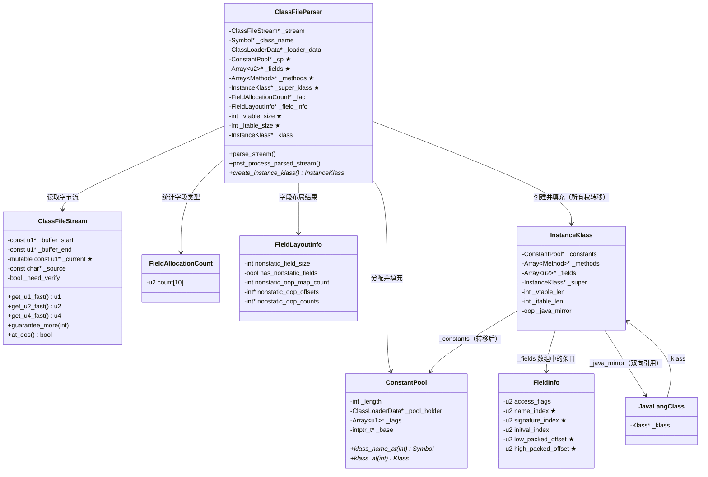

# ClassFileParser：.class 文件解析完整流程

> 源码基线：OpenJDK 11 (`src/hotspot/share/classfile/classFileParser.cpp` — 6461 行)
> 标准环境：`-Xms8g -Xmx8g -XX:+UseG1GC`
> 前置阅读：`ClassLoading/klass_hierarchy.md`（Klass 继承体系）、`ClassLoading/classloading_complete_flow.md`（类加载总流程）

---

## 第 0 部分：核心原理 ⭐

### 0.1 本质是什么？

`ClassFileParser` 的本质是一个**单次顺序扫描的二进制解析器**：从 `ClassFileStream` 的起始位置开始，按照 JVM 规范规定的顺序（magic → version → 常量池 → 访问标志 → 类名 → 超类 → 接口 → 字段 → 方法 → 属性）逐字节读取，将 `.class` 文件的扁平二进制格式转换为 JVM 内部的树状元数据结构 `InstanceKlass`。

### 0.2 为什么需要？

JVM 执行引擎需要的是**结构化的元数据**（方法字节码数组、字段偏移量、vtable 索引等），而 `.class` 文件存储的是**扁平的二进制流**（常量池索引、字节码序列、属性表）。两者之间存在格式鸿沟：

- `.class` 文件中的方法引用是"常量池索引"（一个 u2 整数），JVM 需要的是 `Method*` 指针
- `.class` 文件中的字段是按声明顺序排列的，JVM 需要的是按内存对齐优化后的布局
- `.class` 文件中的接口是名称字符串，JVM 需要的是已加载的 `Klass*` 指针

`ClassFileParser` 就是完成这个转换的组件，同时承担格式校验（防止恶意/损坏的字节码）。

### 0.3 怎么解决？

- **三阶段管线**：`parse_stream()` 顺序扫描字节流填充成员字段 → `post_process_parsed_stream()` 触发超类加载并计算 vtable/itable/字段布局 → `create_instance_klass()` 将成员字段数据转移到 Metaspace 中的 `InstanceKlass`
- **两遍常量池扫描**：第一遍读取原始数据，第二遍做交叉引用验证（因为 CP 条目存在前向引用）
- **延迟超类解析**：`parse_stream` 阶段只记录 `super_class` 的常量池索引，真正的 `Klass*` 解析推迟到 `post_process_parsed_stream`（需要先完成格式校验）
- **字段布局优化**：`layout_fields()` 按类型分组排列（long/double 优先），利用对齐间隙填充小字段，减少内存浪费

### 0.4 为什么这样设计？

- **为什么构造函数就完成大部分解析？** 构造函数调用 `parse_stream()`，构造完成时解析已基本完成。这样 `create_instance_klass()` 只需做内存分配和数据转移，职责清晰
- **为什么 `super_class` 只读索引不立即解析？** 超类解析会触发超类的类加载（递归），必须等当前类的格式校验完成后才能安全触发，否则格式错误的类可能已经污染了超类的加载状态
- **为什么 `apply_parsed_class_metadata` 后将 `_methods`/`_fields`/`_cp` 置 NULL？** 所有权转移给 `InstanceKlass`，防止 `ClassFileParser` 析构时重复释放
- **为什么字段布局（`layout_fields`）在 `parse_stream` 之后单独执行？** 字段布局需要知道所有字段的类型（静态/实例、oop/primitive），必须等 `parse_fields` 完成后才能做内存对齐优化

---

## 目录

1. [问题引入：为什么需要理解 ClassFileParser？](#1-问题引入)
2. [ClassFileStream：字节流读取层](#2-classfilestream)
3. [三阶段管线架构](#3-三阶段管线架构)
4. [第一阶段：parse_stream() — 顺序解析](#4-parse_stream)
5. [常量池解析：两遍扫描](#5-常量池解析)
6. [字段解析：parse_fields()](#6-字段解析)
7. [方法解析：parse_method()](#7-方法解析)
8. [类属性解析：parse_classfile_attributes()](#8-类属性解析)
9. [第二阶段：post_process_parsed_stream()](#9-post_process_parsed_stream)
10. [字段布局算法：layout_fields()](#10-layout_fields)
11. [第三阶段：create_instance_klass() + fill_instance_klass()](#11-组装阶段)
12. [格式验证：verify_legal_* 系列](#12-格式验证)
13. [JVM 参数与日志](#13-jvm-参数与日志)
14. [面试题精选](#14-面试题)
15. [源码文件索引](#15-源码索引)

---

## 1. 问题引入

**ClassFileParser 解决什么问题？**

当 `ClassLoader.loadClass()` 最终找到一个 `.class` 文件的字节流后，JVM 需要把这段二进制数据转换成内存中的 C++ 对象（`InstanceKlass`）。这个转换过程就是 ClassFileParser 的工作。

它的输入是一个 `ClassFileStream`（指向 `.class` 文件的字节缓冲区），输出是一个完全初始化的 `InstanceKlass*`，可以被 `SystemDictionary` 注册并用于后续的链接和初始化。

**核心挑战：**
1. `.class` 文件格式复杂——JVM Spec §4 定义了 18 种常量池标签、多种属性、嵌套子属性
2. 需要严格验证——恶意字节码可能导致 JVM 崩溃或安全漏洞
3. 性能要求高——每个类加载都要走一遍，启动时上千个类密集加载
4. 字段布局需要复杂算法——兼顾对齐、缓存行、`@Contended` 等

**一句话总结：** ClassFileParser 是一个 **三阶段管线处理器** —— 先顺序解析 `.class` 二进制流，再做后处理（父类解析、vtable/itable 计算、字段布局），最后组装成 `InstanceKlass` 并创建 `java.lang.Class` 镜像。

---

## 2. ClassFileStream：字节流读取层

> 源码：`classFileStream.hpp` (147 行)

ClassFileStream 是对 `.class` 文件内存缓冲区的顺序读取封装。整个 `.class` 文件已经由 `ClassLoader` 加载到内存，ClassFileStream 只是一个游标。

### 2.1 核心字段

```cpp
// classFileStream.hpp:40
class ClassFileStream: public ResourceObj {
 private:
  const u1* const _buffer_start;  // ★ 缓冲区起始地址（不变）
  const u1* const _buffer_end;    // ★ 缓冲区末尾+1（不变，用于边界检查）
  mutable const u1* _current;     // ★ 当前读取位置（随解析推进）
  const char* const _source;      // 来源描述（文件路径，用于错误信息）
  bool _need_verify;              // 是否需要格式验证（影响 guarantee_more 行为）
};
```

**sizeof(ClassFileStream)**：5 个字段，4 个指针（8B×4=32B）+ 1 个 bool（1B）+ 对齐填充（7B）= **40 字节**（GDB 验证：`p sizeof(ClassFileStream)`）

**创建位置**：`ClassLoader::load_class_from_stream`（`classLoader.cpp`）中创建，包装 `ClassLoader` 读取到内存的 `.class` 字节数组。

**关键字段生命周期**：
- `_current`：初始指向 `_buffer_start`；每次 `get_u1/u2/u4_fast()` 调用后向后移动对应字节数；`at_eos()` 检查 `_current == _buffer_end`
- `_buffer_start/_buffer_end`：构造时设置，整个解析过程不变
- `_need_verify`：由 `Verifier::should_verify_for()` 决定，影响 `guarantee_more()` 是否做边界检查

### 2.2 两种读取模式

ClassFileStream 为每种基本类型（u1/u2/u4/u8）提供两套 API：

| 方法 | 说明 |
|------|------|
| `get_u2(TRAPS)` | **安全模式**——每次读取前检查边界 |
| `get_u2_fast()` | **快速模式**——不检查，由调用者预先保证 |

```cpp
// classFileStream.hpp:102-106
u2 get_u2_fast() const {
    u2 res = Bytes::get_Java_u2((address)_current);  // 大端序读取
    _current += 2;
    return res;
}
```

### 2.3 批量预检查模式

这是 ClassFileParser 中大量使用的优化模式——先一次性检查 N 字节可用，然后连续用 `_fast` 方法读取：

```cpp
// 一次检查 8 字节：magic(4) + minor(2) + major(2)
stream->guarantee_more(8, CHECK);
const u4 magic = stream->get_u4_fast();
_minor_version = stream->get_u2_fast();
_major_version = stream->get_u2_fast();
```

`guarantee_more()` 的实现非常简洁：
```cpp
// classFileStream.hpp:88-92
void guarantee_more(int size, TRAPS) const {
    size_t remaining = (size_t)(_buffer_end - _current);
    unsigned int usize = (unsigned int)size;
    check_truncated_file(usize > remaining, CHECK);
}
```

> **性能考量：** `parse_constant_pool_entries()` 中更进一步——将 `ClassFileStream` 拷贝到栈上的局部变量，使 `_current` 可以被编译器分配到寄存器（标量替换优化）：
> ```cpp
> // classFileParser.cpp:139-140
> const ClassFileStream cfs1 = *stream;  // 栈上拷贝
> const ClassFileStream* const cfs = &cfs1;
> ```

---

## 3. 三阶段管线架构

ClassFileParser 的生命周期分为三个阶段：

```
┌──────────────────────────────────────────────────────────────────┐
│                     ClassFileParser 生命周期                      │
├──────────────────────────────────────────────────────────────────┤
│                                                                  │
│  构造函数                                                         │
│  ├── 初始化 ~40 个成员字段                                         │
│  ├── 确定 _need_verify                                           │
│  ├── 阶段一：parse_stream(stream)         ← 顺序解析 .class      │
│  └── 阶段二：post_process_parsed_stream() ← 后处理                │
│                                                                  │
│  外部调用                                                         │
│  └── 阶段三：create_instance_klass()       ← 组装 InstanceKlass  │
│       ├── InstanceKlass::allocate_instance_klass()               │
│       └── fill_instance_klass()                                  │
│                                                                  │
└──────────────────────────────────────────────────────────────────┘
```

**关键设计：** 构造函数完成全部解析工作。当 `ClassFileParser` 构造函数返回时，`.class` 文件的所有信息已经被提取到 `ClassFileParser` 的成员字段中。后续的 `create_instance_klass()` 只是把这些信息组装到 `InstanceKlass` 上。

### 3.1 构造函数

> 源码：`classFileParser.cpp:5876-5995`

构造函数做三件事：

**（1）初始化约 40 个成员字段为默认值**

从 `_stream`、`_requested_name`、`_loader_data` 等输入参数，到 `_cp`、`_fields`、`_methods` 等将要填充的解析结果，再到 `_synthetic_flag`、`_has_finalizer` 等标志位，全部初始化。

**（2）确定验证策略**

```cpp
// classFileParser.cpp:5962-5963
_need_verify = Verifier::should_verify_for(_loader_data->class_loader(),
                                           stream->need_verify());
```

- Bootstrap ClassLoader 加载的核心类可以跳过验证（`BytecodeVerificationLocal`）
- 应用类默认开启验证（`BytecodeVerificationRemote`）

**（3）调用 parse_stream() 和 post_process_parsed_stream()**

```cpp
// classFileParser.cpp:5992-5994
parse_stream(stream, CHECK);
post_process_parsed_stream(stream, _cp, CHECK);
```

---

## 4. 第一阶段：parse_stream() — 顺序解析

> 源码：`classFileParser.cpp:6071-6316`

`parse_stream()` 严格按照 JVM Spec §4.1 的 `ClassFile` 结构顺序解析：

```
ClassFile {
    u4             magic;                    ← 4 bytes
    u2             minor_version;            ← 2 bytes
    u2             major_version;            ← 2 bytes
    u2             constant_pool_count;      ← 2 bytes
    cp_info        constant_pool[];          ← variable
    u2             access_flags;             ← 2 bytes
    u2             this_class;               ← 2 bytes
    u2             super_class;              ← 2 bytes
    u2             interfaces_count;         ← 2 bytes
    u2             interfaces[];             ← variable
    u2             fields_count;             ← 2 bytes
    field_info     fields[];                 ← variable
    u2             methods_count;            ← 2 bytes
    method_info    methods[];                ← variable
    u2             attributes_count;         ← 2 bytes
    attribute_info attributes[];             ← variable
}
```

### 4.1 步骤分解

```
parse_stream()
│
├── Step 1: Magic Number (0xCAFEBABE)
│   guarantee_more(8) → get_u4_fast()
│   检查 magic == JAVA_CLASSFILE_MAGIC
│
├── Step 2: 版本号
│   get_u2_fast() × 2 → _minor_version, _major_version
│   verify_class_version() — 支持 45.0 ~ 55.0 (Java 1.0 ~ 11)
│
├── Step 3: 常量池
│   get_u2_fast() → cp_size
│   ConstantPool::allocate() — 在 Metaspace 分配
│   parse_constant_pool()   — 两遍扫描 (详见第 5 节)
│
├── Step 4: 访问标志
│   guarantee_more(8)
│   get_u2_fast() & JVM_RECOGNIZED_CLASS_MODIFIERS
│   Java 9+ 额外识别 JVM_ACC_MODULE
│   verify_legal_class_modifiers()
│
├── Step 5: this_class / super_class
│   _this_class_index = get_u2_fast()
│   检查 CP 中对应条目为 UnresolvedKlass
│   _class_name = cp->klass_name_at(_this_class_index)
│   检查请求名与实际名一致 (否则 NoClassDefFoundError)
│   _super_class_index = get_u2_fast()
│
├── Step 6: 接口列表
│   _itfs_len = get_u2_fast()
│   parse_interfaces() → _local_interfaces (Klass* 数组)
│
├── Step 7: 字段
│   _fac = new FieldAllocationCount()
│   parse_fields() → _fields (u2 数组), 计算各类型字段计数
│
├── Step 8: 方法
│   parse_methods() → _methods (Method* 数组)
│   收集 promoted_flags (如 ACC_HAS_LOCALVARIABLE_TABLE)
│
├── Step 9: 类属性
│   parse_classfile_attributes()
│   → _inner_classes, _nest_members, SourceFile, BootstrapMethods 等
│
├── Step 10: 合并注解
│   create_combined_annotations()
│
└── Step 11: 验证 EOF
    guarantee_property(stream->at_eos())
```

### 4.2 日志输出

在 Step 5 之后，如果类不是内部类，会输出 preorder 日志：

```
-Xlog:class+preorder=debug
```

输出示例：
```
[debug][class,preorder] com.wjcoder.Main source: file:/data/workspace/demo/src/
```

---

## 5. 常量池解析：两遍扫描

> 源码：`classFileParser.cpp:127-778`

常量池解析是整个 parse_stream() 中最复杂的部分。采用**两遍扫描**策略：

### 5.1 第一遍：parse_constant_pool_entries() — 原始读取

> 源码：`classFileParser.cpp:127-376`

逐条读取 CP 条目，根据 tag 解析不同长度的数据：

```
┌──────────────────────────────────────────────────────────────┐
│                   第一遍：原始数据读取                          │
├──────────────────────────────────────────────────────────────┤
│  tag=7  (Class)            → 2 bytes: name_index             │
│  tag=9  (Fieldref)         → 4 bytes: class_idx + nat_idx    │
│  tag=10 (Methodref)        → 4 bytes: class_idx + nat_idx    │
│  tag=11 (InterfaceMethodref)→ 4 bytes: class_idx + nat_idx   │
│  tag=8  (String)           → 2 bytes: string_index           │
│  tag=3  (Integer)          → 4 bytes: value                  │
│  tag=4  (Float)            → 4 bytes: value                  │
│  tag=5  (Long)             → 8 bytes: value (占 2 个 slot)    │
│  tag=6  (Double)           → 8 bytes: value (占 2 个 slot)    │
│  tag=12 (NameAndType)      → 4 bytes: name_idx + sig_idx     │
│  tag=1  (Utf8)             → 2+N bytes: length + bytes       │
│  tag=15 (MethodHandle)     → 3 bytes: ref_kind + method_idx  │
│  tag=16 (MethodType)       → 2 bytes: signature_index        │
│  tag=17 (Dynamic)          → 4 bytes: bsm_idx + nat_idx      │
│  tag=18 (InvokeDynamic)    → 4 bytes: bsm_idx + nat_idx      │
└──────────────────────────────────────────────────────────────┘
```

**Utf8 条目的批量 Symbol 创建优化：**

对于 Utf8 条目，不是逐条创建 Symbol，而是使用批量策略：

1. 先在 `SymbolTable` 中查找（`lookup_only()`），如果已存在则直接使用
2. 如果不存在，缓存到本地数组中
3. 当缓存满 8 条（`symbol_alloc_batch_size`）时，一次性调用 `SymbolTable::new_symbols()` 批量创建
4. 循环结束后，处理剩余的缓存

```cpp
// classFileParser.cpp:314-332
if (result == NULL) {
    names[names_count] = (const char*)utf8_buffer;
    lengths[names_count] = utf8_length;
    indices[names_count] = index;
    hashValues[names_count++] = hash;
    if (names_count == SymbolTable::symbol_alloc_batch_size) {
        SymbolTable::new_symbols(/* batch create */);
        names_count = 0;
    }
}
```

这样做的好处：减少 SymbolTable 锁的获取次数，提升并发类加载的吞吐。

### 5.2 第二遍：parse_constant_pool() — 交叉引用验证

> 源码：`classFileParser.cpp:407-778`

第二遍有三个子阶段：

**（1）索引合法性交叉验证（行 426-595）**

遍历所有 CP 条目，验证引用的索引指向正确类型的条目：

- `Fieldref/Methodref/InterfaceMethodref`：klass_ref_index 必须指向 `ClassIndex`，name_and_type_ref_index 必须指向 `NameAndType`
- `ClassIndex`：所指 index 必须是 `Utf8`，**转换为** `UnresolvedClass`
- `StringIndex`：所指 index 必须是 `Utf8`，**转换为** `UnresolvedString`
- `MethodHandle`：根据 ref_kind 验证所指条目是 Field/Method/InterfaceMethod

**关键转换：** 第一遍读到的 `JVM_CONSTANT_ClassIndex` 在这里被转换为 `JVM_CONSTANT_UnresolvedClass`，`StringIndex` 被转换为 `JVM_CONSTANT_UnresolvedString`。

```cpp
// classFileParser.cpp:486-492
case JVM_CONSTANT_ClassIndex: {
    const int class_index = cp->klass_index_at(index);
    check_property(valid_symbol_at(class_index), ...);
    cp->unresolved_klass_at_put(index, class_index, num_klasses++);
    break;
}
```

**（2）分配 resolved_klasses 数组（行 597-598）**

```cpp
cp->allocate_resolved_klasses(_loader_data, num_klasses + _max_num_patched_klasses, CHECK);
```

为后续类解析预分配空间。

**（3）字符串格式验证（行 635-777，仅当 `_need_verify` 时）**

- `UnresolvedClass`：`verify_legal_class_name()`
- `NameAndType`：根据 signature 首字符判断是字段还是方法，分别调用 `verify_legal_field_name/signature` 或 `verify_legal_method_name/signature`
- `Fieldref`：signature 不能以 `(` 开头
- `Methodref`：signature 必须以 `(` 开头；方法名以 `<` 开头的只能是 `<init>`
- `MethodType`：`verify_legal_method_signature()`

---

## 6. 字段解析：parse_fields()

> 源码：`classFileParser.cpp:1542-1772`

### 6.1 解析流程

对于 `.class` 文件中的每个字段（`field_info`），按顺序处理：

```
parse_fields()
│
├── 读取 fields_count
│
├── 获取 JVM 注入字段列表 (JavaClasses::get_injected)
│   例如: Object 的 _klass_gap, Reference 的 _referent 等
│
├── 分配临时 u2 数组: total_fields × (6 + 1) 个 slot
│   6 = FieldInfo::field_slots (access, name, sig, initval, offset_lo, offset_hi)
│   1 = 预留给 generic_signature_index
│
├── 对每个字段:
│   ├── 读取 access_flags, name_index, descriptor_index
│   ├── verify_legal_field_modifiers()
│   ├── verify_legal_field_name()
│   ├── verify_legal_field_signature()
│   ├── 读取 attributes_count
│   ├── parse_field_attributes() → ConstantValue, Synthetic, Signature, 注解
│   ├── FieldInfo::initialize(access, name_idx, sig_idx, constval_idx)
│   ├── 计算 FieldAllocationType (static/nonstatic × oop/byte/short/word/double)
│   └── fac->update(is_static, type) — 更新字段计数器
│
├── 处理 JVM 注入字段 (标记为 JVM_ACC_FIELD_INTERNAL)
│   ├── 检查是否与 Java 声明字段重名 (may_be_java)
│   └── 添加到字段数组末尾
│
├── 拷贝到 Metaspace 中的永久数组 (_fields)
│
└── 重复字段检测 (NameSigHash 哈希表)
```

### 6.2 FieldInfo 编码格式

每个字段占 6 个 `u2` 槽位（`fieldInfo.hpp`）：

```cpp
// fieldInfo.hpp:60
// FieldInfo 编码 (6 × u2 = 12 bytes per field)
// [0] access_flags      — 访问修饰 + HotSpot 扩展标志（JVM_ACC_FIELD_INTERNAL 等）
// [1] name_index        — ★ 字段名在 CP 中的索引
// [2] signature_index   — ★ 类型描述符在 CP 中的索引（如 "I"、"Ljava/lang/String;"）
// [3] initval_index     — ConstantValue 属性的 CP 索引（static final 字段的初始值）
// [4] low_packed_offset — 偏移低 16 位（解析阶段暂存 FieldAllocationType）
// [5] high_packed_offset— 偏移高 16 位（布局阶段被 set_offset(real_offset) 覆盖）
```

**sizeof(FieldInfo)**：6 × 2 = **12 字节**（不含泛型签名附加区域）

**创建位置**：`parse_fields()` 中，每解析一个字段调用 `FieldInfo::initialize()` 填充前 4 个槽位；`layout_fields()` 完成后调用 `set_offset()` 覆盖 [4][5]。

**关键字段生命周期**：
- `[4][5]`（packed_offset）：`parse_fields` 阶段存储 `FieldAllocationType`（枚举值，标识字段类型）；`layout_fields` 完成后被真实内存偏移覆盖；`InstanceKlass` 使用时通过 `offset()` 读取
- `[3]`（initval_index）：只有 `static final` 字段才非零；`fill_instance_klass` 时用于初始化静态字段的初始值

如果字段有泛型签名（`JVM_ACC_FIELD_HAS_GENERIC_SIGNATURE`），其 `generic_signature_index` 存储在字段数组末尾的附加区域。

### 6.3 FieldAllocationCount 完整分析

**问题推导**：`layout_fields` 需要知道各类型字段的数量（静态 oop 有几个、实例 int 有几个...）才能计算内存布局。需要一个计数器在 `parse_fields` 时统计。

```cpp
// classFileParser.cpp 内部类
class ClassFileParser::FieldAllocationCount {
 public:
  u2 count[MAX_FIELD_ALLOCATION_TYPE]; // 10 个计数器，按 FieldAllocationType 分类
  // STATIC_OOP=0, STATIC_BYTE=1, STATIC_SHORT=2, STATIC_WORD=3, STATIC_DOUBLE=4
  // NONSTATIC_OOP=5, NONSTATIC_BYTE=6, NONSTATIC_SHORT=7, NONSTATIC_WORD=8, NONSTATIC_DOUBLE=9
};

enum FieldAllocationType {
    STATIC_OOP, STATIC_BYTE, STATIC_SHORT, STATIC_WORD, STATIC_DOUBLE,
    NONSTATIC_OOP, NONSTATIC_BYTE, NONSTATIC_SHORT, NONSTATIC_WORD, NONSTATIC_DOUBLE
};
```

**sizeof(FieldAllocationCount)**：10 × 2 = **20 字节**

**创建位置**：`parse_stream()` 中 `_fac = new FieldAllocationCount()`，在 `parse_fields()` 调用之前创建。

**关键字段生命周期**：`parse_fields` 时每解析一个字段调用 `fac->update(is_static, type)` 递增对应计数；`layout_fields()` 读取这些计数计算各类型字段区域的起始偏移量；`fill_instance_klass` 后 `_fac` 随 `ClassFileParser` 析构。

这个分类在后续 `layout_fields()` 中决定字段的排列顺序。

### 6.4 JVM 注入字段

某些 Java 核心类需要 HotSpot 注入额外字段，这些字段不存在于 `.class` 文件中：

| 类 | 注入字段 | 用途 |
|----|---------|------|
| `java.lang.Object` | `_klass_gap` | 压缩 Klass 指针后的间隙 |
| `java.lang.ref.Reference` | `_referent`, `_discovered` | GC 引用处理 |
| `java.lang.Class` | 多个 | 反射元数据 |

注入字段会检查是否与 Java 已声明字段重名（`may_be_java` 标志），避免重复。

---

## 7. 方法解析：parse_method()

> 源码：`classFileParser.cpp:2345-2953`（约 600 行/方法）

这是 ClassFileParser 中单个函数最长的方法，因为 `method_info` 结构包含大量子属性。

### 7.1 解析流程

```
parse_method()
│
├── 读取固定部分: access_flags, name_index, descriptor_index
│   ├── verify_legal_method_name()
│   ├── verify_legal_method_modifiers()
│   └── <clinit> 特殊处理: 强制 ACC_STATIC
│
├── 计算参数大小 args_size (用于验证)
│
├── 遍历方法属性:
│   ├── Code 属性 ★
│   │   ├── max_stack, max_locals, code_length
│   │   ├── 字节码 (code_start 指针 + skip)
│   │   ├── exception_table (start_pc, end_pc, handler_pc, catch_type)
│   │   └── Code 子属性:
│   │       ├── LineNumberTable → 压缩格式
│   │       ├── LocalVariableTable (LVT)
│   │       ├── LocalVariableTypeTable (LVTT, Java 5+ 泛型)
│   │       └── StackMapTable (Java 6+ 验证器)
│   │
│   ├── Exceptions 属性 → checked_exceptions 列表
│   ├── MethodParameters 属性 → 参数名 (Java 8+ -parameters)
│   ├── Synthetic 属性
│   ├── Deprecated 属性
│   ├── Signature 属性 (Java 5+)
│   ├── RuntimeVisibleAnnotations
│   ├── RuntimeInvisibleAnnotations
│   ├── RuntimeVisible/InvisibleParameterAnnotations
│   ├── RuntimeVisible/InvisibleTypeAnnotations (Java 8+)
│   └── AnnotationDefault (注解接口默认值)
│
├── 创建 Method 对象
│   Method::allocate(_loader_data, code_length, access_flags, &sizes, NORMAL)
│
├── 填充 Method 数据
│   ├── set_constants, set_name_index, set_signature_index
│   ├── set_result_type
│   ├── set_size_of_parameters
│   ├── set_max_stack, set_max_locals
│   ├── 拷贝: 字节码、行号表、异常表、方法参数、受检异常、LVT
│   └── 拷贝: 各种注解数据
│
├── 特殊方法检测
│   ├── finalize() + void签名 → _has_finalizer / _has_empty_finalizer
│   └── <init>() + void签名 + vanilla → _has_vanilla_constructor
│
└── 返回 Method*
```

### 7.2 Code 属性解析细节

Code 属性是最复杂的子结构：

```
Code_attribute {
    u2 max_stack;
    u2 max_locals;
    u4 code_length;
    u1 code[code_length];          ← 字节码本体
    u2 exception_table_length;
    { u2 start_pc, end_pc, handler_pc, catch_type; } exception_table[];
    u2 attributes_count;
    attribute_info attributes[];   ← LineNumberTable, LVT, StackMapTable
}
```

**版本兼容性：** 对于极早期的 `.class` 文件（version 45.2 及以前），`max_stack` 和 `max_locals` 是 `u1`，`code_length` 是 `u2`（而不是现在的 `u2`/`u2`/`u4`）。

**字节码本体不做拷贝：** 解析阶段只记录 `code_start` 指针，稍后创建 `Method` 对象时才通过 `m->set_code((u1*)code_start)` 拷贝。

### 7.3 LineNumberTable 压缩

HotSpot 使用 `CompressedLineNumberWriteStream` 对行号表做增量压缩——只记录 `(bci 增量, line 增量)` 对，大幅减少空间占用。

### 7.4 StackMapTable

Java 6+ 的类文件必须携带 StackMapTable 属性，供 split verifier 使用。解析时仅做格式检查和原始数据拷贝（`copy_stackmap_data()`），不做深入分析——真正的类型推断在 Verifier 中完成。

### 7.5 特殊方法检测

解析完每个方法后，会检查两个关键方法：

1. **`finalize()V`**：如果方法体非空，设置 `_has_finalizer = true`。这直接影响后续 `InstanceKlass` 的 `has_finalizer()` 属性，决定对象分配时是否需要调用 `Finalizer.register()`。

2. **`<init>()V`**：如果是 vanilla constructor（无参构造、调用 `super()`、无其他逻辑），设置 `_has_vanilla_constructor = true`。这允许子类对象分配时跳过构造函数调用的某些检查。

---

## 8. 类属性解析：parse_classfile_attributes()

> 源码：`classFileParser.cpp:3441-3716`

类级别的属性比方法属性少，但包含一些关键信息：

```
parse_classfile_attributes()
│
├── SourceFile             → _sourcefile_index (调试信息)
├── SourceDebugExtension   → _sde_buffer (JSP 等调试)
├── InnerClasses           → 延迟解析 (先记录位置)
├── Synthetic              → _synthetic_flag
├── Deprecated             → (仅标记)
│
├── Java 5+ 属性:
│   ├── Signature          → _generic_signature_index
│   ├── RuntimeVisibleAnnotations → 立即解析 (@Contended 等)
│   ├── RuntimeInvisibleAnnotations
│   ├── EnclosingMethod    → class_index + method_index
│   ├── BootstrapMethods   → BSM 表 (InvokeDynamic 需要)
│   ├── RuntimeVisible/InvisibleTypeAnnotations
│   │
│   └── Java 11+ 属性:
│       ├── NestMembers    → 嵌套成员列表
│       └── NestHost       → 嵌套宿主类
│
├── 组装注解元数据
│   _annotations = assemble_annotations(visible + invisible)
│   _type_annotations = assemble_annotations(visible + invisible)
│
├── 解析 InnerClasses (之前延迟的)
│   parse_classfile_inner_classes_attribute()
│
├── 解析 NestMembers (之前延迟的)
│   parse_classfile_nest_members_attribute()
│
└── 验证 BootstrapMethods 与 InvokeDynamic 一致性
    如果有 InvokeDynamic，必须有 BootstrapMethods
```

### 8.1 NestHost / NestMembers (Java 11 新增)

Java 11 引入了嵌套访问控制（JEP 181），替代了之前的合成桥接方法。解析时有互斥检查：

```cpp
// classFileParser.cpp:3635-3637
if (parsed_nest_host_attribute) {
    classfile_parse_error("Conflicting NestHost and NestMembers attributes...");
}
```

一个类不能同时有 NestHost 和 NestMembers。

### 8.2 InnerClasses 延迟解析

InnerClasses 属性的解析被延迟到 `parse_classfile_attributes()` 的末尾。这是因为需要先读完 EnclosingMethod 属性（如果存在），两者会一起处理。

---

## 9. 第二阶段：post_process_parsed_stream()

> 源码：`classFileParser.cpp:6318-6413`

当 `parse_stream()` 完成后，所有原始数据已经解析，但还需要做五项后处理：

```
post_process_parsed_stream()
│
├── (1) java.lang.Object 特殊检查
│   Object 不能实现任何接口
│
├── (2) 解析父类
│   SystemDictionary::resolve_super_or_fail()
│   ├── 这是一个递归过程——父类可能还未加载
│   ├── 验证: 父类不能是接口
│   └── 验证: 父类不能是 final
│
├── (3) 计算传递性接口集合
│   compute_transitive_interfaces()
│   合并父类和本类直接实现的所有接口
│
├── (4) 方法排序 + vtable/itable 计算
│   sort_methods() → _method_ordering
│   klassVtable::compute_vtable_size_and_num_mirandas()
│   ├── _vtable_size: 虚方法表大小
│   ├── _num_miranda_methods: Miranda 方法数
│   └── _all_mirandas: Miranda 方法列表
│   klassItable::compute_itable_size()
│   ├── 接口类: itable_size = 0
│   └── 非接口类: 根据传递性接口计算
│
├── (5) 字段布局
│   _field_info = new FieldLayoutInfo()
│   layout_fields() ← 最复杂的算法 (详见第 10 节)
│
└── (6) 确定引用类型
    _rt = _super_klass->reference_type()  // REF_NONE / REF_SOFT / REF_WEAK / ...
```

**Miranda 方法：** 当一个抽象类实现了接口但没有实现某些接口方法时，HotSpot 会生成 Miranda 方法占位符，使 vtable 中有对应的槽位。

**方法排序：** `sort_methods()` 按方法名和签名排序，以支持二分查找。排序前记录原始顺序到 `_method_ordering`，以便后续按 class file 声明顺序遍历。

---

## 10. 字段布局算法：layout_fields()

> 源码：`classFileParser.cpp:3935-4451`（约 520 行）

这是 ClassFileParser 中最复杂的算法，决定每个字段在 Java 对象实例中的内存偏移。

### 10.1 问题背景

一个 Java 对象的内存布局：

```
┌─────────────────────────────────────────────┐
│ mark word (8 bytes)                         │
│ klass pointer (4/8 bytes, 压缩/非压缩)       │
│ [klass gap] (如果压缩指针)                    │
│ ─── 父类字段 ───                             │
│ ─── 本类字段 ───                             │
│ [对齐填充]                                   │
└─────────────────────────────────────────────┘
```

字段布局需要考虑：
- **对齐**：long/double 需要 8 字节对齐
- **间隙利用**：对齐产生的间隙可以塞入小字段
- **缓存行隔离**：`@Contended` 字段需要 128 字节前后 padding
- **GC 友好**：oop 字段需要生成 oop-map 供 GC 扫描

### 10.2 三种分配风格

由 `-XX:FieldsAllocationStyle` 控制（默认值为 **1**）：

| 风格 | 顺序 | 说明 |
|------|------|------|
| **0** | oops → longs → ints → shorts → bytes | OOP 优先 |
| **1** (默认) | longs → ints → shorts → bytes → oops | **长类型优先** |
| **2** | 自适应 | 如果父类尾部是 oop，则 oop 优先；否则退化为风格 1 |

**特殊类强制使用风格 0：** 某些核心类（String、Class、Reference 等）因为 HotSpot 硬编码了字段偏移，必须使用固定的布局风格：

```cpp
// classFileParser.cpp:4042-4061
if ((allocation_style != 0 || compact_fields) && _loader_data->class_loader() == NULL &&
    (_class_name == vmSymbols::java_lang_String() ||
     _class_name == vmSymbols::java_lang_Class() || ...)) {
    allocation_style = 0;
    compact_fields = false;
}
```

### 10.3 CompactFields 间隙填充

当 `-XX:+CompactFields`（默认开启）时，long/double 对齐产生的 4 字节间隙会被小字段填充：

```
假设 nonstatic_fields_start = 12 (对象头后)
long 字段需要 8 字节对齐 → 下一个 long 位置 = 16
产生 4 字节间隙 [12, 16)

填充优先级：
1. int (4 bytes) — 最多填 1 个
2. short/char (2 bytes) — 尽量填满
3. byte/boolean (1 byte) — 尽量填满
4. oop (4 bytes, 压缩指针) — 仅当 allocation_style != 0 时
```

```
具体示例 (FieldsAllocationStyle=1, CompactFields=true):

偏移 12: [int 字段]        ← 填充到 long 对齐间隙中
偏移 16: [long 字段]       ← 8 字节对齐
偏移 24: [long 字段]
偏移 32: [int 字段]
偏移 36: [short 字段]
偏移 38: [byte 字段]
偏移 39: [padding 1 byte]  ← oop 对齐
偏移 40: [oop 字段]        ← 4 字节对齐 (compressed)
偏移 44: [oop 字段]
偏移 48: 对象结束           ← 8 字节对齐
```

### 10.4 @Contended 处理

`@Contended` 注解（`@sun.misc.Contended` / `@jdk.internal.vm.annotation.Contended`）用于避免伪共享。处理逻辑：

1. **整个类 `@Contended`**：在所有非静态字段前后各加 `ContendedPaddingWidth`（默认 128 字节）
2. **单个字段 `@Contended`**：
   - 所有 contended 字段排在普通字段之后
   - 第一个 contended 字段前加 128 字节 padding
   - **默认组（group=0）**：每个字段之间加 128 字节 padding
   - **同一 group**：组内字段连续排列，组间加 128 字节 padding
   - 最后一个组后面也加 128 字节 padding

```
普通字段排列完毕后:

   ... 普通字段 ...
   +128 padding
   [contended field A, group=0]
   +128 padding
   [contended field B, group=0]
   +128 padding
   [contended field C, group=1]
   [contended field D, group=1]  ← 同组内连续
   +128 padding
```

> **JVM 参数：** `-XX:ContendedPaddingWidth=N`（默认 128），`-XX:-RestrictContended` 允许非内部类使用 @Contended。

### 10.5 OOP Map 生成

在分配 oop 字段偏移的同时，`layout_fields()` 构建 oop-map 列表。每当一个 oop 字段与上一个 oop 字段连续时，合并到同一个 map block；否则创建新的 map block：

```cpp
// classFileParser.cpp:4213-4230
if (nonstatic_oop_map_count > 0 &&
    nonstatic_oop_offsets[last] == real_offset - int(nonstatic_oop_counts[last]) * heapOopSize) {
    nonstatic_oop_counts[last] += 1;  // 连续，合并
} else {
    nonstatic_oop_offsets[new] = real_offset;  // 不连续，新建
    nonstatic_oop_counts[new] = 1;
    nonstatic_oop_map_count += 1;
}
```

### 10.6 最终尺寸计算

```cpp
// classFileParser.cpp:4400-4411
int nonstatic_fields_end = align_up(next_nonstatic_padded_offset, heapOopSize);
int instance_end = align_up(next_nonstatic_padded_offset, wordSize);
int instance_size = align_object_size(instance_end / wordSize);  // 以 word 为单位
```

`instance_size` 是最终的 Java 对象大小（以 word 为单位），将被设置到 `InstanceKlass._layout_helper` 中。

### 10.7 调试：PrintFieldLayout

```
-XX:+PrintFieldLayout    (仅 debug/slowdebug 构建)
```

会打印每个类的字段布局详情。

> **JVM 参数：** `-XX:FieldsAllocationStyle=N`（0/1/2），`-XX:+CompactFields`（默认 true），`-XX:ContendedPaddingWidth=N`（默认 128）。

---

## 11. 第三阶段：create_instance_klass() + fill_instance_klass()

### 11.1 create_instance_klass()

> 源码：`classFileParser.cpp:5567-5593`

```cpp
InstanceKlass* ClassFileParser::create_instance_klass(bool changed_by_loadhook, TRAPS) {
    if (_klass != NULL) return _klass;

    InstanceKlass* const ik = InstanceKlass::allocate_instance_klass(*this, CHECK_NULL);
    fill_instance_klass(ik, changed_by_loadhook, CHECK_NULL);

    // AOT fingerprint 检查
    if (UseAOT && ik->supers_have_passed_fingerprint_checks()) {
        uint64_t aot_fp = AOTLoader::get_saved_fingerprint(ik);
        if (aot_fp != 0 && aot_fp == _stream->compute_fingerprint()) {
            ik->set_has_passed_fingerprint_check(true);
        }
    }
    return ik;
}
```

`InstanceKlass::allocate_instance_klass()` 的详细分析见 `klass_hierarchy.md` 第 7 章。简要回顾：根据类类型选择构造函数（InstanceMirrorKlass / InstanceRefKlass / InstanceClassLoaderKlass / InstanceKlass），在 Metaspace 中分配并构造。

### 11.2 fill_instance_klass()

> 源码：`classFileParser.cpp:5595-5818`（约 220 行）

这是最后的组装阶段，将 ClassFileParser 中解析好的所有数据转移到 InstanceKlass：

```
fill_instance_klass()
│
├── 基础设置
│   set_class_loader_data(), set_name()
│   _loader_data->add_class(ik)  — 注册到 ClassLoaderData
│
├── 字段信息
│   set_nonstatic_field_size()
│   set_has_nonstatic_fields()
│   set_static_oop_field_count()
│
├── ★ 所有权转移 (关键步骤)
│   apply_parsed_class_metadata(ik, _java_fields_count)
│   ├── ik->set_constants(_cp);      _cp = NULL;
│   ├── ik->set_fields(_fields);     _fields = NULL;
│   ├── ik->set_methods(_methods);   _methods = NULL;
│   ├── ik->set_inner_classes(...);   _inner_classes = NULL;
│   └── ... 其他元数据转移 ...
│   ★ 从此刻起 parser 的字段已被清空，不能再使用
│
├── 方法信息
│   set_has_final_method()
│   copy_method_ordering()
│   set_initial_method_idnum()
│
├── 类信息
│   set_this_class_index()
│   set_minor_version(), set_major_version()
│   set_has_nonstatic_concrete_methods()
│
├── 匿名类处理
│   if (is_anonymous()) → klass_at_put 自引用
│
├── 包设置
│   set_package()
│
├── 内省方法检查
│   check_methods_for_intrinsics() — 标记 VM intrinsic 方法
│
├── 注解应用
│   _parsed_annotations->apply_to(ik) — @ForceInline 等
│   apply_parsed_class_attributes()   — SourceFile 等
│
├── Miranda 方法标记
│   set_has_miranda_methods()
│
├── 继承体系初始化 ★
│   initialize_supers()  — 填充 _primary_supers[], _super_check_offset
│   set_transitive_interfaces()
│   klassItable::setup_itable_offset_table()
│
├── OOP Map 填充
│   fill_oop_maps()
│
├── 预计算标志
│   set_precomputed_flags() — has_finalizer, layout_helper 等
│
├── 访问检查
│   check_super_class_access()
│   check_super_interface_access()
│   check_final_method_override()
│   check_illegal_static_method() (Java 8 以前)
│
├── ★ 创建 java.lang.Class 镜像
│   java_lang_Class::create_mirror()
│   ← 这一步在 Java 堆上创建了 oop，与 Metaspace 中的 InstanceKlass 互指
│
├── 生成默认方法 (Java 8+)
│   DefaultMethods::generate_default_methods()
│
├── 类加载日志
│   ik->print_class_load_logging()
│
└── 完成
    set_klass_to_deallocate(NULL)  — 取消析构时的清理
    set_klass(ik)                  — 标记完成
```

### 11.3 所有权转移模型

`apply_parsed_class_metadata()` 是一个关键设计——它不是拷贝数据，而是**转移所有权**。调用后，`ClassFileParser` 的相应字段被置 NULL。如果后续 `fill_instance_klass()` 抛出异常，`InstanceKlass` 的析构函数会负责清理这些数据（通过 `_klass_to_deallocate` 机制）。

### 11.4 日志输出

```
-Xlog:class+load=info
```

输出示例：
```
[info][class,load] com.wjcoder.Main source: file:/data/workspace/demo/src/
```

```
-Xlog:class+resolve=debug
```

输出示例：
```
[debug][class,resolve] com.wjcoder.Main java.lang.Object (super)
[debug][class,resolve] com.wjcoder.Main java.io.Serializable (interface)
```

---

## 12. 格式验证：verify_legal_* 系列

> 源码：`classFileParser.cpp:4826-5430`

ClassFileParser 在解析过程中穿插了大量格式验证。所有验证都可以通过 `_need_verify` 标志跳过。

### 12.1 验证方法一览

| 方法 | 验证内容 |
|------|---------|
| `verify_legal_utf8()` | UTF-8 编码合法性 |
| `verify_legal_class_name()` | 类名格式：标识符 + `/` 分隔 |
| `verify_legal_field_name()` | 字段名：标识符（不能含 `.;[/`） |
| `verify_legal_method_name()` | 方法名：标识符 或 `<init>` / `<clinit>` |
| `verify_legal_field_signature()` | 字段描述符：`B/C/D/F/I/J/S/Z/L.../[...` |
| `verify_legal_method_signature()` | 方法描述符：`(参数列表)返回类型`，参数数 ≤ 255 |
| `verify_legal_class_modifiers()` | 类访问标志互斥：interface ↔ final 等 |
| `verify_legal_field_modifiers()` | 字段访问标志：接口字段必须 public static final |
| `verify_legal_method_modifiers()` | 方法访问标志：接口方法规则 (Java 8+ 允许 default) |
| `verify_class_version()` | 版本号范围：[45.0, 55.0] (JDK 1.0 ~ 11) |

### 12.2 版本号验证

```cpp
// 支持的版本范围
JAVA_MIN_SUPPORTED_VERSION = 45     // JDK 1.0
JAVA_1_5_VERSION           = 49     // 泛型、注解
JAVA_6_VERSION             = 50     // StackMapTable
JAVA_7_VERSION             = 51     // InvokeDynamic
JAVA_8_VERSION             = 52     // 接口默认方法
JAVA_9_VERSION             = 53     // 模块系统
JAVA_10_VERSION            = 54     // NestHost/NestMembers preview
JAVA_11_VERSION            = 55     // NestHost/NestMembers 正式
```

---

## 13. JVM 参数与日志

### 13.1 类加载相关日志

| 参数 | 说明 | 输出示例 |
|------|------|---------|
| `-Xlog:class+load=info` | 类加载完成 | `[info][class,load] com.wjcoder.Main source: ...` |
| `-Xlog:class+preorder=debug` | 类解析前 | `[debug][class,preorder] com.wjcoder.Main source: ...` |
| `-Xlog:class+resolve=debug` | 父类/接口解析 | `[debug][class,resolve] Main Object (super)` |
| `-Xlog:class+fingerprint=info` | AOT fingerprint | `[info][class,fingerprint] Main : expected=... actual=...` |
| `-Xlog:class+preview=info` | 预览特性类 | `[info][class,preview] Loading preview feature type ...` |

### 13.2 字段布局相关

| 参数 | 说明 |
|------|------|
| `-XX:FieldsAllocationStyle=N` | 字段排列风格 (0/1/2, 默认 1) |
| `-XX:+CompactFields` | 间隙填充 (默认 true) |
| `-XX:ContendedPaddingWidth=N` | @Contended padding (默认 128) |
| `-XX:-RestrictContended` | 允许应用类使用 @Contended |
| `-XX:+PrintFieldLayout` | 打印字段布局 (debug 构建) |

### 13.3 验证相关

| 参数 | 说明 |
|------|------|
| `-Xverify:none` | 跳过所有验证（不推荐生产环境） |
| `-Xverify:remote` | 仅验证非系统类（默认） |
| `-Xverify:all` | 验证所有类 |
| `-XX:-BytecodeVerificationRemote` | 关闭远程类验证 |
| `-XX:-BytecodeVerificationLocal` | 关闭本地类验证 |

---

## 14. 面试题精选

### Q1: ClassFileParser 的三个阶段分别做什么？

**答：**
1. **parse_stream()**：按 ClassFile 结构顺序读取二进制流——magic → version → 常量池 → 访问标志 → this/super → 接口 → 字段 → 方法 → 类属性。结果存储在 ClassFileParser 的成员字段中。
2. **post_process_parsed_stream()**：解析父类（可能触发递归类加载）、验证父类/接口合法性、计算传递性接口集合、计算 vtable/itable 大小、执行字段布局算法 `layout_fields()`。
3. **create_instance_klass() + fill_instance_klass()**：在 Metaspace 中分配 InstanceKlass，将所有解析数据转移过去，初始化继承体系、oop-map，创建 java.lang.Class 镜像。

### Q2: 常量池为什么需要两遍扫描？

**答：**
- **第一遍（parse_constant_pool_entries）**：顺序读取每条 CP 条目的原始数据。此时只能做最基本的读取，因为后面的条目可能被前面的条目引用，但还没被读到。例如 `CONSTANT_Class` 引用的 `name_index` 指向一个 `CONSTANT_Utf8`，但这个 Utf8 条目可能在后面。
- **第二遍（parse_constant_pool）**：所有条目都已就绪，可以做交叉引用验证——检查 `Fieldref` 的 `class_index` 确实指向 `Class` 条目，检查 `NameAndType` 的 `name_index` 确实是 `Utf8`。同时完成 `ClassIndex → UnresolvedClass` 和 `StringIndex → UnresolvedString` 的转换。

### Q3: FieldsAllocationStyle=1 (默认) 的字段排列顺序是什么？CompactFields 起什么作用？

**答：**
- **Style 1 顺序**：longs/doubles → ints/floats → shorts/chars → bytes/booleans → oops（对象引用）
- 这样做的好处：long/double 排最前面自然满足 8 字节对齐
- **CompactFields**：当 long/double 对齐产生间隙时（例如对象头后 offset=12，需要对齐到 16），会把 int/short/byte/oop 字段填充进去，减少内存浪费
- **例外**：String、Class、Reference 等核心类强制使用 Style 0（oop 优先），因为 HotSpot 硬编码了这些类的字段偏移

### Q4: @Contended 注解的实现原理是什么？

**答：**
在 `layout_fields()` 中：
1. 标记为 `@Contended` 的字段不参与普通字段排列，而是被推迟到所有普通字段之后处理
2. 所有 contended 字段前面加 128 字节 padding（`ContendedPaddingWidth`）
3. 默认组（group=0）的字段之间也加 128 字节 padding
4. 同一 group 的字段连续排列，组间加 128 字节 padding
5. 最后一组后面也加 128 字节 padding
6. 如果整个类标记了 `@Contended`，则在所有字段的前后各加 128 字节

这保证了 contended 字段独占缓存行，避免伪共享。

### Q5: fill_instance_klass() 中的"所有权转移"是什么设计模式？为什么不直接拷贝？

**答：**
`apply_parsed_class_metadata()` 将 ClassFileParser 中的 `_cp`、`_fields`、`_methods` 等指针直接赋给 InstanceKlass，然后将 parser 中的对应指针置 NULL。这是一种"移动语义"——避免了深拷贝的内存分配和拷贝开销。

如果后续操作（如 `check_super_class_access()`）抛出异常，通过 `_klass_to_deallocate` 机制确保 InstanceKlass 的析构函数会正确清理已转移的元数据。如果一切正常，则在最后调用 `set_klass_to_deallocate(NULL)` 取消清理标记。

---

## 15. 源码文件索引

| 文件 | 行数 | 核心内容 |
|------|------|---------|
| `classfile/classFileParser.hpp` | 554 | ClassFileParser 类声明、~40 成员字段、内部类 |
| `classfile/classFileParser.cpp` | 6461 | 全部解析逻辑 |
| `classfile/classFileStream.hpp` | 147 | 字节流读取 API（safe/fast 双模式） |
| `classfile/classFileStream.cpp` | 147 | 字节流读取实现 |
| `classfile/classLoader.hpp` | 550 | ClassPathEntry 层次、boot classpath |
| `classfile/systemDictionary.hpp` | 737 | resolve_super_or_fail、load_instance_class |
| `oops/instanceKlass.hpp` | 1493 | InstanceKlass 定义（fill_instance_klass 的目标） |
| `oops/instanceKlass.cpp` | 4019 | allocate_instance_klass() |
| `oops/method.hpp` | 1190 | Method 元数据结构 |
| `oops/fieldInfo.hpp` | 258 | FieldInfo 6-tuple 编码 |
| `oops/constantPool.hpp` | — | ConstantPool 结构 |
| `classfile/verifier.hpp` | — | Verifier::should_verify_for() |

---

## 数据结构关系图



**关系说明**：
- `ClassFileParser` 是临时对象，生命周期仅在 `KlassFactory::create_from_stream` 调用期间
- `_cp`、`_fields`、`_methods` 在 `apply_parsed_class_metadata` 后所有权转移给 `InstanceKlass`，`ClassFileParser` 对应字段置 NULL
- `InstanceKlass` 和 `java.lang.Class` 是双向引用，`create_mirror` 建立这个双向关系
- `FieldInfo` 的 `[4][5]` 槽位在解析阶段存 `FieldAllocationType`，布局阶段被真实偏移覆盖（同一内存两种用途）

---

## 总结

### 数据结构层面

| 结构 | sizeof | 核心特征 |
|------|--------|----------|
| `ClassFileParser` | ~408B | 临时解析器；`_cp`/`_fields`/`_methods` 是核心中间结果，`create_instance_klass` 后所有权转移 |
| `ClassFileStream` | 40B | native 内存包装器；`_current` 指针随解析推进；`at_eos()` 校验防止多余字节 |
| `FieldInfo` | 12B/字段 | 6×u2 编码；`[4][5]` 槽位两阶段复用（解析期存类型，布局后存偏移） |
| `FieldAllocationCount` | 20B | 10 个计数器（5 种静态 + 5 种实例字段类型）；`layout_fields` 用于内存对齐优化 |
| `FieldLayoutInfo` | ~40B | 字段布局结果；包含 `nonstatic_field_size`（单位 word）和 oop map 信息 |
| `ConstantPool` | 96B（固定头）| 固定头部 + 变长条目数组；`_tags` 记录每个条目类型 |

### 算法层面

| 算法 | 核心设计决策 |
|------|-------------|
| `parse_stream()` | 单次顺序扫描，8 个阶段严格按 JVM 规范顺序；`super_class` 只读索引不触发加载 |
| 常量池两遍扫描 | 第一遍读原始数据；第二遍做交叉引用验证（因为 CP 条目存在前向引用）；Utf8 批量创建 Symbol 减少锁竞争 |
| `parse_fields()` | 每字段 6×u2 编码；`FieldAllocationType` 分类统计；JVM 注入字段追加到末尾 |
| `parse_method()` | 单函数 600 行；Code 属性最复杂（字节码+异常表+行号表+StackMapTable）；`finalize()`/`<init>` 特殊检测 |
| `layout_fields()` | Style 1（默认）：long/double → int → short/char → byte/bool → oop；CompactFields 利用对齐间隙；@Contended 独占缓存行 |
| `fill_instance_klass()` | 所有权转移模式：`_methods`/`_fields`/`_cp` 转移后置 NULL；最后 `create_mirror` 建立双向引用 |

---

*文档生成时间：2026-02-08*
*更新时间：2026-03-02（补充第0节核心原理、数据结构完整分析、Mermaid关系图、总结节）*
*源码：OpenJDK 11 (`src/hotspot/share/classfile/classFileParser.cpp`)*
