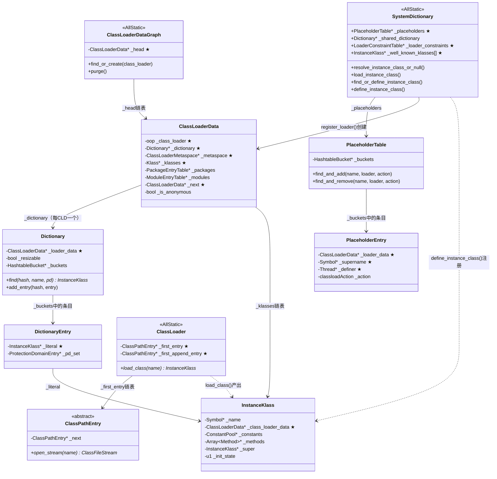

# 类加载完整流程：从类名到 InstanceKlass

> 基于 OpenJDK 11，标准环境：`-Xms8g -Xmx8g -XX:+UseG1GC`，Region=4MB
> 核心源码：`classfile/systemDictionary.cpp` (3081行), `classLoader.cpp` (2218行), `classFileParser.cpp` (6461行), `klassFactory.cpp` (232行)

---

## 第 0 部分：核心原理 ⭐

### 0.1 本质是什么？

类加载的本质是**把 `.class` 文件中的扁平二进制格式转换为 JVM 内存中可执行的 `InstanceKlass` 树状元数据结构**，并在 `(name, loader)` 二元组命名空间下完成唯一注册。整个过程由 `SystemDictionary` 协调，`ClassLoader` 负责字节流获取，`ClassFileParser` 负责解析，`InstanceKlass` 是最终产物。

### 0.2 为什么需要？

JVM 不在启动时一次性加载所有类（那样启动会极慢），而是**按需延迟加载**。当字节码中出现 `new`、`getstatic`、`invokestatic`、`anewarray` 等指令引用了尚未加载的类时，JVM 必须完成从"类名字符串"到"内存中可用的 InstanceKlass"的全过程。这个过程面临三个核心挑战：

- **并发安全**：多线程可能同时请求加载同一个类，必须保证只产生一个定义（`PlaceholderTable` + `SystemDictionary_lock` 协调）
- **循环依赖检测**：A 的父类是 B，B 的父类是 A，必须在加载过程中检测出 `ClassCircularityError`（`LOAD_SUPER` placeholder 检测）
- **类加载器隔离**：不同 ClassLoader 加载的同名类是不同的类，需要 `(name, loader)` 作为唯一标识（每个 ClassLoaderData 持有独立的 Dictionary）

### 0.3 怎么解决？

**三层架构**：
- **协调层**（`SystemDictionary`）：管理 `PlaceholderTable`（并发/循环依赖检测）、`LoaderConstraintTable`（加载器约束）、`Dictionary`（已加载类注册表）
- **获取层**（`ClassLoader`）：Bootstrap 路径搜索（jimage → patch-module → Xbootclasspath/a）或 Java 层 `loadClass()` 回调（用户 ClassLoader）
- **解析层**（`ClassFileParser`）：单次顺序扫描字节流，构造 `ConstantPool`/`Method`/`FieldInfo` 等中间结构，最终创建 `InstanceKlass`

**核心流程**：`resolve_instance_class_or_null` 的 6 阶段：无锁快速查找 → 加锁二次检查 → 并发检测（PlaceholderTable）→ 实际加载 → 注册到字典 → 清理 placeholder + notify_all。

### 0.4 为什么这样设计？

- **为什么 `SystemDictionary` 本身不存储类，而是通过每个 CLD 的 `Dictionary` 存储？** 类加载器隔离要求：不同 ClassLoader 加载的同名类是不同的类，必须按 `(name, loader)` 区分。如果用全局字典，需要把 loader 作为 key 的一部分，查找复杂度更高；每个 CLD 持有独立 Dictionary，ClassLoader 卸载时整批回收，无需遍历全局字典
- **为什么 `PlaceholderTable` 有三种 action（LOAD_INSTANCE/LOAD_SUPER/DEFINE_CLASS）？** 三种并发场景需要不同的协调语义：LOAD_INSTANCE 防止重复加载、LOAD_SUPER 检测循环依赖、DEFINE_CLASS 在 parallelCapable 加载器中序列化 define 操作
- **为什么 Bootstrap ClassLoader 不持有对象锁？** Bootstrap ClassLoader 没有对应的 Java 对象（`class_loader == null`），无法使用 Java 对象锁，通过 `SystemDictionary_lock` + `PlaceholderTable` 协调并发
- **为什么 `resolve_super_or_fail` 在 `post_process_parsed_stream` 而不是 `parse_stream` 中调用？** 超类解析会触发超类的类加载（递归），必须等当前类的格式校验（`parse_stream`）完成后才能安全触发，否则格式错误的类可能已经污染了超类的加载状态

---

## 1. 类加载解决了什么问题

JVM 不是在启动时一次性加载所有类，而是**按需延迟加载**。当字节码中出现 `new`, `getstatic`, `invokestatic`, `anewarray` 等指令引用了一个尚未加载的类时，JVM 必须完成从"类名字符串"到"内存中可用的 InstanceKlass 对象"的全过程。

这个过程面临三个核心挑战：

1. **并发安全**：多线程可能同时请求加载同一个类，必须保证只产生一个定义
2. **循环依赖检测**：A 的父类是 B，B 的父类是 A，必须在加载过程中检测出 ClassCircularityError
3. **类加载器隔离**：不同 ClassLoader 加载的同名类是不同的类，需要 `(name, loader)` 作为唯一标识

---

## 2. 整体架构

```
外部请求 (字节码/反射/JNI)
    │
    ▼
SystemDictionary::resolve_or_fail()  ← 唯一顶层入口
    │
    ├── resolve_or_null()
    │     ├── 数组类型 → resolve_array_class_or_null()
    │     └── 普通类型 → resolve_instance_class_or_null()  ← 核心
    │           │
    │           ├── ① Dictionary::find()         无锁快速查找（已加载直接返回）
    │           ├── ② 加锁 + find_class()       二次检查
    │           ├── ③ PlaceholderTable 检查      循环依赖/并发检测
    │           ├── ④ load_instance_class()      实际加载
    │           │     ├── [Bootstrap CL]  ClassLoader::load_class()
    │           │     │     ├── CDS 共享归档查找
    │           │     │     ├── --patch-module
    │           │     │     ├── jimage (modules)
    │           │     │     └── -Xbootclasspath/a
    │           │     └── [用户 CL]  JavaCalls::call_virtual(loadClass)
    │           │           └── 进入 Java 层 → 最终 defineClass → resolve_from_stream
    │           ├── ⑤ find_or_define_instance_class()  注册到字典
    │           └── ⑥ 清理 placeholder，通知等待线程
    │
    └── resolve_from_stream()  ← JNI defineClass 入口
          └── KlassFactory::create_from_stream()
                └── ClassFileParser → parse_stream → create_instance_klass
```

---

## 3. 核心数据结构

### 3.1 SystemDictionary — `AllStatic` 全局类字典管理器

```cpp
// systemDictionary.hpp — AllStatic（纯静态，无实例）
class SystemDictionary : AllStatic {
  static PlaceholderTable*       _placeholders;         // ★ 正在加载中的类占位符（并发/循环依赖检测）
  static Dictionary*             _shared_dictionary;    // CDS 共享字典（-Xshare:on 时使用）
  static LoaderConstraintTable*  _loader_constraints;   // ★ 加载器约束表（保证同名类只有一个定义）
  static ResolutionErrorTable*   _resolution_errors;    // 解析错误缓存（防止重复抛异常）
  static ProtectionDomainCacheTable* _pd_cache_table;   // 保护域缓存
  
  // Well-known klasses — 约 80+ 个核心类（Object, String, Class, ...）
  static InstanceKlass* _well_known_klasses[WKID_LIMIT]; // ★ 预加载的核心类指针数组
};
```

**sizeof(SystemDictionary)**：`AllStatic` 类，无实例，所有字段都是静态的，不占对象内存。

**创建位置**：`SystemDictionary::initialize()`（`systemDictionary.cpp:2100`）在 `init_globals()` 阶段调用，初始化所有静态字段。`_placeholders` 和 `_loader_constraints` 在此时 `new` 出来。

**关键字段生命周期**：
- `_placeholders`：`SystemDictionary::initialize()` 时创建；`resolve_instance_class_or_null` 加载期间插入条目；加载完成后 `find_and_remove` 删除条目并 `notify_all`；JVM 运行期间持续存在
- `_well_known_klasses`：`resolve_well_known_classes()` 中按顺序填充（Object→String→Class→...）；填充后通过 `WK_KLASS(id)` 宏直接访问；JVM 关闭前不释放
- `_loader_constraints`：`check_constraints()` 中检查并插入约束；违反约束时抛 `LinkageError`

**设计关键**：SystemDictionary 本身不存储已加载的类，而是通过每个 ClassLoaderData 持有的 `Dictionary` 实例来存储。SystemDictionary 是协调者，不是容器。

### 3.2 Dictionary — 每 ClassLoader 一个的类字典

```cpp
// dictionary.hpp:42
class Dictionary : public Hashtable<InstanceKlass*, mtClass> {
  ClassLoaderData* _loader_data;  // ★ 反向指针（指向持有此 Dictionary 的 CLD）
  bool _resizable;                // 是否允许扩容（Bootstrap CLD 的 Dictionary 不扩容）
  bool _needs_resizing;           // 是否需要扩容（下次 safepoint 时执行）
};

class DictionaryEntry : public HashtableEntry<InstanceKlass*, mtClass> {
  // literal() 返回 InstanceKlass*（HashtableEntry 的 _literal 字段）
  // 额外维护 protection_domain 集合（ProtectionDomainEntry 链表）
};
```

**sizeof(Dictionary)**：继承自 `Hashtable`，固定头部约 **40 字节**（`_table_size`/`_number_of_entries`/`_buckets` 指针等）+ 动态桶数组（`_table_size × 8B`，默认初始 1009 个桶）。

**创建位置**：`ClassLoaderData::ClassLoaderData()` 构造函数中 `new Dictionary(this, ...)`；Bootstrap CLD 在 `ClassLoaderData::init_null_class_loader_data()` 时创建；用户 ClassLoader 的 CLD 在首次加载类时通过 `SystemDictionary::register_loader()` 创建。

**关键字段生命周期**：
- `_loader_data`：构造时设置，不变
- `_buckets`（继承自 Hashtable）：`update_dictionary()` 时插入新 `DictionaryEntry`；`find()` 时按 hash 查找；ClassLoader 卸载时随 CLD 整体释放
- `_number_of_entries`：每次 `add_entry()` 递增；`_needs_resizing` 在超过负载因子时置 true

查找路径：`class_loader → ClassLoaderData → dictionary() → find(hash, name, pd)`

### 3.3 PlaceholderTable — 加载中占位符

```cpp
// placeholders.hpp:37
class PlaceholderTable : public Hashtable<Symbol*, mtClass> {
  // key: Symbol*（类名）
  // value: PlaceholderEntry（见下）
};

class PlaceholderEntry : public HashtableEntry<Symbol*, mtClass> {
  ClassLoaderData* _loader_data;  // ★ 发起加载的 ClassLoader
  Symbol*          _supername;    // ★ 正在加载的超类名（LOAD_SUPER 时有效）
  Thread*          _definer;      // ★ 持有 DEFINE_CLASS token 的线程
  Thread*          _instanceKlassNotifier; // LOAD_INSTANCE 的首个请求线程
  bool             _havesupername; // _supername 是否有效
  enum classloadAction {
    LOAD_INSTANCE = 1,  // ★ 正在调用 load_instance_class
    LOAD_SUPER    = 2,  // ★ 正在加载超类（用于循环依赖检测）
    DEFINE_CLASS  = 3   // ★ 正在 define（并发控制令牌）
  };
};
```

**sizeof(PlaceholderEntry)**：约 **48 字节**（HashtableEntry 头 16B + 4 个指针 32B）

**创建位置**：`SystemDictionary::initialize()` 时 `new PlaceholderTable(1009)`；条目在 `resolve_instance_class_or_null` 的阶段 3 中通过 `placeholders()->find_and_add()` 插入；加载完成后通过 `find_and_remove()` 删除。

**关键字段生命周期**：
- `_supername`：`post_process_parsed_stream` 调用 `resolve_super_or_fail` 前设置（`LOAD_SUPER` action）；超类加载完成后清除；循环依赖检测：如果当前线程在 placeholder 中发现自己已经在加载同一个类的超类链，抛 `ClassCircularityError`
- `_definer`：`find_or_define_instance_class` 中设置为当前线程；其他线程发现 `_definer != null` 时等待；define 完成后清除并 `notify_all`

Placeholder 的三个作用：
1. **LOAD_INSTANCE**：标记"某线程正在加载这个类"，其他线程 wait
2. **LOAD_SUPER**：标记"某线程正在为这个类加载超类"，用于检测 ClassCircularityError
3. **DEFINE_CLASS**：在并行类加载器中，只有持有 token 的线程能 define，其他线程等待结果

### 3.4 ClassLoaderData (CLD) — 类加载器的元数据中枢

```cpp
// classLoaderData.hpp
class ClassLoaderData : public CHeapObj<mtClass> {
  oop            _class_loader;       // ★ 对应的 Java ClassLoader 对象（Bootstrap 时为 null）
  Dictionary*    _dictionary;         // ★ 该加载器定义的所有类（按 name hash 存储）
  ClassLoaderMetaspace* _metaspace;   // ★ Metaspace 分配器（懒创建，首次分配时初始化）
  Klass*         _klasses;            // ★ 已加载类链表（单向链表，新类插入头部）
  PackageEntryTable* _packages;       // 包表（模块系统用，记录包→模块映射）
  ModuleEntryTable*  _modules;        // 模块表（模块系统用）
  ClassLoaderData* _next;             // ★ 全局链表（ClassLoaderDataGraph 遍历用）
  bool           _is_anonymous;       // 是否是匿名类加载器（lambda/invokedynamic 用）
  bool           _keep_alive;         // 是否强引用（匿名类加载器不依赖 GC 可达性）
  volatile int   _claimed;            // GC 并行标记时的 claim 标志
  Mutex*         _metaspace_lock;     // 保护 _metaspace 懒创建的锁
};
```

**sizeof(ClassLoaderData)**：约 **120 字节**（8 个指针 64B + bool/int/Mutex* 等 56B）

**创建位置**：
- Bootstrap CLD：`ClassLoaderData::init_null_class_loader_data()`（JVM 启动早期，`universe_init` 之前）
- 用户 ClassLoader 的 CLD：`SystemDictionary::register_loader()` → `ClassLoaderDataGraph::find_or_create(class_loader)` → `new ClassLoaderData(class_loader, ...)`

**关键字段生命周期**：
- `_class_loader`：构造时设置，Bootstrap 时为 null；GC 通过此字段判断 ClassLoader 是否可达（不可达 → CLD 可回收）
- `_klasses`：每次 `define_instance_class` 后通过 `add_class(k)` 插入链表头部；ClassLoader 卸载时遍历此链表卸载所有类
- `_metaspace`：懒创建，首次调用 `metaspace_non_null()` 时初始化；ClassLoader 卸载时 `~ClassLoaderMetaspace()` 归还所有 Metachunk
- `_next`：`ClassLoaderDataGraph::add()` 时插入全局链表；GC 遍历所有 CLD 时使用

CLD 是类加载器生命周期管理的核心：ClassLoader 卸载时，CLD 被回收，其 Dictionary 中的所有类被卸载，Metaspace 中的元数据被释放。

### 3.5 Klass 继承层次

```
Metadata
  └── Klass                          (klass.hpp, 所有类型的根)
        ├── InstanceKlass             (普通 Java 类)
        │     ├── InstanceMirrorKlass        (java.lang.Class)
        │     ├── InstanceRefKlass           (SoftRef/WeakRef/FinalRef/PhantomRef)
        │     └── InstanceClassLoaderKlass   (ClassLoader 的子类)
        └── ArrayKlass                (数组基类)
              ├── ObjArrayKlass              (Object[] 等)
              └── TypeArrayKlass             (int[], byte[] 等)
```

---

## 4. 核心流程源码分析

### 4.1 入口：resolve_or_fail / resolve_or_null

```cpp
// systemDictionary.cpp:190
Klass* SystemDictionary::resolve_or_fail(Symbol* class_name,
                                          Handle class_loader,
                                          Handle protection_domain,
                                          bool throw_error, TRAPS) {
  Klass* klass = resolve_or_null(class_name, class_loader, protection_domain, THREAD);
  // 失败时: throw_error=true → NoClassDefFoundError, false → ClassNotFoundException
  klass = handle_resolution_exception(class_name, throw_error, klass, THREAD);
  return klass;
}
```

`resolve_or_null` 做类名分发（`systemDictionary.cpp:246`）：
- 数组类型（`[Ljava/lang/Object;`）→ `resolve_array_class_or_null()` → 递归解析元素类型
- 描述符格式（`Ljava/lang/Object;`）→ 去掉 L 和 ;，调用 `resolve_instance_class_or_null`
- 普通类名 → 直接调用 `resolve_instance_class_or_null`

### 4.2 核心：resolve_instance_class_or_null（250 行，类加载的心脏）

`systemDictionary.cpp:631-880`，这个函数是整个类加载的核心，分 6 个阶段：

**阶段 1：无锁快速查找**（631-657）

```cpp
// 获取真正的 ClassLoader（跳过反射代理 ClassLoader）
class_loader = Handle(THREAD, java_lang_ClassLoader::non_reflection_class_loader(class_loader()));
ClassLoaderData* loader_data = register_loader(class_loader);
Dictionary* dictionary = loader_data->dictionary();
unsigned int d_hash = dictionary->compute_hash(name);

// 第一次查找：无锁！只要已加载且 protection domain 匹配就直接返回
Klass* probe = dictionary->find(d_hash, name, protection_domain);
if (probe != NULL) return probe;  // 热路径：O(1) 返回
```

**阶段 2：加锁 + 二次检查**（668-711）

```cpp
// 判断是否需要获取类加载器对象锁
bool DoObjectLock = !is_parallelCapable(class_loader);  // Bootstrap/parallelCapable 不加锁

Handle lockObject = compute_loader_lock_object(class_loader, THREAD);
ObjectLocker ol(lockObject, THREAD, DoObjectLock);

{
  MutexLocker mu(SystemDictionary_lock, THREAD);
  InstanceKlass* check = find_class(d_hash, name, dictionary);
  if (check != NULL) { k = check; class_has_been_loaded = true; }
  else {
    // 检查 placeholder：是否有其他线程正在加载这个类的超类
    placeholder = placeholders()->get_entry(p_index, p_hash, name, loader_data);
    if (placeholder && placeholder->super_load_in_progress()) {
      super_load_in_progress = true;  // 需要处理并行超类加载
    }
  }
}
```

**阶段 3：并发加载检测**（728-809）

这里处理 4 种情况（详见源码注释 case 1-4）：

```
case 1: 传统 ClassLoader（持有对象锁）— 不需要额外处理
case 2: 传统但释放了锁（死锁 workaround）— 等待首个请求者完成
case 3: Bootstrap ClassLoader — 无对象锁，通过 placeholder 协调
case 4: parallelCapable ClassLoader — 允许并行加载不同类
```

循环依赖检测（`throw_circularity_error`）：如果当前线程已在 placeholder 中注册了 LOAD_INSTANCE 且又遇到同一个类，说明出现了循环依赖。

**阶段 4：实际加载**（818-854）

```cpp
k = load_instance_class(name, class_loader, THREAD);  // 下一节详述
```

加载成功后：
- 如果 `k->class_loader() != class_loader()`（定义加载器 ≠ 发起加载器），说明是通过委派找到的
- 调用 `check_constraints()` 检查加载器约束
- 调用 `update_dictionary()` 注册到发起加载器的字典中

**阶段 5：清理 placeholder**（856-863）

```cpp
MutexLocker mu(SystemDictionary_lock, THREAD);
placeholders()->find_and_remove(p_index, p_hash, name, loader_data, 
                                 PlaceholderTable::LOAD_INSTANCE, THREAD);
SystemDictionary_lock->notify_all();  // 唤醒所有等待线程
```

**阶段 6：JFR 事件 + 断言检查**（869-879）

### 4.3 load_instance_class — 双路径加载

`systemDictionary.cpp:1403-1544`，根据 class_loader 是否为 null 分两条路径：

#### 路径 A：引导类加载器（class_loader == null）

```cpp
if (class_loader.is_null()) {
  // 1. 模块可见性检查
  //    启动初期(module未初始化): 只允许 java.base 中的类
  //    启动完成后: 非 boot 模块包中的类只搜索 append 路径
  
  // 2. CDS 共享归档查找
  k = load_shared_class(class_name, class_loader, THREAD);
  
  // 3. VM 级类加载
  if (k == NULL) {
    k = ClassLoader::load_class(class_name, search_only_bootloader_append, CHECK_NULL);
  }
  
  // 4. 注册到字典
  if (k != NULL) {
    k = find_or_define_instance_class(class_name, class_loader, k, THREAD);
  }
}
```

#### 路径 B：用户自定义类加载器（class_loader != null）

```cpp
else {
  // 回调到 Java 层: ClassLoader.loadClass(String name)
  Handle string = java_lang_String::externalize_classname(class_name_str, CHECK_NULL);
  
  JavaCalls::call_virtual(&result,
                          class_loader,
                          SystemDictionary::ClassLoader_klass(),
                          vmSymbols::loadClass_name(),          // "loadClass"
                          vmSymbols::string_class_signature(),  // "(Ljava/lang/String;)Ljava/lang/Class;"
                          string,
                          CHECK_NULL);
  
  // Java 层 ClassLoader.loadClass() 内部实现双亲委派:
  // 1. findLoadedClass(name)     → 检查已加载
  // 2. parent.loadClass(name)    → 委托父加载器
  // 3. findClass(name)           → 自己搜索并 defineClass
  //    defineClass → JNI → SystemDictionary::resolve_from_stream
}
```

### 4.4 ClassLoader::load_class — 引导类加载器的文件搜索

`classLoader.cpp:1434-1541`，三阶段搜索：

```
搜索阶段 #1: --patch-module 路径
  └── search_module_entries(_patch_mod_entries, ...)

搜索阶段 #2: jimage 或 exploded build 模块路径
  ├── _jrt_entry->open_stream(file_name)    // lib/modules (jimage)
  └── search_module_entries(_exploded_entries, ...)

搜索阶段 #3: -Xbootclasspath/a 附加路径
  └── 遍历 _first_append_entry 链表，每个 ClassPathEntry::open_stream()
```

ClassPathEntry 的三种实现：
- `ClassPathDirEntry` — 目录，读 `.class` 文件
- `ClassPathZipEntry` — JAR/ZIP 文件
- `ClassPathImageEntry` — jimage 模块映像（`lib/modules`，JDK 9+ 核心类库）

找到 stream 后：
```cpp
InstanceKlass* result = KlassFactory::create_from_stream(stream, name, loader_data, ...);
```

### 4.5 KlassFactory::create_from_stream — 字节流→Klass 工厂

`klassFactory.cpp:166-231`，简洁的工厂方法：

```cpp
InstanceKlass* KlassFactory::create_from_stream(...) {
  // 1. JVMTI class file load hook（agent 可以修改字节码）
  stream = check_class_file_load_hook(stream, name, ...);
  
  // 2. 构造 ClassFileParser（构造函数中完成全部解析！）
  ClassFileParser parser(stream, name, loader_data, ...);
  // ↑ 构造函数内部调用: parse_stream() → post_process_parsed_stream()
  
  // 3. 创建 InstanceKlass 对象
  InstanceKlass* result = parser.create_instance_klass(old_stream != stream, CHECK_NULL);
  
  // 4. JFR 事件记录、CDS dump
  return result;
}
```

### 4.6 ClassFileParser — .class 文件解析（6461 行，最大的单文件）

#### 构造函数（5876-5995）— 在构造函数中完成所有解析

```cpp
ClassFileParser::ClassFileParser(stream, name, loader_data, ...) {
  // ... 初始化 ~40 个字段 ...
  
  // 关键：解析在构造函数中完成！
  parse_stream(stream, CHECK);              // 解析字节流
  post_process_parsed_stream(stream, _cp, CHECK);  // 后处理（超类解析、vtable 计算等）
}
```

#### parse_stream（6071-6316）— 按 JVM Spec 顺序解析

```
1. magic number (0xCAFEBABE)                    — 6080
2. minor_version + major_version                — 6086-6087
3. constant_pool (parse_constant_pool)          — 6104-6123
4. access_flags                                 — 6127-6153
5. this_class_index → 验证类名                   — 6156-6190
6. super_class → parse_super_class              — 6253-6258
7. interfaces → parse_interfaces                — 6261-6266
8. fields → parse_fields                        — 6271-6278
9. methods → parse_methods                      — 6283-6289
10. attributes → parse_classfile_attributes     — 6301-6302
11. annotations → create_combined_annotations   — 6308
12. 验证 end-of-stream                          — 6311
```

#### post_process_parsed_stream（6318-6413）— 后处理

```
1. 解析超类 → SystemDictionary::resolve_super_or_fail()  // 递归加载超类！
2. 验证超类（不能是 interface、不能是 final）
3. compute_transitive_interfaces()                        // 计算传递接口
4. sort_methods()                                         // 排序方法表
5. klassVtable::compute_vtable_size_and_num_mirandas()   // 计算 vtable/itable
6. layout_fields()                                        // 计算字段布局
```

#### create_instance_klass（5567-5593）— 创建最终对象

```cpp
InstanceKlass* ClassFileParser::create_instance_klass(...) {
  InstanceKlass* ik = InstanceKlass::allocate_instance_klass(*this, CHECK_NULL);
  fill_instance_klass(ik, changed_by_loadhook, CHECK_NULL);
  return ik;
}
```

#### InstanceKlass::allocate_instance_klass（345-385）— 根据类类型选择子类

```cpp
if (REF_NONE == parser.reference_type()) {
  if (class_name == vmSymbols::java_lang_Class())
    ik = new (loader_data, size, THREAD) InstanceMirrorKlass(parser);
  else if (is_class_loader(class_name, parser))
    ik = new (loader_data, size, THREAD) InstanceClassLoaderKlass(parser);
  else
    ik = new (loader_data, size, THREAD) InstanceKlass(parser, _misc_kind_other);
} else {
  ik = new (loader_data, size, THREAD) InstanceRefKlass(parser);  // 引用类型
}
```

注意 `new (loader_data, size, THREAD)` — 在 Metaspace 中分配！与 Metaspace 文档中分析的分配链衔接。

---

## 5. 并发控制设计

### 5.1 锁层次

| 锁 | 持有者 | 保护的资源 |
|----|--------|-----------|
| ClassLoader 对象锁 | 传统(非parallel)加载器 | 防止同一 ClassLoader 重复 define |
| `SystemDictionary_lock` | 全局 | Dictionary/PlaceholderTable 更新 |
| `Compile_lock` | 全局 | 类层次变更时防止编译器读到不一致状态 |

### 5.2 四种并发场景

```
场景 1: 传统 ClassLoader（持有对象锁）
  线程 T1: 获取 CL 对象锁 → load_instance_class → define → 释放锁
  线程 T2: 获取 CL 对象锁（阻塞等待 T1）→ find_class → 已加载，返回

场景 2: 传统但释放了对象锁（死锁 workaround）
  通过 placeholder LOAD_INSTANCE 检测 → 等待首个请求者 → double_lock_wait

场景 3: Bootstrap ClassLoader
  无对象锁，通过 placeholder LOAD_INSTANCE 在 SystemDictionary_lock 下协调

场景 4: parallelCapable ClassLoader（如 AppClassLoader）
  不获取对象锁，多线程可并行 LOAD_INSTANCE
  define 时通过 DEFINE_CLASS token 序列化 → 首个 definer 成功，其他复用结果
```

### 5.3 循环依赖检测

```
T1: 加载 Base → placeholder(T1, Base, LOAD_SUPER=Super) → 加载 Super
    → 加载 Super 的超类 Base → 发现 placeholder 中 T1 已在加载 Base
    → ClassCircularityError!
```

---

## 6. Well-Known Classes 加载

`systemDictionary.cpp:1987-2069`，`resolve_well_known_classes()` 在 `universe_init()` 阶段被调用，按照 `WK_KLASSES_DO` 宏定义的顺序预加载约 80+ 个核心类。

加载顺序分组：
1. `Object` → `String` → `Class`（这三个必须最先，后续类都依赖它们）
2. `Cloneable` → `Serializable` → ... → `Reference`（基础类型）
3. `SoftReference` ~ `PhantomReference`（引用类型，设置 reference_type）
4. `MethodHandle` ~ `VolatileCallSite`（JSR 292 动态调用支持）
5. 其余 well-known 类（box types, 安全相关等）

关键时间点：
- 加载完 Object/String/Class 后调用 `java_lang_String::compute_offsets()` 和 `java_lang_Class::compute_offsets()`
- 然后 `Universe::initialize_basic_type_mirrors()` 和 `Universe::fixup_mirrors()` 为早期加载的类创建 mirror

---

## 7. resolve_from_stream — JNI/defineClass 入口

`systemDictionary.cpp:1044-1123`，由 `jni_DefineClass` / `JVM_DefineClass` 调用：

```
resolve_from_stream(class_name, class_loader, protection_domain, ClassFileStream)
  ├── register_loader()        → 获取/创建 ClassLoaderData
  ├── 加锁（parallelCapable 除外）
  ├── CDS lookup (如果启用)
  ├── KlassFactory::create_from_stream()  → ClassFileParser 解析
  ├── parallelCapable → find_or_define_instance_class()
  │   else → define_instance_class()
  └── 返回 InstanceKlass
```

与 `resolve_instance_class_or_null` 的区别：
- `resolve_instance_class_or_null`：不知道字节流在哪，需要先搜索文件系统/调用Java层
- `resolve_from_stream`：已经有了字节流，直接解析并定义

---

## 8. define_instance_class — 注册到字典

`systemDictionary.cpp:1555-1624`，类加载的最后一步：

```
define_instance_class(InstanceKlass* k)
  ├── check_constraints()         检查加载器约束
  ├── ClassLoader.addClass(mirror)  注册到 Java 层 ClassLoader
  ├── add_to_hierarchy(k)         加入类层次（更新子类链表、vtable）
  ├── update_dictionary()         写入 Dictionary
  ├── k->eager_initialize()       如果条件满足，立即初始化
  └── JVMTI post_class_load       通知 agent
```

---

## 9. 类加载全景调用链

```
用户代码: new MyClass()
  │
  ▼ (字节码 new → 常量池解析)
ConstantPool::klass_at()
  └── SystemDictionary::resolve_or_fail("MyClass", AppCL, pd, true)
        └── resolve_or_null()
              └── resolve_instance_class_or_null("MyClass", AppCL, pd)
                    │
                    ├── [快速路径] AppCL.CLD.dictionary.find() → 命中 → 返回
                    │
                    └── [慢速路径] load_instance_class("MyClass", AppCL)
                          │
                          └── JavaCalls::call_virtual(AppCL.loadClass("MyClass"))
                                │  (进入 Java 层)
                                ├── findLoadedClass("MyClass") → null
                                ├── parent.loadClass("MyClass")  ← 双亲委派
                                │     ├── PlatformCL.loadClass()
                                │     │     ├── parent.loadClass()  → BootCL
                                │     │     │     ├── findLoadedClass → null
                                │     │     │     ├── ClassLoader::load_class("MyClass")
                                │     │     │     │     ├── jimage 搜索 → 未找到
                                │     │     │     │     └── return null
                                │     │     │     └── return null (→ ClassNotFoundException)
                                │     │     └── findClass() → null
                                │     │     └── return null
                                │     └── return null
                                ├── findClass("MyClass")
                                │     └── defineClass(name, bytes, ...)
                                │           └── JVM_DefineClass (JNI)
                                │                 └── SystemDictionary::resolve_from_stream()
                                │                       └── KlassFactory::create_from_stream()
                                │                             ├── ClassFileParser(stream)
                                │                             │     ├── parse_stream()
                                │                             │     │     ├── magic (CAFEBABE)
                                │                             │     │     ├── version
                                │                             │     │     ├── constant_pool
                                │                             │     │     ├── access_flags
                                │                             │     │     ├── this/super class
                                │                             │     │     ├── interfaces
                                │                             │     │     ├── fields
                                │                             │     │     ├── methods
                                │                             │     │     └── attributes
                                │                             │     └── post_process_parsed_stream()
                                │                             │           ├── resolve_super_or_fail() ← 递归加载超类
                                │                             │           ├── compute vtable/itable
                                │                             │           └── layout_fields
                                │                             └── parser.create_instance_klass()
                                │                                   ├── InstanceKlass::allocate_instance_klass()
                                │                                   │     └── new (Metaspace) InstanceKlass(parser)
                                │                                   └── fill_instance_klass()
                                └── return MyClass.class
```

---

## 10. JVM 参数与日志

| 参数 | 用途 |
|------|------|
| `-Xlog:class+load=info` | 类加载日志 |
| `-Xlog:class+load=debug` | 包含加载来源 |
| `-Xlog:class+preorder=debug` | ClassFileParser 解析前日志 |
| `-Xlog:class+resolve=debug` | 类解析日志 |
| `-Xlog:class+unload=info` | 类卸载日志 |
| `-verbose:class` | 等同于 `class+load=info,class+unload=info` |

**日志输出示例**（`-Xlog:class+load=info`）：
```
[info][class,load] java.lang.Object source: jrt:/java.base
[info][class,load] java.lang.String source: jrt:/java.base
[info][class,load] java.lang.Class source: jrt:/java.base
[info][class,load] com.example.MyClass source: file:/app/classes/
```

---

## 11. GDB 验证要点

```gdb
# 在类加载入口设断点
break SystemDictionary::resolve_instance_class_or_null
commands
  printf "Loading: %s, loader=%p\n", name->_body, class_loader.obj()
  continue
end

# 在 ClassFileParser 构造函数设断点
break ClassFileParser::ClassFileParser
commands
  printf "Parsing: %s\n", name->_body
  continue
end

# 查看 Bootstrap ClassLoaderData 的 Dictionary
set $cld = ClassLoaderData::_the_null_class_loader_data
p $cld->_dictionary->_number_of_entries

# 查看 well-known klasses
p SystemDictionary::_well_known_klasses[0]->_name->_body  # Object
p SystemDictionary::_well_known_klasses[1]->_name->_body  # String
```

---

## 数据结构关系图



**关系说明**：
- `SystemDictionary` 是协调者（AllStatic），不存储类，通过每个 CLD 的 `Dictionary` 存储
- `ClassLoaderDataGraph` 维护所有 CLD 的全局链表，GC 通过此链表遍历所有类加载器
- `PlaceholderTable` 是临时状态表，条目在加载完成后立即删除
- `ClassLoader`（C++ 类）负责 Bootstrap 路径搜索，与 Java 层 `ClassLoader` 类不同
- `InstanceKlass` 通过 `_class_loader_data` 反向引用其定义加载器的 CLD

---

## 总结

### 数据结构层面

| 结构 | sizeof | 核心特征 |
|------|--------|----------|
| `SystemDictionary` | 0（AllStatic） | 协调者，不存储类；`_placeholders` 是并发/循环依赖检测的核心；`_well_known_klasses` 是 80+ 核心类的快速访问入口 |
| `Dictionary` | ~40B头+动态桶 | 每 CLD 一个；按 `(name, hash)` 存储 `InstanceKlass*`；ClassLoader 卸载时整批释放 |
| `PlaceholderEntry` | ~48B | 三种 action 语义不同；`_supername` 用于循环依赖检测；`_definer` 用于 parallelCapable 加载器的 define 序列化 |
| `ClassLoaderData` | ~120B | 类加载器的元数据中枢；`_klasses` 链表记录所有已加载类；`_metaspace` 懒创建；卸载时整批回收 |
| `DictionaryEntry` | ~24B | 包含 `InstanceKlass*` + `ProtectionDomainEntry` 链表；`find()` 时同时检查 protection domain |

### 算法层面

| 算法 | 核心设计决策 |
|------|-------------|
| `resolve_instance_class_or_null` 6阶段 | 无锁快速查找（热路径 O(1)）→ 加锁二次检查 → PlaceholderTable 并发检测 → 实际加载 → 注册 → 清理；分离快慢路径 |
| 四种并发场景 | 传统 CL 用对象锁；Bootstrap 用 SystemDictionary_lock + placeholder；parallelCapable 用 DEFINE_CLASS token 序列化 define |
| 循环依赖检测 | LOAD_SUPER placeholder：加载超类前插入，超类加载完成后删除；同一线程再次遇到同名类 → ClassCircularityError |
| Bootstrap 三阶段搜索 | patch-module → jimage/exploded → Xbootclasspath/a；`classpath_index` 记录来源用于可见性检查 |
| `define_instance_class` | check_constraints → add_to_hierarchy（更新子类链表+vtable）→ update_dictionary → eager_initialize → JVMTI 通知 |
| Well-Known Classes 加载顺序 | Object→String→Class 必须最先（后续类依赖它们）；加载完 Object/String/Class 后立即 `compute_offsets()` |

---

*最后更新: 2026-03-02（补充第0节核心原理、数据结构完整分析、Mermaid关系图、总结节）*

## 12. 源码文件索引

| 文件 | 行数 | 核心内容 |
|------|------|---------|
| `systemDictionary.hpp` | 737 | WK_KLASSES_DO 宏、API 声明 |
| `systemDictionary.cpp` | 3081 | resolve_or_null、load_instance_class、resolve_from_stream、define_instance_class |
| `classLoader.hpp` | 550 | ClassPathEntry 体系、ClassLoader 声明 |
| `classLoader.cpp` | 2218 | load_class 三阶段搜索、ClassPathEntry 实现 |
| `classFileParser.hpp` | 554 | ClassFileParser 字段声明 |
| `classFileParser.cpp` | 6461 | parse_stream、post_process、create_instance_klass、fill_instance_klass |
| `klassFactory.hpp/cpp` | 89/232 | create_from_stream 工厂方法 |
| `dictionary.hpp/cpp` | 270/535 | Dictionary 哈希表 |
| `placeholders.hpp/cpp` | 280/308 | PlaceholderTable 占位符 |
| `classLoaderData.hpp/cpp` | 457/1459 | ClassLoaderData 中枢 |
| `instanceKlass.hpp/cpp` | 1400/3600 | InstanceKlass 运行时类表示 |

---

## 13. 与 Metaspace 的衔接

类加载过程中的所有元数据分配都通过 Metaspace：

```
InstanceKlass::allocate_instance_klass()
  └── new (loader_data, size, THREAD) InstanceKlass(parser)
        └── Metaspace::allocate(loader_data, word_size, MetaspaceObj::ClassType)
              └── ClassLoaderMetaspace::allocate()  → _class_vsm (压缩类空间)

ConstantPool::allocate()
  └── Metaspace::allocate(loader_data, size, MetaspaceObj::NonClassType)
        └── ClassLoaderMetaspace::allocate()  → _vsm (数据元空间)

同理: Method, ConstantPool, fieldDescriptor, Bytecodes 等都在数据元空间
```

ClassLoader 卸载时的完整链路：
```
GC 发现 ClassLoader 不可达
  → ClassLoaderData::~ClassLoaderData()
    → ~ClassLoaderMetaspace() → ~SpaceManager()
      → ChunkManager::return_chunk_list()  // 归还所有 Metachunk
      → VirtualSpaceList::purge()          // 释放空 VSN
```

这就是为什么 Metaspace 中每个 ClassLoader 有独立的 SpaceManager——类卸载时可以整批回收，而不需要遍历每个对象。
