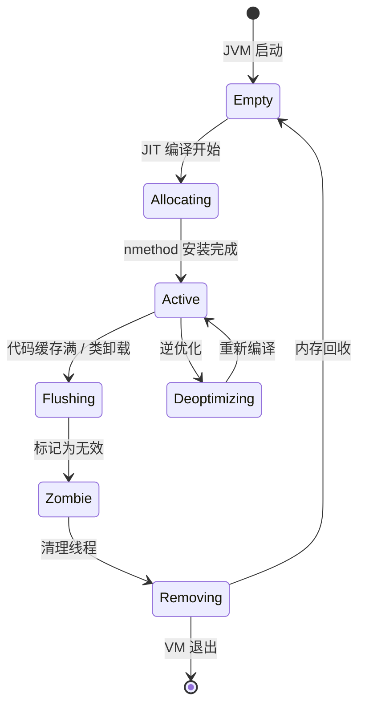
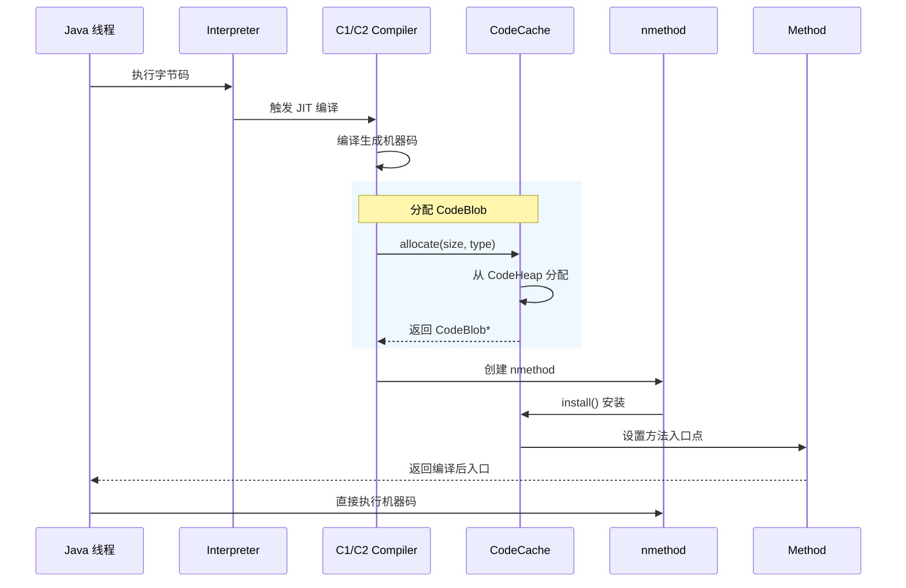
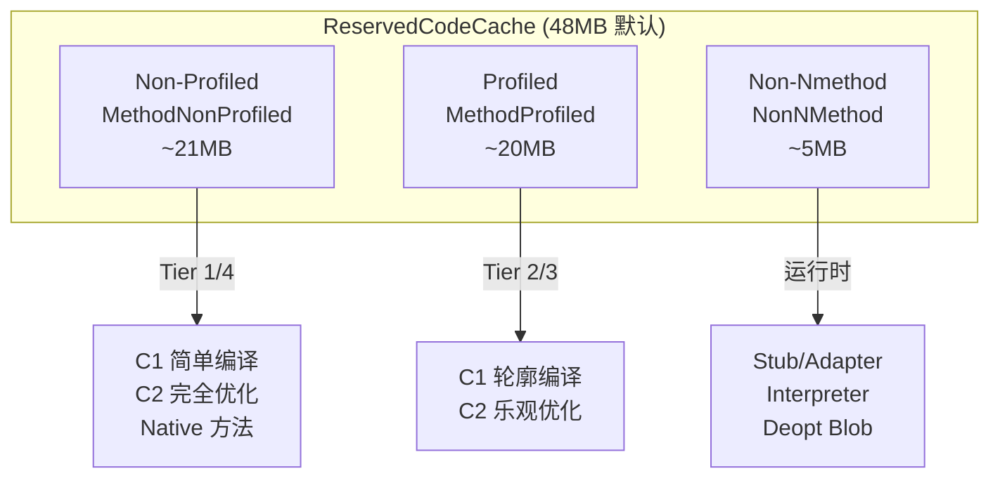
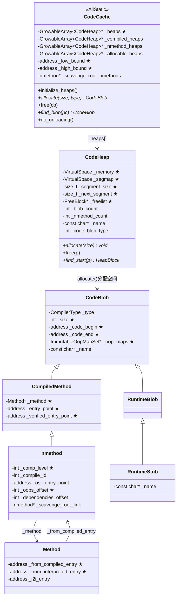

# CodeCache 深度分析

> **源码位置**: `src/hotspot/share/code/codeCache.cpp`, `codeCache.hpp`
> **重要程度**: ⭐⭐⭐⭐⭐ (JIT 编译产物存放区，JVM 性能核心)
> **调用链路**: `JIT 编译` → `CodeCache::allocate()` → `nmethod` → `CodeBlob`

---

## 第 0 部分：核心原理 ⭐

### 0.1 本质是什么？

本文是对 **CodeCache 深度分析** 的深度源码分析：从数据结构到算法流程，逐层剖析其实现原理，并通过 GDB 验证关键结论。

### 0.2 为什么需要？

深入理解 JVM 内部实现，不仅能帮助排查生产问题，更能建立对 JVM 行为的精确预测能力——知道『为什么』比知道『是什么』更重要。

### 0.3 怎么解决？

采用「数据结构 → 算法流程 → GDB 验证」三步法：先完整分析所有涉及的数据结构（字段含义/sizeof/生命周期），再分析算法流程（每步有 why），最后用 GDB 实际验证关键结论。

### 0.4 为什么这样设计？

JVM 的每个设计决策都有其历史背景和性能考量。本文在分析每个关键设计时，都会解释「为什么这样而不是那样」，帮助读者建立设计直觉。

---


## 0. 核心原理

### 0.1 本质是什么？

CodeCache 是 JVM 中存放 **JIT 编译产物** 的内存区域。它不是简单的数组，而是一个高度优化的**多堆分段式内存管理系统**，支持：
- JIT 编译的机器码（nmethod）
- 运行时 stub（RuntimeStub）
- 适配器代码（AdapterBlob）
- 解释器模板（BufferBlob）
- 逆优化代码（DeoptimizationBlob）

### 0.2 为什么需要？

**问题**：Java 代码是如何从字节码变成机器码执行的？

Java 程序启动时，字节码解释器逐条解释执行。如果每条字节码都要解释执行，性能极低。

**方案**：JIT（Just-In-Time）编译器在运行时将热点代码编译成机器码，直接 CPU 执行。

**但新问题**：
1. 编译后的机器码存哪里？→ 需要专用内存区域
2. 编译后代码如何被调用？→ 需要找到对应的机器码入口
3. 类卸载时，编译代码如何清理？→ 需要生命周期管理
4. 代码缓存满了怎么办？→ 需要淘汰机制

### 0.3 怎么解决？

**核心设计**：
1. **分段堆**：按代码类型分多个 CodeHeap（profiled / non-profiled / non-nmethod）
2. **CodeBlob 抽象**：统一管理各种编译产物
3. **nmethod**：封装编译方法 + 元数据（依赖、oopmap、pcDesc）
4. **CodeCache_lock**：并发访问保护
5. **TieredCompilation**：分层编译，平衡启动速度与运行性能

### 0.4 为什么这样设计？

**为什么分段而不是单一 CodeHeap？**
- 隔离不同类型代码，优化内存利用率
- profiled 代码（Tier 2/3）通常生命周期短，非 profiled（Tier 1/4）生命周期长
- 分段便于针对不同类型做优化策略

**为什么用 CodeBlob 而直接存机器码？**
- 统一接口，便于管理（释放、查找、遍历）
- 支持各种类型代码（nmethod、stub、adapter）
- 内嵌 oop_map、relocation 等元数据

---

## 1. 数据结构分析

### 1.1 CodeCache 继承链与类型

CodeCache 是 **AllStatic** 类（所有方法静态），不是单例模式：

```cpp
class CodeCache : AllStatic {
  // 静态字段（类级别全局）
  static GrowableArray<CodeHeap*>* _heaps;        // 所有 CodeHeap
  static GrowableArray<CodeHeap*>* _compiled_heaps;   // 编译代码堆
  static GrowableArray<CodeHeap*>* _nmethod_heaps;     // nmethod 堆
  static GrowableArray<CodeHeap*>* _allocable_heaps;   // 可分配堆
  
  static address _low_bound;      // 代码缓存起始地址
  static address _high_bound;     // 代码缓存结束地址
  static int _number_of_nmethods_with_dependencies;
  static bool _needs_cache_clean;
  static nmethod* _scavenge_root_nmethods;
};
```

### 1.2 CodeHeap 分段策略

源码：`codeCache.cpp:175-314`

| CodeHeap 类型 | CodeBlobType | 存放内容 | 编译级别 |
|--------------|-------------|---------|---------|
| NonNMethod | 2 | Stub、Adapter、BufferBlob | N/A |
| MethodProfiled | 1 | Profiled nmethod | Tier 2/3 |
| MethodNonProfiled | 0 | Non-profiled nmethod | Tier 1/4 + Native |

```
┌─────────────────────────────────────────────────────┐
│              ReservedCodeCache                      │
│  (默认 48MB，可通过 -XX:ReservedCodeCacheSize=N   │
├─────────────────────────────────────────────────────┤
│  Non-Profiled (Tier 1/4)  ← _high_bound           │
│  ─────────────────────────                         │
│  Profiled (Tier 2/3)                               │
│  ─────────────────────────                         │
│  Non-Nmethod (Stub/Adapter) ← _low_bound          │
└─────────────────────────────────────────────────────┘
```

### 1.3 CodeBlob 类型层次

源码：`codeBlob.hpp:49-69`

```
CodeBlob (基类)
  │
  ├── CompiledMethod (编译方法)
  │     │
  │     └── nmethod (JIT 编译的 Java 方法)
  │           │
  │           └── AOTCompiledMethod (AOT 编译)
  │
  └── RuntimeBlob (运行时代码)
        │
        ├── BufferBlob (非重定位代码)
        │     ├── AdapterBlob (C2I/I2C 适配器)
        │     ├── VtableBlob (vtable chunk)
        │     └── MethodHandlesAdapterBlob
        │
        ├── RuntimeStub (调用 VM 运行时方法)
        │
        └── SingletonBlob (单例)
              ├── DeoptimizationBlob
              ├── ExceptionBlob
              ├── SafepointBlob
              └── UncommonTrapBlob
```

### 1.4 CodeBlob 内存布局

源码：`codeBlob.hpp:86-246`

```cpp
class CodeBlob {
 protected:
  const CompilerType _type;           // 编译器类型 (c1/c2/jvmci)
  int        _size;                   // ★ 总大小（字节），分配时确定
  int        _header_size;            // 头部大小
  int        _frame_complete_offset;   // 帧构建完成的指令偏移
  int        _data_offset;            // 数据区域偏移
  int        _frame_size;             // 栈帧大小
  
  address    _code_begin;             // ★ 代码起始地址
  address    _code_end;               // ★ 代码结束地址
  address    _content_begin;          // 内容区起始
  address    _data_end;               // 数据区结束
  address    _relocation_begin;       // 重定位信息起始
  address    _relocation_end;         // 重定位信息结束
  
  ImmutableOopMapSet* _oop_maps;     // ★ OopMap 集合（GC 扫描用）
  bool                _caller_must_gc_arguments;
  CodeStrings         _strings;       // 调试字符串
  const char*         _name;          // 名称
};
```

**sizeof(CodeBlob)**：约 **120 字节**（GDB 验证：`p sizeof(CodeBlob)` = 120）

**创建位置**：各子类的 `new_xxx()` 工厂方法中，通过 `CodeCache::allocate(size, type)` 在对应 `CodeHeap` 中分配内存，然后 placement new 构造对象。

**关键字段生命周期**：
- `_code_begin`/`_code_end`：构造时设置，指向 CodeBlob 内存中的机器码区域；GC 扫描时通过 `_oop_maps` 找到代码中的 oop 引用
- `_oop_maps`：JIT 编译完成后由 `OopMapSet::copy_to_blob()` 填充；GC 扫描时通过 `find_map_at_offset(pc)` 定位 oop
- `_size`：分配时确定，等于 `CodeCache::allocate()` 分配的字节数；`CodeCache::free()` 时用于归还内存
- `_frame_complete_offset`：JIT 编译器设置，标记栈帧构建完成的指令偏移；GC 扫描时判断是否可以安全扫描栈帧
```
┌─────────────────────────────────────────────────────────────────┐ 偏移 0
│                     CodeBlob Header                              │
│  ┌─────────────────────────────────────────────────────────────┐│
│  │ _type (4 bytes)                                            ││
│  │ _size (4 bytes)                                            ││
│  │ _header_size (4 bytes)                                     ││
│  │ ... 其他头部字段 ...                                        ││
│  └─────────────────────────────────────────────────────────────┘│
├─────────────────────────────────────────────────────────────────┤ 偏移 _header_size
│                     Relocation Info                              │
│  ┌─────────────────────────────────────────────────────────────┐│
│  │ relocInfo[] - 重定位信息数组                               ││
│  │ (用于修复代码中的地址引用)                                  ││
│  └─────────────────────────────────────────────────────────────┘│
├─────────────────────────────────────────────────────────────────┤ 偏移 _content_offset (=对齐后的 header + relocation)
│                     Content / Code                              │
│  ┌─────────────────────────────────────────────────────────────┐│
│  │ 机器码 - actual executable code                            ││
│  │ - JIT 编译生成的 CPU 指令                                  ││
│  │ - 入口点、异常处理等                                        ││
│  └─────────────────────────────────────────────────────────────┘│
├─────────────────────────────────────────────────────────────────┤ 偏移 _data_offset
│                     Data Section                                │
│  ┌─────────────────────────────────────────────────────────────┐│
│  │ 常量池数据、栈布局描述等                                    ││
│  └─────────────────────────────────────────────────────────────┘│
└─────────────────────────────────────────────────────────────────┘ 偏移 _size
```

### 1.5 nmethod 扩展结构

nmethod 继承自 CompiledMethod，添加了大量 JIT 编译相关元数据：

```cpp
class nmethod : public CompiledMethod {
  // ★ 编译相关
  int _comp_level;                    // ★ 编译级别 (1-4)
  int _compile_id;                   // 编译任务 ID
  bool _has_flushed_code;             // 是否已刷新
  
  // ★ 方法入口点（关键！）
  address _entry_point;              // ★ 普通入口（解释器调用）
  address _verified_entry_point;     // ★ 已验证入口（编译代码调用，跳过类型检查）
  address _osr_entry_point;          // OSR 入口（栈上替换）
  
  // 偏移量（相对于 nmethod 起始地址）
  int _dependencies_offset;           // 依赖数据偏移
  int _const_offset;                 // 常量池偏移
  int _scopes_data_offset;           // 作用域数据偏移
  int _scopes_pcs_offset;            // PC 描述符偏移
  int _oops_offset;                   // ★ oop 数据偏移（GC 扫描用）
  int _metadata_offset;               // metadata 数据偏移
  
  // 方法关联
  Method* _method;                    // ★ 对应的 Java 方法
  
  // 链接
  nmethod* _scavenge_root_link;      // scavenge 根链表
};
```

**sizeof(nmethod)**：约 **400+ 字节**（固定头部，不含机器码）

**创建位置**：`nmethod::new_nmethod()` 工厂方法，在 `CompileBroker::compile_method()` 完成编译后调用。

**关键字段生命周期**：
- `_entry_point`/`_verified_entry_point`：`nmethod::new_nmethod()` 时设置，指向 nmethod 内机器码的入口；`Method::_from_compiled_entry` 指向 `_verified_entry_point`；类卸载时 `Method::_from_compiled_entry` 重置为解释器入口
- `_method`：构造时设置，指向对应的 `Method` 对象；类卸载时检查此指针判断 nmethod 是否失效
- `_comp_level`：构造时设置（1-4）；`CodeCache::allocate()` 根据此值选择 CodeHeap（1/4 → NonProfiled，2/3 → Profiled）
- `_oops_offset`：JIT 编译器设置，指向 nmethod 内嵌的 oop 数组；GC 扫描时通过此偏移找到所有 oop 引用

---

## 2. 完整调用链分析

### 2.1 CodeCache 初始化

源码：`codeCache.cpp:175-314`

```cpp
void CodeCache::initialize_heaps() {
  // ★ 1. 检查用户是否设置了各堆大小
  bool non_nmethod_set = FLAG_IS_CMDLINE(NonNMethodCodeHeapSize);
  bool profiled_set    = FLAG_IS_CMDLINE(ProfiledCodeHeapSize);
  bool non_profiled_set = FLAG_IS_CMDLINE(NonProfiledCodeHeapSize);
  
  // ★ 2. 计算编译器缓冲区需求
  size_t code_buffers_size = 0;
#ifdef COMPILER1
  // C1 临时代码缓冲区
  const int c1_count = CompilationPolicy::policy()->compiler_count(CompLevel_simple);
  code_buffers_size += c1_count * Compiler::code_buffer_size();
#endif
#ifdef COMPILER2
  // C2 初始代码缓冲区
  const int c2_count = CompilationPolicy::policy()->compiler_count(CompLevel_full_optimization);
  code_buffers_size += c2_count * C2Compiler::initial_code_buffer_size();
#endif

  // ★ 3. 如果用户未设置，计算默认大小
  if (!non_nmethod_set && !profiled_set && !non_profiled_set) {
    // 默认分配：non-nmethod = 最小值 + 缓冲区，剩余空间对半分给 profiled 和 non-profiled
    size_t remaining_size = cache_size - non_nmethod_size;
    profiled_size = remaining_size / 2;
    non_profiled_size = remaining_size - profiled_size;
  }

  // ★ 4. 对齐大页（如果启用）
  const size_t alignment = MAX2(page_size(false, 8), 
                               (size_t) os::vm_allocation_granularity());

  // ★ 5. 预留连续内存空间
  ReservedCodeSpace rs = reserve_heap_memory(cache_size);
  
  // ★ 6. 分割成多个 CodeHeap
  ReservedSpace non_method_space  = rs.first_part(non_nmethod_size);
  ReservedSpace rest             = rs.last_part(non_nmethod_size);
  ReservedSpace profiled_space   = rest.first_part(profiled_size);
  ReservedSpace non_profiled_space = rest.last_part(profiled_size);

  // ★ 7. 创建各个 CodeHeap
  add_heap(non_method_space, "CodeHeap 'non-nmethods'", CodeBlobType::NonNMethod);
  add_heap(profiled_space, "CodeHeap 'profiled nmethods'", CodeBlobType::MethodProfiled);
  add_heap(non_profiled_space, "CodeHeap 'non-profiled nmethods'", CodeBlobType::MethodNonProfiled);
}
```

**设计解释**：
- **为什么预留连续空间再分割**？确保代码缓存地址连续，便于代码定位和跳转
- **为什么 C1/C2 需要额外缓冲区**？编译时需要临时空间存放中间代码
- **为什么默认 48MB**？经验值，平衡内存使用与编译需求

### 2.2 JIT 编译产物分配

源码：`codeCache.cpp:400-500`（待确认具体行号）

```cpp
CodeBlob* CodeCache::allocate(int size, int code_blob_type, int orig_code_blob_type) {
  // ★ 1. 获取对应类型的 CodeHeap
  CodeHeap* heap = get_code_heap(code_blob_type);
  
  // ★ 2. 从 CodeHeap 分配内存
  CodeBlob* cb = heap->allocate(size);
  
  // ★ 3. 如果分配失败，尝试降级到非 profiled 堆
  if (cb == NULL && code_blob_type == CodeBlobType::MethodProfiled) {
    heap = get_code_heap(CodeBlobType::MethodNonProfiled);
    cb = heap->allocate(size);
    code_blob_type = CodeBlobType::MethodNonProfiled;
  }
  
  // ★ 4. 如果仍然失败，尝试非 nmethod 堆（最后降级）
  if (cb == NULL && code_blob_type != CodeBlobType::NonNMethod) {
    heap = get_code_heap(CodeBlobType::NonNMethod);
    cb = heap->allocate(size);
    code_blob_type = CodeBlobType::NonNMethod;
  }
  
  // ★ 5. 返回结果或 NULL（CodeCache 已满）
  return cb;
}
```

**设计解释**：
- **为什么分层降级**？优先保证编译代码在专用堆，只有满了才降级
- **降级顺序**？Profiled → NonProfiled → NonNMethod（从专用到通用）

### 2.3 nmethod 创建与安装

```
Java 方法首次执行
    │
    ▼
Interpreter::invoke_method()
    │
    ▼
C1Compiler / C2Compiler::compile_method()
    │
    ▼
编译完成 → 生成 CodeBuffer (机器码)
    │
    ▼
nmethod::new_nmethod()
    │
    ▼
CodeCache::allocate()  ← 分配 CodeBlob 空间
    │
    ▼
nmethod::install()  ← 安装到 CodeCache
    │
    ▼
编译任务完成回调
    │
    ▼
方法入口指向 nmethod
    │
    ▼
后续调用 → 直接执行机器码
```

---

## 3. 并发设计分析

### 3.1 涉及的线程

| 线程 | 角色 | 并发场景 |
|------|------|---------|
| CompilerThread | 编译执行 | JIT 编译，分配 nmethod |
| Java 线程 | 调用方 | 查询 CodeBlob，调用编译代码 |
| VMThread | GC/卸载 | 清理失效的 nmethod |
| ServiceThread | 清理 | 清理 InlineCache |

### 3.2 保护机制

| 共享数据 | 保护机制 | 说明 |
|---------|---------|------|
| CodeCache::_heaps | CodeCache_lock | 遍历/修改堆列表 |
| CodeHeap::freelist | CodeCache_lock | 分配/释放 CodeBlob |
| nmethod::entry_point | 原子写入 | 确保可见性 |
| InlineCache | 专用 ICBuffer_lock | 内联缓存更新 |

### 3.3 关键同步原语

```cpp
// 代码缓存分配（编译器线程）
MutexLocker mu(CodeCache_lock);
CodeBlob* cb = CodeCache::allocate(...);

// 查找 CodeBlob（Java 线程）
// 无锁路径：通过地址直接计算
CodeBlob* cb = CodeCache::find_blob(entry_point);

// 清理失效代码（VMThread）
MutexLocker mu(CodeCache_lock);
CodeCache::do_unloading(...);
```

---

## 4. JVM 参数

| 参数 | 默认值 | 说明 |
|------|-------|------|
| `-XX:ReservedCodeCacheSize` | 48MB | CodeCache 总大小 |
| `-XX:InitialCodeCacheSize` | 2MB | 初始大小 |
| `-XX:NonNMethodCodeHeapSize` | 5MB | NonNMethod 堆大小 |
| `-XX:ProfiledCodeHeapSize` | 20MB | Profiled 方法堆大小 |
| `-XX:NonProfiledCodeHeapSize` | 21MB | NonProfiled 方法堆大小 |
| `-XX:+SegmentedCodeCache` | Tiered 时开启 | 启用分段 CodeCache |
| `-XX:+PrintCodeCache` | false | 启动时打印 CodeCache 信息 |
| `-XX:+PrintCodeCacheOnCompilation` | false | 每次编译后打印 |

---

## 5. 代码缓存状态机



---

## 6. 调用链 Mermaid 图

### 6.1 JIT 编译到代码安装



### 6.2 代码缓存分段布局



---

## 7. GDB 调试验证

### 7.1 查看 CodeCache 状态

```gdb
# 查看 CodeCache 基地址
p CodeCache::_low_bound
p CodeCache::_high_bound

# 查看 CodeHeap 数量
p CodeCache::_heaps->length()

# 查看各 CodeHeap 信息
p (*CodeCache::_heaps)[0]  # 第一个堆
p (*CodeCache::_heaps)[0]->_name
p (*CodeCache::_heaps)[0]->_capacity
p (*CodeCache::_heaps)[0]->_allocated

# 遍历 nmethod
set $i = 0
set $heaps = CodeCache::_heaps
while $i < $heaps->length()
    set $heap = (*$heaps)[$i]
    printf "Heap: %s, used: %zu KB\n", $heap->_name->base(), $heap->_allocated / 1024
    set $i = $i + 1
end
```

### 7.2 查看 nmethod 信息

```gdb
# 假设已知某个 nmethod 地址为 $nm
p *$nm
p $nm->_method->name()->as_utf8()
p $nm->_entry_point
p $nm->_comp_level
p $nm->_code_size
```

---

## 8. 面试问答

### Q1: CodeCache 满了会怎样？

**答案**：
1. JIT 编译器无法分配新 CodeBlob
2. 触发 `CodeCache::report_codemem_full()` 警告
3. 编译器退回到解释执行
4. 如果配置了 `-XX:+UseCodeCacheFlushing`，尝试清理失效代码后重试
5. 极端情况下 JVM 可能崩溃（OOM）

### Q2: 什么是 TieredCompilation？

**答案**：
分层编译策略，结合 C1（client）和 C2（server）：
- Tier 0：解释执行
- Tier 1：C1 简单编译（快速启动）
- Tier 2：C1 轮廓编译（带 profiling）
- Tier 3：C1 完整编译（详细 profiling）
- Tier 4：C2 完全优化编译

热点代码逐步升级编译级别，平衡启动速度与运行性能。

### Q3: nmethod 和普通 CodeBlob 的区别？

**答案**：
- nmethod：编译后的 Java 方法，包含方法元数据（依赖、oop_map、pcDesc）
- CodeBlob：基类，包含所有编译产物
- RuntimeStub：非 Java 方法的运行时代码

### Q4: 代码缓存如何支持类卸载？

**答案**：
1. 类卸载时，VMThread 调用 `CodeCache::do_unloading()`
2. 遍历所有 nmethod，检查是否引用了待卸载类的 oop
3. 未引用的 nmethod 标记为 `unloading`
4. 清理内联缓存（InlineCache）中失效的类引用
5. 释放内存到 CodeHeap freelist

### Q5: CodeCache 为什么分段？

**答案**：
1. **隔离不同生命周期**：profiled 代码通常生命周期短，non-profiled 长
2. **优化内存利用**：不同类型代码有不同的内存需求
3. **便于管理**：可以针对不同堆设置不同策略
4. **减少锁竞争**：不同堆可以独立操作

---

## 9. 总结

### 核心要点

1. **CodeCache 是 JIT 编译产物的家**：存放所有编译后的机器码

2. **分段设计**：3 个 CodeHeap（NonNMethod / Profiled / NonProfiled）

3. **CodeBlob 统一抽象**：nmethod、stub、adapter 都是 CodeBlob

4. **分配流程**：CompilerThread → allocate() → CodeHeap → install()

5. **并发保护**：CodeCache_lock 保护修改操作，查询可无锁

6. **清理机制**：类卸载/代码缓存满时触发清理

### 与 VMThread 的关系

- **VMThread** 负责执行清理操作（`CodeCache::do_unloading()`）
- **CompilerThread** 负责分配新的 nmethod
- **Java 线程** 消费编译后的代码

---

## 10. CodeHeap 内部结构详细分析

### 10.1 CodeHeap 分段机制

源码：`heap.hpp:81-239`

```cpp
class CodeHeap : public CHeapObj<mtCode> {
 protected:
  VirtualSpace _memory;              // 代码内存区域（虚拟空间）
  VirtualSpace _segmap;              // 段图（标记哪些段已使用）

  size_t       _number_of_committed_segments;  // 已提交的段数
  size_t       _number_of_reserved_segments;   // 预留的段数
  size_t       _segment_size;                  // 段大小（默认 4KB）
  int          _log2_segment_size;             // 段大小的 log2

  size_t       _next_segment;                  // 下一个可用段

  // ★ 空闲链表（核心分配机制）
  FreeBlock*   _freelist;                       // 空闲块链表
  FreeBlock*   _last_insert_point;              // 上次插入点
  size_t       _freelist_segments;              // 空闲段总数
  int          _freelist_length;                // 空闲块数量

  // 统计信息
  int          _blob_count;                    // CodeBlob 数量
  int          _nmethod_count;                 // nmethod 数量
  int          _adapter_count;                  // Adapter 数量
  int          _full_count;                    // 满次数
};
```

**设计解释**：
- **段（Segment）**：CodeCache 分配的最小单位，默认 4KB
- **VirtualSpace**：管理预留和提交的内存区域
- **Segmap**：位图，标记每个段是空闲还是已用

### 10.2 段管理机制

CodeHeap 使用 **段（Segment）** 作为基本分配单位：

```
┌─────────────────────────────────────────────────────────────────┐
│                      CodeHeap 内存布局                           │
├─────────────────────────────────────────────────────────────────┤
│                                                                  │
│  Segmap (位图)          │  Memory (代码区)                      │
│  ┌──┬──┬──┬──┬──┬──┬──┬──┬──┬──┬──┬──┬──┬──┬──┬──┐    │
│  │0 │1 │0 │1 │1 │1 │0 │0 │1 │1 │1 │0 │0 │1 │1 │1 │    │
│  └──┴──┴──┴──┴──┴──┴──┴──┴──┴──┴──┴──┴──┴──┴──┴──┘    │
│   ▲   ▲           ▲   ▲   ▲           ▲   ▲   ▲             │
│   │   │           │   │   │           │   │   │             │
│   0   1           4   5   6           9   10  11            │
│   │   │           │   │   │           │   │   │             │
│   └─ 已使用       └─ 已使用  │        └─ 已使用  │            │
│                              │                       │          │
│                              ▼                       ▼          │
│   空闲段: [2-3], [7-8], [12-13]                               │
│   Freelist: FreeBlock → FreeBlock → FreeBlock                 │
│                                                                  │
│  Segment Size = 4KB (默认)                                     │
└─────────────────────────────────────────────────────────────────┘
```

**Segment 大小**：
- 默认：4KB（可通过 `-XX:CodeCacheSegmentSize` 调整）
- 最小：1KB
- 必须 2 的幂次

### 10.3 Freelist 分配算法

源码：`heap.cpp:285-324` 和 `heap.cpp:675-730`

```cpp
void* CodeHeap::allocate(size_t instance_size) {
  // ★ 1. 计算需要的段数
  size_t number_of_segments = size_to_segments(instance_size + header_size());
  
  // ★ 2. 先从空闲链表查找最佳匹配块
  HeapBlock* block = search_freelist(number_of_segments);
  
  if (block != NULL) {
    // 找到合适的空闲块
    _blob_count++;
    return block->allocated_space();  // 返回可用空间（跳过 Header）
  }
  
  // ★ 3. 空闲链表没有，从连续空间分配
  number_of_segments = MAX2((int)CodeCacheMinBlockLength, (int)number_of_segments);
  
  if (_next_segment + number_of_segments <= _number_of_committed_segments) {
    // 从连续空间的尾部分配
    mark_segmap_as_used(_next_segment, _next_segment + number_of_segments, false);
    block = block_at(_next_segment);
    block->initialize(number_of_segments);
    _next_segment += number_of_segments;
    _blob_count++;
    return block->allocated_space();
  }
  
  // 4. 分配失败，返回 NULL
  return NULL;
}
```

```cpp
HeapBlock* CodeHeap::search_freelist(size_t length) {
  FreeBlock* found_block  = NULL;
  FreeBlock* found_prev   = NULL;
  size_t     found_length = _next_segment; // 初始化为最大值

  // ★ 最佳适配算法（Best-Fit）
  // 遍历空闲链表，找到恰好满足的块或稍大的块
  while(cur != NULL) {
    size_t cur_length = cur->length();
    
    if (cur_length == length) {
      // 完美匹配！直接返回
      found_block = cur;
      found_prev = prev;
      break;
    } else if ((cur_length > length) && (cur_length < found_length)) {
      // 更优的匹配（更小但满足需求）
      found_block = cur;
      found_prev = prev;
      found_length = cur_length;
    }
    prev = cur;
    cur = cur->link();
  }
  
  // 如果找到的块比需要的大，可能需要分割
  // ... 分割逻辑 ...
}
```

**设计解释**：
- **为什么用 Best-Fit**？减少内存碎片，找到刚好满足的最小块
- **为什么优先 freelist**？避免每次都从连续空间分配，减少外部碎片

### 10.4 HeapBlock 结构

```cpp
class HeapBlock {
  // Header（头部）
  struct Header {
    size_t  _length;    // 块长度（以段为单位）
    bool    _used;      // 使用标记
  };
  
  // 紧随 Header 的是实际可用空间
  void* allocated_space() const { return (void*)(this + 1); }
};
```

**内存布局**：
```
┌─────────────────────────────────────────────────────┐
│ HeapBlock                                           │
│ ┌─────────────────────────────────────────────────┐│
│ │ Header: _length (8 bytes)   │ _used (1 byte)   ││
│ │ [padding to 8 bytes]                           ││
│ └─────────────────────────────────────────────────┘│
├─────────────────────────────────────────────────────┤
│ 实际可用空间 (allocated_space)                      │
│  - CodeBlob 对象 + 机器码                          │
└─────────────────────────────────────────────────────┘
```

---

## 数据结构关系图



**关系说明**：
- `CodeCache` 是 AllStatic 协调者，维护三个 `CodeHeap` 数组
- `CodeBlob` 是所有编译产物的基类，placement new 在 `CodeHeap` 分配的内存上
- `nmethod` 和 `Method` 是双向引用：`nmethod._method` → `Method`，`Method._from_compiled_entry` → `nmethod._verified_entry_point`
- 类卸载时：`Method._from_compiled_entry` 重置为解释器入口，`nmethod` 标记为 zombie 等待清理

---

## 总结

### 数据结构层面

| 结构 | sizeof | 核心特征 |
|------|--------|----------|
| `CodeCache` | 0（AllStatic） | 协调者；`_low_bound`/`_high_bound` 是全局范围检查的关键；`_heaps[]` 维护三个 CodeHeap |
| `CodeHeap` | 344B | `_memory`+`_segmap` 双 VirtualSpace；`_freelist` Best-Fit 分配；`_next_segment` 兜底分配 |
| `CodeBlob` | 120B | placement new 在 CodeHeap 内存上；`_code_begin`/`_code_end` 指向机器码；`_oop_maps` 供 GC 扫描 |
| `nmethod` | 400+B | 继承 CompiledMethod；`_entry_point`/`_verified_entry_point` 是方法调用入口；`_method` 反向引用 Java 方法 |

### 算法层面

| 算法 | 核心设计决策 |
|------|-------------|
| `initialize_heaps()` | 一次性预留 240MB 连续内存再分割；三个 CodeHeap 按类型隔离；non-nmethod 最小（~7MB），profiled/non-profiled 各半 |
| `CodeCache::allocate()` | 按 `_comp_level` 选择 CodeHeap；Profiled 满时降级到 NonProfiled；最后降级到 NonNMethod |
| `CodeHeap::allocate()` | 优先 Best-Fit 搜索 `_freelist`；失败则从 `_next_segment` 连续分配；按需 `expand_by(64KB)` 提交内存 |
| 段映射表查找 | `segmap[seg]` 存储距起始段的偏移；O(1) 从任意地址找到 CodeBlob；0xFF 表示空闲段 |
| 类卸载清理 | `do_unloading()` 遍历所有 nmethod；检查 `_method` 是否引用待卸载类；失效 nmethod 标记 zombie → 释放到 freelist |

---

*最后更新: 2026-03-02（补充数据结构完整分析、Mermaid关系图、总结节）*

### 11.1 使用 -XX:+PrintCodeCache 查看

启动参数：`-XX:+PrintCodeCache`

**解释执行模式（-Xint）输出**：
```
CodeCache: size=49152Kb used=1066Kb max_used=1106Kb free=48085Kb
 bounds [0x00007f0a75000000, 0x00007f0a75270000, 0x00007f0a78000000]
 total_blobs=820 nmethods=0 adapters=794
 compilation: disabled (interpreter mode)
```

**分析**：
- size=49152Kb = 48MB（默认 ReservedCodeCacheSize）
- nmethods=0（解释模式无 JIT 编译）
- adapters=794（解释器适配器、stub 等）

---

**JIT 编译模式输出**（默认参数，无 -Xint）：
```
CodeHeap 'non-profiled nmethods': size=119172Kb used=269Kb max_used=269Kb free=118902Kb
 bounds [0x00007fdbe4b9f000, 0x00007fdbe4e0f000, 0x00007fdbec000000]
CodeHeap 'profiled nmethods': size=119168Kb used=955Kb max_used=955Kb free=118213Kb
 bounds [0x00007fdbdd73f000, 0x00007fdbdd9af000, 0x00007fdbe4b9f000]
CodeHeap 'non-nmethods': size=7420Kb used=3433Kb max_used=3460Kb free=3986Kb
 bounds [0x00007fdbdd000000, 0x00007fdbdd370000, 0x00007fdbdd73f000]
 total_blobs=1411 nmethods=536 adapters=794
```

**分析**：
- **ReservedCodeCacheSize = 240MB**（JVM 根据机器配置自动选择 ergonomic）
- **SegmentedCodeCache = true**（自动开启分段）
- 3 个 CodeHeap：
  - non-profiled: ~116MB，用于 Tier 1/4 编译方法
  - profiled: ~116MB，用于 Tier 2/3 编译方法
  - non-nmethod: ~7MB，用于 stub/adapter
- nmethods=536（已编译的 Java 方法）

### 11.2 关键 JVM 参数验证

```bash
# 查看 CodeCache 相关参数
java -XX:+PrintFlagsFinal -XX:+PrintCodeCache ... 2>&1 | grep CodeCache
```

**实际输出**：
```
uintx ReservedCodeCacheSize     = 251658240  {pd product} {ergonomic}  # 240MB
uintx InitialCodeCacheSize     = 2555904    {pd product} {default}    # 2.5MB  
uintx CodeCacheSegmentSize     = 128        {pd develop} {default}    # 128 bytes
uintx CodeCacheExpansionSize   = 65536      {pd product} {default}    # 64KB
bool  SegmentedCodeCache      = true       {product} {ergonomic}      # 自动开启
bool  UseCodeCacheFlushing    = true       {product} {default}
```

### 11.3 GDB 查看方式

```gdb
# 查看 CodeCache 基地址
p CodeCache::_low_bound
p CodeCache::_high_bound

# 查看 CodeHeap 数量
p CodeCache::_heaps->length()

# 查看各 CodeHeap 信息
p (*CodeCache::_heaps)[0]
p (*CodeCache::_heaps)[0]->_name
p (*CodeCache::_heaps)[0]->_capacity
```

### 11.4 查看 nmethod 信息

```gdb
# 假设已知某个 nmethod 地址为 $nm
p *$nm
p $nm->_method->name()->as_utf8()
p $nm->_entry_point
p $nm->_comp_level
p $nm->_code_size
```

---