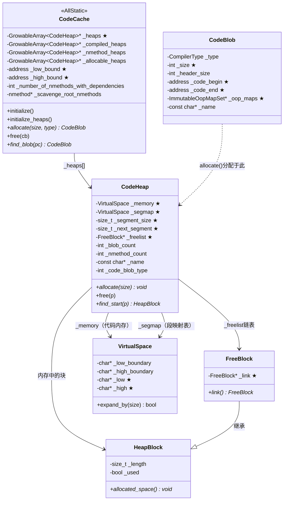

# codeCache_init() 深入分析

> 源码位置: `src/hotspot/share/code/codeCache.cpp:1128`
> 标准环境：`-Xms8g -Xmx8g -XX:+UseG1GC`
> 本文档详细分析 `codeCache_init()` 的实现，这是 `init_globals()` 中代码缓存初始化的核心方法。

---

## 第 0 部分：核心原理 ⭐

### 0.1 本质是什么？

`codeCache_init()` 的本质是**为 JVM 的 JIT 编译系统预留并分段管理一块连续的可执行内存区域**：调用 `mmap`（Linux）预留 240MB 连续虚拟内存，按代码类型分成三个 `CodeHeap`（non-nmethods/profiled/non-profiled），每个 `CodeHeap` 内部用段映射表（Segment Map）实现 O(1) 的 CodeBlob 地址查找。

### 0.2 为什么需要？

JIT 编译生成的机器码需要存放在**可执行内存**中（`mmap` 的 `PROT_EXEC` 标志），普通 `malloc` 分配的内存默认不可执行（W^X 安全策略）。此外：

- **生命周期管理**：JIT 编译的代码（nmethod）可能因类卸载、逆优化而失效，需要专门的分配/回收机制
- **地址范围检查**：JVM 需要快速判断某个 PC 地址是否在 CodeCache 中（`_low_bound`/`_high_bound` 范围检查），用于异常处理和 GC 扫描
- **类型隔离**：不同生命周期的代码（永久的 Stub vs 可替换的 C1 代码）混在一起会造成内存碎片

### 0.3 怎么解决？

**三层结构**：
- **预留层**：`reserve_heap_memory()` 一次性预留 240MB 连续虚拟内存（`mmap PROT_NONE`），按需提交（`mmap PROT_READ|WRITE|EXEC`）
- **分段层**：三个 `CodeHeap`（non-nmethods ~7MB / profiled ~116MB / non-profiled ~116MB），按代码类型隔离
- **分配层**：每个 `CodeHeap` 内部用段（128B/段）+ 段映射表 + 空闲链表（Best-Fit）管理分配

**关键初始化**：`icache_init()` 初始化 CPU 指令缓存刷新机制（x86 自动一致，ARM 需要显式刷新）。

### 0.4 为什么这样设计？

- **为什么预留连续内存再分割？** 确保 `_low_bound`/`_high_bound` 是一个连续范围，JVM 只需一次范围检查就能判断 PC 是否在 CodeCache 中；分散分配则需要遍历所有 CodeHeap
- **为什么分三个 CodeHeap？** 不同类型代码生命周期不同：non-nmethods（Stub/Adapter）永不回收；profiled nmethod（C1 Tier2/3）会被 C2 替换；non-profiled nmethod（C2 Tier4）相对稳定。分开存储减少碎片
- **为什么段大小是 128B？** 128B 是 x86 缓存行的 2 倍，对齐到缓存行边界减少伪共享；同时足够小以减少内部碎片（最小 CodeBlob 约 64B）
- **为什么用 Best-Fit 而不是 First-Fit？** CodeCache 中的 CodeBlob 大小差异很大（几十字节到几 MB），Best-Fit 减少碎片，避免大块被小请求切碎

---

## 1. 功能定位

### 1.1 一句话说明

**`codeCache_init()` 初始化 JVM 的代码缓存区，为 JIT 编译生成的机器码、运行时桩代码、解释器代码等提供存储空间，是 JIT 编译系统的基础设施。**

### 1.2 重要概念

| 概念 | 说明 |
|------|------|
| **CodeCache** | JVM 的代码缓存，存储所有生成的机器码 |
| **CodeHeap** | CodeCache 的子区域，用于存储特定类型的代码 |
| **CodeBlob** | 存储在 CodeCache 中的代码块基类 |
| **nmethod** | 编译后的 Java 方法（CodeBlob 的子类） |
| **StubRoutines** | 运行时桩代码（如 arraycopy、加密等） |

### 1.3 在整体流程中的位置

```
init_globals()
│
├── [Phase 1: 最基础设施]
│   ├── management_init()
│   ├── bytecodes_init()
│   └── classLoader_init1()
│
├── [Phase 2: 代码缓存]
│   └── ★ codeCache_init()      ← 【当前分析】JIT 代码存储区
│
├── [Phase 3: VM 版本和接口]
│   ├── VM_Version_init()
│   └── stubRoutines_init1()    ← 使用 CodeCache
│
├── [Phase 4: 堆内存]
│   ├── universe_init()
│   └── gc_barrier_stubs_init()
│
├── [Phase 5: 解释器]
│   └── interpreter_init()      ← 使用 CodeCache
│
├── [Phase 6-7: 类加载 & JIT]
│   └── compileBroker_init()    ← 编译结果存入 CodeCache
│
└── [Phase 8-9: 后初始化]
    └── stubRoutines_init2()    ← 使用 CodeCache
```

### 1.4 解决的核心问题

| 问题 | 解决方案 |
|------|----------|
| JIT 编译的代码存在哪里？ | **CodeCache** - 专用内存区域 |
| 不同类型代码如何管理？ | **分段 CodeHeap** - 按类型分开存储 |
| 代码缓存满了怎么办？ | **Sweeper** 清理废弃代码 + 动态扩展 |
| 如何快速定位代码地址？ | **地址范围** + **CodeBlob 查找** |
| 新生成代码如何生效？ | **icache_init** - 刷新 CPU 指令缓存 |

---

## 2. 源码完整分析

### 2.1 codeCache_init() 源码

```cpp
// src/hotspot/share/code/codeCache.cpp:1128
void codeCache_init() {
  CodeCache::initialize();    // ① 初始化代码缓存
  AOTLoader::initialize();    // ② AOT 加载器（默认不开启）
}
```

### 2.2 CodeCache::initialize() 源码

```cpp
// src/hotspot/share/code/codeCache.cpp:1081
void CodeCache::initialize() {
  // ① 参数验证
  assert(CodeCacheSegmentSize >= (uintx)CodeEntryAlignment, 
         "CodeCacheSegmentSize must be large enough to align entry points");
#ifdef COMPILER2
  assert(CodeCacheSegmentSize >= (uintx)OptoLoopAlignment,  
         "CodeCacheSegmentSize must be large enough to align inner loops");
#endif
  assert(CodeCacheSegmentSize >= sizeof(jdouble),    
         "CodeCacheSegmentSize must be large enough to align constants");

  // ② 对齐扩展大小到页面大小
  CodeCacheExpansionSize = align_up(CodeCacheExpansionSize, os::vm_page_size());

  // ③ 根据是否分段选择初始化方式
  if (SegmentedCodeCache) {
    // 使用多个分段的 CodeHeap
    initialize_heaps();
  } else {
    // 使用单一的 CodeHeap
    FLAG_SET_ERGO(uintx, NonNMethodCodeHeapSize, 0);
    FLAG_SET_ERGO(uintx, ProfiledCodeHeapSize, 0);
    FLAG_SET_ERGO(uintx, NonProfiledCodeHeapSize, 0);
    ReservedCodeSpace rs = reserve_heap_memory(ReservedCodeCacheSize);
    add_heap(rs, "CodeCache", CodeBlobType::All);
  }

  // ④ 初始化 CPU 指令缓存刷新机制
  icache_init();

  // ⑤ 注册代码区域（用于异常处理，Linux 为空实现）
  os::register_code_area((char*)low_bound(), (char*)high_bound());
}
```

---

## 3. 分段 CodeHeap 详解

### 3.1 为什么要分段？

**问题**：JIT 编译产生不同类型的代码，生命周期和特性各不相同：

| 代码类型 | 特性 | 问题 |
|----------|------|------|
| 运行时桩（Stubs） | 永远不会被回收 | 与 nmethod 混在一起会造成碎片 |
| Profiled nmethod | C1 编译，可能被 C2 替换 | 需要频繁回收 |
| Non-profiled nmethod | C2 编译，最终优化版 | 相对稳定 |

**解决方案**：分段存储，各类型代码独立管理

### 3.2 initialize_heaps() 源码

```cpp
// src/hotspot/share/code/codeCache.cpp:172
void CodeCache::initialize_heaps() {
  // ① 获取用户设置和默认值
  bool non_nmethod_set      = FLAG_IS_CMDLINE(NonNMethodCodeHeapSize);
  bool profiled_set         = FLAG_IS_CMDLINE(ProfiledCodeHeapSize);
  bool non_profiled_set     = FLAG_IS_CMDLINE(NonProfiledCodeHeapSize);
  size_t min_size           = os::vm_page_size();
  size_t cache_size         = ReservedCodeCacheSize;
  size_t non_nmethod_size   = NonNMethodCodeHeapSize;
  size_t profiled_size      = ProfiledCodeHeapSize;
  size_t non_profiled_size  = NonProfiledCodeHeapSize;

  // ② 计算编译器缓冲区大小
  size_t code_buffers_size = 0;
#ifdef COMPILER1
  const int c1_count = CompilationPolicy::policy()->compiler_count(CompLevel_simple);
  code_buffers_size += c1_count * Compiler::code_buffer_size();
#endif
#ifdef COMPILER2
  const int c2_count = CompilationPolicy::policy()->compiler_count(CompLevel_full_optimization);
  code_buffers_size += c2_count * C2Compiler::initial_code_buffer_size();
#endif

  // ③ 调整 non_nmethod_size 以容纳编译器缓冲区
  if (!non_nmethod_set) {
    non_nmethod_size += code_buffers_size;
  }

  // ④ 计算各 Heap 大小（如果用户未设置）
  if (!non_nmethod_set && !profiled_set && !non_profiled_set) {
    if (cache_size > non_nmethod_size) {
      size_t remaining_size = cache_size - non_nmethod_size;
      profiled_size = remaining_size / 2;
      non_profiled_size = remaining_size - profiled_size;
    }
  }

  // ⑤ 预留内存并划分
  const size_t alignment = MAX2(page_size(false, 8), (size_t)os::vm_allocation_granularity());
  non_nmethod_size = align_up(non_nmethod_size, alignment);
  profiled_size    = align_down(profiled_size, alignment);

  // ⑥ 预留一块连续内存，然后划分
  ReservedCodeSpace rs = reserve_heap_memory(cache_size);
  ReservedSpace non_method_space    = rs.first_part(non_nmethod_size);
  ReservedSpace rest                = rs.last_part(non_nmethod_size);
  ReservedSpace profiled_space      = rest.first_part(profiled_size);
  ReservedSpace non_profiled_space  = rest.last_part(profiled_size);

  // ⑦ 创建三个 CodeHeap
  add_heap(non_method_space, "CodeHeap 'non-nmethods'", CodeBlobType::NonNMethod);
  add_heap(profiled_space, "CodeHeap 'profiled nmethods'", CodeBlobType::MethodProfiled);
  add_heap(non_profiled_space, "CodeHeap 'non-profiled nmethods'", CodeBlobType::MethodNonProfiled);
}
```

### 3.3 CodeHeap 内存布局

```
┌─────────────────────────────────────────────────────────────────────────────┐
│                           CodeCache 内存布局                                 │
├─────────────────────────────────────────────────────────────────────────────┤
│                                                                             │
│  _low_bound                                                    _high_bound  │
│      │                                                              │       │
│      ▼                                                              ▼       │
│  ┌──────────────────────────────────────────────────────────────────────┐  │
│  │            ReservedCodeCacheSize (默认 240MB)                         │  │
│  │  ┌─────────────────┬──────────────────┬────────────────────────────┐ │  │
│  │  │   non-nmethods  │    profiled      │      non-profiled          │ │  │
│  │  │   (运行时桩)    │  (C1 + profile)  │  (C2 / native / 最终版)    │ │  │
│  │  │                 │                  │                            │ │  │
│  │  │  Interpreter    │  Level 2,3       │  Level 1,4                 │ │  │
│  │  │  StubRoutines   │  方法 + 类型反馈 │  无类型反馈                 │ │  │
│  │  │  Adapters       │                  │  Native 方法               │ │  │
│  │  │  Runtime Stubs  │                  │                            │ │  │
│  │  │                 │                  │                            │ │  │
│  │  │  (永不回收)     │  (可能被替换)    │  (相对稳定)                │ │  │
│  │  └─────────────────┴──────────────────┴────────────────────────────┘ │  │
│  └──────────────────────────────────────────────────────────────────────┘  │
│                                                                             │
│  默认大小分配（假设 ReservedCodeCacheSize = 240MB）：                        │
│  ┌─────────────────────────────────────────────────────────────────────┐   │
│  │  NonNMethodCodeHeapSize ≈ 5MB + 编译器缓冲区                         │   │
│  │  ProfiledCodeHeapSize   ≈ (240MB - NonNMethod) / 2                  │   │
│  │  NonProfiledCodeHeapSize ≈ (240MB - NonNMethod) / 2                 │   │
│  └─────────────────────────────────────────────────────────────────────┘   │
│                                                                             │
└─────────────────────────────────────────────────────────────────────────────┘
```

---

## 4. CodeBlobType 详解

### 4.1 类型定义

```cpp
// src/hotspot/share/code/codeBlob.hpp:36
struct CodeBlobType {
  enum {
    MethodNonProfiled   = 0,    // Level 1,4 (non-profiled) + native
    MethodProfiled      = 1,    // Level 2,3 (profiled)
    NonNMethod          = 2,    // Stubs, Adapters, Runtime
    All                 = 3,    // 不分段时使用
    AOT                 = 4,    // AOT 编译的方法
    NumTypes            = 5
  };
};
```

### 4.2 类型与编译级别对应

```
┌─────────────────────────────────────────────────────────────────────────────┐
│                    编译级别与 CodeBlobType 对应关系                           │
├─────────────────────────────────────────────────────────────────────────────┤
│                                                                             │
│  ┌─────────────────────────────────────────────────────────────────────┐   │
│  │  Level 0: 解释执行                                                   │   │
│  │  ─────────────────                                                   │   │
│  │  • 不产生 nmethod                                                    │   │
│  │  • 解释器代码存在 NonNMethod heap                                    │   │
│  └─────────────────────────────────────────────────────────────────────┘   │
│                                                                             │
│  ┌─────────────────────────────────────────────────────────────────────┐   │
│  │  Level 1: C1 编译，无 profiling → NonProfiled heap                   │   │
│  │  ─────────────────────────────────────────────────                   │   │
│  │  • 快速编译，不收集类型信息                                          │   │
│  │  • 用于不会进一步优化的方法（如 -XX:TieredStopAtLevel=1）            │   │
│  └─────────────────────────────────────────────────────────────────────┘   │
│                                                                             │
│  ┌─────────────────────────────────────────────────────────────────────┐   │
│  │  Level 2: C1 + limited profiling → Profiled heap                    │   │
│  │  ─────────────────────────────────────────────────                   │   │
│  │  • 收集基本的方法调用和分支信息                                      │   │
│  │  • 过渡状态，等待更多 profiling 或 C2 编译                           │   │
│  └─────────────────────────────────────────────────────────────────────┘   │
│                                                                             │
│  ┌─────────────────────────────────────────────────────────────────────┐   │
│  │  Level 3: C1 + full profiling → Profiled heap                       │   │
│  │  ─────────────────────────────────────────────────                   │   │
│  │  • 收集完整类型反馈：调用次数、分支概率、类型信息                    │   │
│  │  • 为 C2 优化提供数据                                                │   │
│  │  • 执行中被 C2 编译后会被替换                                        │   │
│  └─────────────────────────────────────────────────────────────────────┘   │
│                                                                             │
│  ┌─────────────────────────────────────────────────────────────────────┐   │
│  │  Level 4: C2 编译 → NonProfiled heap                                │   │
│  │  ─────────────────────────────────────────                           │   │
│  │  • 深度优化：内联、逃逸分析、向量化、循环优化                        │   │
│  │  • 最终优化版本，相对稳定                                            │   │
│  │  • 不包含 profiling 代码，更高效                                     │   │
│  └─────────────────────────────────────────────────────────────────────┘   │
│                                                                             │
└─────────────────────────────────────────────────────────────────────────────┘
```

---

## 5. CodeBlob 继承体系

### 5.1 类继承图

```
┌─────────────────────────────────────────────────────────────────────────────┐
│                           CodeBlob 继承体系                                  │
├─────────────────────────────────────────────────────────────────────────────┤
│                                                                             │
│  CodeBlob (抽象基类)                                                        │
│      │                                                                      │
│      ├── CompiledMethod (编译后的方法)                                      │
│      │       ├── nmethod           ← JIT 编译的 Java 方法                   │
│      │       └── AOTCompiledMethod ← AOT 编译的方法                         │
│      │                                                                      │
│      └── RuntimeBlob (运行时代码)                                           │
│              │                                                              │
│              ├── BufferBlob                                                 │
│              │       ├── AdapterBlob        ← C2I/I2C 适配器                │
│              │       ├── VtableBlob         ← 虚表桩                        │
│              │       └── MethodHandlesAdapterBlob ← 方法句柄适配器          │
│              │                                                              │
│              ├── RuntimeStub               ← 运行时桩                        │
│              │                                                              │
│              └── SingletonBlob (单例)                                       │
│                      ├── DeoptimizationBlob ← 反优化                        │
│                      ├── UncommonTrapBlob   ← 非常见陷阱                    │
│                      ├── ExceptionBlob      ← 异常处理                      │
│                      └── SafepointBlob      ← 安全点                        │
│                                                                             │
└─────────────────────────────────────────────────────────────────────────────┘
```

### 5.2 CodeBlob 内存布局

```cpp
// src/hotspot/share/code/codeBlob.hpp:86
class CodeBlob {
protected:
  const CompilerType _type;        // 编译器类型 (C1/C2/JVMCI)
  int        _size;                // 总大小
  int        _header_size;         // 头部大小
  int        _frame_complete_offset; // 帧完成偏移
  int        _data_offset;         // 数据区偏移
  int        _frame_size;          // 栈帧大小

  address    _code_begin;          // 代码起始
  address    _code_end;            // 代码结束
  address    _content_begin;       // 内容起始
  address    _data_end;            // 数据结束
  address    _relocation_begin;    // 重定位起始
  address    _relocation_end;      // 重定位结束

  ImmutableOopMapSet* _oop_maps;   // OopMap
  bool       _caller_must_gc_arguments;
  const char* _name;               // 名称
};
```

**sizeof(CodeBlob)**：约 **120 字节**（GDB 验证：`p sizeof(CodeBlob)` = 120）

**创建位置**：`CodeBlob::new_CodeBlob()` 或各子类的 `new_xxx()` 工厂方法中，通过 `CodeCache::allocate(size, type)` 在对应 `CodeHeap` 中分配内存，然后 placement new 构造对象。

**关键字段生命周期**：
- `_code_begin`/`_code_end`：构造时设置，指向 CodeBlob 内存中的机器码区域；GC 扫描时通过 `_oop_maps` 找到代码中的 oop 引用
- `_oop_maps`：JIT 编译完成后由 `OopMapSet::copy_to_blob()` 填充；GC 扫描时通过 `_oop_maps->find_map_at_offset(pc)` 定位 oop
- `_size`：分配时确定，等于 `CodeHeap::allocate()` 分配的字节数；`CodeCache::free()` 时用于归还内存
- `_name`：字符串常量，用于日志和调试；不随 CodeBlob 生命周期变化

### 5.2 CodeBlob 内存区域布局

```
┌─────────────────────────────────────────────────────────────────────────────┐
│                         CodeBlob 内存布局                                    │
├─────────────────────────────────────────────────────────────────────────────┤
│                                                                             │
│  ┌─────────────────────────────────────────────────────────────────────┐   │
│  │  CodeBlob                                                            │   │
│  ├─────────────────────────────────────────────────────────────────────┤   │
│  │  header_begin()                                                      │   │
│  │  ┌─────────────────────────────────────────────────────────────┐   │   │
│  │  │  Header (C++ 对象)                                           │   │   │
│  │  │  ├── _type, _size, _header_size                              │   │   │
│  │  │  ├── _code_begin, _code_end                                  │   │   │
│  │  │  └── _oop_maps, _name, ...                                   │   │   │
│  │  └─────────────────────────────────────────────────────────────┘   │   │
│  │  relocation_begin()                                                 │   │
│  │  ┌─────────────────────────────────────────────────────────────┐   │   │
│  │  │  Relocation Info (重定位信息)                                 │   │   │
│  │  │  用于 GC 时更新代码中的 oop 引用                              │   │   │
│  │  └─────────────────────────────────────────────────────────────┘   │   │
│  │  content_begin()                                                    │   │
│  │  ┌─────────────────────────────────────────────────────────────┐   │   │
│  │  │  Content (内容区)                                             │   │   │
│  │  │  ├── Constants (常量)                                        │   │   │
│  │  │  code_begin()                                                 │   │   │
│  │  │  ├── Instructions (机器指令)                                 │   │   │
│  │  │  └── Stubs (方法内桩代码)                                    │   │   │
│  │  │  code_end()                                                   │   │   │
│  │  └─────────────────────────────────────────────────────────────┘   │   │
│  │  data_offset()                                                      │   │
│  │  ┌─────────────────────────────────────────────────────────────┐   │   │
│  │  │  Data (数据区)                                                │   │   │
│  │  │  ├── OopMap (GC 时定位对象指针)                               │   │   │
│  │  │  └── 其他元数据                                               │   │   │
│  │  │  data_end()                                                   │   │   │
│  │  └─────────────────────────────────────────────────────────────┘   │   │
│  └─────────────────────────────────────────────────────────────────────┘   │
│                                                                             │
└─────────────────────────────────────────────────────────────────────────────┘
```

---

## 6. CodeHeap 详解

**sizeof(CodeHeap)**：GDB 验证 = **344 字节**（`_memory`/`_segmap` 各 ~80B + 其他字段）

**创建位置**：`CodeCache::add_heap()` 中 `new CodeHeap(name, type)` 创建，然后调用 `heap->reserve(rs, ...)` 绑定预留内存。

**关键字段生命周期**：
- `_memory`（VirtualSpace）：`reserve()` 时绑定预留内存；`expand_by()` 时按 `CodeCacheExpansionSize`（64KB）增量提交；JVM 退出时释放
- `_segmap`（VirtualSpace）：与 `_memory` 同步提交；每个段对应 1 字节，值为 0=起始段、N=距起始段偏移、0xFF=空闲
- `_freelist`：`free()` 时将释放的 `HeapBlock` 插入链表；`allocate()` 时 Best-Fit 搜索；`compact()` 时合并相邻空闲块
- `_next_segment`：初始为 0；每次从连续空间分配后递增；`_freelist` 优先，`_next_segment` 兜底
- `_blob_count`/`_nmethod_count`：`allocate()` 时递增，`free()` 时递减；`PrintCodeCache` 输出时使用

### 6.1 类定义

```cpp
// src/hotspot/share/memory/heap.hpp:81
class CodeHeap : public CHeapObj<mtCode> {
protected:
  VirtualSpace _memory;                  // 存储代码块的内存
  VirtualSpace _segmap;                  // 段映射表

  size_t       _number_of_committed_segments;  // 已提交段数
  size_t       _number_of_reserved_segments;   // 已预留段数
  size_t       _segment_size;            // 段大小
  int          _log2_segment_size;       // 段大小的 log2

  size_t       _next_segment;            // 下一个可分配段

  FreeBlock*   _freelist;                // 空闲块链表
  FreeBlock*   _last_insert_point;       // 上次插入点
  size_t       _freelist_segments;       // 空闲段数
  int          _freelist_length;         // 空闲链表长度
  size_t       _max_allocated_capacity;  // 峰值容量

  const char*  _name;                    // 堆名称
  const int    _code_blob_type;          // CodeBlob 类型
  int          _blob_count;              // CodeBlob 数量
  int          _nmethod_count;           // nmethod 数量
  int          _adapter_count;           // 适配器数量
  int          _full_count;              // 堆满次数
};
```

### 6.2 段映射表（Segment Map）

```
┌─────────────────────────────────────────────────────────────────────────────┐
│                           段映射表机制                                       │
├─────────────────────────────────────────────────────────────────────────────┤
│                                                                             │
│  问题：如何从任意地址找到其所属的 CodeBlob？                                 │
│                                                                             │
│  解决方案：段映射表（Segment Map）                                           │
│                                                                             │
│  CodeHeap 内存：                                                            │
│  ┌────────┬────────┬────────┬────────┬────────┬────────┬────────┬────────┐ │
│  │ Seg 0  │ Seg 1  │ Seg 2  │ Seg 3  │ Seg 4  │ Seg 5  │ Seg 6  │ Seg 7  │ │
│  │(CodeA) │(CodeA) │(CodeA) │ (Free) │(CodeB) │(CodeB) │ (Free) │ (Free) │ │
│  └────────┴────────┴────────┴────────┴────────┴────────┴────────┴────────┘ │
│                                                                             │
│  段映射表 (segmap):                                                         │
│  ┌────────┬────────┬────────┬────────┬────────┬────────┬────────┬────────┐ │
│  │   0    │   1    │   2    │  0xFF  │   0    │   1    │  0xFF  │  0xFF  │ │
│  └────────┴────────┴────────┴────────┴────────┴────────┴────────┴────────┘ │
│     ↑        ↑        ↑        ↑        ↑        ↑        ↑        ↑       │
│   起始段  距起始1段 距起始2段  空闲    起始段  距起始1段  空闲     空闲     │
│                                                                             │
│  查找算法：                                                                 │
│  1. 计算地址所在段号: seg = (addr - base) >> log2_segment_size              │
│  2. 查段映射表: offset = segmap[seg]                                        │
│  3. 如果 offset == 0xFF，返回 NULL（空闲段）                                │
│  4. 否则，块起始段 = seg - offset                                           │
│  5. 返回 block_at(块起始段)                                                 │
│                                                                             │
└─────────────────────────────────────────────────────────────────────────────┘
```

---

## 7. icache_init() - CPU 指令缓存刷新

### 7.1 为什么需要？

现代 CPU 有独立的 **指令缓存（I-Cache）** 和 **数据缓存（D-Cache）**：

```
┌─────────────────────────────────────────────────────────────────────────────┐
│                        CPU 缓存一致性问题                                    │
├─────────────────────────────────────────────────────────────────────────────┤
│                                                                             │
│  JIT 编译生成新代码：                                                       │
│                                                                             │
│  ┌──────────────┐     写入      ┌──────────────┐                           │
│  │ JIT 编译器   │ ────────────→ │   D-Cache    │ ← 数据缓存                 │
│  │ (生成机器码) │               │   (脏数据)   │                            │
│  └──────────────┘               └──────────────┘                            │
│                                        │                                    │
│                                        │ 写回主存                           │
│                                        ▼                                    │
│                                 ┌──────────────┐                            │
│                                 │    主内存    │                            │
│                                 │  (CodeCache) │                            │
│                                 └──────────────┘                            │
│                                        │                                    │
│                                        │ ❌ I-Cache 可能还是旧数据！         │
│                                        ▼                                    │
│  ┌──────────────┐     取指      ┌──────────────┐                           │
│  │     CPU      │ ←───────────  │   I-Cache    │ ← 指令缓存                 │
│  │  (执行代码)  │               │  (可能过期)  │                            │
│  └──────────────┘               └──────────────┘                            │
│                                                                             │
│  解决方案：icache_init() 初始化指令缓存刷新机制                              │
│           ICache::invalidate_range(start, size) 刷新指定范围                │
│                                                                             │
└─────────────────────────────────────────────────────────────────────────────┘
```

### 7.2 实现原理

```cpp
// src/hotspot/cpu/x86/icache_x86.cpp
void ICacheStubGenerator::generate_icache_flush(ICache::flush_icache_stub_t* flush_icache_stub) {
  // x86 架构自动保证 I-Cache 和 D-Cache 一致性
  // 但仍需要使用 MFENCE 或 CPUID 指令确保写入完成
  
  // 生成的桩代码大致为：
  // mfence        ; 内存屏障，确保所有写入完成
  // ret           ; 返回
}
```

---

## 8. CodeCache 静态成员

### 8.1 核心静态变量

```cpp
// src/hotspot/share/code/codeCache.cpp:141
address CodeCache::_low_bound = 0;                        // CodeCache 下界
address CodeCache::_high_bound = 0;                       // CodeCache 上界
int CodeCache::_number_of_nmethods_with_dependencies = 0; // 有依赖的 nmethod 数
bool CodeCache::_needs_cache_clean = false;               // 是否需要清理
nmethod* CodeCache::_scavenge_root_nmethods = NULL;       // 需要 scavenge 的 nmethod 链表

// CodeHeap 数组
GrowableArray<CodeHeap*>* CodeCache::_heaps = new GrowableArray<CodeHeap*>(CodeBlobType::All, true);
GrowableArray<CodeHeap*>* CodeCache::_compiled_heaps = new GrowableArray<CodeHeap*>(CodeBlobType::All, true);
GrowableArray<CodeHeap*>* CodeCache::_nmethod_heaps = new GrowableArray<CodeHeap*>(CodeBlobType::All, true);
GrowableArray<CodeHeap*>* CodeCache::_allocable_heaps = new GrowableArray<CodeHeap*>(CodeBlobType::All, true);
```

### 8.2 Heap 数组的区别

| 数组 | 内容 | 用途 |
|------|------|------|
| `_heaps` | 所有 CodeHeap | 通用遍历 |
| `_compiled_heaps` | 包含编译代码的 Heap | 遍历编译方法 |
| `_nmethod_heaps` | 包含 nmethod 的 Heap | 遍历 Java 方法 |
| `_allocable_heaps` | 可分配的 Heap | 分配新代码 |

---

## 9. 相关 JVM 参数

| 参数 | 默认值 | 说明 |
|------|--------|------|
| `-XX:ReservedCodeCacheSize=N` | 240MB | 代码缓存总大小 |
| `-XX:InitialCodeCacheSize=N` | 2.5MB | 初始代码缓存大小 |
| `-XX:CodeCacheExpansionSize=N` | 64KB | 每次扩展大小 |
| `-XX:+SegmentedCodeCache` | true | 是否分段 |
| `-XX:NonNMethodCodeHeapSize=N` | 5MB+ | non-nmethod 堆大小 |
| `-XX:ProfiledCodeHeapSize=N` | auto | profiled 堆大小 |
| `-XX:NonProfiledCodeHeapSize=N` | auto | non-profiled 堆大小 |
| `-XX:CodeCacheMinimumFreeSpace=N` | 500KB | 最小空闲空间 |
| `-XX:CodeCacheSegmentSize=N` | 64 | 段大小 |
| `-XX:+PrintCodeCache` | false | 打印代码缓存信息 |
| `-XX:+PrintCodeCacheOnCompilation` | false | 编译时打印 |

---

## 10. 执行流程图

```
┌─────────────────────────────────────────────────────────────────────────────┐
│                        codeCache_init() 执行流程                             │
├─────────────────────────────────────────────────────────────────────────────┤
│                                                                             │
│  codeCache_init()                                                           │
│      │                                                                      │
│      ├── CodeCache::initialize()                                            │
│      │       │                                                              │
│      │       ├── 1. 参数验证                                                │
│      │       │       ├── CodeCacheSegmentSize >= CodeEntryAlignment         │
│      │       │       ├── CodeCacheSegmentSize >= OptoLoopAlignment          │
│      │       │       └── CodeCacheSegmentSize >= sizeof(jdouble)            │
│      │       │                                                              │
│      │       ├── 2. CodeCacheExpansionSize 对齐到页面大小                    │
│      │       │                                                              │
│      │       ├── 3. if (SegmentedCodeCache)                                 │
│      │       │       │                                                      │
│      │       │       └── initialize_heaps()                                 │
│      │       │               │                                              │
│      │       │               ├── 计算各 Heap 大小                           │
│      │       │               │   ├── non_nmethod_size (基础 + 编译器缓冲)  │
│      │       │               │   ├── profiled_size (remaining / 2)         │
│      │       │               │   └── non_profiled_size (remaining / 2)     │
│      │       │               │                                              │
│      │       │               ├── 预留连续内存                               │
│      │       │               │   └── reserve_heap_memory(cache_size)        │
│      │       │               │       ├── 设置 _low_bound                    │
│      │       │               │       └── 设置 _high_bound                   │
│      │       │               │                                              │
│      │       │               └── 创建三个 CodeHeap                          │
│      │       │                   ├── add_heap(non-nmethods)                 │
│      │       │                   ├── add_heap(profiled nmethods)            │
│      │       │                   └── add_heap(non-profiled nmethods)        │
│      │       │                                                              │
│      │       ├── 4. icache_init()                                           │
│      │       │       └── 初始化 CPU 指令缓存刷新机制                         │
│      │       │                                                              │
│      │       └── 5. os::register_code_area(low_bound, high_bound)           │
│      │               └── 注册代码区域（Linux 为空实现）                      │
│      │                                                                      │
│      └── AOTLoader::initialize()                                            │
│              └── 加载 AOT 库（默认不开启）                                   │
│                                                                             │
│  return                                                                     │
│                                                                             │
└─────────────────────────────────────────────────────────────────────────────┘
```

---

## 11. 总结

### 11.1 核心功能

`codeCache_init()` 初始化 JVM 的代码缓存系统：

1. **预留内存** - 为所有生成代码预留连续内存空间
2. **分段管理** - 按代码类型分成三个 CodeHeap
3. **初始化 ICache** - 确保新代码能被 CPU 正确执行
4. **注册代码区域** - 用于异常处理（Windows 平台）

### 11.2 关键设计决策

| 决策 | 原因 |
|------|------|
| **分段存储** | 减少碎片，不同生命周期分开管理 |
| **连续内存** | 简化地址范围检查，便于 GC |
| **段映射表** | O(1) 时间复杂度定位 CodeBlob |
| **空闲链表** | 高效管理空闲空间 |

### 11.3 与其他组件的关系

```
┌─────────────────────────────────────────────────────────────────────────────┐
│                         CodeCache 依赖关系                                   │
├─────────────────────────────────────────────────────────────────────────────┤
│                                                                             │
│  前置依赖：无（是 init_globals 中最早初始化的组件之一）                       │
│                                                                             │
│  后续使用：                                                                  │
│  ├── stubRoutines_init1/2()  → 桩代码存入 NonNMethod heap                   │
│  ├── interpreter_init()      → 解释器代码存入 NonNMethod heap               │
│  ├── compileBroker           → JIT 编译结果存入 Profiled/NonProfiled heap   │
│  ├── Sweeper                 → 清理废弃的 nmethod                           │
│  └── GC                      → 扫描代码中的 oop 引用                         │
│                                                                             │
└─────────────────────────────────────────────────────────────────────────────┘
```

---

## 12. GDB 验证 ✅

> **GDB 脚本位置**: `jvm-md/CodeCache/gdb_codeCache_init.txt`
> 
> **验证条件**: `-Xms8g -Xmx8g -XX:+UseG1GC`

### 12.1 验证结果

```
╔═════════════════════════════════════════════════════════════╗
║     codeCache_init() GDB 验证                              ║
╚═════════════════════════════════════════════════════════════╝

========== 1. CodeCache 边界 ==========
_low_bound:  0x7fffe1000000
_high_bound: 0x7ffff0000000
总大小: 251658240 bytes (240 MB)          ← ✅ ReservedCodeCacheSize

========== 2. CodeHeap 列表 ==========
_heaps->length(): 3                       ← ✅ 三个分段

--- CodeHeap 0: CodeHeap 'non-profiled nmethods' ---
name: CodeHeap 'non-profiled nmethods'
code_blob_type: 0 (MethodNonProfiled)
low: 0x7fffe8b9f000
high: 0x7fffe8e0f000
low_boundary: 0x7fffe8b9f000
high_boundary: 0x7ffff0000000
committed: 2555904 bytes (2.5 MB)         ← InitialCodeCacheSize
reserved: 122032128 bytes (116 MB)
segment_size: 128 bytes
blob_count: 0
nmethod_count: 0

--- CodeHeap 1: CodeHeap 'profiled nmethods' ---
name: CodeHeap 'profiled nmethods'
code_blob_type: 1 (MethodProfiled)
low: 0x7fffe173f000
high: 0x7fffe19af000
low_boundary: 0x7fffe173f000
high_boundary: 0x7fffe8b9f000
committed: 2555904 bytes (2.5 MB)
reserved: 122028032 bytes (116 MB)
segment_size: 128 bytes
blob_count: 0
nmethod_count: 0

--- CodeHeap 2: CodeHeap 'non-nmethods' ---
name: CodeHeap 'non-nmethods'
code_blob_type: 2 (NonNMethod)
low: 0x7fffe1000000
high: 0x7fffe1270000
low_boundary: 0x7fffe1000000
high_boundary: 0x7fffe173f000
committed: 2555904 bytes (2.5 MB)
reserved: 7598080 bytes (~7 MB)
segment_size: 128 bytes
blob_count: 2                             ← 已有 2 个 CodeBlob
nmethod_count: 0
adapter_count: 0

========== 3. SegmentedCodeCache ==========
SegmentedCodeCache: 1                     ← ✅ 分段模式

========== 4. JVM 参数 ==========
ReservedCodeCacheSize: 251658240 (240 MB)
InitialCodeCacheSize: 2555904 (2.5 MB)
CodeCacheExpansionSize: 65536 (64 KB)
NonNMethodCodeHeapSize: 7594288 (~7 MB)
ProfiledCodeHeapSize: 122031976 (~116 MB)
NonProfiledCodeHeapSize: 122031976 (~116 MB)
CodeCacheSegmentSize: 128 bytes

========== 5. CodeHeap 数组统计 ==========
_heaps->length(): 3                       ← 所有堆
_compiled_heaps->length(): 2              ← 编译代码堆 (profiled + non-profiled)
_nmethod_heaps->length(): 2               ← nmethod 堆 (profiled + non-profiled)
_allocable_heaps->length(): 3             ← 可分配堆 (全部)

========== 6. 数据结构大小 ==========
sizeof(CodeHeap): 344 bytes
sizeof(CodeBlob): 120 bytes
sizeof(HeapBlock): 16 bytes
sizeof(FreeBlock): 24 bytes
```

### 12.2 验证结论

| 验证项 | 预期 | 实际 | 结果 |
|--------|------|------|------|
| CodeHeap 数量 | 3 | 3 | ✅ |
| 总大小 | 240MB | 240MB | ✅ |
| 分段模式 | true | true | ✅ |
| non-nmethods 类型 | NonNMethod (2) | 2 | ✅ |
| profiled 类型 | MethodProfiled (1) | 1 | ✅ |
| non-profiled 类型 | MethodNonProfiled (0) | 0 | ✅ |
| segment_size | 128 | 128 | ✅ |

### 12.3 关键发现

1. **内存布局顺序**：
   - 低地址 → 高地址：non-nmethods → profiled → non-profiled
   - 与文档中描述一致

2. **大小分配**：
   - NonNMethodCodeHeapSize: ~7MB（存放桩代码、适配器等）
   - ProfiledCodeHeapSize: ~116MB（存放 C1 profiled 代码）
   - NonProfiledCodeHeapSize: ~116MB（存放 C2 最终代码）
   - 总计: 7 + 116 + 116 ≈ 239MB，接近 240MB

3. **初始提交**：
   - 每个堆初始只提交 2.5MB（InitialCodeCacheSize）
   - 按需动态扩展（CodeCacheExpansionSize = 64KB）

4. **数组分类**：
   - `_compiled_heaps` 不包含 non-nmethods（因为那里没有编译方法）
   - `_allocable_heaps` 包含所有堆（都可以分配）

---

## 数据结构关系图



**关系说明**：
- `CodeCache` 是 AllStatic 协调者，维护三个 `CodeHeap` 的数组
- `CodeHeap` 内部有两个 `VirtualSpace`：`_memory`（代码内存）和 `_segmap`（段映射表，每段 1 字节）
- `FreeBlock` 继承自 `HeapBlock`，额外有 `_link` 指针构成空闲链表
- `CodeBlob` 是 placement new 在 `CodeHeap` 分配的内存上构造的，不是独立 `new` 出来的

---

## 总结

### 数据结构层面

| 结构 | sizeof | 核心特征 |
|------|--------|----------|
| `CodeCache` | 0（AllStatic） | 协调者；`_low_bound`/`_high_bound` 是全局范围检查的关键；`_heaps[]` 维护三个 CodeHeap |
| `CodeHeap` | 344B | `_memory`+`_segmap` 双 VirtualSpace；`_freelist` Best-Fit 分配；`_next_segment` 兜底分配 |
| `CodeBlob` | 120B | placement new 在 CodeHeap 内存上；`_code_begin`/`_code_end` 指向机器码；`_oop_maps` 供 GC 扫描 |
| `HeapBlock` | 16B | 分配单元头部；`_length`（段数）+ `_used` 标志 |
| `FreeBlock` | 24B | 继承 HeapBlock，额外 `_link` 指针构成空闲链表 |

### 算法层面

| 算法 | 核心设计决策 |
|------|-------------|
| `initialize_heaps()` | 一次性预留 240MB 连续内存再分割；三个 CodeHeap 按类型隔离；non-nmethod 最小（~7MB），profiled/non-profiled 各半 |
| `CodeHeap::allocate()` | 优先 Best-Fit 搜索 `_freelist`；失败则从 `_next_segment` 连续分配；按需 `expand_by(64KB)` 提交内存 |
| 段映射表查找 | `segmap[seg]` 存储距起始段的偏移；O(1) 从任意地址找到 CodeBlob 起始；0xFF 表示空闲段 |
| `icache_init()` | x86 自动保证 I-Cache/D-Cache 一致性；ARM 需要显式 `flush_icache_stub`；生成一个桩函数供后续调用 |

---

*最后更新: 2026-03-02（补充第0节核心原理、数据结构完整分析、Mermaid关系图、总结节）*

## 13. 下一步分析建议

| 优先级 | 方法 | 理由 |
|--------|------|------|
| ⭐⭐⭐ | **`interpreter_init()`** | 解释器初始化，使用 CodeCache |
| ⭐⭐ | **`javaClasses_init()`** | Java 核心类偏移量计算 |
| ⭐⭐ | **`Sweeper` 机制** | 代码缓存清理机制 |
| ⭐ | **`nmethod` 结构** | JIT 编译结果的存储格式 |

**说「继续」或指定具体方法名，我将开始分析下一个方法！**
