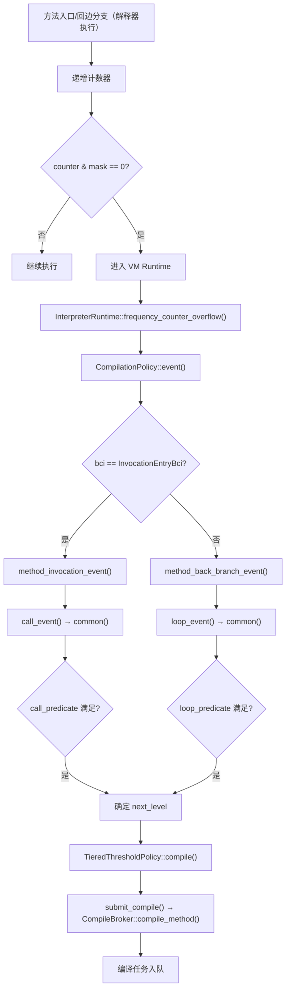
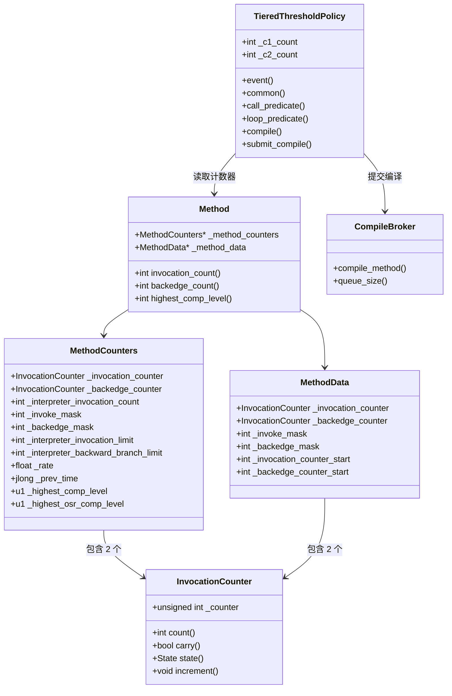

# 编译触发与热点方法检测 — 完整分析

> 源码基线：OpenJDK 11，标准环境：`-Xms8g -Xmx8g -XX:+UseG1GC`
> 核心源码：`src/hotspot/share/runtime/tieredThresholdPolicy.cpp`、`src/hotspot/share/interpreter/invocationCounter.hpp`

---

## 第 0 部分：核心原理 ⭐

### 0.1 本质是什么？

编译触发机制的本质是**一个基于计数器的采样系统**：在解释器热路径上用 `counter & mask == 0` 低开销地采样方法调用频率，当采样触发时进入 Runtime 做编译决策，决策结果是"提交编译任务到 CompileBroker 队列"。

### 0.2 为什么需要？

JVM 不能对所有方法都做 JIT 编译（编译本身有 CPU 和内存开销），也不能只用解释器（太慢）。需要一个机制判断"哪些方法值得编译"：

- **调用频率**：被频繁调用的方法（热点方法）值得编译
- **循环频率**：包含频繁执行循环的方法（热点循环）值得 OSR 编译
- **Profile 充分性**：C2 需要 C1 收集的类型信息才能做激进优化，需要判断 profile 是否充分

### 0.3 怎么解决？

**三层机制**：
- **计数层**（解释器汇编代码）：`increment_mask_and_jump` 在热路径上用 AND+JZ 两条指令高效采样，每 2^N 次调用/回边通知一次 Runtime
- **决策层**（`TieredThresholdPolicy::common()`）：根据当前编译级别、计数器值、编译队列长度，用谓词公式 `i >= Threshold * k || (i >= MinThreshold * k && i + b >= CompileThreshold * k)` 决定下一个编译级别
- **提交层**（`CompileBroker::compile_method()`）：将编译任务加入 C1/C2 队列，由编译器线程异步执行

### 0.4 为什么这样设计？

- **为什么用 `counter & mask` 而不是 `counter >= threshold`？** 热路径性能优先：AND+JZ 比 CMP+JGE 快，且 mask 是 2 的幂次方形式，每 2^N 次才进入 Runtime 一次，大幅减少 Runtime 调用开销
- **为什么分层编译默认路径是 0→3→4 而不是 0→4？** C2 需要类型信息（虚调用接收者类型、分支概率）才能做激进内联和逃逸分析，L3（C1 full profiling）负责收集这些信息
- **为什么有动态缩放系数 k？** 防止编译队列拥堵：队列越长，k 越大，阈值越高，减少新任务提交速度，实现自适应背压
- **为什么 L0→L3 的实际触发在 256 次而不是精确的 200 次？** 通知频率（每 128 次）和编译阈值（200 次）是两个独立参数，牺牲精度换取性能

---

## 一、宏观理解

### 1.1 问题引入：为什么需要编译触发机制？

JVM 使用解释器执行字节码，速度慢但启动快。当某个方法被频繁调用（热点方法），或某个循环被频繁执行（热点循环），就需要将其编译为本地机器码以提升性能。

**核心问题**：如何判断一个方法"足够热"，值得花时间去编译？

**解决方案**：使用计数器跟踪方法调用次数和回边次数，当计数器超过阈值时触发编译。

### 1.2 五层执行级别

JDK 11 默认开启分层编译（Tiered Compilation），定义了 5 个执行级别：

```
源码：src/hotspot/share/compiler/compilerDefinitions.hpp

enum CompLevel {
  CompLevel_any               = -2,
  CompLevel_all               = -2,
  CompLevel_aot               = -1,
  CompLevel_none              = 0,    // 解释器
  CompLevel_simple            = 1,    // C1，无 profiling
  CompLevel_limited_profile   = 2,    // C1，仅 invocation + backedge 计数
  CompLevel_full_profile      = 3,    // C1，完整 profiling（含 MDO）
  CompLevel_full_optimization = 4     // C2 深度优化
};
```

| 级别 | 编译器 | 特点 | 执行速度 |
|------|--------|------|----------|
| L0 | 解释器 | 无编译，可收集部分 profile | 最慢 |
| L1 | C1 | 简单优化，无 profiling | 快 |
| L2 | C1 | 带调用/回边计数器 | 快（比 L3 快 ~30%）|
| L3 | C1 | 完整 profiling（类型信息、分支概率） | 较快 |
| L4 | C2 | 深度优化（逃逸分析、标量替换等）| 最快 |

### 1.3 整体流程骨架



### 1.4 核心调用链

```
[解释器生成代码] increment_mask_and_jump()
  → [溢出] InterpreterRuntime::frequency_counter_overflow()
    → frequency_counter_overflow_inner()
      → CompilationPolicy::policy()->event()
        → TieredThresholdPolicy::event()
          → method_invocation_event() / method_back_branch_event()
            → call_event() / loop_event()
              → common()（核心状态转换函数）
                → compile()
                  → submit_compile()
                    → CompileBroker::compile_method()
```

## 二、逐段分析

### 2.1 阶段一：计数器数据结构

#### InvocationCounter — 核心计数单元

```cpp
// src/hotspot/share/interpreter/invocationCounter.hpp
class InvocationCounter {
  unsigned int _counter;   // ★ 格式: [count|carry|state]
                           //        [31..3| 2  | 1..0]
};
```

**位布局**：
```
  bit 31 ─────────── bit 3 │ bit 2 │ bit 1..0
  ┌──────────────────────────┬───────┬──────────┐
  │      count (29 bits)     │ carry │  state   │
  └──────────────────────────┴───────┴──────────┘
```

- **count**（29 位）：实际计数值，通过 `_counter >> 3` 获取
- **carry**（1 位，bit 2）：粘性标记位，一旦设置不会清除，表示计数器曾经达到过很大值
- **state**（2 位，bit 0-1）：状态标记
  - `wait_for_nothing (0)`：不触发编译
  - `wait_for_compile (1)`：等待编译

**关键常量**：
```cpp
count_increment = 1 << 3 = 8   // 递增 _counter 时实际加的值（跳过低 3 位）
count_shift     = 3             // 右移 3 位得到真实计数
```

**sizeof(InvocationCounter)**：1 个 `unsigned int` = **4 字节**（GDB 验证：`p sizeof(InvocationCounter)` = 4）

**创建位置**：`MethodCounters` 构造函数中作为成员变量内联创建（不单独 new），`MethodCounters` 在 `Method::build_interpreter_method_data()` 中创建。

**关键字段生命周期**（`_counter`）：
- 初始值：`0`（`MethodCounters` 构造时 `_invocation_counter.init()` 设置）
- 解释器每次方法调用/回边时：`_counter += count_increment`（即 += 8）
- 触发通知时：`_counter & mask == 0`（mask 是 `(2^N - 1) << 3` 形式）
- 逆优化后：`_counter` 重置为 0（`MethodCounters::reset_counters()`）
- carry 位：`handle_counter_overflow()` 中设置，一旦设置不清除（防止重复触发）

#### MethodCounters — 每方法计数器对象

```cpp
// src/hotspot/share/oops/methodCounters.hpp
class MethodCounters : public Metadata {
  // C2/JVMCI 编译需要
  int               _interpreter_invocation_count; // ★ 解释器调用计数（分层编译中复用为 prev_event_count）
  u2                _interpreter_throwout_count;   // 方法异常退出计数

  InvocationCounter _invocation_counter;           // ★ 方法调用计数器（4B）
  InvocationCounter _backedge_counter;             // ★ 回边计数器（4B）

  int               _nmethod_age;                  // nmethod 热度（CodeCache sweeper 用）

  // 每方法独立阈值（根据 CompileThresholdScaling 缩放）
  int               _interpreter_invocation_limit;  // ★ 编译阈值（非分层）
  int               _interpreter_backward_branch_limit; // OSR 阈值（非分层）
  int               _interpreter_profile_limit;    // profiling 阈值（非分层）
  int               _invoke_mask;                  // ★ 调用通知频率掩码（分层）
  int               _backedge_mask;                // ★ 回边通知频率掩码（分层）

  // 分层编译相关
  float             _rate;                    // ★ 事件速率（events/ms）
  jlong             _prev_time;               // 上次速率采样时间
  u1                _highest_comp_level;      // ★ 该方法曾达到的最高编译级别
  u1                _highest_osr_comp_level;  // 同上，OSR 版本
};
```

**sizeof(MethodCounters)**：约 **72 字节**（Metadata 头 16B + 各字段 56B，GDB 验证：`p sizeof(MethodCounters)`）

**创建位置**：`Method::build_interpreter_method_data()`（`method.cpp`）中 `new MethodCounters(method)` 创建，懒创建（首次需要计数时才创建）。

**关键字段生命周期**：
- `_invoke_mask`：`MethodCounters` 构造函数中计算 `right_n_bits(Tier0InvokeNotifyFreqLog) << count_shift`（= 0x3f8）；解释器汇编代码中 `counter & _invoke_mask == 0` 时触发通知；不变
- `_backedge_mask`：同上，= 0x1ff8；不变
- `_rate`：`TieredThresholdPolicy::event()` 中每次通知时更新（`events / elapsed_ms`）；用于判断方法是否

**GDB 验证数据**：
```
invoke_mask     = 0x3f8    → 二进制 0b 0000_0011_1111_1000
                            → 右移3位 = 0x7f = 127 = 2^7 - 1
                            → 来自 Tier0InvokeNotifyFreqLog = 7
                            → 含义：每 128 次调用通知一次 Runtime

backedge_mask   = 0x1ff8   → 二进制 0b 0001_1111_1111_1000
                            → 右移3位 = 0x3ff = 1023 = 2^10 - 1
                            → 来自 Tier0BackedgeNotifyFreqLog = 10
                            → 含义：每 1024 次回边通知一次 Runtime

_interpreter_invocation_limit = 0x13880
                            → 右移3位 = 10000
                            → 来自 CompileThreshold = 10000（非分层模式阈值）

_interpreter_backward_branch_limit = 0x29cc
                            → 为非分层模式 OSR 阈值
```

**mask 的计算过程**（`MethodCounters` 构造函数中）：
```cpp
_invoke_mask = right_n_bits(Tier0InvokeNotifyFreqLog) << InvocationCounter::count_shift;
// = right_n_bits(7) << 3
// = 0x7f << 3
// = 0x3f8

_backedge_mask = right_n_bits(Tier0BackedgeNotifyFreqLog) << InvocationCounter::count_shift;
// = right_n_bits(10) << 3
// = 0x3ff << 3
// = 0x1ff8
```

### 2.2 阶段二：模板解释器中的计数器递增与溢出检查

#### 方法入口计数器递增（分层模式）

```
源码：src/hotspot/cpu/x86/templateInterpreterGenerator_x86.cpp
函数：TemplateInterpreterGenerator::generate_counter_incr()
```

分层编译模式下，生成的汇编伪代码：

```asm
; === 检查是否有 MethodData（是否已在 profiling）===
mov rax, [rbx + Method::method_data_offset]   ; rax = method->_method_data
test rax, rax
jz no_mdo                                     ; 没有 MDO 跳转

; === 有 MDO：递增 MDO 中的调用计数器 ===
increment_mask_and_jump(
    mdo_invocation_counter,  ; MDO 中的 invocation_counter
    8,                       ; increment = count_increment = 8
    mdo_invoke_mask,         ; MDO 中的 invoke_mask
    rcx,                     ; scratch register
    overflow_label           ; 掩码匹配时跳转到 overflow
)
jmp done

no_mdo:
; === 无 MDO：递增 MethodCounters 中的调用计数器 ===
get_method_counters(rbx, rax, done)           ; rax = method->method_counters()
increment_mask_and_jump(
    invocation_counter,      ; MethodCounters 中的 _invocation_counter
    8,                       ; increment = 8
    invoke_mask,             ; MethodCounters 中的 _invoke_mask
    rcx,
    overflow_label
)

done:
; 继续正常执行...
```

**`increment_mask_and_jump` 的实现**（关键！）：

```
源码：src/hotspot/cpu/x86/interp_masm_x86.cpp

void InterpreterMacroAssembler::increment_mask_and_jump(
    Address counter_addr, int increment, Address mask,
    Register scratch, bool preloaded, Condition cond, Label* where)
{
  movl(scratch, counter_addr);    // scratch = *counter
  incrementl(scratch, increment); // scratch += 8
  movl(counter_addr, scratch);    // *counter = scratch
  andl(scratch, mask);            // scratch &= mask
  jcc(cond, *where);              // if (scratch == 0) goto overflow
}
```

**为什么用掩码而不是比较阈值？**

性能优化！在热路径上，`counter & mask` 只需一条 AND 指令 + 一条条件跳转，比 `counter >= threshold` 的 CMP + JGE 更快。mask 是 `(1 << N) - 1` 的形式左移 3 位，所以当计数器的第 N+3 位翻转时（即每 2^N 次递增），`counter & mask` 为 0，触发通知。

#### 回边计数器递增（分层模式）

```
源码：src/hotspot/cpu/x86/templateTable_x86.cpp
函数：TemplateTable::branch()
```

当遇到后向分支（`goto`, `if_icmplt` 等跳回前面的字节码）时：

```asm
; === 检查是否后向分支 ===
test rdx, rdx                    ; rdx = branch offset
jg dispatch                      ; 正向分支不计数

; === 有 MDO 时递增 MDO 回边计数器 ===
mov rbx, [rcx + Method::method_data_offset]
test rbx, rbx
jz no_mdo
increment_mask_and_jump(
    mdo_backedge_counter,
    8,
    mdo_backedge_mask,           ; 来自 Tier3BackedgeNotifyFreqLog = 13，每 8192 次通知
    rax,
    backedge_counter_overflow
)
jmp dispatch

no_mdo:
; === 无 MDO 时递增 MethodCounters 回边计数器 ===
increment_mask_and_jump(
    backedge_counter,
    8,
    backedge_mask,               ; 来自 Tier0BackedgeNotifyFreqLog = 10，每 1024 次通知
    rax,
    backedge_counter_overflow
)

dispatch:
; 继续执行分支目标字节码...

backedge_counter_overflow:
; 计算 branch_bcp，调用 Runtime
call InterpreterRuntime::frequency_counter_overflow(thread, branch_bcp)
; 如果返回 osr_nmethod，执行 OSR
test rax, rax
jz dispatch
; ... 执行 OSR 迁移 ...
```

#### 溢出处理入口

```
源码：src/hotspot/cpu/x86/templateInterpreterGenerator_x86.cpp
函数：TemplateInterpreterGenerator::generate_counter_overflow()
```

方法入口溢出时调用 `frequency_counter_overflow(thread, NULL)`（NULL 表示不是回边触发）。

回边溢出时调用 `frequency_counter_overflow(thread, branch_bcp)`（传入分支 BCP，用于 OSR）。

### 2.3 阶段三：Runtime 中的编译决策

#### frequency_counter_overflow_inner()

```
源码：src/hotspot/share/interpreter/interpreterRuntime.cpp

IRT_ENTRY(nmethod*, InterpreterRuntime::frequency_counter_overflow_inner(
    JavaThread* thread, address branch_bcp))

  LastFrameAccessor last_frame(thread);
  methodHandle method(thread, last_frame.method());
  
  // branch_bcp != NULL 表示回边触发，计算 branch_bci
  int branch_bci = branch_bcp != NULL ? method->bci_from(branch_bcp) : InvocationEntryBci;
  int bci = branch_bcp != NULL ? method->bci_from(last_frame.bcp()) : InvocationEntryBci;

  // 核心：调用编译策略的 event() 方法
  nmethod* osr_nm = CompilationPolicy::policy()->event(
      method, method, branch_bci, bci, CompLevel_none, NULL, thread);

  // 如果是 OSR，撤销偏向锁（OSR 需要迁移 BasicObjectLock）
  if (osr_nm != NULL && UseBiasedLocking) {
    // 遍历当前帧的所有 monitor，撤销偏向锁
    ...
  }
  return osr_nm;
IRT_END
```

#### TieredThresholdPolicy::event()

```
源码：src/hotspot/share/runtime/tieredThresholdPolicy.cpp

nmethod* TieredThresholdPolicy::event(
    const methodHandle& method, const methodHandle& inlinee,
    int branch_bci, int bci, CompLevel comp_level, CompiledMethod* nm,
    JavaThread* thread)
{
  // 1. 处理计数器溢出（设置 carry 位）
  handle_counter_overflow(method());

  // 2. 打印事件（-XX:+PrintTieredEvents）
  if (PrintTieredEvents) {
    print_event(bci == InvocationEntryBci ? CALL : LOOP, ...);
  }

  // 3. 根据事件类型分发
  if (bci == InvocationEntryBci) {
    method_invocation_event(method, inlinee, comp_level, nm, thread);
  } else {
    method_back_branch_event(method, inlinee, bci, comp_level, nm, thread);
    // 检查是否有更高级别的 OSR nmethod
    nmethod* osr_nm = inlinee->lookup_osr_nmethod_for(bci, comp_level, false);
    if (osr_nm != NULL && osr_nm->comp_level() > comp_level) {
      return osr_nm;  // 返回给解释器执行 OSR
    }
  }
  return NULL;
}
```

### 2.4 阶段四：分层编译状态转换（核心！）

#### common() — 状态转换核心函数

```
源码：src/hotspot/share/runtime/tieredThresholdPolicy.cpp

CompLevel TieredThresholdPolicy::common(
    Predicate p, Method* method, CompLevel cur_level, bool disable_feedback)
```

这是分层编译的**核心决策函数**。根据当前级别和 predicate，决定下一个编译级别。

**状态转换图**：

```mermaid
stateDiagram-v2
    [*] --> L0 : 解释执行
    
    L0 --> L3 : "正常路径 (0→3→4)\n i≥200*k || (i≥100*k && i+b≥2000*k)"
    L0 --> L2 : "C2 队列拥堵 (0→2→3→4)\n queue > Tier3DelayOn * c2_count"
    L0 --> L4 : "C1 编译失败\n或已有足够 profile"
    L0 --> L1 : "trivial 方法\n(accessor/constant_getter)"
    
    L2 --> L3 : "C2 队列空闲\n queue ≤ Tier3DelayOff * c2_count"
    L2 --> L4 : "已在解释器完成 profiling"
    
    L3 --> L4 : "Profile 充分\n mdo_i≥5000*k || (mdo_i≥600*k && mdo_i+mdo_b≥15000*k)"
    L3 --> L1 : "trivial 方法\n或 C2 不可用"
    
    L4 --> L0 : "Deoptimization"
    
    note right of L0 : Level 0: 解释器
    note right of L1 : Level 1: C1 纯优化
    note right of L2 : Level 2: C1 + 计数器
    note right of L3 : Level 3: C1 + 完整 profiling
    note right of L4 : Level 4: C2 深度优化
```

**common() 按当前级别分支**：

```
case CompLevel_none (L0):
  // 先检查：如果当前 profile 已经足够触发 L4，直接跳到 L4
  if (common(p, method, L3) == L4) → next = L4

  // 否则，检查 call_predicate 是否满足
  elif predicate(i, b) 满足:
    if C2队列 > Tier3DelayOn * c2_count:
      next = L2        // C2 拥堵，先到 L2 快速运行
    else:
      next = L3        // 正常路径，到 L3 做完整 profiling

case CompLevel_limited_profile (L2):
  if is_method_profiled():
    next = L4          // 解释器已完成 profiling
  elif MDO.would_profile():
    if C2队列 ≤ Tier3DelayOff * c2_count && predicate满足:
      next = L3        // C2 空闲了，升级到 L3 做 profiling
  else:
    next = L4          // 没什么值得 profile 的，直接 L4

case CompLevel_full_profile (L3):
  if MDO.would_profile():
    if predicate(mdo_i, mdo_b) 满足:
      next = L4        // Profile 充分，升级到 C2
  else:
    next = L4          // 没什么值得继续 profile 的
```

#### 判定谓词（Predicate）

**call_predicate**（方法调用判定）：

```
源码：tieredThresholdPolicy.cpp

// L0/L2 → L3 的判定：
i >= Tier3InvocationThreshold * k
  || (i >= Tier3MinInvocationThreshold * k && i + b >= Tier3CompileThreshold * k)

// L3 → L4 的判定：
i >= Tier4InvocationThreshold * k
  || (i >= Tier4MinInvocationThreshold * k && i + b >= Tier4CompileThreshold * k)
```

**loop_predicate**（OSR 判定）：

```
// L0/L2 → L3 的 OSR 判定：
b >= Tier3BackEdgeThreshold * k

// L3 → L4 的 OSR 判定：
b >= Tier4BackEdgeThreshold * k
```

其中 `k` 是动态缩放系数：

```
k = queue_size / (LoadFeedback * compiler_count) + 1
```

### 2.5 阶段五：默认阈值汇总

```
JVM 参数: -XX:+PrintFlagsFinal 可查看
```

#### 分层编译阈值（默认）

| 参数 | 默认值 | 含义 |
|------|--------|------|
| **Tier0InvokeNotifyFreqLog** | 7 | L0 每 128 次调用通知 |
| **Tier0BackedgeNotifyFreqLog** | 10 | L0 每 1024 次回边通知 |
| **Tier3InvokeNotifyFreqLog** | 10 | L3 每 1024 次调用通知 |
| **Tier3BackedgeNotifyFreqLog** | 13 | L3 每 8192 次回边通知 |
| **Tier3InvocationThreshold** | 200 | L0→L3：调用次数阈值 |
| **Tier3MinInvocationThreshold** | 100 | L0→L3：最小调用次数 |
| **Tier3CompileThreshold** | 2000 | L0→L3：调用+回边总量阈值 |
| **Tier3BackEdgeThreshold** | 60000 | L0→L3：OSR 回边阈值 |
| **Tier4InvocationThreshold** | 5000 | L3→L4：调用次数阈值 |
| **Tier4MinInvocationThreshold** | 600 | L3→L4：最小调用次数 |
| **Tier4CompileThreshold** | 15000 | L3→L4：调用+回边总量阈值 |
| **Tier4BackEdgeThreshold** | 40000 | L3→L4：OSR 回边阈值 |
| **Tier3DelayOn** | 5 | C2 队列/线程 > 5 → 0→2 |
| **Tier3DelayOff** | 2 | C2 队列/线程 ≤ 2 → 恢复 0→3 |
| **Tier0ProfilingStartPercentage** | 200 | L0 提前开始 profiling 的百分比 |

#### 非分层编译阈值（-XX:-TieredCompilation）

| 参数 | C2 默认值 | C1 默认值 | 含义 |
|------|-----------|-----------|------|
| CompileThreshold | 10000 | 1500 | 编译阈值 |
| OnStackReplacePercentage | 140 | 933 | OSR 百分比 |
| InterpreterProfilePercentage | 33 | 33 | Profiling 百分比 |

非分层模式下 OSR 阈值计算（ProfileInterpreter=true）：
```
BackwardBranchLimit = CompileThreshold * (OnStackReplacePercentage - InterpreterProfilePercentage) / 100
// C2: 10000 * (140 - 33) / 100 = 10700
```

### 2.6 阶段六：编译策略初始化

```
源码：src/hotspot/share/runtime/compilationPolicy.cpp

void compilationPolicy_init() {
  CompilationPolicy::set_in_vm_startup(DelayCompilationDuringStartup);
  switch(CompilationPolicyChoice) {
    case 0: set_policy(new SimpleCompPolicy());           break;
    case 1: set_policy(new StackWalkCompPolicy());        break;
    case 2: set_policy(new TieredThresholdPolicy());      break;  // 默认
  }
  CompilationPolicy::policy()->initialize();
}
```

**分层编译默认**：`CompilationPolicyChoice = 2`，使用 `TieredThresholdPolicy`。

**编译线程数量计算**（`TieredThresholdPolicy::initialize()`）：

```cpp
int log_cpu = log2(os::active_processor_count());
int loglog_cpu = log2(max(log_cpu, 1));
int count = max(log_cpu * loglog_cpu * 3 / 2, 2);

// 例如 8 核：log2(8)=3, log2(3)=1, count = max(3*1*3/2, 2) = max(4, 2) = 4
// C1:C2 比例 = 1:2 → C1=1, C2=3
// 例如 32 核：log2(32)=5, log2(5)=2, count = max(5*2*3/2, 2) = max(15, 2) = 15
// C1=5, C2=10

set_c1_count(max(count / 3, 1));
set_c2_count(max(count - c1_count(), 1));
```

**查看 JVM 参数**：`-XX:+PrintFlagsFinal | grep CICompilerCount`

## 三、关键数据结构关系图



## 四、GDB 验证

### 4.1 验证计划

| 验证项 | 方法 | 预期结果 |
|--------|------|----------|
| invoke_mask 值 | 打印 MethodCounters 字段 | 0x3f8 (Tier0InvokeNotifyFreqLog=7) |
| backedge_mask 值 | 打印 MethodCounters 字段 | 0x1ff8 (Tier0BackedgeNotifyFreqLog=10) |
| L0→L3 触发时的计数器值 | 断点 compile() | invocation ≈ 200+ |
| L3→L4 触发时的计数器值 | 断点 compile() | invocation ≈ 5000+ |
| PrintTieredEvents 输出 | -XX:+PrintTieredEvents | 看到 call/compile 事件 |
| PrintCompilation 输出 | -XX:+PrintCompilation | 看到 L3→L4 编译 |

### 4.2 验证结果

#### 验证 1：MethodCounters 字段值

**GDB 脚本**：`new-jvm-md/tmp-file/compiler/verify-compile-trigger.gdb`

**结果**（hotMethod 首次触发 L3 编译时）：

```
=== compile(): bci=-1, level=3 ===
  invocation_count=256
  backedge_count=0
  invoke_mask=0x3f8          ✓ = (2^7 - 1) << 3，每 128 次通知
  backedge_mask=0x1ff8       ✓ = (2^10 - 1) << 3，每 1024 次通知
  _interpreter_invocation_limit=0x13880  ✓ = 10000 << 3（非分层阈值）
  _interpreter_backward_branch_limit=0x29cc
  invocation_counter._counter=0x801 (count=256)  ✓ count=256 > Tier3InvocationThreshold(200)
  backedge_counter._counter=0x1 (count=0)
  highest_comp_level=0       ✓ 首次编译
  highest_osr_comp_level=0
```

**分析**：
- `invocation_count=256` 时触发 L3 编译，大于 `Tier3InvocationThreshold=200`
- 实际上并非精确在 200 时触发，因为通知频率是每 128 次（`Tier0InvokeNotifyFreqLog=7`），所以第一次满足条件的通知发生在 256 次

#### 验证 2：L3→L4 转换

**结果**：

```
=== compile(): bci=-1, level=4 ===
  invocation_count=6505
  backedge_count=0
  highest_comp=3             ✓ 之前已到达 L3
  highest_osr=0
```

**分析**：
- L3→L4 在 `invocation_count=6505` 时触发
- 这大于 `Tier4InvocationThreshold=5000`
- 此时 L3 版本已经收集了足够的 profile 数据（MDO）

#### 验证 3：PrintTieredEvents 输出

**运行参数**：`-XX:+PrintTieredEvents -XX:+PrintCompilation`

**关键输出**：

```
1.275: [call level=0 [CompileTest.hotMethod(I)I] @-1 queues=11,0 total=128,0]
1.275: [call level=0 [CompileTest.hotMethod(I)I] @-1 queues=11,0 total=256,0]
1.275: [call level=0 [CompileTest.hotMethod(I)I] @-1 queues=11,0 total=384,0]
1.275: [compile level=3 [CompileTest.hotMethod(I)I] @-1]    ← 触发 L3 编译
...
1.276: [compile level=4 [CompileTest.hotMethod(I)I] @-1]    ← 触发 L4 编译
1277  583   3   CompileTest::hotMethod (6 bytes)              ← L3 编译完成
1277  584   4   CompileTest::hotMethod (6 bytes)              ← L4 编译完成
1277  583   3   CompileTest::hotMethod (6 bytes) made not entrant  ← L3 废弃
```

**解读**：
- `total=128,0` → 128 次调用，0 次回边
- 每 128 次通知一次（因为 `invoke_mask=0x3f8`），所以 total 以 128 为步长增长
- 当 `total=384` 时（第 3 次通知），`384 > 200*k`（k≈1.55），触发 L3 编译
- `queues=11,0` → C1 队列 11 个任务，C2 队列 0 个
- 缩放系数 `k=1.55,1.00` → C1 略有负载，C2 空闲

**完整编译路径**：
```
hotMethod:  L0 → L3(C1 full profiling) → L4(C2)，L3 made not entrant
loopMethod: L0 → L3(OSR at bci 4)
```

## 五、查漏补缺

### 5.1 问题清单

**Q1: 为什么用 mask 而不是直接比较阈值？**

A: 性能优化。在解释器的热路径上，`counter & mask` 只需 AND+JZ 两条指令（1-2 个时钟周期），而 `counter >= threshold` 需要 CMP+JGE（也是 2 条指令但 CMP 可能慢于 AND）。更重要的是，mask 检查允许计数器以 2 的幂次方频率通知 Runtime，而不是每次都通知，大大减少了进入 Runtime 的频率。

**Q2: 为什么 L0→L3 的通知频率是 128 而不是 200？**

A: 通知频率和编译阈值是两个概念：
- `Tier0InvokeNotifyFreqLog=7` → 每 128 次调用**通知一次** Runtime
- `Tier3InvocationThreshold=200` → 通知时检查是否**超过** 200

所以实际触发在 256 次（第 2 次通知时），而不是精确的 200 次。这种设计牺牲了精度换取了性能。

**Q3: L0 如何直接跳到 L4？**

A: `common()` 在处理 `CompLevel_none` 时，先递归调用 `common(p, method, CompLevel_full_profile)` 检查"如果在 L3，是否应该升级到 L4"。如果返回 L4，说明 profile 已经足够（可能在解释器中完成了 profiling），直接跳到 L4。

**Q4: Tier3DelayOn/Tier3DelayOff 有什么用？**

A: 这是一个动态反馈机制，防止 C2 队列拥堵时方法在 L3 执行太久：
- 当 C2 队列 > `Tier3DelayOn(5) * c2_count` 时，改走 0→2 路径（L2 比 L3 快 30%）
- 当 C2 队列 ≤ `Tier3DelayOff(2) * c2_count` 时，恢复 0→3 路径
- 使用滞后（hysteresis）避免抖动

**Q5: decay（计数器衰减）是怎么回事？**

A: 非分层模式下，`CounterDecay` 在每次 safepoint 结束时执行，将一部分方法的计数器减半。目的是让不再热的方法自然"冷却"，避免它们永远保持高计数。衰减间隔由 `CounterDecayMinIntervalLength` 控制，半衰期由 `CounterHalfLifeTime` 控制。

### 5.2 JVM 参数速查

| 参数 | 作用 |
|------|------|
| `-XX:+PrintTieredEvents` | 打印分层编译事件（call/loop/compile/remove等）|
| `-XX:+PrintCompilation` | 打印编译任务（编号、级别、方法、字节码大小）|
| `-XX:+TraceCompilationPolicy` | 打印编译策略决策过程 |
| `-XX:+TraceInvocationCounterOverflow` | 打印计数器溢出详情 |
| `-XX:TieredStopAtLevel=N` | 限制最高编译级别（调试用）|
| `-XX:CompileThresholdScaling=X` | 全局缩放编译阈值（X=0 等同于 -Xint）|
| `-XX:-TieredCompilation` | 关闭分层编译，仅使用 C2（或 C1）|
| `-XX:CompilationPolicyChoice=N` | 选择编译策略（0=Simple, 1=StackWalk, 2=Tiered）|

### 5.3 PrintTieredEvents 输出格式

```
时间戳: [事件类型 level=级别 [方法签名] @bci queues=c1队列,c2队列 rate=速率 k=c1缩放,c2缩放
         total=调用次数,回边次数 mdo=mdo调用(起始),mdo回边(起始) max levels=最高编译级别,最高OSR级别
         compilable=可编译级别 status=队列状态]
```

**示例解读**：
```
1.275: [call level=0 [CompileTest.hotMethod(I)I] @-1 queues=11,0
        rate=n/a k=1.55,1.00 total=256,0 mdo=0(0),0(0)
        max levels=0,0 compilable=c1,c1-osr,c2,c2-osr status=idle]
```
- `call level=0`：在 L0（解释器）收到方法调用通知
- `@-1`：方法入口（InvocationEntryBci = -1）
- `queues=11,0`：C1 队列 11 个，C2 队列 0 个
- `rate=n/a`：首次通知，速率未计算
- `k=1.55,1.00`：C1 缩放 1.55（因队列有 11 个任务），C2 缩放 1.0（队列为空）
- `total=256,0`：256 次调用，0 次回边
- `status=idle`：未在编译队列中

## 六、总结

### 核心要点

1. **分层编译默认路径**：0→3→4（解释器→C1 full profiling→C2 优化）
2. **计数器通知机制**：使用 `counter & mask == 0` 高效检测，不是每次调用都进入 Runtime
3. **通知频率**：L0 每 128 次调用 / 1024 次回边通知一次，L3 每 1024 次调用 / 8192 次回边通知一次
4. **阈值判定公式**：`i >= Threshold * k || (i >= MinThreshold * k && i + b >= CompileThreshold * k)`
5. **动态反馈**：缩放系数 `k` 随编译队列长度增大，队列越长阈值越高，避免拥堵
6. **Tier3Delay 机制**：C2 拥堵时走 0→2→3→4，避免在 L3 过度 profiling
