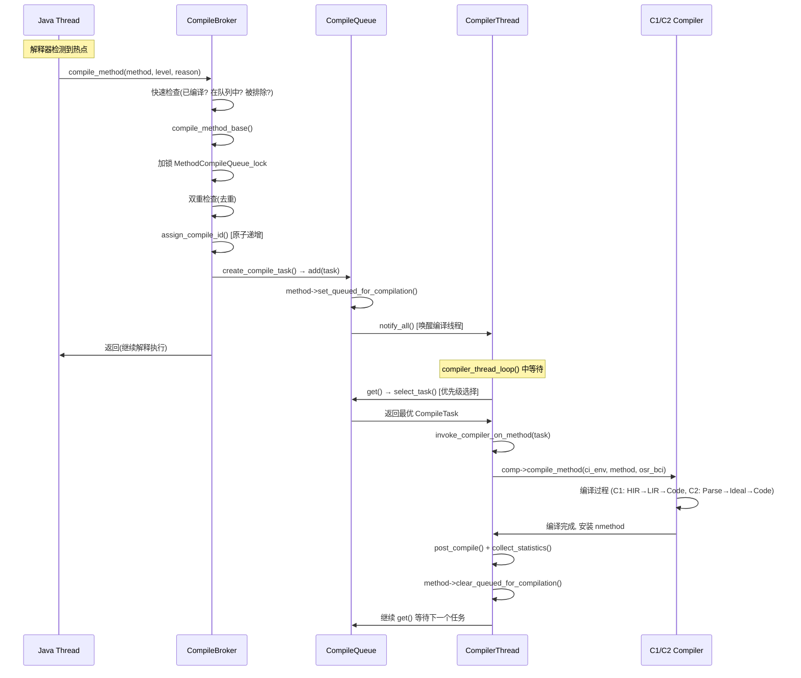
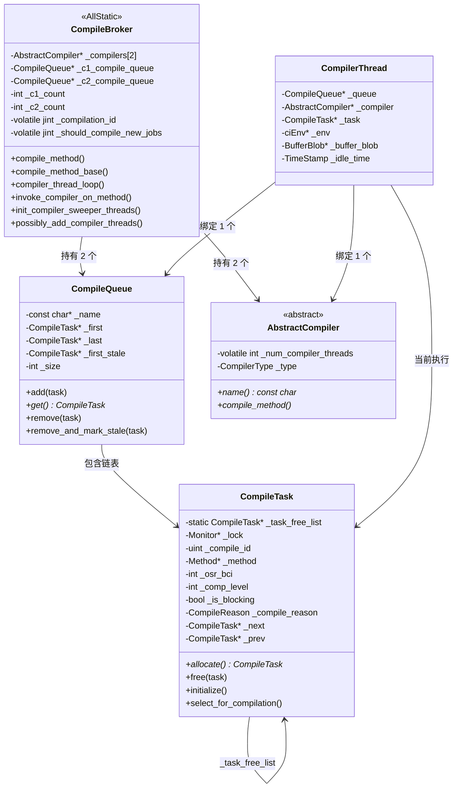

# CompileBroker — 编译请求分发 深度解析

> 基于 OpenJDK 11 源码分析
> 标准环境：-Xms8g -Xmx8g -XX:+UseG1GC, G1 Region = 4MB
> 源码路径：src/hotspot/share/compiler/compileBroker.cpp, compileTask.cpp

---

## 第 0 部分：核心原理 ⭐

### 0.1 本质是什么？

`CompileBroker` 的本质是一个**生产者-消费者调度中心**：Java 应用线程（生产者）通过 `compile_method()` 将编译请求封装为 `CompileTask` 放入 `CompileQueue`，`CompilerThread`（消费者）在 `compiler_thread_loop()` 中无限循环取任务执行编译。两者通过 `MethodCompileQueue_lock` 的 wait/notify 协调。

### 0.2 为什么需要？

JIT 编译不能在 Java 应用线程中同步执行（编译耗时 1-100ms，会严重影响应用响应时间）。需要一个异步调度机制：

- **异步性**：Java 线程提交请求后立即返回，继续在解释器中执行，编译在后台进行
- **去重**：同一方法可能被多个线程同时触发编译，必须保证只入队一次
- **优先级**：高热度方法、反优化后重编译的方法应该优先处理
- **背压**：CodeCache 满时需要停止接受新任务

### 0.3 怎么解决？

**双队列架构**：C1 和 C2 各有独立的 `CompileQueue` 和 `CompilerThread` 组，互不干扰。

**去重机制**：`Method::_queued_for_compilation` 位标记 + 双重检查锁（先无锁检查，再加锁二次检查）。

**优先级调度**：`select_task()` 不是简单 FIFO，而是按 `weight = (rate+1) × (invocations+1) × (backedges+1)` 选择最热方法，反优化重编译的方法（`highest_comp_level` 高）优先。

**动态线程伸缩**：初始各 1 个编译线程，根据队列积压和系统资源动态创建（最多 C1×4/C2×8），空闲超过阈值时回收。

### 0.4 为什么这样设计？

- **为什么 C1/C2 用独立队列而不是共享队列？** C1 和 C2 的编译时间差异很大（C1 ~2ms，C2 ~50ms），共享队列会导致 C1 任务被 C2 的长任务阻塞，影响快速编译的响应时间
- **为什么用 `weight = rate × invocations × backedges` 而不是简单按调用次数排序？** 三因子乘积综合考虑了方法的"当前热度"（rate）、"历史热度"（invocations）和"循环密集度"（backedges），比单一维度更准确
- **为什么 `CompileTask` 用对象池（freelist）？** 编译任务频繁创建/销毁（每次热点触发都创建一个），对象池避免了频繁 malloc/free，GDB 验证复用率达 95%
- **为什么初始只创建 1 个编译线程？** JVM 启动时编译队列为空，创建多个线程只会浪费资源；动态伸缩在队列积压时按需创建，更节省资源

---

## 1. 问题引入

### 1.1 场景描述

在 Day 15 中我们分析了热点方法检测：当解释器发现方法调用次数达到阈值时，会调用 `InterpreterRuntime::frequency_counter_overflow()` → `CompilationPolicy::event()` → 最终调用 `CompileBroker::compile_method()`。

但问题是：**编译请求提交后，到底发生了什么？**

- 提交编译请求的是 **Java 应用线程**（运行在解释器中）
- 真正执行编译的是 **CompilerThread**（独立的后台线程）
- 两者之间如何协调？编译请求如何入队？编译线程如何取任务？

### 1.2 核心问题

CompileBroker 是 JVM 编译系统的"调度中心"，它要解决以下问题：
1. **生产者-消费者**：Java 线程提交请求 → 编译线程消费请求
2. **去重**：同一个方法不能重复入队
3. **优先级**：L4 重编译、高热度方法应该优先编译
4. **资源管理**：编译线程数量动态伸缩
5. **背压**：CodeCache 满了怎么办

---

## 2. 整体架构

### 2.1 一句话核心

**CompileBroker 是一个 AllStatic 的编译调度中心，维护 C1/C2 两个 CompileQueue，Java 线程通过 `compile_method()` 提交请求入队，CompilerThread 在 `compiler_thread_loop()` 中无限循环取任务执行编译。**

### 2.2 架构图

```
┌──────────────────────────────────────────────────────────────────────┐
│                        CompileBroker (AllStatic)                     │
│                                                                      │
│   _compilers[0] = Compiler (C1)    _compilers[1] = C2Compiler       │
│   _c1_count = 4                    _c2_count = 8                     │
│                                                                      │
│   ┌─────────────────┐              ┌─────────────────┐               │
│   │ C1 CompileQueue  │              │ C2 CompileQueue  │              │
│   │ (双向链表)       │              │ (双向链表)       │              │
│   │  _first ──→ task ──→ task      │  _first ──→ task ──→ task      │
│   │  _last  ←── task ←── task      │  _last  ←── task ←── task      │
│   │  _size = N       │              │  _size = M       │              │
│   └───────┬──────────┘              └───────┬──────────┘              │
│           │                                 │                        │
│    C1 CompilerThread×4              C2 CompilerThread×8              │
│    (初始 1 个，动态扩展)            (初始 1 个，动态扩展)            │
│                                                                      │
│   ┌─────────────────────────────────────────────────────┐            │
│   │ CompileTask FreeList                                 │            │
│   │ (对象池，避免频繁 malloc)                            │            │
│   └─────────────────────────────────────────────────────┘            │
└──────────────────────────────────────────────────────────────────────┘

Java 应用线程:
  frequency_counter_overflow()
    → CompilationPolicy::event()
      → TieredThresholdPolicy::submit_compile()
        → CompileBroker::compile_method()
          → compile_method_base()
            → create_compile_task()
              → CompileQueue::add()          ← 入队（notify_all 唤醒编译线程）

CompilerThread:
  compiler_thread_loop()
    → queue->get()                            ← 取任务（wait 等待）
      → select_task()                         ← 优先级选择
    → invoke_compiler_on_method()             ← 执行编译
      → comp->compile_method()                ← 调用 C1/C2 编译器
    → post_compile()                          ← 记录结果
```

---

## 3. 核心数据结构

### 3.1 CompileBroker（AllStatic 类）

```
源码：src/hotspot/share/compiler/compileBroker.hpp:139
```

CompileBroker 是一个纯静态类，所有字段和方法都是 static 的。核心字段：

| 字段 | 类型 | 含义 |
|------|------|------|
| `_compilers[2]` | `AbstractCompiler*[2]` | [0]=C1, [1]=C2 编译器实例 |
| `_c1_count` / `_c2_count` | `int` | C1/C2 编译线程最大数量 |
| `_c1_compile_queue` | `CompileQueue*` | C1 编译队列 |
| `_c2_compile_queue` | `CompileQueue*` | C2 编译队列 |
| `_compilation_id` | `volatile jint` | 全局编译 ID 计数器（原子递增） |
| `_should_compile_new_jobs` | `volatile jint` | 编译开关：1=运行,0=停止,2=永久关闭 |
| `_initialized` | `bool` | 是否初始化完成 |

在我们的标准环境下（GDB 验证）：
- **C1 count = 4，C2 count = 8**
- **C1 queue 名称 = "C1 compile queue"**
- **C2 queue 名称 = "C2 compile queue"**

### 3.2 CompileQueue（双向链表队列）

```cpp
// src/hotspot/share/compiler/compileBroker.hpp:80
class CompileQueue : public CHeapObj<mtCompiler> {
  const char* _name;         // ★ 队列名称（"C1 compile queue" / "C2 compile queue"）
  CompileTask* _first;       // ★ 链表头（最早入队的任务）
  CompileTask* _last;        // ★ 链表尾（最新入队的任务）
  CompileTask* _first_stale; // 过期任务链表（方法已卸载的任务）
  int _size;                 // ★ 队列大小（当前任务数）
};
```

**sizeof(CompileQueue)**：**48 字节**（GDB 验证：vtable 8B + 4 个指针 32B + int 4B + 对齐 4B）

**创建位置**：`init_compiler_sweeper_threads()` 中 `new CompileQueue("C1 compile queue")` 和 `new CompileQueue("C2 compile queue")` 创建。

**关键字段生命周期**：
- `_first`/`_last`：`add()` 时新任务追加到 `_last` 后面；`get()` 时 `select_task()` 选择最优任务从链表移除；`remove_and_mark_stale()` 时将过期任务移入 `_first_stale`
- `_size`：`add()` 时 `++_size`；`remove()` 时 `--_size`；`TieredThresholdPolicy` 读取 `_size` 计算动态缩放系数 k
- `_first_stale`：`mark_on_stack()` 时将方法已卸载的任务移入此链表；下次 `get()` 时 `purge_stale_tasks()` 清理

CompileQueue 是一个简单的 **FIFO 双向链表**，但从队列中取任务时并不简单地取 first —— 而是由 `CompilationPolicy::select_task()` 根据热度优先级选择。

关键操作：
- **add()**: 追加到链表尾部，调用 `MethodCompileQueue_lock->notify_all()` 唤醒等待的编译线程
- **get()**: 等待队列非空，调用 `select_task()` 选择最优任务，从链表中移除
- **remove_and_mark_stale()**: 移除过期任务，放入 `_first_stale` 链表延迟释放

### 3.3 CompileTask（编译任务）

```cpp
// src/hotspot/share/compiler/compileTask.hpp:39
class CompileTask : public CHeapObj<mtCompiler> {
  static CompileTask* _task_free_list;  // ★ 全局 freelist 头指针（对象池）
  
  Monitor*     _lock;                   // 阻塞编译时用于等待的锁
  uint         _compile_id;             // ★ 全局唯一编译 ID（原子递增）
  Method*      _method;                 // ★ 要编译的方法
  jobject      _method_holder;          // 方法持有者的弱引用（防 GC 回收类）
  int          _osr_bci;                // ★ OSR 编译的 BCI（-1 表示标准编译）
  bool         _is_complete;            // ★ 编译是否完成（编译线程设置）
  bool         _is_success;             // 编译是否成功
  bool         _is_blocking;            // ★ 是否阻塞等待（-Xbatch 时为 true）
  int          _comp_level;             // ★ 目标编译级别（1-4）
  int          _num_inlined_bytecodes;  // 内联字节码数（统计用）
  nmethodLocker* _code_handle;          // 结果 nmethod 持有者
  CompileTask* _next, *_prev;           // ★ 双向链表指针（CompileQueue 中）
  bool         _is_free;                // 是否在 freelist 上
  
  jlong        _time_queued;            // 入队时间戳（性能统计）
  jlong        _time_started;           // 开始编译时间戳
  Method*      _hot_method;             // 触发此编译的热方法
  int          _hot_count;              // 热度计数
  CompileReason _compile_reason;        // ★ 编译原因
  const char*  _failure_reason;         // 失败原因
};
```

**sizeof(CompileTask)**：**144 字节**（GDB 验证：`p sizeof(CompileTask)` = 144）

**创建位置**：`CompileBroker::create_compile_task()` 中，优先从 `_task_free_list` 复用，否则 `new CompileTask()`；在 `compile_method_base()` 中调用。

**关键字段生命周期**：
- `_method`：`compile_method_base()` 中设置；编译完成后通过 `_code_handle` 获取 nmethod；`free_task()` 时清空并归还到 `_task_free_list`
- `_comp_level`：`TieredThresholdPolicy::submit_compile()` 中由编译策略决定；编译线程读取以选择 C1/C2
- `_is_complete`：编译线程完成后设置为 true；阻塞调用者通过 `_lock->wait()` 等待此标志
- `_is_blocking`：`BackgroundCompilation=false` 或 `-Xbatch` 时为 true；`select_task()` 中阻塞任务优先处理

**CompileReason 枚举**：
```cpp
enum CompileReason {
    Reason_None,
    Reason_InvocationCount,  // 非分层：Simple/StackWalk 策略
    Reason_BackedgeCount,    // 非分层：回边触发
    Reason_Tiered,           // ★ 分层编译触发（最常见）
    Reason_CTW,              // Compile the World
    Reason_Replay,           // ciReplay
    Reason_Whitebox,         // Whitebox API
    Reason_MustBeCompiled,   // LinkResolver 强制编译
    Reason_Bootstrap,        // JVMCI bootstrap
};
```

#### CompileTask 的 FreeList 对象池

CompileTask 使用 **静态 freelist** 实现对象池，避免频繁 `malloc/free`：

```cpp
static CompileTask* _task_free_list;  // 全局 freelist 头指针

CompileTask* CompileTask::allocate() {
    MutexLocker locker(CompileTaskAlloc_lock);
    if (_task_free_list != NULL) {
        task = _task_free_list;              // 从 freelist 取
        _task_free_list = task->next();
    } else {
        task = new CompileTask();            // 新分配
    }
    task->set_is_free(false);
    return task;
}

void CompileTask::free(CompileTask* task) {
    MutexLocker locker(CompileTaskAlloc_lock);
    task->set_is_free(true);
    task->set_next(_task_free_list);         // 归还到 freelist
    _task_free_list = task;
}
```

**GDB 验证数据**：
```
Total allocate: 725 次 (from_free=689, new=36)
Total free: 722 次
复用率: 689/725 = 95%
```

只分配了 36 个 CompileTask 对象，之后全部复用。这是典型的**对象池模式**。

### 3.4 CompilerThread

```cpp
// src/hotspot/share/runtime/thread.hpp:2130
class CompilerThread : public JavaThread {
  CompilerCounters* _counters;    // 性能计数器（jstat 用）
  ciEnv*            _env;         // ★ 编译器接口环境（每次编译重新创建）
  CompileLog*       _log;         // 编译日志
  CompileTask* volatile _task;    // ★ 当前正在执行的编译任务
  CompileQueue*     _queue;       // ★ 此线程绑定的编译队列（C1 或 C2）
  BufferBlob*       _buffer_blob; // C1 编译临时代码缓冲区
  AbstractCompiler* _compiler;    // ★ 此线程的编译器（C1 或 C2）
  TimeStamp         _idle_time;   // 空闲时间（用于动态线程回收）
};
```

**sizeof(CompilerThread)**：**1960 字节**（GDB 验证：继承自 JavaThread，JavaThread 约 1920B + 新增字段 40B）

**创建位置**：`init_compiler_sweeper_threads()` 中 `make_thread(thread_handle, queue, compiler)` 创建；初始各 1 个，`possibly_add_compiler_threads()` 动态扩展。

**关键字段生命周期**：
- `_queue`：构造时绑定，不变；`compiler_thread_loop()` 中循环调用 `_queue->get()`
- `_task`：`CompileTaskWrapper` 构造时设置为当前任务；析构时清空（RAII 模式）
- `_env`：每次 `invoke_compiler_on_method()` 时 `new ciEnv(task)` 创建；编译完成后析构
- `_idle_time`：`start_idle_timer()` 时记录；`can_remove()` 检查是否超过阈值（C1 500ms，C2 100ms）

关键特征：
- 每个 CompilerThread **绑定一个固定的 CompileQueue**（C1 线程绑 C1 队列，C2 线程绑 C2 队列）
- 线程优先级设为 **NearMaxPriority**（接近最高优先级）
- 是 **daemon 线程**（不阻止 JVM 退出）

---

## 4. 核心流程分析

### 4.1 Phase 1: 初始化 — `compilation_init_phase1()`

入口在 `Threads::create_vm()` 过程中调用。核心步骤：

```
compilation_init_phase1()
├── 1. 获取编译线程数量
│     _c1_count = CompilationPolicy::policy()->compiler_count(CompLevel_simple)     // 4
│     _c2_count = CompilationPolicy::policy()->compiler_count(CompLevel_full_optimization) // 8
│
├── 2. 创建编译器对象
│     _compilers[0] = new Compiler()      // C1
│     _compilers[1] = new C2Compiler()    // C2
│
├── 3. 创建编译线程和队列
│     init_compiler_sweeper_threads()
│     ├── new CompileQueue("C2 compile queue")
│     ├── new CompileQueue("C1 compile queue")
│     ├── 创建 C2 线程（初始 1 个，UseDynamicNumberOfCompilerThreads 时按需扩展）
│     ├── 创建 C1 线程（初始 1 个，按需扩展）
│     └── 创建 Sweeper 线程
│
└── 4. 创建性能计数器
```

编译线程数量计算（在 Day 15 中已分析）：
- C2: `max(log2(cpus) * log2(log2(cpus)) * 3/2, 2)` → 8 核 CPU ≈ 8 个
- C1: C1 ≈ C2 * 1/3 → ≈ 4 个
- 总计: `_c1_count + _c2_count = 12` 个

**GDB 验证**：
```
C1 count: 4, C2 count: 8
```

初始只创建 **各 1 个**编译线程，其余按需动态创建（`UseDynamicNumberOfCompilerThreads` 默认开启）。

**JVM 参数**：
- `-XX:+TraceCompilerThreads`：打印编译线程创建/删除事件

运行时可以看到动态线程管理：
```
Added initial compiler thread C2 CompilerThread0
Added initial compiler thread C1 CompilerThread0
Added compiler thread C1 CompilerThread1 (available memory: 7179MB, available profiled code cache: 116MB)
Added compiler thread C1 CompilerThread2 (available memory: 7174MB, available profiled code cache: 116MB)
Added compiler thread C1 CompilerThread3 (available memory: 7174MB, available profiled code cache: 116MB)
Added compiler thread C2 CompilerThread1 (available memory: 7171MB, available non-profiled code cache: 116MB)
...
Removing compiler thread C2 CompilerThread4 after 101 ms idle time
```

### 4.2 Phase 2: 编译请求提交 — `compile_method()`

当热点检测触发编译时，调用链：

```
TieredThresholdPolicy::submit_compile()
  → CompileBroker::compile_method(method, osr_bci, comp_level, hot_method, hot_count, Reason_Tiered, thread)
```

`compile_method()` 是**公共入口**，执行一系列快速检查：

```
compile_method() 流程：
├── 1. 检查 CompileBroker 是否初始化 && comp_level != none
├── 2. 获取编译器对象: comp = compiler(comp_level)
├── 3. 获取 Compiler Directives（编译指令集）
├── 4. 检查编译器是否能编译此方法: comp->can_compile_method()
├── 5. 检查是否被排除: compilation_is_prohibited()
├── 6. 标准编译：检查是否已有相同或更高级别的编译
│     └── method->code() 存在且 comp_level == result->comp_level() → 返回
├── 7. OSR 编译：检查是否已有 OSR nmethod
├── 8. C2 特殊处理：resolve_string_constants + load_signature_classes
├── 9. Native 方法：直接创建 native wrapper
├── 10. 非 Native 方法：
│     └── is_blocking = !BackgroundCompilationOption  // 默认 false（后台编译）
│     └── compile_method_base(...)                     // ★ 核心入队逻辑
└── 11. 返回已编译的 nmethod（如果有）
```

**关键设计**：`BackgroundCompilation` 默认为 `true`，所以 `is_blocking = false`。
这意味着**提交编译请求的 Java 线程不会等待编译完成**——方法继续在解释器中执行，编译在后台异步完成。

### 4.3 Phase 3: 入队 — `compile_method_base()`

这是编译请求的**核心入队逻辑**，也是去重的关键：

```
compile_method_base() 流程：

// ── 快速检查（无锁）──
├── 1. compilation_is_complete() → 已编译过？直接返回
├── 2. compilation_is_in_queue() → 已在队列中？直接返回
│      └── method->queued_for_compilation()  // Method 上的一个 bit flag
├── 3. 确保 MethodCounters 存在（分层编译需要）
│
// ── 加锁（MethodCompileQueue_lock）──
├── 4. MutexLocker locker(MethodCompileQueue_lock)
├── 5. 二次检查 compilation_is_in_queue()  // 双重检查锁
├── 6. 二次检查 compilation_is_complete()  // 双重检查锁
├── 7. assign_compile_id()  // 原子递增全局 ID
│      └── Atomic::add(1, &_compilation_id)
│
├── 8. create_compile_task()  // ★ 创建 CompileTask 并入队
│      ├── CompileTask::allocate()   // 从 freelist 分配
│      ├── task->initialize(...)     // 初始化字段
│      └── queue->add(task)          // ★ 入队 + notify_all
│
// ── 释放锁 ──
└── 9. if (blocking) wait_for_completion(task)  // 阻塞模式则等待
```

**去重机制详解**：

JVM 使用 Method 对象上的 `_queued_for_compilation` 标志位实现去重：

```
时序保证（TSO 内存序下）：

提交线程（持有 MCQ lock）：
  1. 检查 queued_for_compilation → false
  2. create_compile_task → queue->add() → method->set_queued_for_compilation()

编译线程（编译完成后）：
  1. 设置编译结果（install nmethod）
  2. method->clear_queued_for_compilation()

组合状态 <RESULT, QUEUE> 只可能：
  <0, 1>  正在队列中，未编译
  <1, 1>  已编译，队列标记未清
  <1, 0>  已编译，标记已清

因为检查顺序是 先查 queue 再查 result，所以不可能引入重复任务。
```

### 4.4 Phase 4: 编译线程主循环 — `compiler_thread_loop()`

```
compiler_thread_loop() 流程：

├── 1. 初始化 ciObjectFactory（仅第一个线程执行）
├── 2. 获取/创建 CompileLog
├── 3. init_compiler_runtime()  // 初始化编译器运行时
│      ├── ciEnv 初始化
│      └── comp->initialize()   // C1::initialize() 或 C2Compiler::initialize()
│
└── 4. while (!is_compilation_disabled_forever()) {  // ★ 无限循环
        ├── task = queue->get()                      // ★ 等待并获取任务
        │     ├── while (_first == NULL)
        │     │     └── MethodCompileQueue_lock->wait(5000)  // 等待 5 秒或被唤醒
        │     ├── task = CompilationPolicy::policy()->select_task(this)  // 优先级选择
        │     ├── task = task->select_for_compilation()  // 弱引用 → 强引用
        │     ├── remove(task)                           // 从链表移除
        │     └── purge_stale_tasks()                    // 清理过期任务
        │
        ├── if (task == NULL && UseDynamic...)
        │     └── can_remove() → return  // 空闲时动态回收线程
        │
        ├── CompileTaskWrapper ctw(task)                 // RAII：设置 task，完成时清理
        ├── invoke_compiler_on_method(task)              // ★ 执行编译
        │     ├── comp->compile_method(&ci_env, target, osr_bci, directive)
        │     ├── post_compile()                         // 记录结果
        │     ├── collect_statistics()                   // 统计
        │     └── method->clear_queued_for_compilation() // 清除队列标记
        │
        └── possibly_add_compiler_threads()              // 按需创建新线程
    }
```

### 4.5 Phase 5: 任务选择 — `TieredThresholdPolicy::select_task()`

这是 CompileQueue 的"大脑"——决定队列中哪个任务优先编译。

```cpp
// src/hotspot/share/runtime/tieredThresholdPolicy.cpp:288
CompileTask* TieredThresholdPolicy::select_task(CompileQueue* compile_queue) {
    // 遍历队列，选择 weight 最大的任务
    for (task = compile_queue->first(); task != NULL; task = next) {
        // 1. 清理过期/卸载的任务
        if (is_unloaded() || is_stale())
            → remove_and_mark_stale()

        // 2. 更新方法热度 rate
        update_rate(t, method)

        // 3. 选择 weight 最大的任务
        if (compare_methods(method, max_method))
            max_task = task

        // 4. 单独跟踪最优阻塞任务
        if (task->is_blocking() && compare_methods(...))
            max_blocking_task = task
    }

    // 5. 阻塞任务优先
    if (max_blocking_task != NULL)
        max_task = max_blocking_task

    // 6. 已充分 profile 的方法降级为 L2
    if (max_task->comp_level == L3 && is_method_profiled(method))
        max_task->set_comp_level(L2)

    return max_task
}
```

**优先级计算**：

```cpp
double weight(Method* method) {
    return (rate + 1) * (invocation_count + 1) * (backedge_count + 1);
}

bool compare_methods(Method* x, Method* y) {
    // 1. 更高 comp_level 的优先（反优化后重编译）
    if (x->highest_comp_level() > y->highest_comp_level()) return true;
    // 2. 同级别比 weight
    if (x->highest_comp_level() == y->highest_comp_level())
        return weight(x) > weight(y);
    return false;
}
```

**关键设计**：
- **反优化重编译优先**：`highest_comp_level` 高的方法（曾经被 C2 编译又回退到解释器的方法）优先重编译
- **热度综合排序**：`rate × invocations × backedges` 三因子乘积
- **阻塞任务优先**：保证阻塞编译不会饿死
- **过期任务清理**：超过 `TieredCompileTaskTimeout`（默认 50000ms）无事件的任务被移除

### 4.6 Phase 6: 执行编译 — `invoke_compiler_on_method()`

```
invoke_compiler_on_method(task) 流程：

├── 1. PrintCompilation 输出（如果开启）
├── 2. 记录编译日志
├── 3. 获取 CompilerDirectives
│
├── 4. 创建编译环境并执行
│      ThreadToNativeFromVM ttn(thread)     // 切换到 native 状态
│      ciEnv ci_env(task)                   // 创建 CI 环境
│      comp->compile_method(&ci_env, target, osr_bci, directive)  // ★ 调用编译器
│      // C1: Compiler::compile_method()
│      // C2: C2Compiler::compile_method()
│
├── 5. post_compile() — 记录结果
│      ├── success → task->mark_success()
│      └── 失败处理
│
├── 6. collect_statistics() — 统计耗时
│
├── 7. 设置方法的编译状态
│      ├── MethodCompilable_never → method->set_not_compilable()
│      └── MethodCompilable_not_at_tier → method->set_not_compilable(task_level)
│
└── 8. method->clear_queued_for_compilation()  // 清除队列标记
```

---

## 5. 动态编译线程管理

### 5.1 按需创建 — `possibly_add_compiler_threads()`

每次编译完成后调用，根据以下条件决定是否创建新线程：

```cpp
// C2 新线程数 = min(最大值, 队列大小/2, 可用内存/200MB, 可用CodeCache/128KB)
int new_c2_count = MIN4(
    _c2_count,                              // 最大 8
    _c2_compile_queue->size() / 2,          // 队列积压一半
    (int)(available_memory / (200*M)),       // 每线程需 200MB 内存
    (int)(available_cc_np / (128*K))         // 每线程需 128KB CodeCache
);

// C1 新线程数 = min(最大值, 队列大小/4, 可用内存/100MB, 可用CodeCache/128KB)
int new_c1_count = MIN4(
    _c1_count,                              // 最大 4
    _c1_compile_queue->size() / 4,          // 队列积压四分之一
    (int)(available_memory / (100*M)),
    (int)(available_cc_p / (128*K))
);
```

**观察**：C2 线程每个需要 200MB 内存（因为 C2 编译器本身内存占用较大），C1 只需要 100MB。

### 5.2 动态回收 — `can_remove()`

当编译线程空闲时间超过阈值，可以被回收：

```cpp
bool can_remove(CompilerThread *ct, bool do_it) {
    // 至少保留 1 个编译线程
    if (compiler_count < 2) return false;
    // 空闲时间检查：C1 至少 500ms，C2 至少 100ms
    if (ct->idle_time_millis() < (c1 ? 500 : 100)) return false;
    // 只允许最后一个线程被回收（LIFO 顺序）
    if (ct->threadObj() == last_compiler_object)
        return true;
    return false;
}
```

**GDB 验证**（`-XX:+TraceCompilerThreads`）：
```
Removing compiler thread C2 CompilerThread4 after 101 ms idle time
```

### 5.3 编译线程优先级

```cpp
// compileBroker.cpp:813-821
int native_prio = CompilerThreadPriority;  // 默认 -1
if (native_prio == -1) {
    if (UseCriticalCompilerThreadPriority)
        native_prio = os::java_to_os_priority[CriticalPriority];
    else
        native_prio = os::java_to_os_priority[NearMaxPriority];
}
os::set_native_priority(thread, native_prio);
```

编译线程优先级设为 `NearMaxPriority`，比普通 Java 线程高，确保编译任务能及时执行。

---

## 6. CodeCache 满时的处理

```cpp
// compileBroker.cpp:2295
void CompileBroker::handle_full_code_cache(int code_blob_type) {
    UseInterpreter = true;           // 强制使用解释器
    if (UseCodeCacheFlushing) {
        // 停止新编译，让 Sweeper 清理
        set_should_compile_new_jobs(stop_compilation);
        NMethodSweeper::log_sweep("disable_compiler");
    } else {
        // 永久禁用编译
        disable_compilation_forever();
    }
    CodeCache::report_codemem_full(...);
}
```

默认 `UseCodeCacheFlushing = true`，所以 CodeCache 满时：
1. 临时停止新编译
2. NMethodSweeper 开始清理不再使用的 nmethod
3. 清理出足够空间后，恢复编译

---

## 7. 完整流程 Mermaid 图



### 类关系图



---

## 8. GDB 验证数据

### 8.1 结构体大小

| 结构 | sizeof (GDB) |
|------|-------------|
| CompileQueue | 48 bytes |
| CompileTask | 144 bytes |
| CompilerThread | 1960 bytes |

### 8.2 编译线程数量

```
C1 count: 4, C2 count: 8 (max)
初始各 1 个，动态扩展
```

### 8.3 CompileTest 编译流程

使用 `-XX:+CIPrintRequests -XX:+CIPrintCompileQueue -XX:+PrintCompilation -XX:+TraceCompilerThreads` 观察：

```
# hotMethod L3 编译请求 → 进入 C1 队列
request: com.wjcoder.CompileTest::hotMethod level: 3 comment: tiered count: 256 hot: yes
C1 compile queue:
  550       3       com.wjcoder.CompileTest::hotMethod (6 bytes)

# hotMethod L4 编译请求 → 进入 C2 队列
request: com.wjcoder.CompileTest::hotMethod level: 4 comment: tiered count: 6656 hot: yes
C2 compile queue:
  551       4       com.wjcoder.CompileTest::hotMethod (6 bytes)

# loopMethod OSR L3 → 进入 C1 队列
request: com.wjcoder.CompileTest::loopMethod osr_bci: 4 level: 3 comment: tiered count: 60416 hot: yes
C1 compile queue:
  552 %     3       com.wjcoder.CompileTest::loopMethod @ 4 (21 bytes)

# PrintCompilation 输出
1173  550       3       com.wjcoder.CompileTest::hotMethod (6 bytes)        # C1 编译完成
1173  551       4       com.wjcoder.CompileTest::hotMethod (6 bytes)        # C2 编译完成
1175  550       3       com.wjcoder.CompileTest::hotMethod (6 bytes)   made not entrant  # L3 失效
1175  552 %     3       com.wjcoder.CompileTest::loopMethod @ 4 (21 bytes)  # OSR 编译完成
```

### 8.4 CompileTask 对象池统计

```
Total allocate:  725 (from_free=689, new=36)
Total free:      722
Free list 复用率: 95%
```

### 8.5 动态线程管理

```
Added initial compiler thread C2 CompilerThread0
Added initial compiler thread C1 CompilerThread0
Added compiler thread C1 CompilerThread1 (available memory: 7179MB, ...)
Added compiler thread C1 CompilerThread2 (available memory: 7174MB, ...)
Added compiler thread C1 CompilerThread3 (available memory: 7174MB, ...)
Added compiler thread C2 CompilerThread1 (available memory: 7171MB, ...)
Added compiler thread C2 CompilerThread2 (available memory: 7170MB, ...)
Added compiler thread C2 CompilerThread3 (available memory: 7166MB, ...)
Added compiler thread C2 CompilerThread4 (available memory: 7166MB, ...)
Removing compiler thread C2 CompilerThread4 after 101 ms idle time
```

---

## 9. JVM 参数参考

| 参数 | 默认值 | 说明 |
|------|--------|------|
| `-XX:+BackgroundCompilation` | true | 后台异步编译（false=阻塞编译） |
| `-XX:+PrintCompilation` | false | 打印每个编译事件 |
| `-XX:+CIPrintRequests` | false | 打印编译请求详情（develop） |
| `-XX:+CIPrintCompileQueue` | false | 每次入队时打印队列（develop） |
| `-XX:+TraceCompilerThreads` | false | 打印编译线程创建/删除（develop） |
| `-XX:CICompilerCount=N` | 自动 | 强制设置编译线程总数 |
| `-XX:+UseDynamicNumberOfCompilerThreads` | true | 动态伸缩编译线程 |
| `-XX:+ReduceNumberOfCompilerThreads` | true | 空闲时回收编译线程 |
| `-XX:CompileThresholdScaling=X` | 1.0 | 全局阈值缩放因子 |
| `-XX:+UseCodeCacheFlushing` | true | CodeCache 满时刷新而非永久禁用 |
| `-XX:TieredCompileTaskTimeout` | 50000 | 编译任务过期时间（ms） |

---

## 10. 总结

### 10.1 核心要点

1. **生产者-消费者模型**：Java 线程提交 CompileTask 到 CompileQueue，CompilerThread 从队列取任务执行编译，通过 `MethodCompileQueue_lock` 的 wait/notify 协调

2. **双队列架构**：C1 和 C2 各有独立的 CompileQueue 和 CompilerThread 组，互不干扰

3. **去重保证**：Method 上的 `queued_for_compilation` 位标记 + 双重检查锁，保证同一方法不会重复入队

4. **优先级调度**：`select_task()` 不是简单的 FIFO，而是根据 `weight = (rate+1) * (invocations+1) * (backedges+1)` 选择最热的方法优先编译

5. **对象池复用**：CompileTask 使用 freelist 对象池，725 次分配中只有 36 次 new，复用率 95%

### 10.2 关键设计决策

- **异步后台编译**：`BackgroundCompilation` 默认开启，Java 线程提交后立即返回，不等待编译完成。这保证了编译不会阻塞应用执行
- **动态线程伸缩**：初始只创建 1 个 C1/C2 线程，根据队列积压和系统资源动态创建，空闲时回收。避免了启动时的资源浪费
- **阻塞任务优先**：当存在阻塞编译（如 `CompileCommand` 或 `-Xbatch`）时，优先处理以避免饿死
- **过期任务清理**：超过 50 秒无活动的方法从队列移除，防止队列无限增长

### 10.3 与 Day 15 的衔接

```
Day 15: 热点检测
  InvocationCounter 累积 → frequency_counter_overflow → TieredThresholdPolicy::event()
  → common() 状态转换 → submit_compile()

Day 16: CompileBroker 分发 (本文)
  → CompileBroker::compile_method()
  → compile_method_base() → create_compile_task() → queue->add()
  → CompilerThread::compiler_thread_loop() → queue->get() → select_task()
  → invoke_compiler_on_method()
  → comp->compile_method()  ← Day 17/18 将分析 C1/C2 编译器内部

Day 17 (下一步): C1 编译管道
  → Compiler::compile_method() → HIR → LIR → 机器码
```
