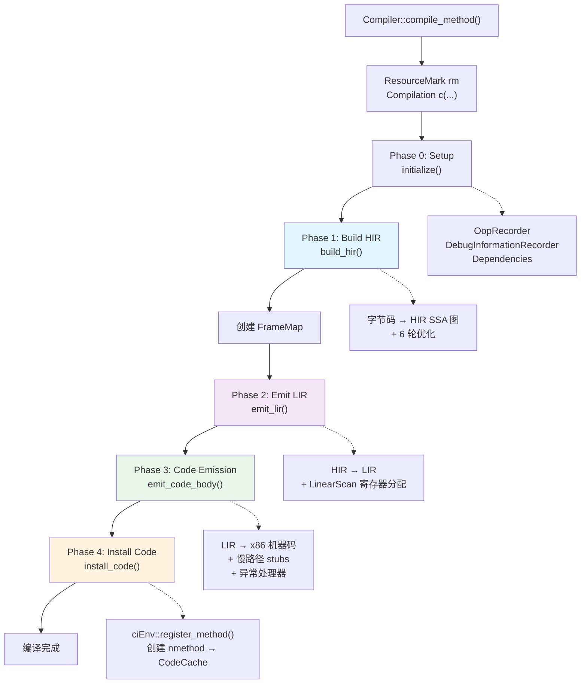
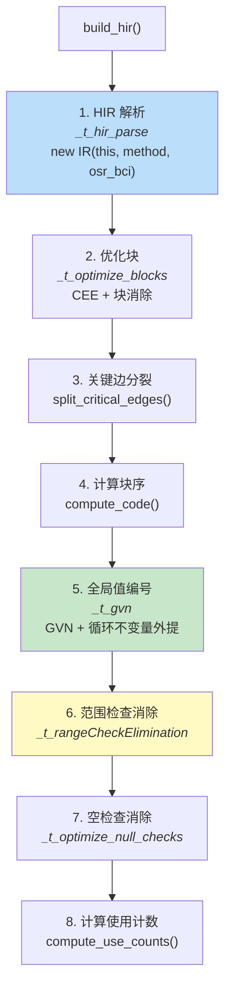
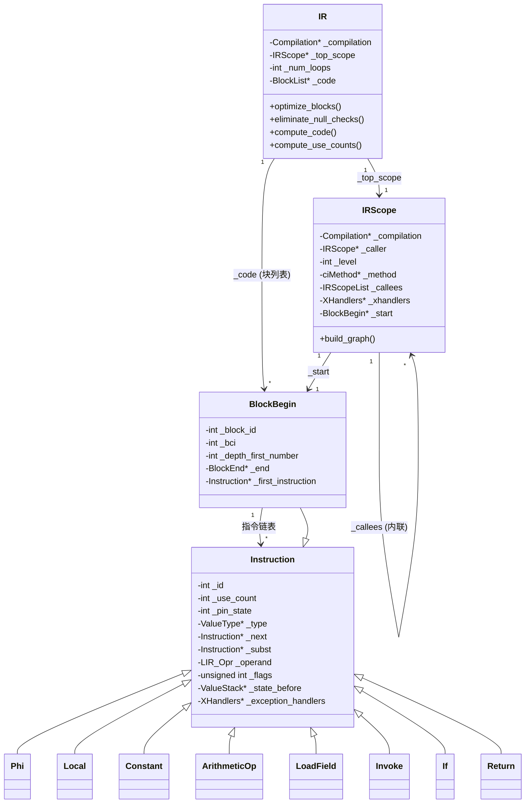
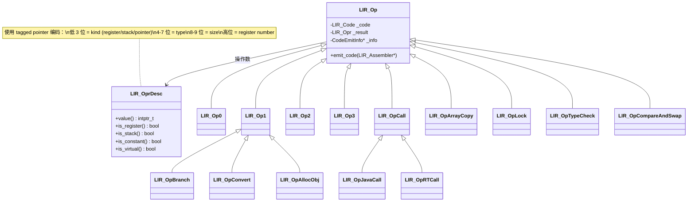

# C1 编译管道 — HIR → LIR → 机器码

> **Day 17 | Week 3: 编译系统**
>
> 源码路径：`src/hotspot/share/c1/`
>
> 标准环境：`-Xms8g -Xmx8g -XX:+UseG1GC`

---

## 第 0 部分：核心原理 ⭐

### 0.1 本质是什么？

C1 编译管道的本质是一个**5 阶段的字节码→机器码转换器**：字节码 → HIR（SSA 图）→ LIR（平台相关低级 IR）→ 机器码 → 安装到 CodeCache。整个过程由栈上的 `Compilation` 对象驱动，构造函数内完成全部编译，`ResourceMark` 保证临时对象批量释放。

### 0.2 为什么需要？

JVM 解释器执行字节码太慢，需要 JIT 编译为机器码。C1 的定位是**快速编译**（平均 ~2ms/方法），为分层编译的 L1-L3 提供服务：

- **L1**（无 profiling）：最快，适合不会被 C2 进一步优化的方法
- **L2**（limited profiling）：收集调用/回边计数
- **L3**（full profiling）：收集完整类型信息，为 C2 提供 profile 数据

C1 不做激进优化（不做逃逸分析、不做激进内联），换取编译速度。

### 0.3 怎么解决？

**三层 IR 设计**：
- **HIR**（High-level IR）：平台无关的 SSA 图，约 60 种指令类型，支持 6 轮优化（CEE/GVN/LICM/范围检查消除/空检查消除）
- **LIR**（Low-level IR）：平台相关的低级 IR，约 80 种操作码，操作数用 tagged pointer 编码（避免堆分配）
- **机器码**：`LIR_Assembler` 将 LIR 翻译为 x86 指令

**内存管理**：所有临时对象（HIR 指令、LIR 操作、Interval 等）从 `ResourceArea` arena 分配，编译结束后 `ResourceMark` 一次性批量释放，避免频繁 malloc/free。

### 0.4 为什么这样设计？

- **为什么需要 HIR 和 LIR 两层 IR？** HIR 是平台无关的，可以做平台无关的优化（GVN、范围检查消除等）；LIR 是平台相关的，方便寄存器分配和机器码生成。两层分离使优化和代码生成解耦
- **为什么 Linear Scan 而不是图着色寄存器分配？** Linear Scan 是 O(n) 的，图着色是 NP 完全的。C1 追求编译速度，Linear Scan 在质量和速度之间取得了更好的平衡
- **为什么 `Compilation` 在栈上创建？** 编译是一个完整的事务，要么成功要么 bailout，栈上对象保证了析构时的清理（`ResourceMark` 释放 arena）
- **为什么 LIR 操作数用 tagged pointer 编码？** LIR 操作数（寄存器号、栈槽、常量）数量极多，用 tagged pointer 避免了大量小对象的堆分配，减少 GC 压力

---

## 一、问题引入

上一篇分析了 CompileBroker 如何分发编译请求。当 CompileBroker 选择 C1 编译器时，调用 `Compiler::compile_method()`，但此后发生了什么？

**核心问题**：一个 Java 方法的字节码，经过 C1 编译器的哪些阶段，最终变成可执行的机器码？

**答案概览**：C1 采用经典的 **5 阶段管道**：

```
字节码 → [HIR 构建] → [HIR 优化] → [LIR 生成] → [寄存器分配] → [机器码发射] → [安装到 CodeCache]
```

---

## 二、宏观架构

### 2.1 入口与调用链

从 CompileBroker 到 C1 的完整调用链：

```
CompileBroker::invoke_compiler_on_method()
  → Compiler::compile_method(env, method, entry_bci, directive)   // c1_Compiler.cpp:238
      ResourceMark rm;                                             // ← 关键：退出时自动释放所有 Arena 内存
      Compilation c(this, env, method, entry_bci, buffer_blob, directive);  // 栈上对象
        → Compilation::Compilation()                               // 构造函数
            → Compilation::compile_method()                        // 驱动整个管道
                → initialize()                          // Phase 0: Setup
                → compile_java_method()                 // Phase 1-3
                    → build_hir()                       // Phase 1: 构建 HIR
                    → emit_lir()                        // Phase 2: 生成 LIR + 寄存器分配
                    → emit_code_body()                  // Phase 3: 发射机器码
                → install_code(frame_size)              // Phase 4: 安装到 CodeCache
```

**关键设计**：`Compilation` 对象在栈上创建（`StackObj`），构造函数内立即执行全部编译流程。`ResourceMark` 确保编译完成后，所有临时分配的 HIR/LIR 对象被批量释放。

### 2.2 阶段划分



### 2.3 时间开销统计（CITime）

使用 `-XX:TieredStopAtLevel=1 -XX:+CITime` 运行 253 个方法的编译统计：

```
C1 Compile Time:      0.596 s
   Setup time:          0.001 s  (0.2%)
   Build HIR:           0.252 s  (42.3%)
     Parse:               0.157 s  (26.3%)
     Optimize blocks:     0.083 s  (13.9%)
     GVN:                 0.011 s  (1.8%)
     Null checks elim:    0.004 s  (0.7%)
     Range checks elim:   0.024 s  (4.0%)
   Emit LIR:            0.281 s  (47.1%)
     LIR Gen:             0.026 s  (4.4%)
     Linear Scan:         0.254 s  (42.6%)  ← 最耗时
   Code Emission:       0.041 s  (6.9%)
   Code Installation:   0.019 s  (3.2%)

nmethod code size: 139,808 bytes
nmethod total size: 290,280 bytes
```

> **JVM 参数**：`-XX:+CITime` 在 JVM 退出时打印编译时间统计。

**结论**：Linear Scan 寄存器分配（42.6%）和 HIR 解析（26.3%）是 C1 编译的两大性能瓶颈。

---

## 二、核心数据结构完整分析

### 2.1 Compilation — 编译管道驱动器

```cpp
// c1_Compilation.hpp:60
class Compilation: public StackObj {
 private:
  ciEnv*          _env;              // ★ CI 环境（编译器接口，访问 JVM 内部数据）
  AbstractCompiler* _compiler;       // ★ 编译器对象（C1 Compiler 实例）
  ciMethod*       _method;           // ★ 要编译的方法
  int             _osr_bci;          // OSR 入口 BCI（-1 表示标准编译）
  IR*             _hir;              // ★ HIR 图（Phase 1 产出）
  int             _max_spills;       // 最大溢出数（Linear Scan 产出）
  FrameMap*       _frame_map;        // ★ 栈帧布局（Phase 2 前创建）
  CodeBuffer*     _code;             // ★ 机器码缓冲区（Phase 3 产出）
  CodeOffsets*    _offsets;          // 代码偏移量（入口点、异常处理器等）
  C1_MacroAssembler* _masm;          // 宏汇编器（Phase 3 使用）
  bool            _has_exception_handlers; // 是否有异常处理器
  bool            _has_fpu_code;     // 是否有浮点代码
  bool            _has_unsafe_access; // 是否有 Unsafe 访问
  const char*     _bailout_msg;      // ★ Bailout 原因（非 NULL 表示已放弃）
  ExceptionHandlerTable _exception_handler_table; // 异常处理表
  ImplicitExceptionTable _implicit_exception_table; // 隐式异常表
  Arena*          _arena;            // ★ 内存分配 arena（所有临时对象从此分配）
};
```

**sizeof(Compilation)**：约 **200 字节**（栈上对象，不含 arena 管理的临时数据）

**创建位置**：`Compiler::compile_method()` 中 `Compilation c(this, env, method, entry_bci, buffer_blob, directive)` 在栈上创建，构造函数内立即执行全部编译流程。

**关键字段生命周期**：
- `_hir`：`build_hir()` 中 `new IR(this, method, osr_bci)` 创建；`emit_lir()` 中 `LIRGenerator` 消费；编译结束后随 arena 批量释放
- `_code`：`emit_code_body()` 中 `setup_code_buffer()` 初始化；`LIR_Assembler` 填充机器码；`install_code()` 中复制到 nmethod
- `_bailout_msg`：任何阶段调用 `bailout(msg)` 时设置；后续阶段通过 `CHECK_BAILOUT()` 检查；非 NULL 时跳过后续阶段
- `_arena`：构造时从当前线程的 `ResourceArea` 获取；所有 `CompilationResourceObj` 从此分配；`ResourceMark` 析构时整体释放

### 2.2 IR — HIR 图容器

```cpp
// c1_IR.hpp:200
class IR: public CompilationResourceObj {
 private:
  Compilation*    _compilation;      // ★ 反向引用
  IRScope*        _top_scope;        // ★ 顶层作用域（方法的 IRScope）
  int             _num_loops;        // 循环数量（compute_code 后设置）
  BlockList*      _code;             // ★ 线性扫描顺序的块列表（compute_code 后设置）
};
```

**sizeof(IR)**：约 **32 字节**（4 个字段，从 arena 分配）

**创建位置**：`build_hir()` 中 `new IR(this, method, osr_bci)`，构造函数内调用 `new IRScope(...)` 触发 `GraphBuilder` 解析字节码。

**关键字段生命周期**：
- `_top_scope`：构造时创建，包含方法的所有基本块和 HIR 指令；6 轮优化在此基础上修改
- `_code`：`compute_code()` 后设置为线性扫描顺序的块列表；`LIRGenerator` 按此顺序遍历

### 2.3 Instruction — HIR 指令基类

```cpp
// c1_Instruction.hpp:200
class Instruction: public CompilationResourceObj {
 private:
  int             _id;               // ★ 指令 ID（全局递增）
  int             _use_count;        // ★ 使用计数（GVN 和 DCE 用）
  int             _pin_state;        // 是否被"钉住"（不能被移动/消除）
  ValueType*      _type;             // ★ 值类型（int/long/float/object/void 等）
  Instruction*    _next;             // ★ 块内下一条指令（链表）
  Instruction*    _subst;            // GVN 替换指针（非 NULL 时表示被替换）
  LIR_Opr         _operand;          // ★ LIR 操作数（Phase 2 后设置）
  unsigned int    _flags;            // 标志位（NullCheck/PinState 等）
  ValueStack*     _state_before;     // safepoint 前的 JVM 状态（调试信息）
  XHandlers*      _exception_handlers; // 异常处理器列表
};
```

**sizeof(Instruction)**：约 **64 字节**（基类，子类更大）

**创建位置**：`GraphBuilder` 解析字节码时，每条字节码对应创建一个或多个 `Instruction` 子类实例，从 arena 分配。

**关键字段生命周期**：
- `_use_count`：`compute_use_counts()` 中统计；GVN 替换时递减；`_use_count == 0` 的指令可被 DCE 消除
- `_operand`：Phase 1 时为 `LIR_OprFact::illegalOpr`（未分配）；`LIRGenerator` 处理后设置为虚拟寄存器；`LinearScan` 后替换为物理寄存器
- `_subst`：GVN 发现公共子表达式时设置，指向替换它的指令；`subst()` 方法递归追踪替换链

---

## 三、Phase 0: Setup — initialize()

```cpp
// c1_Compilation.cpp:130
void Compilation::initialize() {
  OopRecorder* ooprec = new OopRecorder(_env->arena());
  _env->set_oop_recorder(ooprec);
  _env->set_debug_info(new DebugInformationRecorder(ooprec));
  debug_info_recorder()->set_oopmaps(new OopMapSet());
  _env->set_dependencies(new Dependencies(_env));
}
```

创建 3 个辅助对象：

| 对象 | 作用 |
|------|------|
| `OopRecorder` | 记录编译代码中引用的 oop（对象指针），用于 GC 扫描 |
| `DebugInformationRecorder` | 记录 PC → 字节码映射（safepoint 信息），用于去优化和调试 |
| `Dependencies` | 记录编译假设（如 CHA leaf type），假设失效时触发去优化 |

---

## 四、Phase 1: Build HIR — build_hir()

这是 C1 编译管道中**最复杂的阶段**，包含字节码解析和 6 轮优化。

### 4.1 子阶段总览



### 4.2 HIR 解析：字节码 → SSA 图

核心调用链：

```
build_hir()
  → new IR(this, method, osr_bci)                    // c1_IR.cpp:268
    → new IRScope(compilation, NULL, -1, method, osr_bci, true)  // c1_IR.cpp:134
      → build_graph(compilation, osr_bci)             // c1_IR.cpp:126
        → GraphBuilder gm(compilation, this)          // c1_GraphBuilder.cpp
```

`GraphBuilder` 是字节码到 HIR 的核心转换器。它：

1. **第一遍**（`BlockListBuilder`）：扫描字节码，识别基本块边界（分支目标、异常处理器、循环头）
2. **第二遍**（`GraphBuilder` 主循环）：逐条字节码翻译，模拟 JVM 操作数栈（`ValueStack`），创建 SSA 形式的 HIR 指令

每条字节码都有对应的处理方法：

| 字节码类别 | GraphBuilder 方法 | 生成的 HIR 指令 |
|-----------|------------------|----------------|
| `iload/aload/...` | `load_local()` | `Local` |
| `iadd/isub/...` | `arithmetic_op()` | `ArithmeticOp` |
| `getfield/putfield` | `access_field()` | `LoadField/StoreField` |
| `aaload/iaload` | `load_indexed()` | `LoadIndexed` |
| `invokevirtual/static` | `invoke()` | `Invoke` |
| `new` | `new_instance()` | `NewInstance` |
| `if_icmp*` | `if_node()` | `If` |
| `ireturn/areturn` | `method_return()` | `Return` |
| `athrow` | `throw_op()` | `Throw` |
| `monitorenter` | `monitor_enter()` | `MonitorEnter` |
| `checkcast` | `check_cast()` | `CheckCast` |

### 4.3 HIR 数据结构



**Instruction 类继承体系**（约 60 个具体类）：

```
Instruction (base)
├── Phi                    // SSA φ 函数
├── Local                  // 局部变量引用
├── Constant               // 常量值
├── AccessField
│   ├── LoadField          // getfield
│   └── StoreField         // putfield
├── AccessArray
│   ├── ArrayLength        // arraylength
│   └── AccessIndexed
│       ├── LoadIndexed    // aaload/iaload/...
│       └── StoreIndexed   // aastore/iastore/...
├── Op2
│   ├── ArithmeticOp       // iadd/isub/imul/idiv/...
│   ├── ShiftOp            // ishl/ishr/iushr
│   ├── LogicOp            // iand/ior/ixor
│   ├── CompareOp          // lcmp/fcmpl/dcmpg
│   └── IfOp               // 条件选择表达式
├── Convert                // i2l/l2i/i2f/...
├── NullCheck              // 空指针检查
├── StateSplit
│   ├── Invoke             // invokevirtual/static/interface/special
│   ├── NewInstance        // new
│   ├── NewTypeArray       // newarray
│   ├── NewObjectArray     // anewarray
│   ├── CheckCast          // checkcast
│   ├── InstanceOf         // instanceof
│   ├── MonitorEnter       // monitorenter
│   └── MonitorExit        // monitorexit
├── Intrinsic              // 内建函数
├── BlockBegin             // 基本块入口（也是 Instruction）
├── BlockEnd
│   ├── Goto               // goto
│   ├── If                 // if_icmp*/ifnull/...
│   ├── TableSwitch        // tableswitch
│   ├── LookupSwitch       // lookupswitch
│   ├── Return             // ireturn/areturn/return
│   ├── Throw              // athrow
│   └── Base               // 方法入口伪指令
├── UnsafeOp               // Unsafe.getInt/putInt/CAS/...
├── ProfileCall            // 方法调用 profiling
└── MemBar                 // 内存屏障
```

### 4.4 HIR 优化（6 轮）

#### 优化 1：条件表达式消除（CEE）

**条件**：`UseC1Optimizations && DoCEE && !profile_branches()`

将 if-then-else 菱形模式转为条件移动（cmov）：

```
// 优化前：                        // 优化后：
B1: if (cond) goto B2 else B3     B1: result = cmove(cond, val1, val2)
B2: result = val1; goto B4             goto B4
B3: result = val2; goto B4
B4: φ(result)
```

实现类：`CE_Eliminator`（`c1_Optimizer.cpp`）

#### 优化 2：块消除

**条件**：`UseC1Optimizations && EliminateBlocks`

移除空的/不可达的基本块，简化控制流图。

#### 优化 3：关键边分裂

无条件执行。在"多后继 → 多前驱"的边上插入空块，确保 φ 函数和寄存器分配的正确性。

```
// 关键边示例：
// B1 有 2 个后继(B3, B4)，B3 有 2 个前驱(B1, B2)
// B1→B3 是关键边，需要分裂：B1→B_new→B3
```

#### 优化 4：全局值编号（GVN）

**条件**：`UseGlobalValueNumbering`

- **公共子表达式消除**：发现两个计算结果相同的指令，用一个替代另一个
- **循环不变量代码外提**（LICM）：将循环中不变的计算移到循环外

实现类：`GlobalValueNumbering`（`c1_ValueMap.hpp/cpp`），使用哈希表进行值编号。

#### 优化 5：范围检查消除

**条件**：`RangeCheckElimination && !osr_compile()`

对能证明安全的数组访问，删除边界检查。实现类：`RangeCheckElimination`（`c1_RangeCheckElimination.cpp`）。

#### 优化 6：空检查消除

**条件**：`UseC1Optimizations && EliminateNullChecks`

已经证明非空的引用，删除冗余的空检查。

### 4.5 compute_code() — 计算块的线性序

优化完成后，调用 `compute_code()` → `ComputeLinearScanOrder`：

```
count_edges() → mark_loops() → assign_loop_depth() → compute_order() → compute_dominators()
```

产出是一个按线性扫描顺序排列的 `BlockList*`（`_code`），后续 LIR 生成和代码发射都按此顺序遍历。

---

## 五、Phase 2: Emit LIR — emit_lir()

LIR 阶段将平台无关的 HIR 转为平台相关的低级 IR，然后执行寄存器分配。

### 5.1 两个子阶段

```cpp
// c1_Compilation.cpp:253
void Compilation::emit_lir() {
  LIRGenerator gen(this, method());
  {
    PhaseTraceTime timeit(_t_lirGeneration);
    hir()->iterate_linear_scan_order(&gen);       // (1) HIR → LIR
  }
  {
    PhaseTraceTime timeit(_t_linearScan);
    LinearScan* allocator = new LinearScan(hir(), &gen, frame_map());
    allocator->do_linear_scan();                   // (2) 寄存器分配
    _max_spills = allocator->max_spills();
  }
}
```

### 5.2 LIR 生成（LIRGenerator）

`LIRGenerator` 继承自 `InstructionVisitor` 和 `BlockClosure`：

- 作为 `BlockClosure`：`block_do(BlockBegin* block)` 被每个块调用
- 作为 `InstructionVisitor`：对每个 HIR 指令调用对应的 `do_X()` 方法

| HIR 指令 | LIRGenerator 方法 | 生成的 LIR 操作 |
|----------|-------------------|----------------|
| `ArithmeticOp` | `do_ArithmeticOp()` | `lir_add/lir_sub/lir_mul/lir_div` |
| `LoadField` | `do_LoadField()` | `lir_move` (内存→寄存器) |
| `StoreField` | `do_StoreField()` | `lir_move` (寄存器→内存) |
| `Invoke` | `do_Invoke()` | `lir_static_call/lir_virtual_call` |
| `NewInstance` | `do_NewInstance()` | `lir_alloc_object` |
| `If` | `do_If()` | `lir_cmp` + `lir_branch` |
| `Return` | `do_Return()` | `lir_return` |
| `NullCheck` | `do_NullCheck()` | `lir_null_check` |
| `MonitorEnter` | `do_MonitorEnter()` | `lir_lock` |
| `CheckCast` | `do_CheckCast()` | `lir_checkcast` |
| `Intrinsic` | `do_Intrinsic()` | 取决于具体内建函数 |

### 5.3 LIR 数据结构



**LIR_OprDesc（操作数描述符）** 的巧妙设计：

不是普通的对象，而是一个编码为指针的整数。通过位域打包寄存器号、类型、大小等信息到指针值中：

```
[31 .............. 14|13  12|11 10|9  8|7 6 5 4|3 2 1|0]
     register data   |is_xmm|virt |size|  type |kind |ptr
```

- `kind = 1`（stack）, `3`（cpu_register）, `5`（fpu_register）, `0`（pointer → 指向 `LIR_OprPtr`）
- 当 `kind = 0`（pointer bit cleared）时，才是真正的对象指针（指向 `LIR_Const` 或 `LIR_Address`）
- 其他情况下，`this` 指针本身就是编码值，不指向任何堆内存

**LIR_Code 枚举**（约 80 个操作码），按类别分组：

| 类别 | 操作码 |
|------|--------|
| Op0 | `lir_label`, `lir_std_entry`, `lir_build_frame`, `lir_membar_*`, `lir_get_thread` |
| Op1 | `lir_move`, `lir_return`, `lir_branch`, `lir_convert`, `lir_null_check`, `lir_safepoint`, `lir_alloc_object` |
| Op2 | `lir_cmp`, `lir_add`, `lir_sub`, `lir_mul`, `lir_div`, `lir_shl`, `lir_shr`, `lir_logic_and/or/xor`, `lir_throw` |
| Op3 | `lir_idiv`, `lir_irem`, `lir_fmad/f` |
| Call | `lir_static_call`, `lir_virtual_call`, `lir_icvirtual_call`, `lir_dynamic_call` |
| TypeCheck | `lir_instanceof`, `lir_checkcast`, `lir_store_check` |
| Lock | `lir_lock`, `lir_unlock` |
| CAS | `lir_cas_long`, `lir_cas_obj`, `lir_cas_int` |

### 5.4 Linear Scan 寄存器分配

这是 C1 中**最大的组件**（`c1_LinearScan.cpp` 有 251KB），也是**最耗时的阶段**（占 42.6%）。

核心算法：

1. **计算活跃区间**：对每个虚拟寄存器计算活跃范围 [from, to]
2. **构建 intervals**：每个虚拟寄存器一个 `Interval` 对象
3. **按起始位置排序**
4. **线性扫描**：从前到后遍历，为每个 interval 分配物理寄存器或溢出到栈

```
do_linear_scan() 流程：
  number_instructions()        → 给每个 LIR 指令编号
  compute_local_live_sets()    → 计算每个块的 live_gen/live_kill
  compute_global_live_sets()   → 数据流分析计算 live_in/live_out
  build_intervals()            → 从活跃信息构建 intervals
  sort_intervals_before_allocation()
  allocate_registers()         → 核心分配算法
  resolve_data_flow()          → 在块边界插入 move
  resolve_exception_handlers() → 异常处理器的寄存器状态
  eliminate_spill_moves()      → 消除冗余溢出
  assign_reg_num()             → 虚拟寄存器 → 物理寄存器编号
```

---

## 六、Phase 3: Code Emission — emit_code_body()

将 LIR 翻译为目标平台的机器码。

### 6.1 流程

```cpp
// c1_Compilation.cpp:340
int Compilation::emit_code_body() {
  setup_code_buffer(code(), allocator()->num_calls());  // (1) 初始化 CodeBuffer
  code()->initialize_oop_recorder(env()->oop_recorder());

  _masm = new C1_MacroAssembler(code());                // (2) 创建 MacroAssembler
  _masm->set_oop_recorder(env()->oop_recorder());

  LIR_Assembler lir_asm(this);                          // (3) 创建 LIR 汇编器
  lir_asm.emit_code(hir()->code());                     // (4) 遍历块，逐条 LIR → 机器码

  emit_code_epilog(&lir_asm);                           // (5) 发射收尾代码
  generate_exception_handler_table();                    // (6) 构建异常处理表

  return frame_map()->framesize();
}
```

### 6.2 LIR_Assembler

`LIR_Assembler`（`c1_LIRAssembler.hpp/cpp` + `c1_LIRAssembler_x86.cpp`）是 LIR→机器码的最后一跳：

- `emit_code(BlockList* hir)` → 遍历每个块
  - `emit_block(BlockBegin* block)` → 遍历块内的 LIR 列表
    - `emit_lir_list(LIR_List* list)` → 遍历每条 LIR 指令
      - 根据 `LIR_Code` 分发到具体的发射函数

| LIR 操作 | 发射函数 | 生成的 x86 指令 |
|----------|---------|---------------|
| `lir_move` | `move_op()` → `reg2reg/reg2stack/stack2reg/mem2reg/...` | `movq`, `movl`, `movsd`, ... |
| `lir_add` | `arith_op()` | `addl`, `addq` |
| `lir_cmp` | `comp_op()` | `cmpl`, `cmpq` |
| `lir_branch` | `emit_opBranch()` | `je`, `jne`, `jl`, `jg`, ... |
| `lir_static_call` | `emit_static_call_stub()` + `call` | `call [addr]` |
| `lir_null_check` | `emit_op1()` | `testl [reg], reg` (隐式异常) |
| `lir_alloc_object` | `emit_alloc_obj()` | TLAB 快速路径 / Runtime1 stub 调用 |
| `lir_build_frame` | `build_frame()` | `push rbp; sub rsp, frame_size` |
| `lir_return` | `return_op()` | `add rsp, frame_size; pop rbp; ret` |

x86 特定的发射代码在 `c1_LIRAssembler_x86.cpp`（137KB）中，是 C1 中第三大文件。

### 6.3 收尾代码（emit_code_epilog）

```cpp
// c1_Compilation.cpp:285
void Compilation::emit_code_epilog(LIR_Assembler* assembler) {
  assembler->emit_slow_case_stubs();         // 慢路径 stub 代码
  assembler->emit_exception_entries(...);     // 异常适配器
  code_offsets->set_value(CodeOffsets::Exceptions, assembler->emit_exception_handler());
  code_offsets->set_value(CodeOffsets::Deopt, assembler->emit_deopt_handler());
  offsets()->set_value(CodeOffsets::UnwindHandler, assembler->emit_unwind_handler());
  masm()->flush();                           // 刷新 CodeBuffer
}
```

这里生成的不是主线代码，而是**异常处理和去优化**的入口点，它们的 PC 偏移量记录在 `CodeOffsets` 中，安装到 nmethod 后，运行时可以根据偏移跳转。

---

## 七、Phase 4: Install Code — install_code()

```cpp
// c1_Compilation.cpp:408
void Compilation::install_code(int frame_size) {
  _env->register_method(
    method(), osr_bci(), &_offsets,
    in_bytes(_frame_map->sp_offset_for_orig_pc()),
    code(),
    in_bytes(frame_map()->framesize_in_bytes()) / sizeof(intptr_t),
    debug_info_recorder()->_oopmaps,
    exception_handler_table(),
    implicit_exception_table(),
    compiler(),
    has_unsafe_access(),
    SharedRuntime::is_wide_vector(max_vector_size())
  );
}
```

`ciEnv::register_method()` 执行：

1. 创建 `nmethod` 对象（从 CodeCache 分配）
2. 将机器码、OopMap、异常表、调试信息复制到 nmethod
3. 将 nmethod 安装到 `Method::_code` 字段
4. 后续解释器再调用该方法时，发现有编译代码，直接跳转执行

---

## 八、内存管理：CompilationResourceObj

C1 的所有临时对象（HIR 指令、LIR 操作、Interval 等）都继承自 `CompilationResourceObj`：

```cpp
// c1_Compilation.hpp:323
class CompilationResourceObj ALLOCATION_SUPER_CLASS_SPEC {
 public:
  void* operator new(size_t size) throw() {
    return Compilation::current()->arena()->Amalloc(size);
  }
  void  operator delete(void* p) {} // nothing to do — 不释放单个对象
};
```

分配策略：
- 所有对象从 `Compilation::_arena` 分配（即当前线程的 `ResourceArea`）
- `operator delete` 是空操作 — 不逐个释放
- 当 `Compiler::compile_method()` 中的 `ResourceMark rm` 销毁时，整个 arena 区域**一次性回收**

这种"Arena + 批量释放"模式是编译器的经典设计，避免了大量临时对象的 malloc/free 开销。

---

## 九、Bailout 机制

任何阶段都可以通过 `bailout(msg)` 放弃编译：

```cpp
// c1_Compilation.cpp:620
void Compilation::bailout(const char* msg) {
  if (!bailed_out()) {
    if (PrintCompilation || PrintBailouts) tty->print_cr("compilation bailout: %s", msg);
    _bailout_msg = msg;
  }
}
```

后续阶段通过 `CHECK_BAILOUT()` 宏检查：

```cpp
#define CHECK_BAILOUT()  { if (bailed_out()) return; }
```

Bailout 后，构造函数中会调用 `_env->record_method_not_compilable()`，阻止对该方法的再次编译。

---

## 十、关键源文件清单

### 平台无关（`share/c1/`）

| 文件 | 大小 | 职责 |
|------|------|------|
| `c1_Compiler.cpp/hpp` | 10K | C1 入口，`compile_method()` |
| `c1_Compilation.cpp/hpp` | 28K | 编译管道编排，5 阶段驱动 |
| `c1_GraphBuilder.cpp/hpp` | 168K | **最核心**：字节码 → HIR |
| `c1_IR.cpp/hpp` | 58K | IR/IRScope/XHandler/BlockOrdering |
| `c1_Instruction.hpp` | 100K+ | HIR 指令类层次（~60 类） |
| `c1_LIR.hpp/cpp` | 80K | LIR 操作码/操作数/LIR_List |
| `c1_LIRGenerator.cpp/hpp` | 128K | HIR → LIR 翻译 |
| `c1_LinearScan.cpp/hpp` | **251K** | **最大文件**：寄存器分配 |
| `c1_LIRAssembler.cpp/hpp` | 10K | LIR 发射框架 |
| `c1_Optimizer.cpp/hpp` | 30K | CEE/块消除/空检查消除 |
| `c1_ValueMap.cpp/hpp` | 15K | GVN 哈希表 |
| `c1_RangeCheckElimination.cpp/hpp` | 30K | 范围检查消除 |
| `c1_Runtime1.cpp/hpp` | 40K | C1 运行时 stub（Runtime1） |

### x86 平台相关（`cpu/x86/`）

| 文件 | 大小 | 职责 |
|------|------|------|
| `c1_LIRAssembler_x86.cpp` | **137K** | LIR → x86 机器码 |
| `c1_LIRGenerator_x86.cpp` | 20K | 平台特定 LIR 生成 |
| `c1_LinearScan_x86.cpp` | 5K | 平台特定寄存器信息 |
| `c1_MacroAssembler_x86.cpp` | 30K | C1 宏汇编器 |
| `c1_Runtime1_x86.cpp` | 50K | Runtime1 stub 生成 |

总计：**67 个文件**（49 平台无关 + 18 x86 特定）。

---

## 十一、GDB 验证

### 11.1 验证脚本

脚本路径：`new-jvm-md/tmp-file/c1-pipeline/verify-c1-phases.gdb`

在以下关键函数设断点：
- `Compilation::Compilation` — 编译开始
- `Compilation::compile_method` — 管道驱动
- `Compilation::build_hir` — Phase 1
- `IR::IR` — HIR 构建
- `GraphBuilder::GraphBuilder` — 字节码解析
- `Compilation::emit_lir` — Phase 2
- `LIRGenerator::block_do` — LIR 生成（逐块）
- `LinearScan::do_linear_scan` — 寄存器分配
- `Compilation::emit_code_body` — Phase 3
- `LIR_Assembler::emit_code` — 机器码发射
- `Compilation::install_code` — Phase 4

### 11.2 验证结果

捕获 3 个方法的编译流程，均完整走过 5 阶段：

```
====== C1 COMPILATION #1 ======
  method:  java.util.concurrent.ConcurrentHashMap::tabAt
  entry_bci=-1, comp_level=1
[C1-COMPILE] Compilation::compile_method() entered
[BUILD-HIR] build_hir() entered
[IR] IR constructor: compilation=0x7fffc20fe530, osr_bci=-1
[GRAPH-BUILDER] GraphBuilder constructor entered
[EMIT-LIR] emit_lir() entered
[LIR-GEN] block_do: block=0x7ffff0dfb630, block_id=3
[LIR-GEN] block_do: block=0x7ffff0dfb8a0, block_id=4
[LIR-GEN] block_do: block=0x7ffff0df9100, block_id=0
[LINEAR-SCAN] do_linear_scan() entered
[CODE-EMIT] emit_code_body() entered
[LIR-ASM] emit_code: generating machine code from 3 blocks
[INSTALL] install_code(frame_size=32) entered

====== C1 COMPILATION #2 ======
  method:  jdk.internal.misc.Unsafe::getObjectAcquire
  entry_bci=-1, comp_level=1
[C1-COMPILE] Compilation::compile_method() entered
[BUILD-HIR] build_hir() entered
[IR] IR constructor: ...
[GRAPH-BUILDER] GraphBuilder constructor entered
[EMIT-LIR] emit_lir() entered
[LIR-GEN] block_do: block=..., block_id=3
[LIR-GEN] block_do: block=..., block_id=4
[LIR-GEN] block_do: block=..., block_id=0
[LINEAR-SCAN] do_linear_scan() entered
[CODE-EMIT] emit_code_body() entered
[LIR-ASM] emit_code: generating machine code from 3 blocks
[INSTALL] install_code(frame_size=16) entered

====== C1 COMPILATION #3 ======
  method:  java.lang.Object::<init>
  entry_bci=-1, comp_level=1
... (同样 5 阶段完整执行)
[INSTALL] install_code(frame_size=16) entered
```

**验证确认**：每次编译都严格按照 `compile_method → build_hir → [IR → GraphBuilder] → emit_lir → [LIRGenerator × N_blocks → LinearScan] → emit_code_body → [LIR_Assembler] → install_code` 的顺序执行。

---

## 十二、JVM 参数参考

| 参数 | 作用 | 示例输出 |
|------|------|---------|
| `-XX:+CITime` | JVM 退出时打印编译时间统计 | `C1 Compile Time: 0.596 s` |
| `-XX:+CITimeEach` | 每次编译打印耗时 | `compile 3.2ms method=...` |
| `-XX:+PrintCompilation` | 打印每次编译的方法名和等级 | `42   1     java.lang.Object::<init> (1 bytes)` |
| `-XX:+PrintCFG` | 打印控制流图（所有阶段） | HIR 块结构 |
| `-XX:+PrintCFG0` | 打印解析后的 CFG | |
| `-XX:+PrintCFG1` | 打印优化后的 CFG | |
| `-XX:+PrintCFG2` | 打印代码生成前的 CFG | |
| `-XX:+PrintIR` | 打印 HIR 指令（所有阶段） | HIR 指令列表 |
| `-XX:+PrintIR0` | 打印解析后的 HIR | |
| `-XX:+PrintIR1` | 打印优化后的 HIR | |
| `-XX:+PrintIR2` | 打印代码生成前的 HIR | |
| `-XX:+PrintLIR` | 打印 LIR 指令 | LIR 操作列表 |
| `-XX:+PrintCFGToFile` | HIR/CFG 输出到文件 | 可用 [c1visualizer](https://github.com/nicokosi/c1visualizer) 查看 |
| `-XX:TieredStopAtLevel=1` | 只使用 C1 编译（禁用 C2） | |
| `-XX:+PrintBailouts` | 打印编译放弃的原因 | `compilation bailout: ...` |
| `-XX:+BailoutAfterHIR` | HIR 构建后强制放弃（调试用） | |
| `-XX:+BailoutAfterLIR` | LIR 生成后强制放弃（调试用） | |

> **注意**：`PrintCFG`/`PrintIR`/`PrintLIR` 等是 debug 构建专用参数（需要 `slowdebug` 或 `fastdebug` 构建）。

---

## 十三、总结

### C1 编译管道核心要点

1. **5 阶段管道**：Setup → Build HIR → Emit LIR → Code Emission → Install Code
2. **Compilation 对象**：栈上创建，构造函数内驱动全部流程，ResourceMark 保证内存自动回收
3. **HIR（高级 IR）**：SSA 形式，约 60 种指令类型，6 轮优化（CEE、块消除、关键边分裂、GVN+LICM、范围检查消除、空检查消除）
4. **LIR（低级 IR）**：平台相关，约 80 种操作码，操作数用 tagged pointer 编码
5. **Linear Scan**：C1 最大最耗时的组件，251KB 源码，占编译时间 42.6%
6. **内存管理**：所有编译临时对象继承 `CompilationResourceObj`，从 arena 分配，编译结束批量释放
7. **Bailout 机制**：任何阶段可放弃编译，后续阶段通过 `CHECK_BAILOUT()` 跳过

### C1 vs C2 设计哲学

- **C1 追求编译速度**：快速生成"还行"的代码，延迟低（平均 ~2ms/method）
- **C2 追求代码质量**：大量优化（escape analysis、inlining、IGVN），延迟高但生成最优代码
- 分层编译中，C1 负责"先跑起来"，C2 负责"跑得快"
