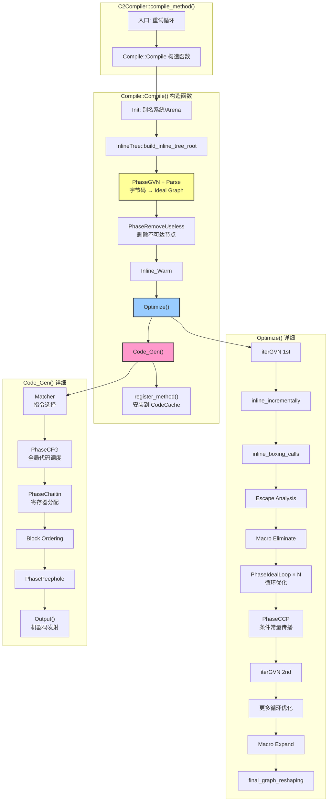
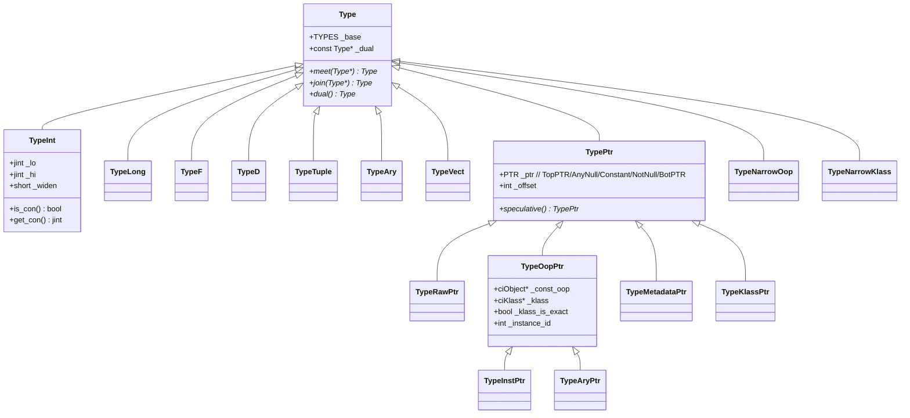
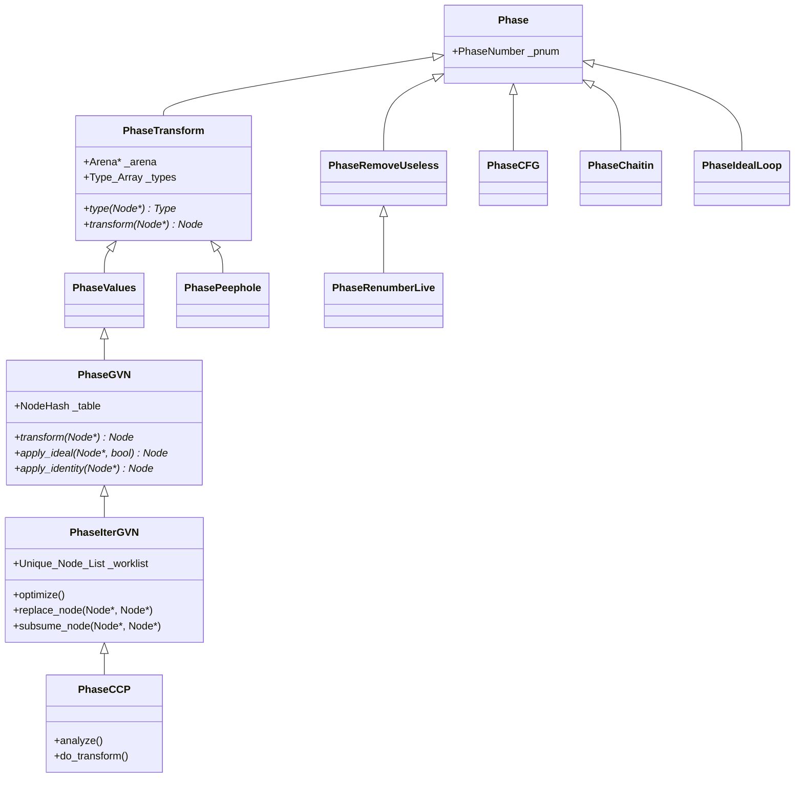

# Day 18: C2 Ideal Graph — Sea-of-Nodes 架构

> 源码路径：`src/hotspot/share/opto/`
> 标准环境：`-Xms8g -Xmx8g -XX:+UseG1GC`，G1 Region = 4MB
> 编译器：C2（Server Compiler），又称 "opto"

---

## 第 0 部分：核心原理 ⭐

### 0.1 本质是什么？

C2 Ideal Graph 的本质是一个**统一控制流与数据流的有向图（Sea-of-Nodes）**：每个 `Node` 既可以是数据节点（如 `AddI`）也可以是控制节点（如 `If`），通过 `_in[]`（use-def）和 `_out[]`（def-use）双向边连接，所有优化 pass 都在这个图上原地变换，直到收敛后再由后端提取 CFG 生成机器码。

### 0.2 为什么需要？

传统编译器（如 C1）把控制流（CFG）和数据流（指令序列）分开表示，导致：

- **代码移动受限**：LICM（循环不变量外提）需要同时修改 CFG 和指令序列，实现复杂
- **GVN 受限**：跨基本块的公共子表达式消除需要额外的 dominator 分析
- **调度固化过早**：指令一旦放入基本块，调度灵活性就降低了

C2 需要做深度优化（逃逸分析、循环向量化、条件常量传播），这些优化都需要在统一的图上自由变换节点。

### 0.3 怎么解决？

**Sea-of-Nodes 统一图**：
- 控制边（`in(0)`）和数据边（`in(N)`）都是 `Node*` 指针，统一管理
- 节点没有固定的"基本块归属"，调度推迟到后端 `PhaseCFG` 才决定
- 三个核心虚函数（`Value`/`Identity`/`Ideal`）驱动迭代优化，直到不动点

**Type 格（Lattice）**：为每个节点维护精确的类型信息（如 `TypeInt[0..100]`），`meet`/`join` 操作支持迭代收敛，`widen` 防止无限迭代。

**Arena 分配**：所有 `Node` 和 `Type` 从 `Compile::node_arena()` 分配，编译完成后整体释放，避免频繁 malloc/free。

### 0.4 为什么这样设计？

- **为什么控制流和数据流统一？** 统一后，代码移动（LICM/GCM）只需改一条边，不需要同时修改 CFG 和指令序列；GVN 可以跨"基本块"消除冗余
- **为什么用 `_in[]`/`_out[]` 双向边？** 优化时需要从两个方向遍历图：`_in[]` 用于"我依赖谁"（use-def），`_out[]` 用于"谁依赖我"（def-use，用于替换节点时通知所有使用者）
- **为什么用位编码 `_class_id` 而不是 `dynamic_cast`？** `is_Call()`/`is_Load()` 等类型检查在优化循环中极其频繁，位编码 AND 操作比虚函数调用快 10 倍以上
- **为什么 `Type` 用 hash-cons？** 相同类型只存一个实例，类型比较退化为指针比较（`==`），大幅加速 GVN 的 hash 查找

---

## 一、问题引入

C1 编译器虽然快，但优化能力有限（没有循环优化、逃逸分析等）。对于热点方法，JVM 需要一个能做**深度优化**的编译器 —— C2。

C2 的核心思想是 **Sea-of-Nodes（节点之海）**：把控制流和数据流统一表示为一个大图（Ideal Graph），然后在这个图上反复应用各种优化 pass，直到收敛。

**核心问题**：
1. Sea-of-Nodes 是什么？为什么控制和数据要统一？
2. Node 是怎么表示的？输入输出边如何管理？
3. Type 格在 C2 中起什么作用？
4. 整个 C2 编译管道是怎么组织的？

---

## 二、宏观架构

### 2.1 C2 编译全流程



### 2.2 CITime 统计（62 个 C2 编译方法，`-XX:-TieredCompilation`）

```
C2 Compile Time:        1.101 s
   Parse:                 0.168 s  (15.3%)  ← 字节码 → Ideal Graph
   Optimize:              0.381 s  (34.6%)  ← 图上优化
     GVN 1:                 0.035 s
     IdealLoop:             0.224 s  ← 循环优化占最大
     Cond Const Prop:       0.003 s
     GVN 2:                 0.003 s
     Escape Analysis:       0.006 s
     Macro Expand:          0.010 s
     Graph Reshape:         0.006 s
   Matcher:               0.056 s  (5.1%)   ← Ideal → Machine 节点
   Scheduler:             0.072 s  (6.5%)   ← 全局代码调度
   Regalloc:              0.385 s  (35.0%)  ← 寄存器分配（最耗时）
     Build IFG (phys):      0.149 s
     Compute Liveness:      0.098 s
     Postalloc Copy Rem:    0.042 s
     Regalloc Split:        0.031 s
   Block Ordering:        0.004 s
   Peephole:              0.000 s
   Code Emission:         0.060 s  (5.4%)
   Code Installation:     0.005 s
```

**关键发现**：
- **寄存器分配**（35.0%）和**优化**（34.6%）各占三分之一
- 循环优化（IdealLoop）是 Optimize 中最耗时的子阶段（0.224s / 0.381s = 58.8%）
- Parse 只占 15.3%，说明大部分时间花在图优化和后端

**JVM 参数**：`-XX:+CITime` 可输出上述统计。`-XX:-TieredCompilation` 禁用分层编译，直接使用 C2。

### 2.3 C2 重试机制

C2 编译有一个独特的**渐进式降级重试**机制（`c2compiler.cpp:103`）：

```
第 1 次尝试：全部优化开启
    ↓ 失败
第 2 次尝试：关闭 subsume_loads
    ↓ 失败
第 3 次尝试：关闭 escape_analysis
    ↓ 失败
第 4 次尝试：关闭 locks_coarsening
    ↓ 失败
第 5 次尝试：关闭 eliminate_boxing
    ↓ 仍失败 → 放弃
```

这意味着，如果你看到某个方法编译失败后又成功了，可能是关闭了某些优化后重试成功的。

---

## 三、Sea-of-Nodes 核心概念

### 3.1 为什么要 Sea-of-Nodes？

传统编译器的 IR（如 C1 的 HIR/LIR）把**控制流**和**数据流**分开表示：
- 控制流：基本块图 + CFG
- 数据流：每个基本块内部的指令序列

Sea-of-Nodes 的做法不同：**控制和数据统一表示在一个图中**，每个节点既可以是数据节点，也可以是控制节点，区分仅靠节点类型。

**好处**：
1. **不需要维护基本块结构** —— 优化可以自由移动节点
2. **代码移动更自然** —— 比如 LICM（循环不变量外提）只需要改一条控制边
3. **GVN 更强大** —— 可以跨基本块消除冗余计算
4. **调度灵活** —— 节点的具体执行顺序推迟到后端决定

**代价**：
- 图结构更复杂，需要特殊的边管理
- Debug 和可视化更困难（推荐使用 `-XX:+PrintIdealGraphLevel=N -XX:PrintIdealGraphFile=ideal.xml` + IGV 工具）

### 3.2 图中的"五条线"

C2 Ideal Graph 中有五种概念上的"流"，都用 Node 的输入边表示：

| 输入位置 | 含义 | 说明 |
|---------|------|------|
| `in(0)` | **Control** | 这个节点受哪个控制流控制 |
| `in(1)` | **Memory** | 对于 Load/Store，指向内存状态 |
| `in(2)` | **I/O** | 外部 I/O 状态（如 System.out.println） |
| `in(N)` | **Data** | 数据依赖（操作数） |
| `in(N)` | **Precedence** | 调度顺序依赖（`req()` 之后的边） |

### 3.3 图的特殊节点

```
Root         ← 图的唯一出口，所有 Return/Rethrow 的汇聚点
Start        ← 图的唯一入口，产出 Control/Memory/I_O/参数
Con          ← 常量节点（ConI/ConL/ConP/ConF/ConD）
Top          ← 不可达（⊤），类似于"死代码标记"
Region       ← 控制流合并点（基本块头）
Phi          ← Region 的数据合并（对应控制流的 merge）
If           ← 条件分支（产出 IfTrue + IfFalse 两个 Proj）
```

---

## 四、Node 类详解

### 4.1 Node 类核心字段

```cpp
// src/hotspot/share/opto/node.hpp:200
class Node {
 public:
  Node**         _in;          // ★ use-def 输入边数组（Arena 分配）
  Node**         _out;         // ★ def-use 输出边数组（Arena 分配）
  node_idx_t     _cnt;         // ★ required 输入数量（语义上必需的边数）
  node_idx_t     _max;         // 输入数组实际容量（>= _cnt）
  node_idx_t     _outcnt;      // ★ 输出边数量（有多少节点使用本节点）
  node_idx_t     _outmax;      // 输出数组实际容量（>= _outcnt）
  const node_idx_t _idx;       // ★ 全局唯一密集索引（Arena 分配时递增）
  juint          _class_id;    // ★ 位编码类型 ID（快速 is_X() 检查）
  jushort        _flags;       // 节点标志位（Flag_is_dead/Flag_is_Copy 等）
};
```

**sizeof(Node)**：**~56 字节**（GDB 验证：`p sizeof(Node)` = 56；vtable 8B + 6×8B 指针/数组 + 4×4B 整数 + 对齐）

**创建位置**：`Node::operator new` 从 `Compile::current()->node_arena()->Amalloc_D(x)` 分配；`operator delete` 是空操作（Arena 整体释放）。

**关键字段生命周期**：
- `_in[]`/`_cnt`：构造函数中 `init_req(i, n)` 初始化；`set_req(i, n)` 修改时自动维护 `_out[]` 反向边；优化 pass 中频繁修改
- `_out[]`/`_outcnt`：`add_out(n)` 时追加；`del_out(n)` 时移除；`set_req()` 自动调用这两个方法维护双向一致性
- `_idx`：`Compile::next_unique()` 原子递增分配，构造时设置，之后不变；用于 `Type_Array` 的下标索引
- `_class_id`：构造时由 `DEFINE_CLASS_ID` 宏设置，之后不变；`is_Call()`/`is_Load()` 等通过 AND 操作检查
- `_flags`：`Flag_is_dead` 在 `PhaseIterGVN::replace_node()` 时设置；`Flag_is_Copy` 在 `Identity()` 返回非自身时设置

### 4.2 Arena 分配 —— 不需要 delete

Node 的 `operator new` 从 `Compile::node_arena()` 分配：

```cpp
// node.hpp:231
inline void* operator new(size_t x) throw() {
    Compile* C = Compile::current();
    Node* n = (Node*)C->node_arena()->Amalloc_D(x);
    return (void*)n;
}

// operator delete 是空操作
void operator delete(void *ptr) {}
```

**关键设计**：
- 所有 Node 都在同一个 Arena 中分配，编译完成后**整体释放**
- 不需要逐个 delete —— Arena::destruct() 会一次性回收
- 这是 C2 能快速创建/销毁大量 Node 的关键

### 4.3 边的管理

**输入边（use-def）**：
- `_in[0.._cnt-1]` 是 **required** 输入，语义上必需的
- `_in[_cnt.._max-1]` 是 **precedence** 边，用于调度排序
- `set_req(i, n)` 自动维护 def-use 反向边

**输出边（def-use）**：
- `_out[0.._outcnt-1]` 记录所有使用本节点的节点
- 通过 `add_out()` / `del_out()` 自动管理
- 注意：`set_req()` 会自动调用 `old->del_out(this)` 和 `new->add_out(this)`

```cpp
// node.hpp:416 - set_req 自动维护双向边
void set_req(uint i, Node *n) {
    Node** p = &_in[i];
    if (*p != NULL)  (*p)->del_out((Node *)this);  // 删除旧的反向边
    (*p) = n;
    if (n != NULL)      n->add_out((Node *)this);   // 添加新的反向边
    Compile::current()->record_modified_node(this);
}
```

### 4.4 位编码 Class ID —— 快速类型检查

C2 用一种巧妙的**位编码**方案来实现快速的 `is_X()` 检查，避免虚函数调用：

```cpp
// DEFINE_CLASS_ID(cl, supcl, subn) 宏展开：
// Bit_cl = Bit_supcl << (1 + subn)
// Class_cl = Class_supcl + Bit_cl
// ClassMask_cl = (Bit_cl << 1) - 1

// 示例：检查是否为 Call 节点
bool is_Call() const {
    return (_class_id & ClassMask_Call) == Class_Call;
}
```

**位编码继承树**（核心部分）：

```
Node (0x0)
├─ Multi (bit 0)
│  ├─ SafePoint (bit 0 of Multi)
│  │  └─ Call (bit 0)
│  │     ├─ CallJava → CallStaticJava / CallDynamicJava
│  │     ├─ CallRuntime → CallLeaf → CallLeafNoFP
│  │     ├─ Allocate → AllocateArray
│  │     ├─ AbstractLock → Lock / Unlock
│  │     └─ ArrayCopy
│  ├─ MultiBranch (bit 1)
│  │  ├─ PCTable → Catch / Jump
│  │  ├─ If → CountedLoopEnd / RangeCheck
│  │  └─ NeverBranch
│  ├─ Start
│  ├─ MemBar → Initialize / MemBarStoreStore
│  └─ LoadBarrier
├─ Mach (bit 1)
│  ├─ MachReturn → MachSafePoint → MachCall → ...
│  ├─ MachBranch → MachIf / MachGoto / MachNullCheck
│  └─ MachSpillCopy / MachTemp / MachConstant / ...
├─ Type (bit 2)
│  ├─ Phi
│  ├─ ConstraintCast → CastII / CheckCastPP
│  ├─ CMove
│  └─ DecodeNarrowPtr / EncodeNarrowPtr
├─ Proj (bit 3)
│  ├─ CatchProj / JumpProj
│  ├─ IfProj → IfTrue / IfFalse
│  └─ Parm / MachProj
├─ Mem (bit 4)
│  ├─ Load → LoadVector
│  ├─ Store → StoreVector
│  └─ LoadStore → CompareAndSwap / CompareAndExchange
├─ Region (bit 5)
│  └─ Loop → Root / CountedLoop / OuterStripMinedLoop
├─ Sub (bit 6) → Cmp → FastLock / FastUnlock
├─ MergeMem (bit 7)
├─ Bool (bit 8)
├─ AddP (bit 9)
├─ Add (bit 11)
├─ Mul (bit 12)
├─ Vector (bit 13)
└─ Halt (bit 15)
```

### 4.5 三个核心虚函数

每个 Node 子类可以覆盖三个优化入口：

| 虚函数 | 作用 | 调用时机 |
|--------|------|---------|
| `Value(phase)` | **值推断**：给定输入的类型，计算输出类型 | iterGVN 和 CCP 中 |
| `Identity(phase)` | **恒等消除**：如果这个节点等价于某个输入，返回那个输入 | iterGVN 中 |
| `Ideal(phase, can_reshape)` | **理想化变换**：任意的图变换，返回新的等价子图 | iterGVN 中 |

**GVN 的核心循环**：
```
worklist 中取出节点 n
  → 调用 n->Ideal()    → 如果变换了，加入 worklist
  → 调用 n->Value()    → 如果类型变了，用户加入 worklist
  → 调用 n->Identity() → 如果可替换，替换并加入 worklist
  → hash 查找等价节点  → 如果找到，合并
```

### 4.6 Node 种类清单

`classes.hpp` 定义了所有 ~330 种 Node 操作码（通过 `macro()` 宏展开）。主要类别：

| 类别 | 示例 | 数量（约） |
|------|------|-----------|
| 算术 | AddI/SubI/MulI/DivI/ModI/... | ~40 |
| 位运算 | AndI/OrI/XorI/LShiftI/... | ~16 |
| 比较 | CmpI/CmpL/CmpP/CmpF/... | ~14 |
| 类型转换 | ConvI2L/ConvL2D/CastII/... | ~20 |
| 常量 | ConI/ConL/ConP/ConF/ConD | 8 |
| 控制流 | If/Goto/Region/Phi/Return/... | ~20 |
| 内存 | LoadI/StoreI/LoadP/StoreP/... | ~30 |
| 调用 | CallStaticJava/CallRuntime/... | 8 |
| 分配 | Allocate/AllocateArray | 2 |
| 锁 | Lock/Unlock/FastLock/FastUnlock | 4 |
| 向量 | AddVI/MulVF/LoadVector/... | ~100 |
| 原子 | CompareAndSwapI/GetAndAddI/... | ~24 |
| 其他 | SafePoint/MemBar/Proj/... | ~40 |

---

## 五、Type 格（Type Lattice）

### 5.1 为什么需要 Type 格？

C2 的优化是**迭代式**的 —— 反复推断每个节点的类型，直到收敛。类型格提供了：
- **meet（交）**：两个类型的最大下界
- **join（并）**：两个类型的最小上界
- **widen/narrow**：防止无限迭代

### 5.2 Type 枚举

```cpp
// type.hpp
enum TYPES {
    Bad=0,
    Control,        // 控制流类型
    Top,            // ⊤ 不可达
    Int, Long, Half,
    NarrowOop, NarrowKlass,
    Tuple, Array,
    VectorS, VectorD, VectorX, VectorY, VectorZ,
    AnyPtr, RawPtr, OopPtr, InstPtr, AryPtr,
    MetadataPtr, KlassPtr,
    Function, Abio, Return_Address, Memory,
    FloatTop, FloatCon, FloatBot,
    DoubleTop, DoubleCon, DoubleBot,
    Bottom,         // ⊥ 任何类型
    lastype
};
```

### 5.3 Type 继承层次



**sizeof(Type)**：基类约 **24 字节**（vtable 8B + `_base` 4B + `_dual*` 8B + 对齐 4B）；`TypeInt` 约 **40 字节**（基类 24B + `_lo`/`_hi`/`_widen` 12B + 对齐 4B）；GDB 验证：`p sizeof(TypeInt)` = 40。

**创建位置**：`Type::make()` 系列静态方法中，从 `Compile::current()->type_arena()->Amalloc_D(x)` 分配；hash-cons 保证相同类型只创建一次（`_table.hash_find_insert()`）。

**关键字段生命周期**：
- `_base`：构造时设置，之后不变；`isa_int()`/`isa_ptr()` 等通过 `_base` 快速判断类型
- `_dual`：`Type::make()` 时计算并缓存；`dual()` 方法直接返回，不重新计算
- `TypeInt::_lo`/`_hi`：`TypeInt::make(lo, hi, widen)` 时设置；`meet()` 时取两个范围的并集；`widen` 达到阈值后直接跳到 `TypeInt::INT`
- `TypeOopPtr::_instance_id`：EA `split_unique_types()` 后设置为分配节点的 `_idx`，使每个不逃逸对象获得独立的内存别名

### 5.4 Hash-Cons

所有 Type 对象都是 **hash-cons'd（散列共享）** 的：

```cpp
// type.hpp:185
inline void* operator new(size_t x) throw() {
    Compile* compile = Compile::current();
    void *temp = compile->type_arena()->Amalloc_D(x);
    return temp;
}
```

- 相同的 Type 只会存在一个实例
- 类型比较可以用指针比较（`==`）
- 分配在 `Compile::_Compile_types` Arena 中

### 5.5 格的层次结构（以 TypeInt 为例）

```
    Top (⊤)     ← int 不可达
      ↑
  TypeInt::INT   ← [min_jint..max_jint]（最宽范围）
      ↑
  [lo..hi]       ← 具体范围，如 [0..100]
      ↑
  [c..c]         ← 常量，如 [42..42]
      ↑
    Bottom (⊥)   ← 冲突（不应出现）
```

**widen 机制**：在乐观（CCP）pass 中，如果类型变宽，每次 `_widen` 加 1，达到阈值后直接跳到 `TypeInt::INT`，防止无限收敛。

---

## 六、Optimize() 阶段详解

### 6.1 阶段一：iterGVN（迭代全局值编号）

```
源码：compile.cpp:2246-2256
```

- 从 Parse 产出的初始 PhaseGVN 初始化 PhaseIterGVN
- 对 worklist 中的每个节点调用 `Ideal()` / `Value()` / `Identity()`
- Hash-based 值编号消除重复计算
- 直到 worklist 为空（不动点）

### 6.2 阶段二：增量内联

```
源码：compile.cpp:2262-2278
```

- `inline_incrementally(igvn)`：展开之前标记的延迟内联调用
- `inline_boxing_calls(igvn)`：内联 `Integer.valueOf()` 等装箱方法
- 每次内联后重新运行 iterGVN

### 6.3 阶段三：逃逸分析

```
源码：compile.cpp:2309-2338
```

条件：`_do_escape_analysis && ConnectionGraph::has_candidates(this)`

1. 先用 `PhaseIdealLoop(LoopOptsNone)` 清理图
2. `ConnectionGraph::do_analysis(this, &igvn)` 执行逃逸分析
3. 如果发现不逃逸的对象 → 标记为标量替换候选
4. 再次 iterGVN 优化
5. `PhaseMacroExpand::eliminate_macro_nodes()` 消除不逃逸的 Allocate 节点

### 6.4 阶段四：循环优化（PhaseIdealLoop）

```
源码：compile.cpp:2341-2373
```

最多进行 `num_loop_opts()` 轮循环优化，每轮包括：
- **范围检查消除（RCE）**
- **循环剥离（peeling）**
- **循环展开（unrolling）**
- **部分剥离（partial peeling）**
- **循环不变量外提（LICM）**
- **Split-If 优化**
- **CountedLoop 识别**

典型执行模式：
```
Round 1: PhaseIdealLoop(LoopOptsDefault)  → 完整循环优化
Round 2: PhaseIdealLoop(LoopOptsSkipSplitIf) → partial peel 后清理
Round 3: PhaseIdealLoop(LoopOptsSkipSplitIf) → CCP 前展开
PhaseIdealLoop::verify()  → 验证图合法性
```

**这是 Optimize() 中最耗时的阶段** —— 在我们的测试中占 0.224s / 0.381s = 58.8%。

### 6.5 阶段五：PhaseCCP（条件常量传播）

```
源码：compile.cpp:2377-2383
```

- CCP 是**乐观（optimistic）** pass：从 Top 开始向下推断
- 与 iterGVN（悲观/pessimistic）形成互补
- CCP 能发现 iterGVN 发现不了的常量（通过条件分支的约束）

**乐观 vs 悲观**的互补关系（phaseX.hpp 中的精彩注释）：

```
乐观 pass 的死循环例子：
  x = phi(0, x'); x' = x+1; if (x' >= 0) goto L;
  需要 2^31 步才能收敛到 [0..max]

悲观 pass 的死循环例子：
  x = phi(0, x'); x' = x-1; if (x' >= 0) goto L;
  需要 2^31 步才能收敛到 0

但乐观 pass 能快速解决悲观 pass 的死循环，反之亦然。
```

### 6.6 阶段六：后续处理

1. **iterGVN2**（compile.cpp:2389-2393）：CCP 后再做一轮 GVN 清理
2. **更多循环优化**（compile.cpp:2401）：optimize_loops()
3. **Macro Expand**（compile.cpp:2434-2442）：展开所有宏节点（Allocate → 内存分配代码, Lock → CAS 序列等）
4. **final_graph_reshaping**（compile.cpp:2465-2470）：最终图整形，为后端准备

---

## 七、Code_Gen() 阶段详解

### 7.1 Matcher（指令选择）

```
源码：compile.cpp:2493-2501
```

- 把 Ideal Node 转换为 Machine Node（MachNode）
- 使用 ADLC（Architecture Description Language Compiler）生成的模式匹配规则
- 自底向上树匹配算法
- Ideal Graph 中的 Node 被 MachNode 替换

**GDB 验证**：Matcher 前 `unique()=45`，Matcher 后 `unique()=33`（节点数减少因为多个 Ideal 节点可合并为一个 MachNode）。

### 7.2 PhaseCFG（全局代码调度）

```
源码：compile.cpp:2516-2528
```

- 从 Sea-of-Nodes 图**提取 CFG**（基本块结构）
- `do_global_code_motion()`：决定每个节点属于哪个基本块
- 基本原则：节点尽量放在最晚执行的位置（减少寄存器压力）
- 同时考虑频率信息进行调度

### 7.3 PhaseChaitin（Chaitin-Briggs 寄存器分配）

```
源码：compile.cpp:2530-2543
```

- **Chaitin-Briggs 着色算法**
- 构建干涉图（IFG）
- 合并（Coalesce）→ 简化（Simplify）→ 选择（Select）
- 必要时插入溢出（spill）代码

这是 Code_Gen 中最耗时的阶段 —— 0.385s / 1.101s = 35.0%。

**GDB 验证**：Regalloc 后 `unique()=48`→`51`→`54`...（因为插入了 spill copy 节点，unique 增加）。

### 7.4 后续步骤

1. **Block Ordering**：删除空基本块，基于频率重排基本块
2. **PhasePeephole**：窥孔优化（机器指令级局部优化）
3. **Output()**：将 MachNode 编码为实际的 x86 机器码字节

---

## 八、GDB 验证结果

### 8.1 Node 计数变化（5 个 C2 编译）

| 编译# | Optimize后 unique | Matcher后 unique | Regalloc后 unique | root._outcnt |
|--------|-------------------|------------------|-------------------|-------------|
| 1 | 45 | 33 | 48 | 12 |
| 2 | 46 | 34 | 51 | 12 |
| 3 | 46 | 34 | 51 | 12 |
| 4 | 47 | 35 | 54 | 12 |
| 5 | 48 | 36 | 57 | 12 |

**观察**：
- 这些是 JVM 启动期间编译的简单方法，节点数较少
- Matcher 后 unique 减少（多个 ideal 节点合并为一个 machine 节点）
- Regalloc 后 unique 增加（插入 spill/copy 节点）
- root._outcnt = 12 在所有编译中一致（root 连接到固定数量的特殊节点）
- root._idx 始终 = 0（root 是第一个创建的节点）

### 8.2 Code_Gen 各阶段顺序验证

GDB 断点命中顺序验证了 Code_Gen 的 6 个子阶段严格按序执行：

```
Code_Gen entry
  → Matcher (instruction selection)
  → PhaseCFG (global code motion/scheduling)
  → PhaseChaitin (register allocation)
  → blockOrdering
  → PhasePeephole
  → Output (final code emission)
```

---

## 九、Phase 继承层次

C2 的所有优化 pass 都继承自 `Phase` 基类：



**关键设计**：
- `PhaseTransform::_types`（Type_Array）：Node idx → Type 的映射，每个 Phase 独立维护
- `PhaseValues::_table`（NodeHash）：hash-cons 表，用于值编号消除
- `PhaseIterGVN::_worklist`：工作列表，驱动迭代优化

---

## 十、关键 Phase 对比

### 10.1 PhaseGVN vs PhaseIterGVN

| 特性 | PhaseGVN | PhaseIterGVN |
|------|----------|-------------|
| 使用时机 | Parse 阶段 | Optimize 阶段 |
| 处理方式 | 只处理新创建的节点 | Worklist 驱动迭代 |
| 是否迭代 | 否 | 是（直到不动点） |
| 可修改图 | 有限 | 完全（can_reshape=true） |

### 10.2 PhaseIterGVN vs PhaseCCP

| 特性 | PhaseIterGVN | PhaseCCP |
|------|-------------|---------|
| 方向 | **悲观**（从宽到窄） | **乐观**（从窄到宽） |
| 初始类型 | Bottom → 向上收缩 | Top → 向下扩展 |
| saturate | narrow（防止过度缩小） | widen（防止过度扩大） |
| 能发现 | 死代码、公共子表达式 | 条件常量、不可达分支 |

---

## 十一、源文件清单

C2 编译器源码位于 `src/hotspot/share/opto/`，共 **129 个文件**。按功能分类：

| 类别 | 文件 | 描述 |
|------|------|------|
| **核心** | compile.cpp/hpp (175KB) | Compile 类，编译总控 |
| **Node** | node.hpp/cpp | Node 基类，边管理 |
| **类型** | type.hpp/cpp (198KB) | Type 格 |
| **GVN** | phaseX.hpp/cpp | PhaseGVN/PhaseIterGVN/PhaseCCP |
| **控制流** | cfgnode.hpp/cpp | Region/Phi/If/Goto |
| **内存** | memnode.hpp/cpp | Load/Store |
| **调用** | callnode.hpp/cpp | Call/Allocate/Lock |
| **循环** | loopnode.hpp/cpp, loopopts.cpp | PhaseIdealLoop |
| **逃逸** | escape.hpp/cpp | ConnectionGraph |
| **匹配** | matcher.hpp/cpp | Matcher (ADLC) |
| **寄存器** | chaitin.hpp/cpp | PhaseChaitin |
| **调度** | block.hpp/cpp, gcm.cpp, lcm.cpp | PhaseCFG |
| **输出** | output.hpp/cpp | 机器码发射 |
| **宏展开** | macro.hpp/cpp | PhaseMacroExpand |
| **Intrinsic** | library_call.cpp (284KB!) | ~200 个内建方法优化 |

**最大的文件**：
1. `library_call.cpp` — 284KB（Intrinsic 实现）
2. `type.cpp` — 198KB（类型系统实现）
3. `compile.cpp` — 175KB（编译总控）

---

## 十二、JVM 参数参考

| 参数 | 作用 | 输出示例 |
|------|------|---------|
| `-XX:+CITime` | 编译时间统计 | 见第二节 |
| `-XX:+PrintCompilation` | 每次编译打印一行 | `662 12 java.lang.StringLatin1::charAt (28 bytes)` |
| `-XX:-TieredCompilation` | 禁用分层编译，直接 C2 | 所有方法只用 C2 |
| `-XX:+PrintIdealGraphLevel=N` | 输出 Ideal Graph XML | 配合 IGV 查看 |
| `-XX:PrintIdealGraphFile=xxx.xml` | 指定输出文件 | 用于 IGV 可视化 |
| `-XX:+PrintOptoAssembly` | 输出 C2 生成的汇编 | 完整汇编列表 |
| `-XX:+TraceIterativeGVN` | 跟踪 iterGVN 过程 | 每次变换打印详情 |
| `-XX:+PrintEscapeAnalysis` | 逃逸分析结果 | 每个对象的逃逸状态 |
| `-XX:LoopMaxUnroll=N` | 循环最大展开次数 | 默认 16 |
| `-XX:MaxNodeLimit=N` | 最大 Node 数限制 | 默认 80000 |

---

## 十三、总结

### C2 Ideal Graph 的核心设计

1. **Sea-of-Nodes**：控制流和数据流统一表示在一个图中，节点通过 `_in[]`（use-def）和 `_out[]`（def-use）双向边连接。所有 Node 从 Arena 分配，编译完后整体释放。

2. **三个核心虚函数**驱动优化：`Value()`（类型推断）、`Identity()`（恒等消除）、`Ideal()`（图变换）。

3. **Type 格**提供了精确的类型推断框架：meet/join/dual 操作，hash-cons 保证唯一性，widen/narrow 防止无限迭代。

4. **编译管道**分三大阶段：
   - **Parse**（15%）：字节码 → Ideal Graph
   - **Optimize**（35%）：iterGVN → 内联 → 逃逸分析 → 循环优化 → CCP → macro expand
   - **Code_Gen**（50%）：Matcher → PhaseCFG → PhaseChaitin → Output

5. **Phase 层次**：PhaseGVN（悲观/parse时）→ PhaseIterGVN（悲观/迭代）→ PhaseCCP（乐观）互补工作。

### C2 vs C1 关键差异

| 特性 | C1 | C2 |
|------|----|----|
| IR 表示 | HIR（基本块+指令链）+ LIR | Sea-of-Nodes（统一图） |
| 优化强度 | 6 个简单优化 | 10+ 个深度优化 |
| 循环优化 | 无 | RCE/展开/剥离/向量化 |
| 逃逸分析 | 无 | 有（标量替换/栈上分配） |
| 寄存器分配 | LinearScan | Chaitin-Briggs |
| 编译速度 | 快（0.596s/253方法 ≈ 2.4ms/方法） | 慢（1.101s/62方法 ≈ 17.8ms/方法） |
| 适用场景 | 快速编译，减少解释执行 | 热点方法深度优化 |
