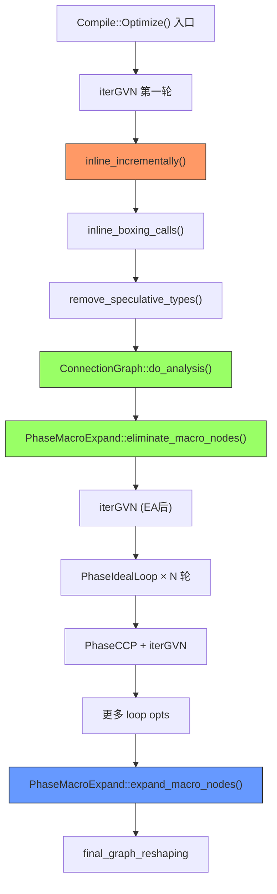
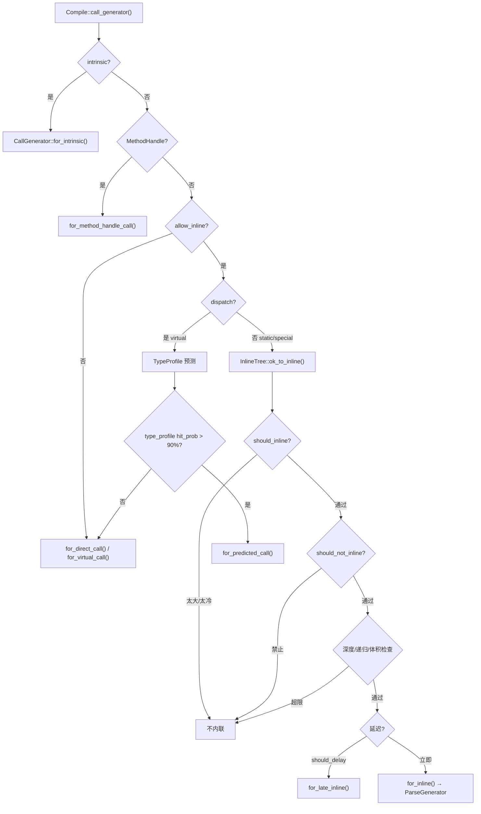
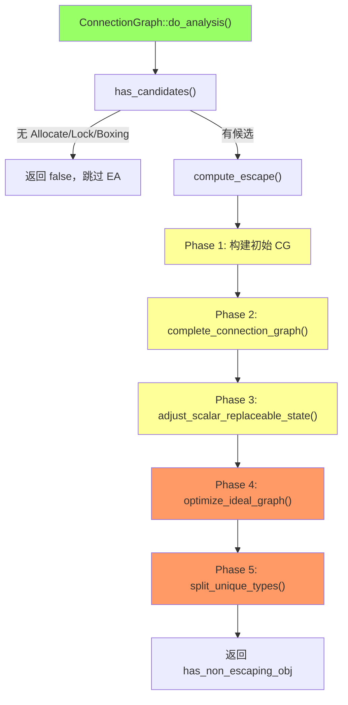
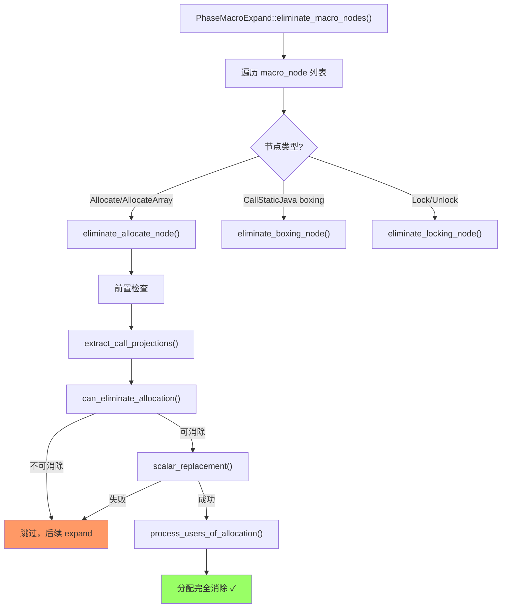
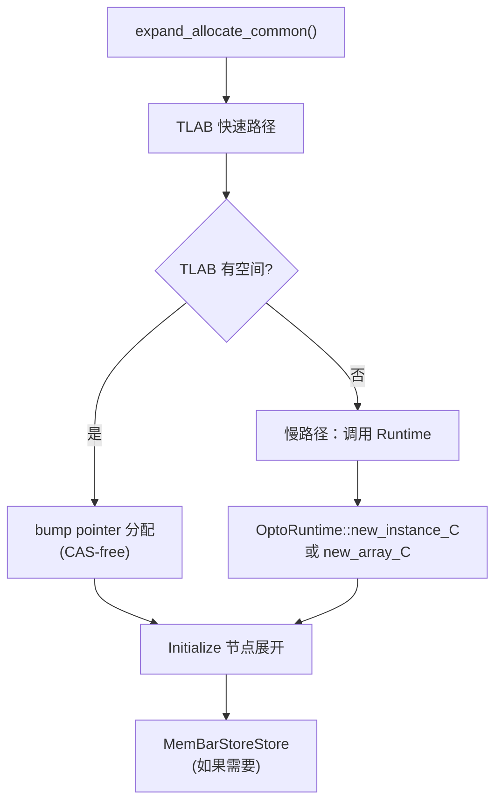
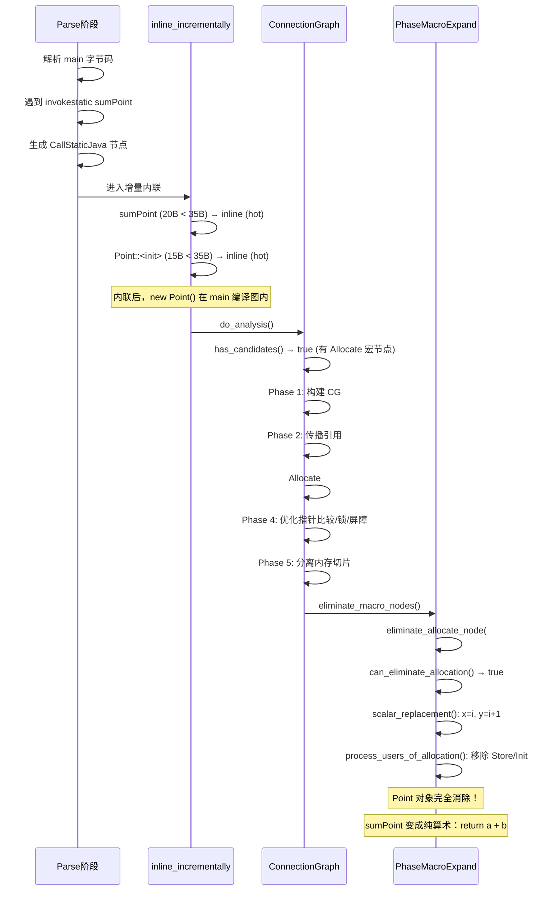

# C2 核心优化：逃逸分析、标量替换、内联

> 基于 OpenJDK 11 源码，标准环境 `-Xms8g -Xmx8g -XX:+UseG1GC`

---

## 第 0 部分：核心原理 ⭐

### 0.1 本质是什么？

C2 三大核心优化的本质是一条**依赖链**：内联把被调用方法的代码合并到调用者的编译图中 → 逃逸分析在合并后的图上用 points-to 分析证明哪些对象不逃逸 → 标量替换把不逃逸的对象拆散为标量值，完全消除堆分配。三者缺一不可，顺序不可颠倒。

### 0.2 为什么需要？

Java 的对象模型默认把所有对象分配在堆上，由 GC 管理。但大量临时对象（如 `new Point(a, b)` 只在方法内使用）的堆分配和 GC 回收是纯粹的开销：

- **内联**：方法调用边界隔断了优化上下文，没有内联就无法跨方法分析对象生命周期
- **逃逸分析**：不知道对象是否逃逸，就无法安全地消除堆分配
- **标量替换**：即使知道不逃逸，如果不拆散为标量，对象仍需在堆上分配（只是 GC 更快回收）

### 0.3 怎么解决？

**内联**：`InlineTree::ok_to_inline()` 根据字节码大小（`MaxInlineSize=35`）、调用频率（`InlineFrequencyCount=100`）、内联深度（`MaxInlineLevel=15`）决定是否内联；热方法放宽到 `FreqInlineSize=325`。

**逃逸分析**：`ConnectionGraph` 用 points-to 图（JavaObject/LocalVar/Field 三种节点，PointsTo/Deferred/Field 三种边）做流不敏感分析，迭代传播引用直到不动点，判定每个 `Allocate` 节点的逃逸状态（NoEscape/ArgEscape/GlobalEscape）。

**标量替换**：`PhaseMacroExpand::scalar_replacement()` 对每个安全点，用 `value_from_mem()` 沿内存链追踪每个字段的当前值，创建 `SafePointScalarObjectNode` 记录字段值，然后移除所有 Store/Initialize/Allocate 节点。

### 0.4 为什么这样设计？

- **为什么内联在逃逸分析之前？** 内联后，`new Point(a, b)` 的分配和所有使用都在同一编译图内，EA 才能看到完整的引用关系；没有内联，对象作为参数/返回值传递，EA 只能保守地判定 ArgEscape/GlobalEscape
- **为什么逃逸分析用流不敏感（flow-insensitive）分析？** 流敏感分析需要区分每个控制流分支，复杂度高；流不敏感分析保守但快速，且对 JVM 的典型临时对象模式（方法内创建、方法内使用）已经足够精确
- **为什么标量替换必须在每个安全点保留字段值？** 发生 deoptimization 时，JVM 需要根据 `SafePointScalarObjectNode` 重建对象（在堆上重新分配并填充字段值），这是标量替换的安全保证
- **为什么标量替换条件如此严格（不能被读取、不能被合并）？** 标量替换后对象不再存在，任何读取操作都无法满足；Phi 合并意味着对象可能来自不同分支，无法确定字段值

---

## 一、问题引入

C2 编译器的核心使命不只是把字节码翻译成机器码，更重要的是**优化**。三大核心优化是：

| 优化 | 解决什么问题 | 效果 |
|------|-------------|------|
| **内联（Inlining）** | 方法调用开销、缺少优化上下文 | 消除调用开销，暴露更多优化机会 |
| **逃逸分析（Escape Analysis）** | 不确定对象生命周期范围 | 确定对象是否可以栈上分配/标量替换/锁消除 |
| **标量替换（Scalar Replacement）** | 不逃逸对象仍在堆上分配 | 将对象字段拆为局部变量，完全消除堆分配 |

三者之间有严格的**依赖关系**：

```
内联 → 逃逸分析 → 标量替换/锁消除
```

**内联是基础**——如果被调用方法没有内联，其中创建的对象会作为参数/返回值逃逸，逃逸分析就无法判定 NoEscape。逃逸分析是标量替换的前提——只有 NoEscape 且 scalar_replaceable 的对象才能被标量替换。

---

## 二、宏观架构：三大优化在 Compile::Optimize() 中的位置



**关键时序**：
1. 先**内联**（`inline_incrementally`）— 确保被调用方法的代码已合并
2. 再**逃逸分析**（`ConnectionGraph::do_analysis`）— 分析合并后的图
3. 然后**消除**（`eliminate_macro_nodes`）— 标量替换 + 锁消除
4. 最后**展开**（`expand_macro_nodes`）— 无法消除的分配/锁展开为实际代码

---

## 三、内联（Inlining）

### 3.1 解决什么问题

方法调用的代价不只是 `call/ret` 指令本身。更大的问题是：**调用边界隔断了优化上下文**。例如：

```java
static int sumPoint(int a, int b) {
    Point p = new Point(a, b);  // 如果 sumPoint 没被内联
    return p.x + p.y;            // EA 看不到 p 在 main 中是否逃逸
}
```

内联后，`new Point(a, b)` 的分配和使用都在同一个编译单元内，EA 才能判定它不逃逸。

### 3.2 内联决策流程



> **源码位置**：`doCall.cpp` → `Compile::call_generator()` → `bytecodeInfo.cpp` → `InlineTree::ok_to_inline()`

### 3.3 内联决策标准

#### 正向标准（`should_inline`，`bytecodeInfo.cpp:115`）

| 条件 | 效果 |
|------|------|
| `@ForceInline` 注解 | 强制内联 |
| CompileCommand 指令 | 强制内联 |
| 频繁调用（`count >= InlineFrequencyCount` 或 `ratio >= InlineFrequencyRatio`） | `max_inline_size` 放大到 `FreqInlineSize` |
| 常抛异常（`throw_count > InlineThrowCount` 且 `size < InlineThrowMaxSize`） | 内联（利润 ×100） |
| `size <= max_inline_size` | 内联 |
| `size > max_inline_size` | 拒绝："too big" |

#### 负向标准（`should_not_inline`，`bytecodeInfo.cpp:204`）

| 条件 | 效果 |
|------|------|
| 抽象/native 方法 | 拒绝 |
| `@DontInline` 注解 | 拒绝 |
| holder 未初始化 | 拒绝 |
| 已编译且 `instructions_size > InlineSmallCode` | 拒绝："already compiled into a big method" |
| `code_size <= MaxTrivialSize` | 放行（极小方法） |
| 从未执行过 | 拒绝："never executed" |
| 执行次数 < `MinInliningThreshold` | 拒绝 |

#### 深度/体积限制（`try_to_inline`，`bytecodeInfo.cpp:334`）

| 限制 | 默认值 |
|------|--------|
| `MaxInlineLevel`（内联深度） | 15 |
| `MaxRecursiveInlineLevel`（递归内联深度） | 1 |
| `MaxForceInlineLevel`（强制内联硬上限） | - |
| `DesiredMethodLimit`（总字节码上限） | 8000 |
| `NodeCountInliningCutoff`（IR 节点上限） | 18000 |
| `LiveNodeCountInliningCutoff`（增量内联节点上限） | 40000 |

### 3.4 内联参数一览

| 参数 | 默认值 | 含义 |
|------|--------|------|
| `MaxInlineSize` | **35** bytes | 非热方法的字节码大小上限 |
| `FreqInlineSize` | **325** bytes | 热方法的字节码大小上限 |
| `MaxTrivialSize` | **6** bytes | 极小方法阈值（跳过多数检查） |
| `InlineSmallCode` | **2000** bytes | 已编译方法的机器码大小阈值 |
| `MaxInlineLevel` | **15** | 内联深度上限 |
| `MaxRecursiveInlineLevel` | **1** | 递归内联深度上限 |
| `DesiredMethodLimit` | **8000** bytes | 内联后总字节码上限 |
| `MinInliningThreshold` | **250** | 最小执行次数 |
| `InlineFrequencyCount` | **100** | 热调用频率计数阈值 |
| `InlineFrequencyRatio` | **20** | 热调用频率比率阈值 |
| `LiveNodeCountInliningCutoff` | **40000** | 增量内联活跃节点上限 |
| `NodeCountInliningCutoff` | **18000** | 编译图节点数上限 |

### 3.5 即时内联 vs 延迟内联

C2 有两种内联方式：

| 方式 | 实现 | 时机 |
|------|------|------|
| **即时内联** | `ParseGenerator` | Parse 阶段直接解析被调用方法的字节码 |
| **延迟内联** | `LateInlineCallGenerator` | 先生成 CallStaticJava 节点，后续在 `inline_incrementally` 中替换 |

延迟内联的目的是：先进行一些高层优化（如循环消除死代码），可能使某些调用点变得不可达，从而避免不必要的内联。

#### `inline_incrementally` 流程（`compile.cpp:2114`）

```
while (有内联进展 && _late_inlines 非空):
    if (live_nodes > LiveNodeCountInliningCutoff):
        运行 PhaseIdealLoop 尝试减少节点
        if 仍然超限: break
    inline_incrementally_one()   // 执行一轮延迟内联
    igvn.optimize()              // IGVN 清理
处理 _string_late_inlines       // StringBuilder 优化
```

### 3.6 GDB 验证：内联决策

**测试代码**：`EATest::sumPoint` 调用 `Point::<init>`

```
$ java -XX:-TieredCompilation -XX:+PrintInlining -cp demo/src com.wjcoder.EATest

   com.wjcoder.EATest::sumPoint (20 bytes)
                       @ 6   com.wjcoder.EATest$Point::<init> (15 bytes)   inline (hot)
   com.wjcoder.EATest::main @ 4 (39 bytes)        # OSR 编译
                       @ 15  com.wjcoder.EATest::sumPoint (20 bytes)   inline (hot)
                         @ 6  com.wjcoder.EATest$Point::<init> (15 bytes)   inline (hot)
```

**解读**：
- `sumPoint`（20 bytes）< `MaxInlineSize`（35），被 `main` 内联
- `Point::<init>`（15 bytes）< `MaxInlineSize`（35），被 `sumPoint` 内联
- 两层内联深度（2 < `MaxInlineLevel` 15），无问题

---

## 四、逃逸分析（Escape Analysis）

### 4.1 解决什么问题

Java 中对象默认在堆上分配（GC 管理），但很多临时对象实际上：
- 从不被其他线程访问
- 从不被方法外部引用
- 生命周期仅限于当前方法

对这些对象，堆分配和 GC 回收是纯粹的浪费。逃逸分析的目标是**证明哪些对象不会逃出当前编译单元**。

### 4.2 三种逃逸状态

| 状态 | 含义 | 可做什么 |
|------|------|---------|
| **NoEscape** | 对象不逃出当前方法 | 标量替换、栈上分配、锁消除 |
| **ArgEscape** | 对象作为参数传递但不逃出线程 | 锁消除（不需要同步） |
| **GlobalEscape** | 对象可能被任意线程访问 | 无优化 |

### 4.3 ConnectionGraph 架构

逃逸分析基于 **ConnectionGraph**（连接图），这是一种 points-to 分析的图模型。

#### ConnectionGraph 类定义

```cpp
// src/hotspot/share/opto/escape.hpp:350
class ConnectionGraph: public ResourceObj {
 private:
  GrowableArray<PointsToNode*> _nodes;  // ★ Node idx → PointsToNode* 映射表
  Unique_Node_List  _worklist;          // ★ 待处理节点工作列表
  GrowableArray<PointsToNode*> _java_objects_worklist; // ★ JavaObject 工作列表
  GrowableArray<PointsToNode*> _non_escaped_worklist;  // ★ NoEscape 候选列表
  GrowableArray<PointsToNode*> _delayed_worklist;      // 延迟处理列表
  Compile*          _compile;           // ★ 反向引用
  PhaseIterGVN*     _igvn;              // ★ 用于优化 Ideal 图
  bool              _collecting;        // 是否处于收集阶段
  bool              _verify;            // 是否处于验证模式
  JavaObjectNode*   phantom_obj;        // ★ GlobalEscape 占位符（未知对象）
  JavaObjectNode*   null_obj;           // ★ NoEscape 占位符（null 引用）
};
```

**sizeof(ConnectionGraph)**：约 **80 字节**（从 `ResourceArea` 分配，编译结束后随 arena 释放）

**创建位置**：`ConnectionGraph::do_analysis()` 中 `new ConnectionGraph(C, &igvn)` 创建；每次编译创建一个新实例。

**关键字段生命周期**：
- `_nodes`：`add_node()` 时按 `ideal_node->_idx` 为下标存入 `PointsToNode*`；`ptnode_adr(idx)` 读取；大小随编译图节点数增长
- `_non_escaped_worklist`：Phase 1 中每个 `Allocate` 节点对应的 `JavaObjectNode` 加入；Phase 2 `find_non_escaped_objects()` 中逐一检查并传播逃逸状态
- `phantom_obj`：构造时创建，默认 GlobalEscape；任何指向它的引用都被视为全局逃逸

#### PointsToNode 类定义

```cpp
// src/hotspot/share/opto/escape.hpp:80
class PointsToNode: public ResourceObj {
 public:
  enum NodeType { JavaObject, LocalVar, Field, Arraycopy }; // ★ 节点类型
  enum EscapeState { NoEscape=0, ArgEscape, GlobalEscape }; // ★ 逃逸状态
  enum EdgeType { PointsTo, Deferred, Field };               // ★ 边类型

 private:
  GrowableArray<PointsToNode*>* _edges;  // ★ 出边列表
  GrowableArray<PointsToNode*>* _uses;   // ★ 入边列表（反向边）
  const u1 _type;                        // ★ NodeType 枚举值
  u1 _flags;                             // 标志位（scalar_replaceable/has_unknown_offset 等）
  u1 _escape;                            // ★ EscapeState 枚举值
  u1 _fields_escape;                     // 字段的逃逸状态
  Node* const _node;                     // ★ 对应的 Ideal 图节点
  const int _idx;                        // 对应 Ideal 节点的 _idx
};
```

**sizeof(PointsToNode)**：约 **48 字节**（从 `ResourceArea` 分配）

**创建位置**：Phase 1 `build_connection_graph()` 中，遇到 `Allocate`/`Phi`/`LoadP`/`StoreP` 等节点时 `new JavaObjectNode()`/`new LocalVarNode()`/`new FieldNode()` 创建。

**关键字段生命周期**：
- `_escape`：初始为 `NoEscape`；Phase 2 `find_non_escaped_objects()` 中如果发现指向 `phantom_obj` 则设为 `GlobalEscape`；一旦设为 `GlobalEscape` 不会回退
- `_flags`：`scalar_replaceable` 位初始为 true；Phase 3 `adjust_scalar_replaceable_state()` 中如果发现字段偏移未知等情况则清除
- `_edges`：Phase 1 `add_edge()` 时追加；Phase 2 `add_java_object_edges()` 中传播引用关系

| 类型 | 对应 | 示例 |
|------|------|------|
| **JavaObject** | 堆上的 Java 对象 | `new Point()`、`ConP null`、`phantom_obj` |
| **LocalVar** | 局部变量/SSA 值 | `Proj`（分配结果）、`Phi`、`CastPP` |
| **Field** | 对象字段 | `AddP`（base + offset） |
| **Arraycopy** | 数组拷贝操作 | `ArrayCopy` 节点 |

#### 三种边类型

| 边 | 含义 | 方向 |
|----|------|------|
| **PointsTo (-P>)** | LocalVar/Field 指向 JavaObject | `var -P> obj` |
| **Deferred (-D>)** | LocalVar 延迟指向另一个 LocalVar | `var1 -D> var2` |
| **Field (-F>)** | JavaObject 拥有 Field | `obj -F> field` |

#### 两个特殊对象

- **`phantom_obj`**（GlobalEscape）：代表"未知对象"，任何指向它的引用都被视为全局逃逸
- **`null_obj`**（NoEscape）：代表 null，null 不逃逸

> **源码位置**：`escape.hpp`（PointsToNode 层次结构），`escape.cpp`（ConnectionGraph 构建与分析）

### 4.4 逃逸分析五阶段流程



#### Phase 1：构建初始连接图（`escape.cpp:136-208`）

遍历 Ideal 图中的所有节点，为每个指针相关节点创建 PointsToNode：

| 节点类型 | 创建的 CG 节点 |
|----------|---------------|
| `Allocate` | JavaObject (NoEscape) + 记录到 non_escaped_worklist |
| `ConP NULL` | JavaObject (NoEscape) |
| `ConP 非 null` | JavaObject (GlobalEscape) |
| `Phi`（指针类型） | LocalVar (NoEscape)，延迟添加边 |
| `LoadP/LoadN` | LocalVar (NoEscape)，边指向 Address |
| `StoreP/StoreN` | 边从 Field 指向 Value |
| `AddP` | Field (NoEscape)，offset |
| `Return/Rethrow` | LocalVar (GlobalEscape)，边指向返回值 |
| `CallStaticJava` | 使用 BCEscapeAnalyzer 分析字节码级逃逸 |
| `CallDynamicJava` | 映射到 phantom_obj (GlobalEscape) |

**不可标量替换的分配**（`add_call_node`，`escape.cpp:879`）：
- 数组长度未知或 > `EliminateAllocationArraySizeLimit`（默认 64）
- Thread/Reference 子类
- 有 finalizer 的类

#### Phase 2：完成连接图（`complete_connection_graph`，`escape.cpp:1206`）

这是一个**迭代不动点算法**：

```
repeat (最多 CG_BUILD_ITER_LIMIT=20 次或 EscapeAnalysisTimeout=60秒):
    1. find_non_escaped_objects(): 传播 GlobalEscape/ArgEscape 状态
    2. add_java_object_edges(): 对每个 JavaObject 传播引用到所有可达的 Field/LocalVar
    3. find_field_value(): 对没有值的 oop Field 添加 phantom_obj 边
until (无新边产生)
对 NoEscape 对象: find_init_values() 添加 null_obj 边
对 NoEscape Allocate: ini->set_does_not_escape() (不需要 MemBarStoreStore)
```

通常只需 1-3 次迭代。jvm2008 compiler.compiler 观察到最多 8 次。

#### Phase 3：调整标量替换状态（`adjust_scalar_replaceable_state`，`escape.cpp:1743`）

即使对象 NoEscape，以下情况仍然**不可标量替换**：

| 条件 | 原因 |
|------|------|
| 字段偏移未知（`OffsetBot`） | 不知道在数组的哪个元素 |
| 字段有多个 base，其中一个是 null | 无法确定字段归属 |
| 对象被合并（Phi 后指向多个对象） | 无法区分是哪个对象 |
| 有 LoadStore 操作或 mismatched access | 字段值不确定 |
| unsafe access（CheckCastPP 到 raw） | 不安全操作 |
| 字段 base 有多个 JavaObject | 可能来自不同控制分支 |

#### Phase 4：优化 Ideal 图（`optimize_ideal_graph`，`escape.cpp:1932`）

基于 EA 结果做三类即时优化：

1. **锁标记**（`EliminateLocks`）：将 not_global_escape 的 Lock/Unlock 标记为 `set_non_esc_obj()`
2. **指针比较优化**（`OptimizePtrCompare`）：如果两个指针指向不相交的对象集合，`CmpP` 直接替换为 `CC_EQ` 或 `CC_GT`
3. **MemBarStoreStore 消除**：对 not_global_escape 的 Allocate，将 `MemBarStoreStore` 降级为 `MemBarCPUOrder`

#### Phase 5：内存切片分离（`split_unique_types`，`escape.cpp` 末尾）

为每个可标量替换的对象创建**独立的内存别名**（alias）。这使得后续的标量替换可以独立追踪每个对象的每个字段的内存状态。

核心操作是 `split_AddP()`：将 `AddP` 节点的类型从通用的 `TypeOopPtr` 改为带 instance_id 的特定类型，从而在内存别名系统中获得独立的 alias index。

### 4.5 JVM 参数

| 参数 | 默认值 | 含义 |
|------|--------|------|
| `DoEscapeAnalysis` | **true** | 是否开启逃逸分析 |
| `EliminateAllocations` | **true** | 是否消除分配（标量替换） |
| `EliminateLocks` | **true** | 是否消除锁 |
| `EliminateAllocationArraySizeLimit` | **64** | 可标量替换的数组最大长度 |
| `EscapeAnalysisTimeout` | **60.0** | EA 超时时间（秒，debug VM） |
| `PrintEscapeAnalysis` | **false** | 打印 CG（notproduct flag） |
| `PrintEliminateAllocations` | **false** | 打印分配消除（notproduct flag） |

**查看 EA 日志**（需要 debug/fastdebug 构建）：

```bash
java -XX:-TieredCompilation \
     -XX:+PrintEscapeAnalysis \
     -XX:+PrintEliminateAllocations \
     -cp ... MyClass
```

输出示例（来自 GDB 验证）：

```
======== Connection graph for  com.wjcoder.EATest::sumPoint
JavaObject NoEscape(NoEscape) [ 97F 91F [ 39 ]]   27  Allocate  ...
LocalVar [ 27P [ 97b 91b ]]   39  Proj  ...
Scalar  27  Allocate  ...
++++ Eliminated: 27 Allocate
```

含义：
- `JavaObject NoEscape(NoEscape)` — Allocate #27 的逃逸状态是 NoEscape
- `[ 97F 91F [ 39 ]]` — 有两个 Field 节点（97 和 91）和一个 LocalVar（39）
- `Scalar 27 Allocate` — 标记为可标量替换
- `++++ Eliminated: 27 Allocate` — 分配被消除

---

## 五、标量替换（Scalar Replacement）

### 5.1 解决什么问题

即使 EA 证明了对象 NoEscape，如果没有标量替换，对象仍然需要在堆上分配（只是可以用 TLAB 快速分配并快速回收）。标量替换把**对象拆散为一组独立的标量值**，完全消除堆分配。

### 5.2 标量替换流程



#### SafePointScalarObjectNode 完整分析

```cpp
// src/hotspot/share/opto/callnode.hpp:580
class SafePointScalarObjectNode: public TypeNode {
 public:
  uint _first_index;    // ★ 在 SafePoint 调试信息中第一个字段值的下标
  uint _n_fields;       // ★ 字段数量（实例对象的非静态字段数）
  // 继承自 TypeNode：
  // const Type* _type;  // ★ 对象类型（TypeOopPtr，包含 klass 信息）
  // 继承自 Node：
  // Node** _in;         // in(0) = control, in(1..n) = 字段值节点
};
```

**sizeof(SafePointScalarObjectNode)**：约 **72 字节**（Node 基类 56B + TypeNode 新增 8B + 两个 uint 8B）

**创建位置**：`PhaseMacroExpand::scalar_replacement()` 中，对每个安全点（SafePoint）创建一个 `SafePointScalarObjectNode`，替换调试信息中的对象引用。

**关键字段生命周期**：
- `_first_index`：`scalar_replacement()` 中设置，指向 SafePoint 调试信息中第一个字段值的下标；反优化时 `Deoptimization::realloc_objects()` 读取此下标获取字段值
- `_n_fields`：`scalar_replacement()` 中设置为 `ciInstanceKlass::nof_nonstatic_fields()`；反优化时用于循环填充字段
- `_type`：对象的 `TypeOopPtr`，包含 klass 信息；反优化时用于在堆上重新分配对象
- `_in[1..n]`：各字段的当前值节点（由 `value_from_mem()` 沿内存链追踪得到）；反优化时从这些节点读取实际值填充到重建的对象中

#### Step 1: 前置检查（`eliminate_allocate_node`，`macro.cpp:1092`）

```
EliminateAllocations == true?
can_pop_frame == false?         // JVMTI 不能 pop frame
_is_non_escaping == true?       // EA 标记
_is_scalar_replaceable == true? // EA 标记
```

#### Step 2: 可消除性检查（`can_eliminate_allocation`，`macro.cpp:631`）

扫描分配结果的所有使用者，验证每一个都是"安全"的：

| 使用类型 | 是否允许 |
|----------|---------|
| `AddP`（字段地址） → 下游只有 Store | ✅ |
| `AddP` → 下游有 Load | ❌ 不可消除 |
| `SafePoint`（只在 debug info 中） | ✅ 收集到 safepoints 列表 |
| `CastP2X`（卡表标记） | ✅ |
| `Phi` / `Return` / 其他 | ❌ 不可消除 |

**核心思想**：对象只被写入、只出现在安全点调试信息中。不被读取、不被传递、不被返回。

#### Step 3: 标量替换核心（`scalar_replacement`，`macro.cpp:760`）

对每个安全点（SafePoint），将"对象引用"替换为"一组字段值"：

```
Before:  SafePoint [..., obj_ref, ...]
After:   SafePoint [..., SafePointScalarObjectNode(type, first_index, n_fields),
                         field_0_value, field_1_value, ..., field_n_value, ...]
```

具体步骤：

1. **确定字段列表**：
   - 实例对象：通过 `ciInstanceKlass::nof_nonstatic_fields()` 获取
   - 数组对象：通过 `AllocateNode::ALength` 获取常量长度

2. **对每个安全点的每个字段**：
   - 计算字段偏移量 offset
   - 调用 `value_from_mem()` 沿**内存链**追踪该字段的当前值：
     - 找到 **Store** → 返回 Store 的 ValueIn
     - 到达 **start_mem/alloc_mem** → 返回**零值**（字段未写入，用默认值）
     - 遇到 **Initialize** → 查找捕获的初始化存储
     - 遇到 **Phi** → 尝试找唯一输入或构造值 Phi

3. **创建 `SafePointScalarObjectNode`**：记录类型、字段起始索引、字段数量

4. **替换 debug info 中的对象引用**：`res → sobj`

#### Step 4: 清理（`process_users_of_allocation`，`macro.cpp:947`）

- 所有 Store（写字段）→ 替换为其内存输入（旁路）
- GC barrier → 消除
- Initialize 节点 → 消除
- 控制流/内存/I_O 投影 → 重连到分配之前的状态
- 分配节点 → 从图中移除

### 5.3 反优化恢复

标量替换后，如果发生 deoptimization（如类型检查失败），JVM 需要根据 `SafePointScalarObjectNode` 的描述**重建对象**：

1. 读取 `SafePointScalarObjectNode` 中的类型信息
2. 在堆上重新分配对象
3. 从 debug info 中读取各字段的标量值，填充到新对象的字段中
4. 将新对象引用放回栈帧

这就是为什么标量替换必须在每个安全点保留完整的字段值——它们是反优化的"保险"。

### 5.4 宏节点展开（无法消除时）

对于无法标量替换的分配，`expand_macro_nodes()` 将 `AllocateNode` 展开为实际的分配代码：



---

## 六、GDB 验证

### 6.1 测试代码

```java
package com.wjcoder;
public class EATest {
    static class Point {
        int x, y;
        Point(int x, int y) { this.x = x; this.y = y; }
    }
    static int sumPoint(int a, int b) {
        Point p = new Point(a, b);   // 应被标量替换
        return p.x + p.y;
    }
    public static void main(String[] args) {
        int sum = 0;
        for (int i = 0; i < 100000; i++) {
            sum += sumPoint(i, i + 1);
        }
        System.out.println("sum=" + sum);
    }
}
```

### 6.2 验证结果

#### 内联验证（`-XX:+PrintInlining`）

```
com.wjcoder.EATest::sumPoint (20 bytes)
                    @ 6  com.wjcoder.EATest$Point::<init> (15 bytes)   inline (hot)
com.wjcoder.EATest::main @ 4 (39 bytes)                               # OSR
                    @ 15 com.wjcoder.EATest::sumPoint (20 bytes)       inline (hot)
                      @ 6 com.wjcoder.EATest$Point::<init> (15 bytes)  inline (hot)
```

✅ `sumPoint` 和 `Point::<init>` 都被成功内联。

#### 逃逸分析验证（`-XX:+PrintEscapeAnalysis -XX:+PrintEliminateAllocations`）

**`sumPoint` 的独立编译**：
```
======== Connection graph for  com.wjcoder.EATest::sumPoint
JavaObject NoEscape(NoEscape) [ 97F 91F [ 39 ]]   27  Allocate
Scalar  27  Allocate
++++ Eliminated: 27 Allocate
```

**`main` 的 OSR 编译**（内联了 `sumPoint`）：
```
======== Connection graph for  com.wjcoder.EATest::main
JavaObject NoEscape(NoEscape) [ 184F 179F [ 128 ]]   116  Allocate
Scalar  116  Allocate
++++ Eliminated: 116 Allocate
```

✅ 两次编译中的 `Point` 分配都被判定为 NoEscape + Scalar，成功消除。

#### GDB 统计数据

| 指标 | 值 | 说明 |
|------|-----|------|
| EA `do_analysis` 调用次数 | **11** | 整个 JVM 启动过程 + 测试方法 |
| `eliminate_allocate_node` 调用次数 | **26** | 尝试消除的分配数 |
| `scalar_replacement` 调用次数 | **2** | 成功进入标量替换的次数（正是我们的两次编译） |
| `inline_incrementally` 调用次数 | **73** | 增量内联总调用次数 |
| `expand_allocate_common` 调用次数 | 多次 | 无法消除的分配被展开为实际代码 |

**关键观察**：
- 26 次 `eliminate_allocate_node` 尝试中，只有 2 次成功标量替换，其余都因为不满足条件而最终被 `expand_allocate_common` 展开
- 这说明标量替换的条件**非常严格**，大多数分配无法被消除

---

## 七、三大优化联动示例

以 `EATest::main` 的 OSR 编译为例，展示三大优化如何协同工作：



最终效果：`sum += sumPoint(i, i+1)` 被优化为 `sum += i + (i+1)`，完全没有对象分配。

---

## 八、源码文件清单

| 文件 | 行数 | 核心内容 |
|------|------|---------|
| `escape.hpp` | 614 | PointsToNode 层次结构、ConnectionGraph 类定义 |
| `escape.cpp` | ~2800 | CG 构建、传播、标量替换状态调整、内存切片分离 |
| `macro.hpp` | 222 | PhaseMacroExpand 类定义 |
| `macro.cpp` | ~2766 | 分配消除、标量替换、锁消除、宏节点展开 |
| `callGenerator.hpp` | 181 | CallGenerator 层次结构（for_inline, for_late_inline 等） |
| `callGenerator.cpp` | ~1376 | ParseGenerator、LateInlineCallGenerator 实现 |
| `doCall.cpp` | ~400 | Compile::call_generator() — 内联决策入口 |
| `bytecodeInfo.cpp` | ~761 | InlineTree::ok_to_inline/should_inline/should_not_inline |
| `compile.cpp` | ~5006 | Compile::Optimize()、inline_incrementally() |
| `callnode.hpp` | ~600 | JVMState、SafePointNode、SafePointScalarObjectNode |

---

## 九、总结

### 核心要点

1. **内联是一切优化的基础**：没有内联，EA 看不到完整的对象生命周期，标量替换就无从谈起

2. **逃逸分析是保守的**：使用 flow-insensitive 分析（不区分控制流分支），结果可能有误判（判定逃逸但实际不逃逸），但**不会漏判**（安全保证）

3. **标量替换条件非常严格**：对象必须 NoEscape、字段偏移确定、不被读取、不被合并、不参与 LoadStore/unsafe 操作。实际中只有少数简单的临时对象能被标量替换

4. **反优化是安全网**：标量替换在每个安全点保留了完整的字段值（`SafePointScalarObjectNode`），确保 deoptimization 时能重建对象

5. **ConnectionGraph 的迭代构建**：需要多轮不动点迭代来传播引用和逃逸状态，有时间和迭代次数的双重上限

### C2 三大优化对比

| 维度 | 内联 | 逃逸分析 | 标量替换 |
|------|------|---------|---------|
| 阶段 | Parse + inline_incrementally | Optimize 中期 | Optimize 末尾 |
| 输入 | 字节码 + profile | Ideal 图 | EA 结果 + macro nodes |
| 输出 | 展开的 Ideal 子图 | 逃逸状态标记 | 消除的分配节点 |
| 决策基础 | 大小/频率/深度 | points-to 分析 | 使用者模式 |
| 失败回退 | 保持调用 | 标记 GlobalEscape | expand_allocate_common |
| 默认开关 | 默认开启 | `DoEscapeAnalysis=true` | `EliminateAllocations=true` |

---

## 十、JVM 参数参考

### 诊断内联

```bash
# 查看内联决策
-XX:+PrintInlining

# 调整内联阈值
-XX:MaxInlineSize=35           # 非热方法字节码上限
-XX:FreqInlineSize=325         # 热方法字节码上限
-XX:MaxInlineLevel=15          # 内联深度上限
-XX:InlineSmallCode=2000       # 已编译方法机器码上限
```

### 诊断逃逸分析

```bash
# 查看 EA 结果（需要 debug/fastdebug 构建）
-XX:+PrintEscapeAnalysis
-XX:+PrintEliminateAllocations

# 关闭 EA（对比性能）
-XX:-DoEscapeAnalysis

# 关闭标量替换（只保留锁消除等）
-XX:-EliminateAllocations

# 关闭锁消除
-XX:-EliminateLocks
```

### 完整诊断命令

```bash
java -Xms8g -Xmx8g -XX:+UseG1GC \
     -XX:-TieredCompilation \
     -XX:+PrintCompilation \
     -XX:+PrintInlining \
     -XX:+PrintEscapeAnalysis \
     -XX:+PrintEliminateAllocations \
     -cp demo/src com.wjcoder.EATest
```
