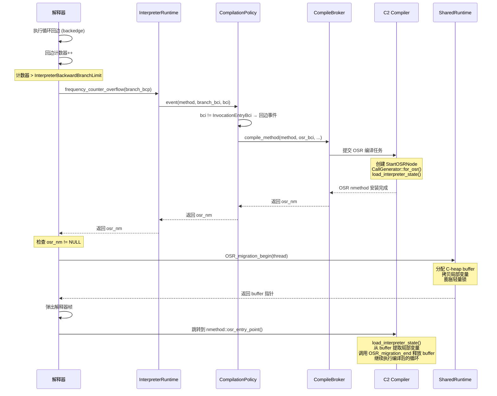

# OSR（On-Stack Replacement）栈上替换 — 完整分析

> 基于 OpenJDK 11 slowdebug，-Xms8g -Xmx8g -XX:+UseG1GC -XX:-TieredCompilation

---

## 第 0 部分：核心原理 ⭐

### 0.1 本质是什么？

OSR 的本质是**在方法执行中途切换执行引擎**：解释器正在执行一个热循环时，将当前的解释器帧（局部变量 + 锁状态）打包到 C-heap buffer，弹出解释器帧，跳转到编译后代码的循环入口继续执行。整个过程对 Java 代码透明，循环变量的值在切换前后保持一致。

### 0.2 为什么需要？

常规 JIT 编译是**方法级别**的：方法被调用 N 次后触发编译。但如果一个方法只调用一次（如 `main`），内部循环执行几百万次，常规 JIT 永远不会触发。OSR 解决的就是"**一次调用但内含热循环**"的场景：

- 回边计数器 > `InterpreterBackwardBranchLimit`（默认 10700）时触发
- 不等方法调用次数达到阈值，直接在循环运行中切换

### 0.3 怎么解决？

**三步机制**：
1. **检测**：解释器在每次循环回边时递增 `MethodCounters::_backedge_counter`，超过 `InterpreterBackwardBranchLimit` 时调用 `frequency_counter_overflow(branch_bcp)` 通知 Runtime
2. **编译**：`CompileBroker::compile_method(method, osr_bci, ...)` 提交 OSR 编译任务，C2 用 `StartOSRNode`（只接收 buffer 指针）替代普通 `StartNode`，`load_interpreter_state()` 从 buffer 加载局部变量构建 IR
3. **迁移**：`OSR_migration_begin()` 分配 C-heap buffer，`Copy::disjoint_words` 整块拷贝局部变量，膨胀轻量锁为重量锁（因为轻量锁依赖栈帧），然后弹出解释器帧跳转到 `nmethod::osr_entry_point()`

### 0.4 为什么这样设计？

- **为什么要膨胀轻量锁？** 轻量锁的 displaced header 存储在解释器帧的栈上，OSR 后解释器帧被弹出，displaced header 地址失效。膨胀为重量锁（`ObjectMonitor` 在堆上）后，锁状态不再依赖栈帧
- **为什么 OSR nmethod 用 `StartOSRNode` 而不是普通 `StartNode`？** 普通 `StartNode` 接收方法参数，但 OSR 入口不是方法入口，局部变量已经在解释器中初始化了，只需要传入 buffer 指针
- **为什么 OSR nmethod 很快就 `made not entrant`？** OSR nmethod 是为特定 BCI 编译的"应急版本"，入口不在方法头部，无法被正常调用。一旦方法的正常编译完成，OSR nmethod 就被淘汰
- **为什么用 `Copy::disjoint_words` 整块拷贝而不是逐个变量拷贝？** 局部变量在解释器帧中是连续存储的，整块拷贝比逐个拷贝快，且 `load_interpreter_state()` 会根据活跃性分析（liveness）跳过死变量

---

## 一、问题引入：为什么需要 OSR？

**核心问题**：一个方法内部有一个极长的循环，但这个方法本身可能只被调用了一次。

常规的 JIT 编译是**方法级别**的 —— 热点检测基于方法调用计数器，方法被调用 N 次后才触发编译。但如果一个方法只调用了一次，内部的循环却执行了几百万次，常规编译永远不会触发。

```java
public static void main(String[] args) {
    int sum = 0;
    for (int i = 0; i < 5_000_000; i++) {  // 这个循环很热
        sum += i;
    }
    System.out.println(sum);
}
```

`main` 方法只被调用一次，调用计数器永远达不到 `CompileThreshold=10000`。但循环体执行了 500 万次。

**OSR 的解决方案**：在循环**正在运行的时候**，将解释器执行切换到编译后的代码继续执行。这就是"栈上替换"—— 在栈帧还在运行中的时候替换执行引擎。

---

## 二、宏观架构

### 2.1 OSR 完整流程概览



### 2.2 阶段划分

| 阶段 | 组件 | 关键函数 | 源文件 |
|------|------|----------|--------|
| 1. 回边检测 | 解释器 | `TemplateTable::branch_x86` | `templateTable_x86.cpp:2139-2367` |
| 2. 溢出处理 | 运行时 | `frequency_counter_overflow_inner` | `interpreterRuntime.cpp:1053` |
| 3. 策略决策 | 编译策略 | `NonTieredCompPolicy::event` | `compilationPolicy.cpp:430` |
| 4. 编译请求 | CompileBroker | `compile_method(osr_bci)` | `compileBroker.cpp:1242` |
| 5. C2 编译 | C2 | `Compile::Compile` + `for_osr` | `compile.cpp:778` |
| 6. 状态迁移 | SharedRuntime | `OSR_migration_begin` | `sharedRuntime.cpp:3037` |
| 7. 跳转执行 | 解释器→编译代码 | `nmethod::osr_entry_point()` | `templateTable_x86.cpp:2358` |

---

## 三、阶段 1：回边检测（解释器）

### 3.1 x86 解释器回边处理

回边（backward branch）是字节码中跳转目标在当前 BCI 之前的分支，典型场景就是循环的末尾跳回循环头。

解释器在 `TemplateTable::branch` 中处理所有分支字节码（`goto`、`if_icmplt` 等）。当检测到回边时：

```
templateTable_x86.cpp:2308-2365 伪代码：

branch(bool is_jsr) {
    计算跳转偏移量 disp
    
    if (disp < 0) {   // 回边：向后跳转
        // 1. 增加回边计数器
        MethodCounters* mcs = method->method_counters()
        backedge_counter = &mcs->backedge_counter()
        backedge_counter->increment()
        
        // 2. 检查是否超过阈值
        if (backedge_counter >= InterpreterBackwardBranchLimit) {
            // 3. 调用运行时处理溢出
            call_VM(noreg, frequency_counter_overflow, branch_bcp)
            // frequency_counter_overflow 返回 osr_nm (可能为 NULL)
            
            // 4. 如果返回了 osr nmethod
            if (osr_nm != NULL) {
                // 确认 OSR entry 存在
                osr_entry = osr_nm->osr_entry_point()
                if (osr_entry != NULL) {
                    // 5. 迁移解释器状态
                    call SharedRuntime::OSR_migration_begin(thread)
                    // 返回 buffer 指针（在 rax 中）
                    
                    // 6. 弹出解释器帧，跳转到编译代码
                    pop interpreter frame
                    jmp osr_entry  // 进入编译后的代码！
                }
            }
        }
        
        // 正常回边（未触发 OSR）：继续解释执行
        dispatch_next
    }
}
```

### 3.2 OSR 阈值计算

阈值由 `InvocationCounter::reinitialize()` 计算（`invocationCounter.cpp:138-167`）：

```cpp
// ProfileInterpreter = true（默认）
InterpreterBackwardBranchLimit = CompileThreshold * (OnStackReplacePercentage - InterpreterProfilePercentage) / 100

// 代入默认值：
//   CompileThreshold = 10000
//   OnStackReplacePercentage = 140
//   InterpreterProfilePercentage = 33
// → InterpreterBackwardBranchLimit = 10000 * (140 - 33) / 100 = 10700
```

**JVM 参数查看**：
```bash
java -XX:-TieredCompilation -XX:+PrintFlagsFinal -version 2>&1 | grep -E "CompileThreshold|OnStackReplacePercentage|InterpreterProfilePercentage"
```

输出：
```
intx CompileThreshold              = 10000    {pd product} {default}
intx OnStackReplacePercentage      = 140      {pd product} {default}
intx InterpreterProfilePercentage  = 33       {product} {default}
```

> 注：当 `ProfileInterpreter=true` 时，回边计数在 MethodData 上进行（不需要位移），阈值直接比较。当 `ProfileInterpreter=false` 时，计数在 InvocationCounter 上（需要 `<< number_of_noncount_bits` 即 `<< 3`）。

---

## 四、阶段 2-3：溢出处理与策略决策

### 4.1 frequency_counter_overflow

```
interpreterRuntime.cpp:1017-1051

frequency_counter_overflow(JavaThread* thread, address branch_bcp) {
    // 调用内部实现
    nmethod* nm = frequency_counter_overflow_inner(thread, branch_bcp);
    
    // 如果返回的 nmethod 无效（zombie/unloaded），返回 NULL
    if (nm != NULL && (nm->is_zombie() || nm->is_unloaded())) {
        return NULL;
    }
    return nm;
}
```

### 4.2 frequency_counter_overflow_inner

```
interpreterRuntime.cpp:1053-1092

frequency_counter_overflow_inner(JavaThread* thread, address branch_bcp) {
    // 获取当前执行的 Method
    frame fr = thread->last_frame();
    Method* method = fr.interpreter_frame_method();
    
    // 计算 branch_bci
    int branch_bci;
    if (branch_bcp != NULL) {
        branch_bci = method->bci_from(branch_bcp);  // 回边 BCI
    } else {
        branch_bci = InvocationEntryBci;  // 方法调用（非 OSR）
    }
    
    // 调用编译策略
    nmethod* osr_nm = CompilationPolicy::policy()->event(method, method, branch_bci, bci, ...);
    return osr_nm;
}
```

关键点：`branch_bcp != NULL` 表示这是回边溢出（OSR），此时 `branch_bci` 就是循环回边的 BCI。

### 4.3 NonTieredCompPolicy::event

```
compilationPolicy.cpp:430-484

event(method, inlinee, branch_bci, bci, comp_level, nm, thread) {
    if (bci == InvocationEntryBci) {
        // 方法调用事件（非 OSR）
        method_invocation_event(method, thread);
    } else {
        // 循环回边事件 → OSR
        nmethod* osr_nm = method->lookup_osr_nmethod_for(bci, comp_level, false);
        
        if (osr_nm == NULL) {
            // 还没有 OSR nmethod，触发编译
            method_back_branch_event(method, bci, thread);
            // 编译完成后再查一次
            osr_nm = method->lookup_osr_nmethod_for(bci, comp_level, false);
        }
        
        return osr_nm;  // 返回 OSR nmethod（可能为 NULL）
    }
}
```

### 4.4 method_back_branch_event

```
compilationPolicy.cpp:546-554 (SimpleCompPolicy)

method_back_branch_event(method, bci, thread) {
    // 获取编译级别
    int comp_level = CompLevel_highest_tier;  // C2
    
    // 提交 OSR 编译请求
    CompileBroker::compile_method(method, bci, comp_level, method, hot_count,
                                  CompileTask::Reason_BackedgeCount, thread);
}
```

注意：`compile_method` 的第二个参数是 `bci`（不是 `InvocationEntryBci`），这就是告诉 CompileBroker 这是一次 OSR 编译。

---

## 五、阶段 4：CompileBroker 处理 OSR 请求

```
compileBroker.cpp:1242-1392

compile_method(method, osr_bci, comp_level, hot_method, hot_count, ...) {
    if (osr_bci == InvocationEntryBci) {
        // 标准编译：检查是否已有 nmethod
        nmethod* saved = method->code();
        if (saved != NULL) return saved;
    } else {
        // ★ OSR 编译分支
        // 查找已有的 OSR nmethod
        nmethod* nm = method->lookup_osr_nmethod_for(osr_bci, comp_level, false);
        if (nm != NULL) return nm;  // 已有就直接返回
        
        // 检查方法是否可 OSR 编译
        if (method->is_not_osr_compilable(comp_level)) return NULL;
    }
    
    // 提交编译任务到编译队列
    compile_method_base(method, osr_bci, comp_level, hot_method, hot_count, ...);
    
    // -XX:-BackgroundCompilation 时同步等待编译完成
    if (osr_bci == InvocationEntryBci) {
        return method->code();
    } else {
        return method->lookup_osr_nmethod_for(osr_bci, comp_level, false);
    }
}
```

**OSR nmethod 管理**：每个 Method 对象维护一个 OSR nmethod 链表（通过 `_osr_link` 字段），同一方法的不同 BCI 可以有不同的 OSR nmethod。

---

## 六、阶段 5：C2 编译 OSR 代码

### 6.1 Compile 构造函数中的 OSR 分支

```
compile.cpp:778-805

Compile::Compile(..., int osr_bci, ...) {
    _entry_bci = osr_bci;  // 保存 OSR 入口 BCI
    
    if (is_osr_compilation()) {  // _entry_bci != InvocationEntryBci
        // ★ OSR 编译
        const TypeTuple *domain = StartOSRNode::osr_domain();
        // osr_domain: 只有一个参数 —— osr_buf (RawPtr)
        const TypeTuple *range = TypeTuple::make_range(method()->signature());
        init_tf(TypeFunc::make(domain, range));
        
        StartNode* s = new StartOSRNode(root(), domain);
        init_start(s);
        
        // for_osr 创建 ParseGenerator，带 OSR 标志
        cg = CallGenerator::for_osr(method(), entry_bci());
    } else {
        // 正常编译
        init_tf(TypeFunc::make(method()));
        StartNode* s = new StartNode(root(), tf()->domain());
        init_start(s);
        cg = CallGenerator::for_inline(method(), expected_uses);
    }
}
```

### 6.2 StartOSRNode

```
callnode.hpp:91-98

static const TypeFunc* StartOSRNode::osr_domain() {
    // OSR 入口只接受一个参数：osr buffer 的地址
    // Domain: (RawPtr osr_buf)
    const Type **fields = TypeTuple::fields(1);
    fields[TypeFunc::Parms+0] = TypeRawPtr::BOTTOM;  // osr buffer
    const TypeTuple *domain = TypeTuple::make(TypeFunc::Parms+1, fields);
    return domain;
}
```

### 6.3 load_interpreter_state：从 buffer 提取局部变量

这是 OSR 编译的核心——将解释器状态转换为编译器 IR 图的节点。

```
parse1.cpp:186-327 伪代码

load_interpreter_state(Node* osr_buf) {
    // osr_buf 是 OSR_migration_begin 返回的 C-heap buffer
    int max_locals = method()->max_locals();
    
    // === 前置检查 ===
    if (sp() != 0) bailout("OSR starts with non-empty stack");
    if (has_trap) bailout("OSR starts with an immediate trap");
    
    // === 1. 迁移 Monitor（锁）===
    int mcnt = osr_block->flow()->monitor_count();
    monitors_addr = osr_buf + (max_locals + mcnt*2 - 1) * wordSize;
    for (i = 0; i < mcnt; i++) {
        // 创建 BoxLockNode
        box = new BoxLockNode(next_monitor());
        // 从 buffer 提取 locked object 和 displaced header
        lock_object = fetch_interpreter_state(i*2, T_OBJECT, monitors_addr);
        displaced_hdr = fetch_interpreter_state(i*2 + 1, T_ADDRESS, monitors_addr);
        // 写入 box
        store_to_memory(box, displaced_hdr);
        // 创建 FastLockNode 推入 debug info
        flock = new FastLockNode(lock_object, box);
        map()->push_monitor(flock);
    }
    
    // === 2. 提取局部变量 ===
    locals_addr = osr_buf + (max_locals - 1) * wordSize;
    live_locals = method()->liveness_at_bci(osr_bci());
    
    for (index = 0; index < max_locals; index++) {
        if (!live_locals.at(index)) continue;  // 跳过死变量
        
        type = osr_block->local_type_at(index);
        if (type is oop && !live_oops.at(index)) {
            set_local(index, null());  // 解释器认为已死的 oop
            continue;
        }
        
        // 从 buffer 加载变量值，创建 IR 节点
        value = fetch_interpreter_state(index, bt, locals_addr);
        set_local(index, value);
    }
    
    // === 3. 释放 buffer ===
    make_runtime_call(OSR_migration_end, osr_buf);
    
    // === 4. 类型检查 ===
    // 对每个局部变量做类型验证，不匹配则生成 uncommon_trap
}
```

### 6.4 OSR 编译 vs 正常编译的区别

| 方面 | 正常编译 | OSR 编译 |
|------|---------|---------|
| **入口 BCI** | `InvocationEntryBci (-1)` | 具体循环回边 BCI（如 `@ 4`） |
| **StartNode** | `StartNode`（接收方法参数） | `StartOSRNode`（只接收 buffer 指针） |
| **参数来源** | 调用者传递 | 从 OSR buffer 中加载 |
| **类型信息** | 方法签名提供 | `ciTypeFlow::get_osr_flow_analysis()` |
| **编译范围** | 整个方法 | 从 OSR BCI 开始的子图 |
| **nmethod 存储** | `Method::_code` | `Method::_osr_link` 链表 |
| **生命周期** | 长期使用 | 用完即弃（通常很快 `made not entrant`） |

---

## 七、阶段 6：OSR_migration_begin —— 状态迁移

这是 OSR 的运行时核心函数，负责将解释器帧中的状态打包到 C-heap buffer。

```
sharedRuntime.cpp:3037-3097

OSR_migration_begin(JavaThread* thread) {
    frame fr = thread->last_frame();
    assert(fr.is_interpreted_frame());
    assert(fr.expression_stack_size() == 0);  // 栈必须为空
    
    // 1. 统计活跃 monitor 数量
    int active_monitor_count = 0;
    for (kptr = fr.monitor_end(); kptr < fr.monitor_begin(); kptr = next(kptr)) {
        if (kptr->obj() != NULL) active_monitor_count++;
    }
    
    // 2. 计算 buffer 大小并分配
    Method* moop = fr.interpreter_frame_method();
    int max_locals = moop->max_locals();
    int buf_size_words = max_locals + active_monitor_count * 2;  // 2 words per monitor
    intptr_t* buf = NEW_C_HEAP_ARRAY(intptr_t, buf_size_words);
    
    // 3. 拷贝局部变量（整块内存拷贝）
    Copy::disjoint_words(
        fr.interpreter_frame_local_at(max_locals - 1),  // 源：解释器帧中的 locals
        &buf[0],                                         // 目标：buffer 起始
        max_locals                                       // 长度
    );
    
    // 4. 处理 Monitor（锁）
    int i = max_locals;
    for (kptr2 = fr.monitor_end(); kptr2 < fr.monitor_begin(); kptr2 = next(kptr2)) {
        if (kptr2->obj() != NULL) {
            BasicLock* lock = kptr2->lock();
            
            // ★ 关键：膨胀轻量锁
            // 轻量锁的 displaced header 存储了锁对象的原始 mark word
            // 但 displaced header 的位置依赖于解释器帧（栈地址）
            // OSR 后解释器帧被弹出，displaced header 就失效了
            // 所以必须膨胀为重量锁（ObjectMonitor），使锁状态独立于栈帧
            if (lock->displaced_header()->is_unlocked()) {
                ObjectSynchronizer::inflate_helper(kptr2->obj());
            }
            
            buf[i++] = (intptr_t)lock->displaced_header();
            buf[i++] = cast_from_oop<intptr_t>(kptr2->obj());
        }
    }
    
    return buf;
}
```

### 7.1 Buffer 内存布局

```
┌────────────────────────────────────────────────────────────┐
│                    OSR Migration Buffer                     │
│                    (C-heap allocated)                       │
├────────────────────────────────────────────────────────────┤
│ buf[0]                  │ local[0]                         │
│ buf[1]                  │ local[1]                         │
│ ...                     │ ...                              │
│ buf[max_locals-1]       │ local[max_locals-1]              │
├────────────────────────────────────────────────────────────┤
│ buf[max_locals]         │ monitor[0].displaced_header      │
│ buf[max_locals+1]       │ monitor[0].obj (oop)             │
│ buf[max_locals+2]       │ monitor[1].displaced_header      │
│ buf[max_locals+3]       │ monitor[1].obj (oop)             │
│ ...                     │ ...                              │
└────────────────────────────────────────────────────────────┘

总大小 = max_locals + active_monitors * 2  (words)
```

### 7.2 为什么要膨胀锁？

轻量锁（thin lock）的实现依赖于栈帧：displaced header 存储在栈上的 `BasicLock` 对象中。当解释器帧被弹出后，这个栈上的 `BasicLock` 就失效了。如果不膨胀，编译后的代码无法正确解锁。

膨胀为重量锁（fat lock/ObjectMonitor）后，锁状态存储在堆上的 `ObjectMonitor` 中，不依赖于任何栈帧。

---

## 八、阶段 7：跳转到编译代码

### 8.1 解释器端（x86）

```
templateTable_x86.cpp:2340-2365 伪代码

// 从 frequency_counter_overflow 返回 osr_nm
if (osr_nm != NULL) {
    // 获取 OSR entry point
    osr_entry = osr_nm->osr_entry_point();
    
    // 调用 OSR_migration_begin 获取 buffer
    call SharedRuntime::OSR_migration_begin(thread);
    // rax = buffer 指针
    
    // 保存 buffer 指针到 rsi（作为参数传递给编译代码）
    mov rsi, rax
    
    // 弹出解释器帧
    // （恢复 rbp、调整 rsp）
    leave / pop
    
    // 跳转到编译代码的 OSR entry point
    jmp osr_entry
    // 从此刻起，执行权从解释器转移到 C2 编译的代码
}
```

### 8.2 编译代码端

编译后的 OSR 入口代码会：
1. 从 buffer（rsi 参数）中提取局部变量到寄存器/栈
2. 调用 `OSR_migration_end(buf)` 释放 buffer
3. 跳转到循环体继续执行

---

## 九、C1 vs C2 的 OSR 差异

| 方面 | C1 | C2 |
|------|-----|-----|
| **OSR 判断** | `is_osr_compile()`: `osr_bci() >= 0` | `is_osr_compilation()`: `_entry_bci != InvocationEntryBci` |
| **IR 入口节点** | `OsrEntry` 指令 + `UnsafeGetRaw` | `StartOSRNode` + `load_interpreter_state()` |
| **局部变量提取** | `UnsafeGetRaw` 逐个从 buffer 读 | `fetch_interpreter_state()` 构建 Load 节点 |
| **Buffer 释放** | `LIRGenerator::do_Goto` 中在第一个循环入口 Goto 时调用 `OSR_migration_end` | `load_interpreter_state()` 末尾生成 `runtime_call(OSR_migration_end)` |
| **Monitor 恢复** | `osr_entry()` in `c1_LIRAssembler_x86.cpp` 用汇编直接恢复 | `load_interpreter_state()` 生成 `BoxLockNode` + `FastLockNode` IR |
| **入口 Block** | `setup_osr_entry_block()` 创建特殊 OSR Block | 直接在 Parse 的 osr_block 开始解析 |
| **类型流分析** | 标准 `ciTypeFlow` | `get_osr_flow_analysis(osr_bci)` 专用 |

---

## 十、GDB 验证

### 10.1 测试程序

```java
package com.wjcoder;

public class OSRTest {
    static volatile int sink;

    static int sumInLoop(int n) {
        int sum = 0;
        for (int i = 0; i < n; i++) {
            sum += i;
        }
        return sum;
    }

    static long computeWithAlloc(int n) {
        long result = 0;
        for (int i = 0; i < n; i++) {
            result += (long) i * i;
        }
        return result;
    }

    public static void main(String[] args) {
        for (int i = 0; i < 10; i++) {
            sink = sumInLoop(100);
        }
        System.out.println("Warmup done");
        int result = sumInLoop(5_000_000);
        System.out.println("sumInLoop result=" + result);
        long result2 = computeWithAlloc(5_000_000);
        System.out.println("computeWithAlloc result=" + result2);
        System.out.println("Done");
    }
}
```

### 10.2 PrintCompilation 输出

```bash
java -Xms8g -Xmx8g -XX:+UseG1GC -XX:-TieredCompilation -XX:+PrintCompilation \
     -cp demo/src com.wjcoder.OSRTest
```

输出（摘录）：
```
   2585   90 %  b  com.wjcoder.OSRTest::sumInLoop @ 4 (21 bytes)
   2597   90 %     com.wjcoder.OSRTest::sumInLoop @ 4 (21 bytes)   made not entrant
   2863  132 %  b  com.wjcoder.OSRTest::computeWithAlloc @ 4 (25 bytes)
   2878  132 %     com.wjcoder.OSRTest::computeWithAlloc @ 4 (25 bytes)   made not entrant
```

**PrintCompilation 格式解读**：
- `%` — OSR 编译（非 `%` 是正常编译）
- `b` — blocking 同步编译（因为 `-XX:-BackgroundCompilation`）
- `@ 4` — OSR 入口 BCI
- `made not entrant` — OSR nmethod 被标记为不再接受新入口（通常是因为正常编译替换了它）

### 10.3 GDB 断点验证

使用脚本 `new-jvm-md/tmp-file/osr/verify-osr-v3.gdb`，在 `OSR_migration_begin` 和 `OSR_migration_end` 设置断点：

```bash
gdb -batch -x new-jvm-md/tmp-file/osr/verify-osr-v3.gdb
```

**GDB 输出（摘录）**：
```
Installing osr method (4) sun.nio.cs.UTF_8$Decoder.decodeArrayLoop(...) @ 73
[OSR_begin #1] thread=0x7ffff0020800
[OSR_end #1] buf=0x7ffff0ef2500
Warmup done
   2585   90 %  b  com.wjcoder.OSRTest::sumInLoop @ 4 (21 bytes)
Installing osr method (4) com.wjcoder.OSRTest.sumInLoop(I)I @ 4
[OSR_begin #2] thread=0x7ffff0020800
[OSR_end #2] buf=0x7ffff0f39450
   2597   90 %     com.wjcoder.OSRTest::sumInLoop @ 4 (21 bytes)   made not entrant
[OSR_begin #3-6] ... (JDK 内部方法的 OSR)
sumInLoop result=1642668640
   2863  132 %  b  com.wjcoder.OSRTest::computeWithAlloc @ 4 (25 bytes)
Installing osr method (4) com.wjcoder.OSRTest.computeWithAlloc(I)J @ 4
[OSR_begin #7] thread=0x7ffff0020800
[OSR_end #7] buf=0x7ffff0f73790
   2878  132 %     com.wjcoder.OSRTest::computeWithAlloc @ 4 (25 bytes)   made not entrant
computeWithAlloc result=4773166019248396768
Done
```

**验证结论**：
1. **7 次 OSR 迁移**：每次 `begin` 和 `end` 严格配对（buffer 分配 → 释放）
2. **`TraceNMethodInstalls`** 确认 `Installing osr method (4)` — comp_level=4 即 C2 编译
3. **OSR 入口 BCI = 4**：对应 `sumInLoop` 和 `computeWithAlloc` 的循环开始位置
4. **Buffer 地址在 C-heap**：`0x7ffff0f39450` 等，属于 `NEW_C_HEAP_ARRAY` 分配的内存
5. **`made not entrant`**：OSR nmethod 完成使命后被淘汰

### 10.4 JVM 参数对照表

| 参数 | 作用 | 默认值 |
|------|------|--------|
| `-XX:+PrintCompilation` | 打印编译事件，`%` 标记 OSR | 关闭 |
| `-XX:+TraceNMethodInstalls` | 打印 nmethod 安装（需 `UnlockDiagnosticVMOptions`） | 关闭 |
| `-XX:-TieredCompilation` | 禁用分层编译，只用 C2，更清晰观察 OSR | 开启 |
| `-XX:-BackgroundCompilation` | 同步编译，确保 OSR nmethod 立即可用 | 开启 |
| `CompileThreshold` | 方法调用计数器阈值 | 10000 |
| `OnStackReplacePercentage` | OSR 回边阈值比例 | 140 |
| `-XX:+TraceOnStackReplacement`¹ | 追踪 OSR 事件详细信息 | 关闭 |

¹ `TraceOnStackReplacement` 是 develop 级别参数，仅在 debug 构建中可用。

---

## 十一、源文件清单

| 文件 | 关键内容 |
|------|---------|
| `interpreter/invocationCounter.hpp` | `InvocationCounter`、`InterpreterBackwardBranchLimit` |
| `interpreter/invocationCounter.cpp` | OSR 阈值计算 |
| `interpreter/templateTable_x86.cpp:2139-2367` | x86 回边检测、OSR 跳转 |
| `interpreter/interpreterRuntime.cpp:1017-1092` | `frequency_counter_overflow` / `_inner` |
| `runtime/compilationPolicy.cpp:430-608` | `event()`、`method_back_branch_event()` |
| `compiler/compileBroker.cpp:1242-1392` | `compile_method` OSR 分支 |
| `opto/compile.cpp:646-810` | `Compile` 构造函数 OSR 分支 |
| `opto/callnode.hpp:91-111` | `StartOSRNode`、`osr_domain()` |
| `opto/callGenerator.cpp:268-276` | `for_osr()` |
| `opto/parse1.cpp:186-385` | `load_interpreter_state()` |
| `runtime/sharedRuntime.cpp:3037-3097` | `OSR_migration_begin/end` |
| `c1/c1_GraphBuilder.cpp:3064-3183` | C1 `setup_osr_entry_block()` |
| `c1/c1_LIRAssembler_x86.cpp:276-338` | C1 `osr_entry()` 汇编 |
| `c1/c1_LIRGenerator.cpp:2435-2447` | C1 `do_Goto` 中释放 OSR buffer |

---

## 十二、总结

### 12.1 核心要点

1. **OSR 解决的问题**：方法只调用一次但内含热循环，常规 JIT 永远不会编译它
2. **触发条件**：回边计数器 > `InterpreterBackwardBranchLimit`（默认 10700）
3. **关键挑战**：在运行中替换执行引擎，需要正确迁移所有状态（局部变量 + 锁）
4. **锁膨胀的必要性**：轻量锁依赖栈帧，OSR 后帧被弹出，必须膨胀为重量锁
5. **OSR nmethod 是短命的**：通常执行一次就 `made not entrant`，被正常编译替换

### 12.2 OSR 完整时间线

```
┌─────────────────────────────────────────────────────────────────────┐
│                     OSR 完整时间线                                    │
├─────────────────────────────────────────────────────────────────────┤
│                                                                     │
│  时间 ──────────────────────────────────────→                        │
│                                                                     │
│  ┌──────────────┐  ┌────┐  ┌──────────────────────────────────┐    │
│  │ 解释执行循环  │→│溢出│→│ 编译（同步/异步）                   │    │
│  │ 累加回边计数器 │  │    │  │ C2: StartOSRNode                 │    │
│  └──────────────┘  └────┘  │ load_interpreter_state             │    │
│                             └──────────┬───────────────────────┘    │
│                                        ↓                            │
│  ┌────────────────────────────────────────────────────────────┐    │
│  │ OSR_migration_begin                                        │    │
│  │ ① 分配 C-heap buffer                                      │    │
│  │ ② Copy::disjoint_words 拷贝 locals                        │    │
│  │ ③ inflate_helper 膨胀轻量锁                                │    │
│  │ ④ 拷贝 displaced_header + obj                              │    │
│  └────────────────────────┬───────────────────────────────────┘    │
│                            ↓                                        │
│  ┌────────────────────────────────────────────────────────────┐    │
│  │ 弹出解释器帧 → jmp osr_entry_point()                       │    │
│  └────────────────────────┬───────────────────────────────────┘    │
│                            ↓                                        │
│  ┌────────────────────────────────────────────────────────────┐    │
│  │ 编译代码执行                                                │    │
│  │ ① 从 buffer 加载 locals 到寄存器                            │    │
│  │ ② OSR_migration_end(buf) 释放 buffer                       │    │
│  │ ③ 执行优化后的循环体                                       │    │
│  │ ④ 循环结束，方法返回                                       │    │
│  └────────────────────────────────────────────────────────────┘    │
│                                                                     │
│  OSR nmethod → made not entrant（被正常编译替换或不再需要）         │
│                                                                     │
└─────────────────────────────────────────────────────────────────────┘
```

### 12.3 常见面试问答

**Q: OSR 和普通 JIT 编译有什么区别？**
A: 普通 JIT 编译整个方法，从方法入口开始执行。OSR 编译从循环中间开始，需要额外处理解释器状态的迁移（局部变量、锁）。

**Q: OSR 后解释器帧怎么办？**
A: 被直接弹出（pop）。OSR_migration_begin 已经把所有需要的状态（locals + monitors）拷贝到 C-heap buffer，然后解释器帧被丢弃，跳转到编译代码。

**Q: 为什么 OSR 时要膨胀锁？**
A: 轻量锁的 displaced header 存储在解释器帧的栈上。OSR 后解释器帧被弹出，displaced header 地址失效。膨胀为重量锁（ObjectMonitor 在堆上）后，锁状态不再依赖栈帧。

**Q: OSR nmethod 为什么很快就 made not entrant？**
A: OSR nmethod 是为特定 BCI 编译的"应急版本"，入口不在方法头部。一旦方法的正常编译完成（或 OSR 执行完毕），就标记为 not entrant，后续调用走正常编译版本。
