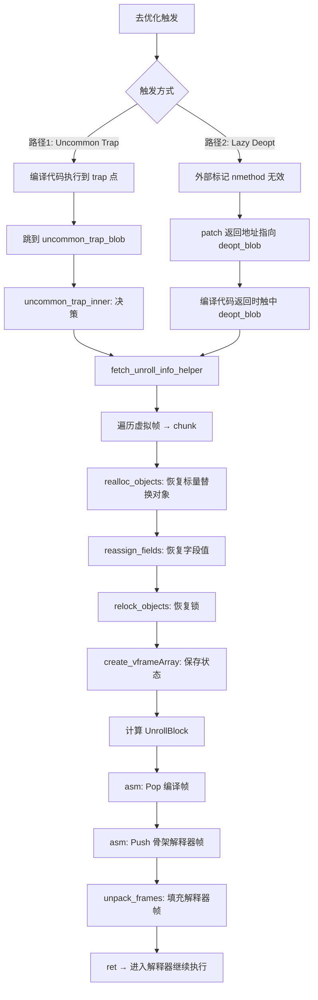

# Deoptimization（去优化）— 完整分析

> 基于 OpenJDK 11 slowdebug，-Xms8g -Xmx8g -XX:+UseG1GC -XX:-TieredCompilation

---

## 第 0 部分：核心原理 ⭐

### 0.1 本质是什么？

去优化的本质是**将编译帧逆向工程为解释器帧**：C2 编译代码的内部状态（寄存器中的值、内联展开的调用栈、标量替换的对象）与解释器完全不同，去优化需要通过 `ScopeDesc`（调试信息）将编译帧解构为虚拟帧（`vframeArray`），然后在栈上重建解释器帧，最终跳回解释器继续执行。

### 0.2 为什么需要？

C2 编译器做了大量**激进假设**（类型特化、分支推测、标量替换、锁消除），这些假设在运行时可能被违反：

- 类型假设：`makeSound(Animal a)` 只见过 `Dog`，C2 内联了 `Dog.sound()`，但运行时传入了 `Cat`
- 分支假设：某个 `if` 分支从未执行，C2 放了 `uncommon_trap`，但运行时走到了这个分支
- 标量替换：对象被拆散为寄存器中的标量，但反优化时需要重建对象

没有去优化，这些激进优化就无法安全地实施。

### 0.3 怎么解决？

**两条路径殊途同归**：
- **Uncommon Trap**（主动）：C2 编译时在"不太可能"的路径插入 `uncommon_trap` 调用，运行时触发时跳到 `uncommon_trap_blob`
- **Lazy Deopt**（被动）：外部事件（类加载、HotSwap）使 nmethod 假设失效，patch 返回地址指向 `deopt_blob`，编译代码正常返回时触中

两条路径最终都走 `fetch_unroll_info_helper` → `unpack_frames`：
1. `fetch_unroll_info_helper`：遍历虚拟帧 → 恢复标量替换对象（`realloc_objects`）→ 恢复锁（`relock_objects`）→ 创建 `vframeArray` → 计算 `UnrollBlock`
2. 汇编 stub：Pop 编译帧 → Push N 个骨架解释器帧
3. `unpack_frames`：填充骨架帧（局部变量 + 表达式栈 + 监视器）

### 0.4 为什么这样设计？

- **为什么用 `vframeArray` 作为中转站？** 编译帧解构和解释器帧重建是两个独立步骤，中间需要一个数据结构保存所有虚拟帧的状态。`vframeArray` 在 C-heap 分配，不受栈操作影响
- **为什么 `PerBytecodeTrapLimit=4`？** 同一 BCI 4 次 trap 后才废弃 nmethod，避免因偶发的类型不匹配就放弃优化；4 次足以区分"偶发"和"持续"的假设违反
- **为什么标量替换恢复需要在堆上重新分配对象？** 标量替换后对象不存在，字段值分散在寄存器/栈中。`SafePointScalarObjectNode` 记录了每个字段值的位置，`realloc_objects` 在堆上重新分配，`reassign_fields` 从这些位置读取值填充
- **为什么 Lazy Deopt 要 patch 返回地址而不是立即去优化？** 编译代码可能正在执行中（在 safepoint 之间），不能立即修改其执行状态。patch 返回地址是一种"延迟触发"机制，等编译代码自然返回时再去优化

---

## 一、问题引入：为什么需要去优化？

C2 编译器在优化时会做很多**激进的假设**：

1. **类型假设**：`makeSound(Animal a)` 只见过 `Dog`，C2 直接内联 `Dog.sound()` 而不走虚调用
2. **非空假设**：`s.length()` 中 `s` 从未为 null，C2 省略 null check
3. **分支假设**：某个 `if` 分支从未被执行过，C2 在该分支放 uncommon trap 而不生成代码
4. **标量替换**：对象不逃逸，被拆散成寄存器中的标量
5. **锁消除**：锁不逃逸，直接消除 synchronized

当这些假设在运行时被**违反**时，编译后的代码无法正确执行，必须**回退到解释器**。这就是去优化（Deoptimization）。

**核心挑战**：编译代码的内部状态（寄存器中的值、栈布局、内联展开的调用栈）和解释器完全不同。去优化需要把编译帧"逆向工程"回解释器帧。

---

## 二、宏观架构

### 2.1 两种去优化路径



### 2.2 路径 1: Uncommon Trap（编译器主动埋设的陷阱）

C2 在编译时，对"不太可能发生"的路径插入 `uncommon_trap` 调用。当运行时真的走到这条路径，触发去优化。

典型场景：
- 类型检查失败（传入了从未见过的类型）
- 分支推测失败（从未走过的分支被走到了）
- 数组越界

### 2.3 路径 2: Lazy Deoptimization（懒式去优化）

外部事件导致 nmethod 的假设被打破（如类加载、HotSwap），nmethod 被标记为 `not_entrant`，帧的返回地址被 patch 为指向 `deopt_blob`。当编译代码正常返回时，触中 deopt_blob 开始去优化。

典型场景：
- 类加载导致依赖失效
- JVMTI RedefineClasses
- 偏向锁撤销

---

## 三、DeoptReason 与 DeoptAction

### 3.1 DeoptReason 完整列表

（来自 `deoptimization.hpp:42-104`）

| Reason | 值 | 记录方式 | 含义 |
|--------|-----|----------|------|
| `none` | 0 | — | 无 |
| `null_check` | 1 | per-BCI | 意外的 null 值 |
| `null_assert` | 2 | per-BCI | 意外的非 null 值 |
| `range_check` | 3 | per-BCI | 数组越界 |
| `class_check` | 4 | per-BCI | 对象类型不匹配 |
| `array_check` | 5 | per-BCI | 数组类型不匹配（aastore） |
| `intrinsic` | 6 | per-BCI | 内部函数操作数异常 |
| `bimorphic` | 7 | per-BCI | 双态内联类型不匹配 |
| `profile_predicate` | 8 | per-BCI | profile predicate 失败 |
| `unloaded` | 9 | per-method | 未加载的类 |
| `uninitialized` | 10 | per-method | 类未初始化 |
| `unreached` | 11 | per-method | 代码不可达 |
| `unhandled` | 12 | per-method | 编译器限制 |
| `constraint` | 13 | per-method | 运行时约束违反 |
| `div0_check` | 14 | per-method | 除零检查 |
| `age` | 15 | per-method | nmethod 太旧 |
| `predicate` | 16 | per-method | 编译器 predicate 失败 |
| `loop_limit_check` | 17 | per-method | 循环限制检查失败 |
| `speculate_class_check` | 18 | per-method | 类型推测失败 |
| `speculate_null_check` | 19 | per-method | null 推测失败 |
| `speculate_null_assert` | 20 | per-method | 非 null 推测失败 |
| `rtm_state_change` | 21 | per-method | RTM 状态变更 |
| `unstable_if` | 22 | per-method | 从未走过的 if 分支被走到 |
| `unstable_fused_if` | 23 | per-method | 融合 if 分支异常 |

### 3.2 DeoptAction 列表

（来自 `deoptimization.hpp:108-115`）

| Action | 值 | 含义 |
|--------|-----|------|
| `Action_none` | 0 | 仅解释执行，不使 nmethod 无效 |
| `Action_maybe_recompile` | 1 | 可能重编译，不必使 nmethod 无效 |
| `Action_reinterpret` | 2 | 使 nmethod 无效，回解释器运行一段时间 |
| `Action_make_not_entrant` | 3 | 使 nmethod 无效，立即重编译 |
| `Action_make_not_compilable` | 4 | 使 nmethod 无效，不再编译 |

### 3.3 trap_request 编码

`trap_request` 是一个 32 位整数，编码 reason + action + debug_id：

```
位 [2:0]   → action (3 bit)
位 [7:3]   → reason (5 bit)
位 [30:8]  → debug_id (23 bit)
```

- `trap_request >= 0`：表示常量池索引（`Reason_unloaded` + `Action_reinterpret`）
- `trap_request < 0`：`~trap_request` 提取 reason 和 action

**示例解码**：
- `trap_request = -34`：`~(-34) = 33 = 0b_00100_001` → action=1(`maybe_recompile`), reason=4(`class_check`)
- `trap_request = -179`：`~(-179) = 178 = 0b_10110_010` → action=2(`reinterpret`), reason=22(`unstable_if`)

---

## 四、Uncommon Trap 路径详解

### 4.1 C2 编译时植入 uncommon trap

```
graphKit.cpp:2027-2148

GraphKit::uncommon_trap(trap_request, klass, comment) {
    // 设置栈指针为 reexecute 状态
    set_sp(reexecute_sp());
    
    reason = trap_request_reason(trap_request);
    action = trap_request_action(trap_request);
    
    // 如果重编译过多，降级为 Action_none（放弃优化）
    if (too_many_recompiles(reason)) {
        action = Action_none;
    }
    
    // 调整 guard if 的概率（使 uncommon trap 方向概率极低）
    // 这影响后续优化决策
    
    // ★ 核心：插入 runtime call 到 uncommon_trap_blob
    make_runtime_call(
        OptoRuntime::uncommon_trap_Type(),
        SharedRuntime::uncommon_trap_blob()->entry_point(),
        "uncommon_trap",
        intcon(trap_request)  // trap_request 编码了 reason + action
    );
    
    // 添加 Halt 节点（uncommon trap 不应返回）
    new HaltNode(control(), "uncommon trap returned");
}
```

### 4.2 uncommon_trap_blob（x86 汇编）

```
sharedRuntime_x86_64.cpp:3185-3309

uncommon_trap_blob:
    // trap_request 在 j_rarg0（rdi）中
    
    // 1. 建立简单帧
    push rbp
    sub rsp, SimpleRuntimeFrame_size
    
    // 2. 调用 C++ 函数
    mov c_rarg0, r15_thread
    mov c_rarg1, trap_request    // j_rarg0 传入的 trap_request
    mov c_rarg2, Unpack_uncommon_trap
    call Deoptimization::uncommon_trap(thread, trap_request, exec_mode)
    // 返回 UnrollBlock*
    
    // 3. Pop 被去优化的编译帧
    rsp += size_of_deoptimized_frame
    rbp = initial_info
    
    // 4. Push N 个骨架解释器帧（循环）
    for i in 0..number_of_frames:
        push frame_pcs[i]    // 返回地址
        push rbp             // frame pointer
        sub rsp, frame_sizes[i] - 2*wordSize
    push frame_pcs[last]     // 最终返回地址
    
    // 5. 调用 unpack_frames 填充骨架帧
    push rbp
    sub rsp, register_save_area
    call Deoptimization::unpack_frames(thread, Unpack_uncommon_trap)
    
    // 6. 恢复 + 返回到解释器
    leave
    ret  // → 跳到最年轻帧的解释器 deopt_entry
```

### 4.3 uncommon_trap_inner：核心决策逻辑

```
deoptimization.cpp:1528-1988

uncommon_trap_inner(thread, trap_request) {
    // 1. 解码 trap_request
    reason = trap_request_reason(trap_request);
    action = trap_request_action(trap_request);
    
    // 2. 获取 trap 位置
    vf = vframe::new_vframe(...)
    trap_method = trap_scope->method();
    trap_bci = trap_scope->bci();
    trap_bc = trap_method->java_code_at(trap_bci);
    
    // 3. 获取/创建 MethodData
    trap_mdo = get_method_data(thread, profiled_method);
    
    // 4. 如果是 unloaded class 触发的，尝试加载
    if (unloaded_class_index >= 0) {
        load_class_by_index(constants, unloaded_class_index);
    }
    
    // 5. 决策逻辑
    make_not_entrant = false;
    make_not_compilable = false;
    reprofile = false;
    
    switch (action) {
        case Action_none:             break;
        case Action_maybe_recompile:  break;
        case Action_reinterpret:      make_not_entrant = true; reprofile = true; break;
        case Action_make_not_entrant: make_not_entrant = true; break;
        case Action_make_not_compilable: make_not_entrant = true; make_not_compilable = true; break;
    }
    
    // 6. 基于 ProfileTraps 的精细控制
    if (ProfileTraps && trap_mdo != NULL) {
        // 更新 per-BCI trap 历史
        // 检查同一 BCI 的 trap 次数
        if (this_trap_count >= PerBytecodeTrapLimit) {  // 默认=4
            make_not_entrant = true;  // 太多 trap，强制重编译
        }
        
        // 检查重编译次数
        if (make_not_entrant && overflow_recompile_count > PerBytecodeRecompilationCutoff) {  // 默认=200
            make_not_compilable = true;  // 放弃编译
        }
        
        // 检查 per-method trap 限制
        if (this_trap_count >= per_method_trap_limit) {
            make_not_entrant = true;
        }
    }
    
    // 7. 执行决策
    if (make_not_entrant) {
        nm->make_not_entrant();
    }
    if (reprofile) {
        reprofile(trap_scope, nm->is_osr_method());
    }
    if (make_not_compilable) {
        method->set_not_compilable(CompLevel_full_optimization);
    }
}
```

---

## 五、Lazy Deopt 路径详解

### 5.1 触发标记

```
nmethod.cpp / codeCache.cpp

// 场景1: 类加载导致依赖失效
CodeCache::mark_for_deoptimization(KlassDepChange& changes) {
    遍历所有 nmethod 的依赖链
    if (依赖被打破) {
        nm->mark_for_deoptimization();
    }
}

// 场景2: JVMTI RedefineClasses
CodeCache::mark_for_evol_deoptimization(dependee) {
    遍历所有引用 dependee 方法的 nmethod
    nm->mark_for_deoptimization();
}

// 执行去优化（在 safepoint）
VM_Deoptimize::doit() {
    对所有被标记的 nmethod 执行 deoptimize()
}
```

### 5.2 Patch 返回地址

```
deoptimization.cpp:1340-1385

deoptimize_single_frame(thread, fr, reason) {
    // ★ 关键：patch 帧的返回地址
    fr.deoptimize(thread);
    // 这会将帧的返回 PC 修改为指向 deopt_blob 的入口
    // 当编译代码正常返回时，会跳到 deopt_blob
}
```

### 5.3 deopt_blob（x86 汇编）

```
sharedRuntime_x86_64.cpp:2813-3181

deopt_blob 有 4 个入口点:
  ┌─ start (offset 0):            Unpack_deopt        ← 普通去优化
  ├─ reexecute_offset:            Unpack_reexecute     ← 重执行
  ├─ exception_offset:            Unpack_exception     ← 有异常
  └─ exception_in_tls_offset:     Unpack_exception     ← 异常在 TLS 中

Common path:
    1. 保存所有寄存器（包括 XMM）
    2. 设置 r14 = exec_mode (Unpack_deopt/Unpack_exception/...)
    3. call fetch_unroll_info(thread, exec_mode)
       → 返回 UnrollBlock*
    4. 恢复返回值寄存器
    5. Pop 被去优化的帧 (rsp += deopt_frame_size)
    6. rbp = initial_info
    7. Push 骨架解释器帧 (循环 N 次)
    8. Push self-frame
    9. call unpack_frames(thread, exec_mode)
       → 填充骨架帧
    10. 恢复返回值 (rax, xmm0)
    11. leave + ret → 进入解释器
```

---

## 六、核心算法：fetch_unroll_info_helper

这是去优化的核心函数，负责将编译帧"解构"为虚拟帧。

```
deoptimization.cpp:160-538

fetch_unroll_info_helper(thread, exec_mode) {
    // 1. 获取被去优化的帧
    stub_frame = thread->last_frame();
    deoptee = stub_frame.sender();   // 编译帧
    
    // 2. 遍历所有内联虚拟帧
    // 一个编译帧可能对应多个 Java 方法（因为内联）
    chunk = []
    vf = vframe::new_vframe(&deoptee, &map, thread);
    while (!vf->is_top()) {
        chunk.push(compiledVFrame::cast(vf));
        vf = vf->sender();
    }
    chunk.push(compiledVFrame::cast(vf));  // 最外层帧
    // chunk[0] = 最年轻帧（最内层内联方法）
    // chunk[N-1] = 最老帧（最外层方法）
    
    // 3. 恢复标量替换对象（逃逸分析优化的逆操作）
    if (EliminateAllocations) {
        objects = chunk[0]->scope()->objects();
        if (objects != NULL) {
            // ★ 在堆上重新分配被标量替换的对象
            realloc_objects(thread, &deoptee, objects);
            // ★ 从寄存器/栈位置恢复字段值
            reassign_fields(&deoptee, &map, objects);
        }
    }
    
    // 4. 恢复锁（锁消除的逆操作）
    if (EliminateLocks) {
        for (cvf in chunk) {
            relock_objects(cvf->monitors(), thread);
        }
    }
    
    // 5. 创建 vframeArray
    array = create_vframeArray(thread, deoptee, &map, chunk);
    thread->set_vframe_array_head(array);
    
    // 6. 计算每个解释器帧的大小和 PC
    frame_sizes = new int[N];
    frame_pcs = new address[N + 1];
    
    for (index = 0; index < N; index++) {
        // 注意：frame_sizes 是从外到内排列
        frame_sizes[N-1-index] = element(index)->on_stack_size(...);
        frame_pcs[N-1-index] = Interpreter::deopt_entry(vtos, 0);
    }
    
    // 7. 计算调用者栈调整量
    if (caller_is_compiled) {
        caller_adjustment = last_frame_adjust(0, callee_locals);
    }
    
    // 8. 构建 UnrollBlock
    return new UnrollBlock(deopt_frame_size, caller_adjustment,
                           N, frame_sizes, frame_pcs, return_type, exec_mode);
}
```

---

## 七、vframeArray：帧状态中转站

### 7.1 内存布局

```cpp
// src/hotspot/share/runtime/vframeArray.hpp:60
class vframeArrayElement {
 public:
  frame        _frame;          // ★ 原始编译帧（用于提取寄存器值）
  int          _bci;            // ★ 当前 BCI（去优化后从此处继续执行）
  bool         _reexecute;      // ★ 是否重新执行当前字节码（uncommon_trap 时为 true）
  Method*      _method;         // ★ 对应的 Java 方法
  MonitorChunk* _monitors;      // 监视器列表（锁消除恢复用）
  StackValueCollection* _locals;      // ★ 局部变量集合
  StackValueCollection* _expressions; // ★ 表达式栈集合
};

class vframeArray: public CHeapObj<mtCompiler> {
 private:
  JavaThread*   _owner_thread;  // ★ 所属线程
  vframeArray*  _next;          // 链表（线程可能有多个 vframeArray）
  frame         _original;      // ★ 被去优化的编译帧
  frame         _caller;        // 调用者帧
  frame         _sender;        // 发送者帧
  UnrollBlock*  _unroll_block;  // ★ 解包信息（frame_sizes + frame_pcs）
  int           _frames;        // ★ 虚拟帧数量（内联深度 + 1）
  intptr_t      _callee_registers[RegisterImpl::number_of_registers]; // 被调用者保存寄存器
  vframeArrayElement _elements[1]; // ★ 变长数组（实际大小 = _frames）
};
```

**sizeof(vframeArray)**：基础部分约 **120 字节** + `_elements[N]`（每个 `vframeArrayElement` 约 80 字节）；从 `CHeapObj<mtCompiler>` 分配（C-heap）。

**创建位置**：`Deoptimization::create_vframeArray()` 中 `new(nof_frames) vframeArray(thread, frame_count, ...)` 创建；`thread->set_vframe_array_head(array)` 挂到线程链表头。

**关键字段生命周期**：
- `_elements[i]._locals`：`fill_in()` 中从编译帧的 `ScopeDesc` 读取局部变量值创建；`unpack_on_stack()` 中写入骨架解释器帧后不再需要
- `_elements[i]._bci`：从 `compiledVFrame::bci()` 读取；`unpack_on_stack()` 中用于计算解释器续行 PC
- `_elements[i]._reexecute`：`uncommon_trap` 时为 true（重新执行触发 trap 的字节码）；`deopt` 时为 false（从下一条字节码继续）
- `_unroll_block`：`fetch_unroll_info_helper()` 中计算并设置；汇编 stub 读取 `frame_sizes`/`frame_pcs` 构建骨架帧；`unpack_frames()` 后释放

```
vframeArray（C-heap 分配）
┌────────────────────────────────────────────────────┐
│ _owner_thread (JavaThread*)                        │
│ _next (vframeArray*)                               │
│ _original (原编译帧)                               │
│ _caller (调用者帧)                                 │
│ _sender (发送者帧)                                 │
│ _unroll_block (UnrollBlock*)                       │
│ _frames (帧数 N)                                   │
│ _callee_registers[]                                │
├────────────────────────────────────────────────────┤
│ vframeArrayElement[0] ← 最年轻帧（最内层内联方法） │
│   _method, _bci, _reexecute                        │
│   _locals (StackValueCollection*)                  │
│   _expressions (StackValueCollection*)             │
│   _monitors (MonitorChunk*)                        │
├────────────────────────────────────────────────────┤
│ vframeArrayElement[1]                              │
│   ...                                              │
├────────────────────────────────────────────────────┤
│ vframeArrayElement[N-1] ← 最老帧（最外层方法）     │
│   _method, _bci, _reexecute                        │
│   _locals, _expressions, _monitors                 │
└────────────────────────────────────────────────────┘
```

### 7.2 unpack_on_stack：写入骨架帧

```
vframeArray.cpp:171-479

unpack_on_stack(caller, is_top_frame, is_bottom_frame, exec_mode) {
    // 1. 确定续行 PC
    if (should_reexecute()) {
        pc = Interpreter::deopt_reexecute_entry(method, bcp);
    } else {
        pc = Interpreter::deopt_continue_after_entry(method, bcp, ...);
    }
    
    // 2. 顶层帧的特殊处理
    if (is_top_frame) {
        switch (exec_mode) {
            case Unpack_deopt:      // 使用已计算的 pc
            case Unpack_exception:  pc = exception_handler(pc); break;
            case Unpack_uncommon_trap / Unpack_reexecute:
                pc = Interpreter::deopt_entry(vtos, 0); break;
        }
    }
    
    // 3. 布局解释器帧
    Interpreter::layout_activation(method, temps, monitors, caller, iframe, ...);
    
    // 4. Patch PC
    iframe->patch_pc(thread, pc);
    
    // 5. 恢复 Monitor
    for (mon in monitors) {
        copy BasicObjectLock to frame
    }
    
    // 6. 设置 BCP 和 MDP
    iframe->set_bcp(bcp);
    if (ProfileInterpreter) iframe->set_mdp(...);
    
    // 7. 恢复表达式栈
    for (i = 0; i < expressions.size; i++) {
        iframe->expression_stack_at(i) = expressions[i];
    }
    
    // 8. 恢复局部变量
    for (i = 0; i < locals.size; i++) {
        iframe->local_at(i) = locals[i];
    }
}
```

---

## 八、标量替换对象的恢复

这是去优化中最精妙的部分——将逃逸分析消除的堆分配"逆操作"回来。

### 8.1 编译时：标量替换

```
编译代码中，Point p = new Point(x, y) 被替换为：
  reg1 = x;  // p.x 在寄存器中
  reg2 = y;  // p.y 在寄存器中
  // 没有 Point 对象！

在 SafePoint 的 OopMap/DebugInfo 中记录：
  SafePointScalarObjectNode {
      type = Point,
      fields = [
          ScopeValue(reg1, offset=12, type=int),  // x
          ScopeValue(reg2, offset=16, type=int),  // y
      ]
  }
```

### 8.2 去优化时：重建对象

```
deoptimization.cpp:811-856, 981-1112

realloc_objects(thread, fr, objects) {
    for (ObjectValue sv : objects) {
        k = sv->klass();
        // 在堆上重新分配对象
        if (k is InstanceKlass) {
            obj = ik->allocate_instance();
        } else if (k is TypeArrayKlass) {
            obj = ak->allocate(len);
        } else if (k is ObjArrayKlass) {
            obj = ak->allocate(len);
        }
        sv->set_value(obj);  // 记录新地址
    }
}

reassign_fields(fr, reg_map, objects) {
    for (ObjectValue sv : objects) {
        // 按字段 offset 排序所有非静态字段
        // 从 ScopeValue（寄存器/栈位置）读取值
        // 写入新分配的对象
        for (field in sorted_fields) {
            value = read_from_scope_value(fr, reg_map, field.scope_value);
            obj->field_at(field.offset) = value;
        }
    }
}
```

---

## 九、nmethod 状态管理

### 9.1 nmethod 生命周期

```
┌────────────┐    make_not_entrant()    ┌──────────────┐
│   alive     │ ─────────────────────→ │  not_entrant  │
│  (in_use)   │                        │ （不接受新入口 │
└────────────┘                        │  但已有执行继续）│
                                       └──────┬───────┘
                                              │ 没有帧引用
                                              ↓
                                       ┌──────────────┐
                                       │   zombie      │
                                       │ （可回收）     │
                                       └──────┬───────┘
                                              │ sweeper 回收
                                              ↓
                                       ┌──────────────┐
                                       │  unloaded     │
                                       │ （已释放）     │
                                       └──────────────┘
```

### 9.2 make_not_entrant_or_zombie

```
nmethod.cpp:1145-1270

make_not_entrant_or_zombie(state) {
    // 1. Patch 入口点 → wrong_method_stub
    //    后续调用者会走到 SharedRuntime::handle_wrong_method()
    //    重新查找正确的 nmethod 或回退到解释器
    NativeJump::patch_verified_entry(
        entry_point(), verified_entry_point(),
        SharedRuntime::get_handle_wrong_method_stub()
    );
    
    // 2. 更新状态
    _state = state;
    
    // 3. 清除 Method 中的引用
    if (method()->code() == this) {
        method()->clear_code();
    }
    
    // 4. zombie 状态额外处理
    if (state == zombie) {
        flush_dependencies();
    }
}
```

---

## 十、GDB 验证

### 10.1 测试程序

```java
package com.wjcoder;

public class DeoptTest {
    static interface Animal { int sound(); }
    static class Dog implements Animal { public int sound() { return 1; } }
    static class Cat implements Animal { public int sound() { return 2; } }

    static int makeSound(Animal a) { return a.sound(); }

    public static void main(String[] args) {
        Dog dog = new Dog();
        Cat cat = new Cat();
        int sum = 0;

        // Phase 1: Warm up with Dog only → C2 优化为直接调用 Dog.sound()
        for (int i = 0; i < 20000; i++) { sum += makeSound(dog); }

        // Phase 2: Introduce Cat → 触发 class_check uncommon trap
        for (int i = 0; i < 100; i++) { sum += makeSound(cat); }
    }
}
```

### 10.2 TraceDeoptimization 输出

```bash
java -Xms8g -Xmx8g -XX:+UseG1GC -XX:-TieredCompilation \
     -XX:+PrintCompilation -XX:+TraceDeoptimization \
     -XX:+UnlockDiagnosticVMOptions \
     -cp demo/src com.wjcoder.DeoptTest
```

输出（摘录）：
```
Phase 1: Warming up with Dog only...
  1503   97  com.wjcoder.DeoptTest::makeSound (7 bytes)       ← C2 编译
  1504   98  com.wjcoder.DeoptTest$Dog::sound (2 bytes)       ← Dog.sound() 被内联

Phase 2: Introducing Cat (should trigger deopt)...
Uncommon trap bci=1 pc=0x..., method=DeoptTest.makeSound
  reason=class_check action=maybe_recompile                   ← 第1次: Cat != Dog
DEOPT UNPACKING thread 0x... vframeArray 0x... mode 2

Uncommon trap ... reason=class_check action=maybe_recompile   ← 第2次
Uncommon trap ... reason=class_check action=maybe_recompile   ← 第3次
Uncommon trap ... reason=class_check action=maybe_recompile   ← 第4次
  1618   97  DeoptTest::makeSound (7 bytes) made not entrant  ← 4次后 nmethod 被废弃
```

**关键观察**：
- `class_check` + `maybe_recompile`：C2 为 `Dog` 做了类型特化，`Cat` 触发 trap
- 第 4 次后 nmethod 被标记为 `not_entrant`（`PerBytecodeTrapLimit=4`）
- 之后 C2 会重新编译 `makeSound`，这次知道有 Dog 和 Cat 两种类型

### 10.3 GDB 断点验证

使用脚本 `new-jvm-md/tmp-file/deopt/verify-deopt.gdb`：

```bash
gdb -batch -x new-jvm-md/tmp-file/deopt/verify-deopt.gdb
```

**GDB 统计结果**：

| 断点 | 命中次数 | 说明 |
|------|---------|------|
| `uncommon_trap_inner` | 8 | 4 次 class_check + 3 次 unstable_if + 1 次其他 |
| `fetch_unroll_info_helper` | 8 | 与 uncommon_trap 一一配对 |
| `unpack_frames` | 8 | 每次 uncommon trap 都需要解包帧 |
| `realloc_objects` | 1 | 某个 nmethod 有标量替换对象需要恢复 |
| `relock_objects` | 1 | 某个 nmethod 有锁消除需要恢复 |

**trap_request 解码验证**：
- `trap_request = -34`：`class_check` + `maybe_recompile` ✅
- `trap_request = -179`：`unstable_if` + `reinterpret` ✅

### 10.4 JVM 参数对照表

| 参数 | 作用 | 默认值 |
|------|------|--------|
| `-XX:+TraceDeoptimization` | 打印去优化详细信息（需 UnlockDiagnosticVMOptions） | 关闭 |
| `-XX:+PrintCompilation` | 打印编译事件，`made not entrant` 标记 | 关闭 |
| `PerBytecodeTrapLimit` | 同一 BCI 的 trap 次数阈值，超过后使 nmethod 无效 | 4 |
| `PerBytecodeRecompilationCutoff` | 重编译次数上限，超过后放弃编译 | 200 |
| `PerMethodTrapLimit` | 单方法 trap 次数限制 | 100 |
| `-XX:+EliminateAllocations` | 启用标量替换 | 开启 |
| `-XX:+EliminateLocks` | 启用锁消除 | 开启 |
| `-XX:+WizardMode` | 输出更详细的去优化信息（develop） | 关闭 |

---

## 十一、源文件清单

| 文件 | 关键内容 |
|------|---------|
| `runtime/deoptimization.hpp` | DeoptReason/DeoptAction 枚举、UnrollBlock |
| `runtime/deoptimization.cpp:160-538` | `fetch_unroll_info_helper`（核心算法） |
| `runtime/deoptimization.cpp:625-799` | `unpack_frames` |
| `runtime/deoptimization.cpp:811-1140` | `realloc_objects`、`reassign_fields`、`relock_objects` |
| `runtime/deoptimization.cpp:1340-1448` | `deoptimize`、`deoptimize_single_frame`、`deoptimize_frame` |
| `runtime/deoptimization.cpp:1528-1988` | `uncommon_trap_inner`（决策逻辑） |
| `runtime/vframeArray.hpp` | `vframeArray`、`vframeArrayElement` 结构 |
| `runtime/vframeArray.cpp:60-167` | `fill_in` |
| `runtime/vframeArray.cpp:171-479` | `unpack_on_stack` |
| `runtime/vframeArray.cpp:502-621` | `allocate`、`unpack_to_stack` |
| `cpu/x86/sharedRuntime_x86_64.cpp:2813-3181` | `generate_deopt_blob` |
| `cpu/x86/sharedRuntime_x86_64.cpp:3185-3309` | `generate_uncommon_trap_blob` |
| `code/nmethod.cpp:1145-1270` | `make_not_entrant_or_zombie` |
| `opto/graphKit.cpp:2027-2148` | `uncommon_trap`（C2 编译时植入） |

---

## 十二、总结

### 12.1 去优化完整时间线

```
┌─────────────────────────────────────────────────────────────────────┐
│                    去优化完整时间线                                   │
├─────────────────────────────────────────────────────────────────────┤
│                                                                     │
│ [编译时]                                                            │
│  C2 编译 makeSound()：                                              │
│  - 内联 Dog.sound()（因为 profile 只见过 Dog）                       │
│  - 在 invokeinterface 处插入 class_check guard                      │
│  - guard 失败 → uncommon_trap(class_check, maybe_recompile)         │
│                                                                     │
│ [运行时 - Phase 1]                                                  │
│  一切正常：makeSound(dog) → 走优化路径（内联的 Dog.sound()）         │
│                                                                     │
│ [运行时 - Phase 2]                                                  │
│  makeSound(cat) → class_check guard 失败！                          │
│  ↓                                                                  │
│  跳到 uncommon_trap_blob                                            │
│  ↓                                                                  │
│  uncommon_trap_inner:                                               │
│    reason=class_check, action=maybe_recompile                       │
│    更新 MethodData trap 统计                                        │
│    第 1-3 次：不使 nmethod 无效（maybe_recompile）                   │
│    第 4 次：PerBytecodeTrapLimit 达到 → make_not_entrant()           │
│  ↓                                                                  │
│  fetch_unroll_info_helper:                                          │
│    遍历虚拟帧 → chunk（可能有内联帧）                               │
│    恢复标量替换对象（如有）                                          │
│    恢复被消除的锁（如有）                                            │
│    创建 vframeArray                                                 │
│    计算 UnrollBlock（frame_sizes + frame_pcs）                      │
│  ↓                                                                  │
│  汇编 stub:                                                        │
│    Pop 编译帧                                                       │
│    Push N 个骨架解释器帧                                            │
│  ↓                                                                  │
│  unpack_frames:                                                     │
│    vframeArray::unpack_to_stack()                                   │
│    对每个帧：layout_activation + 恢复 locals + expressions + monitors│
│  ↓                                                                  │
│  ret → 进入解释器 deopt_entry 继续执行                              │
│                                                                     │
│ [后续]                                                              │
│  解释器执行积累新 profile 数据（现在包含 Cat 信息）                  │
│  达到编译阈值 → C2 重新编译（这次知道 Dog + Cat）                   │
│  新的 nmethod 处理多态调用                                          │
│                                                                     │
└─────────────────────────────────────────────────────────────────────┘
```

### 12.2 核心要点

1. **去优化是乐观优化的安全网**：C2 敢做激进假设，是因为有去优化兜底
2. **两条路径殊途同归**：Uncommon Trap 和 Lazy Deopt 最终都走 `fetch_unroll_info` → `unpack_frames`
3. **vframeArray 是中转站**：先将编译帧解构为虚拟帧（C-heap），再写入骨架解释器帧
4. **标量替换恢复是逆操作**：去优化时在堆上重新分配对象，从寄存器/栈恢复字段值
5. **去优化不是失败而是学习**：每次 trap 都会更新 profile 数据，下次重编译会做出更好的决策
6. **PerBytecodeTrapLimit=4**：同一 BCI 4 次 trap 后才废弃 nmethod，避免过度反应

### 12.3 常见面试问答

**Q: 去优化时编译代码的返回值怎么处理？**
A: 返回值保存在寄存器（rax/xmm0）中。deopt_blob 在调用 fetch_unroll_info 前保存这些寄存器，在 unpack_frames 后恢复，最终传递给解释器。

**Q: 去优化后方法还会被重新编译吗？**
A: 取决于 DeoptAction。`maybe_recompile` 允许重编译；`reinterpret` 先回解释器一段时间再编译；`make_not_compilable` 永远不再编译。正常情况下会重新编译，但带有更准确的 profile 信息。

**Q: 内联导致一个编译帧对应多个 Java 方法，去优化怎么处理？**
A: `fetch_unroll_info_helper` 遍历 `deoptee` 帧的所有虚拟帧（通过 ScopeDesc 链），每个内联方法对应一个 `vframeArrayElement`，然后展开为独立的解释器帧。

**Q: 标量替换的对象在去优化时怎么恢复？**
A: 通过 `realloc_objects` 在堆上重新分配对象，`reassign_fields` 从 ScopeValue（指向寄存器或栈位置）读取字段值并写入新对象。SafePointScalarObjectNode 在编译时记录了对象的类型、字段偏移和值的位置。
