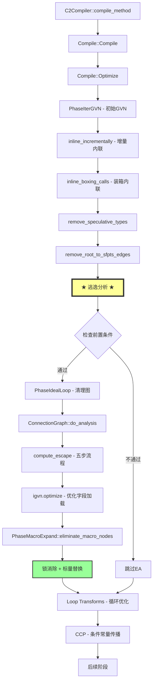
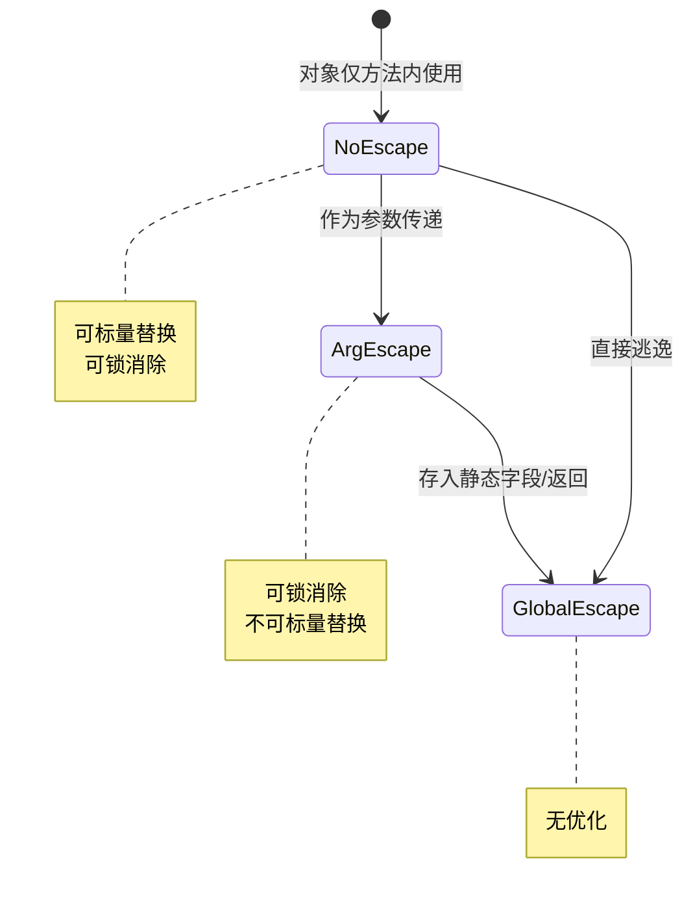

# 逃逸分析与标量替换深度解析 — 从 ConnectionGraph 到优化落地

> 基于 OpenJDK 11 源码分析  
> 标准环境：-Xms8g -Xmx8g -XX:+UseG1GC  
> 源码路径：src/hotspot/share/opto/escape.{hpp,cpp}, macro.cpp  
> 论文基础：[Choi99] *"Escape Analysis for Java"*, OOPSLA 1999

---

## 第 0 部分：核心原理 ⭐

### 0.1 本质是什么？

本文对 **逃逸分析与标量替换深度解析 — 从 ConnectionGraph 到优化落地** 进行源码级分析：追踪关键函数的执行路径，分析涉及的数据结构，解释每个设计决策的原因。

### 0.2 为什么需要？

仅靠文档和注释无法完全理解 JVM 的行为——很多关键细节只存在于源码中。源码级分析能建立对 JVM 行为的精确理解。

### 0.3 怎么解决？

从入口函数出发，自顶向下追踪调用链；对每个关键函数，分析其输入/输出/副作用；对每个数据结构，分析其字段含义和生命周期。

### 0.4 为什么这样设计？

分析过程中重点关注「为什么」：为什么选择这个数据结构？为什么这样处理边界情况？这些问题的答案往往揭示了 JVM 设计的精髓。

---


## 0. 核心原理

### 0.1 本质是什么？

**逃逸分析（Escape Analysis）是 C2 编译器的一项静态分析技术，它通过构建对象的引用关系图，判断对象是否会"逃逸"出当前线程或方法的控制范围，从而决定是否可以优化对象的内存分配和同步操作。**

一句话概括：**分析对象的生命周期边界，将"局部对象"从堆内存中解放出来。**

### 0.2 为什么需要？

Java 的对象分配默认在堆上，但很多对象的实际生命周期很短：

```java
// 典型场景：方法内部的临时对象
int distance(int x1, int y1, int x2, int y2) {
    Point p1 = new Point(x1, y1);  // 仅在方法内使用
    Point p2 = new Point(x2, y2);  // 仅在方法内使用
    int dx = p1.x - p2.x;
    int dy = p1.y - p2.y;
    return dx * dx + dy * dy;
}
```

**问题**：
- 两个 Point 对象分配在堆上
- 方法返回后就无人引用
- 触发 Young GC 才能回收
- 大量临时对象 → GC 压力大 → 停顿时间长

**另一个场景：无竞争的锁**

```java
String concat(String a, String b) {
    StringBuffer sb = new StringBuffer();  // 局部对象
    sb.append(a);   // StringBuffer.append 是 synchronized
    sb.append(b);
    return sb.toString();
}
```

**问题**：
- sb 是局部对象，不会被其他线程访问
- synchronized 的 Lock/Unlock 是浪费
- 锁竞争、内存屏障都有开销

**没有逃逸分析的代价**：
- 大量短命对象在 Eden 分配
- Young GC 频繁
- 无竞争锁仍需同步原语
- CPU 内存屏障指令开销

### 0.3 怎么解决？

**核心思路**：静态分析对象的引用关系，识别"不逃逸"的对象，针对性优化。

**三大优化**：

| 优化 | 条件 | 效果 | 性能提升 |
|------|------|------|----------|
| **标量替换** | NoEscape + scalar_replaceable | 对象消失，字段变成寄存器/栈变量 | 零堆分配 |
| **锁消除** | NoEscape 或 ArgEscape | 删除 synchronized 的 Lock/Unlock | 无锁开销 |
| **栈上分配** | NoEscape | 对象分配在栈帧（HotSpot 未实现） | 用标量替换替代 |

**实现方式**：
1. C2 编译阶段构建连接图（Connection Graph）
2. 图节点 = 对象，边 = 引用关系
3. 不动点迭代传播逃逸状态
4. 根据逃逸状态决定优化策略

### 0.4 为什么这样设计？

**为什么基于连接图而不是简单的作用域分析？**

简单的作用域分析无法处理复杂的引用链：

```java
Point p = new Point(1, 2);
Point q = p;           // 别名
Point r = process(q);  // 传递
global = r;            // 逃逸！
```

只有连接图能追踪这种复杂的引用传播路径。

**为什么用流无关（flow-insensitive）分析？**

流有关分析需要考虑控制流分支，复杂度太高。流无关分析虽然保守（可能漏掉一些优化机会），但：
- 复杂度可控（O(n) 节点数）
- 实际效果足够好（大部分对象要么逃逸要么不逃逸，"有时逃逸"的场景少）

**为什么标量替换比栈上分配更优？**

| 对比维度 | 栈上分配 | 标量替换 |
|---------|---------|---------|
| 对象结构 | 保留 | 消失 |
| 字段位置 | 栈帧 | 寄存器/栈变量 |
| 内存开销 | 栈空间 | 可能无（寄存器） |
| 寄存器优化 | 无法 | 可以 |

标量替换更彻底——对象概念消失，字段可能被优化到寄存器，连栈空间都不需要。

**为什么需要 safepoint 保存字段值？**

反优化时需要重建栈帧：

```java
int foo() {
    Point p = new Point(1, 2);  // 标量替换 → p.x=1, p.y=2
    // safepoint 此处
    return p.x + p.y;
}
```

如果在 safepoint 处发生反优化（如要去解释器执行），需要重建 Point 对象。所以标量替换时会在 safepoint 的调试信息中保存字段值 `SafePointScalarObjectNode`。

---

## 1. 问题引入：为什么需要逃逸分析？

Java 的每个对象都分配在堆上，由 GC 管理。但很多对象其实——
- **只在一个方法内使用**，方法返回后就没人引用了
- **只在一个线程内使用**，从不被其他线程看到
- **即使加了 synchronized**，实际运行时也没有竞争

对这些对象，堆分配 + GC 回收 + 锁操作全是浪费。逃逸分析（Escape Analysis, EA）就是 C2 编译器用来**识别这类对象**的技术，识别后可以做三种优化：

|| 优化 | 条件 | 效果 |
||------|------|------|
|| **标量替换** (Scalar Replacement) | NoEscape + scalar_replaceable | 把对象拆成独立的局部变量，不分配堆内存 |
|| **锁消除** (Lock Elimination) | NoEscape 或 ArgEscape（不逃逸线程） | 移除 synchronized 的 Lock/Unlock 节点 |
|| **栈上分配** (Stack Allocation) | NoEscape | HotSpot 11 **未实现**，用标量替换间接替代 |

> **注意**：HotSpot 11 没有真正的栈上分配。标量替换比栈上分配更彻底——不仅避免了堆分配，连对象这个概念都消失了，字段变成了独立的寄存器/栈变量。

---

## 2. 逃逸分析在编译管道中的位置

> 源码：`opto/compile.cpp:2309-2339`, `opto/c2compiler.cpp:103-139`

逃逸分析发生在 C2 的 `Compile::Optimize()` 中，位于内联完成之后、循环优化之前：



### 2.1 前置条件检查

```cpp
// c2compiler.cpp:107-108
bool do_escape_analysis = DoEscapeAnalysis              // -XX:+DoEscapeAnalysis (默认 true)
                       && !env->should_retain_local_variables()  // 不保留局部变量（调试）
                       && !env->jvmti_can_get_owned_monitor_info(); // 无 JVMTI 监控
```

EA 在以下情况被**禁用**：
- `-XX:-DoEscapeAnalysis`
- JVMTI agent 需要访问监视器信息（`can_get_owned_monitor_info`）
- 调试模式需要保留局部变量

### 2.2 候选检查

```cpp
// escape.cpp:78-97
bool ConnectionGraph::has_candidates(Compile *C) {
  int cnt = C->macro_count();
  for (int i = 0; i < cnt; i++) {
    Node *n = C->macro_node(i);
    if (n->is_Allocate()) return true;         // 有分配节点
    if (n->is_Lock()) {                        // 有锁节点
      Node* obj = n->as_Lock()->obj_node()->uncast();
      if (!(obj->is_Parm() || obj->is_Con())) return true;  // 且锁对象不是参数/常量
    }
    if (n->is_CallStaticJava() &&
        n->as_CallStaticJava()->is_boxing_method()) return true;  // 有装箱调用
  }
  return false;
}
```

只有当 IR 中存在 `Allocate`、`Lock`（锁的对象不是方法参数或常量）、或装箱方法调用时，才有 EA 的必要。

### 2.3 失败重试机制

```cpp
// c2compiler.cpp:128-133
if (C.failure_reason_is(retry_no_escape_analysis())) {
  do_escape_analysis = false;
  continue;  // 关闭 EA 重新编译
}
```

如果 EA 导致编译失败（节点数超限等），C2 自动关闭 EA 重试。同样的机制也存在于锁粗化和装箱消除。

---

## 3. 两层逃逸分析架构

HotSpot 有两层 EA 实现：

|| 层次 | 类 | 时机 | 精度 | 用途 |
||------|-----|------|------|------|
|| **字节码级** | `BCEscapeAnalyzer` | 方法首次被 CI 加载时 | 保守（快速） | 跨方法参数逃逸信息，辅助内联决策 |
|| **C2 IR 级** | `ConnectionGraph` | C2 编译 Optimize 阶段 | 精确 | 标量替换、锁消除的核心 |

### 3.1 BCEscapeAnalyzer（字节码级）

> 源码：`ci/bcEscapeAnalyzer.hpp`, `ci/bcEscapeAnalyzer.cpp`（~50KB）

这是一个**快速、保守**的分析，在字节码层面判断方法参数的逃逸状态。

```cpp
// ci/bcEscapeAnalyzer.hpp:50
class BCEscapeAnalyzer: public ResourceObj {
 private:
  bool          _conservative;   // ★ 是否保守模式（分析失败时设为 true）
  ciMethod*     _method;         // ★ 被分析的方法
  ciMethodData* _methodData;     // 方法 profile 数据
  int           _arg_size;       // ★ 参数数量（包括 this）
  VectorSet     _arg_local;      // ★ 参数不逃逸方法（NoEscape）
  VectorSet     _arg_stack;      // ★ 参数不全局逃逸但可能逃逸方法（ArgEscape）
  VectorSet     _arg_returned;   // ★ 参数可能被返回
  bool          _return_local;   // ★ 返回值仅来自输入参数
  bool          _return_allocated; // ★ 返回值仅为新分配的非逃逸对象
  bool          _allocated_escapes; // 新分配的对象是否逃逸
  bool          _unknown_modified;  // 内存是否被未知方式修改
  BCEscapeAnalyzer* _parent;     // 调用者的 BCEscapeAnalyzer（递归分析用）
  int           _level;          // 递归分析深度
};
```

**sizeof(BCEscapeAnalyzer)**：约 **80 字节**（从 `ResourceArea` 分配）

**创建位置**：`ConnectionGraph::add_call_node()` 中，处理 `CallStaticJava` 节点时 `new BCEscapeAnalyzer(callee_method, this)` 创建；也在 `InlineTree::ok_to_inline()` 中创建用于内联决策。

**关键字段生命周期**：
- `_arg_local`/`_arg_stack`：`iterate_blocks()` 中逐个字节码分析设置；`is_arg_local(i)`/`is_arg_stack(i)` 接口供 `ConnectionGraph` 查询
- `_conservative`：初始为 false；分析失败（方法太复杂、递归过深）时设为 true；为 true 时所有参数被视为 GlobalEscape
- `_return_local`：如果返回值仅来自参数，`ConnectionGraph` 可以将返回值的逃逸状态设为参数的逃逸状态（而不是保守地设为 GlobalEscape）

**关键查询接口**：
- `is_arg_local(i)` — 参数 i 不逃逸调用者（NoEscape）
- `is_arg_stack(i)` — 参数 i 不全局逃逸（ArgEscape）
- `is_arg_returned(i)` — 参数 i 可能被返回
- `is_return_local()` — 返回值仅来自输入参数
- `is_return_allocated()` — 返回值仅为新分配的非逃逸对象

**使用场景**：ConnectionGraph 在处理 `CallNode` 时，调用 `BCEscapeAnalyzer` 获取被调用方法的参数逃逸信息。如果某个参数在被调方法中不逃逸（`is_arg_local`），那么传入的对象不会因为这次调用而变成 GlobalEscape。

### 3.2 ConnectionGraph（C2 IR 级）

> 源码：`opto/escape.hpp`（615 行）, `opto/escape.cpp`（3651 行）

这是 EA 的核心实现，基于 [Choi99] 论文的**流无关（flow-insensitive）**分析。

```cpp
// opto/escape.hpp:350
class ConnectionGraph: public ResourceObj {
 private:
  GrowableArray<PointsToNode*> _nodes;  // ★ Node idx → PointsToNode* 映射表
  Unique_Node_List  _worklist;          // ★ 待处理节点工作列表
  GrowableArray<PointsToNode*> _java_objects_worklist; // ★ JavaObject 工作列表
  GrowableArray<PointsToNode*> _non_escaped_worklist;  // ★ NoEscape 候选列表
  GrowableArray<PointsToNode*> _delayed_worklist;      // 延迟处理列表
  Compile*          _compile;           // ★ 反向引用
  PhaseIterGVN*     _igvn;              // ★ 用于优化 Ideal 图
  bool              _collecting;        // 是否处于收集阶段
  bool              _verify;            // 是否处于验证模式
  JavaObjectNode*   phantom_obj;        // ★ GlobalEscape 占位符（未知对象）
  JavaObjectNode*   null_obj;           // ★ NoEscape 占位符（null 引用）
};
```

**sizeof(ConnectionGraph)**：约 **80 字节**（从 `ResourceArea` 分配，编译结束后随 arena 释放）

**创建位置**：`ConnectionGraph::do_analysis()` 中 `new ConnectionGraph(C, &igvn)` 创建；每次编译创建一个新实例。

**关键字段生命周期**：
- `_nodes`：`add_node()` 时按 `ideal_node->_idx` 为下标存入 `PointsToNode*`；`ptnode_adr(idx)` 读取；大小随编译图节点数增长
- `_non_escaped_worklist`：Phase 1 中每个 `Allocate` 节点对应的 `JavaObjectNode` 加入；Phase 2 `find_non_escaped_objects()` 中逐一检查并传播逃逸状态
- `phantom_obj`：构造时创建，默认 GlobalEscape；任何指向它的引用都被视为全局逃逸
- `_igvn`：构造时传入；Phase 4 `optimize_ideal_graph()` 中用于修改 Ideal 图（消除 MemBarStoreStore、替换 CmpP 等）

---

## 4. 三种逃逸状态

> 源码：`escape.hpp:153-161`

```cpp
typedef enum {
  UnknownEscape = 0,
  NoEscape      = 1,  // 不逃逸方法也不逃逸线程，可标量替换
  ArgEscape     = 2,  // 不逃逸方法/线程，但作为参数传递
  GlobalEscape  = 3   // 逃逸方法或线程
} EscapeState;
```



|| 状态 | 含义 | 可做的优化 |
||------|------|-----------|
|| **NoEscape** | 对象仅在方法内部使用，不传给任何调用 | 标量替换 + 锁消除 |
|| **ArgEscape** | 对象作为参数传给其他方法，但不逃逸线程 | 锁消除（但不能标量替换） |
|| **GlobalEscape** | 对象可能被其他线程访问（存入静态字段、返回给调用者等） | 无 |

**传播规则**：逃逸状态只会**升级**（NoEscape → ArgEscape → GlobalEscape），不会降级。一个对象的逃逸状态是它所有引用路径中**最高**的状态。

---

## 5. 连接图（Connection Graph）核心算法

### 5.1 图节点类型

> 源码：`escape.hpp:131-284`

|| 类 | IR 节点映射 | 说明 |
||----|------------|------|
|| `JavaObjectNode` | Allocate, AllocateArray, Parm, CastX2P, ConP, CallStaticJava | Java 对象 |
|| `LocalVarNode` | Phi, LoadP, LoadN, Proj#5, CheckCastPP, CastPP | 局部变量 |
|| `FieldNode` | AddP | 对象字段（包括数组元素） |
|| `ArraycopyNode` | ArrayCopy | arraycopy 操作 |

每个节点有：
- `_escape` — 对象自身的逃逸状态
- `_fields_escape` — 对象字段的逃逸状态
- `_flags` — `ScalarReplaceable`, `PointsToUnknown` 等标志
- `_edges` — 出边列表（PointsTo 或 Deferred）
- `_uses` — 入边列表

### 5.2 三种边类型

```
PointsTo  (-P>):  {LocalVar, Field} → JavaObject     指向关系
Deferred  (-D>):  {LocalVar, Field} → {LocalVar, Field}  延迟赋值
Field     (-F>):  JavaObject → Field                  字段访问
```

### 5.3 四种基本操作的边创建规则

|| 操作 | 边 |
||------|-----|
|| `p = new T()` | `LV(p) -P> JO(T)` |
|| `p = q` | `LV(p) -D> LV(q)` |
|| `p.f = q` | `JO(p) -F> OF(f)`, `OF(f) -D> LV(q)` |
|| `p = q.f` | `JO(q) -F> OF(f)`, `LV(p) -D> OF(f)` |

### 5.4 compute_escape() 五步流程

> 源码：`escape.cpp:120-329`


**步骤 1：填充连接图**（`add_node_to_connection_graph`）

遍历 C2 IR 的所有节点，为每个节点创建对应的 PointsToNode，并添加简单边：

```cpp
for (uint next = 0; next < ideal_nodes.size(); ++next) {
  Node* n = ideal_nodes.at(next);
  add_node_to_connection_graph(n, &delayed_worklist);  // 创建节点
  // ...收集 MergeMem、CmpP/N、MemBarStoreStore、ArrayCopy 等
}
// 处理延迟节点的最终边
while (delayed_worklist.size() > 0) {
  Node* n = delayed_worklist.pop();
  add_final_edges(n);  // 处理 Call 节点的参数边
}
```

对不同 IR 节点的处理：
- **Allocate** → 创建 `JavaObjectNode(NoEscape)`
- **Lock/Unlock** → 记录到 optimizer worklist（后续锁消除用）
- **CallStaticJava** → 使用 `BCEscapeAnalyzer` 判断参数逃逸
- **AddP** → 创建 `FieldNode`
- **LoadP/Phi/CheckCastPP** → 创建 `LocalVarNode`
- **静态字段存储** → 目标标记为 `GlobalEscape`

**步骤 2：完成图构建**（`complete_connection_graph`）

传播引用和逃逸状态的迭代不动点算法：

```cpp
// escape.cpp:1206-1290
do {
  while (new_edges > 0 && iterations++ < 20) {  // 最多 20 轮
    new_edges = 0;
    new_edges += add_java_object_edges(phantom_obj, false);
    for (each JavaObject ptn) {
      new_edges += add_java_object_edges(ptn, true);
      // 每 4 个对象检查一次超时 (EscapeAnalysisTimeout, 默认 20 秒)
    }
    if (new_edges > 0) {
      find_non_escaped_objects(...); // 重新传播逃逸状态
    }
  }
  // 对没有值的字段添加 phantom_obj 边
  find_field_value(field);
} while (new_edges > 0);
```

关键特性：
- **不动点迭代**：通常 1-3 轮收敛，观测到最多 8 轮（jvm2008 compiler.compiler）
- **超时保护**：默认 20 秒（debug 版 60 秒），超时则放弃 EA
- **迭代上限**：20 轮

逃逸状态传播（`find_non_escaped_objects`）：
- 如果一个节点是 `GlobalEscape`，它指向的所有对象也标记为 `GlobalEscape`
- 然后对 `ArgEscape` 做同样的传播
- 如果传播后没有 `NoEscape` 的对象了，直接返回 false

**步骤 3：调整标量替换状态**（`adjust_scalar_replaceable_state`）

> 源码：`escape.cpp:1742-1858`

对每个 `NoEscape` 的对象，检查是否满足标量替换的**额外条件**：

```
不可标量替换的情况：
1. 字段偏移未知 (offset == OffsetBot) — 数组元素通过变量索引访问
2. 字段有多个 base 且其中一个是 null
3. 对象与其他对象合并 (Phi 节点有多个输入指向不同对象)
4. 字段通过循环变量访问数组元素
5. LoadStore 节点访问其字段（CAS 操作后值未知）
6. unsafe 访问（raw memory cast）
7. 同一字段地址指向多个不同的 base 对象
```

**步骤 4：优化 IR 图**（`optimize_ideal_graph`）

利用 EA 信息进行两种优化：
- **指针比较优化**：如果两个指针分别指向不同的 NoEscape 对象，比较结果恒为 false
- **MemBarStoreStore 消除**：NoEscape 分配的 MemBarStoreStore 可以移除

**步骤 5：类型分裂**（`split_unique_types`）

为标量替换的对象创建独立的内存别名类型，这样后续的 GVN 可以精确地将字段加载替换为字段值。

---

## 6. 标量替换的实现

> 源码：`opto/macro.cpp:760-870`, `opto/macro.cpp:1092-1157`

标量替换在 `PhaseMacroExpand::eliminate_macro_nodes()` 中执行，分两步：先消除锁，再消除分配。

### 6.1 eliminate_allocate_node()

```cpp
// macro.cpp:1092-1157
bool PhaseMacroExpand::eliminate_allocate_node(AllocateNode *alloc) {
  if (!EliminateAllocations || JvmtiExport::can_pop_frame() || !alloc->_is_non_escaping)
    return false;

  // 装箱分配（Integer.valueOf 等）即使不 scalar_replaceable 也可消除（如果没有使用者）
  bool boxing_alloc = ... && tklass->klass()->as_instance_klass()->is_box_klass();
  if (!alloc->_is_scalar_replaceable && (!boxing_alloc || (res != NULL)))
    return false;

  // 检查是否可以消除
  if (!can_eliminate_allocation(alloc, safepoints))
    return false;

  // 执行标量替换
  if (!scalar_replacement(alloc, safepoints))
    return false;

  // 清理分配节点的所有 projection
  process_users_of_allocation(alloc);
  return true;
}
```

### 6.2 scalar_replacement()

```cpp
// macro.cpp:760-870
bool PhaseMacroExpand::scalar_replacement(AllocateNode *alloc, ...) {
  // 获取类信息
  ciInstanceKlass* iklass = ...;
  int nfields = iklass->nof_nonstatic_fields();

  // 对每个 safepoint，添加字段值作为调试信息
  while (safepoints.length() > 0) {
    SafePointNode* sfpt = safepoints.pop();

    // 创建 SafePointScalarObjectNode 记录标量替换信息
    SafePointScalarObjectNode* sobj = new SafePointScalarObjectNode(res_type, first_ind, nfields);

    // 对每个字段，从内存图中找到当前值
    for (int j = 0; j < nfields; j++) {
      Node *field_val = value_from_mem(mem, ctl, basic_elem_type, ...);
      if (field_val == NULL) {
        return false;  // 找不到字段值，放弃标量替换
      }
      sfpt->add_req(field_val);  // 添加到 safepoint 的调试信息
    }
  }
  return true;
}
```

**标量替换的效果**：

```java
// 源码
void foo() {
    Point p = new Point(1, 2);
    int sum = p.x + p.y;
    return sum;
}

// 标量替换后等价于
void foo() {
    int p_x = 1;
    int p_y = 2;
    int sum = p_x + p_y;
    return sum;
}
// Point 对象完全消失，没有堆分配
```

**safepoint 中的处理**：即使对象被标量替换了，如果在某个 safepoint 处需要这个对象（比如反优化时重建栈帧），JVM 需要能够**重新构造**这个对象。所以标量替换时会在 safepoint 的调试信息中记录每个字段的值，反优化时用这些值重新分配对象。

---

## 7. 锁消除的实现

> 源码：`opto/macro.cpp:2183-2261`, `opto/macro.cpp:2566-2640`

### 7.1 锁标记阶段

```cpp
// macro.cpp:2572-2580 — eliminate_macro_nodes()
// 第一步：标记可消除的锁
for (int i = 0; i < cnt; i++) {
  Node *n = C->macro_node(i);
  if (n->is_AbstractLock()) {
    mark_eliminated_locking_nodes(n->as_AbstractLock());
  }
}
```

锁的消除标记在之前的 IGVN 优化中完成（利用 EA 的 `_is_non_escaping` 信息）。锁消除有三种类型：

|| 类型 | 含义 |
||------|------|
|| `NonEscObj` | 对象不逃逸线程 → 锁直接消除 |
|| `Nested` | 同一对象的嵌套锁（重入）→ 消除内层锁 |
|| `Coarsened` | 相邻的 lock/unlock → 合并为一个更粗的锁 |

### 7.2 eliminate_locking_node()

```cpp
// macro.cpp:2183-2261
bool PhaseMacroExpand::eliminate_locking_node(AbstractLockNode *alock) {
  if (!alock->is_eliminated()) return false;

  // 提取控制流和内存 projection
  Node* mem = alock->in(TypeFunc::Memory);
  Node* ctrl = alock->in(TypeFunc::Control);

  extract_call_projections(alock);

  if (alock->is_Lock()) {
    // 同时删除 MemBarAcquireLock
    MemBarNode* membar = fallthroughproj->unique_ctrl_out()->as_MemBar();
    _igvn.replace_node(ctrlproj, fallthroughproj);
    _igvn.replace_node(memproj, memproj_fallthrough);

    // 删除 FastLock 节点
    Node* flock = alock->as_Lock()->fastlock_node();
    if (flock->outcnt() == 1) {
      _igvn.replace_node(flock, flock->in(1));
    }
  }

  if (alock->is_Unlock()) {
    // 同时删除 MemBarReleaseLock
    ...
  }

  // 用控制流和内存直通替换锁节点
  _igvn.replace_node(fallthroughproj, ctrl);
  _igvn.replace_node(memproj_fallthrough, mem);
}
```

**锁消除的效果**：

```java
// 源码
void bar() {
    Object lock = new Object();  // NoEscape
    synchronized (lock) {
        doSomething();
    }
}

// 锁消除后等价于
void bar() {
    // Object lock 被标量替换掉
    doSomething();
    // Lock/Unlock/MemBar 全部移除
}
```

### 7.3 消除顺序

```cpp
// macro.cpp:2586-2639
// 1. 先消除锁（必须先于分配消除）
while (progress) {
  for (each macro node) {
    if (n->is_AbstractLock())
      eliminate_locking_node(n->as_AbstractLock());
  }
}
// 2. 再消除分配
while (progress) {
  for (each macro node) {
    switch (n->class_id()) {
      case Allocate/AllocateArray:
        eliminate_allocate_node(n->as_Allocate());
      case CallStaticJava:
        eliminate_boxing_node(n->as_CallStaticJava());
    }
  }
}
```

**为什么先消除锁？** 因为 Lock/Unlock 节点引用了分配的对象。如果先消除分配，Lock 节点的输入就悬空了。先消除锁后，分配节点的使用者减少，标量替换更容易成功。

---

## 8. 不可标量替换的六种情况

> 源码：`escape.cpp:1742-1858`

即使对象被判定为 `NoEscape`，以下情况仍然无法标量替换：

### 8.1 数组元素通过变量索引访问

```java
int[] arr = new int[n];
arr[i] = 42;  // offset == OffsetBot (未知偏移)
// 无法标量替换：不知道具体访问哪个元素
```

### 8.2 对象被 Phi 节点合并

```java
Point p;
if (cond) {
    p = new Point(1, 2);
} else {
    p = new Point(3, 4);
}
use(p);  // p 的 Phi 节点指向两个不同的对象
// 两个对象都无法标量替换
```

### 8.3 对象存入数组

```java
Point[] arr = new Point[1];
arr[0] = new Point(1, 2);  // 即使 NoEscape，数组元素赋值阻止标量替换
```

### 8.4 CAS/LoadStore 操作

```java
// Unsafe.compareAndSwapObject 操作后字段值未知
// 无法标量替换
```

### 8.5 unsafe 原始指针操作

```java
// Unsafe.getObject 通过 raw pointer 访问
// CheckCastPP to raw memory → 阻止标量替换
```

### 8.6 JVMTI 干扰

```cpp
// macro.cpp:1093-1097
if (JvmtiExport::can_pop_frame()) return false;
// JVMTI popframe 会弹出解释器帧
// 如果反优化时重新分配失败，popframe 无法正确处理
```

---

## 9. 标量替换与反优化

当编译后的代码发生反优化（deoptimization）时，JVM 需要将标量替换的字段值**重新组装**成 Java 对象。

反优化流程：
1. 从 safepoint 的 `SafePointScalarObjectNode` 中读取字段值
2. 分配新的 Java 对象（`Deoptimization::realloc_objects`）
3. 将保存的字段值写入新对象
4. 更新栈帧中的引用

如果重新分配失败（堆空间不足），JVM 会抛出 OOM。这也是为什么 JVMTI `can_pop_frame` 时不能做标量替换——popframe 期间重新分配可能失败，且无法优雅恢复。

---

## 10. 实际效果演示

### 10.1 标量替换

```java
class Point {
    int x, y;
    Point(int x, int y) { this.x = x; this.y = y; }
}

int distance(int x1, int y1, int x2, int y2) {
    Point p1 = new Point(x1, y1);  // NoEscape → 标量替换
    Point p2 = new Point(x2, y2);  // NoEscape → 标量替换
    int dx = p1.x - p2.x;
    int dy = p1.y - p2.y;
    return dx * dx + dy * dy;
}
// C2 编译后：直接用 x1-x2, y1-y2 计算，零堆分配
```

### 10.2 锁消除

```java
String concat(String a, String b) {
    StringBuffer sb = new StringBuffer();  // NoEscape
    sb.append(a);   // StringBuffer.append 是 synchronized
    sb.append(b);
    return sb.toString();
}
// C2 编译后：sb 标量替换 + append 的 synchronized 全部消除
```

### 10.3 不能优化的情况

```java
Point global;
void escape(int x, int y) {
    Point p = new Point(x, y);
    global = p;  // GlobalEscape → 无法优化
}
```

```java
void argEscape(int x, int y) {
    Point p = new Point(x, y);
    System.out.println(p);  // 传给外部方法 → ArgEscape
    // 锁消除可以做（如果有 synchronized）
    // 但标量替换不行（对象要传给 println）
}
```

---

## 11. JVM 参数

### 核心控制参数

|| 参数 | 默认值 | 说明 |
||------|--------|------|
|| `-XX:+DoEscapeAnalysis` | true | 启用逃逸分析 |
|| `-XX:+EliminateAllocations` | true | 启用标量替换 |
|| `-XX:+EliminateLocks` | true | 启用锁消除 |
|| `-XX:+EliminateNestedLocks` | true | 消除同一对象的嵌套锁 |
|| `-XX:+EliminateAutoBox` | true | 消除自动装箱分配 |

### 调试诊断参数（需要 debug 版 JVM）

|| 参数 | 默认值 | 说明 |
||------|--------|------|
|| `-XX:+PrintEscapeAnalysis` | false | 打印 ConnectionGraph |
|| `-XX:+PrintEliminateAllocations` | false | 打印消除的分配 |
|| `-XX:+PrintEliminateLocks` | false | 打印消除的锁 |
|| `-XX:+VerifyConnectionGraph` | false | 验证连接图正确性 |
|| `-XX:EscapeAnalysisTimeout=N` | 20 | EA 超时（秒） |

### 诊断方法

```bash
# 使用 -XX:+PrintCompilation 观察 C2 编译
java -XX:+PrintCompilation -XX:+UnlockDiagnosticVMOptions \
     -XX:+TraceClassLoading MyApp

# 使用 JITWatch 分析编译日志
java -XX:+UnlockDiagnosticVMOptions \
     -XX:+LogCompilation -XX:LogFile=jit.log MyApp

# debug 版查看 EA 结果
java -XX:+PrintEscapeAnalysis -XX:+PrintEliminateAllocations \
     -XX:+PrintEliminateLocks MyApp

# 输出示例（debug 版）：
# ++++ Eliminated: 42 Allocate       ← 标量替换成功
# ++++ Eliminated: 56 Lock 'NonEscObj' ← 锁消除成功
```

---

## 12. 面试高频问题

### Q1: 什么是逃逸分析？JVM 怎么做的？ ⭐⭐

**快答**：逃逸分析判断对象是否逃逸出方法或线程。HotSpot C2 编译器使用 ConnectionGraph 算法（基于 [Choi99] 论文），构建对象的指向图，通过不动点迭代传播逃逸状态。

三种逃逸状态：NoEscape（可标量替换+锁消除）、ArgEscape（可锁消除）、GlobalEscape（无优化）。

### Q2: 标量替换和栈上分配有什么区别？ ⭐⭐

**快答**：HotSpot 11 **没有栈上分配**，只有标量替换。

- **栈上分配**：对象整体分配在栈帧上（保留对象结构）
- **标量替换**：把对象拆成独立字段，各字段直接放在寄存器或栈变量中（对象结构消失）

标量替换更彻底——不仅避免了堆分配，字段还可能被优化到寄存器中，连栈空间都不需要。

### Q3: 什么情况下逃逸分析会失效？ ⭐⭐⭐

1. **方法没有被 C2 编译**（纯解释或仅 C1 编译的方法不做 EA）
2. **方法太大**（超过 `MaxNodeLimit`，不会被 C2 编译）
3. **对象逃逸了**（存入静态字段、返回给调用者、传给未内联的方法）
4. **JVMTI agent 干扰**（`can_get_owned_monitor_info`）
5. **EA 超时或迭代超限**（`EscapeAnalysisTimeout=20s`, 迭代 > 20 轮）
6. **标量替换限制**（数组变量索引、Phi 合并、CAS 操作、unsafe 访问）

### Q4: 逃逸分析的局限性？ ⭐⭐

1. **流无关分析**：不区分控制流分支，可能有误判（保守地认为对象逃逸）
2. **依赖内联**：如果被调方法没有内联，传入的对象会被当作 ArgEscape 或 GlobalEscape
3. **不支持部分逃逸分析**（Graal VM 支持，HotSpot C2 不支持）——如果对象在某些路径逃逸但其他路径不逃逸，C2 保守地认为逃逸
4. **数组限制**：只有常量长度的小数组才有可能被标量替换
5. **只在 C2 编译时可用**：解释器和 C1 编译的代码无法受益

### Q5: synchronized 消除的条件是什么？ ⭐⭐

锁消除需要同时满足：
1. `-XX:+EliminateLocks`（默认 true）
2. C2 编译的代码
3. EA 判定锁对象为 NoEscape 或 ArgEscape（不逃逸线程）
4. 不受 JVMTI 限制

消除的类型：
- **NonEscObj**：对象不逃逸 → 直接删除 Lock/Unlock + MemBar
- **Nested**：同一对象嵌套加锁 → 删除内层 Lock/Unlock
- **Coarsened**：相邻的 lock/unlock 对 → 合并为一个

---

## 13. GDB 验证脚本

### 13.1 验证逃逸分析决策

```gdb
# gdb_escape_analysis.gdb
# 目标：观察逃逸分析的决策过程

# 运行环境
set args -Xms8g -Xmx8g -XX:+UseG1GC \
         -XX:+PrintEscapeAnalysis \
         -XX:+PrintEliminateAllocations \
         -XX:+PrintEliminateLocks \
         -cp /data/workspace/demo/src com.wjcoder.Main

# 断点1：EA 入口
break ConnectionGraph::do_analysis
commands
  printf "=== EA 开始 ===\n"
  p C->method()->name()->as_C_string()
  p C->macro_count()
  continue
end

# 断点2：候选检查
break ConnectionGraph::has_candidates
commands
  printf "检查候选节点\n"
  continue
end

# 断点3：标量替换决策
break PhaseMacroExpand::eliminate_allocate_node
commands
  printf "=== 标量替换决策 ===\n"
  p alloc->_is_non_escaping
  p alloc->_is_scalar_replaceable
  p alloc->in(TypeFunc::Parms)->bottom_type()->is_ptr()->_klass->name()->as_C_string()
  continue
end

# 断点4：锁消除决策
break PhaseMacroExpand::eliminate_locking_node
commands
  printf "=== 锁消除决策 ===\n"
  p alock->is_eliminated()
  p alock->kind_as_string()
  continue
end

run
```

**预期输出**：
```
=== EA 开始 ===
$1 = "distance"
$2 = 3  # 3 个候选节点

=== 标量替换决策 ===
$3 = true   # 不逃逸
$4 = true   # 可标量替换
$5 = "Point"

=== 锁消除决策 ===
$6 = true
$7 = "NonEscObj"
```

### 13.2 观察连接图构建

```gdb
# gdb_connection_graph.gdb

set args -Xms8g -Xmx8g -XX:+UseG1GC \
         -XX:+PrintEscapeAnalysis \
         -cp /data/workspace/demo/src com.wjcoder.Main

# 断点：连接图构建完成
break ConnectionGraph::compute_escape
commands
  printf "=== 步骤 1 后 ===\n"
  p ptnodes_worklist.length()
  p java_objects_worklist.length()
  
  finish  # 完成 compute_escape
  
  printf "=== 最终结果 ===\n"
  p non_escaped_worklist.length()
  p alloc_worklist.length()
  continue
end

run
```

**预期输出**：
```
=== 步骤 1 后 ===
$1 = 42   # 总节点数
$2 = 5    # Java 对象节点数

=== 最终结果 ===
$3 = 3    # 3 个不逃逸对象
$4 = 2    # 2 个可标量替换的分配
```

### 13.3 验证优化效果

```bash
# 使用 JITWatch 查看编译后的汇编

# 1. 生成编译日志
java -XX:+UnlockDiagnosticVMOptions \
     -XX:+LogCompilation -XX:LogFile=escape_test.log \
     -cp /data/workspace/demo/src com.wjcoder.Main

# 2. 使用 JITWatch 分析
# 打开 escape_test.log，搜索 distance 方法
# 观察是否有：
# - Allocate 节点消失
# - Lock 节点消失
# - 字段访问被替换为局部变量
```

---

## 14. 总结

|| 概念 | 要点 |
||------|------|
|| 两层架构 | BCEscapeAnalyzer（字节码级，保守快速）+ ConnectionGraph（C2 IR 级，精确） |
|| 三种逃逸状态 | NoEscape → 标量替换+锁消除；ArgEscape → 锁消除；GlobalEscape → 无优化 |
|| 核心算法 | [Choi99] 流无关分析，连接图不动点迭代（通常 1-3 轮） |
|| 五步流程 | 填充图 → 传播引用 → 调整标量替换状态 → 优化 IR → 类型分裂 |
|| 标量替换 | 对象消失，字段变成寄存器/栈变量，safepoint 保存字段值供反优化重建 |
|| 锁消除 | 删除 Lock/Unlock + MemBar，三种类型（NonEscObj/Nested/Coarsened） |
|| 执行顺序 | 先锁消除，再标量替换（避免引用悬空） |
|| 限制 | 流无关、依赖内联、不支持部分逃逸、数组限制、仅 C2 |
|| 失败安全 | EA 超时/失败 → 自动关闭 EA 重新编译 |

---

## 附：核心源码文件索引

|| 文件 | 大小 | 内容 |
||------|------|------|
|| `opto/escape.hpp` | 22KB | PointsToNode 类层次、ConnectionGraph 声明、EscapeState 枚举 |
|| `opto/escape.cpp` | 138KB | compute_escape() 五步算法、add_node_to_connection_graph、complete_connection_graph、adjust_scalar_replaceable_state、split_unique_types |
|| `ci/bcEscapeAnalyzer.hpp` | 5.4KB | BCEscapeAnalyzer 声明、is_arg_local/stack/returned |
|| `ci/bcEscapeAnalyzer.cpp` | 50KB | 字节码级逃逸分析、iterate_blocks |
|| `opto/macro.cpp` | 109KB | scalar_replacement、eliminate_allocate_node、eliminate_locking_node、eliminate_macro_nodes |
|| `opto/compile.cpp:2309` | — | Compile::Optimize() 中 EA 调用入口 |
|| `opto/c2compiler.cpp:103` | — | compile_method() 中 EA 开关和失败重试 |
|| `opto/c2_globals.hpp` | — | DoEscapeAnalysis、EliminateAllocations、EliminateLocks 定义 |
