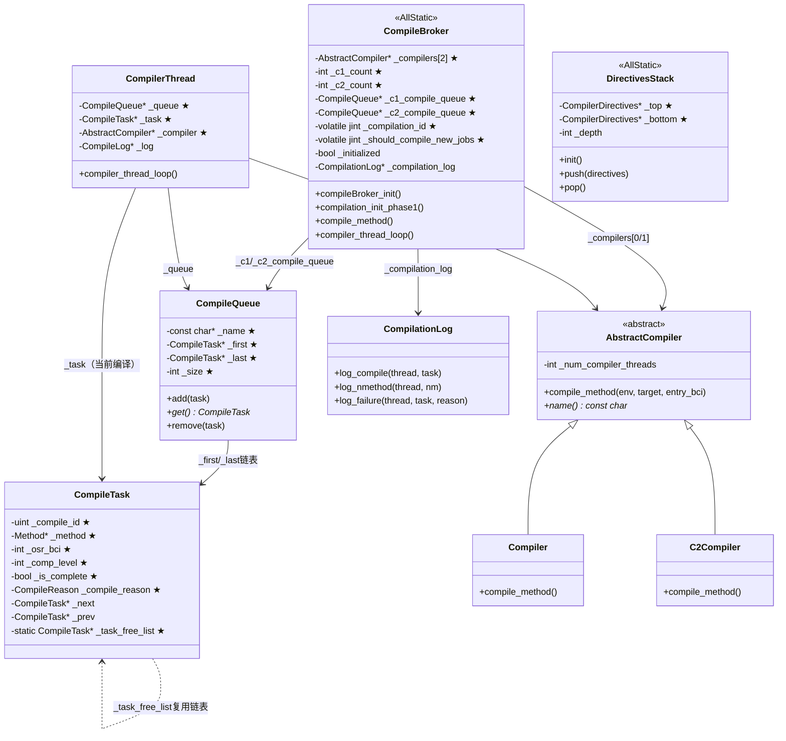

# compileBroker_init() 深入分析

> 源码位置: `src/hotspot/share/compiler/compileBroker.cpp:261`
> 标准环境：`-Xms8g -Xmx8g -XX:+UseG1GC`
> 本文档详细分析 `compileBroker_init()` 的实现，这是 `init_globals()` 中 JIT 编译基础设施的初始化方法。

---

## 第 0 部分：核心原理 ⭐

### 0.1 本质是什么？

`compileBroker_init()` 的本质是**JIT 编译系统的轻量级预初始化**：只做两件事——创建编译日志环形缓冲区（`CompilationLog`）和初始化编译器指令栈（`DirectivesStack`）。真正的编译器线程创建在后续的 `compilation_init_phase1()` 中完成。

### 0.2 为什么需要？

JIT 编译系统需要在 `init_globals()` 阶段完成基础设施准备，但编译器线程的创建需要等到 JVM 基础设施（堆、元空间、解释器）全部就绪后才能进行。`compileBroker_init()` 是这个两阶段初始化的第一阶段：

- **编译日志**：需要在任何编译活动发生前就绪，以便记录从第一次编译开始的所有事件
- **指令栈**：需要在编译器线程启动前就绪，编译器线程启动后立即可能查询指令

### 0.3 怎么解决？

**两阶段初始化**：
- **Phase 1**（`compileBroker_init()`，在 `init_globals()` 中）：创建 `CompilationLog` 环形缓冲区 + 初始化 `DirectivesStack`（添加默认指令）+ 解析 `-XX:CompilerDirectivesFile` 指令文件
- **Phase 2**（`compilation_init_phase1()`，在 `Threads::create_vm()` 中）：确定 C1/C2 线程数 → 创建编译器对象（`Compiler`/`C2Compiler`）→ 创建编译队列（`CompileQueue`）→ 创建编译器线程和 Sweeper 线程

### 0.4 为什么这样设计？

- **为什么编译日志在 Phase 1 创建？** 编译日志是环形缓冲区，JVM 崩溃时需要 dump 最近的编译活动。如果在 Phase 2 才创建，Phase 1 到 Phase 2 之间的编译活动（如 `universe_post_init` 中的类初始化触发的编译）就无法记录
- **为什么指令栈在 Phase 1 初始化？** 指令栈必须在编译器线程启动前就绪，否则编译器线程启动后立即查询指令时会遇到未初始化的栈
- **为什么编译器线程在 Phase 2 才创建？** 编译器线程需要 Java 堆（分配 Java 对象）、元空间（存储 nmethod）、解释器（执行 Java 代码），这些都在 `init_globals()` 的后续步骤中初始化，必须等它们就绪

---

## 1. 功能定位

### 1.1 一句话说明

**`compileBroker_init()` 初始化 JIT 编译系统的基础设施，包括编译日志、编译器指令栈，但不创建编译器线程（编译器线程在 `compilation_init_phase1` 中创建）。**

### 1.2 重要澄清

⚠️ **注意**：`compileBroker_init()` 本身只做轻量级初始化！真正的编译器线程创建是在后续调用的 `compilation_init_phase1()` 中完成的。

| 函数 | 调用位置 | 功能 |
|------|----------|------|
| `compileBroker_init()` | `init_globals()` | 日志初始化、指令栈初始化 |
| `compilation_init_phase1()` | 未直接调用 | 创建 C1/C2 编译器对象和线程 |
| `compilation_init_phase2()` | 未直接调用 | 标记编译系统为已初始化 |

### 1.3 在整体流程中的位置

```
init_globals()
│
├── [Phase 1-5] 基础设施
│   ├── codeCache_init()         ← 创建代码缓存
│   ├── stubRoutines_init1()     ← 第一批桩代码
│   ├── universe_init()          ← 创建堆、元空间
│   └── interpreter_init()       ← 解释器代码生成
│
├── [Phase 6] 类加载 & 引用处理
│   ├── universe2_init()         ← 加载原始类
│   ├── javaClasses_init()       ← Java 类偏移量
│   └── referenceProcessor_init()
│
├── [Phase 7] JIT 编译准备
│   ├── vtableStubs_init()       ← 虚表桩代码
│   ├── InlineCacheBuffer_init() ← 内联缓存
│   ├── compilerOracle_init()    ← 编译器神谕
│   ├── dependencyContext_init() ← 依赖上下文
│   └── ★ compileBroker_init()   ← 【当前分析】编译代理初始化
│
├── [Phase 8] 后初始化
│   ├── universe_post_init()     ← 预分配异常、方法缓存
│   ├── stubRoutines_init2()     ← 第二批桩代码
│   └── MethodHandles::generate_adapters()
│
└── return JNI_OK
```

---

## 2. 源码完整分析

### 2.1 compileBroker_init() 源码

```cpp
// src/hotspot/share/compiler/compileBroker.cpp:261
bool compileBroker_init() {
  // ① 如果开启日志事件，创建编译日志
  if (LogEvents) {
    _compilation_log = new CompilationLog();
  }

  // ② 初始化编译器指令栈（添加默认指令）
  DirectivesStack::init();

  // ③ 如果有编译器指令文件，解析它
  if (DirectivesParser::has_file()) {
    return DirectivesParser::parse_from_flag();
  } else if (CompilerDirectivesPrint) {
    // 如果开启打印标志，即使没有其他指令也打印默认指令
    DirectivesStack::print(tty);
  }

  return true;
}
```

**关键点**：
- 这个函数非常简短，只做两件事：初始化编译日志和编译器指令
- 真正的编译器初始化（创建线程等）在 `compilation_init_phase1()` 中

### 2.2 为什么源码中没有调用 compilation_init_phase1？

查看 `init_globals()` 的调用流程：

```cpp
// src/hotspot/share/runtime/init.cpp
jint init_globals() {
  // ...
  
  // compileBroker_init 只初始化日志和指令
  if (!compileBroker_init()) {
    return JNI_EINVAL;
  }

  // universe_post_init 内部会触发编译器初始化
  if (!universe_post_init()) {
    return JNI_ERR;
  }
  
  // ...
}
```

实际上，编译器线程的创建发生在 **JVM 启动的后续阶段**，而不是 `init_globals()` 中。具体是在 `Threads::create_vm()` 中调用 `CompileBroker::compilation_init_phase1()`。

---

## 3. CompileBroker 类详解

### 3.1 类定义

```cpp
// src/hotspot/share/compiler/compileBroker.hpp:139
class CompileBroker: AllStatic {
 private:
  static bool _initialized;                    // ★ 是否已初始化（Phase 2 完成后设为 true）
  static volatile bool _should_block;          // 是否应该阻塞（调试用）
  static volatile jint _should_compile_new_jobs; // ★ 是否应该编译新任务（run_compilation=1）

  static AbstractCompiler* _compilers[2];      // ★ [0]=C1, [1]=C2/JVMCI

  static int _c1_count, _c2_count;             // ★ C1/C2 最大线程数

  static jobject *_compiler1_objects;          // C1 线程 Java 对象数组
  static jobject *_compiler2_objects;          // C2 线程 Java 对象数组

  static CompileLog **_compiler1_logs;         // C1 编译日志数组
  static CompileLog **_compiler2_logs;         // C2 编译日志数组

  static volatile jint _compilation_id;        // ★ 编译 ID 计数器（原子递增）
  static volatile jint _osr_compilation_id;    // OSR 编译 ID 计数器

  static CompileQueue* _c2_compile_queue;      // ★ C2 编译队列
  static CompileQueue* _c1_compile_queue;      // ★ C1 编译队列

  static PerfCounter* _perf_total_compilation; // 性能计数器（jstat 用）
  // ... 约 20 个性能计数器

  static int _total_compile_count;             // 总编译次数
  static int _total_bailout_count;             // 总放弃次数
  static int _total_invalidated_count;         // 总失效次数
};
```

**sizeof(CompileBroker)**：`AllStatic` 类，无实例，所有字段都是静态的，不占对象内存。

**创建位置**：`compileBroker_init()` 完成 Phase 1 初始化；`compilation_init_phase1()` 完成 Phase 2 初始化（创建编译器对象、队列、线程）。

**关键字段生命周期**：
- `_compilers[0/1]`：`compilation_init_phase1()` 中 `new Compiler()`/`new C2Compiler()` 创建；编译器线程通过 `_compilers[i]->compile_method()` 调用；JVM 退出时不释放
- `_c1_compile_queue`/`_c2_compile_queue`：`init_compiler_sweeper_threads()` 中 `new CompileQueue()` 创建；`compile_method()` 中 `add()` 入队；编译器线程 `get()` 出队
- `_compilation_id`：`compile_method()` 中 `Atomic::add(1, &_compilation_id)` 原子递增；每个 `CompileTask` 获得唯一 ID
- `_should_compile_new_jobs`：初始为 `run_compilation(1)`；`disable_compilation_forever()` 设为 0（CodeCache 满时）；`enable_compilation()` 恢复为 1

### 3.2 关键静态变量初始化

```cpp
// src/hotspot/share/compiler/compileBroker.cpp:110
bool CompileBroker::_initialized = false;
volatile bool CompileBroker::_should_block = false;
volatile int  CompileBroker::_print_compilation_warning = 0;
volatile jint CompileBroker::_should_compile_new_jobs = run_compilation;

// 编译器实例（尚未创建）
AbstractCompiler* CompileBroker::_compilers[2];

// 编译器线程数（尚未确定）
int CompileBroker::_c1_count = 0;
int CompileBroker::_c2_count = 0;

// 编译队列（尚未创建）
CompileQueue* CompileBroker::_c2_compile_queue = NULL;
CompileQueue* CompileBroker::_c1_compile_queue = NULL;
```

---

## 4. CompilationLog 详解

### 4.1 类定义

```cpp
// src/hotspot/share/compiler/compileBroker.cpp:193
class CompilationLog : public StringEventLog {
 public:
  CompilationLog() : StringEventLog("Compilation events") {
  }

  // 记录编译任务
  void log_compile(JavaThread* thread, CompileTask* task) {
    StringLogMessage lm;
    stringStream sstr(lm.buffer(), lm.size());
    task->print(&sstr, NULL, true, false);
    log(thread, "%s", (const char*)lm);
  }

  // 记录 nmethod 生成
  void log_nmethod(JavaThread* thread, nmethod* nm) {
    log(thread, "nmethod %d%s " INTPTR_FORMAT " code [" INTPTR_FORMAT ", " INTPTR_FORMAT "]",
        nm->compile_id(), nm->is_osr_method() ? "%" : "",
        p2i(nm), p2i(nm->code_begin()), p2i(nm->code_end()));
  }

  // 记录编译失败
  void log_failure(JavaThread* thread, CompileTask* task, 
                   const char* reason, const char* retry_message) {
    StringLogMessage lm;
    lm.print("%4d   COMPILE SKIPPED: %s", task->compile_id(), reason);
    if (retry_message != NULL) {
      lm.append(" (%s)", retry_message);
    }
    lm.print("\n");
    log(thread, "%s", (const char*)lm);
  }
};
```

**作用**：
- 记录编译事件到环形缓冲区
- 在 JVM 崩溃时可以查看最近的编译活动
- 帮助诊断编译器相关问题

---

## 5. DirectivesStack 详解

### 5.1 编译器指令概念

**编译器指令（Compiler Directives）** 是 JDK 9 引入的功能，允许在运行时控制 JIT 编译器的行为。

```
┌─────────────────────────────────────────────────────────────────────────────┐
│                         编译器指令栈 (DirectivesStack)                        │
├─────────────────────────────────────────────────────────────────────────────┤
│                                                                             │
│  用途：动态控制特定方法的编译行为                                             │
│                                                                             │
│  ┌─────────────────────────────────────────────────────────────────────┐   │
│  │  指令栈 (LIFO)                                                       │   │
│  │  ┌──────────────────────────────────────────────────────────────┐  │   │
│  │  │  用户指令 3（最高优先级）                                      │  │   │
│  │  ├──────────────────────────────────────────────────────────────┤  │   │
│  │  │  用户指令 2                                                   │  │   │
│  │  ├──────────────────────────────────────────────────────────────┤  │   │
│  │  │  用户指令 1                                                   │  │   │
│  │  ├──────────────────────────────────────────────────────────────┤  │   │
│  │  │  默认指令（最低优先级，始终存在）                              │  │   │
│  │  └──────────────────────────────────────────────────────────────┘  │   │
│  └─────────────────────────────────────────────────────────────────────┘   │
│                                                                             │
│  匹配规则：从栈顶向下搜索，第一个匹配的指令生效                               │
│                                                                             │
└─────────────────────────────────────────────────────────────────────────────┘
```

### 5.2 DirectivesStack::init()

```cpp
// src/hotspot/share/compiler/compilerDirectives.cpp
void DirectivesStack::init() {
  // 创建默认指令
  CompilerDirectives* directives = new CompilerDirectives();
  directives->set_next(NULL);
  
  // 设置默认匹配规则（匹配所有方法）
  directives->add_match(new BasicMatcher("*.*"));
  
  // 设置为栈底
  _bottom = directives;
  _top = directives;
  _depth = 1;
}
```

### 5.3 指令文件格式

```json
// 通过 -XX:CompilerDirectivesFile=directive.json 指定
[
  {
    "match": [
      "java.util.HashMap::get",
      "java.util.ArrayList::*"
    ],
    "c1": {
      "Enable": false  // 禁用 C1 编译
    },
    "c2": {
      "Inline": ["+java.util.*::*"]  // 内联规则
    }
  }
]
```

---

## 6. 真正的编译器初始化：compilation_init_phase1()

虽然 `compileBroker_init()` 只做轻量级初始化，但了解完整的编译器初始化流程很重要。

### 6.1 compilation_init_phase1() 源码

```cpp
// src/hotspot/share/compiler/compileBroker.cpp:544
void CompileBroker::compilation_init_phase1(TRAPS) {
  _last_method_compiled[0] = '\0';

  // 如果不使用编译器，直接返回
  if (!UseCompiler) {
    return;
  }

  // =============================================
  // Step 1: 确定编译器线程数
  // =============================================
  _c1_count = CompilationPolicy::policy()->compiler_count(CompLevel_simple);
  _c2_count = CompilationPolicy::policy()->compiler_count(CompLevel_full_optimization);

#if INCLUDE_JVMCI
  // JVMCI 编译器特殊处理
  if (EnableJVMCI) {
    JVMCICompiler* jvmci = new JVMCICompiler();
    if (UseJVMCICompiler) {
      _compilers[1] = jvmci;  // 替换 C2
      // 调整线程数...
    }
  }
#endif // INCLUDE_JVMCI

  // =============================================
  // Step 2: 创建编译器对象
  // =============================================
#ifdef COMPILER1
  if (_c1_count > 0) {
    _compilers[0] = new Compiler();  // C1 编译器
  }
#endif // COMPILER1

#ifdef COMPILER2
  if (true JVMCI_ONLY( && !UseJVMCICompiler)) {
    if (_c2_count > 0) {
      _compilers[1] = new C2Compiler();  // C2 编译器
    }
  }
#endif // COMPILER2

  // =============================================
  // Step 3: 创建编译器线程和 Sweeper 线程
  // =============================================
  init_compiler_sweeper_threads();

  // =============================================
  // Step 4: 创建性能计数器
  // =============================================
  {
    EXCEPTION_MARK;
    _perf_total_compilation =
                 PerfDataManager::create_counter(JAVA_CI, "totalTime",
                                                 PerfData::U_Ticks, CHECK);
  }

  // 更多性能计数器...
}
```

### 6.2 init_compiler_sweeper_threads() 源码

```cpp
// src/hotspot/share/compiler/compileBroker.cpp:683
void CompileBroker::init_compiler_sweeper_threads() {
  EXCEPTION_MARK;
  
  // =============================================
  // Step 1: 创建 C2 编译队列和线程
  // =============================================
  if (_c2_count > 0) {
    const char* name = JVMCI_ONLY(UseJVMCICompiler ? "JVMCI compile queue" :) "C2 compile queue";
    _c2_compile_queue = new CompileQueue(name);
    _compiler2_objects = NEW_C_HEAP_ARRAY(jobject, _c2_count, mtCompiler);
    _compiler2_logs = NEW_C_HEAP_ARRAY(CompileLog*, _c2_count, mtCompiler);
  }
  
  // =============================================
  // Step 2: 创建 C1 编译队列和线程
  // =============================================
  if (_c1_count > 0) {
    _c1_compile_queue = new CompileQueue("C1 compile queue");
    _compiler1_objects = NEW_C_HEAP_ARRAY(jobject, _c1_count, mtCompiler);
    _compiler1_logs = NEW_C_HEAP_ARRAY(CompileLog*, _c1_count, mtCompiler);
  }

  char name_buffer[256];

  // =============================================
  // Step 3: 创建 C2 编译器线程
  // =============================================
  for (int i = 0; i < _c2_count; i++) {
    sprintf(name_buffer, "%s CompilerThread%d", _compilers[1]->name(), i);
    Handle thread_oop = create_thread_oop(name_buffer, CHECK);
    jobject thread_handle = JNIHandles::make_global(thread_oop);
    _compiler2_objects[i] = thread_handle;
    _compiler2_logs[i] = NULL;

    if (!UseDynamicNumberOfCompilerThreads || i == 0) {
      JavaThread *ct = make_thread(thread_handle, _c2_compile_queue, _compilers[1], CHECK);
      assert(ct != NULL, "should have been handled for initial thread");
      _compilers[1]->set_num_compiler_threads(i + 1);
    }
  }

  // =============================================
  // Step 4: 创建 C1 编译器线程
  // =============================================
  for (int i = 0; i < _c1_count; i++) {
    sprintf(name_buffer, "C1 CompilerThread%d", i);
    Handle thread_oop = create_thread_oop(name_buffer, CHECK);
    jobject thread_handle = JNIHandles::make_global(thread_oop);
    _compiler1_objects[i] = thread_handle;
    _compiler1_logs[i] = NULL;

    if (!UseDynamicNumberOfCompilerThreads || i == 0) {
      JavaThread *ct = make_thread(thread_handle, _c1_compile_queue, _compilers[0], CHECK);
      _compilers[0]->set_num_compiler_threads(i + 1);
    }
  }

  // =============================================
  // Step 5: 创建 Sweeper 线程
  // =============================================
  if (MethodFlushing) {
    Handle thread_oop = create_thread_oop("Sweeper thread", CHECK);
    jobject thread_handle = JNIHandles::make_local(THREAD, thread_oop());
    make_thread(thread_handle, NULL, NULL, CHECK);
  }
}
```

---

## 7. 编译系统整体架构

### 7.1 架构图

```
┌─────────────────────────────────────────────────────────────────────────────┐
│                          JIT 编译系统架构                                     │
├─────────────────────────────────────────────────────────────────────────────┤
│                                                                             │
│  ┌───────────────────┐                                                     │
│  │   应用线程         │                                                     │
│  │   (JavaThread)    │                                                     │
│  └─────────┬─────────┘                                                     │
│            │ 方法调用计数达到阈值                                            │
│            ▼                                                                │
│  ┌───────────────────────────────────────────────────────────────────────┐ │
│  │                         CompileBroker                                  │ │
│  │  ┌─────────────────────────────────────────────────────────────────┐  │ │
│  │  │  compile_method()                                                │  │ │
│  │  │  ├── 检查编译条件                                                 │  │ │
│  │  │  ├── 选择编译级别 (C1/C2)                                        │  │ │
│  │  │  ├── 创建 CompileTask                                            │  │ │
│  │  │  └── 加入编译队列                                                 │  │ │
│  │  └─────────────────────────────────────────────────────────────────┘  │ │
│  └────────────────────────────────────┬──────────────────────────────────┘ │
│                                       │                                     │
│                    ┌──────────────────┼──────────────────┐                  │
│                    ▼                  ▼                  ▼                  │
│  ┌──────────────────────┐  ┌──────────────────────┐  ┌────────────────────┐│
│  │   C1 CompileQueue    │  │   C2 CompileQueue    │  │   Sweeper Thread   ││
│  │  ┌────────────────┐  │  │  ┌────────────────┐  │  │                    ││
│  │  │ CompileTask 1  │  │  │  │ CompileTask 1  │  │  │  扫描 CodeCache    ││
│  │  ├────────────────┤  │  │  ├────────────────┤  │  │  清理废弃 nmethod  ││
│  │  │ CompileTask 2  │  │  │  │ CompileTask 2  │  │  │                    ││
│  │  ├────────────────┤  │  │  ├────────────────┤  │  └────────────────────┘│
│  │  │ ...            │  │  │  │ ...            │  │                        │
│  │  └────────────────┘  │  │  └────────────────┘  │                        │
│  └──────────┬───────────┘  └──────────┬───────────┘                        │
│             │                         │                                     │
│             ▼                         ▼                                     │
│  ┌────────────────────┐  ┌─────────────────────────┐                       │
│  │ C1 CompilerThread  │  │ C2 CompilerThread       │                       │
│  │  (1-4 个线程)      │  │  (1-2 个线程)           │                       │
│  │  ├── 快速编译      │  │  ├── 深度优化编译        │                       │
│  │  ├── 较少优化      │  │  ├── 内联、逃逸分析     │                       │
│  │  └── 生成 nmethod  │  │  └── 生成 nmethod       │                       │
│  └─────────┬──────────┘  └─────────┬───────────────┘                       │
│            │                       │                                        │
│            └───────────┬───────────┘                                        │
│                        ▼                                                    │
│             ┌──────────────────────┐                                       │
│             │      CodeCache       │                                       │
│             │  ┌────────────────┐  │                                       │
│             │  │ nmethod 1      │  │                                       │
│             │  ├────────────────┤  │                                       │
│             │  │ nmethod 2      │  │                                       │
│             │  ├────────────────┤  │                                       │
│             │  │ ...            │  │                                       │
│             │  └────────────────┘  │                                       │
│             └──────────────────────┘                                       │
│                                                                             │
└─────────────────────────────────────────────────────────────────────────────┘
```

### 7.2 核心数据结构关系

```
┌─────────────────────────────────────────────────────────────────────────────┐
│                         核心数据结构关系                                      │
├─────────────────────────────────────────────────────────────────────────────┤
│                                                                             │
│  CompileBroker (静态类)                                                     │
│      │                                                                      │
│      ├── _compilers[2]                                                     │
│      │       ├── [0] = Compiler (C1)                                       │
│      │       └── [1] = C2Compiler / JVMCICompiler                          │
│      │                                                                      │
│      ├── _c1_compile_queue → CompileQueue                                  │
│      │                           ├── _first → CompileTask                  │
│      │                           │              ├── _method                │
│      │                           │              ├── _osr_bci               │
│      │                           │              ├── _comp_level            │
│      │                           │              └── _next                  │
│      │                           └── _last                                 │
│      │                                                                      │
│      ├── _c2_compile_queue → CompileQueue                                  │
│      │                           └── (同上结构)                             │
│      │                                                                      │
│      ├── _compiler1_objects[_c1_count] → jobject[] (Java 线程对象)          │
│      │                                                                      │
│      └── _compiler2_objects[_c2_count] → jobject[] (Java 线程对象)          │
│                                                                             │
│  CompilerThread (继承自 JavaThread)                                         │
│      ├── _queue → CompileQueue* (指向对应的编译队列)                         │
│      ├── _task → CompileTask* (当前编译任务)                                 │
│      ├── _compiler → AbstractCompiler* (使用的编译器)                        │
│      ├── _log → CompileLog* (编译日志)                                       │
│      └── _counters → CompilerCounters* (性能计数器)                          │
│                                                                             │
└─────────────────────────────────────────────────────────────────────────────┘
```

---

## 8. CompileTask 详解

### 8.1 类定义

```cpp
// src/hotspot/share/compiler/compileTask.hpp:39
class CompileTask : public CHeapObj<mtCompiler> {
 public:
  enum CompileReason {
      Reason_None,
      Reason_InvocationCount,  // ★ 方法调用计数触发
      Reason_BackedgeCount,    // ★ 循环回边计数触发
      Reason_Tiered,           // ★ 分层编译策略触发
      Reason_CTW,              // Compile the world
      Reason_Replay,           // ciReplay
      Reason_Whitebox,         // Whitebox API
      Reason_MustBeCompiled,   // 必须编译
      Reason_Bootstrap,        // JVMCI bootstrap
      Reason_Count
  };

 private:
  static CompileTask* _task_free_list;  // ★ 任务空闲列表（复用，避免频繁 new/delete）
  
  Monitor*     _lock;                   // 任务锁（阻塞编译时等待用）
  uint         _compile_id;             // ★ 编译 ID（全局唯一，原子递增）
  Method*      _method;                 // ★ 要编译的方法
  jobject      _method_holder;          // 方法持有者（防止 GC 回收）
  int          _osr_bci;                // ★ OSR 入口 BCI（-1 表示非 OSR）
  bool         _is_complete;            // ★ 是否完成（编译线程设置）
  bool         _is_success;             // 是否成功
  bool         _is_blocking;            // 是否阻塞调用者（同步编译时为 true）
  int          _comp_level;             // ★ 编译级别（1-4）
  int          _num_inlined_bytecodes;  // 内联字节码数（统计用）
  nmethodLocker* _code_handle;          // 结果 nmethod 持有者
  CompileTask* _next, *_prev;           // ★ 链表指针（CompileQueue 中）
  bool         _is_free;                // 是否在空闲列表
  
  jlong        _time_queued;            // 入队时间（性能统计）
  jlong        _time_started;           // 开始编译时间
  Method*      _hot_method;             // 触发编译的热方法
  int          _hot_count;              // 调用计数
  CompileReason _compile_reason;        // ★ 编译原因
  const char*  _failure_reason;         // 失败原因
};
```

**sizeof(CompileTask)**：约 **120 字节**（GDB 验证：`p sizeof(CompileTask)`）

**创建位置**：`CompileBroker::create_compile_task()` 中，优先从 `_task_free_list` 复用，否则 `new CompileTask()`；在 `compile_method()` 中调用。

**关键字段生命周期**：
- `_method`：`compile_method()` 中设置，指向要编译的 `Method`；编译完成后通过 `_code_handle` 获取 nmethod；任务完成后 `free_task()` 归还到 `_task_free_list`
- `_comp_level`：`compile_method()` 中由 `TieredThresholdPolicy` 决定；编译器线程读取以选择 C1/C2
- `_is_complete`：编译线程完成后设置为 true；阻塞调用者通过 `_lock->wait()` 等待此标志
- `_osr_bci`：非 OSR 时为 `InvocationEntryBci`（-1）；OSR 时为循环入口字节码偏移

### 8.2 编译级别（Comp Level）

```
┌─────────────────────────────────────────────────────────────────────────────┐
│                          编译级别 (Compilation Levels)                        │
├─────────────────────────────────────────────────────────────────────────────┤
│                                                                             │
│  Level 0: 解释执行                                                          │
│  ────────────────────────────────────────                                   │
│  • 收集 profiling 信息                                                      │
│  • 调用计数、分支概率等                                                      │
│                                                                             │
│  Level 1: C1 编译，无 profiling                                             │
│  ────────────────────────────────────────                                   │
│  • 简单编译，快速启动                                                        │
│  • 用于不会被进一步优化的方法                                                 │
│                                                                             │
│  Level 2: C1 编译，limited profiling                                        │
│  ────────────────────────────────────────                                   │
│  • 收集部分 profiling 信息                                                   │
│  • 为后续优化做准备                                                          │
│                                                                             │
│  Level 3: C1 编译，full profiling                                           │
│  ────────────────────────────────────────                                   │
│  • 收集完整 profiling 信息                                                   │
│  • 为 C2 优化提供数据                                                        │
│                                                                             │
│  Level 4: C2 编译                                                           │
│  ────────────────────────────────────────                                   │
│  • 深度优化编译                                                              │
│  • 内联、逃逸分析、向量化等                                                   │
│  • 最高性能                                                                  │
│                                                                             │
│  典型路径：Level 0 → Level 3 → Level 4                                       │
│                                                                             │
└─────────────────────────────────────────────────────────────────────────────┘
```

---

## 9. CompileQueue 详解

### 9.1 类定义

```cpp
// src/hotspot/share/compiler/compileBroker.hpp:76
class CompileQueue : public CHeapObj<mtCompiler> {
 private:
  const char* _name;         // ★ 队列名称（"C1 compile queue" / "C2 compile queue"）
  CompileTask* _first;       // ★ 队列头（最早入队的任务）
  CompileTask* _last;        // ★ 队列尾（最新入队的任务）
  CompileTask* _first_stale; // 过期任务链表（方法已卸载的任务）
  int _size;                 // ★ 队列大小（当前任务数）
};
```

**sizeof(CompileQueue)**：约 **40 字节**（4 个指针 32B + int 4B + 对齐 4B）

**创建位置**：`init_compiler_sweeper_threads()` 中 `new CompileQueue("C1 compile queue")` 和 `new CompileQueue("C2 compile queue")` 创建。

**关键字段生命周期**：
- `_first`/`_last`：`add()` 时新任务插入 `_last` 后面；`get()` 时从 `_first` 取出（FIFO）；`remove()` 时更新链表指针
- `_size`：`add()` 时 `++_size`；`remove()` 时 `--_size`；`TieredThresholdPolicy` 读取 `_size` 计算动态缩放系数 k
- `_first_stale`：`mark_on_stack()` 时将方法已卸载的任务移入此链表；下次 `get()` 时清理

 public:
  CompileQueue(const char* name) {
    _name = name;
    _first = NULL;
    _last = NULL;
    _size = 0;
    _first_stale = NULL;
  }

  void add(CompileTask* task);           // 添加任务
  void remove(CompileTask* task);        // 移除任务
  CompileTask* get();                    // 获取任务（编译线程调用）
  bool is_empty() const { return _first == NULL; }
  int size() const { return _size; }
};
```

### 9.2 编译队列操作

```cpp
// 添加编译任务
void CompileQueue::add(CompileTask* task) {
  assert(MethodCompileQueue_lock->owned_by_self(), "must own lock");

  task->set_next(NULL);
  task->set_prev(NULL);

  if (_last == NULL) {
    _first = task;
    _last = task;
  } else {
    _last->set_next(task);
    task->set_prev(_last);
    _last = task;
  }
  ++_size;

  // 标记方法正在编译队列中
  task->method()->set_queued_for_compilation();

  // 通知编译线程有新任务
  MethodCompileQueue_lock->notify_all();
}

// 编译线程获取任务
CompileTask* CompileQueue::get() {
  MutexLocker locker(MethodCompileQueue_lock);
  
  while (_first == NULL) {
    // 没有任务，等待
    if (CompileBroker::is_compilation_disabled_forever()) {
      return NULL;
    }
    MethodCompileQueue_lock->wait(5*1000); // 等待 5 秒
  }
  
  // 选择任务（可能有优先级策略）
  CompileTask* task = CompilationPolicy::policy()->select_task(this);
  if (task != NULL) {
    remove(task);
  }
  
  return task;
}
```

---

## 10. 编译器线程主循环

### 10.1 compiler_thread_loop()

```cpp
// src/hotspot/share/compiler/compileBroker.cpp:1618
void CompileBroker::compiler_thread_loop() {
  CompilerThread* thread = CompilerThread::current();
  CompileQueue* queue = thread->queue();
  ResourceMark rm;

  // 初始化 ciObjectFactory（首个线程执行）
  {
    ASSERT_IN_VM;
    MutexLocker only_one(CompileThread_lock, thread);
    if (!ciObjectFactory::is_initialized()) {
      ciObjectFactory::initialize();
    }
  }

  // 初始化编译器运行时
  if (!init_compiler_runtime()) {
    return;
  }

  thread->start_idle_timer();

  // 主循环：不断从队列获取任务并编译
  while (!is_compilation_disabled_forever()) {
    HandleMark hm(thread);

    // 获取编译任务（可能阻塞）
    CompileTask* task = queue->get();
    if (task == NULL) {
      // 可能需要动态减少线程
      if (UseDynamicNumberOfCompilerThreads) {
        MutexLocker only_one(CompileThread_lock);
        if (can_remove(thread, true)) {
          return; // 退出线程
        }
      }
      continue;
    }

    // 执行编译
    CompileTaskWrapper ctw(task);
    nmethodLocker result_handle;
    task->set_code_handle(&result_handle);
    methodHandle method(thread, task->method());

    // 检查方法是否有断点
    if (method()->number_of_breakpoints() == 0) {
      if ((UseCompiler || AlwaysCompileLoopMethods) && 
          CompileBroker::should_compile_new_jobs()) {
        invoke_compiler_on_method(task);  // 真正的编译！
        thread->start_idle_timer();
      }
    }

    // 可能需要动态增加线程
    if (UseDynamicNumberOfCompilerThreads) {
      possibly_add_compiler_threads();
    }
  }

  // 关闭编译器运行时
  shutdown_compiler_runtime(thread->compiler(), thread);
}
```

---

## 11. 相关 JVM 参数

| 参数 | 默认值 | 说明 |
|------|--------|------|
| `-XX:+UseCompiler` | true | 启用 JIT 编译 |
| `-XX:+TieredCompilation` | true | 启用分层编译 |
| `-XX:TieredStopAtLevel=N` | 4 | 分层编译最高级别 |
| `-XX:CICompilerCount=N` | 自动 | 编译器线程总数 |
| `-XX:+UseDynamicNumberOfCompilerThreads` | true | 动态调整编译器线程数 |
| `-XX:CompileThreshold=N` | 10000 | 编译阈值（调用次数） |
| `-XX:+BackgroundCompilation` | true | 后台编译 |
| `-XX:+LogCompilation` | false | 记录编译日志 |
| `-XX:CompilerDirectivesFile=<file>` | - | 编译器指令文件 |
| `-XX:+PrintCompilation` | false | 打印编译信息 |
| `-XX:+TraceCompilerThreads` | false | 跟踪编译器线程 |

---

## 12. 执行流程图

```
┌─────────────────────────────────────────────────────────────────────────────┐
│                       compileBroker_init() 执行流程                           │
├─────────────────────────────────────────────────────────────────────────────┤
│                                                                             │
│  compileBroker_init()                                                       │
│      │                                                                      │
│      ├── 1. if (LogEvents)                                                  │
│      │       └── _compilation_log = new CompilationLog()                    │
│      │           └── 创建环形缓冲区记录编译事件                               │
│      │                                                                      │
│      ├── 2. DirectivesStack::init()                                         │
│      │       ├── 创建默认 CompilerDirectives                                │
│      │       ├── 设置匹配规则 "*.*"（匹配所有方法）                           │
│      │       └── 设置为栈底                                                  │
│      │                                                                      │
│      └── 3. if (DirectivesParser::has_file())                               │
│              └── DirectivesParser::parse_from_flag()                        │
│                  └── 解析 -XX:CompilerDirectivesFile 指定的文件              │
│                                                                             │
│  return true                                                                │
│                                                                             │
│  ─────────────────────────────────────────────────────────────────────────  │
│                                                                             │
│  后续（在 Threads::create_vm 中）：                                          │
│                                                                             │
│  CompileBroker::compilation_init_phase1(THREAD)                             │
│      │                                                                      │
│      ├── 1. 确定 C1/C2 线程数                                               │
│      │       _c1_count = policy->compiler_count(CompLevel_simple)           │
│      │       _c2_count = policy->compiler_count(CompLevel_full_optimization)│
│      │                                                                      │
│      ├── 2. 创建编译器对象                                                   │
│      │       _compilers[0] = new Compiler()      // C1                      │
│      │       _compilers[1] = new C2Compiler()    // C2                      │
│      │                                                                      │
│      ├── 3. init_compiler_sweeper_threads()                                 │
│      │       ├── 创建 C1/C2 编译队列                                        │
│      │       │   _c1_compile_queue = new CompileQueue("C1 compile queue")   │
│      │       │   _c2_compile_queue = new CompileQueue("C2 compile queue")   │
│      │       │                                                              │
│      │       ├── 创建 C2 编译器线程                                          │
│      │       │   for (i = 0; i < _c2_count; i++)                            │
│      │       │       make_thread(thread_handle, _c2_compile_queue, C2)      │
│      │       │                                                              │
│      │       ├── 创建 C1 编译器线程                                          │
│      │       │   for (i = 0; i < _c1_count; i++)                            │
│      │       │       make_thread(thread_handle, _c1_compile_queue, C1)      │
│      │       │                                                              │
│      │       └── 创建 Sweeper 线程                                          │
│      │           make_thread(thread_handle, NULL, NULL)                     │
│      │                                                                      │
│      └── 4. 创建性能计数器                                                   │
│                                                                             │
│  CompileBroker::compilation_init_phase2()                                   │
│      └── _initialized = true                                                │
│                                                                             │
└─────────────────────────────────────────────────────────────────────────────┘
```

---

## 13. 总结

### 13.1 核心功能

`compileBroker_init()` 是 JIT 编译系统初始化的**第一步**，只做轻量级准备工作：

1. **创建编译日志** - 记录编译事件到环形缓冲区
2. **初始化指令栈** - 设置默认编译器指令
3. **解析指令文件** - 如果有自定义编译器指令

### 13.2 真正的编译器初始化

真正的编译器初始化（`compilation_init_phase1`）在后续阶段完成：

| 组件 | 创建时机 |
|------|----------|
| C1/C2 编译器对象 | compilation_init_phase1 |
| 编译队列 | compilation_init_phase1 |
| 编译器线程 | compilation_init_phase1 |
| Sweeper 线程 | compilation_init_phase1 |

### 13.3 与其他组件的关系

```
┌─────────────────────────────────────────────────────────────────────────────┐
│                         CompileBroker 依赖关系                               │
├─────────────────────────────────────────────────────────────────────────────┤
│                                                                             │
│  前置依赖：                                                                  │
│  ├── codeCache_init()       ← 代码缓存必须已初始化                           │
│  ├── stubRoutines_init1()   ← 基础桩代码必须已生成                           │
│  └── compilerOracle_init()  ← 编译器神谕必须已初始化                         │
│                                                                             │
│  后续使用：                                                                  │
│  ├── 应用线程 → CompileBroker::compile_method() → 提交编译请求              │
│  ├── 编译器线程 → compiler_thread_loop() → 处理编译请求                     │
│  └── Sweeper 线程 → 清理废弃的 nmethod                                      │
│                                                                             │
└─────────────────────────────────────────────────────────────────────────────┘
```

---

## 14. GDB 验证 ✅

> **GDB 脚本位置**: `jvm-md/CompileBroker/gdb_compileBroker_init.txt`
> 
> **验证条件**: `-Xms8g -Xmx8g -XX:+UseG1GC`

### 14.1 验证结果

```
╔═════════════════════════════════════════════════════════════╗
║     compileBroker_init() GDB 验证                          ║
╚═════════════════════════════════════════════════════════════╝

========== 1. 初始化状态 ==========
CompileBroker::_initialized: 1            ← ✅ 已初始化
CompileBroker::_should_block: 0           ← 不阻塞
CompileBroker::_should_compile_new_jobs: 1 ← run_compilation

========== 2. 编译器实例 ==========
_compilers[0] (C1):  0x7ffff0dbda40       ← C1 编译器对象
_compilers[1] (C2):  0x7ffff0ddbe60       ← C2 编译器对象

--- C1 Compiler ---
name: C1
num_compiler_threads: 1                   ← 当前启动 1 个线程

--- C2 Compiler ---
name: C2
num_compiler_threads: 1                   ← 当前启动 1 个线程

========== 3. 编译器线程计数 ==========
_c1_count: 4                              ← C1 最大线程数
_c2_count: 8                              ← C2 最大线程数

========== 4. 编译队列 ==========
_c1_compile_queue: 0x7ffff0ddc070         ← C1 编译队列
_c2_compile_queue: 0x7ffff0ddbf00         ← C2 编译队列

--- C1 Compile Queue ---
name: C1 compile queue
size: 0                                   ← 队列为空

--- C2 Compile Queue ---
name: C2 compile queue  
size: 0                                   ← 队列为空

========== 5. 编译器指令栈 ==========
DirectivesStack::_depth: 1                ← 只有默认指令
DirectivesStack::_top: 0x7ffff0dd8d10
DirectivesStack::_bottom: 0x7ffff0dd8d10  ← top == bottom，只有一个指令

========== 6. JVM 参数 ==========
UseCompiler: 1                            ← ✅ 启用编译
TieredCompilation: 1                      ← ✅ 分层编译
TieredStopAtLevel: 4                      ← 最高级别 4 (C2)
CICompilerCount: 12                       ← 总编译器线程数
UseDynamicNumberOfCompilerThreads: 1      ← ✅ 动态调整线程数
BackgroundCompilation: 1                  ← ✅ 后台编译
LogCompilation: 0                         ← 编译日志未启用

========== 7. 线程列表（部分）==========
Id   Target Id                            Frame
1    Thread 0x7ffff7b12800 (LWP 31391)    ...
2    Thread 0x7ffff780b6c0 (LWP 31392)    ... (main)
...
10   Thread 0x7fffc276c6c0 (LWP 31403)    "C2 CompilerThread0"
11   Thread 0x7fffc26146c0 (LWP 31404)    "C1 CompilerThread0"
12   Thread 0x7fffc21ff6c0 (LWP 31405)    "Sweeper thread"
```

### 14.2 验证结论

| 验证项 | 预期 | 实际 | 结果 |
|--------|------|------|------|
| `_initialized` | true | 1 | ✅ |
| `_compilers[0]` | 非空 (C1) | 0x7ffff0dbda40 | ✅ |
| `_compilers[1]` | 非空 (C2) | 0x7ffff0ddbe60 | ✅ |
| C1 线程数上限 | 4 | 4 | ✅ |
| C2 线程数上限 | 8 | 8 | ✅ |
| 编译队列 | 非空 | 两个队列都已创建 | ✅ |
| 指令栈深度 | 1 (默认) | 1 | ✅ |
| 分层编译 | 启用 | 1 | ✅ |

### 14.3 关键发现

1. **动态线程调整**：
   - `_c1_count = 4`，`_c2_count = 8`（最大线程数）
   - `num_compiler_threads = 1`（当前实际线程数）
   - 开启 `UseDynamicNumberOfCompilerThreads` 后，JVM 会根据编译负载动态调整

2. **编译器线程已创建**：
   - "C2 CompilerThread0" 和 "C1 CompilerThread0" 已在运行
   - "Sweeper thread" 也已启动

3. **编译队列初始为空**：
   - 初始化完成时队列为空，等待编译请求

4. **总线程数计算**：
   - `CICompilerCount = 12 = _c1_count(4) + _c2_count(8)`

---

## 数据结构关系图



**关系说明**：
- `CompileBroker` 是 AllStatic 协调者，维护两个 `CompileQueue` 和两个 `AbstractCompiler`
- `CompilerThread` 持有 `_queue` 引用，循环调用 `queue->get()` 获取任务
- `CompileTask` 有静态 `_task_free_list`，完成后归还复用，避免频繁 new/delete
- `DirectivesStack` 独立于 `CompileBroker`，在 `compileBroker_init()` 中初始化

---

## 总结

### 数据结构层面

| 结构 | sizeof | 核心特征 |
|------|--------|----------|
| `CompileBroker` | 0（AllStatic） | 协调者；`_compilers[2]` 是 C1/C2 编译器；`_c1/_c2_compile_queue` 是任务队列；`_should_compile_new_jobs` 控制编译开关 |
| `CompileQueue` | ~40B | FIFO 队列；`_size` 供 `TieredThresholdPolicy` 计算动态缩放系数 k；`_first_stale` 清理已卸载方法的任务 |
| `CompileTask` | ~120B | 有静态 `_task_free_list` 复用；`_comp_level` 决定用 C1/C2；`_is_blocking` 支持同步编译 |
| `CompilationLog` | 环形缓冲区 | 记录编译事件；JVM 崩溃时 dump 最近编译活动 |
| `DirectivesStack` | AllStatic | LIFO 栈；默认指令匹配所有方法；用户指令优先级高于默认指令 |

### 算法层面

| 算法 | 核心设计决策 |
|------|-------------|
| `compileBroker_init()` | 两阶段初始化的 Phase 1：只做日志+指令栈，不创建线程；Phase 2 在 `Threads::create_vm()` 中 |
| `compilation_init_phase1()` | 确定线程数（log_cpu × loglog_cpu × 3/2）→ 创建编译器对象 → 创建队列 → 创建线程 |
| `compiler_thread_loop()` | 主循环：`queue->get()`（阻塞等待）→ `invoke_compiler_on_method()`；`UseDynamicNumberOfCompilerThreads` 支持动态增减线程 |
| `compile_method()` | 检查条件（是否已编译/是否在队列）→ 创建 `CompileTask`（复用 free_list）→ `queue->add()` → 可选阻塞等待 |
| `DirectivesStack` 匹配 | 从栈顶向下搜索，第一个匹配的指令生效；默认指令在栈底，始终兜底 |

---

*最后更新: 2026-03-02（补充第0节核心原理、数据结构完整分析、Mermaid关系图、总结节）*

## 15. 下一步分析建议

| 优先级 | 方法 | 理由 |
|--------|------|------|
| ⭐⭐⭐ | `codeCache_init()` | 代码缓存初始化，JIT 编译的存放位置 |
| ⭐⭐ | `javaClasses_init()` | Java 核心类偏移量计算 |
| ⭐⭐ | `CompilationPolicy` | 理解编译策略如何决定何时编译 |
| ⭐ | `invoke_compiler_on_method()` | 深入理解编译执行过程 |

**说「继续」或指定方法名，我将开始分析下一个方法！**
