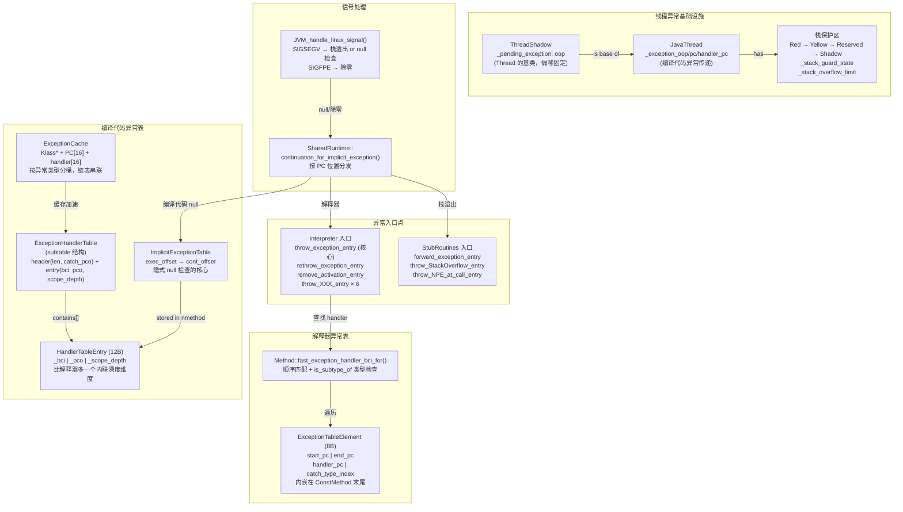

# Day 32：异常处理机制深度剖析

> 纯源码分析，基于 OpenJDK 11 slowdebug
> 方法论：程序 = 数据结构 + 算法
> 讲解风格：问题驱动，每一步先提问再回答

---

## 第 0 部分：核心原理 ⭐

### 0.1 本质是什么？

JVM 异常处理的本质是**基于线程全局变量 `_pending_exception` 的手动异常传播机制**：不用 C++ 异常，而是在每个线程上挂一个 `_pending_exception` 字段，所有可能抛异常的函数通过 `TRAPS/CHECK/THROW` 宏手动检查和传播；异常 handler 的查找通过顺序扫描 `ExceptionTableElement` 数组完成；编译代码额外需要 `ImplicitExceptionTable`（隐式 null 检查）和 `ExceptionCache`（handler 查找缓存）。

### 0.2 为什么需要？

JVM 是 C++ 写的，C++ 本身有 `throw/catch`，但 JVM 没有用它，原因有三：(1) **编译器依赖**：GCC/Clang/MSVC 的异常实现不同，JVM 要跨平台；(2) **性能不可控**：C++ 异常的 throw 路径涉及栈展开（遍历 `.eh_frame` 表），开销在不同编译器下差异巨大；(3) **与 GC 冲突**：C++ 异常的栈展开过程中可能触发 GC，而 C++ 异常机制不知道 JVM 的 GC，无法正确处理 oop 的重定位。

### 0.3 怎么解决？

**四层机制**：
- **VM 层**：`ThreadShadow::_pending_exception` + `TRAPS/CHECK/THROW` 宏体系，手动传播异常
- **解释器层**：`ExceptionTableElement` 顺序扫描 + `_throw_exception_entry` 共享 stub，处理显式 `athrow`；`_throw_NullPointerException_entry` 等快捷入口处理隐式异常
- **编译代码层**：`HandlerTableEntry`（含 scope_depth 处理内联）+ `ImplicitExceptionTable`（SIGSEGV → NPE 映射）+ `ExceptionCache`（handler 查找缓存）
- **OS 层**：`JVM_handle_linux_signal()` 将 SIGSEGV/SIGFPE 转换为 Java 异常；四层栈保护区（Red/Yellow/Reserved/Shadow）处理 StackOverflowError

### 0.4 为什么这样设计？

- **为什么 `_pending_exception` 在 ThreadShadow 基类而不是 Thread？** 头文件循环依赖：`exceptions.hpp` 需要访问 `_pending_exception`，但 `thread.hpp` 又依赖 `exceptions.hpp`；抽到 `ThreadShadow` 基类打破循环
- **为什么 `ThreadShadow` 要有一个空虚函数？** 强制生成 vtable，确保 `_pending_exception` 的偏移固定在 8（vtable 指针之后）；汇编代码需要硬编码这个偏移，偏移不固定会读错位置
- **为什么隐式 null 检查比显式检查快？** 显式检查需要 `test + je` 两条指令在每次访问前执行；隐式检查利用 OS zero page 保护，正常路径零额外指令，只有真正 null 时才走 SIGSEGV 路径（异常路径，极少发生）
- **为什么 StackOverflowError 不调构造函数？** 构造函数是 Java 方法，需要压栈帧，但栈已经满了；JVM 直接 `allocate_instance()` + `fill_in_stack_trace()`，绕过 Java 构造函数

---

## 一、从一个疑问开始

假设你在 Java 里写了一行 `obj.getField()`，但 `obj` 是 null。你知道这会抛 `NullPointerException`。但你有没有想过：

1. **解释器执行时**，`getfield` 指令是怎么发现 `obj == null` 的？JVM 在每个 `getfield` 前面都插了一条 `if (obj == null) throw NPE` 吗？
2. **C2 编译后**，机器码里还有 null 检查指令吗？如果没有，null 访问会直接导致 CPU 段错误（SIGSEGV），JVM 是怎么从一个操作系统信号变出一个 Java 异常的？
3. 当你写 `try { ... } catch (Exception e)` 时，JVM 是怎么"找到"catch 块的？遍历什么数据结构？
4. 如果当前方法没有 catch，异常需要向上传递给调用者——但调用者可能是解释器帧，也可能是编译帧，JVM 怎么处理这种跨帧传递？
5. `throw new Exception()` 需要调用构造函数，构造函数需要栈空间。但 `StackOverflowError` 恰恰是栈空间不够了才抛的——JVM 怎么在没有栈空间的情况下创建一个异常对象？

这些问题的答案，构成了 JVM 异常处理的完整图景。我们一个一个来。

---

## 二、第一个关键设计决策：JVM 为什么不用 C++ 异常？

### 2.1 问题：异常传播机制怎么选？

JVM 是 C++ 写的，C++ 本身就有 `throw`/`catch` 机制。最自然的做法是：Java 代码抛异常时，JVM 内部直接用 C++ `throw` 往上抛，在某个地方 `catch` 住。

**但 JVM 没有这么做。** 源码里开头就写明了：

```cpp
// exceptions.hpp:33
// Note: We do not use C++ exceptions to avoid compiler dependencies and
// unpredictable performance.
```

### 2.2 追问：为什么 C++ 异常"不可预测"？

C++ 异常的问题不是功能上的，而是**工程上**的：

1. **编译器依赖**：不同 C++ 编译器（GCC、Clang、MSVC）的异常实现不同。GCC 用 Itanium ABI（`.eh_frame` + `libunwind`），MSVC 用 SEH。JVM 要跨平台，不想被绑死在某个编译器的异常实现上。

2. **性能不可控**：C++ 异常的 throw 路径涉及栈展开（stack unwinding），要遍历 `.eh_frame` 表找 handler、调用析构函数。这个开销在不同编译器、不同优化级别下差异巨大。JVM 需要**精确控制**异常路径的每一步开销。

3. **和 GC 冲突**：C++ 异常的 throw 过程中会做栈展开，而 JVM 在栈展开过程中可能触发 GC（比如查找异常 handler 需要加载类）。C++ 的异常机制不知道 JVM 的 GC，无法正确处理 oop 的重定位。

### 2.3 那 JVM 用的什么方案？

**方案极其朴素：线程上挂一个全局变量 `_pending_exception`，所有函数手动检查。**

这就是 `ThreadShadow` 类和 `TRAPS/CHECK/THROW` 宏体系。

---

## 三、数据结构全景

### 3.1 ThreadShadow — "每个线程随身带一个异常槽"

#### 3.1.1 第一个问题：异常信息存在哪？

Java 的 `throw new XxxException()` 在 JVM 内部要做两件事：(1) 创建异常对象；(2) 把它"传播"出去。传播到哪？

**答：存到当前线程的 `_pending_exception` 字段。** 这就是 ThreadShadow 的作用——它是 Thread 的基类，只有一个核心字段：

```cpp
// exceptions.hpp:60
class ThreadShadow: public CHeapObj<mtThread> {
 protected:
  oop  _pending_exception;          // 当前挂起的异常对象（Java oop）
  const char* _exception_file;      // 产生异常的 C++ 源文件（调试用）
  int         _exception_line;      // 行号（调试用）

  // ★ 这个虚函数的存在纯粹是为了强制生成 vtable
  virtual void unused_initial_virtual() { }
};
```

**sizeof**: vtable 指针(8) + oop(8) + char*(8) + int(4) + padding(4) = 32 字节。

#### 3.1.2 追问：为什么要单独搞一个 ThreadShadow 基类，而不是直接把字段放在 Thread 里？

源码注释给了答案：

```cpp
// exceptions.hpp:56
// The ThreadShadow class is a helper class to access the _pending_exception
// field of the Thread class w/o having access to the Thread's interface (for
// include hierachy reasons).
```

原因是 **头文件循环依赖**。`exceptions.hpp` 需要使用 Thread 的 `_pending_exception`，但 `thread.hpp` 又依赖 `exceptions.hpp` 中的宏。解法：把 `_pending_exception` 抽到一个极简的基类 `ThreadShadow` 里，打破循环。

#### 3.1.3 追问：`unused_initial_virtual()` 是什么鬼？为什么要强制生成 vtable？

这是一个**精妙的布局控制**。源码注释（exceptions.hpp:70-75）说：

```cpp
// The following virtual exists only to force creation of a vtable.
// We need ThreadShadow to have a vtable, even in product builds,
// so that its layout will start at an offset of zero relative to Thread.
// Some C++ compilers are so "clever" that they put the ThreadShadow
// base class at offset 4 in Thread (after Thread's vtable), if they
// notice that Thread has a vtable but ThreadShadow does not.
```

**问题场景**：Thread 有虚函数（有 vtable），ThreadShadow 如果没有虚函数（没 vtable），某些"聪明"的编译器会把 ThreadShadow 的字段放到 Thread vtable 指针之后，导致 `_pending_exception` 的偏移不在 0 的位置。

**为什么偏移很重要？** 因为**汇编代码**（模板解释器、compiled code stub）需要直接用硬编码偏移访问 `_pending_exception`。如果偏移不固定，汇编代码就会读错位置。

所以加一个空虚函数，强制 ThreadShadow 也有 vtable，保证在继承层次中 ThreadShadow 的 vtable 和 Thread 的 vtable 合并，`_pending_exception` 偏移固定。

源码里甚至有一个运行时检查来验证这一点：

```cpp
// exceptions.cpp:45
void check_ThreadShadow() {
  const ByteSize offset1 = byte_offset_of(ThreadShadow, _pending_exception);
  const ByteSize offset2 = Thread::pending_exception_offset();
  if (offset1 != offset2) fatal("ThreadShadow::_pending_exception is not positioned correctly");
}
```

#### 3.1.4 TRAPS / CHECK / THROW 宏：手动异常传播

既然不用 C++ 异常，就需要一套**手动**的异常传播机制。JVM 设计了三个宏家族：

**TRAPS — "我是一个可能抛异常的函数"**

```cpp
#define THREAD __the_thread__
#define TRAPS  Thread* THREAD         // 展开为 Thread* __the_thread__
```

每个可能抛异常的函数，最后一个参数必须是 `TRAPS`：

```cpp
int resolve_field(ConstantPool* pool, int index, TRAPS);
// 展开后实际签名：
// int resolve_field(ConstantPool* pool, int index, Thread* __the_thread__);
```

**追问：为什么要传 Thread 指针？直接用 `Thread::current()` 不行吗？**

`Thread::current()` 需要从 TLS（Thread Local Storage）中获取，每次调用有几十纳秒的开销。而 JVM 内部的函数调用链非常深，如果每个函数都调 `Thread::current()`，累积开销可观。通过参数传递 Thread 指针，只需一次 TLS 访问（在最外层），后续所有函数都用参数传递——**零额外开销**。

**CHECK — "调用完就检查，有异常就 return"**

```cpp
#define CHECK       THREAD); if (HAS_PENDING_EXCEPTION) return       ; (void)(0
#define CHECK_0     CHECK_(0)
#define CHECK_NULL  CHECK_(NULL)
```

使用时：

```cpp
int result = resolve_field(pool, index, CHECK_0);
```

展开后：

```cpp
int result = resolve_field(pool, index, __the_thread__);
if (__the_thread__->has_pending_exception()) return 0;
(void)(0);  // 消除编译器"无效表达式"警告
```

**追问：这个宏的 `THREAD)` 为什么后面带一个右括号？看起来语法不对啊？**

这是一个**宏嵌入技巧**。调用方写的是 `function(arg1, arg2, CHECK_0)`，展开后变成：

```
function(arg1, arg2, __the_thread__); if (...) return 0; (void)(0)
```

`CHECK` 宏的第一个 token 是 `THREAD)`，它和调用方的左括号 `function(` 匹配，形成完整的函数调用。接着 `;` 结束语句，`if (...)` 是新语句。这个技巧使得**调用方的写法非常自然**，看起来就像是 `CHECK_0` 是一个普通参数。

**THROW — "设置异常 + 立即 return"**

```cpp
#define THROW_MSG(name, message)  \
  { Exceptions::_throw_msg(THREAD_AND_LOCATION, name, message); return; }
```

`Exceptions::_throw_msg()` 做了什么？（exceptions.cpp:173-181）

```
1. special_exception() 检查 → 如果 VM 还没初始化完，直接 fatal exit
2. Exceptions::new_exception() → 加载异常类 + 调 Java <init> 构造函数
3. Exceptions::_throw() → log_info(exceptions) 打印日志
                        → debug_check_abort() 检查 AbortVMOnException
                        → count_out_of_memory_exceptions() 统计 OOM
                        → thread->set_pending_exception(exception) ★核心
```

#### 3.1.5 `_pending_exception` 的生命周期

```
┌─────────────────────────────────────────────────────────────────────┐
│                    _pending_exception 生命周期                       │
├─────────────────────────────────────────────────────────────────────┤
│                                                                     │
│  设置（谁 → 何时 → 设什么值）:                                        │
│    1. THROW 宏 → VM 内部需要抛 Java 异常时                           │
│       → Exceptions::_throw() → set_pending_exception(java_exception)│
│    2. 模板解释器汇编 → 解释器 dispatch 循环中检测到异常               │
│       → movptr [thread + offset], exception_oop                     │
│    3. JNI 层 → native 代码通过 JNI 抛异常时                         │
│       → JNIEnv::Throw()/ThrowNew() → set_pending_exception()       │
│                                                                     │
│  读取（谁 → 何时 → 读后做什么）:                                      │
│    1. CHECK 宏 → 每个可能抛异常的函数返回后                          │
│       → if (HAS_PENDING_EXCEPTION) return;                          │
│    2. 解释器 dispatch → 每次 VM call 返回后                          │
│       → 检查 pending，有则跳 throw_exception_entry                   │
│    3. call_VM 汇编 → VM runtime 调用返回后                           │
│       → cmpptr [thread + offset], NULL; jne forward_exception       │
│                                                                     │
│  清除（谁 → 何时）:                                                  │
│    1. 异常 handler 入口处 → 取出异常后清除                           │
│    2. CLEAR_PENDING_EXCEPTION 宏 → 有意忽略异常时                    │
│    3. ExceptionMark 析构 → debug 模式下断言无未处理异常               │
│                                                                     │
└─────────────────────────────────────────────────────────────────────┘
```

**JVM 日志参数**：

```
-Xlog:exceptions=info     # 每次 Exceptions::_throw() 都打印
-Xlog:exceptions=debug    # 更详细，包括 clear_pending_exception
-XX:AbortVMOnException=java.lang.NullPointerException  # 遇到特定异常直接 abort（调试利器）
```

输出示例：
```
[info][exceptions] Exception <java.lang.NullPointerException> (0x00000007156f8a10)
 thrown [interpreterRuntime.cpp, line 175]
 for thread 0x00007f8a3c00d800
```

---

### 3.2 ExceptionTableElement — "try-catch 的本质是一张查找表"

#### 3.2.1 问题：Java 的 try-catch 编译成什么？

你在 Java 里写的 `try { ... } catch (IOException e) { ... }` 编译成字节码后，`try` 块和 `catch` 块就变成了普通的字节码序列。**try-catch 的结构信息不在字节码指令里，而是在一张独立的异常表里。**

每个方法的 `Code` 属性包含一个 `exception_table`，格式和 Java 类文件规范定义的完全一致：

```cpp
// constMethod.hpp:109
class ExceptionTableElement {
 public:
  u2 start_pc;          // try 块起始 bci（包含）
  u2 end_pc;            // try 块结束 bci（不包含）
  u2 handler_pc;        // catch handler 入口 bci
  u2 catch_type_index;  // 常量池索引 → 异常类 Klass。0 = catch-all（finally）
};
```

**sizeof**: 8 字节（4 × u2）。

#### 3.2.2 追问：为什么用顺序数组而不是哈希表？

异常表用的是**顺序线性扫描**：从第一条记录开始，逐条检查 `start_pc <= throw_bci < end_pc`，找到第一个匹配的就返回。

你可能会问：这不是 O(n) 吗？用哈希表不是更快？

**答案是：绝大多数方法的异常表极短——通常 0~5 条。** 一个有 3 个 catch 块的方法，异常表就 3 条记录，24 字节。线性扫描 3 条记录比维护一个哈希表更快、更省空间。

更重要的是：**顺序很重要**。Java 规范要求 try-catch 的匹配按声明顺序，嵌套的内层 try 先于外层 try 匹配。javac 编译时已经按照这个顺序排列了异常表，所以顺序扫描天然正确。

#### 3.2.3 追问：`catch_type_index = 0` 是什么？

`catch_type_index = 0` 表示 **catch-all**——匹配所有异常类型。这就是 `finally` 块的实现方式。javac 会把 `finally` 编译成一个 catch-all 异常 handler + 在 try/catch 的所有正常出口处复制 finally 代码。

#### 3.2.4 存储位置

ExceptionTableElement 数组**嵌入在 ConstMethod 对象的末尾**（inline table 区域），通过 `ConstMethod::exception_table_start()` 获取起始地址，`exception_table_length()` 获取条目数。不单独分配内存，不产生额外指针。

---

### 3.3 HandlerTableEntry + ExceptionHandlerTable — "编译代码的异常表为什么比解释器复杂？"

#### 3.3.1 问题：编译代码能直接复用 ExceptionTableElement 吗？

不能。原因有两个：

**问题 1：内联（Inlining）**

C2 编译时会把多个方法内联进一个 nmethod。假设方法 A 调用方法 B，B 调用方法 C，C2 把 B 和 C 都内联进 A 的 nmethod。如果 C 的代码抛了异常，需要先在 C 的异常表里找，找不到再到 B 的异常表里找，找不到再到 A 的异常表里找。

ExceptionTableElement 没有"这是哪个内联方法"的信息。所以编译代码需要一个额外的维度——**scope_depth**（内联深度），表示当前在哪个内联层级。

**问题 2：地址表示不同**

ExceptionTableElement 用的是 **bci**（字节码偏移），编译代码需要的是 **pco**（pc offset，机器码偏移）。编译后一条字节码可能对应几条或几十条机器指令，bci 和 pco 之间没有简单的线性关系。

#### 3.3.2 HandlerTableEntry 的字段

```cpp
// exceptionHandlerTable.hpp:43
class HandlerTableEntry {
 private:
  int _bci;          // handler 的 bci（或作为 subtable header 时 = 条目数量）
  int _pco;          // 对应的 pc offset（或作为 subtable header 时 = catch 点的 pco）
  int _scope_depth;  // 内联深度。0 = 最内层方法
};
```

**sizeof**: 12 字节（3 × int）。注意比 ExceptionTableElement 的 8 字节大了 50%，多出的就是 `_scope_depth`。

#### 3.3.3 追问：一个 HandlerTableEntry 两种含义？

是的。ExceptionHandlerTable 的存储格式是 **subtable 结构**：

```
table = { subtable }*
subtable = header + entry*
```

- **header** 是一个 HandlerTableEntry，但含义不同：`_bci` 存的是这个 subtable 的条目数，`_pco` 存的是 catch 点的 pc offset
- **entry** 是正常的 handler 映射：`_bci` = handler 的 bci，`_pco` = handler 的 pc offset，`_scope_depth` = 内联深度

**追问：为什么用 subtable 结构而不是一个大平铺数组？**

因为查找是**两步**的：

1. **第一步**：根据异常发生的 catch_pco（异常发生在哪条机器指令），找到对应的 subtable
2. **第二步**：在 subtable 内，根据 (handler_bci, scope_depth) 找到具体的 handler pco

subtable 结构允许第一步快速定位（遍历 header 的 pco 字段），第二步在小范围内线性搜索。

查找代码（exceptionHandlerTable.cpp:110-120）：

```cpp
HandlerTableEntry* ExceptionHandlerTable::entry_for(int catch_pco, int handler_bci, int scope_depth) const {
  HandlerTableEntry* t = subtable_for(catch_pco);  // 第一步：找 subtable
  if (t != NULL) {
    int l = t->len();
    while (l-- > 0) {
      t++;
      if (t->bci() == handler_bci && t->scope_depth() == scope_depth) return t;  // 第二步
    }
  }
  return NULL;
}
```

---

### 3.4 ImplicitExceptionTable — "如何用零条指令做 null 检查"

#### 3.4.1 问题：null 检查要额外指令吗？

考虑 `obj.field` 的访问。最直觉的实现：

```asm
; 朴素方案：显式 null 检查
testq rdi, rdi         ; rdi = obj 引用
je    null_handler     ; obj == null → 跳转到 NPE handler
movl  eax, [rdi + 12]  ; obj.field（offset=12）
```

这多了两条指令（test + je）。对于**正常路径**（obj 不为 null），这两条指令纯属浪费——它们永远不会跳转，但 CPU 每次都要执行它们，浪费流水线。

**追问：能不能把 null 检查的开销降到零？**

C2 的方案：**直接去访问，如果 null 就让 CPU 报错，我来接住**。

```asm
; 优化方案：隐式 null 检查
movl  eax, [rdi + 12]  ; rdi=null → 访问地址 0x0C → SIGSEGV → JVM 信号处理器接住
```

只有一条指令。**正常路径零额外开销。** 代价是：如果真的是 null，要走一趟 OS 信号处理（几千个 cycle），但 null 访问是**异常路径**，极少发生。

#### 3.4.2 追问：为什么 null + 12 就一定会触发 SIGSEGV？

操作系统保证**虚拟地址 0 所在的页是不可访问的**（zero page）。在 x86-64 Linux 上，默认页大小 4KB，所以地址 `[0, 4096)` 都不可访问。

如果 `obj == null`（即 rdi = 0），那么 `[rdi + 12]` = 访问地址 `0x0C`，落在 zero page 内，CPU 报 page fault → 内核发 SIGSEGV → JVM 信号处理器接住。

判断条件在源码里（assembler.cpp:300）：

```cpp
bool MacroAssembler::needs_explicit_null_check(intptr_t offset) {
  return offset < 0 || os::vm_page_size() <= offset;
}
```

**含义**：
- `offset >= 0 && offset < page_size(4096)` → **不需要**显式检查（隐式即可）
- `offset < 0` 或 `offset >= 4096` → **需要**显式检查

#### 3.4.3 追问：什么时候 offset >= 4096？

Java 对象的 header 是 12 字节（压缩指针下）或 16 字节。一个有几百个 int 字段的超大类，后面的字段 offset 可能超过 4096。另一个场景是数组：`array[large_index]` 的元素 offset 可以远大于 4096。

这些情况下 `null + offset` 可能**越过 zero page**，落到一个合法的映射区域（比如另一个对象），不会触发 SIGSEGV。所以必须用显式检查。

#### 3.4.4 追问：offset < 0 为什么也需要显式检查？

负偏移意味着在对象基址之前访问。`null + (-8)` = 地址 `0xFFFFFFF8`（64 位下是一个巨大的地址），它不在 zero page 内，可能映射到合法内存。所以不能靠隐式检查。

#### 3.4.5 ImplicitExceptionTable 的结构

当 C2 选择隐式 null 检查时，它需要记录一个映射："如果 SIGSEGV 发生在这条机器指令，应该跳转到哪条指令继续"。这就是 ImplicitExceptionTable：

```cpp
// exceptionHandlerTable.hpp:143
class ImplicitExceptionTable {
  uint                 _size;    // 已分配容量
  uint                 _len;     // 实际条目数
  implicit_null_entry* _data;    // 平铺数组：[exec_off_0, cont_off_0, exec_off_1, cont_off_1, ...]
};
```

每条记录是一对 `(exec_offset, cont_offset)`：
- `exec_offset`：SIGSEGV 发生处的 pc offset（相对 nmethod code_begin）
- `cont_offset`：应该跳转到的 pc offset（异常 handler 或 deopt stub）

**查找**（exceptionHandlerTable.cpp:179-184）：线性扫描。

```cpp
uint ImplicitExceptionTable::at(uint exec_off) const {
  for (uint i = 0; i < _len; i++)
    if (*adr(i) == exec_off)
      return *(adr(i)+1);
  return 0;  // 未找到
}
```

**追问：为什么用线性扫描？**

和 ExceptionTableElement 同理：大多数 nmethod 的隐式 null 检查点很少（通常几个到十几个），线性扫描比哈希表更简单、更紧凑。况且这个查找只在**异常路径**上执行（SIGSEGV 已经发生了），不是热路径。

**在 nmethod 中的存储**：
- 零长度表不占空间（`nul_chk_table_size() == 0`）
- 非零时：第一个 uint 存 `_len`，后面跟 `_len` 对 `(exec_off, cont_off)`

---

### 3.5 ExceptionCache — "为什么编译代码需要异常缓存而解释器不需要？"

#### 3.5.1 问题

编译代码找异常 handler 的流程是：`compute_compiled_exc_handler()` → 遍历 ScopeDesc → 对每个 scope 调 `Method::fast_exception_handler_bci_for()` → 查 ExceptionHandlerTable。

这个过程涉及**类型检查**（`ex_klass->is_subtype_of(catch_type)`），可能还要加载异常类。开销不小。

**但解释器也走 `fast_exception_handler_bci_for()`，为什么解释器不需要缓存？**

答案是：**编译代码多了内联维度。** 解释器只有当前方法一层，走完异常表就结束了。编译代码可能有 3-5 层内联 scope，每层都要查一遍异常表——工作量大很多。而且编译代码是热代码，异常处理也更频繁（相对来说），所以值得加缓存。

#### 3.5.2 结构

```cpp
// compiledMethod.hpp
class ExceptionCache : public CHeapObj<mtCode> {
  enum { cache_size = 16 };
  Klass*         _exception_type;        // 缓存的异常类型
  address        _pc[cache_size];        // 异常发生的 PC 数组（最多 16 个）
  address        _handler[cache_size];   // 对应的 handler 地址数组
  int            _count;                 // 当前条目数
  ExceptionCache* _next;                 // 链表 → 下一个异常类型
};
```

**设计思想**：同一位置反复抛的通常是**同一类型**异常。所以按异常类型分桶（链表），每个桶缓存最多 16 个 PC → handler 映射。

**查找顺序**：
1. 遍历 `_next` 链表，匹配 `_exception_type == exception->klass()`
2. 在匹配的桶中，遍历 `_pc[]` 数组，匹配异常发生的 PC
3. 命中 → 直接返回 `_handler[i]`，跳过整个 `compute_compiled_exc_handler()`
4. 未命中 → 走完整查找，结果加入缓存

---

### 3.6 栈保护区 — "从一层防护推导出为什么需要四层"

#### 3.6.1 问题：如果没有任何栈保护，会怎样？

线程栈是有限的（默认 1MB）。如果方法调用太深，栈指针会一直往低地址走，最终**越过栈的边界**，踩到不属于自己的内存 → 数据损坏、段错误，进程直接崩溃。

**最朴素的方案：每次方法调用前检查栈空间是否够用。**

```
if (current_sp - frame_size < stack_end) throw StackOverflowError;
```

问题是：每次方法调用都要执行这个检查，**正常路径有额外开销**。

#### 3.6.2 第一层思考：用硬件保护代替软件检查

操作系统提供 `mprotect()` 系统调用，可以把一页内存标为不可访问（`PROT_NONE`）。如果程序访问了这个页，CPU 会触发 page fault → 内核发 SIGSEGV。

JVM 的思路：**在栈底部放一个不可访问的"保护页"（guard page）。** 栈增长到那里时自然触发 SIGSEGV → JVM 信号处理器接住 → 抛 StackOverflowError。

**正常路径零开销！** 不需要任何软件检查。

这就是 **Yellow Zone** 的前身。

#### 3.6.3 追问：但是抛 StackOverflowError 本身需要栈空间啊？

**这是一个鸡生蛋的问题。** 抛 StackOverflowError 需要：
- 创建异常对象（调 `allocate_instance`）
- 填充堆栈跟踪（`fill_in_stack_trace`）
- 展开栈帧（每个栈帧可能需要 unlock synchronized、通知 JVMTI）

这些操作都需要栈空间。但栈已经用完了！

**解法：Yellow Zone 触发 SIGSEGV 时，JVM 做的第一件事是 `disable_stack_yellow_reserved_zone()`——把保护页的 `PROT_NONE` 改回 `PROT_READ|PROT_WRITE`。** 这样保护页变成了可用的栈空间，异常处理代码可以用这部分空间来完成工作。

异常处理完成、栈展开到安全位置后，调 `reguard_stack()` 重新把保护页设回 `PROT_NONE`。

```
线程栈（低地址→高地址）:

正常状态:
  [不可访问]  [正常栈空间...............]
  ← Yellow →
  
栈溢出触发后:
  [可以用了!] [正常栈空间...............]
  ← 临时可用→  用这部分空间来创建 StackOverflowError
  
展开后恢复:
  [不可访问]  [正常栈空间...............]
  ← Yellow →  重新保护
```

#### 3.6.4 追问：如果异常处理代码本身又栈溢出了怎么办？

**这就是 Red Zone 存在的理由。**

Yellow Zone 被 disable 后变成可用空间。如果异常处理代码递归过深或 bug 导致再次溢出，会踩到 Yellow Zone 下面的 **Red Zone**。Red Zone 是**最后一道防线**——进入 Red Zone 意味着 JVM 自身出了问题，**不可恢复**。

```cpp
// os_linux_x86.cpp:394
} else if (thread->in_stack_red_zone(addr)) {
  thread->disable_stack_red_zone();
  tty->print_raw_cr("An irrecoverable stack overflow has occurred.");
  // → fatal error
}
```

#### 3.6.5 追问：那 Reserved Zone 是干嘛的？

Reserved Zone 是 **JDK 9 新增**的（JEP 270: Reserved Stack Areas for Critical Sections）。

**问题场景**：`ReentrantLock.lock()` 内部使用 CAS + 链表操作。如果在 CAS 成功但还没完成链表更新的时候栈溢出，锁的内部数据结构就损坏了——**其他线程永远获取不到这个锁**。

**解法**：给标注了 `@ReservedStackAccess` 的方法一块专属空间（Reserved Zone）。正常栈溢出只 disable Yellow Zone，不动 Reserved Zone。当 JVM 检测到当前正在执行 `@ReservedStackAccess` 方法时，会额外 disable Reserved Zone，让关键代码有足够空间完成。

```cpp
// os_linux_x86.cpp:367-383
if (thread->in_stack_reserved_zone(addr)) {
  frame activation = SharedRuntime::look_for_reserved_stack_annotated_method(thread, fr);
  if (activation.sp() != NULL) {
    thread->disable_stack_reserved_zone();  // 仅为这个关键方法临时放开
    return 1;
  }
}
```

#### 3.6.6 追问：那 Shadow Zone 是什么？为什么和前三者不一样？

前三个（Red/Yellow/Reserved）是**物理保护**——用 `mprotect` 设为不可访问。Shadow Zone 是**逻辑概念**——没有硬件保护，是通过**软件探测（stack banging）**来检测的。

**为什么需要 stack banging？**

编译代码在方法入口会分配一大块栈帧（可能几百字节甚至几 KB）。如果这个栈帧大小**恰好跳过了整个 Yellow Zone**——比如栈帧 8KB，Yellow Zone 只有 4KB——那么栈指针直接从正常区域跳到 Red Zone 下面，**Yellow Zone 的 SIGSEGV 根本不会触发**！

```
 ↓ 错过了 Yellow Zone
[Red][Yellow][正常栈...] 
                   ↑ 旧 sp
     ↑ 新 sp = 旧 sp - 8KB（一步跳过 Yellow）
```

**解法：stack banging。** 方法入口处，逐页向下 touch（写入）Shadow Zone 范围的内存：

```asm
; 方法入口的 stack banging
mov [rsp - 4096*1], 0    ; touch 第 1 页
mov [rsp - 4096*2], 0    ; touch 第 2 页
...
mov [rsp - 4096*N], 0    ; touch 第 N 页
```

如果某次 touch 碰到了 Yellow Zone → SIGSEGV → 正常处理。**不会跳过。**

#### 3.6.7 完整四层布局

```
（低地址 → 高地址）

stack_end() ─────────────────────────────
  │  Red Zone      （默认 1 页 = 4KB）    │  ← 最后防线。mprotect(PROT_NONE)
  │────────────── stack_red_zone_base() ──│     触及 = fatal error
  │  Yellow Zone   （默认 2 页 = 8KB）    │  ← 正常栈溢出检测。mprotect(PROT_NONE)
  │                                       │     触发后 disable，腾出空间给异常处理
  │────────────── stack_yellow_zone_base()│
  │  Reserved Zone （默认 1 页 = 4KB）    │  ← @ReservedStackAccess 方法专用
  │────────────── stack_reserved_zone_base() ← mprotect(PROT_NONE)
  │                                       │
  │  ┈┈┈┈ _stack_overflow_limit ┈┈┈┈┈┈┈ │  ← 软件检测点（不是物理边界）
  │                                       │
  │  Shadow Zone  （逻辑，无硬件保护）     │  ← stack banging 探测范围
  │                                       │
  │───────────────────────────────────────│
  │  Normal Stack  （正常可用）            │
  │                                       │
stack_base() ─────────────────────────────
```

关键变量：

```cpp
// thread.hpp
StackGuardState  _stack_guard_state;     // 枚举：enabled / yellow_disabled / unused
address          _stack_overflow_limit;  // = stack_end() + MAX2(guard_zone_size, shadow_zone_size)
```

**`_stack_overflow_limit` 为什么取 MAX2？** 因为它是软件检测用的：编译代码通过比较 `sp` 和 `_stack_overflow_limit` 来判断是否需要 stack banging。它必须覆盖两种场景：(1) guard zone 还没触发时（需要 >= guard_zone_size），(2) shadow zone 的探测范围（需要 >= shadow_zone_size）。取较大值确保两种场景都安全。

---

### 3.7 解释器异常入口点

#### 3.7.1 问题：解释器的异常 handler 去哪找？

解释器在初始化时（`TemplateInterpreterGenerator::generate_all()`）预生成了一组**异常处理 stub**：

```cpp
// templateInterpreter.hpp
static address _throw_exception_entry;         // 通用异常处理入口（athrow 的目标）
static address _rethrow_exception_entry;       // 从被调用帧返回时的异常重抛
static address _remove_activation_entry;       // 当前帧无 handler → 展开帧

// 特定异常的快捷入口
static address _throw_NullPointerException_entry;
static address _throw_ArithmeticException_entry;
static address _throw_StackOverflowError_entry;
static address _throw_ArrayIndexOutOfBoundsException_entry;
static address _throw_ClassCastException_entry;
static address _throw_ArrayStoreException_entry;
```

每个 `_throw_XXX_entry` 都是一小段汇编代码，逻辑是：
1. 清空表达式栈
2. 调用 VM runtime 创建异常对象（如 `SharedRuntime::throw_NullPointerException`）
3. 跳转到 `_throw_exception_entry`（核心入口）

**`_throw_exception_entry` 是核心中的核心**，它的逻辑（Section 四会详细展开）：

```
rax = exception oop, r13 = exception bcp
→ 清空表达式栈
→ call_VM(exception_handler_for_exception)  // 进 VM 查找 handler
→ 返回：rax = handler 地址或 remove_activation_entry
→ push exception; jmp handler
```

---

### 3.8 StubRoutines 异常 Stub

```cpp
// stubRoutines.hpp
static address _forward_exception_entry;                  // 转发 pending exception
static address _throw_AbstractMethodError_entry;
static address _throw_IncompatibleClassChangeError_entry;
static address _throw_NullPointerException_at_call_entry; // 调用点 NPE
static address _throw_StackOverflowError_entry;
```

**`forward_exception_entry` 的作用场景**：VM runtime 函数执行完毕后，如果发现 `_pending_exception` 不为 null，不走正常返回路径，而是跳到 `forward_exception_entry`。它做的事：

```
1. 从栈取出 return_address
2. 调用 SharedRuntime::exception_handler_for_return_address(thread, return_address)
3. 取出 pending_exception → rax
4. 清空 pending_exception
5. jmp 找到的 handler
```

---

### 3.9 JavaThread 编译代码异常字段

```cpp
// thread.hpp（JavaThread 中）
volatile oop     _exception_oop;          // 编译代码中正在传递的异常对象
volatile address _exception_pc;           // 异常发生的 PC
volatile address _exception_handler_pc;   // 异常 handler 的 PC
```

**追问：为什么编译代码需要额外的异常字段？不能直接用 `_pending_exception` 吗？**

区别在于**传递时机**。`_pending_exception` 是在 VM runtime 函数返回后才检查的。但编译代码的异常处理可能完全在机器码级别完成（不进入 VM），此时异常对象需要在**寄存器传递**和**线程字段保存**之间切换。`_exception_oop` / `_exception_pc` 就是这个"中转站"——编译代码把异常信息存到这里，然后跳转到 handler，handler 从这里取出异常信息。

---

## 四、算法/流程分析

### 4.1 显式异常 — "athrow 只做了两件事"

#### 解决什么问题

Java 代码 `throw new XxxException()` → javac 编译成 `athrow` 字节码 → JVM 需要找到 catch handler 并跳转。

#### 流程

**Step 1：`athrow` 模板（templateTable_x86.cpp:4331）**

athrow 的模板解释器实现极其简短：

```cpp
void TemplateTable::athrow() {
  transition(atos, vtos);
  __ null_check(rax);  // 异常对象不能为 null（JLS 规定）
  __ jump(ExternalAddress(Interpreter::throw_exception_entry()));
}
```

**只有两步：null 检查 + 跳转。** 所有复杂逻辑都在 `throw_exception_entry` 里。

**追问：为什么 athrow 这么简单？不应该在这里就查异常表吗？**

因为 athrow 是**冷路径**——正常程序很少执行 throw。把逻辑放到 `throw_exception_entry`（一个共享的 stub），可以避免在每个方法的模板代码里都内联一大段异常查找逻辑。**保持热路径紧凑，把冷路径共享。**

**Step 2：`_throw_exception_entry`（templateInterpreterGenerator_x86.cpp:1519）**

```asm
; 进入时：rax = exception oop, r13 = bcp
empty_expression_stack()                          ; 清空表达式栈
call_VM(rdx, exception_handler_for_exception, rax) ; 进入 VM 查找 handler
; 返回：rax = handler 地址（或 remove_activation_entry）
;        rdx = exception oop（经过 GC 可能移动了，VM 通过 vm_result 返回安全的引用）
push_ptr(rdx)                                     ; exception 压栈（handler 期望 TOS 有异常）
jmp rax                                           ; 跳转到 handler
```

**追问：为什么要先清空表达式栈？**

因为异常 handler 的入口处期望表达式栈只有一个元素——异常对象。throw 之前栈上可能有各种临时值，不清掉会导致 handler 读到垃圾数据。

**Step 3：`InterpreterRuntime::exception_handler_for_exception()`（interpreterRuntime.cpp:470）**

这是核心的 VM runtime 函数。我们追问每个决策：

```
1. 获取当前方法 h_method 和当前 bci（current_bci）

2. 特殊处理：frames_to_pop_failed_realloc > 0
   → 场景：C2 做了标量替换（对象分配被消除），但反优化时重新分配对象失败
   → 这一帧没法正常处理异常，直接 remove_activation
   ★ 追问：为什么不能正常处理？
     因为标量替换后帧里的对象已经被拆散成标量了，恢复不回来，
     这个帧的状态不一致，必须丢弃

3. 特殊处理：do_not_unlock_if_synchronized
   → 场景：方法还没"正式进入"（synchronized 方法的 monitor 还没 lock 成功）
   → bci 应该是 0，此时不能执行 monitorExit（还没 Enter 呢）
   → 也不能查异常表（还没进 try 块呢）→ 直接 remove_activation

4. do-while 循环（关键！）：
   a. 调用 Method::fast_exception_handler_bci_for(method, exception_klass, current_bci)
   b. 如果查找过程中**再次抛异常**（比如 catch 里引用的异常类加载失败）：
      - 用新异常替换旧异常
      - 从 handler_bci 位置重新查找
      - should_repeat = true
   ★ 追问：为什么要 do-while 循环？查异常表怎么会再抛异常？
     因为 fast_exception_handler_bci_for() 里的 klass_at() 可能触发类加载。
     类加载可能失败（ClassNotFoundException）。这时候需要用这个新异常
     替换原来的异常，重新查找 handler。这是 bug 4307310 的修复。

5. 如果 handler_bci < 0（未找到）或 reguard_stack() 失败：
   → continuation = Interpreter::remove_activation_entry()
   → 展开当前帧，异常传递给调用者
   ★ 追问：为什么 reguard_stack 失败也要 remove？
     因为如果是栈溢出场景，handler_bci 找到了，但当前栈空间不够
     重新设置保护页（reguard 需要保护区上方有足够空间），就没法继续
     在当前帧执行 handler。必须再展开一帧，直到栈空间够为止。

6. 如果 handler_bci >= 0（找到了）：
   → handler_pc = method->code_base() + handler_bci
   → set_bcp_and_mdp(handler_pc)  // 更新 bcp 和 profiling 数据
   → continuation = dispatch_table(vtos)[*handler_pc]  // handler 第一条字节码的模板入口
```

**Step 4：`Method::fast_exception_handler_bci_for()`（method.cpp:200）**

```cpp
for (int i = 0; i < length; i++) {
  ExceptionTable table(mh());           // 每次循环重新获取（GC 可能移动了 ConstMethod）
  if (beg_bci <= throw_bci && throw_bci < end_bci) {
    if (klass_index == 0) {
      return handler_bci;               // catch-all（finally）→ 立即匹配
    } else if (ex_klass == NULL) {
      return handler_bci;               // 无异常类信息（如 C++ 层面）→ 匹配
    } else {
      Klass* k = pool->klass_at(klass_index, CHECK_(handler_bci));  // ★可能触发类加载
      if (ex_klass->is_subtype_of(k)) {
        return handler_bci;             // 类型匹配
      }
    }
  }
}
return -1;  // 未找到
```

**关键细节：`CHECK_(handler_bci)` 的妙用**

`klass_at()` 可能触发类加载，类加载可能失败。如果失败了，`CHECK_(handler_bci)` 会让当前函数返回 `handler_bci`（而不是 -1）。回到调用者 `exception_handler_for_exception` 时，`HAS_PENDING_EXCEPTION` 为 true，handler_bci >= 0，于是调用者用 handler_bci 作为新的 current_bci 重新查找——**这就是 do-while 循环的意义**。

---

### 4.2 帧展开 — "当前方法没有 handler 怎么办"

#### 解决什么问题

如果 `fast_exception_handler_bci_for` 返回 -1（没有匹配的 handler），异常需要传递给调用者。这就是**帧展开（stack unwinding）**。

#### 追问：为什么不能一步跳到有 handler 的帧，而要逐帧展开？

因为每一帧可能有**清理工作**：
- synchronized 方法需要 monitorExit
- JVMTI 需要收到 `exception_catch` / `method_exit` 通知
- profiling 数据需要更新（`interpreter_throwout_increment`）

如果跳过中间帧，这些清理就丢失了。

#### 流程

`_remove_activation_entry`（templateInterpreterGenerator_x86.cpp:1699）：

```asm
; TOS: exception oop
pop_ptr(rax)                               ; rax = exception
movptr [thread + vm_result_offset], rax    ; 保存到线程（防止 GC 移动后丢失）
remove_activation(vtos, rdx, ...)          ; 拆除当前解释器帧
                                           ; rdx = 调用者的 return address
get_vm_result(rax, thread)                 ; 恢复异常对象

; 此时：rax=异常, rdx=return_address, rsp=调用者表达式栈, rbp=调用者帧指针
call SharedRuntime::exception_handler_for_return_address(thread, rdx)
mov  rbx, rax                              ; rbx = handler 入口
pop  rdx                                   ; 恢复 return address
pop  rax                                   ; 恢复异常
jmp  rbx                                   ; 跳转到调用者的异常处理入口
```

**`raw_exception_handler_for_return_address()`**（sharedRuntime.cpp:455）根据 return_address 判断调用者类型并分发：

| return_address 所在区域 | 返回的 handler | 场景 |
|------------------------|---------------|------|
| **nmethod**（非 deopt PC） | `nm->exception_begin()` | 调用者是编译代码 → 走编译代码异常处理 |
| **nmethod** 的 deopt PC | `deopt_blob->unpack_with_exception()` | 调用者已被反优化 → 走反优化异常路径 |
| **call_stub** | `StubRoutines::catch_exception_entry()` | 到达 JNI 边界 → 异常传回 native 层 |
| **解释器** | `Interpreter::rethrow_exception_entry()` | 调用者是解释器 → 回到解释器重新处理 |

**追问：为什么 deopt PC 需要特殊处理？**

当一个 nmethod 被反优化后，所有指向该 nmethod 的 return address 都被替换成 `deopt_blob` 的地址。此时如果发生异常，不能跳到已经无效的 nmethod 的异常入口，必须走反优化路径，在反优化的 interpreter 帧里处理异常。

---

### 4.3 隐式 null 检查 — "一个 SIGSEGV 怎么变成 NullPointerException"

#### 完整链路

**Step 1**：C2 编译时选择隐式检查

```asm
movl eax, [rdi + 12]   ; rdi=null → 访问地址 0x0C → CPU 报 page fault
```

**Step 2**：内核发 SIGSEGV → `JVM_handle_linux_signal()`（os_linux_x86.cpp:268）

信号处理器做了很多事，但 null 检查的分支在第 483 行：

```cpp
if (sig == SIGSEGV &&
    !MacroAssembler::needs_explicit_null_check((intptr_t)info->si_addr)) {
  // info->si_addr = 0x0C（故障地址）
  // needs_explicit_null_check(0x0C) 返回 false（因为 0x0C < page_size=4096）
  // → 判定为隐式 null 检查
  stub = SharedRuntime::continuation_for_implicit_exception(
           thread, pc, SharedRuntime::IMPLICIT_NULL);
}
```

**Step 3**：`continuation_for_implicit_exception(IMPLICIT_NULL)`（sharedRuntime.cpp:797）

根据 PC 所在位置分发：

```
if (Interpreter::contains(pc)):
  → return Interpreter::throw_NullPointerException_entry()
  
else if (VtableStubs::contains(pc)):
  → return StubRoutines::throw_NullPointerException_at_call_entry()
  （vtable 调用时 receiver 为 null，还没建立被调用者帧）

else if (cb->is_compiled()):
  → 先检查是否在 inline cache 检查代码中（inlinecache_check_contains(pc)）
    → 如果是：return throw_NullPointerException_at_call_entry()
  → 否则：target_pc = nmethod->continuation_for_implicit_exception(pc)
    （查 ImplicitExceptionTable，得到 cont_offset）
```

**Step 4**：信号处理器修改 CPU 上下文

```cpp
// 设置 ucontext 的 PC 为 stub 地址
os::Linux::ucontext_set_pc(uc, stub);
return 1;  // 信号已处理
```

当 `sigreturn` 恢复 CPU 上下文时，PC 已经被改成了 handler 的地址 → CPU 从 handler 继续执行。**整个过程对 Java 代码透明——它只知道拿到了一个 NullPointerException。**

---

### 4.4 栈溢出处理 — "在没有栈空间时创建异常对象"

#### Step 1：Stack Banging 触发 SIGSEGV

编译代码方法入口：

```asm
mov [rsp - 4096*1], 0    ; touch 第 1 页
mov [rsp - 4096*2], 0    ; touch 第 2 页
; ... 某次 touch 碰到 Yellow Zone → SIGSEGV
```

#### Step 2：信号处理器识别为栈溢出

```cpp
// os_linux_x86.cpp:359-393
if (sig == SIGSEGV) {
  address addr = (address) info->si_addr;
  if (thread->on_local_stack(addr)) {
    if (thread->in_stack_yellow_reserved_zone(addr)) {
      // 检查 @ReservedStackAccess（省略，见 3.6.5）
      thread->disable_stack_yellow_reserved_zone();  // ★ 关键：解除保护，腾出空间
      stub = SharedRuntime::continuation_for_implicit_exception(
               thread, pc, SharedRuntime::STACK_OVERFLOW);
    } else if (thread->in_stack_red_zone(addr)) {
      thread->disable_stack_red_zone();
      tty->print_raw_cr("An irrecoverable stack overflow has occurred.");
      // → fatal
    }
  }
}
```

#### Step 3：创建 StackOverflowError（不调构造函数！）

```cpp
// sharedRuntime.cpp:769
void SharedRuntime::throw_StackOverflowError_common(JavaThread* thread, bool delayed) {
  Thread* THREAD = thread;
  Klass* k = SystemDictionary::StackOverflowError_klass();  // 已经预加载好了
  oop exception_oop = InstanceKlass::cast(k)->allocate_instance(CHECK);  // 直接分配，不调 <init>
  Handle exception(thread, exception_oop);
  if (StackTraceInThrowable) {
    java_lang_Throwable::fill_in_stack_trace(exception);  // 填充堆栈跟踪
  }
  Atomic::inc(&Exceptions::_stack_overflow_errors);  // hs_err 统计
  throw_and_post_jvmti_exception(thread, exception);
}
```

**追问：为什么不调构造函数？**

因为构造函数是 Java 方法，调用 Java 方法需要压栈帧，但栈空间刚腾出来的那一点（Yellow Zone 的 4KB）可能不够再调一次 Java 方法。所以 JVM 走**捷径**：直接 `allocate_instance()` 分配对象（零初始化），然后直接 `fill_in_stack_trace()`。不走 Java 构造函数。

**追问：什么时候重新启用保护页？**

在异常处理器展开栈帧的过程中（`exception_handler_for_exception` 里的 `reguard_stack()`）。每展开一帧，检查一下当前 sp 是否足够远离保护区——如果够远了，就 `mprotect` 重新设为 `PROT_NONE`。如果不够远，继续展开。

---

### 4.5 编译代码的异常处理 — "内联让一切变复杂"

#### 解决什么问题

编译代码的异常处理比解释器复杂，根本原因是**内联**。一个 nmethod 可能内联了 A→B→C 三个方法，如果 C 的代码抛异常，需要：

1. 先在 C 的异常表里找 handler
2. 没找到 → 在 B 的异常表里找
3. 没找到 → 在 A 的异常表里找
4. 都没找到 → 展开整个 nmethod 帧

解释器不需要这个过程，因为每个方法有自己的栈帧。

#### 流程

**Step 1**：进入 nmethod 异常入口

帧展开时，`raw_exception_handler_for_return_address()` 返回 `nm->exception_begin()`。

**Step 2**：`compute_compiled_exc_handler()`（sharedRuntime.cpp:633）

```
1. 获取 ScopeDesc sd（从 ret_pc 反查 scope 信息——记录了"这条机器指令对应哪个内联方法的哪条字节码"）
2. scope_depth = 0（最内层）

3. do-while 循环：
   a. 取出当前 scope 的方法 mh 和 bci
   b. 调用 Method::fast_exception_handler_bci_for(mh, ex_klass, bci)
   c. 如果找到 handler_bci：
      → 在 ExceptionHandlerTable 中查找 entry_for(catch_pco, handler_bci, scope_depth)
      → 返回 nm->code_begin() + handler_pco
   d. 没找到 → sd = sd->sender()（向外层 scope 扩展）, scope_depth++
   e. 重复直到找到或遍历完所有 scope

4. 如果都没找到 → C1 走 nm->unwind_handler_begin(), C2 走 guarantee(false, "missing")
```

**追问：这里的 ExceptionCache 在哪里参与？**

实际流程中，在调用 `compute_compiled_exc_handler()` 之前，会先查 ExceptionCache：

```
if (exception_cache->match(exception_klass, exception_pc))
  → 直接返回 cached handler
else
  → 走 compute_compiled_exc_handler()
  → 结果加入 ExceptionCache
```

**追问：`entry_for(catch_pco, handler_bci, scope_depth)` 里的 -1 和 0 是什么意思？**

```cpp
// sharedRuntime.cpp:703-711
HandlerTableEntry *t = table.entry_for(catch_pco, handler_bci, scope_depth);
if (t == NULL && (nm->is_compiled_by_c1() || handler_bci != -1)) {
  // C1 允许"简化异常表"：忽略 handler_bci 和 scope_depth，只匹配 catch_pco
  t = table.entry_for(catch_pco, -1, 0);
}
```

C1 编译器生成的异常表可能是简化的——同一个 catch_pco 只有一个通用 handler（`bci=-1, scope_depth=0`），由运行时去确定具体跳哪。这是为了减小 nmethod 的元数据大小。

---

### 4.6 VM 内部异常 — "C++ 代码怎么抛 Java 异常"

#### 流程

```
THROW_MSG(vmSymbols::java_lang_LinkageError(), "message")

展开为:
  Exceptions::_throw_msg(__the_thread__, __FILE__, __LINE__, name, message);
  return;

Exceptions::_throw_msg():
  1. special_exception() 检查：
     - VM 未初始化 → vm_exit_during_initialization() → 直接退出（fatal）
     - VMThread 或编译线程 → 设置 dummy exception（Universe::vm_exception()）
       ★ 追问：为什么 VMThread 用 dummy？因为 VMThread 不能调 Java 代码，
         无法构造真正的异常对象。dummy 只是一个标记"有异常"。

  2. new_exception()：
     - SystemDictionary::resolve_or_fail(name) → 加载异常类
     - JavaCalls::construct_new_instance(klass, signature, args) → 调 Java <init>
       ★ 追问：构造异常对象时再抛异常怎么办？
         new_exception() 的末尾有检查：
           if (thread->has_pending_exception()) {
             h_exception = Handle(thread, thread->pending_exception());
             thread->clear_pending_exception();
           }
         用新异常替换旧异常。

  3. _throw()：
     - log_info(exceptions) 打印日志
     - debug_check_abort() → 如果设了 -XX:AbortVMOnException=XXX，匹配则 fatal
     - count_out_of_memory_exceptions() → 统计 OOM（写入 hs_err）
     - thread->set_pending_exception(exception) ← 核心操作
```

---

## 五、数据结构关系图



---

## 六、解释器 vs 编译代码对比

| 维度 | 解释器 | 编译代码（nmethod） | **为什么不同** |
|------|--------|-------------------|---------------|
| **异常表结构** | ExceptionTableElement (8B, u2) | HandlerTableEntry (12B, int) | 编译代码需要 scope_depth 处理内联 |
| **handler 表示** | bci（字节码偏移） | pco（机器码偏移） | 编译后 bci 和 pco 没有线性关系 |
| **内联处理** | 无（每个方法独立栈帧） | scope_depth 逐层向外扩展 | 内联把多个方法塞进一个 nmethod |
| **异常缓存** | 无 | ExceptionCache | 编译代码的查找更重（多层 scope），值得缓存 |
| **隐式 null 检查** | 直接跳 throw_NPE_entry | ImplicitExceptionTable | 编译代码优化掉了 null 检查指令 |
| **帧展开** | remove_activation → rethrow | exception_begin → 可能反优化 | 编译帧展开可能触发反优化 |
| **异常传递** | TOS + vm_result | _exception_oop/_pc 线程字段 | 编译代码可能在机器码级别传递，不进 VM |

---

## 七、总结

### 7.1 数据结构层面

| 结构 | 存在的理由（如果没有它会怎样） |
|------|---------------------------|
| **ThreadShadow** | 不用 C++ 异常 → 需要一个地方存 pending exception。放在 Thread 基类确保偏移固定，汇编代码可硬编码访问 |
| **ExceptionTableElement** | Java Class 文件异常表的 1:1 映射。8 字节 × 几条 = 极小开销。顺序扫描对几条记录比哈希更快 |
| **HandlerTableEntry** | 编译代码的异常表必须多一个 scope_depth 维度来处理内联，否则内联方法的异常 handler 无法正确匹配 |
| **ImplicitExceptionTable** | 如果没有它，C2 就无法做隐式 null 检查优化——SIGSEGV 后不知道跳到哪里继续。正常路径省掉 test+je 两条指令 |
| **ExceptionCache** | 如果没有它，每次异常都要遍历 scope chain + 异常表 + 类型检查。对于反复在同一位置抛同一类型异常的场景（很常见），缓存命中率极高 |
| **四层栈保护区** | Red 防止异常处理自身溢出；Yellow 为异常创建腾空间；Reserved 保护关键代码（锁）完整性；Shadow 防止大栈帧跳过 guard page |

### 7.2 算法层面

| 算法 | 核心设计决策 | 为什么这样设计 |
|------|------------|--------------|
| **TRAPS/CHECK/THROW 宏** | 手动异常传播，不用 C++ 异常 | 避免编译器依赖、保证可预测的性能、兼容 GC |
| **athrow 模板** | 只做 null check + 跳转，逻辑全在共享 stub 中 | 保持热路径紧凑，冷路径共享 |
| **异常表顺序扫描** | O(n) 线性搜索而非哈希 | 异常表极短（<10 条），线性更快；顺序匹配天然满足 Java 规范 |
| **隐式 null 检查** | 利用 OS zero page 保护，正常路径零开销 | 性能关键：null 检查在热路径上极频繁，省掉两条指令影响显著 |
| **栈溢出不调构造函数** | allocate_instance + fill_in_stack_trace | 构造函数需要栈空间，但正是因为栈不够才要抛 SOE |
| **逐帧展开（非一步跳过）** | 每帧可能有 monitorExit、JVMTI 通知等清理操作 | 跳过中间帧会导致锁泄漏和调试器收不到事件 |

**JVM 日志参数**：
- `-Xlog:exceptions=info` — 查看所有异常抛出
- `-Xlog:exceptions=debug` — 更详细的异常处理过程
- `-XX:AbortVMOnException=XXX` — 遇到特定异常直接 abort（调试利器）
