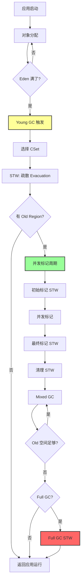
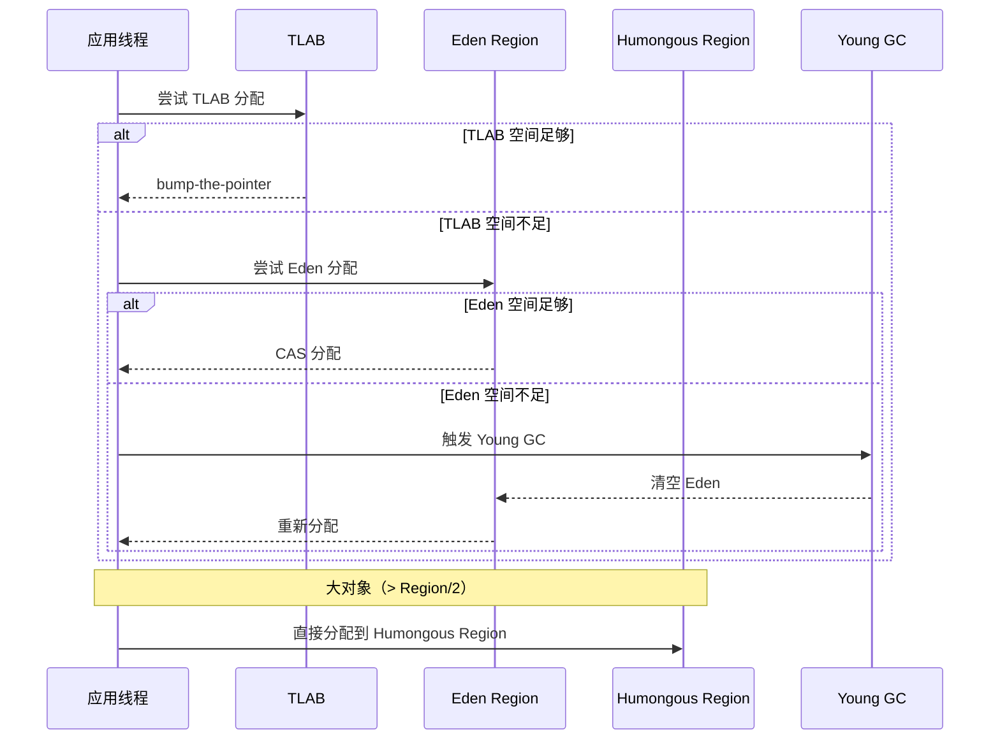
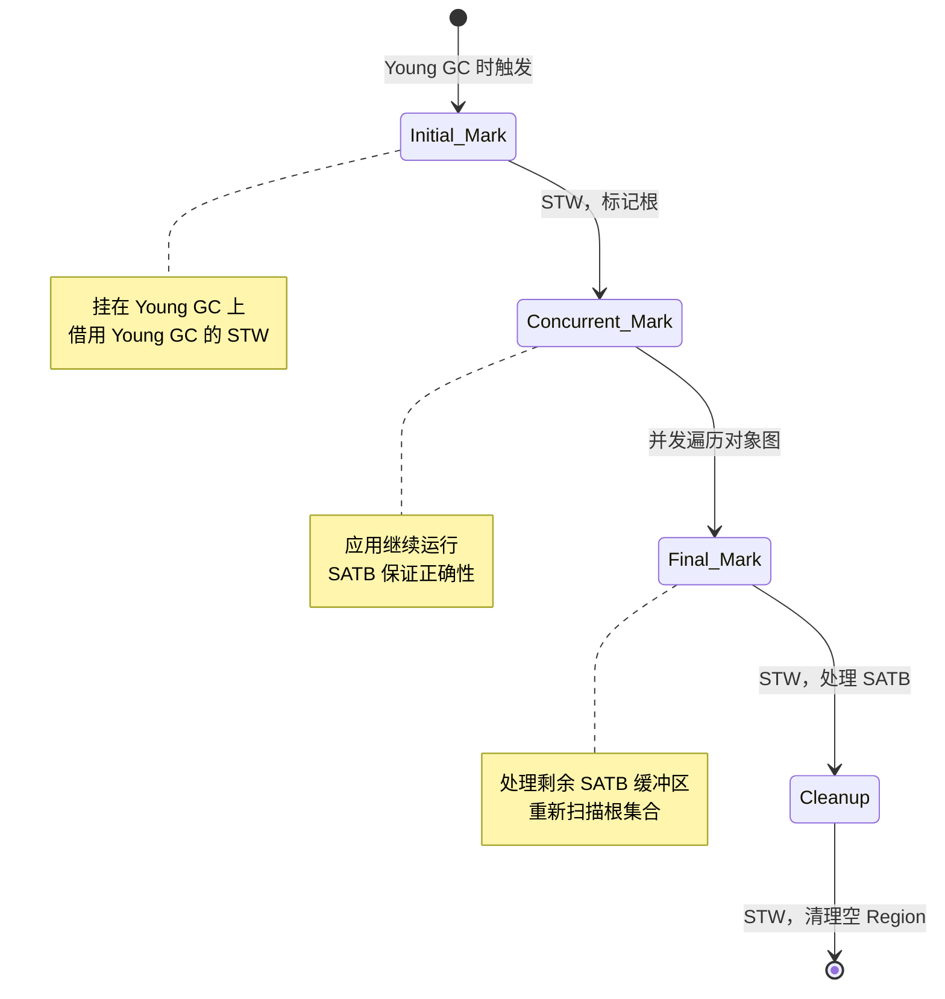
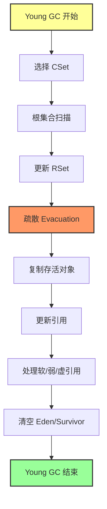
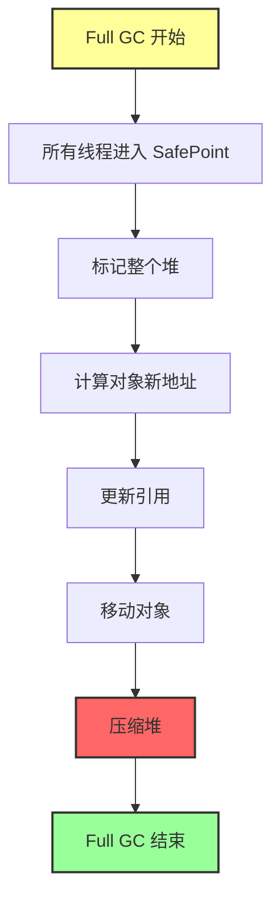
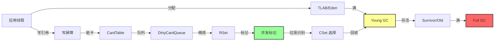

# G1 GC 完整流程串联文档

> **方法论**：程序 = 数据结构 + 算法
> **标准环境**：-Xms8g -Xmx8g -XX:+UseG1GC
> **目标**：串联 G1GC/ 目录下的 30 个文档，构建完整的 G1 GC 执行流程

---

## 第 0 部分：核心原理 ⭐

### 0.1 本质是什么？

本文梳理 **G1 GC 完整流程串联文档** 的完整执行流程：从触发条件到最终结果，展示每个阶段的核心操作和数据流转。

### 0.2 为什么需要？

复杂系统的行为往往难以从单个函数理解，需要从整体流程视角才能看清各组件的协作关系。

### 0.3 怎么解决？

以时序图/流程图展示整体流程，然后逐阶段深入分析：每个阶段解决什么问题、涉及哪些数据结构、关键代码在哪里。

### 0.4 为什么这样设计？

流程设计的核心权衡是「正确性 vs 性能」：某些看似冗余的步骤（如多次检查、屏障指令）是为了保证并发安全；某些看似复杂的路径是为了优化常见情况。

---


## 零、G1 GC 全景概览

### 0.1 设计哲学

**G1 要解决的核心问题**：如何在大堆（数十 GB）下实现可预测的低停顿？

**关键设计决策**：
- **Region 化**：将堆分割成固定大小的 Region（4MB），支持增量回收
- **并发标记**：应用运行时并发标记，减少 STW 时间
- **混合回收**：Young GC 时顺便回收部分 Old Region
- **预测模型**：基于历史数据预测 GC 停顿时间

### 0.2 完整执行流程



### 0.3 已分析 vs 未分析

| 模块 | 状态 | 文档位置（new-jvm-md/G1GC/） | 重要性 |
|------|------|------------------------------|--------|
| **数据结构全景图** | ✅ 完成 | 0-G1-DataStructure-Map.md (50K) | ⭐⭐⭐⭐⭐ |
| **HeapRegion** | ✅ 完成 | 1-HeapRegion-Deep-Dive.md (30K) | ⭐⭐⭐⭐⭐ |
| **HeapRegionManager** | ✅ 完成 | 2-HeapRegionManager-Deep-Dive.md (35K) | ⭐⭐⭐⭐⭐ |
| **对象分配路径** | ✅ 完成 | 3-Object-Allocation-Path.md (40K) | ⭐⭐⭐⭐⭐ |
| **写屏障与 CardTable** | ✅ 完成 | 4-WriteBarrier-CardTable.md (32K) | ⭐⭐⭐⭐⭐ |
| **RSet 三级结构** | ✅ 完成 | 5-RSet-Three-Level-Structure.md (23K) | ⭐⭐⭐⭐⭐ |
| **并发精炼** | ✅ 完成 | 6-Concurrent-Refinement.md (37K) | ⭐⭐⭐⭐ |
| **G1Policy 预测模型** | ✅ 完成 | 7-G1Policy-Prediction-Model.md (54K) | ⭐⭐⭐⭐⭐ |
| **并发标记** | ✅ 完成 | 8-Concurrent-Marking.md (40K)<br/>8A-Concurrent-Marking-Deep-Dive.md (19K) | ⭐⭐⭐⭐⭐ |
| **CSet 与疏散** | ✅ 完成 | 9-CollectionSet-Evacuation.md (44K) | ⭐⭐⭐⭐⭐ |
| **Full GC** | ✅ 完成 | 10-Full-GC.md (26K) | ⭐⭐⭐⭐ |
| **Young GC 完整 STW 流程** | ✅ 完成 | 11-Young-GC-Complete-STW-Flow.md (29K) | ⭐⭐⭐⭐⭐ |
| **G1RemSet 完整流程** | ✅ 完成 | 12-G1RemSet-Complete-Flow.md (52K) | ⭐⭐⭐⭐⭐ |
| **写屏障汇编全链路** | ✅ 完成 | 13-Write-Barrier-Assembly-Full-Chain.md (48K) | ⭐⭐⭐⭐ |
| **SafePoint 与 VMOperation** | ✅ 完成 | 14-SafePoint-VMOperation.md (43K)<br/>14A-SafePoint-Thread-State-Transitions-Deep-Dive.md (38K) | ⭐⭐⭐⭐ |
| **引用处理** | ✅ 完成 | 15-Reference-Processing-Full-Chain.md (42K) | ⭐⭐⭐⭐ |
| **策略自适应调整** | ✅ 完成 | 16-Strategy-Adaptive-Adjustment.md (49K) | ⭐⭐⭐⭐ |
| **辅助子系统** | ✅ 完成 | 17-Auxiliary-Subsystems.md (38K) | ⭐⭐⭐ |
| **GC 日志实践** | ✅ 完成 | 18-GC-Log-Practice.md (39K) | ⭐⭐⭐ |
| **GC 故障排查** | ✅ 完成 | 19-GC-Troubleshooting-Deep-Dive.md (46K) | ⭐⭐⭐⭐ |
| **故障排查系列** | ✅ 完成 | Troubleshooting-Series/ 目录（5 个案例） | ⭐⭐⭐⭐ |

**总计**：30 个文档，涵盖 G1 GC 所有核心模块

---

## 一、基础数据结构（已分析）

### 1.1 HeapRegion：G1 的基本单元

> **详细文档**：[1-HeapRegion-Deep-Dive.md](G1GC/1-HeapRegion-Deep-Dive.md)

**核心要点**：
- 每个 Region = 4MB 连续内存
- 5 种类型：Free、Eden、Survivor、Old、Humongous
- 关键字段：`_top`（分配指针）、`_bottom`（起始地址）、`_end`（结束地址）
- 内嵌 `HeapRegionRemSet`：追踪跨 Region 引用

**数据结构关系**：
```
HeapRegion (432 bytes)
├── HeapRegionType (Region 类型)
├── G1BlockOffsetTablePart (对象边界)
└── HeapRegionRemSet (跨 Region 引用)
    ├── OtherRegionsTable
    │   ├── SparsePRT (稀疏表)
    │   └── PerRegionTable[] (细粒度表)
    └── _code (强代码根)
```

### 1.2 HeapRegionManager：Region 总管

> **详细文档**：[2-HeapRegionManager-Deep-Dive.md](G1GC/2-HeapRegionManager-Deep-Dive.md)

**核心要点**：
- 管理所有 2048 个 Region
- `G1HeapRegionTable`：Region 指针数组
- `FreeRegionList`：空闲 Region 链表
- 分配/释放 Region 的入口

**关键操作**：
- `allocate_free_region()`：分配空闲 Region
- `retire_region()`：回收 Region
- `humongous_region_begin()`：获取大对象 Region

---

## 二、对象分配路径（已分析）

### 2.1 完整分配流程

> **详细文档**：[3-Object-Allocation-Path.md](G1GC/3-Object-Allocation-Path.md)



### 2.2 关键组件

| 组件 | 作用 | 文档章节 |
|------|------|---------|
| **TLAB** | 线程本地分配缓冲，避免竞争 | 3-Object-Allocation-Path.md §2 |
| **G1Allocator** | G1 对象分配器，管理分配指针 | 3-Object-Allocation-Path.md §3 |
| **MutatorAllocRegion** | 当前 Mutator 分配 Region | 3-Object-Allocation-Path.md §4 |
| **Humongous 对象** | 大对象分配路径 | 3-Object-Allocation-Path.md §5 |

---

## 三、写屏障与 RSet（已分析）

### 3.1 写屏障机制

> **详细文档**：[4-WriteBarrier-CardTable.md](G1GC/4-WriteBarrier-CardTable.md)<br/>
> **汇编实现**：[13-Write-Barrier-Assembly-Full-Chain.md](G1GC/13-Write-Barrier-Assembly-Full-Chain.md)

**核心问题**：如何高效追踪跨 Region 引用？

**G1 的解决方案**：
1. **写屏障**：在对象引用更新时触发
2. **CardTable**：标记脏卡（512B）
3. **RSet**：记录跨 Region 引用

**写屏障类型**：
```
G1 写屏障 = Pre-barrier + Post-barrier

Pre-barrier（前置屏障）：
  作用：并发标记时记录旧值
  场景：SATB（Snapshot-At-The-Beginning）

Post-barrier（后置屏障）：
  作用：更新 RSet
  场景：跨 Region 引用
```

### 3.2 RSet 三级结构

> **详细文档**：[5-RSet-Three-Level-Structure.md](G1GC/5-RSet-Three-Level-Structure.md)

```
G1RemSet (全局 RSet 管理)
└── HeapRegionRemSet (每个 Region 的 RSet)
    └── OtherRegionsTable (跨 Region 引用表)
        ├── SparsePRT (稀疏表)
        │   └── 索引：Region → Card 数组
        └── PerRegionTable[] (细粒度表)
            └── 位图：Card 是否被引用
```

**三级存储**：
1. **SparsePRT**：引用少时使用（稀疏）
2. **FinePRT**：引用多时使用（细粒度位图）
3. **CoarsePRT**：引用极多时使用（粗粒度位图）

### 3.3 并发精炼

> **详细文档**：[6-Concurrent-Refinement.md](G1GC/6-Concurrent-Refinement.md)

**核心问题**：脏卡队列可能堆积，如何异步处理？

**解决方案**：
- **Refinement 线程**：后台异步更新 RSet
- **阈值控制**：根据队列长度动态调整线程数
- **并发执行**：不阻塞应用线程

---

## 四、并发标记周期（已分析）

### 4.1 完整流程

> **详细文档**：[8-Concurrent-Marking.md](G1GC/8-Concurrent-Marking.md)



### 4.2 SATB（Snapshot-At-The-Beginning）

**核心思想**：
- 在标记开始时，对堆拍一个"快照"
- 标记过程中，对象引用的修改会记录到 SATB 缓冲区
- 最终标记阶段，处理 SATB 缓冲区

**关键数据结构**：
```
SATBMarkQueue (每线程)
└── SATB 缓冲区：记录修改前的引用
    → 并发标记线程处理
```

### 4.3 标记位图

**两个位图**：
- **prev_mark_bitmap**：上一轮标记结果
- **next_mark_bitmap**：当前标记结果

**位图大小**：
- 8GB 堆 = 128MB 位图（每个对象 1 bit）
- 两个位图 = 256MB

---

## 五、Young GC 完整流程（已分析）

### 5.1 触发条件

> **详细文档**：[11-Young-GC-Complete-STW-Flow.md](G1GC/11-Young-GC-Complete-STW-Flow.md)

```
Eden 区满 → Young GC 触发
├── Eden Region 分配失败
├── 达到 IHOP 阈值
└── 应用调用 System.gc()
```

### 5.2 Young GC STW 流程



**关键步骤**：
1. **选择 CSet**：所有 Eden + Survivor Region
2. **根集合扫描**：栈、寄存器、静态变量
3. **更新 RSet**：处理脏卡队列
4. **疏散 Evacuation**：复制存活对象到新 Region
5. **更新引用**：转发指针

### 5.3 CSet 选择策略

> **详细文档**：[9-CollectionSet-Evacuation.md](G1GC/9-CollectionSet-Evacuation.md)

**Young GC**：
- CSet = 所有 Eden Region + Survivor Region
- 强制回收所有年轻代

**Mixed GC**：
- CSet = 所有年轻代 + 部分 Old Region
- 基于预测模型选择 Old Region
- 目标：在停顿时间目标内，回收最多垃圾

---

## 六、G1Policy 预测模型（已分析）

### 6.1 核心算法

> **详细文档**：[7-G1Policy-Prediction-Model.md](G1GC/7-G1Policy-Prediction-Model.md)

**问题**：如何选择 Old Region 加入 CSet？

**G1 的解决方案**：
1. **垃圾量预测**：基于并发标记结果
2. **回收效率预测**：垃圾量 / 回收时间
3. **贪心选择**：选择效率最高的 Region
4. **停顿时间约束**：不超过 -XX:MaxGCPauseMillis

**关键公式**：
```
回收效率 = 垃圾量 / 预测回收时间
预测回收时间 = 历史平均时间 * 对象数量
```

### 6.2 自适应调整

> **详细文档**：[16-Strategy-Adaptive-Adjustment.md](G1GC/16-Strategy-Adaptive-Adjustment.md)

**动态调整参数**：
- **IHOP**：触发并发标记的 Old 占用率
- **Young 大小**：Eden Region 数量
- **CSet 比例**：Mixed GC 中 Old Region 比例

---

## 七、SafePoint 与 VMOperation（已分析）

### 7.1 SafePoint 机制

> **详细文档**：[14-SafePoint-VMOperation.md](G1GC/14-SafePoint-VMOperation.md)

**核心问题**：如何让所有线程停在安全点？

**G1 中的 SafePoint**：
- Young GC 开始前：所有线程进入 SafePoint
- 并发标记：应用线程继续运行
- Full GC：所有线程进入 SafePoint

**线程状态转换**：
> **详细文档**：[14A-SafePoint-Thread-State-Transitions-Deep-Dive.md](G1GC/14A-SafePoint-Thread-State-Transitions-Deep-Dive.md)

```
_thread_in_Java → _thread_in_vm → SafePoint
```

### 7.2 VMOperation 队列

**GC 操作作为 VMOperation**：
- `VM_G1CollectFull`：Full GC
- `VM_G1IncCollectionPause`：Young/Mixed GC
- `VM_CGC_Operation`：并发标记操作

---

## 八、Full GC（已分析）

### 8.1 触发条件

> **详细文档**：[10-Full-GC.md](G1GC/10-Full-GC.md)

```
Full GC 触发：
├── allocation failure（分配失败）
├── to-space exhausted（疏散失败）
├── Humongous 分配失败
├── Metaspace 满
└── System.gc() 且 DisableExplicitGC=false
```

### 8.2 Full GC 流程



**特点**：
- **单线程**：Serial Full GC
- **长停顿**：可能数秒甚至数十秒
- **兜底方案**：尽量避免触发

---

## 九、引用处理（已分析）

### 9.1 引用类型

> **详细文档**：[15-Reference-Processing-Full-Chain.md](G1GC/15-Reference-Processing-Full-Chain.md)

```
Java 引用类型：
├── Strong Reference（强引用）
├── Soft Reference（软引用）
├── Weak Reference（弱引用）
├── Phantom Reference（虚引用）
└── Final Reference（终结引用）
```

### 9.2 引用处理流程

**并发标记阶段**：
1. 发现 Reference 对象
2. 加入 discovered list

**最终标记阶段**：
1. 处理 discovered list
2. 根据引用类型决定是否保留
3. 加入 pending list

**GC 后**：
1. 处理 pending list
2. 调用 ReferenceHandler 线程
3. 执行 Cleaner 或 finalize()

---

## 十、GC 日志与故障排查（已分析）

### 10.1 GC 日志解读

> **详细文档**：[18-GC-Log-Practice.md](G1GC/18-GC-Log-Practice.md)

**启用 GC 日志**：
```bash
-Xlog:gc*:gc.log
```

**关键日志标签**：
- `[gc,start]`：GC 开始
- `[gc,heap]`：堆信息
- `[gc,ref]`：引用处理
- `[gc,task]`：并行任务
- `[gc,cpu]`：CPU 时间

### 10.2 故障排查案例

> **详细文档**：[19-GC-Troubleshooting-Deep-Dive.md](G1GC/19-GC-Troubleshooting-Deep-Dive.md)<br/>
> **案例集**：[Troubleshooting-Series/](G1GC/Troubleshooting-Series/)

**典型问题**：
1. **内存泄漏**
   - 症状：Old 区持续增长
   - 分析：jmap histo，找到大对象
   - 文档：01-Memory-Leak-Case-Study.md

2. **频繁 Young GC**
   - 症状：Young GC 间隔短
   - 分析：Eden 区太小
   - 文档：02-GC-Frequent-Case-Study.md

3. **频繁 Full GC**
   - 症状：Full GC 频繁触发
   - 分析：对象晋升过快、RSet 处理慢
   - 文档：03-Full-GC-Case-Study.md

4. **Humongous 对象**
   - 症状：大对象直接进 Old
   - 分析：对象大小 > Region/2
   - 文档：04-Humongous-Object-Case-Study.md

---

## 十一、核心流程总结

### 11.1 G1 GC 执行时序

```
时间轴 | GC 阶段                | 停顿类型 | 关键操作
───────┼────────────────────────┼──────────┼──────────────────────
T0     | 对象分配               | 无停顿   | TLAB/Eden 分配
T1     | Young GC 触发          | STW      | 选择 CSet、疏散
T2     | 应用运行               | 无停顿   | 对象分配、写屏障
T3     | 并发标记周期开始       | 部分 STW | 初始标记（挂 Young GC）
T4     | 并发标记               | 无停顿   | SATB、遍历对象图
T5     | 最终标记               | STW      | 处理 SATB 缓冲区
T6     | 清理                   | STW      | 回收空 Region
T7     | Mixed GC               | STW      | 回收年轻代 + 部分 Old
T8     | 应用运行               | 无停顿   | 对象分配
T9     | Full GC（如果需要）    | STW      | 标记-压缩整个堆
```

### 11.2 数据流全景图



### 11.3 关键性能指标

| 指标 | 计算方式 | 正常范围 | 异常表现 |
|------|---------|---------|---------|
| **Young GC 频率** | 次/分钟 | 1-10 | > 100 |
| **Young GC 停顿** | ms | 10-200 | > 500 |
| **并发标记周期** | 次/小时 | 1-4 | > 10 |
| **Full GC 频率** | 次/天 | 0-1 | > 1/小时 |
| **堆使用率** | % | 40-80 | > 90 |

---

## 十二、总结

### 12.1 G1 GC 的核心优势

1. **可预测停顿**：通过预测模型控制 GC 停顿时间
2. **增量回收**：不需要一次性回收整个堆
3. **并发标记**：减少 STW 时间
4. **Region 化**：灵活管理大堆

### 12.2 G1 GC 的权衡

| 权衡点 | 选择 | 代价 |
|--------|------|------|
| **停顿时间 vs 吞吐量** | 低停顿 | 吞吐量略低于 Parallel GC |
| **内存占用** | RSet/位图 | 额外 10-20% 内存 |
| **实现复杂度** | 高 | 维护成本高 |

### 12.3 最佳实践

1. **参数调优**：
   ```bash
   -Xms8g -Xmx8g              # 初始堆=最大堆
   -XX:+UseG1GC               # 使用 G1
   -XX:MaxGCPauseMillis=200   # 目标停顿时间
   -XX:InitiatingHeapOccupancyPercent=45  # IHOP
   ```

2. **监控指标**：
   - Young GC 频率和停顿
   - 并发标记周期时长
   - Full GC 是否发生
   - 堆使用率趋势

3. **故障排查**：
   - 启用 GC 日志
   - 使用 jstat 监控
   - 分析 heap dump

---

## 附录：文档链接汇总

### 核心数据结构
- [数据结构全景图](G1GC/0-G1-DataStructure-Map.md)
- [HeapRegion 深度分析](G1GC/1-HeapRegion-Deep-Dive.md)
- [HeapRegionManager 深度分析](G1GC/2-HeapRegionManager-Deep-Dive.md)

### 对象分配
- [对象分配路径](G1GC/3-Object-Allocation-Path.md)

### 写屏障与 RSet
- [写屏障与 CardTable](G1GC/4-WriteBarrier-CardTable.md)
- [RSet 三级结构](G1GC/5-RSet-Three-Level-Structure.md)
- [并发精炼](G1GC/6-Concurrent-Refinement.md)
- [写屏障汇编全链路](G1GC/13-Write-Barrier-Assembly-Full-Chain.md)
- [G1RemSet 完整流程](G1GC/12-G1RemSet-Complete-Flow.md)

### GC 流程
- [G1Policy 预测模型](G1GC/7-G1Policy-Prediction-Model.md)
- [并发标记](G1GC/8-Concurrent-Marking.md)
- [并发标记深度分析](G1GC/8A-Concurrent-Marking-Deep-Dive.md)
- [CSet 与疏散](G1GC/9-CollectionSet-Evacuation.md)
- [Full GC](G1GC/10-Full-GC.md)
- [Young GC 完整 STW 流程](G1GC/11-Young-GC-Complete-STW-Flow.md)

### 辅助机制
- [SafePoint 与 VMOperation](G1GC/14-SafePoint-VMOperation.md)
- [线程状态转换](G1GC/14A-SafePoint-Thread-State-Transitions-Deep-Dive.md)
- [引用处理](G1GC/15-Reference-Processing-Full-Chain.md)
- [策略自适应调整](G1GC/16-Strategy-Adaptive-Adjustment.md)
- [辅助子系统](G1GC/17-Auxiliary-Subsystems.md)

### 实践与排查
- [GC 日志实践](G1GC/18-GC-Log-Practice.md)
- [GC 故障排查](G1GC/19-GC-Troubleshooting-Deep-Dive.md)
- [内存泄漏案例](G1GC/Troubleshooting-Series/01-Memory-Leak-Case-Study.md)
- [频繁 GC 案例](G1GC/Troubleshooting-Series/02-GC-Frequent-Case-Study.md)
- [Full GC 案例](G1GC/Troubleshooting-Series/03-Full-GC-Case-Study.md)
- [Humongous 对象案例](G1GC/Troubleshooting-Series/04-Humongous-Object-Case-Study.md)
