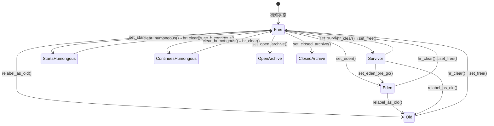
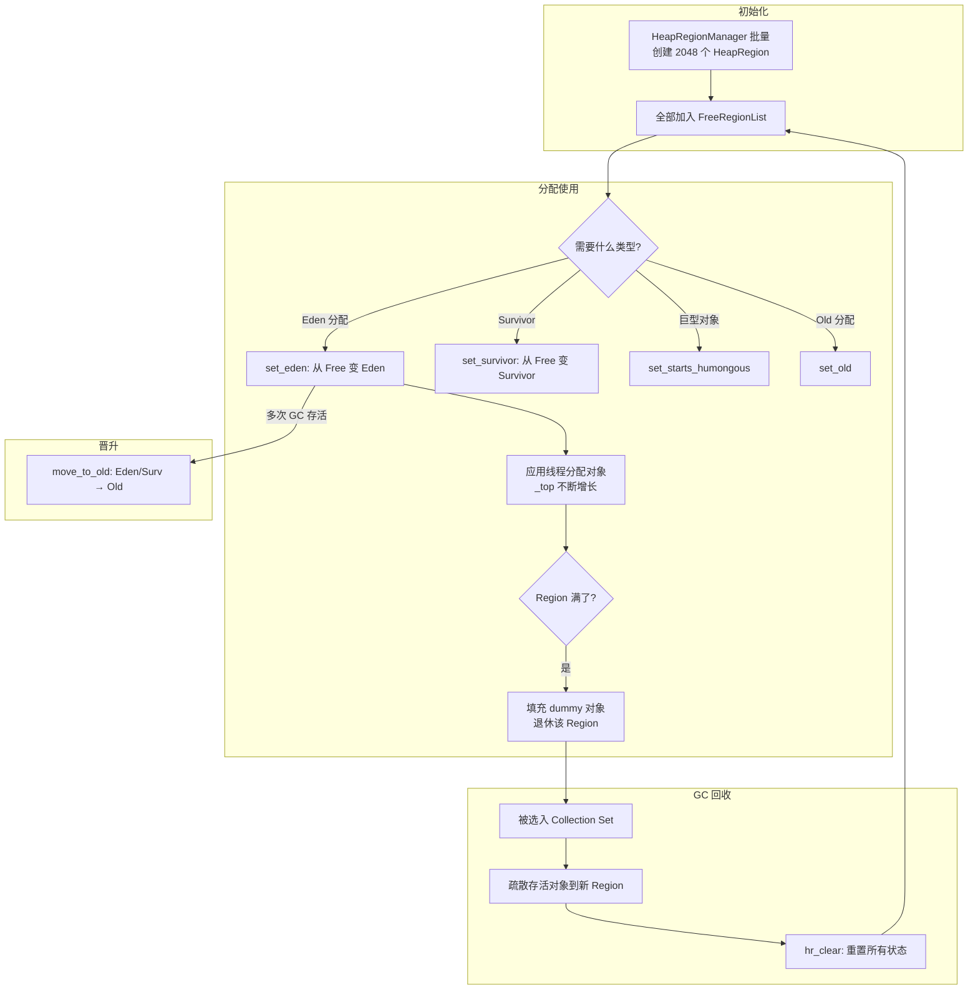

# HeapRegion 深度剖析

> G1 GC 攻克系列 #1 | 基于 OpenJDK 11 源码 | 标准条件：-Xms8g -Xmx8g -XX:+UseG1GC

---

## 第 0 部分：核心原理 ⭐

### 0.1 本质是什么？

HeapRegion 的本质是 **G1 GC 的最小独立回收单元**：整个 Java 堆被切分成 2048 个等大小的 Region（4MB/个），每个 Region 可以动态扮演 Eden/Survivor/Old/Humongous/Free 五种角色，GC 时只选择部分 Region 回收，实现增量式低停顿 GC。

### 0.2 为什么需要？

传统分代 GC（Serial/Parallel）将堆分为固定的连续 Young+Old 区。当堆很大（数十 GB）时，Full GC 必须扫描整个 Old 区，停顿不可控（秒级）；无法局部回收；Mark-Sweep 后碎片严重。G1 需要一种能**按需选择回收范围**的内存单元。

### 0.3 怎么解决？

**Region 化 + 角色动态切换**：每个 HeapRegion 是一块 4MB 的连续内存，通过 `_type` 字段记录当前角色（Eden/Survivor/Old/Humongous/Free）；GC 时 `G1Policy` 根据垃圾密度选择 Region 加入 CSet，只回收 CSet 中的 Region；Region 回收后变为 Free 状态，可重新分配为任意角色。

### 0.4 为什么这样设计？

- **为什么 Region 大小是 2 的幂次（1MB~32MB）？** 给定任意堆地址，通过 `addr >> log2(region_size)` 即可 O(1) 定位所属 Region，无需遍历
- **为什么 HeapRegion 继承 G1ContiguousSpace 而不是直接继承 Space？** G1ContiguousSpace 提供 `_top` 指针（当前分配位置）+ BOT（块偏移表）+ 并行分配锁，这三个是 G1 分配路径的必要基础设施
- **为什么 Humongous 对象要跨多个 Region 而不是分配在 Old 区？** 大对象在 Old 区会造成严重碎片；独立的 Humongous Region 可以在并发标记后直接回收（不需要 Evacuation），代价更低
- **为什么 Region 大小固定而不是可变？** 固定大小使得地址→Region 的映射是简单的位移运算，可变大小需要二分查找，在 GC 热路径上代价太高

---

## 一、一句话定义

**HeapRegion 是 G1 GC 的最小独立回收单元**——整个 Java 堆被切分成 2048 个大小相等的 HeapRegion（4MB/个），每个 Region 可以独立地充当 Eden、Survivor、Old 或 Humongous 角色，也可以处于 Free 状态等待分配。G1 的"Garbage-First"策略就建立在"按 Region 粒度选择性回收"之上。

---

## 二、为什么需要 HeapRegion？

### 2.1 问题：传统分代 GC 的困境

传统 GC（Serial、Parallel）将堆分为固定的两块连续区域（Young + Old）。当堆很大（数十 GB）时：
- **Full GC 停顿不可控**——必须扫描整个 Old 区
- **不能局部回收**——要么全收，要么不收
- **内存碎片严重**——Mark-Sweep 后碎片化，Mark-Compact 又太慢

### 2.2 解决：Region 化

G1 的核心创新：**将堆打散成大量等大小的 Region，每次 GC 只选择一部分 Region 来回收**。

这带来三个关键能力：
1. **增量回收**——每次暂停只处理一部分 Region，停顿时间可控
2. **灵活分代**——Region 不固定属于某一代，可以动态切换角色
3. **Garbage-First 策略**——优先回收垃圾最多的 Region，最大化回收效率

### 2.3 如果没有 HeapRegion 会怎样？

- G1 退化为传统的连续分代堆，失去增量回收能力
- 无法实现 `-XX:MaxGCPauseMillis` 停顿目标
- 无法在不 Full GC 的情况下回收 Old 区的垃圾

---

## 三、继承链

```
CHeapObj<mtGC>              — 无实例字段，仅 operator new/delete (C-heap 分配)
  └── Space                 — 堆空间基类 (56 bytes)
        └── CompactibleSpace   — 支持压缩 (88 bytes)
              └── G1ContiguousSpace  — G1 连续空间 (296 bytes)
                    └── HeapRegion   — G1 堆区域 (432 bytes)
```

**为什么继承这么深？**
- `Space`：提供 `_bottom` / `_end` 基本边界，这是所有堆空间的共性
- `CompactibleSpace`：Full GC 需要压缩支持
- `G1ContiguousSpace`：G1 特有的 `_top` 指针 + BOT + 并行分配锁
- `HeapRegion`：Region 特有的类型、RSet、标记信息、GC 策略字段

---

## 四、完整内存布局（GDB 验证）

### 【GDB 验证】标准条件：-Xms8g -Xmx8g -XX:+UseG1GC (slowdebug build)

```
HeapRegion 对象布局 (共 432 字节)
偏移       字段名                        大小     来源层
━━━━━━━━━━━━━━━━━━━━━━━━━━━━━━━━━━━━━━━━━━━━━━━━━━━━━━━━━━━━━
0x000 (0)   [vtable pointer]             8       CHeapObj
──────────────── Space 层 (56 bytes) ─────────────────────────
0x008 (8)   _bottom                      8       Space: 堆空间起始地址
0x010 (16)  _end                         8       Space: 堆空间结束地址
0x018 (24)  _saved_mark_word             8       Space: 保存的标记点(G1不用)
0x020 (32)  _par_seq_tasks               24      Space: 并行子任务 (SequentialSubTasksDone)
              ├─ _n_tasks     (uint)     4         总任务数
              ├─ _n_claimed   (vol uint) 4         已认领数
              ├─ _n_threads   (uint)     4         线程总数
              ├─ _n_completed (vol uint) 4         已完成数
              └─ [padding]               8         对齐到8
──────────────── CompactibleSpace 层 (32 bytes) ──────────────
0x038 (56)  _compaction_top              8       压缩后的 top 位置
0x040 (64)  _next_compaction_space       8       压缩顺序中的下一个 Space
0x048 (72)  _first_dead                  8       压缩阶段：第一个死对象
0x050 (80)  _end_of_live                 8       压缩阶段：存活对象结束位置
──────────────── G1ContiguousSpace 层 (208 bytes) ────────────
0x058 (88)  _top                         8       ★ 当前分配水位线 (volatile)
0x060 (96)  _bot_part                    40      ★ BOT 分区 (G1BlockOffsetTablePart)
              ├─ _next_offset_threshold  8         下一个 BOT 更新阈值
              ├─ _next_offset_index      8         对应的 BOT 数组索引
              ├─ _object_can_span(debug) 8         对象能否跨 Region(debug)
              ├─ _bot                    8         全局 BOT 指针
              └─ _space                  8         指向所属 G1ContiguousSpace
0x088 (136) _par_alloc_lock              152     并行分配互斥锁 (Mutex)
0x120 (288) _pre_dummy_top               8       退休 Region 时最后真实对象的 top
──────────────── HeapRegion 层 (136 bytes) ──────────────────
0x128 (296) _rem_set                     8       ★★★ 记忆集指针 (HeapRegionRemSet*)
0x130 (304) _hrm_index                   4       ★ Region 在 HeapRegionManager 中的索引
0x134 (308) _type                        4       ★★ 类型标签 (HeapRegionType)
0x138 (312) _humongous_start_region      8       巨型对象起始 Region 指针
0x140 (320) _evacuation_failed           1       疏散失败标记
            [padding]                    7       对齐到 8
0x148 (328) _next                        8       ★ 链表下一节点 (FreeRegionList 等)
0x150 (336) _prev                        8       ★ 链表上一节点
0x158 (344) _containing_set              8       (仅 debug build) 所属 HeapRegionSet
0x160 (352) _prev_marked_bytes           8       ★ 上次标记完成时的存活字节数
0x168 (360) _next_marked_bytes           8       正在进行的标记中的存活字节数
0x170 (368) _gc_efficiency               8       ★ GC 效率 = 可回收字节 / 预测耗时
0x178 (376) _young_index_in_cset         4       在 CSet 年轻代中的索引
            [padding]                    4       对齐到 8
0x180 (384) _surv_rate_group             8       存活率预测组指针
0x188 (392) _age_index                   4       Region 年龄索引
            [padding]                    4       对齐到 8
0x190 (400) _prev_top_at_mark_start      8       ★★ PTAMS: 上次标记开始时的 top
0x198 (408) _next_top_at_mark_start      8       ★★ NTAMS: 当前标记开始时的 top
0x1A0 (416) _recorded_rs_length          8       CSet 选择时记录的 RSet 长度
0x1A8 (424) _predicted_elapsed_time_ms   8       CSet 选择时预测的处理耗时(ms)
━━━━━━━━━━━━━━━━━━━━━━━━━━━━━━━━━━━━━━━━━━━━━━━━━━━━━━━━━━━━━
                                         总计: 432 bytes
```

> **注**：debug build 中 `_containing_set` 占 8 字节（偏移 344），release build 中不存在，
> 因此 release build 的 sizeof(HeapRegion) 可能为 424 字节。

---

## 五、逐字段深度分析

### 5.1 核心地址三元组：`_bottom` / `_top` / `_end`

```
                         4MB Region
  ┌──────────────────┬────────────────────┐
  │   已使用空间      │    空闲空间        │
  │  (已分配的对象)    │   (可分配区域)      │
  └──────────────────┴────────────────────┘
  ↑                   ↑                    ↑
_bottom              _top                 _end
```

| 字段 | 类型 | 说明 |
|------|------|------|
| `_bottom` | `HeapWord*` | Region 起始地址，一旦初始化**永不改变** |
| `_top` | `HeapWord* volatile` | ★ 下一个可分配位置的指针（水位线），分配 = `_top += size` |
| `_end` | `HeapWord*` | Region 结束地址，一旦初始化**永不改变** |

**关键行为**：
- **`used() = top - bottom`**，**`free() = end - top`**
- **`capacity() = end - bottom`** = GrainBytes = 4MB
- `_top == _bottom`：Region 完全空闲
- `_top == _end`：Region 已满

**为什么 `_top` 是 volatile？**

因为在 GC 疏散阶段，多个 GC Worker 线程可能并发向同一个 Survivor/Old Region 分配对象。`volatile` 保证可见性，配合 `Atomic::cmpxchg` 实现无锁并行分配：

```cpp:55:77:src/hotspot/share/gc/g1/heapRegion.inline.hpp
// par_allocate_impl: CAS 循环实现并行 bump-the-pointer
inline HeapWord* G1ContiguousSpace::par_allocate_impl(...) {
  do {
    HeapWord* obj = top();
    size_t available = pointer_delta(end(), obj);
    size_t want_to_allocate = MIN2(available, desired_word_size);
    if (want_to_allocate >= min_word_size) {
      HeapWord* new_top = obj + want_to_allocate;
      HeapWord* result = Atomic::cmpxchg(new_top, top_addr(), obj);
      if (result == obj) {
        *actual_size = want_to_allocate;
        return obj;
      }
      // CAS 失败，重试
    } else {
      return NULL; // 空间不足
    }
  } while (true);
}
```

**GDB 验证数据**：
```
第一个 HeapRegion (#0):
  bottom = 0x600000000
  top    = 0x600000000  (初始化时 top = bottom，空的)
  end    = 0x600400000  (0x400000 = 4194304 = 4MB ✓)
```

---

### 5.2 `_hrm_index`：Region 索引

| 属性 | 值 |
|------|-----|
| 类型 | `uint` (4 bytes) |
| 范围 | 0 ~ 2047 (标准 8GB 堆) |
| 哨兵值 | `G1_NO_HRM_INDEX = (uint)-1 = 4294967295` |

**为什么需要？**

Region 在内存中是连续排列的，给定一个对象地址，可以通过位运算快速定位它属于哪个 Region：

```
region_index = (addr - heap_base) >> LogOfHRGrainBytes
             = (addr - heap_base) >> 22
```

反过来，给定 `_hrm_index`，可以通过 `HeapRegionManager::_regions` 数组 O(1) 获取 HeapRegion 对象。

**谁使用它？**
- `HeapRegionManager::at(uint index)` → 通过索引取 Region
- `HR_FORMAT` 宏用于日志输出：`%u:(%s)[bottom, top, end]`
- Region 类型变化时的 trace 事件

---

### 5.3 `_type`：Region 类型标签

HeapRegionType 只有一个字段：`volatile Tag _tag`（4 字节枚举）。

**编码设计**：高位是主类型（major），低 1 位是子类型（minor）：

```
位编码          十进制   含义
──────────────────────────────────────────
00000 0         [ 0]    Free（空闲）
00001 0         [ 2]    Eden
00001 1         [ 3]    Survivor
00110 0         [12]    StartsHumongous（巨型对象起始）
00110 1         [13]    ContinuesHumongous（巨型对象延续）
01000 0         [16]    Old（老年代）
11100 0         [56]    OpenArchive（开放归档）
11100 1         [57]    ClosedArchive（关闭归档）
```

**位掩码快速判断**：
```
YoungMask     = 0b00010 = 2    → is_young()    = (_tag & 2) != 0
HumongousMask = 0b00100 = 4    → is_humongous()= (_tag & 4) != 0
PinnedMask    = 0b01000 = 8    → is_pinned()   = (_tag & 8) != 0
OldMask       = 0b10000 = 16   → is_old()      = (_tag & 16) != 0
ArchiveMask   = 0b100000 = 32  → is_archive()  = (_tag & 32) != 0
```

**类型状态转换规则**（`set_from` 强制检查前置状态）：



**为什么 `_tag` 是 volatile？**

在并发标记期间，Region 类型可能被 VM 线程（在 safepoint 中）修改，而并发标记线程需要读取它来判断 Region 状态。`volatile` 保证可见性。

---

### 5.4 `_top` 的"时间戳"问题与 TAMS

#### 5.4.1 问题：并发标记期间的新分配对象

并发标记与应用线程并发执行。标记开始后，应用线程仍在分配新对象。这些新对象：
- **标记位图中没有标记**（标记开始时它们不存在）
- **但它们是存活的**（刚分配的）

如果不特殊处理，这些对象会被错误地认为是垃圾。

#### 5.4.2 解决：TAMS（Top At Mark Start）

```
                     Region
  ┌────────────────┬──────────┬──────────┐
  │  标记前的对象   │ 标记期间  │  空闲    │
  │  (需要标记)     │ 新分配的  │          │
  └────────────────┴──────────┴──────────┘
  ↑                 ↑          ↑          ↑
bottom           TAMS        top        end
                   │
                   └── 标记开始时 top 的快照

  [bottom, TAMS) = 需要通过标记位图判断存活
  [TAMS,   top)  = 隐式存活（标记开始后分配的）
```

两个 TAMS 字段支持**双缓冲标记**：

| 字段 | 含义 | 写入时机 | 读取者 |
|------|------|---------|--------|
| `_prev_top_at_mark_start` (PTAMS) | 上次**完成**标记时的 top 快照 | `note_end_of_marking()` | 后续 GC 用来判断对象存活 |
| `_next_top_at_mark_start` (NTAMS) | **正在进行**标记时的 top 快照 | `note_start_of_marking()` | 并发标记线程 |

**双缓冲翻转**（`note_end_of_marking()`）：
```cpp
_prev_top_at_mark_start = _next_top_at_mark_start;
_next_top_at_mark_start = bottom();
_prev_marked_bytes = _next_marked_bytes;
_next_marked_bytes = 0;
```

---

### 5.5 `_rem_set`：记忆集指针

| 属性 | 值 |
|------|-----|
| 类型 | `HeapRegionRemSet*` (堆分配) |
| 大小 | sizeof(HeapRegionRemSet) = 328 bytes |
| 创建 | HeapRegion 构造函数中 `new HeapRegionRemSet(bot, this)` |

**为什么需要？**

G1 按 Region 粒度回收。回收 Region A 时，需要知道"谁引用了 A 中的对象"。遍历整个堆太慢，所以每个 Region 维护一个 RSet，记录"指向我的跨 Region 引用来自哪里"。

RSet 内部是 `OtherRegionsTable`，采用三级存储结构：
- **Sparse**（稀疏）：直接记录 `<源Region, 卡片索引>` 对
- **Fine**（精细）：每个源 Region 一个位图，标记哪些卡片包含引用
- **Coarse**（粗粒度）：一个位向量，每 bit 代表一个源 Region

三级结构在后续 RSet 专题中详细分析。

---

### 5.6 `_bot_part`：块偏移表分区

| 属性 | 值 |
|------|-----|
| 类型 | `G1BlockOffsetTablePart`（内嵌，非指针） |
| 大小 | 40 bytes |
| 偏移 | 96 |

**为什么需要 BOT？**

G1 的脏卡处理需要"给定一个卡片地址（512 字节对齐），找到覆盖该地址的对象起始位置"。这就是 BOT 的核心功能：**反向映射地址到对象起始**。

#### BOT 工作原理

全局有一个 `G1BlockOffsetTable`，覆盖整个堆，其核心是一个 `u_char[]` 数组。每个字节对应堆中 512 字节（一张卡片）。

```
堆内存:      [  卡片0  ][  卡片1  ][  卡片2  ][  卡片3  ] ...
BOT数组:     [   0    ][   1    ][   2    ][   0    ] ...
              ↑                              ↑
              对象在此卡片起始                  另一个对象起始
```

每个 `G1BlockOffsetTablePart` 管理一个 Region 对应的 BOT 片段：

| 字段 | 含义 |
|------|------|
| `_next_offset_threshold` | 下一个需要更新 BOT 的分配边界 |
| `_next_offset_index` | 对应的 BOT 数组索引 |
| `_bot` | 指向全局 `G1BlockOffsetTable` |
| `_space` | 指向所属的 `G1ContiguousSpace` |
| `_object_can_span` | (debug) 对象能否跨越此 Region（巨型对象） |

**关键常量**（BOTConstants）：
```
LogN       = 9    → 每个 BOT 条目覆盖 2^9 = 512 字节 = 1 张卡片
N_bytes    = 512  → 每条目对应 512 字节堆内存
N_words    = 64   → 每条目对应 64 个 HeapWord（64×8=512）
LogN_words = 6    → log2(64)
```

**GDB 验证**：
```
Region #0 的 BOT:
  _next_offset_threshold = 0x600000200  (= bottom + 512 = 第一张卡片边界)
  _next_offset_index     = 1            (下一个要更新的 BOT 索引)
  _bot (全局)            = 0x7ffff0058680
  _space                 = 0x7ffff009d960 (= this，指向 Region 自身)
```

**年轻代优化**：年轻代 Region 在分配时可以**跳过 BOT 更新**（`par_allocate_no_bot_updates`），因为年轻代整体回收，不需要按卡片定位对象。

---

### 5.7 `_par_alloc_lock`：并行分配锁

| 属性 | 值 |
|------|-----|
| 类型 | `Mutex` (内嵌) |
| 大小 | 152 bytes |
| 偏移 | 136 |
| 用途 | `par_allocate()` 时序列化分配操作 |

**注意**：这个锁主要用于**需要更新 BOT 的并行分配**。因为 BOT 更新不是原子的，所以需要加锁。而年轻代的 `par_allocate_no_bot_updates` 使用无锁 CAS 方式（因为不更新 BOT）。

这个 Mutex 是 HeapRegion 中最大的内嵌字段（152 bytes），占总大小的 35%。

---

### 5.8 标记相关字段

| 字段 | 类型 | 含义 |
|------|------|------|
| `_prev_marked_bytes` | `size_t` | 上次标记完成后确认的存活字节数 |
| `_next_marked_bytes` | `size_t` | 正在进行的标记中已确认的存活字节数 |

**用途**：
- `live_bytes() = (top - PTAMS) × HeapWordSize + _prev_marked_bytes`
  - `[bottom, PTAMS)` 中存活的 = `_prev_marked_bytes`
  - `[PTAMS, top)` 中全部隐式存活
- `garbage_bytes() = (PTAMS - bottom) × HeapWordSize - _prev_marked_bytes`
- `reclaimable_bytes() = capacity - live_bytes()`

这些值直接影响 G1Policy 选择哪些 Region 进入 Collection Set。

---

### 5.9 GC 策略相关字段

| 字段 | 类型 | 含义 | 谁写 | 谁读 |
|------|------|------|------|------|
| `_gc_efficiency` | `double` | 可回收字节 / 预测耗时 | `calc_gc_efficiency()` | `CollectionSetChooser` |
| `_young_index_in_cset` | `int` | 在 CSet 年轻代列表中的索引 | `set_young_index_in_cset()` | GC 疏散 |
| `_surv_rate_group` | `SurvRateGroup*` | 存活率预测分组 | Eden/Survivor Region 安装时 | G1Policy 预测 |
| `_age_index` | `int` | 在 SurvRateGroup 中的年龄索引 | `install_surv_rate_group()` | 存活率统计 |
| `_recorded_rs_length` | `size_t` | CSet 选择时快照的 RSet 长度 | CSet 构建阶段 | 暂停时间预测 |
| `_predicted_elapsed_time_ms` | `double` | 预测的 Region 处理耗时 | CSet 构建阶段 | 暂停时间预算 |

**`_gc_efficiency` 计算公式**（`calc_gc_efficiency()`）：

```
gc_efficiency = reclaimable_bytes() / predict_region_elapsed_time_ms()
```

G1 优先回收 `_gc_efficiency` 最高的 Region——**垃圾多、处理快**的 Region 最先被选中，这就是"Garbage-First"名称的来源。

---

### 5.10 链表字段：`_next` / `_prev`

| 字段 | 含义 |
|------|------|
| `_next` | 双向链表的下一个节点 |
| `_prev` | 双向链表的上一个节点 |

HeapRegion 通过这对指针被组织到各种链表中：
- **FreeRegionList**：空闲 Region 链表
- **OldRegionList**：CSet 候选的 Old Region 链表
- **HumongousRegionSet**：巨型 Region 集合

同一时刻，一个 Region 只能属于一个链表（debug build 中 `_containing_set` 用于检查这一点）。

---

### 5.11 巨型对象支持：`_humongous_start_region`

当对象大小超过 Region 容量的 50%（即 > 2MB），它会被作为"巨型对象"处理，占据一个或多个连续 Region。

```
  StartsHumongous    ContinuesHumongous   ContinuesHumongous
  ┌────────────────┬────────────────────┬────────────────────┐
  │  巨型对象头     │   巨型对象体(续)    │  巨型对象尾 + 填充  │
  └────────────────┴────────────────────┴────────────────────┘
  Region #5         Region #6            Region #7

  #5._humongous_start_region = #5 (自身)
  #6._humongous_start_region = #5 (指向起始)
  #7._humongous_start_region = #5 (指向起始)
```

---

### 5.12 `_evacuation_failed`：疏散失败标记

GC 疏散时，如果目标空间已满无法复制对象，该 Region 标记为 `_evacuation_failed = true`。此时：
- 该 Region 不会被清除
- 其中的对象就地保留（"自转发"）
- `_next_marked_bytes` 被重置为 0

这是一个安全阀机制——宁可留着垃圾，也不能丢失存活对象。

---

### 5.13 `_pre_dummy_top`

当需要"退休"一个分配 Region（比如 Eden 满了要换一个新 Region），GC 会在 Region 末尾填充一个 dummy 对象确保可解析性。`_pre_dummy_top` 记录了填充前的真实 top，用于统计实际使用量。

---

## 六、静态常量

### 【GDB 验证】标准条件：-Xms8g -Xmx8g -XX:+UseG1GC

```
┌─────────────────────────────────────────────────────────────┐
│ HeapRegion::GrainBytes      = 4,194,304 (4MB)           ✓  │
│ HeapRegion::GrainWords      = 524,288 (= 4MB/8)         ✓  │
│ HeapRegion::LogOfHRGrainBytes = 22 (= log2(4MB))        ✓  │
│ HeapRegion::LogOfHRGrainWords = 19 (= log2(524288))     ✓  │
│ HeapRegion::CardsPerRegion  = 8,192 (= 4MB/512)         ✓  │
├─────────────────────────────────────────────────────────────┤
│ BOTConstants::N_bytes = 512   (一个 BOT 条目覆盖 512 字节)   │
│ BOTConstants::N_words = 64    (64 个 HeapWord)              │
│ BOTConstants::LogN    = 9     (log2(512))                   │
│ Region 数量 = 2048   (8GB / 4MB)                           │
└─────────────────────────────────────────────────────────────┘
```

### Region 大小计算逻辑（`setup_heap_region_size()`）

```cpp
// 如果用户没设置 G1HeapRegionSize:
average_heap_size = (initial_heap_size + max_heap_size) / 2
                  = (8GB + 8GB) / 2 = 8GB
region_size = MAX2(average / 2048, 1MB)
            = MAX2(8GB / 2048, 1MB) = MAX2(4MB, 1MB) = 4MB
// 然后下取整到 2 的幂 → 4MB
// 限制在 [1MB, 32MB] 范围内 → 4MB ✓
```

**JVM 参数**：`-XX:G1HeapRegionSize=<size>` 可手动设置（必须是 2 的幂，范围 1MB~32MB）。

**查看 Region 大小的日志**：
- 参数：`-Xlog:gc+heap=info`
- 输出示例：`Heap region size: 4M`

---

## 七、Region 生命周期



---

## 八、HeapRegion 与周边组件的关系

```mermaid
graph LR
    subgraph HeapRegion
        HR[HeapRegion<br/>432 bytes]
    end

    subgraph 管理者
        HRM[HeapRegionManager<br/>持有 HeapRegion* 数组]
        FRL[FreeRegionList<br/>空闲 Region 链表]
        CS[G1CollectionSet<br/>回收集合]
    end

    subgraph 子组件
        RSet[HeapRegionRemSet<br/>记忆集 328 bytes]
        BOT[G1BlockOffsetTablePart<br/>块偏移表分区]
        TYPE[HeapRegionType<br/>类型标签]
    end

    subgraph 策略
        Policy[G1Policy<br/>GC 策略]
        SRG[SurvRateGroup<br/>存活率预测]
        CSC[CollectionSetChooser<br/>CSet 选择器]
    end

    subgraph 基础设施
        CT[G1CardTable<br/>卡表]
        CM[G1ConcurrentMark<br/>并发标记]
        GBOT[G1BlockOffsetTable<br/>全局 BOT]
    end

    HRM -->|_regions[index]| HR
    FRL -->|_next/_prev 链表| HR
    CS -->|选中回收| HR
    HR -->|_rem_set 指针| RSet
    HR -->|_bot_part 内嵌| BOT
    HR -->|_type 内嵌| TYPE
    HR -->|_surv_rate_group| SRG
    Policy -->|calc_gc_efficiency| HR
    CSC -->|按 gc_efficiency 排序| HR
    CM -->|更新 TAMS/_marked_bytes| HR
    BOT -->|_bot 指向| GBOT
    RSet -->|跟踪脏卡| CT
```

---

## 九、关键操作详解

### 9.1 对象分配（两种路径）

| 路径 | 方法 | 是否更新 BOT | 是否加锁 | 适用场景 |
|------|------|-------------|---------|---------|
| 单线程 | `allocate_impl()` | 调用方决定 | 否 | TLAB 分配后的 Region 级分配 |
| 多线程 | `par_allocate_impl()` | 调用方决定 | CAS 无锁 | GC 疏散并行分配 |
| 多线程+BOT | `par_allocate()` | ✅ | `_par_alloc_lock` 互斥 | Old Region 分配 |
| 年轻代优化 | `par_allocate_no_bot_updates()` | ❌ | CAS 无锁 | Young Region 分配 |

### 9.2 Region 重置（`hr_clear()`）

当 Region 被回收后，需要重置为空闲状态：
1. `set_young_index_in_cset(-1)` — 清除 CSet 索引
2. `uninstall_surv_rate_group()` — 卸载存活率组
3. `set_free()` — 类型变为 Free
4. `reset_pre_dummy_top()` — 清除 dummy top
5. `rem_set()->clear()` — 清除 RSet（如果需要）
6. `zero_marked_bytes()` — 标记字节归零
7. `init_top_at_mark_start()` — TAMS 重置到 bottom
8. `clear()` — top 重置到 bottom，清空 BOT

---

## 十、JVM 参数

| 参数 | 默认值 | 说明 |
|------|--------|------|
| `-XX:G1HeapRegionSize=<size>` | 自动计算 | Region 大小（1MB~32MB，必须 2 的幂）|
| `-Xlog:gc+heap=info` | — | 查看 Region 大小日志 |
| `-Xlog:gc+region=trace` | — | 查看 Region 类型变化 |
| `-XX:G1HeapRegionSize=4m` | — | 手动设置 4MB Region |

**日志输出示例**：

`-Xlog:gc+heap=info` 输出：
```
[info][gc,heap] Heap region size: 4M
```

---

## 十一、设计决策总结

| # | 设计决策 | 解决的问题 | 权衡 |
|---|---------|-----------|------|
| 1 | 固定大小 Region | 简化内存管理，位运算快速定位 | 浪费部分空间（巨型对象尾部填充）|
| 2 | 内嵌 Mutex (152B) | 避免额外堆分配和间接寻址 | 每个 Region 占用更多内存 |
| 3 | 内嵌 BOT Part (40B) | 减少间接寻址，提升缓存命中率 | Region 对象更大 |
| 4 | RSet 用指针而非内嵌 | RSet 大小差异巨大(0~数MB)，不适合内嵌 | 一次额外间接寻址 |
| 5 | 双缓冲 TAMS | 支持并发标记不停止世界 | 两倍标记存储空间 |
| 6 | volatile _top | 支持并发分配的可见性 | 轻微的编译器优化限制 |
| 7 | volatile _tag | 支持并发读取 Region 类型 | 同上 |
| 8 | 年轻代跳过 BOT | 年轻代整体回收不需要按卡片定位 | 限制了年轻代 Region 的使用方式 |
| 9 | `_gc_efficiency` 缓存 | 避免 CSet 选择时重复计算 | 需要在标记完成后更新 |
| 10 | `_next/_prev` 侵入式链表 | 零额外内存分配，O(1) 链表操作 | 同时只能在一个链表中 |

---

## 十二、GDB 验证汇总

### sizeof 汇总

```
┌──────────────────────────────────────────┐
│ sizeof(HeapRegion)              = 432    │
│ sizeof(G1ContiguousSpace)       = 296    │
│ sizeof(CompactibleSpace)        = 88     │
│ sizeof(Space)                   = 56     │
│ sizeof(G1BlockOffsetTablePart)  = 40     │
│ sizeof(HeapRegionType)          = 4      │
│ sizeof(HeapRegionRemSet)        = 328    │
│ sizeof(Mutex)                   = 152    │
│ sizeof(SequentialSubTasksDone)  = 24     │
└──────────────────────────────────────────┘

2048 个 HeapRegion 的元数据总内存:
  HeapRegion 对象: 2048 × 432 = 864 KB
  HeapRegionRemSet: 2048 × 328 = 656 KB
  合计约: ~1.5 MB (相对 8GB 堆微不足道)
```

### 第一个 HeapRegion (#0) 实际数据

```
┌──────────────────────────────────────────────────┐
│ HeapRegion #0 @ 0x7ffff009d960                    │
│ bottom     = 0x0000000600000000                   │
│ top        = 0x0000000600000000 (空)              │
│ end        = 0x0000000600400000 (+4MB)            │
│ type       = 0 (Free)                             │
│ rem_set    = 0x7ffff009db50                       │
│ rem_state  = 0 (Untracked)                        │
│ BOT threshold = 0x0000000600000200 (bottom+512)   │
│ BOT index     = 1                                 │
└──────────────────────────────────────────────────┘
```

---

## 十三、下一步

HeapRegion 是 G1 的基石，所有操作都在 Region 上进行。接下来的攻克顺序：

| 序号 | 主题 | 与 HeapRegion 的关系 |
|------|------|---------------------|
| **2** | **HeapRegionManager + 内存管理** | 管理 2048 个 HeapRegion 的创建、分配、回收 |
| **3** | **对象分配路径** | TLAB → Region → heap 的完整分配链路 |
| **4** | **写屏障 + CardTable** | 写入 Region 中对象引用时触发的屏障 |
| **5** | **RSet 三级结构** | HeapRegionRemSet 内部的 Sparse/Fine/Coarse |
