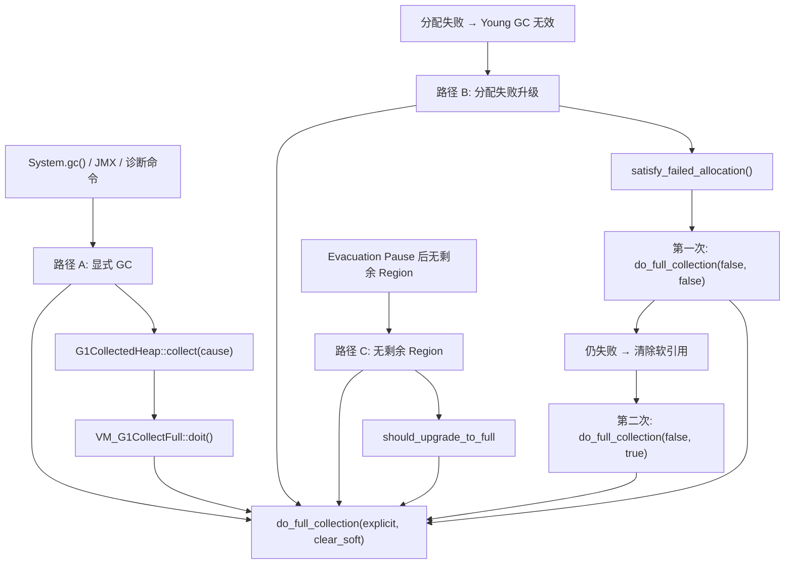
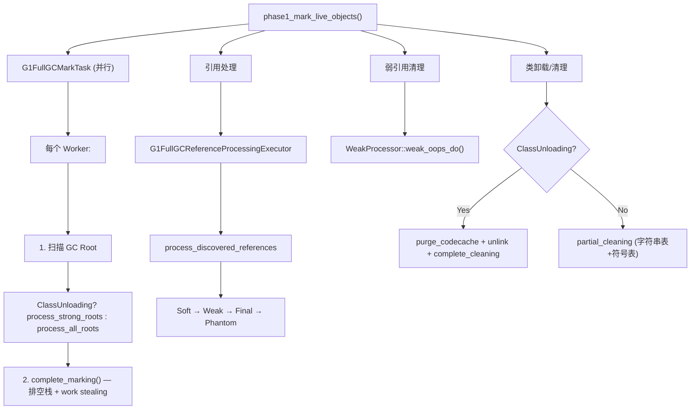

# G1 Full GC 深度剖析

> **一句话总结**：G1 Full GC 是最后的安全网——当 Young/Mixed GC 都无法回收足够空间时，执行全堆的四阶段 Mark-Compact（标记-压缩），全程 STW，由 `G1FullCollector` 主控并行执行。

---

## 第 0 部分：核心原理 ⭐

### 0.1 本质是什么？

G1 Full GC 的本质是**全堆并行 Mark-Compact**：四个阶段（Mark/Prepare Compaction/Adjust Pointers/Compact）全程 STW，由 `G1FullCollector` 主控，`G1FullGCCompactionPoint` 管理压缩目标，多个 GC Worker 并行执行。与 Young/Mixed GC 的复制式不同，Full GC 是原地压缩（Mark-Compact），不需要额外的 Free Region。

### 0.2 为什么需要？

G1 的正常回收路径（Young GC + Mixed GC）是复制式的，需要 Free Region 作为复制目标。当堆空间极度紧张（Free Region 不足）、Evacuation Failure 无法恢复、或显式调用 `System.gc()` 时，复制式 GC 无法工作，必须退化为原地压缩的 Full GC。

### 0.3 怎么解决？

**四阶段 Mark-Compact**：
1. **Phase 1 Mark**：从 GC Roots 出发，标记所有存活对象（`_next_mark_bitmap`）；处理引用（Soft/Weak/Final/Phantom）
2. **Phase 2 Prepare Compaction**：计算每个存活对象的目标地址（`G1FullGCCompactionPoint`），按 Region 顺序紧凑排列
3. **Phase 3 Adjust Pointers**：遍历所有存活对象，将引用字段更新为目标地址（Phase 2 计算的新地址）
4. **Phase 4 Compact**：将存活对象移动到目标地址，释放原空间

### 0.4 为什么这样设计？

- **为什么 G1 Full GC 要并行而不是串行？** JDK 10 之前 G1 Full GC 是串行的（单线程），停顿时间极长（数十秒）；JDK 10 引入并行 Full GC，停顿时间降低 N 倍（N = GC 线程数）
- **为什么 Full GC 用 Mark-Compact 而不是复制式？** 复制式需要 Free Region 作为目标，但 Full GC 触发时 Free Region 已经不足；Mark-Compact 原地压缩，不需要额外空间
- **为什么 Phase 3（Adjust Pointers）必须在 Phase 4（Compact）之前？** 如果先移动对象再更新指针，移动后原地址的对象已经被覆盖，无法找到需要更新的引用字段；必须先计算好所有新地址并更新指针，再移动对象
- **为什么 G1 Full GC 后 Region 类型会重置？** Full GC 后所有对象被压缩到连续的 Region 中，这些 Region 变为 Old 类型；原来的 Eden/Survivor Region 全部变为 Free，重新开始分代

---

## 目录

1. [问题引入](#一问题引入)
2. [触发条件与入口调用链](#二触发条件与入口调用链)
3. [G1FullCollector 主控制器](#三g1fullcollector-主控制器)
4. [G1FullGCScope 作用域管理](#四g1fullgcscope-作用域管理)
5. [G1FullGCMarker 标记器](#五g1fullgcmarker-标记器)
6. [G1FullGCCompactionPoint 压缩点](#六g1fullgccompactionpoint-压缩点)
7. [Phase 1：标记存活对象](#七phase-1-标记存活对象)
8. [Phase 2：准备压缩（计算转发地址）](#八phase-2-准备压缩)
9. [Phase 3：调整指针](#九phase-3-调整指针)
10. [Phase 4：执行压缩（移动对象）](#十phase-4-执行压缩)
11. [Closure 闭包体系](#十一closure-闭包体系)
12. [引用处理](#十二引用处理)
13. [串行压缩回退机制](#十三串行压缩回退机制)
14. [GDB 验证数据](#十四gdb-验证数据)
15. [总结](#十五总结)

---

## 一、问题引入

G1 的正常工作模式是 Young GC（疏散 Eden+Survivor）和 Mixed GC（额外疏散部分 Old Region）。但在以下情况下，这些增量式回收不够用：

- **Evacuation Failure**：疏散过程中空间不足，对象无法复制
- **分配失败**：即使 GC 后仍无法满足分配请求
- **显式调用**：`System.gc()` 触发

此时需要 Full GC——全堆标记压缩，虽然暂停时间长，但能彻底消除碎片。

**Full GC vs Evacuation 的本质区别**：

| 特性 | Evacuation (Young/Mixed) | Full GC |
|------|-------------------------|---------|
| 算法 | **Copy**（复制到新 Region） | **Mark-Compact**（原地压缩） |
| 范围 | CSet 中的 Region | **全堆** |
| 碎片 | 可能残留 | **彻底消除** |
| 并行度 | Worker 并行 | Worker 并行 |
| 暂停时间 | 受控（MaxGCPauseMillis） | **不受控** |

```
┌─────────────────────────────────────────────────────────────┐
│              G1 Full GC 四阶段 Mark-Compact                  │
├─────────────────────────────────────────────────────────────┤
│                                                             │
│  Phase 1: Mark（标记）                                       │
│    从 GC Root 出发，递归标记所有存活对象                      │
│    → 输出：G1CMBitMap 中标记了所有存活对象                    │
│                                                             │
│  Phase 2: Prepare Compaction（准备压缩）                     │
│    线性扫描堆，为每个存活对象计算新地址                       │
│    → 输出：每个对象的 mark word 中写入转发地址                │
│                                                             │
│  Phase 3: Adjust Pointers（调整指针）                        │
│    遍历所有引用，将指针从旧地址更新为新地址                   │
│    → 输出：所有指针已指向新位置                              │
│                                                             │
│  Phase 4: Compact（压缩）                                    │
│    将对象物理搬迁到新位置                                    │
│    → 输出：堆内存紧凑连续，碎片消除                          │
│                                                             │
└─────────────────────────────────────────────────────────────┘
```

---

## 二、触发条件与入口调用链

### 2.1 三种触发路径



### 2.2 完整调用链

```
G1CollectedHeap::do_full_collection(bool explicit_gc, bool clear_all_soft_refs)
  │  [g1CollectedHeap.cpp:1132]
  │
  ├─ GCLocker::check_active_before_gc()  // 如果 JNI 持有则放弃
  │
  ├─ new G1FullCollector(heap, &memory_manager, explicit_gc, clear_soft)
  │     ├─ calc_active_workers()
  │     ├─ 创建 G1FullGCMarker[] × N
  │     ├─ 创建 G1FullGCCompactionPoint[] × N
  │     └─ 注入 is_alive / subject_to_discovery 到引用处理器
  │
  ├─ collector.prepare_collection()
  │     ├─ abort_concurrent_cycle()     // 中止并发标记！
  │     ├─ gc_prologue()
  │     ├─ prepare_heap_for_full_collection()
  │     ├─ 启用引用发现
  │     ├─ CodeCache::gc_prologue()     // bcp → bci
  │     └─ BiasedLocking::preserve_marks()
  │
  ├─ collector.collect()
  │     ├─ phase1_mark_live_objects()
  │     ├─ phase2_prepare_compaction()
  │     ├─ phase3_adjust_pointers()
  │     └─ phase4_do_compaction()
  │
  └─ collector.complete_collection()
        ├─ restore_marks()              // 恢复 mark word（并行）
        ├─ BiasedLocking::restore_marks()
        ├─ CodeCache::gc_epilogue()     // bci → bcp
        └─ prepare_heap_for_mutators()
```

**关键注意**：`prepare_collection()` 中会 **abort_concurrent_cycle()**——如果并发标记正在进行，会被中止。Full GC 自己重新标记整个堆。

---

## 三、G1FullCollector 主控制器

> **源码**：`g1FullCollector.hpp/cpp`
> **sizeof = 864 字节**

### 3.1 核心字段

| 字段 | 类型 | 作用 |
|------|------|------|
| `_heap` | `G1CollectedHeap*` | G1 堆引用 |
| `_scope` | `G1FullGCScope` | 作用域（值嵌入，600 字节） |
| `_num_workers` | `uint` | 活跃 Worker 数 |
| `_markers` | `G1FullGCMarker**` | 标记器数组（每 Worker 一个） |
| `_compaction_points` | `G1FullGCCompactionPoint**` | 压缩点数组（每 Worker 一个） |
| `_oop_queue_set` | `OopQueueSet` | 全局 oop 队列集（work stealing） |
| `_array_queue_set` | `ObjArrayTaskQueueSet` | 全局数组任务队列集 |
| `_preserved_marks_set` | `PreservedMarksSet` | 保留 mark word 集合 |
| `_serial_compaction_point` | `G1FullGCCompactionPoint` | 串行压缩回退点 |
| `_is_alive` | `G1IsAliveClosure` | 存活性判断闭包 |
| `_is_alive_mutator` | `ReferenceProcessorIsAliveMutator` | RAII 注入 is_alive |
| `_always_subject_to_discovery` | `G1FullGCSubjectToDiscoveryClosure` | 始终返回 true |
| `_is_subject_mutator` | `ReferenceProcessorSubjectToDiscoveryMutator` | RAII 注入 |

### 3.2 Worker 数量动态计算

```cpp
uint G1FullCollector::calc_active_workers() {
    if (!UseDynamicNumberOfGCThreads) return max_worker_count;
    // 限制 1：基于堆浪费 — 每个 Worker 平均浪费半个 Region
    uint waste_limit = ...;
    // 限制 2：基于 HeapSizePerGCThread
    uint adaptive_limit = AdaptiveSizePolicy::calc_active_workers(...);
    return MIN2(waste_limit, adaptive_limit);
}
```

GDB 验证：`_num_workers = 13`（即 ParallelGCThreads）。

### 3.3 四阶段编排

```cpp
void G1FullCollector::collect() {
    phase1_mark_live_objects();     // 标记
    verify_after_marking();
    deactivate_derived_pointers();
    phase2_prepare_compaction();    // 计算新地址
    phase3_adjust_pointers();       // 调整指针
    phase4_do_compaction();         // 移动对象
}
```

每个阶段通过 `run_task()` 提交给 GC 线程池并行执行。

---

## 四、G1FullGCScope 作用域管理

> **源码**：`g1FullGCScope.hpp/cpp`
> **sizeof = 600 字节**

RAII 风格管理 Full GC 生命周期内的所有资源：

| 字段 | 类型 | 作用 |
|------|------|------|
| `_rm` | `ResourceMark` | 临时资源保护 |
| `_gc_id` | `GCIdMark` | 分配唯一 GC ID |
| `_svc_marker` | `SvcGCMarker` | 标识为 FULL 类型 |
| `_timer` | `STWGCTimer` | GC 计时 |
| `_tracer` | `G1FullGCTracer` | GC 事件追踪（JFR） |
| `_active` | `IsGCActiveMark` | 标记 GC 活跃 |
| `_soft_refs` | `ClearedAllSoftRefs` | 软引用策略 |
| `_collector_stats` | `TraceCollectorStats` | 收集器统计 |
| `_memory_stats` | `TraceMemoryManagerStats` | 内存管理器统计（JMX） |
| `_heap_transition` | `G1HeapTransition` | GC 前后堆变化 |

构造时注册 GC 开始、析构时注册 GC 结束，保证正确的生命周期管理。

---

## 五、G1FullGCMarker 标记器

> **源码**：`g1FullGCMarker.hpp/cpp/inline.hpp`
> **sizeof = 712 字节**

每个 Worker 拥有一个独立的 Marker，负责对象标记和引用遍历。

### 5.1 核心字段

| 字段 | 类型 | 作用 |
|------|------|------|
| `_worker_id` | `uint` | Worker ID |
| `_bitmap` | `G1CMBitMap*` | 标记位图（next mark bitmap） |
| `_oop_stack` | `OopQueue` | 待处理对象栈（支持 work stealing） |
| `_objarray_stack` | `ObjArrayTaskQueue` | 大数组分块任务栈 |
| `_preserved_stack` | `PreservedMarks*` | 保留的 mark word |
| `_mark_closure` | `G1MarkAndPushClosure` | 标记并入栈闭包 |
| `_verify_closure` | `G1VerifyOopClosure` | 验证闭包 |
| `_stack_closure` | `G1FollowStackClosure` | 栈排空闭包 |
| `_cld_closure` | `CLDToOopClosure` | CLD 遍历闭包 |

### 5.2 标记核心逻辑

```cpp
bool G1FullGCMarker::mark_object(oop obj) {
    // 1. 跳过 closed archive 对象
    if (G1ArchiveAllocator::is_closed_archive_object(obj)) return false;

    // 2. 原子标记 bitmap
    if (!_bitmap->par_mark(obj)) return false;  // 已被其他线程标记

    // 3. 保存 mark word（如果需要保留 hash/age/偏向锁）
    markOop mark = obj->mark_raw();
    if (mark->must_be_preserved(obj) && !is_open_archive_object(obj)) {
        _preserved_stack->push(obj, mark);
    }

    // 4. 字符串去重
    if (G1StringDedup::is_enabled()) { ... }

    return true;  // 标记成功
}
```

### 5.3 大数组分块处理

```cpp
void G1FullGCMarker::follow_array_chunk(objArrayOop array, int index) {
    int len = array->length();
    int stride = MIN2(len - index, ObjArrayMarkingStride);
    int end = index + stride;

    // 先 push 剩余部分（可被其他 Worker 窃取）
    if (end < len) {
        push_objarray(array, end);
    }

    // 处理当前块
    array->oop_iterate_range(mark_closure(), index, end);
}
```

### 5.4 完整标记（带 work stealing）

```cpp
void G1FullGCMarker::complete_marking(OopQueueSet* stacks, ObjArrayTaskQueueSet* array_stacks, ...) {
    do {
        drain_stack();                        // 排空本地栈
        // 尝试窃取其他 Worker 的任务
        ObjArrayTask task;
        if (array_stacks->steal(worker_id, task)) {
            follow_array_chunk(task.obj(), task.index());
        } else {
            oop obj;
            if (stacks->steal(worker_id, obj)) {
                follow_object(obj);
            }
        }
    } while (!terminator->offer_termination());
}
```

---

## 六、G1FullGCCompactionPoint 压缩点

> **源码**：`g1FullGCCompactionPoint.hpp/cpp`
> **sizeof = 64 字节**

### 6.1 核心字段

| 字段 | 类型 | 作用 |
|------|------|------|
| `_current_region` | `HeapRegion*` | 当前目标 Region |
| `_threshold` | `HeapWord*` | BOT 更新阈值 |
| `_compaction_top` | `HeapWord*` | 当前压缩写入位置 |
| `_compaction_regions` | `GrowableArray<HeapRegion*>*` | 目标 Region 队列 |
| `_compaction_region_iterator` | `GrowableArrayIterator<HeapRegion*>` | 队列迭代器 |

### 6.2 forward() — 计算转发地址

```cpp
void G1FullGCCompactionPoint::forward(oop object, size_t size) {
    // 如果放不下，切换到下一个 Region
    while (!object_will_fit(size)) {
        switch_region();
    }

    if ((HeapWord*)object != _compaction_top) {
        // 需要移动：设置转发指针
        object->forward_to(oop(_compaction_top));
    } else {
        // 不需要移动：清除 mark word（如果被占用）
        if (object->forwardee() != NULL) {
            object->init_mark_raw();
        }
    }

    _compaction_top += size;
    // 更新 BOT 阈值
    if (_compaction_top > _threshold) { ... }
}
```

**滑动压缩**：对象按原有顺序向 Region 低地址端紧密排列。

---

## 七、Phase 1：标记存活对象

> **源码**：`g1FullGCMarkTask.hpp/cpp`



### 7.1 根扫描策略

| 条件 | 根扫描方法 | 说明 |
|------|-----------|------|
| `ClassUnloading=true` | `process_strong_roots()` | 只扫描强根（弱根中不可达的类可以卸载） |
| `ClassUnloading=false` | `process_all_roots_no_string_table()` | 扫描所有根（保留所有类） |

GDB 验证：`ClassUnloading = 1`，所以使用 `process_strong_roots()`。

### 7.2 输入与输出

- **输入**：整个堆 + GC Root
- **输出**：
  - `G1CMBitMap` 标记了所有存活对象
  - `PreservedMarksSet` 保存了被覆盖的 mark word
  - 引用处理完成（Soft/Weak/Phantom/Final）
  - 死类已卸载（如果启用）

---

## 八、Phase 2：准备压缩

> **源码**：`g1FullGCPrepareTask.hpp/cpp`

### 8.1 G1CalculatePointersClosure

每个 Worker 使用此闭包遍历自己负责的 Region：

```
do_heap_region(HeapRegion* hr):
  ├─ Humongous Region:
  │   ├─ 存活 → forward_to(self)（不移动）
  │   └─ 死亡 → free_humongous_region()（释放并复用为压缩目标）
  │
  ├─ 普通 Region:
  │   └─ prepare_for_compaction(hr):
  │       ├─ 初始化压缩点（如果需要）
  │       ├─ 将 hr 加入压缩队列
  │       └─ 遍历存活对象 → cp->forward(obj, size)
  │
  └─ 所有 Region: reset_region_metadata()
      ├─ 清除 RSet
      ├─ 清除 Card Table
      └─ 清除 Hot Card Cache
```

### 8.2 滑动压缩示意

```
压缩前（Region 中有碎片）：
┌───┬─────┬───┬─────┬───┬─────┬───────────┐
│ A │ ··· │ B │ ··· │ C │ ··· │  free     │
└───┴─────┴───┴─────┴───┴─────┴───────────┘

Phase 2 计算转发地址：
  A → bottom
  B → bottom + sizeof(A)
  C → bottom + sizeof(A) + sizeof(B)

压缩后：
┌───┬───┬───┬─────────────────────────────┐
│ A │ B │ C │         free                │
└───┴───┴───┴─────────────────────────────┘
```

### 8.3 输入与输出

- **输入**：`G1CMBitMap`（Phase 1 输出）
- **输出**：
  - 每个存活对象的 mark word 中写入转发地址
  - 每个 Worker 的 `G1FullGCCompactionPoint` 维护了压缩队列
  - 死亡 Humongous Region 被释放
  - Region 元数据被清除

---

## 九、Phase 3：调整指针

> **源码**：`g1FullGCAdjustTask.hpp/cpp`

### 9.1 核心逻辑

```
G1FullGCAdjustTask::work(worker_id):
  1. marker->preserved_stack()->adjust_during_full_gc()
     → 调整保存的 mark word 中的指针
  
  2. process_full_gc_weak_roots(&adjust_closure)
     → 调整弱根指针
  
  3. process_all_roots(&adjust, &adjust_cld, &adjust_code)
     → 调整所有强根指针（Java 栈、JNI、SystemDictionary、CodeCache...）
  
  4. G1StringDedup::parallel_unlink(...)
     → 调整字符串去重表
  
  5. 并行遍历所有 Region:
     - Humongous: 调整大对象的引用字段
     - 普通 Region: 遍历所有存活对象，调整每个引用字段
```

### 9.2 G1AdjustClosure::adjust_pointer()

```cpp
template <class T> static void adjust_pointer(T* p) {
    oop obj = load(p);
    if (is_archive_object(obj)) return;   // 归档对象不调整
    oop forwardee = obj->forwardee();
    if (forwardee == NULL) return;         // 未转发
    store(p, forwardee);                   // 更新为新地址
}
```

---

## 十、Phase 4：执行压缩

> **源码**：`g1FullGCCompactTask.hpp/cpp`

### 10.1 核心逻辑

```
G1FullGCCompactTask::work(worker_id):
  1. 遍历 compaction_point(worker_id)->regions():
     - compact_region(hr):
       a. 遍历 Region 中所有标记的存活对象
       b. 获取 forwardee（新地址）
       c. Copy::aligned_conjoint_words(old, new, size)  // 物理搬迁
       d. oop(new)->init_mark_raw()  // 重新初始化 mark word
       e. 清除 bitmap
       f. hr->complete_compaction()  // 更新 top
  
  2. 并行处理 Humongous Region:
     - 存活: 清除 bitmap + init_mark_raw
     - 所有: reset_during_compaction()
```

### 10.2 aligned_conjoint_words

使用 `Copy::aligned_conjoint_words()`（而不是 `aligned_disjoint_words`），因为滑动压缩时源和目标可能重叠（对象向低地址移动）。

### 10.3 输入与输出

- **输入**：Phase 2 的转发地址 + Phase 3 已调整的指针 + 压缩队列
- **输出**：
  - 对象物理搬迁完成
  - mark word 恢复为默认值
  - Bitmap 完全清除
  - Region 的 top 更新为压缩后实际使用量

---

## 十一、Closure 闭包体系

> **源码**：`g1FullGCOopClosures.hpp/inline.hpp`

| 闭包 | 继承自 | 使用阶段 | 核心逻辑 |
|------|--------|---------|---------|
| `G1IsAliveClosure` | `BoolObjectClosure` | Phase 1（引用处理） | `bitmap->is_marked(p) \|\| is_closed_archive(p)` |
| `G1MarkAndPushClosure` | `OopIterateClosure` | Phase 1（根扫描+标记） | `marker->mark_and_push(p)` |
| `G1FullKeepAliveClosure` | `OopClosure` | Phase 1（引用保活） | `marker->mark_and_push(p)` |
| `G1AdjustClosure` | `BasicOopIterateClosure` | Phase 3 | `*p = obj->forwardee()` |
| `G1FollowStackClosure` | `VoidClosure` | Phase 1（栈排空） | `marker->drain_stack()` |
| `G1VerifyOopClosure` | `BasicOopIterateClosure` | 验证 | 检查引用完整性 |
| `G1FullGCSubjectToDiscoveryClosure` | `BoolObjectClosure` | 引用发现 | 始终返回 `true` |

### 闭包调用链

```
Root scanning:
  GC Root → G1MarkAndPushClosure::do_oop_work(p)
    → marker->mark_and_push(p)
      → mark_object(obj)     // bitmap par_mark + preserve mark
      → push(obj)            // 入栈

Stack draining:
  oop_stack.pop() → follow_object(obj)
    → obj->oop_iterate(mark_closure)
      → G1MarkAndPushClosure::do_oop_work(p)  // 递归

Reference processing:
  ReferenceProcessor → G1IsAliveClosure::do_object_b(p)
                     → G1FullKeepAliveClosure::do_oop_work(p)
                     → G1FollowStackClosure::do_void()

Pointer adjustment:
  obj->oop_iterate(G1AdjustClosure)
    → adjust_pointer(p)  // p = forwardee
```

---

## 十二、引用处理

> **源码**：`g1FullGCReferenceProcessorExecutor.hpp/cpp`

Full GC 的引用处理发生在 Phase 1 标记结束后：

```
G1FullGCReferenceProcessingExecutor::execute(timer, tracer)
  │
  ├─ is_alive = G1IsAliveClosure（bitmap 检查）
  ├─ keep_alive = G1FullKeepAliveClosure（标记并入栈）
  ├─ complete_gc = G1FollowStackClosure（排空栈）
  │
  └─ reference_processor->process_discovered_references(
        is_alive, keep_alive, complete_gc, executor)
```

**与 Young GC 引用处理的区别**：
- Young GC 只对 CSet 中的对象发现引用
- Full GC 对**整个堆**发现引用（`_always_subject_to_discovery` 返回 `true`）

引用处理支持多线程：每个 Worker 创建自己的 `is_alive` 和 `keep_alive` 闭包。

---

## 十三、串行压缩回退机制

这是 Full GC 的"安全网"——当堆极度紧张时的兜底方案。

### 13.1 触发条件

Phase 2 执行后，如果 `!has_freed_regions()`（没有释放任何 Region），说明所有 Region 都有存活对象，并行压缩可能导致每个 Worker 尾部的 Region 留有大量空间浪费。

### 13.2 处理方式

```
prepare_serial_compaction():
  for each worker:
    取出其压缩队列最后一个 Region
    → 合并到 serial_compaction_point
    → 用 G1RePrepareClosure 重新计算转发地址

phase4_do_compaction():
  并行压缩 + serial_compaction() 处理合并的 Region
```

这样多个 Worker 尾部的半满 Region 被串联起来，由单线程统一压缩，最大化空间利用。

---

## 十四、GDB 验证数据

### 14.1 结构体大小

| 结构 | sizeof | 说明 |
|------|--------|------|
| G1FullCollector | **864** | 主控制器（含嵌入的 G1FullGCScope 600 字节） |
| G1FullGCScope | **600** | 作用域管理器 |
| G1FullGCMarker | **712** | 每 Worker 标记器 |
| G1FullGCCompactionPoint | **64** | 每 Worker 压缩点 |
| PreservedMarks | **72** | 保留 mark word 栈 |
| PreservedMarksSet | **24** | 保留 mark 集合管理 |

### 14.2 Full GC 执行验证

```
========== Section 2: do_full_collection entry ==========
explicit_gc: 1                    ← System.gc() 触发
clear_all_soft_refs: 0            ← 首次不清除软引用
gc_cause: 0                       ← GCCause::_java_lang_system_gc
used(): 8388608 (8 MB)            ← GC 前堆使用量

========== Section 3: prepare_collection ==========
_num_workers: 13                  ← 所有 ParallelGCThreads

========== Phase 1-4 顺序执行 ==========
Phase 1: Mark Live Objects        ✅
Phase 2: Prepare Compaction       ✅
Phase 3: Adjust Pointers          ✅
Phase 4: Do Compaction            ✅

========== Section 8: complete_collection ==========
Full GC complete                  ✅
```

### 14.3 关键参数

```
ParallelGCThreads: 13
ClassUnloading: 1 (true)
ClassUnloadingWithConcurrentMark: 1 (true)
UseDynamicNumberOfGCThreads: 1 (true)
HeapSizePerGCThread: 43620760 (~41.6 MB)
G1HeapWastePercent: 5
```

### 14.4 GDB 脚本

位置：`new-jvm-md/tmp-file/G1GC/gdb_full_gc.gdb`

运行命令：
```bash
gdb -batch -x new-jvm-md/tmp-file/G1GC/gdb_full_gc.gdb \
    build/linux-x86_64-normal-server-slowdebug/jdk/bin/java 2>&1 | tee gdb_fullgc_output.txt
```

要看到 Full GC 日志：
```bash
-Xlog:gc*=info
```
输出示例：
```
[info][gc] GC(0) Pause Full (System.gc()) 8M->2M(8192M) 45.123ms
```

---

## 十五、总结

### 15.1 四阶段数据流


### 15.2 核心设计决策

| 设计 | 解决的问题 | 代价 |
|------|-----------|------|
| 四阶段 Mark-Compact | 彻底消除碎片 | 必须全堆 STW |
| 每 Worker 独立 Marker/CompactionPoint | 并行加速 | 尾部 Region 浪费 |
| Work Stealing (Phase 1) | 标记负载均衡 | 终止协议开销 |
| 串行压缩回退 | 极端内存紧张时的安全网 | 回退部分串行执行 |
| Humongous 自转发 | 大对象不移动 | 可能浪费空间 |
| PreservedMarks | 保存被覆盖的 mark word | 额外内存 + 恢复开销 |
| RAII Scope | 保证资源正确清理 | 构造/析构开销 |
| abort_concurrent_cycle | Full GC 重新标记整个堆 | 之前的并发标记工作浪费 |

### 15.3 与 Evacuation 的对比

| 维度 | Evacuation | Full GC |
|------|-----------|---------|
| 算法 | Copy（复制到新 Region） | Mark-Compact（滑动压缩） |
| 内存复制 | `aligned_disjoint_words` | `aligned_conjoint_words` |
| 碎片处理 | 复制自然消除 | 滑动压缩消除 |
| CAS 竞争 | 转发指针 CAS | bitmap par_mark CAS |
| 分配方式 | PLAB | CompactionPoint |
| 作用范围 | CSet | 全堆 |
| 暂停控制 | MaxGCPauseMillis | 不受控 |

### 15.4 Full GC 是最后防线

在正常运行中，G1 通过调整 Young Region 数量和 Mixed GC 频率来避免 Full GC。如果频繁出现 Full GC，通常意味着：
- 堆太小
- 存活数据太多
- 分配速率太高
- 并发标记跟不上分配速度（IHOP 设置不当）

**排查 Full GC 的 JVM 参数**：
```bash
-Xlog:gc*=info,gc+phases=debug
```
输出示例：
```
[info ][gc           ] GC(3) Pause Full (System.gc())
[debug][gc,phases    ] GC(3)   Phase 1: Mark live objects   15.234ms
[debug][gc,phases    ] GC(3)   Phase 2: Prepare compaction   8.123ms
[debug][gc,phases    ] GC(3)   Phase 3: Adjust pointers     12.456ms
[debug][gc,phases    ] GC(3)   Phase 4: Compact heap         9.789ms
[info ][gc           ] GC(3) Pause Full (System.gc()) 128M->45M(8192M) 45.602ms
```
