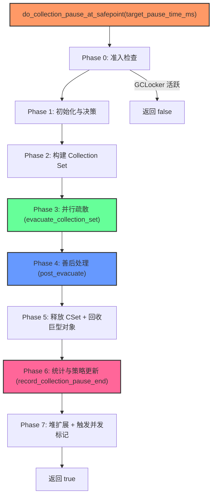
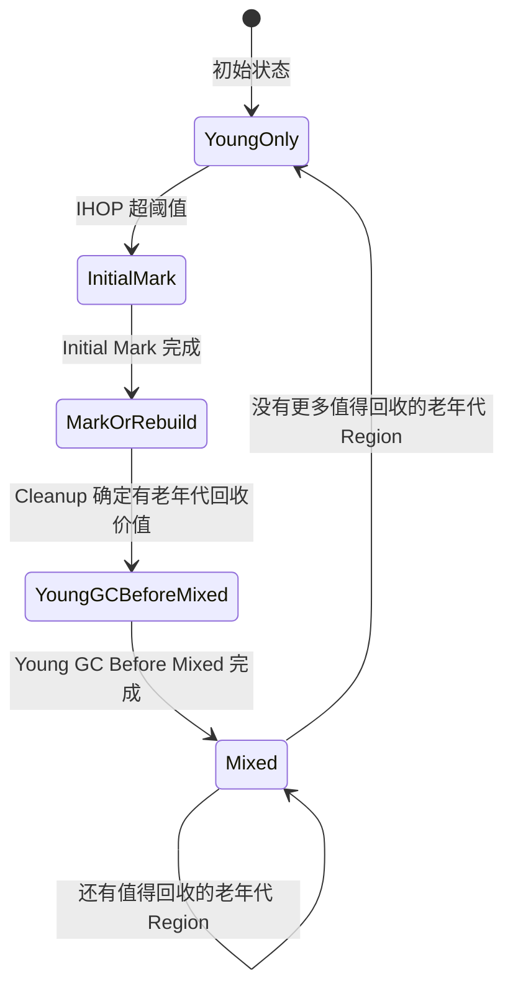
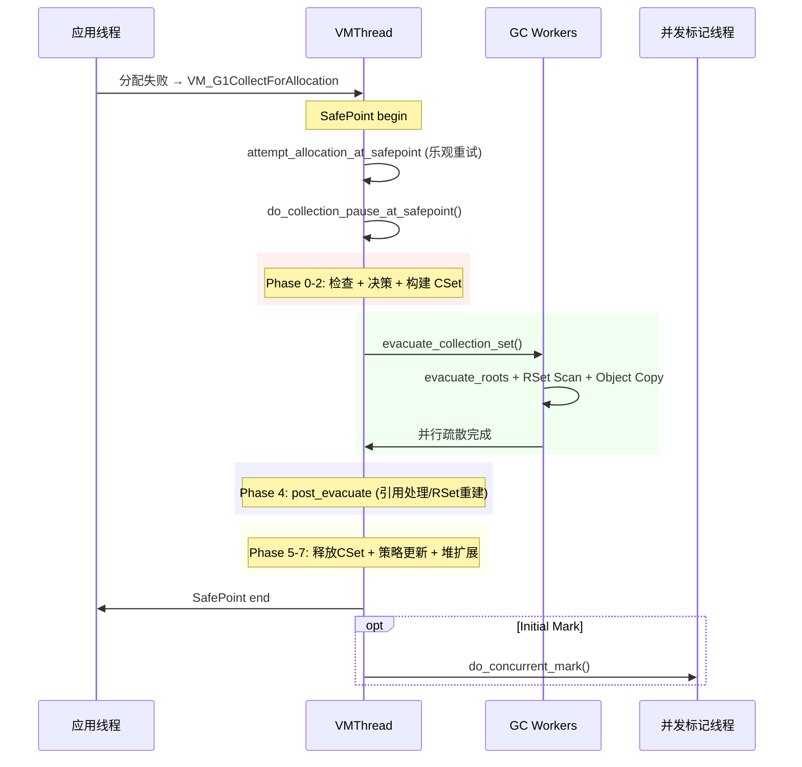

# #11 Young GC 完整 STW 流程：`do_collection_pause_at_safepoint()` 逐行深度分析

> **源文件**：`g1CollectedHeap.cpp`、`vm_operations_g1.cpp`、`g1EvacFailure.cpp`、`g1Policy.cpp`、`g1RootProcessor.cpp`、`g1ParScanThreadState.cpp`、`g1CollectorState.hpp`
> **标准环境**：`-Xms8g -Xmx8g -XX:+UseG1GC`，G1 Region = 4MB
> **JVM 路径**：`/data/workspace/openjdk-cut-new/build/linux-x86_64-normal-server-slowdebug/jdk/bin/java`

---

## 第 0 部分：核心原理 ⭐

### 0.1 本质是什么？

Young GC STW 流程的本质是**一个约 330 行的单线程入口函数 `do_collection_pause_at_safepoint()` 协调多线程并行 GC**：VMThread 单线程执行入口（串行），内部通过 `WorkGang` 启动并行 GC Worker（并行），完成 Root 扫描 → RSet 更新 → 对象疏散 → 引用处理 → 清理的完整流程。

### 0.2 为什么需要？

Young GC 是 G1 中最频繁的操作（每秒可能数次），其 STW 流程必须高效且正确：(1) 必须处理所有 GC Roots（线程栈、JNI、静态变量等）；(2) 必须更新 RSet（确保跨 Region 引用正确）；(3) 必须处理 Evacuation Failure（堆满时的降级处理）；(4) 必须与并发标记协调（Initial Mark 搭便车）。

### 0.3 怎么解决？

**串行入口 + 并行执行**：`do_collection_pause_at_safepoint()` 是串行的协调者，通过以下步骤完成 Young GC：
1. **Pre-GC**：`begin_collection_pause()` 准备 CSet（选择 Eden+Survivor Region）
2. **Root 扫描**：`G1RootProcessor::evacuate_roots()` 并行扫描所有 GC Roots
3. **RSet 更新**：`update_rem_set()` 处理残留脏卡，`scan_rem_set()` 扫描 CSet 的 RSet
4. **对象疏散**：`G1ParEvacuateFollowersClosure` 并行复制存活对象
5. **引用处理**：`process_discovered_references()` 处理 Soft/Weak/Final/Phantom
6. **Post-GC**：`end_collection_pause()` 更新统计、调整年轻代大小、启动并发标记（如需要）

### 0.4 为什么这样设计？

- **为什么入口是单线程但内部并行？** 单线程入口简化了状态管理（不需要协调多个线程的 GC 状态机），并行执行提高吞吐；这是"Fork-Join"模式：单线程 fork 出并行任务，等待完成后 join
- **为什么 Initial Mark 搭便车在 Young GC 上？** Initial Mark 需要 STW，Young GC 本来就需要 STW；搭便车不增加额外停顿次数，只是在 Young GC 的 STW 中额外做一些标记工作
- **为什么 Evacuation Failure 不立即触发 Full GC？** Evacuation Failure 通常是暂时的（某次 GC 时 Free Region 不足），原地保留对象后 GC 继续完成；立即 Full GC 代价更高，且可能不必要
- **为什么 Root 扫描要并行？** GC Roots 包括所有线程的栈帧（可能有数百个线程），串行扫描代价高；并行扫描让每个 GC Worker 负责一部分线程的栈，线性加速

---

## 一、从问题出发：为什么需要深入理解 Young GC 的 STW 流程？

**问题 1**：Young GC 是 G1 中最频繁的操作，一个典型 Java 应用可能每秒发生数次。那么，在这短短几毫秒到几十毫秒的暂停中，JVM 到底做了哪些事情？顺序是什么？哪些可以并行？哪些必须串行？

**问题 2**：当我们看到 GC 日志 "Pause Young (Normal)" 耗时 15ms，这 15ms 到底花在哪里了？

**问题 3**：Young GC 和并发标记是什么关系？为什么有时候日志显示 "Pause Young (Concurrent Start)"？这个 "piggyback" 机制如何实现？

**问题 4**：当堆空间不足、对象无法被疏散时（Evacuation Failure），JVM 不是简单报错——它有一整套精密的恢复机制。怎么做的？代价多大？

这些问题的答案，全部藏在 `do_collection_pause_at_safepoint()` 这个约 330 行的函数中。

---

## 二、宏观架构：从分配失败到 GC 完成

### 2.1 触发链路

```
应用线程分配失败
  → attempt_allocation_slow()
    → collect()
      → VMThread::execute(VM_G1CollectForAllocation)
        → SafePoint begin（所有线程停下）
          → VM_G1CollectForAllocation::doit()
            → do_collection_pause_at_safepoint()
          → SafePoint end（所有线程恢复）
```

**关键洞察**：`do_collection_pause_at_safepoint()` 在 VMThread 上下文中执行，是单线程入口，但内部启动并行 GC 工作线程。

### 2.2 VM Operation 入口

```cpp
// vm_operations_g1.cpp — VM_G1CollectForAllocation::doit()
void VM_G1CollectForAllocation::doit() {
  G1CollectedHeap* g1h = G1CollectedHeap::heap();

  // 先尝试在 SafePoint 下直接分配！
  // 进入 SafePoint 等待期间，其他线程可能已完成 GC 并释放空间
  if (_word_size > 0) {
    _result = g1h->attempt_allocation_at_safepoint(_word_size, false);
    if (_result != NULL) {
      _pause_succeeded = true;
      return;  // 根本不需要 GC！
    }
  }

  GCCauseSetter x(g1h, _gc_cause);
  if (_should_initiate_conc_mark) {
    _old_marking_cycles_completed_before = g1h->old_marking_cycles_completed();
    bool res = g1h->g1_policy()->force_initial_mark_if_outside_cycle(_gc_cause);
    if (!res) {
      if (_gc_cause != GCCause::_g1_humongous_allocation) {
        _should_retry_gc = true;
      }
      return;
    }
  }

  _pause_succeeded = g1h->do_collection_pause_at_safepoint(_target_pause_time_ms);

  if (_pause_succeeded && _word_size > 0) {
    _result = g1h->satisfy_failed_allocation(_word_size, &_pause_succeeded);
  }
}
```

**设计思考**：`attempt_allocation_at_safepoint()` 是"乐观重试"——从发现分配失败到获得 SafePoint 有时间窗口，期间其他线程可能触发了 GC 释放了空间。避免不必要的 GC。

---

## 三、`do_collection_pause_at_safepoint()` 逐行分析

分为 **7 个阶段**。

### 3.0 总体流程图



### 3.1 Phase 0：准入检查与时钟启动

```cpp
bool G1CollectedHeap::do_collection_pause_at_safepoint(double target_pause_time_ms) {
  assert_at_safepoint_on_vm_thread();
  guarantee(!is_gc_active(), "collection is not reentrant");

  if (GCLocker::check_active_before_gc()) {
    return false;  // JNI 临界区活跃，跳过 GC
  }
```

**什么是 GCLocker？** 当 Java 代码通过 JNI 调用 `GetPrimitiveArrayCritical()` 时，JVM 获取 GCLocker。在此期间不能 GC，因为 JNI 返回的是堆内对象的直接指针——GC 移动对象会导致指针悬空。

```cpp
  _gc_timer_stw->register_gc_start();
  GCIdMark gc_id_mark;  // 分配全局唯一 GC ID
  _gc_tracer_stw->report_gc_start(gc_cause(), _gc_timer_stw->gc_start());
  SvcGCMarker sgcm(SvcGCMarker::MINOR);
  ResourceMark rm;
```

> **日志**（`-Xlog:gc*=info`）：`[0.234s][info][gc] GC(3) Pause Young (Normal) 102M->45M(8192M) 12.345ms`，其中 `GC(3)` 的 `3` 就是 GCIdMark 分配的 ID。

### 3.2 Phase 1：决策——这次 GC 是什么类型？

```cpp
  g1_policy()->note_gc_start();
  wait_for_root_region_scanning();  // 等上一轮并发标记的 root region scan 完成
```

**为什么要等？** 并发标记的 Root Region Scanning 扫描 Survivor 区域。如果未完成，Young GC 会移动 Survivor 对象，导致并发标记扫描过时数据。

```cpp
  if (!_cm_thread->should_terminate()) {
    g1_policy()->decide_on_conc_mark_initiation();
  }
```

#### 3.2.1 `decide_on_conc_mark_initiation()` 三个分支

```cpp
void G1Policy::decide_on_conc_mark_initiation() {
  if (collector_state()->initiate_conc_mark_if_possible()) {
    if (!about_to_start_mixed_phase() && collector_state()->in_young_only_phase()) {
      // 分支 1：Young Only 阶段 + 不准备进 Mixed → 启动 Initial Mark
      initiate_conc_mark();
    } else if (_g1h->is_user_requested_concurrent_full_gc(_g1h->gc_cause())) {
      // 分支 2：用户 System.gc() + ExplicitGCInvokesConcurrent → 强制启动
      collector_state()->set_in_young_only_phase(true);
      collector_state()->set_in_young_gc_before_mixed(false);
      clear_collection_set_candidates();
      initiate_conc_mark();
    } else {
      // 分支 3：上一轮并发标记还没完成 → 等待
    }
  }
}
```

**为什么 Initial Mark 要"搭便车"在 Young GC 上？** 答案：避免额外 STW。Initial Mark 需要扫描 GC roots，与 Young GC 的根扫描高度重叠——与其两次 STW，不如合并。

#### 3.2.2 GC 类型判定

```cpp
  bool should_start_conc_mark = collector_state()->in_initial_mark_gc();

  FormatBuffer<> gc_string("Pause Young ");
  if (collector_state()->in_initial_mark_gc()) {
    gc_string.append("(Concurrent Start)");
  } else if (collector_state()->in_young_only_phase()) {
    if (collector_state()->in_young_gc_before_mixed()) {
      gc_string.append("(Prepare Mixed)");
    } else {
      gc_string.append("(Normal)");
    }
  } else {
    gc_string.append("(Mixed)");
  }
```

**G1CollectorState 状态机**（7 个 bool 标志驱动）：



#### 3.2.3 GC 线程数计算

```cpp
  uint active_workers = AdaptiveSizePolicy::calc_active_workers(
      workers()->total_workers(), workers()->active_workers(),
      Threads::number_of_non_daemon_threads());
```

**为什么不总是用最大线程数？** 如果应用只有少量活跃线程，过多 GC 线程的上下文切换开销超过并行收益。

> **日志**（`-Xlog:gc+task=info`）：`Using 8 workers of 13 for evacuation`

### 3.3 Phase 2：构建 Collection Set

```cpp
  _ref_processor_stw->enable_discovery();
  {
    NoRefDiscovery no_cm_discovery(_ref_processor_cm);
    _allocator->release_mutator_alloc_region();  // 当前分配区域可能被选入 CSet

    double sample_start_time_sec = os::elapsedTime();
    g1_policy()->record_collection_pause_start(sample_start_time_sec);

    if (collector_state()->in_initial_mark_gc()) {
      concurrent_mark()->pre_initial_mark();
    }

    // 核心：根据目标暂停时间确定 CSet
    g1_policy()->finalize_collection_set(target_pause_time_ms, &_survivor);
    evacuation_info.set_collectionset_regions(collection_set()->region_length());

    g1_rem_set()->cleanupHRRS();
    register_humongous_regions_with_cset();

    _allocator->init_gc_alloc_regions(evacuation_info);
    G1ParScanThreadStateSet per_thread_states(this, workers()->active_workers(),
                                               collection_set()->young_region_length());
```

#### 3.3.1 `G1ParScanThreadState` 构造——每线程状态

```cpp
G1ParScanThreadState::G1ParScanThreadState(G1CollectedHeap* g1h, uint worker_id,
                                            size_t young_cset_length)
  : _refs(g1h->task_queue(worker_id)),   // 工作窃取队列
    _plab_allocator(NULL),                // 每线程分配缓冲
    _age_table(false), ...
{
  // surviving_young_words 前后加 PADDING_ELEM_NUM 元素
  // 目的：防止 False Sharing！多线程各自更新不同 index，
  // 但相邻 index 落在同一缓存行会导致 cache line bouncing
  size_t real_length = 1 + young_cset_length;
  size_t array_length = PADDING_ELEM_NUM + real_length + PADDING_ELEM_NUM;
  _surviving_young_words_base = NEW_C_HEAP_ARRAY(size_t, array_length, mtGC);
  _surviving_young_words = _surviving_young_words_base + PADDING_ELEM_NUM;

  _plab_allocator = new G1PLABAllocator(_g1h->allocator());

  // 目标映射：来自哪里 → 复制到哪里
  _dest[InCSetState::Young] = InCSetState::Old;   // 年轻代晋升到老年代
  _dest[InCSetState::Old]   = InCSetState::Old;
}
```

### 3.4 Phase 3：并行疏散

#### 3.4.1 `pre_evacuate_collection_set()`

```cpp
void G1CollectedHeap::pre_evacuate_collection_set() {
  _expand_heap_after_alloc_failure = true;
  _evacuation_failed = false;

  // 关闭热卡缓存——CSet Region 正在被回收，热卡引用会指向已释放内存
  _hot_card_cache->reset_hot_cache_claimed_index();
  _hot_card_cache->set_use_cache(false);

  g1_rem_set()->prepare_for_oops_into_collection_set_do();

  if (collector_state()->in_initial_mark_gc()) {
    ClassLoaderDataGraph::clear_claimed_marks();
  }
}
```

#### 3.4.2 `evacuate_collection_set()` —— Young GC 耗时最长的部分

```cpp
void G1CollectedHeap::evacuate_collection_set(G1ParScanThreadStateSet *per_thread_states) {
  double start_par_time_sec = os::elapsedTime();
  {
    const uint n_workers = workers()->active_workers();
    G1RootProcessor root_processor(this, n_workers);
    G1ParTask g1_par_task(this, per_thread_states, _task_queues, &root_processor, n_workers);
    workers()->run_task(&g1_par_task);  // 启动所有 GC 工作线程
    end_par_time_sec = os::elapsedTime();
  }
  phase_times->record_par_time((end_par_time_sec - start_par_time_sec) * 1000.0);
}
```

#### 3.4.3 `G1ParTask::work()` —— 每个 GC Worker 的执行体


```cpp
void work(uint worker_id) {
  G1ParScanThreadState *pss = _pss->state_for_worker(worker_id);

  // 阶段 1：扫描 GC Roots
  _root_processor->evacuate_roots(pss, worker_id);

  // 阶段 2：扫描 RSet（找指向 CSet 的老年代引用）
  _g1h->g1_rem_set()->oops_into_collection_set_do(pss, worker_id);

  // 阶段 3：对象复制 + 工作窃取
  {
    G1ParEvacuateFollowersClosure evac(_g1h, pss, _queues, &_terminator);
    evac.do_void();  // 从队列取引用 → 复制对象 → 新引用入队，直到全部完成

    G1GCPhaseTimes *p = _g1h->g1_policy()->phase_times();
    p->add_time_secs(G1GCPhaseTimes::ObjCopy, worker_id, elapsed_sec - term_sec);
    p->record_time_secs(G1GCPhaseTimes::Termination, worker_id, term_sec);
  }
}
```

#### 3.4.4 `evacuate_roots()` —— GC 根扫描详解

```cpp
void G1RootProcessor::evacuate_roots(G1ParScanThreadState* pss, uint worker_i) {
  G1EvacuationRootClosures* closures = pss->closures();

  // 1. Java 根：线程栈、JVMTI 等
  process_java_roots(closures, phase_times, worker_i);

  if (closures->trace_metadata()) {
    worker_has_discovered_all_strong_classes();
  }

  // 2. VM 内部根：Universe、JNI handles、ObjectSynchronizer 等
  process_vm_roots(closures, phase_times, worker_i);

  // 3. StringTable 根
  process_string_table_roots(closures, phase_times, worker_i);

  // 4. CM RefProcessor discovered lists（并发标记发现的引用必须保活）
  {
    if (!_process_strong_tasks.is_task_claimed(G1RP_PS_refProcessor_oops_do)) {
      _g1h->ref_processor_cm()->weak_oops_do(closures->strong_oops());
    }
  }

  // 5. 弱 CLD（Initial Mark 时需要两趟：先强后弱，中间有 Barrier 同步）
  if (closures->trace_metadata()) {
    wait_until_all_strong_classes_discovered();
    ClassLoaderDataGraph::roots_cld_do(NULL, closures->second_pass_weak_clds());
  }

  // 6. SATB 缓冲区过滤——移除指向 CSet 的引用
  if (!_process_strong_tasks.is_task_claimed(G1RP_PS_filter_satb_buffers)
      && _g1h->collector_state()->mark_or_rebuild_in_progress()) {
    G1BarrierSet::satb_mark_queue_set().filter_thread_buffers();
  }
}
```

**两趟 CLD 扫描的原因**：弱 CLD 是强 CLD 的补集。必须先确定所有强 CLD，才能知道哪些是弱的。所以需要 Barrier 同步。

> **日志**（`-Xlog:gc+phases=debug`）：
> ```
>    Ext Root Scanning (ms):  Min: 0.3, Avg: 0.5, Max: 0.8
>    Update RS (ms):          Min: 0.1, Avg: 0.2, Max: 0.4
>    Scan RS (ms):            Min: 0.0, Avg: 0.1, Max: 0.2
>    Object Copy (ms):        Min: 1.2, Avg: 1.5, Max: 2.1
>    Termination (ms):        Min: 0.0, Avg: 0.1, Max: 0.3
> ```

### 3.5 Phase 4：`post_evacuate_collection_set()` —— 善后处理

```cpp
void G1CollectedHeap::post_evacuate_collection_set(EvacuationInfo &evacuation_info,
                                                    G1ParScanThreadStateSet *per_thread_states) {
  // Step 1: RSet 临时标记清理
  g1_rem_set()->cleanup_after_oops_into_collection_set_do();

  // Step 2: 引用处理——必须在 GC alloc regions 释放前！
  // 引用处理可能需要复制 referent 对象，需要分配空间
  process_discovered_references(per_thread_states);

  // Step 3: 弱引用处理
  G1STWIsAliveClosure is_alive(this);
  G1KeepAliveClosure keep_alive(this);
  WeakProcessor::weak_oops_do(&is_alive, &keep_alive);

  // Step 4: 字符串去重
  if (G1StringDedup::is_enabled()) {
    G1StringDedup::unlink_or_oops_do(&is_alive, &keep_alive, true, phase_times);
  }

  // Step 5: Evacuation Failure 恢复
  if (evacuation_failed()) {
    restore_after_evac_failure();
  }

  // Step 6: 释放 GC 分配区域
  _allocator->release_gc_alloc_regions(evacuation_info);

  // Step 7: 合并每线程统计
  merge_per_thread_state_info(per_thread_states);

  // Step 8: 重新启用热卡缓存
  _hot_card_cache->reset_hot_cache();
  _hot_card_cache->set_use_cache(true);

  // Step 9: 清理 nmethod 根内存
  purge_code_root_memory();

  // Step 10: 重新标脏卡（疏散期间记录的脏卡放回全局队列）
  redirty_logged_cards();

  // Step 11: Derived Pointer Table 更新
#if COMPILER2_OR_JVMCI
  DerivedPointerTable::update_pointers();
#endif

  // Step 12: 打印年龄表
  g1_policy()->print_age_table();
}
```

**`redirty_logged_cards` 为什么必要？** 疏散中复制对象到新位置时，引用源地址变了，card table 更新被记录到每线程 `DirtyCardQueue`。需要合并回全局队列让并发精化线程后续处理。

```cpp
void G1CollectedHeap::redirty_logged_cards() {
  G1RedirtyLoggedCardsTask redirty_task(&dirty_card_queue_set(), this);
  dirty_card_queue_set().reset_for_par_iteration();
  workers()->run_task(&redirty_task);

  DirtyCardQueueSet &dcq = G1BarrierSet::dirty_card_queue_set();
  dcq.merge_bufferlists(&dirty_card_queue_set());
}
```

### 3.6 Phase 5：释放 CSet + 急切回收巨型对象

#### 3.6.1 `free_collection_set()` —— 串行 + 并行混合

```cpp
void G1CollectedHeap::free_collection_set(G1CollectionSet *collection_set,
                                           EvacuationInfo &evacuation_info,
                                           const size_t *surviving_young_words) {
  _eden.clear();
  uint const num_chunks = MAX2(collection_set.region_length() / chunk_size(), 1U);
  uint const num_workers = MIN2(workers()->active_workers(), num_chunks);
  G1FreeCollectionSetTask cl(collection_set, &evacuation_info, surviving_young_words);
  workers()->run_task(&cl, num_workers);
  collection_set->clear();
}
```

`G1FreeCollectionSetTask` 的**串行部分**（需持有 `OldSets_lock`）核心逻辑：

```cpp
virtual bool do_heap_region(HeapRegion *r) {
  g1h->clear_in_cset(r);

  if (r->is_young()) {
    size_t words_survived = _surviving_young_words[r->young_index_in_cset()];
    r->record_surv_words_in_group(words_survived);  // 存活率记录
  }

  if (!r->evacuation_failed()) {
    // 正常：Region 已完全疏散，释放回空闲列表
    _before_used_bytes += r->used();
    g1h->free_region(r, &_local_free_list, true, true, true);
  } else {
    // Evacuation Failure：对象还在原地！转为 Old Region
    r->set_old();
    g1h->old_set_add(r);
    if (r->is_young()) {
      _bytes_allocated_in_old_since_last_gc += HeapRegion::GrainBytes;
    }
    _failure_used_words += r->marked_bytes() / HeapWordSize;
    _failure_waste_words += HeapRegion::GrainWords - used_words;
  }
  return false;
}
```

**Evacuation Failure 的 Region 为什么变 Old？** 其中仍有存活对象无法移动，标记为 Old 后可在 Mixed GC 中再次尝试回收。

#### 3.6.2 `eagerly_reclaim_humongous_regions()`

不需要等到 Full GC，在 Young GC 中直接回收无引用的巨型对象：

```cpp
void G1CollectedHeap::eagerly_reclaim_humongous_regions() {
  if (!G1EagerReclaimHumongousObjects || !_has_humongous_reclaim_candidates) {
    return;
  }
  FreeRegionList local_cleanup_list("Local Humongous Cleanup List");
  G1FreeHumongousRegionClosure cl(&local_cleanup_list);
  heap_region_iterate(&cl);
  remove_from_old_sets(0, cl.humongous_regions_reclaimed());
  prepend_to_freelist(&local_cleanup_list);
}
```

> **日志**（`-Xlog:gc+humongous=debug`）：`Reclaimed humongous region 47 (object size 5242880, region size 4194304)`

### 3.7 Phase 6：`record_collection_pause_end()` —— 策略更新

这是**最影响后续 GC 行为**的函数——决定年轻代大小、Mixed GC 切换、IHOP、并发精化阈值。

```cpp
void G1Policy::record_collection_pause_end(double pause_time_ms,
                                            size_t cards_scanned,
                                            size_t heap_used_bytes_before_gc) {
  bool update_stats = !_g1h->evacuation_failed();
  // Evacuation Failure 时不更新统计——数据被扭曲，会误导预测模型
```

#### 3.7.1 分配速率 + 成本模型更新

```cpp
  if (update_stats) {
    // 分配速率 = Eden Region 数 / 应用运行时间
    uint regions_allocated = _collection_set->eden_region_length();
    double alloc_rate_ms = (double) regions_allocated / app_time_ms;
    _analytics->report_alloc_rate_ms(alloc_rate_ms);

    // 每张卡的 UpdateRS 成本
    if (_pending_cards > 0) {
      _analytics->report_cost_per_card_ms(
          average_time_ms(G1GCPhaseTimes::UpdateRS) / (double) _pending_cards);
    }

    // 每个 RSet entry 的 ScanRS 成本
    if (cards_scanned > 10) {
      _analytics->report_cost_per_entry_ms(
          average_time_ms(G1GCPhaseTimes::ScanRS) / (double) cards_scanned,
          this_pause_was_young_only);
    }

    // 每字节对象复制成本
    size_t freed_bytes = heap_used_bytes_before_gc - cur_used_bytes;
    if (_collection_set->bytes_used_before() > freed_bytes) {
      size_t copied_bytes = _collection_set->bytes_used_before() - freed_bytes;
      _analytics->report_cost_per_byte_ms(
          average_time_ms(G1GCPhaseTimes::ObjCopy) / (double) copied_bytes,
          collector_state()->mark_or_rebuild_in_progress());
    }

    // 注意：只有 Young Only GC 才更新 RS 长度和 pending cards
    // Mixed GC 数据差异太大，会干扰年轻代 sizing
    if (this_pause_was_young_only) {
      _analytics->report_pending_cards((double) _pending_cards);
      _analytics->report_rs_lengths((double) _max_rs_lengths);
    }
  }
```

#### 3.7.2 阶段切换逻辑

```cpp
  if (collector_state()->in_young_gc_before_mixed()) {
    // "Prepare Mixed" 完成 → 进入 Mixed 阶段
    collector_state()->set_in_young_only_phase(false);
    collector_state()->set_in_young_gc_before_mixed(false);
  } else if (!this_pause_was_young_only) {
    // Mixed GC 中，判断是否继续
    if (!next_gc_should_be_mixed(...)) {
      collector_state()->set_in_young_only_phase(true);  // 回到 Young Only
      clear_collection_set_candidates();
    }
  }
```

#### 3.7.3 IHOP + 并发精化阈值

```cpp
  // 更新年轻代大小 + IHOP
  size_t last_unrestrained_young_length = update_young_list_max_and_target_length();
  update_ihop_prediction(app_time_ms / 1000.0,
                         last_unrestrained_young_length * HeapRegion::GrainBytes,
                         this_pause_was_young_only);

  // 调整并发精化阈值——反馈环：
  // UpdateRS 时间过长 → 并发精化跟不上 → 调低阈值让精化线程更积极
  double update_rs_time_goal_ms = _mmu_tracker->max_gc_time() * MILLIUNITS
                                  * G1RSetUpdatingPauseTimePercent / 100.0;
  _g1h->concurrent_refine()->adjust(
      average_time_ms(G1GCPhaseTimes::UpdateRS),
      phase_times()->sum_thread_work_items(G1GCPhaseTimes::UpdateRS),
      update_rs_time_goal_ms);
```

### 3.8 Phase 7：堆扩展 + 触发并发标记

```cpp
        if (evacuation_failed()) {
          set_used(recalculate_used());
        } else {
          increase_used(g1_policy()->bytes_copied_during_gc());
        }

        if (collector_state()->in_initial_mark_gc()) {
          concurrent_mark()->post_initial_mark();
        }

        _allocator->init_mutator_alloc_region();

        // 堆扩展
        {
          size_t expand_bytes = _heap_sizing_policy->expansion_amount();
          if (expand_bytes > 0) {
            expand(expand_bytes, _workers, &expand_ms);
          }
        }

        // 统计记录 + 日志输出...
    }
  }

  // 最后：触发并发标记——必须在所有日志输出后！
  // 并发标记线程的日志不应和当前 GC 日志交错
  if (should_start_conc_mark) {
    do_concurrent_mark();
  }
  return true;
}
```

---

## 四、Evacuation Failure 完整处理

### 4.1 `handle_evacuation_failure_par()` —— 自转发机制

```cpp
oop G1ParScanThreadState::handle_evacuation_failure_par(oop old, markOop m) {
  // CAS：将 forwarding pointer 设为自身（"自转发"）
  oop forward_ptr = old->forward_to_atomic(old, memory_order_relaxed);

  if (forward_ptr == NULL) {
    // 赢得 CAS 竞争——我们是"主人"
    HeapRegion* r = _g1h->heap_region_containing(old);
    if (!r->evacuation_failed()) {
      r->set_evacuation_failed(true);
    }

    _g1h->preserve_mark_during_evac_failure(_worker_id, old, m);  // 保存原始 mark word
    old->oop_iterate_backwards(&_scanner);  // 反向遍历引用
    return old;
  } else {
    return forward_ptr;  // 别人已处理
  }
}
```

### 4.2 `G1ParRemoveSelfForwardPtrsTask` —— 大规模恢复

GC 结束后并行遍历所有 evacuation failed 的 Region，核心闭包 `RemoveSelfForwardPtrObjClosure::do_object()` 执行 7 步恢复：

```cpp
void do_object(oop obj) {
  if (obj->is_forwarded() && obj->forwardee() == obj) {
    // 1. 用 filler 对象填充前面的死区域（保证 Region 可线性遍历）
    zap_dead_objects(_last_forwarded_object_end, obj_addr);

    // 2. 在 prev bitmap 标记为存活
    if (!_cm->is_marked_in_prev_bitmap(obj)) {
      _cm->mark_in_prev_bitmap(obj);
    }

    // 3. Initial Mark 时还要标记 next bitmap
    if (_during_initial_mark) {
      _cm->mark_in_next_bitmap(_worker_id, obj);
    }

    // 4. 累计存活字节
    _marked_bytes += (obj->size() * HeapWordSize);

    // 5. 恢复原始 mark word
    PreservedMarks::init_forwarded_mark(obj);

    // 6. 重建 RSet（代价最大：遍历对象所有引用）
    obj->oop_iterate(_update_rset_cl);

    // 7. 更新 BOT
    _hr->cross_threshold(obj_addr, obj_end);
  }
}
```

> **日志**：`[0.456s][info][gc] GC(5) To-space exhausted`

---

## 五、GDB 验证脚本

### 5.1 完整 Young GC 流程跟踪

```gdb
# new-jvm-md/tmp-file/young-gc-stw/verify_young_gc_flow.gdb
set pagination off
set print pretty on

break G1CollectedHeap::do_collection_pause_at_safepoint
commands
  printf "=== Young GC Start === target=%f\n", target_pause_time_ms
  continue
end

break G1Policy::decide_on_conc_mark_initiation
commands
  printf "=== Conc Mark Decision === initiate=%d in_young=%d\n", \
    collector_state()->_initiate_conc_mark_if_possible, \
    collector_state()->_in_young_only_phase
  continue
end

break G1CollectedHeap::evacuate_collection_set
commands
  printf "=== Evacuate Start === workers=%u\n", workers()->active_workers()
  continue
end

break G1CollectedHeap::post_evacuate_collection_set
commands
  printf "=== Post Evacuate === evac_failed=%d\n", _evacuation_failed
  continue
end

break G1Policy::record_collection_pause_end
commands
  printf "=== Record End === pause=%fms cards=%lu\n", pause_time_ms, cards_scanned
  continue
end

run -Xms8g -Xmx8g -XX:+UseG1GC -Xint -cp /data/workspace/demo/src com.wjcoder.Main
```

### 5.2 Collector State 状态机验证

```gdb
# new-jvm-md/tmp-file/young-gc-stw/verify_collector_state.gdb
set pagination off

break G1CollectedHeap::do_collection_pause_at_safepoint
commands
  printf "State: young_only=%d before_mixed=%d initial_mark=%d " \
    "initiate_possible=%d mark_in_progress=%d clearing=%d full_gc=%d\n", \
    collector_state()->_in_young_only_phase, \
    collector_state()->_in_young_gc_before_mixed, \
    collector_state()->_in_initial_mark_gc, \
    collector_state()->_initiate_conc_mark_if_possible, \
    collector_state()->_mark_or_rebuild_in_progress, \
    collector_state()->_clearing_next_bitmap, \
    collector_state()->_in_full_gc
  continue
end

run -Xms8g -Xmx8g -XX:+UseG1GC -Xint -cp /data/workspace/demo/src com.wjcoder.Main
```

---

## 六、完整时间线



---

## 七、关键设计总结

| # | 设计原则 | 体现 |
|---|---------|------|
| 1 | 乐观重试 | SafePoint 后先尝试分配 |
| 2 | 搭便车 | Initial Mark 搭载在 Young GC 上 |
| 3 | 串行控制+并行执行 | VMThread 决策，GC Workers 执行 |
| 4 | False Sharing 防护 | surviving_young_words 数组 padding |
| 5 | 工作窃取 | ParallelTaskTerminator 负载均衡 |
| 6 | 反馈环 | record_collection_pause_end 修正预测模型 |
| 7 | 优雅降级 | Evacuation Failure 原地恢复 |
| 8 | 防御性编程 | Mixed GC 数据不用于 Young Only 预测 |
| 9 | 日志可观测性 | 并发标记在日志输出后才触发 |
| 10 | 状态机驱动 | 7 个 bool 标志驱动阶段切换 |

### 典型 Young GC 时间分布（8GB 堆，~200 Regions）

| 阶段 | 占比 | 说明 |
|------|------|------|
| Ext Root Scanning | 5-15% | 线程栈 + JNI + ClassLoader |
| Update RS | 5-10% | 并发精化遗留脏卡 |
| Scan RS | 5-15% | RSet 扫描找跨代引用 |
| **Object Copy** | **40-60%** | **对象复制是最大头** |
| Termination | 2-5% | 工作窃取终止协议 |
| Other | 10-20% | 引用处理/脏卡重标/CSet释放 |

> **完整日志参数**：`-Xlog:gc*=debug,gc+phases=debug,gc+ergo=debug,gc+task=info,gc+humongous=debug`
