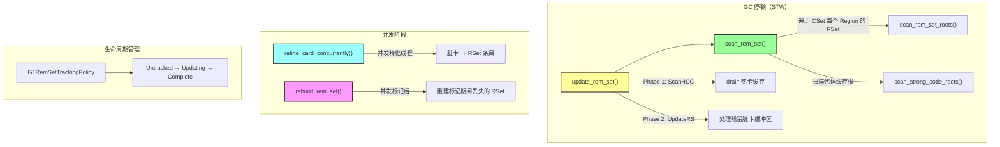
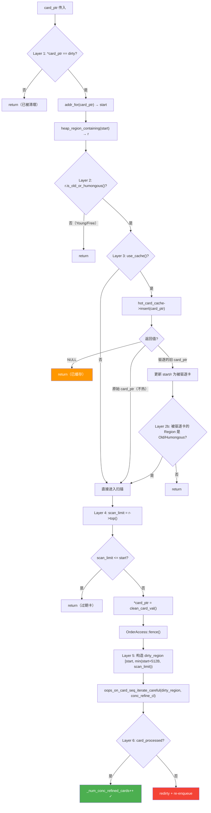
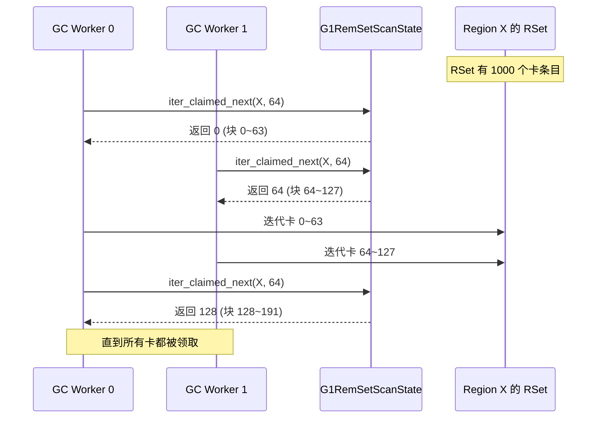
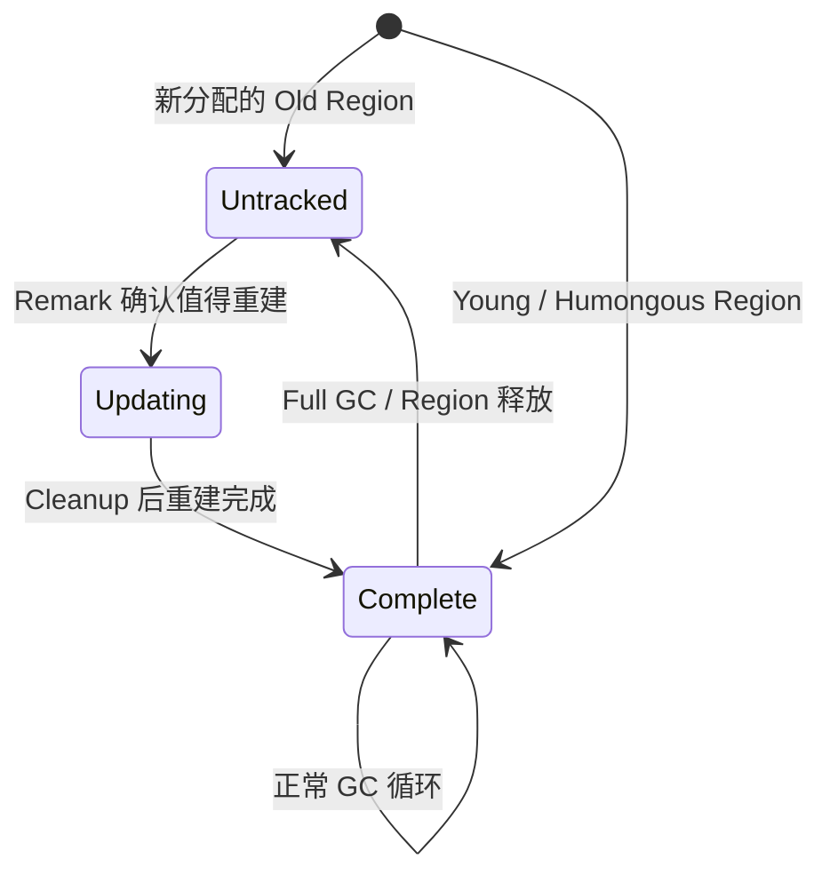
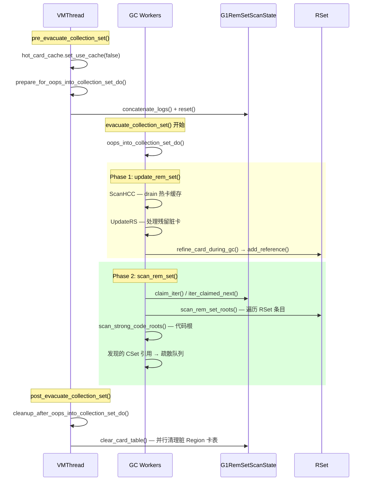
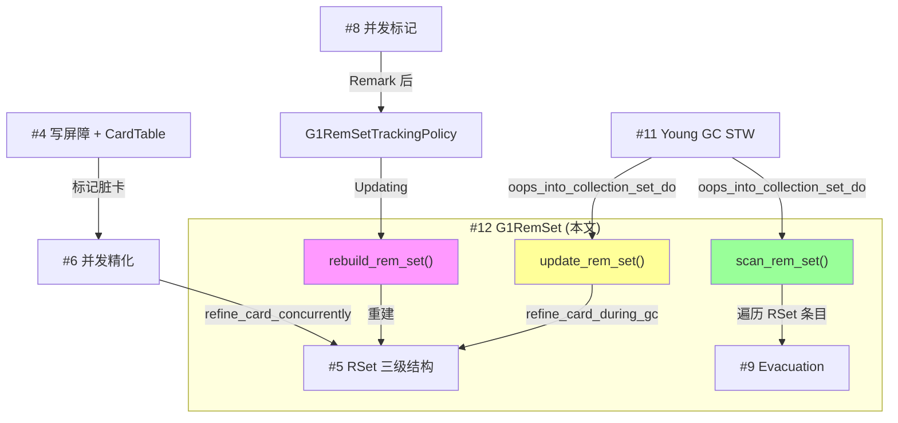

# #12 G1RemSet 完整流程：从脏卡到 RSet 条目的全链路深度分析

> **源文件**：`g1RemSet.hpp/cpp`、`g1RemSetTrackingPolicy.hpp/cpp`、`g1CodeCacheRemSet.hpp/cpp`、`heapRegionRemSet.hpp`、`g1OopClosures.hpp/inline.hpp`、`g1RemSetSummary.hpp/cpp`
> **标准环境**：`-Xms8g -Xmx8g -XX:+UseG1GC`，G1 Region = 4MB
> **JVM 路径**：`/data/workspace/openjdk-cut-new/build/linux-x86_64-normal-server-slowdebug/jdk/bin/java`

---

## 第 0 部分：核心原理 ⭐

### 0.1 本质是什么？

G1RemSet 的本质是**连接写屏障（脏卡）和 GC 扫描（RSet）的转化器**：并发精化线程调用 `refine_card_concurrently()` 将脏卡转化为 RSet 条目；GC 停顿中 `update_rem_set()` 处理残留脏卡，`scan_rem_set()` 扫描 CSet 的 RSet 找出跨 Region 引用；并发标记后 `rebuild_rem_set()` 重建标记期间丢失的 RSet。

### 0.2 为什么需要？

写屏障产生的是"脏卡"（哪个 512 字节区域被修改了），但 GC 需要的是"RSet 条目"（哪个 Region 的哪张卡引用了我）。这两种表示之间需要一个转化层：扫描脏卡内的所有引用字段，找出跨 Region 引用，更新目标 Region 的 RSet。G1RemSet 就是这个转化层。

### 0.3 怎么解决？

**四大职责**：
- **并发精化**：`refine_card_concurrently()` 在后台线程中将脏卡转化为 RSet 条目；先清除脏卡标记，再扫描卡内引用，更新目标 Region 的 RSet
- **GC 停顿更新**：`update_rem_set()` 在 GC 停顿开始时处理所有残留脏卡（并发精化未处理完的），确保 RSet 完整
- **GC 停顿扫描**：`scan_rem_set()` 遍历 CSet 中每个 Region 的 RSet，找出所有跨 Region 引用，将引用的对象加入扫描队列
- **并发重建**：`rebuild_rem_set()` 在并发标记后重建 RSet（并发标记期间 RSet 跟踪被暂停）

### 0.4 为什么这样设计？

- **为什么并发精化要"先清除脏卡再扫描"？** 如果先扫描再清除，扫描期间新的写操作可能再次标记同一张卡为 dirty，清除后这个新的 dirty 就丢失了；先清除再扫描，扫描期间的新 dirty 会被下一轮处理
- **为什么 GC 停顿中的精化不需要 fence？** 并发精化需要 fence 确保清除脏卡和扫描引用的顺序；GC 停顿中所有应用线程已停止，不会有新的写操作，不需要 fence
- **为什么并发标记后需要重建 RSet？** 并发标记期间，`G1RemSetTrackingPolicy` 将某些 Region 的 RSet 状态设为 Untracked（不跟踪），以减少标记期间的 RSet 更新开销；标记完成后需要重建这些 Region 的 RSet
- **为什么 nmethod（JIT 代码）需要单独的 `G1CodeRootSet`？** JIT 代码中的引用（如内联缓存）不在 Java 堆中，不会触发写屏障；需要单独追踪 nmethod 中的引用，GC 时扫描 `G1CodeRootSet`

---

## 一、从问题出发：G1RemSet 到底解决什么问题？

### 1.1 核心矛盾

G1 GC 的核心创新是**增量式区域回收**——每次 GC 只回收一部分 Region（Collection Set），而不是整个堆。但这引入了一个根本性矛盾：

**如果只回收 CSet 中的 Region，怎么知道 CSet 外的 Region 是否有引用指向 CSet 内的对象？**

如果不知道这些跨 Region 引用，GC 就会漏标——把仍被引用的对象当成垃圾回收掉，导致悬空指针和程序崩溃。

### 1.2 解法分层

这个问题的解决方案分三层：

| 层次 | 组件 | 职责 | 已分析文档 |
|------|------|------|-----------|
| 记录层 | 写屏障 + CardTable | 拦截每次引用写操作，标记脏卡 | #4 |
| 存储层 | HeapRegionRemSet（三级结构） | 存储"谁引用了我"的精确信息 | #5 |
| 转化层 | **G1RemSet（本文）** | 将脏卡转化为 RSet 条目 + 在 GC 中扫描 RSet | 本文 |

**G1RemSet 是"连接器"——连接写屏障产生的脏卡信息与 GC 使用的 RSet 数据。**

### 1.3 七个必须回答的问题

1. **GC 停顿中的 RSet 操作到底有哪些？顺序是什么？** → `oops_into_collection_set_do()`
2. **并发精化线程调 `refine_card_concurrently()` 时，为什么要"先清除再扫描"？如果反过来会怎样？** → 第三节
3. **GC 停顿中的卡精化 `refine_card_during_gc()` 与并发精化有什么区别？为什么 GC 中不需要 fence？** → 第四节
4. **`scan_rem_set()` 中，多个 GC Worker 如何协作扫描一个 Region 的 RSet 而不冲突？** → `G1RemSetScanState`
5. **并发标记结束后，RSet 为什么需要"重建"？重建了什么？** → `rebuild_rem_set()`
6. **`G1CodeRootSet` 为什么存在？为什么 nmethod 需要单独追踪？** → 第六节
7. **RSet 的状态（Untracked/Updating/Complete）由谁管理？什么时候转换？** → `G1RemSetTrackingPolicy`

---

## 二、宏观架构：G1RemSet 的四大职责



### 2.1 G1RemSet 类结构

```
G1RemSet (CHeapObj<mtGC>)
├── _scan_state           : G1RemSetScanState*    ← GC 期间扫描进度管理
├── _prev_period_summary  : G1RemSetSummary       ← 周期统计
├── _g1h                  : G1CollectedHeap*      ← 堆引用
├── _num_conc_refined_cards : size_t              ← 并发精化卡数（仅统计，非原子）
├── _ct                   : G1CardTable*          ← 卡表
├── _g1p                  : G1Policy*             ← 策略
└── _hot_card_cache       : G1HotCardCache*       ← 热卡缓存
```

**问一个问题：为什么 `_num_conc_refined_cards` 不需要原子操作？**

因为它只用于 GC 日志统计输出，不影响正确性。并发精化线程各自递增自己看到的值，偶尔的竞态导致计数不精确完全可以接受。这是 JVM 中常见的"精确度换性能"设计。

---

## 三、并发精化路径：`refine_card_concurrently()` 逐行分析

> **调用链**：并发精化线程 → `do_refinement_step()` → `DirtyCardQueueSet::refine_completed_buffer_concurrently()` → `G1RefineCardConcurrentlyClosure::do_card_ptr()` → **`G1RemSet::refine_card_concurrently()`**

这是 G1 的"日常维护"——在应用线程运行期间，后台线程不断将脏卡转化为 RSet 条目。已在 #6 并发精化中从架构层面分析过，这里进行逐行级深入。

### 3.1 六层过滤流水线



### 3.2 为什么先清除再扫描？

这是 `refine_card_concurrently()` 中最精妙的设计，值得反复思考。

```cpp
// g1RemSet.cpp:794
*const_cast<volatile jbyte*>(card_ptr) = G1CardTable::clean_card_val();

// 这个 fence 有两个目的：
// 1. 卡必须在扫描内容之前被清除
// 2. 必须读到最新的 top()，与可能的并发 humongous 分配同步
OrderAccess::fence();
```

**如果先扫描再清除会怎样？** 考虑以下竞态：

```
时间线          精化线程                    Mutator 线程
──────         ────────                   ────────────
  T1    扫描 card 中的对象引用
  T2                                      obj.field = newRef  ← 触发写屏障
  T3                                      Post-Barrier: *card == dirty? → 是! → 跳过入队
  T4    清除 card 为 clean
  T5    （结束）
```

**结果**：`newRef` 这个新引用没有被入队，也没有被扫描——**引用丢失！**

先清除再扫描的时间线：

```
时间线          精化线程                    Mutator 线程
──────         ────────                   ────────────
  T1    清除 card 为 clean
  T2    fence
  T3    扫描 card 中的对象引用
  T4                                      obj.field = newRef
  T5                                      Post-Barrier: *card == clean? → 标记 dirty → 入队 ✓
```

**结果**：新引用会被重新入队，下一轮精化处理。安全！

### 3.3 处理失败的兜底

```cpp
// g1RemSet.cpp:820-833
if (!card_processed) {
    // 遇到未完全分配的对象（并发分配导致的半初始化状态）
    if (*card_ptr != G1CardTable::dirty_card_val()) {
        *card_ptr = G1CardTable::dirty_card_val();
        MutexLockerEx x(Shared_DirtyCardQ_lock, Mutex::_no_safepoint_check_flag);
        DirtyCardQueue* sdcq = G1BarrierSet::dirty_card_queue_set().shared_dirty_card_queue();
        sdcq->enqueue(card_ptr);
    }
}
```

**为什么必须 redirty + re-enqueue？** 因为我们已经把卡清除为 clean（第 T1 步）。如果不恢复，这张卡就永远不会再被处理——其中的引用信息会丢失。

**什么时候会处理失败？** 当 `oops_on_card_seq_iterate_careful()` 遇到部分分配的对象时。Humongous 对象分配是非原子的（先分配再设 top），并发精化线程可能看到中间状态。

### 3.4 `G1ConcurrentRefineOopClosure` —— 并发精化的引用闭包

```cpp
// g1OopClosures.hpp:194-210
class G1ConcurrentRefineOopClosure: public BasicOopIterateClosure {
    G1CollectedHeap* _g1h;
    uint _worker_i;
public:
    // 关键：reference_iteration_mode 返回 DO_DISCOVERED_AND_DISCOVERY
    // 意味着遍历引用时同时处理 Reference 类型对象的 discovered 字段
    virtual ReferenceIterationMode reference_iteration_mode() {
        return DO_DISCOVERED_AND_DISCOVERY;
    }
    template <class T> void do_oop_work(T* p);  // 核心：对每个引用调用 add_reference
};
```

**问一个关键问题：闭包中的 `do_oop_work()` 做了什么？**

它对卡中每个对象的每个引用字段调用 `HeapRegionRemSet::add_reference(from, worker_i)`——这就是脏卡信息被转化为 RSet 条目的具体位置。整个链路：

```
并发精化线程
  → refine_card_concurrently()
    → r->oops_on_card_seq_iterate_careful(dirty_region, conc_refine_cl)
      → 对 512B 区域中每个对象的每个引用字段：
        → G1ConcurrentRefineOopClosure::do_oop_work(p)
          → 目标 Region 的 HeapRegionRemSet::add_reference(p, worker_i)
            → OtherRegionsTable::add_reference(p, worker_i)
              → SparsePRT / PerRegionTable / Coarse Bitmap
```

---

## 四、GC 停顿中的 RSet 操作：`oops_into_collection_set_do()`

### 4.1 顶层入口

```cpp
// g1RemSet.cpp:669-672
void G1RemSet::oops_into_collection_set_do(G1ParScanThreadState* pss, uint worker_i) {
    update_rem_set(pss, worker_i);   // Phase 1: 处理残留脏卡
    scan_rem_set(pss, worker_i);     // Phase 2: 扫描 CSet 的 RSet
}
```

**调用链**：`G1ParTask::work(worker_id)` → `g1_rem_set()->oops_into_collection_set_do(pss, worker_id)`

**为什么先 update 后 scan？** 因为 `update_rem_set()` 处理的是并发精化"来不及处理"的残留脏卡。如果不先处理这些脏卡就扫描 RSet，那些残留脏卡中的跨 Region 引用就会被遗漏，导致 GC 漏标。

### 4.2 `update_rem_set()` 详解

```cpp
// g1RemSet.cpp:640-663
void G1RemSet::update_rem_set(G1ParScanThreadState* pss, uint worker_i) {
    G1GCPhaseTimes* p = _g1p->phase_times();

    // Sub-Phase 1: 处理热卡缓存
    if (G1HotCardCache::default_use_cache()) {
        G1EvacPhaseTimesTracker x(p, pss, G1GCPhaseTimes::ScanHCC, worker_i);
        G1ScanObjsDuringUpdateRSClosure scan_hcc_cl(_g1h, pss, worker_i);
        G1RefineCardClosure refine_card_cl(_g1h, &scan_hcc_cl);
        _g1h->iterate_hcc_closure(&refine_card_cl, worker_i);
    }

    // Sub-Phase 2: 处理残留脏卡缓冲区
    {
        G1EvacPhaseTimesTracker x(p, pss, G1GCPhaseTimes::UpdateRS, worker_i);
        G1ScanObjsDuringUpdateRSClosure update_rs_cl(_g1h, pss, worker_i);
        G1RefineCardClosure refine_card_cl(_g1h, &update_rs_cl);
        _g1h->iterate_dirty_card_closure(&refine_card_cl, worker_i);
        // 记录统计
        p->record_thread_work_item(G1GCPhaseTimes::UpdateRS, worker_i,
            refine_card_cl.cards_scanned(), G1GCPhaseTimes::UpdateRSScannedCards);
        p->record_thread_work_item(G1GCPhaseTimes::UpdateRS, worker_i,
            refine_card_cl.cards_skipped(), G1GCPhaseTimes::UpdateRSSkippedCards);
    }
}
```

**日志输出**（`-Xlog:gc+phases=debug`）：

```
   Update RS (ms):        Min: 0.1, Avg: 0.3, Max: 0.5
     Processed Buffers:   Min: 2, Avg: 4, Max: 7
   Scan HCC (ms):         Min: 0.0, Avg: 0.0, Max: 0.1
```

> **JVM 参数**：`G1RSetUpdatingPauseTimePercent`（默认 10）控制 GC 停顿中 UpdateRS 的时间目标占比。如果实际超出，`G1ConcurrentRefine::adjust()` 会缩小绿区阈值，让并发精化更积极。

### 4.3 `G1RefineCardClosure` —— GC 停顿中的卡处理闭包

```cpp
// g1RemSet.cpp:607-638
class G1RefineCardClosure: public CardTableEntryClosure {
    G1RemSet* _g1rs;
    G1ScanObjsDuringUpdateRSClosure* _update_rs_cl;
    size_t _cards_scanned;
    size_t _cards_skipped;
public:
    bool do_card_ptr(jbyte* card_ptr, uint worker_i) {
        assert(SafepointSynchronize::is_at_safepoint(), "not during an evacuation pause");
        bool card_scanned = _g1rs->refine_card_during_gc(card_ptr, _update_rs_cl);
        if (card_scanned) {
            _update_rs_cl->trim_queue_partially();  // 处理过程中发现的 CSet 引用
            _cards_scanned++;
        } else {
            _cards_skipped++;
        }
        return true;  // 始终继续（不像并发精化需要 yield）
    }
};
```

### 4.4 `refine_card_during_gc()` 详解

**这是 GC 停顿中的卡精化，与 `refine_card_concurrently()` 形成对比。**

```cpp
// g1RemSet.cpp:836-875
bool G1RemSet::refine_card_during_gc(jbyte* card_ptr,
                                     G1ScanObjsDuringUpdateRSClosure* update_rs_cl) {
    assert(_g1h->is_gc_active(), "Only call during GC");

    // Layer 1: 卡还是脏的吗？
    if (*card_ptr != G1CardTable::dirty_card_val()) {
        return false;  // 已被 scan_rem_set 处理过（scan_rem_set 中 claim_card 也会改卡状态）
    }

    // 设置为 clean|claimed（两层含义：已清除 + 已被声明）
    *card_ptr = G1CardTable::clean_card_val() | G1CardTable::claimed_card_val();

    HeapWord* card_start = _ct->addr_for(card_ptr);
    uint const card_region_idx = _g1h->addr_to_region(card_start);

    // 记录为脏区域（GC 结束后需要清理卡表）
    _scan_state->add_dirty_region(card_region_idx);

    // Layer 2: 用 scan_top 做边界检查
    HeapWord* scan_limit = _scan_state->scan_top(card_region_idx);
    if (scan_limit <= card_start) {
        return false;  // 超过扫描上限（CSet/Young/Free Region 会被过滤）
    }

    // 构造 512B 扫描区域
    HeapWord* card_end = card_start + G1CardTable::card_size_in_words;
    MemRegion dirty_region(card_start, MIN2(scan_limit, card_end));

    HeapRegion* const card_region = _g1h->region_at(card_region_idx);
    update_rs_cl->set_region(card_region);
    bool card_processed = card_region->oops_on_card_seq_iterate_careful<true>(dirty_region, update_rs_cl);
    assert(card_processed, "must be");  // GC 中不会失败
    return true;
}
```

**三个关键差异：为什么 GC 停顿中的精化比并发精化简单得多？**

| 特性 | `refine_card_concurrently()` | `refine_card_during_gc()` |
|------|------------------------------|---------------------------|
| **fence** | 需要（先清除再 fence 再扫描） | **不需要**——STW 期间没有 Mutator 并发写 |
| **Hot Card Cache** | 需要检查 | **不需要**——GC 前已关闭缓存 |
| **Region 类型检查** | 需要过滤 Young/Free | **用 `scan_top` 统一过滤**——Young 的 scan_top=bottom |
| **失败处理** | 需要 redirty + re-enqueue | **`assert(card_processed, "must be")`**——STW 无并发分配 |
| **卡状态** | 设为 `clean` | 设为 `clean | claimed`——防止重复扫描 |

**`clean | claimed` 是什么？** 二进制 OR 后既不等于 `dirty` 也不等于 `clean`，所以：
- `scan_rem_set_roots()` 中检查 `is_card_claimed()` 会跳过它
- 后续 `refine_card_during_gc()` 检查 `!= dirty` 也会跳过它
- **避免同一张卡被 update_rem_set 和 scan_rem_set 两边都处理**

### 4.5 `G1ScanObjsDuringUpdateRSClosure` —— UpdateRS 阶段的引用闭包

```cpp
// g1OopClosures.inline.hpp:160-183
template <class T>
inline void G1ScanObjsDuringUpdateRSClosure::do_oop_work(T* p) {
    T o = RawAccess<>::oop_load(p);
    if (CompressedOops::is_null(o)) return;
    oop obj = CompressedOops::decode_not_null(o);

    const InCSetState state = _g1h->in_cset_state(obj);
    if (state.is_in_cset()) {
        // 目标在 CSet 中！→ 推入工作队列等待复制
        prefetch_and_push(p, obj);
    } else {
        // 目标不在 CSet → 更新目标 Region 的 RSet
        HeapRegion* to = _g1h->heap_region_containing(obj);
        if (_from == to) return;  // 同 Region 引用无需记录
        handle_non_cset_obj_common(state, p, obj);
        to->rem_set()->add_reference(p, _worker_i);  // ← RSet 更新点
    }
}
```

**注意两个分支**：
- **目标在 CSet**：不更新 RSet（这个 Region 马上要被回收了），而是把引用推入疏散队列
- **目标不在 CSet**：更新目标 Region 的 RSet + 处理标记相关逻辑

---

## 五、RSet 扫描：`scan_rem_set()` 逐行分析

### 5.1 顶层流程

```cpp
// g1RemSet.cpp:588-604
void G1RemSet::scan_rem_set(G1ParScanThreadState* pss, uint worker_i) {
    G1ScanObjsDuringScanRSClosure scan_cl(_g1h, pss);
    G1ScanRSForRegionClosure cl(_scan_state, &scan_cl, pss, worker_i);
    _g1h->collection_set_iterate_from(&cl, worker_i);  // 从 worker_i 对应的 offset 开始遍历 CSet
    // ... 记录统计时间 ...
}
```

**`collection_set_iterate_from(&cl, worker_i)` 为什么从 worker_i 开始？**

CSet 可能有几十甚至上百个 Region，多个 Worker 需要并行扫描。每个 Worker 从不同位置开始遍历 CSet 列表，通过 `G1RemSetScanState` 的 CAS 机制避免重复。这比简单的 round-robin 分配更灵活——Worker 可以"跳过"已被其他 Worker 完成的 Region。

### 5.2 `G1ScanRSForRegionClosure::do_heap_region()` —— 每个 CSet Region 的入口

```cpp
// g1RemSet.cpp:564-586
bool G1ScanRSForRegionClosure::do_heap_region(HeapRegion* r) {
    assert(r->in_collection_set(), "Should only be called on CSet regions");
    uint const region_idx = r->hrm_index();

    // 早退：已完成？
    if (_scan_state->iter_is_complete(region_idx)) {
        return false;
    }

    // Phase 1: 扫描 RSet 条目
    {
        G1EvacPhaseWithTrimTimeTracker timer(_pss, _rem_set_root_scan_time, _rem_set_trim_partially_time);
        scan_rem_set_roots(r);
    }

    // Phase 2: 只有"完成"这个 Region 的线程才扫描代码根
    if (_scan_state->set_iter_complete(region_idx)) {
        G1EvacPhaseWithTrimTimeTracker timer(_pss, _strong_code_root_scan_time, _strong_code_trim_partially_time);
        scan_strong_code_roots(r);
    }
    return false;
}
```

**为什么 `scan_strong_code_roots()` 只由一个线程执行？**

`set_iter_complete()` 用 CAS(Claimed→Complete) 保证只有一个线程成功。代码根扫描不像 RSet 扫描可以按卡分块——nmethod 列表只需遍历一次，分配给多个线程反而增加同步开销。

### 5.3 `scan_rem_set_roots()` —— 核心：多线程协作扫描 RSet

**这是整个 G1RemSet 中最值得深入理解的函数。**

```cpp
// g1RemSet.cpp:504-558
void G1ScanRSForRegionClosure::scan_rem_set_roots(HeapRegion* r) {
    uint const region_idx = r->hrm_index();

    // Step 1: 尝试"领取"这个 Region
    if (_scan_state->claim_iter(region_idx)) {
        // 领取成功 → 把这个 Region 加入脏区域列表
        // 注：CSet Region 的卡表也需要清理
        _scan_state->add_dirty_region(region_idx);
    }

    // Step 2: 分块领取 RSet 条目
    size_t const block_size = G1RSetScanBlockSize;  // 默认 64

    HeapRegionRemSetIterator iter(r->rem_set());
    size_t card_index;

    size_t claimed_card_block = _scan_state->iter_claimed_next(region_idx, block_size);
    for (size_t current_card = 0; iter.has_next(card_index); current_card++) {
        // 超出当前块？领取下一块
        if (current_card >= claimed_card_block + block_size) {
            claimed_card_block = _scan_state->iter_claimed_next(region_idx, block_size);
        }
        // 还没到我的块？跳过
        if (current_card < claimed_card_block) {
            _cards_skipped++;
            continue;
        }
        _cards_claimed++;

        // Step 3: 检查卡状态——避免与 UpdateRS 重复扫描
        if (_ct->is_card_claimed(card_index) || _ct->is_card_dirty(card_index)) {
            continue;  // 已被 UpdateRS 处理 或 正在等待处理
        }

        // Step 4: 定位卡对应的堆地址
        HeapWord* const card_start = _g1h->bot()->address_for_index(card_index);
        uint const region_idx_for_card = _g1h->addr_to_region(card_start);

        // Step 5: 边界检查
        HeapWord* const top = _scan_state->scan_top(region_idx_for_card);
        if (card_start >= top) {
            continue;  // 超出扫描上限
        }

        // Step 6: 声明卡
        claim_card(card_index, region_idx_for_card);

        // Step 7: 扫描 512B 区域中的对象
        MemRegion const mr(card_start, MIN2(card_start + BOTConstants::N_words, top));
        scan_card(mr, region_idx_for_card);
    }
}
```

### 5.4 多线程协作机制深度解析

**问题**：一个热门 Region 的 RSet 可能有上万个条目，一个 GC Worker 扫不完。如何让多个 Worker 协作？

**答案**：`G1RemSetScanState` 的分块领取机制。



**`iter_claimed_next()` 的实现**：

```cpp
inline size_t iter_claimed_next(uint region, size_t step) {
    return Atomic::add(step, &_iter_claims[region]) - step;
}
```

一个原子加法就实现了无锁的工作分配！每个 Worker 原子地递增 `_iter_claims[region]`，获得自己负责的卡范围。

**但这里有个微妙的问题**：`HeapRegionRemSetIterator` 是**顺序迭代器**——它从 Sparse → Fine → Coarse 依次产生卡索引。`current_card` 是迭代器产生的第 N 个卡，不是卡索引本身。所以 Worker 不是"跳到第 64 张卡"，而是"跳过前 64 个迭代输出"。

**这意味着所有 Worker 都在遍历同一个 RSet 的完整迭代序列**，只是各自跳过不属于自己的块。对于大 RSet 这有额外的迭代开销，但好处是：
1. 无需预先知道 RSet 大小
2. 天然支持不均匀的 Sparse/Fine/Coarse 分布
3. 实现极简——一个原子加法

> **JVM 参数**：`G1RSetScanBlockSize`（默认 64）。增大可以减少原子操作次数，但可能导致负载不均；减小增加原子操作但负载更均匀。

### 5.5 `scan_card()` 和 `claim_card()`

```cpp
// g1RemSet.cpp:491-502
void G1ScanRSForRegionClosure::claim_card(size_t card_index, const uint region_idx_for_card) {
    _ct->set_card_claimed(card_index);                    // 标记卡为 claimed（防止重复扫描）
    _scan_state->add_dirty_region(region_idx_for_card);   // 记录脏区域（GC 后清理）
}

void G1ScanRSForRegionClosure::scan_card(MemRegion mr, uint region_idx_for_card) {
    HeapRegion* const card_region = _g1h->region_at(region_idx_for_card);
    _scan_objs_on_card_cl->set_region(card_region);
    // oops_on_card_seq_iterate_careful<true>: true 表示 GC 期间（不会有未完全分配的对象）
    card_region->oops_on_card_seq_iterate_careful<true>(mr, _scan_objs_on_card_cl);
    _scan_objs_on_card_cl->trim_queue_partially();  // 发现的 CSet 引用立即开始处理
    _cards_scanned++;
}
```

### 5.6 `G1ScanObjsDuringScanRSClosure` —— ScanRS 阶段的引用闭包

```cpp
// g1OopClosures.inline.hpp:186-202
template <class T>
inline void G1ScanObjsDuringScanRSClosure::do_oop_work(T* p) {
    T heap_oop = RawAccess<>::oop_load(p);
    if (CompressedOops::is_null(heap_oop)) return;
    oop obj = CompressedOops::decode_not_null(heap_oop);

    const InCSetState state = _g1h->in_cset_state(obj);
    if (state.is_in_cset()) {
        prefetch_and_push(p, obj);  // 目标在 CSet → 推入复制队列
    } else {
        if (HeapRegion::is_in_same_region(p, obj)) return;  // 同 Region → 跳过
        handle_non_cset_obj_common(state, p, obj);           // 非 CSet → 标记相关处理
    }
}
```

**对比 UpdateRS 和 ScanRS 两个闭包的差异**：

| 特性 | `G1ScanObjsDuringUpdateRSClosure` | `G1ScanObjsDuringScanRSClosure` |
|------|-----------------------------------|----------------------------------|
| CSet 目标 | `prefetch_and_push` | `prefetch_and_push` |
| 非 CSet 目标 | **`add_reference()`**（更新 RSet） | **不更新 RSet** |
| 同 Region 跳过 | 检查 `_from == to` | 检查 `is_in_same_region` |

**为什么 ScanRS 不需要更新 RSet？** 因为 ScanRS 扫描的是**已经存在于 RSet 中的条目**——它们已经是 RSet 的一部分了。ScanRS 的目的是找到指向 CSet 的引用作为 GC root 的补充，而不是维护 RSet。

### 5.7 `scan_strong_code_roots()`

```cpp
// g1RemSet.cpp:560-562
void G1ScanRSForRegionClosure::scan_strong_code_roots(HeapRegion* r) {
    r->strong_code_roots_do(_pss->closures()->weak_codeblobs());
}
```

**什么是 strong code roots？** JIT 编译后的 nmethod（native method）可能在机器码中直接嵌入了堆对象地址（如常量池引用、内联缓存）。如果这些对象在 CSet 中，GC 必须：
1. 发现这些引用（通过 `G1CodeRootSet`）
2. 更新嵌入的地址（如果对象被移动）

**日志输出**（`-Xlog:gc+phases=debug`）：

```
   Scan RS (ms):          Min: 0.1, Avg: 0.3, Max: 0.5
     Scanned Cards:       Min: 120, Avg: 234, Max: 456
     Claimed Cards:       Min: 134, Avg: 256, Max: 489
     Skipped Cards:       Min: 14, Avg: 22, Max: 33
   Code Root Scanning (ms): Min: 0.0, Avg: 0.1, Max: 0.2
```

---

## 六、G1RemSetScanState：五大数据结构详解

**G1RemSetScanState 是 GC 期间多线程协作扫描的"大脑"。**

### 6.1 类结构

```
G1RemSetScanState (CHeapObj<mtGC>)
├── _max_regions          : size_t                    ← 最大 Region 数
├── _iter_states          : G1RemsetIterState volatile*  ← 每 Region 扫描状态
│                            [0=Unclaimed, 1=Claimed, 2=Complete]
│                            大小: max_regions × sizeof(jint) = 8KB
├── _iter_claims          : size_t volatile*           ← 每 Region 扫描进度
│                            大小: max_regions × sizeof(size_t) = 16KB
├── _dirty_region_buffer  : uint*                      ← 脏 Region ID 列表
│                            大小: max_regions × sizeof(uint) = 8KB
├── _in_dirty_region_buffer : IsDirtyRegionState*      ← 去重标记
│                            大小: max_regions × sizeof(jbyte) = 2KB
├── _cur_dirty_region     : size_t                     ← 当前脏 Region 计数
└── _scan_top             : HeapWord**                 ← 每 Region 扫描上限
                             大小: max_regions × sizeof(HeapWord*) = 16KB
```

**总内存占用**：`8 + 16 + 8 + 2 + 16 = 50KB`（2048 Regions 时）

### 6.2 `_scan_top` 初始化：`G1ResetScanTopClosure`

```cpp
// g1RemSet.cpp:153-168
class G1ResetScanTopClosure : public HeapRegionClosure {
    HeapWord** _scan_top;
public:
    virtual bool do_heap_region(HeapRegion* r) {
        uint hrm_index = r->hrm_index();
        if (!r->in_collection_set() && r->is_old_or_humongous()) {
            _scan_top[hrm_index] = r->top();   // 非 CSet 的 Old/Humongous → 记录 top
        } else {
            _scan_top[hrm_index] = r->bottom(); // CSet/Young/Free/Archive → bottom（不扫描）
        }
        return false;
    }
};
```

**为什么 CSet Region 的 scan_top 设为 bottom？**

这是一个常见的混淆点。CSet Region 不是"不需要扫描"，而是"不需要通过 RSet 扫描"。CSet 中的存活对象会被完整复制，它们的引用会在复制过程中处理。`scan_top` 控制的是**从外部 Region 向 CSet 扫描的边界**——CSet Region 本身不会作为"引用源"被扫描。

### 6.3 `add_dirty_region()` —— CAS 去重

```cpp
// g1RemSet.cpp:274-284
void add_dirty_region(uint region) {
    if (_in_dirty_region_buffer[region] == Dirty) {
        return;  // 快速路径：已标记
    }
    // CAS 标记（jbyte 无直接 CAS 支持，但 cmpxchg 可以处理）
    bool marked_as_dirty = Atomic::cmpxchg(Dirty, &_in_dirty_region_buffer[region], Clean) == Clean;
    if (marked_as_dirty) {
        size_t allocated = Atomic::add(1u, &_cur_dirty_region) - 1;
        _dirty_region_buffer[allocated] = region;
    }
}
```

**两层保护**：
1. **快速检查**（非原子）：大多数情况下直接返回，避免昂贵的 CAS
2. **CAS 去重**：只有 CAS 成功的线程才会写入 `_dirty_region_buffer`

### 6.4 GC 后的卡表清理：`clear_card_table()`

```cpp
// g1RemSet.cpp:291-311
void clear_card_table(WorkGang* workers) {
    if (_cur_dirty_region == 0) return;

    size_t const num_chunks = align_up(_cur_dirty_region * HeapRegion::CardsPerRegion,
                                        G1ClearCardTableTask::chunk_size()) / G1ClearCardTableTask::chunk_size();
    uint const num_workers = MIN2(num_chunks, workers->active_workers());
    G1ClearCardTableTask cl(G1CollectedHeap::heap(), _dirty_region_buffer, _cur_dirty_region, chunk_length);
    workers->run_task(&cl, num_workers);
}
```

**`G1ClearCardTableTask::work()` 中有一个重要细节**：

```cpp
void work(uint worker_id) {
    while (_cur_dirty_regions < _num_dirty_regions) {
        size_t next = Atomic::add(_chunk_length, &_cur_dirty_regions) - _chunk_length;
        for (size_t i = next; i < max; i++) {
            HeapRegion* r = _g1h->region_at(_dirty_region_list[i]);
            if (!r->is_survivor()) {   // ← Survivor 不清理！
                r->clear_cardtable();
            }
        }
    }
}
```

**为什么 Survivor 的卡表不清理？** Survivor 区域在下次 GC 一定会被扫描（因为 Young GC 总是包含所有 Young Region），清理卡表是浪费。

---

## 七、GC 前后的协调：`prepare` 和 `cleanup`

### 7.1 `prepare_for_oops_into_collection_set_do()`

```cpp
// g1RemSet.cpp:674-679
void G1RemSet::prepare_for_oops_into_collection_set_do() {
    DirtyCardQueueSet& dcqs = G1BarrierSet::dirty_card_queue_set();
    dcqs.concatenate_logs();  // 收集所有线程的本地脏卡缓冲区到全局链表
    _scan_state->reset();     // 重置五大数据结构
}
```

**`concatenate_logs()` 做了什么？** 在 SafePoint 时，每个 Java 线程可能有未满的本地 `DirtyCardQueue` 缓冲区。`concatenate_logs()` 将这些缓冲区提交到全局 `DirtyCardQueueSet`，确保 GC 期间 `update_rem_set()` 能处理所有残留脏卡。

### 7.2 `cleanup_after_oops_into_collection_set_do()`

```cpp
// g1RemSet.cpp:681-688
void G1RemSet::cleanup_after_oops_into_collection_set_do() {
    G1GCPhaseTimes* phase_times = _g1h->g1_policy()->phase_times();
    double start = os::elapsedTime();
    _scan_state->clear_card_table(_g1h->workers());   // 并行清理脏 Region 的卡表
    phase_times->record_clear_ct_time((os::elapsedTime() - start) * 1000.0);
}
```

> **日志**（`-Xlog:gc+phases=debug`）：`Clear CT: 0.2ms`

---

## 八、并发 RSet 重建：`rebuild_rem_set()`

### 8.1 为什么需要重建？

并发标记期间，为了降低标记开销，**RSet 更新被暂时暂停**（新分配的 Old Region 的 RSet 状态为 Untracked）。标记完成后，这些 Region 需要重建 RSet 才能参与 Mixed GC。

**问题链**：
1. 并发标记发现老年代 Region X 有 40% 垃圾
2. G1 想在 Mixed GC 中回收 Region X
3. 但 Region X 的 RSet 可能不完整（标记期间没跟踪）
4. 没有完整 RSet → 无法安全回收 → 必须先重建

### 8.2 `G1RebuildRemSetTask` 结构

```cpp
// g1RemSet.cpp:905-1155
class G1RebuildRemSetTask: public AbstractGangTask {
    class G1RebuildRemSetHeapRegionClosure : public HeapRegionClosure {
        G1ConcurrentMark* _cm;
        G1RebuildRemSetClosure _update_cl;

        // 内嵌的存活对象迭代器
        class LiveObjIterator : public StackObj { ... };

        size_t rebuild_rem_set_in_region(...);
    public:
        bool do_heap_region(HeapRegion* hr);
    };

    HeapRegionClaimer _hr_claimer;  // 并行领取 Region
    G1ConcurrentMark* _cm;
    uint _worker_id_offset;
};
```

### 8.3 `do_heap_region()` —— 分块处理 + yield 点

```cpp
bool do_heap_region(HeapRegion* hr) {
    if (_cm->has_aborted()) return true;  // 标记被中止则退出

    size_t const chunk_size_in_words = G1RebuildRemSetChunkSize / HeapWordSize;
    // 默认 G1RebuildRemSetChunkSize = 256K → chunk = 32K words

    HeapWord* const top_at_mark_start = hr->prev_top_at_mark_start();
    HeapWord* cur = hr->bottom();

    while (cur < hr->end()) {
        HeapWord* const top_at_rebuild_start = _cm->top_at_rebuild_start(region_idx);
        if (top_at_rebuild_start == NULL) return false;  // Region 被急切回收了

        MemRegion next_chunk = MemRegion(hr->bottom(), top_at_rebuild_start)
                                .intersection(MemRegion(cur, chunk_size_in_words));
        if (next_chunk.is_empty()) break;

        size_t marked_bytes = rebuild_rem_set_in_region(
            _cm->prev_mark_bitmap(), top_at_mark_start, top_at_rebuild_start, hr, next_chunk);

        cur += chunk_size_in_words;

        // Yield 点：允许被 SafePoint 中断
        _cm->do_yield_check();
        if (_cm->has_aborted()) return true;
    }
    return _cm->has_aborted();
}
```

**分块的目的**：每 256KB 一个 chunk，处理完就检查 yield。这保证了长时间重建不会阻塞 GC SafePoint。

> **日志**（`-Xlog:gc+remset+tracking=trace`）：
> ```
> Rebuilt region 42 live 2097152 time 1.234ms marked bytes 1572864 bot 0x... TAMS 0x... TARS 0x...
> ```

### 8.4 `rebuild_rem_set_in_region()` —— 存活对象扫描

```cpp
size_t rebuild_rem_set_in_region(const G1CMBitMap* bitmap,
                                 HeapWord* top_at_mark_start,
                                 HeapWord* top_at_rebuild_start,
                                 HeapRegion* hr, MemRegion mr) {
    if (hr->is_humongous()) {
        // Humongous 特殊处理：整个对象要么存活要么死亡
        oop humongous_obj = oop(hr->humongous_start_region()->bottom());
        if (is_humongous_live(humongous_obj, bitmap, top_at_mark_start, top_at_rebuild_start)) {
            humongous_obj->oop_iterate(&_update_cl, mr);
        }
        return ...;
    }

    // 非 Humongous：使用 LiveObjIterator 遍历存活对象
    for (LiveObjIterator it(bitmap, top_at_mark_start, mr, hr->block_start(mr.start()));
         it.has_next(); it.move_to_next()) {
        oop obj = it.next();
        size_t scanned_size = scan_for_references(obj, mr);
        if ((HeapWord*)obj < top_at_mark_start) {
            marked_words += scanned_size;  // TAMS 以下的存活字节数
        }
    }
    return marked_words * HeapWordSize;
}
```

### 8.5 `LiveObjIterator` —— TAMS 上下分治

```
Region 内存布局：
┌─────────────────────────────────────────────────────────────┐
│ bottom        TAMS                TARS              end     │
│   ↓             ↓                   ↓                ↓     │
│ [存活/死亡混合] │ [全部假定存活]    │ [未分配]         │     │
│ 用 bitmap 判断  │ TAMS~TARS 之间   │                  │     │
│                 │ 是标记期间分配的  │                  │     │
└─────────────────────────────────────────────────────────────┘
```

- **bottom ~ TAMS**：需要查 bitmap 判断存活（并发标记的结果）
- **TAMS ~ TARS**：假定全部存活（标记期间新分配的对象，SATB 保证安全）
- **TARS ~ end**：不处理（重建开始后分配的对象）

`LiveObjIterator` 在 TAMS 以下使用 `bitmap.get_next_marked_addr()` 跳过死对象；在 TAMS 以上线性遍历。

---

## 九、G1CodeRootSet：nmethod 根追踪

### 9.1 为什么需要单独追踪 nmethod？

**问题**：JIT 编译器生成的机器码中可能直接嵌入堆对象的地址。例如：

```
// Java 代码
static final Object CONST = new Object();
void foo() { bar(CONST); }

// JIT 编译后的机器码（简化）
mov rdi, 0x7fff12345678   ; ← 直接嵌入了 CONST 的堆地址
call bar
```

如果 `CONST` 对象在 GC 中被移动到新地址，**必须更新机器码中嵌入的地址**，否则程序会访问错误内存。

**CardTable + RSet 能发现这种引用吗？** 不能！因为引用不在堆中，而是在 CodeCache（代码缓存）中。CodeCache 不属于堆，没有卡表覆盖。

**所以需要 G1CodeRootSet：每个 Region 维护一个"哪些 nmethod 的代码中有指向我的嵌入引用"的列表。**

### 9.2 类结构

```
G1CodeRootSet
├── _table   : G1CodeRootSetTable*    ← 哈希表（或 NULL）
└── _length  : size_t                 ← 条目数

G1CodeRootSetTable (继承 Hashtable<nmethod*, mtGC>)
├── 小表：SmallSize = 32 个桶
├── 大表：LargeSize = 512 个桶
└── 阈值：Threshold = 24（超过则 Small → Large）
```

### 9.3 `add()` —— 按需创建 + 动态升级

```cpp
// g1CodeCacheRemSet.cpp:206-219
void G1CodeRootSet::add(nmethod* method) {
    bool added = false;
    if (is_empty()) {
        allocate_small_table();  // 首次添加：创建 32 桶小表
    }
    added = _table->add(method);
    if (added) {
        if (_length == Threshold) {  // 达到 24 个条目
            move_to_large();         // 升级到 512 桶大表
        }
        ++_length;
    }
}
```

### 9.4 `move_to_large()` —— 延迟删除旧表

```cpp
// g1CodeCacheRemSet.cpp:188-196
void G1CodeRootSet::move_to_large() {
    G1CodeRootSetTable* temp = new G1CodeRootSetTable(LargeSize);
    _table->copy_to(temp);                     // 复制所有条目到大表
    G1CodeRootSetTable::purge_list_append(_table);  // 旧表放入清理列表
    OrderAccess::release_store(&_table, temp);  // 原子发布新表
}
```

**为什么不直接 delete 旧表？** 因为 `contains()` 可以在**无锁**情况下调用（通过 `load_acquire`）。如果直接删除旧表，并发的 `contains()` 调用可能访问已释放内存。旧表放入 purge list，在下一个 SafePoint 时安全删除。

### 9.5 `clean()` —— 清理不再指向本 Region 的 nmethod

```cpp
// g1CodeCacheRemSet.cpp:261-307
class CleanCallback : public StackObj {
    class PointsIntoHRDetectionClosure : public OopClosure {
        HeapRegion* _hr;
        bool _points_into;
        template <typename T>
        void do_oop_work(T* p) {
            if (_hr->is_in(RawAccess<>::oop_load(p))) {
                _points_into = true;  // 还有引用指向本 Region
            }
        }
    };
    bool operator()(nmethod* nm) {
        _detector._points_into = false;
        _blobs.do_code_blob(nm);
        return !_detector._points_into;  // true = 应该删除
    }
};

void G1CodeRootSet::clean(HeapRegion* owner) {
    CleanCallback should_clean(owner);
    if (_table != NULL) {
        int removed = _table->remove_if(should_clean);
        _length -= removed;
    }
    if (_length == 0) clear();  // 全部删除 → 释放表
}
```

**什么时候调用 `clean()`？** 在 GC 结束后的 `purge_code_root_memory()` 中。nmethod 被反优化（deoptimized）或 GC 移动了对象后，某些 nmethod 可能不再指向特定 Region。

---

## 十、G1RemSetTrackingPolicy：RSet 状态生命周期

### 10.1 三种状态



| 状态 | 含义 | 何时进入 |
|------|------|---------|
| **Untracked** | 不跟踪 RSet（新 Old Region 默认） | `update_at_allocate()`：Old → Untracked |
| **Updating** | 正在重建 RSet | `update_before_rebuild()`：Remark 后 |
| **Complete** | RSet 完整，可参与 GC | `update_after_rebuild()`：Cleanup 后 |

### 10.2 `update_at_allocate()` —— 分配时

```cpp
// g1RemSetTrackingPolicy.cpp:41-57
void G1RemSetTrackingPolicy::update_at_allocate(HeapRegion* r) {
    if (r->is_young()) {
        r->rem_set()->set_state_complete();      // Young → 立即 Complete
    } else if (r->is_humongous()) {
        r->rem_set()->set_state_complete();      // Humongous → Complete（允许急切回收）
    } else if (r->is_archive()) {
        r->rem_set()->set_state_empty();         // Archive → 永远 Untracked
    } else if (r->is_old()) {
        r->rem_set()->set_state_empty();         // Old → Untracked（等并发标记后决定）
    }
}
```

**为什么新 Old Region 默认 Untracked？**

这是一个重要的性能优化。如果每个新 Old Region 都立即开始跟踪 RSet，那么：
1. 每次引用写入都需要更新 RSet（额外开销）
2. 但这个 Region 可能永远不会被 Mixed GC 选中

**按需跟踪**：只在并发标记确认"这个 Region 值得回收"后才开始重建 RSet。

### 10.3 `update_before_rebuild()` —— Remark 后判断

```cpp
// g1RemSetTrackingPolicy.cpp:107-139
bool G1RemSetTrackingPolicy::update_before_rebuild(HeapRegion* r, size_t live_bytes) {
    if (!r->is_old() || r->is_archive()) return false;

    // 计算总存活字节 = 标记存活 + NTAMS~top 之间（标记期间新分配，假定存活）
    size_t between_ntams_and_top = (r->top() - r->next_top_at_mark_start()) * HeapWordSize;
    size_t total_live_bytes = live_bytes + between_ntams_and_top;

    bool selected_for_rebuild = false;
    if ((total_live_bytes > 0) &&
        CollectionSetChooser::region_occupancy_low_enough_for_evac(total_live_bytes) &&
        !r->rem_set()->is_tracked()) {
        r->rem_set()->set_state_updating();
        selected_for_rebuild = true;
    }
    return selected_for_rebuild;
}
```

**三个条件**：
1. `total_live_bytes > 0`：不是空 Region
2. `region_occupancy_low_enough_for_evac()`：存活率足够低，回收有价值
3. `!is_tracked()`：还没开始跟踪

**`region_occupancy_low_enough_for_evac()` 是什么标准？** 它检查存活字节是否低于 `G1MixedGCLiveThresholdPercent`（默认 85%）× Region 大小。对于 4MB Region，就是存活字节 < 3.4MB。

### 10.4 `update_humongous_before_rebuild()` —— Humongous 特殊处理

```cpp
// g1RemSetTrackingPolicy.cpp:82-105
bool G1RemSetTrackingPolicy::update_humongous_before_rebuild(HeapRegion* r, bool is_live) {
    // 只对包含 typeArray 的存活 Humongous 对象重建
    if (is_live && oop(r->humongous_start_region()->bottom())->is_typeArray() && !r->rem_set()->is_tracked()) {
        r->rem_set()->set_state_updating();
        return true;
    }
    return false;
}
```

**为什么只处理 typeArray？** typeArray（如 `byte[]`、`int[]`）不包含引用字段，所以它们的 RSet 一定是空的。重建很快。非 typeArray 的 Humongous 对象可能有大量引用字段，重建代价高且急切回收的条件更苛刻。

### 10.5 `update_after_rebuild()` —— Cleanup 后

```cpp
// g1RemSetTrackingPolicy.cpp:141-177
void G1RemSetTrackingPolicy::update_after_rebuild(HeapRegion* r) {
    if (r->is_old_or_humongous()) {
        if (r->rem_set()->is_updating()) {
            r->rem_set()->set_state_complete();  // Updating → Complete ✓
        }
        // 对不适合急切回收的 Humongous Region，清空 RSet（节省内存）
        if (r->is_starts_humongous() && !g1h->is_potential_eager_reclaim_candidate(r)) {
            uint size_in_regions = g1h->humongous_obj_size_in_regions(oop(r->bottom())->size());
            for (uint j = region_idx; j < region_idx + size_in_regions; j++) {
                g1h->region_at(j)->rem_set()->clear_locked(true /* only_cardset */);
            }
        }
    }
}
```

> **日志**（`-Xlog:gc+remset+tracking=trace`）：
> ```
> Before rebuild region 42 (ntams: 0x...) total_live_bytes 1234567 selected true
> After rebuild region 42 (ntams 0x... liveness 1234567 next_marked_bytes 1048576 remset occ 789 size 16384)
> ```

---

## 十一、完整 GC 停顿中的 RSet 操作时间线



---

## 十二、GDB 验证脚本

### 12.1 G1RemSet 字段验证

```gdb
# new-jvm-md/tmp-file/g1-remset/verify_g1remset.gdb
set pagination off
set print pretty on

# 在 GC 开始时断点
break G1RemSet::prepare_for_oops_into_collection_set_do
commands
    printf "=== prepare_for_oops_into_collection_set_do ===\n"
    printf "G1RemSet @ %p\n", this
    printf "_scan_state    = %p\n", _scan_state
    printf "_ct            = %p\n", _ct
    printf "_hot_card_cache= %p\n", _hot_card_cache
    printf "_num_conc_refined_cards = %lu\n", _num_conc_refined_cards
    continue
end

# 在 RSet 扫描时断点
break G1RemSet::scan_rem_set
commands
    printf "=== scan_rem_set === worker=%u\n", worker_i
    continue
end

# 在 UpdateRS 时断点
break G1RemSet::update_rem_set
commands
    printf "=== update_rem_set === worker=%u\n", worker_i
    continue
end

# 在卡精化时断点
break G1RemSet::refine_card_during_gc
commands
    printf "=== refine_card_during_gc === card=%p val=%d\n", card_ptr, *card_ptr
    continue
end

run -Xms8g -Xmx8g -XX:+UseG1GC -Xint -cp /data/workspace/demo/src com.wjcoder.Main
```

### 12.2 G1RemSetScanState 验证

```gdb
# new-jvm-md/tmp-file/g1-remset/verify_scan_state.gdb
set pagination off

break G1RemSetScanState::reset
commands
    printf "=== ScanState::reset ===\n"
    printf "_max_regions = %lu\n", _max_regions
    printf "_iter_states = %p\n", _iter_states
    printf "_iter_claims = %p\n", _iter_claims
    printf "_dirty_region_buffer = %p\n", _dirty_region_buffer
    printf "_in_dirty_region_buffer = %p\n", _in_dirty_region_buffer
    printf "_scan_top = %p\n", _scan_top
    printf "_cur_dirty_region = %lu\n", _cur_dirty_region
    continue
end

break G1RemSet::cleanup_after_oops_into_collection_set_do
commands
    printf "=== cleanup === dirty_regions=%lu\n", _scan_state->_cur_dirty_region
    continue
end

run -Xms8g -Xmx8g -XX:+UseG1GC -Xint -cp /data/workspace/demo/src com.wjcoder.Main
```

### 12.3 scan_rem_set_roots 协作验证

```gdb
# new-jvm-md/tmp-file/g1-remset/verify_scan_roots.gdb
set pagination off

break G1ScanRSForRegionClosure::scan_rem_set_roots
commands
    printf "=== scan_rem_set_roots === region=%u worker=%u\n", r->hrm_index(), _worker_i
    printf "  claim_iter result: iter_state=%d\n", _scan_state->_iter_states[r->hrm_index()]
    continue
end

break G1ScanRSForRegionClosure::do_heap_region if r->hrm_index() < 5
commands
    printf "=== do_heap_region === region=%u iter_complete=%d\n", \
        r->hrm_index(), _scan_state->_iter_states[r->hrm_index()]
    continue
end

run -Xms8g -Xmx8g -XX:+UseG1GC -Xint -cp /data/workspace/demo/src com.wjcoder.Main
```

---

## 十三、关键 JVM 参数汇总

| 参数 | 默认值 | 含义 |
|------|--------|------|
| `G1RSetScanBlockSize` | **64** | scan_rem_set_roots 中每次领取的卡块大小 |
| `G1RSetUpdatingPauseTimePercent` | **10** | GC 停顿中 UpdateRS 时间占比目标（影响并发精化阈值调整） |
| `G1RSetRegionEntries` | 自动 | Fine Grain RSet 每 Region 的条目数 |
| `G1RSetSparseRegionEntries` | 自动 | Sparse RSet 每 Region 的条目数 |
| `G1ConcRSLogCacheSize` | **10** | Hot Card Cache 大小 = 2^10 = 1024 |
| `G1ConcRSHotCardLimit` | **4** | 精化 ≥ 4 次算热卡 |
| `G1RebuildRemSetChunkSize` | **256K** | RSet 重建的分块大小（影响 yield 频率） |
| `G1SummarizeRSetStatsPeriod` | **0** | 每 N 次 GC 打印 RSet 统计（0=不打印） |
| `G1MixedGCLiveThresholdPercent` | **85** | Region 存活率低于此才值得重建 RSet |

**查看 RSet 统计**：

```bash
# 全量日志
-Xlog:gc+remset=trace
# 周期统计
-XX:G1SummarizeRSetStatsPeriod=1 -Xlog:gc+remset=trace
# 跟踪策略日志
-Xlog:gc+remset+tracking=trace
```

输出示例：

```
[trace][gc,remset] Before GC RS summary
  Recent concurrent refinement statistics
    Concurrently processed cards:    12345
    Of 8 completed buffers:
         8 (100.0%) by mutator threads.
         0 (  0.0%) by concurrent RS threads.
  Current number of code roots: 42
  Did 3 coarsenings.
[trace][gc,remset] After GC RS summary
  Total heap region code root sets sizes = 1680B. Max = 168B.
```

---

## 十四、设计总结

### 14.1 五大设计原则

| # | 原则 | 体现 |
|---|------|------|
| 1 | **先清除再扫描** | `refine_card_concurrently()` 避免引用丢失的 fence 协议 |
| 2 | **无锁并行** | `G1RemSetScanState` 用原子操作实现 Region/卡级并行分配 |
| 3 | **按需跟踪** | 新 Old Region 默认 Untracked，标记后按需重建 |
| 4 | **分层处理** | 并发精化（日常）→ GC UpdateRS（兜底）→ ScanRS（使用） |
| 5 | **延迟删除** | G1CodeRootSet 的 purge list 避免并发访问已释放内存 |

### 14.2 与其他模块的关联



### 14.3 性能影响与调优建议

| 症状 | 可能原因 | 调优方向 |
|------|---------|---------|
| UpdateRS 时间长 | 并发精化跟不上 | 观察 `Processed Buffers` 数量，考虑增加 `G1ConcRefinementThreads` |
| ScanRS 时间长 | RSet 条目多（大量跨 Region 引用） | 检查是否有热点对象被大量 Region 引用 |
| Code Root Scanning 长 | 大量 nmethod 指向 CSet Region | 检查 JIT 编译的方法数量 |
| RSet 内存占用高 | 大量 Region 有 Fine/Coarse RSet | 观察 `n_coarsenings` 计数 |

> **完整日志参数**：`-Xlog:gc*=debug,gc+phases=debug,gc+remset=trace,gc+remset+tracking=trace`
