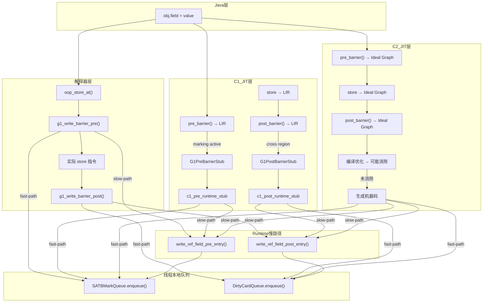

# #13 写屏障汇编级全链路（Write Barrier Assembly Full Chain）

> **前置问题**：
> 1. Java 代码中的一行 `obj.field = value` 在不同执行模式下（解释、C1、C2）生成的写屏障机器码有何不同？
> 2. 解释器中的写屏障直接生成 x86 汇编，C1 通过 LIR，C2 通过 Ideal Graph——三种代码生成路径的设计差异是什么？
> 3. 写屏障的 fast-path 和 slow-path 边界在哪？什么条件走 fast-path 能避免调用 Runtime？
> 4. C2 编译器为什么可以在编译时**消除**写屏障？消除的条件是什么？
> 5. 三层写屏障都访问 `JavaThread` 中的同一组字段（SATB queue、dirty card queue）——这些字段在线程结构中的偏移量是怎么计算的？
> 6. G1 的 pre-barrier 和 post-barrier 在功能上有什么本质区别？为什么需要两个屏障？

---

## 第 0 部分：核心原理 ⭐

### 0.1 本质是什么？

写屏障汇编全链路的本质是**三层代码生成路径（解释器/C1/C2）在不同抽象层次上实现同一个逻辑（Pre+Post 屏障）**：解释器直接生成 x86 汇编（`TemplateTable::putfield_or_static`），C1 通过 LIR（Low-Level IR）生成（`LIR_Assembler::emit_code_for_stub`），C2 通过 Ideal Graph 节点生成（`G1BarrierSetC2::pre_barrier`）；三层都访问 `JavaThread` 中相同的 SATB/DirtyCard 队列字段。

### 0.2 为什么需要？

JVM 有三种执行模式（解释/C1/C2），每种模式的代码生成机制不同，但都需要在引用写操作时插入 Pre+Post 屏障。如果每种模式单独实现屏障逻辑，代码重复且难以维护；但如果统一抽象，又需要在不同层次（字节码/LIR/Ideal Graph）上表达相同的语义。

### 0.3 怎么解决？

**三层统一接口 + 各层独立实现**：
- **解释器**：`TemplateTable` 在字节码模板中直接嵌入屏障汇编，fast-path 内联，slow-path 调用 `G1BarrierSetRuntime::write_ref_field_pre/post_entry`
- **C1**：`G1BarrierSetC1` 生成 LIR stub，`LIR_Assembler` 将 stub 编译为机器码；fast-path 内联在方法体中，slow-path 跳转到 stub
- **C2**：`G1BarrierSetC2` 在 Ideal Graph 中插入屏障节点，C2 后端将节点编译为机器码；C2 可以在编译时消除不必要的屏障（如写入新分配对象的字段）

### 0.4 为什么这样设计？

- **为什么 fast-path 内联而 slow-path 用 stub/Runtime 调用？** fast-path（队列未满、卡已标记）是绝大多数情况，内联避免函数调用开销；slow-path（队列满、需要 flush）极少发生，用 stub/Runtime 调用代码更小，减少 I-cache 压力
- **为什么 C2 可以消除写屏障而解释器/C1 不能？** C2 有全局数据流分析，能证明某个写操作的目标对象是新分配的（不在 Old 区），因此不需要 Post 屏障；解释器/C1 没有这种全局分析能力
- **为什么三层都访问 `JavaThread` 中的队列字段而不是全局变量？** 线程本地队列避免全局竞争；每个线程有自己的 SATB/DirtyCard 缓冲区，满了才 flush 到全局队列
- **为什么 Pre 屏障检查 `_active` 标志？** 只有并发标记进行中时才需要 SATB；`_active` 为 false 时 Pre 屏障是空操作，避免非标记期间的额外开销

---

## 一、宏观理解：写屏障的三层代码生成架构

### 1.1 一句话总结

G1 的写屏障通过**三层代码生成器**在运行时注入到每个对象引用赋值点：解释器直接生成 x86 汇编、C1 通过 LIR 中间表示生成、C2 通过 Ideal Graph 节点生成。三层最终都会在 fast-path 内联访问线程本地队列，在 slow-path 调用同一个 `G1BarrierSetRuntime` 入口。

### 1.2 三层架构总览

```
┌─────────────────────────────────────────────────────────────────────────────┐
│                    Java 代码: obj.field = value                             │
├─────────────────────────────────────────────────────────────────────────────┤
│                                                                             │
│  ┌──────────────────────┐  ┌──────────────────┐  ┌───────────────────────┐  │
│  │     解释器层          │  │    C1 JIT 层      │  │      C2 JIT 层        │  │
│  │  (MacroAssembler)     │  │   (LIR + Stub)    │  │  (Ideal Graph + Kit)  │  │
│  ├──────────────────────┤  ├──────────────────┤  ├───────────────────────┤  │
│  │ g1_write_barrier_pre │  │ pre_barrier()     │  │ pre_barrier()         │  │
│  │ g1_write_barrier_post│  │ post_barrier()    │  │ post_barrier()        │  │
│  │                      │  │                   │  │                       │  │
│  │ 直接生成 x86 指令    │  │ 生成 LIR 操作    │  │ 构建 Ideal 节点       │  │
│  │ asm: cmp/jcc/mov...  │  │ → Stub 生成 x86  │  │ → 机器码生成          │  │
│  └──────────┬───────────┘  └────────┬─────────┘  └───────────┬───────────┘  │
│             │                       │                         │              │
│             ▼                       ▼                         ▼              │
│  ┌─────────────────────────────────────────────────────────────────────────┐ │
│  │                  G1BarrierSetRuntime (slow-path)                        │ │
│  │   write_ref_field_pre_entry()  →  satb_mark_queue.enqueue(orig)        │ │
│  │   write_ref_field_post_entry() →  dirty_card_queue.enqueue(card_addr)  │ │
│  └─────────────────────────────────────────────────────────────────────────┘ │
└─────────────────────────────────────────────────────────────────────────────┘
```

### 1.3 Pre-Barrier vs Post-Barrier 的本质区别

| 方面 | Pre-Barrier (SATB) | Post-Barrier (CardTable) |
|------|-------------------|-------------------------|
| **解决什么问题** | 并发标记期间，应用线程覆盖引用可能导致漏标 | 需要知道哪些 Region 之间存在跨 Region 引用 |
| **触发时机** | 写入引用**之前** | 写入引用**之后** |
| **记录什么** | 被覆盖的**旧值**（old reference） | 被修改位置的**卡表地址** |
| **生效条件** | 仅在 `marking_active == true` 时 | 始终生效（但有多层过滤） |
| **入队到哪** | 线程本地 `SATBMarkQueue` | 线程本地 `DirtyCardQueue` |
| **谁消费** | 并发标记线程（drain SATB buffer） | 并发精化线程（refine dirty cards） |

### 1.4 涉及源文件清单

| 文件 | 行数 | 层次 | 核心内容 |
|------|------|------|---------|
| `g1BarrierSetAssembler_x86.cpp` | 599 | 解释器 + C1 Stub | x86 汇编生成：pre/post barrier、C1 runtime stub |
| `g1BarrierSetAssembler_x86.hpp` | 71 | 解释器 + C1 Stub | 方法声明 |
| `g1BarrierSetC1.cpp` | 226 | C1 JIT | LIR 级 pre/post barrier + runtime stub 注册 |
| `g1BarrierSetC1.hpp` | 139 | C1 JIT | G1PreBarrierStub / G1PostBarrierStub 定义 |
| `g1BarrierSetC2.cpp` | 773 | C2 JIT | Ideal Graph 级 pre/post barrier + 屏障消除 |
| `g1BarrierSetC2.hpp` | 94 | C2 JIT | 方法声明 |
| `g1BarrierSetRuntime.cpp` | 62 | Runtime | slow-path 入口：enqueue 到线程本地队列 |
| `g1BarrierSetRuntime.hpp` | 49 | Runtime | 5 个静态方法声明 |
| `g1BarrierSet.cpp` | 259 | 基类 | C++ 模板级 write_ref_field_pre/post |
| `g1BarrierSet.hpp` | 121 | 基类 | 类定义、AccessBarrier 模板 |
| `g1BarrierSet.inline.hpp` | 109 | 基类 | 内联实现 |
| `g1ThreadLocalData.hpp` | 96 | 数据布局 | 线程本地数据偏移量计算 |

**总计 12 个文件，约 2535 行代码。**

---

## 二、线程本地数据布局：三层共享的数据基础

> **问题驱动**：三层写屏障都要访问 `JavaThread` 中的 SATB 队列和脏卡队列——这些数据在内存中如何布局？

### 2.1 G1ThreadLocalData 结构

`G1ThreadLocalData` 存储在每个 `Thread` 对象的 GC 数据区域内，通过 `Thread::gc_data<G1ThreadLocalData>()` 访问。

```cpp
// src/hotspot/share/gc/g1/g1ThreadLocalData.hpp
class G1ThreadLocalData {
  SATBMarkQueue _satb_mark_queue;    // SATB 标记队列
  DirtyCardQueue _dirty_card_queue;  // 脏卡队列
};
```

### 2.2 五个关键偏移量

所有三层代码生成器都通过以下偏移量从 `r15_thread`（Linux x86_64 下 r15 寄存器保存当前 JavaThread 指针）直接访问队列字段：

| 偏移量方法 | 计算公式 | 含义 |
|-----------|---------|------|
| `satb_mark_queue_active_offset()` | `gc_data_offset + offsetof(_satb_mark_queue) + SATBMarkQueue::byte_offset_of_active()` | 标记是否活跃（bool/int） |
| `satb_mark_queue_index_offset()` | `gc_data_offset + offsetof(_satb_mark_queue) + SATBMarkQueue::byte_offset_of_index()` | 当前写入索引 |
| `satb_mark_queue_buffer_offset()` | `gc_data_offset + offsetof(_satb_mark_queue) + SATBMarkQueue::byte_offset_of_buf()` | 缓冲区指针 |
| `dirty_card_queue_index_offset()` | `gc_data_offset + offsetof(_dirty_card_queue) + DirtyCardQueue::byte_offset_of_index()` | 当前写入索引 |
| `dirty_card_queue_buffer_offset()` | `gc_data_offset + offsetof(_dirty_card_queue) + DirtyCardQueue::byte_offset_of_buf()` | 缓冲区指针 |

**注意**：`_dirty_card_queue` 没有 `active` 偏移量，因为脏卡队列**始终激活**，不像 SATB 队列仅在并发标记期间激活。

### 2.3 汇编中的访问方式

```asm
# Pre-barrier: 检查 SATB 标记是否活跃
cmpb [r15 + satb_mark_queue_active_offset], 0    # 检查 active 标志
je   done                                         # 未标记期间跳过

# Post-barrier: 入队脏卡地址
mov  tmp, [r15 + dirty_card_queue_index_offset]   # 加载 index
sub  tmp, 8                                        # index -= wordSize
mov  [r15 + dirty_card_queue_index_offset], tmp   # 更新 index
add  tmp, [r15 + dirty_card_queue_buffer_offset]  # tmp = buffer + index
mov  [tmp], card_addr                              # 写入卡地址
```

---

## 三、解释器层：x86 汇编直接生成

> **问题驱动**：解释器执行 `putfield` 字节码时，如何在 x86 级别注入 G1 写屏障？

### 3.1 入口：oop_store_at()

当解释器执行 `putfield`/`putstatic` 等字节码时，调用 `G1BarrierSetAssembler::oop_store_at()` 生成存储 + 屏障的汇编代码。

```
oop_store_at(masm, decorators, type, dst, val, tmp1, tmp2)
  │
  ├─ 1. lea tmp1, dst          # 计算目标地址
  │
  ├─ 2. if (needs_pre_barrier)
  │     └─ g1_write_barrier_pre(masm, tmp1/*obj*/, tmp2/*pre_val*/, ...)
  │
  ├─ 3. BarrierSetAssembler::store_at(masm, ..., Address(tmp1,0), val, ...)
  │     # 实际执行存储：mov [tmp1], val （或 compressed oop store）
  │
  └─ 4. if (needs_post_barrier)
        └─ g1_write_barrier_post(masm, tmp1/*store_addr*/, new_val/*new_val*/, ...)
```

关键细节：
- `needs_pre_barrier = as_normal`（正常写入需要 pre-barrier）
- `needs_post_barrier = (val != noreg && in_heap)`（非 NULL 且在堆内需要 post-barrier）
- 如果使用压缩指针（`UseCompressedOops`），post-barrier 需要**未压缩的 oop** 做跨 Region 检查

### 3.2 g1_write_barrier_pre：SATB 前置屏障（逐指令分析）

> 源码位置：`g1BarrierSetAssembler_x86.cpp:142-259`

**功能**：在覆盖引用之前，将旧值记录到 SATB 队列。

**伪代码骨架**：

```
g1_write_barrier_pre(obj, pre_val, thread, tmp):
  if (satb_marking_not_active) goto done    # 检查1: 标记未激活则跳过
  if (obj != NULL) pre_val = load(obj)      # 检查2: 加载旧值
  if (pre_val == NULL) goto done            # 检查3: 旧值为 NULL 则跳过
  if (satb_queue_index == 0) goto runtime   # 检查4: 队列满则走慢路径
  # fast-path: 直接入队
  index -= wordSize
  buffer[index] = pre_val
  goto done
runtime:
  call G1BarrierSetRuntime::write_ref_field_pre_entry(pre_val, thread)
done:
```

**逐指令分析**（x86_64 路径，`#define __ masm->`）：

```
第 167-178 行: 检查 SATB 标记是否活跃
─────────────────────────────────────────────
Address in_progress(thread, satb_mark_queue_active_offset);
cmpb [r15 + active_offset], 0     # 比较 active 标志和 0
je done                            # 等于 0（未标记）→ 跳过整个屏障
```

这是整个 pre-barrier 最关键的 fast-path 检查：**当没有并发标记进行时，这条 `cmpb + je` 就是 pre-barrier 的全部开销**——仅一次内存比较和一次条件跳转。

```
第 181-183 行: 加载旧值（如果需要）
─────────────────────────────────────────────
if (obj != noreg):
  load_heap_oop(pre_val, [obj+0], AS_RAW)
  # 从字段地址加载当前引用值到 pre_val 寄存器
  # AS_RAW 表示绕过 Access API 的装饰器，直接原始加载
```

`obj` 参数的两种用法：
- `obj != noreg`：解释器 `putfield` 路径——obj 是字段地址，需要加载旧值
- `obj == noreg`：`Reference.get()` 路径——旧值已经在 `pre_val` 中了

```
第 186-187 行: 空值检查
─────────────────────────────────────────────
cmpptr pre_val, 0                  # 旧值为 NULL？
je done                            # 是 → 无需记录
```

```
第 193-203 行: fast-path —— 直接入队到 SATB buffer
─────────────────────────────────────────────
movptr tmp, [r15 + index_offset]   # tmp = satb_queue.index
cmpptr tmp, 0                      # index == 0？
je runtime                         # 队列满 → 走慢路径

subptr tmp, 8                      # tmp -= wordSize (8 bytes)
movptr [r15 + index_offset], tmp   # 更新 index
addptr tmp, [r15 + buffer_offset]  # tmp = buffer + new_index
movptr [tmp], pre_val              # buffer[new_index] = pre_val
jmp done                           # 完成
```

**SATB 队列是从高地址向低地址增长的栈式结构**：
- `index` 表示下一个可用槽位的偏移量
- 入队时先 `index -= 8`，再写入 `buffer[index]`
- `index == 0` 表示 buffer 满了

```
第 205-258 行: slow-path —— 调用 Runtime
─────────────────────────────────────────────
# 保存/恢复寄存器（根据需要）
push rax / push obj / push pre_val

# 调用 Runtime 函数
# expand_call = false (解释器路径): 通过 call_VM_leaf 调用
call_VM_leaf(G1BarrierSetRuntime::write_ref_field_pre_entry, pre_val, thread)

# expand_call = true (Reference.get 路径): 直接展开调用，跳过 last_sp 检查
mov rdi, pre_val   # 第一个参数
mov rsi, r15       # 第二个参数（thread）
call G1BarrierSetRuntime::write_ref_field_pre_entry

# 恢复寄存器
pop pre_val / pop obj / pop rax
```

`expand_call` 参数的含义：
- `false`（正常解释器）：使用 `InterpreterMacroAssembler::call_VM_leaf`，会检查 `frame::interpreter_frame_last_sp == NULL`
- `true`（`Reference.get()` 内联）：直接生成 `call` 指令，因为可能没有完整的解释器栈帧

### 3.3 g1_write_barrier_post：卡表后置屏障（逐指令分析）

> 源码位置：`g1BarrierSetAssembler_x86.cpp:261-347`

**功能**：在写入引用之后，如果跨 Region 且非 NULL，标记卡表为 dirty 并入队。

**伪代码骨架**：

```
g1_write_barrier_post(store_addr, new_val, thread, tmp, tmp2):
  if (store_addr XOR new_val) >> LogOfHRGrainBytes == 0: goto done   # 同 Region
  if (new_val == NULL): goto done                                     # 写 NULL
  card_addr = byte_map_base + (store_addr >> card_shift)
  if (card[card_addr] == g1_young_card): goto done                   # 年轻代卡
  StoreLoad barrier
  if (card[card_addr] == dirty_card): goto done                      # 已经脏了
  card[card_addr] = dirty_card                                       # 标脏
  if (dcq_index == 0): goto runtime                                  # 队列满
  # fast-path: 入队
  dcq_index -= wordSize
  dcq_buffer[dcq_index] = card_addr
  goto done
runtime:
  call G1BarrierSetRuntime::write_ref_field_post_entry(card_addr, thread)
done:
```

**逐指令分析**：

```
第 283-286 行: 跨 Region 检查
─────────────────────────────────────────────
movptr tmp, store_addr             # tmp = store_addr
xorptr tmp, new_val                # tmp = store_addr XOR new_val
shrptr tmp, LogOfHRGrainBytes      # tmp >>= 22 (4MB Region = 2^22)
je done                            # 高位相同 → 同一 Region，跳过
```

这是 post-barrier 最巧妙的优化：**XOR + 右移**。
- 如果 `store_addr` 和 `new_val` 在同一个 Region，它们的高位相同，XOR 后高位全 0，右移后结果为 0
- 这一步过滤了大量"自己指向自己所在 Region"的写入

```
第 290-291 行: NULL 值检查
─────────────────────────────────────────────
cmpptr new_val, 0                  # 写入 NULL？
je done                            # 是 → 无需更新 RSet
```

```
第 298-303 行: 计算卡表地址
─────────────────────────────────────────────
movptr card_addr, store_addr       # card_addr = store_addr
shrptr card_addr, card_shift       # card_addr >>= 9 (512 bytes per card)
movptr cardtable, byte_map_base    # 加载卡表基址（编译时常量）
addptr card_addr, cardtable        # card_addr = byte_map_base + card_index
```

`card_shift = 9` 表示每 512 字节对应一张卡。`byte_map_base` 是全局卡表基址指针，在 JVM 启动时初始化。

```
第 305-310 行: 卡表状态检查（两级过滤）
─────────────────────────────────────────────
cmpb [card_addr], g1_young_card_val  # 是年轻代卡？
je done                               # 年轻代卡不需要记录（GC 会扫描全部年轻代）

membar StoreLoad                      # 内存屏障：确保 store 对其他线程可见
cmpb [card_addr], dirty_card_val      # 已经是脏卡？
je done                               # 已脏则无需重复记录
```

**为什么需要 StoreLoad 屏障？** 因为我们刚刚做了一个 store（`obj.field = value`），现在要读卡表。在弱内存模型下，这个 load 可能被重排到 store 之前，读到过期的卡表值。StoreLoad 确保 store 完成后再读。

**为什么先检查 young_card 再检查 dirty_card？** young_card 检查**不需要**内存屏障——即使读到过期值也是安全的（年轻代卡不会变成非年轻代卡，除非在 GC 暂停期间）。而 dirty_card 检查需要在 StoreLoad 之后，确保看到最新值。

```
第 316-329 行: 标脏 + fast-path 入队
─────────────────────────────────────────────
movb [card_addr], dirty_card_val      # 标记为 dirty

cmpl [r15 + dcq_index_offset], 0     # 脏卡队列 index == 0？
je runtime                            # 队列满 → 慢路径

subl [r15 + dcq_index_offset], 8     # index -= 8
movptr tmp2, [r15 + dcq_buffer_offset] # tmp2 = buffer
movslq rscratch1, [r15 + dcq_index_offset] # rscratch1 = new_index (sign-extend)
addq tmp2, rscratch1                  # tmp2 = buffer + new_index
movq [tmp2], card_addr                # buffer[new_index] = card_addr
jmp done
```

```
第 332-346 行: slow-path
─────────────────────────────────────────────
push store_addr                        # 保存寄存器
push new_val
call_VM_leaf(G1BarrierSetRuntime::write_ref_field_post_entry, card_addr, r15_thread)
pop new_val
pop store_addr
```

### 3.4 解释器层 fast-path 开销分析

| 场景 | Pre-Barrier 指令数 | Post-Barrier 指令数 |
|------|-------------------|---------------------|
| 非标记期 + 同 Region | **2** (cmpb + je) | **4** (mov + xor + shr + je) |
| 非标记期 + 跨 Region + 非 NULL + young card | 2 | **8** (xor判断 + NULL判断 + 计算card + cmpb young) |
| 标记期 + 旧值非 NULL + 队列未满 | **~8** (检查active + load旧值 + NULL检查 + 入队) | 同上 |
| slow-path | 调用 Runtime 函数 | 调用 Runtime 函数 |

**关键洞察**：在非并发标记期间（大部分时间），pre-barrier 仅花费 **2 条指令**（cmpb + je）。post-barrier 最少花费 **4 条指令**（跨 Region 检查）。

---

## 四、C1 JIT 层：LIR 中间表示 + 运行时 Stub

> **问题驱动**：C1 编译器如何将写屏障嵌入到编译后的方法中？和解释器的汇编生成有什么区别？

### 4.1 C1 屏障架构概览

C1 JIT 的写屏障分两部分：
1. **内联部分**（LIR 生成）：在方法代码中生成 LIR 操作，执行快速检查
2. **out-of-line Stub**（运行时 Stub）：慢路径逻辑放在 Stub 中，方法代码只需 `call stub`

```
方法编译后的代码：
  ┌──────────────────────────────────────────────────┐
  │  ... 正常代码 ...                                │
  │  load marking_active                             │ ← pre_barrier() 生成的 LIR
  │  cmp marking_active, 0                           │
  │  branch_if_ne → G1PreBarrierStub                 │
  │  ... store ...                                   │
  │  xor addr, new_val                               │ ← post_barrier() 生成的 LIR
  │  ushr result, LogOfHRGrainBytes                  │
  │  cmp result, 0                                   │
  │  branch_if_ne → G1PostBarrierStub                │
  │  ... 正常代码 ...                                │
  ├──────────────────────────────────────────────────┤
  │  G1PreBarrierStub:                               │ ← gen_pre_barrier_stub() 生成
  │    load pre_val from addr                        │
  │    cmp pre_val, NULL                             │
  │    je continuation                               │
  │    store pre_val to stack                        │
  │    call _pre_barrier_c1_runtime_code_blob        │
  │    jmp continuation                              │
  ├──────────────────────────────────────────────────┤
  │  G1PostBarrierStub:                              │ ← gen_post_barrier_stub() 生成
  │    cmp new_val, NULL                             │
  │    je continuation                               │
  │    store addr to stack                           │
  │    call _post_barrier_c1_runtime_code_blob       │
  │    jmp continuation                              │
  └──────────────────────────────────────────────────┘
```

### 4.2 C1 pre_barrier()：LIR 级前置屏障

> 源码位置：`g1BarrierSetC1.cpp:51-108`

**逻辑**：

```
pre_barrier(access, addr_opr, pre_val, info):
  1. 从 thread 加载 satb_mark_queue_active 到 flag_val
  2. cmp flag_val, 0
  3. if (do_load):
       # 需要从内存加载旧值（普通 putfield）
       创建 G1PreBarrierStub(addr, pre_val, patch_code, info)
     else:
       # 旧值已在寄存器中（Reference.get）
       创建 G1PreBarrierStub(pre_val)
  4. branch_if_ne → stub    # marking active 则跳到 stub
  5. 继续正常执行
```

核心区别于解释器：C1 不在方法代码中内联 SATB 入队逻辑，而是跳转到 `G1PreBarrierStub`。Stub 再调用全局共享的 `_pre_barrier_c1_runtime_code_blob`。

### 4.3 C1 post_barrier()：LIR 级后置屏障

> 源码位置：`g1BarrierSetC1.cpp:110-176`

```
post_barrier(access, addr, new_val):
  if (!in_heap) return                    # 非堆内写入无需 post-barrier
  if (new_val is constant NULL) return    # 写 NULL 跳过

  # 跨 Region 检查（内联在方法代码中）
  xor_res = addr XOR new_val
  xor_shift_res = xor_res >> LogOfHRGrainBytes
  cmp xor_shift_res, 0
  branch_if_ne → G1PostBarrierStub       # 跨 Region 则跳到 stub
  继续正常执行
```

**注意**：C1 的 post-barrier 在方法代码中只做了**跨 Region 检查**，其余所有检查（NULL 值、young card、dirty card、入队）都在 Stub 中完成。

### 4.4 G1PreBarrierStub / G1PostBarrierStub：out-of-line 代码

> 源码位置：`g1BarrierSetAssembler_x86.cpp:415-449`（gen_pre_barrier_stub / gen_post_barrier_stub）

**G1PreBarrierStub**（x86 汇编）：

```asm
G1PreBarrierStub:
  # 如果需要加载旧值
  if (do_load): load pre_val from [addr]

  cmpptr pre_val, NULL              # 旧值是 NULL？
  je continuation                   # 是 → 回到正常代码
  store pre_val to [rbp + offset]   # 保存到栈上（给 runtime stub 使用）
  call _pre_barrier_c1_runtime_code_blob  # 调用全局 runtime stub
  jmp continuation                  # 回到正常代码
```

**G1PostBarrierStub**（x86 汇编）：

```asm
G1PostBarrierStub:
  cmpptr new_val, NULL              # new_val 是 NULL？
  je continuation                   # 是 → 回到正常代码
  store addr to [rbp + offset]      # 保存到栈上
  call _post_barrier_c1_runtime_code_blob
  jmp continuation
```

### 4.5 C1 Runtime Stub：全局共享的慢路径代码

> 源码位置：`g1BarrierSetAssembler_x86.cpp:456-594`

这两个 runtime stub 在 JVM 启动时生成一次，所有 C1 编译的方法共享。

**generate_c1_pre_barrier_runtime_stub**：

```asm
g1_pre_barrier_runtime_stub:
  prologue                              # 建立栈帧
  push rax, rdx                         # 保存寄存器

  # 再次检查 marking_active（因为从 stub 到实际执行可能有延迟）
  cmpb [r15 + active_offset], 0
  je done

  # fast-path: 尝试入队
  mov tmp, [r15 + index_offset]
  test tmp, tmp                         # index == 0？
  jz runtime                            # 满了 → 调 Runtime
  sub tmp, 8
  mov [r15 + index_offset], tmp
  add tmp, [r15 + buffer_offset]
  load pre_val from stack parameter
  mov [tmp], pre_val                    # 入队
  jmp done

runtime:
  save_live_registers
  load pre_val from stack parameter
  call G1BarrierSetRuntime::write_ref_field_pre_entry(pre_val, thread)
  restore_live_registers

done:
  pop rdx, rax
  epilogue
```

**generate_c1_post_barrier_runtime_stub**：

```asm
g1_post_barrier_runtime_stub:
  prologue
  push rax, rcx

  # 计算卡表地址
  load store_addr from stack parameter
  shr store_addr, card_shift            # card_index = addr >> 9
  mov cardtable, byte_map_base          # 加载卡表基址
  add card_addr, cardtable              # card_addr = base + index

  # young card 检查
  cmpb [card_addr], g1_young_card_val
  je done

  # StoreLoad + dirty card 检查
  membar StoreLoad
  cmpb [card_addr], dirty_card_val
  je done

  # 标脏
  movb [card_addr], dirty_card_val

  # fast-path: 入队
  push rdx
  mov tmp, [r15 + dcq_index_offset]
  test tmp, tmp
  jz runtime
  sub tmp, 8
  mov [r15 + dcq_index_offset], tmp
  add tmp, [r15 + dcq_buffer_offset]
  mov [tmp], card_addr
  jmp enqueued

runtime:
  save_live_registers
  call G1BarrierSetRuntime::write_ref_field_post_entry(card_addr, thread)
  restore_live_registers

enqueued:
  pop rdx
done:
  pop rcx, rax
  epilogue
```

### 4.6 C1 runtime stub 的注册

> 源码位置：`g1BarrierSetC1.cpp:218-225`

```cpp
void G1BarrierSetC1::generate_c1_runtime_stubs(BufferBlob* buffer_blob) {
  C1G1PreBarrierCodeGenClosure pre_code_gen_cl;
  C1G1PostBarrierCodeGenClosure post_code_gen_cl;
  _pre_barrier_c1_runtime_code_blob = Runtime1::generate_blob(..., "g1_pre_barrier_slow", ...);
  _post_barrier_c1_runtime_code_blob = Runtime1::generate_blob(..., "g1_post_barrier_slow", ...);
}
```

两个 runtime stub 在 C1 初始化时生成，存储为 `CodeBlob`，所有 C1 编译的方法通过 `call` 指令跳转到这些 blob 的 `code_begin()`。

---

## 五、C2 JIT 层：Ideal Graph 节点构建

> **问题驱动**：C2 作为最高优化级别的编译器，如何在保证正确性的同时最大化写屏障的消除？

### 5.1 C2 屏障架构概览

C2 和 C1/解释器的根本区别：
- **C1/解释器**：生成固定的屏障指令序列，运行时执行
- **C2**：将屏障逻辑构建为 **Ideal Graph 节点**，参与编译器的全部优化 pass（常量折叠、死代码消除、循环优化等），最后生成高度优化的机器码

```
C2 写屏障生成流程：
  1. pre_barrier()  → 构建 Ideal 节点（if/load/store/call）
  2. post_barrier() → 构建 Ideal 节点（xor/shift/if/storeCM/call）
  3. 编译器优化 pass → 可能消除整个屏障！
  4. 代码生成 → 生成最终机器码
```

### 5.2 C2 pre_barrier()：Ideal Graph 级前置屏障

> 源码位置：`g1BarrierSetC2.cpp:175-275`

C2 使用 `IdealKit`（一个简化的 Ideal Graph 构建器）来构建控制流：

```
pre_barrier(kit, do_load, ctl, obj, adr, alias_idx, val, val_type, pre_val, bt):

  # 编译时优化: 尝试消除 pre-barrier
  if (do_load && ReduceInitialCardMarks && g1_can_remove_pre_barrier(...)):
    return    # 新分配对象的第一次写入，字段值肯定是 NULL → 跳过

  # 构建 Ideal Graph 节点
  tls = ThreadLocal
  marking = load [tls + marking_offset]     # Load 节点

  if_then(marking != 0, UNLIKELY):          # If 节点（标记概率为 unlikely）
    index = load [tls + index_offset]       # Load 节点
    if (do_load): pre_val = load [adr]      # Load 节点

    if_then(pre_val != NULL):               # If 节点
      buffer = load [tls + buffer_offset]   # Load 节点

      if_then(index != 0, LIKELY):          # If 节点（队列通常未满）
        # fast-path
        next_index = index - sizeof(intptr_t)   # Sub 节点
        log_addr = buffer + next_index          # AddP 节点
        store [log_addr] = pre_val              # Store 节点
        store [index_adr] = next_index          # Store 节点
      else:
        # slow-path
        call write_ref_field_pre_entry(pre_val, tls)  # CallLeaf 节点
      end_if
    end_if
  end_if
```

**关键优化点**：

1. **标记检查标注为 `UNLIKELY`**（概率 0.001）：告诉编译器 "大多数时间标记不活跃"，有利于分支预测和代码布局
2. **队列未满标注为 `LIKELY`**（概率 0.999）：fast-path 几乎总是成功
3. **`pre_val != NULL` 没有概率标注**：编译器根据上下文决定

### 5.3 C2 post_barrier()：Ideal Graph 级后置屏障

> 源码位置：`g1BarrierSetC2.cpp:372-496`

```
post_barrier(kit, ctl, oop_store, obj, adr, alias_idx, val, bt, use_precise):

  # 编译时消除检查 1: 写 NULL
  if (val is constant NULL): return

  # 编译时消除检查 2: 新分配对象
  if (ReduceInitialCardMarks && obj == just_allocated_object()): return

  # 编译时消除检查 3: 初始化之前无先前 store
  if (ReduceInitialCardMarks && g1_can_remove_post_barrier(...)): return

  # 构建 Ideal Graph 节点
  tls = ThreadLocal
  cast = CastP2X(adr)                         # 地址转整数
  card_offset = URShiftX(cast, card_shift)     # 卡表偏移
  card_adr = AddP(byte_map_base, card_offset)  # 卡表地址

  if (val != NULL):
    # 跨 Region 检查
    xor_res = URShiftX(XorX(cast, CastP2X(val)), LogOfHRGrainBytes)
    if_then(xor_res != 0):                     # 跨 Region
      if_then(val != NULL, UNLIKELY):          # 非 NULL（又检一次，编译器可能优化掉）
        card_val = load [card_adr]
        if_then(card_val != young_card):       # 非年轻代卡
          MemBarVolatile                       # StoreLoad 屏障
          card_val_reload = load [card_adr]    # 重新加载
          if_then(card_val_reload != dirty_card):  # 非脏卡
            g1_mark_card(...)                  # 标脏 + 入队
          end_if
        end_if
      end_if
    end_if
  else:
    # Object.clone() 路径（!ReduceInitialCardMarks）
    card_val = load [card_adr]
    if_then(card_val != young_card):
      g1_mark_card(...)
    end_if
```

### 5.4 g1_mark_card()：标脏 + 入队

> 源码位置：`g1BarrierSetC2.cpp:340-370`

```
g1_mark_card(kit, ideal, card_adr, ...):
  storeCM [card_adr] = 0                    # 标记为 dirty（StoreCM 是特殊的 Store 节点）

  if_then(index != 0):
    next_index = index - sizeof(intptr_t)
    log_addr = buffer + next_index
    store [log_addr] = card_adr             # 入队
    store [index_adr] = next_index          # 更新 index
  else:
    call write_ref_field_post_entry(card_adr, tls)  # 慢路径
  end_if
```

`StoreCM` 是 C2 的特殊操作码（`Op_StoreCM`），表示"存储到卡表"——编译器知道这个 store 必须**在对应的 oop store 之后执行**（有序性依赖）。

### 5.5 C2 屏障消除：编译时优化

> 源码位置：`g1BarrierSetC2.cpp:86-172`（pre），`g1BarrierSetC2.cpp:306-335`（post），`g1BarrierSetC2.cpp:658-737`（eliminate_gc_barrier）

C2 提供三种屏障消除机制：

#### 5.5.1 Pre-barrier 消除：g1_can_remove_pre_barrier()

**条件**：如果能在编译时证明被写入的字段是新分配对象的**尚未被写入过的字段**。

```
逻辑：
  1. 找到字段地址的基对象的 AllocateNode
  2. 如果找不到 → 不能消除
  3. 沿着内存链回溯最多 50 步：
     - 遇到相同地址的 Store → 不能消除（已被写过）
     - 遇到不同地址的 Store → 继续（无关写入）
     - 遇到 InitializeNode → 检查初始化内容：
       如果是 NULL/零初始化 → 可以消除！（字段值保证为 NULL）
  4. 其他情况 → 不能消除
```

**原理**：新分配对象的字段初始值为 NULL，覆盖 NULL 无需记录旧值。

#### 5.5.2 Post-barrier 消除

**三个条件（满足任一即可消除）**：

1. **写入 NULL**：`val->bottom_type() == TypePtr::NULL_PTR`
   - NULL 引用不需要更新 RSet
2. **新分配对象**：`obj == kit->just_allocated_object(kit->control())`
   - 新对象在 Eden（年轻代），年轻代卡已标记为 young
3. **初始化阶段写入**：`g1_can_remove_post_barrier()`
   - Store 的控制依赖是 `InitializeNode`，且和目标 `AllocateNode` 匹配

#### 5.5.3 宏展开阶段消除：eliminate_gc_barrier()

> 源码位置：`g1BarrierSetC2.cpp:658-737`

在 Macro Expand 阶段，如果标量替换或其他优化消除了对象分配，相关的写屏障也会被消除：

```
eliminate_gc_barrier(macro, node):
  # node 是 CastP2X 节点（post-barrier 中地址转整数的节点）

  # 消除 post-barrier:
  找到 CastP2X→Xor→URShift→Cmp 路径
  将 Cmp 替换为常量 CC_EQ（false） → 跨 Region 检查永远为 false → 屏障被折叠消除

  # 消除 pre-barrier:
  找到控制流中的 "if (marking != 0)" 检查
  将 Cmp 替换为常量 CC_EQ（false） → 标记检查永远为 false → 屏障被折叠消除
```

---

## 六、Runtime 慢路径：三层共享的最终入口

> 源码位置：`g1BarrierSetRuntime.cpp:48-61`

### 6.1 write_ref_field_pre_entry

```cpp
JRT_LEAF(void, G1BarrierSetRuntime::write_ref_field_pre_entry(oopDesc* orig, JavaThread *thread))
  if (orig == NULL) {
    assert(false, "should be optimized out");
    return;
  }
  assert(oopDesc::is_oop(orig, true), "Error");
  G1ThreadLocalData::satb_mark_queue(thread).enqueue(orig);
JRT_END
```

`JRT_LEAF` 宏表示这是一个"叶子"Runtime 调用——不会触发 GC、不会引起 SafePoint、不需要栈帧。

`enqueue(orig)` 的实现：如果线程本地 SATB buffer 满了，会将当前 buffer 提交到全局 `SATBMarkQueueSet`，然后分配一个新的空 buffer。

### 6.2 write_ref_field_post_entry

```cpp
JRT_LEAF(void, G1BarrierSetRuntime::write_ref_field_post_entry(void* card_addr, JavaThread* thread))
  G1ThreadLocalData::dirty_card_queue(thread).enqueue(card_addr);
JRT_END
```

同样是 `JRT_LEAF`，将脏卡地址入队到线程本地 `DirtyCardQueue`。当 buffer 满时，提交到全局 `DirtyCardQueueSet`，由并发精化线程（Concurrent Refinement Thread）处理。

### 6.3 数组拷贝的写屏障

除了单字段写入，数组拷贝（`System.arraycopy`）也需要写屏障：

```cpp
// Pre: 记录被覆盖数组区域的所有旧值
write_ref_array_pre_oop_entry(oop* dst, size_t length)
  → bs->write_ref_array_pre(dst, length, false)
  → 遍历 dst[0..length-1]，每个非 NULL 元素调用 enqueue()

// Post: 标脏被写入的卡表区域
write_ref_array_post_entry(HeapWord* dst, size_t length)
  → bs->G1BarrierSet::write_ref_array(dst, length)
  → invalidate(MemRegion(dst, dst+length))
  → 遍历区域内所有卡，非 young 且非 dirty 的标脏并入队
```

---

## 七、三层代码生成对比

### 7.1 Pre-Barrier 对比

| 维度 | 解释器 | C1 JIT | C2 JIT |
|------|--------|--------|--------|
| **代码位置** | 方法代码中内联 | 方法代码中只有 active 检查，细节在 out-of-line stub | Ideal Graph 节点，全部内联后生成机器码 |
| **marking_active 检查** | `cmpb + je` 直接生成 | LIR `load + cmp + branch` | If 节点（概率标注 UNLIKELY） |
| **旧值加载** | `load_heap_oop` | stub 中 `mem2reg` | Load 节点 |
| **NULL 检查** | `cmpptr + je` | stub 中 `cmpptr + je` | If 节点 |
| **fast-path 入队** | 直接 `mov/sub/add/mov` | runtime stub 中 | Store 节点 |
| **slow-path** | `call_VM_leaf` | stub → runtime stub → `call_VM_leaf` | CallLeaf 节点 |
| **编译时消除** | ❌ 无 | ❌ 无 | ✅ `g1_can_remove_pre_barrier()` |
| **slow-path 间接层** | 1 层 | 3 层（stub → runtime stub → Runtime） | 1 层 |

### 7.2 Post-Barrier 对比

| 维度 | 解释器 | C1 JIT | C2 JIT |
|------|--------|--------|--------|
| **跨 Region 检查** | `xor + shr + je` 内联 | LIR `xor + ushr + cmp + branch` 内联 | XorX + URShiftX + If 节点 |
| **NULL 值检查** | `cmpptr + je` 内联 | stub 中 `cmpptr + je` | If 节点（UNLIKELY） |
| **卡表地址计算** | `shr + add` 内联 | runtime stub 中 | URShiftX + AddP 节点 |
| **young card 检查** | `cmpb + je` 内联 | runtime stub 中 | Load + If 节点 |
| **StoreLoad 屏障** | `membar` 内联 | runtime stub 中 `membar` | MemBarVolatile 节点 |
| **dirty card 检查** | `cmpb + je` 内联 | runtime stub 中 | Load + If 节点（reload） |
| **标脏** | `movb` 内联 | runtime stub 中 | StoreCM 节点 |
| **入队** | `sub + mov + add + mov` 内联 | runtime stub 中 | Store 节点 |
| **编译时消除** | ❌ 无 | ❌ 无 | ✅ 三种消除条件 |

### 7.3 性能特点

| 层次 | 代码生成开销 | 运行时开销 | 优化程度 |
|------|------------|-----------|---------|
| **解释器** | 低（启动即生成） | 高（每次执行全部检查） | 无优化 |
| **C1** | 中（方法级编译） | 中（内联检查 + out-of-line 细节） | 无消除，但 code layout 更好 |
| **C2** | 高（需要 Ideal Graph 构建+优化） | 低（可能被完全消除） | 最高：编译时消除 + 概率标注 + 死代码消除 |

---

## 八、G1BarrierSet 类层次与 Decorator 机制

### 8.1 BarrierSet 继承体系

```
BarrierSet
  └── ModRefBarrierSet
        └── CardTableBarrierSet
              └── G1BarrierSet
```

每层都有对应的 Assembler / C1 / C2 子类：

```
BarrierSetAssembler → ModRefBarrierSetAssembler → G1BarrierSetAssembler
BarrierSetC1        → ModRefBarrierSetC1        → G1BarrierSetC1
BarrierSetC2        → CardTableBarrierSetC2     → G1BarrierSetC2
```

### 8.2 G1BarrierSet 构造

```cpp
G1BarrierSet::G1BarrierSet(G1CardTable* card_table) :
  CardTableBarrierSet(
    make_barrier_set_assembler<G1BarrierSetAssembler>(),  // 汇编器
    make_barrier_set_c1<G1BarrierSetC1>(),                // C1 支持
    make_barrier_set_c2<G1BarrierSetC2>(),                // C2 支持
    card_table,
    BarrierSet::FakeRtti(BarrierSet::G1BarrierSet)        // 类型标签
  ) {}
```

三个组件在 JVM 启动时一次性创建，运行期间通过 `BarrierSet::barrier_set()->barrier_set_assembler()` 等方法获取。

### 8.3 Decorator 机制

Access API 使用装饰器位（DecoratorSet）来描述访问属性：

| Decorator | 含义 | 对写屏障的影响 |
|-----------|------|---------------|
| `IN_HEAP` | 目标在 Java 堆中 | post-barrier 需要 |
| `AS_NORMAL` | 正常访问（非原始/非volatile） | pre-barrier 需要 |
| `IS_DEST_UNINITIALIZED` | 目标是未初始化的内存 | pre-barrier 跳过（字段值保证为零/NULL） |
| `ON_WEAK_OOP_REF` | 弱引用加载 | 需要在 load 后调用 pre-barrier（SATB） |
| `ON_PHANTOM_OOP_REF` | 虚引用加载 | 同上 |
| `AS_NO_KEEPALIVE` | 不保持存活的加载 | 跳过 pre-barrier |

---

## 九、Reference.get() 的特殊处理

### 9.1 问题

`Reference.get()` 加载的是 `referent` 字段——这是一个弱引用。在 SATB 标记期间，如果不把 referent 记录到 SATB 队列，并发标记可能看不到这个引用链，导致漏标。

### 9.2 解释器层处理

> 源码位置：`g1BarrierSetAssembler_x86.cpp:119-140`（load_at）

```cpp
void G1BarrierSetAssembler::load_at(...) {
  bool on_reference = on_weak || on_phantom;
  ModRefBarrierSetAssembler::load_at(masm, ...);   // 先执行正常加载
  if (on_oop && on_reference) {
    // 生成 pre-barrier，将加载结果（referent）记录到 SATB
    g1_write_barrier_pre(masm, noreg/*obj*/, dst/*pre_val*/, thread, tmp1,
                         true/*tosca_live*/, true/*expand_call*/);
  }
}
```

注意 `obj = noreg`：表示旧值已经在 `pre_val`（即 `dst`）中了，不需要再次加载。`expand_call = true`：因为 `Reference.get()` 可能被内联，没有完整的解释器栈帧。

### 9.3 C1 层处理

> 源码位置：`g1BarrierSetC1.cpp:178-200`（load_at_resolved）

```cpp
void G1BarrierSetC1::load_at_resolved(LIRAccess& access, LIR_Opr result) {
  BarrierSetC1::load_at_resolved(access, result);  // 先正常加载
  if (is_oop && (is_weak || is_phantom || is_anonymous)) {
    // 对 anonymous 引用额外生成 referent 字段检查
    if (is_anonymous) generate_referent_check(access, Lcont);
    // 调用 pre_barrier，pre_val = result（已加载的值）
    pre_barrier(access, illegalOpr, result, info);
    if (is_anonymous) branch_destination(Lcont);
  }
}
```

### 9.4 C2 层处理

> 源码位置：`g1BarrierSetC2.cpp:498-591`（insert_pre_barrier）+ `g1BarrierSetC2.cpp:595-641`（load_at_resolved）

C2 做了更多编译时过滤：

```
insert_pre_barrier(kit, base_oop, offset, pre_val, need_mem_bar):
  # 编译时过滤 1: offset 是常量且不等于 referent_offset → 跳过
  # 编译时过滤 2: base_oop 是数组类型 → 跳过（数组没有 referent 字段）
  # 编译时过滤 3: base_oop 的 klass 不是 Reference 子类 → 跳过

  # 运行时检查:
  if (offset == referent_offset):
    if (instanceof(base_oop, Reference)):
      pre_barrier(kit, false, pre_val)
      if (need_mem_bar): MemBarCPUOrder
```

C2 添加 `MemBarCPUOrder` 的原因：防止编译器将同一 referent 字段的多次读取**合并**（commoning），因为 GC 可能在两次读取之间修改了 referent 的值。

---

## 十、JVM 参数与日志

### 10.1 相关 JVM 参数

| 参数 | 默认值 | 含义 |
|------|--------|------|
| `-XX:+ReduceInitialCardMarks` | true | 允许消除新分配对象的写屏障 |
| `-XX:+UseCompressedOops` | true（堆 < 32GB） | 使用压缩指针，影响 pre-barrier 中旧值加载 |
| `-XX:G1ConcRefinementGreenZone` | 0（自动） | 脏卡队列激活精化线程的阈值 |
| `-Xlog:gc+barrier=trace` | - | 打印屏障相关日志 |

### 10.2 查看编译后的写屏障代码

使用 `-XX:+PrintAssembly`（需要 hsdis 插件）可以查看 JIT 编译生成的屏障汇编：

```bash
/data/workspace/openjdk-cut-new/build/linux-x86_64-normal-server-slowdebug/jdk/bin/java \
  -Xms8g -Xmx8g -XX:+UseG1GC \
  -XX:+UnlockDiagnosticVMOptions -XX:+PrintAssembly \
  -XX:CompileCommand=print,*MyClass.myMethod \
  -cp /data/workspace/demo/src com.wjcoder.Main
```

### 10.3 GDB 验证屏障生效

验证脚本方法：在 `G1BarrierSetRuntime::write_ref_field_pre_entry` 和 `write_ref_field_post_entry` 设断点，观察调用。

---

## 十一、完整调用链路图



---

## 十二、设计思考

### 12.1 为什么需要三层？

**本质是 JVM 执行模式的需要**：
- **解释器**：代码启动就需要，必须快速生成
- **C1**：快速编译，出-of-line stub 减少方法代码体积
- **C2**：深度优化，屏障作为 Ideal Graph 节点参与全部优化

### 12.2 为什么 C1 使用 out-of-line stub 而不是内联？

**代码体积 vs 执行速度的权衡**：
- C1 的目标是快速编译 + 合理性能
- 写屏障的 slow-path（入队、标脏、调 Runtime）代码较多
- 内联会膨胀方法体积，影响指令缓存命中率
- 大多数情况走 fast-path（cmp + je 跳过或 branch 回 continuation），stub 很少执行

### 12.3 为什么 C2 能消除屏障而 C1/解释器不能？

**C2 有全局数据流分析**：
- C2 的 Ideal Graph 包含完整的值流和控制流信息
- 可以追踪一个值是否来自 `AllocateNode`（新分配）
- 可以证明字段是否被写入过
- C1 和解释器只有局部信息，无法做这种分析

### 12.4 StoreLoad 屏障的必要性

post-barrier 中的 `membar StoreLoad` 在两次卡表检查之间：

```
store obj.field = value    # 实际写入
...
cmpb [card], young_card    # 检查1: 无需 membar（安全）
membar StoreLoad           # ← 关键
cmpb [card], dirty_card    # 检查2: 需要看到最新值
```

如果没有 StoreLoad，dirty_card 检查可能被 CPU 重排到实际 store 之前执行，读到过期值，导致"明明写了引用但没标脏卡"。

### 12.5 为什么 young_card 检查不需要 membar？

年轻代卡（young_card）只在 GC 暂停期间才会改变状态。在 Java 应用线程的 mutator 代码中，如果一个卡曾经是 young_card，它在当前 GC 周期内**始终**是 young_card。因此，即使读到"过期"的 young_card 值也不会导致错误——最坏情况是多做了一次 dirty_card 检查。

---

## 十三、总结

G1 写屏障的汇编级全链路是一个精心设计的多层系统：

1. **三层代码生成器**对应 JVM 的三种执行模式，共享同一个 `G1BarrierSetRuntime` 慢路径
2. **Pre-barrier（SATB）**：保证并发标记的正确性，非标记期仅 2 条指令开销
3. **Post-barrier（CardTable）**：维护 RSet 用于分代/分 Region 回收，通过 5 层过滤（跨Region→NULL→young→membar→dirty）将大部分写入快速跳过
4. **C2 的编译时消除**是最大的优化点：新分配对象的写入可以完全省略屏障
5. **线程本地队列**避免了任何锁竞争，满时才批量提交到全局
