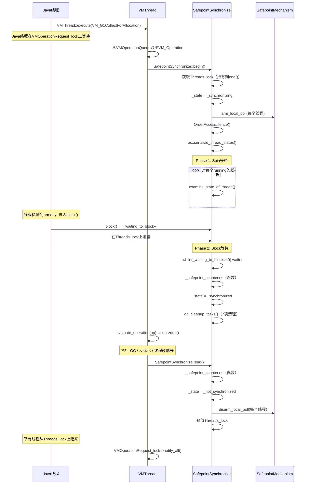
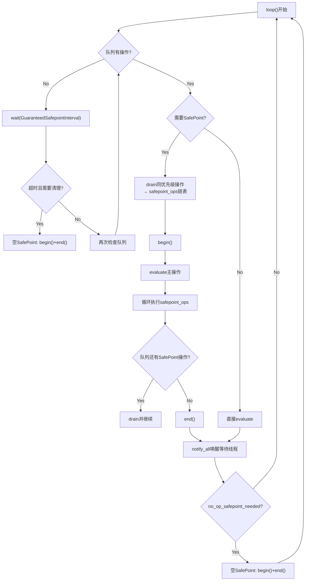

# #14 SafePoint + VM Operation 完整分析

> **前置问题**：
> 1. GC 需要 Stop-The-World，但 Java 线程正在各种状态下运行（解释执行、JIT 代码、JNI、阻塞中…）。如何让所有线程安全地停下来？
> 2. "安全地停下来"意味着什么？为什么不能在任意位置停？
> 3. 停下来之后谁来执行 GC？如何协调"请求 GC"和"执行 GC"？
> 4. 如果有多个操作都需要 STW，如何避免频繁进出 SafePoint？
> 5. JDK 11 的 Thread-Local Poll 和老方案 Global Page Poll 有什么本质区别？

---

## 第 0 部分：核心原理 ⭐

### 0.1 本质是什么？

SafePoint 的本质是**一个全局协调点：所有 Java 线程在此点上的 GC 根集合是精确已知的**。VMThread 请求 SafePoint 后，所有 Java 线程在下一个 SafePoint 检查点（方法调用、循环回边、JNI 返回等）主动挂起；VMThread 确认所有线程挂起后执行 VM Operation（如 GC），完成后唤醒所有线程。

### 0.2 为什么需要？

GC 需要扫描所有 GC Roots（线程栈上的引用），但线程栈是动态变化的（每条指令都可能修改引用）。如果在任意位置停止线程，GC 无法确定哪些寄存器/栈槽包含引用（vs 整数）。SafePoint 是精心选择的位置，在这些位置上 JVM 有精确的 OopMap（记录哪些位置是引用），GC 可以安全扫描。

### 0.3 怎么解决？

**Poll + 主动挂起**：
- **JDK 11 Thread-Local Poll**：每个线程有自己的 `_polling_page`，SafePoint 请求时 VMThread 将所有线程的 `_polling_page` 设为不可读；线程执行到 SafePoint 检查点时读 `_polling_page`，触发 SIGSEGV，信号处理器将线程挂起
- **VM Operation 队列**：需要 STW 的操作（GC/Deoptimization/Biased Lock Revoke 等）封装为 `VM_Operation` 对象，提交到 VMThread 的队列；VMThread 串行执行，避免多个 STW 操作并发冲突
- **批量执行**：VMThread 在一次 SafePoint 中可以执行多个 VM Operation，减少进出 SafePoint 的次数

### 0.4 为什么这样设计？

- **为什么用 Thread-Local Poll 而不是 Global Page Poll？** Global Page Poll 所有线程共享一个 polling page，保护/解保护是全局操作（`mprotect` 系统调用），代价高；Thread-Local Poll 每个线程独立，可以精确控制哪些线程需要停止（如 Handshake 只停一个线程）
- **为什么 SafePoint 检查点在方法调用/循环回边而不是每条指令？** 每条指令都检查代价太高（每条指令多一次内存读）；方法调用/循环回边是自然的"暂停点"，频率适中，SafePoint 延迟（Time-To-SafePoint）通常 < 10ms
- **为什么 VMThread 串行执行 VM Operation？** 并发执行多个 VM Operation 需要复杂的同步（GC 和 Deoptimization 可能冲突），串行化简化了实现；实践中 VM Operation 执行时间短，串行化不是瓶颈
- **为什么 JNI 代码不需要 SafePoint 检查？** JNI 代码在 `_thread_in_native` 状态，不访问 Java 堆（不持有 Java 引用），GC 可以安全运行；JNI 返回时检查 SafePoint 标志，如果 GC 正在进行则等待

---

## 一、宏观理解：三大组件及其关系

SafePoint 体系由三个核心组件构成：

| 组件 | 职责 | 核心类 | 关键源码 |
|------|------|--------|---------|
| **轮询机制** | 让每个线程"感知到"需要停下来 | `SafepointMechanism` | `safepointMechanism.cpp`(119行) + `.hpp`(95行) + `.inline.hpp`(82行) |
| **同步协调** | 等待所有线程到达安全点，执行清理 | `SafepointSynchronize` + `ThreadSafepointState` | `safepoint.cpp`(~1475行) + `.hpp`(282行) |
| **操作调度** | 决定"在 SafePoint 做什么事" | `VMThread` + `VMOperationQueue` + `VM_Operation` | `vmThread.cpp`(795行) + `.hpp`(189行) |

### 为什么需要三层分离？

> **思考**：能不能把轮询、同步、调度三件事全放在一个类里完成？
>
> 不行，因为三者的**变化节奏不同**：
> - **轮询机制**：从 JDK 8 的 Global Page Poll 演进到 JDK 10 的 Thread-Local Poll，底层实现大改，但上层完全不受影响
> - **同步协调**：算法相对稳定（spin → yield → sleep 三级退化），几乎不变
> - **操作调度**：新增 VM_Operation 类型（如 JFR 相关操作）很频繁，但不需要改同步逻辑
>
> 三层分离使得每一层可以独立演进。这是经典的**关注点分离**设计。

**一次完整的 SafePoint 生命周期**：



> **关键洞察**：SafePoint 不只是为 GC 服务的。`vmOperations.hpp` 中通过 `VM_OPS_DO` 宏定义了约 **84 种** VM 操作类型。GC 只是其中最常见的触发者。

---

## 二、SafepointMechanism：轮询页机制

> **源码**：`safepointMechanism.cpp`(119行) + `.hpp`(95行) + `.inline.hpp`(82行)

### 2.1 为什么必须是"主动轮询"而不是"被动通知"？

> **问题**：能不能让 VMThread 直接挂起每个 Java 线程？
>
> **绝对不行**，三个原因：
>
> **1. OopMap 问题**：线程可能正在执行任意字节码或 JIT 代码，寄存器和栈槽中可能持有 oop（对象引用）。如果在任意位置挂起，GC 不知道哪些寄存器/栈槽包含 oop → 无法正确扫描根集。只有在**编译器插入了 OopMap 的位置**（方法返回点、循环回边、调用点），GC 才能准确知道每个寄存器/栈槽的类型。
>
> **2. 一致性问题**：线程可能正在执行多步操作（比如写 CardTable），被强制挂起会导致 GC 看到不一致的数据。
>
> **3. 死锁风险**：线程持有 JVM 内部锁时被挂起，VMThread 获取同一个锁就会死锁。

### 2.2 Thread-Local Poll：双页方案（JDK 11 默认）

> **源码**: `safepointMechanism.cpp:42-88`

JDK 11 默认 `ThreadLocalHandshakes=true`，`default_initialize()` 分配**两个连续的内存页**：

```cpp
// safepointMechanism.cpp:54-74
const size_t page_size = os::vm_page_size();     // 通常 4096 (0x1000)
const size_t allocation_size = 2 * page_size;    // 8192 字节
char* polling_page = os::reserve_memory(allocation_size, NULL, page_size);
os::commit_memory_or_exit(polling_page, allocation_size, false, "...");

char* bad_page  = polling_page;                  // 第一页：不可访问
char* good_page = polling_page + page_size;      // 第二页：可读

os::protect_memory(bad_page,  page_size, os::MEM_PROT_NONE);
os::protect_memory(good_page, page_size, os::MEM_PROT_READ);

// 构造 armed/disarmed 值
poll_armed_value    |= bad_page_val;     // = poll_bit(8) | bad_page地址
poll_disarmed_value |= good_page_val;    // = 0 | good_page地址
```

```
内存布局（page_size=4096）:
┌──────────────────────────────┬──────────────────────────────┐
│          bad_page            │         good_page            │
│     (MEM_PROT_NONE)         │     (MEM_PROT_READ)          │
│    访问 → SIGSEGV           │    访问 → 正常返回            │
├──────────────────────────────┼──────────────────────────────┤
│  地址: 0x7f1234560000       │  地址: 0x7f1234561000        │
│  (低12位全为0，按页对齐)     │  (= bad_page + 0x1000)      │
└──────────────────────────────┴──────────────────────────────┘

armed 值:   0x7f1234560008  (bad_page | 8)   →  第3位为1
disarmed 值: 0x7f1234561000  (good_page)      →  第3位为0
```

> **JVM 参数**：`-Xlog:os=info` 可以看到轮询页地址：
> ```
> [info][os] SafePoint Polling address, bad (protected) page:0x00007f1234560000, good (unprotected) page:0x00007f1234561000
> ```

### 2.3 poll_bit = 8：一次位与操作区分状态

> **思考**：已经有了 bad_page/good_page 的内存保护（SIGSEGV），为什么还需要 poll_bit？
>
> **因为 SIGSEGV 太贵了！** 内核信号处理需要几百到上千个 CPU 周期。在 `block_if_requested()` 快路径中，用**一次位与操作**就能判断，避免不必要的 SIGSEGV。SIGSEGV 只是 JIT 代码中的**硬件级后备**。

```cpp
// safepointMechanism.hpp:61
const static intptr_t _poll_bit = 8;  // 第3位

// safepointMechanism.inline.hpp:32-35
bool SafepointMechanism::local_poll_armed(JavaThread* thread) {
    const intptr_t poll_word = reinterpret_cast<intptr_t>(thread->get_polling_page());
    return mask_bits_are_true(poll_word, poll_bit());  // (poll_word & 8) != 0
}
```

> **为什么选第3位？** 页地址按 4096 对齐，低 12 位全为 0。在 armed 值中 OR 上 8（0b1000），就可以用一次位与操作区分。第 0/1/2 位可能在某些平台有特殊用途，第 3 位足够安全。

### 2.4 block_if_requested：快慢路径分离

```cpp
// safepointMechanism.inline.hpp:58-63 — 快路径（内联）
void SafepointMechanism::block_if_requested(JavaThread *thread) {
    if (uses_thread_local_poll() && !local_poll_armed(thread)) {
        return;  // 未 armed → 一次位操作，零开销
    }
    block_if_requested_slow(thread);
}

// safepointMechanism.cpp:91-98 — 慢路径
void SafepointMechanism::block_if_requested_slow(JavaThread *thread) {
    if (global_poll()) {                          // ① _state != _not_synchronized?
        SafepointSynchronize::block(thread);      //    → 真正阻塞
    }
    if (uses_thread_local_poll() && thread->has_handshake()) {  // ② Handshake?
        thread->handshake_process_by_self();      //    → 处理 Handshake
    }
}
```

> **顺序很重要**：先 SafePoint 后 Handshake。SafePoint 优先级高于 Handshake——如果正在进入全局 SafePoint，线程应该先 block() 响应，SafePoint 结束后再处理 Handshake。

### 2.5 Handshake：Thread-Local Poll 的核心优势

> Thread-Local Poll 相比 Global Page Poll，最大优势不是性能，而是支持 **Handshake**——只停一个线程执行操作，不需要全局 STW。
>
> 典型场景：偏向锁撤销（只停持有者）、JFR 栈采样（只停被采样线程）、类重定义中的栈遍历。
>
> Global Page Poll 做不到——轮询页全局共享，一改全部受影响。

### 2.6 Global Page Poll（老方案对比）

`ThreadLocalHandshakes=false` 时，只分配一页，正常时 `MEM_PROT_READ`。进入 SafePoint 时还需要**两步**：① `Interpreter::notice_safepoints()` 修改解释器调度表 ② `os::make_polling_page_unreadable()`。Thread-Local Poll 不需要修改调度表。

### 2.7 Serialize Page：内存可见性的精妙解决方案

> **源码**: `safepointMechanism.cpp:105-113` + `os.cpp:1463-1475`

```cpp
// os.cpp:1463-1475
void os::serialize_thread_states() {
    Thread::muxAcquire(&SerializePageLock, "serialize_thread_states");
    os::protect_memory((char *)os::get_memory_serialize_page(),
                       os::vm_page_size(), MEM_PROT_READ);    // 先改为 READ
    os::protect_memory((char *)os::get_memory_serialize_page(),
                       os::vm_page_size(), MEM_PROT_RW);      // 再改回 RW
    Thread::muxRelease(&SerializePageLock);
}
```

> **为什么两次 mprotect？** `mprotect()` 是 **TLB shootdown** 操作——内核刷新所有 CPU 的 TLB，隐式充当**全局内存屏障**。
>
> Java 线程进入 native 时：写 `thread_state = _thread_in_native` → 写 serialize_page。VMThread 调用 `serialize_thread_states()` → mprotect 序列化所有线程之前的写入。这样 VMThread 一定能看到线程的最新 `thread_state`。
>
> **相比 mfence 的优势**：mfence 需要在**每次** native 调用时执行（Java 线程端）；serialize_page 写入只需一次普通内存写（几乎零开销），mprotect 开销由 VMThread 在 SafePoint 时承担一次。**把开销从热路径转移到冷路径**。

---

## 三、SafepointSynchronize::begin()：把世界停下来

> **源码**: `safepoint.cpp:155-495`，约 **340 行**

### 3.1 begin() 的 6 个阶段

```
阶段 1: 准备 (155-200)     → Threads_lock、计数器初始化
阶段 2: Arm (238-268)      → _state=_synchronizing、arm、fence、serialize
阶段 3: Spin (274-403)     → examine_state_of_thread、三级退化
阶段 4: Block (415-459)    → wait(_waiting_to_block==0)、counter++、_synchronized
阶段 5: GCLocker (461-476) → JNI Critical 计数
阶段 6: Cleanup (478-495)  → do_cleanup_tasks() 7项
```

### 3.2 阶段 1: 准备工作

```cpp
void SafepointSynchronize::begin() {
    assert(myThread->is_VM_thread(), "Only VM thread may execute a safepoint");

    Universe::heap()->safepoint_synchronize_begin();  // G1 的实现是空操作
    Threads_lock->lock();  // ★ 关键！持有到 end() 的 unlock()
```

> **Threads_lock 的双重用途**：
> 1. 防止线程创建/销毁（attach/detach）
> 2. 作为阻塞/唤醒机制——线程 `block()` 后在这个锁上排队，`end()` 释放时全部唤醒
>
> **一把锁同时起到"阻塞"和"唤醒"两个作用**。

```cpp
    _waiting_to_block = nof_threads;   // 需要等待的线程数
    int still_running = nof_threads;   // 还在运行的线程数
```

> **两个计数器的区别**：
> - `still_running`：VMThread 在 spin 阶段**主动检查**后认为"还没到达安全点"的数量
> - `_waiting_to_block`：需要**真正 block() 或被 roll_forward** 的线程数
>
> `still_running == 0` 只意味着 VMThread 知道了所有线程状态（Phase 1 结束）。`_waiting_to_block == 0` 才意味着所有线程实际到位（Phase 2 结束）。

### 3.3 阶段 2: Arm 所有线程 + 内存屏障

```cpp
    _state = _synchronizing;                        // ① 全局状态

    if (SafepointMechanism::uses_thread_local_poll()) {
        OrderAccess::storestore();                  // ② StoreStore: _state 的写在 arm 之前
        for (...) {
            SafepointMechanism::arm_local_poll(cur);  // ③ arm 每个线程
        }
    }
    OrderAccess::fence();                           // ④ Full fence

    if (!UseMembar) {
        os::serialize_thread_states();              // ⑤ TLB shootdown 内存屏障
    }
```

> **②的必要性**：线程检测到 armed → `block_if_requested_slow()` → `global_poll()` 检查 `_state`。如果 arm 的写入在 `_state` 写入之前可见（乱序），线程看到 armed 但 `_state` 还是 `_not_synchronized` → 不会 block → 错过 SafePoint！

### 3.4 阶段 3: Spin 等待——逐行分析

```cpp
    int steps = 0;
    while(still_running > 0) {                     // 外层循环
        jtiwh.rewind();
        for (; JavaThread *cur = jtiwh.next(); ) { // 内层：遍历每个线程
            ThreadSafepointState *cur_state = cur->safepoint_state();
            if (cur_state->is_running()) {
                cur_state->examine_state_of_thread();  // ★ 判断线程状态
                if (!cur_state->is_running()) {
                    still_running--;
                }
            }
        }

        if (still_running > 0) {
            ++steps;
            if (ncpus > 1 && steps < 2000) {
                SpinPause();                // ① < 2000: x86 PAUSE 指令（~140个周期）
            } else if (steps < 4000) {
                os::naked_yield();          // ② < 4000: 让出 CPU
            } else {
                os::naked_short_sleep(1);   // ③ >= 4000: 睡 1ms（实际~10ms+）
            }
        }
    }
```

> **三级退化策略的矛盾**：注释（safepoint.cpp:327-378）指出：
> - VMThread spin → 消耗 CPU → mutator 被抢占 → SafePoint 反而更慢
> - 在 CPU 满载系统上尤其严重
> - 但 sleep 的最小粒度通常 ~10ms → 白白浪费时间
>
> 这是一个**务实的折中**。注释列出了 9 条改进方向，说明远非完美。

#### 3.4.1 examine_state_of_thread()：5 种线程状态处理

> **源码**: `safepoint.cpp:1045-1100`

```cpp
void ThreadSafepointState::examine_state_of_thread() {
    JavaThreadState state = _thread->thread_state();
    _orig_thread_state = state;                  // 保存原始状态（block 后恢复用）

    // 检查 1: 外部挂起
    if (_thread->is_ext_suspended()) {
        roll_forward(_at_safepoint);             // 直接标记安全
        return;
    }
    // 检查 2: native 或 blocked → safepoint_safe
    if (safepoint_safe(_thread, state)) {
        check_for_lazy_critical_native(_thread, state);
        roll_forward(_at_safepoint);
        return;
    }
    // 检查 3: 在 VM 中
    if (state == _thread_in_vm) {
        roll_forward(_call_back);                // 等待回调
        return;
    }
    // 检查 4: _thread_in_Java 等 → 保持 _running
}
```

**5 种线程状态的完整处理**：

| # | 线程状态 | examine 结果 | 如何到达安全点 | VMThread 行为 |
|---|---------|-------------|--------------|--------------|
| 1 | 解释执行 `_thread_in_Java` | `_running` | polling_page 检查 | 等待自行 block |
| 2 | native `_thread_in_native` | `_at_safepoint` | 返回时自查 | **不等待！** |
| 3 | JIT 代码 `_thread_in_Java` | `_running` | 轮询指令→SIGSEGV | 等待自行 block |
| 4 | 已阻塞 `_thread_blocked` | `_at_safepoint` | 已安全 | 直接标记 |
| 5 | 在 VM `_thread_in_vm` | `_call_back` | 状态转换时检查 | 等待回调 |

> **第 2 种最特殊**：native 代码不直接操作 Java 堆对象（JNI 规范要求通过函数间接访问）。但有例外：**JNI Critical Region**（`GetPrimitiveArrayCritical`）。`check_for_lazy_critical_native()` 检查并计入 `_current_jni_active_count`，GC 据此决定是否推迟移动对象。

#### 3.4.2 safepoint_safe() 和 roll_forward()

```cpp
// safepoint.cpp:760-773
bool safepoint_safe(JavaThread *thread, JavaThreadState state) {
    switch(state) {
    case _thread_in_native:
        return !thread->has_last_Java_frame() || thread->frame_anchor()->walkable();
        // native 需要栈可遍历（或无 Java 栈帧）
    case _thread_blocked:
        return true;  // blocked 总是安全的
    default:
        return false;
    }
}
```

> **walkable 检查**：线程刚从 Java 进入 native 时，可能在设置 `_thread_in_native` 和设置 `frame_anchor` 之间。此时栈不可遍历 → GC 无法扫描 → 不安全。

```cpp
// safepoint.cpp:1103-1124
void ThreadSafepointState::roll_forward(suspend_type type) {
    _type = type;
    switch(_type) {
    case _at_safepoint:
        SafepointSynchronize::signal_thread_at_safepoint();  // ★ _waiting_to_block--
        if (_thread->in_critical()) increment_jni_active_count();
        break;
    case _call_back:
        set_has_called_back(false);
        break;
    }
}
```

### 3.5 阶段 4: Block 等待

```cpp
    while (_waiting_to_block > 0) {
        Safepoint_lock->wait(true);  // 等待线程 block() 后 notify
    }
    _safepoint_counter++;            // 变为奇数 → 在 SafePoint
    _state = _synchronized;          // 全世界已停下
    OrderAccess::fence();
```

> **`_safepoint_counter` 的用途**：偶数 = 不在 SafePoint，奇数 = 在 SafePoint。JNI `Get<Primitive>Field` 用它实现无锁快速路径（seqlock 模式）——读两次 counter，如果都是偶数且相等，说明期间没有 GC，读取安全。

### 3.6 阶段 5-6: GCLocker + 清理任务

```cpp
    GCLocker::set_jni_lock_count(_current_jni_active_count);
    do_cleanup_tasks();  // 7 项并行清理
```

---

## 四、do_cleanup_tasks()：7 项清理任务

> **源码**: `safepoint.cpp:613-757`

如果 GC 提供了 `get_safepoint_workers()`（G1 提供），清理任务**借用 GC 线程并行执行**。

**per-thread 任务**（所有 worker 执行）：
- `ObjectSynchronizer::deflate_thread_local_monitors()` — 回收线程本地 ObjectMonitor
- `jt->nmethods_do()` — 标记活跃 nmethod（sweeper 只清理不活跃的）

**7 项子任务**（通过 SubTasksDone CAS 确保每项只执行一次）：

| # | 任务 | 实现 | 为什么必须在 SafePoint |
|---|------|------|----------------------|
| 0 | Deflate idle monitors | `ObjectSynchronizer::deflate_idle_monitors()` | 确保没有线程正在使用 |
| 1 | Update inline caches | `InlineCacheBuffer::update_inline_caches()` | 确保没有线程执行旧缓存 |
| 2 | Compilation policy | `CompilationPolicy::do_safepoint_work()` | 需要全局一致统计 |
| 3 | Symbol table rehash | `SymbolTable::rehash_table()` | 需要全局一致视图 |
| 4 | String table rehash | `StringTable::rehash_table()` | 需要全局一致视图 |
| 5 | CLD purge | `ClassLoaderDataGraph::purge_if_needed()` | 确保无线程使用相关类数据 |
| 6 | System dictionary resize | `ClassLoaderDataGraph::resize_if_needed()` | 确保无线程查询字典 |

> **JVM 参数**：`-Xlog:safepoint+cleanup=info`
> ```
> [info][safepoint,cleanup] deflating idle monitors, 0.0001234 secs
> [info][safepoint,cleanup] updating inline caches, 0.0000456 secs
> [info][safepoint,cleanup] purging class loader data graph, 0.0000234 secs
> ```

---

## 五、SafepointSynchronize::end()：唤醒世界

> **源码**: `safepoint.cpp:499-601`

```cpp
void SafepointSynchronize::end() {
    _safepoint_counter++;      // ① 变回偶数

    // ② 恢复 Global Page Poll（如果使用）
    if (PageArmed) { os::make_polling_page_readable(); PageArmed = 0; }
    if (uses_global_page_poll()) Interpreter::ignore_safepoints();

    // ③ Thread-Local Poll 的恢复（顺序关键！）
    if (uses_thread_local_poll()) {
        _state = _not_synchronized;       // 先设状态
        OrderAccess::storestore();        // StoreStore 屏障
        for (...) {
            cur_state->restart();         // _type = _running
            disarm_local_poll(current);   // 设为 good_page
        }
    }

    // ④ 释放 Threads_lock → 所有 block() 的线程被唤醒
    Threads_lock->unlock();

    _end_of_last_safepoint = os::javaTimeMillis();
}
```

> **Thread-Local Poll 的顺序**：**先设 `_state = _not_synchronized`，再 disarm**。如果反过来：线程被 disarm 后从 native 返回，检查 `global_poll()` → `_state` 还是 `_synchronized` → 错误地进入 `block()` → 死等 Threads_lock。

---

## 六、block()：线程如何自行阻塞

> **源码**: `safepoint.cpp:816-945`

### 6.1 前置处理

```cpp
void SafepointSynchronize::block(JavaThread *thread) {
    ttyLocker::break_tty_lock_for_safepoint(...);  // 防止 ttyLock 死锁
    if (thread->is_terminated()) { ... return; }
    thread->frame_anchor()->make_walkable(thread);  // 确保栈可遍历（GC 扫描用）
```

### 6.2 Case 1: _thread_in_Java / _thread_in_vm_trans

```cpp
    case _thread_in_vm_trans:
    case _thread_in_Java:
        thread->set_thread_state(_thread_in_vm);   // ① 避免 Safepoint_lock 递归检查

        Safepoint_lock->lock_without_safepoint_check();
        if (is_synchronizing()) {
            _waiting_to_block--;                    // ② 递减等待计数
            thread->safepoint_state()->set_has_called_back(true);
            if (_waiting_to_block == 0)
                Safepoint_lock->notify_all();       // ③ 唤醒 VMThread
        }
        thread->set_thread_state(_thread_blocked);
        Safepoint_lock->unlock();

        Threads_lock->lock_without_safepoint_check();  // ④ 阻塞在这里！
        thread->set_thread_state(state);               // ⑤ 恢复原始状态
        Threads_lock->unlock();
        break;
```

> **执行流程**：获取 Safepoint_lock → 递减 `_waiting_to_block` → 释放 Safepoint_lock → 获取 Threads_lock（VMThread 持有 → 阻塞）→ VMThread `end()` 释放 Threads_lock → 线程醒来恢复状态。

### 6.3 Case 2: _thread_in_native_trans / _thread_blocked_trans

```cpp
    case _thread_in_native_trans:
    case _thread_blocked_trans:
        thread->set_thread_state(_thread_blocked);
        Threads_lock->lock_without_safepoint_check();  // 直接阻塞
        thread->set_thread_state(state);
        Threads_lock->unlock();
        break;
```

> **不需要递减 `_waiting_to_block`**——Phase 1 中 `roll_forward(_at_safepoint)` 已经递减过了。

### 6.4 后处理：异步异常

```cpp
    if (state != _thread_blocked_trans && state != _thread_in_vm_trans &&
        thread->has_special_runtime_exit_condition()) {
        thread->handle_special_runtime_exit_condition(
            !thread->is_at_poll_safepoint() && (state != _thread_in_native_trans));
    }
```

> **poll safepoint 不投递异步异常**——编译器在循环回边没有异常处理器，异常应在线程回到解释器后投递。

---

## 七、handle_polling_page_exception：JIT 代码的 SafePoint 入口

> **源码**: `safepoint.cpp:1166-1256`

### 7.1 从 SIGSEGV 到 handler

```
JIT代码: testl %eax, [polling_page]  →  armed时触发SIGSEGV
→ 内核信号处理 → JVM信号处理 → 设置 saved_exception_pc → safepoint_handler_blob
→ 保存寄存器 → SafepointSynchronize::handle_polling_page_exception()
→ ThreadSafepointState::handle_polling_page_exception()
```

### 7.2 poll_return vs poll

```cpp
if (nm->is_at_poll_return(real_return_addr)) {
    // Case 1: 方法返回前 —— 需要保存返回值 oop
    bool return_oop = nm->method()->is_returning_oop();
    Handle return_value;
    if (return_oop) {
        oop result = caller_fr.saved_oop_result(&map);
        return_value = Handle(thread(), result);  // ★ 包装成 Handle，GC 会更新指针
    }
    SafepointMechanism::block_if_requested(thread());  // 阻塞（GC 可能移动对象）
    if (return_oop) {
        caller_fr.set_saved_oop_result(&map, return_value());  // ★ 从 Handle 取回新地址
    }
} else {
    // Case 2: 循环回边 —— 不需要保存返回值
    set_at_poll_safepoint(true);
    SafepointMechanism::block_if_requested(thread());
    set_at_poll_safepoint(false);
    if (thread()->has_async_condition()) {
        Deoptimization::deoptimize_frame(thread(), caller_fr.id());  // ★ 不投递异常，反优化
    }
}
```

> **poll_return 为什么要保存返回值？** 返回点的 OopMap 不包含返回值（不是栈帧的一部分），GC 可能移动对象。包装成 Handle 后 GC 会自动更新 Handle 内的指针。
>
> **poll 为什么不投递异常而是 deoptimize？** JIT 在循环回边没有异常处理器。先 deoptimize 回到解释器，再由解释器投递异步异常。

---

## 八、VMThread：操作调度中心

> **源码**: `vmThread.cpp`(795行) + `vmThread.hpp`(189行)

### 8.1 VMThread 创建与优先级

```cpp
// vmThread.cpp:301-307
int prio = (VMThreadPriority == -1)
    ? os::java_to_os_priority[NearMaxPriority]  // 比普通 Java 线程高
    : VMThreadPriority;
os::set_native_priority(this, prio);
```

> **为什么 VMThread 优先级高？** 确保 SafePoint 请求被及时处理。如果 VMThread 优先级低，可能长时间得不到 CPU → SafePoint 延迟增大。但这也带来矛盾——VMThread spin 时高优先级会抢占 mutator 的 CPU。

### 8.2 VMOperationQueue：双优先级循环链表

> **源码**: `vmThread.cpp:56-199`

```cpp
// 构造函数 - 每个优先级一个哨兵节点的双向循环链表
VMOperationQueue::VMOperationQueue() {
    for(int i = 0; i < nof_priorities; i++) {
        _queue_length[i] = 0;
        _queue_counter = 0;
        _queue[i] = new VM_Dummy();      // 哨兵节点
        _queue[i]->set_next(_queue[i]);
        _queue[i]->set_prev(_queue[i]);
    }
}
```

```
┌─────────────────────────────────────────────────────┐
│              VMOperationQueue                        │
├─────────────────┬───────────────────────────────────┤
│ SafepointPriority(0) │ 双向循环链表 ← GC 操作      │
│ MediumPriority  (1) │ 双向循环链表 ← 其他操作       │
├─────────────────┴───────────────────────────────────┤
│ _queue_counter: 调度计数器                           │
│ 每 10 次 Safepoint 优先后取 1 次 Medium             │
│ → 防止低优先级饿死                                   │
└─────────────────────────────────────────────────────┘
```

```cpp
// vmThread.cpp:173-191 — 防饿死调度
VM_Operation* VMOperationQueue::remove_next() {
    int high_prio, low_prio;
    if (_queue_counter++ < 10) {
        high_prio = SafepointPriority;    // 正常：SafePoint 优先
        low_prio  = MediumPriority;
    } else {
        _queue_counter = 0;
        high_prio = MediumPriority;       // 每 10 次翻转一次 → 防饿死
        low_prio  = SafepointPriority;
    }
    return queue_remove_front(queue_empty(high_prio) ? low_prio : high_prio);
}
```

### 8.3 VMThread::loop()：核心主循环逐行分析

> **源码**: `vmThread.cpp:457-636`



```cpp
// vmThread.cpp:457-636（核心结构）
void VMThread::loop() {
    while(true) {
        VM_Operation* safepoint_ops = NULL;

        // ★ 阶段 1: 等待操作
        { MutexLockerEx mu_queue(VMOperationQueue_lock, ...);
          _cur_vm_operation = _vm_queue->remove_next();

          while (!should_terminate() && _cur_vm_operation == NULL) {
              bool timedout = VMOperationQueue_lock->wait(..., GuaranteedSafepointInterval);

              // 超时 + 需要清理 → 空 SafePoint
              if (timedout && no_op_safepoint_needed(false)) {
                  MutexUnlockerEx mul(VMOperationQueue_lock, ...);
                  SafepointSynchronize::begin();
                  SafepointSynchronize::end();
              }
              _cur_vm_operation = _vm_queue->remove_next();

              // ★ SafePoint 操作合并（Coalescing）
              if (_cur_vm_operation != NULL && _cur_vm_operation->evaluate_at_safepoint()) {
                  safepoint_ops = _vm_queue->drain_at_safepoint_priority();
              }
          }
        }

        // ★ 阶段 2: 执行操作
        if (_cur_vm_operation->evaluate_at_safepoint()) {
            _vm_queue->set_drain_list(safepoint_ops);  // GC 可扫描
            SafepointSynchronize::begin();

            if (_timeout_task != NULL) _timeout_task->arm();

            evaluate_operation(_cur_vm_operation);  // 执行主操作

            // ★ 执行合并的操作 + 继续 drain 新入队的
            do {
                _cur_vm_operation = safepoint_ops;
                while (_cur_vm_operation != NULL) {
                    VM_Operation* next = _cur_vm_operation->next();
                    evaluate_operation(_cur_vm_operation);
                    _cur_vm_operation = next;
                }
                // 检查是否又有新操作入队
                if (_vm_queue->peek_at_safepoint_priority()) {
                    safepoint_ops = _vm_queue->drain_at_safepoint_priority();
                } else {
                    safepoint_ops = NULL;
                }
            } while(safepoint_ops != NULL);

            if (_timeout_task != NULL) _timeout_task->disarm();
            SafepointSynchronize::end();

        } else {
            evaluate_operation(_cur_vm_operation);  // 不需要 SafePoint，直接执行
        }

        // ★ 阶段 3: 通知等待的线程
        { VMOperationRequest_lock->notify_all(); }

        // ★ 阶段 4: 保证定期 SafePoint
        if (no_op_safepoint_needed(true)) {
            SafepointSynchronize::begin();
            SafepointSynchronize::end();
        }
    }
}
```

**四个关键设计**：

**1. SafePoint 合并（Coalescing）**：取到 SafePoint 操作时，`drain_at_safepoint_priority()` 把队列中**所有** SafePoint 优先级操作一起取出，在同一个 SafePoint 内依次执行。避免频繁进出 SafePoint。

**2. 二次 drain**：执行完合并的操作后，还会再检查队列（`peek_at_safepoint_priority()`）。因为在执行期间可能有新操作入队。这进一步减少了 SafePoint 次数。

**3. GuaranteedSafepointInterval**（默认 1000ms）：即使没有 VM_Operation，VMThread 每隔 1 秒也执行空 SafePoint（`begin() + end()`），确保清理任务定期执行。

**4. 超时检测**：`VMOperationTimeoutTask` 在操作开始时 arm，定期检查超时。超过 `AbortVMOnVMOperationTimeoutDelay` 则 `fatal()`。

### 8.4 VMThread::execute()：提交 VM 操作

> **源码**: `vmThread.cpp:663-757`

```cpp
void VMThread::execute(VM_Operation* op) {
    if (!t->is_VM_thread()) {
        // ★ 外部线程（Java/Watcher）提交
        if (!op->doit_prologue()) return;            // 前置检查（如获取 Heap_lock）

        op->set_calling_thread(t, Thread::get_priority(t));
        int ticket = t->vm_operation_ticket();

        // 加入队列并唤醒 VMThread
        VMOperationQueue_lock->lock_without_safepoint_check();
        _vm_queue->add(op);
        VMOperationQueue_lock->notify();
        VMOperationQueue_lock->unlock();

        // 等待完成（非并发操作）
        if (!concurrent) {
            MutexLocker mu(VMOperationRequest_lock);
            while(t->vm_operation_completed_count() < ticket) {
                VMOperationRequest_lock->wait(...);    // ★ 阻塞等待
            }
        }

        op->doit_epilogue();

    } else {
        // ★ VMThread 自身（嵌套操作）
        if (prev_vm_operation && !prev_vm_operation->allow_nested_vm_operations()) {
            fatal("Nested VM operation not allowed");
        }
        if (op->evaluate_at_safepoint() && !SafepointSynchronize::is_at_safepoint()) {
            SafepointSynchronize::begin();
            op->evaluate();
            SafepointSynchronize::end();
        } else {
            op->evaluate();
        }
    }
}
```

> **ticket 机制**：每个线程维护一个 `vm_operation_completed_count`。提交操作时获取 ticket，VMThread 执行完后递增该线程的 count。Java 线程在 `while(count < ticket)` 中等待。

---

## 九、VM_Operation 体系与 G1 专属操作

### 9.1 VM_Operation 基类

```cpp
class VM_Operation {
    enum Mode {
        _safepoint,         // 阻塞，需要 SafePoint
        _no_safepoint,      // 阻塞，不需要 SafePoint
        _concurrent,        // 非阻塞，不需要 SafePoint
        _async_safepoint    // 非阻塞，需要 SafePoint
    };
    virtual void doit() = 0;
    virtual bool doit_prologue()  { return true; }
    virtual void doit_epilogue()  {}
};
```

### 9.2 G1 的三个 VM_Operation

```
VM_Operation
├── VM_GC_Operation                    // GC 基类：管理 Heap_lock + GC count 防重入
│   ├── VM_G1CollectFull              ★ G1 Full GC
│   └── VM_CollectForAllocation
│       └── VM_G1CollectForAllocation  ★ Young/Mixed GC + Initial Mark
└── VM_CGC_Operation                   ★ Remark/Cleanup STW（直接继承，不经 VM_GC_Operation）
```

#### VM_G1CollectForAllocation::doit()

> **源码**: `vm_operations_g1.cpp:75-158`

```
doit() 流程:
1. 先尝试在 SafePoint 直接分配（无并发修改 → 可能成功 → 避免一次 GC！）
2. 如果需要初始标记 → force_initial_mark_if_outside_cycle()
   → 如果已有标记周期进行中 → 设 _should_retry_gc 并返回
3. do_collection_pause_at_safepoint(target_pause_time_ms)  ← Young/Mixed GC 入口
4. 如果 GC 后仍分配失败 → satisfy_failed_allocation() 或升级为 Full GC
```

> **doit_epilogue() 的等待机制**：如果是 `System.gc()` + `ExplicitGCInvokesConcurrent`，epilogue 中在 `FullGCCount_lock` 上等待并发标记周期完成。这确保 `System.gc()` 语义完整。

#### VM_CGC_Operation

```cpp
// 直接继承 VM_Operation（不经 VM_GC_Operation）
class VM_CGC_Operation: public VM_Operation {
    VoidClosure* _cl;
    void doit() { _cl->do_void(); }                    // 执行传入的闭包
    bool doit_prologue() { Heap_lock->lock(); return true; }
    void doit_epilogue() {
        if (Universe::has_reference_pending_list()) Heap_lock->notify_all();
        Heap_lock->unlock();
    }
};
```

> **为什么不经过 VM_GC_Operation？** VM_GC_Operation 的 prologue 有 GC count 检查（防重入），但 Remark/Cleanup 不需要——它们是并发标记周期的一部分，不会重入。

### 9.3 GC 类型与 VM_Operation 对应

| GC 类型 | VM_Operation | 触发 |
|---------|-------------|------|
| Young GC | `VM_G1CollectForAllocation` | 分配失败 |
| Mixed GC | `VM_G1CollectForAllocation` | 分配失败，标记后 |
| Initial Mark | `VM_G1CollectForAllocation` | `_should_initiate_conc_mark=true` |
| Remark | `VM_CGC_Operation` | 并发标记完成 |
| Cleanup | `VM_CGC_Operation` | Remark 后 |
| Full GC | `VM_G1CollectFull` | 最后手段 |

---

## 十、ThreadSafepointState：完整分析

> **源码**: `safepoint.hpp:228-277` + `safepoint.cpp:1026-1161`

### 10.1 数据结构

```cpp
class ThreadSafepointState: public CHeapObj<mtThread> {
    enum suspend_type {
        _running      = 0,    // 还未到达安全点
        _at_safepoint = 1,    // 已到达（blocked 或 native）
        _call_back    = 2     // 在 VM 中，需要回调阻塞
    };
    volatile bool      _at_poll_safepoint;  // 在 poll 点（非 poll_return）
    bool               _has_called_back;     // 调试用：是否已回调
    JavaThread*        _thread;
    volatile suspend_type _type;
    JavaThreadState    _orig_thread_state;   // 阻塞前的原始状态
};
```

### 10.2 状态机

```
                examine_state_of_thread()
    _running ──────────────────────────────→ _at_safepoint   (native/blocked/ext_suspended)
        │                                         │
        │ examine_state_of_thread()                │ signal_thread_at_safepoint()
        │                                         │ → _waiting_to_block--
        ↓                                         │
    _call_back  (in_vm)                           │
        │                                         │
        │ 线程自行 block()                         │
        └─────────────────────────────────────────┘

                    end() → restart()
    _at_safepoint ──────────────────→ _running
    _call_back    ──────────────────→ _running
```

### 10.3 restart()

```cpp
void ThreadSafepointState::restart() {
    switch(type()) {
    case _at_safepoint:
    case _call_back:
        break;           // 合法
    case _running:
    default:
        ShouldNotReachHere();  // restart 只能从非 _running 状态调用
    }
    _type = _running;
    set_has_called_back(false);
}
```

---

## 十一、设计决策与深层思考

| 设计问题 | 解决方案 | 为什么这样做 |
|---------|---------|-------------|
| 如何让 JIT 代码感知 SafePoint | 轮询页 + SIGSEGV | 零开销（正常时）+ 精确控制（有 OopMap） |
| 如何让解释器感知 | Thread-Local: polling_page<br/>Global: 修改调度表 | Thread-Local 更统一 |
| native 线程如何处理 | 不等待，返回时自查 | native 中不持有 oop |
| 内存可见性（native 返回时） | `serialize_thread_states()` | 比 mfence on every native call 高效 |
| spin 策略 | 三级退化 | 平衡延迟和 CPU 消耗 |
| SafePoint 中做什么 | VM_Operation 队列 | 解耦触发者和执行者 |
| 多操作需要 SafePoint | 合并执行 | 减少 STW 次数 |
| 定期清理 | GuaranteedSafepointInterval | 即使无 GC 也需定期清理 |
| 线程阻塞/唤醒 | Threads_lock 一锁两用 | 简洁高效 |
| Thread-Local vs Global Poll | Thread-Local（JDK 10+） | 支持 Handshake |
| armed/disarmed 判断 | poll_bit 位掩码 | 一次位操作，零开销 |

> **更深的问题：SafePoint 的代价是什么？**
>
> 1. **延迟**：所有线程必须等到最慢的线程到达安全点。一个长 native 调用可能让 SafePoint 延迟数百毫秒。
> 2. **CPU 浪费**：VMThread spin 阶段消耗 CPU，抢占 mutator。
> 3. **不公平**：JIT 代码的 SafePoint 间隔取决于编译器插入轮询点的位置——如果一个循环没有回边轮询（counted loop 优化），可能长时间不到达。
> 4. **清理任务累加**：7 项清理任务即使很快，累加起来也增加 STW 时间。
>
> **JDK 演进方向**：
> - JDK 10: Thread-Local Poll + Handshake → 减少全局 STW 需求
> - JDK 17+: 更多操作从 SafePoint 移到 Handshake（如偏向锁撤销）
> - ZGC/Shenandoah: 通过并发技术大幅减少需要 SafePoint 的场景

---

## 十二、JVM 参数与日志

### SafePoint 相关参数

| 参数 | 默认值 | 含义 |
|------|--------|------|
| `-XX:+PrintSafepointStatistics` | false | 打印每次 SafePoint 统计 |
| `-XX:PrintSafepointStatisticsTimeout=N` | 0 | 超过 N ms 的 SafePoint 才打印 |
| `-XX:+SafepointTimeout` | false | 启用超时检测 |
| `-XX:SafepointTimeoutDelay=N` | 10000(ms) | 超时阈值 |
| `-XX:GuaranteedSafepointInterval=N` | 1000(ms) | 保证间隔 |
| `-XX:+ThreadLocalHandshakes` | true(JDK11) | 线程本地轮询 |
| `-XX:+UseMembar` | false | 用 mfence 代替 serialize page |
| `-XX:+AbortVMOnVMOperationTimeout` | false | VM操作超时时 abort |

### 日志标签

```bash
-Xlog:safepoint=info           # SafePoint 进出
-Xlog:safepoint=debug          # 详细同步过程
-Xlog:safepoint=trace          # 线程级追踪
-Xlog:safepoint+cleanup=info   # 清理任务
-Xlog:vmthread=debug           # VMThread 操作
-Xlog:os=info                  # 轮询页地址
```

**输出示例**：
```
[info][safepoint   ] Safepoint synchronization initiated. (15 threads)
[info][safepoint   ] Entering safepoint region: G1 collect for allocation
[info][safepoint,cleanup] safepoint cleanup tasks, 0.0012345 secs
[info][safepoint,cleanup] deflating idle monitors, 0.0001234 secs
[info][safepoint,cleanup] updating inline caches, 0.0000456 secs
[info][safepoint,cleanup] compilation policy safepoint handler, 0.0000012 secs
[info][safepoint,cleanup] rehashing symbol table, 0.0000789 secs
[info][safepoint,cleanup] rehashing string table, 0.0000345 secs
[info][safepoint,cleanup] purging class loader data graph, 0.0000234 secs
[info][safepoint,cleanup] resizing system dictionaries, 0.0000567 secs
[info][safepoint   ] Leaving safepoint region
[debug][vmthread    ] Adding VM operation: G1 collect for allocation
[debug][vmthread    ] Evaluating safepoint VM operation: G1 collect for allocation
```

### PrintSafepointStatistics 输出格式

```
         vmop                    [threads: total initially_running wait_to_block]
                                       [time: spin   block   sync  cleanup  vmop] page_trap_count
4.042: G1CollectForAllocation   [      15          1          1    ]
                                [     0     0     0     1     5    ]  1
```

各列含义：
- `spin`: VMThread 自旋等待线程到达的时间(ms)
- `block`: 等待线程阻塞的时间(ms)
- `sync`: 总同步时间 = spin + block
- `cleanup`: 清理任务时间(ms)
- `vmop`: VM 操作本身的执行时间(ms)
- `page_trap_count`: 触发轮询页 SIGSEGV 的线程数
