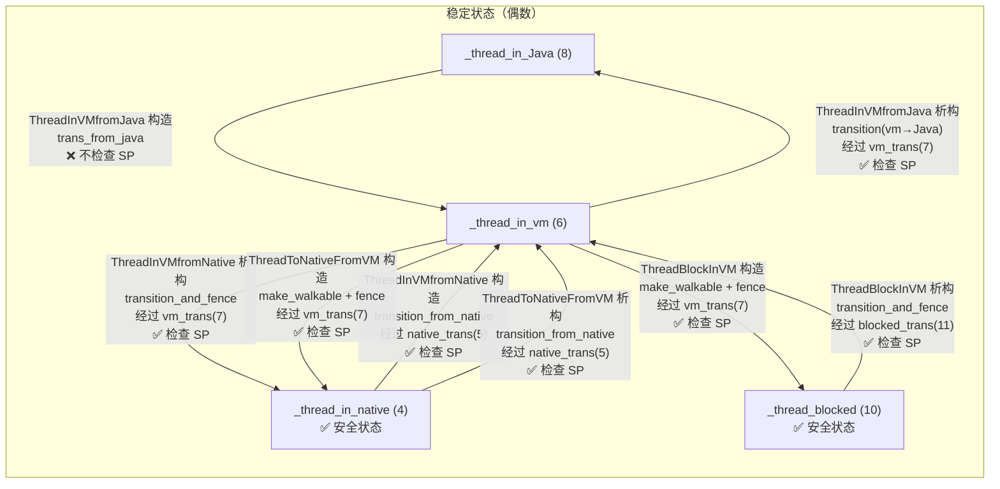

# 14A. SafePoint 深度补充：线程状态转换 + 信号处理全链路 + GDB 验证

> 本文是 [14-SafePoint-VMOperation.md](./14-SafePoint-VMOperation.md) 的深度补充。
> 14 号文档已覆盖 SafePoint 协议总览、begin() 六阶段、block()、VMThread 循环、VMOperation 体系。
> 本文聚焦三个维度的深度补充：
>
> 1. **线程状态转换的 SafePoint 检查机制**（`interfaceSupport.inline.hpp` 逐行分析）
> 2. **SIGSEGV 信号处理全链路**（硬件 → 内核 → JVM → block）
> 3. **GDB 实际验证**（polling page、arm/disarm、STW 生命周期）

---

## 第 0 部分：核心原理 ⭐

### 0.1 本质是什么？

线程状态转换的 SafePoint 检查机制的本质是**线程在状态转换时主动检查 SafePoint 标志**：Java 线程在从 `_thread_in_native`/`_thread_in_vm` 转换回 `_thread_in_Java` 时，必须检查 SafePoint 是否激活；如果激活，线程主动调用 `block()` 挂起自己，等待 VMThread 完成 VM Operation。

### 0.2 为什么需要？

SafePoint 的 Thread-Local Poll 机制（读 polling page 触发 SIGSEGV）只适用于正在执行 Java 代码的线程。但线程可能处于多种状态（`_thread_in_native`/`_thread_in_vm`/`_thread_blocked`），不同状态下的 SafePoint 检查机制不同：
- `_thread_in_Java`：读 polling page，SIGSEGV → block
- `_thread_in_native`：返回 Java 时检查 `_needs_safepoint_check`
- `_thread_in_vm`：在 `ThreadInVMfromNative` 析构时检查

### 0.3 怎么解决？

**状态转换时的检查点**：
- `ThreadInVMfromNative`（native → vm）：构造时检查 SafePoint，如果激活则 block
- `ThreadInVMfromJava`（java → vm）：不需要检查（已经在 SafePoint 安全位置）
- `ThreadToNativeFromVM`（vm → native）：析构时检查，如果 SafePoint 激活则 block 后再进入 native
- `JavaThread::check_safepoint_and_suspend_for_native_trans()`：native 线程返回 Java 时的检查点

### 0.4 为什么这样设计？

- **为什么 native 线程不需要在执行期间检查 SafePoint？** native 代码不访问 Java 堆（不持有 Java 引用），GC 可以安全运行；只需要在 native 返回 Java 时检查，确保返回后的 Java 代码在 SafePoint 安全状态下执行
- **为什么 `_thread_in_vm` 状态的线程需要在状态转换时检查？** VM 代码可能访问 Java 堆（如 GC 代码），但 VM 代码本身是 SafePoint 安全的（知道哪些位置是 SafePoint）；状态转换时检查确保不会在不安全位置被 SafePoint 打断
- **为什么 SIGSEGV 信号处理器能将线程挂起？** polling page 被设为不可读时，读操作触发 SIGSEGV；JVM 的信号处理器（`JVM_handle_linux_signal`）识别这是 SafePoint 触发的 SIGSEGV，调用 `SafepointMechanism::process_if_requested()` 将线程挂起
- **为什么 GDB 验证 polling page 很重要？** polling page 的地址和保护状态是 SafePoint 机制的核心，通过 GDB 可以直接观察 SafePoint 的 arm/disarm 过程，验证理论分析的正确性

---

## 一、问题驱动：为什么需要线程状态转换？

### 1.1 核心矛盾

SafePoint 的本质是让所有 Java 线程停下来。但线程不可能随时停——它可能正在执行 JNI 调用、正在执行 VM 内部代码、正在 Java 解释/编译执行。不同状态的线程，停下来的方式完全不同。

**关键问题**：VMThread 怎么知道一个线程是否已经"安全"？

答案就是 **JavaThreadState**：每个线程有一个状态字段，VMThread 通过读取这个字段来判断线程是否在安全位置。而线程每次跨越边界（Java ↔ VM ↔ Native）时，都必须正确更新状态，并在适当时机检查 SafePoint。

### 1.2 状态枚举

```cpp
// src/hotspot/share/utilities/globalDefinitions.hpp:890
enum JavaThreadState {
  _thread_uninitialized  =  0,  // 未初始化
  _thread_new            =  2,  // 刚创建
  _thread_new_trans      =  3,  // 过渡态
  _thread_in_native      =  4,  // 在 native 代码中 ⭐ 安全状态
  _thread_in_native_trans =  5, // native→其他 过渡态
  _thread_in_vm          =  6,  // 在 VM 代码中
  _thread_in_vm_trans    =  7,  // vm→其他 过渡态
  _thread_in_Java        =  8,  // 在 Java 代码中（解释/编译）
  _thread_in_Java_trans  =  9,  // 过渡态（未使用）
  _thread_blocked        = 10,  // 阻塞中 ⭐ 安全状态
  _thread_blocked_trans  = 11,  // 过渡态
  _thread_max_state      = 12
};
```

**关键设计**：
- **偶数 = 稳定状态**，奇数 = 过渡状态（`from + 1`）
- **安全状态**只有两个：`_thread_in_native`（4）和 `_thread_blocked`（10）
- VMThread 在 `examine_state_of_thread()` 中只认这两个状态为"已到达安全点"

### 1.3 为什么过渡态必须是奇数？

```
稳定态 → 过渡态 → 稳定态
  偶数  → from+1  → 偶数
```

VMThread 看到奇数状态时，知道线程正在转换中——它会等待线程完成转换后自行 block。这避免了 VMThread 需要强制停止线程。

---

## 二、ThreadStateTransition 核心类分析

> 源文件：`src/hotspot/share/runtime/interfaceSupport.inline.hpp`

### 2.1 类继承结构

```
StackObj
  └── ThreadStateTransition                   // 基类：所有转换方法
        ├── ThreadInVMfromJava                 // Java → VM（最常用）
        ├── ThreadInVMfromNative               // Native → VM
        ├── ThreadToNativeFromVM               // VM → Native
        ├── ThreadBlockInVM                    // VM → Blocked
        ├── ThreadInVMfromJavaNoAsyncException  // Java → VM（不抛异步异常）
        └── ThreadInVMForHandshake             // 任意态 → VM（Handshake 专用）

ThreadInVMfromUnknown                          // 独立类（不继承 TST）
```

所有 RAII 子类的模式都是：
- **构造函数**：进入目标状态（可能包含 SafePoint 检查）
- **析构函数**：恢复原始状态（可能包含 SafePoint 检查）

### 2.2 四种转换方法

`ThreadStateTransition` 提供四种静态转换方法：

#### 方法 1：`transition()` — 通用转换，含 SafePoint 阻塞

```cpp
// interfaceSupport.inline.hpp:114
static inline void transition(JavaThread *thread, JavaThreadState from, JavaThreadState to) {
    assert(from != _thread_in_Java, "use transition_from_java");
    assert(from != _thread_in_native, "use transition_from_native");
    assert((from & 1) == 0 && (to & 1) == 0, "odd numbers are transitions states");

    // Step 1: 设置过渡态 (from + 1 = 奇数)
    thread->set_thread_state((JavaThreadState)(from + 1));

    // Step 2: 内存可见性保证
    InterfaceSupport::serialize_thread_state(thread);

    // Step 3: SafePoint 检查 — 如果正在 STW，就地阻塞
    SafepointMechanism::block_if_requested(thread);

    // Step 4: 设置目标状态
    thread->set_thread_state(to);
}
```

**使用场景**：`_thread_in_vm → _thread_in_Java`（从 VM 回到 Java）、`_thread_blocked → _thread_in_vm`（从阻塞回到 VM）。

> **注意**：`from` 不能是 `_thread_in_Java` 或 `_thread_in_native`，因为这两个状态有专用方法。

#### 方法 2：`transition_from_java()` — Java→VM，无阻塞

```cpp
// interfaceSupport.inline.hpp:153
static inline void transition_from_java(JavaThread *thread, JavaThreadState to) {
    assert(thread->thread_state() == _thread_in_Java, "coming from wrong thread state");
    thread->set_thread_state(to);
}
```

**极其简单！** 直接设置状态，不经过过渡态，不检查 SafePoint。

**为什么不需要检查？** 因为从 Java 进入 VM 是**进入**安全代码，VM 内部自会处理 SafePoint。真正需要检查的是**离开** VM 回到 Java 的时候。

#### 方法 3：`transition_from_native()` — Native→VM，关键检查点

```cpp
// interfaceSupport.inline.hpp:158
static inline void transition_from_native(JavaThread *thread, JavaThreadState to) {
    assert(thread->thread_state() == _thread_in_native, "coming from wrong thread state");

    // Step 1: 设置过渡态
    thread->set_thread_state(_thread_in_native_trans);  // 4 → 5

    // Step 2: 内存可见性（带异常处理器）
    InterfaceSupport::serialize_thread_state_with_handler(thread);

    // Step 3: SafePoint 检查 ⭐ 关键
    if (SafepointMechanism::poll(thread) || thread->is_suspend_after_native()) {
        JavaThread::check_safepoint_and_suspend_for_native_trans(thread);
    }

    // Step 4: 设置目标状态
    thread->set_thread_state(to);
}
```

**这是 Native→VM 的唯一通道**。每次 JNI 方法返回、每次 native 代码调用完毕返回 JVM 时，都会经过这里。

**为什么 native 返回时必须检查？** 因为线程在 native 代码执行时，VMThread 认为它是"安全"的（不会操作 Java 堆），直接跳过它。但 native 执行完要返回 VM 时，它必须确认当前不在 STW 期间。

#### 方法 4：`transition_and_fence()` — 带 SEH 保护的转换

```cpp
// interfaceSupport.inline.hpp:136
static inline void transition_and_fence(JavaThread *thread, JavaThreadState from, JavaThreadState to) {
    thread->set_thread_state((JavaThreadState)(from + 1));  // 过渡态

    // 使用 _with_handler 版本 — 在 Windows 上有 SEH 保护
    InterfaceSupport::serialize_thread_state_with_handler(thread);

    SafepointMechanism::block_if_requested(thread);
    thread->set_thread_state(to);
}
```

与 `transition()` 几乎相同，唯一区别是使用 `_with_handler` 版本的 serialize。用于没有 Java call stub 在栈上的场景（比如 VM→Native 转换），此时如果 serialize page 被 mprotect 了，需要异常处理器来恢复。

> **在 Linux/POSIX 上**：`write_memory_serialize_page_with_handler` 和 `write_memory_serialize_page` 实际上是**一样的**（见 `os_posix.hpp:130`），因为 POSIX 信号处理是全局的，不依赖栈上的 SEH。

### 2.3 内存可见性机制详解

```cpp
// interfaceSupport.inline.hpp:82
static void serialize_thread_state_internal(JavaThread* thread, bool needs_exception_handler) {
    if (os::is_MP()) {                    // 多处理器才需要
        if (UseMembar) {
            OrderAccess::fence();         // 方案 A：全内存屏障
        } else {
            os::write_memory_serialize_page(thread);  // 方案 B：写 serialize page
        }
    }
}
```

**两种方案**：

| 方案 | 触发条件 | 机制 | 代价分布 |
|------|---------|------|---------|
| A: `OrderAccess::fence()` | `UseMembar=true` (默认) | x86 `mfence` 或 `lock addl` | 每次转换都执行（~20ns/次）|
| B: serialize page | `UseMembar=false` | Java 线程写共享页（~1ns），VMThread 做 `mprotect` | Java 线程几乎无代价，VMThread 每次 SafePoint 多一次 `mprotect` |

**方案 B 的精妙之处**（虽然 JDK 11 默认不用了，但设计值得学习）：

```cpp
// os.hpp:463 — 每个线程写到 serialize page 的不同 cache line
static inline void write_memory_serialize_page(JavaThread *thread) {
    uintptr_t page_offset = ((uintptr_t)thread >>
                            get_serialize_page_shift_count()) &
                            get_serialize_page_mask();
    *(volatile int32_t *)((uintptr_t)_mem_serialize_page + page_offset) = 1;
}

// os.cpp:1463 — VMThread 的 TLB shootdown
void os::serialize_thread_states() {
    Thread::muxAcquire(&SerializePageLock, "serialize_thread_states");
    os::protect_memory(serialize_page, page_size, MEM_PROT_READ);  // 写→读
    os::protect_memory(serialize_page, page_size, MEM_PROT_RW);    // 读→读写
    Thread::muxRelease(&SerializePageLock);
}
```

原理：`mprotect()` 会触发 **TLB shootdown**（内核向所有 CPU 发 IPI 中断刷新 TLB），副作用是所有 CPU 的 store buffer 都被 flush，相当于一次免费的全局内存屏障。

**GDB 验证结果**：在我们的标准环境中 `UseMembar=1`，所以 `_mem_serialize_page = (nil)`，serialize page 不会被分配。

---

## 三、五种 RAII 包装类逐一分析

### 3.1 ThreadInVMfromJava — Java→VM→Java

```
使用场景：Java 代码调用 Runtime 函数（JRT_ENTRY / IRT_ENTRY 宏）
方向：     Java → VM（构造） → Java（析构）
SafePoint 检查点：析构函数（回到 Java 时）
```

```cpp
// interfaceSupport.inline.hpp:224
class ThreadInVMfromJava : public ThreadStateTransition {
public:
    // 构造：Java(8) → VM(6)  — 无 SafePoint 检查
    ThreadInVMfromJava(JavaThread* thread) : ThreadStateTransition(thread) {
        trans_from_java(_thread_in_vm);  // 直接设 state=6，不检查
    }

    // 析构：VM(6) → Java(8)  — 有 SafePoint 检查 ⭐
    ~ThreadInVMfromJava() {
        if (_thread->stack_yellow_reserved_zone_disabled()) {
            _thread->enable_stack_yellow_reserved_zone();  // 恢复栈保护区
        }
        trans(_thread_in_vm, _thread_in_Java);
        // → set_state(7=vm_trans), serialize, block_if_requested, set_state(8=Java)

        // 回到 Java 后检查异步异常/挂起请求
        if (_thread->has_special_runtime_exit_condition())
            _thread->handle_special_runtime_exit_condition();
    }
};
```

**关键洞察**：进入 VM 不检查 SafePoint，离开 VM 回到 Java 时才检查。因为在 VM 代码里，线程随时可能遇到 SafePoint 检查点（通过其他 API 调用），但回到 Java 后就不受控了。

### 3.2 ThreadInVMfromNative — Native→VM→Native

```
使用场景：JNI 函数 / JVM_ENTRY 宏
方向：     Native → VM（构造） → Native（析构）
SafePoint 检查点：构造函数（从 native 返回时）和析构函数（回到 native 时）
```

```cpp
// interfaceSupport.inline.hpp:266
class ThreadInVMfromNative : public ThreadStateTransition {
public:
    // 构造：Native(4) → VM(6)  — 有 SafePoint 检查 ⭐
    ThreadInVMfromNative(JavaThread* thread) : ThreadStateTransition(thread) {
        trans_from_native(_thread_in_vm);
        // → set_state(5=native_trans), serialize, poll SafePoint, set_state(6=vm)
    }

    // 析构：VM(6) → Native(4)  — 有 SafePoint 检查 ⭐
    ~ThreadInVMfromNative() {
        trans_and_fence(_thread_in_vm, _thread_in_native);
        // → set_state(7=vm_trans), serialize_with_handler, block_if_requested, set_state(4=native)
    }
};
```

**双重检查**：进出都检查 SafePoint。构造时检查是因为 native 执行期间可能发起了 SafePoint；析构时检查是因为 VM 中的操作完成后可能遇到新的 SafePoint 请求。

### 3.3 ThreadToNativeFromVM — VM→Native→VM

```
使用场景：VM 代码调用 native 方法（如 JNI CallXxxMethod）
方向：     VM → Native（构造） → VM（析构）
SafePoint 检查点：构造函数（进入 native 前）和析构函数（从 native 返回时）
```

```cpp
// interfaceSupport.inline.hpp:277
class ThreadToNativeFromVM : public ThreadStateTransition {
public:
    // 构造：VM(6) → Native(4)
    ThreadToNativeFromVM(JavaThread *thread) : ThreadStateTransition(thread) {
        assert(!thread->owns_locks(), "must release all locks when leaving VM");
        thread->frame_anchor()->make_walkable(thread);  // ⭐ 使栈可遍历
        trans_and_fence(_thread_in_vm, _thread_in_native);
        // → set_state(7=vm_trans), serialize, block_if_requested, set_state(4=native)

        // 离开 VM 前处理异步异常
        if (_thread->has_special_runtime_exit_condition())
            _thread->handle_special_runtime_exit_condition(false);
    }

    // 析构：Native(4) → VM(6)
    ~ThreadToNativeFromVM() {
        trans_from_native(_thread_in_vm);
        // → set_state(5=native_trans), serialize, poll SafePoint, set_state(6=vm)
    }
};
```

**`make_walkable()` 的意义**：进入 native 后，线程被 VMThread 视为"安全"的。此时如果发生 GC，需要遍历该线程的 Java 栈来扫描 oop。`make_walkable()` 确保 `frame_anchor` 的 `last_Java_sp` 和 `last_Java_fp` 正确设置，使得栈遍历可以从最后一个 Java 帧开始。

### 3.4 ThreadBlockInVM — VM→Blocked→VM

```
使用场景：VM 内部阻塞操作（如 Mutex::lock, Monitor::wait, I/O 操作）
方向：     VM → Blocked（构造） → VM（析构）
SafePoint 检查点：构造函数和析构函数都检查
```

```cpp
// interfaceSupport.inline.hpp:297
class ThreadBlockInVM : public ThreadStateTransition {
public:
    // 构造：VM(6) → Blocked(10)
    ThreadBlockInVM(JavaThread *thread) : ThreadStateTransition(thread) {
        thread->frame_anchor()->make_walkable(thread);  // ⭐ 使栈可遍历
        trans_and_fence(_thread_in_vm, _thread_blocked);
        // → set_state(7=vm_trans), serialize, block_if_requested, set_state(10=blocked)
    }

    // 析构：Blocked(10) → VM(6)
    ~ThreadBlockInVM() {
        trans_and_fence(_thread_blocked, _thread_in_vm);
        // → set_state(11=blocked_trans), serialize, block_if_requested, set_state(6=vm)
    }
};
```

与 `ThreadToNativeFromVM` 类似，进入 blocked 状态前也必须 `make_walkable()`，因为 blocked 状态也是安全状态。

### 3.5 ThreadInVMForHandshake — Handshake 专用

```cpp
// interfaceSupport.inline.hpp:185
class ThreadInVMForHandshake : public ThreadStateTransition {
    const JavaThreadState _original_state;  // 保存原始状态

public:
    ThreadInVMForHandshake(JavaThread* thread) : ThreadStateTransition(thread),
        _original_state(thread->thread_state()) {
        if (thread->has_last_Java_frame()) {
            thread->frame_anchor()->make_walkable(thread);
        }
        thread->set_thread_state(_thread_in_vm);  // 直接设为 VM 态
    }

    ~ThreadInVMForHandshake() {
        transition_back();  // 恢复到 _original_state
    }
};
```

**特殊之处**：可以从任意状态进入，析构时恢复到原始状态。这是 JDK 10+ 引入的 Thread-Local Handshake 机制需要的。

### 3.6 状态转换全景图



---

## 四、JRT/JNI/IRT 宏与状态转换的对应关系

### 4.1 宏展开对照表

| 宏 | 自动创建的 RAII 对象 | 状态转换 | SafePoint 检查时机 |
|----|---------------------|---------|-------------------|
| `JRT_ENTRY` | `ThreadInVMfromJava` | Java→VM | 回到 Java 时 |
| `IRT_ENTRY` | `ThreadInVMfromJava` | Java→VM | 回到 Java 时 |
| `JNI_ENTRY` | `ThreadInVMfromNative` | Native→VM | 进入 VM 时 + 回到 Native 时 |
| `JVM_ENTRY` | `ThreadInVMfromNative` | Native→VM | 进入 VM 时 + 回到 Native 时 |
| `JRT_LEAF` | 无（`JRTLeafVerifier`仅 debug） | 不转换 | 不检查（不可 GC/阻塞）|
| `IRT_LEAF` | 无 | 不转换 | 不检查 |
| `JNI_LEAF` | 无 | 不转换 | 不检查 |

### 4.2 JRT_ENTRY 展开示例

```cpp
// 原始宏定义
#define JRT_ENTRY(result_type, header)                               \
  result_type header {                                               \
    ThreadInVMfromJava __tiv(thread);    /* ⭐ 构造: Java→VM */      \
    VM_ENTRY_BASE(result_type, header, thread)                       \
    debug_only(VMEntryWrapper __vew;)

// 展开后等价于
void SharedRuntime::some_function(JavaThread* thread, ...) {
    ThreadInVMfromJava __tiv(thread);  // Java(8) → VM(6)
    HandleMarkCleaner __hm(thread);
    Thread* THREAD = thread;
    os::verify_stack_alignment();
    // --- 函数体 ---
    ...
    // --- 函数结束，__tiv 析构 ---
    // VM(6) → vm_trans(7) → block_if_requested → Java(8)
}
```

### 4.3 JNI_ENTRY 展开示例

```cpp
// JNI_ENTRY 宏定义
#define JNI_ENTRY(result_type, header)                               \
extern "C" {                                                         \
  result_type JNICALL header {                                       \
    JavaThread* thread=JavaThread::thread_from_jni_environment(env); \
    ThreadInVMfromNative __tiv(thread);  /* ⭐ 构造: Native→VM */   \
    debug_only(VMNativeEntryWrapper __vew;)                          \
    VM_ENTRY_BASE(result_type, header, thread)

// 展开后等价于
extern "C" {
  jobject JNICALL jni_GetObjectField(JNIEnv *env, jobject obj, jfieldID fieldID) {
    JavaThread* thread = JavaThread::thread_from_jni_environment(env);
    ThreadInVMfromNative __tiv(thread);
    // __tiv 构造: native(4) → native_trans(5) → [检查 SafePoint] → vm(6)
    HandleMarkCleaner __hm(thread);
    Thread* THREAD = thread;
    // --- 函数体 ---
    ...
    // --- 函数结束，__tiv 析构 ---
    // vm(6) → vm_trans(7) → [检查 SafePoint] → native(4)
  }
}
```

---

## 五、SIGSEGV 信号处理全链路

### 5.1 问题：编译代码如何检查 SafePoint？

解释执行的代码通过 dispatch table 切换来检查 SafePoint。但 **JIT 编译代码** 使用另一种机制：**Polling Page**。

JIT 编译器在方法返回前和循环回边处生成一条 load 指令，读取 polling page：

```asm
; 在方法返回前 / 循环回边处
test   DWORD PTR [rip+0x123456], eax   ; 读取 polling page
```

正常情况下，polling page 是可读的（`PROT_READ`），这条指令正常执行。当 VMThread 发起 SafePoint 时，将 polling page 设为 `PROT_NONE`，此时这条 load 指令触发 **SIGSEGV**。

### 5.2 Thread-Local Polling（JDK 11 默认）

JDK 11 使用 **Thread-Local Poll** 而非全局 polling page。每个线程有自己的 `_polling_page` 字段：

```
内存布局：
┌─────────────────────────────────┐
│ bad_page (PROT_NONE)           │ ← 0x7ffff7fbd000
│                                 │
├─────────────────────────────────┤
│ good_page (PROT_READ)          │ ← 0x7ffff7fbe000
│                                 │
└─────────────────────────────────┘

armed 值  = bad_page + 8 = 0x7ffff7fbd008  (bit 3 = 1)
disarmed 值 = good_page    = 0x7ffff7fbe000  (bit 3 = 0)
```

**为什么 armed 值是 `bad_page + 8` 而不是 `bad_page`？**

```cpp
// safepointMechanism.hpp:61
const static intptr_t _poll_bit = 8;  // bit 3
```

通过在地址中嵌入一个 bit，可以用**快速位检测**代替昂贵的 SIGSEGV：

```cpp
// safepointMechanism.inline.hpp:32
bool SafepointMechanism::local_poll_armed(JavaThread* thread) {
    const intptr_t poll_word = reinterpret_cast<intptr_t>(thread->get_polling_page());
    return mask_bits_are_true(poll_word, poll_bit());  // 检查 bit 3
}
```

- **解释器/VM 代码**：直接调用 `block_if_requested()`，检查 bit 3，如果为 1 则进入慢路径
- **JIT 编译代码**：生成 load 指令读取 `thread->_polling_page`，如果是 armed（`bad_page + 8`），load 的目标地址在 `bad_page` 范围内（因为页面对齐，+8 仍在同一页），触发 SIGSEGV

### 5.3 SIGSEGV → JVM 信号处理器

当 JIT 代码触发 SIGSEGV 后，信号处理链路如下：

```
硬件 Page Fault
    ↓
内核 do_page_fault()
    ↓
内核发送 SIGSEGV 信号
    ↓
libjsig 信号链（如果 preload 了）
    ↓
JVM_handle_linux_signal()                    ← os_linux_x86.cpp:268
    ↓ 判断：sig==SIGSEGV && thread_state==Java && is_poll_address(si_addr)
    ↓
SharedRuntime::get_poll_stub(pc)             ← sharedRuntime.cpp:524
    ↓ 根据 PC 查找 CodeBlob，判断 poll vs poll_return
    ↓
返回 safepoint handler stub 入口
    ↓
stub 保存寄存器，调用 handle_polling_page_exception()
    ↓
SafepointSynchronize::block()                ← 线程阻塞等待 STW 完成
```

### 5.4 JVM_handle_linux_signal 关键代码分析

```cpp
// os_linux_x86.cpp:268
extern "C" JNIEXPORT int
JVM_handle_linux_signal(int sig, siginfo_t* info, void* ucVoid,
                        int abort_if_unrecognized) {
    ucontext_t* uc = (ucontext_t*) ucVoid;
    Thread* t = Thread::current_or_null_safe();

    // ... 省略 SIGPIPE/SafeFetch 处理 ...

    address stub = NULL;
    address pc = (address) os::Linux::ucontext_get_pc(uc);

    if (info != NULL && uc != NULL && thread != NULL) {
        // === SIGSEGV 处理分支 ===
        if (sig == SIGSEGV) {
            address addr = (address) info->si_addr;

            // 1. 栈溢出检查（黄区/红区）
            if (thread->on_local_stack(addr)) {
                // ... 栈溢出处理 ...
            }
        }

        // 2. SafePoint Polling Page 检查 ⭐
        if (thread->thread_state() == _thread_in_Java) {
            if (sig == SIGSEGV && os::is_poll_address((address)info->si_addr)) {
                stub = SharedRuntime::get_poll_stub(pc);  // ⭐ 获取处理 stub
            }
            // ... SIGBUS / SIGFPE 处理 ...
        }
    }

    if (stub != NULL) {
        // 修改 PC 寄存器，使信号处理器返回后跳转到 stub
        os::Linux::ucontext_set_pc(uc, stub);
        return true;
    }
    // ... 其他处理 ...
}
```

**判断条件**（缺一不可）：
1. `sig == SIGSEGV` — 段错误信号
2. `thread->thread_state() == _thread_in_Java` — 线程在 Java 代码中
3. `os::is_poll_address(info->si_addr)` — 故障地址是 polling page

### 5.5 SharedRuntime::get_poll_stub()

```cpp
// sharedRuntime.cpp:524
address SharedRuntime::get_poll_stub(address pc) {
    CodeBlob *cb = CodeCache::find_blob(pc);  // 根据 PC 找到编译方法
    guarantee(cb != NULL && cb->is_compiled(), "pc must refer to an nmethod");

    bool at_poll_return = ((CompiledMethod*)cb)->is_at_poll_return(pc);
    bool has_wide_vectors = ((CompiledMethod*)cb)->has_wide_vectors();

    if (at_poll_return) {
        // 方法返回处的 poll → polling_page_return_handler_blob
        stub = SharedRuntime::polling_page_return_handler_blob()->entry_point();
    } else if (has_wide_vectors) {
        // 循环回边 + 宽向量 → 特殊 handler
        stub = SharedRuntime::polling_page_vectors_safepoint_handler_blob()->entry_point();
    } else {
        // 循环回边的 poll → polling_page_safepoint_handler_blob
        stub = SharedRuntime::polling_page_safepoint_handler_blob()->entry_point();
    }
    return stub;
}
```

**两种 stub 的区别**：
- **`poll_return`**（方法返回处）：stub 调用 `handle_polling_page_exception()`，其中如果返回值是 oop，会用 Handle 保护（防止 GC 移动）
- **`poll`**（循环回边处）：stub 标记 `_at_poll_safepoint=true`，block 后如果有异步异常，需要 **deoptimize**（因为 JIT 代码在循环中间没有异常处理点）

### 5.6 handle_polling_page_exception 详解

```cpp
// safepoint.cpp:1166
void ThreadSafepointState::handle_polling_page_exception() {
    // 找到触发 poll 的编译方法
    address real_return_addr = thread()->saved_exception_pc();
    CodeBlob *cb = CodeCache::find_blob(real_return_addr);
    CompiledMethod* nm = (CompiledMethod*)cb;

    // 找到 caller 帧
    frame stub_fr = thread()->last_frame();
    frame caller_fr = stub_fr.sender(&map);

    if (nm->is_at_poll_return(real_return_addr)) {
        // === poll_return 情况 ===
        bool return_oop = nm->method()->is_returning_oop();
        Handle return_value;
        if (return_oop) {
            oop result = caller_fr.saved_oop_result(&map);
            return_value = Handle(thread(), result);  // 用 Handle 保护
        }

        SafepointMechanism::block_if_requested(thread());  // ⭐ 阻塞

        if (return_oop) {
            caller_fr.set_saved_oop_result(&map, return_value());  // 恢复
        }
    } else {
        // === poll（循环回边）情况 ===
        set_at_poll_safepoint(true);
        SafepointMechanism::block_if_requested(thread());  // ⭐ 阻塞
        set_at_poll_safepoint(false);

        // 如果有异步异常 → 必须 deoptimize
        if (thread()->has_async_condition()) {
            ThreadInVMfromJavaNoAsyncException __tiv(thread());
            Deoptimization::deoptimize_frame(thread(), caller_fr.id());
        }
    }
}
```

**为什么循环回边的 poll 需要 deoptimize？**

JIT 编译代码在循环中间没有异常处理机制。如果 SafePoint 期间安装了异步异常（如 `Thread.stop()`），不能直接在 JIT 代码中抛出——因为 JIT 代码没有在循环中间设置异常处理入口。解决方案是 deoptimize 该帧，回到解释执行，解释器会在下一个 dispatch 时检查并处理异常。

---

## 六、SafepointSynchronize::end() 详细分析

```cpp
// safepoint.cpp:499
void SafepointSynchronize::end() {
    assert(Threads_lock->owned_by_self(), "must hold Threads_lock");
    assert((_safepoint_counter & 0x1) == 1, "must be odd");

    // Step 1: 递增 counter 回到偶数
    _safepoint_counter++;  // odd → even, 表示 SafePoint 结束

    // Step 2: 全局 polling page 恢复（如果使用全局 poll）
    if (PageArmed) {
        os::make_polling_page_readable();  // PROT_NONE → PROT_READ
        PageArmed = 0;
    }
    if (SafepointMechanism::uses_global_page_poll()) {
        Interpreter::ignore_safepoints();  // 恢复正常 dispatch table
    }

    // Step 3: Thread-Local Poll 路径
    if (SafepointMechanism::uses_thread_local_poll()) {
        _state = _not_synchronized;        // ⭐ 先改全局状态
        OrderAccess::storestore();          // 确保全局状态对所有线程可见
        for (JavaThread *current : threads) {
            cur_state->restart();                         // TSS → _running
            SafepointMechanism::disarm_local_poll(current);  // ⭐ 后解除 arm
        }
    }

    // Step 4: 释放 Threads_lock — 所有 blocked 线程被唤醒
    Threads_lock->unlock();
}
```

**关键顺序**：`_state = _not_synchronized` **必须在** `disarm_local_poll` **之前**。

为什么？考虑以下竞态：
1. 线程 T 正在从 native 返回，执行 `transition_from_native()`
2. T 检查 `SafepointMechanism::poll()` — 如果此时已经 disarm 了，poll 返回 false
3. 但如果 `_state` 还是 `_synchronized`，`block_if_requested_slow()` 中的 `global_poll()` 仍然返回 true
4. T 会调用 `block()`，此时 SafePoint 实际已结束，可能造成死锁

反之，先设 `_state = _not_synchronized`：
1. 即使线程 poll 到了 armed 状态（disarm 还没轮到它）
2. 进入 `block_if_requested_slow()` → `global_poll()` 返回 false
3. `block()` 不会被调用，线程安全通过

---

## 七、examine_state_of_thread() 与 SafePoint 状态机

### 7.1 VMThread 视角的线程状态判断

```cpp
// safepoint.cpp:1045
void ThreadSafepointState::examine_state_of_thread() {
    JavaThreadState state = _thread->thread_state();
    _orig_thread_state = state;

    // 1. 线程被外部挂起 → 直接标记为 at_safepoint
    if (_thread->is_ext_suspended()) {
        roll_forward(_at_safepoint);
        return;
    }

    // 2. 安全状态检查
    if (SafepointSynchronize::safepoint_safe(_thread, state)) {
        // native(4) 或 blocked(10) → 直接标记为 at_safepoint
        roll_forward(_at_safepoint);
        return;
    }

    // 3. 在 VM 中 → 标记为 _call_back（等待线程自行检查）
    if (state == _thread_in_vm) {
        roll_forward(_call_back);
        return;
    }

    // 4. 在 Java 中 / 过渡态 → 保持 _running，继续等待
    return;
}
```

### 7.2 safepoint_safe() 判断

```cpp
// safepoint.cpp:760
bool SafepointSynchronize::safepoint_safe(JavaThread *thread, JavaThreadState state) {
    switch(state) {
        case _thread_in_native:
            // native 线程安全 IF 没有 Java 帧 OR 栈可遍历
            return !thread->has_last_Java_frame() || thread->frame_anchor()->walkable();
        case _thread_blocked:
            return true;
        default:
            return false;
    }
}
```

### 7.3 roll_forward() 与 _waiting_to_block 计数

```cpp
// safepoint.cpp:1103
void ThreadSafepointState::roll_forward(suspend_type type) {
    _type = type;
    switch(_type) {
        case _at_safepoint:
            SafepointSynchronize::signal_thread_at_safepoint();  // _waiting_to_block--
            break;
        case _call_back:
            set_has_called_back(false);  // 等待线程回调
            break;
    }
}
```

**关键**：只有 `_at_safepoint` 会递减 `_waiting_to_block`。`_call_back` 不会——因为线程在 VM 中，它会自己在某个转换点调用 `block()`，由 `block()` 来递减。

---

## 八、GDB 验证结果

### 8.1 Polling Page 验证

```
=== GDB 输出 ===

SafepointMechanism:
  _polling_type      = 1 (thread_local)
  _poll_armed_value  = 0x7ffff7fbd008
  _poll_disarmed_value= 0x7ffff7fbe000
  os::_polling_page  = 0x7ffff7fbd000 (bad page base)
  armed - bad_base   = 8 (= poll_bit)
  disarmed - bad_base= 4096 (= page_size)
  UseMembar          = 1
  _mem_serialize_page = (nil)
```

**验证结论**：
1. ✅ Thread-Local Poll 启用（`_polling_type = 1`）
2. ✅ armed 值 = `bad_page + 8` = `0x7ffff7fbd008`，bit 3 = 1
3. ✅ disarmed 值 = `good_page` = `0x7ffff7fbe000`，bit 3 = 0
4. ✅ bad_page 和 good_page 相隔一个 page（4096 字节）
5. ✅ `UseMembar = 1`，serialize page 未分配

### 8.2 /proc/maps 验证内存保护

```
=== /proc/<pid>/maps ===

7ffff7fbd000-7ffff7fbe000 ---p 00000000 00:00 0    ← bad_page: PROT_NONE
7ffff7fbe000-7ffff7fbf000 r--p 00000000 00:00 0    ← good_page: PROT_READ
```

**验证结论**：
1. ✅ bad_page（`0x7ffff7fbd000`）保护级别 `---p` = `PROT_NONE`
2. ✅ good_page（`0x7ffff7fbe000`）保护级别 `r--p` = `PROT_READ`
3. ✅ 读取 armed 地址（`0x7ffff7fbd008`）会触发 SIGSEGV
4. ✅ 读取 disarmed 地址（`0x7ffff7fbe000`）正常返回

### 8.3 SafePoint 生命周期验证

```
=== 第一次 SafePoint ===

begin(): _state=0, _counter=0  (not_synchronized, even)

  arm_local_poll: 6 个 Java 线程的 polling_page 从 0x7ffff7fbe000 → 0x7ffff7fbd008
    thread=0x7ffff001f000 (主线程)
    thread=0x7ffff0da7000 (CompilerThread0 等)
    thread=0x7ffff0da9800
    thread=0x7ffff0dcf000
    thread=0x7ffff0dd1800
    thread=0x7ffff0e0e000

end(): _state=2, _counter=1  (synchronized, odd)

  disarm_local_poll: 6 个线程的 polling_page 恢复到 0x7ffff7fbe000

=== 第二次 SafePoint ===

begin(): _state=0, _counter=2  (not_synchronized, even)
  arm_local_poll: 4 个线程（有些已退出）
```

**验证结论**：
1. ✅ `_safepoint_counter`：0(begin前) → 1(begin后=odd) → 2(end后=even)
2. ✅ begin() 时所有 Java 线程被 arm（`polling_page = 0x7ffff7fbd008`）
3. ✅ end() 时所有线程被 disarm（`polling_page = 0x7ffff7fbe000`）
4. ✅ 每个线程的 `_polling_page` 字段被正确修改
5. ✅ `block()` 在简单程序中未命中（`-Xint` 模式下线程多在 native/blocked 状态）

### 8.4 线程创建时的 disarm

```
=== 线程创建 ===

disarm_local_poll: thread=0x7ffff001f000 -> 0x7ffff7fbe000  (主线程初始化)
disarm_local_poll: thread=0x7ffff0da7000 -> 0x7ffff7fbe000  (各 VM 线程初始化)
...
```

**验证结论**：✅ 新线程通过 `SafepointMechanism::initialize_header()` → `disarm_local_poll()` 初始化 polling page 为 disarmed 值。

---

## 九、SafePoint 快慢路径性能分析

### 9.1 快路径（无 SafePoint 正在进行）

```cpp
// safepointMechanism.inline.hpp:58
void SafepointMechanism::block_if_requested(JavaThread *thread) {
    if (uses_thread_local_poll() && !SafepointMechanism::local_poll_armed(thread)) {
        return;  // ⭐ 快路径：一次 load + 一次 AND + 一次 branch，~1ns
    }
    block_if_requested_slow(thread);
}
```

快路径是一次内存读取（`thread->_polling_page`）+ 一次位与运算（`& 8`），极其便宜。

### 9.2 慢路径

```cpp
// safepointMechanism.cpp:91
void SafepointMechanism::block_if_requested_slow(JavaThread *thread) {
    if (global_poll()) {
        SafepointSynchronize::block(thread);   // 阻塞
    }
    if (uses_thread_local_poll() && thread->has_handshake()) {
        thread->handshake_process_by_self();   // Handshake 处理
    }
}
```

慢路径先检查全局 poll（`SafepointSynchronize::_state != _not_synchronized`），如果确认正在 STW 就调用 `block()`。然后还检查是否有 Handshake 请求。

---

## 十、总结

### 10.1 线程状态转换 SafePoint 检查规则

| 转换方向 | SafePoint 检查？ | 原因 |
|---------|----------------|------|
| Java → VM | ❌ 不检查 | 进入 VM 是"更安全"的方向 |
| VM → Java | ✅ 检查 | 回到 Java 后线程不受控 |
| Native → VM | ✅ 检查 | native 期间可能发起了 SafePoint |
| VM → Native | ✅ 检查 + make_walkable | 进入 native 后被视为安全，栈必须可遍历 |
| VM → Blocked | ✅ 检查 + make_walkable | 进入 blocked 后被视为安全 |
| Blocked → VM | ✅ 检查 | 离开安全状态，必须检查 |

### 10.2 SIGSEGV 信号处理链路总结

```
JIT 代码 load polling_page
    ↓ (armed = bad_page + 8, 在 PROT_NONE 页内)
SIGSEGV
    ↓
JVM_handle_linux_signal()
    ↓ 判断: SIGSEGV + _thread_in_Java + is_poll_address
SharedRuntime::get_poll_stub(pc)
    ↓ 判断: poll_return vs poll (循环回边)
返回 safepoint handler stub
    ↓
stub: 保存寄存器 → handle_polling_page_exception()
    ↓
    ├── poll_return: Handle 保护返回值 → block → 恢复
    └── poll: set_at_poll_safepoint → block → deoptimize(如有异步异常)
```

### 10.3 关键设计洞察

1. **RAII 保证不遗漏**：使用 C++ RAII 模式，通过宏自动创建/销毁状态转换对象，保证每个 VM 入口/出口都正确处理状态转换，不可能遗漏 SafePoint 检查。

2. **奇偶状态设计**：过渡态 = 稳定态 + 1（奇数），VMThread 看到奇数就知道线程正在转换，等它自行完成。

3. **Thread-Local Poll 的双重检测**：bit 3 做快速判断（无 SIGSEGV 开销），bad_page 做 JIT 代码的隐式检查（SIGSEGV），两种机制互补。

4. **_state 先于 disarm**：end() 中先设 `_state = _not_synchronized` 再 disarm，避免从 native 返回的线程误 block。

5. **make_walkable 时机**：每次进入安全状态（native/blocked）前都 `make_walkable()`，保证 GC 可以遍历该线程的 Java 栈。

---

## 附录：JVM 参数

| 参数 | 说明 |
|------|------|
| `-XX:+PrintSafepointStatistics` | 打印 SafePoint 统计信息 |
| `-XX:PrintSafepointStatisticsTimeout=<ms>` | 超时打印 |
| `-XX:+SafepointTimeout` | 启用 SafePoint 超时检测 |
| `-XX:SafepointTimeoutDelay=<ms>` | 超时阈值（默认 10000ms）|
| `-XX:+AbortVMOnSafepointTimeout` | 超时时 abort VM |
| `-Xlog:safepoint*=trace` | SafePoint 相关 trace 日志（JDK 11 统一日志）|
| `-XX:-UseMembar` | 使用 serialize page 代替内存屏障（默认 true）|
| `-XX:-ThreadLocalHandshakes` | 禁用 Thread-Local Poll，回退到全局 poll |

**输出示例**（`-Xlog:safepoint=info`）：

```
[info][safepoint] SafePoint Polling address, bad (protected) page:0x00007ffff7fbd000, good (unprotected) page:0x00007ffff7fbe000
[info][safepoint] Entering safepoint region: G1CollectForAllocation
[info][safepoint] Leaving safepoint region
```

---

## 附录：GDB 验证脚本

验证脚本位于：`new-jvm-md/tmp-file/safepoint/verify_sp_v3.gdb`

运行方式：
```bash
gdb -batch -x new-jvm-md/tmp-file/safepoint/verify_sp_v3.gdb \
  /data/workspace/openjdk-cut-new/build/linux-x86_64-normal-server-slowdebug/jdk/bin/java
```
