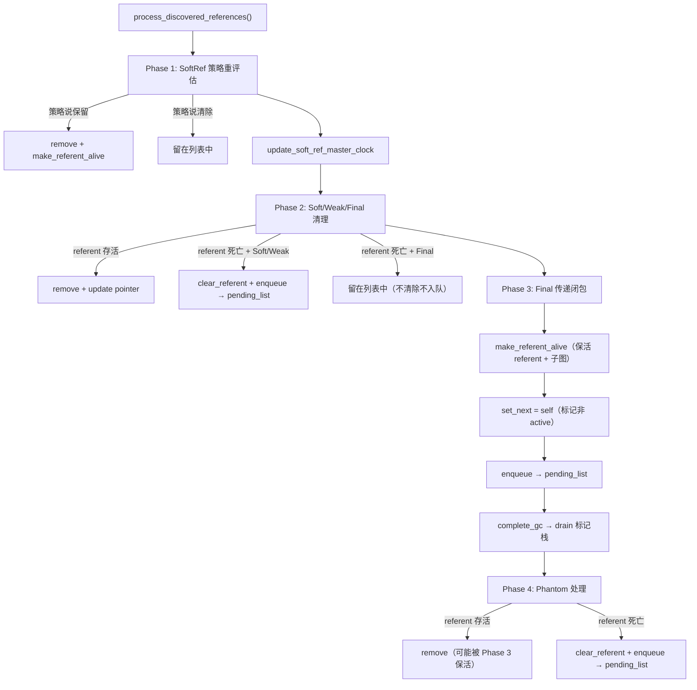

# #15 引用处理全链路（Reference Processing Full Chain）

> **前置问题**：
> 1. Java 有 Soft/Weak/Final/Phantom 四种引用类型，GC 如何知道一个对象"是引用对象"？
> 2. "引用发现"和"引用处理"为什么分成两个独立阶段？为什么不在标记时直接处理？
> 3. 软引用的清除策略和堆剩余空间有什么数学关系？
> 4. FinalReference 为什么需要特殊的"Phase 3 传递闭包"？为什么不能和 Weak 一样处理？
> 5. G1 为什么需要**两个** ReferenceProcessor 实例（`_ref_processor_stw` 和 `_ref_processor_cm`）？
> 6. 引用处理完成后，Reference 对象如何从 JVM 内部链表转入 Java 层的 `ReferenceQueue`？
> 7. `WeakProcessor` 处理的"弱根"和 `ReferenceProcessor` 处理的 `java.lang.ref.Reference` 有什么区别？

---

## 第 0 部分：核心原理 ⭐

### 0.1 本质是什么？

引用处理的本质是**GC 标记完成后，对四种特殊引用类型（Soft/Weak/Final/Phantom）按优先级依次决定"清除还是保留"**：Soft 引用根据堆压力决定（`clock - timestamp > free_heap * ms_per_mb`）；Weak 引用只要 referent 不可达就清除；Final 引用触发 `finalize()` 方法（需要特殊的传递闭包）；Phantom 引用在 referent 被回收后通知 `ReferenceQueue`。

### 0.2 为什么需要？

普通 GC 标记只区分"可达"和"不可达"，但 Java 的四种引用类型需要更细粒度的控制：Soft 引用在内存充足时保留（缓存场景），Weak 引用不阻止回收（WeakHashMap），Final 引用需要在回收前执行 `finalize()`，Phantom 引用需要在回收后通知。这些语义无法用普通标记表达，需要专门的引用处理阶段。

### 0.3 怎么解决？

**两阶段处理**：
- **发现阶段（标记期间）**：`ReferenceProcessor::discover_reference()` 在标记时拦截 Reference 对象，将其加入对应类型的发现链表（`_discoveredSoftRefs`/`_discoveredWeakRefs`/`_discoveredFinalRefs`/`_discoveredPhantomRefs`）
- **处理阶段（标记完成后）**：`ReferenceProcessor::process_discovered_references()` 按 Soft→Weak→Final→Phantom 顺序处理：检查 referent 是否存活，决定清除还是保留，将需要通知的 Reference 加入 `ReferenceQueue`

### 0.4 为什么这样设计？

- **为什么发现和处理分两个阶段？** 发现阶段在标记期间，此时还不知道哪些对象最终存活；处理阶段在标记完成后，此时可以精确判断 referent 是否存活；如果在标记时直接处理，可能错误地清除仍被其他路径引用的对象
- **为什么 G1 需要两个 ReferenceProcessor？** `_ref_processor_stw` 用于 Young/Mixed GC（STW 阶段），`_ref_processor_cm` 用于并发标记（Remark 阶段）；两个阶段的"存活"判断标准不同（STW 用 `_in_cset_fast_test`，CM 用 `_next_mark_bitmap`），需要不同的 `IsAliveClosure`
- **为什么 FinalReference 需要传递闭包（Phase 3）？** `finalize()` 方法可能让对象"复活"（将 `this` 赋给静态变量），复活的对象引用的其他对象也必须存活；传递闭包重新标记 finalizable 对象的引用图，确保不漏标
- **为什么 Soft 引用的清除策略与堆剩余空间相关？** Soft 引用的语义是"内存充足时保留，内存紧张时清除"；`clock - timestamp > free_heap * ms_per_mb` 量化了"内存紧张"：free_heap 越小，允许的 timestamp 越新，越容易清除

---

## 一、宏观理解：引用处理的两个阶段

引用处理分为**发现（Discovery）**和**处理（Processing）**两个独立阶段：

| 阶段 | 时机 | 执行者 | 核心逻辑 |
|------|------|--------|---------|
| **发现** | GC 标记阶段（并发或 STW） | GC worker 线程 | 遍历堆时遇到 `java.lang.ref.Reference` 子类，如果 referent 未被标记为存活，加入 `DiscoveredList` |
| **处理** | STW 暂停内（标记完成后） | GC worker 线程 | 遍历 `DiscoveredList`，按引用类型分 4 个 Phase 处理：策略评估 → 清理入队 → Final 传递闭包 → Phantom 清理入队 |

> **为什么分离？** 标记阶段只知道"referent 当前未被标记"，但标记还没结束——referent 可能稍后被标记为存活。只有标记完成后，才能做最终决策。发现阶段是"候选"，处理阶段是"定论"。

### 涉及的源码文件

| 文件 | 行数 | 职责 |
|------|------|------|
| `referenceProcessor.hpp` | 699 | ReferenceProcessor + DiscoveredList + DiscoveredListIterator 类定义 |
| `referenceProcessor.cpp` | 1392 | 发现逻辑 + 4 Phase 处理逻辑 + 队列均衡 |
| `referenceProcessor.inline.hpp` | 72 | DiscoveredList/Iterator 内联实现 |
| `referencePolicy.hpp/cpp` | 84/87 | 软引用清除策略（LRUCurrentHeap / LRUMaxHeap / AlwaysClear） |
| `referenceProcessorPhaseTimes.hpp` | 171 | 引用处理时间统计 |
| `referenceDiscoverer.hpp` | 37 | 发现器抽象接口 |
| `instanceRefKlass.inline.hpp` | 193 | oop 迭代时触发引用发现 |
| `weakProcessor.hpp/cpp` | 46/47 | JVM 内部弱根处理（JNI weak、VM weak storage 等） |
| `g1CollectedHeap.cpp` | - | G1 集成：创建 RP、启用发现、调用处理 |
| `g1ConcurrentMark.cpp` | - | 并发标记 Remark 阶段引用处理 |
| `g1FullGCReferenceProcessorExecutor.cpp` | 104 | Full GC 引用处理 |

---

## 二、Java 引用类型回顾

```
java.lang.ref.Reference<T>          // 抽象基类
├── SoftReference<T>                 // REF_SOFT: 内存不足时清除
├── WeakReference<T>                 // REF_WEAK: 下次 GC 清除
├── FinalReference<T>                // REF_FINAL: 支持 finalize() 的内部类
└── PhantomReference<T>              // REF_PHANTOM: 最弱，只用于追踪回收
```

> **源码**: `referenceType.hpp`

```cpp
enum ReferenceType {
    REF_NONE,      // 普通类
    REF_OTHER,     // Reference 子类但不是以下四种
    REF_SOFT,      // SoftReference
    REF_WEAK,      // WeakReference
    REF_FINAL,     // FinalReference
    REF_PHANTOM    // PhantomReference
};
```

**Reference 对象的内部字段**（`java.lang.ref.Reference`）：

| 字段 | 含义 |
|------|------|
| `referent` | 指向被引用的目标对象 |
| `next` | 入队后指向队列中下一个 Reference（未入队时为 NULL） |
| `discovered` | GC 内部使用：在 DiscoveredList 中指向链表下一个节点 |
| `queue` | 关联的 ReferenceQueue（可选） |

> **关键洞察**：`discovered` 字段被 GC "借用"来构建发现链表。这是一个典型的**空间复用**设计——不需要额外的链表节点结构，直接利用 Reference 对象自身的字段。

---

## 三、ReferenceProcessor 数据结构

> **源码**: `referenceProcessor.hpp:167-466` + `referenceProcessor.cpp:96-135`

### 3.1 核心字段

```cpp
class ReferenceProcessor : public ReferenceDiscoverer {
    // ★ 发现链表数组 — 核心数据结构
    DiscoveredList* _discovered_refs;        // 主数组（C堆分配）
    DiscoveredList* _discoveredSoftRefs;     // → &_discovered_refs[0]
    DiscoveredList* _discoveredWeakRefs;     // → &_discovered_refs[_max_num_queues]
    DiscoveredList* _discoveredFinalRefs;    // → &_discovered_refs[2*_max_num_queues]
    DiscoveredList* _discoveredPhantomRefs;  // → &_discovered_refs[3*_max_num_queues]

    // 并行度
    uint _num_queues;      // 当前活跃队列数（= 处理线程数）
    uint _max_num_queues;  // 最大队列数（= max(discovery_degree, processing_degree)）

    // 发现控制
    bool _discovering_refs;     // 是否正在发现中
    bool _discovery_is_atomic;  // 发现是否原子（STW=true, 并发标记=false）
    bool _discovery_is_mt;      // 发现是否多线程

    // 处理控制
    bool _processing_is_mt;     // 处理是否多线程
    uint _next_id;              // 串行发现时的 round-robin 计数器

    // 存活性判断
    BoolObjectClosure* _is_alive_non_header;       // 非标头存活判断
    BoolObjectClosure* _is_subject_to_discovery;   // 是否受此 RP 管辖

    // 软引用策略
    static ReferencePolicy* _default_soft_ref_policy;       // 默认策略
    static ReferencePolicy* _always_clear_soft_ref_policy;  // 全清策略
    ReferencePolicy*        _current_soft_ref_policy;       // 当前策略

    // 软引用时钟
    static jlong _soft_ref_timestamp_clock;
};
```

### 3.2 DiscoveredList 内存布局

```
_discovered_refs 数组（_max_num_queues × 4 个 DiscoveredList）:
┌──────────────┬──────────────┬──────────────┬──────────────┐
│ SoftRef[0]   │ SoftRef[1]   │ ... │ SoftRef[N-1] │ ← _discoveredSoftRefs
├──────────────┼──────────────┼─────┼──────────────┤
│ WeakRef[0]   │ WeakRef[1]   │ ... │ WeakRef[N-1] │ ← _discoveredWeakRefs
├──────────────┼──────────────┼─────┼──────────────┤
│ FinalRef[0]  │ FinalRef[1]  │ ... │ FinalRef[N-1]│ ← _discoveredFinalRefs
├──────────────┼──────────────┼─────┼──────────────┤
│ PhantomRef[0]│ PhantomRef[1]│ ... │ PhantomRef[N-1]│ ← _discoveredPhantomRefs
└──────────────┴──────────────┴─────┴──────────────┘

N = _max_num_queues（= MAX2(ParallelGCThreads, ConcGCThreads) for CM RP）

每个 DiscoveredList (sizeof=24):
┌────────────────┬───────────────────┬──────────┐
│ _oop_head (8B) │ _compressed_head  │ _len (8B)│
│                │     (4B + pad)    │          │
└────────────────┴───────────────────┴──────────┘
```

### 3.3 发现链表的链接方式

```
DiscoveredList._head → Ref_A → Ref_B → Ref_C → (Ref_C) ← 尾节点自指
                        │        │        │
                        │discovered│discovered│discovered→自己
```

> **链表终止条件**：最后一个节点的 `discovered` 字段指向自身（自环），而非 NULL。这样 `DiscoveredListIterator::move_to_next()` 可以区分"到达末尾"（`_current == _next`）和"NULL referent"。

---

## 四、引用发现（Discovery）

### 4.1 触发入口：`InstanceRefKlass::oop_oop_iterate`

> **源码**: `instanceRefKlass.inline.hpp:64-89`

当 GC 遍历堆对象时，遇到 `Reference` 子类的实例会调用 `InstanceRefKlass::oop_oop_iterate`。关键路径：

```
oop_oop_iterate()
  → oop_oop_iterate_ref_processing()
    → reference_iteration_mode == DO_DISCOVERY?
      → oop_oop_iterate_discovery()
        → try_discover()
```

```cpp
// instanceRefKlass.inline.hpp:64-77
template <typename T, class OopClosureType>
bool InstanceRefKlass::try_discover(oop obj, ReferenceType type, OopClosureType* closure) {
    ReferenceDiscoverer* rd = closure->ref_discoverer();  // ① 获取关联的 ReferenceProcessor
    if (rd != NULL) {
        oop referent = load_referent(obj, type);          // ② 加载 referent
        if (referent != NULL) {
            if (!referent->is_gc_marked()) {              // ③ referent 未被标记？
                return rd->discover_reference(obj, type); // ④ 尝试发现
            }
        }
    }
    return false;
}
```

> **三个前提条件**：
> 1. Closure 绑定了 ReferenceDiscoverer（即 ReferenceProcessor）
> 2. referent 不为 NULL（已被用户清除的不处理）
> 3. referent **尚未被 GC 标记为存活**
>
> 如果 `try_discover` 返回 true，**不再**对 referent 字段应用闭包（即不标记 referent 为存活），这就是"软/弱引用不阻止 referent 被回收"的实现本质。

### 4.2 discover_reference() 逐行分析

> **源码**: `referenceProcessor.cpp:1099-1206`

```cpp
bool ReferenceProcessor::discover_reference(oop obj, ReferenceType rt) {
    // 检查 1: 发现是否启用
    if (!_discovering_refs || !RegisterReferences) return false;

    // 检查 2: FinalReference 特殊处理
    if ((rt == REF_FINAL) && (java_lang_ref_Reference::next(obj) != NULL))
        return false;  // next != NULL 说明已经不是 active 状态（已入队或已处理）

    // 检查 3: ReferenceBasedDiscovery — Reference 对象本身必须在收集范围内
    if (RefDiscoveryPolicy == ReferenceBasedDiscovery && !is_subject_to_discovery(obj))
        return false;

    // 检查 4: referent 是否已知存活（通过 _is_alive_non_header）
    if (is_alive_non_header() != NULL) {
        if (is_alive_non_header()->do_object_b(java_lang_ref_Reference::referent(obj)))
            return false;  // referent 已存活，不需要发现
    }

    // 检查 5: 软引用可提前过滤（策略允许保留就不发现）
    if (rt == REF_SOFT) {
        if (!_current_soft_ref_policy->should_clear_reference(obj, _soft_ref_timestamp_clock))
            return false;  // 策略说不清除 → 不发现，当做强引用处理
    }

    // 检查 6: discovered 字段不为 NULL → 已被发现
    HeapWord* const discovered_addr = java_lang_ref_Reference::discovered_addr_raw(obj);
    const oop discovered = java_lang_ref_Reference::discovered(obj);
    if (discovered != NULL) {
        // 并发 GC（G1）可能重复发现同一个 Reference
        return (RefDiscoveryPolicy == ReferenceBasedDiscovery); // G1 返回 true 表示"已发现"
    }

    // ★ 确定放入哪个队列
    DiscoveredList* list = get_discovered_list(rt);

    // ★ 加入链表
    if (_discovery_is_mt) {
        add_to_discovered_list_mt(*list, obj, discovered_addr);  // CAS 竞争
    } else {
        oop current_head = list->head();
        oop next_discovered = (current_head != NULL) ? current_head : obj;  // 尾节点自指
        RawAccess<>::oop_store(discovered_addr, next_discovered);  // 头插法
        list->set_head(obj);
        list->inc_length(1);
    }
    return true;
}
```

### 4.3 多线程发现 vs 串行发现

| 模式 | `_discovery_is_mt` | 队列选择 | 同步机制 |
|------|-------------------|---------|---------|
| **多线程** | true | `Thread::current()->as_Worker_thread()->id()` → 每线程一个队列 | CAS 竞争 `discovered` 字段 |
| **串行** | false | round-robin（`next_id()`）分配到不同队列 | 无竞争 |

> **多线程发现（CAS 竞争）**：
> ```cpp
> // referenceProcessor.cpp:1025-1053
> void add_to_discovered_list_mt(DiscoveredList& refs_list, oop obj, HeapWord* discovered_addr) {
>     oop current_head = refs_list.head();
>     oop next_discovered = (current_head != NULL) ? current_head : obj;
>     // CAS: 将 discovered 从 NULL → next_discovered
>     oop retest = HeapAccess<AS_NO_KEEPALIVE>::oop_atomic_cmpxchg(next_discovered, discovered_addr, oop(NULL));
>     if (retest == NULL) {
>         // 赢得竞争，更新链表头
>         refs_list.set_head(obj);
>         refs_list.inc_length(1);
>     }
>     // 否则说明另一个线程已发现此 Reference，跳过
> }
> ```
>
> **CAS 在 `discovered` 字段上**——如果两个线程同时发现同一个 Reference 对象，只有一个线程的 CAS 成功。这确保每个 Reference 只被发现一次。

### 4.4 G1 的两个 ReferenceProcessor

> **源码**: `g1CollectedHeap.cpp:2526-2548`

G1 创建两个独立的 ReferenceProcessor：

```cpp
// 并发标记 RP
_ref_processor_cm = new ReferenceProcessor(
    &_is_subject_to_discovery_cm,     // 判断是否属于此 RP 的管辖
    mt_processing,                     // ParallelRefProcEnabled && ParallelGCThreads > 1
    ParallelGCThreads,                 // 处理并行度
    (ParallelGCThreads > 1) || (ConcGCThreads > 1),  // 发现多线程
    MAX2(ParallelGCThreads, ConcGCThreads),           // 发现并行度
    false,                             // ★ 非原子发现（并发标记期间 mutator 可能修改 referent）
    &_is_alive_closure_cm,             // 存活判断：基于并发标记位图
    true);                             // 允许动态调整线程数

// STW RP
_ref_processor_stw = new ReferenceProcessor(
    &_is_subject_to_discovery_stw,
    mt_processing,
    ParallelGCThreads,
    (ParallelGCThreads > 1),           // 发现多线程
    ParallelGCThreads,                 // 发现并行度
    true,                              // ★ 原子发现（STW 期间 mutator 已暂停）
    &_is_alive_closure_stw,            // 存活判断：STW 方式
    true);
```

| 配置项 | `_ref_processor_cm` | `_ref_processor_stw` |
|--------|--------------------|--------------------|
| **使用场景** | 并发标记周期 | Young/Mixed GC, Full GC |
| **atomic_discovery** | false | true |
| **is_alive** | 并发标记位图 | STW 存活判断 |
| **discovery 并行度** | MAX2(ParallelGCThreads, ConcGCThreads) | ParallelGCThreads |

> **为什么需要两个？** 因为并发标记的发现是**非原子的**（mutator 可能在 GC 发现之后清除 referent），而 STW 暂停中的发现是**原子的**（没有 mutator 干扰）。两者的存活判断、管辖范围、同步要求都不同，共用一个 RP 会导致配置冲突。

### 4.5 发现时机切换

```
┌──────────────────────────────────────────────────────────────────────┐
│ 并发标记阶段：_ref_processor_cm 启用发现                              │
│   - Initial Mark: cm RP 发现启用（_discovering_refs = true）          │
│   - 并发标记期间: cm RP 持续发现                                      │
│   - Remark STW: cm RP 处理已发现的引用 + 禁用发现                     │
│                                                                      │
│ 年轻代/混合暂停：stw RP 启用发现                                      │
│   - 暂停开始: stw RP 启用发现, cm RP 临时禁用                        │
│     ↓ NoRefDiscovery no_cm_discovery(_ref_processor_cm);             │
│   - evacuate_collection_set: stw RP 发现引用（PSS 绑定 stw RP）      │
│   - 暂停内: stw RP 处理已发现的引用 + 禁用发现                        │
│   - 暂停结束: cm RP 恢复之前的发现状态                                │
│                                                                      │
│ Full GC：stw RP 启用发现                                              │
│   - 开始: cm RP 禁用 + 清空发现列表, stw RP 启用发现                  │
│   - Phase 1 Mark: stw RP 发现引用                                    │
│   - Phase 1 后: stw RP 处理已发现的引用                               │
└──────────────────────────────────────────────────────────────────────┘
```

---

## 五、引用处理四阶段（Processing）

> **源码**: `referenceProcessor.cpp:201-260`

### 5.1 总入口：process_discovered_references()

```cpp
ReferenceProcessorStats ReferenceProcessor::process_discovered_references(
    BoolObjectClosure* is_alive, OopClosure* keep_alive,
    VoidClosure* complete_gc, AbstractRefProcTaskExecutor* task_executor,
    ReferenceProcessorPhaseTimes* phase_times) {

    disable_discovery();  // ① 处理前关闭发现（防止处理过程中新增引用）

    _soft_ref_timestamp_clock = java_lang_ref_SoftReference::clock();

    // 统计
    ReferenceProcessorStats stats(
        total_count(_discoveredSoftRefs), total_count(_discoveredWeakRefs),
        total_count(_discoveredFinalRefs), total_count(_discoveredPhantomRefs));

    // ★ Phase 1: 软引用策略重评估
    process_soft_ref_reconsider(is_alive, keep_alive, complete_gc, task_executor, phase_times);

    update_soft_ref_master_clock();  // 更新软引用时间戳

    // ★ Phase 2: 清理 Soft/Weak/Final 中的存活引用 + 入队非 Final
    process_soft_weak_final_refs(is_alive, keep_alive, complete_gc, task_executor, phase_times);

    // ★ Phase 3: FinalReference 传递闭包 + 入队
    process_final_keep_alive(keep_alive, complete_gc, task_executor, phase_times);

    // ★ Phase 4: PhantomReference 处理
    process_phantom_refs(is_alive, keep_alive, complete_gc, task_executor, phase_times);

    return stats;
}
```

**四个闭包参数的含义**：

| 参数 | 类型 | 功能 |
|------|------|------|
| `is_alive` | `BoolObjectClosure` | 判断 referent 是否存活 |
| `keep_alive` | `OopClosure` | 标记 referent 为存活（+ 复制到新位置） |
| `complete_gc` | `VoidClosure` | 完成传递闭包（drain 标记栈） |
| `task_executor` | `AbstractRefProcTaskExecutor` | 并行执行器（G1 提供 GC worker 线程） |

### 5.2 Phase 1：软引用策略重评估

> **源码**: `referenceProcessor.cpp:341-370` + `778-819`
>
> **解决的问题**：发现阶段可能过于激进——有些软引用的 referent 虽然未被标记，但策略认为应该保留。Phase 1 "挽救"这些引用。

```cpp
size_t process_soft_ref_reconsider_work(DiscoveredList& refs_list,
                                        ReferencePolicy* policy,
                                        BoolObjectClosure* is_alive,
                                        OopClosure* keep_alive,
                                        VoidClosure* complete_gc) {
    DiscoveredListIterator iter(refs_list, keep_alive, is_alive);
    while (iter.has_next()) {
        iter.load_ptrs(...);
        bool referent_is_dead = (iter.referent() != NULL) && !iter.is_referent_alive();
        if (referent_is_dead &&
            !policy->should_clear_reference(iter.obj(), _soft_ref_timestamp_clock)) {
            // ★ 策略说不清除 → 从发现列表移除 + 保活 referent
            iter.remove();
            iter.make_referent_alive();  // 标记 referent 为存活
            iter.move_to_next();
        } else {
            iter.next();  // 留在列表中，交给 Phase 2 处理
        }
    }
    complete_gc->do_void();  // drain 标记栈（make_referent_alive 可能产生新标记）
}
```

> **只有 SoftReference 有 Phase 1**。Weak/Final/Phantom 没有"策略评估"概念——它们要么清除要么不清除，没有中间状态。

### 5.3 Phase 2：清理 Soft/Weak/Final 中的存活引用

> **源码**: `referenceProcessor.cpp:372-415` + `822-897`
>
> **解决的问题**：标记结束了，现在可以做最终判定。遍历所有剩余的 Soft/Weak/Final 引用，清理掉 referent 已存活的，对 referent 已死的执行清除+入队。

```cpp
size_t process_soft_weak_final_refs_work(DiscoveredList& refs_list,
                                         BoolObjectClosure* is_alive,
                                         OopClosure* keep_alive,
                                         bool do_enqueue_and_clear) {
    DiscoveredListIterator iter(refs_list, keep_alive, is_alive);
    while (iter.has_next()) {
        iter.load_ptrs(...);
        if (iter.referent() == NULL) {
            // referent 被 mutator 并发清除（仅非原子发现可能）→ 移除
            iter.remove();
            iter.move_to_next();
        } else if (iter.is_referent_alive()) {
            // ★ referent 存活 → 不需要处理，移除并更新 referent 指针（可能被 GC 移动）
            iter.remove();
            iter.make_referent_alive();  // 更新指针（不会触发递归标记，因为已标记）
            iter.move_to_next();
        } else {
            // ★ referent 已死 → 清除 referent + 入队（仅 Soft/Weak，Final 不在此入队）
            if (do_enqueue_and_clear) {
                iter.clear_referent();   // referent = NULL
                iter.enqueue();          // discovered → 链入 pending list 链
            }
            iter.next();  // 保留在列表中
        }
    }
    if (do_enqueue_and_clear) {
        iter.complete_enqueue();  // ★ 将整个链表接入 Universe::_reference_pending_list
        refs_list.clear();
    }
}
```

**Phase 2 对三种引用的处理差异**：

| 引用类型 | `do_enqueue_and_clear` | 行为 |
|---------|----------------------|------|
| SoftReference | **true** | 清除 referent + 入队 pending list |
| WeakReference | **true** | 清除 referent + 入队 pending list |
| FinalReference | **false** | 只移除存活的，不清除不入队（留给 Phase 3） |

> **为什么 FinalReference 不在 Phase 2 入队？** 因为 FinalReference 的 referent 需要在 Phase 3 中被**保活**（finalizer 需要访问对象）。如果在 Phase 2 就清除 referent，finalizer 就拿不到对象了。

### 5.4 Phase 3：FinalReference 传递闭包

> **源码**: `referenceProcessor.cpp:417-441` + `899-934`
>
> **解决的问题**：Phase 2 确认 FinalReference 的 referent 已死，但 `finalize()` 方法需要访问这个对象。必须将 referent **及其整个可达子图**保活。

```cpp
size_t process_final_keep_alive_work(DiscoveredList& refs_list,
                                     OopClosure* keep_alive,
                                     VoidClosure* complete_gc) {
    DiscoveredListIterator iter(refs_list, keep_alive, NULL);  // 注意 is_alive = NULL
    while (iter.has_next()) {
        iter.load_ptrs(...);
        // ★ 保活 referent 及其所有可达对象
        iter.make_referent_alive();  // 标记 referent → 可能触发标记栈中新增对象

        // ★ 设置 next = self，标记 FinalReference 不再 active
        java_lang_ref_Reference::set_next_raw(iter.obj(), iter.obj());

        // ★ 入队
        iter.enqueue();
        iter.next();
    }
    iter.complete_enqueue();
    complete_gc->do_void();  // ★ 关键：drain 标记栈，完成传递闭包
    refs_list.clear();
}
```

> **为什么 Phase 3 需要 `complete_gc`？** `make_referent_alive()` 标记 referent，但 referent 可能引用其他对象。必须通过 `complete_gc->do_void()` drain 标记栈，确保 referent 的整个可达子图都被标记为存活。这就是"传递闭包"。
>
> 这也是为什么 Phase 1 和 Phase 3 使用 **`marks_oops_alive = true`**（`RefProcPhase1Task`/`RefProcPhase3Task`），而 Phase 2 和 Phase 4 使用 `false`——只有 Phase 1/3 会新增存活对象。

### 5.5 Phase 4：PhantomReference 处理

> **源码**: `referenceProcessor.cpp:443-471` + `937-978`
>
> **解决的问题**：Phantom 引用的 referent 不需要保活（JDK 9+ 中 `PhantomReference.get()` 总返回 null），只需清除并入队通知。

```cpp
size_t process_phantom_refs_work(DiscoveredList& refs_list,
                                 BoolObjectClosure* is_alive,
                                 OopClosure* keep_alive,
                                 VoidClosure* complete_gc) {
    DiscoveredListIterator iter(refs_list, keep_alive, is_alive);
    while (iter.has_next()) {
        iter.load_ptrs(...);
        oop const referent = iter.referent();
        if (referent == NULL || iter.is_referent_alive()) {
            // referent 存活或已清除 → 移除（不入队）
            iter.make_referent_alive();  // 更新指针
            iter.remove();
            iter.move_to_next();
        } else {
            // ★ referent 已死 → 清除 + 入队
            iter.clear_referent();
            iter.enqueue();
            iter.next();
        }
    }
    iter.complete_enqueue();
    complete_gc->do_void();
    refs_list.clear();
}
```

> **Phantom 为什么排在最后？** Phantom 引用的语义是"在对象被 finalize 之后、被回收之前"通知。Phase 3 的 FinalReference 传递闭包可能让某些 PhantomReference 的 referent 变为存活（finalizer 可达），所以 Phantom 必须在 Final 之后处理。

### 5.6 四阶段总结流程图



---

## 六、入队机制：从 JVM 到 Java

### 6.1 enqueue() 和 complete_enqueue()

> **源码**: `referenceProcessor.cpp:307-321`

```cpp
// 遍历过程中：设置 discovered 字段构成链表
void DiscoveredListIterator::enqueue() {
    HeapAccess<AS_NO_KEEPALIVE>::oop_store_at(
        _current_discovered, java_lang_ref_Reference::discovered_offset, _next_discovered);
}

// 链表遍历完成后：接入全局 pending list
void DiscoveredListIterator::complete_enqueue() {
    if (_prev_discovered != NULL) {
        // ★ 原子交换：将 refs_list.head() 接入 Universe::_reference_pending_list
        oop old = Universe::swap_reference_pending_list(_refs_list.head());
        // 最后一个节点的 discovered 指向之前的 pending list 头
        HeapAccess<AS_NO_KEEPALIVE>::oop_store_at(
            _prev_discovered, java_lang_ref_Reference::discovered_offset, old);
    }
}
```

```
入队前:
Universe::_reference_pending_list → [existing_chain...]

refs_list:  head → Ref_A → Ref_B → Ref_C（最后一个）

入队后:
Universe::_reference_pending_list → Ref_A → Ref_B → Ref_C → [existing_chain...]
                                     ↑ head                    ↑ old pending list
```

### 6.2 从 pending list 到 ReferenceQueue

```
JVM 内部：                          Java 层：
Universe::_reference_pending_list   Reference.pending (静态字段)
         │                                   │
         │ 同一个 oop 对象                    │ 同一个 oop 对象
         ↓                                   ↓
     Ref_A → Ref_B → ...              ReferenceHandler 线程
                                       │
                                       ↓ 循环取出 pending
                                      queue.enqueue(ref)
                                       │
                                       ↓
                                    ReferenceQueue.poll() / remove()
                                    （用户代码获取通知）
```

> **JVM 参数**：`-Xlog:gc,ref=debug` 可查看引用处理详情：
> ```
> [debug][gc,ref ] Skipped phase1 of Reference Processing due to unavailable references
> [debug][gc,ref ] Skipped phase3 of Reference Processing due to unavailable references
> [info ][gc,ref ] Reference Processing: 0.123ms
> ```

### 6.3 make_pending_list_reachable()

> **源码**: `g1CollectedHeap.cpp:4749-4757`

```cpp
void G1CollectedHeap::make_pending_list_reachable() {
    if (collector_state()->in_initial_mark_gc()) {
        oop pll_head = Universe::reference_pending_list();
        if (pll_head != NULL) {
            _cm->mark_in_next_bitmap(0, pll_head);
        }
    }
}
```

> **为什么只在 Initial Mark 时？** Initial Mark 是并发标记的起点。如果 pending list 的头节点没有在 next_bitmap 中标记，并发标记就不会遍历到它，导致 pending list 中的 Reference 对象被错误回收。

---

## 七、软引用清除策略

> **源码**: `referencePolicy.hpp/cpp`

### 7.1 两种默认策略

| 策略 | 选择条件 | 公式 |
|------|---------|------|
| `LRUMaxHeapPolicy` | Server VM（默认） | `_max_interval = (MaxHeapSize - 上次GC后已用) / M × SoftRefLRUPolicyMSPerMB` |
| `LRUCurrentHeapPolicy` | Client VM | `_max_interval = (上次GC后空闲堆) / M × SoftRefLRUPolicyMSPerMB` |
| `AlwaysClearPolicy` | Full GC 时使用 | 总是清除 |

### 7.2 LRUMaxHeapPolicy 详解

```cpp
// referencePolicy.cpp:64-70
void LRUMaxHeapPolicy::setup() {
    size_t max_heap = MaxHeapSize;                        // 8GB
    max_heap -= Universe::get_heap_used_at_last_gc();     // 减去上次 GC 后已用
    max_heap /= M;                                        // 转为 MB
    _max_interval = max_heap * SoftRefLRUPolicyMSPerMB;   // × 每MB毫秒数
}
```

**标准环境计算示例**（`-Xmx8g`，上次 GC 后已用 2GB）：
```
max_heap = 8192 - 2048 = 6144 MB
SoftRefLRUPolicyMSPerMB = 1000 (默认)
_max_interval = 6144 × 1000 = 6,144,000 ms ≈ 102 分钟
```

> **含义**：如果软引用在最近 102 分钟内被访问过（`timestamp_clock - SoftReference.timestamp ≤ _max_interval`），就保留；否则清除。
>
> **堆越满，保留时间越短**——堆只剩 100MB 时，`_max_interval = 100,000ms ≈ 1.7分钟`。

```cpp
// referencePolicy.cpp:75-85
bool LRUMaxHeapPolicy::should_clear_reference(oop p, jlong timestamp_clock) {
    jlong interval = timestamp_clock - java_lang_ref_SoftReference::timestamp(p);
    if (interval <= _max_interval) {
        return false;  // 最近访问过，保留
    }
    return true;       // 长时间未访问，清除
}
```

> **JVM 参数**：`-XX:SoftRefLRUPolicyMSPerMB=N`（默认 1000）。设为 0 表示立即清除所有软引用（等同于弱引用行为）。

### 7.3 策略选择时机

```cpp
// referenceProcessor.hpp:314-319
ReferencePolicy* setup_policy(bool always_clear) {
    _current_soft_ref_policy = always_clear ?
        _always_clear_soft_ref_policy : _default_soft_ref_policy;
    _current_soft_ref_policy->setup();  // 快照当前堆状态
    return _current_soft_ref_policy;
}
```

| 场景 | `always_clear` | 使用策略 |
|------|---------------|---------|
| Young/Mixed GC | `false` | `LRUMaxHeapPolicy` |
| Full GC | `true`（通过 `_clear_all_soft_refs`） | `AlwaysClearPolicy` |
| System.gc() | 取决于 `SoftRefPolicy::should_clear_all_soft_refs()` | 可能是 `AlwaysClearPolicy` |

---

## 八、队列均衡（Balance Queues）

> **源码**: `referenceProcessor.cpp:661-772`

### 8.1 为什么需要均衡？

多线程发现时，每个 GC worker 往自己的队列里加引用。不同线程发现的引用数量可能差异很大（取决于哪个线程扫描了哪些 region）。如果不均衡，处理阶段某些 worker 很忙而其他 worker 空闲。

另外，`_num_queues`（处理线程数）可能小于 `_max_num_queues`（发现线程数）。超出 `_num_queues` 范围的队列不会被处理——**必须**将其内容迁移到前 `_num_queues` 个队列。

### 8.2 均衡算法

```cpp
void ReferenceProcessor::balance_queues(DiscoveredList ref_lists[]) {
    size_t total_refs = 0;
    for (uint i = 0; i < _max_num_queues; ++i) total_refs += ref_lists[i].length();
    size_t avg_refs = total_refs / _num_queues + 1;  // 平均值（向上取整）

    uint to_idx = 0;
    for (uint from_idx = 0; from_idx < _max_num_queues; from_idx++) {
        bool move_all = (from_idx >= _num_queues) && (ref_lists[from_idx].length() > 0);
        while ((ref_lists[from_idx].length() > avg_refs) || move_all) {
            if (ref_lists[to_idx].length() < avg_refs) {
                size_t refs_to_move = ...;  // 计算移动数量
                // 通过遍历 discovered 链找到分割点，头插法迁移
            } else {
                to_idx = (to_idx + 1) % _num_queues;
            }
        }
    }
}
```

> **每个 Phase 开始前都可能均衡**：`maybe_balance_queues()` 在 Phase 1-4 的入口都会调用（如果 `_processing_is_mt && ParallelRefProcBalancingEnabled`）。

---

## 九、G1 集成点

### 9.1 Young/Mixed GC 中的引用处理

> **源码**: `g1CollectedHeap.cpp:4682-4747`

```
do_collection_pause_at_safepoint()
  → evacuate_collection_set()
    → G1ParTask → PSS 绑定 _ref_processor_stw
    → 疏散过程中: InstanceRefKlass::try_discover() → discover_reference()
  → process_discovered_references(per_thread_states)
    → _ref_processor_stw->process_discovered_references(...)
  → make_pending_list_reachable()
  → WeakProcessor::weak_oops_do(...)
```

**关键闭包**：

| 闭包 | 类 | 行为 |
|------|----|----|
| `is_alive` | `G1STWIsAliveClosure` | 对象在 CSet 外 → 存活 |
| `keep_alive` | `G1CopyingKeepAliveClosure` | 复制对象到 survivor/old |
| `complete_gc` | `G1STWDrainQueueClosure` | drain PSS 队列完成传递闭包 |

### 9.2 并发标记 Remark 中的引用处理

> **源码**: `g1ConcurrentMark.cpp:1670-1768`

```
G1ConcurrentMark::remark()
  → process_discovered_references(&g1_is_alive, &g1_keep_alive, &g1_drain_mark_stack, executor, &pt)
  → WeakProcessor::weak_oops_do(&g1_is_alive, &do_nothing_cl)
```

**关键闭包**：

| 闭包 | 类 | 行为 |
|------|----|----|
| `is_alive` | `G1CMIsAliveClosure` | 在 next 位图中标记 → 存活 |
| `keep_alive` | `G1CMKeepAliveAndDrainClosure` | 标记对象 + drain 本地标记栈 |
| `complete_gc` | `G1CMDrainMarkingStackClosure` | drain 全局标记栈 |

### 9.3 Full GC 中的引用处理

> **源码**: `g1FullGCReferenceProcessorExecutor.cpp:81-103`

```
G1FullCollector::phase1_mark_live_objects()
  → G1FullGCMarkTask → 标记存活对象
  → G1FullGCReferenceProcessingExecutor::execute()
    → _ref_processor_stw->process_discovered_references(...)
  → WeakProcessor::weak_oops_do(...)
```

> **Full GC 的特殊处理**：构造函数中替换 `_ref_processor_stw` 的两个闭包：
> - `_is_alive_mutator`：替换为基于并发标记位图的存活判断
> - `_is_subject_mutator`：替换为 `AlwaysTrueClosure`（全堆都是处理范围）

---

## 十、WeakProcessor：JVM 内部弱根

> **源码**: `weakProcessor.hpp`(46行) + `weakProcessor.cpp`(47行)

`WeakProcessor` 处理的不是 `java.lang.ref.Reference`，而是 **JVM 内部持有的弱引用容器**：

```cpp
void WeakProcessor::weak_oops_do(BoolObjectClosure* is_alive, OopClosure* keep_alive) {
    JNIHandles::weak_oops_do(is_alive, keep_alive);               // JNI 弱全局引用
    JvmtiExport::weak_oops_do(is_alive, keep_alive);              // JVMTI 弱引用
    SystemDictionary::vm_weak_oop_storage()->weak_oops_do(...);   // VM 弱 oop 存储
    JFR_ONLY(Jfr::weak_oops_do(is_alive, keep_alive);)           // JFR 弱引用
}
```

| 容器 | 内容 |
|------|------|
| `JNIHandles::weak_oops_do` | `NewWeakGlobalRef()` 创建的 JNI 弱全局引用 |
| `JvmtiExport::weak_oops_do` | JVMTI agent 创建的弱引用 |
| `SystemDictionary::vm_weak_oop_storage()` | VM 内部弱引用（如 interned strings 等） |
| `Jfr::weak_oops_do` | JFR（Java Flight Recorder）内部弱引用 |

> **ReferenceProcessor vs WeakProcessor**：
>
> | | ReferenceProcessor | WeakProcessor |
> |---|---|---|
> | 处理对象 | Java 层 `java.lang.ref.Reference` 子类 | JVM 内部弱引用容器 |
> | 有入队通知？ | 是（pending list → ReferenceQueue） | 否（直接清理） |
> | 有策略？ | 是（SoftReference 有 LRU 策略） | 否（is_alive 为 false 就清理） |
> | 发现阶段？ | 是 | 否（直接遍历已知容器） |

---

## 十一、并行处理线程度自适应

> **源码**: `referenceProcessor.cpp:1351-1391`

```cpp
class RefProcMTDegreeAdjuster : public StackObj {
    uint ergo_proc_thread_count(size_t ref_count, uint max_threads, RefProcPhases phase) const {
        if (use_max_threads(phase) || ReferencesPerThread == 0)
            return max_threads;
        size_t thread_count = 1 + (ref_count / ReferencesPerThread);  // 默认 1000 refs/thread
        return MIN3(thread_count, max_threads, os::active_processor_count());
    }

    bool use_max_threads(RefProcPhases phase) const {
        // Phase 1 和 Phase 3 总是用最大线程数
        return (phase == RefPhase1 || phase == RefPhase3);
    }
};
```

| Phase | 线程数策略 | 原因 |
|-------|----------|------|
| Phase 1 | 最大线程数 | make_referent_alive 可能触发大量传递标记 |
| Phase 2 | 按引用数量自适应 | 工作量与引用数量成正比 |
| Phase 3 | 最大线程数 | FinalReference 传递闭包可能触发大量标记 |
| Phase 4 | 按引用数量自适应 | 工作量与引用数量成正比 |

> **JVM 参数**：`-XX:ReferencesPerThread=N`（默认 1000），`-XX:+ParallelRefProcEnabled`（默认 false，JDK 11 需显式开启）。

---

## 十二、设计决策与深层思考

| 设计问题 | 解决方案 | 为什么 |
|---------|---------|-------|
| 如何知道对象是 Reference 子类？ | `InstanceRefKlass` 重写 `oop_oop_iterate` | 编译器自动在 klass 中记录 reference_type |
| 发现链表存哪？ | 复用 Reference 对象的 `discovered` 字段 | 零额外内存开销 |
| 链表终止如何表示？ | 尾节点 `discovered` 指向自身 | 区分"到末尾"和"NULL referent" |
| 多线程发现如何去重？ | CAS 竞争 `discovered` 字段 | NULL→非NULL 只能成功一次 |
| 软引用清除时机？ | LRU 策略 + 堆剩余空间 | 堆越满越积极清除 |
| Final 为什么不能和 Weak 一起处理？ | 需要保活 referent + 传递闭包 | finalizer 需要访问对象 |
| Phantom 为什么最后处理？ | Final 的传递闭包可能让 Phantom 的 referent 变存活 | 语义要求在 finalize 之后 |
| 入队如何实现？ | 原子交换 pending list 头 | 无锁接入全局 pending list |
| 两个 RP 实例？ | STW RP（原子发现）+ CM RP（非原子发现） | 并发/STW 的同步需求不同 |

> **更深的问题：引用处理的性能影响**
>
> 引用处理在 STW 暂停中执行，直接增加暂停时间。在引用密集型应用中（大量缓存使用 SoftReference），Phase 1 需要遍历所有软引用并评估策略，Phase 3 的传递闭包可能触发大范围标记。
>
> **优化建议**：
> 1. 开启 `-XX:+ParallelRefProcEnabled` 实现并行处理
> 2. 避免过度使用 SoftReference（改用 Guava Cache 等显式淘汰方案）
> 3. 如果 FinalReference 数量多（大量覆写 `finalize()` 的类），考虑迁移到 `Cleaner` API
> 4. 监控 GC 日志中的 `Ref Proc` 时间

---

## 十三、JVM 参数与日志

### 引用处理相关参数

| 参数 | 默认值 | 含义 |
|------|--------|------|
| `-XX:+ParallelRefProcEnabled` | false (JDK 11) | 启用并行引用处理 |
| `-XX:ReferencesPerThread=N` | 1000 | 每个线程处理的引用数（用于自适应线程数） |
| `-XX:SoftRefLRUPolicyMSPerMB=N` | 1000 | 软引用 LRU 策略：每MB空闲堆对应的保留毫秒数 |
| `-XX:+ParallelRefProcBalancingEnabled` | true | 启用引用队列均衡 |

### 日志标签

```bash
-Xlog:gc,ref=debug                # 引用处理概要
-Xlog:gc,ref=trace                # 引用发现/入队详情
-Xlog:gc+ref+start=debug          # 各 Phase 开始
-Xlog:gc+phases+ref=info          # 引用处理时间
```

**输出示例**：

```
[info ][gc,phases,ref] GC(12) Reference Processing: 1.234ms
[debug][gc,ref       ] GC(12) SoftReference: discovered 42, cleared 15
[debug][gc,ref       ] GC(12) WeakReference: discovered 128, cleared 98
[debug][gc,ref       ] GC(12) FinalReference: discovered 7, cleared 7
[debug][gc,ref       ] GC(12) PhantomReference: discovered 3, cleared 2
[debug][gc,ref       ] GC(12) Skipped phase1 of Reference Processing due to unavailable references
```

### PrintSafepointStatistics 中的引用处理时间

引用处理时间包含在 SafePoint 统计的 `vmop` 列中（作为 GC 暂停的一部分）：

```
# 详细的 Ref Proc 子阶段时间在 -Xlog:gc+phases+ref=debug 中：
[debug][gc,phases,ref] GC(12)   Balance queues:         0.012ms
[debug][gc,phases,ref] GC(12)   Phase 1 (Soft):         0.234ms
[debug][gc,phases,ref] GC(12)   Phase 2 (Soft/Weak/Final): 0.567ms
[debug][gc,phases,ref] GC(12)   Phase 3 (Final):        0.123ms
[debug][gc,phases,ref] GC(12)   Phase 4 (Phantom):      0.089ms
```
