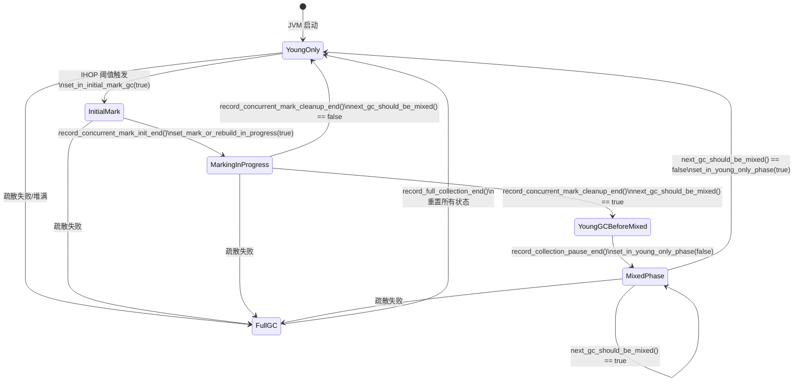
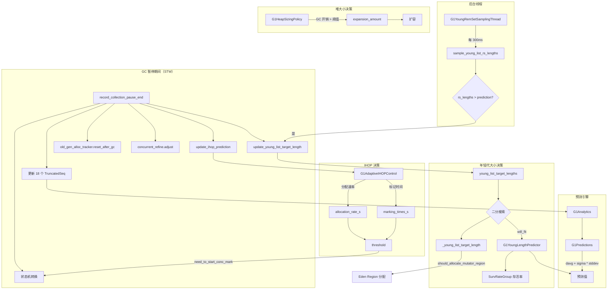

# #16 策略与自适应调整 — 完整源码分析

> **核心问题**：G1 是如何做到"智能"的？它怎么知道年轻代该多大、什么时候启动并发标记、什么时候扩缩堆？
>
> **一句话总结**：G1 通过一个基于 TruncatedSeq + 置信区间的预测引擎（G1Predictions），驱动 G1Policy 这个中央决策器，在每次 GC 前后动态调整年轻代大小、IHOP 阈值、堆大小、RemSet 跟踪策略等所有关键参数。

---

## 第 0 部分：核心原理 ⭐

### 0.1 本质是什么？

G1 自适应调整的本质是**一个基于历史数据的反馈控制系统**：`G1Predictions`（EMA 预测引擎）从历史 GC 数据中学习，`G1Policy`（中央决策器）根据预测结果调整所有关键参数（年轻代大小/IHOP/堆大小），每次 GC 后更新模型，形成"观测→预测→决策→执行→观测"的闭环。

### 0.2 为什么需要？

G1 的核心承诺是"可预测的停顿时间"，但最优参数随应用负载动态变化：年轻代太大→停顿超标，太小→GC 频繁；IHOP 太高→并发标记来不及完成，太低→Mixed GC 过于频繁；堆太大→内存浪费，太小→频繁 Full GC。静态配置无法适应所有场景，必须自适应调整。

### 0.3 怎么解决？

**三层自适应机制**：
- **年轻代大小**：`G1Policy::record_collection_pause_end()` 根据实际停顿时间调整年轻代 Region 数量（`_young_list_target_length`）；预测停顿时间 = Σ(每个 Region 的预测处理时间)
- **IHOP（InitiatingHeapOccupancyPercent）**：`G1AdaptiveIHOP` 根据历史并发标记时间和分配速率动态调整 IHOP 阈值，确保并发标记在堆满前完成
- **堆大小**：`G1HeapSizingPolicy` 根据 GC 后的堆占用率决定是否扩缩堆（`resize_if_necessary_after_full_collection()`）

### 0.4 为什么这样设计？

- **为什么用 EMA（指数移动平均）而不是简单平均？** EMA 对近期数据权重更高，能快速响应应用行为变化；简单平均对历史数据等权，响应慢
- **为什么 IHOP 需要自适应而不是固定 45%？** 并发标记时间和分配速率都是动态的；固定 45% 在分配速率高时可能来不及完成标记，在分配速率低时又过于保守（浪费内存）
- **为什么年轻代大小调整有上下界（`G1NewSizePercent`/`G1MaxNewSizePercent`）？** 防止自适应算法在极端情况下产生不合理的值（如年轻代占满整个堆）；上下界是安全网
- **为什么 `G1RemSetTrackingPolicy` 也参与自适应？** 并发标记期间跟踪所有 Region 的 RSet 代价高；`G1RemSetTrackingPolicy` 根据 Region 的存活率决定是否跟踪 RSet，对存活率低的 Region 停止跟踪，减少开销

---

## 目录

1. [G1Policy — 策略中枢总览](#1-g1policy--策略中枢总览)
2. [G1CollectorState — 完整状态机](#2-g1collectorstate--完整状态机)
3. [G1Predictions + G1Analytics — 预测引擎](#3-g1predictions--g1analytics--预测引擎)
4. [年轻代动态调整](#4-年轻代动态调整)
5. [IHOP 自适应控制](#5-ihop-自适应控制)
6. [堆大小动态调整](#6-堆大小动态调整)
7. [SurvRateGroup — 存活率预测](#7-survrategroup--存活率预测)
8. [G1YoungRemSetSamplingThread — 后台采样线程](#8-g1youngremsetsamlingthread--后台采样线程)
9. [G1RemSetTrackingPolicy — RemSet 跟踪策略](#9-g1remsettrackingpolicy--remset-跟踪策略)
10. [G1OldGenAllocationTracker — 老年代分配追踪](#10-g1oldgenallocationtracker--老年代分配追踪)
11. [G1MMUTracker — 最小 Mutator 利用率](#11-g1mmutracker--最小-mutator-利用率)
12. [G1InitialMarkToMixedTimeTracker — 标记周期计时](#12-g1initialmarktomixedtimetracker--标记周期计时)
13. [完整调用链与数据流](#13-完整调用链与数据流)
14. [关键 JVM 参数汇总](#14-关键-jvm-参数汇总)

---

## 1. G1Policy — 策略中枢总览

### 1.1 为什么需要 G1Policy？

**问题**：G1 的核心承诺是"可预测的暂停时间"。但堆中对象的分配速率、存活率、跨代引用数量等都在不断变化。如何在动态变化的环境中持续满足暂停时间目标？

**解决方案**：G1Policy 作为中央决策器，整合所有子系统的预测数据，在每次 GC 前后做出关键决策。

### 1.2 G1Policy 的核心成员

```
源码：src/hotspot/share/gc/g1/g1Policy.hpp
```

```
G1Policy
├── G1Predictions _predictor            // 预测引擎核心（sigma = G1ConfidencePercent/100 = 0.5）
├── G1Analytics* _analytics             // 统计数据收集（18 个 TruncatedSeq）
├── G1RemSetTrackingPolicy _remset_tracker // RemSet 跟踪策略
├── G1MMUTracker* _mmu_tracker          // MMU 跟踪（time_slice + max_gc_time）
├── G1OldGenAllocationTracker _old_gen_alloc_tracker // 老年代分配跟踪
├── G1IHOPControl* _ihop_control        // IHOP 自适应控制
├── SurvRateGroup* _short_lived_surv_rate_group // Eden 区存活率预测
├── SurvRateGroup* _survivor_surv_rate_group    // Survivor 区存活率预测
├── G1YoungGenSizer _young_gen_sizer    // 年轻代大小边界计算
├── G1InitialMarkToMixedTimeTracker _initial_mark_to_mixed // IM→Mixed 时间跟踪
├── uint _young_list_target_length      // 当前年轻代目标长度
├── uint _young_list_max_length         // 当前年轻代最大长度（含 GCLocker 扩展）
├── uint _reserve_regions               // 保留 Region 数（G1ReservePercent）
└── uint _free_regions_at_end_of_collection // 上次 GC 结束后的空闲 Region 数
```

### 1.3 G1Policy 构造函数

```cpp
// src/hotspot/share/gc/g1/g1Policy.cpp:49-71
G1Policy::G1Policy(STWGCTimer* gc_timer) :
  _predictor(G1ConfidencePercent / 100.0),           // sigma = 50/100 = 0.5
  _analytics(new G1Analytics(&_predictor)),            // 创建统计分析器
  _mmu_tracker(new G1MMUTrackerQueue(
    GCPauseIntervalMillis / 1000.0,                   // 默认 200ms → 0.2s
    MaxGCPauseMillis / 1000.0)),                       // 默认 200ms → 0.2s
  _old_gen_alloc_tracker(),
  _ihop_control(create_ihop_control(&_old_gen_alloc_tracker, &_predictor)),
  _short_lived_surv_rate_group(new SurvRateGroup()),   // Eden 存活率，初始 0.4
  _survivor_surv_rate_group(new SurvRateGroup()),      // Survivor 存活率
  _reserve_factor((double) G1ReservePercent / 100.0),  // 默认 10%
  _young_gen_sizer(),
  _tenuring_threshold(MaxTenuringThreshold),            // 默认 15
  ...
```

### 1.4 G1Policy::init() — 初始化

```cpp
// src/hotspot/share/gc/g1/g1Policy.cpp:79-143
void G1Policy::init(G1CollectedHeap* g1h, G1CollectionSet* collection_set) {
  _g1h = g1h;
  _collection_set = collection_set;

  // 1. 年轻代大小边界调整
  _young_gen_sizer.adjust_max_new_size(_g1h->max_regions());
  // 8GB 堆：min = 2048 × 5% = 102, max = 2048 × 60% = 1228

  // 2. 初始空闲 Region 统计
  _free_regions_at_end_of_collection = _g1h->num_free_regions();
  // 初始化时 = 2048（所有 Region 都空闲）

  // 3. 计算年轻代目标长度
  update_young_list_max_and_target_length();
  // 初始化时没有历史数据，_young_list_target_length = 102

  // 4. 开始增量构建收集集合
  _collection_set->start_incremental_building();
}
```

### 1.5 record_collection_pause_end() — GC 后的决策核心

这是 G1Policy 最重要的方法，在每次 GC 暂停结束时调用，完成所有统计更新和决策：

```
record_collection_pause_end(pause_time_ms, cards_scanned, heap_used_before)
│
├── 1. 记录暂停类型（record_pause → _mmu_tracker + _initial_mark_to_mixed）
├── 2. 处理 Initial Mark → 并发标记启动
├── 3. 计算 app_time_ms（mutator 运行时间）
├── 4. 更新统计数据（如果非疏散失败）
│   ├── alloc_rate_ms（分配速率）
│   ├── cost_per_card_ms（Update RS 耗时/卡片数）
│   ├── cost_per_entry_ms（Scan RS 耗时/扫描卡片数）
│   ├── cards_per_entry_ratio（扫描卡片数/RS 长度）
│   ├── rs_length_diff（RS 长度差异）
│   ├── cost_per_byte_ms（复制耗时/复制字节数）
│   ├── young_other_cost_per_region_ms
│   ├── non_young_other_cost_per_region_ms
│   ├── constant_other_time_ms
│   ├── pending_cards 和 rs_lengths（仅 Young-only GC）
│   └── pause_time_ratio（暂停时间比率）
├── 5. Mixed Phase 状态转换
├── 6. 更新年轻代目标长度
│   ├── update_young_list_max_and_target_length()
│   └── update_rs_lengths_prediction()
├── 7. 更新老年代分配跟踪
│   └── _old_gen_alloc_tracker.reset_after_gc()
├── 8. 更新 IHOP 预测
│   └── update_ihop_prediction()
└── 9. 调整并发 Refinement 阈值
    └── _g1h->concurrent_refine()->adjust()
```

---

## 2. G1CollectorState — 完整状态机

### 2.1 为什么需要状态机？

**问题**：G1 的 GC 有多种类型（Young-only、Initial Mark、Mixed、Full GC），每种类型的行为不同。如何用最少的状态准确表达当前所处的阶段？

**解决方案**：用 7 个 bool 标志组合表达所有可能的 GC 状态。

### 2.2 七个状态标志

```
源码：src/hotspot/share/gc/g1/g1CollectorState.hpp
```

| 标志 | volatile | 含义 |
|------|----------|------|
| `_in_young_only_phase` | 否 | 处于 Young-only 阶段（初始 true） |
| `_in_young_gc_before_mixed` | 否 | 当前是 Mixed 前的最后一次 Young GC |
| `_in_initial_mark_gc` | **是** | 当前暂停是 Initial Mark 暂停 |
| `_initiate_conc_mark_if_possible` | **是** | 下次暂停应尝试启动并发标记 |
| `_mark_or_rebuild_in_progress` | 否 | 并发标记/RemSet 重建进行中 |
| `_clearing_next_bitmap` | 否 | 正在清除 next bitmap |
| `_in_full_gc` | 否 | 正在执行 Full GC |

> **为什么 `_in_initial_mark_gc` 和 `_initiate_conc_mark_if_possible` 是 volatile？**
> 因为它们可能在 mutator 线程（通过 `force_initial_mark_if_outside_cycle`）和 GC 线程之间共享访问。

### 2.3 派生状态

```cpp
bool in_young_only_phase() const { return _in_young_only_phase && !_in_full_gc; }
bool in_mixed_phase()      const { return !in_young_only_phase() && !_in_full_gc; }
```

**关键洞察**：`in_mixed_phase()` 不是一个独立标志，而是从 `_in_young_only_phase` 和 `_in_full_gc` 派生出来的。当 `_in_young_only_phase = false` 且 `_in_full_gc = false` 时，就处于 Mixed 阶段。

### 2.4 yc_type() — GC 类型判定

```cpp
G1YCType yc_type() const {
  if (in_initial_mark_gc())        return InitialMark;        // 优先级最高
  else if (mark_or_rebuild_in_progress()) return DuringMarkOrRebuild;
  else if (in_young_only_phase())  return Normal;
  else                              return Mixed;             // 优先级最低
}
```

优先级顺序：**InitialMark > DuringMarkOrRebuild > Normal > Mixed**

### 2.5 完整状态转换图



### 2.6 关键状态转换源码

**1. 触发并发标记（maybe_start_marking）**

```cpp
// g1Policy.cpp:1073-1079
void G1Policy::maybe_start_marking() {
  if (need_to_start_conc_mark("end of GC")) {
    collector_state()->set_initiate_conc_mark_if_possible(true);
  }
}
```

**2. 决定是否启动 Initial Mark（decide_on_conc_mark_initiation）**

在每次 GC 暂停开始时调用：

```cpp
// g1Policy.cpp:984-1032
void G1Policy::decide_on_conc_mark_initiation() {
  if (collector_state()->initiate_conc_mark_if_possible()) {
    if (!about_to_start_mixed_phase() && collector_state()->in_young_only_phase()) {
      // 正常触发：启动 Initial Mark
      initiate_conc_mark();
    } else if (_g1h->is_user_requested_concurrent_full_gc(_g1h->gc_cause())) {
      // 用户请求（System.gc()）：强制启动
      collector_state()->set_in_young_only_phase(true);
      collector_state()->set_in_young_gc_before_mixed(false);
      clear_collection_set_candidates();
      initiate_conc_mark();
    }
    // 否则：并发标记仍在进行，推迟
  }
}
```

**3. need_to_start_conc_mark — IHOP 阈值检查**

```cpp
// g1Policy.cpp:579-599
bool G1Policy::need_to_start_conc_mark(const char* source, size_t alloc_word_size) {
  if (about_to_start_mixed_phase()) return false;  // 如果即将进入 Mixed，不启动

  size_t marking_initiating_used_threshold = _ihop_control->get_conc_mark_start_threshold();
  size_t cur_used_bytes = _g1h->non_young_capacity_bytes();
  size_t marking_request_bytes = cur_used_bytes + alloc_word_size * HeapWordSize;

  if (marking_request_bytes > marking_initiating_used_threshold) {
    return collector_state()->in_young_only_phase() && !collector_state()->in_young_gc_before_mixed();
  }
  return false;
}
```

> **JVM 参数**：`-Xlog:gc+ergo+ihop=debug` 可以看到 IHOP 触发日志：
> ```
> Request concurrent cycle initiation (occupancy higher than threshold)
>   occupancy: 3221225472B allocation request: 0B threshold: 3019898880B (36.94%) source: end of GC
> ```

**4. Full GC 后的状态重置**

```cpp
// g1Policy.cpp:470-502
void G1Policy::record_full_collection_end() {
  collector_state()->set_in_full_gc(false);
  collector_state()->set_in_young_only_phase(true);        // 回到 Young-only
  collector_state()->set_in_young_gc_before_mixed(false);
  collector_state()->set_initiate_conc_mark_if_possible(
    need_to_start_conc_mark("end of Full GC", 0));         // 可能立即触发并发标记
  collector_state()->set_in_initial_mark_gc(false);
  collector_state()->set_mark_or_rebuild_in_progress(false);
  collector_state()->set_clearing_next_bitmap(false);
}
```

---

## 3. G1Predictions + G1Analytics — 预测引擎

### 3.1 为什么需要预测引擎？

**问题**：G1 需要在 GC 开始**之前**就决定年轻代大小，这意味着它必须**预测**GC 会花多长时间。但预测值不能太保守（浪费时间）也不能太激进（超过暂停目标）。

**解决方案**：使用 TruncatedSeq（固定长度序列）记录历史数据，用加权平均 + 置信区间偏移进行预测。

### 3.2 G1Predictions 预测公式

```
源码：src/hotspot/share/gc/g1/g1Predictions.hpp
```

```cpp
double get_new_prediction(TruncatedSeq const* seq) const {
  return seq->davg() + _sigma * stddev_estimate(seq);
}
```

**预测值 = 衰减平均值 + sigma × 标准差估计值**

其中：
- `davg()` = 衰减加权平均（decay average），最近的样本权重更高
- `_sigma` = 置信系数，默认 `G1ConfidencePercent / 100.0 = 50/100 = 0.5`
- `stddev_estimate()` = 标准差估计

**标准差的特殊处理**（样本少时更保守）：

```cpp
double stddev_estimate(TruncatedSeq const* seq) const {
  double estimate = seq->dsd();    // 衰减标准差
  int const samples = seq->num();
  if (samples < 5) {
    // 样本少于 5 个时，用平均值的倍数作为标准差
    estimate = MAX2(seq->davg() * (5 - samples) / 2.0, estimate);
    // 1 个样本：2.0 × avg
    // 2 个样本：1.5 × avg
    // 3 个样本：1.0 × avg
    // 4 个样本：0.5 × avg
    // 5+ 个样本：使用真实标准差
  }
  return estimate;
}
```

**关键洞察**：样本越少，预测越保守（标准差估计值越大 → 预测值越高 → 预留更多时间余量）。

### 3.3 G1Analytics — 18 个 TruncatedSeq

```
源码：src/hotspot/share/gc/g1/g1Analytics.hpp/cpp
```

G1Analytics 维护了 18 个 TruncatedSeq（长度 10），每个序列跟踪一个特定的 GC 性能指标：

| 序列名 | 跟踪内容 | 初始种子值（8线程） |
|--------|---------|-----------------|
| `_recent_gc_times_ms` | 最近 GC 暂停时间 | — |
| `_alloc_rate_ms_seq` | 分配速率（region/ms） | — |
| `_rs_length_diff_seq` | RS 长度预测差异 | 0.0 |
| `_cost_per_card_ms_seq` | Update RS 每张卡片耗时 | 0.0015 |
| `_cost_scan_hcc_seq` | Hot Card Cache 扫描耗时 | 0.0 |
| `_young_cards_per_entry_ratio_seq` | Young GC 卡片/RS条目比 | 1.0 |
| `_mixed_cards_per_entry_ratio_seq` | Mixed GC 卡片/RS条目比 | — |
| `_cost_per_entry_ms_seq` | Young Scan RS 每条目耗时 | 0.005 |
| `_mixed_cost_per_entry_ms_seq` | Mixed Scan RS 每条目耗时 | — |
| `_cost_per_byte_ms_seq` | 复制每字节耗时 | 0.000009 |
| `_cost_per_byte_ms_during_cm_seq` | 并发标记期间复制每字节耗时 | — |
| `_constant_other_time_ms_seq` | 固定开销时间 | 5.0 |
| `_young_other_cost_per_region_ms_seq` | Young region 其他耗时 | 0.1 |
| `_non_young_other_cost_per_region_ms_seq` | Old region 其他耗时 | 0.30 |
| `_pending_cards_seq` | 待处理卡片数 | — |
| `_rs_lengths_seq` | RS 长度 | — |
| `_concurrent_mark_remark_times_ms` | Remark 耗时 | 0.05ms |
| `_concurrent_mark_cleanup_times_ms` | Cleanup 耗时 | 0.20ms |

**种子值根据 GC 线程数选取**（index = min(ParallelGCThreads - 1, 7)）：

```cpp
// g1Analytics.cpp:41-70（部分）
static double cost_per_card_ms_defaults[] = {
  0.01, 0.005, 0.005, 0.003, 0.003, 0.002, 0.002, 0.0015
};
static double cost_per_entry_ms_defaults[] = {
  0.015, 0.01, 0.01, 0.008, 0.008, 0.0055, 0.0055, 0.005
};
```

> **设计思想**：线程越多，每张卡片/每条目的处理时间越短，因为可以并行处理。

### 3.4 GC 暂停时间预测模型

G1 使用以下公式预测一次 GC 暂停的总时间：

```
pause_time = base_time + copy_time + young_other_time + [non_young_other_time]

其中：
  base_time = predict_rs_update_time_ms(pending_cards)
            + predict_rs_scan_time_ms(scanned_cards)
            + predict_constant_other_time_ms()

  copy_time = predict_object_copy_time_ms(bytes_to_copy)

  young_other_time = predict_young_other_time_ms(young_regions)
```

展开各项：

```
rs_update_time = pending_cards × cost_per_card_ms + scan_hcc_time
rs_scan_time   = card_num × cost_per_entry_ms
card_num       = rs_length × cards_per_entry_ratio
copy_time      = bytes_to_copy × cost_per_byte_ms
```

---

## 4. 年轻代动态调整

### 4.1 为什么年轻代大小要动态调整？

**问题**：
- 年轻代太大 → GC 要复制的对象多 → 暂停时间超过 `MaxGCPauseMillis`
- 年轻代太小 → GC 太频繁 → 吞吐量下降
- 不同工作负载的最佳年轻代大小不同，无法用固定值满足

**解决方案**：每次 GC 后，用预测模型二分搜索一个**最大的年轻代长度**，使得预测暂停时间不超过目标。

### 4.2 G1YoungGenSizer — 边界计算

```
源码：src/hotspot/share/gc/g1/g1YoungGenSizer.hpp/cpp
```

G1YoungGenSizer 根据命令行参数确定年轻代大小的范围：

| 用户配置 | SizerKind | min | max | adaptive |
|---------|-----------|-----|-----|----------|
| 无 | SizerDefaults | heap×5% | heap×60% | true |
| -XX:NewSize | SizerNewSizeOnly | NewSize/GrainBytes | heap×60% | true |
| -XX:MaxNewSize | SizerMaxNewSizeOnly | heap×5% | MaxNewSize/GrainBytes | true |
| NewSize=MaxNewSize | SizerMaxAndNewSize | — | — | **false** |
| -XX:NewRatio | SizerNewRatio | heap/(NewRatio+1) | = min | **false** |

**标准环境（8GB 堆，4MB Region）**：
- `min_desired_young_length = 2048 × 5% = 102 Regions = 408MB`
- `max_desired_young_length = 2048 × 60% = 1228 Regions = 4.9GB`

### 4.3 年轻代目标长度计算 — 二分搜索

```
update_young_list_max_and_target_length()
└── update_young_list_target_length(rs_lengths)
    └── young_list_target_lengths(rs_lengths)
        ├── base_min_length = survivor_count
        ├── desired_min_length = max(alloc_rate × when_next_gc, sizer.min)
        ├── desired_max_length = sizer.max
        ├── absolute_max_length = free_regions - reserve_regions
        │
        ├── if adaptive && in_young_only_phase:
        │   └── calculate_young_list_target_length()
        │       └── 二分搜索：找到满足暂停时间目标的最大年轻代长度
        │
        └── 边界裁剪：desired_min ≤ target ≤ desired_max
```

**二分搜索核心逻辑**：

```cpp
// g1Policy.cpp:326-426
uint G1Policy::calculate_young_list_target_length(...) const {
  const double target_pause_time_ms = _mmu_tracker->max_gc_time() * 1000.0;
  // ...

  G1YoungLengthPredictor p(during_cm, base_time_ms, base_free_regions,
                            target_pause_time_ms, this);

  if (p.will_fit(min_young_length)) {
    if (p.will_fit(max_young_length)) {
      min_young_length = max_young_length;  // 最大长度也能放下
    } else {
      // 二分搜索
      uint diff = (max_young_length - min_young_length) / 2;
      while (diff > 0) {
        uint young_length = min_young_length + diff;
        if (p.will_fit(young_length)) {
          min_young_length = young_length;
        } else {
          max_young_length = young_length;
        }
        diff = (max_young_length - min_young_length) / 2;
      }
    }
  }
  return base_min_length + min_young_length;
}
```

### 4.4 G1YoungLengthPredictor::will_fit() — 适配判定

```cpp
// g1Policy.cpp:150-207
bool will_fit(uint young_length) const {
  // 检查 1：空间充足？
  if (young_length >= _base_free_regions) return false;

  // 检查 2：暂停时间可控？
  const double accum_surv_rate = _policy->accum_yg_surv_rate_pred(young_length - 1);
  const size_t bytes_to_copy = (size_t)(accum_surv_rate * HeapRegion::GrainBytes);
  const double copy_time_ms = _policy->analytics()->predict_object_copy_time_ms(bytes_to_copy, _during_cm);
  const double young_other_time_ms = _policy->analytics()->predict_young_other_time_ms(young_length);
  const double pause_time_ms = _base_time_ms + copy_time_ms + young_other_time_ms;
  if (pause_time_ms > _target_pause_time_ms) return false;

  // 检查 3：复制后空间够？（加安全余量）
  const size_t free_bytes = (_base_free_regions - young_length) * HeapRegion::GrainBytes;
  const double safety_factor = (100.0 / G1ConfidencePercent) * (100 + TargetPLABWastePct) / 100.0;
  const size_t expected_bytes_to_copy = (size_t)(safety_factor * bytes_to_copy);
  if (expected_bytes_to_copy > free_bytes) return false;

  return true;
}
```

三个终止条件：
1. **空间不足**：年轻代长度 ≥ 空闲 Region 数
2. **时间超限**：预测暂停时间 > 目标暂停时间
3. **复制空间不足**：预测需复制的字节 × 安全系数 > 剩余空间

---

## 5. IHOP 自适应控制

### 5.1 为什么需要 IHOP？

**问题**：并发标记需要时间。如果等到堆快满了才启动，标记还没完成堆就满了，被迫 Full GC。但如果太早启动，浪费 CPU。

**解决方案**：IHOP（Initiating Heap Occupancy Percent）定义了一个老年代占用阈值，超过这个阈值就启动并发标记。自适应模式会根据历史数据动态调整这个阈值。

### 5.2 两种实现

```
G1IHOPControl（基类）
├── G1StaticIHOPControl      // 固定阈值：IHOP% × target_occupancy
└── G1AdaptiveIHOPControl    // 自适应阈值：基于分配速率和标记耗时动态计算
```

**选择逻辑**：

```cpp
// g1Policy.cpp:787-798
G1IHOPControl* G1Policy::create_ihop_control(...) {
  if (G1UseAdaptiveIHOP) {  // 默认 true
    return new G1AdaptiveIHOPControl(
      InitiatingHeapOccupancyPercent,  // 默认 45%
      old_gen_alloc_tracker,
      predictor,
      G1ReservePercent,                // 默认 10%
      G1HeapWastePercent);             // 默认 5%
  } else {
    return new G1StaticIHOPControl(InitiatingHeapOccupancyPercent, old_gen_alloc_tracker);
  }
}
```

### 5.3 G1StaticIHOPControl — 固定阈值

```cpp
size_t get_conc_mark_start_threshold() {
  return (size_t)(_initial_ihop_percent * _target_occupancy / 100.0);
}
// 标准环境：45% × 8GB = 3.6GB
```

### 5.4 G1AdaptiveIHOPControl — 自适应阈值

**核心思想**：预测标记期间老年代会增长多少，提前留出足够空间。

```
threshold = actual_target - (predicted_promotion_during_marking + young_gen_size)

其中：
  actual_target = min(
    max_capacity × (100% - reserve% - waste%),
    target_occupancy × (100% - waste%)
  )

  predicted_promotion_during_marking = pred_marking_time × pred_promotion_rate

  pred_marking_time = G1Predictions.get_new_prediction(_marking_times_s)
  pred_promotion_rate = G1Predictions.get_new_prediction(_allocation_rate_s)
```

**源码**：

```cpp
// g1IHOPControl.cpp:123-144
size_t G1AdaptiveIHOPControl::get_conc_mark_start_threshold() {
  if (have_enough_data_for_prediction()) {
    // 需要至少 G1AdaptiveIHOPNumInitialSamples 个样本（默认 3）
    double pred_marking_time = _predictor->get_new_prediction(&_marking_times_s);
    double pred_promotion_rate = _predictor->get_new_prediction(&_allocation_rate_s);
    size_t pred_promotion_size = (size_t)(pred_marking_time * pred_promotion_rate);

    size_t predicted_needed = pred_promotion_size + _last_unrestrained_young_size;

    size_t internal_threshold = actual_target_threshold();
    size_t predicted_initiating_threshold =
      predicted_needed < internal_threshold ?
      internal_threshold - predicted_needed : 0;

    return predicted_initiating_threshold;
  } else {
    // 数据不足，使用静态值
    return (size_t)(_initial_ihop_percent * _target_occupancy / 100.0);
  }
}
```

**actual_target_threshold()**：

```cpp
// g1IHOPControl.cpp:100-116
size_t G1AdaptiveIHOPControl::actual_target_threshold() const {
  double safe_total_heap_percentage = MIN2(
    (double)(_heap_reserve_percent + _heap_waste_percent), 100.0);
  // 默认：10% + 5% = 15%

  return (size_t)MIN2(
    G1CollectedHeap::heap()->max_capacity() * (100.0 - 15.0) / 100.0,
    // 8GB × 85% = 6.8GB
    _target_occupancy * (100.0 - 5.0) / 100.0
    // 8GB × 95% = 7.6GB
  );
  // 取较小值 = 6.8GB
}
```

**标准环境计算示例**：
```
actual_target = 6.8GB
假设：pred_marking_time = 2.0s, pred_promotion_rate = 100MB/s
predicted_needed = 2.0 × 100MB + young_gen_size(~400MB) = 600MB
threshold = 6.8GB - 600MB = 6.2GB（约 76% 的堆）
```

### 5.5 IHOP 数据更新时机

```cpp
// g1Policy.cpp:800-836
void G1Policy::update_ihop_prediction(double mutator_time_s,
                                      size_t young_gen_size,
                                      bool this_gc_was_young_only) {
  // 更新标记时间（只在第一次 Mixed GC 时）
  if (!this_gc_was_young_only && _initial_mark_to_mixed.has_result()) {
    double marking_to_mixed_time = _initial_mark_to_mixed.last_marking_time();
    _ihop_control->update_marking_length(marking_to_mixed_time);
  }

  // 更新分配速率（只在 Young-only GC 后）
  if (this_gc_was_young_only && mutator_time_s > 1e-6) {
    _ihop_control->update_allocation_info(mutator_time_s, young_gen_size);
  }
}
```

> **JVM 参数**：`-Xlog:gc+ihop=debug` 可以看到自适应 IHOP 调整日志：
> ```
> Adaptive IHOP information (value update), threshold: 6442450944B (95.00),
>   internal target occupancy: 6785237606B, occupancy: 3221225472B,
>   additional buffer size: 423624704B, predicted old gen allocation rate: 104857600.00B/s,
>   predicted marking phase length: 2000.00ms, prediction active: true
> ```

---

## 6. 堆大小动态调整

### 6.1 为什么堆大小要动态调整？

**问题**：用户设置 `-Xms8g -Xmx8g` 时堆大小固定。但如果 Xms < Xmx，G1 需要决定何时扩容。GC 频繁说明堆太小，应该扩容。

> **注意**：在我们的标准环境中 `-Xms=Xmx=8GB`，堆大小不会变化。此节分析的是 `Xms < Xmx` 的场景。

### 6.2 G1HeapSizingPolicy::expansion_amount()

```
源码：src/hotspot/share/gc/g1/g1HeapSizingPolicy.cpp
```

**扩容触发条件**（两个条件满足其一）：

1. **连续超阈值**：最近 `MinOverThresholdForGrowth`（4）次 GC 的暂停时间比率超过阈值
2. **滑动窗口平均超阈值**：历史窗口（10 次）填满后，平均暂停时间比率仍超阈值

**阈值计算**：

```cpp
const double gc_overhead_percent = 100.0 * (1.0 / (1.0 + GCTimeRatio));
// GCTimeRatio 默认 = 12 → gc_overhead_percent = 100/(1+12) = 7.69%
```

**小堆时阈值缩放**（更容易触发扩容）：

```cpp
if (_g1h->capacity() <= _g1h->max_capacity() / 2) {
  threshold *= (double)_g1h->capacity() / (double)(_g1h->max_capacity() / 2);
  threshold = MAX2(threshold, 1.0);
}
```

例如：堆当前 2GB，最大 8GB → threshold × (2GB / 4GB) = threshold × 0.5

**扩容量计算**：

```cpp
if (committed_bytes < InitialHeapSize / 4) {
  // 堆太小，快速增长：(InitialHeapSize - current) / 2
  expand_bytes = (InitialHeapSize - committed_bytes) / 2;
} else {
  // 正常增长
  expand_bytes = MIN2(uncommitted × G1ExpandByPercentOfAvailable%, committed);

  // 缩放因子
  if (ratio_delta < StartScaleDownAt) {
    // GC 开销略超阈值：缩小扩容量
    scale_factor = MAX2(ratio_delta / gc_overhead_percent, 0.2);
  } else if (ratio_delta > gc_overhead_percent * 1.5) {
    // GC 开销严重超阈值：放大扩容量（最多 2×）
    scale_factor = MIN2(1 + (ratio_delta - 1.5*gc_overhead%) / (2*gc_overhead%), 2.0);
  }

  expand_bytes = expand_bytes × scale_factor;
  expand_bytes = MAX2(expand_bytes, HeapRegion::GrainBytes); // 至少 1 个 Region
}
```

> **JVM 参数**：`-Xlog:gc+ergo+heap=debug` 查看堆扩容日志：
> ```
> Attempt heap expansion (recent GC overhead higher than threshold after GC)
>   recent GC overhead: 12.50 % threshold: 7.69 % uncommitted: 4294967296B
>   base expansion amount and scale: 4294967296B (120.00%)
> ```

---

## 7. SurvRateGroup — 存活率预测

### 7.1 为什么需要按年龄预测存活率？

**问题**：不同"年龄"的 Region（在 Eden 中停留了几次 GC）有不同的存活率。新 Region 通常存活率低（大部分是临时对象），老 Region 存活率高。年轻代大小计算需要知道"N 个 Region 中有多少对象会存活"。

**解决方案**：为每个年龄维护一个 TruncatedSeq，记录历史存活率。

### 7.2 核心数据结构

```
SurvRateGroup
├── TruncatedSeq** _surv_rate_pred  // 每个年龄的存活率序列（长度 10）
├── double* _accum_surv_rate_pred   // 累积存活率预测
├── double _last_pred               // 最后一个年龄的预测值
├── size_t _stats_arrays_length     // 数组长度
├── size_t _region_num              // 当前正在使用的 Region 数
└── int _all_regions_allocated      // 已分配的总 Region 数
```

### 7.3 初始化与种子值

```cpp
// survRateGroup.cpp:41-66
void SurvRateGroup::reset() {
  _all_regions_allocated = 0;
  _region_num = 1;
  stop_adding_regions();  // 分配长度为 1 的数组

  // 初始种子：40% 存活率
  const double initial_surv_rate = 0.4;
  _surv_rate_pred[0]->add(initial_surv_rate);
  _last_pred = _accum_surv_rate_pred[0] = initial_surv_rate;

  _region_num = 0;
}
```

### 7.4 记录存活字数

GC 结束时，为每个年龄的 Region 记录实际存活率：

```cpp
// survRateGroup.cpp:86-92
void SurvRateGroup::record_surviving_words(int age_in_group, size_t surv_words) {
  double surv_rate = (double) surv_words / (double) HeapRegion::GrainWords;
  _surv_rate_pred[age_in_group]->add(surv_rate);
}
// 4MB Region: GrainWords = 4MB / 8 = 524288
// 如果存活 1MB：surv_rate = 131072 / 524288 = 0.25 (25%)
```

### 7.5 累积存活率计算

```cpp
// survRateGroup.cpp:110-120
void SurvRateGroup::finalize_predictions(const G1Predictions& predictor) {
  double accum = 0.0;
  double pred = 0.0;
  for (size_t i = 0; i < _stats_arrays_length; ++i) {
    pred = predictor.get_new_prediction(_surv_rate_pred[i]);
    if (pred > 1.0) pred = 1.0;
    accum += pred;
    _accum_surv_rate_pred[i] = accum;
  }
  _last_pred = pred;
}
```

**累积存活率的含义**：`accum_surv_rate_pred[N]` = 年龄 0~N 的所有 Region 预测存活对象占总容量的比例之和。

在年轻代大小计算中用于估计需要复制的字节数：

```cpp
// G1YoungLengthPredictor::will_fit()
const double accum_surv_rate = _policy->accum_yg_surv_rate_pred(young_length - 1);
const size_t bytes_to_copy = (size_t)(accum_surv_rate * HeapRegion::GrainBytes);
```

### 7.6 超出数组范围的处理

当年龄超过已有数组长度时，使用线性外推：

```cpp
double accum_surv_rate_pred(int age) const {
  if ((size_t)age < _stats_arrays_length)
    return _accum_surv_rate_pred[age];
  else {
    double diff = (double)(age - _stats_arrays_length + 1);
    return _accum_surv_rate_pred[_stats_arrays_length-1] + diff * _last_pred;
  }
}
```

---

## 8. G1YoungRemSetSamplingThread — 后台采样线程

### 8.1 为什么需要后台采样？

**问题**：年轻代 Region 的 RemSet 大小会随着 mutator 运行而变化。如果 RemSet 增长太快，当前的年轻代目标长度可能导致 GC 暂停时间超标。但不能每次 mutator 写操作都重新计算年轻代长度。

**解决方案**：用一个后台线程，每 300ms 采样一次年轻代 RemSet 长度，如果超过预测值就触发年轻代长度重新计算。

### 8.2 主循环

```cpp
// g1YoungRemSetSamplingThread.cpp:53-67
void G1YoungRemSetSamplingThread::run_service() {
  while (!should_terminate()) {
    sample_young_list_rs_lengths();     // 采样
    sleep_before_next_cycle();          // 睡眠 300ms
  }
}
```

### 8.3 采样过程

```cpp
// g1YoungRemSetSamplingThread.cpp:106-121
void G1YoungRemSetSamplingThread::sample_young_list_rs_lengths() {
  SuspendibleThreadSetJoiner sts;       // 加入可暂停线程集（GC 时可暂停）
  G1Policy* g1p = g1h->g1_policy();

  if (g1p->adaptive_young_list_length()) {
    G1YoungRemSetSamplingClosure cl(&sts);
    g1h->collection_set()->iterate(&cl);  // 遍历所有年轻代 Region

    if (cl.is_complete()) {
      g1p->revise_young_list_target_length_if_necessary(cl.sampled_rs_lengths());
    }
  }
}
```

### 8.4 采样闭包 — 每 10 个 Region yield 一次

```cpp
// g1YoungRemSetSamplingThread.cpp:74-104
class G1YoungRemSetSamplingClosure : public HeapRegionClosure {
  virtual bool do_heap_region(HeapRegion* r) {
    _sampled_rs_lengths += r->rem_set()->occupied();

    // 更新收集集合中该 Region 的 RS 长度预测
    G1CollectedHeap::heap()->collection_set()->update_young_region_prediction(r, rs_length);

    _regions_visited++;
    if (_regions_visited == 10) {
      if (_sts->should_yield()) {
        _sts->yield();   // GC 要开始了，停止采样
        return true;      // 采样不完整，不更新年轻代长度
      }
      _regions_visited = 0;
    }
    return false;
  }
};
```

### 8.5 年轻代长度修订

```cpp
// g1Policy.cpp:440-450
void G1Policy::revise_young_list_target_length_if_necessary(size_t rs_lengths) {
  if (rs_lengths > _rs_lengths_prediction) {
    // 加 10% 余量，避免频繁重新计算
    size_t rs_lengths_prediction = rs_lengths * 1100 / 1000;
    update_rs_lengths_prediction(rs_lengths_prediction);
    update_young_list_max_and_target_length(rs_lengths_prediction);
  }
}
```

**关键点**：只在 RS 长度**增长**时才重新计算（单向调整），加 10% 余量减少振荡。

---

## 9. G1RemSetTrackingPolicy — RemSet 跟踪策略

### 9.1 为什么 RemSet 需要策略？

**问题**：维护 RemSet 有成本（内存 + CPU）。不是所有 Region 都需要 RemSet。例如：
- 年轻代 Region 总是被收集，不需要记录谁指向它（因为年轻代是全量收集）
- 空闲 Region 和归档 Region 不需要 RemSet
- 老年代中占用率过高的 Region 不值得回收，也不需要维护 RemSet

**解决方案**：三态 RemSet 跟踪策略。

### 9.2 三种状态

| 状态 | 含义 | 适用场景 |
|------|------|---------|
| **Empty** | 不跟踪 RemSet | 新分配的老年代 Region、归档 Region |
| **Updating** | 正在重建 RemSet | Remark 后被选中重建的 Region |
| **Complete** | RemSet 完整可用 | 年轻代、巨型对象、重建完成的老年代 |

### 9.3 状态转换

```
分配时（update_at_allocate）：
  Young/Humongous → Complete
  Archive → Empty
  Old → Empty（新老年代 Region 默认不跟踪！）

Remark 时（update_before_rebuild）：
  Old + 低占用率 + 未跟踪 → Updating

重建完成后（update_after_rebuild）：
  Updating → Complete
  巨型对象 RemSet 过大 → 清除
```

### 9.4 update_before_rebuild — 选择重建候选

```cpp
// g1RemSetTrackingPolicy.cpp:107-139
bool G1RemSetTrackingPolicy::update_before_rebuild(HeapRegion* r, size_t live_bytes) {
  if (!r->is_old() || r->is_archive()) return false;

  size_t total_live_bytes = live_bytes + between_ntams_and_top;

  bool selected_for_rebuild = false;
  if ((total_live_bytes > 0) &&
      CollectionSetChooser::region_occupancy_low_enough_for_evac(total_live_bytes) &&
      !r->rem_set()->is_tracked()) {

    r->rem_set()->set_state_updating();
    selected_for_rebuild = true;
  }
  return selected_for_rebuild;
}
```

**选择标准**：
1. 有存活数据
2. 占用率低到值得回收（`region_occupancy_low_enough_for_evac`）
3. 尚未被跟踪

### 9.5 巨型对象的特殊处理

```cpp
// g1RemSetTrackingPolicy.cpp:82-105
bool G1RemSetTrackingPolicy::update_humongous_before_rebuild(HeapRegion* r, bool is_live) {
  // 只有 TypeArray 类型的巨型对象才重建 RemSet
  // 因为 TypeArray 不包含引用字段，其 RemSet 只需跟踪指向它的引用
  if (is_live && oop(r->humongous_start_region()->bottom())->is_typeArray()
      && !r->rem_set()->is_tracked()) {
    r->rem_set()->set_state_updating();
    return true;
  }
  return false;
}
```

### 9.6 update_after_rebuild — 清理过大的巨型 RemSet

```cpp
// g1RemSetTrackingPolicy.cpp:141-177
void G1RemSetTrackingPolicy::update_after_rebuild(HeapRegion* r) {
  if (r->is_old_or_humongous()) {
    if (r->rem_set()->is_updating()) {
      r->rem_set()->set_state_complete();
    }
    // 巨型对象：RemSet 过大则清除（下个周期不做 Eager Reclaim）
    if (r->is_starts_humongous() && !g1h->is_potential_eager_reclaim_candidate(r)) {
      uint size_in_regions = g1h->humongous_obj_size_in_regions(oop(r->bottom())->size());
      for (uint j = 0; j < size_in_regions; j++) {
        g1h->region_at(region_idx + j)->rem_set()->clear_locked(true);
      }
    }
  }
}
```

> **JVM 参数**：`-Xlog:gc+remset+tracking=trace` 查看 RemSet 跟踪详情：
> ```
> Before rebuild region 1234 (ntams: 0x...) total_live_bytes 2097152
>   selected true (live_bytes 1048576 next_marked 1048576 marked 0 type Old)
> ```

---

## 10. G1OldGenAllocationTracker — 老年代分配追踪

### 10.1 为什么需要追踪老年代分配？

**问题**：IHOP 自适应算法需要知道 mutator 期间老年代的分配速率。但老年代分配来源复杂：晋升、巨型对象分配、直接老年代分配。而且巨型对象可能被 Eager Reclaim，导致"净增长"与"总分配"不同。

**解决方案**：专门的追踪器，区分"总分配量"和"净增长量"。

### 10.2 核心字段

```cpp
class G1OldGenAllocationTracker : public CHeapObj<mtGC> {
  size_t _last_period_old_gen_bytes;       // 上个周期：总分配（old + humongous）
  size_t _last_period_old_gen_growth;      // 上个周期：净增长（考虑 Eager Reclaim）
  size_t _humongous_bytes_after_last_gc;   // 上次 GC 后巨型对象总大小
  size_t _allocated_bytes_since_last_gc;          // 本周期：非巨型老年代分配
  size_t _allocated_humongous_bytes_since_last_gc; // 本周期：巨型对象分配
};
```

### 10.3 reset_after_gc — 周期结算

```cpp
// g1OldGenAllocationTracker.cpp:37-62
void G1OldGenAllocationTracker::reset_after_gc(size_t humongous_bytes_after_gc) {
  // 计算巨型对象的净增长（考虑 Eager Reclaim）
  size_t last_period_humongous_increase = 0;
  if (humongous_bytes_after_gc > _humongous_bytes_after_last_gc) {
    last_period_humongous_increase = humongous_bytes_after_gc - _humongous_bytes_after_last_gc;
  }

  // 净增长 = 非巨型分配 + 巨型对象净增长
  _last_period_old_gen_growth = _allocated_bytes_since_last_gc + last_period_humongous_increase;

  // 总分配 = 非巨型分配 + 巨型对象总分配
  _last_period_old_gen_bytes = _allocated_bytes_since_last_gc + _allocated_humongous_bytes_since_last_gc;

  // 更新基线并重置
  _humongous_bytes_after_last_gc = humongous_bytes_after_gc;
  _allocated_bytes_since_last_gc = 0;
  _allocated_humongous_bytes_since_last_gc = 0;
}
```

> **JVM 参数**：`-Xlog:gc+alloc+stats=debug` 查看老年代分配统计：
> ```
> Old generation allocation in the last mutator period,
>   old gen allocated: 4194304B, humongous allocated: 8388608B,
>   old gen growth: 8388608B.
> ```

### 10.4 IHOP 使用方式

IHOP 自适应算法使用 `last_period_old_gen_growth` 计算分配速率：

```cpp
// g1IHOPControl.cpp:146-150
double G1AdaptiveIHOPControl::last_mutator_period_old_allocation_rate() const {
  return _old_gen_alloc_tracker->last_period_old_gen_growth() / _last_allocation_time_s;
}
```

**为什么用 growth 而不是 bytes？** 因为 Eager Reclaim 会回收部分巨型对象，实际净增长才反映真实的堆压力。

---

## 11. G1MMUTracker — 最小 Mutator 利用率

### 11.1 为什么需要 MMU？

**问题**：如果 GC 暂停太频繁（即使每次都在暂停时间目标内），应用程序的吞吐量也会很差。需要确保在任意时间窗口内，mutator 至少有一定比例的运行时间。

### 11.2 核心设计

```
G1MMUTrackerQueue
├── _time_slice = GCPauseIntervalMillis / 1000.0 (默认 0.2s)
├── _max_gc_time = MaxGCPauseMillis / 1000.0 (默认 0.2s)
└── _array[64]  // 循环队列，记录最近 64 次暂停的起止时间
```

**MMU 约束**：在任意长度为 `_time_slice` 的时间窗口内，GC 暂停总时间 ≤ `_max_gc_time`。

### 11.3 在年轻代计算中的使用

```cpp
// g1Policy.cpp:221-236
uint G1Policy::calculate_young_list_desired_min_length(uint base_min_length) const {
  if (adaptive_young_list_length()) {
    if (_analytics->num_alloc_rate_ms() > 3) {
      double when_ms = _mmu_tracker->when_max_gc_sec(now_sec) * 1000.0;
      // when_ms = 距离下一次可以 GC 的最短时间
      double alloc_rate_ms = _analytics->predict_alloc_rate_ms();
      desired_min_length = (uint) ceil(alloc_rate_ms * when_ms);
      // 在等待期间 mutator 会分配这么多 Region
    }
  }
  return MAX2(_young_gen_sizer.min_desired_young_length(), desired_min_length);
}
```

---

## 12. G1InitialMarkToMixedTimeTracker — 标记周期计时

### 12.1 为什么需要这个追踪器？

**问题**：IHOP 自适应算法需要知道"从 Initial Mark 结束到第一次 Mixed GC 开始"经过了多长时间（减去 STW 暂停时间）。这个时间就是并发标记的有效持续时间，直接影响 IHOP 阈值的计算。

### 12.2 工作流程

```
InitialMark pause 结束 → record_initial_mark_end(end_time)
                          _active = true
     ↓
期间发生的所有暂停 → add_pause(duration)
                     _total_pause_time += duration
     ↓
第一次 Mixed GC 开始 → record_mixed_gc_start(start_time)
                        _active = false
     ↓
获取结果 → last_marking_time()
           = (mixed_start - initial_mark_end) - total_pause_time
```

**关键洞察**：减去暂停时间是因为我们要估算的是**并发标记的实际工作时间**（与 mutator 并行执行的时间），STW 暂停期间并发标记是不工作的。

---

## 13. 完整调用链与数据流

### 13.1 数据流总图



### 13.2 一次完整 GC 的决策时间线

```
   mutator 运行中
        │
        ├── G1YoungRemSetSamplingThread 每 300ms 采样
        │   └── RS 增长 → revise_young_list_target_length_if_necessary()
        │
        ├── Eden 分配：young_count < _young_list_target_length → 分配新 Region
        │             young_count >= target_length → 触发 GC
        │
   GC 暂停开始
        │
        ├── record_collection_pause_start()
        │   ├── update_survivors_policy()  → 计算 _max_survivor_regions, _tenuring_threshold
        │   └── _short_lived_surv_rate_group->stop_adding_regions()
        │
        ├── decide_on_conc_mark_initiation()
        │   └── 如果 initiate_conc_mark_if_possible → 设为 Initial Mark
        │
        ├── 执行疏散（Evacuation）
        │   └── record_surviving_words() → SurvRateGroup 记录实际存活率
        │
        ├── record_collection_pause_end()
        │   ├── 1. 更新分配速率：alloc_rate_ms
        │   ├── 2. 更新各项 cost 指标
        │   ├── 3. 更新暂停时间比率
        │   ├── 4. 状态转换（Young→Mixed 等）
        │   ├── 5. update_young_list_max_and_target_length()
        │   ├── 6. old_gen_alloc_tracker.reset_after_gc()
        │   ├── 7. update_ihop_prediction()
        │   └── 8. concurrent_refine.adjust()
        │
   GC 暂停结束
        │
        └── mutator 继续运行
```

---

## 14. 关键 JVM 参数汇总

### 14.1 策略相关参数

| 参数 | 默认值 | 说明 |
|------|--------|------|
| `MaxGCPauseMillis` | 200 | 暂停时间目标（ms） |
| `GCPauseIntervalMillis` | 200 | MMU 时间片（ms） |
| `G1ConfidencePercent` | 50 | 预测置信度（sigma = 50/100 = 0.5） |
| `G1NewSizePercent` | 5 | 年轻代最小占比 |
| `G1MaxNewSizePercent` | 60 | 年轻代最大占比 |
| `G1ReservePercent` | 10 | 保留空间百分比 |
| `GCTimeRatio` | 12 | GC 时间比率（阈值 = 100/(1+12) ≈ 7.69%） |
| `GCLockerEdenExpansionPercent` | 5 | GCLocker 时年轻代扩展百分比 |
| `SurvivorRatio` | 8 | Eden:Survivor 比率 |
| `MaxTenuringThreshold` | 15 | 最大晋升阈值 |
| `TargetSurvivorRatio` | 50 | 目标 Survivor 使用率 |

### 14.2 IHOP 相关参数

| 参数 | 默认值 | 说明 |
|------|--------|------|
| `InitiatingHeapOccupancyPercent` | 45 | 初始 IHOP 百分比 |
| `G1UseAdaptiveIHOP` | true | 是否使用自适应 IHOP |
| `G1AdaptiveIHOPNumInitialSamples` | 3 | 自适应 IHOP 开始预测前的最小样本数 |
| `G1HeapWastePercent` | 5 | 堆浪费百分比 |

### 14.3 Mixed GC 相关参数

| 参数 | 默认值 | 说明 |
|------|--------|------|
| `G1MixedGCCountTarget` | 8 | Mixed GC 轮数目标 |
| `G1OldCSetRegionThresholdPercent` | 10 | 每次 Mixed GC 的老年代 Region 上限 |
| `G1HeapWastePercent` | 5 | 可回收空间低于此值停止 Mixed |

### 14.4 堆大小调整相关参数

| 参数 | 默认值 | 说明 |
|------|--------|------|
| `G1ExpandByPercentOfAvailable` | 20 | 每次扩容使用的未提交空间百分比 |

### 14.5 日志参数

```bash
# 查看策略决策日志
-Xlog:gc+ergo=debug

# 查看 IHOP 日志
-Xlog:gc+ihop=debug

# 查看堆大小调整日志
-Xlog:gc+ergo+heap=debug

# 查看 RemSet 跟踪日志
-Xlog:gc+remset+tracking=trace

# 查看老年代分配统计
-Xlog:gc+alloc+stats=debug

# 查看并发 Refinement 调整
-Xlog:gc+ergo+refine=debug

# 查看年轻代大小调整相关
-Xlog:gc+ergo+cset=debug

# 一次性开启所有策略相关日志
-Xlog:gc+ergo*=debug,gc+ihop=debug,gc+alloc+stats=debug,gc+remset+tracking=trace
```

---

## 总结

G1 的"智能"体现在一个完整的**反馈控制系统**：

```
              ┌──────────────────────────────────────────────┐
              │           G1Policy（中央决策器）               │
              │                                              │
  输入 ──────►│  G1Analytics（18个统计序列）                   │
  (GC 指标)   │  G1Predictions（预测引擎：davg + σ × stddev） │
              │  G1CollectorState（状态机：7个 bool）          │──── 输出
              │  G1IHOPControl（IHOP 阈值）                   │  (决策)
              │  SurvRateGroup（存活率预测）                   │
              │  G1MMUTracker（MMU 约束）                     │
              │  G1HeapSizingPolicy（堆大小策略）              │
              │  G1RemSetTrackingPolicy（RemSet 策略）         │
              │  G1YoungRemSetSamplingThread（后台采样）       │
              │  G1OldGenAllocationTracker（老年代追踪）       │
              │  G1InitialMarkToMixedTimeTracker（标记计时）   │
              └──────────────────────────────────────────────┘

关键决策：
  1. 年轻代大小 → 二分搜索 + will_fit 三条件检查
  2. 何时启动并发标记 → IHOP 阈值（自适应：threshold = target - predicted_growth）
  3. 何时扩缩堆 → GC 开销超阈值连续 4 次
  4. RemSet 跟踪级别 → Empty/Updating/Complete 三态
  5. Mixed GC 是否继续 → 可回收空间 > G1HeapWastePercent
```
