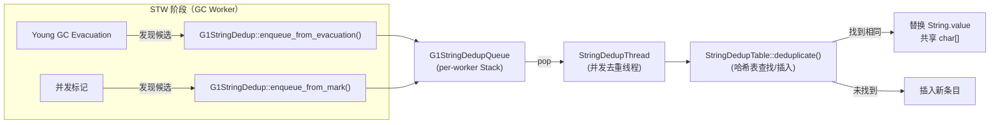
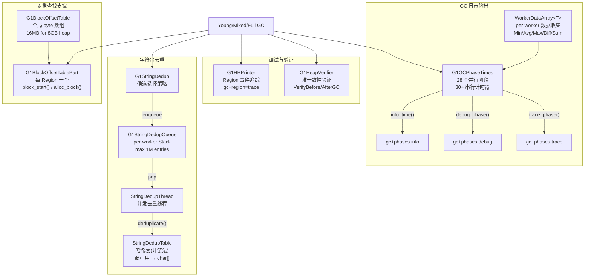

# #17 辅助子系统

> **涉及源文件**：g1BlockOffsetTable.hpp/cpp/inline.hpp、blockOffsetTable.hpp、g1GCPhaseTimes.hpp/cpp、workerDataArray.hpp、g1StringDedup.hpp/cpp、g1StringDedupQueue.hpp/cpp、stringDedupTable.hpp、stringDedupThread.hpp/inline.hpp、g1HRPrinter.hpp、g1HeapVerifier.hpp
>
> **标准环境**：`-Xms8g -Xmx8g -XX:+UseG1GC`，G1 Region = 4MB

---

## 第 0 部分：核心原理 ⭐

### 0.1 本文档涵盖什么？

本文档分析 G1 GC 的四个辅助子系统：**BOT**（块偏移表，解决"给定地址找对象起始位置"问题）、**G1GCPhaseTimes**（GC 阶段计时，支持 GC 日志和停顿预测）、**G1StringDedup**（字符串去重，减少重复字符串的内存占用）、**G1HeapVerifier**（堆验证，调试用）。

### 0.2 BOT 核心原理

**本质**：BOT（Block Offset Table）是一个**对数跳跃索引**，解决"给定堆地址，找到包含该地址的对象的起始地址"问题。每 512 字节（一张卡）对应一个 BOT 条目，记录"从这张卡的起始位置往前跳多少字节能找到对象起始位置"。

**为什么需要**：GC 扫描脏卡时，需要找到卡内所有对象的起始地址（才能扫描引用字段）。但对象大小不固定，无法直接计算；BOT 提供 O(log n) 的跳跃查找，比线性扫描快得多。

**为什么对数跳跃**：BOT 条目有两种编码：小偏移（< 8 字节）直接存偏移量，大偏移存"跳跃步长的指数"（每次跳跃距离翻倍）；最坏情况 O(log(region_size/card_size)) = O(log(4MB/512B)) = O(13) 次跳跃。

### 0.3 G1StringDedup 核心原理

**本质**：字符串去重是**一个后台线程维护的全局字符串哈希表**，将内容相同的 `char[]` 合并为同一个数组，减少内存占用。

**为什么需要**：Java 应用中大量字符串内容相同但对象不同（如 JSON 解析产生的重复键名），每个字符串对象有独立的 `char[]`，浪费内存；去重后多个 `String` 对象共享同一个 `char[]`。

**为什么需要年龄阈值（默认 3）**：新创建的字符串可能很快被回收，去重代价浪费；只对存活足够久（年龄 ≥ 3）的字符串去重，提高去重效率。

### 0.4 为什么这些子系统是"辅助"的？

这四个子系统不参与 GC 的核心流程（标记/疏散/回收），而是提供支撑服务：BOT 支撑 RSet 扫描，G1GCPhaseTimes 支撑停顿预测和日志，G1StringDedup 优化内存，G1HeapVerifier 支撑调试。它们的设计目标是"低开销、高可靠"。

---

## 一、G1BlockOffsetTable（BOT）

### 1.1 解决什么问题

GC 扫描时经常需要回答一个问题：**给定堆中任意一个地址，包含这个地址的对象从哪里开始？**

例如 RSet 告诉我们 "卡片 X 中有指向 Region Y 的引用"，但卡片覆盖 512 字节，里面可能有多个对象。GC 需要找到第一个跨越或落入这张卡片的对象起始地址，然后逐个扫描。

**BOT 就是为此设计的：一个全局 byte 数组，每个 byte 对应 512 字节堆内存，记录"向前回退多远能找到对象起始位置"。**

### 1.2 常量定义（BOTConstants）

定义在 `blockOffsetTable.hpp:50-76`：

```
BOTConstants:
  LogN       = 9          → 每个 BOT 条目覆盖 2^9 = 512 字节
  LogN_words = 7          → 512 / 8 = 64 HeapWords（64位系统）
  N_bytes    = 512        → 每条目覆盖的字节数
  N_words    = 64         → 每条目覆盖的 HeapWord 数
  LogBase    = 4          → 对数跳跃基数 = 16
  Base       = 16
  N_powers   = 14         → 最多 14 级对数区域
```

**关键换算**：
- 1 个 BOT 条目 = 1 张卡片 = 512 字节 = 64 HeapWords
- 1 个 4MB Region = 4MB / 512 = 8192 个 BOT 条目
- 整个 8GB 堆 = 8GB / 512 = 16M 条目 = 16MB BOT 数组

### 1.3 两层结构

```
┌──────────────────────────────────────────────────────────────────┐
│  G1BlockOffsetTable（全局唯一）                                    │
│                                                                    │
│  _reserved   : MemRegion     ← 覆盖整个堆地址范围                  │
│  _offset_array: volatile u_char*  ← BOT 字节数组基址               │
│                                                                    │
│  方法：                                                            │
│    index_for(p)         → 地址 → 数组下标                          │
│    address_for_index(i) → 数组下标 → 堆地址                       │
│    offset_array(i)      → 读取第 i 个条目的值                      │
│    set_offset_array(i, v) → 设置第 i 个条目                       │
└──────────────────────────────────────────────────────────────────┘
        ↑ 被引用
┌──────────────────────────────────────────────────────────────────┐
│  G1BlockOffsetTablePart（每 Region 一个）                          │
│                                                                    │
│  _bot   : G1BlockOffsetTable*  ← 指向全局 BOT                     │
│  _space : G1ContiguousSpace*   ← 所属 Region                      │
│  _next_offset_threshold : HeapWord*  ← 下一次需要更新 BOT 的边界   │
│  _next_offset_index     : size_t     ← 对应的数组下标              │
│                                                                    │
│  方法：                                                            │
│    block_start(addr)    → 核心查询方法                             │
│    alloc_block(start, end) → 对象分配后更新 BOT                    │
│    set_for_starts_humongous() → Humongous 对象 BOT 设置            │
│    reset_bot()          → 重置（Region 回收后）                    │
└──────────────────────────────────────────────────────────────────┘
```

### 1.4 BOT 条目编码规则

BOT 条目 (`u_char`) 的值有两种含义：

| 值范围 | 含义 |
|--------|------|
| `0 ~ 63`（< N_words） | 直接偏移：从当前卡片起始地址**向前退 offset 个 HeapWord** 就是对象起始 |
| `64 ~ 77`（N_words + 0 ~ N_words + 13） | 对数跳跃：向前跳 `16^(entry - N_words)` 张卡片，继续查找 |

对数跳跃编码详解：

```
entry = N_words + i（i = 0,1,2,...,13）
回跳卡片数 = 16^i

i=0 → entry=64 → 回跳 16^0 = 1 张卡片
i=1 → entry=65 → 回跳 16^1 = 16 张卡片
i=2 → entry=66 → 回跳 16^2 = 256 张卡片
i=3 → entry=67 → 回跳 16^3 = 4096 张卡片
...
```

这是一种**对数加速查找**的编码，用于大对象跨多张卡片时能快速回跳到对象起始位置。

### 1.5 set_remainder_to_point_to_start_incl() — 对数编码填充

源码 `g1BlockOffsetTable.cpp:140-165`，核心逻辑（剥离断言后）：

```cpp
void G1BlockOffsetTablePart::set_remainder_to_point_to_start_incl(
    size_t start_card, size_t end_card) {
  size_t start_card_for_region = start_card;
  u_char offset = max_jubyte;
  for (uint i = 0; i < BOTConstants::N_powers; i++) {
    // reach = 本区域能覆盖的最远卡片
    size_t reach = start_card - 1 + (BOTConstants::power_to_cards_back(i+1) - 1);
    offset = BOTConstants::N_words + i;  // 64+0, 64+1, 64+2, ...
    if (reach >= end_card) {
      // 当前对数区域就能覆盖到末尾
      set_offset_array(start_card_for_region, end_card, offset);
      break;
    }
    set_offset_array(start_card_for_region, reach, offset);
    start_card_for_region = reach + 1;
  }
}
```

**图示**（源码注释中的 ASCII art）：

```
                offset
                card             2nd                       3rd
                 | +- 1st        |                         |
                 v v             v                         v
                +-+-+-+-+-+-+-+-+-+-+-+-+-+-+     +-+-+-+-+-+-+-+-+-+-+-
                |x|0|0|0|0|0|0|0|1|1|1|1|1|1| ... |1|1|1|1|2|2|2|2|2|2|
                +-+-+-+-+-+-+-+-+-+-+-+-+-+-+     +-+-+-+-+-+-+-+-+-+-+-

x = 对象起始偏移（直接偏移值）
0 = N_words + 0 = 64  → 回跳 1 张卡片    → 覆盖最多 16-1=15 张卡片
1 = N_words + 1 = 65  → 回跳 16 张卡片   → 覆盖最多 256-16=240 张卡片
2 = N_words + 2 = 66  → 回跳 256 张卡片  → 覆盖最多 4096-256=3840 张卡片
```

### 1.6 block_start() — 核心查询算法

`g1BlockOffsetTable.inline.hpp:34-41`：

```cpp
inline HeapWord* G1BlockOffsetTablePart::block_start(const void* addr) {
  if (addr >= _space->bottom() && addr < _space->end()) {
    HeapWord* q = block_at_or_preceding(addr, true, _next_offset_index-1);
    return forward_to_block_containing_addr(q, addr);
  } else {
    return NULL;
  }
}
```

分两步：
1. **`block_at_or_preceding()`** — 利用 BOT 数组快速跳回，找到 addr 之前（或等于）的某个对象起始
2. **`forward_to_block_containing_addr()`** — 从该起始位置向前遍历对象，找到真正包含 addr 的对象

**block_at_or_preceding() 详解**（`inline.hpp:113-139`）：

```cpp
inline HeapWord* G1BlockOffsetTablePart::block_at_or_preceding(
    const void* addr, bool has_max_index, size_t max_index) const {
  size_t index = _bot->index_for(addr);
  if (has_max_index) {
    index = MIN2(index, max_index);  // 不超过已更新的范围
  }
  HeapWord* q = _bot->address_for_index(index);
  uint offset = _bot->offset_array(index);

  // 对数跳跃循环
  while (offset >= BOTConstants::N_words) {
    size_t n_cards_back = BOTConstants::entry_to_cards_back(offset);
    q -= (BOTConstants::N_words * n_cards_back);
    index -= n_cards_back;
    offset = _bot->offset_array(index);
  }
  // 最终 offset < N_words，直接回退
  q -= offset;
  return q;
}
```

**查找过程示例**：假设要查找地址落在 card #75 的对象起始

```
card #75 → offset_array[75] = 66 (N_words+2) → 回跳 256 张? 不对, 
           实际看 reach 计算: entry=66 → entry_to_cards_back(66) = 16^(66-64) = 16^2 = 256
           但 75-256 < 0, 所以这个不会是真实场景。
           
更真实的例子: 大对象从 card #11 开始, 跨到 card #75
card #11 → offset = 0 (对象从这个 card 开头开始)
card #12 ~ #26 → offset = 64 (回跳 1 张)
card #27 ~ #75 → offset = 65 (回跳 16 张)

查找 card #50:
  offset_array[50] = 65 → 回跳 16 张 → 跳到 card #34
  offset_array[34] = 65 → 回跳 16 张 → 跳到 card #18
  offset_array[18] = 64 → 回跳 1 张  → 跳到 card #17
  offset_array[17] = 64 → 回跳 1 张  → 跳到 card #16
  ...
  offset_array[12] = 64 → 回跳 1 张  → 跳到 card #11
  offset_array[11] = 0  → 直接偏移 0 → 对象从 card #11 起始!
```

### 1.7 alloc_block_work() — 对象分配后更新 BOT

`g1BlockOffsetTable.cpp:252-326`，核心逻辑（剥离断言后）：

```cpp
void G1BlockOffsetTablePart::alloc_block_work(
    HeapWord** threshold_, size_t* index_,
    HeapWord* blk_start, HeapWord* blk_end) {
  HeapWord* threshold = *threshold_;
  size_t index = *index_;

  // 1. 设置第一张跨越的卡片 —— 直接偏移
  _bot->set_offset_array(index, threshold, blk_start);
  // offset = threshold - blk_start（HeapWord 数）

  // 2. 如果对象跨越更多卡片，用对数编码填充
  size_t end_index = _bot->index_for(blk_end - 1);
  if (index + 1 <= end_index) {
    HeapWord* rem_st = _bot->address_for_index(index + 1);
    HeapWord* rem_end = _bot->address_for_index(end_index) + BOTConstants::N_words;
    set_remainder_to_point_to_start(rem_st, rem_end);
  }

  // 3. 更新 threshold 和 index 到下一个待更新位置
  *threshold_ = _bot->address_for_index(end_index) + BOTConstants::N_words;
  *index_ = end_index + 1;
}
```

**触发条件**：`alloc_block()` 只在 `blk_end > _next_offset_threshold` 时才调用 `alloc_block_work()`，即对象跨越了下一个卡片边界时才需要更新 BOT。

### 1.8 forward_to_block_containing_addr_slow() — LAB 修正

当使用 LAB（Local Allocation Buffer）分配时，BOT 可能不精确——LAB 整块被当作一个大对象记录在 BOT 中，但实际 LAB 内部有多个小对象。

`g1BlockOffsetTable.cpp:205-240` 处理这种情况：

```cpp
HeapWord* G1BlockOffsetTablePart::forward_to_block_containing_addr_slow(
    HeapWord* q, HeapWord* n, const void* addr) {
  size_t next_index = _bot->index_for(n) + !_bot->is_card_boundary(n);
  HeapWord* next_boundary = ...;  // 下一个卡片边界

  if (addr >= _space->top()) return _space->top();

  // 逐卡片修正 BOT 条目
  while (next_boundary < addr) {
    while (n <= next_boundary) {
      q = n;
      oop obj = oop(q);
      if (obj->klass_or_null_acquire() == NULL) return q;
      n += block_size(q);
    }
    // [q, n) 跨越了 next_boundary，更新 BOT
    alloc_block_work(&next_boundary, &next_index, q, n);
  }
  return forward_to_block_containing_addr_const(q, n, addr);
}
```

这是一种**惰性修正**：只有在实际查找时才修正不精确的 BOT 条目。

### 1.9 Humongous 对象的 BOT 设置

`g1BlockOffsetTable.cpp:416-423`：

```cpp
void G1BlockOffsetTablePart::set_for_starts_humongous(
    HeapWord* obj_top, size_t fill_size) {
  reset_bot();                                // 清零 bottom 条目 + 重置 threshold
  alloc_block(_space->bottom(), obj_top);     // 整个对象
  if (fill_size > 0) {
    alloc_block(obj_top, fill_size);          // 尾部 filler 对象
  }
}
```

Humongous 对象只在 starts_humongous Region 设置 BOT，continues_humongous Region 的 BOT 设置 `_object_can_span = true`。

### 1.10 Mermaid 图：BOT 查找流程

```mermaid
flowchart TD
    A["给定地址 addr"] --> B["index = index_for(addr)"]
    B --> C["读取 offset_array[index]"]
    C --> D{offset < N_words?}
    D -->|是| E["q = address_for_index(index) - offset\n找到候选对象起始"]
    D -->|否| F["n_cards_back = 16^(offset - N_words)\n向前跳 n_cards_back 张卡片"]
    F --> C
    E --> G["forward_to_block_containing_addr(q, addr)"]
    G --> H{q + block_size(q) > addr?}
    H -->|是| I["返回 q —— 找到!"]
    H -->|否| J["q = next_obj; 继续向前遍历"]
    J --> H
```

---

## 二、G1GCPhaseTimes + WorkerDataArray

### 2.1 解决什么问题

GC 暂停期间有多个并行阶段，每个阶段有多个 GC Worker 线程参与。**G1GCPhaseTimes 负责收集所有阶段的耗时数据并输出 GC 日志**。它是 GC 日志中 `gc+phases` 标签下所有输出的数据来源。

### 2.2 WorkerDataArray 模板

`workerDataArray.hpp:34-91`，每个 GC 阶段对应一个 `WorkerDataArray<double>`：

```
WorkerDataArray<T>:
  _data   : T*              ← 长度为 max_gc_threads 的数组
  _length : uint             ← = max_gc_threads
  _title  : const char*      ← 显示名称（如 "Ext Root Scanning (ms):"）
  _thread_work_items[3] : WorkerDataArray<size_t>*  ← 最多 3 个子计数器

核心方法:
  set(worker_i, value)  → 记录第 i 个 worker 的值
  get(worker_i)         → 读取第 i 个 worker 的值
  add(worker_i, value)  → 累加
  average()             → 所有 worker 平均值（跳过未初始化的）
  sum()                 → 所有 worker 总和

输出方法:
  print_summary_on(out) → 输出 Min/Avg/Max/Diff/Sum
  print_details_on(out) → 输出每个 worker 的具体值
```

`WDAPrinter` 负责格式化输出：
- `summary()`: 输出 `"Title: Min: X.X, Avg: X.X, Max: X.X, Diff: X.X, Sum: X.X"`
- `details()`: 输出 `"Title: X.X X.X X.X ..."`（每个 worker 一个值）

### 2.3 GCParPhases 枚举

`g1GCPhaseTimes.hpp:45-79` 定义了 28 个并行阶段：

| 枚举值 | 名称 | 含义 |
|--------|------|------|
| GCWorkerStart | GC Worker Start | Worker 启动时间戳 |
| ExtRootScan | Ext Root Scanning | 外部根扫描（总） |
| ThreadRoots | Thread Roots | Java 线程栈根 |
| StringTableRoots | StringTable Roots | 字符串表根 |
| UniverseRoots | Universe Roots | Universe 根 |
| JNIRoots | JNI Handles Roots | JNI 句柄根 |
| ObjectSynchronizerRoots | ObjectSynchronizer Roots | 同步器根 |
| ManagementRoots | Management Roots | 管理根 |
| SystemDictionaryRoots | SystemDictionary Roots | 系统字典根 |
| CLDGRoots | CLDG Roots | ClassLoaderDataGraph 根 |
| JVMTIRoots | JVMTI Roots | JVMTI 根 |
| CMRefRoots | CM RefProcessor Roots | 并发标记引用处理器根 |
| WaitForStrongCLD | Wait For Strong CLD | 等待强 CLD |
| WeakCLDRoots | Weak CLD Roots | 弱 CLD 根 |
| SATBFiltering | SATB Filtering | SATB 缓冲区过滤 |
| UpdateRS | Update RS | 更新 RSet（处理 DCQS 缓冲区） |
| ScanHCC | Scan HCC | 扫描 Hot Card Cache |
| ScanRS | Scan RS | 扫描 RSet |
| CodeRoots | Code Root Scanning | Code Cache 根扫描 |
| ObjCopy | Object Copy | 对象复制（疏散） |
| Termination | Termination | 工作窃取终止 |
| Other | GC Worker Other | 未分类的 worker 时间 |
| GCWorkerTotal | GC Worker Total | Worker 总耗时 |
| GCWorkerEnd | GC Worker End | Worker 结束时间戳 |
| StringDedupQueueFixup | Queue Fixup | 字符串去重队列修复 |
| StringDedupTableFixup | Table Fixup | 字符串去重表修复 |
| RedirtyCards | Parallel Redirty | 并行重脏卡片 |
| YoungFreeCSet | Young Free Collection Set | 释放年轻代 CSet |
| NonYoungFreeCSet | Non-Young Free Collection Set | 释放老年代 CSet |

子计数器（`WorkerDataArray<size_t>`）：
- **ScanRS** 有 3 个：ScannedCards / ClaimedCards / SkippedCards
- **UpdateRS** 有 3 个：ProcessedBuffers / ScannedCards / SkippedCards
- **Termination** 有 1 个：Termination Attempts
- **RedirtyCards** 有 1 个：Redirtied Cards

### 2.4 print() 输出架构

`g1GCPhaseTimes.cpp:449-465`：

```cpp
void G1GCPhaseTimes::print() {
  note_gc_end();  // 计算 GCWorkerTotal 和 Other

  if (_cur_verify_before_time_ms > 0.0)
    debug_time("Verify Before", ...);

  double accounted_ms = 0.0;
  accounted_ms += print_pre_evacuate_collection_set();   // 阶段 1
  accounted_ms += print_evacuate_collection_set();        // 阶段 2
  accounted_ms += print_post_evacuate_collection_set();   // 阶段 3
  print_other(accounted_ms);                              // 未计入的时间

  if (_cur_verify_after_time_ms > 0.0)
    debug_time("Verify After", ...);
}
```

输出日志层级对应：

| 方法 | 日志标签 | 级别 | 缩进 |
|------|---------|------|------|
| `info_time()` | `gc,phases` | info | 2 空格 |
| `debug_time()` | `gc,phases` | debug | 4 空格 |
| `debug_phase()` | `gc,phases` | debug | 4 空格 + Min/Avg/Max |
| `trace_time()` | `gc,phases` | trace | 6 空格 |
| `trace_phase()` | `gc,phases` | trace | 6 空格 + Min/Avg/Max |
| `trace_count()` | `gc,phases` | trace | 6 空格 + 计数 |
| per-worker details | `gc,phases,task` | trace | 8 空格 |

### 2.5 note_gc_end() — 计算 Worker 总耗时和 Other

`g1GCPhaseTimes.cpp:181-214`：

```
对每个 worker i：
  total_worker_time = GCWorkerEnd[i] - GCWorkerStart[i]
  GCWorkerTotal[i] = total_worker_time

  known_time = ExtRootScan + ScanHCC + UpdateRS + ScanRS
             + CodeRoots + ObjCopy + Termination
  Other[i] = total_worker_time - known_time
```

### 2.6 四段输出详解

**Pre Evacuate Collection Set**（`cpp:323-347`）：
```
[info] Pre Evacuate Collection Set: X.Xms
  [debug] Root Region Scan Waiting: X.Xms     ← 只在 > 0 时输出
  [debug] Prepare TLABs: X.Xms
  [debug] Choose Collection Set: X.Xms
  [debug] Humongous Register: X.Xms           ← G1EagerReclaimHumongousObjects
    [trace] Humongous Total: N
    [trace] Humongous Candidate: N
  [debug] Clear Claimed Marks: X.Xms          ← 只在 > 0 时（Concurrent Start）
```

**Evacuate Collection Set**（`cpp:349-375`）：
```
[info] Evacuate Collection Set: X.Xms
  [trace] GC Worker Start: Min/Avg/Max/Diff
  [debug] Ext Root Scanning: Min/Avg/Max/Diff/Sum
    [trace] Thread Roots / StringTable Roots / ... 各根类型
  [debug] Update RS: Min/Avg/Max/Diff/Sum
    [trace] Scan HCC
  [debug] Scan RS: Min/Avg/Max/Diff/Sum
    [子] Scanned/Claimed/Skipped Cards
  [debug] Code Root Scanning: Min/Avg/Max/Diff/Sum
  [debug] Object Copy: Min/Avg/Max/Diff/Sum
  [debug] Termination: Min/Avg/Max/Diff/Sum
    [子] Termination Attempts
  [debug] GC Worker Other: Min/Avg/Max/Diff/Sum
  [debug] GC Worker Total: Min/Avg/Max/Diff/Sum
  [trace] GC Worker End: Min/Avg/Max/Diff
```

**Post Evacuate Collection Set**（`cpp:377-443`）：
```
[info] Post Evacuate Collection Set: X.Xms
  [debug] Code Roots Fixup: X.Xms
  [debug] Clear Card Table: X.Xms
  [debug] Reference Processing: X.Xms
  [debug] Weak Processing: X.Xms
  [debug] String Dedup Fixup: X.Xms           ← UseStringDeduplication
    [debug] Queue Fixup: Min/Avg/Max/Diff/Sum
    [debug] Table Fixup: Min/Avg/Max/Diff/Sum
  [debug] Evacuation Failure: X.Xms           ← 仅发生 Evacuation Failure 时
    [trace] Recalculate Used: X.Xms
    [trace] Remove Self Forwards: X.Xms
  [debug] Merge Per-Thread State: X.Xms
  [debug] Code Roots Purge: X.Xms
  [debug] Redirty Cards: X.Xms
    [trace] Parallel Redirty: Min/Avg/Max/Diff/Sum
  [debug] Free Collection Set: X.Xms
    [trace] Free Collection Set Serial: X.Xms
    [trace] Young Free / Non-Young Free: Min/Avg/Max/Diff/Sum
  [debug] Humongous Reclaim: X.Xms
    [trace] Humongous Reclaimed: N
  [debug] Start New Collection Set: X.Xms
  [debug] Resize TLABs: X.Xms                 ← UseTLAB && ResizeTLAB
  [debug] Expand Heap After Collection: X.Xms
```

**Other**（`cpp:445-447`）：
```
[info] Other: X.Xms                           ← = gc_pause_time - 三段之和
```

### 2.7 辅助 Tracker 类

**G1GCParPhaseTimesTracker**（`cpp:491-502`）：
RAII 模式自动记录阶段耗时。构造函数记录 `_start_time = Ticks::now()`，析构函数 `record_time_secs(_phase, _worker_id, elapsed)`。

**G1EvacPhaseTimesTracker**（`cpp:504-522`）：
继承上面的 Tracker，额外处理 ObjCopy 的 trim time。在疏散阶段，worker 可能中途去 trim 对象队列（处理已复制对象的引用），这部分时间需要从当前阶段扣除并计入 ObjCopy。

**G1EvacPhaseWithTrimTimeTracker**（`cpp:467-489`）：
实际跟踪 trim 时间的类。通过 `_pss->trim_ticks()` 获取 PSS 中累积的 trim 时间。

### 2.8 查看 GC Phase 日志所需 JVM 参数

```bash
# info 级别（默认）
-Xlog:gc+phases=info

# debug 级别（看到各子阶段）
-Xlog:gc+phases=debug

# trace 级别（看到每个 worker 的详细数据）
-Xlog:gc+phases=trace

# trace + task 级别（看到每个 worker 的逐项值）
-Xlog:gc+phases+task=trace
```

---

## 三、字符串去重（String Deduplication）

### 3.1 解决什么问题

Java 应用中大量 String 对象可能有相同的 char[] 内容。字符串去重机制在 GC 期间发现候选 String，然后由专门的并发线程检查去重表，让内容相同的 String 共享同一个 char[] 数组，从而节省内存。

**开启方式**：`-XX:+UseStringDeduplication`（默认关闭）

### 3.2 架构总览



### 3.3 候选选择策略

**G1StringDedup::is_candidate_from_evacuation()**（`g1StringDedup.cpp:66-83`）：

```
条件: from_young == true && 是 java.lang.String 实例
  ├─ to_young && age == StringDeduplicationAgeThreshold → 候选!
  │   （年轻代 → 年轻代，正好达到年龄阈值）
  └─ !to_young && age < StringDeduplicationAgeThreshold → 候选!
      （年轻代 → 老年代，尚未达到阈值就被晋升）
```

**G1StringDedup::is_candidate_from_mark()**（`g1StringDedup.cpp:44-57`）：

```
条件: 是 java.lang.String 实例 && 在年轻代 Region && age < 阈值
```

**设计意图**：
- 每个 String 最多成为一次候选（避免重复入队）
- `age == threshold` 时入队：达到"成熟"年龄，说明这个 String 存活了足够久值得去重
- `age < threshold` 但被提升到 old：提前毕业，也要抓住这个机会去重
- 默认 `StringDeduplicationAgeThreshold = 3`

### 3.4 G1StringDedupQueue — 候选队列

`g1StringDedupQueue.hpp/cpp`：

```
G1StringDedupQueue:
  _queues    : G1StringDedupWorkerQueue*  ← 数组，每个 GC Worker 一个队列
  _nqueues   : size_t = ParallelGCThreads
  _cursor    : size_t                     ← pop 时的轮询游标
  _cancel    : bool                       ← 取消等待标志
  _empty     : volatile bool              ← 空标志
  _dropped   : uintx                      ← 被丢弃的计数
  _max_size  : 1000000                    ← 每个队列最大 100 万个元素
  _max_cache_size : 0                     ← 不缓存（Stack segment 不复用）

G1StringDedupWorkerQueue = Stack<oop, mtGC>
```

**push_impl()**（`cpp:69-89`）：在 Safepoint 中调用（STW 期间），无竞争直接 push 到 worker 对应的 queue。如果队列已满（100万），丢弃并计数。首次变非空时通过 `StringDedupQueue_lock` 唤醒去重线程。

**pop_impl()**（`cpp:91-116`）：去重线程调用（并发，但在 NoSafepointVerifier 下）。从 `_cursor` 指向的队列开始尝试 pop，若空则轮转到下一个队列，遍历所有队列后仍空则标记 `_empty = true`。跳过 NULL 条目（被 GC 清理的已死亡对象）。

### 3.5 StringDedupTable — 去重哈希表

`stringDedupTable.hpp:114-253`：

```
StringDedupTable:
  _table   : static StringDedupTable*    ← 当前活跃表（可能被替换）
  _buckets : StringDedupEntry**           ← 哈希桶数组
  _size    : size_t                       ← 桶数量（2 的幂）
  _entries : uintx                        ← 当前条目数
  _shrink_threshold : uintx               ← 缩容阈值
  _grow_threshold   : uintx               ← 扩容阈值
  _rehash_needed    : bool                ← 需要 rehash 标志
  _hash_seed        : uint64_t            ← 哈希种子（0=Java兼容, 非0=murmur3）

StringDedupEntry:
  _next   : StringDedupEntry*             ← 链表下一个（开链法）
  _hash   : unsigned int                  ← char[] 的哈希码
  _latin1 : bool                          ← 是否 Latin1 编码
  _obj    : typeArrayOop                  ← 弱引用 → char[] 数组
```

**核心方法 deduplicate()**：
1. 获取 String 的 `value` 字段（char[] 数组）
2. 计算哈希码
3. `lookup_or_add(value, latin1, hash)`：
   - 在哈希桶中查找相同内容的条目
   - 找到 → 将 String 的 value 替换为已有的 char[]（去重成功）
   - 未找到 → 插入新条目（这是第一个此内容的 String）

**动态调整**：
- 平均链长 > `_grow_load_factor` → 扩容（桶数翻倍）
- 平均链长 < `_shrink_load_factor` → 缩容（桶数减半）
- 某条链特别长 → 设置 `_rehash_needed = true`，更换哈希种子

**线程安全**：
- `StringDedupTable_lock` 保护并发 `lookup_or_add()`
- GC Safepoint 下 worker 可以无锁分区扫描

### 3.6 StringDedupThread — 并发去重线程

`stringDedupThread.inline.hpp:33-83`：

```
主循环:
  for (;;) {
    S stat;
    stat.mark_idle();
    
    StringDedupQueue::wait();      // 阻塞等待队列非空
    if (should_terminate()) break;
    
    {
      SuspendibleThreadSetJoiner sts_join;  // 加入可挂起集合
      stat.mark_exec();
      
      for (;;) {
        oop java_string = StringDedupQueue::pop();
        if (java_string == NULL) break;
        
        StringDedupTable::deduplicate(java_string, &stat);
        
        if (sts_join.should_yield()) {   // Safepoint 到来时让出
          stat.mark_block();
          sts_join.yield();
          stat.mark_unblock();
        }
      }
      
      stat.mark_done();
      total_stat.add(&stat);
    }
    
    StringDedupTable::clean_entry_cache();  // 清理条目缓存
  }
```

**线程名**：`"StrDedup"` （通过 `ConcurrentGCThread` 创建）

**与 GC 的协作**：
- 通过 `SuspendibleThreadSetJoiner` 加入可挂起线程集合
- GC 进入 Safepoint 前会等待可挂起线程 yield
- 去重线程在每次 `deduplicate()` 后检查是否需要 yield

### 3.7 GC 期间的队列/表清理

Young GC 的 post_evacuate 阶段会调用 `G1StringDedup::unlink_or_oops_do()`（`g1StringDedup.cpp:132-141`）：

```
G1StringDedupUnlinkOrOopsDoTask（并行任务）:
  对每个 worker:
    1. StringDedupQueue::unlink_or_oops_do()  // 清除队列中已死亡的 String
    2. StringDedupTable::unlink_or_oops_do()  // 清除表中已死亡的 char[] 条目
```

对应 GC 日志输出：
```
[debug] String Dedup Fixup: X.Xms
  [debug] Queue Fixup: Min: X.X, Avg: X.X, Max: X.X, ...
  [debug] Table Fixup: Min: X.X, Avg: X.X, Max: X.X, ...
```

### 3.8 查看 String Deduplication 日志所需 JVM 参数

```bash
# 开启字符串去重 + 查看统计信息
-XX:+UseStringDeduplication -Xlog:gc+stringdedup=debug

# 输出示例：
# [gc,stringdedup] Concurrent String Deduplication (X.Xms)
# [gc,stringdedup]   Deduplicated: 1234 (12.3K)
# [gc,stringdedup]   Young: 5678
# [gc,stringdedup]   Old: 1234
# [gc,stringdedup]   Queue
# [gc,stringdedup]     Dropped: 0
```

---

## 四、G1HRPrinter — Region 事件追踪

### 4.1 解决什么问题

追踪每个 HeapRegion 的生命周期事件：分配、退休、加入 CSet、疏散失败、清理、压缩后、提交、取消提交。

### 4.2 实现

`g1HRPrinter.hpp`，**纯 header-only 类**，所有方法内联。

**激活条件**：`log_is_enabled(Trace, gc, region)`

**输出格式**：
```
G1HR ACTION(TYPE) [bottom, top, end]
```

**所有事件**：

| 方法 | 输出 ACTION | 触发场景 |
|------|------------|---------|
| `alloc(hr)` | `ALLOC` | Region 被分配（Eden/Survivor/Old/Humongous） |
| `alloc(hr, true)` | `ALLOC-FORCE` | 强制分配（如 GC locker） |
| `retire(hr)` | `RETIRE` | Region 退休（TLAB 满/不再使用） |
| `reuse(hr)` | `REUSE` | Region 被重用 |
| `cset(hr)` | `CSET` | Region 加入 Collection Set |
| `evac_failure(hr)` | `EVAC-FAILURE` | Region 疏散失败 |
| `cleanup(hr)` | `CLEANUP` | 并发标记 Cleanup 阶段回收 |
| `post_compaction(hr)` | `POST-COMPACTION` | Full GC 压缩后 |
| `commit(hr)` | `COMMIT` | Region 内存提交 |
| `uncommit(hr)` | `UNCOMMIT` | Region 内存取消提交 |

**`retire()` 的优化**：`SKIP_RETIRED_FULL_REGIONS = 1`，如果 Region 已完全用满（`top == end`），退休事件不输出（减少日志噪音）。

**TYPE** 来自 `HeapRegion::get_type_str()`，可能的值：
- `"Eden"` / `"Survivor"` / `"Old"` / `"Humongous"` / `"Archive"` / `"Free"`

### 4.3 查看 Region 事件日志所需 JVM 参数

```bash
-Xlog:gc+region=trace

# 输出示例：
# [trace][gc,region] G1HR ALLOC(Eden) [0x00000007c0000000, 0x00000007c0000000, 0x00000007c0400000]
# [trace][gc,region] G1HR RETIRE(Eden) [0x00000007c0000000, 0x00000007c0380000, 0x00000007c0400000]
# [trace][gc,region] G1HR CSET(Eden) [0x00000007c0000000, 0x00000007c0380000, 0x00000007c0400000]
# [trace][gc,region] G1HR ALLOC(Survivor) [0x00000007c0c00000, 0x00000007c0c00000, 0x00000007c1000000]
```

---

## 五、G1HeapVerifier — 堆验证器

### 5.1 解决什么问题

在 GC 前后**验证堆的一致性**，帮助开发者发现 GC bug。验证包括：对象引用合法性、位图正确性、Region 集合一致性、CardTable 正确性等。

**开启方式**：`-XX:+VerifyBeforeGC -XX:+VerifyAfterGC`

### 5.2 G1VerifyType 枚举

`g1HeapVerifier.hpp:44-52`：

```cpp
enum G1VerifyType {
  G1VerifyYoungNormal     =  1,  // young-normal
  G1VerifyConcurrentStart =  2,  // concurrent-start
  G1VerifyMixed           =  4,  // mixed
  G1VerifyRemark          =  8,  // remark
  G1VerifyCleanup         = 16,  // cleanup
  G1VerifyFull            = 32,  // full
  G1VerifyAll             = -1   // 所有类型
};
```

位掩码设计，可以组合多种类型。

### 5.3 VerifyGCType 参数

通过 `-XX:VerifyGCType=xxx` 可以只验证特定类型的 GC：

```bash
# 只验证 Young GC (Normal)
-XX:+VerifyBeforeGC -XX:+VerifyAfterGC -XX:VerifyGCType=young-normal

# 验证 Remark 和 Cleanup
-XX:+VerifyBeforeGC -XX:+VerifyAfterGC -XX:VerifyGCType=remark,cleanup

# 验证 Full GC
-XX:+VerifyBeforeGC -XX:+VerifyAfterGC -XX:VerifyGCType=full
```

不指定 `VerifyGCType` 时默认验证所有类型。

### 5.4 核心验证方法

| 方法 | 功能 |
|------|------|
| `verify_before_gc(type)` | GC 前验证（使用 UsePrevMarking） |
| `verify_after_gc(type)` | GC 后验证 |
| `verify(vo)` | 执行实际验证，vo 指定使用哪个标记信息 |
| `verify_region_sets_optional()` | DEBUG 模式验证 Region 集合 |
| `verify_no_bits_over_tams(bitmap, from, limit)` | 验证 TAMS 之上无标记位 |
| `check_bitmaps(caller, hr)` | 验证位图无杂散标记 |
| `check_cset_fast_test()` | 验证 CSet 快速测试表 |
| `verify_card_table_cleanup()` | 验证 CardTable 已清理 |
| `verify_dirty_young_regions()` | 验证年轻代 Region 全脏 |

**VerifyOption 枚举**（`Universe` 中定义）：
- `UsePrevMarking` — 使用 prev 标记位图（大多数时候用这个）
- `UseNextMarking` — 使用 next 标记位图（Remark 结束时）
- `UseFullMarking` — 使用 next 位图但无 TAMS（Full GC）

### 5.5 日志输出

验证结果通过 `gc,verify` 标签输出：

```bash
-XX:+VerifyBeforeGC -XX:+VerifyAfterGC -Xlog:gc+verify=debug

# 输出示例：
# [debug][gc,verify] Verifying Before GC (young-normal)
# [debug][gc,verify] Heap
# [debug][gc,verify]  garbage-first heap   total 8388608K, used 524288K [...]
# [debug][gc,verify] Verifying After GC (young-normal)
```

**注意**：验证非常耗时，**仅用于调试**，不要在生产环境开启。

---

## 六、Mermaid 图：辅助子系统全景



---

## 七、GDB 验证

### 7.1 验证 BOT 数组

```bash
# 查看 BOT 全局表
(gdb) p G1CollectedHeap::_g1h->_bot
# 查看 offset_array 基址
(gdb) p/x G1CollectedHeap::_g1h->_bot->_offset_array

# 查看某个 Region 的 BOT Part
(gdb) set $r = G1CollectedHeap::_g1h->_hrm._regions.data()[0]
(gdb) p $r->_bot_part._next_offset_threshold
(gdb) p $r->_bot_part._next_offset_index

# 读取 BOT 条目值
(gdb) set $bot = G1CollectedHeap::_g1h->_bot
(gdb) set $idx = ((char*)$r->_bottom - (char*)$bot->_reserved._start) >> 9
(gdb) p (int)$bot->_offset_array[$idx]
# 预期输出：0（Region 开头的第一个对象偏移为 0）
(gdb) p (int)$bot->_offset_array[$idx+1]
# 可能是 0~63（直接偏移）或 >=64（对数跳跃）
```

### 7.2 验证 BOT 常量

```bash
(gdb) p BOTConstants::LogN
# 预期：9
(gdb) p BOTConstants::N_words
# 预期：64
(gdb) p BOTConstants::N_bytes
# 预期：512
(gdb) p BOTConstants::N_powers
# 预期：14
```

### 7.3 验证 GCPhaseTimes 数据

```bash
# 在 G1GCPhaseTimes::print() 设断点
(gdb) break g1GCPhaseTimes.cpp:449
(gdb) continue

# 查看暂停时间
(gdb) p _gc_pause_time_ms

# 查看并行阶段数据
(gdb) p _gc_par_phases[1]->_title
# 预期："Ext Root Scanning (ms):"
(gdb) p _gc_par_phases[1]->_data[0]
# 第 0 个 worker 的 ExtRootScan 时间
```

### 7.4 验证 StringDedup（需开启 -XX:+UseStringDeduplication）

```bash
# 查看队列信息
(gdb) p StringDedupQueue::_queue
# 查看去重表
(gdb) p StringDedupTable::_table->_size
(gdb) p StringDedupTable::_table->_entries
```

### 7.5 GDB 脚本

```gdb
# file: new-jvm-md/tmp-file/aux-subsystems/verify_bot.gdb

set pagination off
set logging file new-jvm-md/tmp-file/aux-subsystems/bot_verify.log
set logging on

# 断点在 Young GC 开始
break g1CollectedHeap.cpp:3620
commands
  silent
  printf "=== Young GC BOT Verification ===\n"
  
  # BOT 全局信息
  set $bot = G1CollectedHeap::_g1h->_bot
  printf "BOT offset_array base: %p\n", $bot->_offset_array
  printf "BOT reserved start: %p\n", $bot->_reserved._start
  printf "BOT reserved end: %p\n", $bot->_reserved._end
  
  # Region 0 的 BOT
  set $r0 = G1CollectedHeap::_g1h->_hrm._regions.data()[0]
  printf "Region 0 bottom: %p\n", $r0->_bottom
  printf "Region 0 top: %p\n", $r0->_top
  printf "Region 0 BOT threshold: %p\n", $r0->_bot_part._next_offset_threshold
  printf "Region 0 BOT index: %lu\n", $r0->_bot_part._next_offset_index
  
  # 前 8 个 BOT 条目
  set $base_idx = ((unsigned long)$r0->_bottom - (unsigned long)$bot->_reserved._start) >> 9
  printf "Region 0 base BOT index: %lu\n", $base_idx
  printf "BOT[0..7]: %d %d %d %d %d %d %d %d\n", \
    (int)$bot->_offset_array[$base_idx+0], \
    (int)$bot->_offset_array[$base_idx+1], \
    (int)$bot->_offset_array[$base_idx+2], \
    (int)$bot->_offset_array[$base_idx+3], \
    (int)$bot->_offset_array[$base_idx+4], \
    (int)$bot->_offset_array[$base_idx+5], \
    (int)$bot->_offset_array[$base_idx+6], \
    (int)$bot->_offset_array[$base_idx+7]
  
  continue
end

run -Xms8g -Xmx8g -XX:+UseG1GC -Xint -cp /data/workspace/demo/src com.wjcoder.Main

set logging off
```

---

## 八、关键参数汇总

| 参数 | 默认值 | 说明 |
|------|--------|------|
| `UseStringDeduplication` | false | 开启字符串去重 |
| `StringDeduplicationAgeThreshold` | 3 | 字符串去重年龄阈值 |
| `G1EagerReclaimHumongousObjects` | true | 积极回收 Humongous |
| `VerifyBeforeGC` | false | GC 前验证堆 |
| `VerifyAfterGC` | false | GC 后验证堆 |
| `VerifyGCType` | (空=全部) | 指定验证的 GC 类型 |

日志标签：

| 标签组合 | 级别 | 内容 |
|---------|------|------|
| `gc+phases` | info | Pre/Evacuate/Post/Other 四段耗时 |
| `gc+phases` | debug | 各子阶段耗时 + 并行阶段 Min/Avg/Max |
| `gc+phases` | trace | 更细粒度子阶段 |
| `gc+phases+task` | trace | 每个 worker 的逐项值 |
| `gc+region` | trace | Region 事件（ALLOC/RETIRE/CSET/...） |
| `gc+stringdedup` | debug | 字符串去重统计 |
| `gc+verify` | debug | 验证结果 |
| `gc+bot` | trace | BOT 创建信息 |
