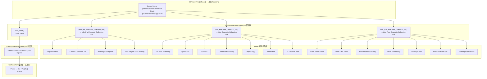
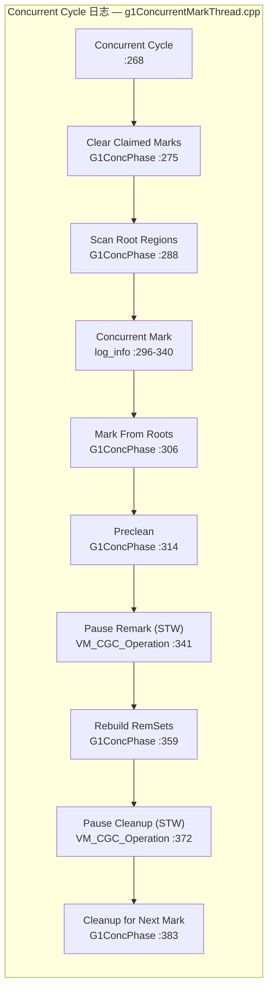

# #18 GC 日志实战：从日志到源码的完全映射

> 基于 OpenJDK 11 slowdebug，标准环境 -Xms8g -Xmx8g -XX:+UseG1GC，G1 Region = 4MB。
> 日志示例使用 256MB 堆以便快速触发各种 GC 事件。

---

## 第 0 部分：核心原理 ⭐

### 0.1 本质是什么？

GC 日志的本质是**GC 内部状态的文本快照**：每条日志对应源码中一个 `log_info(gc,...)` 调用，记录 GC 阶段的时间、内存变化、停顿原因等关键指标。理解日志 = 理解 GC 内部流程。

### 0.2 为什么需要？

GC 是黑盒，应用开发者无法直接观察 GC 内部状态。GC 日志是唯一的观测窗口：通过日志可以判断 GC 类型（Young/Mixed/Full）、停顿时间、内存回收效率、是否有 Evacuation Failure 等问题，是 GC 调优的基础。

### 0.3 关键日志格式

**Young GC**：`[GC pause (G1 Evacuation Pause) (young) <time>ms]`
- `G1 Evacuation Pause`：疏散暂停（复制存活对象）
- `young`：只回收 Young Region
- 对应源码：`g1CollectedHeap.cpp` 中 `do_collection_pause_at_safepoint()` 开始时的 `log_info(gc)`

**Mixed GC**：`[GC pause (G1 Evacuation Pause) (mixed) <time>ms]`
- `mixed`：同时回收 Young + 部分 Old Region
- 触发条件：并发标记完成后，Old 区占用 > `G1MixedGCLiveThresholdPercent`

**Concurrent Cycle**：`[GC concurrent-mark-start]` → `[GC concurrent-mark-end]` → `[GC remark]` → `[GC cleanup]`
- 对应并发标记的五个阶段

**Full GC**：`[GC pause (G1 Compaction Pause) (full) <time>ms]`
- 触发条件：Evacuation Failure / `System.gc()` / 堆空间不足

### 0.4 为什么这样设计？

- **为什么 JDK 11 用 `-Xlog:gc*` 而不是 `-XX:+PrintGCDetails`？** JEP 158 统一日志框架，所有 JVM 子系统使用同一套日志 API；`-Xlog` 支持按 tag/level 过滤，比 `-XX:+PrintGCDetails` 更灵活
- **为什么日志中有 `(young)` 和 `(mixed)` 区分？** 两种 GC 的 CSet 组成不同（Young Only vs Young+Old），停顿时间特征不同；区分有助于诊断问题（如 Mixed GC 停顿过长说明 Old Region 太多）
- **为什么 Concurrent Cycle 的日志分散在多行？** 并发标记的各阶段在不同时间执行（Initial Mark 搭便车在 Young GC 中，Concurrent Mark 在后台），日志按时间顺序输出，自然分散

---

## 一、GC 日志框架：从 -Xlog 到源码

### 1.1 JEP 158 统一日志框架

JDK 9+ 使用统一日志框架（Unified Logging），取代了之前的 `-verbose:gc`、`-XX:+PrintGCDetails` 等零散参数。

**核心语法**：
```
-Xlog:[tag1[+tag2...]*][=[level]][:[output][:[decorators][:output-options]]]
```

**日志级别**（从少到多）：

| 级别 | 含义 | 典型用途 |
|------|------|----------|
| `off` | 关闭 | 关闭特定标签 |
| `error` | 错误 | JVM 内部错误 |
| `warning` | 警告 | 潜在问题 |
| `info` | 信息 | **默认级别，GC 主要事件** |
| `debug` | 调试 | **phases 详细子阶段，ergo 决策** |
| `trace` | 追踪 | **每个 Worker 线程的数据** |

### 1.2 G1 GC 相关日志标签

所有日志标签定义在 `src/hotspot/share/logging/logTag.hpp` 的 `LOG_TAG_LIST` 宏中。

**G1 GC 常用标签组合**：

| 标签组合 | 输出内容 | 来源文件 |
|---------|---------|---------|
| `gc` | 顶级 GC 暂停行 | `g1CollectedHeap.cpp:3620` |
| `gc,start` | GC 开始标记 | `GCTraceTime` 自动注入 |
| `gc,phases` | 阶段耗时树 | `g1GCPhaseTimes.cpp` |
| `gc,heap` | Eden/Survivor/Old 区域变化 | `g1HeapTransition.cpp` |
| `gc,metaspace` | Metaspace 变化 | `MetaspaceUtils::print_metaspace_change()` |
| `gc,cpu` | User/Sys/Real CPU 时间 | `GCTraceCPUTime` |
| `gc,task` | Worker 线程数量 | `g1CollectedHeap.cpp:3626` |
| `gc,mmu` | MMU 目标违规警告 | `g1MMUTracker` |
| `gc,ergo` | 策略决策信息 | `g1Policy.cpp`, `g1CollectionSet.cpp` |
| `gc,ergo,cset` | CSet 选择决策 | `g1CollectionSet.cpp` |
| `gc,ergo,heap` | 堆扩缩容决策 | `g1HeapSizingPolicy.cpp`, `g1CollectedHeap.cpp` |
| `gc,ergo,ihop` | IHOP 阈值决策 | `g1Policy.cpp:593` |
| `gc,ergo,refine` | 并发精化阈值 | `g1Policy.cpp:772` |
| `gc,ihop` | IHOP 详细预测数据 | `g1IHOPControl.cpp` |
| `gc,marking` | 并发标记阶段 | `g1ConcurrentMarkThread.cpp` |
| `gc,stringtable` | 字符串/符号表清理 | Remark 阶段 |
| `gc,heap,exit` | JVM 退出时堆摘要 | `CollectedHeap::print_on_error()` |
| `gc,alloc,region` | Region 分配详情 | `g1AllocRegion.cpp` |
| `gc,verify` | 堆验证 | `G1HeapVerifier` |
| `gc,ref` | 引用处理详情 | `ReferenceProcessor` |
| `gc,age` | 年龄表/晋升阈值 | `ageTable.cpp` |

### 1.3 推荐日志配置

#### 生产环境（info 级别）
```bash
-Xlog:gc*=info:file=gc.log:time,uptime,level,tags:filecount=10,filesize=100m
```
输出 GC 主事件 + 阶段总计 + 堆变化。约 10-20 行/次 GC。

#### 排查问题（debug 级别）
```bash
-Xlog:gc*=info,gc+phases=debug,gc+ergo=debug,gc+ihop=debug:file=gc.log:time,uptime,level,tags
```
增加每个子阶段耗时 + 策略决策日志。约 40-60 行/次 GC。

#### 深度分析（trace 级别）
```bash
-Xlog:gc*=info,gc+phases=trace,gc+ergo=debug,gc+ihop=debug:file=gc.log:time,uptime,level,tags
```
增加每个 Worker 线程的独立数据。约 80-120 行/次 GC。

#### 只看顶级事件（最简洁）
```bash
-Xlog:gc:file=gc.log
```
每次 GC 只输出一行摘要。

### 1.4 日志框架源码机制

GC 日志使用两种宏：

**1. `GCTraceTime` — STW 暂停计时**（`gcTraceTime.inline.hpp:158`）
```cpp
#define GCTraceTime(Level, ...) GCTraceTimeImplWrapper<LogLevel::Level, LOG_TAGS(__VA_ARGS__)>
```
构造时记录开始时间 + 打印 start 行（带 `start` 标签），析构时打印结束行（含耗时和堆变化）。

**2. `GCTraceConcTime` — 并发阶段计时**（`gcTraceTime.inline.hpp:159`）
```cpp
#define GCTraceConcTime(Level, ...) GCTraceConcTimeImpl<LogLevel::Level, LOG_TAGS(__VA_ARGS__)>
```
构造时打印阶段名，析构时打印阶段名 + 耗时。

**3. `log_info/debug/trace(gc, ...)` — 直接日志**
```cpp
log_info(gc, phases)("%s%s: " TIME_FORMAT, Indents[1], name, value);
```
`g1GCPhaseTimes.cpp` 中的 `info_time()`、`debug_time()`、`trace_time()` 封装了不同级别的日志输出。

---

## 二、Young GC 日志逐行解读

### 2.1 完整 Young GC 日志示例（debug 级别）

以下是一次完整的 Young GC（Normal）日志，每一行都标注了**对应的源码位置**：

```
[1.053s][info ][gc,start] GC(0) Pause Young (Normal) (G1 Evacuation Pause)     ← ①
[1.053s][info ][gc,task ] GC(0) Using 6 workers of 13 for evacuation            ← ②
```

**① 顶级 GC 暂停行** — `g1CollectedHeap.cpp:3605-3620`

```cpp
FormatBuffer<> gc_string("Pause Young ");
if (collector_state()->in_initial_mark_gc()) {
    gc_string.append("(Concurrent Start)");      // Initial Mark
} else if (collector_state()->in_young_only_phase()) {
    if (collector_state()->in_young_gc_before_mixed()) {
        gc_string.append("(Prepare Mixed)");      // Remark/Cleanup 后的最后一次 Young GC
    } else {
        gc_string.append("(Normal)");              // 普通 Young GC
    }
} else {
    gc_string.append("(Mixed)");                   // Mixed GC
}
GCTraceTime(Info, gc) tm(gc_string, NULL, gc_cause(), true);
```

**Pause 类型含义**：

| 日志文本 | 含义 | G1CollectorState |
|---------|------|-----------------|
| `Pause Young (Normal)` | 普通年轻代收集 | `in_young_only_phase && !in_initial_mark && !in_young_gc_before_mixed` |
| `Pause Young (Concurrent Start)` | 触发并发标记的 Young GC | `in_initial_mark_gc` |
| `Pause Young (Prepare Mixed)` | 并发标记完成后的准备 GC | `in_young_gc_before_mixed` |
| `Pause Young (Mixed)` | 混合收集 | `!in_young_only_phase && !in_full_gc` |

括号中的 `(G1 Evacuation Pause)` 是 `gc_cause()`，表示触发原因。

**② Worker 线程数** — `g1CollectedHeap.cpp:3622-3626`

```cpp
uint active_workers = AdaptiveSizePolicy::calc_active_workers(workers()->total_workers(),
                                                              workers()->active_workers(),
                                                              Threads::number_of_non_daemon_threads());
log_info(gc, task)("Using %u workers of %u for evacuation", active_workers, workers()->total_workers());
```

### 2.2 Pre Evacuate Collection Set

```
[1.082s][info ][gc,phases] GC(0)   Pre Evacuate Collection Set: 0.0ms     ← ③
[1.082s][debug][gc,phases] GC(0)     Prepare TLABs: 0.3ms                 ← ④
[1.082s][debug][gc,phases] GC(0)     Choose Collection Set: 0.0ms          ← ⑤
[1.082s][debug][gc,phases] GC(0)     Humongous Register: 0.0ms             ← ⑥
```

**源码**: `g1GCPhaseTimes.cpp:323-346` — `print_pre_evacuate_collection_set()`

```cpp
double print_pre_evacuate_collection_set() const {
    const double sum_ms = _root_region_scan_wait_time_ms +           // Root Region 扫描等待
                          _recorded_young_cset_choice_time_ms +       // 年轻代 CSet 选择
                          _recorded_non_young_cset_choice_time_ms +   // 老年代 CSet 选择
                          _cur_fast_reclaim_humongous_register_time_ms + // Humongous 注册
                          _recorded_clear_claimed_marks_time_ms;      // 清除 claimed marks
    info_time("Pre Evacuate Collection Set", sum_ms);                 // ← ③ info 级别
    debug_time("Prepare TLABs", _cur_prepare_tlab_time_ms);          // ← ④ debug 级别
    debug_time("Choose Collection Set", ...);                          // ← ⑤ debug 级别
    debug_time("Humongous Register", _cur_fast_reclaim_humongous_register_time_ms); // ← ⑥
}
```

| 子阶段 | 含义 | 关注点 |
|--------|------|-------|
| Prepare TLABs | 准备线程本地分配缓冲区 | 通常 < 1ms |
| Choose Collection Set | 选择回收集合 | 大堆时可能 > 1ms |
| Humongous Register | 注册可回收的巨型对象 | 有很多 humongous 时关注 |
| Root Region Scan Waiting | 等待并发根区域扫描完成 | 并发标记期间才出现 |
| Clear Claimed Marks | 清除并发标记的 claimed 标记 | Initial Mark 时才出现 |

### 2.3 Evacuate Collection Set（核心阶段）

```
[1.082s][info ][gc,phases] GC(0)   Evacuate Collection Set: 18.5ms                                         ← ⑦
[1.082s][debug][gc,phases] GC(0)     Ext Root Scanning (ms):   Min:  0.4, Avg:  1.9, Max:  7.0, ...       ← ⑧
[1.082s][debug][gc,phases] GC(0)     Update RS (ms):           Min:  0.0, Avg:  0.0, Max:  0.0, ...       ← ⑨
[1.082s][debug][gc,phases] GC(0)       Processed Buffers:        Min: 0, Avg:  0.0, Max: 0, ...            ← ⑩
[1.082s][debug][gc,phases] GC(0)       Scanned Cards:            Min: 0, Avg:  0.0, Max: 0, ...
[1.082s][debug][gc,phases] GC(0)       Skipped Cards:            Min: 0, Avg:  0.0, Max: 0, ...
[1.082s][debug][gc,phases] GC(0)     Scan RS (ms):             Min:  0.0, Avg:  0.0, Max:  0.0, ...       ← ⑪
[1.082s][debug][gc,phases] GC(0)       Scanned Cards:            ...
[1.082s][debug][gc,phases] GC(0)       Claimed Cards:            ...
[1.082s][debug][gc,phases] GC(0)       Skipped Cards:            ...
[1.082s][debug][gc,phases] GC(0)     Code Root Scanning (ms):  Min:  0.0, Avg:  0.1, Max:  0.5, ...       ← ⑫
[1.082s][debug][gc,phases] GC(0)     Object Copy (ms):         Min:  7.3, Avg:  7.3, Max:  7.4, ...       ← ⑬
[1.082s][debug][gc,phases] GC(0)     Termination (ms):         Min:  0.0, Avg:  0.0, Max:  0.0, ...       ← ⑭
[1.082s][debug][gc,phases] GC(0)     GC Worker Other (ms):     Min:  0.0, Avg:  0.0, Max:  0.0, ...
[1.082s][debug][gc,phases] GC(0)     GC Worker Total (ms):     Min: 18.3, Avg: 18.3, Max: 18.3, ...
```

**源码**: `g1GCPhaseTimes.cpp:349-375` — `print_evacuate_collection_set()`

**统计格式含义**：每个并行阶段显示 `Min / Avg / Max / Diff / Sum / Workers`，
- `Min/Max`：最快/最慢的 Worker
- `Diff = Max - Min`：Worker 间的**负载均衡度**，越大越不均衡
- `Sum`：所有 Worker 的总和
- `Avg = Sum / Workers`

| 子阶段 | 源码 | 含义 | 健康标准 |
|--------|------|------|---------|
| ⑧ Ext Root Scanning | `GCParPhases::ExtRootScan` | 扫描 GC Root（线程栈、JNI、SystemDictionary 等） | < 5ms，Diff < 3ms |
| ⑨ Update RS | `GCParPhases::UpdateRS` | 处理 Dirty Card Queue 更新 RSet | 取决于突变率，通常 < 10ms |
| ⑩ Processed Buffers | `UpdateRSProcessedBuffers` | 处理的 DCQ 缓冲区数 | — |
| ⑪ Scan RS | `GCParPhases::ScanRS` | 扫描 RSet 中的 card 找跨 Region 引用 | 大 RSet 时可能耗时 |
| ⑫ Code Root Scanning | `GCParPhases::CodeRoots` | 扫描 nmethod 中的内嵌 oop | 通常 < 1ms |
| ⑬ Object Copy | `GCParPhases::ObjCopy` | **核心阶段**：将存活对象复制到 Survivor/Old | 占总暂停 50-80% |
| ⑭ Termination | `GCParPhases::Termination` | Worker 完成后的工作窃取终止 | 应接近 0ms |

**trace 级别** 还会额外输出每种 Root 类型的耗时（ThreadRoots、StringTableRoots、UniverseRoots、JNIRoots、ObjectSynchronizerRoots、ManagementRoots、SystemDictionaryRoots、CLDGRoots、JVMTIRoots、CMRefProcessorRoots、WaitForStrongCLD、WeakCLDRoots、SATBFiltering），每个来自 `g1GCPhaseTimes.cpp:356-358`。

### 2.4 Post Evacuate Collection Set

```
[1.082s][info ][gc,phases] GC(0)   Post Evacuate Collection Set: 9.8ms                     ← ⑮
[1.082s][debug][gc,phases] GC(0)     Code Roots Fixup: 0.0ms                                ← ⑯
[1.082s][debug][gc,phases] GC(0)     Clear Card Table: 0.6ms                                ← ⑰
[1.082s][debug][gc,phases] GC(0)     Reference Processing: 0.1ms                            ← ⑱
[1.082s][debug][gc,phases] GC(0)     Weak Processing: 0.1ms                                 ← ⑲
[1.082s][debug][gc,phases] GC(0)     Merge Per-Thread State: 0.1ms
[1.082s][debug][gc,phases] GC(0)     Code Roots Purge: 0.0ms
[1.082s][debug][gc,phases] GC(0)     Redirty Cards: 0.1ms                                   ← ⑳
[1.082s][debug][gc,phases] GC(0)     Free Collection Set: 0.1ms
[1.082s][debug][gc,phases] GC(0)     Humongous Reclaim: 0.0ms
[1.082s][debug][gc,phases] GC(0)     Start New Collection Set: 0.0ms
[1.082s][debug][gc,phases] GC(0)     Resize TLABs: 0.0ms
[1.082s][debug][gc,phases] GC(0)     Expand Heap After Collection: 0.0ms
```

**源码**: `g1GCPhaseTimes.cpp:377-443` — `print_post_evacuate_collection_set()`

| 子阶段 | 含义 | 关注点 |
|--------|------|-------|
| ⑯ Code Roots Fixup | 修复 nmethod 中的 code root | 通常 < 1ms |
| ⑰ Clear Card Table | 清除已回收 Region 的 card table | 与回收 Region 数成正比 |
| ⑱ Reference Processing | 处理 Soft/Weak/Final/Phantom 引用 | 引用多时可能耗时 |
| ⑲ Weak Processing | 处理 WeakProcessor 注册的弱引用 | — |
| ⑳ Redirty Cards | 重标脏卡（并发精化需要） | — |
| Evacuation Failure | **仅在疏散失败时出现** | 🔴 需立即关注 |
| Humongous Reclaim | 回收不再被引用的巨型对象 | 有 Humongous 时关注 |
| Expand Heap After Collection | GC 后堆扩容 | 堆未达最大时可能出现 |

### 2.5 Other + 汇总行

```
[1.082s][info ][gc,phases] GC(0)   Other: 1.5ms                                             ← ㉑
```

**源码**: `g1GCPhaseTimes.cpp:445-447`

```cpp
void G1GCPhaseTimes::print_other(double accounted_ms) const {
    info_time("Other", _gc_pause_time_ms - accounted_ms);   // 总暂停 - 已记账时间
}
```

`Other` = 总暂停时间 - Pre Evacuate - Evacuate - Post Evacuate。包含 SafePoint 到达时间、日志记录时间等。如果此值很大（> 10ms），可能是 SafePoint 达到慢。

### 2.6 堆变化 + 汇总

```
[1.082s][info][gc,heap    ] GC(0) Eden regions: 24->0(123)                                   ← ㉒
[1.082s][info][gc,heap    ] GC(0) Survivor regions: 0->3(3)
[1.082s][info][gc,heap    ] GC(0) Old regions: 0->4
[1.082s][info][gc,heap    ] GC(0) Humongous regions: 0->0
[1.082s][info][gc,metaspace] GC(0) Metaspace: 6488K(6784K)->6488K(6784K) ...
[1.082s][info][gc          ] GC(0) Pause Young (Normal) (G1 Evacuation Pause) 23M->6M(256M) 29.348ms   ← ㉓
[1.082s][info][gc,cpu      ] GC(0) User=0.10s Sys=0.00s Real=0.03s                           ← ㉔
```

**㉒ 堆区域变化** — `g1HeapTransition.cpp:80-120`

格式：`<type> regions: <before>-><after>(<capacity>)`
- `Eden regions: 24->0(123)` — 24 个 Eden Region 全部回收，下次 Eden 容量为 123 个 Region
- `Survivor regions: 0->3(3)` — 存活对象晋升到 3 个 Survivor Region
- `Old regions: 0->4` — 有 4 个 Region 晋升到 Old（无容量显示，Old 没有固定上限）

**㉓ 顶级汇总行** — `GCTraceTime` 析构时输出

格式：`Pause <type> (<cause>) <heap_before>-><heap_after>(<heap_capacity>) <duration>`
- `23M->6M(256M)` — 堆使用量从 23MB 降到 6MB，总容量 256MB
- `29.348ms` — 总 STW 暂停时间

**㉔ CPU 时间** — `GCTraceCPUTime` 析构时输出

- `User` — 用户态 CPU 时间（所有线程加总）
- `Sys` — 内核态 CPU 时间
- `Real` — 墙钟时间（= STW 暂停时间）
- **健康标准**: `User/Real ≈ ParallelGCThreads` 表示并行度良好

### 2.7 IHOP 信息（debug 级别）

```
[1.082s][debug][gc,ihop] GC(0) Basic information (value update), threshold: 120795955B (45.00),
    target occupancy: 268435456B, current occupancy: 6395904B,
    recent allocation size: 653696B, recent allocation duration: 1043.06ms,
    recent old gen allocation rate: 626710.96B/s, recent marking phase length: 0.00ms

[1.082s][debug][gc,ihop] GC(0) Adaptive IHOP information (value update), threshold: 120795955B (52.94),
    internal target occupancy: 228170137B, occupancy: 6395904B,
    additional buffer size: 131072000B,
    predicted old gen allocation rate: 1253421.92B/s,
    predicted marking phase length: 0.00ms, prediction active: false
```

**源码**: `g1IHOPControl.cpp:165-178` — `G1AdaptiveIHOPControl::print()`

| 字段 | 含义 |
|------|------|
| `threshold` | 当前 IHOP 阈值（超过此值触发并发标记） |
| `target occupancy` | 目标堆占用（= 最大堆容量） |
| `current occupancy` | 当前老年代占用 |
| `recent old gen allocation rate` | 近期老年代分配速率 |
| `predicted marking phase length` | 预测的标记阶段时长 |
| `prediction active` | 自适应预测是否激活（需 3 次样本） |
| `additional buffer size` | 额外缓冲区（年轻代 + 预留区大小） |

### 2.8 MMU 违规（info 级别）

```
[1.852s][info][gc,mmu] GC(0) MMU target violated: 201.0ms (200.0ms/201.0ms)
```

含义：在过去 201ms 的时间窗口内，GC 暂停时间 200ms 超过了 `MaxGCPauseMillis`（默认 200ms）的目标。

**源码**: `g1MMUTracker` 在每次 GC 后检查，如果窗口内 GC 时间占比超过 `_max_gc_time/_time_slice`，则输出此警告。

---

## 三、Concurrent Marking 日志逐行解读

### 3.1 完整并发标记周期

```
① [1.740s][info][gc          ] GC(5) Concurrent Cycle
② [1.740s][info][gc,marking  ] GC(5) Concurrent Clear Claimed Marks
   [1.740s][info][gc,marking  ] GC(5) Concurrent Clear Claimed Marks 0.017ms
③ [1.740s][info][gc,marking  ] GC(5) Concurrent Scan Root Regions
   [1.751s][info][gc,marking  ] GC(5) Concurrent Scan Root Regions 10.913ms
④ [1.751s][info][gc,marking  ] GC(5) Concurrent Mark (1.751s)
   [1.751s][info][gc,marking  ] GC(5) Concurrent Mark From Roots
   [1.751s][info][gc,task     ] GC(5) Using 3 workers of 3 for marking
   [1.772s][info][gc,marking  ] GC(5) Concurrent Mark From Roots 21.542ms
⑤ [1.772s][info][gc,marking  ] GC(5) Concurrent Preclean
   [1.773s][info][gc,marking  ] GC(5) Concurrent Preclean 0.483ms
   [1.773s][info][gc,marking  ] GC(5) Concurrent Mark (1.751s, 1.773s) 22.063ms
⑥ [1.773s][info][gc,start    ] GC(5) Pause Remark
   [1.788s][info][gc,stringtable] GC(5) Cleaned string and symbol table, strings: 1114 processed, 4 removed, symbols: 24351 processed, 0 removed
   [1.788s][info][gc          ] GC(5) Pause Remark 173M->173M(256M) 15.304ms
   [1.788s][info][gc,cpu      ] GC(5) User=0.04s Sys=0.01s Real=0.01s
⑦ [1.789s][info][gc,marking  ] GC(5) Concurrent Rebuild Remembered Sets
   [1.815s][info][gc,marking  ] GC(5) Concurrent Rebuild Remembered Sets 26.514ms
⑧ [1.815s][info][gc,start    ] GC(5) Pause Cleanup
   [1.816s][info][gc          ] GC(5) Pause Cleanup 173M->173M(256M) 0.447ms
   [1.816s][info][gc,cpu      ] GC(5) User=0.00s Sys=0.00s Real=0.00s
⑨ [1.816s][info][gc,marking  ] GC(5) Concurrent Cleanup for Next Mark
   [1.817s][info][gc,marking  ] GC(5) Concurrent Cleanup for Next Mark 1.249ms
⑩ [1.817s][info][gc          ] GC(5) Concurrent Cycle 77.516ms
```

### 3.2 各阶段详解

**① Concurrent Cycle 开始** — `g1ConcurrentMarkThread.cpp:268`

```cpp
GCTraceConcTime(Info, gc) tt("Concurrent Cycle");
```

整个并发周期的 RAII 计时器。析构时输出 ⑩ 的总耗时。

**② Clear Claimed Marks** — `g1ConcurrentMarkThread.cpp:275`

```cpp
G1ConcPhase p(G1ConcurrentPhase::CLEAR_CLAIMED_MARKS, this);
```
清除上一轮标记遗留的 claimed 标记。极快（< 1ms）。

**③ Scan Root Regions** — `g1ConcurrentMarkThread.cpp:288`

```cpp
G1ConcPhase p(G1ConcurrentPhase::SCAN_ROOT_REGIONS, this);
_cm->scan_root_regions();
```
扫描 Survivor Region 中的对象作为并发标记的根。**此阶段必须在下一次 Young GC 前完成**，否则 Young GC 需要等待（显示为 `Root Region Scan Waiting`）。

**④ Concurrent Mark From Roots** — `g1ConcurrentMarkThread.cpp:306`

```cpp
G1ConcPhase p(G1ConcurrentPhase::MARK_FROM_ROOTS, this);
```
核心标记阶段。使用 `ConcGCThreads` 个线程并发遍历对象图。耗时与存活对象数成正比。

**⑤ Concurrent Preclean** — `g1ConcurrentMarkThread.cpp:314`

预清理：处理标记过程中新增的 SATB 引用变更，减少 Remark 的工作量。

**⑥ Pause Remark（STW）** — `g1ConcurrentMarkThread.cpp:341-344`

```cpp
CMRemark cl(_cm);
VM_CGC_Operation op(&cl, "Pause Remark");
VMThread::execute(&op);
```
STW 暂停，完成标记的最终处理。debug 级别会显示子阶段：

```
[debug][gc,phases] GC(5) Finalize Marking 0.296ms         ← 完成标记
[debug][gc,phases] GC(5) Reference Processing 0.135ms     ← 引用处理
[debug][gc,phases] GC(5) Weak Processing 0.042ms          ← 弱引用处理
[debug][gc,phases] GC(5) ClassLoaderData 0.341ms           ← ClassLoader 清理
[debug][gc,phases] GC(5) Class Unloading 14.590ms          ← 类卸载（可能耗时长！）
[debug][gc,phases] GC(5) Flush Task Caches 0.102ms
[debug][gc,phases] GC(5) Update Remembered Set Tracking Before Rebuild 0.227ms
[debug][gc,phases] GC(5) Reclaim Empty Regions 0.090ms     ← 回收空的老年代 Region
[debug][gc,phases] GC(5) Purge Metaspace 0.001ms
[debug][gc,phases] GC(5) Report Object Count 0.001ms
```

**健康标准**: Remark 通常 < 30ms。如果 Class Unloading 时间长，考虑 `-XX:-ClassUnloadingWithConcurrentMark`。

**⑦ Concurrent Rebuild Remembered Sets** — `g1ConcurrentMarkThread.cpp:358-361`

```cpp
G1ConcPhase p(G1ConcurrentPhase::REBUILD_REMEMBERED_SETS, this);
_cm->rebuild_rem_set_concurrently();
```
并发重建老年代 Region 的 RSet。耗时与老年代 Region 数成正比。

**⑧ Pause Cleanup（STW）** — `g1ConcurrentMarkThread.cpp:372-376`

非常短的 STW 暂停。debug 级别：

```
[debug][gc,phases] GC(5) Update Remembered Set Tracking After Rebuild 0.101ms
[debug][gc,ergo ] GC(5) request young-only gcs (reclaimable percentage not over threshold).
                        candidate old regions: 3 reclaimable: 1501968 (0.56) threshold: 5
[debug][gc,phases] GC(5) Finalize Concurrent Mark Cleanup 0.171ms
```

**关键 ergo 日志**：`reclaimable percentage not over threshold` 表示可回收的老年代空间（0.56%）低于 `G1HeapWastePercent`（默认 5%），因此**不会进入 Mixed GC 阶段**，而是继续 Young Only GC。

**⑨ Cleanup for Next Mark** — `g1ConcurrentMarkThread.cpp:382-384`

并发清理：交换 prev/next 位图，清理下次标记用的 next 位图。

**⑩ Concurrent Cycle 总耗时** — `GCTraceConcTime` 析构输出

---

## 四、Mixed GC 日志逐行解读

Mixed GC 与 Young GC 的日志结构**完全相同**，只有以下区别：

### 4.1 顶级行标记为 Mixed

```
[2.500s][info][gc,start] GC(8) Pause Young (Mixed) (G1 Evacuation Pause)
```

**来源**: `g1CollectedHeap.cpp:3617`，当 `!in_young_only_phase() && !in_full_gc()` 时。

### 4.2 CSet 选择的 ergo 决策（关键信息）

debug 级别下 `gc,ergo,cset` 会显示 CSet 的选择过程：

```
[trace][gc,ergo,cset] Start choosing CSet. pending cards: 2048
    predicted base time: 12.50ms remaining time: 187.50ms target pause time: 200.00ms

[trace][gc,ergo,cset] Add young regions to CSet. eden: 89 regions, survivors: 13 regions,
    predicted young region time: 85.00ms, target pause time: 200.00ms

[debug][gc,ergo,cset] Finish adding old regions to CSet (predicted time is too high).
    predicted time: 195.00ms target time: 200.00ms old: 45 regions
    min: 4 regions
```

**源码**: `g1CollectionSet.cpp:401-535`

Mixed GC 终止条件（任一满足即停止添加 Old Region）：

| 终止原因 | 源码行 | 日志文本 |
|---------|--------|---------|
| 达到最大 Old Region 数 | 459 | `old CSet region num reached max` |
| 可回收比例低于阈值 | 473 | `reclaimable percentage not over threshold` |
| 预测时间超过目标 | 487 | `predicted time is too high` |
| 达到最小 Old Region 数 | 502 | `old CSet region num reached min` |
| 没有候选 Region | 518 | `candidate old regions not available` |

### 4.3 Mixed GC 持续条件

每次 Cleanup 后决定是否进入 Mixed 阶段：

```
[debug][gc,ergo] request mixed gcs (candidate old regions available).
    candidate old regions: 120 reclaimable: 314572800 (3.66) threshold: 5
```

或不进入的原因：

```
[debug][gc,ergo] request young-only gcs (reclaimable percentage not over threshold).
    candidate old regions: 3 reclaimable: 1501968 (0.56) threshold: 5
```

**源码**: `g1Policy.cpp:1132-1151` — `next_gc_should_be_mixed()`

```cpp
bool G1Policy::next_gc_should_be_mixed(...) const {
    if (!collection_set()->candidates()->is_empty()) {
        // 还有候选 Region
        if (reclaimable_perc > G1HeapWastePercent) {
            // 可回收比例超过阈值 → 继续 Mixed
            return true;
        }
    }
    return false;
}
```

---

## 五、Full GC 日志逐行解读

### 5.1 完整 Full GC 日志

```
[3.100s][info][gc,start ] GC(15) Pause Full (Allocation Failure)                 ← ①
[3.100s][info][gc,phases] GC(15)   Phase 1: Mark live objects 150.5ms            ← ②
[3.250s][info][gc,phases] GC(15)   Phase 2: Prepare for compaction 20.3ms       ← ③
[3.270s][info][gc,phases] GC(15)   Phase 3: Adjust pointers 45.8ms              ← ④
[3.316s][info][gc,phases] GC(15)   Phase 4: Compact heap 30.2ms                 ← ⑤
[3.346s][info][gc,heap  ] GC(15) Eden regions: 0->0(12)
[3.346s][info][gc,heap  ] GC(15) Survivor regions: 0->0(0)
[3.346s][info][gc,heap  ] GC(15) Old regions: 240->180
[3.346s][info][gc,heap  ] GC(15) Humongous regions: 5->2
[3.346s][info][gc       ] GC(15) Pause Full (Allocation Failure) 250M->182M(256M) 246.0ms
[3.346s][info][gc,cpu   ] GC(15) User=1.50s Sys=0.02s Real=0.25s
```

### 5.2 各阶段详解

**① 触发原因** — `g1CollectedHeap.cpp:1145`

```cpp
GCTraceTime(Info, gc) tm("Pause Full", NULL, gc_cause(), true);
```

常见 GC Cause：
- `Allocation Failure` — 分配失败（最常见）
- `System.gc()` — 显式调用 `System.gc()`
- `Metadata GC Threshold` — Metaspace 满
- `Heap Dump Initiated GC` — 堆 dump 触发

**② Phase 1: Mark live objects** — `g1FullCollector.cpp:203-234`

标记所有存活对象。debug 级别子阶段：
```
[debug][gc,phases] GC(15)     Phase 1: Weak Processing 0.5ms
[debug][gc,phases] GC(15)     Phase 1: Class Unloading and Cleanup 8.2ms
```

**③ Phase 2: Prepare for compaction** — `g1FullCollector.cpp:236-245`

计算每个存活对象的新地址（转发地址）。

**④ Phase 3: Adjust pointers** — `g1FullCollector.cpp:247-253`

更新所有引用指向新地址。

**⑤ Phase 4: Compact heap** — `g1FullCollector.cpp:255-265`

物理移动对象到新位置。

**Full GC 健康标准**: Full GC 在 G1 中应该**极少发生**（理想情况下从不发生）。如果频繁 Full GC：
- 堆太小 → 增大堆
- 内存泄漏 → 分析对象引用链
- Humongous 分配过多 → 优化大对象分配

---

## 六、ergo 决策日志详解

ergo（ergonomics）日志记录 G1 的**所有自适应决策过程**，是调优的核心信息。

### 6.1 并发标记触发决策

```
[debug][gc,ergo,ihop] GC(3) Request concurrent cycle initiation
    (occupancy higher than threshold) occupancy: 142606336B
    allocation request: 0B threshold: 120795955B (45.00) source: end of GC

[debug][gc,ergo] Initiate concurrent cycle (concurrent cycle initiation requested)
```

**源码**: `g1Policy.cpp:579-599` — `need_to_start_conc_mark()`

当 `non_young_capacity_bytes > ihop_threshold` 时触发。

### 6.2 堆扩缩容决策

```
[debug][gc,ergo,heap] Attempt heap expansion
    (recent GC overhead higher than threshold after GC)
    recent GC overhead: 15.00% threshold: 7.69%
    uncommitted: 4294967296B base expansion amount and target: 429496729B
```

**源码**: `g1HeapSizingPolicy.cpp:49-158` — `expansion_amount()`

阈值 = `100 / (1 + GCTimeRatio)` = 100 / (1 + 12) ≈ 7.69%。

### 6.3 并发精化阈值调整

```
[debug][gc,ergo,refine] Initial Refinement Zones:
    green: 13, yellow: 39, red: 65, min yellow size: 26
```

- `green` — 低于此值不触发精化线程
- `yellow` — 超过此值激活额外精化线程
- `red` — 超过此值在 mutator 中直接精化
- 初始值基于 `ParallelGCThreads`

---

## 七、关键参数调优实验

### 7.1 MaxGCPauseMillis 对年轻代大小的影响

```bash
# 默认 200ms
-XX:MaxGCPauseMillis=200
# 日志中 Eden regions: 123 个 → 暂停约 200ms

# 减小到 50ms
-XX:MaxGCPauseMillis=50
# 日志中 Eden regions: 30 个 → 暂停约 50ms，但 GC 更频繁
```

**原理**: `g1Policy.cpp:326-426` — `calculate_young_list_target_length()` 二分搜索。
减小 `MaxGCPauseMillis` → 预测模型允许更少的 Young Region → Eden 更小 → GC 更频繁但每次更短。

### 7.2 G1MixedGCLiveThresholdPercent 对 Mixed GC 的影响

```bash
-XX:G1MixedGCLiveThresholdPercent=85    # 默认值
```

只有存活率低于此阈值的 Old Region 才会被选为 Mixed GC 候选。降低此值 → 更少候选 Region → Mixed GC 更快但回收更少。

### 7.3 G1HeapWastePercent 对 Mixed GC 持续条件的影响

```bash
-XX:G1HeapWastePercent=5    # 默认值
```

当可回收空间占比低于此值时停止 Mixed GC。增大此值 → 更早停止 Mixed GC → 减少暂停但可能增加 Full GC 风险。

在日志中体现为：
```
[debug][gc,ergo] request young-only gcs (reclaimable percentage not over threshold).
    candidate old regions: 3 reclaimable: 1501968 (0.56) threshold: 5
```

### 7.4 IHOP 自适应 vs 固定阈值

```bash
# 自适应（默认）
-XX:+G1UseAdaptiveIHOP
-XX:InitiatingHeapOccupancyPercent=45

# 固定阈值
-XX:-G1UseAdaptiveIHOP
-XX:InitiatingHeapOccupancyPercent=45
```

日志中 `prediction active: true/false` 表示自适应是否激活。自适应模式下 IHOP 会根据实际分配速率和标记时长自动调整。

### 7.5 ParallelGCThreads / ConcGCThreads 对性能的影响

```bash
# 查看当前值
-Xlog:gc=debug   # 显示 "ParallelGCThreads: 13" 和 "ConcGCThreads: 3"

# 调整
-XX:ParallelGCThreads=8    # STW 阶段的并行线程数
-XX:ConcGCThreads=4        # 并发标记线程数
```

日志中体现：
```
[info][gc,task] GC(0) Using 8 workers of 8 for evacuation     ← STW 阶段
[info][gc,task] GC(5) Using 4 workers of 4 for marking         ← 并发标记
```

---

## 八、故障场景日志分析

### 8.1 Evacuation Failure（To-space 耗尽）

```
[info ][gc          ] GC(12) To-space exhausted                              ← 🔴 关键告警
[debug][gc,phases   ] GC(12)     Evacuation Failure 15.3ms
[trace][gc,phases   ] GC(12)       Recalculate Used 2.1ms
[trace][gc,phases   ] GC(12)       Remove Self Forwards 13.2ms
```

**源码**: `g1CollectedHeap.cpp:3824-3825`

```cpp
if (evacuation_failed()) {
    log_info(gc)("To-space exhausted");
}
```

**含义**: 复制存活对象时没有足够的空闲 Region。
**后果**: 未能复制的对象留在原地（self-forwarding），标记为 pinned。
**排查**:
1. 检查 `Humongous regions` 是否占用大量空间
2. 检查 `Old regions` 是否接近总 Region 数
3. 检查 `-XX:G1ReservePercent`（默认 10%）是否足够

### 8.2 Full GC 频繁触发特征

**正常模式**:
```
GC(0) Pause Young (Normal) → GC(1) Pause Young (Normal) → ...
```

**异常模式**:
```
GC(0) Pause Young (Normal)
GC(1) Pause Young (Concurrent Start)     ← 触发并发标记
GC(2) Pause Full (Allocation Failure)    ← 🔴 并发标记还没完成就 Full GC 了
GC(3) Pause Full (Allocation Failure)    ← 🔴 连续 Full GC
```

**原因分析**:
- 分配速率太快，并发标记来不及完成
- 堆太小，没有足够的缓冲空间
- 解决：增大堆 / 降低 `InitiatingHeapOccupancyPercent` / 增加 `ConcGCThreads`

### 8.3 长暂停排查

如果暂停时间远超 `MaxGCPauseMillis`，按以下顺序排查：

**Step 1**: 看 Evacuate Collection Set 中哪个子阶段最慢

```
Ext Root Scanning: 50ms     ← 根扫描慢 → 线程太多？JVMTI agent？
Update RS: 100ms            ← RSet 更新慢 → 突变率太高？
Scan RS: 80ms               ← RSet 扫描慢 → RSet 太大？
Object Copy: 200ms          ← 复制慢 → 存活对象太多？Region 太多？
Termination: 50ms           ← 终止慢 → 负载不均衡
```

**Step 2**: 看 Diff 值（负载均衡度）

```
Object Copy (ms): Min: 50.0, Avg: 150.0, Max: 200.0, Diff: 150.0
```
`Diff` = 150ms 表示严重的负载不均衡，某些 Worker 处理了远多于平均的对象。

**Step 3**: 看 Post Evacuate 中的 Reference Processing

```
Reference Processing: 500ms   ← 🔴 引用处理慢
```
可能有大量 Soft/Weak/Final Reference 等待处理。考虑 `-XX:+ParallelRefProcEnabled`。

---

## 九、日志级别输出对照表

### 9.1 各级别输出的日志条目

| 日志条目 | info | debug | trace |
|---------|------|-------|-------|
| **Young GC 顶级行** | ✅ | ✅ | ✅ |
| Worker 线程数 (`gc,task`) | ✅ | ✅ | ✅ |
| Pre/Evacuate/Post 总计 (`gc,phases`) | ✅ | ✅ | ✅ |
| Pre Evacuate 子阶段 | ❌ | ✅ | ✅ |
| Evacuate 子阶段 (ExtRoot/UpdateRS/ScanRS/...) | ❌ | ✅ | ✅ |
| 每种 Root 类型耗时 | ❌ | ❌ | ✅ |
| GC Worker Start/End 时间戳 | ❌ | ❌ | ✅ |
| Scan HCC | ❌ | ❌ | ✅ |
| Post Evacuate 子阶段 | ❌ | ✅ | ✅ |
| Free CSet Serial/Parallel | ❌ | ❌ | ✅ |
| Humongous 计数 | ❌ | ❌ | ✅ |
| 堆区域变化 (`gc,heap`) | ✅ | ✅ | ✅ |
| 堆区域 Used/Waste 详情 | ❌ | ❌ | ✅ |
| Metaspace (`gc,metaspace`) | ✅ | ✅ | ✅ |
| CPU 时间 (`gc,cpu`) | ✅ | ✅ | ✅ |
| MMU 违规 (`gc,mmu`) | ✅ | ✅ | ✅ |
| IHOP 信息 (`gc,ihop`) | ❌ | ✅ | ✅ |
| ergo 决策 (`gc,ergo`) | ❌ | ✅ | ✅ |
| ergo CSet 选择 (`gc,ergo,cset`) | ❌ | ❌ | ✅ |

### 9.2 源码中的日志级别分层

```
g1GCPhaseTimes.cpp 中的方法 → 日志级别对照：

info_time()     → log_info(gc, phases)     → 4 个主阶段总计
debug_time()    → log_debug(gc, phases)    → 每个子阶段
trace_time()    → log_trace(gc, phases)    → 子阶段的子项
debug_phase()   → log_debug(gc, phases)    → 并行阶段 Min/Avg/Max
trace_phase()   → log_trace(gc, phases)    → 并行阶段详情
```

---

## 十、完整日志→源码映射 Mermaid 图





---

## 十一、实际 GC 日志输出示例（完整参考）

### 11.1 info 级别输出（生产推荐）

以下是使用 `-Xms256m -Xmx256m -XX:+UseG1GC -Xlog:gc*=info` 的真实输出：

```
[0.010s][info][gc,heap] Heap region size: 1M

[0.031s][info][gc     ] Using G1
[0.031s][info][gc,heap,coops] Heap address: 0x00000000f0000000, size: 256 MB, Compressed Oops mode: 32-bit

[1.294s][info][gc,start     ] GC(0) Pause Young (Normal) (G1 Evacuation Pause)
[1.295s][info][gc,task      ] GC(0) Using 6 workers of 13 for evacuation
[1.324s][info][gc,phases    ] GC(0)   Pre Evacuate Collection Set: 0.0ms
[1.324s][info][gc,phases    ] GC(0)   Evacuate Collection Set: 18.0ms
[1.324s][info][gc,phases    ] GC(0)   Post Evacuate Collection Set: 9.8ms
[1.324s][info][gc,phases    ] GC(0)   Other: 1.5ms
[1.324s][info][gc,heap      ] GC(0) Eden regions: 24->0(123)
[1.324s][info][gc,heap      ] GC(0) Survivor regions: 0->3(3)
[1.324s][info][gc,heap      ] GC(0) Old regions: 0->4
[1.324s][info][gc,heap      ] GC(0) Humongous regions: 0->0
[1.324s][info][gc,metaspace ] GC(0) Metaspace: 6488K(6784K)->6488K(6784K) ...
[1.324s][info][gc           ] GC(0) Pause Young (Normal) (G1 Evacuation Pause) 23M->6M(256M) 29.348ms
[1.324s][info][gc,cpu       ] GC(0) User=0.10s Sys=0.00s Real=0.03s
```

### 11.2 JVM 退出时的堆摘要

```
[1.905s][info][gc,heap,exit ] Heap
[1.905s][info][gc,heap,exit ]  garbage-first heap   total 262144K, used 177312K [0x00000000f0000000, 0x0000000100000000)
[1.905s][info][gc,heap,exit ]   region size 1024K, 34 young (139264K), 13 survivors (53248K)
[1.905s][info][gc,heap,exit ]  Metaspace       used 6818K, capacity 6925K, committed 7168K, reserved 1056768K
[1.905s][info][gc,heap,exit ]   class space    used 608K, capacity 662K, committed 768K, reserved 1048576K
```

---

## 十二、GC 日志健康度速查表

| 指标 | 健康值 | 不健康值 | 排查方向 |
|------|--------|---------|---------|
| Young GC 暂停 | < 200ms | > 500ms | Object Copy 慢？Region 太多？ |
| Young GC 频率 | > 1s 间隔 | < 100ms 间隔 | 堆太小？Eden 太小？ |
| Remark 暂停 | < 30ms | > 100ms | Class Unloading 慢？引用处理慢？ |
| Cleanup 暂停 | < 5ms | > 20ms | — |
| Full GC | 从不发生 | 任何一次 | 🔴 堆太小？内存泄漏？ |
| To-space exhausted | 从不出现 | 任何一次 | 🔴 增大堆或增大 G1ReservePercent |
| Object Copy Diff | < 20ms | > 100ms | 负载不均衡 |
| User/Real 比值 | ≈ 线程数 | << 1 或 >> 线程数 | CPU 竞争或 IO 阻塞 |
| IHOP prediction active | true | false（长期） | 还在收集样本（正常前 3 次 GC） |
| 并发标记耗时 | 堆大小的 1-2ms/GB | > 5ms/GB | ConcGCThreads 不足？ |

---

## 总结

G1 GC 日志从源码角度分为三层：

1. **GCTraceTime 框架层** — 自动打印 start/end 行和堆变化
2. **G1GCPhaseTimes 阶段层** — `print()` 方法按 Pre/Evacuate/Post/Other 四段输出
3. **log_xxx(gc, ergo/ihop) 决策层** — 记录所有自适应调整的输入和输出

掌握这三层，就能从任何一行 GC 日志追溯到对应的 C++ 源码位置。
