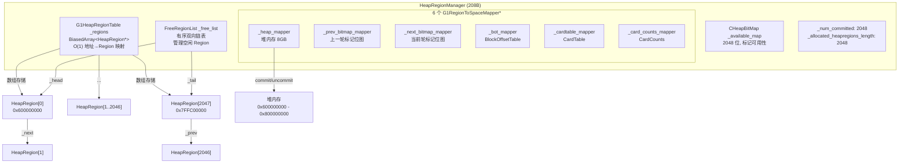
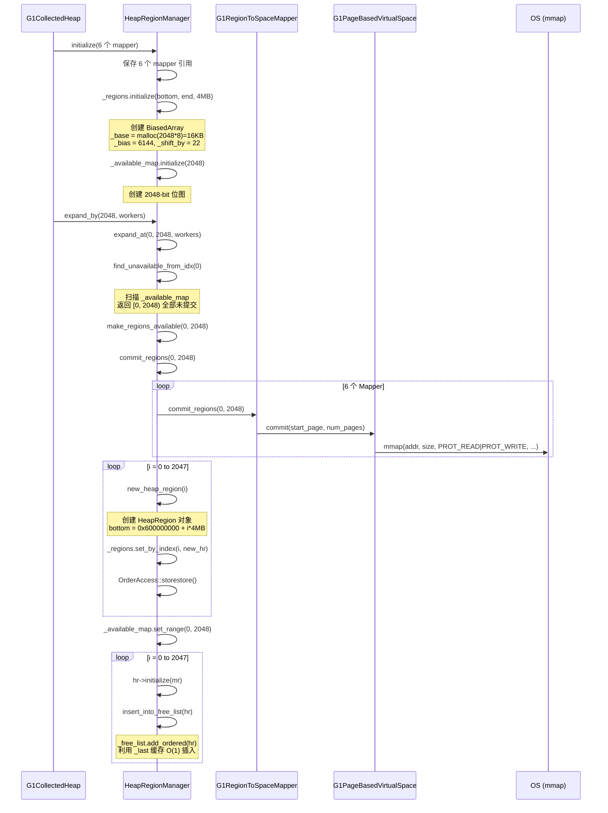

# HeapRegionManager 深度分析

> 标准环境：`-Xms8g -Xmx8g -XX:+UseG1GC`，Region = 4MB，共 2048 个 Region

---

## 第 0 部分：核心原理 ⭐

### 0.1 本质是什么？

HeapRegionManager 的本质是 **G1 堆的 Region 元数据管理器 + 六路同步内存映射器**：维护 2048 个 HeapRegion 对象的数组（`_regions`），提供地址→Region 的 O(1) 映射，并在堆扩展/收缩时同步 commit/uncommit 堆内存和 5 个辅助数据结构（BOT/CardTable/CardCounts/PrevBitmap/NextBitmap）。

### 0.2 为什么需要？

G1 将堆切分为 2048 个 Region，每个 Region 有独立的元数据（类型、RSet、标记信息等）。需要一个中央管理器来：(1) 快速定位任意地址所属的 Region；(2) 管理空闲 Region 列表（分配/回收）；(3) 堆扩展时同步 commit 6 个数据结构（不能只 commit 堆内存而忘记 BOT）。

### 0.3 怎么解决？

**三个核心机制**：
- **O(1) 地址映射**：`_regions` 是 `G1BiasedMappedArray<HeapRegion*>`，通过 `(addr - heap_start) >> log2_region_size` 直接索引，无需遍历
- **空闲列表**：`FreeRegionList _free_list` 维护所有 Free Region，分配时 `remove_region_from_free_list()`，回收时 `add_region_to_free_list()`
- **六路同步**：`commit_regions()` 同时 commit heap_storage + bot_storage + cardtable_storage + card_counts_storage + prev_bitmap_storage + next_bitmap_storage，保证辅助数据结构与堆内存始终同步

### 0.4 为什么这样设计？

- **为什么用 BiasedMappedArray 而不是普通数组？** Biased 意味着数组基地址被偏移，使得 `array[heap_addr >> shift]` 直接得到 Region 指针，省去减法运算，在 GC 热路径上节省一条指令
- **为什么空闲列表用双向链表而不是栈/队列？** 双向链表支持 O(1) 的任意位置删除（Region 回收时需要从链表中间删除），栈/队列只支持头尾操作
- **为什么 commit 时要同步 6 个数据结构？** 这 6 个结构的大小都与堆大小成比例（BOT/CardTable/CardCounts 各 1/512，Bitmap 各 1/64），如果不同步 commit，访问未 commit 的内存会触发 SIGSEGV

---

## 一、HeapRegionManager 解决什么问题？

G1 GC 将堆划分为 2048 个 Region（每个 4MB）。问题来了：

1. **如何管理 2048 个 Region 的元数据？** —— 需要一个集中管理器
2. **给定任意堆地址，如何快速定位对应的 Region？** —— 需要 O(1) 地址映射
3. **堆扩展/收缩时，如何同步管理堆内存和 5 个辅助数据结构？** —— 需要 6 路同步 commit/uncommit
4. **如何高效管理空闲 Region 的分配和回收？** —— 需要有序空闲链表

**HeapRegionManager 是 G1 GC 的"Region 总管"**：它管理 Region 数组、6 个内存映射器、空闲链表、可用性位图，是所有 Region 操作的中枢。

## 二、架构概览

### 2.1 组件关系图



### 2.2 初始化后的状态一览（GDB 验证）

| 指标 | 值 |
|------|-----|
| sizeof(HeapRegionManager) | **208 字节** |
| _num_committed | 2048 |
| _allocated_heapregions_length | 2048 |
| max_length() | 2048 |
| _free_list.length | 2048（初始化后所有 Region 都是空闲的）|
| _available_map.size | 2048 bits（全部为 1）|

## 三、HeapRegionManager 内存布局（208 字节，GDB 验证）

```
HeapRegionManager (208 bytes, CHeapObj<mtGC>)
┌─────────────────────────────────────────────────────────────────────┐
│ Offset │ Size │ Field                          │ 值/说明            │
├────────┼──────┼────────────────────────────────┼────────────────────┤
│   0    │  8   │ [vtable pointer]               │ 虚函数表           │
│   8    │  48  │ G1HeapRegionTable _regions      │ BiasedArray 子结构│
│        │      │   +8:  _base (8B)              │ 实际数组基址       │
│        │      │   +16: _length (8B)            │ 2048              │
│        │      │   +24: _biased_base (8B)       │ 偏置基址           │
│        │      │   +32: _bias (8B)              │ 6144 (0x1800)     │
│        │      │   +40: _shift_by (4B)          │ 22                │
│        │      │   +44: [padding 4B]            │                    │
│  56    │  8   │ G1RegionToSpaceMapper* _heap_mapper       │ 堆内存映射器 │
│  64    │  8   │ G1RegionToSpaceMapper* _prev_bitmap_mapper│ 上轮位图映射 │
│  72    │  8   │ G1RegionToSpaceMapper* _next_bitmap_mapper│ 当前位图映射 │
│  80    │  8   │ G1RegionToSpaceMapper* _bot_mapper         │ BOT 映射器   │
│  88    │  8   │ G1RegionToSpaceMapper* _cardtable_mapper   │ 卡表映射器   │
│  96    │  8   │ G1RegionToSpaceMapper* _card_counts_mapper │ 卡计数映射器 │
│ 104    │  72  │ FreeRegionList _free_list       │ 空闲 Region 链表  │
│        │      │   +8:  _is_humongous (1B)      │ false              │
│        │      │   +9:  _is_free (1B)           │ true               │
│        │      │   +16: _mt_safety_checker (8B) │ 线程安全检查器     │
│        │      │   +24: _length (4B)            │ 2048              │
│        │      │   +32: _name (8B)              │ "Free list"       │
│        │      │   +40: _verify_in_progress (1B)│                    │
│        │      │   +48: _head (8B)              │ → HeapRegion[0]   │
│        │      │   +56: _tail (8B)              │ → HeapRegion[2047]│
│        │      │   +64: _last (8B)              │ 最近插入位置缓存   │
│ 176    │  24  │ CHeapBitMap _available_map      │ 2048 位可用性位图  │
│        │      │   +0:  _map (8B)               │ 位图数据指针       │
│        │      │   +8:  _size (8B)              │ 2048               │
│        │      │   +16: _flags (8B)             │ mtGC               │
│ 200    │  4   │ uint _num_committed            │ 2048              │
│ 204    │  4   │ uint _allocated_heapregions_len│ 2048              │
└─────────────────────────────────────────────────────────────────────┘
```

## 四、核心子结构深度分析

### 4.1 G1HeapRegionTable —— O(1) 地址映射的偏置数组

#### 4.1.1 解决什么问题？

GC 过程中，需要频繁执行"给定堆地址 → 找到对应的 HeapRegion"操作。例如：
- 写屏障处理时，根据对象地址找到所在 Region
- 脏卡处理时，根据卡表地址定位 Region
- 对象引用遍历时，判断引用目标在哪个 Region

**如果用除法计算**：`index = (addr - heap_base) / RegionSize`，除法在 x86 上约 30-40 个时钟周期，太慢。

**偏置数组的方案**：预先计算偏置基址，使得通过位移 + 数组下标实现 O(1) 查找，**只需 1 次右移 + 1 次内存访问**。

#### 4.1.2 继承层次

```
G1BiasedMappedArrayBase (40B)     ← 偏置数组基类
  └─ G1BiasedMappedArray<HeapRegion*> (48B)  ← 模板子类
       └─ G1HeapRegionTable (48B) ← 具体类，default_value = NULL
```

#### 4.1.3 内存布局（48 字节，GDB 验证）

```
G1HeapRegionTable (48 bytes)
┌──────────┬──────┬─────────────────┬──────────────────────────────────────┐
│ Offset   │ Size │ Field           │ GDB 验证值                           │
├──────────┼──────┼─────────────────┼──────────────────────────────────────┤
│  0       │  8   │ [vtable]        │ (虚函数表)                            │
│  8       │  8   │ _base           │ 0x7ffff0045980                       │
│  16      │  8   │ _length         │ 2048                                 │
│  24      │  8   │ _biased_base    │ 0x7ffff0039980                       │
│  32      │  8   │ _bias           │ 6144 (0x1800)                        │
│  40      │  4   │ _shift_by       │ 22                                   │
│  44      │  4   │ [padding]       │                                      │
└──────────┴──────┴─────────────────┴──────────────────────────────────────┘
```

#### 4.1.4 偏置数组的工作原理

**初始化过程**（`G1BiasedMappedArrayBase::initialize(bottom, end, sizeof(HeapRegion*), GrainBytes)`）：

```
参数：
  bottom = 0x600000000 (堆起始)
  end    = 0x800000000 (堆结束)
  mapping_granularity = 4MB (Region 大小)

计算：
  num_target_elems = (end - bottom) / 4MB = 2048
  bias = bottom / 4MB = 0x600000000 / 0x400000 = 0x1800 = 6144
  _base = malloc(2048 * 8) = 0x7ffff0045980  (每个元素是 HeapRegion*，8字节)
  _biased_base = _base - (bias * 8) = 0x7ffff0045980 - (6144 * 8) = 0x7ffff0039980
  _shift_by = log2(4MB) = 22
```

**地址查找过程**（热路径 `get_by_address(addr)`）：

```c++
// 给定堆地址 addr = 0x600400000（Region 1 的起始地址）
idx_t biased_index = (uintptr_t)addr >> 22;    // = 0x600400000 >> 22 = 6145
return biased_base()[biased_index];              // = _biased_base[6145]
                                                 // = *(0x7ffff0039980 + 6145 * 8)
                                                 // = *(0x7ffff0045988)
                                                 // = _base[1]
                                                 // = HeapRegion[1] ✓
```

**为什么叫"偏置"？** 因为 `_biased_base = _base - bias * elem_size`，预先减去了堆起始地址对应的索引偏移。这样 `biased_base[addr >> 22]` 直接等价于 `_base[(addr >> 22) - bias]`，省掉了一次减法运算。

**数组内存消耗**：2048 × 8 字节 = **16KB**，极其轻量。

#### 4.1.5 GDB 验证 O(1) 映射

```
验证: _regions[0] = 0x7ffff009d960, bottom = 0x600000000, hrm_index = 0
验证: _regions[1] = 0x7ffff009f120, bottom = 0x600400000
验证: _regions[2047] = 0x7ffff0c7c1a0, bottom = 0x7ffc00000, hrm_index = 2047

O(1) 地址查找:
  heap_start = 0x600000000
  biased_index = 0x600000000 >> 22 = 6144
  biased_base[6144] = 0x7ffff009d960  ← 与 _regions[0] 完全匹配 ✓
```

### 4.2 G1RegionToSpaceMapper —— 6 路同步内存映射

#### 4.2.1 解决什么问题？

每个 Region 除了堆内存本身（4MB），还有 5 个辅助数据结构：
1. **Prev Bitmap** —— 上一轮并发标记的位图（每 8 字节 1 bit = 64KB/Region）
2. **Next Bitmap** —— 当前轮并发标记的位图（64KB/Region）
3. **BOT** (Block Offset Table) —— 反向地址映射（每 512 字节 1 条目 = 8KB/Region）
4. **CardTable** —— 卡表（每 512 字节 1 字节 = 8KB/Region）
5. **Card Counts** —— 卡计数（每 512 字节 1 字节 = 8KB/Region）

**关键约束**：当 commit/uncommit 一个 Region 时，这 6 个数据结构必须同步操作。不能出现堆内存已提交但 BOT 没提交的情况。

#### 4.2.2 继承层次与工厂方法选择

```
CHeapObj<mtGC>
  └─ G1RegionToSpaceMapper (136B)          ← 抽象基类
       ├─ G1RegionsLargerThanCommitSizeMapper  ← Region >= Page（标准场景 ✓）
       └─ G1RegionsSmallerThanCommitSizeMapper  ← Region < Page（大页场景）
```

工厂方法 `create_mapper()` 根据 `region_granularity` 与 `page_size * commit_factor` 的大小关系选择子类。在标准环境下（4KB 页，4MB Region），选择 `G1RegionsLargerThanCommitSizeMapper`。

#### 4.2.3 G1RegionToSpaceMapper 内存布局（136 字节，GDB 验证）

```
G1RegionToSpaceMapper (136 bytes, 以 _heap_mapper 为例)
┌──────────┬──────┬──────────────────────────┬───────────────────────────┐
│ Offset   │ Size │ Field                    │ GDB 验证值                 │
├──────────┼──────┼──────────────────────────┼───────────────────────────┤
│  0       │  8   │ [vtable]                 │                           │
│  8       │  8   │ _listener (指针)          │ → G1MappingChangedListener│
│  16      │  88  │ G1PageBasedVirtualSpace   │ 底层虚拟空间              │
│          │      │   _storage               │                           │
│          │      │   +0:  _low_boundary (8B) │ 0x600000000              │
│          │      │   +8:  _high_boundary(8B) │ 0x800000000              │
│          │      │   +16: _tail_size (8B)    │                           │
│          │      │   +24: _page_size (8B)    │ 4096 (4KB)               │
│          │      │   +32: _committed (24B)   │ CHeapBitMap 页级位图      │
│          │      │   +56: _dirty (24B)       │ CHeapBitMap 脏页位图      │
│          │      │   +80: _special (1B)      │ false                    │
│          │      │   +81: _executable (1B)   │ false                    │
│ 104      │  8   │ _region_granularity      │ 4194304 (4MB)             │
│ 112      │  24  │ CHeapBitMap _commit_map  │ 2048 bits，Region 提交状态│
└──────────┴──────┴──────────────────────────┴───────────────────────────┘
```

#### 4.2.4 commit_regions 流程

**HeapRegionManager::commit_regions()** 是 6 路同步提交的入口：

```c++
void HeapRegionManager::commit_regions(uint index, size_t num_regions, WorkGang* pretouch_gang) {
    _num_committed += (uint)num_regions;    // 更新计数
    
    // 同步提交 6 个数据结构
    _heap_mapper->commit_regions(index, num_regions, pretouch_gang);       // 堆内存
    _prev_bitmap_mapper->commit_regions(index, num_regions, pretouch_gang); // prev 位图
    _next_bitmap_mapper->commit_regions(index, num_regions, pretouch_gang); // next 位图
    _bot_mapper->commit_regions(index, num_regions, pretouch_gang);         // BOT
    _cardtable_mapper->commit_regions(index, num_regions, pretouch_gang);   // 卡表
    _card_counts_mapper->commit_regions(index, num_regions, pretouch_gang); // 卡计数
}
```

**G1RegionsLargerThanCommitSizeMapper::commit_regions()** 底层实现：

```c++
void commit_regions(uint start_idx, size_t num_regions) {
    // 1. 计算起始页号
    size_t start_page = start_idx * _pages_per_region;
    
    // 2. 底层 commit (最终通过 os::commit_memory → mmap)
    bool zero_filled = _storage.commit(start_page, num_regions * _pages_per_region);
    
    // 3. 更新 _commit_map 位图
    _commit_map.set_range(start_idx, start_idx + num_regions);
    
    // 4. 触发监听器回调
    fire_on_commit(start_idx, num_regions, zero_filled);
}
```

初始化时一次性提交 2048 个 Region，等效系统调用：
```
mmap(0x600000000, 8GB, PROT_READ|PROT_WRITE, MAP_PRIVATE|MAP_FIXED|MAP_ANONYMOUS, -1, 0)
```

#### 4.2.5 6 个 Mapper 地址一览（GDB 验证）

| Mapper | 地址 | 管理的数据 | 每 Region 大小 |
|--------|------|-----------|----------------|
| _heap_mapper | 0x7ffff0042590 | 堆内存 0x600000000-0x800000000 | 4MB |
| _prev_bitmap_mapper | 0x7ffff0043490 | 上轮标记位图 | 64KB |
| _next_bitmap_mapper | 0x7ffff00446e0 | 当前标记位图 | 64KB |
| _bot_mapper | 0x7ffff00427a0 | Block Offset Table | 8KB |
| _cardtable_mapper | 0x7ffff0042bf0 | Card Table | 8KB |
| _card_counts_mapper | 0x7ffff0043040 | Card Counts | 8KB |

**每个 Region 的辅助数据开销**：

| 辅助结构 | 每 Region 大小 | 计算方式 | 2048 Region 总量 |
|----------|---------------|---------|-----------------|
| Prev Bitmap | 64KB | 4MB / 8bytes × 1bit = 512Kbit = 64KB | 128MB |
| Next Bitmap | 64KB | 同上 | 128MB |
| BOT | 8KB | 4MB / 512bytes × 1byte = 8KB | 16MB |
| CardTable | 8KB | 4MB / 512bytes × 1byte = 8KB | 16MB |
| CardCounts | 8KB | 4MB / 512bytes × 1byte = 8KB | 16MB |
| **合计** | **152KB** | | **304MB（堆的 3.7%）** |

#### 4.2.6 G1MappingChangedListener —— 监听器解耦

`_listener` 字段实现了观察者模式。当 Mapper commit 完成后，通过 `fire_on_commit()` 回调通知上层。这解耦了"内存提交"和"Region 初始化"两个关注点：
- Mapper 只负责物理内存管理
- 上层通过监听器完成 Region 对象的初始化

### 4.3 FreeRegionList —— 有序空闲链表

#### 4.3.1 解决什么问题？

GC 需要高效地分配和释放 Region。需求包括：
- **分配 Region** 给 Eden/Survivor/Old
- **GC 后归还** 回收的 Region
- **巨型对象分配** 查找连续空闲 Region

#### 4.3.2 继承层次

```
HeapRegionSetBase (48B)           ← 基类：维护 length, name, 类型标记
  ├─ HeapRegionSet                ← 非链表集合（用于 humongous/old 计数）
  └─ FreeRegionList (72B)         ← 有序双向链表（用于空闲 Region 管理）
```

**HeapRegionSet 家族的分工**（在 G1CollectedHeap 中）：
- `FreeRegionList _free_list`（在 HeapRegionManager 中）—— 空闲 Region 链表
- `HeapRegionSet _old_set` —— Old Region 计数集合（非链表）
- `HeapRegionSet _humongous_set` —— Humongous Region 计数集合

#### 4.3.3 FreeRegionList 内存布局（72 字节，GDB 验证）

```
FreeRegionList (72 bytes)
┌──────────┬──────┬──────────────────────────┬──────────────────────┐
│ Offset   │ Size │ Field                    │ GDB 验证值            │
├──────────┼──────┼──────────────────────────┼──────────────────────┤
│  0       │  8   │ [vtable]                 │ HeapRegionSetBase    │
│  8       │  1   │ _is_humongous            │ false (0)            │
│  9       │  1   │ _is_free                 │ true (1)             │
│  10      │  6   │ [padding]                │                      │
│  16      │  8   │ _mt_safety_checker       │ → MasterFreeRegion.. │
│  24      │  4   │ _length                  │ 2048                 │
│  28      │  4   │ [padding]                │                      │
│  32      │  8   │ _name                    │ "Free list"          │
│  40      │  1   │ _verify_in_progress      │ false                │
│  41      │  7   │ [padding]                │                      │
│  48      │  8   │ _head                    │ → HeapRegion[0]      │
│  56      │  8   │ _tail                    │ → HeapRegion[2047]   │
│  64      │  8   │ _last                    │ → HeapRegion[2047]   │
└──────────┴──────┴──────────────────────────┴──────────────────────┘
```

利用 HeapRegion 自身的 `_next` 和 `_prev` 指针（侵入式链表，不需要额外分配链表节点）。

#### 4.3.4 链表操作详解

**1. add_ordered(hr) —— 按 hrm_index 有序插入**

```c++
void FreeRegionList::add_ordered(HeapRegion* hr) {
    add(hr);  // 增加 _length, 设置 containing_set
    
    if (_head != NULL) {
        // _last 缓存加速：如果 _last 的 index < hr 的 index，从 _last 开始搜索
        HeapRegion* curr = (_last != NULL && _last->hrm_index() < hr->hrm_index()) 
                          ? _last : _head;
        
        // 向后遍历找到第一个 index > hr 的节点
        while (curr != NULL && curr->hrm_index() < hr->hrm_index())
            curr = curr->next();
        
        // 插入 curr 前面（标准双向链表插入）
        // 分三种情况：插入尾部、插入头部、插入中间
    } else {
        _tail = _head = hr;  // 空链表
    }
    _last = hr;  // 更新缓存
}
```

**`_last` 缓存的意义**：初始化时是按 0→2047 顺序插入的，每次新插入的 index 都比上一个大。有了 `_last`，不需要每次从 head 遍历，直接从上次插入位置开始，变成 O(1) 插入。

**2. allocate_free_region(is_old) —— 分配策略**

```c++
// heapRegionManager.hpp:170
HeapRegion* allocate_free_region(bool is_old) {
    HeapRegion* hr = _free_list.remove_region(is_old);  // is_old 直接作为 from_head 参数
    return hr;
}

// heapRegionSet.inline.hpp:124
HeapRegion* FreeRegionList::remove_region(bool from_head) {
    if (from_head) return remove_from_head_impl();  // 从低地址取
    else           return remove_from_tail_impl();   // 从高地址取
}
```

**分配策略解读**：

| 调用场景 | is_old | from_head | 从哪端取 | 地址端 |
|---------|--------|-----------|---------|--------|
| 分配 Old Region | true | true | head | **低地址** |
| 分配 Young Region | false | false | tail | **高地址** |

> 这意味着在空闲链表中，**Old 从低地址端（head）分配，Young 从高地址端（tail）分配**。这种设计让 Old 和 Young 在地址空间上从两端向中间生长，减少相互干扰。

**3. add_ordered(FreeRegionList* from_list) —— 链表合并**

GC 回收后，worker 线程各自持有一个本地空闲链表，最终通过此方法合并到全局 `_free_list`。这是一个标准的有序链表归并操作。

**4. remove_starting_at(first, num_regions) —— 移除连续 Region**

用于巨型对象分配——从链表中移除 `num_regions` 个连续的 Region（通过 `first->next()` 链式遍历）。

### 4.4 CHeapBitMap _available_map —— 可用性位图

#### 4.4.1 结构

```
CHeapBitMap (24 bytes)
  _map:   指向 2048-bit 位图数据（32 个 64-bit 字 = 256 字节）
  _size:  2048
  _flags: mtGC (NMT 内存类型)
```

#### 4.4.2 作用

每一位对应一个 Region：
- `1` = Region 已 commit 并可用
- `0` = Region 未 commit 或不可用

用于：
- `is_available(idx)` —— O(1) 判断某 Region 是否已提交
- `find_unavailable_from_idx()` —— 扫描位图找到未提交的 Region 范围
- `expand_by()` / `shrink_by()` 时更新

### 4.5 HeapRegionClaimer —— 并行迭代的 Region 认领

#### 4.5.1 解决什么问题？

GC 的某些阶段需要并行遍历所有 Region（如 Cleanup 阶段）。多个 GC 线程同时工作，需要防止两个线程处理同一个 Region。

#### 4.5.2 实现

```c++
class HeapRegionClaimer {
    uint           _n_workers;   // GC 线程数
    uint           _n_regions;   // Region 总数 (2048)
    volatile uint* _claims;      // 认领数组（2048 个 uint）
    
    // 每个 worker 从不同位置开始，减少竞争
    uint offset_for_worker(uint worker_id) {
        return _n_regions * worker_id / _n_workers;
    }
    
    // CAS 原子认领
    bool claim_region(uint region_index) {
        uint old_val = Atomic::cmpxchg(Claimed, &_claims[region_index], Unclaimed);
        return old_val == Unclaimed;
    }
};
```

**负载均衡策略**：每个 worker 从 `_n_regions * worker_id / _n_workers` 位置开始遍历，使得 worker 分散到不同的 Region 范围，减少 CAS 竞争。

## 五、核心流程分析

### 5.1 初始化流程



### 5.2 堆扩展流程 (expand_by)

```
expand_by(num_regions)
  └─ expand_at(start=0, num_regions)
       │
       ├─ find_unavailable_from_idx(cur)     // 扫描 _available_map 找未提交的范围
       │    返回 [idx_last_found, idx_last_found + num_last_found)
       │
       └─ make_regions_available(idx, count)
            │
            ├─ commit_regions(idx, count)      // 6 路同步 commit
            │    ├─ _heap_mapper->commit_regions()
            │    ├─ _prev_bitmap_mapper->commit_regions()
            │    ├─ _next_bitmap_mapper->commit_regions()
            │    ├─ _bot_mapper->commit_regions()
            │    ├─ _cardtable_mapper->commit_regions()
            │    └─ _card_counts_mapper->commit_regions()
            │
            ├─ for (i = idx..idx+count):
            │    if _regions[i] == NULL:
            │      new_hr = new_heap_region(i)
            │      OrderAccess::storestore()     // 内存屏障
            │      _regions.set_by_index(i, new_hr)
            │      _allocated_heapregions_length = MAX(old, i+1)
            │
            ├─ _available_map.set_range(idx, idx+count)
            │
            └─ for (i = idx..idx+count):
                 hr->initialize(mr)
                 insert_into_free_list(hr)       // add_ordered
```

### 5.3 堆收缩流程 (shrink_by)

```
shrink_by(num_regions_to_remove)
  │
  ├─ find_empty_from_idx_reverse(cur)    // 从高地址向低地址搜索空闲 Region
  │    返回 [idx_last_found, idx_last_found + num_last_found)
  │
  └─ shrink_at(idx, count)
       │
       └─ uncommit_regions(idx, count)     // 6 路同步 uncommit
            ├─ _num_committed -= count
            ├─ _available_map.clear_range(idx, idx+count)
            ├─ _heap_mapper->uncommit_regions()
            ├─ _prev_bitmap_mapper->uncommit_regions()
            ├─ _next_bitmap_mapper->uncommit_regions()
            ├─ _bot_mapper->uncommit_regions()
            ├─ _cardtable_mapper->uncommit_regions()
            └─ _card_counts_mapper->uncommit_regions()
```

注意：**收缩时 HeapRegion 对象不会被删除**（`_regions` 数组中仍保留指针），下次扩展时可以复用。

### 5.4 连续 Region 查找 (find_contiguous)

用于巨型对象分配，需要找到连续的 `num` 个空闲 Region：

```c++
uint find_contiguous(size_t num, bool empty_only) {
    // First-fit 策略：从低地址到高地址扫描
    // empty_only=true:  只找已 commit 且 empty 的 Region
    // empty_only=false: 也接受未 commit 的 Region（可以扩展）
    
    while (length_found < num && cur < max_length()) {
        if (候选条件满足)  length_found++;
        else { found = cur + 1; length_found = 0; }  // 重置
        cur++;
    }
    return (length_found == num) ? found : G1_NO_HRM_INDEX;
}
```

## 六、三个长度计数器的关系

HeapRegionManager 维护三个关键计数器：

```
┌────────────────────────────────────────────────────────────────────┐
│                     三个长度计数器                                   │
├────────────────────────────────────────────────────────────────────┤
│                                                                    │
│  max_length()                 = _regions._length = 2048            │
│  ├── 堆能容纳的最大 Region 数（固定不变）                             │
│  │                                                                 │
│  _allocated_heapregions_length = 2048                              │
│  ├── 已创建 HeapRegion 实例的最大索引 + 1                            │
│  ├── 只增不减（HeapRegion 对象创建后不删除）                          │
│  ├── ≤ max_length()                                                │
│  │                                                                 │
│  _num_committed (= length()) = 2048                                │
│  ├── 当前已 commit 物理内存的 Region 数                              │
│  ├── 堆收缩时减少，扩展时增加                                        │
│  └── ≤ _allocated_heapregions_length                               │
│                                                                    │
│  关系: _num_committed ≤ _allocated_heapregions_length ≤ max_length │
│                                                                    │
│  在 -Xms==-Xmx 的标准环境下，三者始终相等 = 2048                     │
│                                                                    │
└────────────────────────────────────────────────────────────────────┘
```

## 七、设计决策分析

### 7.1 为什么用偏置数组而不是 HashMap？

| 方案 | 时间复杂度 | 额外开销 | 缓存友好性 |
|------|----------|---------|-----------|
| HashMap | O(1) 平均 | 哈希计算 + 链表节点 | 差（指针追踪）|
| 普通数组 + 减法 + 右移 | O(1) | 无 | 好 |
| **偏置数组（只需右移）** | **O(1)** | **无** | **最好** |

偏置数组省掉了减法运算，在热路径上每次调用节省 1 个时钟周期。

### 7.2 为什么 FreeRegionList 是有序的？

1. **地址连续性**：查找连续空闲 Region 时，有序链表可以直接遍历判断
2. **收缩优化**：`find_empty_from_idx_reverse()` 从高地址向低地址搜索，有序性保证高地址 Region 在 tail 附近
3. **调试友好**：有序链表便于 verify() 检查

### 7.3 为什么 Old 从 head（低地址）分配，Young 从 tail（高地址）分配？

这让两种 Region 从堆的两端向中间生长：
- Old 从低地址向上生长（稳定增长，长生命周期）
- Young 从高地址向下生长（频繁分配释放）

好处：
- 减少地址空间碎片
- Humongous 在中间区域更容易找到连续空间
- 地址分离有助于硬件预取

### 7.4 为什么 HeapRegion 对象创建后不删除？

`shrink_by()` 时只 uncommit 物理内存，不删除 HeapRegion 对象（`_regions` 数组中保留指针）。原因：
1. HeapRegion 对象只有 432 字节，2048 个共 864KB，微不足道
2. 下次 `expand_by()` 时可以直接复用，避免重新 malloc
3. `_allocated_heapregions_length` 只增不减，简化了边界检查

### 7.5 为什么用 6 路同步 commit 而不是按需 commit？

如果 BOT/CardTable 等辅助结构按需 commit，会导致：
1. **GC 时发现辅助结构未就绪** —— 需要在 GC 热路径上检查并 commit，增加延迟
2. **并发安全问题** —— 多线程同时发现需要 commit，需要额外的同步
3. **一致性问题** —— 部分 commit 导致状态不一致

一次性 6 路同步 commit 虽然 commit 量略大，但保证了一致性和简洁性。

### 7.6 OrderAccess::storestore() 内存屏障的必要性

在 `make_regions_available()` 中，创建 HeapRegion 后先 `storestore()` 再写入 `_regions` 数组：

```c++
HeapRegion* new_hr = new_heap_region(i);
OrderAccess::storestore();         // ← 确保 new_hr 的所有字段对其他线程可见
_regions.set_by_index(i, new_hr);  // ← 然后才写入数组
```

如果没有这个屏障，其他线程可能通过 `_regions` 看到 new_hr 指针，但读到的是 HeapRegion 的未初始化字段。

## 八、JVM 参数与日志

### 查看 Region commit 日志

```bash
java -Xms8g -Xmx8g -XX:+UseG1GC -Xlog:gc+region=trace ...
```

输出示例：
```
[0.076s][trace][gc,region] G1HR COMMIT(FREE) [0x0000000600000000, 0x0000000600000000, 0x0000000600400000]
[0.076s][trace][gc,region] G1HR COMMIT(FREE) [0x0000000600400000, 0x0000000600400000, 0x0000000600800000]
...
```

格式：`G1HR COMMIT(FREE) [bottom, top, end]`，初始时 top == bottom（空区域）。

## 九、GDB 验证数据汇总

### 9.1 验证脚本

脚本路径：`new-jvm-md/tmp-file/G1GC/gdb_heapregion_manager.gdb`

### 9.2 完整验证输出

```
========== HeapRegionManager Verification ==========

--- sizeof ---
sizeof(HeapRegionManager):      208
sizeof(G1HeapRegionTable):      48
sizeof(G1BiasedMappedArrayBase): 40
sizeof(FreeRegionList):         72
sizeof(HeapRegionSetBase):      48
sizeof(CHeapBitMap):            24
sizeof(G1RegionToSpaceMapper):  136
sizeof(G1PageBasedVirtualSpace): 88

--- G1HeapRegionTable ---
_base:        0x7ffff0045980
_length:      2048
_biased_base: 0x7ffff0039980
_bias:        6144 (0x1800)
_shift_by:    22

--- FreeRegionList ---
_length: 2048
_head:   → HeapRegion[0]  (hrm_index=0,  bottom=0x600000000)
_tail:   → HeapRegion[2047] (hrm_index=2047, bottom=0x7ffc00000)
_head->prev: NULL ✓
_tail->next: NULL ✓

--- Counters ---
_num_committed:                 2048
_allocated_heapregions_length:  2048
max_length():                   2048
num_free_regions:               2048

--- FreeRegionList 有序性验证 ---
[0] hrm_index=0    bottom=0x600000000
[1] hrm_index=1    bottom=0x600400000
[2] hrm_index=2    bottom=0x600800000
[3] hrm_index=3    bottom=0x600c00000
[4] hrm_index=4    bottom=0x601000000
→ 严格递增，有序性验证通过 ✓
```

## 十、总结

HeapRegionManager 是 G1 GC 的核心管理器，通过以下设计实现高效的 Region 管理：

| 组件 | 职责 | 关键设计 |
|------|------|---------|
| **G1HeapRegionTable** | 地址→Region O(1)映射 | 偏置数组，右移22位代替除法 |
| **6 个 Mapper** | 内存 commit/uncommit | 6 路同步，保证一致性 |
| **FreeRegionList** | 空闲 Region 管理 | 有序双向侵入式链表 + _last 缓存 |
| **_available_map** | Region 可用性追踪 | 2048-bit 位图，O(1) 查询 |
| **HeapRegionClaimer** | 并行迭代认领 | CAS 原子操作 + 分散起始位置 |
