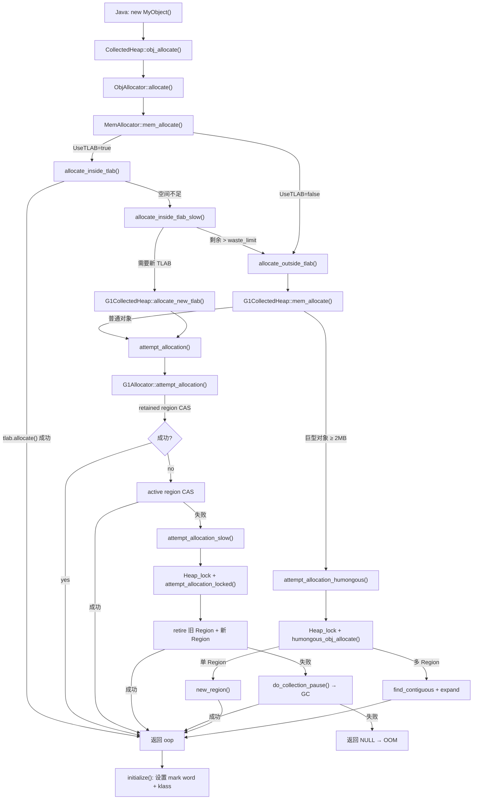
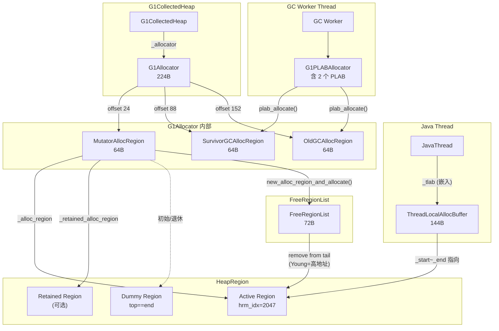

# G1 对象分配路径 — 完整深度分析

> 基于 OpenJDK 11 源码，标准环境 `-Xms8g -Xmx8g -XX:+UseG1GC`，G1 Region = 4MB

---

## 第 0 部分：核心原理 ⭐

### 0.1 本质是什么？

G1 对象分配路径的本质是**四级缓冲分配体系**：TLAB（线程本地缓冲，无锁）→ G1AllocRegion（Region 级缓冲，CAS）→ G1Allocator（堆级分配，加锁）→ GC 触发。绝大多数对象在 TLAB 中分配，完全无锁；只有 TLAB 满了才升级到下一级，逐级代价递增。

### 0.2 为什么需要？

多线程并发分配对象时，如果每次都加全局锁，锁竞争会成为瓶颈。TLAB 让每个线程有自己的私有分配缓冲区，分配时只需 `top += size`（一次指针碰撞），完全无锁。但 TLAB 满了需要申请新 TLAB，新 TLAB 需要从 Region 中划分，Region 满了需要申请新 Region——这就形成了四级体系。

### 0.3 怎么解决？

**四级分配路径**：
1. **TLAB 快速路径**：`top + size <= end` 时直接 `top += size`，无锁，纳秒级
2. **TLAB 慢速路径**：TLAB 满时 `allocate_new_tlab()`，从当前 Eden Region 的 `_top` 指针 CAS 划分一块新 TLAB
3. **Region 分配**：Eden Region 满时 `new_mutator_alloc_region()`，从 `_hrm._free_list` 取一个 Free Region 变为 Eden
4. **GC 触发**：无 Free Region 时触发 Young GC，回收 Eden/Survivor Region

### 0.4 为什么这样设计？

- **为什么 TLAB 大小不固定？** JVM 根据线程的分配速率动态调整 TLAB 大小（`EMA` 指数移动平均），分配快的线程得到更大的 TLAB，减少 TLAB 申请频率
- **为什么 G1AllocRegion 用 CAS 而不是锁？** 多个线程可能同时从同一个 Region 分配 TLAB，CAS 保证原子性；失败时重试，比锁的开销低
- **为什么 Humongous 对象不走 TLAB？** Humongous 对象 > 2MB，TLAB 通常只有几十 KB，放不下；直接分配到 Humongous Region，跳过 TLAB 和 Eden
- **为什么分配失败时触发 Young GC 而不是直接扩堆？** 扩堆需要 commit 新内存（系统调用），代价高；Young GC 可以快速回收大量 Eden Region，通常能满足分配需求

---

## 一、问题引入

Java 中一个简单的 `new Object()` 背后经历了什么？从 Java 字节码到 C++ 运行时，再到在 G1 堆上分配一块内存——这条路径涉及 **TLAB**、**G1AllocRegion**、**G1Allocator** 等多个核心组件，是理解 G1 GC 的基础。

**核心问题**：
- 为什么需要 TLAB？性能差距有多大？
- TLAB 满了之后走什么路径？
- 巨型对象（Humongous）为什么要特殊处理？
- 分配失败时如何触发 GC？

---

## 二、宏观架构：四级分配体系

G1 的对象分配是一个 **逐级降速** 的过程，每一级比上一级慢几个数量级：

```
┌─────────────────────────────────────────────────────────────────────┐
│                    G1 对象分配四级体系                                │
├─────────────────────────────────────────────────────────────────────┤
│                                                                     │
│  Level 1: TLAB 快速路径                                             │
│  ┌─────────────────────────────────────────┐                       │
│  │ ThreadLocalAllocBuffer::allocate()      │ ← 无锁，bump-pointer  │
│  │ 一次内存读 + 一次比较 + 一次写          │    ~10ns              │
│  └───────────────────┬─────────────────────┘                       │
│                      │ TLAB 空间不足                                │
│                      ▼                                              │
│  Level 2: CAS 在当前 Region 中分配                                  │
│  ┌─────────────────────────────────────────┐                       │
│  │ G1AllocRegion::attempt_allocation()     │ ← CAS，无锁           │
│  │ 先 retained region，再 active region    │    ~100ns             │
│  └───────────────────┬─────────────────────┘                       │
│                      │ 当前 Region 空间不足                          │
│                      ▼                                              │
│  Level 3: 加锁分配新 Region                                         │
│  ┌─────────────────────────────────────────┐                       │
│  │ attempt_allocation_locked()             │ ← Heap_lock           │
│  │ retire 旧 Region + 从 FreeList 分配新的 │    ~1μs               │
│  └───────────────────┬─────────────────────┘                       │
│                      │ 堆空间不足                                   │
│                      ▼                                              │
│  Level 4: 触发 GC                                                   │
│  ┌─────────────────────────────────────────┐                       │
│  │ do_collection_pause()                   │ ← STW                 │
│  │ Young GC / Mixed GC / Full GC           │    ~10ms+             │
│  └─────────────────────────────────────────┘                       │
│                                                                     │
└─────────────────────────────────────────────────────────────────────┘
```

---

## 三、完整调用链

### 3.1 整体调用链 Mermaid 图



### 3.2 文字描述

```
Java new MyObject()
  │
  ▼ (字节码 new → 解释器/JIT)
  │
CollectedHeap::obj_allocate(klass, size)          ← C++层入口
  │ 创建 ObjAllocator(klass, size)
  │
  ▼
MemAllocator::allocate()                           ← 总调度
  │ 创建 RAII Allocation 对象
  │
  ├─► mem_allocate()                               ← 分配裸内存
  │   │
  │   ├─[UseTLAB]─► allocate_inside_tlab()
  │   │   ├── tlab.allocate(size)   ═══ Level 1 ══► 成功返回
  │   │   └── allocate_inside_tlab_slow()
  │   │       ├── [剩余>waste_limit] → outside_tlab
  │   │       └── heap->allocate_new_tlab() ──╮
  │   │                                        │
  │   └─[!UseTLAB]─► allocate_outside_tlab()   │
  │       └── heap->mem_allocate(size) ────────┤
  │                                             │
  │   ╔══════════════════════════════════════╗  │
  │   ║ G1CollectedHeap (多态调用)            ║  │
  │   ╠══════════════════════════════════════╣  │
  │   ║ allocate_new_tlab() ◄────────────────╝  │
  │   ║   └─► attempt_allocation() ══ Level 2   ║
  │   ║ mem_allocate()  ◄───────────────────────╝
  │   ║   ├─[普通] attempt_allocation()          ║
  │   ║   └─[巨型] attempt_allocation_humongous()║
  │   ╚══════════════════════════════════════╝
  │
  └─► initialize(mem)                              ← 初始化对象
      ├── mem_clear()          ← 清零
      └── finish()             ← 设置 mark word + klass
```

---

## 四、Level 1：TLAB 快速路径

### 4.1 为什么需要 TLAB？

**问题**：多线程并发分配对象时，如果所有线程都直接在堆上分配，必须用 CAS 或锁来保证线程安全，成本太高。

**解决方案**：**Thread-Local Allocation Buffer (TLAB)** — 每个线程预先从堆上划出一块私有区域，线程在自己的 TLAB 中分配对象时完全不需要同步。

### 4.2 TLAB 数据结构

```
源码：src/hotspot/share/gc/shared/threadLocalAllocBuffer.hpp
```

**sizeof(ThreadLocalAllocBuffer) = 144 字节** (GDB 验证)

```
ThreadLocalAllocBuffer 内存布局（144 字节）
┌────────────────────────────────────────────────────────┐
│ (vptr)                          │ offset 0  │ 8 bytes │ ← CHeapObj 虚表指针
│ _start         (HeapWord*)      │ offset 8  │ 8 bytes │ ← TLAB 起始地址
│ _top           (HeapWord*)      │ offset 16 │ 8 bytes │ ← 下一次分配位置
│ _pf_top        (HeapWord*)      │ offset 24 │ 8 bytes │ ← prefetch 水位线
│ _end           (HeapWord*)      │ offset 32 │ 8 bytes │ ← 分配终点（可能是采样点）
│ _allocation_end (HeapWord*)     │ offset 40 │ 8 bytes │ ← 真正的 TLAB 末端
│ _desired_size  (size_t)         │ offset 48 │ 8 bytes │ ← 期望大小（含 reserve）
│ _refill_waste_limit (size_t)    │ offset 56 │ 8 bytes │ ← 浪费阈值
│ _allocated_before_last_gc       │ offset 64 │ 8 bytes │
│ _bytes_since_last_sample_point  │ offset 72 │ 8 bytes │
│ _number_of_refills (unsigned)   │ offset 80 │ 4 bytes │ ← refill 计数
│ _fast_refill_waste (unsigned)   │ offset 84 │ 4 bytes │
│ _slow_refill_waste (unsigned)   │ offset 88 │ 4 bytes │
│ _gc_waste      (unsigned)       │ offset 92 │ 4 bytes │
│ _slow_allocations (unsigned)    │ offset 96 │ 4 bytes │
│ _allocated_size (size_t)        │ offset 104│ 8 bytes │ ← padding 后
│ _allocation_fraction            │ offset 112│ 32 bytes│ ← AdaptiveWeightedAverage
└────────────────────────────────────────────────────────┘
```

**TLAB 指针关系**：

```
                      TLAB 内存布局
  _start             _top        _pf_top     _end    _allocation_end
    │                  │            │           │         │
    ▼                  ▼            ▼           ▼         ▼
    ┌──────────────────┬────────────┬───────────┬─────────┐
    │   已分配对象      │  prefetch  │  可用空间  │ reserve │
    │  (不可再碰)       │   区域     │ (free)    │ (end_   │
    │                  │            │           │ reserve)│
    └──────────────────┴────────────┴───────────┴─────────┘
    │←─── used ────────→│           │←── free ──→│
    │←─────────── capacity(to _end) ────────────→│
    │←─────────── total capacity(to _allocation_end) ────→│
```

**关键字段说明**：

| 字段 | 含义 | 运行时值（GDB） |
|------|------|-----------------|
| `_start` | TLAB 起始地址 | 首次 refill 前为 NULL |
| `_top` | 下一次分配的位置 | bump-pointer |
| `_end` | 分配检查终点 | 可能被 HeapSampler 提前设置 |
| `_allocation_end` | TLAB 真正末端 | `_end` ≤ `_allocation_end` |
| `_desired_size` | 期望大小 | 262144 words = **2MB** |
| `_refill_waste_limit` | 浪费阈值 | 4096 words = 32KB |

**关键静态字段（GDB 验证）**：

| 字段 | 值 | 含义 |
|------|-----|------|
| `_max_size` | 262144 words = 2MB | TLAB 最大大小 |
| `_target_refills` | 50 | 每次 GC 间期期望 refill 次数 |
| `_reserve_for_allocation_prefetch` | 72 words | 末端预留的 prefetch 空间 |

> **TLAB 最大 2MB 的计算**：`max_size = Region / 2 / _target_refills * allocating_threads_avg`，在我们的 8GB 堆（Eden 约 100MB，50 次 refill）场景下，实际取 `min(计算值, 最大可能值)`。GDB 验证 `_max_size = _desired_size = 262144 words = 2MB`。

### 4.3 TLAB 快速分配（allocate）

```cpp
// threadLocalAllocBuffer.inline.hpp:34
inline HeapWord* ThreadLocalAllocBuffer::allocate(size_t size) {
  invariants();
  HeapWord* obj = top();
  if (pointer_delta(end(), obj) >= size) {  // 检查：end - top >= size
    set_top(obj + size);                    // 直接移动 top 指针
    return obj;                             // 返回分配地址
  }
  return NULL;  // TLAB 空间不足
}
```

**这就是 Java 对象分配的终极快速路径**：
1. 读取 `_top` 指针
2. 检查 `_end - _top >= size`
3. 如果够，`_top += size`，返回旧 `_top`
4. 如果不够，返回 NULL → 进入慢路径

**无锁、无CAS、无系统调用** — 仅仅是一次内存读、一次比较、一次内存写。在 JIT 编译后甚至可以内联到分配热路径中。

### 4.4 TLAB 慢路径（refill）

当 `tlab.allocate()` 返回 NULL 时，进入 `MemAllocator::allocate_inside_tlab_slow()`：

```
allocate_inside_tlab_slow() 流程
┌─────────────────────────────────────────────────────────────┐
│                                                             │
│  1. [HeapSampler] 如果 _end 被提前设置（采样），             │
│     尝试 set_back_allocation_end() 恢复 _end 后重试         │
│                                                             │
│  2. 检查当前 TLAB 剩余空间                                    │
│     │                                                       │
│     ├─ 剩余 > refill_waste_limit?                          │
│     │  ├─ YES → 保留 TLAB，本次走 outside_tlab（大对象）     │
│     │  │        同时 record_slow_allocation()               │
│     │  │        增加 waste_limit += TLABWasteIncrement      │
│     │  │                                                    │
│     │  └─ NO  → 丢弃旧 TLAB，申请新的                       │
│     │                                                       │
│  3. 计算新 TLAB 大小：                                       │
│     new_size = min(available, desired + obj_size, max_size) │
│     min_size = max(obj_size + reserve, MinTLABSize)         │
│                                                             │
│  4. heap->allocate_new_tlab(min, requested, &actual)        │
│     → G1CollectedHeap::allocate_new_tlab()                  │
│     → attempt_allocation()                                  │
│                                                             │
│  5. 初始化新 TLAB：                                          │
│     if (ZeroTLAB) memset(0)                                 │
│     else fill_with(badHeapWordVal)  // debug 模式           │
│                                                             │
│  6. tlab.fill(mem, mem + obj_size, actual_size)             │
│                                                             │
└─────────────────────────────────────────────────────────────┘
```

**refill_waste_limit 机制**：

初始值 = `desired_size / TLABRefillWasteFraction`（默认 64），即 `262144 / 64 = 4096 words = 32KB`（GDB 验证）。

- 如果 TLAB 剩余 > 32KB，说明还有不少空间，但当前对象太大放不下。此时**不丢弃 TLAB**，让这个大对象走 `outside_tlab`（直接在堆上分配），避免浪费。
- 每次走 `outside_tlab`，`waste_limit += TLABWasteIncrement`（默认 4 words），逐渐提高容忍度。
- 如果 TLAB 剩余 ≤ waste_limit，丢弃旧 TLAB（剩余空间用 dummy 对象填充以保持堆可解析），分配新的。

### 4.5 GDB 验证：第一次 TLAB refill

```
=== 第 1 次 allocate_new_tlab ===
min_size      = 256 words (2048 bytes)
requested_size = 262144 words (2097152 bytes = 2MB)

TLAB 状态：全部为 NULL（首次分配，还没有 TLAB）
_desired_size       = 262144 words (2MB)
_refill_waste_limit = 4096 words (32KB)
_number_of_refills  = 0
```

```
=== 第 2 次 allocate_new_tlab（第一个 TLAB 耗尽后）===
Active Region:
  bottom = 0x7ffc00000
  top    = 0x7ffe00000   ← 已用 2MB
  free   = 2097152 bytes ← 还剩 2MB
  hrm_idx = 2047          ← 最后一个 Region！

MutatorAllocRegion:
  _count = 1              ← 用了 1 个 Region
  _wasted_bytes = 0
  _retained_alloc_region = NULL
```

**验证结论**：
1. 第一个 TLAB 大小正好 = 2MB（`_desired_size`）
2. 活跃 Region 是 hrm_index=2047（最后一个）→ **证实 Young 从高地址分配**
3. 一个 4MB Region 能装 2 个 2MB TLAB

---

## 五、Level 2：G1AllocRegion CAS 分配

### 5.1 核心数据结构

#### G1AllocRegion 类层次

```
G1AllocRegion (基类, 48B)
  ├── MutatorAllocRegion   (64B) — Mutator 线程分配
  └── G1GCAllocRegion      (64B) — GC 期间分配
        ├── SurvivorGCAllocRegion (64B)
        └── OldGCAllocRegion      (64B)
```

**sizeof 验证（GDB）**：

| 类 | sizeof | 备注 |
|----|--------|------|
| G1AllocRegion | 48 | 基类 |
| MutatorAllocRegion | 64 | +_wasted_bytes(8) +_retained(8) |
| SurvivorGCAllocRegion | 64 | +_stats(8) +_purpose(4) +pad |
| OldGCAllocRegion | 64 | 同上 |

#### G1AllocRegion 字段布局（48 字节）

```
G1AllocRegion（48 字节）
┌───────────────────────────────────────────────────┐
│ (vptr)               │ offset 0  │ 8 bytes       │
│ _alloc_region        │ offset 8  │ 8 bytes       │ ← volatile HeapRegion*
│ _count               │ offset 16 │ 4 bytes       │ ← 使用的 Region 数量
│ (padding)            │ offset 20 │ 4 bytes       │
│ _used_bytes_before   │ offset 24 │ 8 bytes       │ ← Region 被设置时已用字节
│ _bot_updates         │ offset 32 │ 1 byte (bool) │ ← 是否更新 BOT
│ (padding)            │ offset 33 │ 7 bytes       │
│ _name                │ offset 40 │ 8 bytes       │ ← const char*
└───────────────────────────────────────────────────┘
```

#### MutatorAllocRegion 额外字段

```
MutatorAllocRegion（64 字节 = 48 基类 + 16 自有）
┌───────────────────────────────────────────────────┐
│ [G1AllocRegion 48 bytes]                          │
│ _wasted_bytes          │ offset 48 │ 8 bytes      │ ← 当前 mutator 阶段浪费
│ _retained_alloc_region │ offset 56 │ 8 bytes      │ ← volatile HeapRegion*
└───────────────────────────────────────────────────┘
```

#### Dummy Region 模式

```cpp
// g1AllocRegion.cpp:36
HeapRegion* G1AllocRegion::_dummy_region = NULL;
```

`_dummy_region` 是一个**始终满的 HeapRegion**（`top == end`），用作哨兵。当没有活跃 Region 时，`_alloc_region` 指向 `_dummy_region` 而不是 NULL。

**为什么？** 避免每次分配时都检查 NULL。`par_allocate()` 在 dummy region 上直接失败，省掉了一次 NULL 判断分支。

GDB 验证：
```
_dummy_region = 0x7ffff0c81d80
  bottom = 0x600000000
  top    = 0x600400000
  end    = 0x600400000
  top == end: YES (满的)
```

### 5.2 G1Allocator：分配调度中心

```
源码：src/hotspot/share/gc/g1/g1Allocator.hpp
```

**sizeof(G1Allocator) = 224 字节**（GDB 验证）

```
G1Allocator（224 字节）
┌───────────────────────────────────────────────────────────┐
│ (vptr)                       │ offset 0   │ 8 bytes      │
│ _g1h                         │ offset 8   │ 8 bytes      │ ← G1CollectedHeap*
│ _survivor_is_full            │ offset 16  │ 1 byte       │
│ _old_is_full                 │ offset 17  │ 1 byte       │
│ (padding)                    │ offset 18  │ 6 bytes      │
│ _mutator_alloc_region        │ offset 24  │ 64 bytes     │ ← MutatorAllocRegion
│ _survivor_gc_alloc_region    │ offset 88  │ 64 bytes     │ ← SurvivorGCAllocRegion
│ _old_gc_alloc_region         │ offset 152 │ 64 bytes     │ ← OldGCAllocRegion
│ _retained_old_gc_alloc_region│ offset 216 │ 8 bytes      │ ← HeapRegion*
└───────────────────────────────────────────────────────────┘
```

GDB 验证：
```
G1Allocator*          = 0x7ffff0040a20
_survivor_is_full     = 0
_old_is_full          = 0
_mutator_alloc_region @ offset 24
_survivor_gc_alloc_region @ offset 88
_old_gc_alloc_region  @ offset 152
_retained_old_gc_alloc_region @ offset 216
```

### 5.3 分配快速路径

当 TLAB refill 调用 `G1CollectedHeap::allocate_new_tlab()` 或 `mem_allocate()` 时，最终到达：

```cpp
// g1CollectedHeap.cpp:738
inline HeapWord* G1CollectedHeap::attempt_allocation(size_t min_word_size,
                                                     size_t desired_word_size,
                                                     size_t* actual_word_size) {
  // Level 2: 无锁 CAS 分配
  HeapWord* result = _allocator->attempt_allocation(min, desired, actual);
  if (result == NULL) {
    *actual_word_size = desired_word_size;
    result = attempt_allocation_slow(desired_word_size);  // → Level 3/4
  }
  if (result != NULL) {
    dirty_young_block(result, *actual_word_size);  // 标记 card 为 young
  }
  return result;
}
```

`G1Allocator::attempt_allocation()` 的两步尝试：

```cpp
// g1Allocator.inline.hpp:44
inline HeapWord* G1Allocator::attempt_allocation(...) {
  // 第 1 步：尝试 retained region（如果有的话）
  HeapWord* result = mutator_alloc_region()->attempt_retained_allocation(min, desired, actual);
  if (result != NULL) return result;

  // 第 2 步：尝试 active region
  return mutator_alloc_region()->attempt_allocation(min, desired, actual);
}
```

`G1AllocRegion::attempt_allocation()` 的核心：

```cpp
// g1AllocRegion.inline.hpp:78
inline HeapWord* G1AllocRegion::attempt_allocation(size_t min, size_t desired, size_t* actual) {
  HeapRegion* alloc_region = _alloc_region;  // 读取当前活跃 Region
  HeapWord* result = par_allocate(alloc_region, min, desired, actual);  // CAS 分配
  return result;
}
```

`par_allocate()` 最终调用 `HeapRegion::par_allocate_no_bot_updates()`（MutatorAllocRegion 的 `_bot_updates = false`）：

```
CAS 分配流程：
  1. 读取 region->_top
  2. 检查 end - top >= size
  3. CAS(top, top, top + size)
  4. 成功 → 返回旧 top
  5. 失败 → 重试（另一个线程抢先了）
```

### 5.4 Retained Region 优化

当一个 Region 快满但还有一点空间（≥ MinTLABSize）时，**不直接丢弃**，而是保留为 `_retained_alloc_region`：

```cpp
// g1AllocRegion.cpp:275
bool MutatorAllocRegion::should_retain(HeapRegion* region) {
  size_t free_bytes = region->free();
  if (free_bytes < MinTLABSize) return false;                    // 太小，不值得保留
  if (_retained != NULL && free_bytes < _retained->free()) return false;  // 现有的更好
  return true;
}
```

**为什么？** 减少内存浪费。如果一个 Region 还剩 200KB（> MinTLABSize），扔掉就浪费了。保留它，后续小 TLAB 还能从中分配。

MutatorAllocRegion 的 retire 逻辑：

```
retire(fill_up=true) 流程：
  1. 检查 should_retain(current_region)
  2. 如果 YES:
     a. 如果已有 _retained → retire_internal(_retained) 
     b. _retained = current_region（替换）
  3. 如果 NO:
     a. retire_internal(current_region, fill_up=true)
        → fill_up_remaining_space()  // CAS 填充 dummy 对象
        → retire_region()
  4. reset_alloc_region() → 指向 _dummy_region
```

---

## 六、Level 3：加锁慢路径

### 6.1 attempt_allocation_slow()

当 Level 2 快速路径失败时，进入慢路径（无限循环直到分配成功或 GC 失败）：

```cpp
// g1CollectedHeap.cpp:418
HeapWord* G1CollectedHeap::attempt_allocation_slow(size_t word_size) {
  for (uint try_count = 1, gclocker_retry_count = 0; ; try_count++) {
    bool should_try_gc;
    uint gc_count_before;
    
    {   // ← 加 Heap_lock
      MutexLockerEx x(Heap_lock);
      
      // 再试一次（可能其他线程已经释放了空间）
      result = _allocator->attempt_allocation_locked(word_size);
      if (result != NULL) return result;
      
      // GCLocker 活跃时尝试扩展 young gen
      if (GCLocker::is_active_and_needs_gc() && can_expand_young_list()) {
        result = _allocator->attempt_allocation_force(word_size);
        if (result != NULL) return result;
      }
      
      should_try_gc = !GCLocker::needs_gc();
      gc_count_before = total_collections();
    }   // ← 释放 Heap_lock
    
    if (should_try_gc) {
      // Level 4: 触发 GC
      result = do_collection_pause(word_size, gc_count_before, &succeeded,
                                   GCCause::_g1_inc_collection_pause);
      if (result != NULL) return result;
      if (succeeded) return NULL;  // GC 成功但分配失败 → OOM
    } else {
      // GCLocker 正忙，等它完成
      if (gclocker_retry_count > GCLockerRetryAllocationCount) return NULL;
      GCLocker::stall_until_clear();
      gclocker_retry_count++;
    }
    
    // 释放锁后再试一次无锁路径（其他线程可能 GC 完释放了空间）
    result = _allocator->attempt_allocation(word_size, word_size, &dummy);
    if (result != NULL) return result;
  }
}
```

> **JVM 日志参数**：`-Xlog:gc+alloc=trace` 可以看到慢路径的 trace 日志。
> 
> 示例输出：
> ```
> [trace][gc,alloc] main: Successfully scheduled collection returning 0x00000007ffc01000
> [trace][gc,alloc] main: Stall until clear
> [warning][gc,alloc] main: Retried allocation 10 times for 256 words
> ```

### 6.2 attempt_allocation_locked()

持有 Heap_lock 后的分配逻辑：

```cpp
// g1AllocRegion.inline.hpp:98
inline HeapWord* G1AllocRegion::attempt_allocation_locked(size_t min, size_t desired, size_t* actual) {
  // 重试：可能其他线程在我们等锁时分配了新 Region
  HeapWord* result = attempt_allocation(min, desired, actual);
  if (result != NULL) return result;

  // 当前 Region 确实满了
  retire(true /* fill_up */);  // 退休旧 Region，填充剩余空间

  // 分配新 Region 并在其中分配
  result = new_alloc_region_and_allocate(desired, false /* force */);
  return result;
}
```

### 6.3 new_alloc_region_and_allocate()

```cpp
// g1AllocRegion.cpp:134
HeapWord* G1AllocRegion::new_alloc_region_and_allocate(size_t word_size, bool force) {
  // 1. 调用虚函数获取新 Region
  HeapRegion* new_alloc_region = allocate_new_region(word_size, force);
  //    → MutatorAllocRegion → _g1h->new_mutator_alloc_region()
  //    → _hrm.allocate_free_region(is_old=false)  ← 从 FreeList 尾部取（高地址）
  
  if (new_alloc_region != NULL) {
    _used_bytes_before = new_alloc_region->used();
    
    // 2. 在新 Region 中分配（非并发，持有锁）
    HeapWord* result = allocate(new_alloc_region, word_size);
    
    // 3. storestore 屏障 + 设置为活跃 Region
    OrderAccess::storestore();
    update_alloc_region(new_alloc_region);  // _alloc_region = new_alloc_region
    return result;
  }
  return NULL;
}
```

**关键点**：`OrderAccess::storestore()` 确保先完成分配写入，再发布新 Region 到 `_alloc_region`。这样其他线程通过 CAS 读到新 Region 时，其中的数据已经正确初始化。

### 6.4 new_region()：从 FreeList 获取 Region

```cpp
// g1CollectedHeap.cpp:169
HeapRegion* G1CollectedHeap::new_region(size_t word_size, bool is_old, bool do_expand) {
  HeapRegion* res = _hrm.allocate_free_region(is_old);
  // is_old=false → from_head=false → 从 FreeList 尾部取 → 高地址
  // is_old=true  → from_head=true  → 从 FreeList 头部取 → 低地址
  
  if (res == NULL && do_expand) {
    // GC 时才扩展堆（do_expand 在 safepoint 才为 true）
    expand(word_size * HeapWordSize);
    res = _hrm.allocate_free_region(is_old);
  }
  return res;
}
```

---

## 七、巨型对象分配路径

### 7.1 什么是巨型对象？

**巨型对象 (Humongous Object)**：大小 ≥ Region/2 的对象。

- Region = 4MB → 阈值 = **2MB**（262144 words）
- GDB 验证：`HeapRegion::GrainBytes / 2 = 2097152 bytes`

巨型对象**不走 TLAB**，直接在老年代分配连续的 Region。

### 7.2 分配入口

```cpp
// g1CollectedHeap.cpp:406
HeapWord* G1CollectedHeap::mem_allocate(size_t word_size, bool* gc_overhead_exceeded) {
  if (is_humongous(word_size)) {
    return attempt_allocation_humongous(word_size);  // 巨型
  }
  return attempt_allocation(word_size, word_size, &dummy);  // 普通
}
```

`is_humongous()` 判断：`word_size >= GrainWords / 2`

### 7.3 humongous_obj_allocate()

三阶段策略：

```
humongous_obj_allocate(word_size) 流程
┌─────────────────────────────────────────────────────────────┐
│                                                             │
│  单 Region 对象 (obj_regions == 1):                         │
│    new_region(word_size, is_old=true, do_expand=false)      │
│    → 从 FreeList 头部取一个 Region                          │
│                                                             │
│  多 Region 对象 (obj_regions > 1):                          │
│    Phase 1: find_contiguous_only_empty(obj_regions)         │
│             → 只在已提交的空闲 Region 中找连续块             │
│    Phase 2: find_contiguous_empty_or_unavailable(obj_regions)│
│             → 包含未提交的 Region，找到后 expand_at          │
│                                                             │
│  找到后: humongous_obj_allocate_initialize_regions()         │
│    → 第一个 Region 设为 StartsHumongous                     │
│    → 后续 Region 设为 ContinuesHumongous                    │
│    → 更新 used/generation 计数                              │
│                                                             │
└─────────────────────────────────────────────────────────────┘
```

### 7.4 attempt_allocation_humongous()

与 `attempt_allocation_slow()` 结构类似的无限循环：

```
attempt_allocation_humongous(word_size) 循环流程：
  1. 检查是否需要启动并发标记
     → need_to_start_conc_mark("concurrent humongous allocation")
     → 如果需要，先触发 concurrent cycle
  
  2. Heap_lock + humongous_obj_allocate(word_size)
     → 成功 → 记录 old gen 分配统计 → 返回
  
  3. 失败 → GCLocker 检查
     → 可以 GC → do_collection_pause(GCCause::_g1_humongous_allocation)
     → GCLocker 活跃 → stall_until_clear()
  
  4. 重试（不像普通对象那样有无锁重试，巨型对象总是需要锁）
```

> **JVM 日志参数**：`-Xlog:gc+ergo+heap=debug` 看堆扩展日志
> 
> 示例：
> ```
> [debug][gc,ergo,heap] Attempt heap expansion (humongous allocation request failed). Allocation request: 4194304B
> ```

---

## 八、STW 期间的分配

```cpp
// g1CollectedHeap.cpp:966
HeapWord* G1CollectedHeap::attempt_allocation_at_safepoint(size_t word_size,
                                                           bool expect_null) {
  if (!is_humongous(word_size)) {
    return _allocator->attempt_allocation_locked(word_size);  // 无需锁（已在 safepoint）
  } else {
    HeapWord* result = humongous_obj_allocate(word_size);
    if (result != NULL && need_to_start_conc_mark("STW humongous allocation")) {
      set_initiate_conc_mark_if_possible(true);
    }
    return result;
  }
}
```

在 STW 期间，所有 Mutator 线程都已停止，所以不需要加锁。

---

## 九、MemAllocator：从裸内存到 Java 对象

### 9.1 类层次

```
MemAllocator (基类, StackObj)
  ├── ObjAllocator       ← 普通 Java 对象 (new Object())
  ├── ObjArrayAllocator  ← 数组对象 (new int[10])
  └── ClassAllocator     ← java.lang.Class 对象
```

### 9.2 allocate() 完整流程

```cpp
// memAllocator.cpp:373
oop MemAllocator::allocate() const {
  oop obj = NULL;
  {
    Allocation allocation(*this, &obj);  // RAII: verify_before()
    HeapWord* mem = mem_allocate(allocation);  // 分配裸内存
    if (mem != NULL) {
      obj = initialize(mem);  // 初始化对象（虚函数）
    }
  }  // RAII 析构: check_out_of_memory() + notify_allocation()
  return obj;
}
```

### 9.3 对象初始化

```cpp
// ObjAllocator::initialize(mem):
//   1. mem_clear(mem)   → 清零对象体
//   2. finish(mem)      → 设置对象头

// finish():
HeapWord* MemAllocator::finish(HeapWord* mem) const {
  oopDesc::set_mark_raw(mem, markOopDesc::prototype());  // mark word
  // 或者偏向锁模式：_klass->prototype_header()
  
  oopDesc::release_set_klass(mem, _klass);  // klass 指针（release 语义）
  return mem;
}
```

`release_set_klass` 使用 **release 语义**是因为：并发 GC 线程可能正在扫描堆，必须保证它们看到 klass 指针时，对象体已经完全初始化。

### 9.4 通知机制

分配完成后，`Allocation` 析构函数按顺序通知四个子系统：

1. **Low Memory Detector** — 检查是否需要触发低内存警告
2. **JFR Sampler** — JFR 分配采样事件
3. **DTrace** — DTrace 探针（如果启用）
4. **JVMTI** — JVMTI 对象分配回调

---

## 十、GC 期间的分配路径（PLAB）

GC 疏散（Evacuation）阶段也需要分配内存来复制存活对象。这里用的是 **PLAB (Promotion Local Allocation Buffer)**：

```
G1PLABAllocator
  │
  ├── _surviving_alloc_buffer (PLAB)  ← Survivor 空间
  ├── _tenured_alloc_buffer   (PLAB)  ← Old 空间
  │
  └── allocate(dest, size, &refill_failed)
        │
        ├── plab_allocate(dest, size)        ← PLAB 内 bump-pointer
        │
        └── allocate_direct_or_new_plab()    ← PLAB 满了
              └── G1Allocator::par_allocate_during_gc()
                    ├── survivor_attempt_allocation() → SurvivorGCAllocRegion
                    └── old_attempt_allocation()      → OldGCAllocRegion
```

PLAB 和 TLAB 原理类似，都是为了减少并发争用。区别是：
- TLAB 面向 Mutator 线程
- PLAB 面向 GC Worker 线程
- PLAB 分 Survivor 和 Old 两种

**sizeof(PLAB) = 136 字节**（GDB 验证）

---

## 十一、关键数据结构关系图



---

## 十二、GDB 验证数据汇总

### sizeof 验证

| 结构 | sizeof | 来源 |
|------|--------|------|
| ThreadLocalAllocBuffer | **144** | GDB |
| G1AllocRegion | **48** | GDB |
| MutatorAllocRegion | **64** | GDB |
| SurvivorGCAllocRegion | **64** | GDB |
| OldGCAllocRegion | **64** | GDB |
| G1Allocator | **224** | GDB |
| PLAB | **136** | GDB |

### G1AllocRegion 字段偏移

| 字段 | 偏移 |
|------|------|
| _alloc_region | 8 |
| _count | 16 |
| _used_bytes_before | 24 |
| _bot_updates | 32 |
| _name | 40 |
| _wasted_bytes (Mutator) | 48 |
| _retained_alloc_region (Mutator) | 56 |

### G1Allocator 字段偏移

| 字段 | 偏移 |
|------|------|
| _g1h | 8 |
| _survivor_is_full | 16 |
| _old_is_full | 17 |
| _mutator_alloc_region | 24 |
| _survivor_gc_alloc_region | 88 |
| _old_gc_alloc_region | 152 |
| _retained_old_gc_alloc_region | 216 |

### TLAB 字段偏移

| 字段 | 偏移 |
|------|------|
| _start | 8 |
| _top | 16 |
| _pf_top | 24 |
| _end | 32 |
| _allocation_end | 40 |
| _desired_size | 48 |
| _refill_waste_limit | 56 |

### 运行时数据

| 项目 | 值 |
|------|-----|
| TLAB _desired_size | 262144 words = **2MB** |
| TLAB _max_size | 262144 words = **2MB** |
| TLAB _refill_waste_limit | 4096 words = **32KB** |
| _target_refills | **50** |
| _reserve_for_allocation_prefetch | **72** words |
| 第一个 Active Region | hrm_idx=**2047**（最高地址） |
| 第一个 Region used/free | 2MB / 2MB（恰好容纳一个 TLAB） |
| Humongous 阈值 | **2MB**（GrainBytes/2） |
| Dummy Region | top==end（始终满） |

---

## 十三、总结

### 关键设计思想

1. **分级加速**：TLAB（无锁 bump）→ CAS → 加锁 → GC，逐级降速，保证 99%+ 的分配在最快路径完成
2. **线程本地缓存**：TLAB/PLAB 都是为了消除并发争用
3. **Retained Region**：减少 Region 退休时的空间浪费
4. **Dummy Region 哨兵**：消除 NULL 检查的性能开销
5. **Humongous 特殊处理**：大对象直接分配连续 Region，不走 TLAB
6. **Release 语义**：`finish()` 中用 release 写 klass 指针，保证并发 GC 安全

### 核心调用链速记

```
new Object()
  → [TLAB] tlab.allocate(size)                     99%+ 在这里完成
  → [TLAB refill] heap->allocate_new_tlab()
    → [CAS] G1Allocator::attempt_allocation()      先 retained 再 active
    → [Lock] attempt_allocation_slow()
      → [New Region] new_alloc_region_and_allocate()
      → [GC] do_collection_pause()
```

### 涉及的 JVM 参数

| 参数 | 默认值 | 作用 |
|------|--------|------|
| `-XX:+UseTLAB` | true | 启用 TLAB |
| `-XX:TLABRefillWasteFraction` | 64 | TLAB 浪费阈值分母 |
| `-XX:TLABWasteIncrement` | 4 | 慢路径时 waste_limit 增量 |
| `-XX:MinTLABSize` | 2048 | TLAB 最小大小（字节） |
| `-XX:+ZeroTLAB` | false | 新 TLAB 是否全部清零 |
| `-Xlog:gc+alloc=trace` | - | 分配路径 trace 日志 |
| `-Xlog:gc+alloc+region=debug` | - | Region 分配/退休日志 |
| `-Xlog:gc+tlab=trace` | - | TLAB 大小计算日志 |
| `-Xlog:gc+ergo+heap=debug` | - | 堆扩展日志 |
