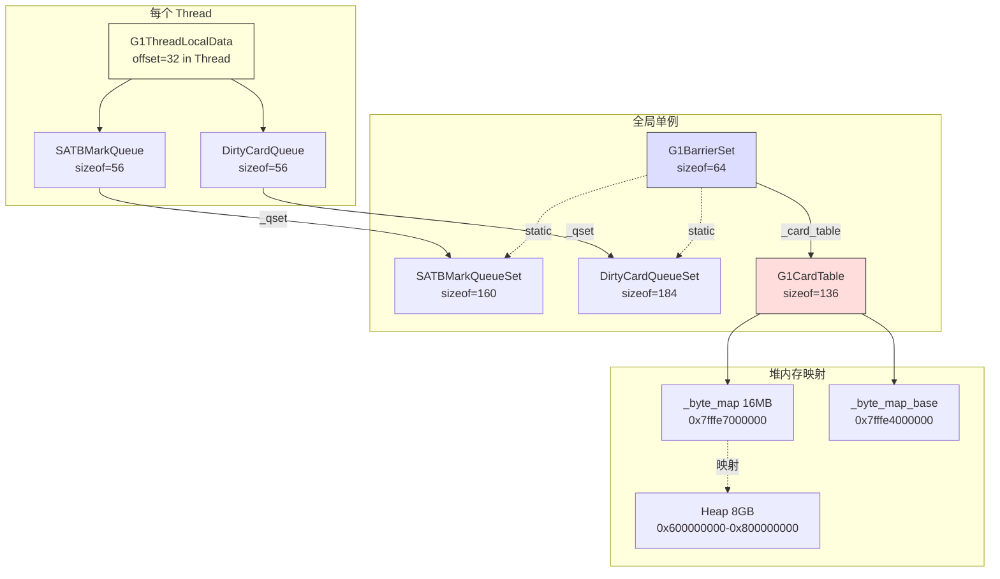

# G1 写屏障 + CardTable 深度分析

> **目标**：深入理解 G1 GC 写屏障的完整机制——从应用线程写引用字段开始，经过 Pre/Post 屏障、CardTable、线程本地队列，最终到达全局队列等待 Concurrent Refinement 处理
> **标准环境**：-Xms8g -Xmx8g -XX:+UseG1GC，Region=4MB，2048 Regions
> **源码文件**：`g1BarrierSet.hpp/cpp`、`g1BarrierSet.inline.hpp`、`g1CardTable.hpp/cpp/inline.hpp`、`dirtyCardQueue.hpp/cpp`、`ptrQueue.hpp/cpp`、`g1ThreadLocalData.hpp`、`g1CollectedHeap.cpp`（屏障安装）
> **源码目录**：`src/hotspot/share/gc/g1/` + `src/hotspot/share/gc/shared/`

---

## 第 0 部分：核心原理 ⭐

### 0.1 本质是什么？

G1 写屏障的本质是**两个拦截点 + 两个队列**：写引用字段时，Pre 屏障（写前）将旧值入 SATB 队列（保证并发标记正确性），Post 屏障（写后）将脏卡入 DirtyCardQueue（记录跨 Region 引用）；两个队列由后台线程异步处理，不阻塞应用线程。

### 0.2 为什么需要？

G1 有两个并发问题需要写屏障解决：(1) **并发标记正确性**：标记线程和应用线程并发运行，应用线程修改引用可能导致漏标（黑色对象引用白色对象）；(2) **跨 Region 引用追踪**：Young GC 只回收 CSet 中的 Region，需要知道 CSet 外的 Region 是否有引用指向 CSet 内的对象（否则会漏标存活对象）。

### 0.3 怎么解决？

**Pre 屏障（SATB）**：写引用字段前，将旧值（被覆盖的引用）放入线程本地 SATB 队列；队列满时 flush 到全局 `SATBMarkQueueSet`；Remark 阶段处理所有 SATB 队列，确保旧引用不被漏标。

**Post 屏障（CardTable）**：写引用字段后，将包含该字段的 512 字节卡标记为 dirty（`card_table[addr >> 9] = dirty`）；同时将脏卡地址放入线程本地 `DirtyCardQueue`；队列满时 flush 到全局队列；Concurrent Refinement 线程异步处理脏卡，更新目标 Region 的 RSet。

### 0.4 为什么这样设计？

- **为什么 Pre 屏障记录旧值而不是新值？** SATB（Snapshot-At-The-Beginning）语义：标记开始时存活的对象必须被标记；旧值是"被删除的引用"，如果不记录，旧值指向的对象可能被漏标；新值会在正常标记过程中被发现
- **为什么 CardTable 粒度是 512 字节？** 512 字节 = 1 字节卡表项，8GB 堆只需 16MB 卡表；粒度太小（如 64 字节）卡表太大；粒度太大（如 4KB）一张卡内有太多对象，扫描代价高；512 字节是经验最优值
- **为什么用异步队列而不是同步更新 RSet？** 同步更新 RSet 需要在应用线程的写屏障中完成，代价高（RSet 更新涉及锁和复杂数据结构）；异步队列让应用线程只做最轻量的操作（写一个字节 + 入队），RSet 更新推迟到后台线程
- **为什么 SATB 队列和 DirtyCardQueue 都用线程本地缓冲？** 减少全局队列的竞争；线程本地缓冲满了才 flush，批量操作比每次都访问全局队列高效

---

## 一、问题引入：为什么需要写屏障？

### 1.1 核心问题

G1 是分 Region 的 GC。Young GC 只回收年轻代 Region，**不扫描老年代**。但如果老年代对象持有对年轻代对象的引用，不扫描老年代就会**漏标存活对象**，导致错误回收。

```
┌─ Old Region ─────────┐       ┌─ Young Region ──────────┐
│                       │       │                         │
│  OldObj.field ────────────────→  YoungObj (存活!)        │
│                       │       │                         │
└───────────────────────┘       └─────────────────────────┘
                                  ↑
                          Young GC 只扫描这里
                          如果不知道 OldObj→YoungObj 这条引用
                          YoungObj 就会被错误回收！
```

### 1.2 解决方案：写屏障 + 记忆集（RSet）

G1 的解决方案分两层：

1. **写屏障（Write Barrier）**：在每次引用赋值时插入额外代码，**记录哪些卡片（card）被修改**
2. **记忆集（RSet）**：每个 Region 维护一个 RSet，记录"哪些其他 Region 有指向我的引用"

数据流：**写屏障 → CardTable 标脏 → 线程本地脏卡队列 → 全局队列 → Concurrent Refinement → 更新 RSet**

### 1.3 G1 的双屏障

G1 比其他 GC 多了一个前置屏障，共两个：

| 屏障 | 时机 | 目的 | 活跃条件 |
|------|------|------|---------|
| **Pre-Write Barrier (SATB)** | 写入**前** | 保存旧引用值，防止并发标记期间漏标 | 仅并发标记期间 |
| **Post-Write Barrier (Dirty Card)** | 写入**后** | 记录跨 Region 引用变化 | 始终活跃 |

---

## 二、BarrierSet 类体系

### 2.1 继承层次

```
BarrierSet (CHeapObj)                          sizeof=48
  │  ├─ _fake_rtti (FakeRtti, 8B)              轻量级运行时类型
  │  ├─ _barrier_set_assembler (8B)            解释器屏障代码生成
  │  ├─ _barrier_set_c1 (8B)                   C1 编译器屏障
  │  ├─ _barrier_set_c2 (8B)                   C2 编译器屏障
  │  ├─ _barrier_set_nmethod (8B)              nmethod 屏障
  │  └─ static _barrier_set (BarrierSet*)      全局单例
  │
  └─ ModRefBarrierSet                          sizeof=48
       │  引入 pre/post barrier 模板方法框架
       │  write_ref_field_pre() → [空] (子类覆盖)
       │  write_ref_field_post() → [空] (子类覆盖)
       │
       └─ CardTableBarrierSet                  sizeof=64
            │  ├─ _defer_initial_card_mark (bool)
            │  └─ _card_table (CardTable*, 8B)
            │  默认 post-barrier: 直接标脏卡
            │
            └─ G1BarrierSet                    sizeof=64
                  覆盖 pre-barrier: SATB 入队
                  覆盖 post-barrier: 条件标脏 + 入队脏卡队列
                  static _satb_mark_queue_set
                  static _dirty_card_queue_set
```

### 2.2 核心分发机制

所有 oop 写入都经过 `ModRefBarrierSet::AccessBarrier::oop_store_in_heap()`：

```cpp
// modRefBarrierSet.inline.hpp
template <typename T>
inline void ModRefBarrierSet::AccessBarrier::oop_store_in_heap(T* addr, oop value) {
  // ① Pre-barrier: 保存旧值（G1 SATB）
  barrier_set_cast<ModRefBarrierSet>(barrier_set())->write_ref_field_pre(addr);
  // ② 实际写入
  Raw::oop_store(addr, value);
  // ③ Post-barrier: 标脏卡 + 入队
  barrier_set_cast<ModRefBarrierSet>(barrier_set())->write_ref_field_post(addr);
}
```

同样的 pre → store → post 模式也适用于 `oop_atomic_cmpxchg_in_heap` 和 `oop_atomic_xchg_in_heap`。

### 2.3 非堆引用的特殊处理

对于非堆内存中的引用（如 JNI 全局引用）：

```cpp
// g1BarrierSet.inline.hpp
template <typename T>
void G1BarrierSet::AccessBarrier::oop_store_not_in_heap(T* addr, oop new_value) {
  // 只执行 Pre-barrier（SATB 安全）
  // 不执行 Post-barrier（非堆内存没有卡表覆盖）
}
```

---

## 三、Pre-Write Barrier：SATB 快照

### 3.1 SATB 的含义

**SATB = Snapshot-At-The-Beginning**。并发标记开始时，对堆的引用关系拍一个"快照"。在并发标记期间，任何被覆盖的旧引用都必须保留（入队等待处理），确保不会漏标。

### 3.2 源码分析

```cpp
// g1BarrierSet.inline.hpp
template <DecoratorSet decorators, typename T>
inline void G1BarrierSet::AccessBarrier::write_ref_field_pre(T* addr) {
  // ① 读取旧值（带 volatile 语义，防止乱序）
  oop prev = RawAccess<>::oop_load(addr);

  // ② 将旧值入队（如果满足条件）
  barrier_set_cast<G1BarrierSet>(barrier_set())->enqueue(prev);
}
```

`enqueue()` 的实现：

```cpp
// g1BarrierSet.cpp
void G1BarrierSet::enqueue(oop pre_val) {
  // 快速路径①: 空引用不需要处理
  if (pre_val == NULL) return;

  // 快速路径②: 如果 SATB 未激活（不在并发标记期间），直接返回
  if (!_satb_mark_queue_set.is_active()) return;

  // 慢路径: 入队到线程本地 SATB 队列
  Thread* thr = Thread::current();
  if (thr->is_Java_thread()) {
    // Java 线程: 使用线程本地 SATB 队列（无锁）
    G1ThreadLocalData::satb_mark_queue(thr).enqueue(pre_val);
  } else {
    // 非 Java 线程: 使用共享队列（需要加锁）
    MutexLockerEx x(Shared_SATB_Q_lock, Mutex::_no_safepoint_check_flag);
    _satb_mark_queue_set.shared_satb_queue()->enqueue(pre_val);
  }
}
```

### 3.3 关键特性

- **仅在并发标记期间活跃**：`_satb_mark_queue_set.is_active()` 由并发标记线程控制
- **初始状态为关闭**：GDB 验证 `_active = 0`（见验证数据）
- **Java 线程无锁入队**：每个线程有自己的 `SATBMarkQueue`，不需要同步
- **非 Java 线程有锁**：使用共享队列 + `Shared_SATB_Q_lock`

---

## 四、Post-Write Barrier：脏卡标记

### 4.1 完整流程

```cpp
// g1BarrierSet.inline.hpp
template <DecoratorSet decorators, typename T>
inline void G1BarrierSet::AccessBarrier::write_ref_field_post(T* addr) {
  // ① 根据字段地址找到对应的卡表项
  volatile jbyte* byte = _card_table->byte_for((void*)addr);

  // ② 快速路径: 如果是年轻代卡(32)，跳过
  //    年轻代 Region 的卡在 Region 创建时被批量设为 32
  //    年轻代总是被完整收集，不需要追踪引用变化
  if (*byte == G1CardTable::g1_young_card_val()) {
    return;  // ← 这是热路径的快速退出
  }

  // ③ 慢路径
  write_ref_field_post_slow(byte);
}
```

慢路径实现：

```cpp
// g1BarrierSet.cpp
void G1BarrierSet::write_ref_field_post_slow(volatile jbyte* byte) {
  // ① StoreLoad 内存屏障
  //    确保写入引用对其他线程可见后，再读取卡表状态
  //    防止: 线程A标脏卡，线程B写引用但看到卡已脏就跳过
  OrderAccess::storeload();

  // ② 如果卡已经是脏的(0)，跳过
  //    避免重复入队，减少 Concurrent Refinement 的工作量
  if (*byte == G1CardTable::dirty_card_val()) {
    return;
  }

  // ③ 标记卡为脏(0)
  *byte = G1CardTable::dirty_card_val();

  // ④ 将卡地址入队到线程本地脏卡队列
  Thread* thr = Thread::current();
  G1ThreadLocalData::dirty_card_queue(thr).enqueue(byte);
}
```

### 4.2 三层过滤优化

Post-Write Barrier 有三层过滤，逐层减少工作量：

```
层级 1: 年轻代卡过滤     card == 32 → 跳过           (最热路径)
          ↓ 非年轻代
层级 2: 已脏卡过滤       card == 0 → 跳过            (StoreLoad 后)
          ↓ 未脏
层级 3: 标脏 + 入队      card = 0, enqueue(byte)     (实际工作)
```

### 4.3 为什么需要 StoreLoad 屏障？

考虑以下并发场景：

```
线程A:                              线程B (Concurrent Refinement):
  obj.field = newRef;                 // 处理脏卡
  // Post-barrier:                    card = clean;  // 清理完毕
  if (*card == dirty) return;  ←──── 如果没有 StoreLoad，
  // 线程A可能看到旧的 dirty 值       // 线程A的写入对B不可见
  // 导致这次写入被遗漏！              // B清理时漏掉了新写入
```

`OrderAccess::storeload()` 确保：写入引用（store）→ 屏障 → 读取卡状态（load）的顺序不被打乱。

---

## 五、CardTable 深度分析

### 5.1 设计思想

CardTable 是一个字节数组，堆内存中每 **512 字节**映射一个字节（一张卡）。通过标记"脏卡"来追踪哪些内存区域发生了引用写入。

```
┌────────────────────── 堆内存 (8GB) ──────────────────────┐
│ 512B  │ 512B  │ 512B  │ 512B  │ ...                      │
│ card0 │ card1 │ card2 │ card3 │                          │
└───┬───┴───┬───┴───┬───┴───┬───┴──────────────────────────┘
    │       │       │       │
    ▼       ▼       ▼       ▼
┌──────────────────── CardTable (16MB) ────────────────────┐
│ 0xFF  │ 0x00  │ 0xFF  │ 0x20  │ ...                      │
│ clean │ dirty │ clean │ young │                          │
└──────────────────────────────────────────────────────────┘
```

### 5.2 类继承关系

```
CardTable (CHeapObj)                 sizeof=120
  │  基本卡表实现，提供地址→卡映射
  │
  └─ G1CardTable                     sizeof=136
       添加 g1_young_gen 卡值(32)
       G1CardTableChangedListener (自动清卡)
```

### 5.3 CardTable 核心字段（GDB 验证）

| 字段 | 类型 | GDB 值 | 含义 |
|------|------|--------|------|
| `_byte_map` | jbyte* | `0x7fffe7000000` | 卡表数组实际起始地址 |
| `_byte_map_base` | jbyte* | `0x7fffe4000000` | **偏置基地址**，用于 O(1) 查找 |
| `_byte_map_size` | size_t | `16,777,216` (16MB) | 卡表大小 = 8GB / 512B |
| `_whole_heap._start` | HeapWord* | `0x600000000` | 堆起始地址 |
| `_whole_heap._word_size` | size_t | `1,073,741,824` | 堆大小（word 数） |
| `_guard_index` | size_t | `16,777,216` | 哨兵索引 |
| `_last_valid_index` | size_t | `16,777,215` | 最后有效索引 |
| `_cur_covered_regions` | int | `1` | 覆盖区域数 |
| `_scanned_concurrently` | bool | `1` | 支持并发扫描 |

### 5.4 地址计算：O(1) 查找的秘密

CardTable 最核心的优化是 `_byte_map_base` 偏置基地址，使得任意堆地址到卡表项的映射是 O(1)：

```cpp
// cardTable.hpp
jbyte* byte_for(const void* p) const {
  jbyte* result = &_byte_map_base[uintptr_t(p) >> card_shift];
  return result;
}
```

**偏置计算公式：**

```
_byte_map_base = _byte_map - (heap_start >> card_shift)
```

**GDB 验证：**

```
_byte_map                   = 0x7fffe7000000
heap_start                  = 0x600000000
heap_start >> 9             = 0x3000000
_byte_map - (heap_start>>9) = 0x7fffe4000000
_byte_map_base (actual)     = 0x7fffe4000000   ← MATCH ✓
```

**推导过程：**
- 堆地址 `p` 的卡索引 = `p >> 9`（除以 512）
- 不偏置时：`result = &_byte_map[p >> 9 - heap_start >> 9]`（需要减去堆起始偏移）
- 偏置后：`result = &_byte_map_base[p >> 9]`（直接用堆地址右移，不需要减法）
- 代价是 `_byte_map_base` 指向 `_byte_map` 之前的虚拟地址（负偏移 0x3000000 字节）

### 5.5 卡值含义

| 值 | 名称 | 十六进制 | 含义 |
|----|------|---------|------|
| -1 | `clean_card` | 0xFF | 干净，该卡覆盖区域无引用变化 |
| 0 | `dirty_card` | 0x00 | 脏，需要被 Refinement 处理 |
| 1 | `precleaned_card` | 0x01 | 预清理过 |
| 2 | `claimed_card` | 0x02 | 已被某线程认领 |
| 4 | `deferred_card` | 0x04 | 延迟处理 |
| 8 | `last_card` | 0x08 | 最后卡标记 |
| **32** | **`g1_young_gen`** | **0x20** | **G1 年轻代卡**（写屏障快速跳过） |

### 5.6 年轻代卡的特殊作用

年轻代 Region 创建时，其覆盖的所有卡被批量设为 `g1_young_gen(32)`。这是 Post-Write Barrier 的**最热路径优化**：

```cpp
// Post-barrier 第一层过滤
if (*byte == G1CardTable::g1_young_card_val()) {
  return;  // 年轻代内部引用：不需要记录，因为 Young GC 会完整扫描
}
```

为什么年轻代不需要记录？因为 Young GC **完整收集所有年轻代 Region**，所有年轻代对象都会被扫描，不需要 RSet 帮助。

### 5.7 CardTable 内存布局

```
CardTable 对象 (sizeof=120):
┌─────────────────────────────────────────────────┐
│ offset  0: [vtable ptr]           8B            │ 虚函数表
│ offset  8: _scanned_concurrently  1B + padding  │
│ offset 16: _whole_heap._start     8B            │ MemRegion
│ offset 24: _whole_heap._word_size 8B            │
│ offset 32: _guard_index           8B            │
│ offset 40: _last_valid_index      8B            │
│ offset 48: _page_size             8B            │
│ offset 56: _byte_map_size         8B            │
│ offset 64: _byte_map              8B (ptr)      │ 实际数组
│ offset 72: _byte_map_base         8B (ptr)      │ 偏置地址
│ offset 80: _cur_covered_regions   4B + padding  │
│ offset 88: _covered[2]            32B           │ 2 × MemRegion
│ offset120: (end of CardTable)                   │
└─────────────────────────────────────────────────┘

G1CardTable 对象 (sizeof=136):
  = CardTable(120B) + _listener(G1CardTableChangedListener, 16B)
```

---

## 六、PtrQueue：线程本地缓冲队列

### 6.1 设计思想

写屏障在每次引用写入时触发，频率极高。如果每次都直接操作全局数据结构，锁竞争会成为严重瓶颈。

解决方案：**每个线程维护本地缓冲区（PtrQueue），满了再批量提交到全局队列**。

```
Thread 1          Thread 2          Thread 3
┌──────────┐     ┌──────────┐     ┌──────────┐
│ PtrQueue │     │ PtrQueue │     │ PtrQueue │
│ [e1]     │     │ [e3]     │     │ [e5]     │
│ [e2]     │     │ [e4]     │     │ [e6]     │
│ [...]    │     │ [...]    │     │ [...]    │
└────┬─────┘     └────┬─────┘     └────┬─────┘
     │ (buffer full)  │               │
     ▼                ▼               ▼
┌──────────────────────────────────────────────┐
│        PtrQueueSet (全局完成缓冲区链表)        │
│  buf→buf→buf→buf→...                         │
└──────────────────────────────────────────────┘
     ↓
 Concurrent Refinement 线程处理
```

### 6.2 PtrQueue 类定义

```
PtrQueue (StackObj)                 sizeof=56
  ├─ [vtable ptr]                    8B (offset 0)
  ├─ _qset          PtrQueueSet*     8B (offset 8)    所属的全局队列集
  ├─ _active         bool            1B (offset 16)   是否活跃
  ├─ _permanent      bool            1B (offset 17)   是否永久（不自动释放）
  │                                  6B padding
  ├─ _index          size_t          8B (offset 24)   当前写入位置（从高到低递减）
  ├─ _capacity_in_bytes size_t       8B (offset 32)   缓冲区容量（字节）
  ├─ _buf            void**          8B (offset 40)   缓冲区指针
  └─ _lock           Mutex*          8B (offset 48)   可选锁
```

### 6.3 入队机制（从高地址向低地址填充）

```cpp
void enqueue(void* ptr) {
  if (_index == 0) {
    // 缓冲区已满，提交到全局队列
    handle_zero_index();
    // handle_zero_index 会分配新缓冲区
  }
  _index -= _element_size;  // _element_size = sizeof(void*) = 8
  _buf[byte_index_to_index(_index)] = ptr;
}
```

**关键细节**：`_index` 从 `_capacity_in_bytes` 递减到 0，类似栈的 push 操作。当 `_index == 0` 时缓冲区满，触发 `handle_zero_index()` 将当前缓冲区提交给全局 `PtrQueueSet`。

### 6.4 两种 PtrQueue 子类

| 类 | sizeof | 继承 | _active 初始值 | 用途 |
|---|--------|------|---------------|------|
| `SATBMarkQueue` | 56 | PtrQueue | `false` | 存储 SATB 旧值（oop） |
| `DirtyCardQueue` | 56 | PtrQueue | `true` | 存储脏卡地址（jbyte*） |

两者区别的关键：
- **SATBMarkQueue** 初始不活跃，只在并发标记期间激活
- **DirtyCardQueue** 初始活跃，始终接收脏卡

---

## 七、PtrQueueSet：全局缓冲区管理

### 7.1 类层次

```
PtrQueueSet (CHeapObj)                  sizeof=104
  │  管理完成缓冲区链表、空闲缓冲区池
  │  ├─ _buffer_size          (缓冲区大小)
  │  ├─ _cbl_mon              (完成缓冲区锁)
  │  ├─ _completed_buffers_head/tail (完成链表)
  │  ├─ _n_completed_buffers  (完成缓冲区数)
  │  ├─ _process_completed_threshold (处理阈值)
  │  ├─ _fl_lock/_buf_free_list/... (空闲池)
  │
  ├─ SATBMarkQueueSet              sizeof=160
  │    ├─ _shared_satb_queue (非Java线程用)
  │    └─ set_active_all_threads() 批量激活/关闭
  │
  └─ DirtyCardQueueSet             sizeof=184
       ├─ _shared_dirty_card_queue (非Java线程用)
       ├─ _free_ids (并行处理 ID 分配)
       ├─ _processed_buffers_mut/rs_thread (统计)
       └─ refine_completed_buffer_concurrently()
            → G1RefineCardConcurrentlyClosure
            → g1_rem_set()->refine_card_concurrently()
```

### 7.2 GDB 验证数据

```
SATBMarkQueueSet:
  address                     = 0x7ffff763da60
  _buffer_size                = 1024 (每个缓冲区 1024 字节 = 128 个 oop)

DirtyCardQueueSet:
  address                     = 0x7ffff763db00
  _buffer_size                = 256 (每个缓冲区 256 字节 = 32 个卡地址)
  _n_completed_buffers        = 0 (第一次 TLAB 分配时还没有脏卡)
  _process_completed_threshold= 39
```

**缓冲区大小解读**：
- SATB 缓冲区 = 1024B = 128 个 oop 指针（并发标记期间，每个线程缓存 128 个旧值）
- DirtyCard 缓冲区 = 256B = 32 个卡地址（每个线程缓存 32 个脏卡地址后提交）
- `_process_completed_threshold = 39`：当全局完成缓冲区数 ≥ 39 时，Concurrent Refinement 线程开始处理

### 7.3 缓冲区生命周期

```
1. 线程创建 → PtrQueue._buf = NULL, _index = 0
2. 第一次 enqueue → handle_zero_index() → 从空闲池分配缓冲区
3. 持续 enqueue → _index 递减
4. _index == 0 → handle_zero_index():
   a. 将当前满缓冲区提交到 PtrQueueSet 的完成链表
   b. 从空闲池获取新缓冲区（或 malloc 新的）
5. PtrQueueSet._n_completed_buffers >= threshold
   → 通知 Concurrent Refinement 线程开始处理
```

---

## 八、G1ThreadLocalData：线程本地 GC 数据

### 8.1 结构定义

每个线程在 `Thread` 对象中嵌入一块 GC 专用区域 `_gc_data`，G1 用它存储 `G1ThreadLocalData`：

```
G1ThreadLocalData                   sizeof=112
  ├─ _satb_mark_queue  SATBMarkQueue   56B (offset 0)
  └─ _dirty_card_queue DirtyCardQueue  56B (offset 56)
```

### 8.2 在 Thread 中的位置

```
Thread 对象:
┌────────────────────────────────────────────┐
│ [vtable ptr]                   8B          │
│ ...                                        │
│ offset 32: _gc_data            112B        │  ← G1ThreadLocalData
│   ├─ SATBMarkQueue             56B         │
│   └─ DirtyCardQueue            56B         │
│ ...                                        │
└────────────────────────────────────────────┘
```

### 8.3 GDB 验证

```
Thread gc_data offset:
  offset(Thread._gc_data)     = 32
  G1ThreadLocalData*          = 0x7ffff001f020

Thread-local SATB Queue:
  SATBMarkQueue*              = 0x7ffff001f020
  _qset                       = 0x7ffff763da60  ← 指向全局 SATBMarkQueueSet ✓
  _active                     = 0               ← 未在并发标记，不活跃 ✓
  _permanent                  = 0
  _buf                        = (nil)           ← 首次使用前无缓冲区
  _index                      = 0
  _capacity_in_bytes          = 0

Thread-local DirtyCard Queue:
  DirtyCardQueue*             = 0x7ffff001f058  (= 0x7ffff001f020 + 56) ✓
  _qset                       = 0x7ffff763db00  ← 指向全局 DirtyCardQueueSet ✓
  _active                     = 1               ← 始终活跃 ✓
  _permanent                  = 0
  _buf                        = (nil)           ← 首次使用前无缓冲区
  _index                      = 0
  _capacity_in_bytes          = 0
```

**验证结论**：
1. SATB 队列初始不活跃（`_active=0`），DirtyCard 队列初始活跃（`_active=1`）✓
2. 两个队列的 `_qset` 分别正确指向全局 SATBMarkQueueSet 和 DirtyCardQueueSet ✓
3. 首次 TLAB 分配时，两个队列都没有分配缓冲区（`_buf=nil`），延迟分配 ✓
4. DirtyCardQueue 在 Thread 对象中的偏移 = gc_data_offset(32) + 56 = 88 ✓

### 8.4 JIT 编译器使用的偏移量

JIT 编译器生成写屏障代码时，需要直接通过偏移量访问线程本地队列字段（不走虚函数）：

```
Thread 对象中各字段的绝对偏移:
  satb_queue._active    = gc_data_off(32) + satb_off(0) + active_off(16) = 48
  satb_queue._index     = gc_data_off(32) + satb_off(0) + index_off(24) = 56
  satb_queue._buf       = gc_data_off(32) + satb_off(0) + buf_off(40) = 72
  dirty_card_queue._index = gc_data_off(32) + dcq_off(56) + index_off(24) = 112
  dirty_card_queue._buf   = gc_data_off(32) + dcq_off(56) + buf_off(40) = 128
```

JIT 生成的写屏障汇编代码直接用这些硬编码偏移量，避免函数调用开销。

---

## 九、完整数据流

### 9.1 Mermaid 流程图

```mermaid
flowchart TD
    A["应用线程: obj.field = newRef"] --> B{Pre-Barrier<br/>SATB 活跃?}
    B -->|是| C["读取旧值 oldRef"]
    C --> D{oldRef != NULL?}
    D -->|是| E["入队 SATBMarkQueue<br/>(线程本地)"]
    D -->|否| F["跳过"]
    B -->|否| F

    F --> G["实际写入: *field = newRef"]
    E --> G

    G --> H["Post-Barrier"]
    H --> I["byte = card_table->byte_for(field)"]
    I --> J{*byte == g1_young_gen<br/>(32)?}
    J -->|是| K["跳过<br/>(年轻代不需要)"]
    J -->|否| L["StoreLoad 内存屏障"]
    L --> M{*byte == dirty<br/>(0)?}
    M -->|是| N["跳过<br/>(已脏)"]
    M -->|否| O["*byte = dirty(0)"]
    O --> P["入队 DirtyCardQueue<br/>(线程本地)"]
    P --> Q{缓冲区满?}
    Q -->|是| R["提交到全局<br/>DirtyCardQueueSet"]
    Q -->|否| S["返回"]
    R --> T{n_completed >=<br/>threshold(39)?}
    T -->|是| U["唤醒 Concurrent<br/>Refinement 线程"]
    T -->|否| S
    U --> V["处理脏卡 →<br/>更新 RSet"]

    style A fill:#f9f,stroke:#333
    style K fill:#afa,stroke:#333
    style N fill:#afa,stroke:#333
    style V fill:#bbf,stroke:#333
```

### 9.2 数据结构关联图



---

## 十、批量卡标脏：invalidate

`G1BarrierSet::invalidate(MemRegion)` 用于批量标脏一个内存区域覆盖的所有卡（如数组拷贝后）：

```cpp
// g1BarrierSet.cpp
void G1BarrierSet::invalidate(MemRegion mr) {
  if (mr.is_empty()) return;

  volatile jbyte* byte = _card_table->byte_for(mr.start());
  jbyte* last_byte = _card_table->byte_for(mr.last());

  Thread* thr = Thread::current();
  // 遍历区域内所有卡
  for (; byte <= last_byte; byte++) {
    // 跳过年轻代卡
    if (*byte == G1CardTable::g1_young_card_val()) continue;
    // 如果不是脏卡，标脏并入队
    if (*byte != G1CardTable::dirty_card_val()) {
      *byte = G1CardTable::dirty_card_val();
      G1ThreadLocalData::dirty_card_queue(thr).enqueue(byte);
    }
  }
}
```

---

## 十一、关键数量关系汇总

### 11.1 8GB 堆的卡表参数

| 参数 | 值 | 计算 |
|------|-----|------|
| 堆大小 | 8GB | 配置 |
| card_size | 512B | 常量 |
| 卡表大小 | 16MB | 8GB / 512B |
| 每个 Region 的卡数 | 8192 | 4MB / 512B |
| 总卡数 | 16,777,216 | 2048 × 8192 |
| 卡表空间开销 | 0.195% | 16MB / 8GB |

### 11.2 队列缓冲区参数

| 参数 | 值 | 含义 |
|------|-----|------|
| SATB 缓冲区大小 | 1024B | 128 个 oop 指针 |
| DirtyCard 缓冲区大小 | 256B | 32 个卡地址 |
| 完成缓冲区处理阈值 | 39 | 39 个满缓冲区触发 Refinement |

### 11.3 JVM 参数

| 参数 | 默认值 | 作用 |
|------|--------|------|
| `-XX:G1ConcRefinementGreenZone` | 自动 | 绿区：不需要 Refinement |
| `-XX:G1ConcRefinementYellowZone` | 自动 | 黄区：激活部分 Refinement 线程 |
| `-XX:G1ConcRefinementRedZone` | 自动 | 红区：激活所有 Refinement 线程 |
| `-XX:G1UpdateBufferSize` | 256 | DirtyCard 缓冲区大小（字节） |
| `-XX:G1SATBBufferSize` | 1024 | SATB 缓冲区大小（字节） |

### 11.4 观察写屏障相关日志

```bash
# 查看卡表和 Refinement 统计
java -Xms8g -Xmx8g -XX:+UseG1GC \
     -Xlog:gc+remset*=trace \
     -cp /data/workspace/demo/src com.wjcoder.Main

# 输出示例:
# [gc,remset] Concurrent refinement: 0 cards, 0 buffers
# [gc,remset] Completed buffers (Mutator/RS thread): 12/45
```

```bash
# 查看并发标记期间 SATB 行为
java -Xms8g -Xmx8g -XX:+UseG1GC \
     -Xlog:gc+marking*=debug \
     -cp /data/workspace/demo/src com.wjcoder.Main

# 输出示例:
# [gc,marking] Concurrent Mark From Roots
# [gc,marking] SATB queues: buffers processed = 42
```

---

## 十二、GDB 验证数据汇总

### 12.1 sizeof 验证

| 类 | sizeof | 说明 |
|---|--------|------|
| BarrierSet | 48 | 基类 |
| ModRefBarrierSet | 48 | 同基类（无新字段） |
| CardTableBarrierSet | 64 | +_defer_initial_card_mark + _card_table |
| **G1BarrierSet** | **64** | 同 CardTableBarrierSet（静态字段不占实例空间） |
| CardTable | 120 | 基本卡表 |
| **G1CardTable** | **136** | +G1CardTableChangedListener(16B) |
| PtrQueue | 56 | 队列基类 |
| SATBMarkQueue | 56 | 同 PtrQueue |
| DirtyCardQueue | 56 | 同 PtrQueue |
| PtrQueueSet | 104 | 全局队列集基类 |
| SATBMarkQueueSet | 160 | +共享队列等 |
| DirtyCardQueueSet | 184 | +共享队列+统计 |
| **G1ThreadLocalData** | **112** | = SATBMarkQueue(56) + DirtyCardQueue(56) |

### 12.2 关键地址

```
BarrierSet::_barrier_set    = 0x7ffff0042280 (G1BarrierSet)
G1CardTable*                = 0x7ffff0042160
_byte_map                   = 0x7fffe7000000
_byte_map_base              = 0x7fffe4000000 (偏置地址)
SATBMarkQueueSet            = 0x7ffff763da60
DirtyCardQueueSet           = 0x7ffff763db00
Thread._gc_data offset      = 32
```

### 12.3 PtrQueue 字段偏移

| 字段 | 偏移 | 大小 |
|------|------|------|
| [vtable] | 0 | 8B |
| _qset | 8 | 8B |
| _active | 16 | 1B |
| _permanent | 17 | 1B |
| (padding) | 18 | 6B |
| _index | 24 | 8B |
| _capacity_in_bytes | 32 | 8B |
| _buf | 40 | 8B |
| _lock | 48 | 8B |
| **total** | | **56B** |

### 12.4 卡表采样

断点时机：第一次 TLAB 分配（`G1CollectedHeap::allocate_new_tlab`）

- Young Region 卡值 = -1 (clean)：**此时 Region 刚从 FreeList 取出，尚未被设为 Young 类型**
- Region 0 卡值 = -1 (clean)：Free Region 初始状态

> **注意**：卡值被设为 `g1_young_gen(32)` 发生在 `set_region_short_lived_locked()` → `g1_mark_as_young()` 调用中，在 TLAB 分配完成之后。这里断点时机过早，所以看到的都是 clean 状态。

---

## 十三、总结

### 13.1 设计精髓

1. **三层过滤减少开销**：Post-Barrier 的年轻代卡跳过 → 已脏卡跳过 → 实际工作，大多数写操作在第一层就返回
2. **偏置地址 O(1) 查找**：`_byte_map_base` 消除了每次查找时的减法运算
3. **线程本地缓冲**：PtrQueue 机制将同步操作从"每次写"降低到"每 32 次写"（DirtyCard buffer size=32 entries）
4. **延迟分配**：队列缓冲区在第一次使用时才分配，不浪费内存
5. **双屏障分离关注点**：Pre-Barrier(SATB) 只关心标记正确性，Post-Barrier 只关心引用追踪

### 13.2 关键路径性能

```
最热路径 (年轻代内写):
  Pre-barrier:  检查 SATB active (1次读) → 返回    ~2ns
  Post-barrier: 检查 card == 32 (1次读) → 返回      ~2ns
  总额外开销:                                        ~4ns

中等路径 (老年代内写，卡已脏):
  Post-barrier: 检查 card → StoreLoad → 检查 dirty → 返回  ~10ns

最慢路径 (老年代内写，卡未脏):
  Post-barrier: 标脏 + 入队脏卡队列                         ~20ns
  (如果缓冲区满: 提交全局队列)                               ~100ns
```

### 13.3 与下游的连接

写屏障产生的脏卡通过以下路径最终更新 RSet：

```
Post-Write Barrier
  → 标脏 CardTable
  → 入队 DirtyCardQueue (线程本地)
  → 提交 DirtyCardQueueSet (全局)
  → Concurrent Refinement 线程消费
  → G1RemSet::refine_card_concurrently()
  → 更新目标 Region 的 RSet
```

这正是 **#5 RSet 三级结构** 和 **#6 并发精化** 的入口，将在后续文档中详细分析。

---

## 附录：GDB 验证脚本

脚本路径：`new-jvm-md/tmp-file/G1GC/gdb_write_barrier.gdb`

运行方式：
```bash
cd /data/workspace/openjdk-cut-new
gdb -x new-jvm-md/tmp-file/G1GC/gdb_write_barrier.gdb \
    build/linux-x86_64-normal-server-slowdebug/jdk/bin/java
```

验证输出：`new-jvm-md/tmp-file/G1GC/gdb_write_barrier_output.txt`
