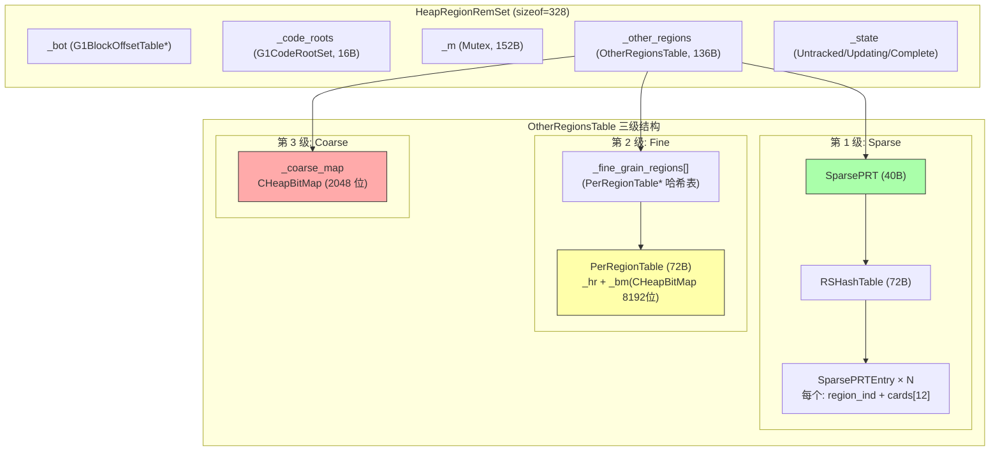
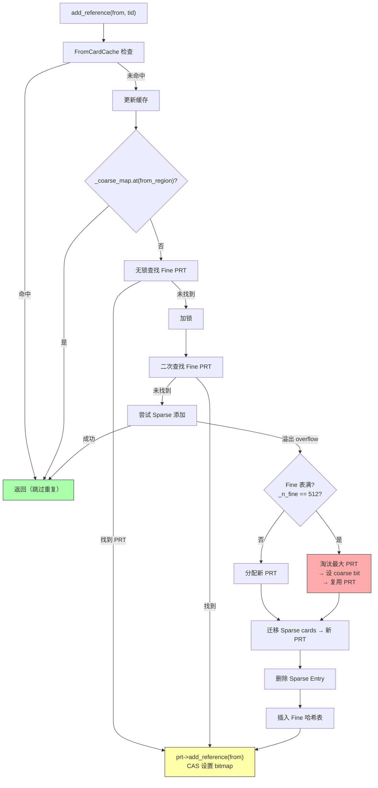

# G1 RSet 三级结构深度分析

> **目标**：深入理解 G1 Remembered Set 的 Sparse → Fine → Coarse 三级存储结构，以及 add_reference 的升级联动机制
> **标准环境**：-Xms8g -Xmx8g -XX:+UseG1GC，Region=4MB，2048 Regions
> **源码文件**：`heapRegionRemSet.hpp/cpp`、`sparsePRT.hpp/cpp`、`g1FromCardCache.hpp/cpp`、`g1RemSet.hpp/cpp`

---

## 第 0 部分：核心原理 ⭐

### 0.1 本质是什么？

G1 RSet 的本质是**每个 Region 维护的"谁引用了我"的反向索引**，采用 Sparse→Fine→Coarse 三级自适应存储：引用少时用哈希表（精确到卡粒度），引用多时用位图（精确到卡粒度），引用极多时退化为 Region 粒度的粗粒度位图。三级结构在内存开销和扫描精度之间动态平衡。

### 0.2 为什么需要？

G1 Young GC 只回收 CSet 中的 Region，但 CSet 外的 Region 可能有引用指向 CSet 内的对象（跨 Region 引用）。如果不追踪这些引用，GC 会漏标存活对象导致悬空指针。RSet 记录"哪些 Region 的哪些卡引用了我"，GC 时只需扫描 RSet 中记录的卡，而不是扫描整个堆。

### 0.3 怎么解决？

**三级自适应存储**：
- **Sparse（稀疏）**：`SparsePRT`，哈希表存储 `(from_region_idx, card_idx)` 对，精确到 512 字节卡粒度，内存最省
- **Fine（细粒度）**：`PerRegionTable`，每个 from_region 对应一个 512 位的位图（512 个卡），精确到卡粒度，查找 O(1)
- **Coarse（粗粒度）**：`_coarse_map`，每个 from_region 对应 1 位，只知道"有引用"但不知道具体哪张卡，扫描时需要扫描整个 from_region

**升级触发**：Sparse 超过 `G1RSetSparseRegionEntries`（默认 4）个 from_region 时升级为 Fine；Fine 超过 `G1RSetRegionEntries`（默认 256）个 from_region 时升级为 Coarse。

### 0.4 为什么这样设计？

- **为什么需要三级而不是直接用位图？** 大多数 Region 的 RSet 很小（只有少量跨 Region 引用），直接用位图每个 Region 需要 2048×64B = 128KB，2048 个 Region 共需 256MB；三级结构让小 RSet 用哈希表，只有大 RSet 才用位图，内存开销降低 10-100 倍
- **为什么 Sparse 用哈希表而不是链表？** 哈希表查找 O(1)，`add_reference` 时需要检查是否已存在（避免重复），链表查找 O(n)
- **为什么 Coarse 只记录 Region 粒度？** 当一个 Region 有大量引用指向另一个 Region 时，精确记录每张卡的代价超过了收益（扫描时反正要扫描很多卡）；Coarse 牺牲精度换取内存节省
- **为什么升级是单向的（不会降级）？** 降级需要重建数据结构，代价高；而且引用数量通常只增不减（对象生命周期内引用只会增加）

---

## 一、问题引入：为什么需要 RSet？

### 1.1 回顾写屏障

[上一篇（#4 写屏障 + CardTable）](./4-WriteBarrier-CardTable.md) 讲了：写屏障将脏卡地址入队 DirtyCardQueue → 提交全局 DirtyCardQueueSet → Concurrent Refinement 线程消费。

**那消费之后做什么？** 答案是：**更新目标 Region 的 RSet**。

### 1.2 RSet 的作用

RSet（Remembered Set）回答一个问题：**"哪些其他 Region 中的哪些卡片包含指向我的引用？"**

```
┌── Region A (Old) ────┐       ┌── Region B (Young) ────┐
│                       │       │                         │
│  obj.field ────────────────→  target                    │
│  (card #42)           │       │                         │
└───────────────────────┘       └─────────────────────────┘
                                  │
                                  ▼
                                Region B 的 RSet 记录：
                                "Region A 的 card #42 有指向我的引用"
```

**Young GC 时**：扫描 CSet 中所有 Region 的 RSet → 找到所有"指向 CSet"的卡片 → 扫描这些卡片中的对象 → 不遗漏任何存活引用。

### 1.3 RSet 的设计挑战

对于 2048 个 Region 的 8GB 堆：
- 如果每个 Region 对每个可能的来源 Region 都维护一个 bitmap（8192 位 = 1KB/来源），则 **最坏情况**：2048 × 2048 × 1KB = **4GB**！
- 实际上大部分 Region 之间没有跨 Region 引用，全用 bitmap 太浪费

**解决方案**：三级自适应结构——按引用密度动态选择存储精度。

---

## 二、整体架构

### 2.1 类层次总览

```
HeapRegionRemSet (CHeapObj)                sizeof=328
  ├─ _bot           G1BlockOffsetTable*     8B
  ├─ _code_roots    G1CodeRootSet           16B (nmethod 集合)
  ├─ _m             Mutex                   152B (保护锁)
  ├─ _other_regions OtherRegionsTable       136B ← 核心：三级结构
  └─ _state         RemSetState (enum)      4B
         Untracked(0) / Updating(1) / Complete(2)
```

```
OtherRegionsTable                          sizeof=136
  ├─ _g1h               G1CollectedHeap*    8B (offset 0)
  ├─ _m                 Mutex*              8B (offset 8)
  ├─ _hr                HeapRegion*         8B (offset 16)
  │
  ├─ ━━━ 第 3 级：Coarse (粗粒度) ━━━
  ├─ _coarse_map         CHeapBitMap        24B (offset 24)
  │     每 Region 一个 bit，2048 位 = 256 字节
  ├─ _n_coarse_entries   size_t             8B (offset 48)
  │
  ├─ ━━━ 第 2 级：Fine (细粒度) ━━━
  ├─ _fine_grain_regions PerRegionTable**   8B (offset 56)
  │     开放哈希表，最多 _max_fine_entries(512) 个 PRT
  ├─ _n_fine_entries     size_t             8B (offset 64)
  ├─ _first_all_fine_prts PerRegionTable*   8B (双向链表头)
  ├─ _last_all_fine_prts  PerRegionTable*   8B (双向链表尾)
  ├─ _fine_eviction_start size_t            8B (淘汰采样起点)
  │
  ├─ ━━━ 第 1 级：Sparse (稀疏) ━━━
  └─ _sparse_table       SparsePRT          40B (offset 96)
```

### 2.2 三级结构对比

| 级别 | 数据结构 | 精度 | 空间开销 | 适用场景 |
|------|---------|------|---------|---------|
| **Sparse** | 哈希表 + card 数组 | 精确到 card | 最低（少量 card 时） | 引用稀疏：< 12 张卡来自同一 Region |
| **Fine** | PerRegionTable + bitmap | 精确到 card | 中等（每来源 1KB） | 引用中等：≥ 12 张卡来自同一 Region |
| **Coarse** | 位图（每 Region 1 bit） | 只到 Region | 最低（256B 总共） | 引用密集：Fine 表满时淘汰 |

**升级方向**：Sparse → Fine → Coarse（精度递减，但空间可控）

### 2.3 Mermaid 架构图



---

## 三、第 1 级：Sparse（稀疏表）

### 3.1 设计思想

大部分跨 Region 引用来自少量卡片。如果某个来源 Region 只有 1-2 张卡指向本 Region，用完整 bitmap（8192 位 = 1KB）太浪费。Sparse 表用**小数组**直接存储这几张卡的索引。

### 3.2 数据结构

```
SparsePRT (sizeof=40)
  ├─ _cur   RSHashTable*     8B (当前活跃表)
  ├─ _next  RSHashTable*     8B (扩展时的新表)
  └─ ...                     24B

RSHashTable (sizeof=72)
  ├─ _num_entries            实际 Entry 槽数（容量 × 占用因子）
  ├─ _capacity               哈希表桶数
  ├─ _capacity_mask          = _capacity - 1
  ├─ _occupied_entries       已使用的 Entry 数
  ├─ _occupied_cards         已存储的卡片总数
  ├─ _entries                SparsePRTEntry 数组
  ├─ _buckets                int 数组（桶 → Entry 索引映射）
  ├─ _free_region            下一个空闲 Entry 索引
  └─ _free_list              空闲链表头

SparsePRTEntry:
  ├─ _region_ind   RegionIdx_t(int)    来源 Region 索引
  ├─ _next_index   int                 哈希冲突链
  ├─ _next_null    int                 下一个空 card 槽位
  └─ _cards[12]    uint16_t × 12       卡片索引数组
```

### 3.3 关键参数（GDB 验证）

- **G1RSetSparseRegionEntries = 12**：每个 SparsePRTEntry 最多存 12 张卡
  - 计算：`G1RSetSparseRegionEntriesBase(4) × (region_size_log_mb(2) + 1) = 12`
- **RSHashTable 初始**：`_num_entries = 9`，`_capacity = 16`（16 个桶）
- **_cur == _next**：初始时两个指针相同，扩展时 `_next` 指向新表

### 3.4 操作流程

**add_card(region_id, card_index)**：
1. 哈希查找 `region_id` 对应的 `SparsePRTEntry`
2. 如果找到：
   - card 已存在 → 返回 `found`
   - card 不存在且有空位 → 添加 → 返回 `added`
   - card 不存在且满 → 返回 `overflow`（触发升级到 Fine）
3. 如果未找到：分配新 Entry → 初始化 → 添加 card

**溢出处理**：当某个 region 的 card 数超过 12 → 创建 PerRegionTable → 迁移所有 card → 删除 Sparse Entry

---

## 四、第 2 级：Fine（细粒度 PerRegionTable）

### 4.1 设计思想

当某个来源 Region 有 ≥ 12 张卡指向本 Region 时，用固定数组已不够。Fine 级别为每个来源 Region 分配一个 **PerRegionTable**，内含完整的 8192 位 bitmap（1KB），精确记录每张卡。

### 4.2 PerRegionTable 结构

```
PerRegionTable (sizeof=72)
  ├─ [vtable]                     8B
  ├─ _hr        HeapRegion*       8B   来源 Region
  ├─ _bm        CHeapBitMap       24B  位图（8192 位 = 1024 字节）
  ├─ _occupied   jint             4B   已设置的位数
  ├─ _next       PerRegionTable*  8B   双向链表 next
  ├─ _prev       PerRegionTable*  8B   双向链表 prev
  └─ _collision_list_next         8B   哈希冲突链
```

**每个 PerRegionTable 占用**：72B 对象 + 1024B bitmap = **约 1.1KB**

### 4.3 组织方式

Fine 级别的 PRT 通过两种方式组织：

1. **哈希表**：`_fine_grain_regions[512]`，按 `region_index % 512` 分桶，冲突链通过 `_collision_list_next`
2. **双向链表**：所有 PRT 通过 `_next`/`_prev` 链接，`_first_all_fine_prts`/`_last_all_fine_prts` 指向头尾

### 4.4 关键参数（GDB 验证）

- **_max_fine_entries = 512**：最多 512 个 PerRegionTable
  - 计算：`2^log2(768)` = `2^9` = 512（取 G1RSetRegionEntries=768 的下取整 2 次幂）
- **_mod_max_fine_entries_mask = 0x1FF**：哈希取模掩码
- **空间上限**：512 × 1.1KB ≈ **550KB**（每个 Region 的 RSet Fine 级别上限）

### 4.5 add_reference 流程

```cpp
void PerRegionTable::add_reference_work(OopOrNarrowOopStar from, bool par) {
  HeapRegion* loc_hr = hr();
  if (loc_hr->is_in_reserved(from)) {
    CardIdx_t from_card = OtherRegionsTable::card_within_region(from, loc_hr);
    add_card_work(from_card, par);
  }
}

void PerRegionTable::add_card_work(CardIdx_t from_card, bool par) {
  if (!_bm.at(from_card)) {
    if (par) {
      if (_bm.par_at_put(from_card, 1))  // CAS 并发设置
        Atomic::inc(&_occupied);
    } else {
      _bm.at_put(from_card, 1);
      _occupied++;
    }
  }
}
```

### 4.6 全局空闲列表

PerRegionTable 通过全局 `_free_list` 复用，使用 CAS 实现无锁分配/释放：

```cpp
static PerRegionTable* alloc(HeapRegion* hr) {
  PerRegionTable* fl = _free_list;
  while (fl != NULL) {
    PerRegionTable* nxt = fl->next();
    PerRegionTable* res = Atomic::cmpxchg(nxt, &_free_list, fl);
    if (res == fl) {
      fl->init(hr, true);  // 复用：重新初始化
      return fl;
    }
    fl = _free_list;
  }
  // 空闲列表为空，new 一个
  return new PerRegionTable(hr);
}
```

---

## 五、第 3 级：Coarse（粗粒度位图）

### 5.1 设计思想

当 Fine 表达到上限（512 个 PRT）时，必须淘汰一个 PRT 腾出空间。被淘汰的 PRT 对应的 Region 退化为 **Coarse 位**——只知道"该 Region 有指向本 Region 的引用"，不知道具体哪些卡。

### 5.2 数据结构

```
_coarse_map: CHeapBitMap (24B metadata + 256B 数据)
  每个 bit 对应一个 Region
  bit[i] = 1 表示 Region i 有指向本 Region 的引用
  总大小: 2048 位 = 256 字节

_n_coarse_entries: 已设置的 bit 数
```

### 5.3 Coarse 的代价

Coarse 精度最低。GC 时如果 `_coarse_map.at(region_idx)` 为 true，必须扫描整个来源 Region 的**所有 8192 张卡**，即使只有少数几张卡实际包含引用。

对比：Fine 级别只需扫描 bitmap 中为 1 的那些卡。

---

## 六、三级联动：add_reference 完整流程

### 6.1 入口

```
G1RemSet::refine_card_concurrently()  (Concurrent Refinement 线程)
  → 扫描脏卡区域中的对象引用
  → G1ConcurrentRefineOopClosure::do_oop()
  → 目标 Region 的 HeapRegionRemSet::add_reference(from, tid)
  → OtherRegionsTable::add_reference(from, tid)
```

### 6.2 核心流程（heapRegionRemSet.cpp:346-428）



### 6.3 伪代码

```
add_reference(from, tid):
  // 层 0: FromCardCache 快速去重
  from_card = card_within_region(from, from_hr)
  if G1FromCardCache::contains_or_replace(tid, cur_hrm_ind, from_card):
    return  // 同线程、同 Region、同卡，跳过

  // 层 1: Coarse 检查
  if _coarse_map.at(from_hrm_ind):
    return  // 已粗化，不需要更精确的记录

  // 层 2: Fine 无锁查找
  prt = find_region_table(bucket_idx, from_hr)
  if prt != NULL:
    prt->add_reference(from)  // CAS 设位
    return

  // 未找到，加锁
  lock(_m):
    // 二次检查
    prt = find_region_table(bucket_idx, from_hr)
    if prt != NULL:
      prt->add_reference(from)
      return

    // 尝试 Sparse
    result = _sparse_table.add_card(from_hrm_ind, from_card)
    if result != overflow:
      return  // Sparse 成功

    // Sparse 溢出 → 需要 Fine PRT
    if _n_fine_entries == _max_fine_entries:
      // Fine 满 → 淘汰 → Coarse
      prt = delete_region_table()  // 采样找最大 PRT，设 coarse bit
    else:
      prt = PerRegionTable::alloc(from_hr)
      link_to_all(prt)
      _n_fine_entries++

    // 迁移 Sparse → Fine
    copy sparse cards to prt
    _sparse_table.delete_entry(from_hrm_ind)

    // 发布到哈希桶（release store 确保其他线程可见）
    prt->_collision_list_next = _fine_grain_regions[ind]
    OrderAccess::release_store(&_fine_grain_regions[ind], prt)

  // 最后添加到 PRT
  prt->add_reference(from)
```

### 6.4 淘汰策略（delete_region_table）

当 Fine 表满（512 个 PRT），必须淘汰一个 PRT 升级为 Coarse：

1. **采样**：从 `_fine_eviction_start` 开始，步长 `_fine_eviction_stride(56)`，采样 `_fine_eviction_sample_size(9)` 个桶
2. **选择**：找 `occupied()` 最大的 PRT
3. **理由**：占用最多 = 引用最密 = 升级为 Coarse 后精度损失最小（因为要扫描的卡数占比高，Coarse 粒度差距相对小）
4. **操作**：设 `_coarse_map` 对应 bit → 从哈希表摘除 → 返回 PRT 供复用

---

## 七、G1FromCardCache：去重优化

### 7.1 设计思想

Concurrent Refinement 处理脏卡时，同一张卡可能多次被标脏（应用线程频繁修改同一引用字段）。`G1FromCardCache` 是一个 per-thread per-region 的缓存，避免对同一张卡重复执行完整的 add_reference 流程。

### 7.2 数据结构

```
G1FromCardCache (全局静态)
  _cache: uintptr_t[region_idx][worker_id]
  每个元素缓存"该 worker 最近处理的、指向该 Region 的卡片索引"
  
  内存: Padded2DArray 分配，避免 false sharing
```

### 7.3 GDB 验证

```
G1FromCardCache::_cache       = 0x7ffff5439000
G1FromCardCache::_max_regions = 2048
_static_mem_size              = 802944 B ≈ 784 KB
```

**内存计算**：2048 Regions × (每 Region 一行，按 cache line 对齐) × 若干 worker ≈ 784KB

### 7.4 使用方式

```cpp
// 在 add_reference 最开头
if (G1FromCardCache::contains_or_replace(tid, cur_hrm_ind, from_card)) {
  return;  // 命中：该 worker 刚刚处理过同一 Region 的同一张卡
}
// 未命中：替换缓存值为当前卡，继续处理
```

---

## 八、HeapRegionRemSet 状态机

### 8.1 三种状态

```
Untracked (0) ──→ Updating (1) ──→ Complete (2)
     ↑                                   │
     └───────────────────────────────────┘
```

| 状态 | 含义 | 触发条件 |
|------|------|---------|
| **Untracked** | 不追踪引用（新建/回收后） | Region 创建、回收 |
| **Updating** | 正在更新（接受 add_reference） | Young GC 开始标记新 Region |
| **Complete** | 更新完成（数据完整） | Refinement 追上进度 |

### 8.2 状态对 add_reference 的影响

```cpp
void HeapRegionRemSet::add_reference(OopOrNarrowOopStar from, uint tid) {
  RemSetState state = _state;
  if (state == Untracked) {
    return;  // 不追踪 → 忽略
  }
  _other_regions.add_reference(from, tid);
}
```

**Young Region 的 RSet 状态始终为 Untracked**——Young 总是被完整收集，不需要 RSet。

---

## 九、关键数量关系

### 9.1 8GB 堆的 RSet 参数（GDB 验证）

| 参数 | 值 | 计算 |
|------|-----|------|
| Region 大小 | 4MB | 配置 |
| CardsPerRegion | 8192 | 4MB / 512B |
| G1RSetSparseRegionEntries | **12** | 4 × (log2(4MB/1MB) + 1) = 4 × 3 |
| G1RSetRegionEntries | **768** | 256 × (log2(4MB/1MB) + 1) = 256 × 3 |
| _max_fine_entries | **512** | 2^log2(768) = 2^9 |
| _fine_eviction_stride | 56 | |
| _fine_eviction_sample_size | 9 | |
| Coarse bitmap 大小 | 256B | 2048 bits |

### 9.2 单个 Region RSet 空间占用

| 组件 | 大小 | 说明 |
|------|------|------|
| HeapRegionRemSet 对象 | 328B | 固定 |
| Sparse 表 (RSHashTable) | 72B + entries | 初始 9 个 entry |
| Fine 表上限 | 512 × ~1.1KB | ≈ 550KB |
| Coarse bitmap | 256B | 固定 |
| **最坏情况** | **~550KB** | Sparse + Fine 满 + Coarse |

### 9.3 全堆 RSet 空间

**最坏情况**（所有 Region 都有密集跨 Region 引用）：
- 2048 × 550KB ≈ **1.1GB**
- 占堆的 13.7%

**实际情况**：大部分 Region（尤其是 Young Region）RSet 为 Untracked，实际开销远小于此。

---

## 十、GDB 验证数据汇总

### 10.1 sizeof 验证

| 类 | sizeof | 说明 |
|---|--------|------|
| **HeapRegionRemSet** | **328** | 含 Mutex(152B) + OtherRegionsTable(136B) |
| **OtherRegionsTable** | **136** | Sparse(40B) + Fine 指针 + Coarse bitmap |
| SparsePRT | 40 | 双指针 + 状态 |
| RSHashTable | 72 | 哈希表元数据 |
| PerRegionTable | 72 | 含 CHeapBitMap(24B) 元数据，bitmap 数据另算 |
| G1CodeRootSet | 16 | nmethod 集合 |
| CHeapBitMap | 24 | 元数据（_map 指针 + _size） |
| Mutex | 152 | JVM 互斥锁 |

### 10.2 Region 2047 的 RSet（初始状态）

```
_state                    = 0 (Untracked)  ← Young Region，不追踪
_n_coarse_entries         = 0              ← 无粗化
_n_fine_entries           = 0              ← 无 Fine PRT
_first_all_fine_prts      = (nil)          ← Fine 链表空
RSHashTable._occupied_entries = 0          ← Sparse 表空
RSHashTable._occupied_cards   = 0
RSHashTable._num_entries  = 9              ← 初始 9 个 Entry 槽
RSHashTable._capacity     = 16             ← 16 个桶
_coarse_map._size         = 2048           ← 2048 位（所有 Region）
```

### 10.3 字段偏移

```
HeapRegionRemSet:
  _bot             offset 8
  _code_roots      offset 16
  _m               offset 32    (Mutex, 152B)
  _other_regions   offset 184   (OtherRegionsTable, 136B)
  _state           offset 320

OtherRegionsTable:
  _g1h              offset 0
  _m                offset 8
  _hr               offset 16
  _coarse_map       offset 24   (CHeapBitMap, 24B)
  _n_coarse_entries offset 48
  _fine_grain_regions offset 56
  _n_fine_entries    offset 64
  _sparse_table     offset 96   (SparsePRT, 40B)
```

---

## 十一、refine_card_concurrently：从脏卡到 RSet 的桥梁

### 11.1 完整流程

这是 #4 写屏障的下游消费者——Concurrent Refinement 线程调用 `G1RemSet::refine_card_concurrently(card_ptr, worker_i)`：

```
1. 检查卡片是否仍然脏
   └─ 不脏 → 返回（已被其他线程处理）

2. 找到卡片对应的 Region

3. 过滤非 Old/Humongous Region
   └─ Young/Free/Archive → 返回（不需要 RSet）

4. 热卡缓存（G1HotCardCache）
   ├─ insert() 返回 NULL → 卡被缓存，返回
   ├─ insert() 返回原卡 → 不热，继续
   └─ insert() 返回旧卡 → 处理旧卡

5. 清除脏标记: *card_ptr = clean_card_val()

6. 内存屏障: OrderAccess::fence()

7. 扫描卡片覆盖的 512B 区域中的所有对象引用
   → G1ConcurrentRefineOopClosure::do_oop()
   → 对每个跨 Region 引用:
     目标 Region 的 rem_set()->add_reference(from, worker_i)
     → OtherRegionsTable::add_reference()  ← 三级结构入口

8. 处理失败时重新标脏 + 入队
```

### 11.2 JVM 参数观察 RSet 统计

```bash
java -Xms8g -Xmx8g -XX:+UseG1GC \
     -Xlog:gc+remset*=trace \
     -cp /data/workspace/demo/src com.wjcoder.Main

# 输出示例:
# [gc,remset] Concurrent refinement: cards=1234, buffers=42
# [gc,remset] Fine PRTs: occupied=15, max=512
# [gc,remset] Coarsenings: 2
# [gc,remset] Processed 42 buffers (mut), 15 (rs thread)
```

---

## 十二、总结

### 12.1 设计精髓

1. **三级自适应**：Sparse（少量引用，低开销） → Fine（中等引用，精确追踪） → Coarse（密集引用，退化到 Region 粒度）。用空间换时间的经典权衡
2. **无锁读 + 有锁写**：`find_region_table()` 无锁查找，只在需要修改结构时才加锁
3. **CAS 并发 bitmap 操作**：PerRegionTable 的 `par_at_put()` 使用 CAS 实现多线程并发设位
4. **FromCardCache 去重**：per-thread per-region 缓存避免同一张卡重复处理
5. **PRT 对象池**：全局空闲列表 + CAS 无锁分配/释放，减少 malloc/free 开销
6. **采样淘汰**：Fine→Coarse 淘汰时不遍历全表，而是采样 9 个桶找最大占用

### 12.2 与上下游的连接

```
上游 (#4 写屏障):
  Post-Write Barrier → CardTable 标脏 → DirtyCardQueue → DirtyCardQueueSet

本篇 (#5 RSet):
  Concurrent Refinement → refine_card_concurrently()
    → OtherRegionsTable::add_reference()
    → Sparse / Fine / Coarse 三级存储

下游 (#6 并发精化, #9 疏散):
  Young GC / Mixed GC 时:
    遍历 CSet 中 Region 的 RSet → 找到所有跨 Region 引用的卡片
    → 扫描卡片中的对象 → 确保不遗漏存活引用
```

---

## 附录：GDB 验证脚本

脚本路径：`new-jvm-md/tmp-file/G1GC/gdb_rset.gdb`

运行方式：
```bash
cd /data/workspace/openjdk-cut-new
gdb -x new-jvm-md/tmp-file/G1GC/gdb_rset.gdb \
    build/linux-x86_64-normal-server-slowdebug/jdk/bin/java
```

验证输出：`new-jvm-md/tmp-file/G1GC/gdb_rset_output.txt`
