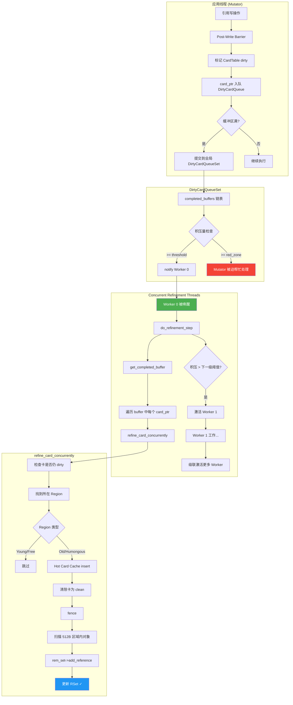
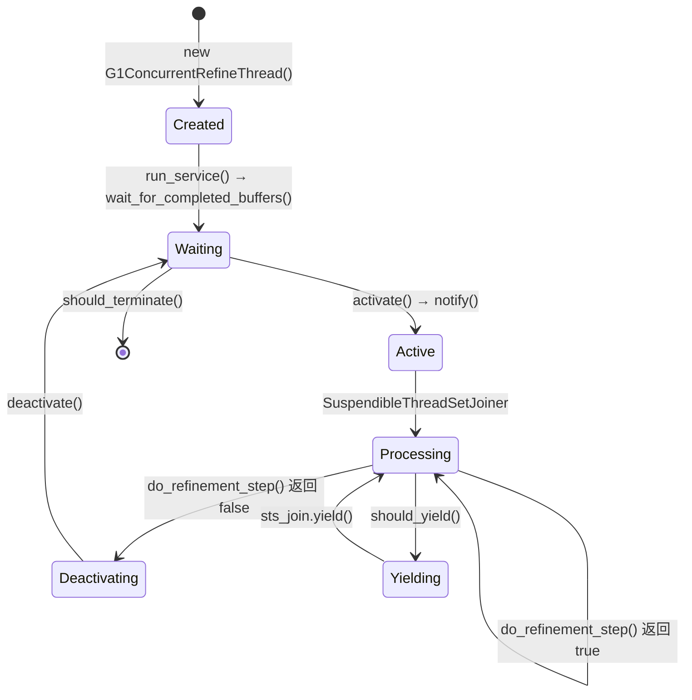
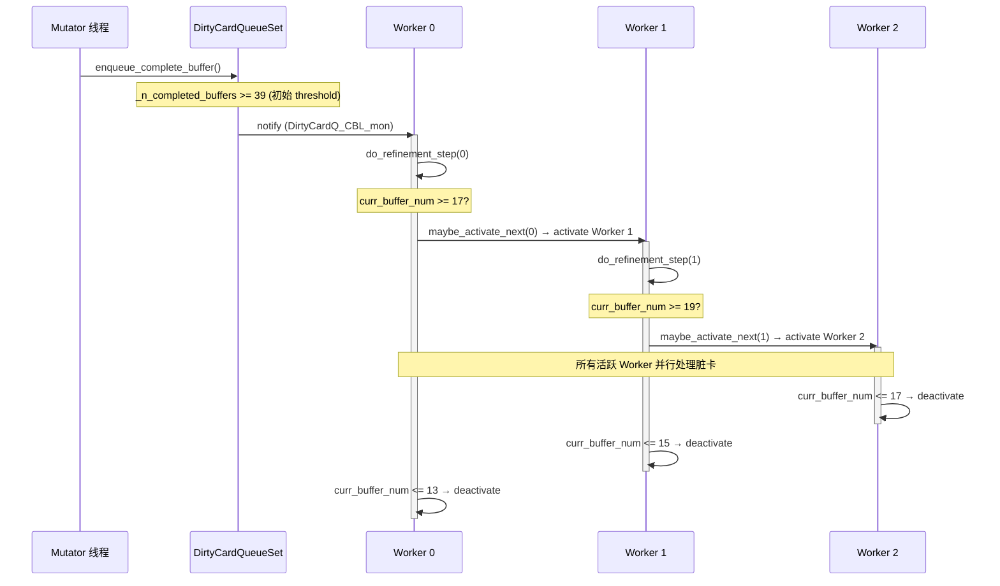
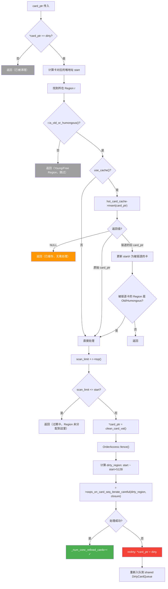
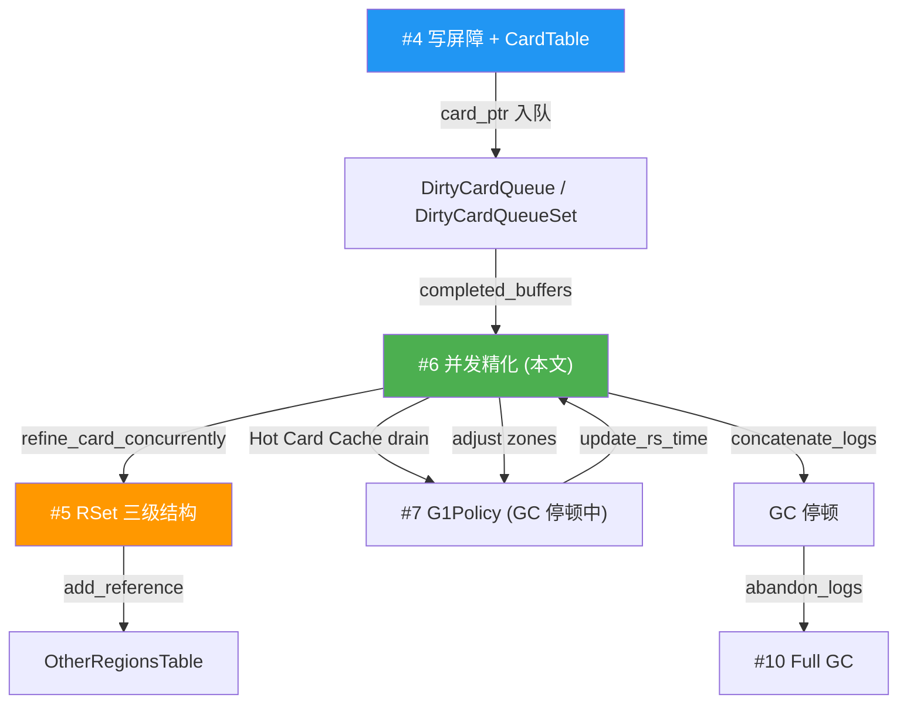

# G1 并发精化（Concurrent Refinement）深度分析

> 基于 OpenJDK 11 源码，标准环境：`-Xms8g -Xmx8g -XX:+UseG1GC`，G1 Region = 4MB

---

## 第 0 部分：核心原理 ⭐

### 0.1 本质是什么？

并发精化的本质是**将写屏障产生的脏卡异步转化为 RSet 条目的后台流水线**：应用线程写屏障只做最轻量的操作（标记脏卡 + 入队），后台 Concurrent Refinement 线程从 `DirtyCardQueueSet` 取出脏卡，扫描卡内的引用，更新目标 Region 的 RSet。整个过程与应用线程并发，不需要 STW。

### 0.2 为什么需要？

写屏障在应用线程的热路径上执行，必须极轻量（纳秒级）。但 RSet 更新涉及复杂的数据结构操作（哈希表/位图查找+插入，可能触发 Sparse→Fine→Coarse 升级），代价高（微秒级）。如果在写屏障中同步更新 RSet，会严重拖慢应用线程。并发精化将这个代价转移到后台线程，应用线程只需入队（几纳秒）。

### 0.3 怎么解决？

**三色区域 + 弹性线程池**：
- `DirtyCardQueueSet` 有三个水位线：Green（13）/Yellow（39）/Red（65）（单位：缓冲区数量）
- 队列 < Green：只有 Refinement 线程处理，应用线程不受影响
- 队列 > Yellow：应用线程在分配时也帮助处理脏卡（`do_dirty_card_buffer_in_thread()`）
- 队列 > Red：应用线程必须处理完一个缓冲区才能继续分配（背压机制）
- GC 开始时：`update_rem_set()` 处理所有残留脏卡，确保 RSet 完整

### 0.4 为什么这样设计？

- **为什么用三色水位线而不是固定线程数？** 脏卡产生速率随应用负载变化，固定线程数在低负载时浪费 CPU，高负载时处理不及；三色水位线让系统自适应：负载低时少用线程，负载高时让应用线程也参与
- **为什么 Red 区要让应用线程参与？** 如果 Refinement 线程跟不上脏卡产生速率，队列无限增长，GC 开始时需要处理大量积压脏卡，延长 STW 时间；Red 区背压机制限制积压量，以牺牲少量应用吞吐换取 GC 停顿可控
- **为什么并发精化要"先清除脏卡标记再扫描"而不是反过来？** 如果先扫描再清除，扫描期间新的写操作可能再次标记同一张卡为 dirty，清除后这个新的 dirty 就丢失了；先清除再扫描，扫描期间的新 dirty 会被下一轮处理
- **为什么 GC 停顿中还需要 `update_rem_set()`？** 并发精化是尽力而为的，GC 开始时可能还有未处理的脏卡；`update_rem_set()` 确保 RSet 完整，否则 GC 会漏标跨 Region 引用

---

## 一、为什么需要并发精化？

### 1.1 问题场景

在 [#4 写屏障 + CardTable](./4-WriteBarrier-CardTable.md) 中我们知道，每次引用类型字段写操作都会经过 Post-Write Barrier，将脏卡地址入队到线程本地的 `DirtyCardQueue`，缓冲区满了就提交到全局 `DirtyCardQueueSet`。

但**脏卡 ≠ RSet 更新**。脏卡只是"标记了哪些 512B 区域被修改过"，真正要让 GC 能高效扫描跨 Region 引用，还需要把脏卡信息转化为 RSet 条目（参见 [#5 RSet 三级结构](./5-RSet-Three-Level-Structure.md)）。

如果把所有脏卡处理推迟到 GC 停顿，会导致：

1. **停顿时间不可控**：积压大量脏卡 → 更新 RSet 时间过长 → STW 停顿变长
2. **内存浪费**：大量脏卡缓冲区堆积消耗内存

### 1.2 解决方案

**并发精化（Concurrent Refinement）**：在应用线程运行的同时，用专门的后台线程处理脏卡缓冲区，将脏卡转化为 RSet 条目。

核心设计目标：
- **减少 GC 停顿中的 Update RS 时间**：尽量在并发阶段完成 RSet 更新
- **自适应负载调节**：根据脏卡积压程度，动态激活/停用精化线程
- **延迟频繁修改的卡**：通过 Hot Card Cache 避免重复处理

---

## 二、整体架构



---

## 三、G1ConcurrentRefine 控制器

### 3.1 类结构

```
G1ConcurrentRefine (CHeapObj<mtGC>)    sizeof = 64
├── _thread_control : G1ConcurrentRefineThreadControl  [offset 0, 24B 内嵌]
│     ├── _cr            : G1ConcurrentRefine*         [offset 0]
│     ├── _threads       : G1ConcurrentRefineThread**  [offset 8]
│     └── _num_max_threads : uint                      [offset 16]
├── _green_zone         : size_t                       [offset 24]
├── _yellow_zone        : size_t                       [offset 32]
├── _red_zone           : size_t                       [offset 40]
└── _min_yellow_zone_size : size_t                     [offset 48]
    // padding to 64B
```

> **源码位置**：`src/hotspot/share/gc/g1/g1ConcurrentRefine.hpp`

### 3.2 三色区域（Three-Zone）机制

三色区域是并发精化的核心调控机制，根据 `DirtyCardQueueSet` 中积压的完成缓冲区数量，决定精化线程的工作强度：

```
        completed_buffers_num()
        ────────────────────────────────────────────────────────>

  0                  green(13)         yellow(39)          red(65)
  ├──────────────────┼──────────────────┼──────────────────┼─────>
  │   Green Zone     │   Yellow Zone    │    Red Zone       │ Beyond
  │   不处理         │   逐步激活线程   │   全部线程运行     │ Mutator被迫帮忙
  │   利用缓存效应   │   级联激活       │                   │ mut_process_buffer
  └──────────────────┴──────────────────┴──────────────────┴──────
```

**为什么 Green Zone 不处理？**
- 少量脏卡积压可以利用"缓存效应"——同一张卡可能被多次修改，延迟处理可以合并多次修改为一次 RSet 更新
- 减少精化线程与应用线程的 CPU 争抢

### 3.3 初始区域计算

区域计算发生在 `G1ConcurrentRefine::create()`：

```cpp
// src/hotspot/share/gc/g1/g1ConcurrentRefine.cpp

// 1. min_yellow_zone_size = G1ConcRefinementThresholdStep(2) × max_num_threads(13) = 26
size_t min_yellow_zone_size = calc_min_yellow_zone_size();

// 2. green = ParallelGCThreads = 13  (FLAG_IS_DEFAULT → 使用 ParallelGCThreads)
size_t green_zone = calc_init_green_zone();

// 3. yellow = green + MAX2(green*2, min_yellow_zone_size)
//          = 13 + MAX2(26, 26) = 39
size_t yellow_zone = calc_init_yellow_zone(green_zone, min_yellow_zone_size);

// 4. red = yellow + (yellow - green) = 39 + 26 = 65
size_t red_zone = calc_init_red_zone(green_zone, yellow_zone);
```

**在我们的标准环境（13核）中**：

| 参数 | 值 | 计算方式 |
|------|------|---------|
| `green_zone` | **13** | `ParallelGCThreads` |
| `yellow_zone` | **39** | `13 + MAX2(26, 26)` |
| `red_zone` | **65** | `39 + 26` |
| `min_yellow_zone_size` | **26** | `2 × 13` |

**JVM 参数**：可通过以下参数手动设置（不建议，默认自适应更优）：
```bash
-XX:G1ConcRefinementGreenZone=13
-XX:G1ConcRefinementYellowZone=39
-XX:G1ConcRefinementRedZone=65
```

**日志输出**：添加 `-Xlog:gc+ergo+refine=debug` 可以看到区域值：
```
[debug][gc,ergo,refine] Initial Refinement Zones: green: 13, yellow: 39, red: 65, min yellow size: 26
```

### 3.4 DirtyCardQueueSet 联动

初始化时，区域值被传递给 DirtyCardQueueSet：

```cpp
// src/hotspot/share/gc/g1/g1CollectedHeap.cpp
G1BarrierSet::dirty_card_queue_set().initialize(
    DirtyCardQ_CBL_mon,
    DirtyCardQ_FL_lock,
    (int) concurrent_refine()->yellow_zone(),   // process_completed_threshold = 39
    (int) concurrent_refine()->red_zone(),      // max_completed_queue = 65
    Shared_DirtyCardQ_lock,
    NULL,   // 自己管理空闲缓冲区池
    true);  // init_free_ids = true
```

- **`_process_completed_threshold = 39`**：当 `_n_completed_buffers >= 39` 时，通知 Worker 0
- **`_max_completed_queue = 65`**：当积压达到 65，Mutator 线程被迫调用 `mut_process_buffer()` 亲自处理

> 注意：首次 GC 停顿后 `adjust()` 会将 `_process_completed_threshold` 更新为 `activation_threshold(0)`，后续分析。

---

## 四、精化线程（G1ConcurrentRefineThread）

### 4.1 类结构

`G1ConcurrentRefineThread` 继承自 `ConcurrentGCThread`（→ `NamedThread` → `Thread`）。

关键字段：

| 字段 | 类型 | 说明 |
|------|------|------|
| `_vtime_start` | `double` | 虚拟时间起点 |
| `_vtime_accum` | `double` | 累积虚拟时间 |
| `_worker_id` | `uint` | 工作线程 ID（0 ~ 12） |
| `_worker_id_offset` | `uint` | 全局 ID 偏移量 |
| `_active` | `bool` | 是否活跃 |
| `_monitor` | `Monitor*` | 等待/通知用的监视器 |
| `_cr` | `G1ConcurrentRefine*` | 指向控制器 |

> **源码位置**：`src/hotspot/share/gc/g1/g1ConcurrentRefineThread.hpp`

### 4.2 线程创建策略

```cpp
// src/hotspot/share/gc/g1/g1ConcurrentRefine.cpp — initialize() → _thread_control.initialize()
for (uint i = 0; i < num_max_threads; i++) {
    if (UseDynamicNumberOfGCThreads && i != 0) {
        _threads[i] = NULL;            // 延迟创建
    } else {
        _threads[i] = create_refinement_thread(i, true);  // 只创建 Worker 0
    }
}
```

**关键点**：

- `UseDynamicNumberOfGCThreads` 默认为 `true`
- 初始只创建 **Worker 0**，其余 Worker 1~12 按需创建
- 线程数组大小 = `G1ConcRefinementThreads = ParallelGCThreads = 13`

### 4.3 Worker 0 的特殊性

Worker 0 是"主"精化线程，与其他 Worker 有两个关键差异：

| 特性 | Worker 0 (Primary) | Worker 1~12 (Non-Primary) |
|------|---------------------|---------------------------|
| **Monitor** | `DirtyCardQ_CBL_mon`（全局锁） | `new Monitor(...)` 独立监视器 |
| **激活方式** | `dcqs.set_process_completed(true)` | `_active = true` |
| **is_active() 判断** | `dcqs.process_completed_buffers()` | `_active` 字段 |
| **创建时机** | 初始化时立即创建 | 按需延迟创建 |

**为什么 Worker 0 使用 `DirtyCardQ_CBL_mon`？**

因为 Mutator 线程在 `PtrQueueSet::enqueue_complete_buffer()` 中提交缓冲区时，已经持有 `DirtyCardQ_CBL_mon` 并调用 `notify()`。让 Worker 0 等待在同一个 Monitor 上，就能被直接唤醒，无需额外的通知机制。

### 4.4 线程生命周期



### 4.5 run_service() 主循环

```cpp
// src/hotspot/share/gc/g1/g1ConcurrentRefineThread.cpp
void G1ConcurrentRefineThread::run_service() {
    _vtime_start = os::elapsedVTime();
    while (!should_terminate()) {
        // 1. 等待被激活
        wait_for_completed_buffers();
        if (should_terminate()) break;

        // 2. 加入 SuspendibleThreadSet（允许 safepoint 暂停）
        {
            SuspendibleThreadSetJoiner sts_join;
            while (!should_terminate()) {
                if (sts_join.should_yield()) {
                    sts_join.yield();  // 配合 safepoint
                    continue;
                }
                // 3. 执行一步精化
                if (!_cr->do_refinement_step(_worker_id)) {
                    break;  // 积压量低于退出阈值，停止工作
                }
                ++buffers_processed;
            }
        }

        // 4. 自我停用
        deactivate();
    }
}
```

**`SuspendibleThreadSetJoiner` 的作用**：
- 精化线程在工作期间"加入"可暂停线程集
- 当 GC 需要 safepoint 时，精化线程会配合暂停（`should_yield() → yield()`）
- 这确保了 GC 停顿期间精化线程不会干扰

---

## 五、级联激活机制

### 5.1 阈值计算

每个 Worker 有独立的激活/退出阈值，通过 `calc_thresholds()` 计算：

```cpp
static Thresholds calc_thresholds(size_t green_zone, size_t yellow_zone, uint worker_i) {
    double yellow_size = yellow_zone - green_zone;           // 39 - 13 = 26
    double step = yellow_size / max_num_threads();           // 26 / 13 = 2.0

    // Worker 0 特殊处理：step 不超过 ParallelGCThreads/2
    if (worker_i == 0) {
        step = MIN2(step, ParallelGCThreads / 2.0);         // MIN2(2.0, 6.5) = 2.0
    }

    size_t activate_offset = ceil(step * (worker_i + 1));
    size_t deactivate_offset = floor(step * worker_i);

    return (green_zone + activate_offset, green_zone + deactivate_offset);
}
```

### 5.2 标准环境下的阈值表

| Worker | activate (激活) | deactivate (停用) | 含义 |
|--------|----------------|-------------------|------|
| 0 | **15** | **13** | 积压 ≥ 15 激活 Worker 0，≤ 13 停用 |
| 1 | **17** | **15** | Worker 0 发现积压 ≥ 17 → 激活 Worker 1 |
| 2 | **19** | **17** | Worker 1 发现积压 ≥ 19 → 激活 Worker 2 |
| 3 | **21** | **19** | ... |
| 4 | **23** | **21** | ... |
| 5 | **25** | **23** | ... |
| 6 | **27** | **25** | ... |
| 7 | **29** | **27** | ... |
| 8 | **31** | **29** | ... |
| 9 | **33** | **31** | ... |
| 10 | **35** | **33** | ... |
| 11 | **37** | **35** | ... |
| 12 | **39** | **37** | 全部激活需要积压 ≥ 39 = yellow_zone |

**关键观察**：
- 相邻 Worker 的激活阈值间隔 = `step = 2`
- Worker N 的 deactivate = Worker N-1 的 activate → **平滑过渡，无抖动**
- Worker 12 的 activate = `yellow_zone` → Yellow Zone 满才会全部激活

### 5.3 激活链路



### 5.4 do_refinement_step() 核心逻辑

```cpp
// src/hotspot/share/gc/g1/g1ConcurrentRefine.cpp
bool G1ConcurrentRefine::do_refinement_step(uint worker_id) {
    DirtyCardQueueSet& dcqs = G1BarrierSet::dirty_card_queue_set();
    size_t curr_buffer_num = dcqs.completed_buffers_num();

    // 1. 清除 padding（GC 停顿后的过渡期结束）
    if (dcqs.completed_queue_padding() > 0 && curr_buffer_num <= yellow_zone()) {
        dcqs.set_completed_queue_padding(0);
    }

    // 2. 尝试激活下一级 Worker
    maybe_activate_more_threads(worker_id, curr_buffer_num);

    // 3. 处理一个缓冲区（如果积压量 > 退出阈值）
    return dcqs.refine_completed_buffer_concurrently(
        worker_id + worker_id_offset(),      // 全局唯一 worker ID
        deactivation_threshold(worker_id));   // stop_at 退出阈值
}
```

**`worker_id_offset()`**：返回 `DirtyCardQueueSet::num_par_ids()` = `os::initial_active_processor_count()` = 16（在我们的环境中）。这个偏移确保精化线程的 ID 不与 Mutator 线程的并行处理 ID 冲突。

---

## 六、缓冲区处理流程

### 6.1 从全局链表获取缓冲区

```cpp
// src/hotspot/share/gc/g1/dirtyCardQueue.cpp
BufferNode* DirtyCardQueueSet::get_completed_buffer(size_t stop_at) {
    MutexLockerEx x(_cbl_mon, Mutex::_no_safepoint_check_flag);

    if (_n_completed_buffers <= stop_at) {
        _process_completed = false;  // Worker 0: 停止处理
        return NULL;
    }

    // 从链表头部弹出
    nd = _completed_buffers_head;
    _completed_buffers_head = nd->next();
    _n_completed_buffers--;
    return nd;
}
```

### 6.2 遍历缓冲区中的脏卡

```cpp
bool DirtyCardQueueSet::apply_closure_to_buffer(CardTableEntryClosure* cl,
                                                BufferNode* node, bool consume, uint worker_i) {
    void** buf = BufferNode::make_buffer_from_node(node);
    size_t i = node->index();
    size_t limit = buffer_size();     // 256
    for (; i < limit; ++i) {
        jbyte* card_ptr = static_cast<jbyte*>(buf[i]);
        if (!cl->do_card_ptr(card_ptr, worker_i)) {
            break;  // yield 让出
        }
    }
    if (consume) node->set_index(i);
    return result;
}
```

每个缓冲区最多 `buffer_size()` = 256 个元素（即 `G1UpdateBufferSize`）。由于 `PtrQueue._index` 是从高到低递减的，`node->index()` 指向第一个有效元素。

### 6.3 G1RefineCardConcurrentlyClosure

```cpp
// src/hotspot/share/gc/g1/dirtyCardQueue.cpp
class G1RefineCardConcurrentlyClosure: public CardTableEntryClosure {
public:
    bool do_card_ptr(jbyte* card_ptr, uint worker_i) {
        G1CollectedHeap::heap()->g1_rem_set()->refine_card_concurrently(card_ptr, worker_i);
        if (SuspendibleThreadSet::should_yield()) return false;  // 配合 safepoint
        return true;
    }
};
```

**每处理一张卡后都检查 `should_yield()`**，确保精化线程能及时配合 safepoint。

---

## 七、refine_card_concurrently() 详细流程

这是单张脏卡的完整处理流程，定义在 `G1RemSet::refine_card_concurrently()`：



### 7.1 六层过滤

| 层级 | 检查内容 | 跳过原因 |
|------|---------|---------|
| 1 | `*card_ptr != dirty` | 已被其他线程处理 |
| 2 | `!r.is_old_or_humongous()` | Young Region 不需要 RSet |
| 3 | Hot Card Cache 缓存命中 | 延迟处理热卡 |
| 4 | `scan_limit <= start` | 过期卡（Region 被回收/重分配） |
| 5 | 清除卡 + fence | 保证可见性 |
| 6 | `oops_on_card_seq_iterate_careful` 失败 | 遇到未完全分配的对象 |

### 7.2 清除卡的时机

```cpp
// 先清除卡为 clean
*const_cast<volatile jbyte*>(card_ptr) = G1CardTable::clean_card_val();

// fence: 保证 (1) 清除在扫描之前; (2) 读到最新的 top()
OrderAccess::fence();
```

**为什么先清除再扫描？**

如果先扫描再清除，可能：
1. 精化线程扫描期间，Mutator 写了新引用
2. 新引用触发的 Post-Barrier 发现卡已经是 dirty → 跳过入队
3. 精化线程扫描完，清除卡为 clean
4. **新引用丢失！**

先清除的话，Mutator 的新写入会发现卡是 clean → 重新标记 dirty → 重新入队 → 下次处理。

### 7.3 处理失败的兜底

```cpp
if (!card_processed) {
    if (*card_ptr != G1CardTable::dirty_card_val()) {
        *card_ptr = G1CardTable::dirty_card_val();
        MutexLockerEx x(Shared_DirtyCardQ_lock, Mutex::_no_safepoint_check_flag);
        DirtyCardQueue* sdcq = G1BarrierSet::dirty_card_queue_set().shared_dirty_card_queue();
        sdcq->enqueue(card_ptr);
    }
}
```

处理失败通常是因为遇到了部分分配的对象（并发分配导致）。由于卡已经被清除为 clean，必须 redirty + 重新入队，否则这张卡会被"遗忘"。

---

## 八、G1HotCardCache 热卡缓存

### 8.1 问题背景

某些卡对应的堆区域被频繁修改（如写密集的数据结构）。如果每次都完整处理（扫描 512B → 更新 RSet），大量 CPU 时间被浪费在重复工作上。

**解决方案**：对频繁修改的"热卡"延迟处理，等到 GC 停顿时再批量处理。

### 8.2 类结构

```
G1HotCardCache (CHeapObj<mtGC>)    sizeof = 384
├── _g1h                     : G1CollectedHeap*        [offset 0]
├── _use_cache               : bool                    [offset 8]
├── _card_counts             : G1CardCounts            [offset 16, 64B 内嵌]
│     ├── _listener          : G1CardCountsMappingChangedListener [16B, 含 vtable]
│     ├── _g1h               : G1CollectedHeap*
│     ├── _ct                : G1CardTable*
│     ├── _card_counts       : jubyte*        (每张卡1字节计数)
│     ├── _reserved_max_card_num : size_t
│     └── _ct_bot            : const jbyte*
├── _hot_cache               : jbyte**                 (环形缓冲区)
├── _hot_cache_size          : size_t                  = 1024
├── _hot_cache_par_chunk_size : size_t                 = 32
├── _pad_before[64]          : char[]                  (cache line padding)
├── _hot_cache_idx           : volatile size_t         (环形缓冲区写指针)
├── _hot_cache_par_claimed_idx : volatile size_t       (drain 时的并行声明指针)
└── _pad_after[64]           : char[]                  (cache line padding)
```

> `_pad_before` 和 `_pad_after` 各 64B（`DEFAULT_CACHE_LINE_SIZE`），用于避免 `_hot_cache_idx` 与相邻字段的**伪共享（False Sharing）**。

### 8.3 热卡判定

`G1CardCounts` 维护一个**与 CardTable 等大的计数数组**（每张卡 1 字节计数器），跟踪每张卡被精化的次数。

```cpp
// src/hotspot/share/gc/g1/g1CardCounts.cpp
uint G1CardCounts::add_card_count(jbyte* card_ptr) {
    size_t card_num = ptr_2_card_num(card_ptr);
    uint count = (uint) _card_counts[card_num];
    if (count < G1ConcRSHotCardLimit) {          // 默认 4
        _card_counts[card_num] = (jubyte)(MIN2(count + 1, G1ConcRSHotCardLimit));
    }
    return count;
}

bool G1CardCounts::is_hot(uint count) {
    return (count >= G1ConcRSHotCardLimit);      // >= 4 算热卡
}
```

**关键参数**：
- `G1ConcRSHotCardLimit = 4`：一张卡被精化 4 次后，算作"热卡"
- 计数器最大值 = 4（饱和计数，不再增长）
- 计数器是非原子操作（允许不精确，race condition 不影响正确性）
- GC 停顿时调用 `clear_region()` 重置计数

### 8.4 insert() 环形缓冲区

```cpp
// src/hotspot/share/gc/g1/g1HotCardCache.cpp
jbyte* G1HotCardCache::insert(jbyte* card_ptr) {
    uint count = _card_counts.add_card_count(card_ptr);
    if (!_card_counts.is_hot(count)) {
        return card_ptr;              // 不热，返回原指针 → 立即处理
    }
    // 热卡：CAS 写入环形缓冲区
    size_t index = Atomic::add(1u, &_hot_cache_idx) - 1;
    size_t masked_index = index & (_hot_cache_size - 1);   // 环形索引
    jbyte* current_ptr = _hot_cache[masked_index];
    jbyte* previous_ptr = Atomic::cmpxchg(card_ptr, &_hot_cache[masked_index], current_ptr);
    return (previous_ptr == current_ptr) ? previous_ptr : card_ptr;
}
```

**返回值语义**：

| 返回值 | 含义 | 后续处理 |
|--------|------|---------|
| `NULL` | 原来槽位为空，新卡已缓存 | 不处理 |
| `original card_ptr` | 不热 / CAS 失败 | 立即处理 |
| `evicted card_ptr` | 新卡写入，旧卡被驱逐 | 处理被驱逐的旧卡 |

**环形缓冲区大小**：`1 << G1ConcRSLogCacheSize` = `1 << 10` = **1024 个指针 = 8KB**。

### 8.5 drain() 批量处理

在 GC 停顿期间，`drain()` 并行处理缓存中所有热卡：

```cpp
void G1HotCardCache::drain(CardTableEntryClosure* cl, uint worker_i) {
    while (_hot_cache_par_claimed_idx < _hot_cache_size) {
        size_t end_idx = Atomic::add(_hot_cache_par_chunk_size, &_hot_cache_par_claimed_idx);
        size_t start_idx = end_idx - _hot_cache_par_chunk_size;
        for (size_t i = start_idx; i < MIN2(end_idx, _hot_cache_size); i++) {
            jbyte* card_ptr = _hot_cache[i];
            if (card_ptr != NULL) {
                cl->do_card_ptr(card_ptr, worker_i);
            } else { break; }
        }
    }
}
```

- 每个 GC Worker 线程一次声明 32 个槽（`_hot_cache_par_chunk_size = ClaimChunkSize = 32`）
- 通过原子递增 `_hot_cache_par_claimed_idx` 实现并行分配

### 8.6 G1CardCounts 空间分析

在标准环境中：
- 堆 8GB → CardTable 16MB → `_reserved_max_card_num = 16777216`（16M 个卡）
- G1CardCounts 的 `_card_counts` 数组也是 16MB（每张卡 1 字节）
- 总计：CardTable 16MB + CardCounts 16MB = **32MB 用于卡管理**

---

## 九、自适应区域调整

### 9.1 触发时机

每次 GC 停顿后（`G1YoungRemSetSamplingThread` 或 GC Pause 结束时），调用：

```cpp
// src/hotspot/share/gc/g1/g1ConcurrentRefine.cpp
void G1ConcurrentRefine::adjust(double update_rs_time,
                                size_t update_rs_processed_buffers,
                                double goal_ms) {
    if (G1UseAdaptiveConcRefinement) {
        update_zones(update_rs_time, update_rs_processed_buffers, goal_ms);
        // 更新 DCQS 阈值
        size_t activate = activation_threshold(0);
        dcqs.set_process_completed_threshold((int)activate);
        dcqs.set_max_completed_queue((int)red_zone());
    }
    // 处理 padding（GC 后的过渡期）
    if (curr_queue_size >= yellow_zone()) {
        dcqs.set_completed_queue_padding(curr_queue_size);
    }
}
```

### 9.2 区域调整逻辑

```cpp
static size_t calc_new_green_zone(size_t green, double update_rs_time,
                                  size_t update_rs_processed_buffers, double goal_ms) {
    const double inc_k = 1.1, dec_k = 0.9;
    if (update_rs_time > goal_ms) {
        green = green * 0.9;            // 更新太慢 → 减小 green → 更积极处理
    } else if (update_rs_time < goal_ms && processed > green) {
        green = MAX2(green * 1.1, green + 1);  // 有余量 → 放大 green → 更懒惰
        green = MIN2(green, max_green_zone);
    }
    return green;
}
```

**调整逻辑**：
- GC 停顿中 Update RS 时间 > 目标 → `green *= 0.9`（缩小绿区 → 更早开始精化 → 减少停顿时残留工作）
- GC 停顿中 Update RS 时间 < 目标 → `green *= 1.1`（放大绿区 → 允许更多积压 → 减少并发开销）
- `yellow = green + MAX2(green * 2, min_yellow_zone_size)`
- `red = yellow + (yellow - green)`

**日志输出**：添加 `-Xlog:gc+ergo+refine=debug` 可以看到区域更新：
```
[debug][gc,ergo,refine] Updated Refinement Zones: green: 14, yellow: 42, red: 70
```

### 9.3 GC 停顿后的 padding 机制

```cpp
if (curr_queue_size >= yellow_zone()) {
    dcqs.set_completed_queue_padding(curr_queue_size);
}
```

GC 停顿后，应用线程恢复运行会产生大量新的脏卡。`padding` 临时增大 DCQS 的逻辑容量，防止精化线程因积压量暂时偏高而过度激活。当积压降到 yellow_zone 以下时，`do_refinement_step()` 会清除 padding。

---

## 十、Mutator 被迫帮忙

当积压量超过 `red_zone`（`_max_completed_queue = 65`），Mutator 线程在 `PtrQueueSet::enqueue_complete_buffer()` 中会被迫调用 `mut_process_buffer()`：

```cpp
// src/hotspot/share/gc/g1/dirtyCardQueue.cpp
bool DirtyCardQueueSet::mut_process_buffer(BufferNode* node) {
    uint worker_i = _free_ids->claim_par_id();    // 从 FreeIdSet 获取一个并行 ID
    G1RefineCardConcurrentlyClosure cl;
    bool result = apply_closure_to_buffer(&cl, node, true, worker_i);
    _free_ids->release_par_id(worker_i);
    if (result) {
        Atomic::inc(&_processed_buffers_mut);     // 统计：Mutator 处理的缓冲区数
    }
    return result;
}
```

`FreeIdSet` 管理一个有限的 ID 池（大小 = `num_par_ids()` = 16），确保多个 Mutator 线程同时处理时使用不同的 worker ID（避免 G1FromCardCache 冲突）。

---

## 十一、Safepoint 时的队列管理

### 11.1 concatenate_logs()：汇总所有线程本地队列

在每次 GC 停顿开始时（safepoint），将所有线程本地的 DirtyCardQueue 缓冲区提交到全局链表：

```cpp
void DirtyCardQueueSet::concatenate_logs() {
    int save_max_completed_queue = _max_completed_queue;
    _max_completed_queue = max_jint;  // 临时取消上限，避免在汇总时触发 mut_process_buffer
    for (JavaThread* t : all_threads) {
        concatenate_log(G1ThreadLocalData::dirty_card_queue(t));
    }
    concatenate_log(_shared_dirty_card_queue);
    _max_completed_queue = save_max_completed_queue;
}
```

### 11.2 abandon_logs()：Full GC 时丢弃所有

Full GC 会重建所有 RSet，因此无需处理任何脏卡：

```cpp
void DirtyCardQueueSet::abandon_logs() {
    clear();  // 清空全局链表
    for (JavaThread* t : all_threads) {
        G1ThreadLocalData::dirty_card_queue(t).reset();
    }
    shared_dirty_card_queue()->reset();
}
```

---

## 十二、完整数据流总结

```mermaid
graph LR
    subgraph "写屏障"
        A[引用写操作] --> B[Post-Write Barrier]
        B --> C[mark card dirty]
        C --> D[card_ptr → 线程本地 DirtyCardQueue]
    end

    subgraph "缓冲区管理"
        D -->|buffer 满| E[提交到全局 DirtyCardQueueSet]
        E -->|safepoint| F[concatenate_logs 汇总]
    end

    subgraph "并发精化"
        E -->|notify| G[Worker 0]
        G -->|级联| H[Worker 1~12]
        G --> I[get_completed_buffer]
        H --> I
        I --> J[遍历 buffer: card_ptr]
        J --> K[refine_card_concurrently]
    end

    subgraph "精化细节"
        K --> L{dirty?}
        L -->|否| M[skip]
        L -->|是| N{Old/Humongous?}
        N -->|否| M
        N -->|是| O[Hot Card Cache]
        O -->|不热| P[处理]
        O -->|热| Q[缓存, GC时处理]
        O -->|驱逐| P
        P --> R[清除卡 → fence → 扫描 512B]
        R --> S[add_reference → RSet ✓]
    end

    subgraph "应急处理"
        E -->|超过 red_zone| T[Mutator 自己处理]
        T --> K
    end

    style S fill:#4CAF50,color:white
    style T fill:#f44336,color:white
    style Q fill:#FF9800,color:white
```



---

## 十三、GDB 验证

### 13.1 验证环境

```
JVM：/data/workspace/openjdk-cut-new/build/linux-x86_64-normal-server-slowdebug/jdk/bin/java
参数：-Xms8g -Xmx8g -XX:+UseG1GC -Xint -cp /data/workspace/demo/src com.wjcoder.Main
GDB 脚本：new-jvm-md/tmp-file/G1GC/gdb_concurrent_refine.gdb
```

### 13.2 sizeof 验证

| 类 | sizeof | 说明 |
|----|--------|------|
| `G1ConcurrentRefine` | **64** | 24B ThreadControl + 4×8B zones + padding |
| `G1ConcurrentRefineThreadControl` | **24** | 指针(8) + 指针(8) + uint(4) + padding(4) |
| `G1HotCardCache` | **384** | 含 2 个 64B cache line padding |
| `G1CardCounts` | **64** | listener(16) + 5个指针/size_t(40) + padding |
| `G1CardCountsMappingChangedListener` | **16** | vtable(8) + 指针(8) |

### 13.3 G1ConcurrentRefine 实例验证

```
G1ConcurrentRefine*   = 0x7ffff0c7d960
_green_zone           = 13          ← ParallelGCThreads ✓
_yellow_zone          = 39          ← 13 + 26 ✓
_red_zone             = 65          ← 39 + 26 ✓
_min_yellow_zone_size = 26          ← 2 × 13 ✓
```

### 13.4 ThreadControl 验证

```
_thread_control._cr             = 0x7ffff0c7d960   ← 指回自身 ✓
_thread_control._num_max_threads = 13               ← G1ConcRefinementThreads ✓
_thread_control._threads        = 0x7ffff0c7d9e0

线程数组:
  _threads[0]  = 0x7ffff0c7e000 (worker_id=0, active=0)   ← Worker 0 已创建 ✓
  _threads[1]  = NULL                                       ← 延迟创建 ✓
  _threads[2]  = NULL
  ...
  _threads[12] = NULL                                       ← 共 13 个槽 ✓
```

**验证了 `UseDynamicNumberOfGCThreads=true` 时只创建 Worker 0，其余按需创建。**

### 13.5 Worker 0 详细验证

```
_worker_id    = 0
_active       = 0          ← 初始未激活 ✓
_monitor      = 0x7ffff001a060   ← DirtyCardQ_CBL_mon ✓ (Worker 0 使用全局锁)
_cr           = 0x7ffff0c7d960   ← 指向控制器 ✓
_vtime_accum  = 0.000000   ← 初始无累积时间 ✓
```

### 13.6 阈值计算验证

```
yellow_size = 26.0    ← (39 - 13) ✓
base step   = 2.0     ← 26 / 13 ✓

Worker 0 特殊: MIN2(2.0, 13/2.0) = MIN2(2.0, 6.5) = 2.0 ✓
Worker 0 activate  = 13 + ceil(2.0 × 1) = 15
Worker 0 deactivate = 13 + floor(2.0 × 0) = 13
```

### 13.7 G1HotCardCache 验证

```
_use_cache              = 1             ← G1ConcRSLogCacheSize > 0 ✓
_hot_cache_size         = 1024          ← 1 << 10 ✓
_hot_cache_par_chunk_size = 32          ← ClaimChunkSize ✓
_hot_cache_idx          = 0             ← 初始无缓存 ✓
```

### 13.8 G1CardCounts 验证

```
_card_counts             = 0x7fffe6000000   ← 16MB 计数数组
_reserved_max_card_num   = 16777216         ← 16M = 8GB/512B ✓
_ct_bot                  = 0x7fffe7000000   ← CardTable 底部
_ct                      = 0x7ffff0042160   ← G1CardTable 实例
```

**地址关系验证**：
- CardCounts 起始 `0x7fffe6000000` + 16MB = `0x7fffe7000000` = CardTable 起始 → 两者在内存中相邻 ✓

### 13.9 DirtyCardQueueSet 验证

```
_process_completed_threshold = 39      ← yellow_zone() ✓ (初始值)
_max_completed_queue         = 65      ← red_zone() ✓
_process_completed           = 0       ← 初始不处理 ✓
_n_completed_buffers         = 0       ← 初始无积压 ✓
_buffer_size                 = 256     ← G1UpdateBufferSize ✓
num_par_ids                  = 16      ← os::initial_active_processor_count() ✓
```

### 13.10 JVM 参数验证

```
G1ConcRefinementThreads      = 13     ← ParallelGCThreads ✓
G1ConcRSLogCacheSize         = 10     ← 默认值 ✓
G1ConcRSHotCardLimit         = 4      ← 默认值 ✓
G1ConcRefinementThresholdStep = 2     ← 默认值 ✓
G1UpdateBufferSize           = 256    ← 默认值 ✓
G1UseAdaptiveConcRefinement  = 1      ← 默认开启 ✓
ParallelGCThreads            = 13     ← 根据 CPU 核数自动设置 ✓
UseDynamicNumberOfGCThreads  = 1      ← 默认开启 ✓
```

---

## 十四、关键 JVM 参数汇总

| 参数 | 默认值 | 含义 |
|------|--------|------|
| `G1ConcRefinementThreads` | `ParallelGCThreads` | 最大精化线程数 |
| `G1ConcRSLogCacheSize` | `10` | Hot Card Cache 大小 = 2^10 = 1024 |
| `G1ConcRSHotCardLimit` | `4` | 精化 ≥ 4 次算热卡 |
| `G1ConcRefinementThresholdStep` | `2` | 阈值步进基数 |
| `G1ConcRefinementGreenZone` | `ParallelGCThreads` | 绿区上界 |
| `G1ConcRefinementYellowZone` | `green + MAX2(green*2, min_yellow)` | 黄区上界 |
| `G1ConcRefinementRedZone` | `yellow + (yellow - green)` | 红区上界 |
| `G1UpdateBufferSize` | `256` | 每个脏卡缓冲区的槽位数 |
| `G1UseAdaptiveConcRefinement` | `true` | 自适应区域调整 |
| `UseDynamicNumberOfGCThreads` | `true` | 按需创建精化线程 |

**查看精化线程日志**：
```bash
-Xlog:gc+refine=debug      # 线程激活/停用日志
-Xlog:gc+ergo+refine=debug  # 区域调整日志
```

输出示例：
```
[debug][gc,ergo,refine] Initial Refinement Zones: green: 13, yellow: 39, red: 65, min yellow size: 26
[debug][gc,refine] Activated worker 0, on threshold 15, current 42
[debug][gc,refine] Deactivated worker 0, off threshold 13, current 12, processed 15
[debug][gc,ergo,refine] Updated Refinement Zones: green: 14, yellow: 42, red: 70
```

---

## 十五、与前后模块的关联



---

## 十六、总结

| 维度 | 要点 |
|------|------|
| **核心目标** | 在应用运行期间，将脏卡转化为 RSet 条目，减少 GC 停顿时间 |
| **控制器** | `G1ConcurrentRefine` (64B)，管理三色区域阈值和线程 |
| **线程数** | 最大 13（= ParallelGCThreads），初始只创建 Worker 0 |
| **激活机制** | 级联式：Worker N 发现积压高 → 激活 Worker N+1 |
| **退出机制** | 每个 Worker 自检积压量，低于 deactivation 阈值就停用 |
| **热卡优化** | G1HotCardCache (1024 槽环形缓冲区)，延迟频繁修改的卡 |
| **应急机制** | 积压 > red_zone(65) → Mutator 被迫帮忙处理 |
| **自适应** | 每次 GC 后根据 Update RS 时间调整绿黄红区域 |
| **Safepoint 配合** | 精化线程加入 SuspendibleThreadSet，配合 safepoint 暂停 |
