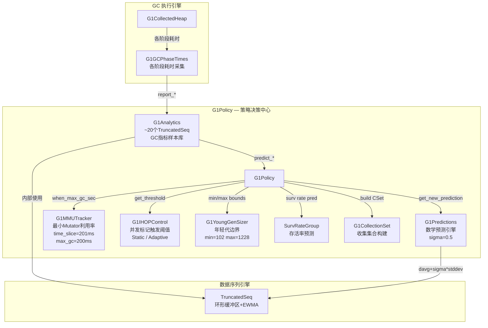
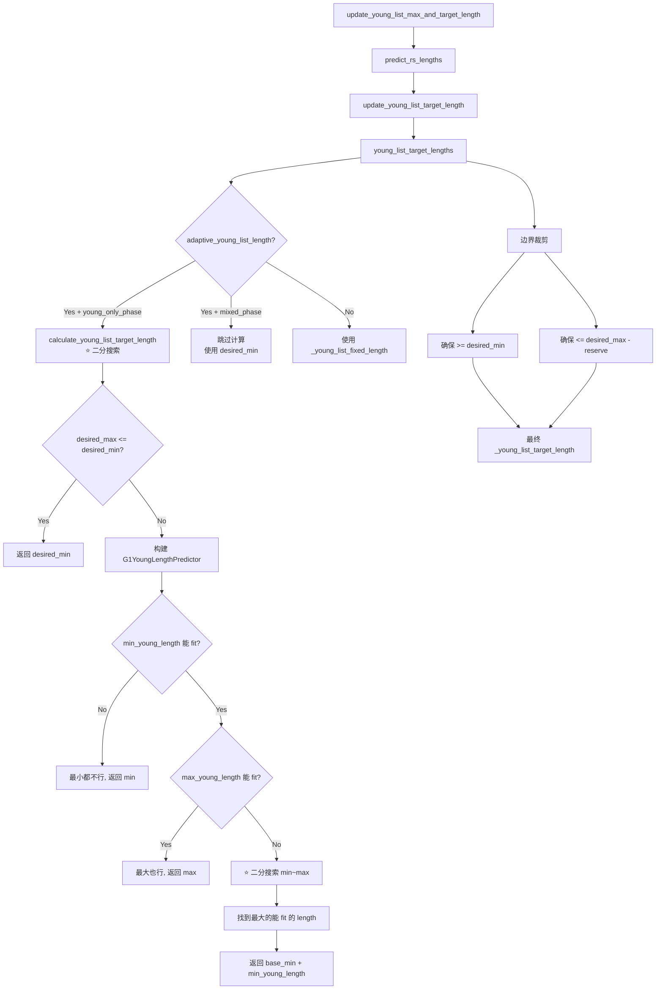
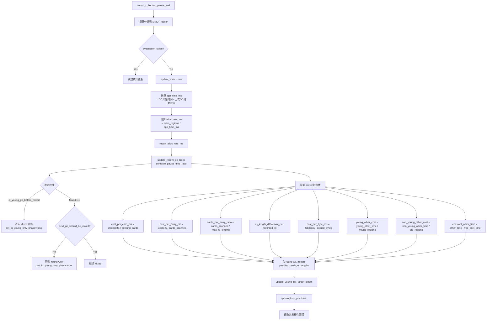

# G1Policy + 预测模型 深度分析

> 基于 OpenJDK 11 源码，标准环境：`-Xms8g -Xmx8g -XX:+UseG1GC`，G1 Region = 4MB

---

## 第 0 部分：核心原理 ⭐

### 0.1 本质是什么？

G1Policy 的本质是**基于指数移动平均（EMA）的自适应停顿预测控制器**：通过历史 GC 数据（每个 Region 的扫描时间、复制时间、RSet 大小等）建立预测模型，在每次 GC 前预测"回收 N 个 Region 需要多少时间"，然后贪心地选择最多 Region 使预测停顿时间 ≤ `MaxGCPauseMillis`（默认 200ms）。

### 0.2 为什么需要？

G1 的核心承诺是"可预测的停顿时间"（`-XX:MaxGCPauseMillis`）。但 GC 停顿时间取决于 CSet 大小（Region 数量）和每个 Region 的处理代价，这两个因素都是动态变化的。如果不预测，要么 CSet 太大（停顿超标），要么 CSet 太小（回收效率低，频繁 GC）。

### 0.3 怎么解决？

**EMA 预测 + 贪心 CSet 选择**：
- **数据采集**：每次 GC 后记录每个 Region 的 `scan_time`（扫描 RSet 时间）、`copy_time`（复制对象时间）、`pred_bytes_to_copy`（预测复制字节数）
- **EMA 更新**：`G1Predictions` 用 EMA（衰减因子 0.5）平滑历史数据，新数据权重高，旧数据权重低
- **停顿预测**：`predict_region_elapsed_time()` = `scan_time_pred + copy_time_pred + other_time`
- **贪心选择**：按 `垃圾量/预测时间` 降序排列 Old Region，依次加入 CSet 直到预测停顿时间达到目标

### 0.4 为什么这样设计？

- **为什么用 EMA 而不是简单平均？** 简单平均对历史数据等权，无法快速响应应用行为变化；EMA 让近期数据权重更高，能快速适应应用负载变化（如突发大量对象分配）
- **为什么 CSet 选择用贪心而不是动态规划？** 动态规划求最优解的时间复杂度 O(n×W)，n=Region 数量，W=时间预算，代价太高；贪心（按性价比排序）在实践中效果接近最优，且 O(n log n)
- **为什么 Young Region 必须全部进 CSet？** Young Region 不进 CSet 就无法回收，Eden 会持续增长直到 OOM；Old Region 可以选择性回收（Mixed GC），但 Young 必须全收
- **为什么 IHOP（InitiatingHeapOccupancyPercent）默认 45%？** 并发标记需要足够的时间在堆满之前完成；45% 是经验值，给并发标记留出 55% 的堆空间作为缓冲；`G1AdaptiveIHOP` 会根据历史数据动态调整

---

## 一、为什么需要预测模型？

### 1.1 问题场景

G1 的核心承诺是 **"软实时"** ——用户通过 `-XX:MaxGCPauseMillis=200`（默认）告诉 GC："每次停顿尽量不超过 200ms"。

但 GC 停顿时间取决于**很多因素**：
- 年轻代有多大？（Region 越多，扫描/复制越久）
- 跨 Region 引用有多少？（RSet 越大，更新/扫描越久）
- 对象存活率多高？（存活率越高，复制越久）
- 老年代碎片率多少？（Mixed GC 要收多少 Region？）

如果**没有预测模型**：
1. **年轻代大小固定** → 停顿时间忽高忽低，无法满足目标
2. **混合 GC 盲目选择** → 要么收太多超时，要么收太少没效果
3. **并发标记时机不对** → 太早浪费 CPU，太晚导致 Full GC

### 1.2 解决方案

G1 采用**基于历史数据的统计预测**模型：

```
┌──────────────────────────────────────────────────────────────────┐
│                    核心思想                                       │
│                                                                  │
│   过去 N 次 GC 的指标样本                                         │
│     → 指数加权移动平均 (EWMA) 得到趋势值                          │
│       → 加上置信区间补偿 (sigma × 标准差)                         │
│         → 得到保守预测值                                          │
│           → 用于决策：年轻代大小、CSet 选择、IHOP 阈值             │
└──────────────────────────────────────────────────────────────────┘
```

---

## 二、整体架构

### 2.1 组件关系图



### 2.2 核心数据流

```
┌─────────────────────────────────────────────────────────────────────────────┐
│                          预测数据流全景                                      │
│                                                                             │
│  GC结束 → record_collection_pause_end()                                     │
│     │                                                                       │
│     ├─ 计算 alloc_rate_ms → report_alloc_rate_ms()                          │
│     ├─ 计算 cost_per_card_ms → report_cost_per_card_ms()                    │
│     ├─ 计算 cost_per_entry_ms → report_cost_per_entry_ms()                  │
│     ├─ 计算 cards_per_entry_ratio → report_cards_per_entry_ratio()          │
│     ├─ 计算 cost_per_byte_ms → report_cost_per_byte_ms()                    │
│     ├─ 计算 constant_other_time → report_constant_other_time_ms()           │
│     ├─ 计算 young/non_young_other → report_*_other_cost_per_region_ms()     │
│     ├─ 计算 rs_length_diff → report_rs_length_diff()                        │
│     ├─ (仅Young GC) pending_cards → report_pending_cards()                  │
│     └─ (仅Young GC) rs_lengths → report_rs_lengths()                        │
│                                                                             │
│  需要预测时:                                                                │
│     predict_*() → get_new_prediction(seq)                                   │
│                 → seq.davg() + sigma * stddev_estimate(seq)                 │
│                                                                             │
│  决策使用:                                                                  │
│     ├─ 年轻代大小 = 二分搜索(predict_pause_time ≤ MaxGCPauseMillis)         │
│     ├─ 并发标记触发 = non_young_capacity > IHOP阈值                         │
│     └─ CSet老年代选择 = 在剩余时间预算内贪心选择                              │
└─────────────────────────────────────────────────────────────────────────────┘
```

---

## 三、底层数学引擎：TruncatedSeq + EWMA

### 3.1 为什么不用简单平均？

**场景**：一个应用从"低分配速率"阶段进入"高分配速率"阶段。

| 方法 | 问题 |
|------|------|
| 简单平均 | 历史低速率拖低平均值 → 年轻代太小 → 频繁 GC |
| 滑动窗口平均 | 对窗口内所有值权重相同 → 反应慢 |
| **EWMA（指数衰减加权）** | 最近的值权重大 → 快速跟踪趋势 ✅ |

### 3.2 TruncatedSeq 数据结构

**源码**：`src/hotspot/share/utilities/numberSeq.hpp:107-132`、`numberSeq.cpp:134-232`

```
TruncatedSeq 继承关系:
    CHeapObj<mtInternal>
      └─ AbsSeq (统计基类)
           └─ TruncatedSeq (环形缓冲区 + 滑动窗口)
```

**内存布局** (GDB 验证: `sizeof(AbsSeq) = 56`, `sizeof(TruncatedSeq)` 含额外字段):

```
AbsSeq (56 bytes):
┌──────────────────────────────────────────────────────┐
│ +0x00: vtable*           (8 bytes)  虚函数表            │
│ +0x08: _num     (int)    (4 bytes)  样本数量            │
│ +0x0C: padding            (4 bytes)                    │
│ +0x10: _sum     (double) (8 bytes)  简单统计: 和         │
│ +0x18: _sum_of_squares    (8 bytes)  简单统计: 平方和     │
│ +0x20: _davg    (double) (8 bytes)  EWMA 衰减平均       │
│ +0x28: _dvariance (double)(8 bytes) EWMA 衰减方差       │
│ +0x30: _alpha   (double) (8 bytes)  衰减因子(默认0.7)    │
└──────────────────────────────────────────────────────┘

TruncatedSeq (继承 AbsSeq, 额外字段):
┌──────────────────────────────────────────────────────┐
│ +0x38: _sequence  (double*) (8 bytes) 环形缓冲区指针    │
│ +0x40: _length    (int)     (4 bytes) 缓冲区容量(L=10)  │
│ +0x44: _next      (int)     (4 bytes) 下一个写入位置     │
└──────────────────────────────────────────────────────┘
```

### 3.3 EWMA 衰减公式

```cpp
// numberSeq.cpp:36-47
void AbsSeq::add(double val) {
  if (_num == 0) {
    _davg = val;           // 第一个值直接作为平均
    _dvariance = 0.0;
  } else {
    _davg = (1.0 - _alpha) * val + _alpha * _davg;
    double diff = val - _davg;
    _dvariance = (1.0 - _alpha) * diff * diff + _alpha * _dvariance;
  }
}
```

**关键参数**: `_alpha = 0.7`（默认）

| 值 | 权重 | 含义 |
|---|------|------|
| 最新值 (val) | `1 - α = 0.3` | 30% 权重 |
| 历史 (davg) | `α = 0.7` | 70% 权重 |

**衰减效果**：
- 2 步前的值：权重 ≈ `0.3 × 0.7 = 0.21`
- 3 步前的值：权重 ≈ `0.3 × 0.7² = 0.147`
- 5 步前的值：权重 ≈ `0.3 × 0.7⁴ = 0.072`
- 10 步前的值：权重 ≈ `0.3 × 0.7⁹ = 0.012`（几乎可以忽略）

> 这意味着：**最近 5~7 次 GC 的数据决定了预测值**。

### 3.4 环形缓冲区 add()

```cpp
// numberSeq.cpp:145-167
void TruncatedSeq::add(double val) {
  AbsSeq::add(val);       // 1. 更新 EWMA 统计

  double old_val = _sequence[_next];  // 2. 取出最老值
  _sum -= old_val;                    //    从简单统计中移除
  _sum_of_squares -= old_val * old_val;

  _sum += val;                        // 3. 加入新值
  _sum_of_squares += val * val;

  _sequence[_next] = val;             // 4. 写入环形缓冲区
  _next = (_next + 1) % _length;      //    指针推进

  if (_num < _length)                 // 5. 未满时才增加计数
    ++_num;
}
```

**环形缓冲区示意**（L=10）:

```
初始状态（空）:
[0.0] [0.0] [0.0] [0.0] [0.0] [0.0] [0.0] [0.0] [0.0] [0.0]
  ^next=0
  _num=0

加入 seed 后:
[seed] [0.0] [0.0] [0.0] [0.0] [0.0] [0.0] [0.0] [0.0] [0.0]
        ^next=1
        _num=1

加入第 11 个值后（覆盖 seed）:
[v11]  [v2]  [v3]  [v4]  [v5]  [v6]  [v7]  [v8]  [v9]  [v10]
        ^next=1
        _num=10 (不再增长)
```

### 3.5 TruncatedSeq 提供两套统计

| 类别 | 方法 | 公式 | G1 使用 |
|------|------|------|---------|
| **简单统计** | `avg()` | `_sum / _num` | 不常用 |
| 简单统计 | `sd()` | `sqrt(variance())` | 不常用 |
| **衰减统计** | `davg()` | EWMA 衰减平均 | ⭐ 核心使用 |
| 衰减统计 | `dsd()` | `sqrt(_dvariance)` | ⭐ 核心使用 |
| **线性回归** | `predict_next()` | 最小二乘法 | G1 不使用 |

> G1 **只使用衰减统计** `davg()` 和 `dsd()`，通过 `G1Predictions::get_new_prediction()` 封装。

### 3.6 G1 中 TruncatedSeq 的两种参数配置

| 用途 | 容量 | alpha | 说明 |
|------|------|-------|------|
| GC 指标（G1Analytics） | 10 | 0.7 | 标准配置：最近 ~7 次 GC 为主 |
| IHOP 数据（G1AdaptiveIHOPControl） | 10 | **0.95** | 高衰减：历史权重大，变化缓慢 |

IHOP 为什么用 α=0.95？因为并发标记频率远低于 Young GC，样本少且波动大，需要更保守的平滑。

---

## 四、G1Predictions：核心预测公式

**源码**：`src/hotspot/share/gc/g1/g1Predictions.hpp`（仅 63 行，纯头文件类）

### 4.1 核心公式

```cpp
double get_new_prediction(TruncatedSeq const* seq) const {
  return seq->davg() + _sigma * stddev_estimate(seq);
}
```

**含义**：`预测值 = 衰减平均值 + 置信因子 × 标准差估计`

**参数**：
- `_sigma = G1ConfidencePercent / 100.0 = 50 / 100 = 0.5`
- `_sigma` 越大 → 预测值越保守（越高）→ 越不容易超时

### 4.2 小样本补偿机制

```cpp
double stddev_estimate(TruncatedSeq const* seq) const {
  double estimate = seq->dsd();          // 衰减标准差
  int const samples = seq->num();
  if (samples < 5) {
    estimate = MAX2(seq->davg() * (5 - samples) / 2.0, estimate);
  }
  return estimate;
}
```

**问题**：样本不足时，标准差不可靠（可能为 0 或非常小），导致预测值 ≈ davg，太乐观了。

**解决**：当样本 < 5 时，用 `davg × (5-samples)/2.0` 作为替代标准差。

| 样本数 | 替代标准差 | 预测值 (sigma=0.5) |
|-------|-----------|------|
| 1 | `davg × 2.0` | `davg + 0.5 × 2.0 × davg = 2.0 × davg` |
| 2 | `davg × 1.5` | `davg + 0.5 × 1.5 × davg = 1.75 × davg` |
| 3 | `davg × 1.0` | `davg + 0.5 × 1.0 × davg = 1.5 × davg` |
| 4 | `davg × 0.5` | `davg + 0.5 × 0.5 × davg = 1.25 × davg` |
| ≥5 | 使用真实 dsd | `davg + 0.5 × dsd` |

> **GDB 验证**：`cost_per_card_ms_seq` 初始只有 1 个 seed (0.0015)，prediction = 0.0015 + 0.5 × 0.003 = **0.003** ✅

---

## 五、G1Analytics：GC 指标采集与预测

**源码**：`src/hotspot/share/gc/g1/g1Analytics.hpp`（162 行）、`g1Analytics.cpp`（335 行）

### 5.1 ~20 个 TruncatedSeq 序列总览

```
G1Analytics 内部序列全景 (标准环境 ParallelGCThreads=13, index=7):
┌──────────────────────────────────────────────────────────────────────────────┐
│                          GC 耗时分解序列                                     │
├──────────────────────────────────────────────────────────────────────────────┤
│ _cost_per_card_ms_seq           seed=0.0015   UpdateRS 每张脏卡耗时           │
│ _cost_scan_hcc_seq              seed=0.0      HotCardCache 扫描耗时          │
│ _cost_per_entry_ms_seq          seed=0.005    ScanRS 每张卡耗时 (Young)       │
│ _mixed_cost_per_entry_ms_seq    无 seed       ScanRS 每张卡耗时 (Mixed)       │
│ _cost_per_byte_ms_seq           seed=0.000009 对象复制每字节耗时              │
│ _cost_per_byte_ms_during_cm_seq 无 seed       并发标记期间对象复制每字节耗时   │
│ _constant_other_time_ms_seq     seed=5.0      固定开销（根扫描等）            │
│ _young_other_cost_per_region_ms_seq  seed=0.1  年轻代每Region其他开销         │
│ _non_young_other_cost_per_region_ms_seq seed=0.3 老年代每Region其他开销       │
├──────────────────────────────────────────────────────────────────────────────┤
│                          RSet 相关序列                                       │
├──────────────────────────────────────────────────────────────────────────────┤
│ _young_cards_per_entry_ratio_seq seed=1.0     Young: 每个RSet条目对应几张卡   │
│ _mixed_cards_per_entry_ratio_seq 无 seed      Mixed: 每个RSet条目对应几张卡   │
│ _rs_length_diff_seq              seed=0.0     RS 长度预测误差                 │
│ _pending_cards_seq               无 seed      GC开始时积压脏卡数              │
│ _rs_lengths_seq                  无 seed      GC时最大RS长度                  │
├──────────────────────────────────────────────────────────────────────────────┤
│                          分配/GC 频率序列                                    │
├──────────────────────────────────────────────────────────────────────────────┤
│ _alloc_rate_ms_seq               无 seed      应用分配速率 (Regions/ms)       │
│ _recent_gc_times_ms              无 seed      最近 GC 停顿时间               │
│ _recent_prev_end_times_for_all_gcs_sec 有初始值 GC 结束时间戳               │
│ _concurrent_mark_remark_times_ms seed=0.05    CM Remark 耗时                 │
│ _concurrent_mark_cleanup_times_ms seed=0.20   CM Cleanup 耗时                │
└──────────────────────────────────────────────────────────────────────────────┘
```

### 5.2 种子值选择机制

种子值按 `ParallelGCThreads` 索引选择，索引 = `MIN2(ParallelGCThreads - 1, 7)`：

```cpp
// g1Analytics.cpp:101
int index = MIN2(ParallelGCThreads - 1, 7u);
```

**GDB 验证**：`ParallelGCThreads = 13` → `index = MIN2(12, 7) = 7`

| 种子数组 | index=7 的值 | GDB 验证 |
|---------|-------------|----------|
| `cost_per_card_ms_defaults` | 0.0015 | ✅ 0.001500 |
| `cost_per_entry_ms_defaults` | 0.005 | ✅ 0.005000 |
| `cost_per_byte_ms_defaults` | 0.000009 | ✅ 0.000009 |
| `constant_other_time_ms_defaults` | 5.0 | ✅ 5.000000 |
| `young_other_cost_per_region_ms_defaults` | 0.1 | ✅ 0.100000 |
| `non_young_other_cost_per_region_ms_defaults` | 0.30 | ✅ 0.300000 |
| `rs_length_diff_defaults` | 0.0 | ✅ 0.000000 |
| `young_cards_per_entry_ratio_defaults` | 1.0 | ✅ 1.000000 |

> **设计意图**：GC 线程越多 → 单线程分担的工作越少 → 种子值越小。

### 5.3 GC 停顿时间预测公式

```
GC_pause_time = RS_update_time + RS_scan_time + Object_copy_time
              + constant_other + young_other + non_young_other
```

分解：

```
RS_update_time = pending_cards × cost_per_card_ms + scan_hcc_time
                 ^^^^^^^^^^^^^^^^^^^^^^^^^^^^^^^^   ^^^^^^^^^^^^^
                 predict_cost_per_card_ms()         predict_scan_hcc_ms()

RS_scan_time   = card_num × cost_per_entry_ms
                 ^^^^^^^^
                 = rs_length × cards_per_entry_ratio

Object_copy    = bytes_to_copy × cost_per_byte_ms

constant_other = predict_constant_other_time_ms()

young_other    = young_region_count × predict_young_other_cost_per_region_ms()

non_young_other = old_region_count × predict_non_young_other_cost_per_region_ms()
```

### 5.4 Mixed GC 的降级策略

Mixed GC 有独立的序列（`_mixed_*`），但样本不足时会降级到 Young 序列：

```cpp
// g1Analytics.cpp:242-246
double G1Analytics::predict_mixed_cards_per_entry_ratio() const {
  if (_mixed_cards_per_entry_ratio_seq->num() < 2) {
    return predict_young_cards_per_entry_ratio();  // 降级
  } else {
    return get_new_prediction(_mixed_cards_per_entry_ratio_seq);
  }
}

// g1Analytics.cpp:265-271
double G1Analytics::predict_mixed_rs_scan_time_ms(size_t card_num) const {
  if (_mixed_cost_per_entry_ms_seq->num() < 3) {
    return card_num * get_new_prediction(_cost_per_entry_ms_seq);  // 降级
  } else {
    return card_num * get_new_prediction(_mixed_cost_per_entry_ms_seq);
  }
}
```

---

## 六、G1Policy：策略决策中心

**源码**：`src/hotspot/share/gc/g1/g1Policy.hpp`（430 行）、`g1Policy.cpp`（1225 行）

### 6.1 核心字段

```
G1Policy (sizeof = GDB验证):
┌────────────────────────────────────────────────────────────────────────┐
│ _predictor          G1Predictions          sigma=0.5                   │
│ _analytics          G1Analytics*           ~20个TruncatedSeq           │
│ _remset_tracker     G1RemSetTrackingPolicy RSet追踪策略                │
│ _mmu_tracker        G1MMUTracker*          MMU跟踪                    │
│ _old_gen_alloc_tracker G1OldGenAllocationTracker 老年代分配跟踪       │
│ _ihop_control       G1IHOPControl*         IHOP阈值控制               │
│ _policy_counters    GCPolicyCounters*      性能计数器                  │
│ _young_list_target_length  uint            年轻代目标长度(初始化后=102) │
│ _young_list_fixed_length   uint            固定模式长度(0=未启用)      │
│ _young_list_max_length     uint            最大长度(含GCLocker扩展=108)│
│ _short_lived_surv_rate_group SurvRateGroup* Eden存活率预测            │
│ _survivor_surv_rate_group    SurvRateGroup* Survivor存活率预测        │
│ _reserve_factor     double                 保留比例=0.1(10%)          │
│ _reserve_regions    uint                   保留Region数(=205)         │
│ _young_gen_sizer    G1YoungGenSizer        年轻代大小边界控制          │
│ _free_regions_at_end_of_collection uint    上次GC后空闲Region数(=2048)│
│ _max_rs_lengths     size_t                 GC期间最大RS长度            │
│ _rs_lengths_prediction size_t              RS长度预测值                │
│ _pending_cards      size_t                 GC开始时积压脏卡数          │
│ _initial_mark_to_mixed G1InitialMarkToMixedTimeTracker IM→Mixed时间  │
│ _collection_set     G1CollectionSet*       收集集合                   │
│ _g1h                G1CollectedHeap*       堆引用                     │
│ _phase_times        G1GCPhaseTimes*        各阶段时间采集              │
│ _tenuring_threshold uint                   晋升阈值(=15)              │
│ _max_survivor_regions uint                 最大Survivor Region数       │
└────────────────────────────────────────────────────────────────────────┘
```

### 6.2 构造函数

```cpp
// g1Policy.cpp:49-71
G1Policy::G1Policy(STWGCTimer* gc_timer) :
  _predictor(G1ConfidencePercent / 100.0),       // sigma = 50/100 = 0.5
  _analytics(new G1Analytics(&_predictor)),        // 传入 predictor 引用
  _mmu_tracker(new G1MMUTrackerQueue(
    GCPauseIntervalMillis / 1000.0,               // time_slice = 201/1000 = 0.201s
    MaxGCPauseMillis / 1000.0)),                   // max_gc_time = 200/1000 = 0.2s
  _ihop_control(create_ihop_control(...)),          // Adaptive (默认)
  _reserve_factor((double) G1ReservePercent / 100.0), // 0.10
  _tenuring_threshold(MaxTenuringThreshold),       // 15
  ...
```

### 6.3 init() 初始化流程

```cpp
// g1Policy.cpp:79-144
void G1Policy::init(G1CollectedHeap* g1h, G1CollectionSet* collection_set) {
  _g1h = g1h;
  _collection_set = collection_set;

  // 1. 固定模式检查（默认跳过，因为 adaptive=true）
  if (!adaptive_young_list_length()) {
    _young_list_fixed_length = _young_gen_sizer.min_desired_young_length();
  }

  // 2. 调整年轻代最大长度
  _young_gen_sizer.adjust_max_new_size(_g1h->max_regions());

  // 3. 初始化空闲Region统计
  _free_regions_at_end_of_collection = _g1h->num_free_regions();  // = 2048

  // 4. 计算年轻代目标长度（⭐ 核心）
  update_young_list_max_and_target_length();
  // 结果: _young_list_target_length = 102, _young_list_max_length = 108

  // 5. 开始增量构建收集集合
  _collection_set->start_incremental_building();
}
```

---

## 七、年轻代大小计算：二分搜索算法

### 7.1 G1YoungGenSizer：确定边界

**源码**：`src/hotspot/share/gc/g1/g1YoungGenSizer.hpp`、`g1YoungGenSizer.cpp`

五种模式：

| 模式 | 触发条件 | adaptive | min | max |
|------|---------|----------|-----|-----|
| `SizerDefaults` (0) | **默认** | true | 5% × regions | 60% × regions |
| `SizerNewSizeOnly` (1) | `-XX:NewSize` | depends | 用户值 | 60% × regions |
| `SizerMaxNewSizeOnly` (2) | `-XX:MaxNewSize` | depends | 5% × regions | 用户值 |
| `SizerMaxAndNewSize` (3) | 两者都设 | min≠max | 用户值 | 用户值 |
| `SizerNewRatio` (4) | `-XX:NewRatio` | **false** | regions/(ratio+1) | 同min |

**GDB 验证**（标准环境 8GB, 2048 regions）：

```
_sizer_kind = 0               (SizerDefaults) ✅
_adaptive_size = 1             (true) ✅
_min_desired_young_length = 102  (2048 × 5% = 102.4 → 102) ✅
_max_desired_young_length = 1228 (2048 × 60% = 1228.8 → 1228) ✅
```

### 7.2 计算流程总览



### 7.3 二分搜索核心代码

```cpp
// g1Policy.cpp:326-426
uint G1Policy::calculate_young_list_target_length(size_t rs_lengths,
                                                  uint base_min_length,
                                                  uint desired_min_length,
                                                  uint desired_max_length) const {
  // 1. 准备预测参数
  const double target_pause_time_ms = _mmu_tracker->max_gc_time() * 1000.0;  // 200ms
  const double survivor_regions_evac_time = predict_survivor_regions_evac_time();
  const size_t pending_cards = _analytics->predict_pending_cards();
  const size_t adj_rs_lengths = rs_lengths + _analytics->predict_rs_length_diff();
  const size_t scanned_cards = _analytics->predict_card_num(adj_rs_lengths, true);
  const double base_time_ms = predict_base_elapsed_time_ms(pending_cards, scanned_cards)
                            + survivor_regions_evac_time;
  const uint base_free_regions = available_free_regions > _reserve_regions
                               ? available_free_regions - _reserve_regions : 0;

  // 2. 构建预测器
  G1YoungLengthPredictor p(mark_or_rebuild_in_progress,
                           base_time_ms, base_free_regions,
                           target_pause_time_ms, this);

  // 3. 三路分支
  if (p.will_fit(min_young_length)) {
    if (p.will_fit(max_young_length)) {
      min_young_length = max_young_length;  // 最大都能 fit
    } else {
      // ⭐ 二分搜索
      uint diff = (max_young_length - min_young_length) / 2;
      while (diff > 0) {
        uint young_length = min_young_length + diff;
        if (p.will_fit(young_length)) {
          min_young_length = young_length;   // 能 fit, 扩大下界
        } else {
          max_young_length = young_length;   // 不能 fit, 缩小上界
        }
        diff = (max_young_length - min_young_length) / 2;
      }
    }
  }
  // 即使最小都不 fit，也返回最小值（尽力而为）

  return base_min_length + min_young_length;
}
```

### 7.4 G1YoungLengthPredictor::will_fit() 三重检查

```cpp
// g1Policy.cpp:169-206
bool will_fit(uint young_length) const {
  // 检查1: 空间够不够
  if (young_length >= _base_free_regions) return false;

  // 检查2: 时间够不够
  double accum_surv_rate = _policy->accum_yg_surv_rate_pred(young_length - 1);
  size_t bytes_to_copy = (size_t)(accum_surv_rate * HeapRegion::GrainBytes);
  double copy_time_ms = predict_object_copy_time_ms(bytes_to_copy, _during_cm);
  double young_other_time_ms = predict_young_other_time_ms(young_length);
  if (_base_time_ms + copy_time_ms + young_other_time_ms > _target_pause_time_ms)
    return false;

  // 检查3: 复制空间够不够（含安全余量）
  size_t free_bytes = (_base_free_regions - young_length) * HeapRegion::GrainBytes;
  double safety_factor = (100.0 / G1ConfidencePercent) * (100 + TargetPLABWastePct) / 100.0;
  // = (100/50) * (100+10)/100 = 2.0 * 1.1 = 2.2
  size_t expected_bytes_to_copy = (size_t)(safety_factor * bytes_to_copy);
  if (expected_bytes_to_copy > free_bytes) return false;

  return true;
}
```

**安全因子计算**（标准环境）：
- `G1ConfidencePercent = 50`
- `TargetPLABWastePct = 10`
- `safety_factor = (100/50) × (100+10)/100 = 2.0 × 1.1 = 2.2`
- 含义：**预留 2.2 倍的复制空间**

### 7.5 初始化时的计算过程

**GDB 验证**：

```
init() 时:
  _free_regions_at_end_of_collection = 2048
  _reserve_regions = 205   (2048 × 10% = 204.8 → ceil = 205)
  base_free_regions = 2048 - 205 = 1843

  _young_gen_sizer.min = 102 → desired_min = 102
  _young_gen_sizer.max = 1228 → desired_max = min(1228, 1843) = 1228

  → 二分搜索 [102, 1228] 范围
  → 初始时无 GC 历史，种子值决定一切
  → 结果: _young_list_target_length = 102, _young_list_max_length = 108 ✅
```

> **为什么初始 target=102（即 min）？** 因为初始种子值中 `constant_other_time = 5.0ms`、`young_other_cost = 0.1ms/region`，合起来 `5.0 + 0.1×102 = 15.2ms` + 其他预测时间，在 200ms 目标下，102 个 Region 是能 fit 的最大值——但由于种子值的保守性（小样本补偿 2x），实际预测偏高，导致二分搜索结果偏保守。

---

## 八、record_collection_pause_end()：GC 后数据采集

**这是 G1Policy 中最重要的方法**，每次 GC 停顿结束后调用，是所有预测数据的入口。

**源码**：`g1Policy.cpp:604-785`

### 8.1 完整流程



### 8.2 关键数据采集公式

| 指标 | 公式 | 说明 |
|------|------|------|
| `alloc_rate_ms` | `eden_region_count / app_time_ms` | 应用分配速率 |
| `cost_per_card_ms` | `UpdateRS_time / pending_cards` | 每张脏卡更新耗时 |
| `cost_per_entry_ms` | `ScanRS_time / cards_scanned` | 每张卡扫描耗时 |
| `cards_per_entry_ratio` | `cards_scanned / max_rs_lengths` | RSet条目到卡的放大比 |
| `rs_length_diff` | `max_rs_lengths - recorded_rs_lengths` | RS长度预测误差 |
| `cost_per_byte_ms` | `ObjCopy_time / copied_bytes` | 对象复制每字节耗时 |
| `constant_other` | `(pause - par_time) - free_cset_time` | 固定开销 |

### 8.3 为什么 Mixed GC 不更新 pending_cards 和 rs_lengths？

```cpp
// g1Policy.cpp:741-744
if (this_pause_was_young_only) {
  _analytics->report_pending_cards((double) _pending_cards);
  _analytics->report_rs_lengths((double) _max_rs_lengths);
}
```

**原因**：Mixed GC 会回收老年代 Region，导致 RSet 数据大幅变化（被回收的 Region 的 RSet 直接消失）。如果把这些异常值混入预测，会严重干扰 **年轻代大小计算**（年轻代大小是基于 RS lengths 预测的）。

### 8.4 状态转换逻辑

```
┌─────────────────────────────────────────────────────────────────────┐
│                    G1 GC 阶段状态机                                  │
│                                                                     │
│                     ┌──────────────┐                                │
│                     │ Young Only   │ ← 初始状态                     │
│                     │ Phase        │                                │
│                     └──────┬───────┘                                │
│                            │ need_to_start_conc_mark()              │
│                            │ (occupancy > IHOP threshold)           │
│                            ▼                                        │
│                     ┌──────────────┐                                │
│                     │ Initial Mark │ (附带在Young GC上)             │
│                     │ GC           │                                │
│                     └──────┬───────┘                                │
│                            │ set_mark_or_rebuild_in_progress(true)  │
│                            ▼                                        │
│                     ┌──────────────┐                                │
│                     │ Concurrent   │                                │
│                     │ Marking      │ (后台并发执行)                  │
│                     └──────┬───────┘                                │
│                            │ marking 完成                           │
│                            ▼                                        │
│                     ┌──────────────────┐                            │
│                     │ Young GC Before  │ (标记完成后的第一次YGC)     │
│                     │ Mixed            │                            │
│                     └──────┬───────────┘                            │
│                            │ set_in_young_only_phase(false)         │
│                            ▼                                        │
│                     ┌──────────────┐                                │
│                     │ Mixed GC     │ ← 回收老年代 Region            │
│              ┌──────│ Phase        │──────┐                         │
│              │      └──────────────┘      │                         │
│              │ next_gc_should_be_mixed     │ !next_gc_should_be_mixed│
│              │ = true                      │ = false                 │
│              │                             ▼                         │
│              │                      ┌──────────────┐                │
│              └──────────────────────│ Young Only   │                │
│                                     │ Phase        │                │
│                                     └──────────────┘                │
└─────────────────────────────────────────────────────────────────────┘
```

### 8.5 并发精化阈值调整

每次 GC 结束后，会根据实际 UpdateRS 耗时调整并发精化线程的工作阈值：

```cpp
// g1Policy.cpp:768-782
double update_rs_time_goal_ms = _mmu_tracker->max_gc_time() * 1000.0
                               * G1RSetUpdatingPauseTimePercent / 100.0;
// = 200.0 * 10 / 100 = 20.0ms (UpdateRS 的时间预算)

if (update_rs_time_goal_ms < scan_hcc_time_ms) {
  update_rs_time_goal_ms = 0;
} else {
  update_rs_time_goal_ms -= scan_hcc_time_ms;  // 扣除 HCC 扫描时间
}

_g1h->concurrent_refine()->adjust(
  average_time_ms(G1GCPhaseTimes::UpdateRS),  // 实际 UpdateRS 耗时
  sum_thread_work_items(UpdateRS),             // 处理的 buffer 数
  update_rs_time_goal_ms);                     // 时间目标
```

> 这里直接连接到了 [#6 并发精化](./6-Concurrent-Refinement.md) 中分析的 `ConcurrentG1Refine::adjust()` 方法。

---

## 九、IHOP：并发标记触发机制

### 9.1 为什么需要 IHOP？

并发标记的目的是识别老年代垃圾，为 Mixed GC 做准备。但标记本身需要时间，如果等老年代满了才开始，标记来不及完成就会触发 Full GC。

IHOP (Initiating Heap Occupancy Percent) 就是**"在老年代占用到多少时就启动并发标记"**的阈值。

### 9.2 触发条件

```cpp
// g1Policy.cpp:579-599
bool G1Policy::need_to_start_conc_mark(const char* source, size_t alloc_word_size) {
  if (about_to_start_mixed_phase()) return false;  // 已经在 Mixed 流程中

  size_t threshold = _ihop_control->get_conc_mark_start_threshold();
  size_t cur_used = _g1h->non_young_capacity_bytes();
  size_t alloc_bytes = alloc_word_size * HeapWordSize;

  if (cur_used + alloc_bytes > threshold) {
    return collector_state()->in_young_only_phase()
        && !collector_state()->in_young_gc_before_mixed();
  }
  return false;
}
```

**触发条件**：`老年代已用 + 本次分配 > IHOP 阈值` 且处于 Young Only 阶段。

> **JVM 参数**：`-Xlog:gc+ergo+ihop=debug` 可以看到触发日志：
> ```
> Request concurrent cycle initiation (occupancy higher than threshold)
> occupancy: 3865706496B allocation request: 4194304B threshold: 3865470566B (45.00)
> source: concurrent humongous allocation
> ```

### 9.3 Static vs Adaptive IHOP

```cpp
// g1Policy.cpp:787-798
G1IHOPControl* G1Policy::create_ihop_control(...) {
  if (G1UseAdaptiveIHOP) {  // 默认 true
    return new G1AdaptiveIHOPControl(
      InitiatingHeapOccupancyPercent,  // 45%
      old_gen_alloc_tracker,
      predictor,
      G1ReservePercent,      // 10
      G1HeapWastePercent);   // 5
  } else {
    return new G1StaticIHOPControl(
      InitiatingHeapOccupancyPercent, old_gen_alloc_tracker);
  }
}
```

#### Static 模式

```
threshold = initial_ihop_percent × target_occupancy / 100
          = 45% × 8GB = 3.6GB
```

固定不变。

#### Adaptive 模式（默认）

**GDB 验证**：

```
_initial_ihop_percent = 45.000000
_heap_reserve_percent = 10
_heap_waste_percent = 5
_marking_times_s: num=0, alpha=0.95, length=10
_allocation_rate_s: num=0, alpha=0.95, length=10
G1AdaptiveIHOPNumInitialSamples = 3
```

**数据不足时**（样本 < `G1AdaptiveIHOPNumInitialSamples=3`）：
```
threshold = initial_ihop_percent × target_occupancy / 100  (与 Static 相同)
```

**数据充足时**：
```cpp
// g1IHOPControl.cpp:123-144
double pred_marking_time = _predictor->get_new_prediction(&_marking_times_s);
double pred_promotion_rate = _predictor->get_new_prediction(&_allocation_rate_s);
size_t pred_promotion_size = pred_marking_time * pred_promotion_rate;

size_t needed = pred_promotion_size + _last_unrestrained_young_size;

size_t internal_threshold = actual_target_threshold();
size_t threshold = internal_threshold > needed ? internal_threshold - needed : 0;
```

**含义**：
```
在标记期间，老年代会继续增长（应用还在分配）。
需要预留:
  = 预测标记时间 × 预测晋升速率 + 年轻代预留空间

actual_target_threshold 考虑了:
  - heap_reserve (10%): 防止晋升失败的预留
  - heap_waste (5%): 永远无法回收的碎片

threshold = actual_target - 预留空间
         → 在老年代占用达到这个值时就开始标记
```

```
┌──────────────────────────────────────────────────────────────┐
│                   Adaptive IHOP 示意                          │
│                                                              │
│  堆总容量 (8GB)                                               │
│  ├───────────┬────────────┬──────────┬───────────┤           │
│  │ 已用老年代 │ 标记期间增长 │ 年轻代    │ reserve   │           │
│  │           │ (预测)     │ (预测)   │ +waste    │           │
│  └───────────┴────────────┴──────────┴───────────┘           │
│  ^                                                  ^        │
│  threshold (在这里开始标记)              actual_target         │
└──────────────────────────────────────────────────────────────┘
```

### 9.4 IHOP 数据更新

```cpp
// g1Policy.cpp:800-836
void G1Policy::update_ihop_prediction(double mutator_time_s,
                                      size_t young_gen_size,
                                      bool this_gc_was_young_only) {
  // 1. Mixed GC 结束时：更新标记时间
  if (!this_gc_was_young_only && _initial_mark_to_mixed.has_result()) {
    double marking_time = _initial_mark_to_mixed.last_marking_time();
    _ihop_control->update_marking_length(marking_time);
  }

  // 2. Young GC 结束时：更新分配速率
  if (this_gc_was_young_only && mutator_time_s > 1e-6) {
    _ihop_control->update_allocation_info(mutator_time_s, young_gen_size);
    // → _allocation_rate_s.add(old_gen_growth / mutator_time)
    // → _last_unrestrained_young_size = young_gen_size
  }
}
```

> **JVM 参数**：`-Xlog:gc+ihop=debug` 查看 IHOP 详细信息：
> ```
> Adaptive IHOP information (value update), threshold: 5153960755B (67.95),
> internal target occupancy: 7253221990B, occupancy: 1048576000B,
> additional buffer size: 419430400B,
> predicted old gen allocation rate: 3145728.00B/s,
> predicted marking phase length: 1520.00ms, prediction active: true
> ```

---

## 十、G1MMUTracker：最小 Mutator 利用率

**GDB 验证**：

```
_time_slice = 0.201 (seconds)  = GCPauseIntervalMillis / 1000 = 201/1000
_max_gc_time = 0.200 (seconds) = MaxGCPauseMillis / 1000 = 200/1000
```

`G1MMUTracker` 的核心作用：

1. **`max_gc_time()`**：返回单次 GC 最大允许时间（200ms），用作二分搜索的目标
2. **`when_max_gc_sec(now)`**：返回"距离下次允许 GC 还有多长时间"，用于计算年轻代最小长度

```cpp
// g1Policy.cpp:221-231
uint G1Policy::calculate_young_list_desired_min_length(uint base_min_length) const {
  if (adaptive_young_list_length()) {
    if (_analytics->num_alloc_rate_ms() > 3) {
      double when_ms = _mmu_tracker->when_max_gc_sec(now_sec) * 1000.0;
      double alloc_rate_ms = _analytics->predict_alloc_rate_ms();
      desired_min_length = (uint) ceil(alloc_rate_ms * when_ms);
      // 含义：在允许的下次GC之前，应用能分配多少个Region → 至少需要这么大的年轻代
    }
  }
  return MAX2(_young_gen_sizer.min_desired_young_length(), desired_min_length);
}
```

---

## 十一、G1CollectionSet：收集集合构建

### 11.1 增量构建 + 最终确定

收集集合（CSet）分两阶段构建：

| 阶段 | 时机 | 内容 |
|------|------|------|
| **增量构建** | Eden Region 分配时 | 每分配一个 Eden Region，立即加入 CSet，累加预测时间 |
| **最终确定** | GC STW 开始后 | `finalize_young_part()` 合并并发修改，`finalize_old_part()` 选择老年代 Region |

### 11.2 finalize_young_part()

```
1. 合并并发精化线程的 RS length diff
2. 重新计算年轻代预测停顿时间
3. 计算 time_remaining_ms = target_pause - base_time - young_predicted_time
4. 传递 time_remaining_ms 给 finalize_old_part()
```

### 11.3 finalize_old_part()（仅 Mixed GC）

从 `CollectionSetChooser` 中按**垃圾最多优先**（Garbage First）选择老年代 Region：

```
终止条件（任意一个满足即停止）:
  1. 已选数量 > max_old_cset_length
     max = heap_regions × G1OldCSetRegionThresholdPercent / 100
  2. 可回收比例 < G1HeapWastePercent (5%)
  3. 预测耗时超出 time_remaining
  4. 没有更多候选者

最终对选中的 Region 按索引排序（提高内存局部性）
```

**老年代 CSet 边界**:
- `min_old = candidates / G1MixedGCCountTarget`（候选数/8）
- `max_old = heap_regions × G1OldCSetRegionThresholdPercent / 100`

### 11.4 并发更新机制

并发精化线程在处理脏卡时，会实时更新 CSet 的 RS length 预测：

```cpp
// g1CollectionSet.cpp:234-260
void G1CollectionSet::update_young_region_prediction(HeapRegion* hr,
                                                     size_t new_rs_length) {
  // 在并发精化线程中被调用
  // 更新 _inc_recorded_rs_lengths_diffs 和 _inc_predicted_elapsed_time_ms_diffs
}
```

这些 diff 值在 `finalize_young_part()` 中被合并。

---

## 十二、next_gc_should_be_mixed()：Mixed GC 持续条件

```cpp
bool next_gc_should_be_mixed(...) const {
  if (!cset_chooser()->is_empty()) {
    size_t reclaimable = cset_chooser()->remaining_reclaimable_bytes();
    if (reclaimable_bytes_percent(reclaimable) > G1HeapWastePercent) {
      return true;  // 还有 > 5% 可回收 → 继续 Mixed
    }
  }
  return false;
}
```

**两个条件同时满足才继续 Mixed GC**：
1. `CollectionSetChooser` 还有候选 Region
2. 剩余可回收空间占堆的比例 > `G1HeapWastePercent` (5%)

---

## 十三、GDB 验证汇总

### 13.1 验证环境

```
JVM: /data/workspace/openjdk-cut-new/build/linux-x86_64-normal-server-slowdebug/jdk/bin/java
参数: -Xms8g -Xmx8g -XX:+UseG1GC -Xint
GDB脚本: new-jvm-md/tmp-file/G1GC/gdb_g1policy.gdb
断点: G1Policy::record_new_heap_size, G1Policy::update_young_list_max_and_target_length
```

### 13.2 核心验证数据

#### G1Policy 基本字段

| 字段 | 期望值 | GDB 实测 | 状态 |
|------|--------|---------|------|
| `_predictor._sigma` | 0.5 | 0.500000 | ✅ |
| `_reserve_factor` | 0.1 | 0.100000 | ✅ |
| `_reserve_regions` (init后) | 205 | 205 | ✅ |
| `_young_list_target_length` (init后) | 102 | 102 | ✅ |
| `_young_list_fixed_length` | 0 (adaptive) | 0 | ✅ |
| `_young_list_max_length` (init后) | 108 | 108 | ✅ |
| `_tenuring_threshold` | 15 | 15 | ✅ |
| `_max_survivor_regions` | 0 (初始) | 0 | ✅ |
| `_free_regions_at_end_of_collection` | 2048 | 2048 | ✅ |

#### G1YoungGenSizer

| 字段 | 期望值 | GDB 实测 | 状态 |
|------|--------|---------|------|
| `_sizer_kind` | 0 (SizerDefaults) | 0 | ✅ |
| `_adaptive_size` | true | 1 | ✅ |
| `_min_desired_young_length` | 102 | 102 (heap_size_changed后) | ✅ |
| `_max_desired_young_length` | 1228 | 1228 (heap_size_changed后) | ✅ |

#### G1Analytics 种子值 (ParallelGCThreads=13, index=7)

| 序列 | 种子值 | GDB 实测 | 状态 |
|------|--------|---------|------|
| `cost_per_card_ms` | 0.0015 | 0.001500 | ✅ |
| `cost_per_entry_ms` | 0.005 | 0.005000 | ✅ |
| `cost_per_byte_ms` | 0.000009 | 0.000009 | ✅ |
| `constant_other_time_ms` | 5.0 | 5.000000 | ✅ |
| `young_other_cost_per_region_ms` | 0.1 | 0.100000 | ✅ |
| `non_young_other_cost_per_region_ms` | 0.30 | 0.300000 | ✅ |
| `rs_length_diff` | 0.0 | 0.000000 | ✅ |
| `young_cards_per_entry_ratio` | 1.0 | 1.000000 | ✅ |
| `concurrent_mark_remark` | 0.05 | 0.050000 | ✅ |
| `concurrent_mark_cleanup` | 0.20 | 0.200000 | ✅ |

#### G1MMUTracker

| 字段 | 期望值 | GDB 实测 | 状态 |
|------|--------|---------|------|
| `_time_slice` | 0.201s | 0.201000 | ✅ |
| `_max_gc_time` | 0.200s | 0.200000 | ✅ |

#### G1AdaptiveIHOPControl

| 字段 | 期望值 | GDB 实测 | 状态 |
|------|--------|---------|------|
| `_initial_ihop_percent` | 45.0 | 45.000000 | ✅ |
| `_heap_reserve_percent` | 10 | 10 | ✅ |
| `_heap_waste_percent` | 5 | 5 | ✅ |
| `_marking_times_s.alpha` | 0.95 | 0.950000 | ✅ |
| `_allocation_rate_s.alpha` | 0.95 | 0.950000 | ✅ |
| `_marking_times_s.num` | 0 (初始) | 0 | ✅ |
| `_allocation_rate_s.num` | 0 (初始) | 0 | ✅ |

#### 预测公式验证

```
cost_per_card_ms 预测值:
  sigma = 0.5, davg = 0.0015, num = 1
  stddev_estimate = MAX2(0.0015 × (5-1)/2.0, 0.0) = MAX2(0.003, 0.0) = 0.003
  prediction = 0.0015 + 0.5 × 0.003 = 0.003  ✅
  (初始只有1个样本时，预测值 = 2 × davg，保守翻倍)
```

#### 关键 JVM 参数

| 参数 | 默认值 | GDB 实测 | 状态 |
|------|--------|---------|------|
| `MaxGCPauseMillis` | 200 | 200 | ✅ |
| `GCPauseIntervalMillis` | 201 | 201 | ✅ |
| `G1ConfidencePercent` | 50 | 50 | ✅ |
| `G1ReservePercent` | 10 | 10 | ✅ |
| `G1HeapWastePercent` | 5 | 5 | ✅ |
| `G1MixedGCCountTarget` | 8 | 8 | ✅ |
| `G1NewSizePercent` | 5 | 5 | ✅ |
| `G1MaxNewSizePercent` | 60 | 60 | ✅ |
| `InitiatingHeapOccupancyPercent` | 45 | 45 | ✅ |
| `G1UseAdaptiveIHOP` | true | 1 | ✅ |
| `MaxTenuringThreshold` | 15 | 15 | ✅ |
| `ParallelGCThreads` | 13 | 13 | ✅ |
| `G1RSetUpdatingPauseTimePercent` | 10 | 10 | ✅ |
| `G1AdaptiveIHOPNumInitialSamples` | 3 | 3 | ✅ |
| `TargetPLABWastePct` | 10 | 10 | ✅ |

---

## 十四、关键 JVM 参数速查

| 参数 | 默认值 | 作用 | 影响 |
|------|--------|------|------|
| `-XX:MaxGCPauseMillis` | 200 | GC 停顿目标 | 年轻代大小上限 |
| `-XX:GCPauseIntervalMillis` | 201 | GC 间隔 | MMU 时间片 |
| `-XX:G1ConfidencePercent` | 50 | 预测置信度 | sigma=0.5, safety_factor |
| `-XX:G1ReservePercent` | 10 | 堆预留百分比 | 减少可用于年轻代的空间 |
| `-XX:G1HeapWastePercent` | 5 | 堆浪费阈值 | Mixed GC 停止条件 |
| `-XX:G1MixedGCCountTarget` | 8 | Mixed GC 轮数目标 | 每轮最少回收老年代数 |
| `-XX:G1NewSizePercent` | 5 | 年轻代最小比例 | 最小 102 Region |
| `-XX:G1MaxNewSizePercent` | 60 | 年轻代最大比例 | 最大 1228 Region |
| `-XX:InitiatingHeapOccupancyPercent` | 45 | IHOP 初始值 | 并发标记触发 |
| `-XX:+G1UseAdaptiveIHOP` | true | 自适应 IHOP | 动态调整触发阈值 |
| `-XX:G1AdaptiveIHOPNumInitialSamples` | 3 | IHOP 最少样本数 | 激活自适应的条件 |
| `-XX:G1RSetUpdatingPauseTimePercent` | 10 | UpdateRS 时间预算 | 并发精化调整目标 |

> **查看预测相关日志**：`-Xlog:gc+ergo=debug,gc+ihop=debug`

---

## 十五、总结

### 15.1 核心架构

```
预测引擎三层架构:
┌─────────────────────────────────────────────────────────────┐
│ 决策层: G1Policy                                             │
│   "年轻代多大？什么时候并发标记？CSet 选哪些 Region？"         │
├─────────────────────────────────────────────────────────────┤
│ 预测层: G1Analytics + G1Predictions                          │
│   "预测停顿时间、分配速率、复制耗时..."                       │
├─────────────────────────────────────────────────────────────┤
│ 统计层: TruncatedSeq (EWMA + 环形缓冲区)                     │
│   "存储最近 10 次 GC 的各项指标，指数衰减加权"                │
└─────────────────────────────────────────────────────────────┘
```

### 15.2 设计亮点

1. **EWMA 衰减（α=0.7）**：快速跟踪应用行为变化，最近 5~7 次 GC 数据占主导
2. **小样本补偿**：样本不足时自动放大标准差，避免过于乐观
3. **二分搜索年轻代**：在 [min, max] 范围内找到"能放进目标停顿时间"的最大年轻代
4. **三重安全检查**：空间足够、时间足够、复制空间足够（含 2.2x 安全因子）
5. **Young/Mixed 分离序列**：Mixed GC 数据不污染年轻代大小计算
6. **Adaptive IHOP（α=0.95）**：高衰减因子保证稳定性，需 3 个样本后才激活
7. **环形缓冲区**：O(1) 空间，自动淘汰最老数据

### 15.3 关键数值（标准环境 8GB）

| 项 | 值 |
|---|---|
| Region 数 | 2048 |
| 年轻代 min | 102 Region (408MB, 5%) |
| 年轻代 max | 1228 Region (4.9GB, 60%) |
| 初始 target | 102 Region |
| 初始 max_length | 108 Region |
| Reserve | 205 Region (820MB, 10%) |
| IHOP 初始阈值 | 45% = 3.6GB |
| 目标停顿 | 200ms |
| 预测 sigma | 0.5 |
| 安全因子 | 2.2x |

---

## 十六、源码文件索引

| 文件 | 行数 | 内容 |
|------|------|------|
| `g1Policy.hpp` | 430 | G1Policy 类定义 |
| `g1Policy.cpp` | 1225 | G1Policy 完整实现 |
| `g1Analytics.hpp` | 162 | G1Analytics 序列定义 |
| `g1Analytics.cpp` | 335 | 采集/预测方法实现 |
| `g1Predictions.hpp` | 63 | 核心预测公式 |
| `g1IHOPControl.hpp` | 156 | IHOP 控制接口 |
| `g1IHOPControl.cpp` | 191 | Static/Adaptive IHOP 实现 |
| `g1YoungGenSizer.hpp` | 110 | 年轻代大小边界 |
| `g1YoungGenSizer.cpp` | 130 | 五种模式实现 |
| `g1CollectionSet.hpp` | 201 | CSet 定义 |
| `g1CollectionSet.cpp` | 583 | CSet 构建逻辑 |
| `numberSeq.hpp` | 135 | TruncatedSeq 定义 |
| `numberSeq.cpp` | 263 | EWMA/环形缓冲区实现 |
| `g1CollectorState.hpp` | - | GC 阶段状态机 |
