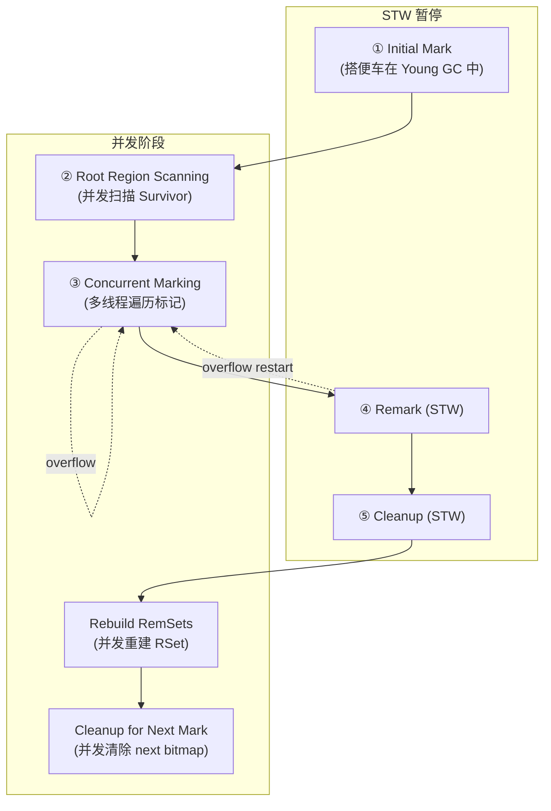
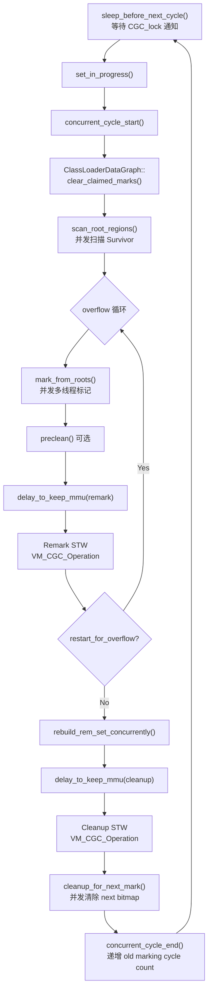
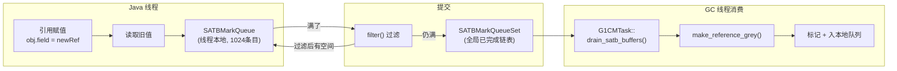
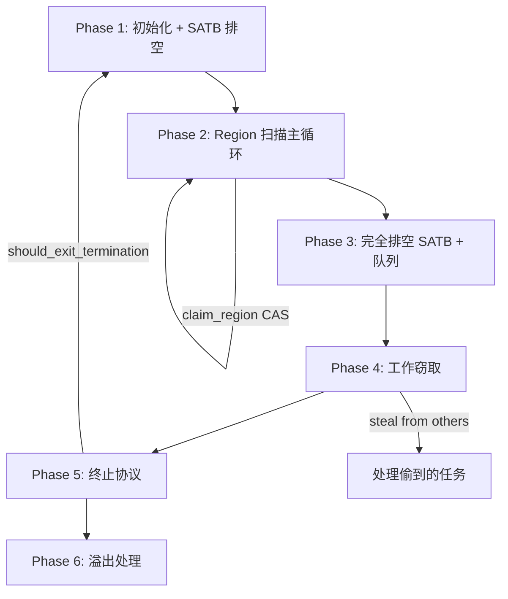
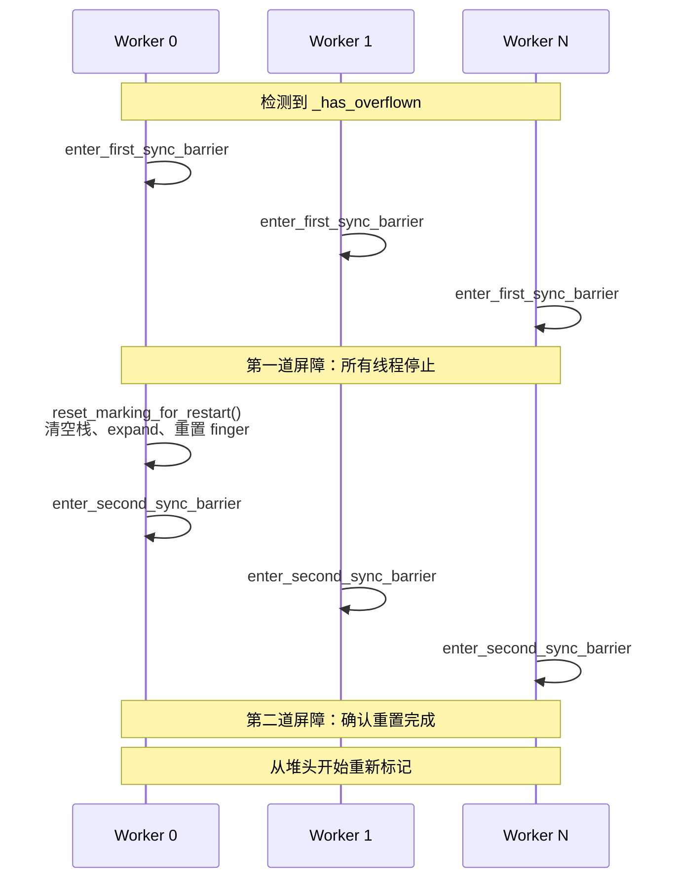

# G1 并发标记（Concurrent Marking）深度剖析

> 基于 OpenJDK 11 源码，标准环境 `-Xms8g -Xmx8g -XX:+UseG1GC`，G1 Region = 4MB
> **源码文件**：`g1ConcurrentMark.hpp/cpp/inline.hpp`、`g1ConcurrentMarkThread.hpp/cpp/inline.hpp`、`g1ConcurrentMarkBitMap.hpp/cpp/inline.hpp`、`g1ConcurrentMarkObjArrayProcessor.hpp/cpp/inline.hpp`、`satbMarkQueue.hpp/cpp`、`g1RegionMarkStatsCache.hpp/inline.hpp`、`g1CollectedHeap.cpp`（标记集成）

---

## 第 0 部分：核心原理 ⭐

### 0.1 本质是什么？

G1 并发标记的本质是**基于 SATB（Snapshot-At-The-Beginning）语义的三色标记算法**：在 Initial Mark（STW）时对堆做逻辑快照，然后并发地遍历对象图标记存活对象；应用线程修改引用时通过 Pre 写屏障将旧值入 SATB 队列，Remark（STW）时处理 SATB 队列确保快照时存活的对象不被漏标；最终 Cleanup（STW）统计每个 Region 的存活率，为 Mixed GC 选择 CSet 提供数据。

### 0.2 为什么需要？

G1 Mixed GC 需要知道 Old Region 中哪些对象存活、哪些是垃圾，才能计算"回收这个 Region 能释放多少内存"（用于 CSet 选择）。但扫描整个 Old 区需要 STW，停顿时间不可接受。并发标记在应用线程运行时并发完成大部分标记工作，只有 Initial Mark/Remark/Cleanup 三个短暂 STW。

### 0.3 怎么解决？

**五阶段流水线**：
1. **Initial Mark（STW，搭便车）**：标记 GC Roots 直接可达的对象，设置 `_top_at_mark_start`（TAMS）；搭便车在 Young GC 的 STW 中完成，不额外增加停顿
2. **Root Region Scan（并发）**：扫描 Survivor Region（上次 Young GC 的幸存者），这些 Region 在下次 Young GC 前必须扫描完
3. **Concurrent Mark（并发）**：多线程并发遍历对象图，用 `_next_mark_bitmap` 标记存活对象；使用任务队列 + 工作窃取实现负载均衡
4. **Remark（STW）**：处理所有 SATB 队列（应用线程在并发标记期间修改的引用），完成标记；处理弱引用
5. **Cleanup（STW）**：统计每个 Region 的存活字节数，识别完全空的 Region（直接回收），为 Mixed GC 准备候选 Region 列表

### 0.4 为什么这样设计？

- **为什么用 SATB 而不是增量更新（Incremental Update）？** 增量更新需要在每次引用写入时记录新值，Remark 时需要重新扫描所有被修改的对象；SATB 只记录旧值，Remark 时只需处理 SATB 队列（通常很小）；SATB 的 Remark 停顿更短、更可预测
- **为什么 Initial Mark 搭便车在 Young GC 上？** Initial Mark 需要 STW，如果单独触发 STW 会增加一次额外停顿；Young GC 本来就需要 STW，搭便车不增加额外停顿次数
- **为什么需要 TAMS（Top-At-Mark-Start）？** 并发标记期间应用线程继续分配对象，这些新对象在 `_next_mark_bitmap` 中没有标记位；TAMS 记录标记开始时的 `_top`，TAMS 以上的对象是新分配的，默认存活，不需要标记
- **为什么 Cleanup 不直接回收垃圾 Region？** Cleanup 只是统计，真正的回收（Evacuation）需要复制存活对象到新 Region，这个操作需要 STW 且代价高；Cleanup 识别出候选 Region 后，由后续的 Mixed GC 逐步回收

---

## 一、为什么需要并发标记？

### 1.1 核心问题

G1 GC 需要知道**每个 Region 里有多少活跃对象**，才能在 Mixed GC 时选择"垃圾最多"的 Region 进行回收（即 Garbage-First 的名字由来）。

问题是：如何在**不暂停应用**的情况下，遍历整个堆，标记所有活跃对象？

这就是并发标记要解决的事：**在应用线程持续运行的同时，完成全堆可达性分析。**

### 1.2 SATB vs Incremental Update

并发标记面临的根本困难是：**GC 线程在扫描引用的同时，应用线程可能修改引用关系。**

两种主流方案：

| 方案 | 原理 | 代表 |
|------|------|------|
| **SATB**（Snapshot-At-The-Beginning） | 标记开始时逻辑快照堆状态；后续引用变更通过写屏障记录旧值 | G1 GC |
| **Incremental Update** | 记录新增引用，重新扫描这些新引用 | CMS GC |

G1 选择 SATB 的理由：
- SATB 保守但简单——标记开始时存活的对象一定会被标记（可能多标但不会漏标）
- 不需要重新扫描整个根集合（Remark 只需处理 SATB 缓冲区）
- Remark 暂停时间更可控

---

## 二、整体架构：5 阶段 + 并发辅助

### 2.1 阶段总览



### 2.2 各阶段概要

| 阶段 | 类型 | 核心工作 | 关键函数 |
|------|------|---------|---------|
| ① Initial Mark | STW（搭便车 Young GC） | 设置 NTAMS；激活 SATB 队列 | `pre_initial_mark()` / `post_initial_mark()` |
| ② Root Region Scan | 并发 | 扫描 Survivor 区域引用 | `scan_root_regions()` |
| ③ Concurrent Marking | 并发（多线程） | 遍历标记所有可达对象 | `mark_from_roots()` → `do_marking_step()` |
| ④ Remark | STW | 处理 SATB 缓冲区；处理弱引用；交换 bitmap | `remark()` |
| ⑤ Cleanup | STW | 更新 RSet 追踪策略；回收空 Region | `cleanup()` |
| Rebuild RemSets | 并发 | 重建已被标记区域的 RSet | `rebuild_rem_set_concurrently()` |
| Clear Bitmap | 并发 | 清除 next bitmap 为下轮标记准备 | `cleanup_for_next_mark()` |

---

## 三、核心数据结构

### 3.1 G1ConcurrentMark —— 标记管理器

并发标记的中枢，管理所有标记相关数据结构和流程控制。

**源码位置**：`src/hotspot/share/gc/g1/g1ConcurrentMark.hpp:301`  
**继承**：`CHeapObj<mtGC>`  
**sizeof**：1840 字节

**GDB 验证**：
```
G1ConcurrentMark* = 0x7ffff0059860
sizeof(G1ConcurrentMark) = 1840
```

**核心字段一览**：

| 字段 | 类型 | 大小 | 作用 | GDB 值 |
|------|------|------|------|--------|
| `_cm_thread` | `G1ConcurrentMarkThread*` | 8B | 主标记线程 | `0x7ffff0062800` |
| `_mark_bitmap_1` / `_mark_bitmap_2` | `G1CMBitMap` | 56B×2 | 双位图 | 内嵌 |
| `_prev_mark_bitmap` / `_next_mark_bitmap` | `G1CMBitMap*` | 8B×2 | 指向双位图（交换用） | `0x7ffff0059880` / `0x7ffff00598b8` |
| `_heap` | `MemRegion` | 16B | 堆边界 | `[0x600000000, +8GB)` |
| `_root_regions` | `G1CMRootRegions` | 24B | Survivor 区域管理 | 内嵌 |
| `_global_mark_stack` | `G1CMMarkStack` | 536B | 全局溢出标记栈 | 内嵌 |
| `_finger` | `HeapWord* volatile` | 8B | 全局 finger 指针 | `0x600000000`（初始） |
| `_max_num_tasks` | `uint` | 4B | 最大任务数 | 13 |
| `_num_active_tasks` | `uint` | 4B | 当前活跃任务数 | 0（初始） |
| `_tasks` | `G1CMTask**` | 8B | 任务数组 | `0x7ffff0066900` |
| `_task_queues` | `G1CMTaskQueueSet*` | 8B | 任务队列集合 | `0x7ffff0059fd0` |
| `_terminator` | `ParallelTaskTerminator` | 280B | 终止协议 | `_n_threads=13` |
| `_first_overflow_barrier_sync` | `WorkGangBarrierSync` | 176B | 溢出双屏障-第一道 | 内嵌 |
| `_second_overflow_barrier_sync` | `WorkGangBarrierSync` | 176B | 溢出双屏障-第二道 | 内嵌 |
| `_has_overflown` | `volatile bool` | 1B | 全局栈溢出标志 | 0 |
| `_concurrent` | `volatile bool` | 1B | true=并发标记中, false=Remark中 | 0 |
| `_has_aborted` | `volatile bool` | 1B | 标记中止标志 | 0 |
| `_restart_for_overflow` | `volatile bool` | 1B | 溢出后需重启标志 | 0 |
| `_concurrent_workers` | `WorkGang*` | 8B | 并发标记线程池 "G1 Conc" | `0x7ffff0064660` |
| `_max_concurrent_workers` | `uint` | 4B | 最大并发标记线程数 | 3 |
| `_region_mark_stats` | `G1RegionMarkStats*` | 8B | 全局 per-Region 活跃字节统计 | `0x7ffff005a510` |
| `_top_at_rebuild_starts` | `HeapWord* volatile*` | 8B | RSet 重建起始 top | `0x7ffff005e550` |

**关键公式**：
```
_max_concurrent_workers = max((ParallelGCThreads + 2) / 4, 1)
                        = max((13 + 2) / 4, 1)
                        = max(3, 1) = 3

_max_num_tasks = MAX2(ParallelGCThreads, _max_concurrent_workers)
               = MAX2(13, 3) = 13
```

`_max_num_tasks=13` 的原因：Initial Mark 阶段复用 ParallelGC 线程（13个），所以任务数组要足够大。

---

### 3.2 G1CMBitMap —— 标记位图

每个位图占一个 bit 表示堆中一个 HeapWord（8字节）是否被标记为存活。

**源码位置**：`src/hotspot/share/gc/g1/g1ConcurrentMarkBitMap.hpp:62`  
**sizeof**：56 字节

**GDB 验证**：
```
--- Bitmap 1 (initially prev) ---
_covered._start = 0x600000000
_covered._word_size = 1073741824 (bytes = 8589934592, MB = 8192)
_shifter = 0
_bm._map = 0x7fffde000000
_bm._size = 1073741824 (bits, bytes = 134217728, MB = 128)

--- Bitmap 2 (initially next) ---
_covered._start = 0x600000000
_covered._word_size = 1073741824 (bytes = 8589934592, MB = 8192)
_shifter = 0
_bm._map = 0x7fffd6000000
_bm._size = 1073741824 (bits, bytes = 134217728, MB = 128)
```

**字段**：

| 字段 | 类型 | 作用 |
|------|------|------|
| `_covered` | `MemRegion` | 覆盖的堆区域 [0x600000000, +8GB) |
| `_shifter` | `int` | 地址右移量 = `LogMinObjAlignment` = 0（即1个HeapWord对应1个bit） |
| `_bm` | `BitMapView` | 实际位图（`_map` 指向内存，`_size` 为位数） |
| `_listener` | `G1CMBitMapMappingChangedListener` | Region 提交/回收时清零对应位图区域 |

**地址映射**：
```
bit_offset = (addr - heap_start) >> _shifter
           = (addr - 0x600000000) >> 0
           = addr - 0x600000000

也就是说：每个 HeapWord (8B) → 1 bit
8GB 堆 → 8GB / 8B = 1G 个 HeapWord → 1G bit = 128MB
两张位图 = 256MB
```

> **注意**：源码注释和一些文档说 "每64字节对应1bit"，那是因为 `MinObjAlignmentInBytes * BitsPerByte = 8 * 8 = 64`。但从实际 `_shifter=0` 来看，映射关系就是 1 HeapWord (8B) → 1 bit。这里 `mark_distance()` 返回的是 64 字节（最小对象大小），意味着同一个对象内部不会有多个 mark bit。

**双位图设计**：

```
            标记周期 N              标记周期 N+1
            ─────────              ──────────
prev:    _mark_bitmap_1    →    _mark_bitmap_2
next:    _mark_bitmap_2    →    _mark_bitmap_1
                    ↑ swap_mark_bitmaps() ↑
```

- `prev_mark_bitmap`：上一轮标记结果，用于判断对象存活（Mixed GC 参考）
- `next_mark_bitmap`：当前正在标记的位图

Remark 完成后，`swap_mark_bitmaps()` 交换两个指针（O(1)操作）：
```cpp
// g1ConcurrentMark.cpp:1848-1853
void G1ConcurrentMark::swap_mark_bitmaps() {
  G1CMBitMap* temp = _prev_mark_bitmap;
  _prev_mark_bitmap = _next_mark_bitmap;
  _next_mark_bitmap = temp;
}
```

**关键方法 `par_mark()`**：
```cpp
// g1ConcurrentMarkBitMap.inline.hpp
inline bool G1CMBitMap::par_mark(HeapWord* addr) {
  check_mark(addr);
  return _bm.par_set_bit(addr_to_offset(addr));  // CAS 原子设置
}
```
使用 CAS 确保多线程安全，返回 `true` 表示首次标记成功。

---

### 3.3 G1CMMarkStack —— 全局溢出标记栈

当线程本地队列满了或需要跨线程传递时，数据溢出到全局栈。

**源码位置**：`src/hotspot/share/gc/g1/g1ConcurrentMark.hpp:151`  
**sizeof**：536 字节

**GDB 验证**：
```
_base = 0x7fffd4000000
_chunk_capacity = 4096
_max_chunk_capacity = 16384
_hwm = 0
_free_list = (nil)
_chunk_list = (nil)
_chunks_in_chunk_list = 0
sizeof(TaskQueueEntryChunk) = 8192  (8KB)
Total capacity (entries) = 4190208
Total memory (MB) = 32
```

**设计**：基于 **Chunk** 的分块管理。

```
TaskQueueEntryChunk (8KB = 8192 字节)
┌──────────────────────────────────────────────┐
│ next (8B)  │  data[1023] (8184B)             │
│  指向下一个  │  每个 G1TaskQueueEntry 占 8B     │
│  Chunk      │  最多 1023 个                    │
└──────────────────────────────────────────────┘
```

**管理方式**：高水位标记 + 空闲链表混合

```
                        _base
                         │
                         ▼
┌────────────────────────────────────────────────────┐
│ chunk[0] │ chunk[1] │ ... │ chunk[hwm-1] │ 未使用  │
│  已分配   │  已分配   │     │   已分配      │         │
└────────────────────────────────────────────────────┘
                                    ▲           ▲
                                   _hwm    _chunk_capacity
                                   
已释放的 chunk 加入 _free_list（单链表）
需要新 chunk → 优先从 _free_list 取，否则从 _hwm 处分配
```

**字段详解**（带 cache-line padding 防止伪共享）：

| 字段 | 作用 | GDB 值 |
|------|------|--------|
| `_base` | mmap 分配的底部地址 | `0x7fffd4000000` |
| `_chunk_capacity` | 当前最大 chunk 数 | 4096（`MarkStackSize/8KB`） |
| `_max_chunk_capacity` | 绝对最大 chunk 数 | 16384（`MarkStackSizeMax/8KB`） |
| `_hwm` | 高水位（已分配的 chunk 数） | 0 |
| `_free_list` | 空闲 chunk 链表头 | NULL |
| `_chunk_list` | 含数据的 chunk 链表头 | NULL |
| `_chunks_in_chunk_list` | 数据链表中的 chunk 数 | 0 |

> 使用 JVM 参数控制大小：`-XX:MarkStackSize=4194304`（默认4MB），`-XX:MarkStackSizeMax=16777216`（默认16MB）。

**溢出扩容**：`expand()` 在 STW 期间调用，容量翻倍（不超过 `_max_chunk_capacity`）。

---

### 3.4 G1TaskQueueEntry —— 联合类型容器

每个标记任务队列中的元素。利用指针最低位区分两种类型：

```
bit 0 = 0 → oop（需要扫描引用字段的对象）
bit 0 = 1 → HeapWord*（大数组切片的起始地址）
```

**源码位置**：`src/hotspot/share/gc/g1/g1ConcurrentMark.hpp:55`  
**sizeof**：8 字节

**为什么需要数组切片？**

大数组（如 `new Object[1000000]`）包含大量引用，一次性扫描会：
1. 耗时过长，影响响应性
2. 阻塞其他线程获取工作

解决方案：将大数组分片，每片作为独立任务入栈，由不同线程并行处理。

**类型别名**：
```cpp
typedef GenericTaskQueue<G1TaskQueueEntry, mtGC> G1CMTaskQueue;      // 单个线程的任务队列
typedef GenericTaskQueueSet<G1CMTaskQueue, mtGC> G1CMTaskQueueSet;   // 队列集合(支持工作窃取)
```

---

### 3.5 G1CMTask —— 每线程标记任务

每个标记工作线程对应一个 G1CMTask 实例，包含该线程执行标记所需的全部状态。

**源码位置**：`src/hotspot/share/gc/g1/g1ConcurrentMark.hpp:637`  
**继承**：`TerminatorTerminator`  
**sizeof**：392 字节

**GDB 验证（task[0]）**：
```
G1CMTask[0]* = 0x7ffff0066b50
_worker_id = 0
_task_queue = 0x7ffff0066a40
_hash_seed = 17           (init_hash_seed, 用于工作窃取)
_next_mark_bitmap = (nil) (标记开始前为空)
_mark_stats_cache._num_cache_entries = 1024
_mark_stats_cache._num_stats = 2048
```

**核心字段**：

| 字段 | 类型 | 作用 |
|------|------|------|
| `_worker_id` | `uint` | 线程 ID |
| `_task_queue` | `G1CMTaskQueue*` | 线程本地任务队列 |
| `_finger` | `HeapWord*` | 本地 finger（Region 内扫描位置） |
| `_region_limit` | `HeapWord*` | 当前 Region 扫描上限 |
| `_curr_region` | `HeapRegion*` | 正在扫描的 Region |
| `_mark_stats_cache` | `G1RegionMarkStatsCache` | 活跃字节统计缓存（1024 条目） |
| `_cm_oop_closure` | `G1CMOopClosure*` | 引用字段遍历闭包 |
| `_words_scanned` / `_words_scanned_limit` | `size_t` | 扫描计数器 / 触发 clock 阈值（12*1024） |
| `_refs_reached` / `_refs_reached_limit` | `size_t` | 引用计数器 / 触发 clock 阈值（1024） |
| `_time_target_ms` | `double` | 本步时间预算 |
| `_has_aborted` / `_has_timed_out` | `bool` | 中止 / 超时标志 |
| `_draining_satb_buffers` | `bool` | 正在处理 SATB 缓冲区 |
| `_marking_step_diffs_ms` | `TruncatedSeq` | 步进时间统计 |

**常量**：
```cpp
words_scanned_period  = 12*1024  // 扫描 12K 个 HeapWord 后触发 regular_clock_call
refs_reached_period   = 1024     // 访问 1024 个引用后触发 regular_clock_call
init_hash_seed        = 17       // 工作窃取哈希种子
RegionMarkStatsCacheSize = 1024  // 统计缓存条目数
```

---

### 3.6 G1RegionMarkStatsCache —— 活跃字节统计缓存

每个 G1CMTask 内嵌一个统计缓存，避免每次标记对象都要原子操作全局数组。

**源码位置**：`src/hotspot/share/gc/g1/g1RegionMarkStatsCache.hpp:62`  
**sizeof**：56 字节

**设计**：hash 表 + 逐出策略。

```
region_idx → hash → cache_idx = region_idx & (1024-1)
如果 cache[cache_idx] 已被其他 region 占用 → 逐出旧条目到全局数组 → 写入新条目
```

**GDB 验证**：
```
_target = 0x7ffff005a510  (全局 _region_mark_stats 数组)
_num_stats = 2048          (总 Region 数 = 8GB/4MB)
_cache = 0x7ffff0066d10
_num_cache_entries = 1024
```

---

### 3.7 SATBMarkQueue / SATBMarkQueueSet —— SATB 队列

三层架构实现 SATB 快照一致性：

```
Layer 1: G1BarrierSet 前置写屏障
           ↓ 记录旧值
Layer 2: SATBMarkQueue (线程本地)
           ↓ 满了提交到
         SATBMarkQueueSet (全局已完成缓冲区链表)
           ↓ GC 线程消费
Layer 3: G1CMTask::drain_satb_buffers() → make_reference_grey()
```

**SATBMarkQueue**（继承 PtrQueue）：
- **sizeof**：56 字节
- `_buf`：缓冲区指针
- `_index`：从 `capacity_in_bytes`（满）向 0（空）递减
- `_active`：是否激活（由标记阶段控制）
- 满了 → `handle_zero_index()` → 先 `filter()` 过滤无效条目 → 若仍满则提交到全局

**SATBMarkQueueSet**（继承 PtrQueueSet）：
- **sizeof**：160 字节（含 PtrQueueSet 104 + SATBMarkQueue 56）
- 内含一个 `_shared_satb_queue`，供非 Java 线程使用

**GDB 验证**：
```
SATBMarkQueueSet* = 0x7ffff763da60
_buffer_size = 1024 (entries)    ← G1SATBBufferSize 参数
_n_completed_buffers = 0
_all_active = 0                  ← 标记开始前未激活
```

**SATB filter() 算法**：双指针压缩。遍历缓冲区，保留满足以下条件的条目：
1. 对象在 NTAMS 之下（标记前就存在的对象）
2. 对象尚未被标记

---

### 3.8 G1ConcurrentMarkThread —— 主标记线程

调度并发标记各阶段的专用线程。

**源码位置**：`src/hotspot/share/gc/g1/g1ConcurrentMarkThread.hpp:36`  
**继承**：`ConcurrentGCThread` → `NamedThread`  
**线程名**：`"G1 Main Marker"`  
**sizeof**：944 字节

**GDB 验证**：
```
G1ConcurrentMarkThread* = 0x7ffff0062800
_state = 0 (Idle)     ← 初始状态
_cm = 0x7ffff0059860   ← 指向 G1ConcurrentMark
```

**状态机**：
```
Idle ──(Initial Mark STW 设置 set_started())──→ Started
Started ──(CM 线程唤醒后设置 set_in_progress())──→ InProgress
InProgress ──(标记周期完成 set_idle())──→ Idle
```

---

### 3.9 G1CMRootRegions —— Root Region 管理

管理 Young GC 产生的 Survivor 区域。这些区域在 Initial Mark 之后、Concurrent Marking 之前，需要被优先扫描。

**sizeof**：24 字节

**GDB 验证**：
```
_survivors = 0x7ffff00320a0
_cm = 0x7ffff0059860
_scan_in_progress = 0
_claimed_survivor_index = 0
```

---

## 四、G1ConcurrentMarkThread::run_service() —— 主循环

这是整个并发标记的调度中枢。源码位于 `g1ConcurrentMarkThread.cpp`。



### 4.1 唤醒机制

主标记线程在 `sleep_before_next_cycle()` 中等待 `CGC_lock`。当 Young GC 决定附带 Initial Mark 时：

```
Young GC (STW):
  do_collection_pause_at_safepoint()
    → decide_on_conc_mark_initiation()  // 判断是否触发
    → concurrent_mark()->pre_initial_mark()   // reset + 设 NTAMS
    → 正常 Young GC 疏散
    → concurrent_mark()->post_initial_mark()  // 激活 SATB
    → _cm_thread->set_started()               // 设状态为 Started
    → CGC_lock->notify()                      // 唤醒 CM 线程
```

### 4.2 MMU 控制

`delay_to_keep_mmu()` 确保 GC 暂停不违反 MMU 目标（默认 200ms/1000ms）。如果上一次暂停太近，CM 线程会 sleep 一段时间再触发下一个 STW。

---

## 五、Initial Mark —— 搭便车 Young GC

### 5.1 pre_initial_mark()

```cpp
// g1ConcurrentMark.cpp:843
void G1ConcurrentMark::pre_initial_mark() {
  reset();  // 重置所有数据结构
  // NoteStartOfMarkHRClosure 对每个 Region 设置 NTAMS = top
}
```

`reset()` 做什么：
1. 重置全局 finger 到堆起始
2. 清空所有 task 本地状态
3. 重置全局标记栈
4. 清空统计数据

**NTAMS 设置**：对每个 Region，`_next_top_at_mark_start = top`。

```
Region 内存布局:
┌──────────────────────────────────────────────────────┐
│  bottom        NTAMS=top                        end  │
│     ↓             ↓                              ↓   │
│  [已有对象们...]  [标记后新分配的对象...]               │
│  ← 需要标记 →    ← 隐式存活(不需要标记) →             │
└──────────────────────────────────────────────────────┘
```

### 5.2 post_initial_mark()

```cpp
// g1ConcurrentMark.cpp:853
void G1ConcurrentMark::post_initial_mark() {
  // 启用弱引用发现
  // set_active_all_threads(true) → 激活所有线程的 SATB 队列
  // 准备 root region (Survivor 区域)
}
```

从此刻起，每个 Java 线程的引用赋值操作都会触发 SATB 前置写屏障，将**旧引用值**记录到线程本地 SATB 队列。

---

## 六、SATB 机制详解

### 6.1 前置写屏障

当 Java 代码执行 `obj.field = newRef` 时，G1 的写屏障在赋值**之前**执行：

```cpp
// g1BarrierSet.inline.hpp
template <DecoratorSet decorators, typename T>
inline void G1BarrierSet::AccessBarrier<decorators, BarrierSetT>::
oop_store_in_heap(T* addr, oop new_value) {
  // 前置屏障：记录旧值
  if (SATBMarkQueue is active) {
    T old_value = *addr;        // 读取旧值
    if (old_value != NULL) {
      enqueue(old_value);        // 入队到 SATB buffer
    }
  }
  // 然后执行实际赋值
  *addr = new_value;
  // 后置屏障：脏卡标记 (CardTable 相关，不在本文讨论范围)
}
```

### 6.2 SATB 缓冲区数据流



### 6.3 线程生命周期与 SATB

- **`on_thread_attach()`**：如果标记正在进行，激活新线程的 SATB 队列
- **`on_thread_detach()`**：flush 线程本地 SATB 缓冲区到全局

---

## 七、Concurrent Marking —— 核心标记循环

### 7.1 mark_from_roots()

```cpp
// g1ConcurrentMark.cpp:1065-1084
void G1ConcurrentMark::mark_from_roots() {
  // 设置并发标记模式
  set_concurrency_and_phase(_max_concurrent_workers, true /* concurrent */);
  // 创建并发标记任务
  G1CMConcurrentMarkingTask task(this, cm_thread());
  // 在 WorkGang "G1 Conc" 上运行
  _concurrent_workers->run_task(&task);
}
```

每个 worker 线程的入口：
```cpp
// g1ConcurrentMark.cpp:919-957
void G1CMConcurrentMarkingTask::work(uint worker_id) {
  G1CMTask* task = _cm->task(worker_id);
  do {
    task->do_marking_step(G1ConcMarkStepDurationMillis,  // 默认 10ms
                          true,   // do_termination
                          false); // is_serial
    _cm->do_yield_check();  // 让出 CPU 给 safepoint
  } while (!_cm->has_aborted() && task->has_aborted());
}
```

### 7.2 do_marking_step() —— 核心 420 行

这是并发标记最核心的函数（`g1ConcurrentMark.cpp:2566-2984`），分为 6 个阶段：



#### Phase 1（行 2681-2732）：初始化 + 部分排空

```
1. 初始化计数器、时间目标
2. drain_satb_buffers()    → 处理已完成的 SATB 缓冲区
3. drain_local_queue(partially=true)   → 部分排空本地队列
4. drain_global_stack(partially=true)  → 部分排空全局栈
```

#### Phase 2（行 2734-2841）：Region 扫描主循环 ⭐

这是标记的主体工作：

```
while (!has_aborted) {
  if (当前有 Region) {
    // 在 bitmap 上找到下一个标记位
    next_marked = bitmap->get_next_marked_addr(finger, region_limit)
    if (found) {
      // 扫描该对象的所有引用字段
      scan_task_entry(entry)  → oop_iterate(cm_oop_closure)
      // 移动本地 finger
      move_finger_to(next_marked + obj_size)
    } else {
      // 当前 Region 扫完
      giveup_current_region()
    }
  } else {
    // 需要新 Region
    hr = claim_region(worker_id)  // CAS 推进全局 finger
    if (hr != NULL) {
      setup_for_region(hr)
    } else if (out_of_regions()) {
      break  // 所有 Region 都扫完了
    }
  }
}
```

#### Phase 3（行 2843-2856）：完全排空

```
drain_satb_buffers()              → 处理所有 SATB
drain_local_queue(partially=false) → 完全排空本地
drain_global_stack(partially=false) → 完全排空全局
```

#### Phase 4（行 2858-2880）：工作窃取

```
while (try_stealing(worker_id, &hash_seed, stolen_entry)) {
  process_grey_task_entry<true>(stolen_entry)  // 扫描偷到的对象
  drain_local_queue(partially=false)
}
```

#### Phase 5（行 2882-2917）：终止协议

```
terminator.offer_termination(this)
// 所有线程都到达此处 → 标记完成
// 如果有线程发现新工作 → should_exit_termination() 返回 true → 回到 Phase 1
```

#### Phase 6（行 2928-2983）：溢出处理

当全局栈溢出时的双屏障同步：



---

## 八、Finger 机制

### 8.1 全局 Finger

`G1ConcurrentMark::_finger` 是 Region 对齐的全局指针，指示标记进度。

```
heap start                           _finger                          heap end
    ↓                                  ↓                                ↓
    ├──────────已扫描──────────┤──────待扫描──────────────────────┤
    │  对象在此区域 → 已被bitmap│  对象在此区域 → bitmap 扫描     │
    │  扫描过了                 │  会找到它们                      │
    └──────────────────────────┴──────────────────────────────────┘
```

**claim_region() —— CAS 推进 finger**：

```cpp
// g1ConcurrentMark.cpp:1999-2041
HeapRegion* G1ConcurrentMark::claim_region(uint worker_id) {
  HeapWord* finger = _finger;  // 读取当前 finger
  while (finger < _heap.end()) {
    // CAS 尝试推进
    if (Atomic::cmpxchg(finger + HeapRegion::GrainWords, &_finger, finger) == finger) {
      // 成功领取了 [finger, finger + GrainWords) 范围的 Region
      HeapRegion* hr = _g1h->heap_region_containing(finger);
      if (hr is not empty) return hr;
    }
    finger = _finger;  // CAS 失败重试
  }
  return NULL;  // 所有 Region 都被领取了
}
```

### 8.2 本地 Finger

每个 G1CMTask 内部有 `_finger`，指示当前 Region 内的扫描位置。

### 8.3 is_below_finger() —— 是否需要入栈

当 `make_reference_grey()` 标记一个对象后，需要判断是否将其入栈：

```cpp
// g1ConcurrentMark.inline.hpp:130-158
bool G1CMTask::is_below_finger(oop obj, HeapWord* global_finger) const {
  if (obj < _finger) {
    return true;  // 在本地 finger 之下 → 已经被扫过 → 必须入栈
  }
  if (obj < _region_limit) {
    return false;  // 在当前 Region 内但在 finger 之上 → bitmap 会扫到
  }
  return obj < global_finger;  // 在全局 finger 之下 → 已经被扫过 → 必须入栈
}
```

逻辑：
- 对象在 finger **之下** → bitmap 扫描已经经过了 → 不会再被 bitmap 找到 → **必须入栈**
- 对象在 finger **之上** → bitmap 扫描还没到那里 → 扫到时会处理 → **不需入栈**

---

## 九、make_reference_grey() —— 标记核心

```cpp
// g1ConcurrentMark.inline.hpp:213-254
inline bool G1CMTask::make_reference_grey(oop obj) {
  // 1. 在 next bitmap 上 CAS 标记
  if (!_next_mark_bitmap->par_mark(obj)) {
    return false;  // 已经被其他线程标记了
  }
  
  // 2. 统计活跃字节
  update_liveness(obj, obj_size);
  
  // 3. 如果是 TypeArray（无引用字段），不需要扫描，直接返回
  if (obj is TypeArrayKlass) return true;
  
  // 4. 判断是否需要入栈
  HeapWord* global_finger = _cm->finger();
  if (is_below_finger(obj, global_finger)) {
    push(G1TaskQueueEntry::from_oop(obj));  // 入本地队列
  }
  
  return true;
}
```

---

## 十、mark_in_next_bitmap() —— 对象标记入口

```cpp
// g1ConcurrentMark.inline.hpp:58-82
inline bool G1ConcurrentMark::mark_in_next_bitmap(uint worker_id,
                                                    HeapRegion* const hr,
                                                    oop const obj,
                                                    size_t const obj_size) {
  // 1. 检查是否在 NTAMS 之上（标记后新分配 → 隐式存活 → 不需要标记）
  if (hr->obj_allocated_since_next_marking(obj)) {
    return false;
  }
  // 2. CAS 原子标记
  bool success = _next_mark_bitmap->par_mark(obj);
  if (success) {
    // 3. 首次标记成功 → 更新活跃字节统计
    add_to_liveness(worker_id, obj, obj_size);
  }
  return success;
}
```

`obj_allocated_since_next_marking(obj)` 就是判断 `obj >= _next_top_at_mark_start`。

---

## 十一、regular_clock_call() —— 周期性检查

每扫描 `12*1024` 个 HeapWord 或访问 `1024` 个引用后调用，检查 5 个中止条件：

```cpp
// g1ConcurrentMark.cpp:2312-2370
void G1CMTask::regular_clock_call() {
  // 1. 全局栈溢出 → 中止
  if (_cm->has_overflown()) { set_has_aborted(); return; }
  
  // 2. Full GC 中止标记
  if (_cm->has_aborted()) { set_has_aborted(); return; }
  
  // 3. 需要让出 CPU (safepoint)
  if (ConcurrentGCThread::should_yield()) { set_has_aborted(); return; }
  
  // 4. 超时
  if (elapsed > _time_target_ms) { _has_timed_out = true; set_has_aborted(); return; }
  
  // 5. SATB 缓冲区积压过多 → 中止去处理
  if (!_draining_satb_buffers && satb_buffers_available) { set_has_aborted(); return; }
}
```

---

## 十二、Root Region Scanning

扫描 Survivor 区域（Young GC 产生的幸存者），因为这些对象的引用可能指向老年代，必须作为标记根。

```cpp
// g1ConcurrentMark.cpp:980-1040
void G1ConcurrentMark::scan_root_regions() {
  // 使用 _concurrent_workers 并行扫描
  // 每个 worker 通过 claim_next() 原子领取 Survivor Region
  // G1RootRegionScanClosure: 遍历 Region 中每个对象的每个引用字段
  //                          对引用目标调用 mark_in_next_bitmap()
}
```

**关键约束**：必须在下一次 Young GC 之前完成。如果 Young GC 先到了，会调用 `wait_until_scan_finished()` 等待。

---

## 十三、Remark (STW)

### 13.1 finalize_marking()

在 STW 中完成标记的收尾：

```cpp
// 1. 处理所有线程残留的 SATB 缓冲区
// 2. 每个 task 执行 do_marking_step(1000.0, true, true)
//    → 处理 SATB + drain 队列 + drain 全局栈（串行模式）
```

### 13.2 weak_refs_work()

处理软引用、弱引用、虚引用、幻象引用。

### 13.3 swap_mark_bitmaps()

交换 `_prev_mark_bitmap` 和 `_next_mark_bitmap` 指针，O(1) 操作。

### 13.4 reclaim_empty_regions()

标记结果中活跃字节为 0 的 Region，直接回收到空闲列表。

### 13.5 溢出重启

如果 Remark 过程中全局栈溢出：
```cpp
_restart_for_overflow = true;
// → 回到 run_service() 的 overflow 循环
// → 重新执行 mark_from_roots()
```

---

## 十四、Cleanup (STW)

```cpp
// g1ConcurrentMark.cpp:1448-1489
void G1ConcurrentMark::cleanup() {
  // 1. 更新每个 Region 的 RSet 追踪策略
  // 2. 增加 collection set 的计数
  // 3. 通知后续的 Mixed GC 可以开始选择 Region
}
```

---

## 十五、并发辅助阶段

### 15.1 rebuild_rem_set_concurrently()

并发重建那些在标记过程中被标记的 Region 的 RSet。

### 15.2 cleanup_for_next_mark()

并发清除 next bitmap（现在已变成下一轮的 next），为下一次标记做准备。

---

## 十六、关键 JVM 参数

**GDB 验证**：
```
ConcGCThreads = 3                          ← 并发标记线程数
ParallelGCThreads = 13                     ← STW GC 线程数
G1ConcMarkStepDurationMillis = 10          ← 每步标记时间预算(ms)
MarkStackSize = 4194304                    ← 全局标记栈初始大小(4MB)
MarkStackSizeMax = 16777216                ← 全局标记栈最大大小(16MB)
G1AdaptiveIHOPNumInitialSamples = 3        ← IHOP 自适应初始采样次数
InitiatingHeapOccupancyPercent = 45        ← 初始 IHOP 阈值
G1UseAdaptiveIHOP = 1                      ← 使用自适应 IHOP
G1SATBBufferSize = 1024                    ← SATB 缓冲区大小(条目数)
G1SATBBufferEnqueueingThresholdPercent = 60 ← SATB 缓冲区入队阈值
G1HeapWastePercent = 5                     ← 堆浪费百分比阈值
G1MixedGCCountTarget = 8                   ← Mixed GC 目标次数
MaxGCPauseMillis = 200                     ← 最大 GC 暂停目标(ms)
```

**关键日志参数**：
```bash
# 查看并发标记各阶段时间
-Xlog:gc*=info

# 输出示例：
# [2.345s][info][gc] GC(3) Pause Young (Concurrent Start) (G1 Humongous Allocation)
# [2.345s][info][gc,marking] GC(3) Concurrent Clear Claimed Marks
# [2.346s][info][gc,marking] GC(3) Concurrent Scan Root Regions
# [2.348s][info][gc,marking] GC(3) Concurrent Mark (2.346s)
# [2.567s][info][gc,marking] GC(3) Concurrent Mark 221.234ms
# [2.568s][info][gc] GC(3) Pause Remark 15M->15M(8192M) 1.234ms
# [2.569s][info][gc] GC(3) Pause Cleanup 15M->15M(8192M) 0.345ms

# 查看标记详细统计
-Xlog:gc+marking=debug

# 查看 SATB 缓冲区处理
-Xlog:gc+satb=trace
```

---

## 十七、GDB 验证数据汇总

### 17.1 sizeof 汇总

| 类型 | sizeof | 说明 |
|------|--------|------|
| `G1ConcurrentMark` | **1840** | 含双位图(56×2)、标记栈(536)、terminator(280)、双屏障(176×2) |
| `G1CMBitMap` | **56** | MemRegion(16) + int(4) + BitMapView(16) + listener(8) + padding |
| `G1CMMarkStack` | **536** | 含 cache-line padding (3×64B) |
| `G1TaskQueueEntry` | **8** | 一个 void* 指针 |
| `G1CMTask` | **392** | 每个标记线程的完整状态 |
| `G1CMRootRegions` | **24** | 3 个指针/标志 |
| `G1ConcurrentMarkThread` | **944** | 继承 ConcurrentGCThread(含 Thread 基类) |
| `SATBMarkQueue` | **56** | 继承 PtrQueue |
| `SATBMarkQueueSet` | **160** | PtrQueueSet(104) + SATBMarkQueue(56) |
| `G1RegionMarkStats` | **8** | 就一个 `_live_words` (size_t) |
| `G1RegionMarkStatsCache` | **56** | hash 缓存元数据 |
| `ParallelTaskTerminator` | **280** | 终止协议 |
| `WorkGangBarrierSync` | **176** | 同步屏障 |

### 17.2 内存开销汇总（8GB 堆）

| 组件 | 大小 | 计算 |
|------|------|------|
| Bitmap 1 (prev) | **128 MB** | 8GB / 8B × 1bit = 1G bit = 128MB |
| Bitmap 2 (next) | **128 MB** | 同上 |
| 全局标记栈（初始） | **32 MB** | 4096 chunks × 8KB |
| 全局标记栈（最大） | **128 MB** | 16384 chunks × 8KB |
| Region 统计数组 | **16 KB** | 2048 regions × 8B |
| 每 task 统计缓存 | **24 KB** | 1024 entries × (4+8)B × 2 |
| **合计（初始）** | **~288 MB** | 主要是双位图 |

### 17.3 关键值验证

| 验证项 | 期望值 | GDB 实际值 | 匹配 |
|--------|--------|-----------|------|
| `_prev_mark_bitmap == &_mark_bitmap_1` | true | 1 | ✅ |
| `_next_mark_bitmap == &_mark_bitmap_2` | true | 1 | ✅ |
| Bitmap 覆盖堆大小 | 8GB | 8589934592 B = 8GB | ✅ |
| Bitmap 位数 | 1G | 1073741824 | ✅ |
| Bitmap 字节 | 128MB | 134217728 B = 128MB | ✅ |
| `_shifter` | 0 (LogMinObjAlignment) | 0 | ✅ |
| Mark stack chunk capacity | 4096 | 4096 | ✅ |
| Mark stack max capacity | 16384 | 16384 | ✅ |
| TaskQueueEntryChunk size | 8192 | 8192 | ✅ |
| `_max_concurrent_workers` | 3 = max((13+2)/4, 1) | 3 | ✅ |
| `_max_num_tasks` | 13 = MAX2(13,3) | 13 | ✅ |
| Terminator `_n_threads` | 13 | 13 | ✅ |
| CM Thread `_state` | 0 (Idle) | 0 | ✅ |
| SATB `_buffer_size` | 1024 | 1024 | ✅ |
| SATB `_all_active` | false (0) | 0 | ✅ |
| `ConcGCThreads` | 3 | 3 | ✅ |
| `G1ConcMarkStepDurationMillis` | 10 | 10 | ✅ |

---

## 十八、数据结构关系总图

```mermaid
graph TD
    subgraph G1ConcurrentMark
        CM["G1ConcurrentMark<br/>sizeof=1840"]
        BM1["_mark_bitmap_1<br/>G1CMBitMap<br/>128MB"]
        BM2["_mark_bitmap_2<br/>G1CMBitMap<br/>128MB"]
        MS["_global_mark_stack<br/>G1CMMarkStack<br/>32MB初始"]
        RR["_root_regions<br/>G1CMRootRegions"]
        TERM["_terminator<br/>ParallelTaskTerminator"]
        BAR1["_first_overflow_barrier_sync"]
        BAR2["_second_overflow_barrier_sync"]
    end
    
    CM --> BM1
    CM --> BM2
    CM --> MS
    CM --> RR
    CM --> TERM
    CM --> BAR1
    CM --> BAR2
    
    CM -->|_prev_mark_bitmap| BM1
    CM -->|_next_mark_bitmap| BM2
    
    CM -->|_cm_thread| CMT["G1ConcurrentMarkThread<br/>sizeof=944<br/>state: Idle→Started→InProgress"]
    CM -->|_concurrent_workers| WG["WorkGang 'G1 Conc'<br/>3 threads"]
    CM -->|_tasks[0..12]| T0["G1CMTask[0]<br/>sizeof=392"]
    CM -->|_tasks[0..12]| T1["G1CMTask[1]"]
    CM -->|_tasks[0..12]| TN["G1CMTask[12]"]
    CM -->|_task_queues| TQS["G1CMTaskQueueSet"]
    CM -->|_region_mark_stats| RMS["G1RegionMarkStats[2048]<br/>per-region live_words"]
    
    T0 -->|_task_queue| TQ0["G1CMTaskQueue<br/>(GenericTaskQueue)"]
    T0 -->|_mark_stats_cache| MSC["G1RegionMarkStatsCache<br/>1024 entries"]
    MSC -->|evict to| RMS
    
    TQS -->|work stealing| TQ0
    
    subgraph "SATB 数据流"
        JT["Java Thread"] -->|write barrier| SQ["SATBMarkQueue<br/>(线程本地)"]
        SQ -->|full → submit| SQS["SATBMarkQueueSet<br/>(全局已完成链表)"]
        SQS -->|drain| T0
    end
    
    MS -->|overflow| OVERFLOW["Double Barrier Sync<br/>→ reset + restart"]
```

---

## 十九、总结

### 19.1 设计精髓

1. **SATB 写屏障**：无锁记录旧引用值，保证快照一致性
2. **双位图 swap**：O(1) 交换指针，避免大量内存拷贝
3. **NTAMS 隐式存活**：标记后新分配的对象自动存活，无需额外标记
4. **Finger 机制**：CAS 无锁 Region 领取 + 两级 finger 避免不必要的入栈
5. **Chunk-based 溢出栈**：批量 push/pop 减少竞争
6. **工作窃取**：负载均衡，快线程帮慢线程
7. **双屏障溢出处理**：保证所有线程一致性重启
8. **统计缓存逐出**：hash-based 缓存减少原子操作次数
9. **搭便车 Initial Mark**：避免额外 STW 暂停
10. **regular_clock_call**：细粒度超时控制，保证响应性

### 19.2 复杂度分析

- **时间复杂度**：O(活跃对象数)——需要扫描所有可达对象的引用字段
- **空间复杂度**：O(堆大小)——两张位图各占堆大小的 1/64（对于8GB堆是 128MB×2）
- **STW 暂停**：Initial Mark（搭便车 Young GC，已有暂停）+ Remark（处理 SATB 缓冲区）+ Cleanup（轻量）
