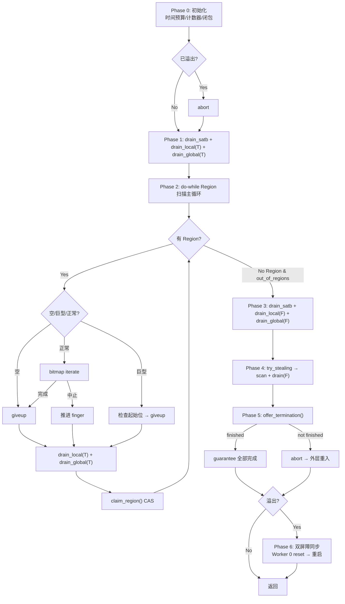

# G1 并发标记逐行深度剖析（增补 #8）

> 基于 OpenJDK 11 源码，标准环境 `-Xms8g -Xmx8g -XX:+UseG1GC`，G1 Region = 4MB
> 本文是 [8-Concurrent-Marking.md](./8-Concurrent-Marking.md) 的深度增补

---

## 第 0 部分：核心原理 ⭐

### 0.1 本质是什么？

本文是并发标记的**深度增补文档**，聚焦于 `G1ConcurrentMark::do_marking_step()` 的逐行分析：时间片控制机制、SATB 队列处理、Work Stealing 协议、标记完成检测等细节，补充主文档（8-Concurrent-Marking.md）未覆盖的实现细节。

### 0.2 核心补充内容

- **时间片控制**：`do_marking_step()` 如何在时间片内尽量多标记，时间片到期时如何让出
- **SATB 队列处理**：`drain_satb_buffers()` 如何处理 Pre 写屏障产生的旧引用
- **Work Stealing 协议**：`steal_task()` 如何从其他 Task 的队列偷任务
- **标记完成检测**：如何判断所有对象都已标记（全局队列空 + 所有 Task 队列空）

### 0.3 与主文档的关系

| 主文档（8-Concurrent-Marking.md） | 本增补文档 |
|----------------------------------|-----------|
| 并发标记整体流程 | `do_marking_step()` 逐行分析 |
| 五阶段概览 | 时间片控制细节 |
| SATB 原理 | SATB 队列处理实现 |
| Work Stealing 概念 | Work Stealing 协议实现 |

---

## 一、总览

`do_marking_step()` 是并发标记框架的**唯一构建块**。并发标记（3 ConcGC 线程）、Remark（13 ParallelGC 线程）、引用处理闭包都调用同一个函数，通过参数区分行为。不理解这个函数，就无法理解标记的任何方面。

**为什么不分两个版本？** HotSpot 选择代码复用：通过 `concurrent()` 标志区分并发/STW 行为。并发阶段检查超时/让步，STW 跳过。

---

## 二、辅助方法逐行分析

### 2.1 recalculate_limits() / decrease_limits() —— 时钟触发器

不能每扫描一个对象就调 `os::elapsedVTime()`（太昂贵）。解决方案：基于工作量触发。

```cpp
// g1ConcurrentMark.cpp:2372-2388
void G1CMTask::recalculate_limits() {
  _real_words_scanned_limit = _words_scanned + words_scanned_period;  // +12*1024
  _words_scanned_limit      = _real_words_scanned_limit;
  _real_refs_reached_limit  = _refs_reached  + refs_reached_period;   // +1024
  _refs_reached_limit       = _real_refs_reached_limit;
}

void G1CMTask::decrease_limits() {
  // 昂贵操作后把 limit 回退 3/4 周期，让 clock 更早触发
  _words_scanned_limit = _real_words_scanned_limit - 3 * words_scanned_period / 4;
  _refs_reached_limit  = _real_refs_reached_limit - 3 * refs_reached_period / 4;
}
```

### 2.2 regular_clock_call() —— 5 条中止规则

```cpp
// g1ConcurrentMark.cpp:2312-2370
void G1CMTask::regular_clock_call() {
  if (has_aborted()) return;
  recalculate_limits();

  // 检查 1：全局栈溢出 → 需要双屏障同步
  if (_cm->has_overflown()) { set_has_aborted(); return; }

  // ★ Remark(STW) 到这里就返回——不需要检查超时/让步/SATB
  if (!_cm->concurrent()) return;

  // 检查 2：Full GC 中止了标记
  if (_cm->has_aborted()) { set_has_aborted(); return; }

  // 检查 3：让步给 SafePoint
  if (SuspendibleThreadSet::should_yield()) { set_has_aborted(); return; }

  // 检查 4：超过时间预算
  if (elapsed > _time_target_ms) { _has_timed_out = true; set_has_aborted(); return; }

  // 检查 5：SATB 缓冲区积压（但正在处理 SATB 时不检查，避免死循环）
  if (!_draining_satb_buffers && satb_mq_set.process_completed_buffers()) {
    set_has_aborted(); return;
  }
}
```

**为什么 Remark 只检查溢出？** STW 中无应用线程运行，不存在让步/SATB 积压/超时问题。

### 2.3 drain_satb_buffers()

```cpp
// g1ConcurrentMark.cpp:2506-2536
void G1CMTask::drain_satb_buffers() {
  if (has_aborted()) return;
  _draining_satb_buffers = true;  // 防止 clock 因 SATB 可用而中止

  G1CMSATBBufferClosure satb_cl(this, _g1h);
  while (!has_aborted() &&
         satb_mq_set.apply_closure_to_completed_buffer(&satb_cl)) {
    regular_clock_call();
  }
  _draining_satb_buffers = false;
  decrease_limits();
}
```

`G1CMSATBBufferClosure` 对每个条目调用 `make_reference_grey()`：CAS 标记 + 统计 + 可能入栈。

### 2.4 drain_local_queue()

```cpp
// g1ConcurrentMark.cpp:2442-2469
void G1CMTask::drain_local_queue(bool partially) {
  size_t target_size;
  if (partially) {
    target_size = MIN2((size_t)_task_queue->max_elems()/3, (size_t)GCDrainStackTargetSize);
    // max_elems/3 ≈ 5461, GCDrainStackTargetSize = 64 → target = 64
  } else {
    target_size = 0;
  }
  // pop + scan_task_entry 直到 size <= target 或 aborted
}
```

**为什么部分排空只到 64？** 工作窃取的负载均衡：保留条目供其他线程偷，但不至于让自己没活干。

### 2.5 drain_global_stack()

```cpp
// g1ConcurrentMark.cpp:2471-2500
void G1CMTask::drain_global_stack(bool partially) {
  if (partially) {
    // 排到 target = chunk数/active_tasks + 3
    while (mark_stack_size() > target) { get_entries + drain_local(true); }
  } else {
    while (get_entries_from_global_stack()) { drain_local_queue(false); }
  }
}
```

### 2.6 move_entries_to_global_stack() / get_entries_from_global_stack()

批量传输 1023 个条目（一个完整 Chunk = 8KB），减少全局栈 Mutex 获取次数。

```cpp
// move: 本地→全局（本地队列满时）
// pop 1023 个条目到 buffer → mark_stack_push(buffer)
// 如果 push 失败 → 溢出！set_has_aborted()

// get: 全局→本地（本地队列空时）
// mark_stack_pop(buffer) → 逐个 push 到本地队列
```

每次操作后调用 `decrease_limits()` 让 clock 更早触发。

### 2.7 process_grey_task_entry<scan>()

```cpp
// g1ConcurrentMark.inline.hpp:160-179
template<bool scan>
inline void G1CMTask::process_grey_task_entry(G1TaskQueueEntry task_entry) {
  if (scan) {
    if (task_entry.is_array_slice())
      _words_scanned += _objArray_processor.process_slice(task_entry.slice());
    else if (G1CMObjArrayProcessor::should_be_sliced(obj))
      _words_scanned += _objArray_processor.process_obj(obj);  // 大数组分片
    else
      _words_scanned += obj->oop_iterate_size(_cm_oop_closure);  // 普通对象
  }
  check_limits();  // 可能触发 regular_clock_call()
}
```

### 2.8 G1CMBitMapClosure::do_addr()

```cpp
// g1ConcurrentMark.cpp:70-85
bool G1CMBitMapClosure::do_addr(HeapWord* const addr) {
  _task->move_finger_to(addr);
  _task->scan_task_entry(G1TaskQueueEntry::from_oop(oop(addr)));
  _task->drain_local_queue(true);     // 每处理一个 bitmap 对象就排一次
  _task->drain_global_stack(true);
  return !_task->has_aborted();
}
```

### 2.9 make_reference_grey() 深入

```cpp
// g1ConcurrentMark.inline.hpp:213-254
inline bool G1CMTask::make_reference_grey(oop obj) {
  if (!_cm->mark_in_next_bitmap(_worker_id, obj)) return false;  // 已被他人标记
  HeapWord* global_finger = _cm->finger();
  if (is_below_finger(obj, global_finger)) {
    if (obj->is_typeArray())
      process_grey_task_entry<false>(entry);  // typeArray 不入栈，避免 Eager Reclaim 问题
    else
      push(entry);  // 入本地队列
  }
  return true;
}
```

**TypeArray 不入栈的深层原因**：巨型 typeArray 可能被 Eager Reclaim 回收，如果 entry 还在栈上就会访问已回收内存。

### 2.10 完整闭包链

```
bitmap iterate → do_addr(addr) → scan_task_entry → process_grey_task_entry<true>
  → obj->oop_iterate_size(_cm_oop_closure) → G1CMOopClosure::do_oop_work(p)
    → deal_with_reference(p) → oop_load(p) → make_reference_grey(obj)
      → mark_in_next_bitmap() [CAS] → update_liveness() → is_below_finger() → push()
```

---

## 三、do_marking_step() 逐行分析

```
源码：g1ConcurrentMark.cpp:2681-2984（304 行）+ 114 行注释
```

### 3.1 参数语义

| 调用场景 | time_target_ms | do_termination | is_serial |
|---------|----------------|----------------|-----------|
| 并发标记 | 10ms | true | false |
| Remark 多线程 | 1,000,000,000ms | true | false |
| 引用处理 KeepAlive | 10ms | false | true/false |
| 引用处理 Drain | 1,000,000,000ms | true | true/false |

### 3.2 Phase 0：初始化（行 2681-2723）

```cpp
_start_time_ms = os::elapsedVTime() * 1000.0;  // 虚拟时间（只计 CPU 时间）
bool do_stealing = do_termination && !is_serial;

// 时间预算修正：减去历史误差预测值（EWMA 自适应控制）
double diff_prediction_ms = predictor().get_new_prediction(&_marking_step_diffs_ms);
_time_target_ms = time_target_ms - diff_prediction_ms;

_words_scanned = 0; _refs_reached = 0;
recalculate_limits();
clear_has_aborted(); _has_timed_out = false;

G1CMBitMapClosure bitmap_closure(this, _cm);  // 栈上分配
G1CMOopClosure cm_oop_closure(_g1h, this);
set_cm_oop_closure(&cm_oop_closure);

if (_cm->has_overflown()) set_has_aborted();  // 快速中止：已溢出
```

**虚拟时间 vs 墙钟时间**：虚拟时间不计被 OS 调度器抢占的等待，避免误判超时。

### 3.3 Phase 1：SATB + 部分排空（行 2725-2732）

```cpp
drain_satb_buffers();         // 消化应用线程产生的 SATB
drain_local_queue(true);      // 部分排空到 64
drain_global_stack(true);     // 部分排空
```

SATB 在最前面：避免积压导致应用线程 flush 时锁竞争，减少 Remark 暂停时间。

### 3.4 Phase 2：Region 扫描主循环（行 2734-2841）⭐⭐⭐

```cpp
do {
  if (!has_aborted() && _curr_region != NULL) {
    update_region_limit();  // Region 可能被 Young GC 疏散掏空
    MemRegion mr = MemRegion(_finger, _region_limit);

    if (mr.is_empty())
      giveup_current_region();                          // Case 1: 空
    else if (_curr_region->is_humongous() && mr.start() == bottom)
      { if (bitmap.is_marked(start)) bitmap_closure.do_addr(start);
        giveup_current_region(); }                      // Case 2: 巨型
    else if (_next_mark_bitmap->iterate(&bitmap_closure, mr))
      giveup_current_region();                          // Case 3: 正常完成
    else {
      // Case 4: 被中止，推进 finger 避免重复扫描
      HeapWord* new_finger = _finger + ((oop)_finger)->size();
      if (new_finger >= _region_limit) giveup_current_region();
      else move_finger_to(new_finger);
    }
  }

  drain_local_queue(true); drain_global_stack(true);  // 每轮排空

  // CAS 领取新 Region
  while (!has_aborted() && _curr_region == NULL && !_cm->out_of_regions()) {
    HeapRegion* claimed = _cm->claim_region(_worker_id);
    if (claimed != NULL) setup_for_region(claimed);
    regular_clock_call();  // 可能连续空 Region，需要检查
  }
} while (_curr_region != NULL && !has_aborted());
```

**巨型对象只检查起始位**：对象起始地址 = Region bottom，bitmap 只标记一个位。

### 3.5 Phase 3：完全排空（行 2843-2856）

```cpp
if (!has_aborted()) drain_satb_buffers();  // 最后一次处理 SATB
drain_local_queue(false);   // target = 0
drain_global_stack(false);
```

所有 Region 扫完后不再需要为窃取保留，完全排空。

### 3.6 Phase 4：工作窃取（行 2858-2880）

```cpp
if (do_stealing && !has_aborted()) {
  while (!has_aborted()) {
    if (_cm->try_stealing(_worker_id, &_hash_seed, entry)) {
      scan_task_entry(entry);
      drain_local_queue(false); drain_global_stack(false);
    } else break;
  }
}
```

使用 Arora-Blumofe-Plaxton 随机化算法从其他 task 的队列底端偷取。这是"最后手段"——只有自己完全没工作时才偷。

### 3.7 Phase 5：终止协议（行 2882-2917）

```cpp
if (do_termination && !has_aborted()) {
  bool finished = (is_serial ||
                   _cm->terminator()->offer_termination(this));
  if (finished) {
    guarantee(out_of_regions && mark_stack_empty && queue_empty && !overflown);
  } else {
    set_has_aborted();  // 有线程发现新工作
  }
}
```

`offer_termination()` 使用 `should_exit_termination()` 回调：如果全局栈非空或 task 被中止，退出终止协议继续工作。

### 3.8 Phase 6：溢出处理（行 2928-2984）

```cpp
if (_cm->has_overflown()) {
  if (!is_serial) _cm->enter_first_sync_barrier(_worker_id);  // ═══ 屏障 1 ═══

  clear_region_fields(); flush_mark_stats_cache();

  if (!is_serial && _cm->concurrent() && _worker_id == 0) {
    _cm->reset_marking_for_restart();  // 清空栈/扩容/重置 finger/清统计
    log_info(gc, marking)("Concurrent Mark reset for overflow");
  }

  if (!is_serial) _cm->enter_second_sync_barrier(_worker_id);  // ═══ 屏障 2 ═══
}
```

**双屏障设计**：
- 屏障 1：所有线程停下 → 安全地重置全局数据结构
- 屏障 2：确认 Worker 0 重置完成 → 所有线程安全重启

`SuspendibleThreadSetLeaver` 在屏障等待时离开 STS，允许 SafePoint 发生，避免死锁。

---

## 四、Remark (STW) 完整流程

### 4.1 remark() 主体（g1ConcurrentMark.cpp:1231-1327）

```
remark()
  ├─ finalize_marking()                    // 步骤 1: 完成标记
  │    ├─ 13 workers 并行：
  │    │    ├─ G1RemarkThreadsClosure      // 扫描 nmethod + 各线程 SATB 队列
  │    │    └─ loop: do_marking_step(∞)    // 无限时间完成标记
  │    └─ guarantee: SATB 全部处理完
  │
  ├─ if (!overflown):                      // 标记成功
  │    ├─ weak_refs_work()                 // 步骤 2: 引用处理（Soft/Weak/Phantom）
  │    ├─ set_active_all_threads(false)    // 步骤 3: 关闭 SATB
  │    ├─ flush_all_task_caches()          // 步骤 4: 逐出统计缓存到全局
  │    ├─ swap_mark_bitmaps()              // 步骤 5: prev ↔ next
  │    ├─ G1UpdateRemSetTracking           // 步骤 6: 更新 RSet 追踪 + 分发标记字节
  │    │    BeforeRebuildTask (并行)
  │    ├─ reclaim_empty_regions()          // 步骤 7: 回收空 Region
  │    ├─ ClassLoaderDataGraph::purge()    // 步骤 8: 类卸载
  │    └─ reset_at_marking_complete()      // 步骤 9: 重置
  │
  └─ if (overflown):                       // 溢出
       ├─ _restart_for_overflow = true     // → 回到主循环重新并发标记
       └─ reset_marking_for_restart()
```

### 4.2 G1RemarkThreadsClosure —— 线程 SATB 收割

```cpp
// g1ConcurrentMark.cpp:1881-1915
void do_thread(Thread* thread) {
  if (thread->is_Java_thread()) {
    if (thread->claim_oops_do(true, _thread_parity)) {  // CAS 领取
      jt->nmethods_do(&_code_cl);                        // 扫描 nmethod 嵌入引用
      satb_mark_queue(jt).apply_closure_and_empty(&_cm_satb_cl);  // 处理本地 SATB
    }
  } else if (thread->is_VM_thread()) {
    shared_satb_queue()->apply_closure_and_empty(&_cm_satb_cl);   // VM 线程共享队列
  }
}
```

**为什么扫描 nmethod？** JIT 编译代码中有直接嵌入的对象引用（内联缓存/常量），写屏障不拦截。

### 4.3 reclaim_empty_regions() 条件

```cpp
hr->used() > 0 && hr->max_live_bytes() == 0 && !hr->is_young() && !hr->is_archive()
```

满足 4 个条件的 Region 直接回收到空闲列表。每个 worker 维护 local_cleanup_list，最后在 `ParGCRareEvent_lock` 下合并。

### 4.4 weak_refs_work() 中溢出是 fatal

```cpp
if (has_overflown()) {
  fatal("Overflow during reference processing, can not continue. "
        "Please increase MarkStackSizeMax ...");
}
```

引用处理依赖完整的标记结果来决定哪些弱引用该清除。溢出导致标记不完整 → 决策错误 → 无法恢复。

---

## 五、Cleanup (STW) 完整流程

### 5.1 cleanup() 主体（g1ConcurrentMark.cpp:1448-1489）

```
cleanup()
  ├─ G1UpdateRemSetTrackingAfterRebuild    // 步骤 1: Updating → Complete
  │    (串行遍历所有 Region)
  ├─ increment_total_collections()          // 步骤 2: 防止 pause 竞争
  └─ record_concurrent_mark_cleanup_end()   // 步骤 3: 决定 Mixed GC
       ├─ CollectionSetChooser::rebuild()
       │    ├─ ParKnownGarbageTask (并行)   // 筛选候选 Region
       │    │    should_add: !young && !pinned && live<85% && RSet complete
       │    └─ sort_regions()               // 按可回收空间降序 → Garbage-First
       ├─ next_gc_should_be_mixed()         // reclaimable > 5%*8GB?
       └─ set_mark_or_rebuild_in_progress(false)  // ★ 标记周期结束
```

### 5.2 record_concurrent_mark_cleanup_end()（g1Policy.cpp:1035-1052）

```cpp
void G1Policy::record_concurrent_mark_cleanup_end() {
  cset_chooser()->rebuild(workers, num_regions);  // 筛选 + 排序
  bool mixed_gc_pending = next_gc_should_be_mixed(...);
  if (!mixed_gc_pending) { clear_candidates(); abort_time_to_mixed_tracking(); }
  collector_state()->set_in_young_gc_before_mixed(mixed_gc_pending);
  collector_state()->set_mark_or_rebuild_in_progress(false);
}
```

---

## 六、do_marking_step() 完整流程图



---

## 七、关键设计决策总结

| 设计选择 | 解决的问题 | 替代方案及其缺点 |
|---------|-----------|----------------|
| 虚拟时间而非墙钟 | OS 调度导致误判超时 | 墙钟时间：线程被抢占 2ms 就误以为超过 10ms |
| 基于工作量的 clock | elapsedVTime 太昂贵不能每次调用 | 每次调用 vtime：性能下降 |
| 部分排空到 64 | 工作窃取需要可偷的条目 | 完全排空：其他线程饿死 |
| 批量 1023 传输 | 全局栈 Mutex 竞争 | 逐个传输：锁获取 O(n) 次 |
| TypeArray 不入栈 | Eager Reclaim 后访问已回收内存 | 入栈：UAF crash |
| 双屏障溢出处理 | 多线程安全重置全局状态 | 单屏障：Worker 0 重置时其他线程可能访问 |
| SATB 最先处理 | 减少应用线程锁竞争 + Remark 暂停 | 最后处理：积压导致 Remark 变长 |
| diff_prediction 修正 | 步进时间准确性 | 不修正：系统性偏差累积 |

---

## 八、JVM 参数与日志

```bash
# 查看并发标记详细统计
-Xlog:gc+marking=debug

# 输出示例：
# [gc,marking] Concurrent Mark reset for overflow    ← 溢出重启！

# 查看每个 worker 的标记统计
-Xlog:gc+stats=debug

# 输出示例：
# Marking Stats, task = 0, calls = 156
#   Elapsed time = 1560.00ms, Termination time = 12.34ms
#   Step Times (cum): num = 156, avg = 10.00ms, sd = 0.45ms
#   Mark Stats Cache: hits 98765 misses 1234 ratio 98.765

# 查看 Region 回收
-Xlog:gc=trace

# 输出示例：
# Reclaimed empty region 1234 (Old) bot 0x600004d00000
```
