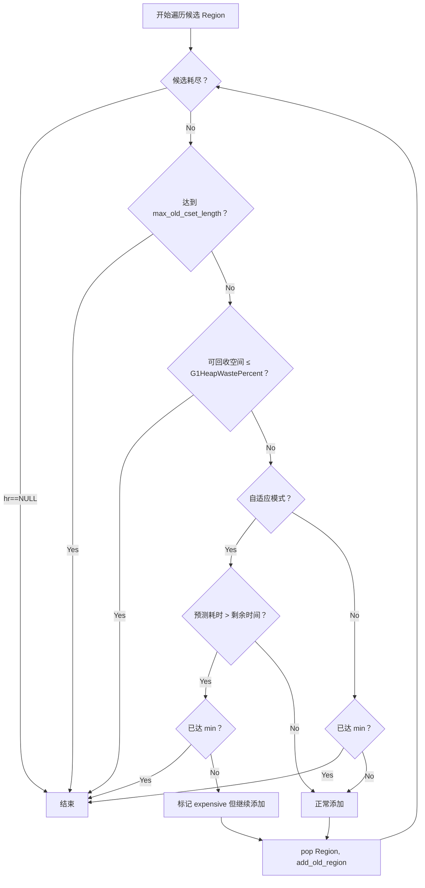
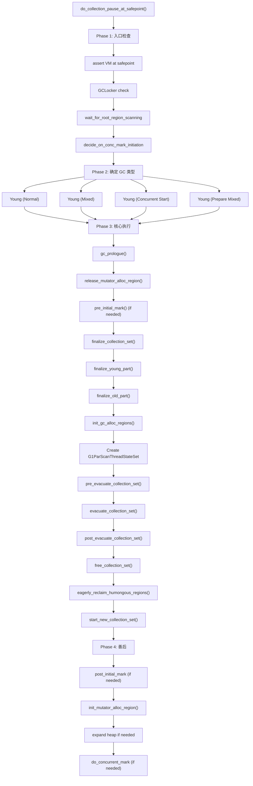
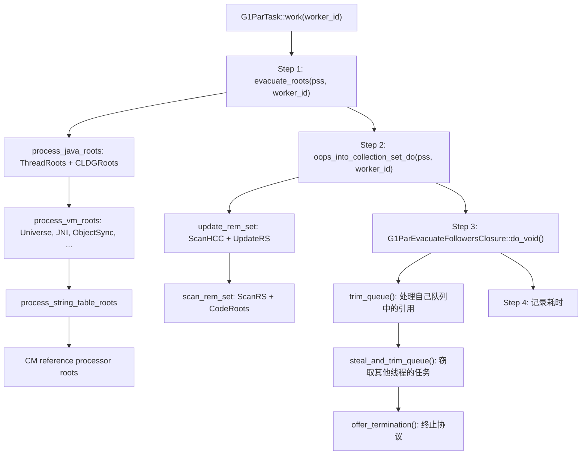
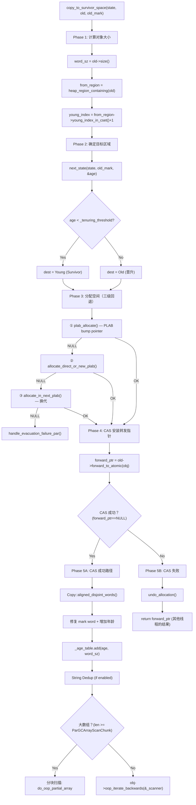

# G1 CollectionSet + Evacuation（疏散）深度剖析

> **一句话总结**：G1 在每次 STW 暂停中，先增量构建 CSet（选择要回收的 Region），再通过多线程并行疏散（复制存活对象到新 Region），核心是 `copy_to_survivor_space()` —— PLAB 分配 + CAS 转发指针 + 内存复制。

---

## 第 0 部分：核心原理 ⭐

### 0.1 本质是什么？

G1 Evacuation 的本质是**并行复制式 GC（Parallel Copying GC）**：多个 GC Worker 线程并行地将 CSet 中的存活对象复制到新 Region（Survivor 或 Old），通过 CAS 写转发指针（Forwarding Pointer）解决并发复制冲突，通过 PLAB（Parallel Local Allocation Buffer）减少 GC 线程间的分配竞争。

### 0.2 为什么需要？

G1 回收 Region 的方式是"复制"而不是"清扫"：将存活对象复制到新 Region，原 Region 整体释放（变为 Free）。这避免了碎片化（新 Region 是连续的），但需要解决：(1) 多个 GC Worker 可能同时复制同一个对象（需要 CAS 转发指针）；(2) 多个 GC Worker 同时向新 Region 分配内存（需要 PLAB 减少竞争）；(3) 复制失败时（堆满）需要原地保留对象（Evacuation Failure 处理）。

### 0.3 怎么解决？

**三个核心机制**：
- **CAS 转发指针**：第一个复制对象的线程用 CAS 将对象头替换为转发指针（指向新地址）；后续线程发现转发指针后直接使用新地址，不重复复制
- **PLAB（Parallel Local Allocation Buffer）**：每个 GC Worker 有自己的私有分配缓冲区（类似 TLAB），在 PLAB 内分配无锁；PLAB 满了才申请新 PLAB（加锁），减少锁竞争
- **Evacuation Failure 处理**：复制失败时对象原地保留，用 mark word 存储转发指针（指向自身），`_preserved_marks_set` 保存原始 mark word；GC 结束后修复所有引用

### 0.4 为什么这样设计？

- **为什么用 CAS 转发指针而不是全局锁？** 全局锁会让所有 GC Worker 串行化，失去并行优势；CAS 只在第一次复制时有竞争，后续线程直接读转发指针，开销极低
- **为什么 PLAB 大小默认 4KB？** 太小：频繁申请新 PLAB，锁竞争多；太大：PLAB 末尾浪费（每个 PLAB 末尾未用空间不能给其他线程用）；4KB 是经验最优值，可通过 `-XX:YoungPLABSize` 调整
- **为什么 Evacuation Failure 不直接触发 Full GC？** Evacuation Failure 通常是暂时的（堆空间不足），原地保留对象后 GC 继续完成，下次 GC 可能有足够空间；直接 Full GC 代价更高（全堆扫描+压缩）
- **为什么 Young Region 的存活对象复制到 Survivor 而不是直接晋升 Old？** 对象年龄机制：年龄 < 阈值的对象复制到 Survivor，年龄 ≥ 阈值才晋升 Old；避免短命对象污染 Old 区，减少 Mixed GC 频率

---

## 目录

1. [问题引入](#一问题引入)
2. [InCSetState 编码设计](#二incsetstate-编码设计)
3. [G1CollectionSet 增量构建](#三g1collectionset-增量构建)
4. [CollectionSetChooser 候选选择器](#四collectionsetchooser-候选选择器)
5. [finalize_old_part：Mixed GC 选区算法](#五finalize_old_part-mixed-gc-选区算法)
6. [do_collection_pause_at_safepoint 全流程](#六do_collection_pause_at_safepoint-全流程)
7. [G1ParTask::work() 每个 Worker 的执行流](#七g1partaskwork-每个-worker-的执行流)
8. [Root 扫描：G1RootProcessor](#八root-扫描g1rootprocessor)
9. [Closure 层级体系](#九closure-层级体系)
10. [copy_to_survivor_space：对象复制核心](#十copy_to_survivor_space-对象复制核心)
11. [PLAB 分配：G1PLABAllocator 三级回退](#十一plab-分配g1plaballocator-三级回退)
12. [Work Queue：任务队列与工作窃取](#十二work-queue-任务队列与工作窃取)
13. [RemSet 处理](#十三remset-处理)
14. [Evacuation Failure 疏散失败](#十四evacuation-failure-疏散失败)
15. [post_evacuate_collection_set](#十五post_evacuate_collection_set)
16. [GDB 验证数据](#十六gdb-验证数据)
17. [关键参数速查表](#十七关键参数速查表)
18. [总结](#十八总结)

---

## 一、问题引入

G1 GC 的核心设计理念是 **"选择性回收"**——不必回收整个堆，只选择收益最高的 Region 集合进行回收，将暂停时间控制在 `MaxGCPauseMillis` 以内。

这带来两个核心问题：

1. **选什么？**（CSet 构建）—— 如何选出一组"回收性价比"最高的 Region？
2. **怎么回收？**（Evacuation）—— 如何高效地把存活对象从选中的 Region 复制出来？

```
┌─────────────────────────────────────────────────────────────┐
│                    G1 Evacuation Pause                       │
├─────────────────────────────────────────────────────────────┤
│                                                             │
│  Phase 1: 构建 CSet                                         │
│    ├─ 增量构建 Young CSet（Eden+Survivor，全部加入）         │
│    └─ finalize_old_part（Mixed GC 时选择 Old Region）        │
│                                                             │
│  Phase 2: 疏散（Evacuation）                                 │
│    ├─ Root 扫描（Java 栈、JNI、ClassLoader 等）              │
│    ├─ RemSet 处理（找到外部引用）                             │
│    └─ 对象复制（copy_to_survivor_space）                     │
│        ├─ PLAB 分配 + CAS 转发指针                           │
│        ├─ 内存复制 + 年龄处理                                │
│        └─ 递归扫描子引用                                     │
│                                                             │
│  Phase 3: 善后处理                                           │
│    ├─ 引用处理、字符串去重                                   │
│    ├─ 释放 CSet Region                                      │
│    └─ 更新统计信息                                          │
│                                                             │
└─────────────────────────────────────────────────────────────┘
```

---

## 二、InCSetState 编码设计

> **源码**：`g1InCSetState.hpp`

### 2.1 为什么需要 InCSetState？

疏散过程中，对于遇到的每个引用，需要判断目标对象所在 Region 是否在 CSet 中。这是 GC 热路径上最频繁的操作——如果用遍历 CSet 数组来判断，就是 O(n)，太慢了。

**解决方案**：用一个按 Region 索引的数组，O(1) 查询。

### 2.2 编码值

```
┌────────────────────────────────────────────────────┐
│              InCSetState 编码                       │
├──────────────┬─────┬──────────────────────────────┤
│ Humongous    │ -1  │ 巨型区域（特殊处理）          │
│ NotInCSet    │  0  │ 不在 CSet 中（默认）          │
│ Young        │ +1  │ 年轻代，在 CSet 中            │
│ Old          │ +2  │ 老年代，在 CSet 中            │
└──────────────┴─────┴──────────────────────────────┘
```

**设计精妙之处**：

- `is_in_cset()` = `_value > 0`：单条 CPU 比较指令，比逐个判断 Young/Old 快得多
- 正值按代际递增（1→2），`+1` 即可得到下一代（方便晋升判断）
- sizeof(InCSetState) = **1 字节**（`int8_t`），对缓存友好

### 2.3 快速查询数组

```
G1InCSetStateFastTestBiasedMappedArray
├─ _base:       实际数组基地址（InCSetState[2048]）
├─ _length:     2048（Region 总数）
├─ _biased_base: 偏置基地址（_base - _bias）
├─ _shift_by:   22（右移 22 位 = 除以 4MB）
└─ _bias:       6144

查询过程（O(1)）：
  heap_addr >> 22 → biased_index
  _biased_base[biased_index] → InCSetState
```

---

## 三、G1CollectionSet 增量构建

> **源码**：`g1CollectionSet.hpp/cpp`
> **sizeof** = 128 字节

### 3.1 核心字段

| 字段 | 类型 | GDB 初始值 | 作用 |
|------|------|-----------|------|
| `_g1h` | `G1CollectedHeap*` | 0x7ffff0031bb0 | G1 堆引用 |
| `_policy` | `G1Policy*` | 0x7ffff0038000 | 策略引用 |
| `_cset_chooser` | `CollectionSetChooser*` | 0x7ffff003e710 | Mixed GC 候选选择器 |
| `_eden_region_length` | `uint` | 0 | Eden Region 数 |
| `_survivor_region_length` | `uint` | 0 | Survivor Region 数 |
| `_old_region_length` | `uint` | 0 | Old Region 数 |
| `_collection_set_regions` | `uint*` | 0x7ffff0c87b90 | Region 索引数组 |
| `_collection_set_cur_length` | `volatile size_t` | 0 | 当前 CSet 长度 |
| `_collection_set_max_length` | `size_t` | **2048** | 最大长度 = 总 Region 数 |
| `_bytes_used_before` | `size_t` | 0 | GC 前 CSet 中已用字节 |
| `_recorded_rs_lengths` | `size_t` | 0 | RSet 总长度 |
| `_inc_build_state` | `enum` | 0 (Active) | 增量构建状态 |
| `_inc_bytes_used_before` | `size_t` | 0 | 增量 CSet 已用字节 |
| `_inc_recorded_rs_lengths` | `size_t` | 0 | 增量 RSet 长度 |
| `_inc_recorded_rs_lengths_diffs` | `ssize_t` | 0 | RSet 长度差异（并发精化累积） |
| `_inc_predicted_elapsed_time_ms` | `double` | 0.0 | 增量预测耗时 |
| `_inc_predicted_elapsed_time_ms_diffs` | `double` | 0.0 | 预测耗时差异 |

### 3.2 CSet 数组布局

```
_collection_set_regions[] （uint 数组，存储 hrm_index）

┌──────────────────────────────────────────────────────────────┐
│ Survivor₁ │ Survivor₂ │ Eden₁ │ Eden₂ │ ... │ Old₁ │ Old₂ │
├──────────────────────────┼───────────────────┼───────────────┤
│    survivor_region_length │  eden_region_length │ old_region_length │
└──────────────────────────┴───────────────────┴───────────────┘
         ← Young Part →                        ← Old Part →
```

**关键点**：Survivor 在最前面，Eden 在中间，Old 在最后。最终排序后按 Region 索引排列以提高内存访问局部性。

### 3.3 增量构建机制

CSet 不是在 GC 暂停时才一次性构建的，而是**增量构建**的——每当一个 Eden/Survivor Region 被分配出去（retire），就立即加入 CSet：

```cpp
// g1CollectionSet.cpp:262
void G1CollectionSet::add_young_region_common(HeapRegion* hr) {
    size_t collection_set_length = _collection_set_cur_length;
    hr->set_young_index_in_cset((int)collection_set_length);

    _collection_set_regions[collection_set_length] = hr->hrm_index();
    // 关键：StoreStore 屏障确保并发读者先看到数组写入，再看到长度更新
    OrderAccess::storestore();
    _collection_set_cur_length++;

    // 累积统计信息
    if (!_g1h->collector_state()->in_full_gc()) {
        _inc_recorded_rs_lengths += rs_length;
        _inc_predicted_elapsed_time_ms += region_elapsed_time_ms;
        _inc_bytes_used_before += hr->used();
    }

    // 在快速查询数组中注册
    _g1h->register_young_region_with_cset(hr);
}
```

**为什么需要 `OrderAccess::storestore()`？**

因为存在一个并发读者（并发精化线程）会读取 CSet 数组。StoreStore 屏障保证：读者看到 `_collection_set_cur_length` 增加时，数组中对应位置的值已经写入。

### 3.4 diffs 机制

并发精化线程会定期采样 Young Region 的 RSet 大小并更新预测，但它不能直接修改 `_inc_recorded_rs_lengths`（会有同步问题）。解决方案是累积差异到 `_inc_recorded_rs_lengths_diffs` 和 `_inc_predicted_elapsed_time_ms_diffs`，在安全点合并：

```cpp
// update_young_region_prediction() 由并发精化线程调用
void G1CollectionSet::update_young_region_prediction(HeapRegion* hr, size_t new_rs_length) {
    ssize_t rs_lengths_diff = (ssize_t)new_rs_length - old_rs_length;
    _inc_recorded_rs_lengths_diffs += rs_lengths_diff;  // 累积差异
    _inc_predicted_elapsed_time_ms_diffs += elapsed_ms_diff;
}

// finalize_incremental_building() 在安全点合并
void G1CollectionSet::finalize_incremental_building() {
    _inc_recorded_rs_lengths += _inc_recorded_rs_lengths_diffs;
    _inc_predicted_elapsed_time_ms += _inc_predicted_elapsed_time_ms_diffs;
    _inc_recorded_rs_lengths_diffs = 0;
    _inc_predicted_elapsed_time_ms_diffs = 0.0;
}
```

### 3.5 finalize_young_part

```cpp
double G1CollectionSet::finalize_young_part(double target_pause_time_ms, G1SurvivorRegions* survivors) {
    finalize_incremental_building();  // 合并 diffs

    double base_time_ms = _policy->predict_base_elapsed_time_ms(pending_cards);
    double time_remaining_ms = MAX2(target_pause_time_ms - base_time_ms, 0.0);

    // Young Region 全部必须回收，不可选择
    init_region_lengths(eden_region_length, survivor_region_length);
    survivors->convert_to_eden();  // 上次 Survivor 变成本次 Eden

    _bytes_used_before = _inc_bytes_used_before;
    time_remaining_ms = MAX2(time_remaining_ms - _inc_predicted_elapsed_time_ms, 0.0);

    return time_remaining_ms;  // 剩余时间给 Old Region 选择
}
```

**要看到 CSet 构建日志**，使用：
```bash
-Xlog:gc+ergo+cset=trace
```
输出示例：
```
[trace][gc,ergo,cset] Start choosing CSet. pending cards: 0 predicted base time: 5.23ms remaining time: 194.77ms target pause time: 200.00ms
[trace][gc,ergo,cset] Add young regions to CSet. eden: 24 regions, survivors: 3 regions, predicted young region time: 12.45ms, target pause time: 200.00ms
```

---

## 四、CollectionSetChooser 候选选择器

> **源码**：`collectionSetChooser.hpp/cpp`
> **sizeof** = 96 字节

### 4.1 作用

CollectionSetChooser 在并发标记结束后（Cleanup 阶段）重建，按 **GC 效率**降序排列所有符合条件的 Old Region，供 Mixed GC 使用。

### 4.2 核心字段

| 字段 | 类型 | GDB 初始值 | 作用 |
|------|------|-----------|------|
| `_regions` | `GrowableArray<HeapRegion*>` | len=0, max=100 | 候选 Region 数组 |
| `_front` | `uint` | 0 | 队头索引（下一个要取的） |
| `_end` | `uint` | 0 | 队尾索引 |
| `_first_par_unreserved_idx` | `uint` | 0 | 并行添加的原子索引 |
| `_region_live_threshold_bytes` | `size_t` | **3565158** | 存活字节阈值 |
| `_remaining_reclaimable_bytes` | `size_t` | 0 | 剩余可回收字节 |

### 4.3 候选条件

```cpp
bool CollectionSetChooser::should_add(HeapRegion* hr) const {
    return !hr->is_young() &&          // 不是年轻代
           !hr->is_pinned() &&         // 没有被钉住
           live_bytes < threshold &&    // 存活字节 < 85%
           hr->rem_set()->is_complete(); // RSet 完整
}
```

**存活阈值计算**：
```
_region_live_threshold_bytes = GrainBytes × G1MixedGCLiveThresholdPercent / 100
                             = 4194304 × 85 / 100
                             = 3565158 bytes
```

一个 Old Region 的存活数据必须小于 3.4MB（85%），否则回收它的收益太低，不值得疏散。

### 4.4 GC 效率排序

```
gc_efficiency = reclaimable_bytes / predicted_elapsed_time_ms
```

效率高 = 能回收很多空间、但预计耗时短。排序后，队头的 Region 是最值得回收的。

### 4.5 并行重建

并发标记的 Cleanup 阶段会并行重建 CollectionSetChooser：

```
rebuild(workers, n_regions)
  ├─ clear()
  ├─ prepare_for_par_region_addition()
  ├─ ParKnownGarbageTask::work()  // 每个 worker 扫描一部分 Region
  │   └─ CSetChooserParUpdater::add_region()
  │       ├─ claim_array_chunk()  // 原子 claim 一段索引
  │       └─ set_region()         // 填入候选 Region
  └─ sort_regions()  // 按 GC 效率降序排列
```

---

## 五、finalize_old_part：Mixed GC 选区算法

> **源码**：`g1CollectionSet.cpp:443-542`

这是 Mixed GC 的核心算法——在时间预算内选择尽可能多的高价值 Old Region。

### 5.1 关键参数

| 参数 | 默认值 | 作用 |
|------|--------|------|
| `G1MixedGCCountTarget` | **8** | 目标 Mixed GC 轮数 |
| `G1OldCSetRegionThresholdPercent` | **10%** | 单次最多选 Old Region 比例 |
| `G1HeapWastePercent` | **5%** | 可容忍的堆浪费比例 |
| `G1MixedGCLiveThresholdPercent` | **85%** | Old Region 存活率上限 |

### 5.2 min/max 计算公式

```
min_old_cset_length = ⌈candidate_regions / G1MixedGCCountTarget⌉
max_old_cset_length = ⌈heap_regions × G1OldCSetRegionThresholdPercent / 100⌉

例如: 堆 8GB / Region 4MB = 2048 个 Region
  max = ⌈2048 × 10/100⌉ = 205
  min = ⌈candidates / 8⌉ （取决于候选数量）
```

### 5.3 五个终止条件



**五个终止条件总结**：

| # | 条件 | 含义 |
|---|------|------|
| 1 | `hr == NULL` | 候选全部用完 |
| 2 | `old_region_length >= max_old_cset_length` | 到达上限（防止单次选太多） |
| 3 | `reclaimable_percent <= G1HeapWastePercent` | 剩余可回收空间太少，不值得继续 |
| 4 | `predicted_time > time_remaining && old_region_length >= min`（自适应） | 时间不够且已达最低要求 |
| 5 | `old_region_length >= min`（非自适应） | 到达最低要求即停止 |

### 5.4 "Expensive Region" 机制

如果某个 Region 的预测耗时超过剩余时间，但还没达到 `min_old_cset_length`，G1 会**强制添加**它。这保证每次 Mixed GC 至少回收 `1/G1MixedGCCountTarget` 的候选 Region，确保在有限轮次内完成所有 Mixed GC。

### 5.5 最终排序

```cpp
QuickSort::sort(_collection_set_regions, _collection_set_cur_length, compare_region_idx, true);
```

按 Region 索引排序，保证疏散时的内存访问局部性。

**要看到 Old Region 选择日志**：
```bash
-Xlog:gc+ergo+cset=debug
```
输出示例：
```
[debug][gc,ergo,cset] Finish adding old regions to CSet (predicted time is too high). predicted time: 15.23ms, remaining time: 8.45ms old 12 regions, min 10 regions
[debug][gc,ergo,cset] Finish choosing CSet. old: 12 regions, predicted old region time: 45.67ms, time remaining: 0.00
```

---

## 六、do_collection_pause_at_safepoint 全流程

> **源码**：`g1CollectedHeap.cpp:3541-3873`

### 6.1 整体流程图



### 6.2 各阶段职责

**Phase 1: 入口检查**
- 确认处于安全点
- 检查 GCLocker（如果 JNI 持有则跳过）
- 等待并发标记的 Root Region Scan 完成
- 决定是否进行 Initial Mark（搭便车）

**Phase 2: GC 类型判断**

| GC 类型 | 条件 | GC 日志标识 |
|---------|------|------------|
| Young (Normal) | 普通 Young GC | `Pause Young (Normal)` |
| Young (Mixed) | 并发标记后有候选 Old Region | `Pause Young (Mixed)` |
| Young (Concurrent Start) | 需要启动并发标记 | `Pause Young (Concurrent Start)` |
| Young (Prepare Mixed) | 并发标记完成的首次 Young GC | `Pause Young (Prepare Mixed)` |

**Phase 3: 核心执行**
- `finalize_collection_set()`：确定最终的 CSet
- `pre_evacuate_collection_set()`：重置疏散失败标志、禁用 Hot Card Cache、准备 RemSet
- `evacuate_collection_set()`：**真正的疏散**（创建 G1ParTask 并并行执行）
- `post_evacuate_collection_set()`：引用处理、字符串去重、恢复失败 Region、释放 GC 分配区域

---

## 七、G1ParTask::work() 每个 Worker 的执行流

> **源码**：`g1CollectedHeap.cpp:3916-4003`

每个 Worker 线程执行：



### 各步骤说明

**Step 1: evacuate_roots**
- 扫描所有 GC Root，发现指向 CSet 中对象的引用
- 对每个 Root 引用执行 `G1ParCopyClosure::do_oop_work()`：如果对象在 CSet 中，复制它

**Step 2: oops_into_collection_set_do**
- 处理 RemSet：找到所有从 CSet 外部指向 CSet 内部的引用
- `update_rem_set`：先处理 Hot Card Cache 和 DCQ 中的脏卡片
- `scan_rem_set`：扫描 RSet 条目，对每个外部引用复制目标对象

**Step 3: Follow Closure**
- 前两步只是找到了"根"引用并复制了第一层对象
- 复制的对象可能包含更多引用——这些引用被推入 Work Queue
- `trim_queue()` 消费队列，递归复制被引用的对象
- 自己队列空了就窃取其他线程的，直到所有队列都空

---

## 八、Root 扫描：G1RootProcessor

> **源码**：`g1RootProcessor.hpp/cpp`

### 8.1 Root 分类

```
G1RootProcessor::evacuate_roots()
├─ process_java_roots
│   ├─ CLDGRoots (ClassLoaderDataGraph)
│   └─ ThreadRoots（并行扫描 Java 线程栈）
│
├─ process_vm_roots（SubTasksDone claim 机制，每个子任务只被一个 Worker 执行）
│   ├─ Universe（静态根，如 SystemDictionary）
│   ├─ JNIHandles（JNI 全局/本地引用）
│   ├─ ObjectSynchronizer（synchronized 监视器）
│   ├─ Management（JMX）
│   ├─ JVMTI（调试接口）
│   ├─ AOTCodeRoots（AOT 编译代码）
│   └─ SystemDictionary（类加载器字典）
│
├─ process_string_table_roots
│   └─ 并行扫描 StringTable 弱根
│
└─ CM reference processor roots
```

### 8.2 SubTasksDone 机制

VM Roots 中的各类子任务使用 `SubTasksDone::is_task_claimed(id)` 进行原子 claim——第一个 claim 成功的 Worker 执行该子任务，其他 Worker 跳过。这保证每个子任务恰好执行一次。

---

## 九、Closure 层级体系

> **源码**：`g1OopClosures.hpp/inline.hpp`，`g1RootClosures.cpp`，`g1SharedClosures.hpp`

### 9.1 Closure 工厂

```cpp
G1EvacuationRootClosures::create_root_closures()
├─ 普通 Young GC → G1EvacuationClosures（G1SharedClosures<G1MarkNone>）
└─ Initial Mark   → G1InitialMarkClosures（G1SharedClosures<G1MarkFromRoot>）
```

### 9.2 G1SharedClosures 容器

```cpp
template <G1Mark Mark>
class G1SharedClosures {
    G1ParCopyClosure<G1BarrierNone, Mark>  _oops;          // 普通引用
    G1ParCopyClosure<G1BarrierCLD, Mark>   _oops_in_cld;   // CLD 中的引用
    G1CLDScanClosure                        _clds;          // CLD 扫描
    G1CodeBlobClosure                       _codeblobs;     // CodeBlob
};
```

### 9.3 核心：G1ParCopyClosure::do_oop_work()

```cpp
template <G1Barrier barrier, G1Mark do_mark_object>
void G1ParCopyClosure<barrier, do_mark_object>::do_oop_work(T* p) {
    T heap_oop = RawAccess<>::oop_load(p);
    oop obj = CompressedOops::decode_not_null(heap_oop);

    // 1. 检查是否在 CSet 中（使用 fast-test 数组）
    const InCSetState state = _g1h->in_cset_state(obj);
    if (state.is_in_cset()) {
        // 2. 检查是否已被转发
        oop forwardee;
        markOop m = obj->mark_raw();
        if (m->is_marked()) {
            forwardee = (oop)m->decode_pointer();
        } else {
            // 3. 核心：复制对象
            forwardee = _par_scan_state->copy_to_survivor_space(state, obj, m);
        }

        // 4. 更新引用指针
        RawAccess<IS_NOT_NULL>::oop_store(p, forwardee);

        // 5. 如果是 Initial Mark，标记新对象
        if (do_mark_object != G1MarkNone && ...) {
            mark_object(forwardee);
        }

        // 6. CLD 屏障（如果需要）
        if (barrier == G1BarrierCLD) {
            do_cld_barrier(forwardee);
        }
    }

    // 7. 周期性修剪队列（防止队列过长）
    trim_queue_partially();
}
```

### 9.4 G1ScanEvacuatedObjClosure（子引用扫描）

对象复制完成后，需要扫描其内部的所有引用。这由 `G1ScanEvacuatedObjClosure::do_oop_work()` 完成：

```
对于新复制对象的每个引用字段 p：
  oop obj = *p;
  if (obj 在 CSet 中) {
      if (已转发) *p = forwardee;
      else push_on_queue(p);  // 推入队列，稍后处理
  } else if (跨 Region 引用) {
      update_rs(from, p, obj);  // 更新 RSet
  }
```

**注意**：子引用不是立即复制，而是推入队列——这避免了递归调用导致的栈溢出。

---

## 十、copy_to_survivor_space：对象复制核心

> **源码**：`g1ParScanThreadState.cpp:214-324`

### 10.1 G1ParScanThreadState 关键字段

| 字段 | 类型 | sizeof | 作用 |
|------|------|--------|------|
| `_g1h` | `G1CollectedHeap*` | 8 | G1 堆 |
| `_refs` | `RefToScanQueue*` | 8→280 | 工作队列（work stealing） |
| `_dcq` | `DirtyCardQueue` | 56 | 脏卡片队列 |
| `_ct` | `G1CardTable*` | 8 | 卡表 |
| `_closures` | `G1EvacuationRootClosures*` | 8 | 闭包集合 |
| `_plab_allocator` | `G1PLABAllocator*` | 8→352 | PLAB 分配器 |
| `_age_table` | `AgeTable` | 256 | 年龄表 |
| `_dest[4]` | `InCSetState[4]` | 4 | 目标区域映射 |
| `_tenuring_threshold` | `uint` | 4 | 晋升阈值 |
| `_scanner` | `G1ScanEvacuatedObjClosure` | 40 | 已复制对象扫描闭包 |
| `_worker_id` | `uint` | 4 | Worker ID |
| `_old_gen_is_full` | `bool` | 1 | 老年代是否已满 |

**sizeof(G1ParScanThreadState) = 464 字节**

### 10.2 _dest 映射初始化

```
_dest[NotInCSet]  = NotInCSet   // 不在 CSet → 不动
_dest[Young]      = Old         // Young → Old（晋升目标）
_dest[Old]        = Old         // Old → Old
```

### 10.3 完整的 5 阶段流程



### 10.4 关键细节

#### next_state：确定目标代际

```cpp
InCSetState G1ParScanThreadState::next_state(InCSetState const state, markOop const m, uint& age) {
    if (state.is_young()) {
        age = (m->has_displaced_mark_helper() ?
               m->displaced_mark_helper() : m)->age();
        if (age < _tenuring_threshold) {
            return dest(state);  // → Young (Survivor)
        }
    }
    return dest(state);  // → Old (晋升)
}
```

#### CAS 转发指针

```cpp
// oop.inline.hpp
oop oopDesc::forward_to_atomic(oop p, ...) {
    markOop oldMark = _mark;
    markOop forwardPtrMark = markOopDesc::encode_pointer_as_mark(p);
    markOop curMark;
    // CAS: 期望 oldMark，替换为 forwardPtrMark
    curMark = cas_set_mark_raw(forwardPtrMark, oldMark, order);
    if (curMark == oldMark) {
        return NULL;  // 成功，我是第一个转发的
    } else {
        return (oop)curMark->decode_pointer();  // 失败，返回别人的结果
    }
}
```

**转发指针编码**：将对象地址编码到 mark word 中，设置低位 bit 表示"已转发"。所有后续访问该对象的线程都能通过 `is_marked()` 检测到转发。

#### 大数组分块扫描

```cpp
if (obj->is_objArray() && arrayOop(obj)->length() >= ParGCArrayScanChunk) {
    arrayOop(obj)->set_length(0);  // 用 length 字段记录进度
    oop* old_p = set_partial_array_mask(old);  // 编码原对象地址
    do_oop_partial_array(old_p);  // 分块扫描
}
```

默认 `ParGCArrayScanChunk = 50`。大数组被分成每块 50 个元素，避免单次扫描耗时过长。进度信息巧妙地存储在新对象的 length 字段中（原始长度从旧对象读取）。

#### 动态调整晋升阈值

```cpp
// allocate_in_next_plab() 中
HeapWord* G1ParScanThreadState::allocate_in_next_plab(...) {
    // 如果是 Young → Old 的切换且之前 Survivor PLAB 分配失败
    if (previous_plab_refill_failed) {
        // 直接将 _tenuring_threshold 设为 0
        // 后续所有 Young 对象直接晋升到 Old，跳过 Survivor
        _tenuring_threshold = 0;
    }
}
```

---

## 十一、PLAB 分配：G1PLABAllocator 三级回退

> **源码**：`g1Allocator.hpp/cpp/inline.hpp`

### 11.1 G1PLABAllocator 结构

**sizeof = 352 字节**

```
G1PLABAllocator
├─ _g1h: G1CollectedHeap*
├─ _allocator: G1Allocator*
├─ _surviving_alloc_buffer: PLAB (136 bytes)    ← Survivor 用
├─ _tenured_alloc_buffer:   PLAB (136 bytes)    ← Old 用
├─ _alloc_buffers[4]: PLAB*[4]                  ← 指向上面两个
├─ _survivor_alignment_bytes: uint
└─ _direct_allocated[4]: size_t[4]              ← 直接分配统计
```

### 11.2 三级分配回退

```
Level 1: plab_allocate(dest, word_sz)
         → PLAB bump-pointer（无锁，最快）

Level 2: allocate_direct_or_new_plab(dest, word_sz, &plab_refill_failed)
         → 退休旧 PLAB
         → par_allocate_during_gc() 分配新 PLAB
         → 如果对象太大无法放入 PLAB，直接从 Region 分配

Level 3: allocate_in_next_plab(state, &dest, word_sz, plab_refill_failed)
         → 尝试换到下一代（Young → Old）
         → 如果 Survivor 分配失败，切换到 Old
         → 同时可能调整 _tenuring_threshold = 0
```

### 11.3 PLAB 是什么？

PLAB（Promotion Local Allocation Buffer）是 GC Worker 线程的**线程私有分配缓冲区**。每个 Worker 从 Region 中获取一块连续内存作为 PLAB，后续的对象分配在 PLAB 内部用 bump-pointer 完成，无需任何同步。

```
┌─────────────── HeapRegion ────────────────┐
│  PLAB (Worker 0)  │  PLAB (Worker 1)  │ ... │
│  ┌──────────────┐ │  ┌──────────────┐  │     │
│  │ obj₁│obj₂│...│ │  │ obj₃│obj₄│...│  │     │
│  └─^─────────^──┘ │  └──────────────┘  │     │
│    bottom    top   │                    │     │
└────────────────────┴────────────────────┘─────┘
```

### 11.4 PLAB 大小与浪费控制

```
PLAB_size = desired_plab_sz(dest)
废弃阈值: ParallelGCBufferWastePct = 10%
如果 PLAB 剩余空间 > word_sz × ParallelGCBufferWastePct / 100
  → 不废弃 PLAB，直接从 Region 分配（减少浪费）
```

### 11.5 G1Allocator

**sizeof = 224 字节**

```
G1Allocator
├─ _g1h: G1CollectedHeap*
├─ _survivor_is_full: bool
├─ _old_is_full: bool
├─ _mutator_alloc_region: MutatorAllocRegion
├─ _survivor_gc_alloc_region: SurvivorGCAllocRegion
├─ _old_gc_alloc_region: OldGCAllocRegion
└─ _retained_old_gc_alloc_region: HeapRegion*   ← 跨 GC 复用
```

**Retained Old Region 机制**：如果一次 GC 结束后 Old Region 没用完，下次 GC 会复用它，避免浪费。

---

## 十二、Work Queue：任务队列与工作窃取

### 12.1 RefToScanQueue

**sizeof = 280 字节**

每个 Worker 维护一个 `RefToScanQueue`（基于 `GenericTaskQueue`），存储待扫描的引用地址。

### 12.2 trim_queue 与 trim_queue_partially

```cpp
void G1ParScanThreadState::trim_queue() {
    // 处理队列中所有引用，直到队列为空
    do {
        StarTask ref;
        if (_refs->pop_local(ref)) {
            dispatch_reference(ref);  // → do_oop_evac(p) 或 do_oop_partial_array(p)
        }
    } while (!_refs->is_empty());
}

void G1ParScanThreadState::trim_queue_partially() {
    // 只处理到下限阈值
    if (!needs_partial_trimming()) return;
    trim_queue_to_threshold(_stack_trim_lower_threshold);
}
```

**部分修剪**是一个性能优化：在处理 Root 闭包时，每处理一个 Root 引用就检查队列是否超过上限阈值，如果超过就修剪到下限。这防止队列无限增长。

### 12.3 工作窃取与终止协议

```cpp
void G1ParScanThreadState::steal_and_trim_queue(RefToScanQueueSet* task_queues) {
    StarTask stolen_task;
    // 从其他 Worker 的队列底部偷取任务
    while (task_queues->steal(worker_id, &GenericTaskQueueSet::randomPeer, stolen_task)) {
        dispatch_reference(stolen_task);
        trim_queue();  // 处理偷来的任务可能产生的新引用
    }
}
```

终止协议使用 `ParallelTaskTerminator::offer_termination()`：
1. Worker 进入"准备终止"状态
2. 如果有其他 Worker 还在工作，自旋等待
3. 如果所有 Worker 都在等待终止，最后一个 Worker 触发全局终止

---

## 十三、RemSet 处理

> **源码**：`g1RemSet.cpp`

### 13.1 两阶段处理

```cpp
void G1RemSet::oops_into_collection_set_do(G1ParScanThreadState* pss, uint worker_i) {
    update_rem_set(pss, worker_i);  // Phase 1: 更新 RSet
    scan_rem_set(pss, worker_i);    // Phase 2: 扫描 RSet
}
```

**Phase 1: update_rem_set**
- **ScanHCC**：扫描 Hot Card Cache（热点卡片缓存）
- **UpdateRS**：处理 DCQ（Dirty Card Queue）中的脏卡片 → 使用 `G1ScanObjsDuringUpdateRSClosure`

**Phase 2: scan_rem_set**
- **ScanRS**：扫描各 CSet Region 的 RSet 条目 → 使用 `G1ScanObjsDuringScanRSClosure`
- **CodeRoots**：扫描 nmethod 代码根

### 13.2 为什么分两阶段？

`update_rem_set` 必须先执行：它将上一次 GC 以来积累的脏卡片处理完毕，确保 RSet 是最新的。然后 `scan_rem_set` 才能完整地扫描所有外部引用。

---

## 十四、Evacuation Failure 疏散失败

> **源码**：`g1EvacFailure.cpp`

### 14.1 触发条件

当所有分配尝试都失败（Survivor 满 + Old 满 + 无法扩展）时，对象无法被复制。

### 14.2 自转发机制

```cpp
oop G1ParScanThreadState::handle_evacuation_failure_par(oop old, markOop m) {
    // CAS 将对象转发到自身
    oop forward_ptr = old->forward_to_atomic(old, memory_order_relaxed);
    if (forward_ptr == NULL) {
        // 成功：我是"所有者"
        r->set_evacuation_failed(true);          // 标记 Region 疏散失败
        _g1h->preserve_mark_during_evac_failure(old, m); // 保存原始 mark word
        old->oop_iterate_backwards(&_scanner);   // 原地扫描引用
        return old;                               // 对象保持在原位
    } else {
        return forward_ptr;  // 其他线程已处理
    }
}
```

### 14.3 GC 后清理

```
G1ParRemoveSelfForwardPtrsTask（post_evacuate 中执行）
└─ RemoveSelfForwardPtrObjClosure::do_object()
    ├─ 如果是自转发 → 恢复原始 mark word
    ├─ 如果是间隙 → 填充 filler 对象
    ├─ 在 prev bitmap 中标记（因为对象存活）
    ├─ 重建 BOT（Block Offset Table）
    └─ 重建 RSet
```

疏散失败的 Region 不会被释放，其中的对象保持原位，但需要修复各种元数据。

---

## 十五、post_evacuate_collection_set

> **源码**：`g1CollectedHeap.cpp:4825-4894`

### 15.1 善后步骤

```
post_evacuate_collection_set()
├─ record_collection_pause_end()      // 记录暂停耗时
├─ cleanup card table                  // 清理卡表
├─ process_discovered_references      // 处理 Soft/Weak/Phantom 引用
├─ WeakProcessor::weak_oops_do()      // 弱引用处理
├─ G1StringDedup::unlink_or_oops_do() // 字符串去重清理
├─ restore_after_evac_failure()       // 如有疏散失败则恢复
├─ release_gc_alloc_regions()         // 释放 GC 分配区域
├─ merge_per_thread_state_info()      // 合并 Worker 统计
├─ redirty_logged_cards()             // 重新标脏已记录的卡片
├─ free_collection_set()              // 释放 CSet Region
├─ eagerly_reclaim_humongous_regions() // 急切回收巨型区域
└─ start_new_collection_set()         // 启动新一轮增量构建
```

### 15.2 free_collection_set

释放 CSet 中所有 Region 的步骤：
1. 如果是 Young Region → 处理 Survivor 存活单词计数
2. 清除 Region 内容，重置状态
3. 将 Region 归还给 FreeList
4. 在 InCSetState fast-test 数组中清除标记

---

## 十六、GDB 验证数据

### 16.1 结构体大小

| 结构 | sizeof | 说明 |
|------|--------|------|
| G1CollectionSet | **128** | CSet 核心结构 |
| CollectionSetChooser | **96** | Mixed GC 候选选择器 |
| InCSetState | **1** | 1字节枚举（int8_t） |
| G1Allocator | **224** | 全局分配器 |
| G1PLABAllocator | **352** | PLAB 管理器（含 2 个 PLAB） |
| PLAB | **136** | 单个分配缓冲区 |
| G1ParScanThreadState | **464** | 每 Worker 疏散状态 |
| G1ParScanThreadStateSet | **48** | PSS 集合管理器 |
| AgeTable | **256** | 年龄表（64 条目 × 4 字节） |
| DirtyCardQueue | **56** | 脏卡片队列 |
| G1ScanEvacuatedObjClosure | **40** | 扫描闭包 |
| RefToScanQueue | **280** | 工作队列 |
| GrowableArray\<HeapRegion*\> | **56** | 可增长数组 |
| G1InCSetStateFastTestBiasedMappedArray | - | 快速查询数组 |

### 16.2 初始化时 G1CollectionSet 状态

```
G1CollectionSet address: 0x7ffff00320c8
_g1h:                     0x7ffff0031bb0
_policy:                  0x7ffff0038000
_cset_chooser:            0x7ffff003e710
_eden_region_length:      0
_survivor_region_length:  0
_old_region_length:       0
_collection_set_regions:  0x7ffff0c87b90
_collection_set_cur_length: 0
_collection_set_max_length: 2048        ← 等于总 Region 数
_bytes_used_before:       0
_recorded_rs_lengths:     0
_inc_build_state:         0 (Active)    ← 初始化后即进入 Active 状态
_inc_bytes_used_before:   0
_inc_recorded_rs_lengths: 0
_inc_recorded_rs_lengths_diffs: 0
_inc_predicted_elapsed_time_ms: 0.0
_inc_predicted_elapsed_time_ms_diffs: 0.0
```

### 16.3 CollectionSetChooser 初始状态

```
sizeof: 96
_front:  0
_end:    0
_first_par_unreserved_idx: 0
_region_live_threshold_bytes: 3565158   ← 4MB × 85% = 3.4MB
_remaining_reclaimable_bytes: 0
_regions length: 0
_regions max:    100                     ← GrowableArray 初始容量
```

### 16.4 InCSetState Fast-Test Array

```
_base:       0x7ffff0058700
_length:     2048
_biased_base: 0x7ffff0056f00
_shift_by:   22                         ← 右移 22 位 = 除以 4MB
_bias:        6144
```

**验证计算**：`_bias = heap_start >> _shift_by`

### 16.5 关键 GC 参数

```
G1MixedGCLiveThresholdPercent:   85
G1HeapWastePercent:              5
G1MixedGCCountTarget:            8
G1OldCSetRegionThresholdPercent: 10
ParGCArrayScanChunk:             50
ParallelGCBufferWastePct:        10
G1HeapRegionSize:                4194304 (4MB)
ParallelGCThreads:               13
ConcGCThreads:                   3
```

### 16.6 G1Allocator 初始状态

```
G1Allocator: 0x7ffff0040a20
sizeof: 224
_survivor_is_full: false
_old_is_full:      false
_retained_old_gc_alloc_region: NULL     ← 首次 GC 前无保留
```

### 16.7 add_young_region_common 抓取

```
HeapRegion* hr: 0x7ffff0c7c1a0
  hrm_index: 2047                       ← 最后一个 Region（从尾部开始分配）
  bottom: 0x7ffc00000, top: 0x800000000, end: 0x800000000
  used bytes: 4194304 (4MB)             ← Region 完全填满
  _collection_set_cur_length before add: 0
  _inc_build_state: 0 (Active)
```

这证实了 CSet 增量构建机制：第一个 Eden Region 被填满并 retire 时，立即被加入 CSet。

---

## 十七、关键参数速查表

| 参数 | 默认值 | 作用 | 相关日志标签 |
|------|--------|------|-------------|
| `G1MixedGCLiveThresholdPercent` | 85 | Old Region 存活率超过此值不选入 CSet | `-Xlog:gc+ergo+cset=debug` |
| `G1HeapWastePercent` | 5 | 可容忍堆浪费，低于此值停止 Mixed GC | 同上 |
| `G1MixedGCCountTarget` | 8 | 目标 Mixed GC 轮数 | 同上 |
| `G1OldCSetRegionThresholdPercent` | 10 | 单次最多选 Old Region 比例 | 同上 |
| `ParGCArrayScanChunk` | 50 | 大数组分块扫描大小 | - |
| `ParallelGCBufferWastePct` | 10 | PLAB 废弃浪费百分比 | - |
| `MaxGCPauseMillis` | 200 | 目标最大暂停时间 | `-Xlog:gc` |
| `ParallelGCThreads` | 13 | 并行 GC Worker 数 | - |

---

## 十八、总结

### 18.1 CSet 构建的两阶段

| 阶段 | 时机 | 内容 |
|------|------|------|
| 增量构建 | mutator 运行时 | 每个 Eden/Survivor Region retire 时加入 |
| finalize | GC 暂停开始 | 合并 diffs + 选择 Old Region（Mixed GC） |

### 18.2 Evacuation 的分层设计

```
┌─────────────────────────────────────────────────┐
│  Layer 1: Root 扫描层                            │
│  G1RootProcessor → G1ParCopyClosure              │
│  发现 CSet 中的"根"对象                           │
├─────────────────────────────────────────────────┤
│  Layer 2: RemSet 处理层                          │
│  update_rem_set → scan_rem_set                   │
│  发现从外部指向 CSet 的引用                        │
├─────────────────────────────────────────────────┤
│  Layer 3: 对象复制层                              │
│  copy_to_survivor_space                          │
│  PLAB 分配 + CAS 转发 + 内存复制                  │
├─────────────────────────────────────────────────┤
│  Layer 4: 引用追踪层                              │
│  G1ScanEvacuatedObjClosure → Work Queue          │
│  push_on_queue → trim_queue → 工作窃取            │
└─────────────────────────────────────────────────┘
```

### 18.3 关键设计决策

| 设计 | 解决的问题 | 代价 |
|------|-----------|------|
| InCSetState 快速查询数组 | O(1) CSet 成员判断 | 2KB 内存（1字节×2048） |
| CAS 转发指针 | 多线程安全的对象搬迁 | CAS 开销，失败路径需要 undo |
| PLAB | 无锁分配 | 内存碎片浪费（≤10%） |
| Work Queue + 工作窃取 | 负载均衡 | 窃取开销、终止协议开销 |
| 增量 CSet 构建 | 减少 GC 暂停中的构建时间 | diffs 累积/合并 |
| 大数组分块扫描 | 防止单对象处理时间过长 | 额外的进度管理 |
| 动态晋升阈值调整 | Survivor 满时快速适应 | 可能导致过早晋升 |
| Retained Old Region | 减少 Region 浪费 | 复杂度 |

---

## GDB 验证脚本

位置：`new-jvm-md/tmp-file/G1GC/gdb_cset_evacuation.gdb`

运行命令：
```bash
gdb -batch -x new-jvm-md/tmp-file/G1GC/gdb_cset_evacuation.gdb \
    build/linux-x86_64-normal-server-slowdebug/jdk/bin/java 2>&1 | tee gdb_cset_output.txt
```
