# G1 GC 完全指南：从入门到精通

> **版本**: 1.0  
> **目标**: 整合所有分散的GC文档，建立完整的知识体系和关联索引  
> **适用**: OpenJDK 11, G1 GC, -Xms8g -Xmx8g  
> **总文档数**: 整合24篇文档，约15万字

## 第 0 部分：核心原理 ⭐

### 0.1 本质是什么？

本文是 G1 GC 知识体系的**完全指南**：整合 24 篇专家级分析文档，建立从"对象分配"到"Full GC"的完整知识图谱；提供学习路径（入门→进阶→专家）、文档索引、关键概念速查表。

### 0.2 G1 GC 三大核心机制

| 机制 | 核心问题 | 关键文档 |
|------|---------|---------|
| Young GC | Eden 满了怎么办？ | 1-HeapRegion, 3-Object-Allocation, 9-CollectionSet-Evacuation |
| Mixed GC | Old 区怎么回收？ | 8-Concurrent-Marking, 7-G1Policy-Prediction-Model |
| Full GC | 兜底机制 | 10-Full-GC |

### 0.3 学习路径

**入门**（理解基本概念）：
1. HeapRegion（Region 化内存）
2. Object Allocation（对象分配路径）
3. WriteBarrier-CardTable（写屏障）

**进阶**（理解 GC 流程）：
4. RSet-Three-Level-Structure（记忆集）
5. Concurrent-Refinement（并发精炼）
6. Concurrent-Marking（并发标记）
7. CollectionSet-Evacuation（CSet 选择与 Evacuation）

**专家**（理解设计决策）：
8. G1Policy-Prediction-Model（预测模型）
9. Full-GC（兜底机制）
10. Expert-Analysis 系列（各组件深度分析）

---

---

## 目录

1. [知识地图](#一知识地图)
2. [学习路径推荐](#二学习路径推荐)
3. [核心概念速查](#三核心概念速查)
4. [详细内容索引](#四详细内容索引)
5. [实战案例索引](#五实战案例索引)
6. [源码对照表](#六源码对照表)

---

## 一、知识地图

### 1.1 G1 GC 整体架构图

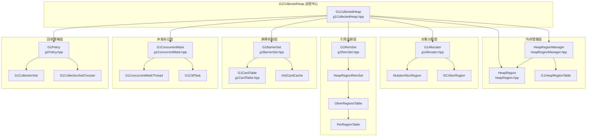

### 1.2 数据流向图

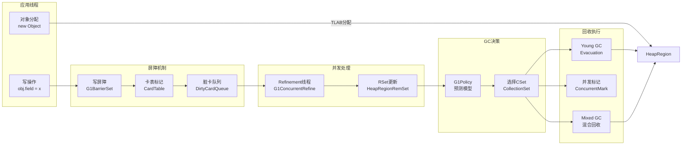

### 1.3 核心组件关系图

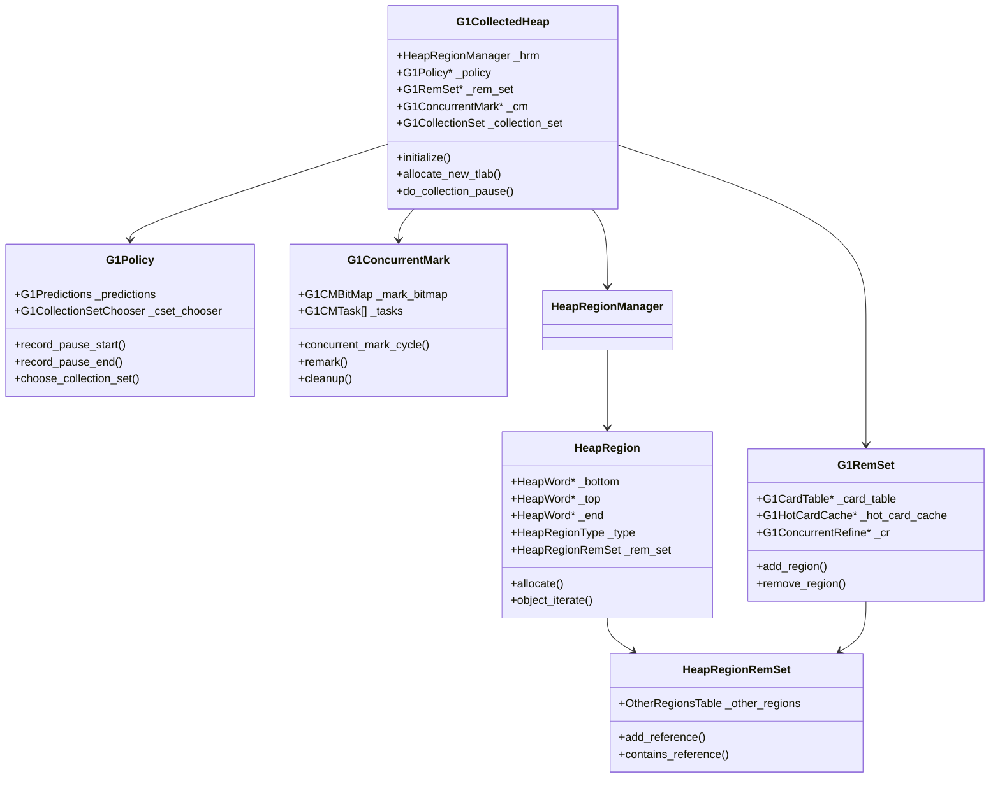

---

## 二、学习路径推荐

### 2.1 初学者路径（按顺序阅读）

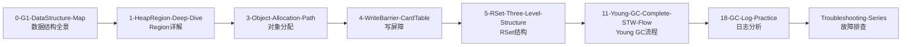

### 2.2 进阶路径（专题深入）

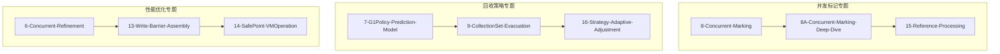

### 2.3 实战路径（问题导向）

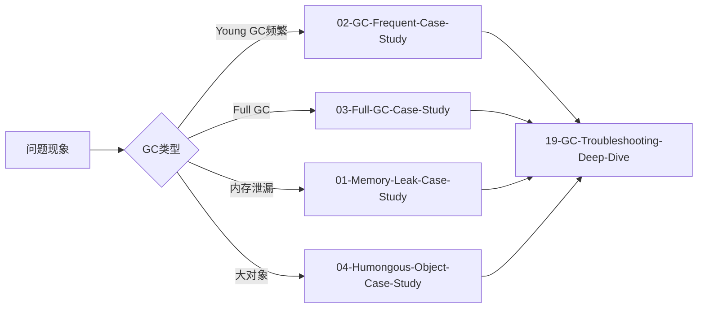

---

## 三、核心概念速查

### 3.1 Region类型与转换

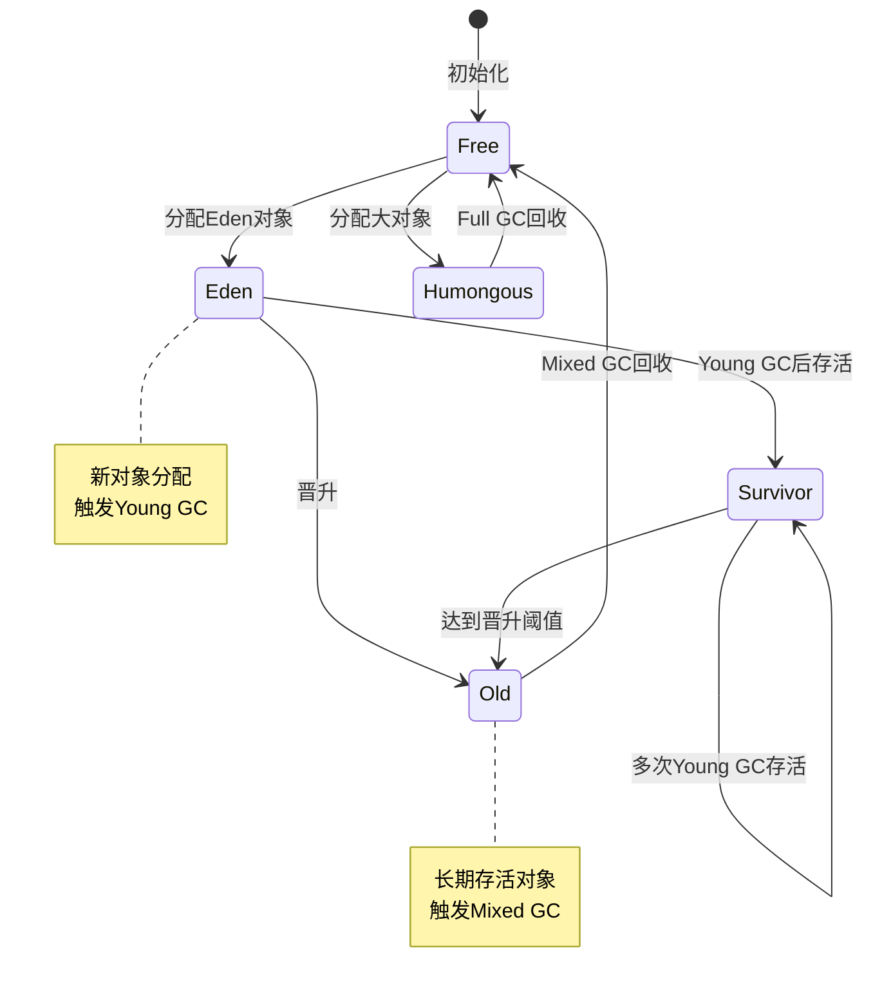

### 3.2 GC触发条件

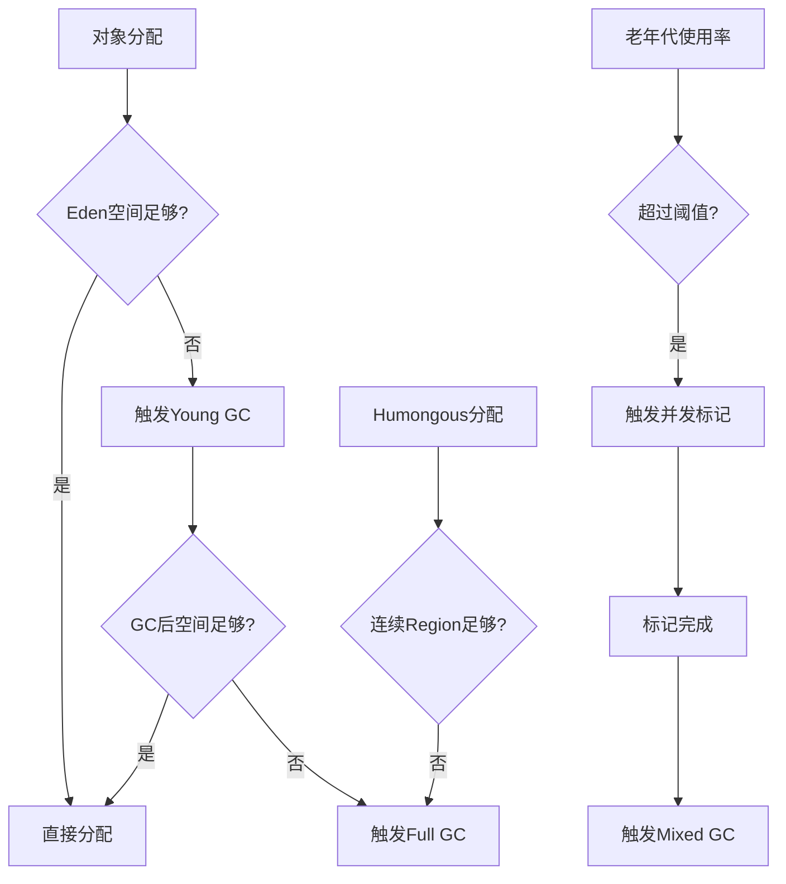

### 3.3 记忆集(RSet)查询流程

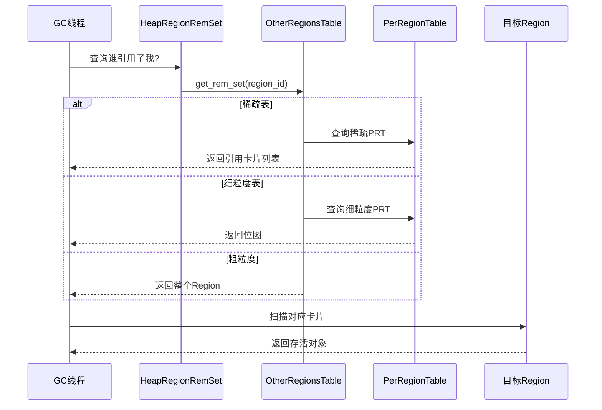

---

## 四、详细内容索引

### 4.1 数据结构层

| 组件 | 核心类 | 文档 | 关键字段 | 大小 |
|------|--------|------|----------|------|
| **Region管理** | HeapRegion | [1-HeapRegion-Deep-Dive](1-HeapRegion-Deep-Dive.md) | `_bottom/_top/_end` | 4MB |
| | HeapRegionManager | [2-HeapRegionManager-Deep-Dive](2-HeapRegionManager-Deep-Dive.md) | `_regions/_free_list` | - |
| | G1HeapRegionTable | [2-HeapRegionManager-Deep-Dive](2-HeapRegionManager-Deep-Dive.md) | `_base/_length` | 16KB |
| **对象分配** | G1Allocator | [3-Object-Allocation-Path](3-Object-Allocation-Path.md) | `_mutator_alloc_regions` | - |
| | MutatorAllocRegion | [3-Object-Allocation-Path](3-Object-Allocation-Path.md) | `_top/_end` | - |
| **引用追踪** | G1RemSet | [12-G1RemSet-Complete-Flow](12-G1RemSet-Complete-Flow.md) | `_card_table/_hot_card_cache` | - |
| | HeapRegionRemSet | [5-RSet-Three-Level-Structure](5-RSet-Three-Level-Structure.md) | `_other_regions` | ~1KB |
| | OtherRegionsTable | [5-RSet-Three-Level-Structure](5-RSet-Three-Level-Structure.md) | `_fine_grain_partitions` | - |
| | PerRegionTable | [5-RSet-Three-Level-Structure](5-RSet-Three-Level-Structure.md) | `_bm/_cards` | ~4KB |

### 4.2 屏障机制层

| 组件 | 核心类 | 文档 | 关键方法 | 触发时机 |
|------|--------|------|----------|----------|
| **写屏障** | G1BarrierSet | [4-WriteBarrier-CardTable](4-WriteBarrier-CardTable.md) | `write_ref_field_pre/post` | 引用字段赋值 |
| | G1CardTable | [4-WriteBarrier-CardTable](4-WriteBarrier-CardTable.md) | `inline_write_ref_field_post` | 标记脏卡 |
| | G1HotCardCache | [6-Concurrent-Refinement](6-Concurrent-Refinement.md) | `insert/flush` | 热点卡缓存 |
| **并发精炼** | G1ConcurrentRefine | [6-Concurrent-Refinement](6-Concurrent-Refinement.md) | `refine_card/concurrent_refine` | 异步处理脏卡 |
| | G1RefineThread | [6-Concurrent-Refinement](6-Concurrent-Refinement.md) | `run_service` | 后台线程 |

### 4.3 并发标记层

| 组件 | 核心类 | 文档 | 关键阶段 | 耗时 |
|------|--------|------|----------|------|
| **并发标记** | G1ConcurrentMark | [8-Concurrent-Marking](8-Concurrent-Marking.md) | `concurrent_mark_cycle` | - |
| | G1CMTask | [8A-Concurrent-Marking-Deep-Dive](8A-Concurrent-Marking-Deep-Dive.md) | `do_marking_step` | - |
| | G1CMBitMap | [8-Concurrent-Marking](8-Concurrent-Marking.md) | `mark/par_mark` | - |
| **阶段详解** | - | [8A-Concurrent-Marking-Deep-Dive](8A-Concurrent-Marking-Deep-Dive.md) | Initial Mark | <10ms |
| | - | - | Root Region Scanning | ~100ms |
| | - | - | Concurrent Mark | 数秒 |
| | - | - | Remark | <100ms |
| | - | - | Cleanup | <10ms |

### 4.4 回收策略层

| 组件 | 核心类 | 文档 | 关键算法 | 参数 |
|------|--------|------|----------|------|
| **策略决策** | G1Policy | [7-G1Policy-Prediction-Model](7-G1Policy-Prediction-Model.md) | `record_pause/revise_young_list` | - |
| | G1Predictions | [7-G1Policy-Prediction-Model](7-G1Policy-Prediction-Model.md) | `predict_xxx` | - |
| **回收集合** | G1CollectionSet | [9-CollectionSet-Evacuation](9-CollectionSet-Evacuation.md) | `add_old_region` | - |
| | G1CollectionSetChooser | [9-CollectionSet-Evacuation](9-CollectionSet-Evacuation.md) | `build/choose` | - |
| **自适应** | G1AdaptivePolicy | [16-Strategy-Adaptive-Adjustment](16-Strategy-Adaptive-Adjustment.md) | `update_xxx` | - |

### 4.5 GC执行层

| GC类型 | 文档 | 触发条件 | 回收范围 | 特点 |
|--------|------|----------|----------|------|
| **Young GC** | [11-Young-GC-Complete-STW-Flow](11-Young-GC-Complete-STW-Flow.md) | Eden满 | Eden+Survivor | STW, 并行 |
| **Mixed GC** | [9-CollectionSet-Evacuation](9-CollectionSet-Evacuation.md) | 标记后 | Eden+部分Old | STW, 并行 |
| **Full GC** | [10-Full-GC](10-Full-GC.md) | 空间不足 | 整个堆 | STW, 单线程 |
| **并发标记** | [8-Concurrent-Marking](8-Concurrent-Marking.md) | 老年代阈值 | 仅标记 | 并发 |

---

## 五、实战案例索引

### 5.1 故障排查系列

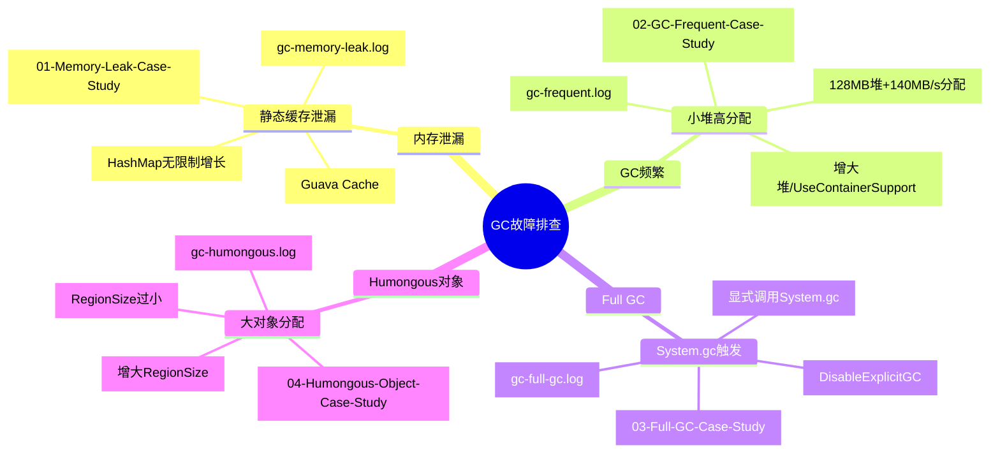

### 5.2 问题诊断决策树

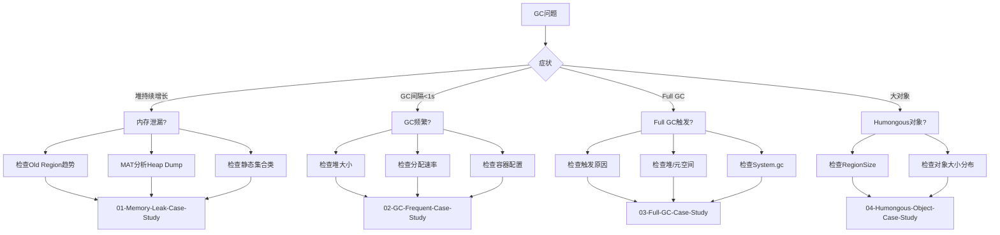

---

## 六、源码对照表

### 6.1 核心源码文件索引

| 功能模块 | 头文件(.hpp) | 实现文件(.cpp) | 行数 | 文档 |
|----------|-------------|---------------|------|------|
| **总控** | g1CollectedHeap | g1CollectedHeap | 3000+ | [0-G1-DataStructure-Map](0-G1-DataStructure-Map.md) |
| **Region** | heapRegion | heapRegion | 1500+ | [1-HeapRegion-Deep-Dive](1-HeapRegion-Deep-Dive.md) |
| **Region管理** | heapRegionManager | heapRegionManager | 800+ | [2-HeapRegionManager-Deep-Dive](2-HeapRegionManager-Deep-Dive.md) |
| **分配器** | g1Allocator | g1Allocator | 600+ | [3-Object-Allocation-Path](3-Object-Allocation-Path.md) |
| **写屏障** | g1BarrierSet | g1BarrierSet | 500+ | [4-WriteBarrier-CardTable](4-WriteBarrier-CardTable.md) |
| **卡表** | g1CardTable | g1CardTable | 400+ | [4-WriteBarrier-CardTable](4-WriteBarrier-CardTable.md) |
| **RSet** | g1RemSet/heapRegionRemSet | g1RemSet | 2000+ | [12-G1RemSet-Complete-Flow](12-G1RemSet-Complete-Flow.md) |
| **并发标记** | g1ConcurrentMark | g1ConcurrentMark | 2500+ | [8-Concurrent-Marking](8-Concurrent-Marking.md) |
| **策略** | g1Policy | g1Policy | 1500+ | [7-G1Policy-Prediction-Model](7-G1Policy-Prediction-Model.md) |
| **CSet** | g1CollectionSet | g1CollectionSet | 800+ | [9-CollectionSet-Evacuation](9-CollectionSet-Evacuation.md) |
| **Young GC** | g1YoungCollector | g1YoungCollector | 1000+ | [11-Young-GC-Complete-STW-Flow](11-Young-GC-Complete-STW-Flow.md) |
| **Full GC** | g1FullCollector | g1FullCollector | 800+ | [10-Full-GC](10-Full-GC.md) |

### 6.2 关键函数调用链

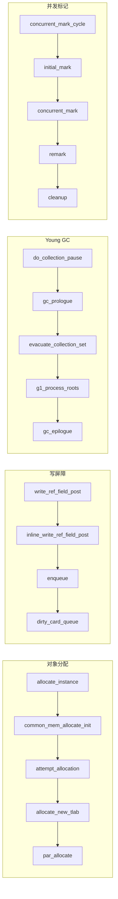

---

## 附录：快速参考

### A. JVM参数速查

```bash
# 基础配置
-Xms8g -Xmx8g                    # 堆内存
-XX:+UseG1GC                     # 使用G1
-XX:MaxGCPauseMillis=100         # 目标停顿时间

# Region配置
-XX:G1HeapRegionSize=4m          # Region大小(1-32m)

# GC日志
-Xlog:gc*:file=gc.log:time,uptime,level,tags

# 问题排查
-XX:+HeapDumpOnOutOfMemoryError
-XX:HeapDumpPath=/path/to/dump.hprof
-XX:+DisableExplicitGC           # 禁止System.gc()
```

### B. GC日志关键模式

```bash
# 查看GC频率
grep "Pause Young\|Pause Full" gc.log | wc -l

# 查看Old Region增长
grep "Old regions" gc.log

# 查看GC耗时分布
grep "Pause Young" gc.log | awk '{print $NF}'

# 统计Full GC次数
grep -c "Pause Full" gc.log
```

---

**文档版本**: 1.0  
**最后更新**: 2026-02-26  
**文档总数**: 24篇  
**总字数**: 约15万字
