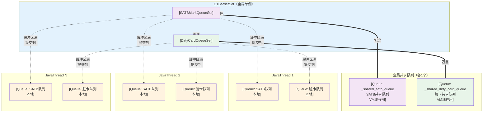
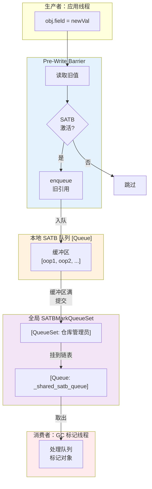
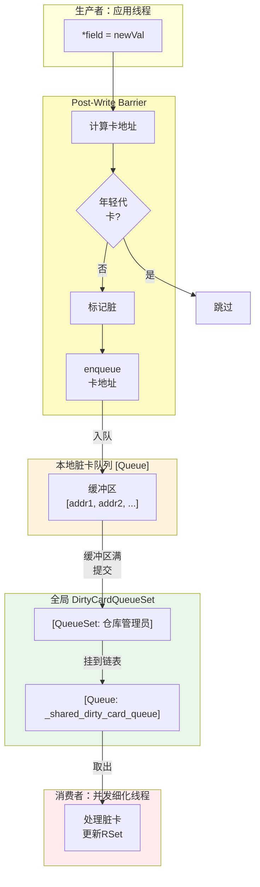
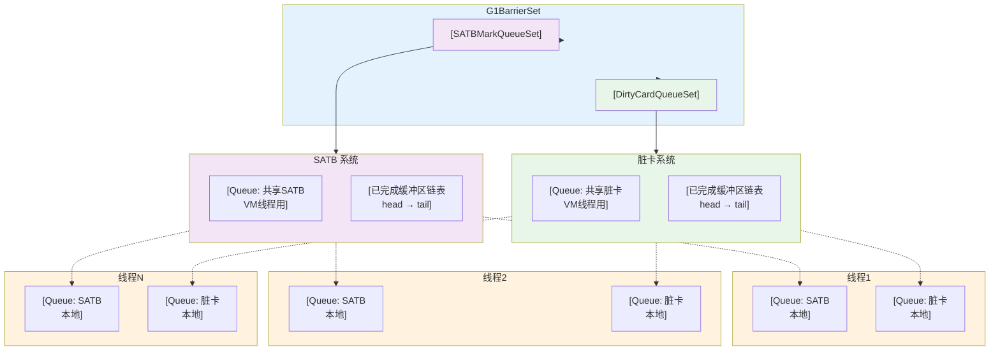
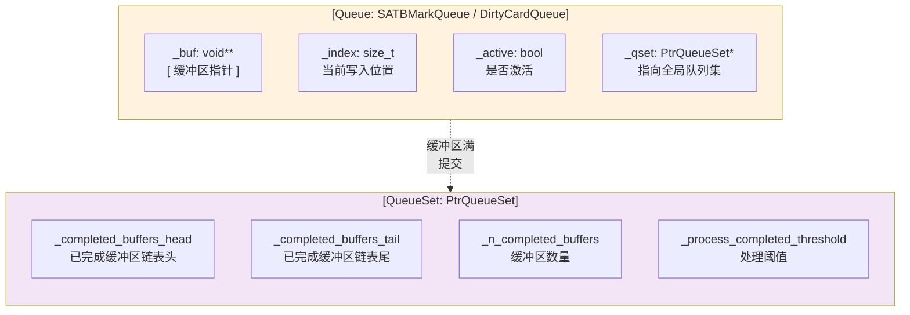

# G1 双队列系统层级图

## 一、整体架构图

## 二、数据流转图

## 三、Post-Write Barrier 数据流转

## 四、完整队列系统图

## 五、队列内部结构

---

## 一句话说明

| 图形 | 含义 |
|------|------|
| `[Queue]` | 具体队列，存储数据 |
| `[QueueSet]` | 队列集，管理多个队列的缓冲区 |
| `===` 粗线 | 包含/管理关系 |
| `-.->` 虚线 | 数据流向（队列满→提交） |