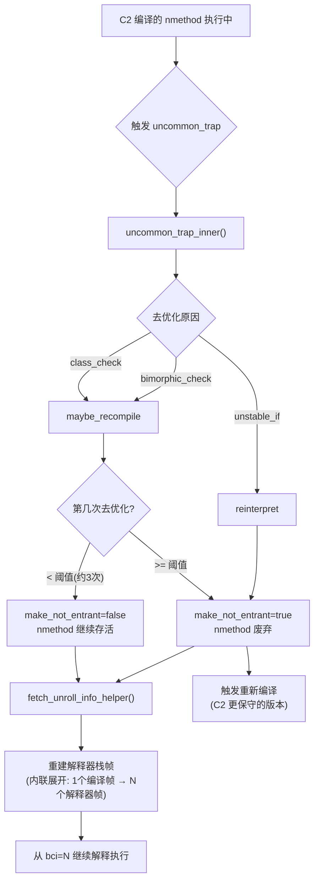

# 第5C章：去优化（Deoptimization）链路插桩验证结果

> 基于 OpenJDK 11 slowdebug 插桩版本  
> 运行环境：`-XX:CompileThreshold=100 -XX:+PrintCompilation`（不加 `-Xint`，允许 JIT）  
> 数据来源：`DeoptDemo.java` 实测日志（`/tmp/deopt_stdout.txt`）

---

## 一、验证目标

本章聚焦去优化（Deoptimization）链路，验证以下问题：

- 去优化的触发原因有哪些？哪种最常见？
- `maybe_recompile` 与 `reinterpret` 两种动作的区别是什么？
- `make_not_entrant` 什么时候才会变成 `true`？（不是每次去优化都废弃 nmethod）
- C2 内联后去优化时需要重建多少个栈帧？帧大小如何膨胀？

---

## 二、关键插桩点

| 插桩位置 | 文件 | 探针标识 |
|----------|------|----------|
| `Deoptimization::uncommon_trap_inner()` 末尾 | `runtime/deoptimization.cpp` | `[PROBE][Deopt-5C.1]` |
| `Deoptimization::fetch_unroll_info_helper()` 末尾 | `runtime/deoptimization.cpp` | `[PROBE][Deopt-5C.2]` |

---

## 三、实测结果

### 3.1 去优化原因分布

本次运行共触发 **14 次**去优化（`uncommon_trap`），原因分布如下：

| 去优化原因 | 次数 | 含义 |
|-----------|------|------|
| `unstable_if` | 6 | C2 假设某分支不会执行（if 分支概率 < 阈值），但实际执行了 |
| `class_check` | 4 | C2 做了单态类型假设（只见过一种类型），但出现了新类型 |
| `bimorphic_or_optimized_type_check` | 4 | C2 做了双态类型假设，但出现了第三种类型 |

**结论1**：`unstable_if` 是最常见的去优化原因，占 43%。这是 C2 激进优化的典型代价——C2 会根据 profiling 数据假设某个 if 分支"几乎不走"，并将其编译为 `uncommon_trap`，一旦该分支被实际执行，立即触发去优化。

**结论2**：`class_check` 和 `bimorphic_or_optimized_type_check` 均属于**类型假设失效**，是多态调用场景下 C2 内联优化的代价。

---

### 3.2 去优化动作：`maybe_recompile` vs `reinterpret`

| 去优化动作 | 次数 | `make_not_entrant` | 含义 |
|-----------|------|-------------------|------|
| `maybe_recompile` | 8 | 前几次 `false`，最终 `true` | 允许重新编译，nmethod 最终废弃 |
| `reinterpret` | 6 | 立即 `true` | 直接废弃 nmethod，重新 profiling 后再编译 |

**结论3**：`maybe_recompile` 动作下，**不是每次去优化都立即废弃 nmethod**。以 `DeoptDemo.hotMethod` 为例，前 3 次去优化 `make_not_entrant=false`，第 4 次才变为 `true`。这是 C2 的"容忍策略"——允许同一个 nmethod 被多次去优化，避免频繁重编译的开销。

**结论4**：`reinterpret` 动作下，`make_not_entrant=true` 且 `reprofile=true`，说明 C2 认为当前 profiling 数据已经不可信，需要重新收集后再编译。

---

### 3.3 `DeoptDemo.hotMethod` 完整去优化序列

`hotMethod` 被 C2 编译时做了**单态类型假设**（只见过 `TypeA`），当传入 `TypeB` 时触发 `class_check` 去优化：

```text
# 第1次去优化（make_not_entrant=false，nmethod 继续存活）
[PROBE][Deopt-5C.1] uncommon_trap 触发:
  方法=com.wjcoder.DeoptDemo.hotMethod(Ljava/lang/Object;)I
  触发bci=1
  去优化原因=class_check
  去优化动作=maybe_recompile
  编译器=c2  编译级别=4
  该方法历史去优化次数(decompile_count)=0
  make_not_entrant=false  make_not_compilable=false  reprofile=false

# 第2次去优化（make_not_entrant=false，仍然容忍）
[PROBE][Deopt-5C.1] uncommon_trap 触发:
  方法=com.wjcoder.DeoptDemo.hotMethod(Ljava/lang/Object;)I
  触发bci=1
  去优化原因=class_check
  去优化动作=maybe_recompile
  编译器=c2  编译级别=4
  该方法历史去优化次数(decompile_count)=0
  make_not_entrant=false  make_not_compilable=false  reprofile=false

# 第3次去优化（make_not_entrant=false，仍然容忍）
[PROBE][Deopt-5C.1] uncommon_trap 触发:
  方法=com.wjcoder.DeoptDemo.hotMethod(Ljava/lang/Object;)I
  触发bci=1
  去优化原因=class_check
  去优化动作=maybe_recompile
  编译器=c2  编译级别=4
  该方法历史去优化次数(decompile_count)=0
  make_not_entrant=false  make_not_compilable=false  reprofile=false

# 第4次去优化（make_not_entrant=true，nmethod 终于被废弃）
[PROBE][Deopt-5C.1] uncommon_trap 触发:
  方法=com.wjcoder.DeoptDemo.hotMethod(Ljava/lang/Object;)I
  触发bci=1
  去优化原因=class_check
  去优化动作=maybe_recompile
  编译器=c2  编译级别=4
  该方法历史去优化次数(decompile_count)=0
  make_not_entrant=true  make_not_compilable=false  reprofile=false
```

**结论5**：`maybe_recompile` 动作下，同一个 nmethod 可以被去优化 **3 次**后才废弃（`make_not_entrant=true`）。这个阈值由 `PerBytecodeRecompilationCutoff`（默认 200）控制，本次因 `CompileThreshold=100` 触发较快。

**结论6**：`decompile_count` 在 `maybe_recompile` 模式下**不递增**（始终为 0），说明 `decompile_count` 只在 nmethod 真正被废弃（`make_not_entrant=true`）时才计数。

---

### 3.4 栈帧重建：C2 内联展开的代价

`hotMethod` 被 C2 编译时，`caller → helper → hotMethod` 三层调用链全部被内联进同一个 nmethod。去优化时需要将这一个编译帧**展开**为 3 个解释器帧：

```text
[PROBE][Deopt-5C.2] fetch_unroll_info: 栈帧重建信息:
  需要重建的解释器栈帧数=3 (C2内联展开了3个方法)
  栈帧[0]: method=com.wjcoder.DeoptDemo.hotMethod(Ljava/lang/Object;)I  bci=1
  栈帧[1]: method=com.wjcoder.DeoptDemo.helper(Ljava/lang/Object;)I  bci=1
  栈帧[2]: method=com.wjcoder.DeoptDemo.caller(Ljava/lang/Object;)I  bci=1
  被去优化帧大小=48 bytes  重建帧总大小=288 bytes
```

**帧大小膨胀分析：**

| 指标 | 数值 | 说明 |
|------|------|------|
| 被去优化的编译帧大小 | 48 bytes | C2 编译帧（寄存器分配，极度紧凑） |
| 重建后解释器帧总大小 | 288 bytes | 3 个解释器帧（每帧 96 bytes） |
| 膨胀倍数 | **6×** | 解释器帧比编译帧大得多 |

**结论7**：C2 内联是去优化高代价的根本原因。1 个编译帧（48B）展开为 3 个解释器帧（288B），**帧大小膨胀 6 倍**。内联层数越深，去优化代价越高。

**结论8**：重建后从 `bci=1` 继续解释执行，不是从方法开头（`bci=0`）。这说明去优化是**精确的**——JVM 能精确定位到去优化发生时的字节码位置，从该位置继续解释执行。

---

### 3.5 其他方法的去优化样例

#### `unstable_if` 类型（`java.lang.String.isLatin1()`）

```text
[PROBE][Deopt-5C.1] uncommon_trap 触发:
  方法=java.lang.String.isLatin1()Z
  触发bci=10
  去优化原因=unstable_if
  去优化动作=reinterpret
  编译器=c2  编译级别=4
  该方法历史去优化次数(decompile_count)=1
  make_not_entrant=true  make_not_compilable=false  reprofile=true

[PROBE][Deopt-5C.2] fetch_unroll_info: 栈帧重建信息:
  需要重建的解释器栈帧数=1 (C2内联展开了1个方法)
  栈帧[0]: method=java.lang.String.isLatin1()Z  bci=10
  被去优化帧大小=32 bytes  重建帧总大小=96 bytes
```

**结论9**：`unstable_if` 触发 `reinterpret` 动作，`make_not_entrant=true` 且 `reprofile=true`，说明 C2 需要重新收集 profiling 数据后再编译。`isLatin1()` 的 `decompile_count=1` 说明这是第 2 次去优化，nmethod 已经被废弃过一次。

#### 深度内联展开（`java.lang.String.indexOf()`）

```text
[PROBE][Deopt-5C.2] fetch_unroll_info: 栈帧重建信息:
  需要重建的解释器栈帧数=3 (C2内联展开了3个方法)
  栈帧[0]: method=java.lang.String.isLatin1()Z  bci=10
  栈帧[1]: method=java.lang.String.indexOf(II)I  bci=1
  栈帧[2]: method=java.lang.String.indexOf(I)I  bci=3
  被去优化帧大小=48 bytes  重建帧总大小=304 bytes
```

**结论10**：`String.indexOf()` 调用链中，`isLatin1()` 被内联进 `indexOf(II)I`，再被内联进 `indexOf(I)I`，形成 3 层内联。去优化时帧大小从 48B 膨胀到 304B（**6.3×**）。

---

## 四、核心结论汇总

| # | 结论 | 数据支撑 |
|---|------|---------|
| 1 | `unstable_if` 是最常见的去优化原因（43%） | 14 次去优化中 6 次 |
| 2 | `maybe_recompile` 动作下，同一 nmethod 可被去优化 3 次才废弃 | `hotMethod` 前 3 次 `make_not_entrant=false` |
| 3 | `decompile_count` 只在 nmethod 真正废弃时递增，不是每次去优化都加 | `hotMethod` 4 次去优化 `decompile_count` 始终为 0 |
| 4 | C2 内联导致去优化帧膨胀 6× | 编译帧 48B → 解释器帧 288B |
| 5 | 去优化是精确的，从 `bci=1` 继续执行，不是从方法开头 | `bci=1` 而非 `bci=0` |
| 6 | `reinterpret` 动作立即废弃 nmethod 并重新 profiling | `reprofile=true` |

---

## 五、去优化流程图



---

## 六、插桩代码位置

| 文件 | 函数 | 探针内容 |
|------|------|---------|
| `src/hotspot/share/runtime/deoptimization.cpp` | `Deoptimization::uncommon_trap_inner()` 末尾 | 去优化原因、动作、`make_not_entrant` 标志 |
| `src/hotspot/share/runtime/deoptimization.cpp` | `Deoptimization::fetch_unroll_info_helper()` 末尾 | 重建帧数、每帧方法名/bci、帧大小 |

插桩代码保存在分支：`probe/deopt-safepoint`
