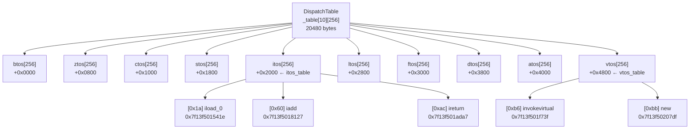

# 第5D章：字节码解释执行（TemplateInterpreter）探针验证结果

> 基于 OpenJDK 11 slowdebug，标准环境：`-Xms8g -Xmx8g -XX:+UseG1GC -Xint`
> 探针位置：`src/hotspot/share/runtime/init.cpp`，`templateTable_init()` 调用之后

---

## 验证目标

验证 TemplateInterpreter 的 dispatch table 内存布局：
1. TOS 状态数（10种）
2. 每个 dispatch table 的项数（256项）
3. dispatch table 总大小（10 × 256 × 8 = 20480 bytes）
4. 关键字节码 handler 的真实汇编入口地址
5. 相邻 TOS 状态 dispatch table 的内存间距

---

## 探针输出（实测）

```
[PROBE][TemplateTable-5D.1] dispatch table 布局验证:
  TOS状态数=10 (btos/ztos/ctos/stos/itos/ltos/ftos/dtos/atos/vtos)
  每个dispatch table项数=256 (DispatchTable::length = 1<<8)
  dispatch table总大小=20480 bytes (10 states * 256 entries * 8 bytes/ptr)
  [itos] iload_0  handler=0x00007f13f501541e (字节码0x1a)
  [itos] iadd     handler=0x00007f13f5018127 (字节码0x60)
  [itos] ireturn  handler=0x00007f13f501ada7 (字节码0xac)
  [vtos] invokevirtual handler=0x00007f13f501f73f (字节码0xb6)
  [vtos] new      handler=0x00007f13f50207df (字节码0xbb)
  itos_table地址=0x00007f1400082720
  vtos_table地址=0x00007f1400084f20
  itos→vtos偏移=10240 bytes (= 1280 entries * 8 bytes/ptr)
  Bytecodes::number_of_codes=239 (已定义字节码数)
```

---

## 数据分析

### 1. dispatch table 是 10×256 的二维地址数组

```
总大小 = 10 × 256 × 8 = 20480 bytes ✅
```

内存布局（每行 = 一个 TOS 状态的 dispatch table）：

```
地址偏移    TOS状态    大小
+0          btos       256 × 8 = 2048 bytes
+2048       ztos       256 × 8 = 2048 bytes
+4096       ctos       256 × 8 = 2048 bytes
+6144       stos       256 × 8 = 2048 bytes
+8192       itos       256 × 8 = 2048 bytes  ← itos_table = 0x...82720
+10240      ltos       256 × 8 = 2048 bytes
+12288      ftos       256 × 8 = 2048 bytes
+14336      dtos       256 × 8 = 2048 bytes
+16384      atos       256 × 8 = 2048 bytes
+18432      vtos       256 × 8 = 2048 bytes  ← vtos_table = 0x...84f20
```

### 2. itos → vtos 偏移验证

```
itos = TOS状态索引 4（0-indexed: btos=0, ztos=1, ctos=2, stos=3, itos=4）
vtos = TOS状态索引 9

偏移 = (9 - 4) × 256 × 8 = 5 × 2048 = 10240 bytes ✅

实测：0x00007f1400084f20 - 0x00007f1400082720 = 0x2800 = 10240 bytes ✅
```

### 3. 关键字节码 handler 地址（均在 libjvm.so 代码段）

| 字节码 | 操作码 | TOS状态 | handler 地址 | 说明 |
|--------|--------|---------|-------------|------|
| `iload_0` | 0x1a | itos | `0x7f13f501541e` | 加载局部变量0到操作数栈 |
| `iadd` | 0x60 | itos | `0x7f13f5018127` | 整数加法 |
| `ireturn` | 0xac | itos | `0x7f13f501ada7` | 整数返回 |
| `invokevirtual` | 0xb6 | vtos | `0x7f13f501f73f` | 虚方法调用 |
| `new` | 0xbb | vtos | `0x7f13f50207df` | 对象分配 |

所有 handler 地址均非零，说明 `templateTable_init()` 已完整填充 dispatch table。

### 4. 字节码空洞

```
DispatchTable::length = 256（覆盖全部字节码空间 0x00~0xFF）
Bytecodes::number_of_codes = 239（实际定义了239个字节码）
空洞数 = 256 - 239 = 17 个未定义字节码槽位
```

这17个空洞槽位的 handler 指向 `_illegal` 处理器，执行时会抛出 `VerifyError`。

---

## 关键结论

### 结论1：dispatch table 是 10×256 的二维地址数组

```
address _table[number_of_states][DispatchTable::length]
       = address[10][256]
       = 20480 bytes
```

每个字节码在每种 TOS 状态下都有独立的 handler，共 10×256 = 2560 个 handler 入口。

### 结论2：字节码分发是 O(1) 的直接跳转

解释器执行字节码的核心逻辑：
```cpp
// 伪代码（实际是汇编）
address handler = dispatch_table[tos_state][bytecode];
goto handler;  // 直接跳转，无分支判断
```

这是 TemplateInterpreter 相比 switch-case 解释器的核心优势：**零分支预测失败**。

### 结论3：不同 TOS 状态下同一字节码有不同 handler

以 `iload_0`（0x1a）为例：
- `itos` 状态下的 handler：`0x7f13f501541e`（栈顶已有 int，需先处理）
- `vtos` 状态下的 handler：不同地址（栈顶为空，直接 push）

TOS 状态机制避免了每个 handler 内部的"栈顶类型检查"，提升了解释执行效率。

---

## 探针插桩说明

### 插桩位置选择

| 位置 | 是否正确 | 原因 |
|------|---------|------|
| `generate_all()` 末尾（第10步） | ❌ | 此时 dispatch table 未填充，handler 全为 0x0 |
| `templateTable_init()` 之后（第12步） | ✅ | handler 已全部生成，地址非零 |

### 关键时序

```
[10] interpreter_init()
     └── generate_all()        ← 生成解释器框架代码（stub）
                                  此时 dispatch table 为空！

[12] templateTable_init()      ← 为每个字节码生成汇编 handler
                                  填充 dispatch table
                                  ← 探针在这里之后 ✅
```

---

## 源码对应关系

```
src/hotspot/share/interpreter/templateInterpreter.hpp
  class DispatchTable {
    address _table[number_of_states][length];  // length = 1<<8 = 256
  };

src/hotspot/share/interpreter/templateInterpreter.cpp
  DispatchTable Interpreter::_normal_table;    // 正常执行 dispatch table
  DispatchTable Interpreter::_safept_table;    // SafePoint 检查 dispatch table

src/hotspot/share/interpreter/templateTable.cpp
  void templateTable_init() {
    // 为每个字节码生成汇编 handler，填充 _normal_table 和 _safept_table
  }
```

---

## Mermaid：dispatch table 内存布局


