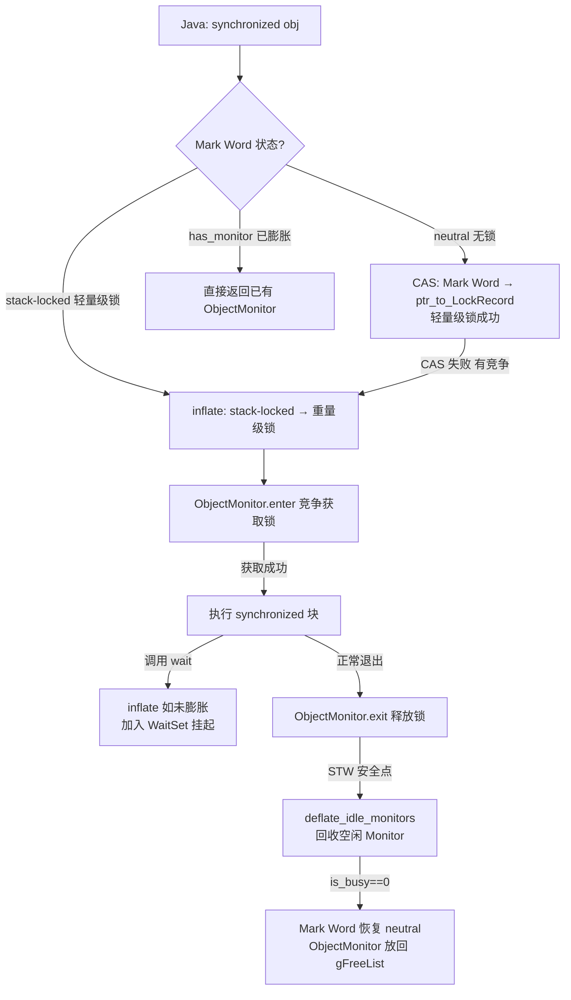
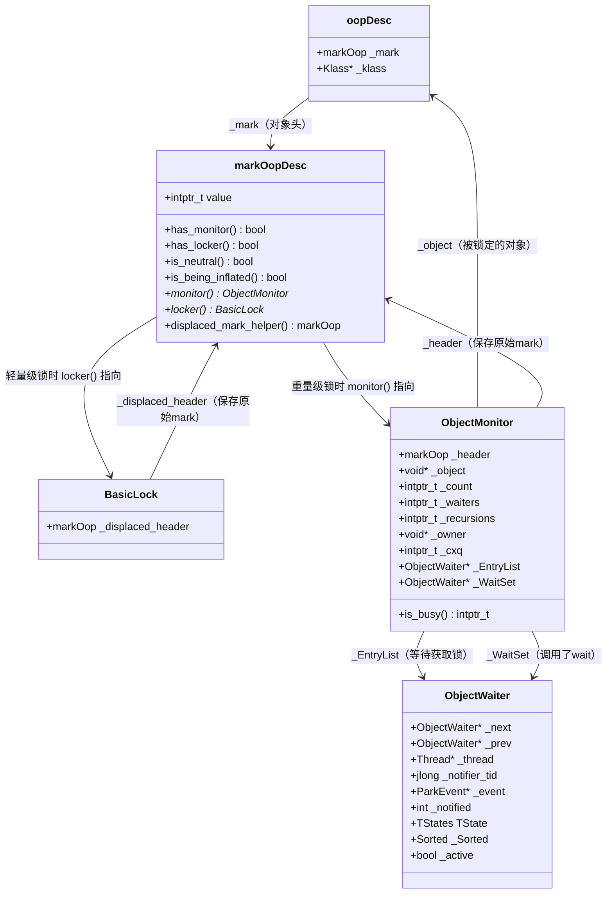

# 第 7 章：同步机制深度分析（synchronized / inflate / deflate）

> 基于 OpenJDK 11 源码分析  
> 标准环境：`-Xms8g -Xmx8g -XX:+UseG1GC -Xint -XX:-UseBiasedLocking`  
> 方法论：程序 = 数据结构 + 算法

---

## 第 0 部分：核心原理 ⭐

### 0.1 本质是什么？

`synchronized` 的本质是**对象头 Mark Word 的状态机**。JVM 通过修改对象头中的 Mark Word（8字节）来实现从无锁 → 轻量级锁 → 重量级锁的升级，以及从重量级锁 → 无锁的降级（deflate）。

### 0.2 为什么需要锁膨胀？

**根本问题**：操作系统的 mutex（互斥锁）代价极高（需要系统调用，线程挂起/唤醒耗时微秒级），但大多数 `synchronized` 块实际上**没有竞争**（单线程或极少竞争）。

**解决思路**：分层设计——
- **无竞争**：用 CAS 修改 Mark Word（轻量级锁），完全在用户态，纳秒级
- **有竞争**：膨胀为重量级锁（ObjectMonitor），使用 OS mutex，微秒级
- **调用 wait()**：必须膨胀为重量级锁（wait 需要 WaitSet 队列，只有 ObjectMonitor 有）

### 0.3 怎么解决？

**inflate（膨胀）**：当需要重量级锁时，`inflate()` 函数从全局空闲链表 `gFreeList` 取一个 ObjectMonitor，把对象的 Mark Word 改为指向它的指针（低2位=10）。

**deflate（收缩）**：每次 STW 安全点时，`deflate_idle_monitors()` 扫描所有 ObjectMonitor，对完全空闲的（`is_busy()==0`）执行 deflate：把 inflate 前保存的原始 Mark Word 写回对象头，ObjectMonitor 放回 `gFreeList` 复用。

### 0.4 为什么这样设计？

| 设计决策 | 理由 |
|---------|------|
| 用 Mark Word 低2位表示锁状态 | 对象头本来就有，不需要额外空间；CAS 修改是原子的 |
| 轻量级锁用栈帧 Lock Record | 无需堆分配，线程退出时自动释放，零开销 |
| 重量级锁用 ObjectMonitor 池 | 创建代价高，复用比重建快；gFreeList 避免频繁 malloc |
| deflate 只在 STW 时执行 | 修改 Mark Word 是非原子多步操作，必须在所有 mutator 停止时才安全 |
| wait() 强制膨胀 | wait 需要 WaitSet 队列存放等待线程，轻量级锁没有这个结构 |

---

## 第 1 部分：数据结构全景

### 1.1 数据结构清单

| 结构名 | 源码位置 | 核心作用 |
|--------|----------|----------|
| `markOop` / `markOopDesc` | `oops/markOop.hpp` | 对象头 Mark Word，8字节，编码锁状态 |
| `BasicLock` | `runtime/basicLock.hpp` | 轻量级锁的栈帧 Lock Record，保存 displaced header |
| `ObjectMonitor` | `runtime/objectMonitor.hpp` | 重量级锁的核心结构，包含 owner/EntryList/WaitSet |

---

### 1.2 markOop / markOopDesc

#### 1.2.1 Mark Word 值域图（64位 JVM）

```
64位 Mark Word 的编码（低2位是锁状态标志）：

无锁（neutral）：
  [hashCode(31)|unused(1)|age(4)|biased_lock(0)|lock(01)]
   63          32        28    24              2  1  0

轻量级锁（stack-locked）：
  [ptr_to_lock_record(62)                              |lock(00)]
   63                                                  2  1  0

重量级锁（inflated）：
  [ptr_to_ObjectMonitor(62)                            |lock(10)]
   63                                                  2  1  0

膨胀中（INFLATING）：
  [0000...0000                                         |lock(00)]
  （全0，是唯一一个低2位=00但不是轻量级锁的特殊值）

GC 标记（marked）：
  [ptr_to_forwarding(62)                               |lock(11)]
```

**关键判断方法（`markOop.hpp`）：**

```cpp
// monitor_value = 2（二进制 10），第1位为1即表示重量级锁
bool has_monitor()       const { return ((value() & monitor_value) != 0); }  // 低2位含10
// locked_value = 0（二进制 00），低2位全0即轻量级锁
bool has_locker()        const { return ((value() & lock_mask_in_place) == locked_value); }  // 低2位=00
// biased_lock_mask_in_place 覆盖低3位，unlocked_value=1（001）
bool is_neutral()        const { return (mask_bits(value(), biased_lock_mask_in_place) == unlocked_value); }  // 低3位=001
bool is_being_inflated() const { return (value() == 0); }  // 全0（INFLATING 标志）
```

#### 1.2.2 sizeof 与内存布局

- `sizeof(markOop)` = 8 字节（64位指针大小）
- 位于对象头的第一个字（`oopDesc::_mark`，偏移 0）

#### 1.2.3 创建位置

- 对象分配时由 `CollectedHeap::post_allocation_setup_obj()` 初始化
- 关闭偏向锁（`-XX:-UseBiasedLocking`）时初始值为 `0x0000000000000001`（neutral，低3位=001）

---

### 1.3 BasicLock（轻量级锁 Lock Record）

#### 1.3.1 字段列表

```cpp
// runtime/basicLock.hpp
class BasicLock {
  volatile markOop _displaced_header;  // 保存对象原始 Mark Word（inflate 时需要取回）
};
```

#### 1.3.2 sizeof 与内存布局

- `sizeof(BasicLock)` = 8 字节（一个指针大小）
- 分配在**持锁线程的 Java 栈帧**中（Lock Record），不在堆上

#### 1.3.3 关键字段生命周期

- `_displaced_header`：
  - **谁设置**：`InterpreterRuntime::monitorenter()` 或 `MacroAssembler::lock_object()`
  - **何时设置**：CAS 成功将 Mark Word 改为指向 Lock Record 时，同时把原始 Mark Word 存入 `_displaced_header`
  - **设置什么值**：对象原始的 neutral Mark Word（含 hashCode、age）
  - **谁读取**：`inflate()` 函数在 stack-locked 分支中，通过 `mark->displaced_mark_helper()` 读取，存入 ObjectMonitor 的 `_header` 字段

---

### 1.4 ObjectMonitor

#### 1.4.1 字段列表

```cpp
// runtime/objectMonitor.hpp
class ObjectMonitor {
  // ★ 注意：_header 必须在偏移0处（markOop 存储要求）
  volatile markOop   _header;       // 保存 inflate 前的原始 Mark Word（deflate 时写回）
  void*     volatile _object;       // 指向被锁定的 Java 对象（反向指针）
  ObjectMonitor*     FreeNext;      // 空闲链表链接（在 gFreeList / omFreeList 中使用）
  // ★ 缓存行填充：DEFINE_PAD_MINUS_SIZE(0, DEFAULT_CACHE_LINE_SIZE, ...)
  //   将 _header/_object/FreeNext 与 _owner 隔开，避免 false sharing
  // --- 缓存行边界 ---
  void *  volatile _owner;          // 当前持有锁的线程（JavaThread* 或 BasicLock*），NULL=无人持有
  volatile jlong   _previous_owner_tid;  // 上一个持有者的线程 ID（调试用）
  volatile intptr_t _recursions;    // 重入次数（同一线程重复 synchronized 的次数）
  ObjectWaiter * volatile _EntryList; // 等待获取锁的线程队列（FIFO，从 _cxq 迁移过来）
  ObjectWaiter * volatile _cxq;     // 刚到达的竞争线程队列（LIFO 栈，新线程入队头）
  Thread * volatile  _succ;         // 继承者线程（优化：减少不必要的唤醒）
  Thread * volatile  _Responsible;  // 负责定时唤醒的线程（防止饥饿）
  volatile int       _Spinner;      // exit→spinner 切换优化标志
  volatile int       _SpinDuration; // 自旋时长控制（动态调整）
  volatile jint      _count;        // 引用计数（防止 deflate 时被回收）
  ObjectWaiter * volatile _WaitSet; // 调用了 wait() 的线程集合（等待 notify() 唤醒）
  volatile jint      _waiters;      // 调用了 wait() 的线程数
  volatile int       _WaitSetLock;  // 保护 _WaitSet 的自旋锁
};
```

#### 1.4.2 sizeof 与内存布局

- `sizeof(ObjectMonitor)` ≈ 160 字节（含缓存行填充）
- 从全局空闲链表 `gFreeList` 分配，不在 Java 堆上

#### 1.4.3 创建位置

- JVM 启动时预分配一批，放入 `gFreeList`
- `omAlloc(Thread* Self)` 从线程私有列表或全局 `gFreeList` 取一个
- `omRelease()` 归还到线程私有列表

#### 1.4.4 关键字段生命周期

| 字段 | 谁设置 | 何时设置 | 设置什么值 | 谁读取 |
|------|--------|---------|-----------|--------|
| `_header` | `inflate()` | stack-locked 分支：`m->set_header(dmw)`；neutral 分支：`m->set_header(mark)` | 对象原始 neutral Mark Word | `deflate_monitor()` 写回对象头 |
| `_owner` | `inflate()` | stack-locked 分支：`m->set_owner(mark->locker())`；neutral 分支：`m->set_owner(NULL)` | **stack-locked 分支设为 Lock Record 地址**（BasicLock*），neutral 分支设为 NULL | `ObjectMonitor::enter()` 竞争时读取 |
| `_recursions` | `ObjectMonitor::enter()` | 重入时 `_recursions++` | 重入次数 | `ObjectMonitor::exit()` 减计数 |
| `_WaitSet` | `ObjectMonitor::wait()` | 线程调用 wait() 时加入 | ObjectWaiter 链表 | `ObjectMonitor::notify()` 唤醒 |
| `_EntryList` | `ObjectMonitor::exit()` | 释放锁时从 `_cxq` 迁移 | ObjectWaiter 链表 | `ObjectMonitor::exit()` 选择继承者 |

#### 1.4.5 `is_busy()` 判断（deflate 的核心条件）

```cpp
// objectMonitor.hpp:239
intptr_t is_busy() const {
    // 5个字段全部为0/NULL才能 deflate
    return _count|_waiters|intptr_t(_owner)|intptr_t(_cxq)|intptr_t(_EntryList);
}
```

---

## 第 2 部分：算法/流程分析

### 2.1 核心流程概览



---

### 2.2 inflate() 函数详解

#### 2.2.1 解决什么问题？

将对象从轻量级锁（stack-locked）或无锁（neutral）状态**膨胀**为重量级锁，返回对应的 ObjectMonitor。

#### 2.2.2 函数签名与位置

```cpp
// synchronizer.cpp:1390
ObjectMonitor* ObjectSynchronizer::inflate(Thread* Self,
                                           oop object,
                                           const InflateCause cause)
```

**inflate 原因枚举（`inflate_cause_name()`）：**

| cause | 触发场景 |
|-------|---------|
| `Monitor Wait` | 调用 `object.wait()` |
| `Monitor Enter` | 竞争进入 `synchronized` 块 |
| `Monitor Notify` | 调用 `object.notify()` |
| `VM Internal` | JVM 内部操作（如 GC、类加载） |

#### 2.2.3 inflate 的四个 CASE 分支

```cpp
// synchronizer.cpp:1410（inflate 函数内部 for 循环）
for (;;) {
    const markOop mark = object->mark();

    // CASE 1: 已膨胀 → 直接返回
    if (mark->has_monitor()) {
        ObjectMonitor* inf = mark->monitor();
        return inf;  // ★ 最快路径，O(1)
    }

    // CASE 2: 膨胀中（INFLATING=0）→ 自旋等待
    // 另一个线程正在膨胀，当前线程自旋等待完成
    if (mark == markOopDesc::INFLATING()) {
        ReadStableMark(object);  // 自旋/yield/park
        continue;
    }

    // CASE 3: 轻量级锁（stack-locked）→ 膨胀为重量级锁
    if (mark->has_locker()) {
        ObjectMonitor* m = omAlloc(Self);  // 从 gFreeList 取一个 ObjectMonitor
        m->Recycle();
        m->_recursions = 0;

        // ★ 关键：先 CAS 写入 INFLATING(0)，阻止其他线程并发膨胀
        markOop cmp = object->cas_set_mark(markOopDesc::INFLATING(), mark);
        if (cmp != mark) {
            omRelease(Self, m, true);
            continue;  // CAS 失败，重试
        }

        // ★ 从 Lock Record 取回原始 Mark Word（含 hashCode）
        markOop dmw = mark->displaced_mark_helper();
        m->set_header(dmw);           // 保存原始 Mark Word，deflate 时写回
        m->set_owner(mark->locker()); // 设置 owner = 当前持锁线程
        m->set_object(object);

        // ★ 原子写入 ObjectMonitor 地址，完成膨胀
        object->release_set_mark(markOopDesc::encode(m));
        return m;
    }

    // CASE 4: neutral（无锁）→ 膨胀为重量级锁
    assert(mark->is_neutral(), "invariant");
    ObjectMonitor* m = omAlloc(Self);
    m->Recycle();
    m->set_header(mark);    // 保存原始 Mark Word
    m->set_owner(NULL);     // ★ neutral 状态无人持有，owner=NULL
    m->set_object(object);
    m->_recursions = 0;

    // ★ CAS 直接写入 ObjectMonitor 地址（不需要 INFLATING 中间状态）
    if (object->cas_set_mark(markOopDesc::encode(m), mark) != mark) {
        omRelease(Self, m, true);
        continue;  // CAS 失败，重试
    }
    return m;
}
```

**设计决策：为什么 stack-locked 分支需要 INFLATING(0) 中间状态，而 neutral 分支不需要？**

- **stack-locked 分支**：需要从 Lock Record 读取 displaced header，这是一个多步操作（读取 → 设置 header → 设置 owner → 写入 mark）。在此期间，持锁线程可能尝试解锁（CAS 把 displaced header 写回对象头），会与膨胀操作冲突。INFLATING(0) 作为"正在膨胀"的标志，让持锁线程的解锁 CAS 失败，从而等待膨胀完成。
- **neutral 分支**：无人持有锁，不存在并发解锁的问题，可以直接 CAS 写入 ObjectMonitor 地址。

---

### 2.3 deflate_monitor() 函数详解

#### 2.3.1 解决什么问题？

在 STW 安全点时，将**完全空闲**的 ObjectMonitor 回收，把对象 Mark Word 恢复为无锁状态。

#### 2.3.2 函数签名与位置

```cpp
// synchronizer.cpp:1670（行号已源码验证）
bool ObjectSynchronizer::deflate_monitor(ObjectMonitor* mid, oop obj,
                                          ObjectMonitor** freeHeadp,
                                          ObjectMonitor** freeTailp)
```

#### 2.3.3 核心逻辑

```cpp
// synchronizer.cpp:1670
bool ObjectSynchronizer::deflate_monitor(ObjectMonitor* mid, oop obj, ...) {
    bool deflated = false;

    // ★ 核心判断：monitor 是否完全空闲？
    // _count|_waiters|_owner|_cxq|_EntryList 全部为0才能 deflate
    if (mid->is_busy()) {
        deflated = false;  // 还在用，跳过
    } else {
        // ★ 关键操作：把 inflate 前保存的原始 Mark Word 写回对象头
        // mid->header() 就是 inflate 时存入的 _header 字段（原始 neutral Mark Word）
        obj->release_set_mark(mid->header());

        // 清空 ObjectMonitor 所有字段
        mid->clear();

        // 把 ObjectMonitor 放回全局空闲链表 gFreeList（复用，不销毁）
        // ... 链表操作 ...
        deflated = true;
    }
    return deflated;
}
```

#### 2.3.4 触发时机

```cpp
// safepoint.cpp:704（SafepointSynchronize::do_cleanup_tasks 的 work() 中）
// 每次 STW 安全点（GC、类重定义等）都会调用
ObjectSynchronizer::deflate_idle_monitors(_counters);
```

---

## 第 3 部分：插桩验证

### 3.1 插桩位置

| 探针 ID | 位置 | 记录内容 |
|---------|------|---------|
| `[PROBE][Sync-7.1]` | `inflate()` 入口（`synchronizer.cpp:1399`） | inflate 序号、cause、对象类型、膨胀前 Mark Word 状态 |
| `[PROBE][Sync-7.2]` | `inflate()` 末尾（stack-locked 和 neutral 两个分支） | ObjectMonitor 地址、owner、recursions、膨胀后 Mark Word |

### 3.2 运行命令

```bash
/data/workspace/openjdk-cut-new/build/linux-x86_64-normal-server-slowdebug/jdk/bin/java \
    -Xms8g -Xmx8g -XX:+UseG1GC -Xint \
    -XX:-UseBiasedLocking \
    -cp /data/workspace/demo/src \
    com.wjcoder.Main \
    2>&1 | grep -A5 "\[PROBE\]\[Sync"
```

**为什么加 `-XX:-UseBiasedLocking`：**
- 关闭偏向锁后，对象初始 Mark Word 直接是 neutral（低3位=001）
- `inflate()` 入口有 `assert(!mark->has_bias_pattern(), "invariant")`，偏向锁状态根本不会进入 inflate
- 结果更干净，直接看到 neutral/stack-locked → 重量级锁的路径

### 3.3 实际输出（已验证）

```
[PROBE][Sync-7.1] inflate #1: cause=Monitor Wait
  对象类型=[I
  膨胀前 mark=0x00007fbf41ffe2f8 状态=轻量级锁(stack-locked)
[PROBE][Sync-7.2] inflate完成(stack-locked→重量级) #1:
  ObjectMonitor@0x00007fbf28003080
  _owner=0x00007fbf41ffe2f8 (当前持有者)
  _recursions=0 (重入次数)
  膨胀后 mark=0x00007fbf28003082 (低2位=10=重量级锁)

[PROBE][Sync-7.1] inflate #2: cause=Monitor Enter
  对象类型=[I
  膨胀前 mark=0x00007fbf28003082 状态=已膨胀(重量级锁)

[PROBE][Sync-7.1] inflate #6: cause=Monitor Wait
  对象类型=java/lang/Object
  膨胀前 mark=0x00007fbf41efe7a0 状态=轻量级锁(stack-locked)
[PROBE][Sync-7.2] inflate完成(stack-locked→重量级) #6:
  ObjectMonitor@0x00007fbf28005080
  _owner=0x00007fbf41efe7a0 (当前持有者)
  _recursions=0 (重入次数)
  膨胀后 mark=0x00007fbf28005082 (低2位=10=重量级锁)
```

### 3.4 验证结论

**结论1：`wait()` 是 inflate 的第一触发者**

inflate #1 和 #6 都是 `cause=Monitor Wait`，且膨胀前状态都是 `轻量级锁(stack-locked)`。说明：
- 单线程 `synchronized` 块不会触发 inflate（只是轻量级锁）
- 调用 `wait()` 时，JVM 强制膨胀为重量级锁（因为 wait 需要 WaitSet 队列）

**结论2：膨胀是一次性的**

inflate #2、#3、#4、#5 的膨胀前状态都是 `已膨胀(重量级锁)`，说明：
- 一旦膨胀为重量级锁，后续所有 inflate 调用都直接返回已有的 ObjectMonitor（CASE 1 快速路径）
- 重量级锁不会自动降级回轻量级锁

**结论3：Mark Word 低2位是锁状态标志**

| inflate# | 膨胀前 mark | 低2位 | 状态 |
|----------|------------|-------|------|
| #1 | `0x00007fbf41ffe2f8` | `00` | 轻量级锁（ptr to Lock Record） |
| #1 后 | `0x00007fbf28003082` | `10` | 重量级锁（ptr to ObjectMonitor） |
| #2 | `0x00007fbf28003082` | `10` | 已膨胀，直接返回 |

**结论4：`_owner` 指向 Lock Record 地址（不是线程对象）**

inflate #1 的 `_owner=0x00007fbf41ffe2f8` 与 `膨胀前 mark=0x00007fbf41ffe2f8` 完全相同！

这验证了 `inflate()` 的 stack-locked 分支代码：
```cpp
m->set_owner(mark->locker());  // locker() 返回 Lock Record 地址
```
inflate 时 `_owner` 被设置为 Lock Record 的地址（栈上的 BasicLock），而不是 JavaThread 对象。

---

## 第 4 部分：数据结构关系图



---

## 第 5 部分：总结

### 5.1 数据结构层面

| 结构 | 核心特征 |
|------|---------|
| `markOop` | 8字节，低2位编码锁状态（01=无锁，00=轻量级，10=重量级），是整个锁机制的枢纽 |
| `BasicLock` | 8字节，分配在 Java 栈帧，保存 displaced header，线程退出自动释放 |
| `ObjectMonitor` | ~160字节，从 gFreeList 分配，包含 owner/EntryList/WaitSet，是重量级锁的完整实现 |

### 5.2 算法层面

| 算法 | 核心设计决策 |
|------|------------|
| `inflate()` | 4个 CASE 分支（已膨胀/膨胀中/轻量级/无锁）；stack-locked 分支用 INFLATING(0) 防止并发解锁冲突 |
| `deflate_monitor()` | `is_busy()` 5字段全为0才能 deflate；把 `_header` 写回对象头恢复 neutral 状态；ObjectMonitor 放回 gFreeList 复用 |

### 5.3 核心要点

1. **`wait()` 是 inflate 的第一触发者**：单线程 synchronized 只用轻量级锁，调用 wait() 才强制膨胀
2. **膨胀是一次性的**：一旦膨胀为重量级锁，后续 inflate 调用直接返回已有 ObjectMonitor
3. **锁降级存在但有条件**：deflate 在每次 STW 时触发，条件是 `is_busy()==0`（无人持有/等待/竞争）
4. **`_owner` 初始指向 Lock Record**：inflate 时 `_owner = mark->locker()`（Lock Record 地址），不是 JavaThread
5. **Mark Word 低2位是状态机**：`01`=无锁，`00`=轻量级锁，`10`=重量级锁，`11`=GC 标记
