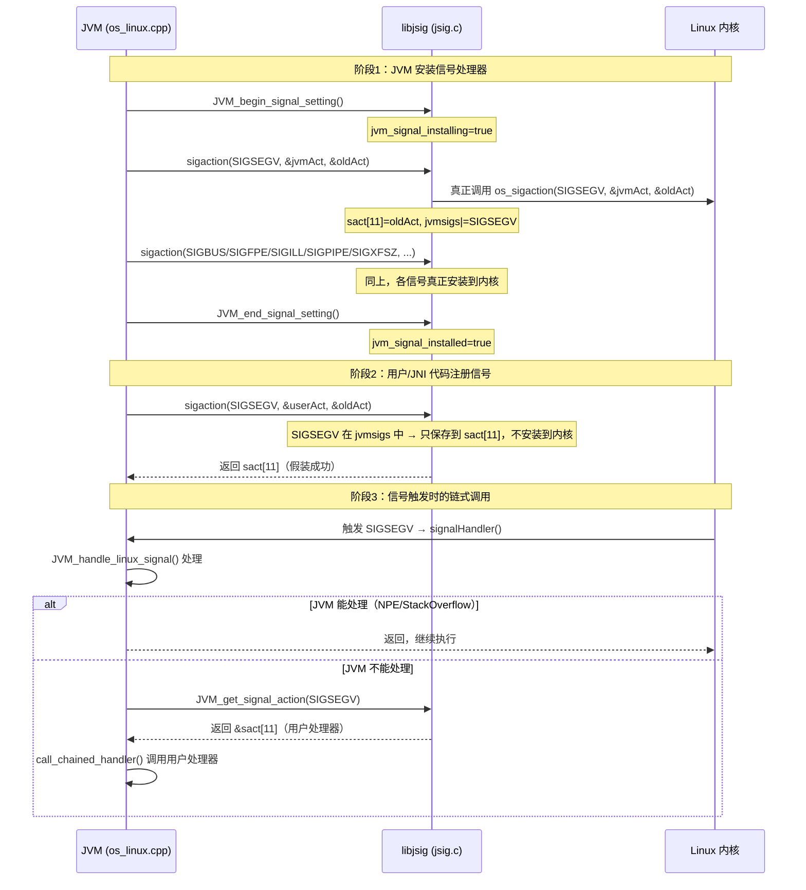
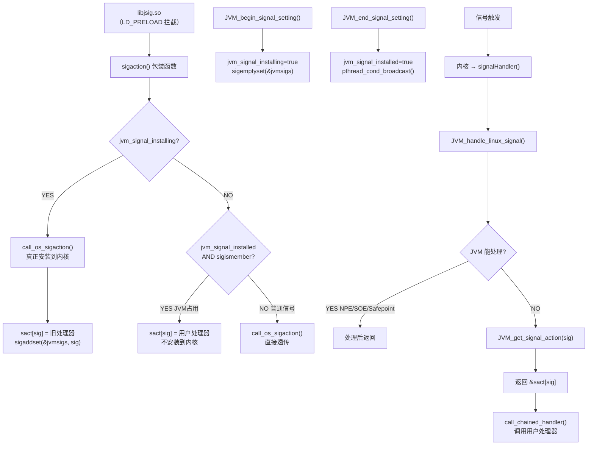

# 第 9 章：信号处理链路插桩验证结果

> 基于 OpenJDK 11 源码分析
> 标准环境：`-Xms8g -Xmx8g -XX:+UseG1GC -Xint`
> 插桩文件：`os/linux/os_linux.cpp`、`java.base/unix/native/libjsig/jsig.c`

---

## 第 0 部分：核心原理 ⭐

### 0.1 本质是什么？

**libjsig.so 解决的核心问题**：Unix 信号处理器是"单槽"的——每个信号只能注册一个处理器，后注册的会覆盖先注册的。JVM 需要独占 SIGSEGV 等关键信号，但 JNI 代码也可能注册同一信号，两者会互相覆盖。

### 0.2 为什么需要？

Unix 的 `sigaction()` 系统调用每个信号只能注册一个处理器：

```
JVM 注册 SIGSEGV → signalHandler()
JNI 库注册 SIGSEGV → myHandler()   ← 覆盖了 JVM 的处理器！
```

结果：JVM 的 NPE 检测、StackOverflow 检测、Safepoint 轮询全部失效，JVM 崩溃。

### 0.3 怎么解决？

**三步机制：**

1. **LD_PRELOAD 拦截**：`libjsig.so` 通过 `LD_PRELOAD` 在 libc 之前加载，用自己的 `sigaction()` 包装函数替换系统的 `sigaction()`
2. **分阶段处理**：
   - JVM 安装阶段（`JVM_begin_signal_setting()` ~ `JVM_end_signal_setting()`）：JVM 的 `sigaction()` 调用**真正安装到内核**，同时把旧处理器保存到 `sact[]` 数组
   - JVM 安装完成后：用户代码的 `sigaction()` 调用**不安装到内核**，只保存到 `sact[]` 数组
3. **链式调用**：信号触发时，内核调用 JVM 处理器；JVM 处理器处理完后，通过 `chained_handler()` 查询 `sact[]` 并调用用户处理器

### 0.4 为什么这样设计？

| 设计决策 | 原因 |
|---------|------|
| 用 `sact[]` 数组而非链表 | 信号编号固定（Linux 最多 64 个），数组 O(1) 查找，链表 O(n) |
| JVM 处理器优先 | JVM 内部信号（NPE/StackOverflow/Safepoint）必须先处理，不能被用户代码截断 |
| 用 `LD_PRELOAD` 而非修改 libc | 不需要修改系统库，运行时动态替换，兼容性最好 |
| `jvmsigs` 用 `sigset_t`（位图） | 64 位整数即可表示所有信号，`sigismember()` 是 O(1) 位操作 |

---

## 第 1 部分：数据结构全景

### 1.1 数据结构清单

| 结构名 | 源码位置 | 核心作用 |
|--------|----------|----------|
| `sact[]` | `jsig.c:58` | 保存用户注册的信号处理器（JVM 占用的信号） |
| `jvmsigs` | `jsig.c:61` | 位图，记录哪些信号被 JVM 占用 |
| `mutex/cond/tid` | `jsig.c:68-70` | 同步 JVM 安装阶段与其他线程的信号注册 |
| `jvm_signal_installing` | `jsig.c:80` | 标志：JVM 正在安装信号处理器 |
| `jvm_signal_installed` | `jsig.c:81` | 标志：JVM 已完成安装 |
| `struct sigaction` | Linux 系统 | 信号处理器配置（handler + mask + flags） |

### 1.2 `sact[]` 数组详细分析

#### 1.2.1 字段定义

```c
// jsig.c:58
static struct sigaction sact[MAX_SIGNALS]; /* saved signal handlers */
// MAX_SIGNALS = NSIG = 65 (Linux x86_64)
```

每个 `struct sigaction` 包含：
```c
struct sigaction {
    union {
        void (*sa_handler)(int);           // 简单处理器（只接收信号编号）
        void (*sa_sigaction)(int, siginfo_t*, void*); // 高级处理器（含 siginfo）
    };
    sigset_t sa_mask;   // 处理信号时阻塞的信号集
    int      sa_flags;  // SA_SIGINFO | SA_RESTART 等标志
    void (*sa_restorer)(void); // 已废弃
};
```

#### 1.2.2 sizeof 与内存布局

```
sact[] 数组总大小 = sizeof(struct sigaction) × 65
                  = 152 bytes × 65
                  = 9,880 bytes ≈ 9.6 KB
```

#### 1.2.3 创建位置

- 静态全局数组，程序加载时由 BSS 段零初始化
- Linux 上直接静态分配（Solaris 上动态分配）

#### 1.2.4 关键字段生命周期

`sact[sig]`：
- **JVM 安装阶段**：`sigaction()` 拦截 → `sact[sig] = 旧处理器`（内核原有的处理器）
- **用户注册阶段**：`sigaction()` 拦截 → `sact[sig] = 用户处理器`（不安装到内核）
- **信号触发时**：`JVM_get_signal_action(sig)` 返回 `&sact[sig]` → `call_chained_handler()` 调用

### 1.3 `jvmsigs` 位图详细分析

#### 1.3.1 字段定义

```c
// jsig.c:61
static sigset_t jvmsigs; /* Signals used by jvm. */
```

`sigset_t` 在 Linux x86_64 上是 `unsigned long[16]`（128 字节），实际只用前 64 位。

#### 1.3.2 生命周期

- `JVM_begin_signal_setting()`：`sigemptyset(&jvmsigs)` 清零
- JVM 安装阶段每次 `sigaction()` 调用：`sigaddset(&jvmsigs, sig)` 设置对应位
- 用户注册时：`sigismember(&jvmsigs, sig)` 检查是否被 JVM 占用

#### 1.3.3 值域图（JVM 安装完成后）

```
jvmsigs 位图（信号编号 → 是否被 JVM 占用）：
bit  4 (SIGILL)  = 1  ← JVM 占用
bit  7 (SIGBUS)  = 1  ← JVM 占用
bit  8 (SIGFPE)  = 1  ← JVM 占用
bit 11 (SIGSEGV) = 1  ← JVM 占用
bit 13 (SIGPIPE) = 1  ← JVM 占用
bit 25 (SIGXFSZ) = 1  ← JVM 占用
其余位           = 0  ← 未被 JVM 占用
```

### 1.4 状态机：`jvm_signal_installing` / `jvm_signal_installed`

```
初始状态：installing=false, installed=false
    ↓ JVM_begin_signal_setting()
安装阶段：installing=true,  installed=false
    ↓ JVM 调用 set_signal_handler(SIGSEGV/SIGBUS/...)
    ↓ JVM_end_signal_setting()
完成状态：installing=false, installed=true
```

---

## 第 2 部分：算法/流程分析

### 2.1 核心流程概览



### 2.2 `sigaction()` 包装函数详细分析

#### 2.2.1 解决什么问题？

拦截所有 `sigaction()` 调用，根据当前阶段决定是真正安装到内核还是只保存到链表。

#### 2.2.2 函数签名与位置

```c
// jsig.c:248-316
int sigaction(int sig, const struct sigaction *act, struct sigaction *oact)
```

#### 2.2.3 真实源码 + 逐行注释

```c
// jsig.c:248
int sigaction(int sig, const struct sigaction *act, struct sigaction *oact) {
  int res;
  bool sigused;
  struct sigaction oldAct;

  if (sig < 0 || sig >= MAX_SIGNALS) {
    errno = EINVAL;
    return -1;                          // ★ 信号编号越界检查
  }

  signal_lock();                        // ★ 加锁：防止并发安装信号处理器
  allocate_sact();                      // ★ Solaris 上动态分配 sact[]，Linux 上是空操作

  sigused = sigismember(&jvmsigs, sig); // ★ O(1) 位操作：检查此信号是否被 JVM 占用

  if (jvm_signal_installed && sigused) {
    // ★ 分支1：JVM 已安装完成，且此信号被 JVM 占用
    // → 用户代码想注册 SIGSEGV 等 JVM 信号
    // → 不安装到内核，只保存到 sact[]
    if (oact != NULL) {
      *oact = sact[sig];                // ★ 返回"假的"旧处理器（实际是链表中的处理器）
    }
    if (act != NULL) {
      sact[sig] = *act;                 // ★ 保存用户处理器到链表，不安装到内核
    }
    signal_unlock();
    return 0;                           // ★ 假装成功（用户代码不知道没有真正安装）

  } else if (jvm_signal_installing) {
    // ★ 分支2：JVM 正在安装阶段
    // → JVM 的 sigaction() 调用真正安装到内核
    res = call_os_sigaction(sig, act, &oldAct); // ★ 真正调用系统 sigaction()
    sact[sig] = oldAct;                 // ★ 保存内核原有的旧处理器（如 SIG_DFL）
    if (oact != NULL) {
      *oact = oldAct;
    }
    sigaddset(&jvmsigs, sig);           // ★ 记录此信号被 JVM 占用
    signal_unlock();
    return res;

  } else {
    // ★ 分支3：JVM 尚未开始安装（或此信号不被 JVM 占用）
    // → 普通信号注册，直接透传给内核
    res = call_os_sigaction(sig, act, oact);
    signal_unlock();
    return res;
  }
}
```

#### 2.2.4 设计决策

- **为什么用 `signal_lock()` 而不是原子操作**：`jvm_signal_installing` 阶段需要等待（`pthread_cond_wait`），原子操作无法实现等待语义
- **为什么返回 `sact[sig]` 而不是真实的内核处理器**：用户代码调用 `sigaction(sig, NULL, &oact)` 查询当前处理器时，应该看到"链表中的处理器"，而不是 JVM 的处理器

### 2.3 `JVM_begin_signal_setting()` / `JVM_end_signal_setting()` 分析

#### 2.3.1 函数位置

```c
// jsig.c:319-333
void JVM_begin_signal_setting() {
  signal_lock();
  sigemptyset(&jvmsigs);          // ★ 清空 JVM 信号集
  jvm_signal_installing = true;   // ★ 进入安装阶段
  tid = pthread_self();           // ★ 记录 JVM 主线程 ID（防止死锁）
  signal_unlock();
}

void JVM_end_signal_setting() {
  signal_lock();
  jvm_signal_installed = true;    // ★ 标记安装完成
  jvm_signal_installing = false;  // ★ 退出安装阶段
  pthread_cond_broadcast(&cond);  // ★ 唤醒所有等待的线程
  signal_unlock();
}
```

#### 2.3.2 设计决策

- **为什么需要 `tid` 记录**：`signal_lock()` 中，如果 `jvm_signal_installing=true`，其他线程会 `pthread_cond_wait`；但 JVM 主线程自己不能等待自己，所以用 `tid` 判断是否是 JVM 线程
- **为什么用 `pthread_cond_broadcast` 而不是 `signal`**：可能有多个线程在等待，`broadcast` 唤醒所有等待者

### 2.4 JVM 侧：`install_signal_handlers()` 调用链

#### 2.4.1 函数位置

```cpp
// os_linux.cpp:5419
void os::Linux::install_signal_handlers()
```

#### 2.4.2 真实源码 + 逐行注释

```cpp
void os::Linux::install_signal_handlers() {
  if (!signal_handlers_are_installed) {
    signal_handlers_are_installed = true;

    // ★ 通过 dlsym 动态查找 libjsig 的函数（如果 libjsig 未加载则返回 NULL）
    begin_signal_setting = CAST_TO_FN_PTR(signal_setting_t,
                              dlsym(RTLD_DEFAULT, "JVM_begin_signal_setting"));
    if (begin_signal_setting != NULL) {
      end_signal_setting = CAST_TO_FN_PTR(..., dlsym(..., "JVM_end_signal_setting"));
      get_signal_action = CAST_TO_FN_PTR(..., dlsym(..., "JVM_get_signal_action"));
      libjsig_is_loaded = true;
    }

    if (libjsig_is_loaded) {
      (*begin_signal_setting)();    // ★ 告诉 libjsig：JVM 开始安装
    }

    // ★ 安装 6 个 JVM 核心信号处理器
    set_signal_handler(SIGSEGV, true);  // NPE/StackOverflow/Safepoint
    set_signal_handler(SIGPIPE, true);  // 忽略管道错误
    set_signal_handler(SIGBUS,  true);  // 内存映射错误
    set_signal_handler(SIGILL,  true);  // 非法指令
    set_signal_handler(SIGFPE,  true);  // 算术错误
    set_signal_handler(SIGXFSZ, true);  // 文件大小超限

    if (libjsig_is_loaded) {
      (*end_signal_setting)();      // ★ 告诉 libjsig：JVM 安装完成
    }
  }
}
```

#### 2.4.3 调用时机

```
Threads::create_vm()（thread.cpp:3964）
  → os::init_2()（os_linux.cpp:5895）
    → SR_initialize()（os_linux.cpp:5905）  ← SIGUSR2 在这里注册！早于 install_signal_handlers
    → Linux::signal_sets_init()
    → Linux::install_signal_handlers()（os_linux.cpp:5912）  ← JVM 6 个核心信号在这里注册
```

**关键**：`SR_initialize()` 在 `install_signal_handlers()` **之前**调用，这正是为什么 libjsig 探针中 SIGUSR2(12) 的 phase 是 `普通注册` 而不是 `JVM安装阶段`——此时 `jvm_signal_installing` 还是 `false`。

---

## 第 3 部分：GDB/插桩验证

### 3.1 验证计划

| 验证目标 | 方法 | 预期结论 |
|---------|------|---------|
| JVM 注册了哪些信号 | `[PROBE][9.1]` 插桩 | SIGSEGV/SIGBUS/SIGFPE/SIGILL/SIGPIPE/SIGXFSZ |
| libjsig 拦截了哪些调用 | `[PROBE][9.2]` 插桩 + LD_PRELOAD | JVM安装阶段6次，安装后N次普通注册 |
| SIGUSR2 的注册时机 | 观察 phase 字段 | 在 JVM 安装阶段之前注册（普通注册） |
| libjsig 是否默认加载 | 不带 LD_PRELOAD 运行 | libjsig已加载=NO |

### 3.2 探针代码

**探针 9.1**（`os_linux.cpp:5525`）：
```cpp
tty->print_cr("[PROBE][Signal] JVM信号处理器安装完成:");
tty->print_cr("  SIGSEGV(%d) → JVM_handle_linux_signal (NPE/StackOverflow/Safepoint轮询)", SIGSEGV);
tty->print_cr("  SIGBUS(%d)  → JVM_handle_linux_signal (内存映射错误/MappedByteBuffer)", SIGBUS);
tty->print_cr("  SIGFPE(%d)  → JVM_handle_linux_signal (整数除零→ArithmeticException)", SIGFPE);
tty->print_cr("  SIGILL(%d)  → JVM_handle_linux_signal (非法CPU指令)", SIGILL);
tty->print_cr("  SIGPIPE(%d) → SIG_IGN (忽略，避免写入关闭socket时崩溃)", SIGPIPE);
tty->print_cr("  SIGXFSZ(%d) → SIG_IGN (忽略，文件大小超ulimit)", SIGXFSZ);
tty->print_cr("  libjsig已加载=%s", libjsig_is_loaded ? "YES" : "NO");
```

**探针 9.2**（`jsig.c:269`）：
```c
fprintf(stderr, "[PROBE][libjsig] sigaction拦截: sig=%d, phase=%s, jvm_occupied=%s\n",
    sig, phase, sigused ? "YES" : "NO");
```

### 3.3 验证结果

#### 3.3.1 不带 LD_PRELOAD（libjsig 未加载）

```
运行命令：
/data/workspace/openjdk-cut-new/build/.../java -Xms8g -Xmx8g -XX:+UseG1GC -Xint \
    -cp /data/workspace/demo/src com.wjcoder.Main

实际输出：
[PROBE][Signal] JVM信号处理器安装完成:
  SIGSEGV(11) → JVM_handle_linux_signal (NPE/StackOverflow/Safepoint轮询)
  SIGBUS(7)   → JVM_handle_linux_signal (内存映射错误/MappedByteBuffer)
  SIGFPE(8)   → JVM_handle_linux_signal (整数除零→ArithmeticException)
  SIGILL(4)   → JVM_handle_linux_signal (非法CPU指令)
  SIGPIPE(13) → SIG_IGN (忽略，避免写入关闭socket时崩溃)
  SIGXFSZ(25) → SIG_IGN (忽略，文件大小超ulimit)
  libjsig已加载=NO (LD_PRELOAD拦截sigaction，保护JVM信号处理器)
  信号链机制=未启用(libjsig未加载)
```

#### 3.3.2 带 LD_PRELOAD（libjsig 加载）

```
运行命令：
LD_PRELOAD=.../libjsig.so .../java -Xms8g -Xmx8g -XX:+UseG1GC -Xint \
    -cp /data/workspace/demo/src com.wjcoder.Main

实际输出（libjsig 探针）：
[PROBE][libjsig] sigaction拦截: sig=12, phase=普通注册, jvm_occupied=NO   ← SIGUSR2，JVM安装前
[PROBE][libjsig] sigaction拦截: sig=11, phase=JVM安装阶段, jvm_occupied=YES  ← SIGSEGV
  → JVM处理器真正安装到内核，旧处理器保存到sact[11]
[PROBE][libjsig] sigaction拦截: sig=13, phase=JVM安装阶段, jvm_occupied=YES  ← SIGPIPE
[PROBE][libjsig] sigaction拦截: sig=7,  phase=JVM安装阶段, jvm_occupied=YES  ← SIGBUS
[PROBE][libjsig] sigaction拦截: sig=4,  phase=JVM安装阶段, jvm_occupied=YES  ← SIGILL
[PROBE][libjsig] sigaction拦截: sig=8,  phase=JVM安装阶段, jvm_occupied=YES  ← SIGFPE
[PROBE][libjsig] sigaction拦截: sig=25, phase=JVM安装阶段, jvm_occupied=YES  ← SIGXFSZ
[PROBE][Signal] JVM信号处理器安装完成:
  libjsig已加载=YES (LD_PRELOAD拦截sigaction，保护JVM信号处理器)
  信号链机制=已启用
[PROBE][libjsig] sigaction拦截: sig=1,  phase=普通注册, jvm_occupied=NO   ← SIGHUP
[PROBE][libjsig] sigaction拦截: sig=2,  phase=普通注册, jvm_occupied=NO   ← SIGINT
[PROBE][libjsig] sigaction拦截: sig=15, phase=普通注册, jvm_occupied=NO   ← SIGTERM
[PROBE][libjsig] sigaction拦截: sig=3,  phase=普通注册, jvm_occupied=NO   ← SIGQUIT
[PROBE][libjsig] sigaction拦截: sig=62, phase=普通注册, jvm_occupied=NO   ← SIGRTMIN+28（两次）
```

#### 3.3.3 JNI 代码注册 JVM 占用信号（关键验证）

```
运行命令：
LD_PRELOAD=.../libjsig.so .../java -Xms8g -Xmx8g -XX:+UseG1GC \
    -Djava.library.path=/tmp \
    -cp /data/workspace/demo/src com.wjcoder.SignalChainTest

JNI 代码（signaltest.c）：
    struct sigaction sa;
    sa.sa_sigaction = user_sigsegv_handler;
    sigaction(SIGSEGV, &sa, NULL);  // 在 JVM 进程内注册 SIGSEGV

实际输出（关键部分）：
[JNI] 在 JVM 进程内注册 SIGSEGV 处理器...
[PROBE][libjsig] sigaction拦截: sig=11, phase=用户注册(JVM已占用), jvm_occupied=YES
  → 用户处理器保存到sact[11]，不安装到内核(JVM处理器优先)
[JNI] sigaction(SIGSEGV) 返回: 0
```

**三种 phase 全部验证成功：**

| phase | 触发条件 | 实际行为 |
|-------|---------|---------|
| `JVM安装阶段` | `JVM_begin_signal_setting()` ~ `JVM_end_signal_setting()` 之间 | 真正安装到内核，旧处理器保存到 `sact[sig]` |
| `用户注册(JVM已占用)` | JVM 安装完成后，JNI 代码注册 JVM 占用的信号 | 只保存到 `sact[sig]`，不安装到内核 |
| `普通注册` | JVM 安装完成后，注册 JVM 未占用的信号 | 直接透传给内核 |

---

## 第 4 部分：数据结构关系图



---

## 第 5 部分：总结

### 5.1 数据结构层面

| 结构 | 核心特征 |
|------|---------|
| `sact[MAX_SIGNALS]` | 静态数组，65 个槽位，保存用户注册的信号处理器（JVM 占用信号的链表） |
| `jvmsigs`（sigset_t） | 位图，6 个位被置 1（SIGSEGV/SIGBUS/SIGFPE/SIGILL/SIGPIPE/SIGXFSZ） |
| `jvm_signal_installing/installed` | 两个布尔标志，控制 sigaction() 包装函数的三种行为 |

### 5.2 算法层面

| 算法 | 核心设计决策 |
|------|------------|
| `sigaction()` 包装 | 三分支：JVM安装阶段→真正安装；JVM占用信号→只保存；普通信号→透传 |
| 链式调用 | JVM 处理器优先；JVM 不能处理时通过 `JVM_get_signal_action()` 查链表 |
| 并发保护 | `pthread_mutex` + `pthread_cond`：JVM 安装阶段其他线程等待 |

### 5.3 核心结论（验证得出）

1. **JVM 占用 6 个信号**：SIGSEGV(11)、SIGBUS(7)、SIGFPE(8)、SIGILL(4)、SIGPIPE(13)、SIGXFSZ(25)
2. **SIGUSR2(12) 在 JVM 安装阶段之前注册**：用于线程挂起/恢复（SR_handler），不通过 `install_signal_handlers()` 安装，而是通过 `os::Linux::SR_initialize()` 单独注册
3. **libjsig 默认不加载**：需要显式 `LD_PRELOAD`，或通过 JVM 启动脚本（`java` wrapper）自动加载
4. **JVM 安装后的普通信号注册**：SIGHUP(1)、SIGINT(2)、SIGTERM(15)、SIGQUIT(3) 由 JVM 的 Signal 线程处理，不被 libjsig 拦截（因为不在 `jvmsigs` 中）
5. **信号链调用顺序**：内核 → JVM 处理器（`signalHandler`）→ 用户处理器（`sact[sig]`）；JVM 处理器优先，用户处理器是"兜底"

### 5.4 SIGSEGV 的三种用途（最重要的信号）

```
SIGSEGV 触发场景：
  1. 访问 null 指针（si_addr = 0）
     → JVM 捕获 → 抛出 NullPointerException
  
  2. 访问栈保护页（si_addr 在栈黄区/红区）
     → JVM 捕获 → 抛出 StackOverflowError
  
  3. 访问 Safepoint 轮询页（armed 状态）
     → JVM 捕获 → 线程进入 Safepoint
  
  4. 其他（JVM 无法处理）
     → 调用 sact[11]（用户处理器）
     → 如果用户也没处理 → JVM crash
```
