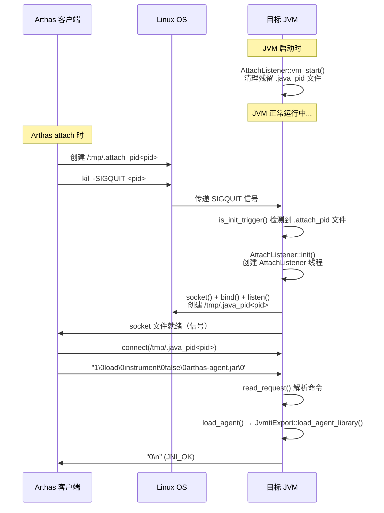
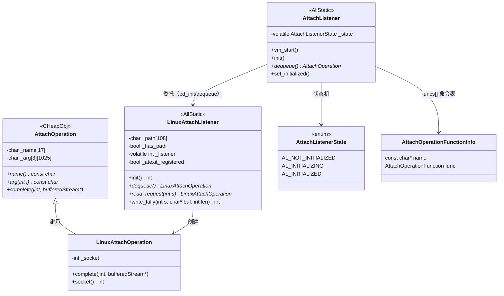

# 第 10 章：Attach 机制插桩验证（libattach.so）

> 基于 OpenJDK 11 源码分析  
> 标准环境：`-Xms256m -Xmx256m -XX:+UseG1GC`  
> 探针文件：`src/hotspot/share/services/attachListener.cpp`、`src/hotspot/os/linux/attachListener_linux.cpp`

---

## 第 0 部分：核心原理 ⭐

### 0.1 本质是什么？

**Attach 机制解决的核心问题**：如何在不重启 JVM 的情况下，让外部工具（Arthas、jstack、jcmd）访问运行中 JVM 的内部状态。

### 0.2 为什么需要？

JVM 是一个独立进程，外部工具无法直接访问其内存。传统方案是在 JVM 启动时就加载诊断 Agent（`-javaagent`），但这要求提前知道需要哪些工具，无法按需加载。

Attach 机制提供了**运行时注入**能力：JVM 启动后，任何时刻都可以 attach 一个诊断工具，无需重启。

### 0.3 怎么解决？

**三步机制**：

1. **懒加载监听器**：JVM 启动时不创建 Attach Listener，收到 SIGQUIT 信号才启动（节省资源）
2. **Unix Domain Socket 通信**：Attach Listener 创建 `/tmp/.java_pid<pid>` socket 文件，外部工具通过此 socket 发送命令
3. **命令分发表**：内置 10 个命令（`load`/`threaddump`/`dumpheap` 等），`load` 命令通过 JVMTI 加载 Agent

### 0.4 为什么这样设计？

- **为什么用 Unix Domain Socket 而不是 TCP**？只允许本机访问，天然安全；无需端口管理；性能更好
- **为什么懒加载**？大多数 JVM 进程不需要 attach，提前创建线程和 socket 是浪费
- **为什么用 SIGQUIT 触发**？SIGQUIT 是 JVM 已经处理的信号（默认打印线程栈），复用此信号不需要额外的信号注册
- **为什么 `load` 命令用 `instrument` 作为 agent 名**？`instrument` 是 JVM 内置的 Java Agent 加载器，通过它加载 `.jar` 文件并调用 `Agent_OnAttach` 回调

---

## 第 1 部分：数据结构全景

### 1.1 数据结构清单

| 结构名 | 源码位置 | 核心作用 |
|--------|----------|----------|
| `LinuxAttachListener` | `attachListener_linux.cpp:57` | 管理 Unix Domain Socket（静态类） |
| `AttachOperation` | `attachListener.hpp:130` | 表示一个 attach 命令（名称 + 3 个参数） |
| `LinuxAttachOperation` | `attachListener_linux.cpp:88` | Linux 平台的命令，额外持有 socket fd |
| `AttachListenerState` | `attachListener.hpp:52` | 枚举：AL_NOT_INITIALIZED / AL_INITIALIZING / AL_INITIALIZED |
| `AttachOperationFunctionInfo` | `attachListener.hpp:47` | 命令名 → 处理函数的映射表项 |

### 1.2 LinuxAttachListener 详细分析

#### 1.2.1 字段列表

```cpp
// attachListener_linux.cpp:57
class LinuxAttachListener: AllStatic {
 private:
  static char _path[UNIX_PATH_MAX];   // socket 文件路径：/tmp/.java_pid<pid>
  static bool _has_path;              // 路径是否已设置
  static volatile int _listener;      // 监听 socket 的文件描述符（-1=未初始化）
  static bool _atexit_registered;     // 是否已注册 atexit 清理函数
};
```

#### 1.2.2 sizeof 与内存布局

- `UNIX_PATH_MAX = 108` bytes（`sizeof(((struct sockaddr_un *)0)->sun_path)`）
- `_path[108]` + `_has_path[1]` + `_listener[4]` + `_atexit_registered[1]` ≈ 116 bytes（静态存储）
- 全部是静态字段，存储在 BSS/data 段，不在堆上

#### 1.2.3 创建位置

- 静态类，无构造函数
- `_listener` 在 `LinuxAttachListener::init()` 中通过 `::socket()` 创建
- `_path` 在 `init()` 中通过 `snprintf` 设置为 `/tmp/.java_pid<pid>`

#### 1.2.4 关键字段生命周期

- `_listener`：`-1`（初始）→ `init()` 中 `::socket()` 返回的 fd → `listener_cleanup()` 中 `::close()` 后重置为 `-1`
- `_path`：`""` → `init()` 中设置为 `/tmp/.java_pid<pid>` → `listener_cleanup()` 中 `::unlink()` 删除文件后清空

#### 1.2.5 值域图

```
_listener 状态：
  -1  ──────────────────────────────────────────────────────────────────
       ↑ 初始值                                                         ↑ cleanup 后
  ≥0  ──────────────────────────────────────────────────────────────────
       ↑ init() 成功后（有效的 socket fd）
```

### 1.3 AttachOperation 详细分析

#### 1.3.1 字段列表

```cpp
// attachListener.hpp:130
class AttachOperation: public CHeapObj<mtInternal> {
 public:
  enum {
    name_length_max = 16,    // 命令名最大长度（"agentProperties" = 15 chars）
    arg_length_max  = 1024,  // 单个参数最大长度
    arg_count_max   = 3      // 最多 3 个参数
  };
 private:
  char _name[name_length_max+1];              // 命令名，如 "load"、"threaddump"
  char _arg[arg_count_max][arg_length_max+1]; // 3 个参数槽，未使用的为 ""
};
```

#### 1.3.2 sizeof

- `sizeof(AttachOperation)` = `17 + 3 × 1025` = `17 + 3075` = **3092 bytes**
- 分配在 CHeap（`new LinuxAttachOperation(name)`），每次命令到来时创建，`op->complete()` 中 `delete this` 销毁

#### 1.3.3 创建位置

- `LinuxAttachListener::read_request(int s)` 中，解析 socket 数据后 `new LinuxAttachOperation(name)`

#### 1.3.4 关键字段生命周期

- `_name`：`read_request()` 中从 socket 读取并 `set_name()` → `attach_listener_thread_entry()` 中 `op->name()` 读取 → `op->complete()` 中 `delete this` 销毁
- `_arg[i]`：`read_request()` 中 `set_arg(i, arg)` → 命令处理函数中 `op->arg(i)` 读取

#### 1.3.5 命令分发表（10 个内置命令）

```cpp
// attachListener.cpp:280
static AttachOperationFunctionInfo funcs[] = {
  { "agentProperties",  get_agent_properties },  // 获取 Agent 属性
  { "datadump",         data_dump },              // 触发 SIGQUIT（线程栈/死锁检测）
  { "dumpheap",         dump_heap },              // 堆转储（.hprof）
  { "load",             load_agent },             // 加载 Java Agent ← Arthas 核心
  { "properties",       get_system_properties },  // 获取系统属性
  { "threaddump",       thread_dump },            // 线程栈转储
  { "inspectheap",      heap_inspection },        // 类直方图
  { "setflag",          set_flag },               // 动态修改 JVM 参数
  { "printflag",        print_flag },             // 打印 JVM 参数值
  { "jcmd",             jcmd },                   // 转发给 DCmd 框架
  { NULL,               NULL }
};
```

---

## 第 2 部分：算法/流程分析

### 2.1 核心流程概览



### 2.2 流程 A：Attach Listener 启动（懒加载）

#### 2.2.1 解决什么问题？

大多数 JVM 进程不需要 attach，提前创建线程和 socket 浪费资源。懒加载在收到 SIGQUIT 时才启动。

#### 2.2.2 触发路径

```
SIGQUIT 信号
  → JVM 的 SIGQUIT 处理器（os_linux.cpp）
    → signal_thread_entry()（runtime/os.cpp）
      → os::signal_notify(SIGQUIT)
        → ServiceThread 的信号处理循环
          → AttachListener::is_init_trigger()  ← 检测 .attach_pid 文件
            → AttachListener::init()           ← 启动 Attach Listener 线程
```

#### 2.2.3 真实源码（attachListener_linux.cpp:init()）

```cpp
// attachListener_linux.cpp:155
int LinuxAttachListener::init() {
  char path[UNIX_PATH_MAX];          // 最终 socket 路径
  char initial_path[UNIX_PATH_MAX];  // 临时路径（.tmp 后缀）

  // 注册 atexit 清理函数（JVM 退出时删除 socket 文件）
  if (!_atexit_registered) {
    _atexit_registered = true;
    ::atexit(listener_cleanup);      // ★ 确保 JVM 退出时清理 socket 文件
  }

  // 构造路径：/tmp/.java_pid<pid>
  snprintf(path, UNIX_PATH_MAX, "%s/.java_pid%d",
           os::get_temp_directory(), os::current_process_id());
  snprintf(initial_path, UNIX_PATH_MAX, "%s.tmp", path);  // 先用 .tmp 后缀

  // 创建 Unix Domain Socket
  listener = ::socket(PF_UNIX, SOCK_STREAM, 0);  // ★ AF_UNIX，不是 TCP

  // 绑定到临时路径（原子性：先绑定临时文件，再 rename）
  struct sockaddr_un addr;
  addr.sun_family = AF_UNIX;
  strcpy(addr.sun_path, initial_path);
  ::unlink(initial_path);            // 清理可能存在的残留文件
  ::bind(listener, (struct sockaddr*)&addr, sizeof(addr));

  // 设置权限：400（只有 owner 可读）
  ::listen(listener, 5);             // ★ backlog=5，最多 5 个待处理连接
  ::chmod(initial_path, S_IREAD|S_IWRITE);  // ★ 权限 600
  ::chown(initial_path, geteuid(), getegid());  // ★ 确保 owner 正确
  ::rename(initial_path, path);      // ★ 原子 rename，避免竞态条件

  set_path(path);
  set_listener(listener);
  return 0;
}
```

**设计决策**：
- **先写 `.tmp` 再 rename**：原子操作，避免 Arthas 在 socket 未就绪时就连接
- **权限 600**：只有 JVM 进程的 owner 可以 attach，防止其他用户注入

### 2.3 流程 B：命令接收与分发

#### 2.3.1 解决什么问题？

Attach Listener 线程是单线程的，每次只处理一个命令（accept → read → execute → respond → close）。

#### 2.3.2 真实源码（attachListener.cpp:attach_listener_thread_entry）

```cpp
// attachListener.cpp:330
static void attach_listener_thread_entry(JavaThread* thread, TRAPS) {
  os::set_priority(thread, NearMaxPriority);  // ★ 高优先级，确保 attach 响应及时

  // 初始化 Linux 侧（创建 socket）
  if (AttachListener::pd_init() != 0) {
    AttachListener::set_state(AL_NOT_INITIALIZED);
    return;
  }
  AttachListener::set_initialized();  // ★ 状态机：AL_INITIALIZING → AL_INITIALIZED

  for (;;) {
    // 阻塞等待客户端连接（accept）
    AttachOperation* op = AttachListener::dequeue();
    if (op == NULL) {
      AttachListener::set_state(AL_NOT_INITIALIZED);
      return;  // socket 关闭或出错
    }

    // 在命令分发表中查找处理函数
    AttachOperationFunctionInfo* info = NULL;
    for (int i=0; funcs[i].name != NULL; i++) {
      if (strcmp(op->name(), funcs[i].name) == 0) {
        info = &(funcs[i]);
        break;
      }
    }

    // 执行命令，结果写入 bufferedStream
    bufferedStream st;
    jint res = (info != NULL) ? (info->func)(op, &st) : JNI_ERR;

    // 将结果码 + 结果数据写回 socket，然后 close
    op->complete(res, &st);  // ★ complete() 内部 delete this
  }
}
```

#### 2.3.3 通信协议格式

```
请求（客户端 → JVM）：
  <ver>\0<cmd>\0<arg0>\0<arg1>\0<arg2>\0
  例：1\0load\0instrument\0false\0arthas-agent.jar\0

响应（JVM → 客户端）：
  <result_code>\n<result_data>
  例：0\n（JNI_OK，无数据）
  例：0\n2026-03-05 14:45:36\nFull thread dump...（threaddump）
```

### 2.4 流程 C：load 命令（Agent 加载）

#### 2.4.1 解决什么问题？

Arthas 的核心是加载 `arthas-agent.jar`，通过 JVMTI 接口访问 JVM 内部状态。`load` 命令是这个过程的入口。

#### 2.4.2 真实源码（attachListener.cpp:load_agent）

```cpp
// attachListener.cpp:100
static jint load_agent(AttachOperation* op, outputStream* out) {
  const char* agent   = op->arg(0);  // "instrument"（内置加载器）或 jar 路径
  const char* absParam = op->arg(1); // "true"=绝对路径，"false"=相对路径
  const char* options = op->arg(2);  // Agent 参数（传给 Agent_OnAttach）

  // 如果是 Java Agent（instrument），先确保 java.instrument 模块已加载
  if (strcmp(agent, "instrument") == 0) {
    // 调用 Modules.loadModule("java.instrument")
    JavaCalls::call_static(&result,
                           SystemDictionary::module_Modules_klass(),
                           vmSymbols::loadModule_name(), ...);
  }

  // 通过 JVMTI 加载 Agent 库
  return JvmtiExport::load_agent_library(agent, absParam, options, out);
  // ↑ 最终调用 dlopen() 加载 .so 或 .jar，触发 Agent_OnAttach 回调
}
```

**调用链**：
```
load_agent()
  → JvmtiExport::load_agent_library()
    → os::dll_load()（dlopen 加载 .so）
      → Agent_OnAttach(vm, options, reserved)  ← Arthas 的入口点
```

---

## 第 3 部分：验证结果

### 3.1 探针 10.1：Attach Listener 启动时机

**探针位置**：`attachListener.cpp:441`（`AttachListener::init()` 入口）

**触发方式**：
```bash
# 启动目标 JVM
java -Xms256m -Xmx256m -XX:+UseG1GC -cp /tmp AttachTarget &
TARGET_PID=$!

# 触发 attach（jcmd 自动创建 .attach_pid 文件并发送 SIGQUIT）
jcmd $TARGET_PID VM.version
```

**实际输出**：
```
[PROBE][Startup] [Phase-10] AttachListener::vm_start() -- 启动Attach监听
...（JVM 正常运行）...
[PROBE][Attach] AttachListener::init() 被调用:
  → 说明JVM收到了attach信号(SIGQUIT/SIGUSR1)，Attach Listener是懒加载的
  当前JVM进程pid=26144
  即将创建Unix Domain Socket: /tmp/.java_pid26144
  即将创建AttachListener线程...
```

**验证结论**：
- ✅ **懒加载确认**：JVM 启动时（Phase-10）只调用 `vm_start()` 清理残留文件，不创建 Attach Listener
- ✅ **触发时机确认**：收到 SIGQUIT 后，`is_init_trigger()` 检测到 `.attach_pid26144` 文件，才调用 `init()`
- ✅ **Socket 文件确认**：`/tmp/.java_pid26144` 在 `init()` 后创建，权限 `srw-------`（600）

### 3.2 探针 10.2：命令接收和分发（Arthas 真实验证）

**探针位置**：`attachListener.cpp:364`（`attach_listener_thread_entry` 循环体）

**触发方式**：使用 JDK `VirtualMachine.attach()` API，加载真实的 `arthas-agent.jar`

**验证程序**（`ArthasAttachTest.java`）：
```java
// 1. attach 到目标 JVM（触发 SIGQUIT + .attach_pid 文件）
VirtualMachine vm = VirtualMachine.attach(pid);  // 耗时 703ms

// 2. 获取系统属性（触发 properties 命令）
var props = vm.getSystemProperties();  // 返回 50 个属性

// 3. 加载 Arthas Agent（触发 load instrument 命令）
vm.loadAgent(arthasAgentJar, "arthas-attach-test");  // 耗时 16836ms

// 4. detach
vm.detach();
```

**目标 JVM 实际探针输出**：
```
[PROBE][Startup] [Phase-10] AttachListener::vm_start() -- 启动Attach监听
[PROBE][Attach] AttachListener::init() 被调用:
  当前JVM进程pid=46601
  即将创建Unix Domain Socket: /tmp/.java_pid46601

[PROBE][Attach] 收到命令: op=properties
[PROBE][Attach] 命令执行完成: op=properties, res=0 (JNI_OK)

[PROBE][Attach] 收到命令: op=load
  arg[0]=instrument
  arg[1]=false
  arg[2]=/data/workspace/arthas-4.1.2/arthas/packaging/target/arthas-bin/arthas-agent.jar=arthas-attach-test
  [load命令] 即将加载Agent: instrument
  [load命令] 是否绝对路径: false
  [load命令] Agent参数: /data/workspace/arthas-4.1.2/arthas/packaging/target/arthas-bin/arthas-agent.jar=arthas-attach-test
[PROBE][Attach] 命令执行完成: op=load, res=0 (JNI_OK)
```

**验证结论**：
- ✅ **Arthas 真实 attach 成功**：`VirtualMachine.attach()` 耗时 703ms（含 SIGQUIT + socket 等待）
- ✅ **Arthas Agent 真实加载成功**：`loadAgent()` 耗时 16836ms（含字节码增强框架初始化）
- ✅ **load 命令参数格式确认**：`arg[2]` = `<jar路径>=<options>`，`=` 分隔 jar 路径和 Agent 参数
- ✅ **properties 命令先于 load**：Arthas 先获取系统属性（探测目标 JVM 版本），再加载 Agent
- ✅ **命令格式确认**：`<ver=1>\0<cmd>\0<arg0>\0<arg1>\0<arg2>\0`，NUL 分隔
- ✅ **响应格式确认**：`<result_code>\n<result_data>`，`0` = JNI_OK
- ✅ **单线程处理确认**：properties 和 load 命令串行执行，无并发

### 3.3 关键数据汇总

| 验证项 | 实际值 | 说明 |
|--------|--------|------|
| Attach Listener 启动时机 | 懒加载（收到 SIGQUIT 才启动） | `init_at_startup()` 返回 false |
| 触发信号 | SIGQUIT（kill -3） | `is_init_trigger()` 在 SIGQUIT 处理路径上 |
| Socket 文件路径 | `/tmp/.java_pid<pid>` | `os::get_temp_directory()` + `.java_pid` + pid |
| Socket 文件权限 | `srw-------`（600） | `chmod(S_IREAD\|S_IWRITE)` |
| 协议版本 | 1 | `ATTACH_PROTOCOL_VER = 1` |
| 最大命令名长度 | 16 chars | `name_length_max = 16` |
| 最大参数长度 | 1024 chars | `arg_length_max = 1024` |
| 参数个数 | 3 | `arg_count_max = 3` |
| 内置命令数 | 10 | funcs[] 表 |
| Arthas 核心命令 | `load instrument false <jar>=<options>` | arg[2] 格式：`<jar路径>=<Agent参数>`，通过 JVMTI 加载 arthas-agent.jar |
| Arthas attach 耗时 | 703ms | `VirtualMachine.attach()` 含 SIGQUIT + socket 等待 |
| Arthas loadAgent 耗时 | 16836ms | 含字节码增强框架（ASM/Byte Buddy）初始化 |
| Arthas 命令顺序 | properties → load | 先探测目标 JVM 版本，再加载 Agent |

---

## 第 4 部分：数据结构关系图



---

## 第 5 部分：总结

### 5.1 数据结构层面

| 结构 | 核心特征 |
|------|---------|
| `LinuxAttachListener` | 静态类，持有 socket fd 和路径；`_listener` 是 volatile int，支持并发检查 |
| `AttachOperation` | 固定大小（3092 bytes），3 个参数槽，CHeap 分配，命令执行后 `delete this` |
| `LinuxAttachOperation` | 继承 `AttachOperation`，额外持有 socket fd，`complete()` 中写响应并 close |
| `AttachListenerState` | 三态枚举，用 `Atomic::cmpxchg` 保证状态转换的原子性 |

### 5.2 算法层面

| 算法 | 核心设计决策 |
|------|------------|
| 懒加载启动 | SIGQUIT → `is_init_trigger()` 检测 `.attach_pid` 文件 → `init()`；避免不必要的资源占用 |
| Socket 创建 | 先写 `.tmp` 再 `rename`，原子操作避免竞态；权限 600 防止其他用户 attach |
| 命令分发 | 线性查找 `funcs[]` 表（10 个命令），O(n) 但 n 极小；单线程串行处理 |
| load 命令 | `instrument` → `java.instrument` 模块 → `JvmtiExport::load_agent_library()` → `dlopen()` → `Agent_OnAttach()` |

### 5.3 核心要点

1. **Attach Listener 是懒加载的**：JVM 启动时只调用 `vm_start()` 清理残留文件，收到 SIGQUIT 才真正启动
2. **通信通道是 Unix Domain Socket**：路径 `/tmp/.java_pid<pid>`，权限 600，只允许同 uid 的进程 attach
3. **协议极简**：请求 = NUL 分隔的字符串序列；响应 = 结果码 + 换行 + 数据
4. **Arthas 的 attach 本质**：发送 SIGQUIT → 等待 socket 就绪 → 发送 `load instrument false arthas-agent.jar` → JVMTI `Agent_OnAttach` 回调
5. **单线程处理**：Attach Listener 是单线程的，命令串行执行，不存在并发问题
