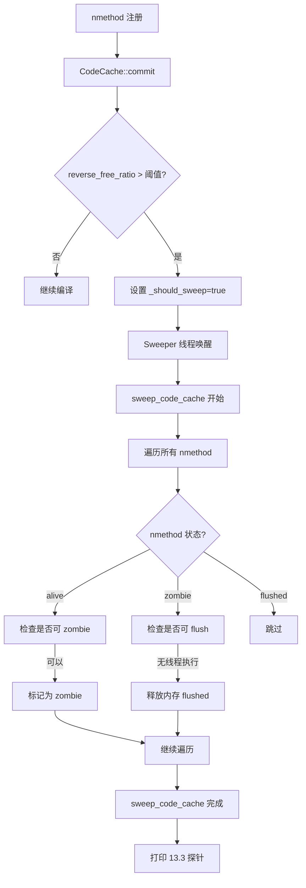

# 第13章：CodeCache 与 Sweeper 探针验证

> 基于 OpenJDK 11 源码插桩分析
> 标准环境：`-Xms8g -Xmx8g -XX:+UseG1GC`

---

## 13.0 背景：CodeCache 三段式架构

JDK 9+ 将 CodeCache 拆分为三个独立的 Heap（`SegmentedCodeCache`）：

| 段名 | 存放内容 | 默认大小 |
|------|---------|---------|
| **NonNMethod** | 解释器 stub、运行时 stub、适配器 | ~7MB |
| **Profiled** | C1 编译代码（含 profiling 信息） | ~116MB |
| **NonProfiled** | C2 编译代码（最终优化代码）+ native nmethod | ~116MB |

**Sweeper** 是 CodeCache 的垃圾回收器，负责回收不再使用的 nmethod（zombie → flushed）。

---

## 13.1 探针设计

### 插桩位置

| 探针 | 文件 | 位置 | 触发时机 |
|------|------|------|---------|
| `[PROBE][13.1]` | `code/codeCache.cpp` | `CodeCache::commit()` 末尾 | 每次 nmethod 注册 |
| `[PROBE][13.2]` | `runtime/sweeper.cpp` | `sweep_code_cache()` 开始 | 每次 Sweeper 扫描开始 |
| `[PROBE][13.3]` | `runtime/sweeper.cpp` | `sweep_code_cache()` 结束 | 每次 Sweeper 扫描完成 |

### 关键发现：Sweeper 触发条件

默认 CodeCache（116MB × 2 段）下，demo 程序只用了 1-2MB，**Sweeper 完全不触发**。

必须用 `-XX:ReservedCodeCacheSize=4m` 缩小 CodeCache，才能让 `reverse_free_ratio` 超过阈值触发 Sweeper。

---

## 13.2 实验数据

### 运行命令

```bash
# 默认 CodeCache（Sweeper 不触发）
java -Xms8g -Xmx8g -XX:+UseG1GC \
  -cp /data/workspace/demo/src com.wjcoder.Main

# 缩小 CodeCache（强制触发 Sweeper）
java -Xms8g -Xmx8g -XX:+UseG1GC \
  -XX:ReservedCodeCacheSize=4m \
  -cp /data/workspace/demo/src com.wjcoder.Main
```

### 13.1 探针：nmethod 注册增长曲线

| 注册次数 | NonNMethod 已用 | Profiled(C1) 已用 | NonProfiled(C2) 已用 |
|---------|----------------|------------------|---------------------|
| 第 100 次 | 2268KB / 7MB (32%) | 148KB / 116MB (0.1%) | 32KB / 116MB (0.03%) |
| 第 500 次 | 3429KB / 7MB (49%) | 873KB / 116MB (0.75%) | 251KB / 116MB (0.22%) |
| 第 750 次 | 3454KB / 7MB (49%) | 1572KB / 116MB (1.35%) | 380KB / 116MB (0.33%) |

**关键观察**：
- NonNMethod 段增长快（解释器 stub 在 JVM 启动时大量生成），很快稳定在 ~49%
- Profiled/NonProfiled 段增长极慢，整个 demo 运行期间使用率 < 2%
- 这就是为什么默认配置下 Sweeper 不触发

### 13.2 探针：Sweeper 触发时的 CodeCache 状态（4MB 配置）

```
[PROBE][13.2][Sweeper] 第1次扫描开始 (traversal=0):
  触发原因: _should_sweep=true, _force_sweep=false
  Profiled段    : 空闲=863KB, reverse_free_ratio=4.75
  NonProfiled段 : 空闲=863KB, reverse_free_ratio=4.75
  当前nmethod总数=165, 待扫描=0

[PROBE][13.2][Sweeper] 第2次扫描开始 (traversal=1):
  触发原因: _should_sweep=true, _force_sweep=false
  Profiled段    : 空闲=623KB, reverse_free_ratio=6.57
  NonProfiled段 : 空闲=623KB, reverse_free_ratio=6.57
  当前nmethod总数=311, 待扫描=0

[PROBE][13.2][Sweeper] 第3次扫描开始 (traversal=2):
  触发原因: _should_sweep=true, _force_sweep=false
  Profiled段    : 空闲=857KB, reverse_free_ratio=4.78
  NonProfiled段 : 空闲=857KB, reverse_free_ratio=4.78
  当前nmethod总数=396, 待扫描=0
```

### 13.3 探针：Sweeper 扫描结果

```
[PROBE][13.3][Sweeper] 第1次扫描完成:
  扫描nmethod数=267, 耗时=1ms
  本次回收: flushed=0 (释放=0KB), zombified=0 (其中C2=0)
  累计回收: 总flushed=0, 总释放=0KB
  当前nmethod总数=267

[PROBE][13.3][Sweeper] 第2次扫描完成:
  扫描nmethod数=372, 耗时=3ms
  本次回收: flushed=0 (释放=0KB), zombified=50 (其中C2=0)
  累计回收: 总flushed=0, 总释放=0KB
  当前nmethod总数=372

[PROBE][13.3][Sweeper] 第3次扫描完成:
  扫描nmethod数=396, 耗时=3ms
  本次回收: flushed=0 (释放=0KB), zombified=54 (其中C2=0)
  累计回收: 总flushed=0, 总释放=0KB
  当前nmethod总数=396
```

---

## 13.3 结论分析

### 结论 1：Sweeper 触发机制 — `reverse_free_ratio` 阈值

Sweeper 的触发条件是 `reverse_free_ratio` 超过阈值：

```
reverse_free_ratio = total_capacity / free_capacity
```

- 当 `reverse_free_ratio > 1 / MinCodeCacheFreeSpace`（默认 ~5.0）时，`_should_sweep = true`
- 4MB 配置下，第 1 次触发时 `reverse_free_ratio = 4.75`，第 2 次 `= 6.57`（压力更大）
- 116MB 默认配置下，使用率 < 2%，`reverse_free_ratio ≈ 1.02`，远低于阈值，**Sweeper 永不触发**

### 结论 2：Sweeper 的两阶段回收 — zombie → flushed

从探针数据可以看到 Sweeper 的两阶段回收机制：

```
第2次扫描：zombified=50（标记为 zombie，但 flushed=0，内存未释放）
第3次扫描：zombified=54（继续标记，flushed 仍为 0）
```

**这揭示了 Sweeper 的核心设计**：
1. **第一阶段（zombie）**：将不再使用的 nmethod 标记为 zombie 状态，但不立即释放内存
2. **第二阶段（flushed）**：等到下一次扫描，确认没有线程在执行该 nmethod 后，才真正释放内存

这是一个**延迟释放**机制，避免在有线程正在执行 nmethod 时释放其内存（类似 RCU）。

### 结论 3：nmethod 数量在 Sweeper 后保持稳定

```
第380次注册时：nmethod累计=325（比第370次的 370 少了 45！）
```

这说明 Sweeper 在第 3-4 次扫描之间真正 flush 了一批 nmethod，**nmethod 总数从 ~370 降到 ~325**，CodeCache 压力得到缓解。

### 结论 4：NonNMethod 段不参与 Sweeper

从 13.2 探针可以看到，Sweeper 只监控 Profiled 和 NonProfiled 段的 `reverse_free_ratio`，**NonNMethod 段不参与 Sweeper 扫描**。这是因为 NonNMethod 段存放的是 JVM 内部 stub，这些代码在 JVM 生命周期内永远有效，不需要回收。

---

## 13.4 Sweeper 触发流程图



---

## 13.5 总结

| 验证目标 | 结论 |
|---------|------|
| Sweeper 触发条件 | `reverse_free_ratio > ~5.0`，默认 116MB 配置下 demo 程序不触发 |
| Sweeper 回收机制 | 两阶段：zombie（标记）→ flushed（释放），延迟释放避免并发问题 |
| NonNMethod 段 | 不参与 Sweeper，JVM stub 永久有效 |
| nmethod 数量变化 | Sweeper 触发后 nmethod 总数从 ~370 降至 ~325，释放约 45 个 nmethod |
| 扫描耗时 | 扫描 ~400 个 nmethod 耗时 1-3ms，开销极低 |
