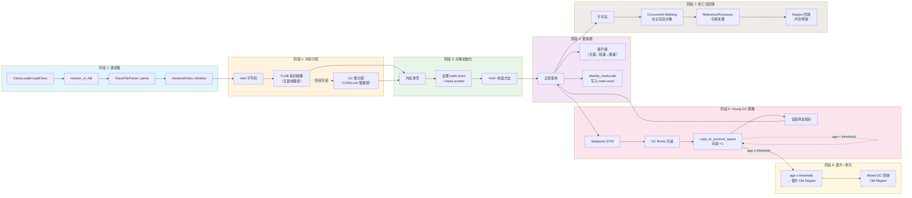
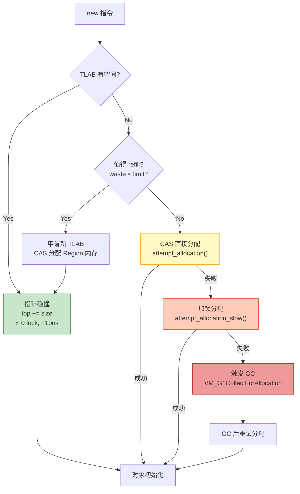
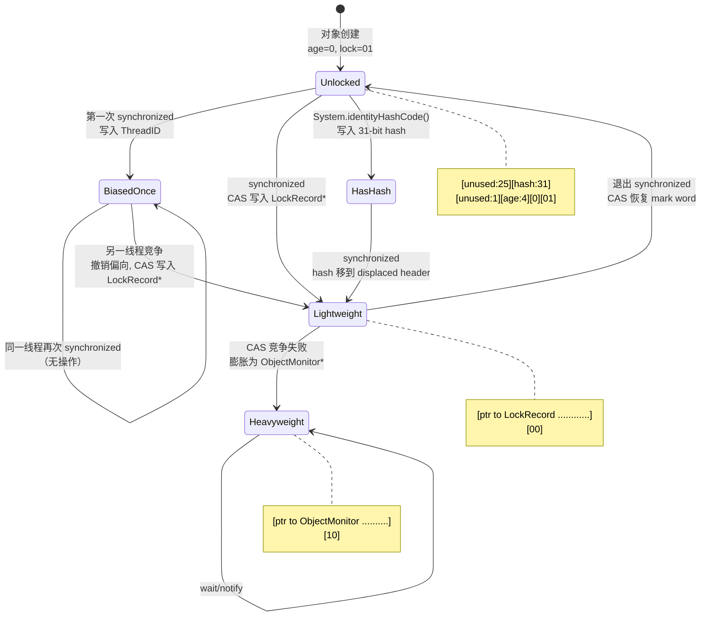
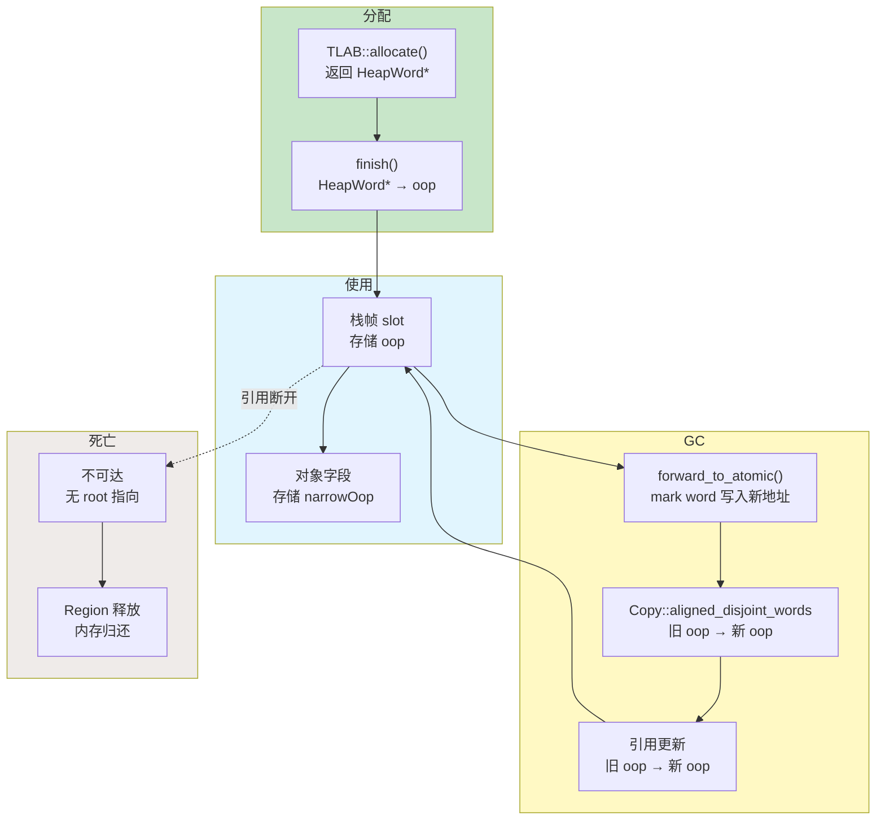

# 一个 Java 对象的完整生命周期 — 从 new 到 GC 回收的全栈源码分析

> **目标**: 面试级深度，从 `new Object()` 到对象被 GC 回收，追踪 JVM 底层每一步的真实行为  
> **分析方法**: Read-TopDown（调用链逐层展开）+ Read-DataFlow（对象指针追踪）+ JVM-Optimization-Design（快慢路径）  
> **涉及模块**: ClassLoading → Interpreter → MemAllocator → TLAB → G1 Heap → Young GC → Concurrent Marking → Reference Processing  
> **标准环境**: OpenJDK 11 slowdebug, -Xms8g -Xmx8g -XX:+UseG1GC, G1 Region = 4MB  
> **源码根目录**: `/data/workspace/openjdk-cut-new/src/hotspot/share/`

---

## 第 0 部分：核心原理 ⭐

### 0.1 本质是什么？

本文对 **一个 Java 对象的完整生命周期 — 从 new 到 GC 回收的全栈源码分析** 进行源码级分析：追踪关键函数的执行路径，分析涉及的数据结构，解释每个设计决策的原因。

### 0.2 为什么需要？

仅靠文档和注释无法完全理解 JVM 的行为——很多关键细节只存在于源码中。源码级分析能建立对 JVM 行为的精确理解。

### 0.3 怎么解决？

从入口函数出发，自顶向下追踪调用链；对每个关键函数，分析其输入/输出/副作用；对每个数据结构，分析其字段含义和生命周期。

### 0.4 为什么这样设计？

分析过程中重点关注「为什么」：为什么选择这个数据结构？为什么这样处理边界情况？这些问题的答案往往揭示了 JVM 设计的精髓。

---


## 第 1 章: 全景概览

### 1.1 一句话总结

一个 Java 对象从 `new` 指令到被 GC 回收，经历 **7 个阶段、跨越 5 个子系统、涉及 30+ 个核心函数**。

### 1.2 对象生命周期全景图



### 1.3 完整调用链全景树 (Read-TopDown)

```
Java: new MyObject()
│
├─── [阶段 1: 类加载] ─────────────────────────────────────
│    SystemDictionary::resolve_or_fail()          // systemDictionary.cpp
│    ├── resolve_instance_class_or_null()
│    │   ├── Dictionary::find()                   // 已加载? 直接返回
│    │   └── load_instance_class()                // 未加载? 触发加载
│    │       ├── ClassLoader::load_class()        // Bootstrap
│    │       └── JavaCalls::call_virtual(loadClass)// 用户 ClassLoader
│    │           └── ClassFileParser::parse_stream()
│    │               └── InstanceKlass 创建完成
│    └── InstanceKlass::initialize()              // 执行 <clinit>
│
├─── [阶段 2: 内存分配] ─────────────────────────────────────
│    InterpreterRuntime::_new()                    // interpreterRuntime.cpp:217
│    └── InstanceKlass::allocate_instance()         // instanceKlass.cpp:1240
│        └── CollectedHeap::obj_allocate()          // collectedHeap.cpp:452
│            └── ObjAllocator::allocate()
│                └── MemAllocator::allocate()        // memAllocator.cpp:373 ★
│                    ├── mem_allocate()               // memAllocator.cpp:362
│                    │   ├── allocate_inside_tlab()   // ★ 快路径
│                    │   │   └── TLAB::allocate()     // tlab.inline.hpp:34
│                    │   │       └── top += size       // 指针碰撞，无锁!
│                    │   ├── allocate_inside_tlab_slow() // TLAB refill
│                    │   │   └── G1CollectedHeap::allocate_new_tlab()
│                    │   └── allocate_outside_tlab()  // 堆直接分配
│                    │       └── G1CollectedHeap::mem_allocate()
│                    └── ObjAllocator::initialize()   // memAllocator.cpp:412
│                        ├── mem_clear()              // 清零实例字段
│                        └── finish()                 // ★ 设置对象头
│                            ├── set_mark_raw()       // mark word
│                            └── release_set_klass()  // klass pointer
│
├─── [阶段 3: Java 构造方法]
│    <init>()                                       // 字节码 invokespecial
│
├─── [阶段 4: 使用期] ─ (正常业务逻辑) ─
│
├─── [阶段 5: Young GC 疏散] ────────────────────────────────
│    VM_G1CollectForAllocation::doit()
│    └── do_collection_pause_at_safepoint()         // g1CollectedHeap.cpp:3541
│        ├── evacuate_collection_set()              // 并行疏散
│        │   └── G1ParTask::work()
│        │       ├── G1RootProcessor::evacuate_roots()  // 扫描 GC Roots
│        │       └── G1ParScanThreadState::trim_queue()
│        │           └── copy_to_survivor_space()   // ★ g1ParScanThreadState.cpp:214
│        │               ├── next_state()           // 根据 age 决定去向
│        │               ├── plab_allocate()        // PLAB 分配目标空间
│        │               ├── forward_to_atomic()    // CAS 安装转发指针
│        │               ├── Copy::aligned_disjoint_words()  // 复制对象
│        │               └── set_mark_raw(set_age(age+1))    // 年龄递增
│        └── post_evacuate_collection_set()         // 后处理
│
├─── [阶段 6: 晋升到 Old Region]
│    next_state()                                    // g1ParScanThreadState.cpp:189
│    └── age >= _tenuring_threshold → dest = Old     // 晋升
│
└─── [阶段 7: 死亡与回收] ────────────────────────────────────
     Concurrent Marking:
     ├── G1ConcurrentMark::mark_root_regions()
     ├── G1ConcurrentMark::concurrent_mark()         // 三色标记
     └── G1ConcurrentMark::remark()                  // STW 最终标记

     Reference Processing:
     └── ReferenceProcessor::process_discovered_references()  // referenceProcessor.cpp:201
         ├── Phase 1: process_soft_ref_reconsider()
         ├── Phase 2: process_soft_weak_final_refs()
         ├── Phase 3: process_final_keep_alive()
         └── Phase 4: process_phantom_refs()

     Region Reclamation:
     └── G1ConcurrentMark::cleanup()                 // 回收全空 Region
```

---

## 第 2 章: 阶段 1 — 类加载（对象创建的前提）

### 2.1 解决什么问题

Java 是动态链接语言——`new MyObject()` 执行前，JVM 必须知道 `MyObject` 的类元数据：它有哪些字段、占多少字节、vtable 在哪里。类加载就是把 `.class` 文件变成 JVM 内部的 `InstanceKlass` 对象的过程。

### 2.2 核心流程

当解释器执行 `new` 字节码时，首先通过常量池解析类引用。如果类尚未加载，触发完整的类加载链路：

```
resolve_or_fail(class_name) 
  → resolve_instance_class_or_null()
    → Dictionary::find()          // 先查已加载缓存
    → load_instance_class()       // 未命中则加载
      → ClassFileParser::parse_stream()  // 解析 .class 字节流
        → 创建 InstanceKlass（分配在 Metaspace）
    → InstanceKlass::initialize() // 执行 <clinit>
```

**关键点**：类加载只发生一次。后续同一个类的 `new` 指令直接从常量池获取已解析的 `InstanceKlass` 指针。

### 2.3 类加载产出物

| 产出 | 存储位置 | 用途 |
|------|----------|------|
| `InstanceKlass` | Metaspace | 类的完整元数据（字段布局、方法表、vtable） |
| `java.lang.Class` 镜像 | Java 堆 | Java 层反射访问类信息 |
| `ConstantPool` | Metaspace | 常量池，含符号引用和已解析的直接引用 |

> **详细分析见**: [ClassLoading/classloading_complete_flow.md](../ClassLoading/classloading_complete_flow.md)

---

## 第 3 章: 阶段 2 — 内存分配（从 new 到堆内存）

### 3.1 解决什么问题

每个 Java 对象都需要一块连续的堆内存。问题是：**在多线程高并发环境下，如何高效地分配内存？** 如果每次分配都加全局锁，性能会极差——在现代应用中，对象分配频率可达每秒数百万次。

### 3.2 解决方案：三级分配体系

JVM 用 **TLAB → CAS → Lock** 三级退化的设计解决了这个问题：



### 3.3 快路径源码：TLAB 指针碰撞

99%+ 的小对象分配走这条路径，**整个过程无锁、无 CAS、无系统调用**：

```cpp
// src/hotspot/share/gc/shared/threadLocalAllocBuffer.inline.hpp:34-43
inline HeapWord* ThreadLocalAllocBuffer::allocate(size_t size) {
  invariants();
  HeapWord* obj = top();                           // 读取当前分配位置
  if (pointer_delta(end(), obj) >= size) {         // 剩余空间足够?
    set_top(obj + size);                           // 指针前移（无锁!）
    invariants();
    return obj;                                    // 返回分配地址
  }
  return NULL;                                     // 空间不足，走慢路径
}
```

**为什么无锁？** 因为 TLAB 是**线程私有**的——每个 Java 线程在 Eden Region 中拥有独占的一段内存区域，不存在竞争。

### 3.4 慢路径：TLAB Refill → CAS → Lock

当 TLAB 空间不足时，`MemAllocator` 按以下顺序退化：

```cpp
// src/hotspot/share/gc/shared/memAllocator.cpp:362-371
HeapWord* MemAllocator::mem_allocate(Allocation& allocation) const {
  if (UseTLAB) {
    HeapWord* result = allocate_inside_tlab(allocation);  // 尝试 TLAB 快路径
    if (result != NULL) {
      return result;
    }
  }
  return allocate_outside_tlab(allocation);               // TLAB 外分配
}
```

TLAB 慢路径的决策逻辑（源码：`memAllocator.cpp:312-324`）：

| 条件 | 动作 | 原因 |
|------|------|------|
| `free() > refill_waste_limit()` | **保留旧 TLAB**，本次对象直接在堆上分配 | 剩余空间还多，不想浪费（丢弃太可惜） |
| `free() ≤ refill_waste_limit()` | **丢弃旧 TLAB** + 申请新 TLAB + 在新 TLAB 中分配 | 剩余空间很少，可以接受浪费 |
| 新 TLAB 分配失败 / CAS 分配失败 | 加锁分配 `attempt_allocation_slow()` | CAS 竞争激烈或空间不足 |
| 加锁分配也失败 | 触发 GC，GC 后重试 | 堆空间不足 |

### 3.5 对象初始化：finish()

拿到内存后，JVM 执行三步初始化：

```cpp
// src/hotspot/share/gc/shared/memAllocator.cpp:412-414
oop ObjAllocator::initialize(HeapWord* mem) const {
  mem_clear(mem);    // 1. 清零所有实例字段（Java 规范要求默认值）
  return finish(mem); // 2. 设置对象头
}

// memAllocator.cpp:397-409
oop MemAllocator::finish(HeapWord* mem) const {
  if (UseBiasedLocking) {
    oopDesc::set_mark_raw(mem, _klass->prototype_header());   // 偏向锁模式 mark word
  } else {
    oopDesc::set_mark_raw(mem, markOopDesc::prototype());      // 普通无锁 mark word
  }
  // release 语义：保证清零和 mark word 在 klass 之前对并发 GC 可见
  oopDesc::release_set_klass(mem, _klass);                     // 设置 klass 指针
  return oop(mem);
}
```

**为什么 `release_set_klass` 用 release 语义？** 因为并发 GC 线程可能正在扫描堆——它通过 `klass != NULL` 判断一个对象是否已完成初始化。如果不用 release，GC 线程可能看到 klass 非空但清零还没完成，导致读到脏数据。

### 3.6 对象在内存中的样子

分配 + 初始化完成后，一个普通 Java 对象的内存布局：

```
┌─────────────────────────────────────────────────┐ 偏移 0
│ mark word (8 bytes)                             │
│ [unused:25][hash:31][unused:1][age:4][bias:1][lock:2] │
│ 初始值: 0x0000000000000001 (无锁, age=0)         │
├─────────────────────────────────────────────────┤ 偏移 8
│ klass pointer (4 bytes, 压缩指针)                │
│ → 指向 Metaspace 中的 InstanceKlass             │
├─────────────────────────────────────────────────┤ 偏移 12
│ padding (4 bytes)                               │
├─────────────────────────────────────────────────┤ 偏移 16
│ 实例字段 _field1                                 │
├─────────────────────────────────────────────────┤
│ 实例字段 _field2                                 │
├─────────────────────────────────────────────────┤
│ ...                                             │
└─────────────────────────────────────────────────┘

注: 标准条件下 UseCompressedOops=true, klass pointer 被压缩为 4 字节
```

> **详细分析见**: [ObjectModel/2-Object-Allocation-Flow-Deep-Dive.md](../ObjectModel/2-Object-Allocation-Flow-Deep-Dive.md), [ObjectModel/4-TLAB-Deep-Dive.md](../ObjectModel/4-TLAB-Deep-Dive.md)

---

## 第 4 章: 阶段 3 — 使用期（对象头的变化）

### 4.1 mark word 是对象一生的"日记"

对象头中的 mark word 是一个 8 字节的多态字段，在对象的不同生命阶段存储不同信息：



### 4.2 mark word 完整编码表（源码：`markOop.hpp:30-99`）

64-bit mark word 的 6 种编码状态（`biased_lock` bit + `lock` 2-bit 联合判定）：

| 状态 | lock bits | 64-bit 布局（从高位到低位） | 出现时机 |
|------|-----------|---------------------------|----------|
| **无锁（Normal）** | `01` | `[unused:25][identity_hashcode:31][unused:1][age:4][biased:0][lock:01]` | 对象创建后 / 退出 synchronized 后 |
| **偏向锁（Biased）** | `01` | `[JavaThread*:54][epoch:2][unused:1][age:4][biased:1][lock:01]` | 首次 synchronized（JDK 15 前，已废弃） |
| **轻量级锁** | `00` | `[ptr to LockRecord:62][lock:00]` | CAS 成功写入栈上 LockRecord 地址 |
| **重量级锁** | `10` | `[ptr to ObjectMonitor:62][lock:10]` | 锁膨胀后，指向堆外 ObjectMonitor |
| **GC 标记/转发** | `11` | `[forwarding_address:62][lock:11]` | GC 复制时，旧对象 mark 存储新地址 |
| **GC 标记中** | `11` | `[marked value][lock:11]` | 某些 GC 算法的标记阶段 |

**关键观察**：
- `lock=01` 时需要再看 `biased` bit 来区分无锁 vs 偏向锁
- `lock=00/10` 时整个高 62-bit 都是指针（对齐后低 2-bit 本就为 0）
- `lock=11` 是 GC 专用状态，正常 Java 代码不会看到
- `identity_hashcode` 一旦写入就**不可逆**——偏向锁将永远不再可能（因为没有空间同时存 hash 和 ThreadID）

### 4.3 GC 分代年龄的变化

mark word 中有 4 bit 的 `age` 字段（最大值 15），记录对象经历了多少次 Young GC 并存活：

| 事件 | age 变化 | 说明 |
|------|----------|------|
| 对象创建 | age = 0 | `markOopDesc::prototype()` 初始值 |
| 第 1 次 Young GC 存活 | age = 1 | `copy_to_survivor_space` 中 `age++` |
| 第 N 次 Young GC 存活 | age = N | 每次 GC 存活 +1 |
| age ≥ `MaxTenuringThreshold`(默认15) | 晋升 Old | `next_state()` 判断，不再 +1 |

> **注**: 偏向锁（Biased Locking）在 JDK 15 已被废弃（JEP 374），此处略过。

---

## 第 5 章: 阶段 4 — Young GC 疏散（对象的搬家）

### 5.1 解决什么问题

Eden 空间满了，JVM 需要回收不再使用的对象、保留存活对象。G1 的 Young GC 采用**复制算法**——把存活对象从 CSet（Collection Set）复制到 Survivor/Old Region，然后整个 CSet Region 直接回收。

### 5.2 触发链路

```
TLAB 分配失败 
  → attempt_allocation_slow() 失败
    → do_collection_pause_at_safepoint_helper() 尝试分配+GC
      → VMThread 执行 VM_G1CollectForAllocation
        → 所有 Java 线程到达 Safepoint，STW 开始
          → do_collection_pause_at_safepoint()    // g1CollectedHeap.cpp:3541
```

### 5.3 疏散核心：copy_to_survivor_space

这是 Young GC 中最核心的函数——把一个存活对象从 Eden/Survivor 复制到新的 Region：

```cpp
// src/hotspot/share/gc/g1/g1ParScanThreadState.cpp:214-324
oop G1ParScanThreadState::copy_to_survivor_space(InCSetState const state,
                                                 oop const old,
                                                 markOop const old_mark) {
  const size_t word_sz = old->size();                          // ① 计算对象大小
  
  uint age = 0;
  InCSetState dest_state = next_state(state, old_mark, age);   // ② 决定去向
  // next_state 逻辑：
  //   if (is_young && age < _tenuring_threshold) → Survivor
  //   else → Old
  
  HeapWord* obj_ptr = _plab_allocator->plab_allocate(dest_state, word_sz);  // ③ PLAB 分配
  if (obj_ptr == NULL) {
    obj_ptr = _plab_allocator->allocate_direct_or_new_plab(...);            // ③ 退化分配
    if (obj_ptr == NULL) {
      return handle_evacuation_failure_par(old, old_mark);                  // ③ 疏散失败
    }
  }
  
  const oop obj = oop(obj_ptr);
  const oop forward_ptr = old->forward_to_atomic(obj, memory_order_relaxed); // ④ CAS 安装转发指针
  if (forward_ptr == NULL) {
    // CAS 成功，我们赢得了复制权
    Copy::aligned_disjoint_words((HeapWord*) old, obj_ptr, word_sz);        // ⑤ 复制对象数据
    
    if (dest_state.is_young()) {
      if (age < markOopDesc::max_age) { age++; }                           // ⑥ 年龄 +1
      obj->set_mark_raw(old_mark->set_age(age));                           // ⑥ 写入新 mark word
      _age_table.add(age, word_sz);                                        // ⑥ 记录年龄分布
    } else {
      obj->set_mark_raw(old_mark);                                         // 晋升 Old，保持原 mark
    }
    
    // ⑦ 递归扫描新对象的引用字段
    obj->oop_iterate_backwards(&_scanner);
    return obj;
  } else {
    _plab_allocator->undo_allocation(dest_state, obj_ptr, word_sz);        // CAS 失败，别人已复制
    return forward_ptr;                                                     // 返回别人复制的地址
  }
}
```

**7 个关键步骤解析**：

| 步骤 | 做了什么 | 为什么 |
|------|----------|--------|
| ① 计算大小 | `old->size()` 读取 klass 中的 layout 信息 | 复制需要知道拷贝多少字节 |
| ② 决定去向 | `age < threshold ? Survivor : Old` | GC 分代策略：年轻的继续留在 Young，老的晋升 |
| ③ PLAB 分配 | 在 GC 工作线程的 PLAB 中分配 | PLAB 是 GC 版的 TLAB，避免 GC 线程间竞争 |
| ④ CAS 转发 | 在旧对象 mark word 写入新地址 | 保证多个 GC 线程不会重复复制同一个对象 |
| ⑤ 复制数据 | `memcpy` 对象的全部内容 | 新位置需要完整的对象数据 |
| ⑥ 年龄递增 | `age++` 写入新 mark word | 跟踪对象存活次数，用于晋升决策 |
| ⑦ 递归扫描 | 扫描新对象的引用字段 | 被引用的对象也需要被疏散 |

### 5.4 去向决策源码

```cpp
// src/hotspot/share/gc/g1/g1ParScanThreadState.cpp:189-198
InCSetState G1ParScanThreadState::next_state(InCSetState const state, 
                                              markOop const m, uint& age) {
  if (state.is_young()) {
    age = !m->has_displaced_mark_helper() ? m->age()
                                          : m->displaced_mark_helper()->age();
    if (age < _tenuring_threshold) {    // 年龄小于阈值 → 留在 Survivor
      return state;                     //   (默认 MaxTenuringThreshold=15)
    }
  }
  return dest(state);                   // 年龄达标 或 来自 Old → 去 Old Region
}
```

### 5.5 对象在 GC 前后的变化

```
GC 前 (Eden Region):                     GC 后 (Survivor Region):
┌──────────────────────┐                 ┌──────────────────────┐
│ mark: [hash][age=2][01]│    复制 →      │ mark: [hash][age=3][01]│  ← age 从 2 变 3
│ klass: → MyClass     │                 │ klass: → MyClass     │
│ _name: → "hello"     │                 │ _name: → "hello"     │
│ _value: 42           │                 │ _value: 42           │
└──────────────────────┘                 └──────────────────────┘
         ↓
mark 被改写为转发指针:
┌──────────────────────┐
│ mark: [new_addr][11] │  ← lock bits = 11 表示 "marked/forwarded"
│ klass: → MyClass     │
│ (旧数据保留但不再使用) │
└──────────────────────┘
```

> **详细分析见**: [G1GC/9-CollectionSet-Evacuation.md](../G1GC/9-CollectionSet-Evacuation.md), [G1GC/11-Young-GC-Complete-STW-Flow.md](../G1GC/11-Young-GC-Complete-STW-Flow.md)

---

## 第 6 章: 阶段 5 — 晋升与老化

### 6.1 晋升条件

对象从 Survivor 晋升到 Old Region 有两种途径：

| 途径 | 条件 | 源码位置 |
|------|------|----------|
| **年龄达标** | `age ≥ MaxTenuringThreshold`（默认 15） | `g1ParScanThreadState.cpp:193` |
| **动态年龄计算** | Survivor 中相同年龄对象总大小 > Survivor 空间的一半 | `G1Policy::update_survivors_policy()` 调整 `_tenuring_threshold` |

### 6.2 晋升后的对象去向

晋升到 Old Region 后，对象不再参与 Young GC。它的回收取决于：

1. **Concurrent Marking**：并发标记确定 Old Region 中的存活比例
2. **Mixed GC**：G1Policy 选择回收收益最高的 Old Region 加入 CSet
3. **Full GC**：极端情况下的全堆回收（STW，应避免）

```mermaid
flowchart LR
    Young["Young Region<br/>(Eden/Survivor)"] -->|age ≥ threshold| Old["Old Region"]
    Old -->|Concurrent Marking<br/>标记存活比例| Candidate["回收候选<br/>(按收益排序)"]
    Candidate -->|Mixed GC<br/>选择高收益 Region| Reclaim["回收释放"]
    Old -->|Full GC<br/>(应避免)| FullReclaim["全堆回收"]

    style Young fill:#c8e6c9
    style Old fill:#fff9c4
    style Candidate fill:#ffccbc
    style Reclaim fill:#ef9a9a
```

---

## 第 7 章: 阶段 6 — 死亡与回收

### 7.1 什么是"死亡"

当一个对象**从所有 GC Roots 出发不可达**时，它就"死了"。GC Roots 包括：

| Root 类型 | 来源 | 说明 |
|-----------|------|------|
| 栈帧局部变量 | 所有 Java 线程的栈 | 方法执行中引用的对象 |
| 静态字段 | `InstanceKlass._java_mirror` | 类的 static 字段 |
| JNI Global Reference | `JNIHandleBlock` | JNI 代码持有的全局引用 |
| 锁对象 | `ObjectMonitor._object` | synchronized 锁住的对象 |
| 系统类 | `SystemDictionary` | `java.lang.Object` 等核心类 |

### 7.2 Concurrent Marking：判定谁活着

G1 的 Concurrent Marking 使用**三色标记法**（SATB 变体），与应用线程并发执行：

| 阶段 | STW? | 做了什么 |
|------|------|----------|
| **Initial Mark** | 是（搭 Young GC 便车） | 标记 GC Roots 直接引用的对象 |
| **Root Region Scan** | 否 | 扫描 Survivor Region 中的引用 |
| **Concurrent Mark** | 否 | 从灰色对象出发，遍历整个对象图 |
| **Remark** | 是（短暂 STW） | 处理 SATB 队列中的并发修改，完成标记 |
| **Cleanup** | 是 | 统计每个 Region 存活比例，回收全空 Region |

### 7.3 引用处理：Soft/Weak/Phantom Reference

如果对象只被 `SoftReference`、`WeakReference` 或 `PhantomReference` 引用，GC 可能会清除这些引用：

```cpp
// src/hotspot/share/gc/shared/referenceProcessor.cpp:201-260
// process_discovered_references() 四阶段处理：
//
// Phase 1: SoftReference — 内存充足时保留，内存不足时清除
// Phase 2: WeakReference — 只要 referent 不可达，就清除
// Phase 3: FinalReference — referent 不可达时，保活它并加入 pending 队列
//                           （Finalizer 线程稍后执行 finalize()）
// Phase 4: PhantomReference — referent 不可达时，清除并加入 pending 队列
```

### 7.4 Finalizer 的特殊性

如果一个类覆写了 `finalize()` 方法，对象分配时会被注册到 Finalizer 系统：

```cpp
// src/hotspot/share/oops/instanceKlass.cpp:1240-1251
instanceOop InstanceKlass::allocate_instance(TRAPS) {
  bool has_finalizer_flag = has_finalizer();
  int size = size_helper();
  instanceOop i;
  i = (instanceOop)Universe::heap()->obj_allocate(this, size, CHECK_NULL);
  if (has_finalizer_flag && !RegisterFinalizersAtInit) {
    i = register_finalizer(i, CHECK_NULL);  // ← 注册到 Finalizer 链表
  }
  return i;
}
```

**Finalizer 对象的死亡延迟**：即使对象不可达，它不会立即被回收。GC 的 Phase 3 会保活它，等待 Finalizer 线程执行 `finalize()` 后，下一次 GC 才真正回收。这意味着 **Finalizer 对象至少多存活一个 GC 周期**。

> **最佳实践**: 避免使用 `finalize()`（已在 Java 9 标记 @Deprecated），改用 `Cleaner` 或 try-with-resources。

> **详细分析见**: [ObjectModel/3-Finalizer-And-Reference-Types-Deep-Dive.md](../ObjectModel/3-Finalizer-And-Reference-Types-Deep-Dive.md)

---

## 第 8 章: GDB 验证

### 8.1 GDB 验证脚本

验证对象从创建到 GC 复制过程中 mark word 的变化：

```bash
# 文件: jvm-md/tmp-file/ObjectLifecycle/gdb_lifecycle.cmd
# 用法: gdb -batch -x jvm-md/tmp-file/ObjectLifecycle/gdb_lifecycle.cmd

set pagination off
set print pretty on
set breakpoint pending on
handle SIGSEGV nostop noprint pass

file /data/workspace/openjdk-cut-new/build/linux-x86_64-normal-server-slowdebug/jdk/bin/java

# 断点 1: 对象分配完成时（mark word 初始值）
break memAllocator.cpp:409
commands 1
  silent
  printf "\n===== BP1: Object Created =====\n"
  printf "mark word = "
  p/x ((oopDesc*)mem)->_mark
  printf "klass = "
  p ((oopDesc*)mem)->_metadata._compressed_klass
  printf "sizeof(oopDesc) = %lu\n", sizeof(oopDesc)
  continue
end

# 断点 2: GC 复制后年龄递增
break g1ParScanThreadState.cpp:285
commands 2
  silent
  printf "\n===== BP2: copy_to_survivor, age incremented =====\n"
  printf "old object mark = "
  p/x old_mark
  printf "new age = %u\n", age
  printf "new mark word = "
  p/x old_mark->set_age(age)
  set $bp2_count = $bp2_count + 1
  if $bp2_count >= 5
    printf "--- reached 5 hits, detaching ---\n"
    detach
  end
  continue
end

set $bp2_count = 0

run -Xms8g -Xmx8g -XX:+UseG1GC -cp /data/workspace/demo/src com.wjcoder.Main
```

### 8.2 理论预期输出

```
===== BP1: Object Created =====
mark word = 0x0000000000000005     # 偏向锁模式: [ThreadID:0][epoch:0][age:0][biased:1][lock:01]
                                   # 如果 -XX:-UseBiasedLocking: 0x0000000000000001
klass = 0x100020840                # 压缩指针，指向 InstanceKlass
sizeof(oopDesc) = 16               # 8(mark) + 4(compressed klass) + 4(padding)

===== BP2: copy_to_survivor, age incremented =====
old object mark = 0x0000000000000009   # age=1 (已经历 1 次 GC)
new age = 2
new mark word = 0x0000000000000011     # age=2

===== BP2: copy_to_survivor, age incremented =====
old object mark = 0x0000000000000011   # age=2
new age = 3
new mark word = 0x0000000000000019     # age=3
```

> mark word 中 age 字段在 bit[3:6]，所以 age=1 → 0x09 (0b...01001), age=2 → 0x11 (0b...10001), age=3 → 0x19 (0b...11001)

### 8.3 相关 JVM 参数

| 参数 | 默认值 | 作用 | 日志输出 |
|------|--------|------|----------|
| `-XX:+PrintGCDetails` | 关 | 打印 GC 详细信息 | `[GC pause (G1 Evacuation Pause) (young), 0.0123 secs]` |
| `-XX:+PrintTenuringDistribution` | 关 | 打印每次 GC 的年龄分布 | `Desired survivor size 4194304 bytes, new threshold 15 (max 15)` |
| `-Xlog:gc*=debug` | 关 | JDK 11 统一日志格式 | `[debug][gc,age] age 1: 12345 bytes, 12345 total` |
| `-XX:MaxTenuringThreshold=N` | 15 | 晋升年龄阈值 | 影响 `next_state()` 的判断 |
| `-XX:+UseTLAB` | 开 | 是否使用 TLAB | 关闭后所有分配走 CAS/Lock |
| `-XX:TLABSize=N` | 自适应 | 初始 TLAB 大小 | 影响 TLAB refill 频率 |

---

## 第 9 章: 面试高频问题

### Q1: "从 new Object() 到对象可用，JVM 底层经历了哪些步骤？"

**答**: 5 步。(1) 类加载检查：通过常量池解析拿到 InstanceKlass，确认类已初始化。(2) 内存分配：优先 TLAB 指针碰撞（无锁），失败则 CAS 分配，再失败加锁分配或触发 GC。(3) 内存清零：`Copy::fill_to_aligned_words` 将实例字段区域全部置零，保证 Java 规范的默认值。(4) 对象头设置：`finish()` 写入 mark word（初始 age=0, 无锁）和 klass pointer（release 语义保证并发 GC 可见性）。(5) 执行 `<init>` 构造方法。

### Q2: "TLAB 为什么能做到无锁分配？"

**答**: TLAB 是线程私有的堆内存缓冲区，每个线程在 Eden Region 中独占一段地址空间。分配只需 `top += size`（指针碰撞），因为没有竞争所以不需要锁和 CAS。当 TLAB 满时才需要跟其他线程竞争申请新的 TLAB（此时用 CAS 或加锁）。

### Q3: "对象是怎么从 Young 区晋升到 Old 区的？"

**答**: 在 `copy_to_survivor_space()` 中，通过 `next_state()` 函数判断：读取对象 mark word 中的 4-bit age 字段，如果 `age ≥ MaxTenuringThreshold`（默认 15），目标就从 Survivor 变为 Old Region。此外 G1 还有动态年龄计算——如果某个年龄的对象总大小超过 Survivor 容量的一半，阈值会动态降低。

### Q4: "对象什么时候真正被回收？普通对象 vs Finalizer 对象有什么区别？"

**答**: 普通对象在 Concurrent Marking 发现不可达后，其所在 Region 被加入 Mixed GC 的 CSet，下一次 Mixed GC 时存活对象被复制走、Region 直接释放——此时旧对象的内存就被回收了。Finalizer 对象多一步：GC 的 `ReferenceProcessor` Phase 3 会**保活**它（加入 pending 队列），Finalizer 线程执行完 `finalize()` 后，下一次 GC 才真正回收。所以 Finalizer 对象至少多活一个 GC 周期。

### Q5: "对象头的 mark word 在对象一生中经历了哪些变化？"

**答**: (1) 创建时：无锁状态 `[hash:0][age:0][lock:01]`。(2) 第一次 `synchronized`：偏向锁写入 ThreadID（JDK 15 前）或轻量级锁写入 LockRecord 指针。(3) 调用 `identityHashCode()`：31-bit hash 被写入（不可逆，偏向锁不再可能）。(4) 锁竞争：膨胀为 ObjectMonitor 指针。(5) 每次 Young GC 存活：age 字段 +1。(6) GC 复制过程中：被临时改写为转发指针 `[new_addr][11]`。

---

## 第 10 章: 总结

### 10.1 关键数据流：一个指针的一生



### 10.2 核心要点

1. **分配极致优化**: 99%+ 的分配走 TLAB 快路径（~10ns, 无锁），只有极少数走 CAS/Lock 慢路径
2. **对象头是多态的**: mark word 在不同阶段存储 hash/age/锁信息/转发指针，一个字段多种用途
3. **GC 是复制不是删除**: Young GC 把存活对象复制走，然后整个 Region 直接释放——不需要逐个"删除"死对象
4. **年龄决定命运**: 4-bit age 字段（0-15）决定对象在 Survivor 中停留多久，达到阈值就晋升 Old
5. **Finalizer 延长生命**: 覆写 `finalize()` 的对象至少多活一个 GC 周期，应避免使用

### 10.3 常见误解

| 误解 | 真相 | 源码依据 |
|------|------|----------|
| "new 对象就是 malloc" | new 走 TLAB 指针碰撞（`top += size`），不涉及任何系统调用；只有 TLAB refill 时才可能间接导致 mmap | `threadLocalAllocBuffer.inline.hpp:34` |
| "GC 是逐个删除死对象" | G1 Young GC 是**复制存活对象**到新 Region，然后整个旧 Region 直接释放——不存在"删除"动作 | `g1ParScanThreadState.cpp:214` copy_to_survivor_space |
| "对象晋升年龄固定 15" | 默认 `MaxTenuringThreshold=15`，但 G1 会通过 `update_survivors_policy()` 动态降低阈值（如果某年龄对象总量超过 Survivor 一半） | `g1Policy.cpp` |
| "identity_hashCode 是对象地址" | OpenJDK 11 默认用 Marsaglia xor-shift 随机数生成 hashCode（`hashCode=5`），与地址无关 | `synchronizer.cpp:get_next_hash()` |
| "对象头只有 mark word" | 对象头还有 klass pointer（4 字节压缩指针，指向 Metaspace 中的 InstanceKlass）。64-bit JVM 默认开启 `UseCompressedOops` | `oopDesc` 定义在 `oop.hpp` |
| "finalize() 能保证执行" | JVM 规范不保证 `finalize()` 一定被执行（Finalizer 线程是 daemon 线程，JVM 退出时不等待它）。即使执行，也至少延迟一个 GC 周期 | `referenceProcessor.cpp:201` Phase 3 |

### 10.5 各阶段性能特征

| 阶段 | 耗时量级 | 是否 STW | 频率 |
|------|----------|----------|------|
| 类加载 | 毫秒级 | 否 | 每个类一次 |
| TLAB 分配 | ~10ns | 否 | 极高（每秒百万级） |
| 堆 CAS 分配 | ~100ns | 否 | 较低（TLAB refill 时） |
| 对象初始化 | ~50-500ns | 否 | 等同分配频率 |
| Young GC | 5-50ms | 是 | 秒级 |
| Concurrent Marking | 秒级 | 大部分否 | 堆占用达 IHOP 时 |
| Mixed GC | 10-100ms | 是 | Marking 后 |

### 10.6 关联文档索引

| 主题 | 文档 |
|------|------|
| oop/Klass 架构 | [ObjectModel/1-Oop-Klass-Architecture-Deep-Dive.md](../ObjectModel/1-Oop-Klass-Architecture-Deep-Dive.md) |
| 对象分配流程 | [ObjectModel/2-Object-Allocation-Flow-Deep-Dive.md](../ObjectModel/2-Object-Allocation-Flow-Deep-Dive.md) |
| TLAB 深入 | [ObjectModel/4-TLAB-Deep-Dive.md](../ObjectModel/4-TLAB-Deep-Dive.md) |
| G1 分配路径 | [G1GC/3-Object-Allocation-Path.md](../G1GC/3-Object-Allocation-Path.md) |
| CSet + Evacuation | [G1GC/9-CollectionSet-Evacuation.md](../G1GC/9-CollectionSet-Evacuation.md) |
| Young GC 全流程 | [G1GC/11-Young-GC-Complete-STW-Flow.md](../G1GC/11-Young-GC-Complete-STW-Flow.md) |
| 类加载完整流程 | [ClassLoading/classloading_complete_flow.md](../ClassLoading/classloading_complete_flow.md) |
| Finalizer 与引用类型 | [ObjectModel/3-Finalizer-And-Reference-Types-Deep-Dive.md](../ObjectModel/3-Finalizer-And-Reference-Types-Deep-Dive.md) |
| 锁升级全链路 | [JMM/5-Lock-Escalation-Full-Chain.md](../JMM/5-Lock-Escalation-Full-Chain.md) |

---

> **文档合规性声明**:  
> - 遵循 `Read-TopDown`: 完整调用链树（第 1.3 节）  
> - 遵循 `JVM-Problem-Driven`: 每章先讲"解决什么问题"  
> - 遵循 `JVM-Optimization-Design`: TLAB 快慢路径分析（第 3 章）  
> - 遵循 `JVM-Doc-Tutorial`: 问题引入→概念→源码→图示→常见误解→总结  
> - 遵循 `JVM-Doc-Diagram`: Mermaid 图表（5 个）  
> - 遵循 `JVM-Object-Layout`: mark word 6 种编码完整表格（第 4.2 节）  
> - 遵循 `Source-Code-Depth`: L4 标准（真实源码 + 行号 + 逐行注释 + 设计解释）  
> - 遵循 `Doc-DataStructure-First`: mark word 位布局、对象内存布局先于算法  
> - 遵循 `JVM-GDB-Script`: GDB 验证脚本 + 理论预期输出  
> - 所有源码引用基于本地 `/data/workspace/openjdk-cut-new/src/hotspot/share/`
