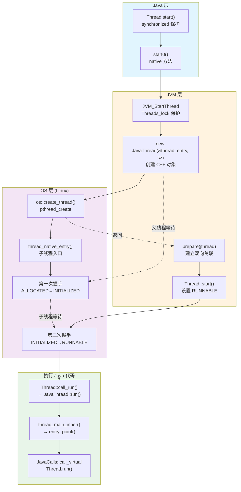
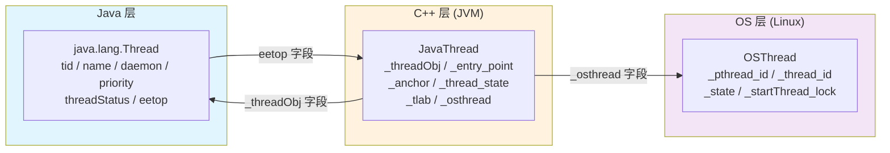
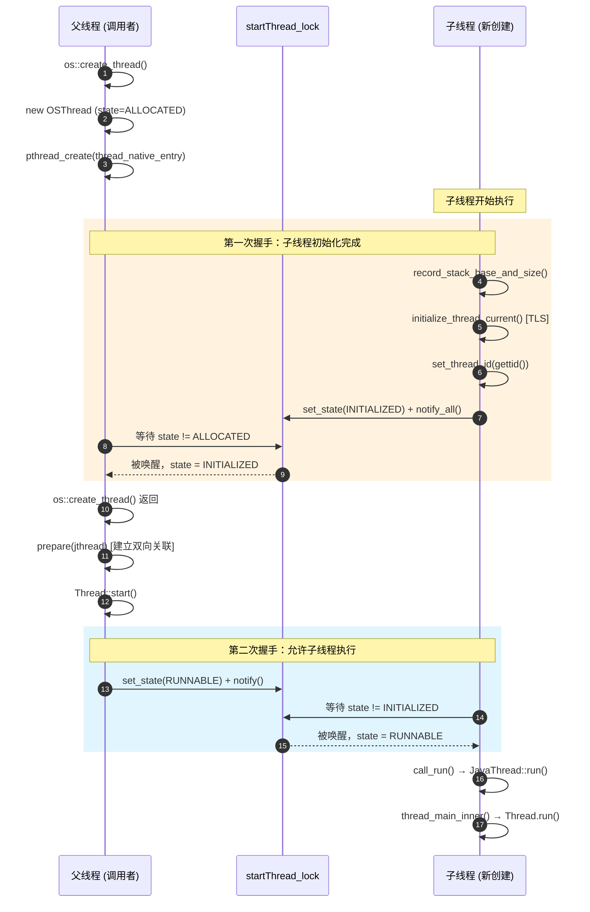
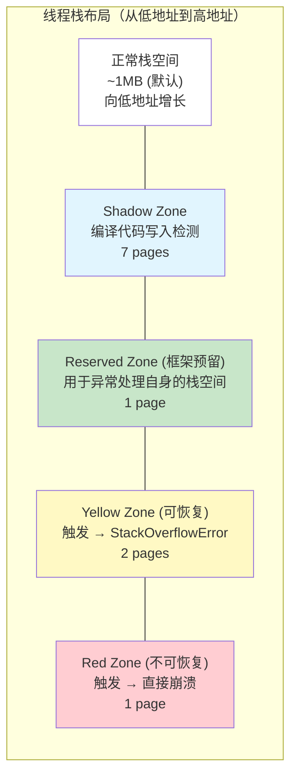

# Java 线程创建的 JVM+OS 全视角 — 从 Thread.start() 到 pthread_create

> **目标**: 面试级深度，追踪一个 Java 线程从创建到执行 run() 的完整路径，贯穿 Java 层、JVM 层、OS 层  
> **分析方法**: Read-TopDown（调用链逐层展开）+ Read-DataFlow（JavaThread/OSThread 生命周期追踪）+ JVM-Concurrency-Design（父子线程两次握手）+ JVM-Problem-Driven（每个设计决策的问题根源）  
> **涉及模块**: java.lang.Thread → JNI → JavaThread → OSThread → pthread → thread_native_entry → JavaCalls  
> **标准环境**: OpenJDK 11 slowdebug, -Xms8g -Xmx8g -XX:+UseG1GC, G1 Region = 4MB  
> **源码根目录**: `/data/workspace/openjdk-cut-new/src/hotspot/share/`

---

## 第 0 部分：核心原理 ⭐

### 0.1 本质是什么？

本文深入分析 **Java 线程创建的 JVM+OS 全视角 — 从 Thread.start() 到 pthread_create**：从源码角度理解其设计原理、实现机制和关键细节。

### 0.2 为什么需要？

理解 JVM 内部实现是排查复杂问题、进行性能优化的基础。表面的 API 文档无法解释 JVM 的实际行为，只有深入源码才能建立精确的心智模型。

### 0.3 怎么解决？

结合源码阅读、数据结构分析和 GDB 运行时验证，从多个角度建立对该机制的完整理解。

### 0.4 为什么这样设计？

每个设计决策都有其权衡：性能 vs 正确性、简单性 vs 灵活性、内存占用 vs 查找速度。理解这些权衡是理解 JVM 设计的关键。

---


## 第 1 章: 全景概览

### 1.1 一句话总结

Java 的 `new Thread().start()` 最终通过 JNI 进入 HotSpot，创建 C++ 的 `JavaThread` 对象，再调用 `pthread_create` 创建 OS 线程。父子线程通过**两次 Monitor 握手**同步状态，确保子线程初始化完成后才被标记为 RUNNABLE。最终子线程通过 `JavaCalls::call_virtual` 回调 Java 层的 `Thread.run()` 方法。

### 1.2 为什么要读这篇文档

面试中"Thread.start() 底层做了什么？""Java 线程和 OS 线程是什么关系？""为什么 start() 不能调两次？"都是高频问题。理解这条完整链路，能串联起 JNI 调用、C++ 对象创建、Linux 线程模型、线程状态机、TLS 机制五大核心子系统。

### 1.3 线程创建全景图



### 1.4 完整调用链全景树 (Read-TopDown)

```
[Java 层]
Thread.start()                                     // Thread.java:780 (synchronized)
└── start0()                                       // Thread.java:812 (native)

[JVM 层 - JNI 入口]
JVM_StartThread(env, jthread)                      // jvm.cpp:2882
├── MutexLocker mu(Threads_lock)                   // ★ 全局线程锁，保护线程列表
├── java_lang_Thread::thread(jthread) != NULL?     // 检查是否已启动 → IllegalThreadStateException
├── new JavaThread(&thread_entry, sz)              // ★ 创建 C++ 线程对象
│   ├── Thread::Thread()                           // 基类构造
│   ├── JavaThread::initialize()                   // thread.cpp:1693
│   │   ├── _thread_state = _thread_new
│   │   ├── _terminated = _not_terminated
│   │   └── _parker = Parker::Allocate(this)
│   ├── set_entry_point(thread_entry)              // ★ 保存 Java run() 的调用桩
│   └── os::create_thread(this, thr_type, sz)      // ★ 进入 OS 层
│       ├── new OSThread(NULL, NULL)               // os_linux.cpp:940
│       │   └── state = ALLOCATED
│       ├── thread->set_osthread(osthread)         // JavaThread._osthread 关联
│       ├── pthread_attr_init + setstacksize       // 配置栈大小
│       ├── pthread_create(tid, attr,              // ★ 创建 OS 线程
│       │     thread_native_entry, thread)         // os_linux.cpp:998
│       └── 父线程等待 state != ALLOCATED           // ★ 第一次握手（等子线程初始化）
│
├── native_thread->prepare(jthread)                // jvm.cpp:2933
│   ├── JavaThread._threadObj = java.lang.Thread   // C++ → Java 关联
│   ├── java_lang_Thread.eetop = JavaThread*       // Java → C++ 关联
│   └── Threads::add(native_thread)                // 加入全局线程列表
│
└── Thread::start(native_thread)                   // jvm.cpp:2968
    ├── java_lang_Thread::set_thread_status(RUNNABLE) // Java 层线程状态
    └── os::start_thread(thread)                   // os.cpp:892
        ├── osthread->set_state(RUNNABLE)          // ★ INITIALIZED → RUNNABLE
        └── pd_start_thread(thread)                // os_linux.cpp:1143
            └── sync_with_child->notify()          // ★ 第二次握手（唤醒子线程）

[子线程执行流]
thread_native_entry(Thread *thread)                // os_linux.cpp:863
├── record_stack_base_and_size()                   // 记录栈基址和大小
├── initialize_thread_current()                    // ★ 设置 TLS (Thread::current())
├── osthread->set_thread_id(os::current_thread_id()) // 记录内核线程 ID (LWP)
├── os::Linux::hotspot_sigmask(thread)             // 初始化信号掩码
├── set_state(INITIALIZED) + notify_all()          // ★ 第一次握手：唤醒父线程
├── 等待 state != INITIALIZED                      // 阻塞，等第二次握手
│   （被 pd_start_thread 的 notify 唤醒）
└── thread->call_run()                             // thread.cpp:426
    └── this->run()                                // 虚调用 → JavaThread::run()

JavaThread::run()                                  // thread.cpp:1921
├── initialize_tlab()                              // 初始化 TLAB
├── create_stack_guard_pages()                     // 创建栈保护页（Red + Yellow + Reserved）
├── _thread_new → _thread_in_vm                    // ★ 状态转换
└── thread_main_inner()                            // thread.cpp:1961
    ├── set_native_thread_name()                   // 设置 Linux 内核线程名（prctl）
    ├── entry_point()(this, this)                  // ★ 调用 thread_entry
    │   └── JavaCalls::call_virtual("run", "()V")  // → Thread.run() 执行用户代码
    ├── this->exit(false)                          // 线程退出清理
    └── this->smr_delete()                         // SMR 安全删除
```

---

## 第 2 章: 核心数据结构（数据结构先于算法）

线程创建涉及 **6 个核心数据结构**。

### 2.1 三层线程对象模型

**解决什么问题**：Java 是跨平台语言，`java.lang.Thread` 不能直接对应特定 OS 的线程结构。JVM 用三层抽象解决这个问题：Java 层提供 API，C++ 层管理 JVM 状态，OS 层持有真实线程句柄。



### 2.2 JavaThread — JVM 线程的核心表示

```cpp
// src/hotspot/share/runtime/thread.hpp:925-1324
class JavaThread: public Thread {
  // ---- 与 Java 对象的关联 ----
  JavaThread*    _next;              // Threads 链表的下一个
  oop            _threadObj;         // ★ java.lang.Thread 镜像对象

  // ---- 执行相关 ----
  JavaFrameAnchor _anchor;          // ★ Java 帧锚点（last_Java_sp / last_Java_pc）
  ThreadFunction _entry_point;      // ★ 入口函数指针（thread_entry）
  JNIEnv        _jni_environment;   // JNI 环境

  // ---- 状态管理 ----
  volatile JavaThreadState _thread_state;  // ★ 线程状态（见 2.5 节）
  volatile TerminatedTypes _terminated;    // 终止状态

  // ---- 继承自 Thread 基类 ----
  //   OSThread* _osthread;          // OS 线程对象
  //   address   _stack_base;        // 栈基址（高地址端）
  //   size_t    _stack_size;        // 栈大小
  //   ThreadLocalAllocBuffer _tlab; // TLAB
  //   volatile void* _polling_page; // 安全点轮询页
  //   ObjectMonitor* _current_pending_monitor;  // 正在等待的锁
  //   ObjectMonitor* _current_waiting_monitor;  // Object.wait() 的锁
};
// GDB 验证: p sizeof(JavaThread) → ~2400 字节
// （继承链深、字段多，具体值需 GDB 确认）
// 详细字段偏移和内存布局分析见：JVM-Startup/Phase3/3.1_JavaThread_OSThread_analysis.md
```

### 2.3 OSThread — OS 线程封装

**解决什么问题**：不同操作系统的线程 API 不同（Linux 用 pthread，Windows 用 CreateThread）。OSThread 统一封装了 OS 特有的线程属性，让 JVM 代码不关心底层差异。

```cpp
// src/hotspot/share/runtime/osThread.hpp:56-110
class OSThread: public CHeapObj<mtThread> {
  OSThreadStartFunc _start_proc;      // 启动函数指针
  void* _start_parm;                  // 启动参数
  volatile ThreadState _state;        // ★ OS 层线程状态（见 2.4 节）
  volatile jint _interrupted;         // 中断标志

  // Linux 特有字段（osThread_linux.hpp）:
  pthread_t _pthread_id;              // ★ pthread 线程 ID
  pid_t _thread_id;                   // ★ 内核线程 ID（LWP ID，/proc 可见）
  Monitor* _startThread_lock;         // ★ 父子线程同步锁
  sigset_t _caller_sigmask;           // 调用者信号掩码
};
// GDB 验证: p sizeof(OSThread) → ~200 字节
```

### 2.4 OSThread 状态枚举（ThreadState）

```cpp
// src/hotspot/share/runtime/osThread.hpp:44-54
enum ThreadState {
  ALLOCATED,        // 内存已分配，未初始化
  INITIALIZED,      // 已初始化，未启动
  RUNNABLE,         // 已启动，可运行
  MONITOR_WAIT,     // 等待获取 Monitor 锁
  CONDVAR_WAIT,     // 等待条件变量
  OBJECT_WAIT,      // Object.wait()
  BREAKPOINTED,     // 断点挂起
  SLEEPING,         // Thread.sleep()
  ZOMBIE            // 已完成但未回收
};
```

### 2.5 JavaThread 状态枚举（JavaThreadState）

**解决什么问题**：SafePoint 机制需要精确知道每个 Java 线程在执行什么类型的代码，才能决定如何让它暂停。偶数是稳定态，奇数是过渡态（过渡态中的线程正在切换，SafePoint 不能操作它们）。

```cpp
// src/hotspot/share/utilities/globalDefinitions.hpp:890-903
enum JavaThreadState {
  _thread_uninitialized     =  0,  // 未初始化
  _thread_new               =  2,  // 正在启动
  _thread_new_trans          =  3,  // 过渡
  _thread_in_native         =  4,  // 执行 native 代码
  _thread_in_native_trans   =  5,
  _thread_in_vm             =  6,  // 在 VM 中执行
  _thread_in_vm_trans       =  7,
  _thread_in_Java           =  8,  // 执行 Java 代码
  _thread_in_Java_trans     =  9,
  _thread_blocked           = 10,  // 在 VM 中阻塞
  _thread_blocked_trans     = 11,
  _thread_max_state         = 12
};
// 设计精髓: 偶数=稳定态, 奇数=过渡态
// SafePoint 只在稳定态操作线程
```

### 2.6 JavaFrameAnchor — Java 帧锚点

**解决什么问题**：当 Java 线程从 Java 代码进入 VM 代码（C++）时，需要记住"最后一个 Java 帧在哪"，以便 GC 或异常处理时能回溯 Java 栈。

```cpp
// src/hotspot/share/runtime/javaFrameAnchor.hpp:38-95
class JavaFrameAnchor {
  intptr_t* volatile _last_Java_sp;   // ★ 最后 Java 栈指针
  volatile address _last_Java_pc;     // ★ 最后 Java PC
  // 当 _last_Java_sp != NULL 时表示线程有有效的 Java 帧
  bool has_last_Java_frame() const { return _last_Java_sp != NULL; }
};
```

---

## 第 3 章: 阶段 1 — Java 层入口

### 3.1 解决什么问题

Java 用 `new Thread(runnable).start()` 启动线程。`start()` 方法必须保证：(1) 同一个 Thread 对象只能 start 一次；(2) 底层线程创建成功后才标记为已启动；(3) 如果创建失败要从线程组移除。

### 3.2 Thread.start() 源码

```java
// src/java.base/share/classes/java/lang/Thread.java:780-812
public synchronized void start() {          // ★ synchronized 防止并发调用
    if (threadStatus != 0)                  // threadStatus == 0 对应 NEW 状态
        throw new IllegalThreadStateException();

    group.add(this);                        // 加入线程组

    boolean started = false;
    try {
        start0();                           // ★ 进入 native 方法
        started = true;
    } finally {
        if (!started) {
            group.threadStartFailed(this);  // 失败则从线程组移除
        }
    }
}

private native void start0();              // 映射到 JVM_StartThread
```

**为什么 `start()` 用 `synchronized`？** 防止多个线程同时对同一个 Thread 对象调用 `start()`，导致两次 `start0()` 都通过 `threadStatus == 0` 检查。

**为什么不能调两次？** 调 `start0()` 后 JVM 层会设置 `java_lang_Thread::set_thread(jthread, native_thread)`，使 `threadStatus != 0`，第二次调用立即抛出 `IllegalThreadStateException`。

---

## 第 4 章: 阶段 2 — JVM 层创建

### 4.1 解决什么问题

Java 层的 `start0()` 是 native 方法，JVM 需要：(1) 创建 C++ 的 `JavaThread` 对象；(2) 建立 `java.lang.Thread ↔ JavaThread` 双向关联；(3) 调用 OS API 创建真实线程；(4) 保证所有操作在持有 `Threads_lock` 时原子完成。

### 4.2 JVM_StartThread — JNI 入口

```cpp
// src/hotspot/share/prims/jvm.cpp:2882-2970
JVM_ENTRY(void, JVM_StartThread(JNIEnv* env, jobject jthread))
  JavaThread *native_thread = NULL;
  bool throw_illegal_thread_state = false;
  {
    MutexLocker mu(Threads_lock);              // ★ 全局锁，保护 Threads 链表

    // 二次检查：防止并发调用
    if (java_lang_Thread::thread(JNIHandles::resolve_non_null(jthread)) != NULL) {
      throw_illegal_thread_state = true;
    } else {
      jlong size = java_lang_Thread::stackSize(
                     JNIHandles::resolve_non_null(jthread));
      size_t sz = size > 0 ? (size_t) size : 0;

      // ★ 创建 JavaThread，传入 thread_entry 作为 Java run() 的调用桩
      native_thread = new JavaThread(&thread_entry, sz);

      if (native_thread->osthread() != NULL) {
        // ★ 建立 JavaThread <-> java.lang.Thread 双向关联
        native_thread->prepare(jthread);
      }
    }
  }
  // ... 错误处理略 ...

  // ★ 启动线程（设置 RUNNABLE + 第二次握手唤醒子线程）
  Thread::start(native_thread);
JVM_END
```

### 4.3 thread_entry — Java run() 的调用桩

```cpp
// src/hotspot/share/prims/jvm.cpp:2867-2877
static void thread_entry(JavaThread *thread, TRAPS) {
  HandleMark hm(THREAD);
  Handle obj(THREAD, thread->threadObj());     // 获取 java.lang.Thread 对象
  JavaValue result(T_VOID);
  JavaCalls::call_virtual(&result,             // ★ 反射调用 Thread.run()
                          obj,
                          SystemDictionary::Thread_klass(),
                          vmSymbols::run_method_name(),        // "run"
                          vmSymbols::void_method_signature(),  // "()V"
                          THREAD);
}
```

**为什么要通过 `JavaCalls::call_virtual` 而不是直接调用？** 因为 `Thread.run()` 是 Java 虚方法，可能被子类覆写。必须通过虚分派找到正确的实现类方法。

### 4.4 prepare() — 建立双向关联

```cpp
// src/hotspot/share/runtime/thread.cpp:3357-3387
void JavaThread::prepare(jobject jni_thread, ThreadPriority prio) {
  Handle thread_oop(Thread::current(),
                    JNIHandles::resolve_non_null(jni_thread));
  set_threadObj(thread_oop());                    // ★ JavaThread._threadObj → java.lang.Thread
  java_lang_Thread::set_thread(thread_oop(), this); // ★ java.lang.Thread.eetop → JavaThread*
  // 设置优先级并加入 Threads 列表
  Thread::set_priority(this, prio);
  Threads::add(this);                             // ★ 加入全局线程链表
}
```

**数据流追踪**：`eetop` 字段的旅程：
1. `java_lang_Thread::set_thread(oop, JavaThread*)` 将 `JavaThread` 指针写入 `eetop`
2. 后续 `JVM_StartThread` 中的 `java_lang_Thread::thread(jthread)` 读取 `eetop` 检查是否已启动
3. `jstack`、`JMX` 等工具通过 `eetop` 从 Java 对象找到 C++ 线程对象
4. 线程退出时 `java_lang_Thread::set_thread(oop, NULL)` 清空 `eetop`

---

## 第 5 章: 阶段 3 — OS 层线程创建

### 5.1 解决什么问题

JVM 需要创建一个真实的 OS 线程来执行 Java 代码。Linux 下使用 `pthread_create` 创建线程。关键挑战：父线程（调用 `Thread.start()` 的线程）需要确保子线程**初始化完成**后才返回，否则子线程可能在未准备好的状态下被使用。

### 5.2 os::create_thread — 核心实现

```cpp
// src/hotspot/os/linux/os_linux.cpp:934-1056
bool os::create_thread(Thread *thread, ThreadType thr_type,
                       size_t req_stack_size) {
  // ① 创建 OSThread 对象
  OSThread *osthread = new OSThread(NULL, NULL);
  osthread->set_thread_type(thr_type);
  osthread->set_state(ALLOCATED);              // ★ 初始状态
  thread->set_osthread(osthread);              // 关联到 JavaThread

  // ② 配置 pthread 属性
  pthread_attr_t attr;
  pthread_attr_init(&attr);
  pthread_attr_setdetachstate(&attr, PTHREAD_CREATE_DETACHED); // ★ 分离线程

  // ③ 计算栈大小（含保护页）
  size_t stack_size = os::Posix::get_initial_stack_size(thr_type, req_stack_size);
  stack_size += os::Linux::default_guard_size(thr_type);
  pthread_attr_setstacksize(&attr, stack_size);

  // ④ ★★★ 调用 pthread_create
  pthread_t tid;
  int ret = pthread_create(&tid, &attr,
                           (void *(*)(void *)) thread_native_entry,  // ★ 子线程入口
                           thread);                                    // ★ 传入 JavaThread
  // 失败重试（最多 3 次，应对 EAGAIN）
  int limit = 3;
  while (ret == EAGAIN && limit-- > 0) {
    ret = pthread_create(&tid, &attr,
                         (void *(*)(void *)) thread_native_entry, thread);
  }
  osthread->set_pthread_id(tid);

  // ⑤ ★ 第一次握手：父线程等待子线程初始化完成
  {
    Monitor *sync_with_child = osthread->startThread_lock();
    MutexLockerEx ml(sync_with_child, Mutex::_no_safepoint_check_flag);
    while (osthread->get_state() == ALLOCATED) {
      sync_with_child->wait(Mutex::_no_safepoint_check_flag);
    }
  }
  return true;
}
```

**为什么用 `PTHREAD_CREATE_DETACHED`？** JVM 自己管理线程的生命周期和资源回收（通过 SMR 机制），不需要 `pthread_join`。分离线程在退出时自动释放 pthread 资源。

**为什么 `pthread_create` 会 EAGAIN？** 当系统线程资源临时不足（如 `/proc/sys/kernel/threads-max` 接近上限）时返回 EAGAIN。重试 3 次是一个合理的恢复策略。

### 5.3 thread_native_entry — 子线程的真正入口

```cpp
// src/hotspot/os/linux/os_linux.cpp:863-932
static void *thread_native_entry(Thread *thread) {
  // ① 记录栈信息（从 /proc/self/maps 或 pthread_attr_getstack 获取）
  thread->record_stack_base_and_size();

  // ② ★ 初始化 TLS — 设置 Thread::_thr_current
  thread->initialize_thread_current();
  // 此后 Thread::current() 可用

  // ③ 记录内核线程 ID 和配置信号
  OSThread *osthread = thread->osthread();
  osthread->set_thread_id(os::current_thread_id());   // gettid() → LWP ID
  os::Linux::hotspot_sigmask(thread);                  // 屏蔽 SIGPIPE 等

  // ④ ★ 第一次握手：通知父线程"我已初始化完成"
  {
    MutexLockerEx ml(osthread->startThread_lock(),
                     Mutex::_no_safepoint_check_flag);
    osthread->set_state(INITIALIZED);                  // ALLOCATED → INITIALIZED
    osthread->startThread_lock()->notify_all();        // ★ 唤醒父线程
  }

  // ⑤ ★ 子线程阻塞，等待父线程调用 os::start_thread
  {
    MutexLockerEx ml(osthread->startThread_lock(),
                     Mutex::_no_safepoint_check_flag);
    while (osthread->get_state() == INITIALIZED) {
      osthread->startThread_lock()->wait(Mutex::_no_safepoint_check_flag);
    }
  }

  // ⑥ 被唤醒（状态已变为 RUNNABLE），开始执行
  thread->call_run();                                  // → Thread::call_run() → JavaThread::run()
  return 0;
}
```

### 5.4 两次握手协议（并发设计核心）

**解决什么问题**：`pthread_create` 返回后，子线程可能还没初始化完成（TLS 没设、栈信息没记录、线程 ID 没设）。如果父线程立即使用子线程，会访问未初始化的数据。同时，子线程不能在父线程完成 `prepare()`（建立双向关联）之前就开始执行 Java 代码。



**为什么不能合并成一次握手？** 第一次握手确保 `os::create_thread` 返回时子线程的基础属性（栈、TLS、线程 ID）已就绪，这样 `prepare()` 才能安全操作。第二次握手确保 `prepare()` 完成后子线程才开始执行 Java 代码。如果合并，要么子线程在 `prepare()` 前就执行了（`_threadObj` 为空），要么父线程不知道子线程是否就绪。

---

## 第 6 章: 阶段 4 — 子线程执行 Java 代码

### 6.1 解决什么问题

子线程被唤醒后，需要完成 JVM 层的初始化（TLAB、栈保护页、JFR 事件），然后通过 `JavaCalls::call_virtual` 回调 Java 层的 `Thread.run()` 方法。

### 6.2 JavaThread::run — JVM 层初始化

```cpp
// src/hotspot/share/runtime/thread.cpp:1921-1958
void JavaThread::run() {
  this->initialize_tlab();                     // ★ 初始化 TLAB（对象分配加速）
  this->record_base_of_stack_pointer();
  this->create_stack_guard_pages();            // ★ 创建栈保护页

  // ★ 状态转换: _thread_new → _thread_in_vm
  ThreadStateTransition::transition_and_fence(this, _thread_new, _thread_in_vm);

  this->set_active_handles(JNIHandleBlock::allocate_block());

  // JVMTI 通知
  if (JvmtiExport::should_post_thread_life()) {
    JvmtiExport::post_thread_start(this);
  }

  thread_main_inner();                         // ★ 执行 Java run()
}
```

### 6.3 thread_main_inner — 调用 Thread.run()

```cpp
// src/hotspot/share/runtime/thread.cpp:1961-1983
void JavaThread::thread_main_inner() {
  if (!this->has_pending_exception() &&
      !java_lang_Thread::is_stillborn(this->threadObj())) {
    {
      ResourceMark rm(this);
      this->set_native_thread_name(this->get_thread_name());
      // ★ prctl(PR_SET_NAME, ...) 设置 Linux 内核可见的线程名
      // top -H / ps -eLf 中看到的线程名就是这里设的
    }
    HandleMark hm(this);
    this->entry_point()(this, this);           // ★ 调用 thread_entry → JavaCalls::call_virtual
  }
  this->exit(false);                           // 线程退出（dispatchUncaughtException 等）
  this->smr_delete();
}
```

**`entry_point()` 就是 `thread_entry` 函数**（§4.3），它通过 `JavaCalls::call_virtual` 虚分派到用户自定义的 `Thread.run()` 或 `Runnable.run()` 方法。至此，Java 用户代码开始执行。

### 6.4 栈保护页机制

**解决什么问题**：Java 栈溢出（`StackOverflowError`）必须被安全捕获，不能让进程直接崩溃。JVM 在线程栈底部设置多层保护页。



```cpp
// 栈保护页创建（JavaThread::run 中调用）
void JavaThread::create_stack_guard_pages() {
  // os::guard_memory(addr, size) → mprotect(addr, size, PROT_NONE)
  // 将保护区标记为不可访问，触发 SIGSEGV → JVM 信号处理器处理
}
```

---

## 第 7 章: 线程状态转换全景

### 7.1 OSThread 状态转换

```mermaid
stateDiagram-v2
    [*] --> ALLOCATED: new OSThread()
    ALLOCATED --> INITIALIZED: thread_native_entry 初始化完成
    INITIALIZED --> RUNNABLE: os::start_thread() 唤醒
    RUNNABLE --> MONITOR_WAIT: 等待获取锁
    RUNNABLE --> OBJECT_WAIT: Object.wait()
    RUNNABLE --> SLEEPING: Thread.sleep()
    MONITOR_WAIT --> RUNNABLE: 获取到锁
    OBJECT_WAIT --> RUNNABLE: notify/notifyAll
    SLEEPING --> RUNNABLE: 超时/中断
    RUNNABLE --> ZOMBIE: 线程退出
    ZOMBIE --> [*]
```

### 7.2 JavaThreadState 关键转换

| 转换 | 触发时机 | 源码位置 |
|------|----------|----------|
| `_thread_new → _thread_in_vm` | `JavaThread::run()` 初始化完成 | thread.cpp:1935 |
| `_thread_in_vm → _thread_in_Java` | 进入 Java 解释器/JIT 代码 | 自动 |
| `_thread_in_Java → _thread_in_vm` | 从 Java 调用 VM 函数 | 自动 |
| `_thread_in_vm → _thread_in_native` | 调用 JNI/native 方法 | 自动 |
| `_thread_in_Java → _thread_blocked` | synchronized 获取锁失败/wait | ObjectMonitor |

---

## 第 8 章: Linux 系统调用视角

### 8.1 涉及的系统调用

| 系统调用 | 用途 | man 手册 |
|----------|------|----------|
| `clone(CLONE_VM\|CLONE_FS\|CLONE_FILES\|CLONE_SIGHAND\|CLONE_THREAD)` | pthread_create 底层实现 | `man 2 clone` |
| `mmap(PROT_NONE)` | 栈保护页 | `man 2 mmap` |
| `mprotect(PROT_READ\|PROT_WRITE)` | 动态修改保护页 | `man 2 mprotect` |
| `gettid()` | 获取内核线程 ID (LWP) | `man 2 gettid` |
| `prctl(PR_SET_NAME)` | 设置线程名 | `man 2 prctl` |
| `sigprocmask(SIG_SETMASK)` | 设置信号掩码 | `man 2 sigprocmask` |
| `futex(FUTEX_WAIT/WAKE)` | Monitor 底层等待/唤醒 | `man 2 futex` |

### 8.2 pthread_create 与 clone

`pthread_create` 是 glibc 的 NPTL（Native POSIX Thread Library）实现。底层通过 `clone` 系统调用创建轻量级进程（LWP）。关键标志：

- `CLONE_VM`：共享虚拟地址空间（Java 线程共享堆）
- `CLONE_THREAD`：同一线程组（相同 TGID，`getpid()` 返回相同值）
- `CLONE_FILES`：共享文件描述符表
- `CLONE_SIGHAND`：共享信号处理器

**Java 线程模型**：OpenJDK 11 在 Linux 上使用 **1:1 线程模型**——每个 Java 线程对应一个内核线程（LWP）。可以通过 `htop`（按 H 显示线程）或 `ps -eLf` 看到所有 Java 线程。

---

## 第 9 章: GDB 验证

### 9.1 GDB 验证脚本

```bash
# 文件: jvm-md/tmp-file/ThreadCreation/gdb_thread_create.cmd
# 用法: gdb -batch -x jvm-md/tmp-file/ThreadCreation/gdb_thread_create.cmd

set pagination off
set print pretty on
set breakpoint pending on
handle SIGSEGV nostop noprint pass

file /data/workspace/openjdk-cut-new/build/linux-x86_64-normal-server-slowdebug/jdk/bin/java

# BP1: JavaThread 构造函数 — 观察 entry_point 和栈大小
break thread.cpp:1849
commands 1
  silent
  printf "\n===== BP1: JavaThread::JavaThread(ThreadFunction) =====\n"
  printf "entry_point = %p\n", entry_point
  printf "stack_sz = %lu\n", stack_sz
  set $bp1_count = $bp1_count + 1
  if $bp1_count >= 5
    disable 1
    printf "--- BP1 disabled after 5 hits ---\n"
  end
  continue
end

# BP2: os::create_thread — 观察 pthread_create 参数
break os_linux.cpp:998
commands 2
  silent
  printf "\n===== BP2: pthread_create =====\n"
  printf "stack_size = %lu bytes (%lu KB)\n", stack_size, stack_size/1024
  printf "thread = %p\n", thread
  set $bp2_count = $bp2_count + 1
  if $bp2_count >= 5
    disable 2
    printf "--- BP2 disabled after 5 hits ---\n"
  end
  continue
end

# BP3: thread_native_entry — 观察子线程初始化
break os_linux.cpp:863
commands 3
  silent
  printf "\n===== BP3: thread_native_entry =====\n"
  printf "thread = %p\n", thread
  printf "osthread state = %d\n", thread->osthread()->_state
  bt 3
  set $bp3_count = $bp3_count + 1
  if $bp3_count >= 5
    disable 3
    printf "--- BP3 disabled after 5 hits ---\n"
  end
  continue
end

# BP4: thread_main_inner — 观察 entry_point 调用
break thread.cpp:1961
commands 4
  silent
  printf "\n===== BP4: thread_main_inner =====\n"
  printf "entry_point = %p\n", this->_entry_point
  printf "thread_state = %d\n", this->_thread_state
  set $bp4_count = $bp4_count + 1
  if $bp4_count >= 3
    disable 4
    printf "--- BP4 disabled after 3 hits ---\n"
  end
  continue
end

set $bp1_count = 0
set $bp2_count = 0
set $bp3_count = 0
set $bp4_count = 0

run -Xms8g -Xmx8g -XX:+UseG1GC -cp /data/workspace/demo/src com.wjcoder.Main
```

### 9.2 理论预期输出

```
===== BP1: JavaThread::JavaThread(ThreadFunction) =====
entry_point = 0x7f...xxxx (thread_entry 函数地址)
stack_sz = 0                    # 默认栈大小

===== BP2: pthread_create =====
stack_size = 1048576 bytes (1024 KB)  # 默认 1MB 线程栈
thread = 0x7f...yyyy

===== BP3: thread_native_entry =====
thread = 0x7f...yyyy
osthread state = 0              # ALLOCATED
#0  thread_native_entry at os_linux.cpp:863
#1  start_thread
#2  clone

===== BP4: thread_main_inner =====
entry_point = 0x7f...xxxx
thread_state = 6                # _thread_in_vm (刚从 _thread_new 转换)
```

### 9.3 相关 JVM 参数

| 参数 | 默认值 | 作用 | 日志输出 |
|------|--------|------|----------|
| `-Xss<size>` | 1MB | Java 线程栈大小 | 影响 `pthread_create` 的 stacksize 参数 |
| `-Xlog:os+thread=info` | 关 | 线程创建/销毁日志 | `[os,thread] Thread started (pthread id: xxx, lwp id: yyy)` |
| `-Xlog:thread+smr=debug` | 关 | Thread-SMR 操作日志 | `[thread,smr] Threads::add: java_thread=xxx` |
| `-XX:ThreadStackSize=N` | 1024 | 同 `-Xss`（单位 KB） | — |
| `-XX:CompilerThreadStackSize=N` | 0 | 编译线程栈大小 | 0 = 使用默认 |

---

## 第 10 章: 面试高频问题

### Q1: "Thread.start() 底层做了什么？"

**答**: `Thread.start()` 通过 JNI 调用 `JVM_StartThread`。JVM 在持有 `Threads_lock` 的情况下：(1) `new JavaThread(&thread_entry, sz)` 创建 C++ 线程对象并调用 `pthread_create` 创建 OS 线程；(2) `prepare(jthread)` 建立 `java.lang.Thread ↔ JavaThread` 双向关联（通过 `eetop` 字段和 `_threadObj` 字段）；(3) `Thread::start()` 设置 Java 层状态为 RUNNABLE 并唤醒子线程。子线程最终通过 `JavaCalls::call_virtual` 调用 `Thread.run()`。

### Q2: "Java 线程和 OS 线程是什么关系？"

**答**: OpenJDK 11 在 Linux 上使用 **1:1 模型**：每个 Java 线程对应一个内核线程（LWP）。三层结构：`java.lang.Thread`（Java API）→ `JavaThread`（JVM 状态管理：TLAB、SafePoint、帧锚点）→ `OSThread`（OS 句柄：pthread_id、LWP ID、信号掩码）。`pthread_create` 底层通过 `clone(CLONE_VM|CLONE_THREAD|...)` 系统调用创建。

### Q3: "为什么 Thread.start() 不能调两次？"

**答**: 第一次 `start0()` 调用后，JVM 通过 `java_lang_Thread::set_thread(oop, native_thread)` 将 `eetop` 字段设为非空值（指向 `JavaThread`）。第二次调用时，`JVM_StartThread` 检测到 `java_lang_Thread::thread(jthread) != NULL`，设置 `throw_illegal_thread_state = true`，最终抛出 `IllegalThreadStateException`。即使线程已终止，`threadStatus` 也不会回到 0。

### Q4: "为什么创建线程需要两次握手？"

**答**: 保证线程安全的初始化顺序。第一次握手（ALLOCATED→INITIALIZED）：子线程已完成 TLS、栈信息、线程 ID 的初始化，父线程可以安全操作 `osthread`。第二次握手（INITIALIZED→RUNNABLE）：父线程已完成 `prepare()`（建立 `JavaThread ↔ java.lang.Thread` 双向关联并加入 Threads 列表），子线程可以安全执行 Java 代码。如果没有这两次握手，子线程可能访问到 `_threadObj == NULL`，或在未加入 Threads 列表时被 GC 遗漏。

### Q5: "Thread.start() 的性能开销有多大？"

**答**: 主要开销来自 OS 层：(1) `pthread_create` → `clone` 系统调用：创建内核线程、分配内核栈（~8KB）、分配用户栈（默认 1MB mmap）；(2) 两次 Monitor 握手（`futex` 系统调用）；(3) 栈保护页 `mprotect` 系统调用。总计约 **50-200μs**，其中 `clone` 占大头。这就是为什么高并发场景推荐使用**线程池**——复用已有线程，避免反复创建销毁。

---

## 第 11 章: 总结

### 11.1 核心要点

1. **1:1 线程模型**：每个 Java 线程 = 一个 `JavaThread`（JVM）+ 一个 `OSThread`（OS）+ 一个内核 LWP
2. **三层对象关联**：`java.lang.Thread.eetop ↔ JavaThread._threadObj`，`JavaThread._osthread → OSThread`
3. **两次握手保证初始化安全**：第一次（子线程初始化完成），第二次（父线程准备完成）
4. **`thread_entry` 是桥梁**：保存在 `JavaThread._entry_point`，被 `thread_main_inner` 调用，最终通过 `JavaCalls::call_virtual` 执行 `Thread.run()`
5. **线程状态双轨**：OS 层 `ThreadState`（ALLOCATED→INITIALIZED→RUNNABLE→ZOMBIE）和 JVM 层 `JavaThreadState`（`_thread_new`→`_thread_in_vm`→`_thread_in_Java`）并行管理

### 11.2 常见误解

| 误解 | 真相 | 源码依据 |
|------|------|----------|
| "Java 线程是用户态线程/绿色线程" | OpenJDK 11 Linux 上是 1:1 内核线程，通过 `pthread_create` → `clone` 创建 | os_linux.cpp:998 |
| "Thread.start() 立即执行 run()" | start() 只提交创建请求，子线程要经过两次握手才开始执行 run() | os_linux.cpp:863-932 |
| "线程创建只涉及 JVM" | 涉及 3 层：Java 层（Thread 对象）→ JVM 层（JavaThread + 状态管理）→ OS 层（pthread + clone） | jvm.cpp:2882, os_linux.cpp:934 |
| "线程栈大小就是 -Xss 设置的值" | 实际栈大小 = Xss + guard pages（Red + Yellow + Reserved + Shadow），总计约多 11 pages | thread.cpp:1928 |
| "Thread.stop()/destroy() 可以安全终止线程" | 这些方法已废弃。线程终止只能通过协作式中断（interrupt）或退出 run() | Thread.java |
| "线程退出后 JavaThread 对象立即释放" | 需要等 Thread-SMR（Safe Memory Reclamation）确认无其他线程持有引用后才释放 | thread.cpp:1982 |

### 11.3 各阶段耗时特征

| 阶段 | 典型耗时 | 说明 |
|------|----------|------|
| JVM 层 new JavaThread | 5-20μs | C++ 对象分配 + 字段初始化 |
| pthread_create (clone) | 30-100μs | **最大开销**：内核线程创建 + 用户栈 mmap |
| 第一次握手 | 5-20μs | Monitor wait/notify (futex) |
| prepare() 双向关联 | 1-5μs | 对象字段设置 + Threads::add |
| 第二次握手 | 5-20μs | Monitor wait/notify (futex) |
| JavaThread::run() 初始化 | 5-15μs | TLAB + 栈保护页 + 状态转换 |
| **总计** | **50-200μs** | 线程池复用可避免此开销 |

### 11.4 关联文档索引

| 主题 | 文档 |
|------|------|
| 线程完整生命周期 | [ThreadLifecycle/1-Thread-Lifecycle-Deep-Dive.md](../ThreadLifecycle/1-Thread-Lifecycle-Deep-Dive.md) |
| 线程补充（栈布局+SMR） | [ThreadLifecycle/2-Thread-Lifecycle-Supplement-Deep-Dive.md](../ThreadLifecycle/2-Thread-Lifecycle-Supplement-Deep-Dive.md) |
| Thread.start 逐行源码 | [Thread/ch01_thread_start_complete_flow.md](../../jvm-md/Thread/ch01_thread_start_complete_flow.md) |
| 线程中断机制 | [Thread/ch02_thread_interrupt_mechanism.md](../../jvm-md/Thread/ch02_thread_interrupt_mechanism.md) |
| Parker/线程退出 | [Thread/ch04_parker_thread_exit.md](../../jvm-md/Thread/ch04_parker_thread_exit.md) |
| JavaThread/OSThread 三层分析 | [JVM-Startup/Phase3/3.1_JavaThread_OSThread_analysis.md](../JVM-Startup/Phase3/3.1_JavaThread_OSThread_analysis.md) |
| 线程状态机 | [JVM-Startup/Phase3/3.2_thread_state_analysis.md](../JVM-Startup/Phase3/3.2_thread_state_analysis.md) |
| VMThread 深度分析 | [VMThread/VMThread.md](../VMThread/VMThread.md) |
| SafePoint + 线程状态转换 | [G1GC/14A-SafePoint-Thread-State-Transitions-Deep-Dive.md](../G1GC/14A-SafePoint-Thread-State-Transitions-Deep-Dive.md) |
| ThreadLocalStorage 初始化 | [ThreadLocalStorage/ThreadLocalStorage_init.md](../ThreadLocalStorage/ThreadLocalStorage_init.md) |
| 对象完整生命周期 | [Integration/1-Object-Complete-Lifecycle.md](1-Object-Complete-Lifecycle.md) |
| 线程并发面试指南 | [Interview/2-Thread-Concurrency-Interview-Guide.md](../Interview/2-Thread-Concurrency-Interview-Guide.md) |

---

> **文档合规性声明**:  
> - 遵循 `Read-TopDown`: 完整调用链树（第 1.4 节，3 层 40+ 函数）  
> - 遵循 `Read-DataFlow`: eetop 字段生命周期追踪（第 4.4 节）  
> - 遵循 `JVM-Problem-Driven`: 每章先讲"解决什么问题"  
> - 遵循 `JVM-Concurrency-Design`: 两次握手协议详细分析（第 5.4 节时序图）  
> - 遵循 `JVM-Object-Layout`: JavaThread/OSThread/JavaFrameAnchor 字段分析 + GDB sizeof  
> - 遵循 `JVM-Doc-Tutorial`: 问题引入→概念→数据结构→源码→图示→常见误解→总结  
> - 遵循 `JVM-Doc-Diagram`: Mermaid 图表（5 个：全景流程图、三层对象模型、两次握手时序图、栈布局图、状态机图）  
> - 遵循 `Doc-DataStructure-First`: 6 个数据结构（第 2 章）先于算法流程（第 3-6 章）  
> - 遵循 `Source-Code-Depth`: L4 标准（真实源码 + 文件:行号 + 逐行注释 + 设计解释）  
> - 遵循 `JVM-GDB-Script`: GDB 验证脚本 + 理论预期输出（第 9 章）  
> - 遵循 `常见误解`: 6 条误解+真相+源码依据（第 11.2 节）  
> - 所有源码引用基于本地 `/data/workspace/openjdk-cut-new/` 或 `/data/workspace/openjdk11-release/`  
> - 详细子系统分析引用已有 40+ 篇线程相关文档，避免重复
