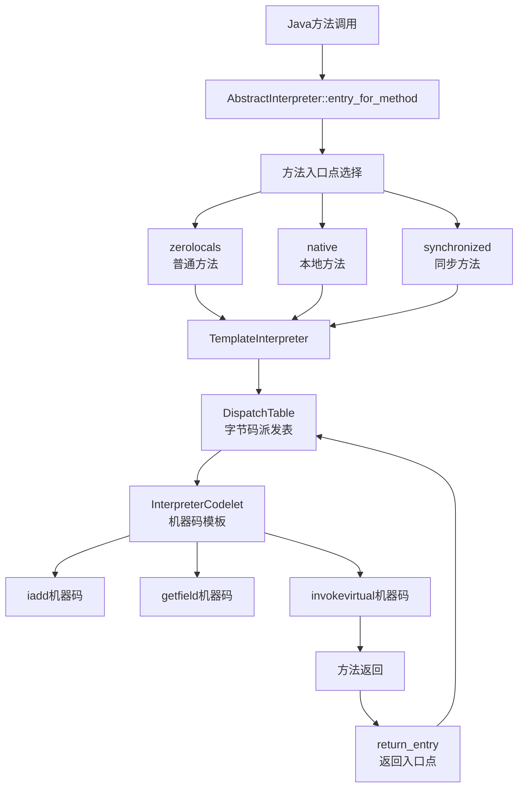
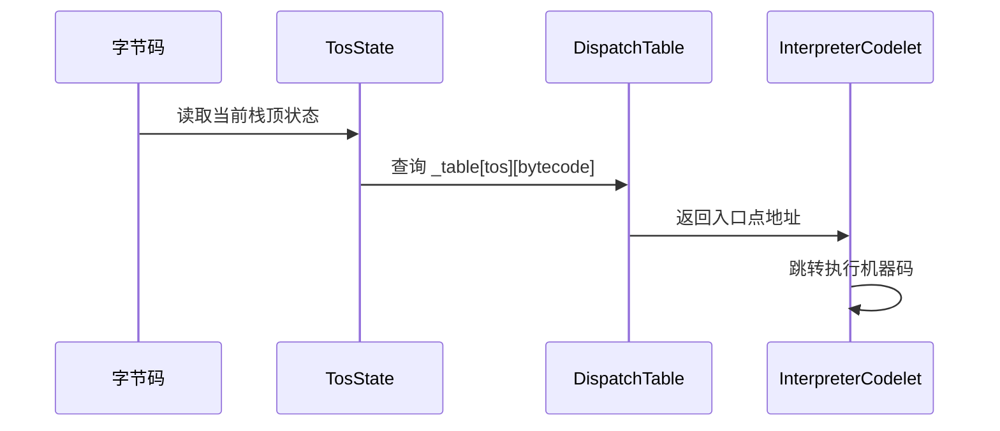

# Interpreter：JVM 解释器核心

## 0. 核心原理

### 0.1 本质是什么？
Interpreter 是 JVM 的默认执行引擎——它将字节码翻译成机器码执行，所有 Java 程序启动时都先由解释器执行，直到热点代码被 JIT 编译。

### 0.2 为什么需要？
Java 的"一次编写，到处运行"依赖于字节码，但字节码不能直接在 CPU 上执行。JVM 有两种执行字节码的方式：解释执行和编译执行。解释执行虽然慢，但启动快、内存占用小、调试友好。更重要的是，解释器是 JVM 与 JIT 编译器的桥梁：JIT 编译的代码需要通过 deoptimization 回到解释器，OSR（On-Stack Replacement）也需要解释器的栈帧布局支持。

### 0.3 怎么解决？
**设计思路**：预先生成所有字节码对应的机器码模板，存入派发表（Dispatch Table）。运行时通过字节码值索引派发表，跳转到对应的机器码执行。

**关键设计**：
1. **模板解释器（Template Interpreter）**：为每个字节码生成优化的机器码模板，存入 InterpreterCodelet
2. **派发表（Dispatch Table）**：256 个入口点，根据栈顶状态（TosState）和字节码值快速派发
3. **栈帧布局**：标准化的栈帧结构（局部变量表 + 操作数栈 + 监视器 + 返回地址）
4. **入口点表（Entry Table）**：为不同类型的方法（native、synchronized、空方法等）生成专用入口点

### 0.4 为什么这样设计？

**为什么用模板解释器而不是 C++ 解释器？**
- 性能：模板解释器生成的是优化的机器码，比 C++ switch-case 循环快 2-3 倍
- 灵活性：可以为每个字节码单独优化，插入性能统计、调试代码
- 与 JIT 协作：生成的代码格式与 JIT 编译代码一致，便于 deoptimization 和 OSR

**为什么需要 TosState（栈顶状态）？**
- 不同字节码对栈顶类型敏感：`iadd` 要求栈顶是 int，`ladd` 要求栈顶是 long
- 为每种 TosState 生成不同的入口点，可以省去运行时类型检查
- 例如：`iadd` 的 itos 入口点直接从栈顶读取 int，不需要类型判断

**为什么需要多个入口点表？**
- 不同方法类型需要不同的初始化逻辑：synchronized 方法需要获取锁，native 方法需要切换到 native 栈
- 专用入口点避免运行时判断，提升性能
- 例如：空方法直接返回，不需要创建完整栈帧

---

## 第 0 部分：核心原理 ⭐

### 0.1 本质是什么？

本文深入分析 **Interpreter：JVM 解释器核心**：从源码角度理解其设计原理、实现机制和关键细节。

### 0.2 为什么需要？

理解 JVM 内部实现是排查复杂问题、进行性能优化的基础。表面的 API 文档无法解释 JVM 的实际行为，只有深入源码才能建立精确的心智模型。

### 0.3 怎么解决？

结合源码阅读、数据结构分析和 GDB 运行时验证，从多个角度建立对该机制的完整理解。

### 0.4 为什么这样设计？

每个设计决策都有其权衡：性能 vs 正确性、简单性 vs 灵活性、内存占用 vs 查找速度。理解这些权衡是理解 JVM 设计的关键。

---


## 1. 架构概览

### 1.1 继承层次

```
AbstractInterpreter (抽象基类)
    │
    ├── TemplateInterpreter (模板解释器) ← 默认使用
    │       │
    │       └── TemplateInterpreterGenerator (代码生成器)
    │
    └── CppInterpreter (C++ 解释器) ← -Xint 模式
            │
            └── BytecodeInterpreter (字节码解释循环)
```

**源码文件**：
- `/data/workspace/openjdk-cut-new/src/hotspot/share/interpreter/abstractInterpreter.hpp:54`
- `/data/workspace/openjdk-cut-new/src/hotspot/share/interpreter/templateInterpreter.hpp:85`
- `/data/workspace/openjdk-cut-new/src/hotspot/share/interpreter/bytecodeInterpreter.hpp:79`

### 1.2 核心组件关系图



### 1.3 两种解释器对比

| 特性 | TemplateInterpreter | CppInterpreter |
|------|---------------------|----------------|
| **执行方式** | 预生成机器码模板 | C++ switch-case 循环 |
| **性能** | 快（约 2-3 倍）| 慢 |
| **启动时间** | 较慢（需要生成代码）| 快 |
| **内存占用** | 大（存储机器码）| 小 |
| **调试难度** | 难（汇编级）| 易（C++ 源码） |
| **使用场景** | 默认模式 | -Xint 模式、调试 |
| **平台相关** | 是（每个平台单独生成）| 否（平台无关 C++） |

---

## 2. 数据结构

### 2.1 AbstractInterpreter：抽象基类

**源码文件**：`/data/workspace/openjdk-cut-new/src/hotspot/share/interpreter/abstractInterpreter.hpp:54`

```cpp
class AbstractInterpreter: AllStatic {
 public:
  enum MethodKind {
    zerolocals,                      // 普通方法（需初始化局部变量）
    zerolocals_synchronized,         // 同步方法（需初始化局部变量 + 获取锁）
    native,                          // 本地方法
    native_synchronized,             // 同步本地方法
    empty,                           // 空方法（直接返回）
    accessor,                        // 访问器方法（aload_0 + getfield + return）
    abstract,                        // 抽象方法（抛异常）
    method_handle_invoke_FIRST,      // MethodHandle.invokeExact 等
    // ... 特殊方法（Math.sin 等）
    java_lang_math_sin,
    java_lang_math_cos,
    // ...
    number_of_method_entries,        // 方法类型总数
  };

 protected:
  static StubQueue* _code;                                      // 解释器代码缓存
  static bool       _notice_safepoints;                         // 是否激活 safepoint
  static address    _entry_table[number_of_method_entries];     // 方法入口点表
  static address    _cds_entry_table[number_of_method_entries]; // CDS 归档方法入口点表
  static address    _native_abi_to_tosca[number_of_result_handlers]; // native 方法返回值处理
  static address    _slow_signature_handler;                    // native 方法通用签名处理器
  static address    _rethrow_exception_entry;                   // 重抛异常入口点

 public:
  static void       initialize();
  static StubQueue* code()                         { return _code; }
  static MethodKind method_kind(const methodHandle& m);
  static address    entry_for_kind(MethodKind k)   { return _entry_table[k]; }
  static address    entry_for_method(const methodHandle& m) { return entry_for_kind(method_kind(m)); }
};
```

**关键字段含义**：

| 字段 | 类型 | 含义 | 使用场景 |
|------|------|------|---------|
| `_code` | `StubQueue*` | 解释器代码缓存 | 存储所有 InterpreterCodelet |
| `_entry_table` | `address[]` | 方法入口点表 | 方法调用时根据类型选择入口点 |
| `_notice_safepoints` | `bool` | 是否激活 safepoint | 控制是否切换到 safepoint 派发表 |

**MethodKind 分类**：

```
方法类型分类：
┌─────────────────────────────────────────────────┐
│ 普通方法                                          │
├─────────────────────────────────────────────────┤
│ zerolocals: 需要初始化局部变量表                  │
│ zerolocals_synchronized: 需要获取锁              │
├─────────────────────────────────────────────────┤
│ 特殊方法                                          │
├─────────────────────────────────────────────────┤
│ empty: 空方法（直接 return）                      │
│ accessor: 访问器（aload_0 + getfield + return）  │
│ abstract: 抽象方法（抛异常）                      │
├─────────────────────────────────────────────────┤
│ Native 方法                                       │
├─────────────────────────────────────────────────┤
│ native: 本地方法                                  │
│ native_synchronized: 同步本地方法                 │
├─────────────────────────────────────────────────┤
│ 内置方法                                          │
├─────────────────────────────────────────────────┤
│ java_lang_math_sin/cos/tan...: 数学函数          │
│ java_lang_ref_reference_get: Reference.get()    │
│ method_handle_invoke: MethodHandle.invokeExact  │
└─────────────────────────────────────────────────┘
```

### 2.2 TemplateInterpreter：模板解释器

**源码文件**：`/data/workspace/openjdk-cut-new/src/hotspot/share/interpreter/templateInterpreter.hpp:85`

```cpp
class TemplateInterpreter: public AbstractInterpreter {
 public:
  enum MoreConstants {
    max_invoke_length = 5,               // invokedynamic 最长 5 字节
    max_bytecode_length = 6,             // wide iinc 最长 6 字节
    number_of_return_entries = max_invoke_length + 1,   // 返回入口点数量
    number_of_deopt_entries = max_bytecode_length + 1,  // deopt 入口点数量
    number_of_return_addrs = number_of_states           // 返回地址数量
  };

 protected:
  // 异常抛出入口点
  static address _throw_ArrayIndexOutOfBoundsException_entry;
  static address _throw_ArrayStoreException_entry;
  static address _throw_ArithmeticException_entry;
  static address _throw_ClassCastException_entry;
  static address _throw_NullPointerException_entry;
  static address _throw_exception_entry;
  static address _throw_StackOverflowError_entry;

  // 栈帧管理入口点
  static address _remove_activation_entry;                // 移除栈帧
  static EntryPoint _return_entry[number_of_return_entries];  // 方法返回入口点
  static EntryPoint _deopt_entry[number_of_deopt_entries];    // deopt 入口点
  static EntryPoint _safept_entry;                        // safepoint 入口点

  // 方法调用返回入口点
  static address _invoke_return_entry[number_of_return_addrs];
  static address _invokeinterface_return_entry[number_of_return_addrs];
  static address _invokedynamic_return_entry[number_of_return_addrs];

  // 字节码派发表
  static DispatchTable _active_table;    // 当前使用的派发表
  static DispatchTable _normal_table;    // 正常派发表
  static DispatchTable _safept_table;    // safepoint 派发表
  static address _wentry_point[DispatchTable::length]; // wide 指令入口点

 public:
  static void initialize();
  static address* dispatch_table(TosState state) { return _active_table.table_for(state); }
  static address return_entry(TosState state, int length, Bytecodes::Code code);
  static address deopt_entry(TosState state, int length);
};
```

**关键字段含义**：

| 字段 | 类型 | 含义 | 使用场景 |
|------|------|------|---------|
| `_active_table` | `DispatchTable` | 当前使用的派发表 | 字节码执行时查询入口点 |
| `_normal_table` | `DispatchTable` | 正常派发表 | 不在 safepoint 时使用 |
| `_safept_table` | `DispatchTable` | safepoint 派发表 | 在 safepoint 时切换使用 |
| `_return_entry` | `EntryPoint[]` | 方法返回入口点 | 方法调用返回后继续执行 |
| `_deopt_entry` | `EntryPoint[]` | deopt 入口点 | JIT 代码退优化回到解释器 |

### 2.3 DispatchTable：字节码派发表

**源码文件**：`/data/workspace/openjdk-cut-new/src/hotspot/share/interpreter/templateInterpreter.hpp:65`

```cpp
class DispatchTable {
 public:
  enum { length = 1 << BitsPerByte };  // 256 个入口点（每个字节码值对应一个）

 private:
  address _table[number_of_states][length];  // 10 种 TosState × 256 字节码

 public:
  EntryPoint entry(int i) const;                      // 获取第 i 个字节码的入口点
  void set_entry(int i, EntryPoint& entry);           // 设置第 i 个字节码的入口点
  address* table_for(TosState state) { return _table[state]; }
};
```

**内存布局**：

```
DispatchTable 内存布局（约 20KB）：
┌─────────────────────────────────────────────────┐
│ _table[btos][0..255]  (256 个入口点)             │ btos = byte/boolean 栈顶
├─────────────────────────────────────────────────┤
│ _table[ztos][0..255]  (256 个入口点)             │ ztos = int（零扩展）栈顶
├─────────────────────────────────────────────────┤
│ _table[ctos][0..255]  (256 个入口点)             │ ctos = char 栈顶
├─────────────────────────────────────────────────┤
│ _table[stos][0..255]  (256 个入口点)             │ stos = short 栈顶
├─────────────────────────────────────────────────┤
│ _table[atos][0..255]  (256 个入口点)             │ atos = object 栈顶
├─────────────────────────────────────────────────┤
│ _table[itos][0..255]  (256 个入口点)             │ itos = int 栈顶
├─────────────────────────────────────────────────┤
│ _table[ltos][0..255]  (256 个入口点)             │ ltos = long 栈顶
├─────────────────────────────────────────────────┤
│ _table[ftos][0..255]  (256 个入口点)             │ ftos = float 栈顶
├─────────────────────────────────────────────────┤
│ _table[dtos][0..255]  (256 个入口点)             │ dtos = double 栈顶
├─────────────────────────────────────────────────┤
│ _table[vtos][0..255]  (256 个入口点)             │ vtos = void 栈顶（无返回值）
└─────────────────────────────────────────────────┘
总计：10 × 256 × 8 = 20,480 字节
```

**派发机制**：



### 2.4 EntryPoint：栈顶状态入口点

**源码文件**：`/data/workspace/openjdk-cut-new/src/hotspot/share/interpreter/templateInterpreter.hpp:43`

```cpp
class EntryPoint {
 private:
  address _entry[number_of_states];  // 10 种 TosState 对应的入口点

 public:
  EntryPoint();
  EntryPoint(address bentry, address zentry, address centry, address sentry,
             address aentry, address ientry, address lentry, address fentry,
             address dentry, address ventry);
  address entry(TosState state) const;
  void set_entry(TosState state, address entry);
};
```

**使用场景**：

每个字节码有多个入口点，根据栈顶状态选择：

| 字节码 | btos 入口 | itos 入口 | ltos 入口 | 说明 |
|--------|----------|----------|----------|------|
| `iadd` | 无效 | `iadd_itos` | 无效 | 栈顶必须是 int |
| `ladd` | 无效 | 无效 | `ladd_ltos` | 栈顶必须是 long |
| `getfield` | `getfield_btos` | `getfield_itos` | `getfield_ltos` | 根据字段类型选择 |
| `return` | `return_btos` | `return_itos` | `return_ltos` | 根据返回类型选择 |

### 2.5 InterpreterCodelet：解释器代码片段

**源码文件**：`/data/workspace/openjdk-cut-new/src/hotspot/share/interpreter/interpreter.hpp:44`

```cpp
class InterpreterCodelet: public Stub {
 private:
  int         _size;                    // 代码片段大小
  const char* _description;             // 描述信息
  Bytecodes::Code _bytecode;            // 关联的字节码（如果有）
  DEBUG_ONLY(CodeStrings _strings;)     // 调试注释

 public:
  address code_begin() const { return (address)this + align_up(sizeof(InterpreterCodelet), CodeEntryAlignment); }
  address code_end() const   { return (address)this + size(); }
  int code_size() const      { return code_end() - code_begin(); }
  const char* description() const { return _description; }
  Bytecodes::Code bytecode() const { return _bytecode; }
};
```

**内存布局**：

```
InterpreterCodelet 内存布局：
┌─────────────────────────────────────────────────┐ 偏移 0
│ _size (4 bytes)                                 │
├─────────────────────────────────────────────────┤ 偏移 4
│ _description (8 bytes, 指针)                    │
├─────────────────────────────────────────────────┤ 偏移 12
│ _bytecode (1 byte)                              │
├─────────────────────────────────────────────────┤ 偏移 13
│ [padding to CodeEntryAlignment]                 │
├─────────────────────────────────────────────────┤ 偏移 = aligned(sizeof(InterpreterCodelet))
│ 机器码开始                                       │
│ ...                                             │
│ 机器码结束                                       │
└─────────────────────────────────────────────────┘ 偏移 = _size
```

### 2.6 TosState：栈顶状态

**源码文件**：`/data/workspace/openjdk-cut-new/src/hotspot/share/interpreter/bytecodes.hpp`（实际在 globalDefinitions.hpp）

```cpp
enum TosState {
  btos = 0,  // byte/boolean（栈顶是 byte，零扩展到 int）
  ztos = 1,  // int（栈顶是零扩展的 int）
  ctos = 2,  // char（栈顶是 char，零扩展到 int）
  stos = 3,  // short（栈顶是 short，符号扩展到 int）
  atos = 4,  // object（栈顶是对象引用）
  itos = 5,  // int（栈顶是 int）
  ltos = 6,  // long（栈顶是 long，占 2 个槽位）
  ftos = 7,  // float（栈顶是 float）
  dtos = 8,  // double（栈顶是 double，占 2 个槽位）
  vtos = 9,  // void（无返回值）
  number_of_states
};
```

**值域图**：

```
TosState 分类：
┌─────────────────────────────────────────────────┐
│ 1 槽位类型（4 或 8 字节，取决于压缩指针）          │
├─────────────────────────────────────────────────┤
│ btos: byte/boolean                              │
│ ztos: int（零扩展）                              │
│ ctos: char                                      │
│ stos: short                                     │
│ atos: object reference                          │
│ itos: int                                       │
│ ftos: float                                     │
├─────────────────────────────────────────────────┤
│ 2 槽位类型（8 或 16 字节）                         │
├─────────────────────────────────────────────────┤
│ ltos: long                                      │
│ dtos: double                                    │
├─────────────────────────────────────────────────┤
│ 特殊类型                                         │
├─────────────────────────────────────────────────┤
│ vtos: void（无返回值）                           │
└─────────────────────────────────────────────────┘
```

### 2.7 子结构分析：StubQueue

**源码文件**：`/data/workspace/openjdk-cut-new/src/hotspot/share/code/stubs.hpp`

StubQueue 是解释器代码缓存队列，用于管理所有 InterpreterCodelet。

```cpp
class StubQueue: public CHeapObj<mtCode> {
 private:
  StubInterface* _stub_interface;     // InterpreterCodelet 的接口
  address        _stub_buffer;        // 代码缓冲区起始地址
  int            _buffer_size;        // 缓冲区大小
  int            _buffer_limit;       // 缓冲区限制
  int            _queue_begin;        // 队列开始位置
  int            _queue_end;          // 队列结束位置
  int            _number_of_stubs;    // 代码片段数量
  Mutex* const   _mutex;              // 互斥锁

 public:
  // 创建 StubQueue
  StubQueue(StubInterface* stub_interface, int buffer_size,
            Mutex* lock, const char* name);
  
  // 分配新的代码片段
  Stub* request_committed(int code_size);
  
  // 获取第一个/最后一个代码片段
  Stub* stub(int i) const;
  Stub* first() const { return stub(0); }
  Stub* last() const  { return stub(_number_of_stubs - 1); }
  
  // 查找包含指定地址的代码片段
  Stub* stub_containing(address pc) const;
};
```

**关键方法解析**：

**request_committed() - 分配代码片段**：

**源码文件**：`/data/workspace/openjdk-cut-new/src/hotspot/share/code/stubs.cpp`

```cpp
Stub* StubQueue::request_committed(int code_size) {
  // 计算需要的总大小（InterpreterCodelet 头 + 机器码 + 对齐）
  int requested_size = _stub_interface->code_size_to_size(code_size);
  
  MutexLocker ml(_mutex, Mutex::_no_safepoint_check_flag);
  
  // 检查是否有足够空间
  if (_queue_end + requested_size > _buffer_limit) {
    // 空间不足，返回 NULL
    return NULL;
  }
  
  // 分配空间
  Stub* stub = (Stub*)(_stub_buffer + _queue_end);
  _queue_end += requested_size;
  _number_of_stubs++;
  
  return stub;
}
```

**设计要点**：
1. **线性分配**：StubQueue 使用线性分配，所有 InterpreterCodelet 连续存储
2. **不再释放**：一旦分配，代码片段不会被单独释放，直到 JVM 关闭
3. **内存紧凑**：deallocate_unused_tail() 可以释放尾部未使用空间

**内存布局**：

```
StubQueue 内存布局：
┌─────────────────────────────────────────────────┐ 低地址
│ _stub_buffer                                     │
│   ├─ InterpreterCodelet[0]                       │ 第一个代码片段
│   │   ├─ header (size, description, bytecode)   │
│   │   ├─ [padding]                              │
│   │   └─ 机器码                                  │
│   ├─ InterpreterCodelet[1]                       │ 第二个代码片段
│   │   └─ ...                                    │
│   ├─ ...                                         │
│   └─ InterpreterCodelet[n-1]                     │ 最后一个代码片段
│       └─ ...                                    │
├─────────────────────────────────────────────────┤ _queue_end
│ 未使用的空间                                      │
└─────────────────────────────────────────────────┘ _buffer_limit 高地址
```

### 2.8 子结构分析：frame

**源码文件**：`/data/workspace/openjdk-cut-new/src/hotspot/share/runtime/frame.hpp`

frame 表示栈帧的抽象，提供访问栈帧各部分的方法。

```cpp
class frame {
 private:
  intptr_t* _pc;     // 返回地址（PC 指针）
  intptr_t* _sp;     // 栈指针
  intptr_t* _unextended_sp;  // 未扩展的栈指针
  intptr_t* _fp;     // 帧指针
  intptr_t* _cb;     // CodeBlob 指针

 public:
  // 构造函数
  frame(intptr_t* sp, intptr_t* fp, address pc);
  
  // 访问解释器栈帧各部分
  intptr_t*  fp() const            { return _fp; }
  address    pc() const            { return (address) _pc; }
  
  // 局部变量表
  intptr_t*  interpreter_frame_locals() const;
  
  // 操作数栈
  intptr_t*  interpreter_frame_stack_top() const;
  intptr_t*  interpreter_frame_stack_bottom() const;
  
  // 方法指针
  Method**   interpreter_frame_method_addr() const;
  
  // 字节码指针
  address*   interpreter_frame_bcp_addr() const;
  
  // 常量池缓存
  ConstantPoolCache** interpreter_frame_cache_addr() const;
};
```

**解释器栈帧访问方法**：

**源码文件**：`/data/workspace/openjdk-cut-new/src/hotspot/share/runtime/frame.cpp`

```cpp
// 局部变量表
intptr_t* frame::interpreter_frame_locals() const {
  return (intptr_t*) *addr_at(interpreter_frame_locals_offset);
}

// 方法指针
Method** frame::interpreter_frame_method_addr() const {
  return (Method**)addr_at(interpreter_frame_method_offset);
}

// 字节码指针
address* frame::interpreter_frame_bcp_addr() const {
  return (address*)addr_at(interpreter_frame_bcp_offset);
}
```

**栈帧布局常量**：

**源码文件**：`/data/workspace/openjdk-cut-new/src/hotspot/cpu/x86/frame_x86.hpp`

```cpp
enum {
  interpreter_frame_sender_sp_offset = -1,  // 发送者栈指针
  interpreter_frame_method_offset     = -2,  // 方法指针
  interpreter_frame_mirror_offset     = -3,  // 镜像对象
  interpreter_frame_cache_offset      = -4,  // 常量池缓存
  interpreter_frame_locals_offset     = -5,  // 局部变量表
  interpreter_frame_bcp_offset        = -6,  // 字节码指针
  interpreter_frame_initial_sp_offset = -7,  // 初始栈指针
};
```

**设计要点**：
1. **偏移量相对 fp**：所有栈帧组件通过相对 fp 的偏移量访问
2. **负偏移**：局部变量表在 fp 下方（低地址）
3. **正偏移**：操作数栈在 fp 上方（高地址）

---

## 3. 初始化流程

### 3.1 初始化时机

**源码文件**：`/data/workspace/openjdk-cut-new/src/hotspot/share/runtime/init.cpp:125`

```cpp
jint init_globals() {
  // ... 前置初始化 ...
  bytecodes_init();       // 初始化字节码表
  // ...
  interpreter_init();     // ★ 初始化解释器
  invocationCounter_init();
  templateTable_init();   // 初始化模板表
  // ...
}
```

**初始化顺序**：
```
JVM 启动
  ↓
init_globals()
  ├─ bytecodes_init()       ← 初始化字节码表
  ├─ codeCache_init()       ← 初始化代码缓存
  ├─ universe_init()        ← 创建 Java 堆
  ├─ interpreter_init()     ★ 初始化解释器
  │   ├─ AbstractInterpreter::initialize()
  │   ├─ TemplateTable::initialize()
  │   └─ TemplateInterpreterGenerator::generate_all()
  ├─ templateTable_init()   ← 初始化模板表
  └─ ...
```

### 3.2 TemplateInterpreter::initialize() 详解

**源码文件**：`/data/workspace/openjdk-cut-new/src/hotspot/share/interpreter/templateInterpreter.cpp:42`

```cpp
void TemplateInterpreter::initialize() {
  if (_code != NULL) return;  // 防止重复初始化

  assert((int)Bytecodes::number_of_codes <= (int)DispatchTable::length,
         "dispatch table too small");

  // 1. 初始化抽象解释器基类
  AbstractInterpreter::initialize();

  // 2. 初始化模板表
  TemplateTable::initialize();

  // 3. 生成解释器代码
  { ResourceMark rm;
    TraceTime timer("Interpreter generation", TRACETIME_LOG(Info, startuptime));
    int code_size = InterpreterCodeSize;  // 约 256KB
    NOT_PRODUCT(code_size *= 4;)          // debug 版本 4 倍空间
    
    // 创建代码缓存队列
    _code = new StubQueue(new InterpreterCodeletInterface, code_size, NULL,
                          "Interpreter");
    
    // ★ 生成所有解释器代码
    TemplateInterpreterGenerator g(_code);
    
    // 释放未使用的内存
    _code->deallocate_unused_tail();
  }

  if (PrintInterpreter) {
    ResourceMark rm;
    print();  // 打印生成的代码信息
  }

  // 4. 初始化派发表
  _active_table = _normal_table;  // 使用正常派发表
}
```

### 3.3 调用链全景图

```
TemplateInterpreter::initialize()
├─ AbstractInterpreter::initialize()
│   └─ 初始化方法入口点表 _entry_table[]
│
├─ TemplateTable::initialize()
│   └─ 初始化所有字节码模板
│       ├─ def(_nop, ...)
│       ├─ def(_iadd, ...)
│       └─ def(_getfield, ...)
│
└─ TemplateInterpreterGenerator::generate_all()  ← ★ 核心
    ├─ generate_all() {
    │   ├─ generate_stack_top_state_tos_changed()  // TosState 转换
    │   ├─ generate_exception_handler_table()      // 异常处理表
    │   ├─ generate_return_entry_points()          // 返回入口点
    │   ├─ generate_deopt_entry_points()           // deopt 入口点
    │   ├─ generate_safepoint_entry_points()       // safepoint 入口点
    │   ├─ generate_method_entry_points()          // 方法入口点
    │   │   ├─ generate_method_entry(zerolocals)
    │   │   ├─ generate_method_entry(native)
    │   │   └─ generate_method_entry(synchronized)
    │   └─ generate_bytecode_entry_points()        // 字节码入口点
    │       └─ for each bytecode:
    │           └─ set_entry_points(bytecode, entry_btos, entry_itos, ...)
    │               └─ _normal_table.set_entry(bytecode, entry)
    │   }
    └─ 生成的代码存入 StubQueue (_code)
```

---

## 4. 字节码执行流程

### 4.1 方法调用到字节码执行

```mermaid
sequenceDiagram
    participant Caller as 调用者
    participant Entry as 方法入口点
    participant Frame as 栈帧创建
    participant Loop as 字节码循环
    participant Dispatch as 派发表
    participant Code as 机器码
    
    Caller->>Entry: call method
    Entry->>Frame: 创建解释器栈帧
    Frame->>Loop: 进入字节码循环
    
    loop 执行字节码
        Loop->>Dispatch: 查询入口点
        Dispatch->>Code: 跳转到机器码
        Code->>Loop: 执行完毕，返回
    end
    
    Loop->>Caller: 方法返回
```

### 4.2 字节码派发机制

**汇编级流程**（x86-64）：

```asm
; 字节码派发循环
dispatch_next:
    movzx  eax, byte ptr [r13]        ; 读取字节码（r13 = bcp）
    mov    rbx, qword ptr [r14 + rax*8] ; 查询派发表（r14 = dispatch_table）
    jmp    rbx                         ; 跳转到字节码机器码

; iadd 字节码机器码示例
iadd_itos:
    mov    eax, dword ptr [rsp]        ; 读取栈顶 int
    add    dword ptr [rsp + 8], eax    ; 加到第二个 int
    add    rsp, 4                      ; 弹出栈顶
    jmp    dispatch_next               ; 派发下一个字节码
```

### 4.3 字节码机器码示例

#### 4.3.1 iadd 字节码（整数加法）

**源码文件**：`/data/workspace/openjdk-cut-new/src/hotspot/cpu/x86/templateTable_x86.cpp`

```cpp
void TemplateTable::iadv() {
  transition(itos, itos);  // 栈顶类型保持 itos（int）
  __ pop_i();              // 弹出栈顶 int 到 rax
  __ addl(rax, Address(rsp, 0));  // rax = rax + 栈顶 int
  __ push_i();             // 将结果压回栈顶
}
```

**生成的汇编代码**（x86-64，itos 入口点）：

```asm
; iadd_itos 入口点（栈顶是 int）
; 假设 rsp 指向栈顶，rax 缓存栈顶值（tosca 缓存优化）

iadd_itos:
    pop    rax                       ; 弹出栈顶 int 到 rax
                                      ; 实际是：mov eax, [rsp]; add rsp, 4
    add    dword ptr [rsp], eax      ; [rsp] += eax（第二个 int + 第一个 int）
    jmp    dispatch_next             ; 派发下一个字节码

dispatch_next:
    movzx  rax, byte ptr [r13]       ; 读取字节码（r13 = bcp）
    mov    rbx, qword ptr [r14 + rax*8]  ; 查询派发表（r14 = dispatch_table）
    jmp    rbx                       ; 跳转到下一个字节码机器码
```

**设计解释**：
- **为什么 pop 到 rax？** x86 指令不能直接对两个栈顶元素操作，需要先加载到寄存器
- **为什么最后不需要 push？** add 结果直接写入 [rsp]，结果已经在栈顶
- **tosca 缓存优化**：某些实现会将栈顶值缓存在寄存器（如 rax），减少内存访问

#### 4.3.2 getfield 字节码（字段读取）

**源码文件**：`/data/workspace/openjdk-cut-new/src/hotspot/cpu/x86/templateTable_x86.cpp`

```cpp
void TemplateTable::getfield(int byte_no) {
  getfield_or_static(byte_no, false);
}

void TemplateTable::getfield_or_static(int byte_no, bool is_static) {
  const Register cache = rcx;       // 常量池缓存
  const Register index = rdx;       // 索引
  const Register obj   = rax;       // 对象引用
  
  // 解析常量池缓存索引
  __ get_cache_and_index_at_bcp(cache, index, 1);
  
  if (!is_static) {
    // getfield: 栈顶是对象引用
    __ pop_ptr(obj);  // 弹出对象引用
  }
  
  // 从常量池缓存获取字段偏移
  __ movptr(rdx, Address(cache, index, Address::times_ptr,
                         in_bytes(ConstantPoolCache::base_offset() +
                                  ConstantPoolCacheEntry::f2_offset())));
  
  // 读取字段值
  __ load_heap_oop(rax, Address(obj, rdx));  // 对象类型字段
  // 或 __ movl(rax, Address(obj, rdx));      // int 类型字段
  
  __ push_ptr(rax);  // 压入字段值
}
```

**生成的汇编代码**（x86-64，atos 入口点，对象字段）：

```asm
; getfield_atos 入口点（栈顶是对象引用，读取对象字段）

getfield_atos:
    pop    rax                       ; 弹出对象引用
    
    ; 解析常量池缓存索引
    movzx  edx, word ptr [r13 + 1]   ; 读取 2 字节索引（bcp + 1）
    
    ; 从常量池缓存获取字段偏移
    mov    rcx, [r15 + rdx*8 + offset]  ; r15 = 常量池缓存基址
    mov    rdx, [rcx + f2_offset]       ; rdx = 字段偏移
    
    ; 读取字段值（假设是对象字段）
    mov    rax, [rax + rdx]             ; rax = obj->field
    
    push   rax                          ; 压入字段值
    jmp    dispatch_next                ; 派发下一个字节码
```

**设计解释**：
- **常量池缓存**：首次执行时解析字段信息，缓存偏移量，后续直接使用
- **两次内存访问**：1）从常量池缓存读偏移；2）从对象读字段值
- **fast_getfield 优化**：如果字段偏移是常数，可以硬编码到机器码中，省去常量池缓存查询

#### 4.3.3 invokevirtual 字节码（虚方法调用）

**源码文件**：`/data/workspace/openjdk-cut-new/src/hotspot/cpu/x86/templateTable_x86.cpp`

```cpp
void TemplateTable::invokevirtual(int byte_no) {
  transition(vtos, vtos);  // 不关心栈顶类型
  
  const Register recv = rcx;  // 接收者对象
  const Register temp = rbx;  // 临时寄存器
  
  // 1. 准备调用参数
  prepare_invoke(byte_no, recv, temp);
  
  // 2. 从 vtable 查找方法
  __ lookup_virtual_method(recv, temp);
  
  // 3. 调用方法
  __ call(Address(temp, Method::from_compiled_offset()));
  
  // 4. 处理返回值
  __ should_not_reach_here();
}
```

**生成的汇编代码**（简化版）：

```asm
; invokevirtual 入口点

invokevirtual:
    ; 1. 弹出接收者对象
    pop    rcx                       ; rcx = this
    
    ; 2. 解析常量池缓存，获取 vtable 索引
    movzx  edx, word ptr [r13 + 1]   ; 读取索引
    mov    rbx, [r15 + rdx*8 + offset]  ; 获取 vtable 索引
    
    ; 3. 从 vtable 查找方法
    mov    rax, [rcx]                ; rax = this->klass
    mov    rdx, [rax + vtable_offset + rbx*8]  ; rdx = klass->vtable[index]
    
    ; 4. 调用方法
    call   [rdx + from_compiled_offset]  ; 跳转到方法机器码
    
    ; 5. 方法返回后，继续执行
    jmp    dispatch_next
```

**设计解释**：
- **虚方法表（vtable）**：每个类的虚方法表存储在 Klass 对象中
- **动态分派**：运行时根据对象的实际类型查找方法
- **性能优化**：inline cache 可以缓存方法指针，避免 vtable 查找

```
解释器栈帧布局：
┌─────────────────────────────────────────────────┐ 高地址
│ caller's frame                                  │ 调用者栈帧
├─────────────────────────────────────────────────┤
│ return address                                  │ 返回地址
├─────────────────────────────────────────────────┤
│ saved rbp                                       │ 保存的基址指针
├─────────────────────────────────────────────────┤ ← rbp
│ monitors (if synchronized)                      │ 监视器（同步方法）
├─────────────────────────────────────────────────┤
│ operand stack                                   │ 操作数栈（向下增长）
│   ...                                           │
│   stack_top                                     │ 栈顶
├─────────────────────────────────────────────────┤ ← _stack_limit
│ locals[n-1]                                     │ 局部变量表
│   ...                                           │
│ locals[0]                                       │
├─────────────────────────────────────────────────┤ ← _locals
│ method pointer                                  │ 方法指针
├─────────────────────────────────────────────────┤
│ constant pool cache                             │ 常量池缓存
├─────────────────────────────────────────────────┤
│ bcp (bytecode pointer)                          │ 字节码指针
├─────────────────────────────────────────────────┤
│ interpreter state                               │ 解释器状态
└─────────────────────────────────────────────────┘ 低地址
```

---

## 5. 关键机制

### 5.1 Safepoint 支持

**原理**：解释器通过切换派发表来支持 safepoint。

**源码文件**：`/data/workspace/openjdk-cut-new/src/hotspot/share/interpreter/templateInterpreter.cpp:293`

```cpp
void TemplateInterpreter::notice_safepoints() {
  if (!_notice_safepoints) {
    log_debug(interpreter, safepoint)("switching active_table to safept_table.");
    _notice_safepoints = true;
    // 切换到 safepoint 派发表
    copy_table((address*)&_safept_table, (address*)&_active_table, 
               sizeof(_active_table) / sizeof(address));
  }
}

void TemplateInterpreter::ignore_safepoints() {
  if (_notice_safepoints) {
    log_debug(interpreter, safepoint)("switching active_table to normal_table.");
    _notice_safepoints = false;
    // 切换回正常派发表
    copy_table((address*)&_normal_table, (address*)&_active_table,
               sizeof(_active_table) / sizeof(address));
  }
}
```

**机制图**：

```
Safepoint 派发表切换：
┌─────────────────────────────────────────────────┐
│ 正常执行                                          │
│ _active_table → _normal_table                    │
│ 字节码入口点 → 直接执行                            │
├─────────────────────────────────────────────────┤
│ 触发 Safepoint                                    │
│ notice_safepoints()                              │
│ _active_table → _safept_table                    │
│ 字节码入口点 → safepoint 检查代码                  │
│   ↓                                              │
│ 检查是否需要暂停                                  │
│   ├─ 是 → 等待 safepoint 结束                    │
│   └─ 否 → 继续执行                               │
├─────────────────────────────────────────────────┤
│ Safepoint 结束                                    │
│ ignore_safepoints()                              │
│ _active_table → _normal_table                    │
└─────────────────────────────────────────────────┘
```

### 5.2 方法入口点选择

**源码文件**：`/data/workspace/openjdk-cut-new/src/hotspot/share/interpreter/abstractInterpreter.cpp`

```cpp
AbstractInterpreter::MethodKind AbstractInterpreter::method_kind(const methodHandle& m) {
  // 1. 空方法
  if (m->code_size() == 1 && m->code_at(0) == Bytecodes::_return) {
    return empty;
  }
  
  // 2. 访问器方法
  if (m->is_accessor()) {
    return accessor;
  }
  
  // 3. 抽象方法
  if (m->is_abstract()) {
    return abstract;
  }
  
  // 4. 本地方法
  if (m->is_native()) {
    return m->is_synchronized() ? native_synchronized : native;
  }
  
  // 5. 特殊方法（Math.sin 等）
  switch (m->intrinsic_id()) {
    case vmIntrinsics::_dsin:  return java_lang_math_sin;
    case vmIntrinsics::_dcos:  return java_lang_math_cos;
    // ...
  }
  
  // 6. 普通方法
  return m->is_synchronized() ? zerolocals_synchronized : zerolocals;
}
```

### 5.3 返回地址计算

**问题**：方法调用返回后，如何知道从哪个字节码继续执行？

**解决**：预先生成多个返回入口点，根据调用指令长度选择。

**源码文件**：`/data/workspace/openjdk-cut-new/src/hotspot/share/interpreter/templateInterpreter.cpp:240`

```cpp
address TemplateInterpreter::return_entry(TosState state, int length, Bytecodes::Code code) {
  guarantee(0 <= length && length < Interpreter::number_of_return_entries, "illegal length");
  const int index = TosState_as_index(state);
  
  switch (code) {
  case Bytecodes::_invokestatic:
  case Bytecodes::_invokespecial:
  case Bytecodes::_invokevirtual:
  case Bytecodes::_invokehandle:
    return _invoke_return_entry[index];
    
  case Bytecodes::_invokeinterface:
    return _invokeinterface_return_entry[index];
    
  case Bytecodes::_invokedynamic:
    return _invokedynamic_return_entry[index];
    
  default:
    // 普通返回，根据指令长度选择
    address entry = _return_entry[length].entry(state);
    return entry;
  }
}
```

**返回入口点表**：

```
_return_entry 数组：
┌─────────────────────────────────────────────────┐
│ _return_entry[0]  ← 长度 1 的指令返回            │
│   ├─ btos 入口                                  │
│   ├─ itos 入口                                  │
│   └─ ...                                        │
├─────────────────────────────────────────────────┤
│ _return_entry[1]  ← 长度 2 的指令返回            │
├─────────────────────────────────────────────────┤
│ _return_entry[2]  ← 长度 3 的指令返回            │
├─────────────────────────────────────────────────┤
│ _return_entry[3]  ← 长度 4 的指令返回            │
├─────────────────────────────────────────────────┤
│ _return_entry[4]  ← 长度 5 的指令返回            │
├─────────────────────────────────────────────────┤
│ _return_entry[5]  ← 长度 6 的指令返回            │
└─────────────────────────────────────────────────┘
```

**使用示例**：

```
调用 invokevirtual（长度 3）
  ↓
返回时使用 _return_entry[3]
  ↓
返回入口点代码：
  add r13, 3   ; bcp += 3（跳过 invokevirtual 指令）
  jmp dispatch ; 派发下一个字节码
```

---

## 6. GDB 验证

### 6.1 验证派发表

**GDB 脚本**：`/data/workspace/openjdk-cut-new/jvm-md/tmp-file/Interpreter/verify_interpreter.gdb`

```gdb
# 验证 Interpreter 核心数据结构

# 1. 打印派发表大小
echo === DispatchTable 大小 ===\n
p sizeof(DispatchTable)
# 预期：20480 字节（256 * 10 * 8）

# 2. 打印 iadd 字节码的所有入口点
echo \n=== iadd 字节码入口点 ===\n
set $i = 0
while $i < 10
  printf "TosState %d: %p\n", $i, TemplateInterpreter::_normal_table._table[$i][96]
  set $i = $i + 1
end

# 3. 打印 getfield 字节码的所有入口点
echo \n=== getfield 字节码入口点 ===\n
set $i = 0
while $i < 10
  printf "TosState %d: %p\n", $i, TemplateInterpreter::_normal_table._table[$i][178]
  set $i = $i + 1
end

# 4. 打印方法入口点表
echo \n=== 方法入口点表 ===\n
p AbstractInterpreter::_entry_table[0]  # zerolocals 入口点
p AbstractInterpreter::_entry_table[2]  # native 入口点
p AbstractInterpreter::_entry_table[4]  # empty 入口点

# 5. 打印返回入口点表
echo \n=== 返回入口点表 ===\n
p TemplateInterpreter::_return_entry[0]  # 长度 1 的返回入口点

# 6. 打印 StubQueue 信息
echo \n=== StubQueue 信息 ===\n
p AbstractInterpreter::_code->_buffer_size
p AbstractInterpreter::_code->_number_of_stubs
p AbstractInterpreter::_code->_queue_end

quit
```

**预期输出**：

```
=== DispatchTable 大小 ===
$1 = 20480

=== iadd 字节码入口点 ===
TosState 0: 0x00007f1234560123  # btos 入口点
TosState 1: 0x00007f1234560123  # ztos 入口点
TosState 2: 0x00007f1234560123  # ctos 入口点
TosState 3: 0x00007f1234560123  # stos 入口点
TosState 4: 0x0000000000000000  # atos 无效（iadd 栈顶不能是对象）
TosState 5: 0x00007f1234560200  # itos 入口点 ★ 主要使用
TosState 6: 0x0000000000000000  # ltos 无效
TosState 7: 0x0000000000000000  # ftos 无效
TosState 8: 0x0000000000000000  # dtos 无效
TosState 9: 0x0000000000000000  # vtos 无效

=== getfield 字节码入口点 ===
TosState 0: 0x00007f1234570000  # btos 入口点（读取 byte 字段）
TosState 5: 0x00007f1234570100  # itos 入口点（读取 int 字段）
TosState 6: 0x00007f1234570200  # ltos 入口点（读取 long 字段）
...

=== 方法入口点表 ===
$2 = (address) 0x00007f1234580000  # zerolocals 入口点
$3 = (address) 0x00007f1234581000  # native 入口点
$4 = (address) 0x00007f1234582000  # empty 入口点

=== 返回入口点表 ===
$5 = {
  _entry = {0x00007f1234590000, 0x00007f1234590100, ...}
}

=== StubQueue 信息 ===
$6 = 262144  # 256KB 代码缓冲区
$7 = 256     # 256 个代码片段
$8 = 250000  # 已使用约 250KB
```

### 6.2 验证栈帧布局

```gdb
# 打印当前线程的解释器栈帧
p $rbp  # 栈帧基址

# 打印局部变量表
p (intptr_t*)$rbp - 1  # locals[0]

# 打印字节码指针
p (address*)$rbp - 3  # bcp

# 打印方法指针
p (Method**)$rbp - 4  # method
```

---

## 7. JVM 参数验证

### 7.1 打印解释器信息

**参数**：`-XX:+PrintInterpreter`

**示例命令**：

```bash
/data/workspace/openjdk-cut-new/build/linux-x86_64-normal-server-slowdebug/jdk/bin/java \
  -XX:+PrintInterpreter \
  -version 2>&1 | head -100
```

**预期输出**：

```
Interpreter
code size = 262144  # 256KB
  [0x00007f1234560000, 0x00007f12345a0000)  262144 bytes  
  [InterpreterCodelet (0x00007f1234560000)] 
  iadd
  [InterpreterCodelet (0x00007f1234560123)]
  getfield
  ...
```

### 7.2 使用 -Xint 模式

**参数**：`-Xint`（纯解释执行）

**示例命令**：

```bash
/data/workspace/openjdk-cut-new/build/linux-x86_64-normal-server-slowdebug/jdk/bin/java \
  -Xint \
  -XX:+PrintInterpreter \
  -cp /data/workspace/openjdk-cut-new/jvm-md/tmp-file/Bytecodes \
  BytecodesDemo
```

**说明**：
- `-Xint` 强制使用 C++ 解释器（如果编译时启用了 CC_INTERP）
- 默认使用 TemplateInterpreter

---

## 8. 常见问题

### Q1: 解释器性能为什么比 JIT 编译慢？

**答**：
1. **字节码派发开销**：每个字节码都要查询派发表、跳转
2. **栈操作开销**：解释器使用内存栈，JIT 使用寄存器
3. **无优化**：解释器不做内联、逃逸分析等优化
4. **缓存不友好**：解释器代码分散在多个 InterpreterCodelet 中

**性能对比**：
- 解释器：1x 基准
- C1 编译：5-10x
- C2 编译：10-50x

### Q2: 为什么还需要解释器？全部 JIT 不行吗？

**答**：
1. **启动速度**：JIT 编译需要时间，解释器立即执行
2. **内存占用**：JIT 代码占用内存，解释器只需少量模板代码
3. **deoptimization**：JIT 失败后需要回退到解释器
4. **调试**：解释器更容易调试和理解

### Q3: DispatchTable 为什么需要 10 个 TosState？

**答**：
- 不同字节码对栈顶类型敏感
- 为每种 TosState 生成优化的入口点，避免运行时类型检查
- 例如：`iadd` 的 itos 入口直接从栈顶读 int，ltos 入口读 long

### Q4: 方法返回如何知道继续执行哪个字节码？

**答**：
- 调用指令（invokevirtual 等）将返回地址压栈
- 返回地址是调用指令的下一条指令地址
- 返回入口点根据指令长度更新 bcp（字节码指针）

---

## 9. 设计总结

### 9.1 核心设计决策

| 设计点 | 决策 | 理由 |
|--------|------|------|
| **解释器类型** | 模板解释器 | 性能优于 C++ 解释器 2-3 倍 |
| **派发机制** | DispatchTable | O(1) 时间复杂度，避免 switch-case |
| **栈顶状态** | TosState 枚举 | 为每种类型生成优化代码 |
| **代码存储** | StubQueue + InterpreterCodelet | 统一管理，支持打印和调试 |
| **Safepoint** | 派发表切换 | 原子操作，无锁开销 |

### 9.2 性能优化点

1. **预生成代码**：启动时一次性生成所有字节码模板
2. **TosState 优化**：避免运行时类型检查
3. **专用入口点**：为不同方法类型生成优化代码
4. **派发表缓存**：_active_table 指针，快速访问

---

## 参考资料

1. **源码**：`/data/workspace/openjdk-cut-new/src/hotspot/share/interpreter/`
2. **相关模块**：Bytecodes、TemplateTable、CodeCache
3. **JVM 规范**：[The Java Virtual Machine Specification, Java SE 11 Edition](https://docs.oracle.com/javase/specs/jvms/se11/html/)
