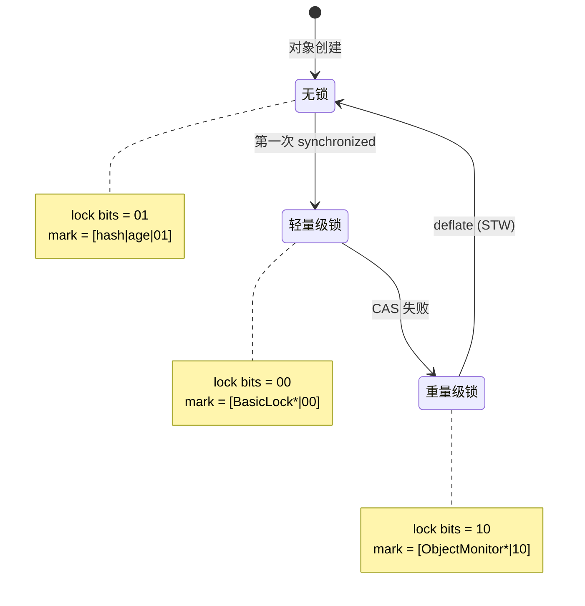

# 对象生命周期面试指南

> 基于 OpenJDK 11 源码深度分析
> 面试覆盖：对象头、内存布局、分配流程、TLAB、逃逸分析、引用类型、终结器

---

## 第 0 部分：核心原理 ⭐

### 0.1 本质是什么？

本文是 **对象生命周期面试指南** 的面试准备材料：提炼核心知识点，给出标准答案框架，帮助在面试中清晰、准确地表达 JVM 内部原理。

### 0.2 为什么需要？

面试中的 JVM 问题往往需要在 2-3 分钟内讲清楚复杂机制。没有提前整理，很容易在细节上迷失，无法展示对整体的把握。

### 0.3 怎么解决？

按「本质→为什么→怎么实现→关键细节」的结构组织答案，确保回答既有深度又有条理。

### 0.4 为什么这样设计？

面试答案的设计原则：先给结论，再给理由；先讲整体，再讲细节；用类比帮助面试官理解复杂概念。

---


## 0. 核心原理

### 0.1 本质是什么？

Java 对象生命周期是一个从创建到回收的完整过程，包含类加载、内存分配、初始化、使用、GC 标记、回收六个阶段，每个阶段都涉及 JVM 多个子系统的协作。

### 0.2 为什么需要深入理解？

**面试高频**：
- 对象内存布局（必问）
- 对象分配流程（TLAB、逃逸分析）
- 引用类型（强/软/弱/虚）
- 对象头与锁状态

**实战价值**：
- 排查内存泄漏
- 优化对象分配性能
- 理解 GC 行为

---

## 一、对象内存布局

### Q1：Java 对象的内存布局是什么样的？⭐

**一句话结论**：
Java 对象 = **markWord(8字节)** + **Klass 指针(4字节,压缩后)** + **实例数据** + **对齐填充**

**源码级回答**：

```
┌───────────────────────────── oopDesc ─────────────────────────────┐
│ markWord _mark (8 bytes)  │  Klass* _klass (4 bytes, compressed) │
├───────────────────────────────────────────────────────────────────┤
│                     实例字段数据 (instanceOop)                      │
│            按 long/double → int/float → short/char →              │
│            byte/boolean → oop 排列 (FieldsAllocationStyle=1)      │
├───────────────────────────────────────────────────────────────────┤
│                  对齐填充 (到 8 字节边界)                           │
└───────────────────────────────────────────────────────────────────┘
```

**markWord 64-bit 布局（无锁态）**：

```
┌──────────────────────────────────────────────────────────────────┐
│ unused:25 │ hashcode:31 │ cms:1 │ age:4 │ biased:1 │ lock:2      │
└──────────────────────────────────────────────────────────────────┘
```

**关键字段**：
- **lock bits (bit 0-1)**：锁状态标识（01=无锁，00=轻量级锁，10=重量级锁）
- **age bits (bit 4-7)**：对象年龄（GC 用，超过 MaxTenuringThreshold 晋升老年代）
- **hashcode (bit 8-38)**：延迟计算的哈希码

**sizeof 计算**：

```cpp
// 示例：SimpleObject { int x; }
// markWord (8) + Klass* (4) + int x (4) + padding (0) = 16 字节

// 示例：ObjectWithRef { String s; long l; }
// markWord (8) + Klass* (4) + padding (4) + long l (8) + String s (4) + padding (4) = 32 字节
```

---

## 二、对象分配流程

### Q2：new Object() 的完整流程是什么？⭐⭐

**一句话结论**：
**类加载检查 → TLAB 分配（线程私有小堆）→ Eden 分配（共享堆）→ 老年代分配（大对象）→ GC → 也没空间就 OOM**

**源码级回答**：

```
Java: new Object()
  → bytecode: new
    → InterpreterRuntime::_new()
      → Klass::allocate_instance()
        → 1. 检查是否可以栈上分配（逃逸分析）
          if (DoEscapeAnalysis && NoEscape) {
            对象字段拆分为栈变量 → 无堆分配
          }
        
        → 2. TLAB 分配（Thread Local Allocation Buffer）
          if (UseTLAB && thread->tlab().available(size)) {
            HeapWord* obj = thread->tlab().allocate(size);
            return obj;  // 快速路径！无锁
          }
        
        → 3. Eden 分配（共享堆）
          if (eden->allocate(size)) {
            return obj;  // CAS 或锁
          }
        
        → 4. 触发 Young GC
          if (GC) {
            eden->clear();
            // 重新尝试分配
          }
        
        → 5. 老年代分配（大对象）
          if (size > G1HeapRegionSize/2) {
            return old_gen->allocate(size);
          }
        
        → 6. Full GC + OOM
          if (still_no_space) {
            throw OutOfMemoryError;
          }
```

**TLAB 详解**：

```cpp
// Thread::_tlab
class ThreadLocalAllocBuffer {
  HeapWord* _start;     // TLAB 起始地址
  HeapWord* _top;       // 当前分配指针
  HeapWord* _end;       // TLAB 结束地址
  size_t    _desired_size;  // 期望大小（动态调整）
};

// 分配算法
HeapWord* allocate(size_t size) {
  HeapWord* obj = _top;
  if (obj + size <= _end) {
    _top = obj + size;  // 指针碰撞，无锁！
    return obj;
  }
  return NULL;  // TLAB 不够，回退到共享堆
}
```

**TLAB 调优参数**：
```bash
-XX:+UseTLAB                  # 开启 TLAB（默认开启）
-XX:TLABSize=256k             # 固定 TLAB 大小
-XX:+ResizeTLAB               # 动态调整 TLAB 大小（默认开启）
-XX:MinTLABSize=2k            # 最小 TLAB 大小
```

---

## 三、对象头与锁

### Q3：mark word 在不同锁状态下的布局？⭐⭐

**源码**：`src/hotspot/share/oops/markOop.hpp`

**四种状态布局**：

| 锁状态 | lock bits | mark word 内容 | 说明 |
|--------|----------|---------------|------|
| 无锁 | 01 | `[unused:25\|hash:31\|cms:1\|age:4\|0\|01]` | 原始状态 |
| 轻量级锁 | 00 | `[ptr_to_BasicLock:62\|00]` | 指向栈中锁记录 |
| 重量级锁 | 10 | `[ptr_to_ObjectMonitor:62\|10]` | 指向 monitor |
| GC 标记 | 11 | `[forwarding_ptr:62\|11]` | 转发指针 |

**锁升级流程**：



---

## 四、引用类型

### Q4：四种引用类型的区别？⭐⭐

**一句话结论**：
**强引用（永不清除）→ 软引用（内存不足清除）→ 弱引用（GC 就清除）→ 虚引用（仅用于跟踪回收）**

**源码实现**：

```cpp
// oop.hpp
class oopDesc {
  volatile markOop _mark;   // mark word
  union _metadata {
    Klass*      _klass;     // 普通指针
    narrowKlass _compressed_klass;  // 压缩指针
  };
};

// referenceType.hpp
enum ReferenceType {
  REF_NONE,       // 普通引用（强引用）
  REF_SOFT,       // SoftReference
  REF_WEAK,       // WeakReference
  REF_FINAL,      // FinalReference
  REF_PHANTOM     // PhantomReference
};
```

**回收时机对比**：

| 引用类型 | 回收时机 | 典型用途 |
|---------|---------|---------|
| **强引用** | 永不（除非不可达）| 普通对象 |
| **软引用** | 内存不足时 | 缓存（如图片缓存）|
| **弱引用** | 下次 GC 时 | ThreadLocal、WeakHashMap |
| **虚引用** | 回收后通知 | 跟踪对象回收、堆外内存管理 |

**WeakHashMap 示例**：

```java
WeakHashMap<Key, Value> map = new WeakHashMap<>();
map.put(key, value);

// key 只被 WeakHashMap 弱引用
// 当 key 无强引用时，下次 GC 自动清除 entry
```

---

## 五、逃逸分析与标量替换

### Q5：什么是逃逸分析？如何优化？⭐⭐⭐

**一句话结论**：
**逃逸分析**判断对象是否逃逸出方法/线程，如果 **NoEscape** 则可以**标量替换**（对象拆解为栈变量）、**栈上分配**、**锁消除**。

**源码**：`src/hotspot/share/opto/escape.cpp`

**逃逸状态**：

```cpp
enum EscapeState {
  NoEscape = 0,       // 不逃逸：只在方法内使用
  ArgEscape = 1,      // 参数逃逸：作为参数传递
  GlobalEscape = 2    // 全局逃逸：存储到静态字段或返回
};
```

**标量替换示例**：

```java
// 原始代码
class Point {
  int x, y;
}

Point p = new Point(1, 2);
int sum = p.x + p.y;

// 逃逸分析发现 p 不逃逸
// 标量替换后：
int x = 1;
int y = 2;
int sum = x + y;  // 无对象分配！
```

**JVM 参数**：

```bash
-XX:+DoEscapeAnalysis      # 开启逃逸分析（默认开启）
-XX:+EliminateAllocations  # 标量替换（默认开启）
-XX:+EliminateLocks        # 锁消除（默认开启）
-XX:+PrintEscapeAnalysis   # 打印逃逸分析结果
```

---

## 六、Finalizer 机制

### Q6：finalize() 方法的执行时机和问题？⭐

**一句话结论**：
`finalize()` 在对象被回收前由 **Finalizer 线程**调用，存在性能差、时序不可控、可能导致对象复活等问题，**不推荐使用**。

**源码流程**：

```
对象创建时
  → 如果重写了 finalize()
    → 注册到 java.lang.ref.Finalizer 队列

对象不可达时
  → GC 发现是 FinalReference
    → 加入 Finalizer 线程的 ReferenceQueue
    → Finalizer 线程执行 finalize()

finalize() 执行后
  → 从 Finalizer 队列移除
  → 下次 GC 才真正回收
```

**问题**：

1. **性能差**：Finalizer 线程优先级低，finalize() 可能延迟很久
2. **对象复活**：finalize() 中可以让对象重新被引用
3. **时序不可控**：不知道何时执行
4. **可能导致内存泄漏**：如果 finalize() 阻塞，对象无法回收

**替代方案**：

```java
// ❌ 不推荐
class Resource {
  @Override
  protected void finalize() throws Throwable {
    close();
  }
}

// ✅ 推荐：try-with-resources
class Resource implements AutoCloseable {
  @Override
  public void close() {
    // 释放资源
  }
}

try (Resource r = new Resource()) {
  // 使用资源
}  // 自动调用 close()
```

---

## 七、GDB 验证

### 验证对象内存布局

```bash
# GDB 脚本
cat > verify_object_layout.gdb << 'EOF'
set pagination off

# 创建 Java 对象
break java.lang.Object::<init>
commands
  printf "=== Object created ===\n"
  printf "Address: %p\n", $rdi
  printf "Mark: 0x%lx\n", *(uint64_t*)$rdi
  printf "Klass*: 0x%lx\n", *(uint32_t*)($rdi + 8)
  continue
end

run -cp /data/workspace/demo/src com.wjcoder.ObjectLayoutTest
EOF
```

### 验证 TLAB 分配

```bash
# GDB 脚本
cat > verify_tlab.gdb << 'EOF'
set pagination off

# 断点：TLAB 分配
break ThreadLocalAllocBuffer::allocate
commands
  printf "=== TLAB allocation ===\n"
  printf "_start: %p\n", $_start
  printf "_top: %p\n", $_top
  printf "_end: %p\n", $_end
  printf "Available: %ld bytes\n", $_end - $_top
  continue
end

run -cp /data/workspace/demo/src com.wjcoder.TLABTest
EOF
```

---

## 八、面试话术建议

### 如何展示对象模型功底？

> "我看过 HotSpot 的 oopDesc 实现。Java 对象在 JVM 中是一个 oop（ordinary object pointer），包含 mark word 和 klass 指针。mark word 是 8 字节，最低 2 bit 是锁状态，bit 4-7 是对象年龄，bit 8-38 是哈希码。klass 指针在开启压缩指针后是 4 字节，指向 InstanceKlass 元数据。"

> "对象分配优先走 TLAB，这是线程私有的小堆，指针碰撞分配，无锁，非常快。如果 TLAB 不够才走共享 Eden 区，这时候需要 CAS 或锁。逃逸分析后，不逃逸的对象可以做标量替换，直接拆解为栈变量，根本不分配在堆上。"

> "引用类型我看过 ReferenceProcessor 的实现。强引用就是普通 oop，软引用、弱引用、虚引用都是 Reference 的子类。软引用在内存不足时由 GC 清除，弱引用下次 GC 就清除，虚引用用于堆外内存管理，finalize() 已废弃，推荐 try-with-resources。"

---

## 九、总结

### 对象生命周期关键点

| 阶段 | 关键机制 | 面试重点 |
|------|---------|---------|
| 创建 | 类加载 → TLAB/Eden 分配 | 内存布局、TLAB |
| 使用 | 字段访问、方法调用 | 压缩指针、对象头 |
| GC 标记 | 可达性分析、引用类型 | 四种引用、finalize() |
| 回收 | 复制/标记-清除/整理 | 分代假说、晋升 |

### 性能优化启示

1. **对象分配**：TLAB、逃逸分析、标量替换
2. **内存布局**：压缩指针、字段重排序
3. **引用类型**：WeakHashMap、软引用缓存
4. **避免 finalize**：使用 try-with-resources
